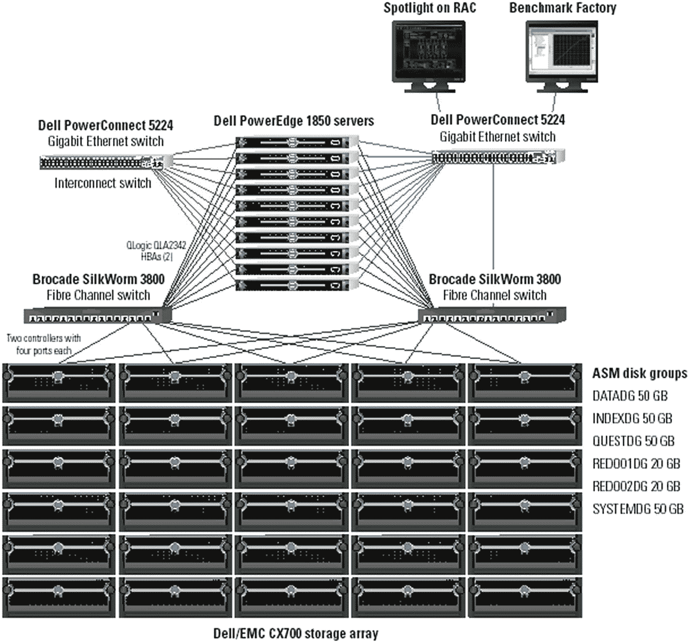
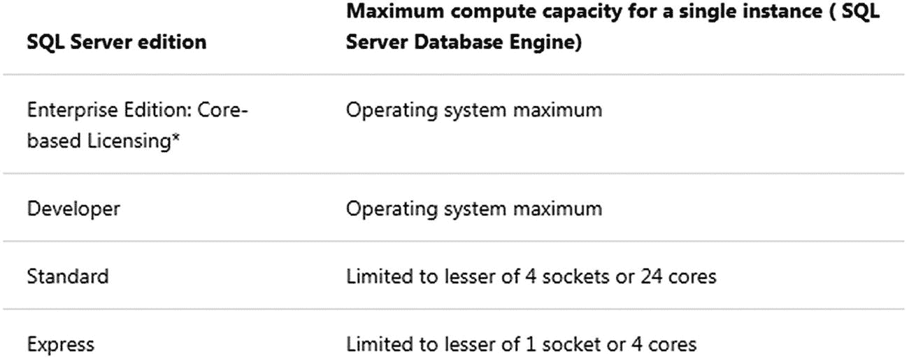
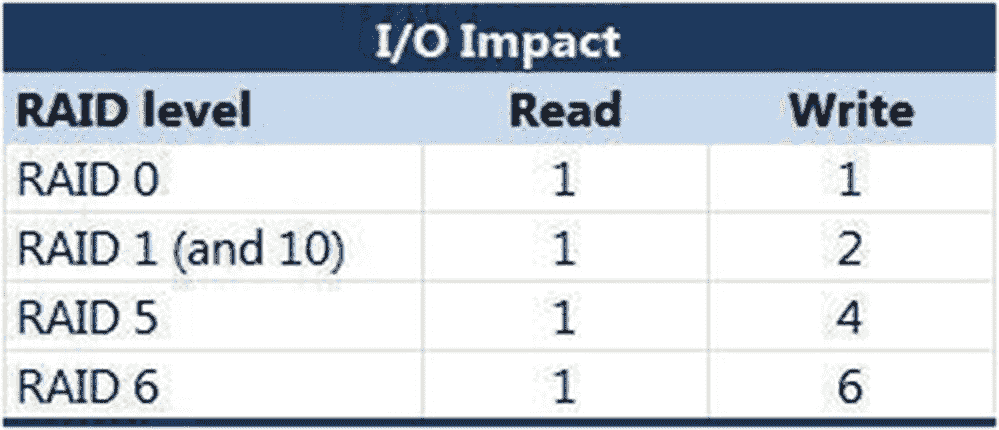
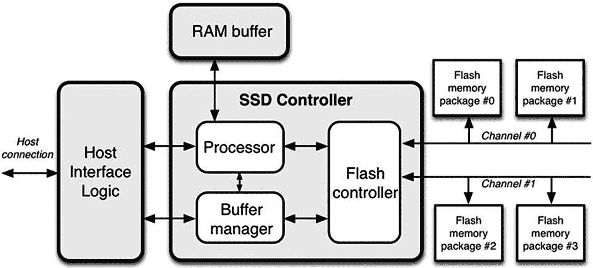

# 6. 基准测试硬件选项

## 概要

本章涵盖了在进行数据库基准测试时，你几乎必然会遇到的大多数常见意外和陷阱——即使你已经遵循了前面章节中所有推荐的准备工作。简而言之，基准测试过于复杂，任何人都无法识别出每一个可能影响测试工作及其结果的变量或问题。因此，准备好随时处理这些突发问题至关重要。本章最后详细介绍了在许多数据库基准测试项目中观察到的十大误解。

### #10：我们只需花几天时间就能基准测试所有我们感兴趣的内容

绝不可能。几乎无一例外，所有依赖组件的正确设置可能就需要一到两周——而在进行大规模基准测试时，有时数据加载和索引创建还能再增加一周时间。因此，请务必仔细规划完成这些工作所需的时间。因为即使你遵循了以上所有建议，途中也总会有意外发生。

## 绘制架构图

当使用本地硬件时，第一个且通常至关重要的步骤是，从上到下构建所有组件（包括所有网络和存储）的架构图。这样做有几个原因：

*   作为理解、规划和部署所有必要硬件的共同参考
*   为问题诊断和解决提供所有必要组件的完整路线图
*   应包含在描述基准测试工作的任何可交付成果或已发布的文档中

虽然所有三个原因都有价值，但用于问题诊断的路线图通常最为关键。这是因为，任何数据库应用程序所体验或感知到的性能，是由众多必需组件的协同努力共同决定的。这一点至关重要，因为数据库本身可能并不总是性能问题的根本原因。正如我在前面章节中提到的，有时一个配置错误的网络交换机、一个故障的网卡（NIC）或磁盘存储 LUN 配置，可能才是真正的罪魁祸首，只是让数据库看起来很慢。因此，拥有这些信息可能成就或破坏一次数据库基准测试工作。现在看一下图 6-1，这是我曾经测试过的一个 10 节点 Oracle 真正应用集群（RAC）。

图 6-1：十节点 Oracle RAC 集群

还记得心脏压力测试的类比吗？这里我们有运行在 Benchmark Factory“跑步机”上的 Oracle 数据库，连接到一个名为 Spotlight on RAC 的“心脏监护仪”。然而，无论此图看起来多么详细，它都缺少了实际的存储信息，如 RAID 级别、条带宽度和深度、每个 LUN 的磁盘数以及 SAN 或 NAS 控制器/缓存信息。因此，你可能需要几张图才能获得所有关键硬件组件及其配置的完整概览。在一个典型的项目中，通常需要三到五张图才能全面理解，这并不少见。

有时，负责执行数据库基准测试的团队会质疑这种图的必要性。他们的服务器都已经连接好并准备就绪了。测试的是数据库，如果真的出现问题，他们认为图真的没必要。我通常会反问：如果没有路线图、没有 GPS、没有智能手机，你能从纽约市开车到达达拉斯而不迷路或不比预期花更长时间吗？想象一下，数据库监视器报告了等待事件，例如非常高的延迟或 I/O 读写。许多数据库管理员会首先关注那些对这些等待负最大责任的 SQL 语句。但是，如果数据库设计合理、查询编写良好、执行计划也相当优化呢？你可能会花费时间试图从“石头里榨油”，假设数据库需要更改某个神奇的配置参数、在最大的表上添加新索引，或者试验 SQL 以识别更好的执行计划。有时这确实是正确的方法。但当你有意对整个系统施加压力时，任何一个组件的故障或失效也很可能就是罪魁祸首。你必须保持开放的心态和视野，认识到问题可能出在哪里，才能从该系统中获得尽可能高的数据库性能。

## CPU 与内存

通常，最初被认为最关键的系统组件是 CPU 和内存。对于 CPU，需要关注插槽数量、每个插槽的核心数以及是否支持超线程。然后是内存，有多少 RAM 可以分配给数据库？此外，这些 RAM 应该如何在可用的各种数据库内存分配之间分配？这些显然都是重要问题。但是，当你购买一辆汽车时，你不会把发动机马力和油箱大小作为两个最重要的问题。还有许多其他因素，比如网络延迟和最大 I/O 速率，很可能才是真正限制性能的因素。然而，专注于那些容易吹嘘或夸耀的东西是人的天性，比如系统有 64 个线程。不过，在数据库基准测试工作中，利用的 CPU 和内存资源少于服务器本身具备的资源，这种情况并不少见。

好了，既然我说了不要只关注 CPU 和内存，但有一个例外。某些数据库版本或版本可能会限制数据库实际可以使用的 CPU 和内存量。例如，Microsoft SQL Server 2017 的 CPU 限制如图 6-2 所示。

图 6-2：SQL Server CPU 限制

假设你正在一个具有双路插槽的服务器上测试标准版，每个 CPU 有 16 个核心加上超线程，总计 64 个线程。由于这远远超过了 24 个的限制，SQL Server 将仅利用总 CPU 容量的一部分。事实上，因为我们想确保 SQL Server 在任何给定时间都使用最高效的 CPU，我们可能需要禁用超线程，以便确定 SQL Server 所使用的 CPU 是全功能的、真正的物理核心。因此，在服务器 BIOS 中禁用超线程可能是可取的。具体情况会有所不同，因此最好对此进行测试，而不是直接将其视为事实。

## 旋转磁盘

在本节中，我们将讨论范围限定在传统的旋转磁介质磁盘。无论使用 SAS 还是 SATA 磁盘，此处包含的概念同样适用。

任何数据库的**阿喀琉斯之踵**都是 I/O。无论数据库使用多少个 CPU，它们在某个时刻都必须等待 I/O。事实上，随着 CPU 每插槽核心数和超线程技术的提高，如今 CPU 的处理能力很容易超过磁盘的读写速度。此外，像 `TPC-H`（可能还有 `TPC-DS`）这样的数据库基准测试，其性能通常受限于磁盘主轴的数量。再者，诸如磁盘阵列的控制器数量、磁头数量、缓存大小以及某些固件设置等因素，都会影响所能达到的整体 I/O 带宽。而 RAID 配置对于数据库而言可能至关重要。让我们深入探讨这些方面。

我们假设您正在一个非共享或专用的 NAS 或 SAN 上进行基准测试，这样您可以要求进行与基准测试工作相关的更改。一个常被忽视的方面是固件的预读算法选择以及读/写缓存大小的配置。我曾遇到过一个 `TPC-H` 基准测试项目，用户对我们达成的性能结果不满意。当时我们尚未深入到这种级别的优化细节。后来我们更改了固件设置，看到了完成项目所需的性能提升。有时，小细节确实很重要。

我在基准测试中遇到的另一个令人沮丧的领域（在生产环境中也是非常糟糕的做法）是，数据库过度使用 `RAID 5` 或 `RAID 6`。我理解每个人都想做 RAID，而且我们都认为越大越好（这里的“越大”意味着总的可用空间越多）。但我总是向人们强调，为了获得最佳的数据库性能（无论是基准测试还是生产环境），最好的级别是 `RAID-10`（有时称为 `RAID-1+0`），无论损失多少空间。空间足够快比拥有大量缓慢的空间要好。然而，我总是发现自己需要提醒人们注意图 6-3 所展示的 RAID 开销。

图 6-3
不同 RAID 级别的 I/O 影响

`RAID-10` 的写入次数可能是两次，但那是两次同时将相同数据写入两个不同磁盘的操作，通常任意一次相同的并发 I/O 完成就表示成功。现在看看 `RAID-5` 和 `RAID-6`，其值分别为 4 和 6。这些写入操作涉及的都是不同的数据。有些是实际数据的切片，有些是奇偶校验字节。关键点在于需要完成的总 I/O 操作多得多，而且必须全部完成后，I/O 操作才会报告成功。实际性能下降并非真的是 2 倍或 3 倍，但非常明显。因此，在所有数据库基准测试项目（以及生产环境）中都应避免使用 `RAID-5`。

现在，我们来谈谈数据库基准测试中最常被忽视的 I/O 考虑因素之一：条带宽度和深度（或大小）。假设您的数据库块或页大小为 4K。再假设您的存储管理员为您创建了一个由 8 个磁盘组成的 `RAID-10` LUN，因此每个数据副本有 4 个磁盘。那么条带宽度就是 4。一个可能的理想条带深度可以这样计算：`N * 块或页大小`，其中 `N >=1`。这被称为**粗粒度条带化**，旨在通过将许多并发的 I/O 请求分散到更多磁盘上来最大化总体 I/O 吞吐量。这对于高并发 OLTP 系统以及数据仓库被认为是可取的。有时人们（错误地）选择**细粒度条带化**，他们希望每个单一的 I/O 请求都跨越所有磁盘。他们将条带深度计算为 `块或页大小 / 条带宽度`。虽然这种选择可能使单个 I/O 更快，但它也会使处理大量并发 I/O 操作变慢，因为它们需要排队。请记住，大多数数据库需要处理大量的并发 I/O，因此选择这个选项可能会导致非常不理想的性能。选择它时，请确保您有充分的理由。

## 新存储技术

过去十年，存储领域发生了三大积极变化：价格更便宜，磁盘容量变得非常大（12TB/盘），并且出现了比传统旋转介质磁盘快得多的新存储技术。让我们探讨一些更常见的新技术。

第一个突破是固态硬盘或 `SSD`。它们本质上是 NAND 芯片，封装了处理器和控制器，提供的存储在外观和感觉上都与传统磁盘非常相似，但运行速度要快得多。图 6-4 展示了一个架构示例。

图 6-4
固态硬盘的架构

然而，`SSD` 有一个主要缺点：它们使用旧的 `AHCI` 和 `SAS/SATA` 协议来访问 NAND 芯片。这些协议是为旋转介质编写和优化的。因此，它们包含了针对内磁道与外磁道以及其他许多不再需要的逻辑。此外，即使 NAND 芯片可以快速处理数据，这些协议也存在内置的瓶颈，受制于 `SAS/SATA` 的 600 MB/s 和 1200 MB/s 数据传输限制。尽管如此，`SSD` 仍开启了一个更快 I/O 的时代。

第二代基于闪存的技术基本上是将 `SSD` 磁盘技术做到一张卡上，插入快速的 `PCIe` 总线，这将数据传输速率大幅提升至 2000 到 8000 MB/s。这些卡可以放置在数据库服务器上，在某些情况下也可以放置在 `SAN` 或 `NAS` 存储阵列上。事实上，很快出现了一种全新的存储解决方案，称为**全闪存阵列**。

第三代基于闪存的技术是用非易失性内存快速通道（`NVMe`）取代旧的 `AHCI` 和 `SAS/SATA` 协议。这个新协议是从零开始编写的，专为处理闪存而设计，没有遗留旋转磁盘的包袱。因此，`NVMe` 提供高达 32000 MB/s 的数据传输速率。这比第一代 `SSD` 快了 53 倍以上。

此外，还有一些令人兴奋的新技术即将成为主流，例如傲腾（Optane），它提供了接近 RAM 内存的速度，同时具有 `SSD` 般的容量。

那么，这些新技术如何影响数据库基准测试呢？简单明了的答案是，您可以将数据库放在 `SSD` 或 `NVMe` 闪存上以获得更好的结果。如果您的数据库对于基于闪存的存储来说太大，您仍然可以将 `TEMP`、`ROLLBACK`、`LOGGING` 等区域放在这些设备上，以加速许多内部数据库操作。我见过一些数据仓库基准测试，我们有 30TB 的数据，无法全部放在闪存上，但仅仅将其用于排序和分组的临时区域，就带来了显著的性能提升。同样，在 OLTP 基准测试中，仅将闪存用于日志记录和回滚活动，结果也相当惊人。关键在于，即使不能把所有东西都放在闪存上，通过选择合适的、有限的项目放在闪存上，也能带来益处。

## 专用设备

最后一个你可能需要为其进行基准测试的领域是专用数据库或 I/O 设备。这些设备在主流云技术兴起之前相当流行。本质上，这些设备只是硬件厂商构建的超融合计算机系统，旨在通过优化组件选择和整体系统配置来提升数据库性能。以下是一些示例：

*   `Oracle Exadata`
*   `Oracle Database Appliance (ODA)`
*   `Dell Fusion IO`
*   `HP StorageWorks IO Accelerator`
*   各种超融合系统解决方案

如果你遇到其中任何一种需要进行数据库基准测试的专用环境，我的建议是聘请熟悉此类系统的顾问。例如，`Oracle Exadata`非常复杂。我管理过一个`Exadata`系统四年。我学到了许多利用`Exadata`独特功能来优化数据库基准测试结果的新方法。没有一本书能涵盖如此丰富的详细信息。你显然需要一些帮助。

