# 7. 基准测试软件选项

上一章涵盖了一些在执行数据库基准测试项目时需要审查和考虑更换的重要硬件选项。尽管过去十年的硬件进步令人惊叹（例如，我刚组装了一台新的桌面`PC`，其`CPU`提供了`16`个逻辑核心或线程），但我们不能也不应总是自动地寻求硬件来解决性能问题。实际上，大多数基准测试工作可以通过利用适当的新数据库功能来获得最大的性能分数提升。数据库厂商同样做出了重大改进，通常是为了利用许多新的硬件技术。本章将重点讨论需要考虑的常规数据库功能，以及利用这些新技术的新功能。

在考虑这些新数据库功能时，你需要将两个想法放在首位。首先，基准测试规范是否允许使用这些强大的新数据库功能，或者至少没有明确说明不能使用？其次，你的数据库厂商是否需要为这些酷炫的新功能支付额外的许可费用？例如，一些数据库厂商对`多租户`、`分区`、`高级压缩`和`内存中`等功能收取额外费用，而其他厂商则不收。事实上，一家主要厂商从其最新版本开始，所有版本都提供所有功能，只是根据版本限制了最大`CPU`和内存。*我个人希望其他人也能效仿这个好榜样。*

### 注意

虽然本章可能重点举例某个特定数据库厂商，但贯穿本章展示的主要原则和概念将保持不变。因此，请不要过于关注提到的任何特定数据库或厂商。

## 绘制图表

在处理任何数据库应用程序软件时，尤其是在进行数据库基准测试项目时，首要且通常是关键的一步是构建所有主要持久化对象的数据库结构图 (`DSD`)。请注意，我故意没有说实体关系图 (`ERD`) 或数据模型，因为许多 `DBA` 既不喜欢也不使用它们。所以我希望这样引用可以避免任何反对意见。当在这个图表问题上受到质疑时，我会问那些反对的 `DBA`，如果他们在为孩子组装一辆新自行车，而说明书里一张图片都没有，他们会作何感想？我坚信，为了排查数据库性能问题，你必须有一张图表，因为你可能并未参与最初的数据库设计，或者它实在太大了，无法在脑海中想象出来。

回到数据库基准测试，大多数规范都包含这样的结构图，如 `TPC-H` 基准测试的 `图 [7-1]` 所示。请注意，此图显然不是 `ERD`，因为它没有使用任何标准的数据建模符号。充其量，这是一个纯粹的物理模型，应该更容易被大多数 `DBA` 所接受。但从这个图中我们可以看出表的名称、它们包含的列、它们是如何连接的，以及基于比例因子的一些大小估计。但缺少一些关键项目，例如列的数据类型和哪些列被索引。因此，供你考虑的一个建议是，一旦你的基准测试工具创建了对象，就使用数据建模工具对数据库设计进行逆向工程。这样你就能获得所有额外的关键信息，并且可以根据你的喜好来组织图表布局。

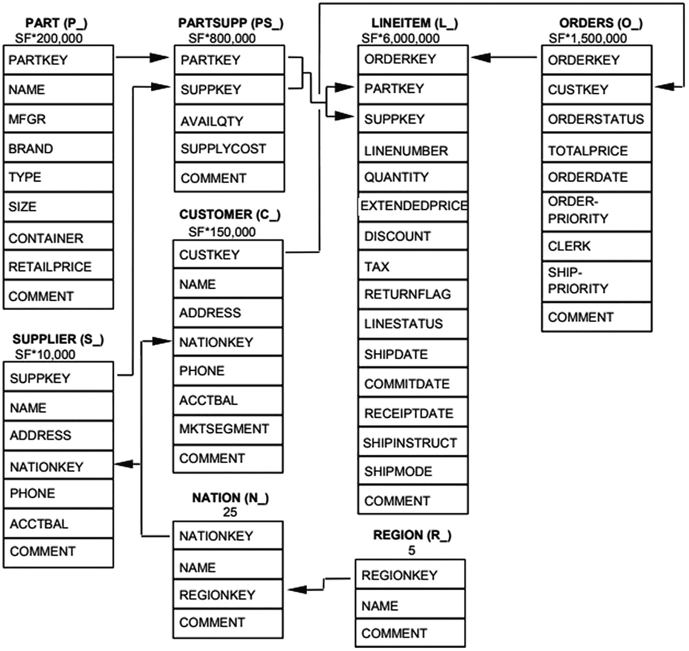

`图 7-1` `TPC-H` 基准测试的完整模式

不要因为这个简单的示例图而放松警惕；旧的数据库基准测试过于简单。然而，新的数据库基准测试则复杂得多，也更贴近现实。例如，`TPC-DS` 使用了一个星型模式设计，包含七个不同的星（即主题领域）。`图 [7-2]` 仅显示了 `TPC-DS` 中关于商店销售的星型模式。在整个数据库设计中还有另外六个同样复杂的星。请注意，`图 [7-2]` 和其他六个主题领域仅列出了表名并显示了基本关系，没有说明是哪些列相关。因此，我再次强烈建议你，一旦基准测试工具创建了对象，就使用数据建模工具对数据库设计进行逆向工程。

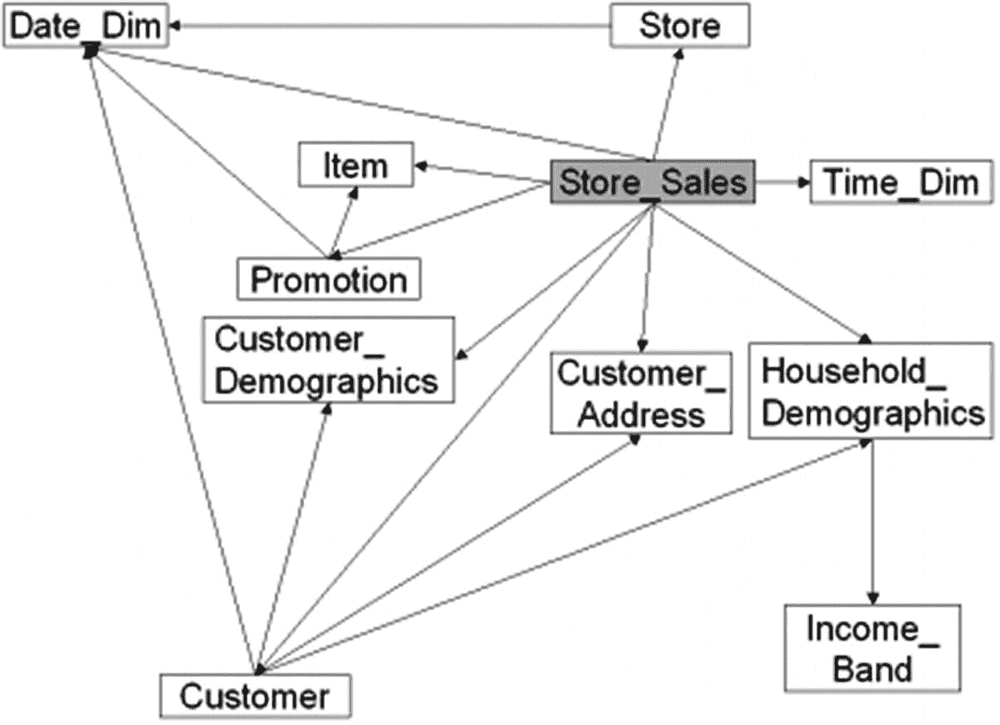

`图 7-2` `TPC-DS` 基准测试的销售星型模式

但在我看来，最复杂的数据库设计是 `图 [7-3]` 所示的 `TPC-DS` 基准测试的设计。你几乎无法看清表或列的名称。但你可以看到有 `34` 个表，它们之间有着非常复杂的相互关系。在这方面，`TPC-DS` 数据库设计非常类似于你可能为某些内部数据库应用程序开发的现实世界数据库设计。想象一下，看一个长达 `30` 行、引用了 `7` 个表的 `TPC-DS` 查询。没有图表，你如何理解它试图完成什么，更不用说这些表之间实际是如何关联的，以及应该如何连接了。此外，在没有这些知识的情况下，你如何建议新的索引或优化器提示？为了对 `图 [7-3]` 进行逆向工程，我使用了 `Quest Software` 的 `Toad Data Modeler`。但任何提供逆向工程功能的好数据建模工具都应该足够。事实上，大多数工具都提供免费版本，可用于有限数量的对象（例如 `25` 或 `50` 个），因此你甚至不需要购买工具来构建这些图表。

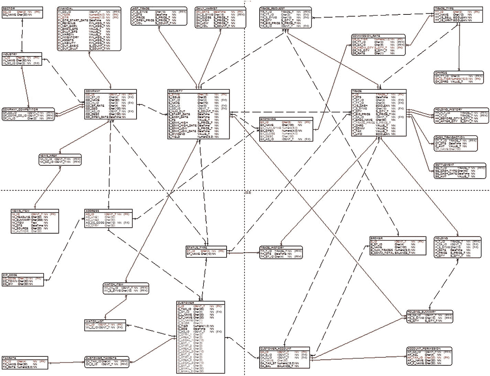

`图 7-3` 复杂的 `TPC-DS` 基准测试模式

### 注意

从此处开始引用的功能在你的数据库厂商的产品中可能可用，也可能不可用，并且它可能是一个额外收费的项目。因此，在使用这些想法之前，请确保你已获得适当的许可。


## 对大型对象进行分区

对于非常大的表和索引——通常数据仓库和超大规模 OLTP 基准测试需要它们——数据库提供的将对象分区或拆分到单独“桶”中的选项是一种极其有用的技术。这些桶看起来和行为上都像一个逻辑上的大桶。其思想是查询可以通过一个称为**分区消除**的过程更快地找到行。想象一个名为 `ORDERS` 的非常大的表，其数据按年份分区到桶中，如图`7-4`所示。假设我们查询 `ORDERS` 表，请求当前年份和前一年中任何超过 500 美元的订单的平均订单大小。因此数据库优化器知道它只需扫描 2017 和 2018 桶的索引，而可以跳过或消除 2015 和 2016 年的索引扫描。

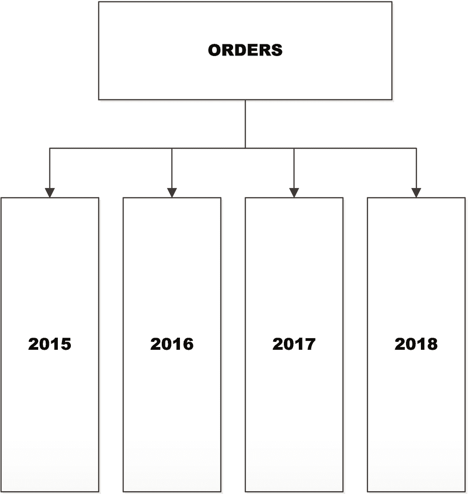
图 7-4：按年份分区的 `ORDERS` 表

对于足够大的对象，分区消除可以极大提高查询性能。然而，当用于较小的表时，净收益可能微不足道，甚至对查询来说效率更低。因此，您应该谨慎地仅在合适的时候使用此功能。历史上，我分区表时，每个桶包含数千万到数亿行。不要将这些数字视为硬性建议，而应将其作为一个示例，让您了解按当今标准“非常大”究竟意味着什么。还要注意，您也可以进行**子分区**。假设我们是亚马逊（Amazon），每年有数十亿个订单。那么一个年份的桶仍然会相当大。在这种情况下，您可以对分区再进行分区：这称为子分区。因此，在本例中，我们可能进一步按月对每一年进行分区。现在优化器可以在子分区级别进行进一步的消除。但请注意，在我们的例子中，对于当前年份和前一年中任何超过 500 美元的订单，优化器无法消除任何子分区，因此它实际上必须处理 12 个较小的索引扫描，而不是一个大的扫描。这可能更慢，所以再次强调，要明智选择。

为了演示分区能提供什么样的性能提升，现在请看图`7-5`。该图显示了针对一个 300GB 数据库运行 22 个 TPC-H 查询所需的时间，对比了非分区实现与分区实现（其中 `ORDERS` 和 `LINEITEM` 表已分区）。具体的分区方案没有详细说明，因为关于最佳方式确实没有一个普遍的答案。您应该根据许多因素进行分区，包括存储子系统的带宽和能力。还要注意，这种仅为 22 个查询的总运行时间评分的简单方法并不是对 TPC-H 基准测试进行评分的正确方式，但对于此目的来说，它是合理且足够的。对于我的数据库服务器、数据库版本和配置，性能提升了`35.93%`。您的结果可能会有所不同。

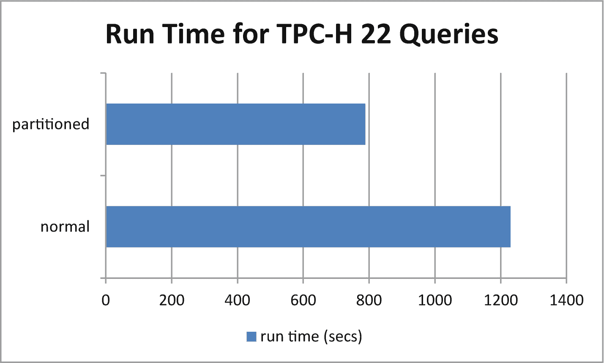
图 7-5：分区带来的 TPC-H 改进

## 高级数据压缩

尽管过去几年磁盘空间的每 GB 成本已大幅下降，但数据压缩仍能从某些方面使数据库性能受益。借助能够大幅缩减数据的高级数据压缩，压缩和解压缩数据的成本可以被读写更少数据所带来的收益所抵消。此外，数据在数据库的数据缓存中占用的空间更小，因此缓存本质上表现得如同更大（即，拥有更多内存）。另外，如果您的存储是通过 Infiniband、以太网或光纤通道传输数据的 SAN 或 NAS，那么需要传输的数据量也会减少。所有这些优势有时可以累积成显著的性能提升。但与分区一样，您需要明智地选择何时使用压缩（特别是如果它还需要额外成本的话）。

为了演示压缩能带来什么样的改进，现在请看图`7-6`。该图显示了针对一个 300GB 数据库运行 22 个 TPC-H 查询所需的时间，对比了非压缩实现与压缩实现（其中 `ORDERS` 和 `LINEITEM` 表已压缩）。请注意，不同的数据库提供差异很大的不同压缩选项。但压缩选项通常分为三大类：

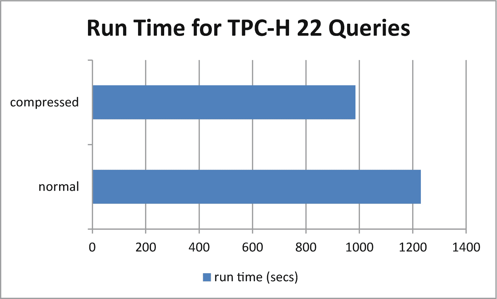
图 7-6：压缩带来的 TPC-H 改进

*   未压缩 vs. 压缩（简单的二进制选项）
*   页级压缩 vs. 行级压缩
*   多级压缩层次：
    *   基础表压缩
    *   高级行压缩
    *   混合列式压缩 - 低
    *   混合列式压缩 - 高

请记住，这种仅为 22 个查询的总运行时间评分的简单方法并不是对 TPC-H 基准测试进行评分的正确方式，但对于此目的来说，它是合理且足够的。对于我的数据库服务器、数据库版本和配置，性能提升了`19.92%`。如前所述，与分区一样，您的压缩效果也会有所不同。

现在，并非本章介绍的每一个高级数据库功能都能轻易组合以获得累积的正面收益；然而，根据您的数据库平台，分区和压缩通常可以结合使用。此外，我们必须现实地看待我们的性能改进期望。图`7-7`显示了结合分区和压缩的净效果；性能提升了`46.04%`。请注意，性能提升并不像我们预期的那样具有累积性。虽然我们本可以预期 36% + 20% 总共 56%，但我们只得到了 46%。原因很简单。同时实现多个功能带来的好处通常不会导致纯粹的加性改进，因为不同技术之间的复杂交互往往会相互扭曲。而且，可实现的改进是有限的。正如俗话所说，“你无法从芜菁中榨出血来”。

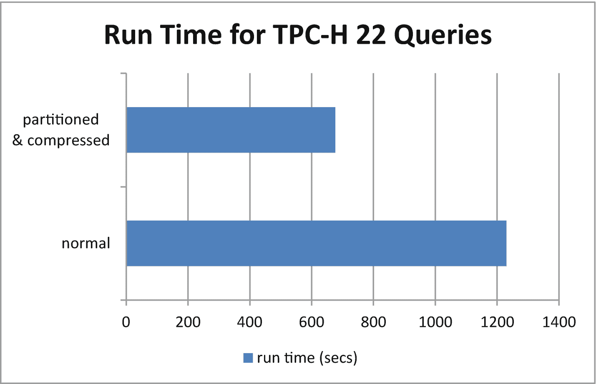
图 7-7：分区与压缩共同带来的 TPC-H 改进


## 使用 SSD 扩展内存

一些数据库供应商提供了一项有趣且独特的功能，允许数据库管理员将闪存盘或 SSD 挂载为数据库 RAM 数据缓存的扩展。当然，闪存盘或 SSD 的运行速度比标准 RAM 内存慢，但基本上整个闪存盘或 SSD 就成了数据库 RAM 数据缓存的二级内存。这项功能非常吸引人有两个原因。首先，它是免费的（没有额外成本）。其次，它实施起来快速简便。Oracle 将此功能称为 `Database Smart Flash Cache`（不要与 Oracle Exadata 的 Smart Flash Cache 混淆）。Microsoft SQL Server 有一个类似的功能，称为 `Buffer Pool Extensions`。它们本质上做的都是完全相同的事情。

为了演示通过闪存盘或 SSD 扩展内存能提供怎样的性能示例，请看图 7-8。该图显示了在 RAM-only 数据库数据缓存设置下，与通过 64GB SSD 盘扩展 RAM 相比，针对一个 300GB 数据库运行 22 个 TPC-H 查询所需的时间。对于我的数据库服务器、数据库版本和配置，性能提升仅为 10.33%。你可能会疑惑为什么这个功能表现没有更好。有几个合理的原因。首先，TPC-H 倾向于对非常大的行数据集合应用聚合函数。因此缓存往往不堪重负。其次，可能存在一个临界点，超过该点后向缓存中添加较慢的闪存盘或 SSD 会适得其反。扫描混合速度技术来匹配缓存块或页面可能造成的损害大于改进。实际上，我使用较小的闪存盘（16GB）得到了更好的结果。但我不能断言总是使用较小的容量就是最好的；在我的测试环境下恰好如此。我还使用 PCIe NVME 闪存盘得到了更好的结果，但这仍然不足以让我断然否定使用 SSD 盘进行缓存扩展。但常识合理地表明，在相同容量下，基于上一章强调的关键原因，PCIe NVMe 闪存盘应该始终是用于此目的的最佳 SSD 盘。

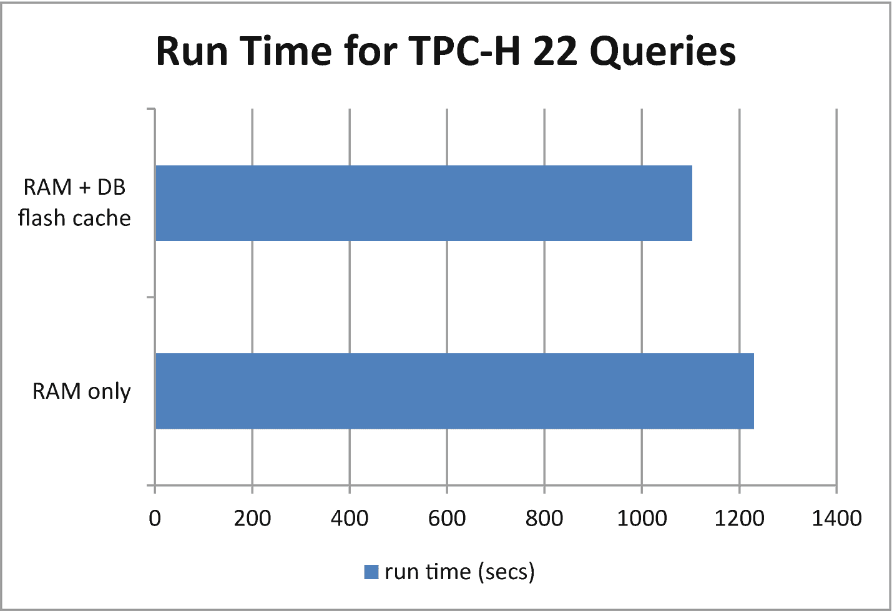

**图 7-8**
SSD 扩展带来的 TPC-H 性能提升

## 在内存中固定表

一些数据库提供了机制来建议甚至强制某些表和索引应固定在内存中，或者以极其缓慢的速度老化淘汰，从而有效地看起来像是被固定。你可能会使用如下语法或命令：

```
CREATE or ALTER TABLE ... CACHE
ALTER object_name PIN | KEEP
EXECUTE function PINTABLE | KEEP
```

另一种方法是允许数据库数据缓存被划分为具有不同老化特性的区域，例如 `KEEP` 和 `RECYCLE`。然后，你只需创建或更改对象以指定应用哪个不同的缓存区域，从而应用不同的老化特性。需要记住的关键点是，这些都不是将表或索引锁定在内存中的真正方法（这是本章后面讨论的另一个功能）。

为了演示在内存中固定对象能提供怎样的性能示例，请看图 7-9。该图显示了在未固定设置下，与将较小的查找表和所有索引固定后的设置相比，针对一个 300GB 数据库运行 22 个 TPC-H 查询所需的时间。对于我的数据库服务器、数据库版本和配置，性能提升仅为 16.02%。你可能再次期望更大的提升，因为固定在内存中应该非常快。但有几个原因可以解释这个结果。首先，数据库实际上只是尝试将对象固定在内存中或使其老化淘汰得更慢。因此，这不是真正的内存解决方案。其次，TPC-H 倾向于对非常大的行数据集合应用聚合函数。因此，无论你如何努力控制，缓存往往都会不堪重负。第三，即使对于只有八张表（及其索引）的模式，选择合适的对象和应用的老化特性也很困难。

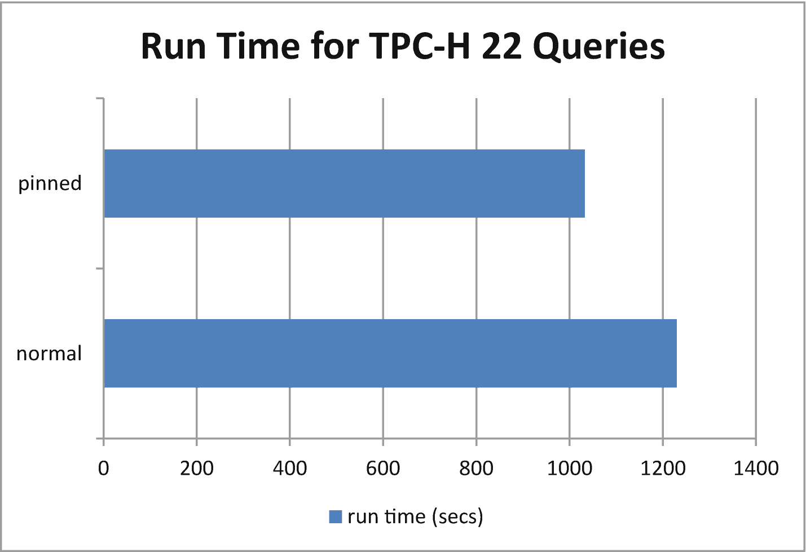

**图 7-9**
固定对象带来的 TPC-H 性能提升

## 列存存储与行存存储

传统的关系型数据库，如 `Oracle` 和 `SQL Server`，基于关系代数和关系演算，并且遵守任何关系型数据库都应遵循的 `Codd 的 12 条规则`。其中的关键是数据以元组或行的形式表示和存储。对于许多传统的商业应用程序（如 OLTP）来说，这种范式运作良好。然而，随着数据仓库等新型商业数据库应用需求的出现，关系模型未能如预期那样良好地扩展。因此，列式数据库应运而生，例如 `Vertica`、`Sybase IQ`、`Teradata`、`Greenplum` 等许多其他产品。这些新的列式数据库处理超大型数据库，提供三大优势：

1.  所需空间更少（并且数据压缩效果更好）
2.  从非常大到极大的规模扩展性好得多
3.  报表查询运行速度快得多，且 IO 操作大幅减少

随着关系型数据库多年来开始添加非关系类型的功能，例如多值列和嵌套表（根据 `Codd 的 12 条规则`，这两者都是主要的不合规项），关系型数据库供应商自然希望整合并受益于列式方法。其中一些供应商只是简单地添加了列存存储选项，而另一些则将内存技术（下一节）与列存存储相结合。图 7-10 突出了表以行存储与以列存储之间的主要区别。请注意，尽管这是两种截然不同的方法，但用于处理它们的 `SQL` 语言并未改变。数据库优化器和引擎在处理列式数据时，可以在内部更快地执行某些查询操作。一个常见的例子是在对一个非常大的表中的列执行 `group` 函数时。

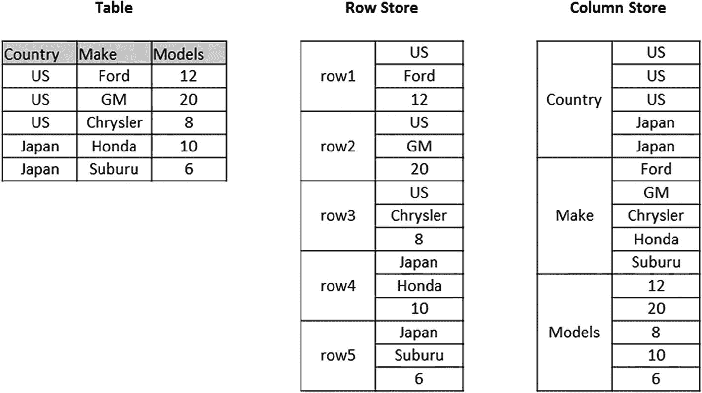

**图 7-10**
行存储磁盘布局 vs. 列存储

为了演示列式方法能提供怎样的性能示例，请看图 7-11。该图显示了将一个 300GB 数据库保存为行存格式与列存格式时，运行 22 个 TPC-H 查询所需的时间。对于我的数据库服务器、数据库版本和配置，性能提升达到了惊人的 67.48%！考虑到一些 TPC-H 查询执行的操作并不最受益于列存格式，这个结果已经相当不错了。数据库所需的磁盘空间也减少了约 60%（未指定额外的高级压缩选项）。

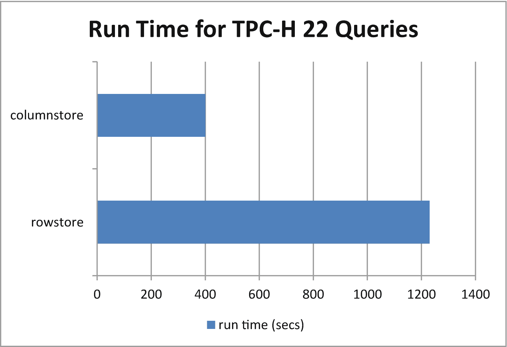

**图 7-11**
行存格式带来的 TPC-H 性能提升

## 新的“内存中”表

多个主要关系型数据库供应商已采用的一项热门新技术是内存表。与之前关于固定表的部分更多是一种请求不同，这些新的内存表是真正的 **100% 内存中**。当然，除了数据库通常分配的所有其他内存外，你还需要具有足够 RAM 内存的数据库服务器来容纳这些表。一般来说，你无法将整个数据库放入内存，因此需要有选择地挑选那些预期能带来最大回报的表。此外，一些数据库供应商（如 Oracle）将内存中和列存储结合为一个单一功能。对于这些数据库，只有内存表是列存储的，其余部分仍然是磁盘上的行存储。图 7-12 展示了 Oracle 内存管理的复杂性。

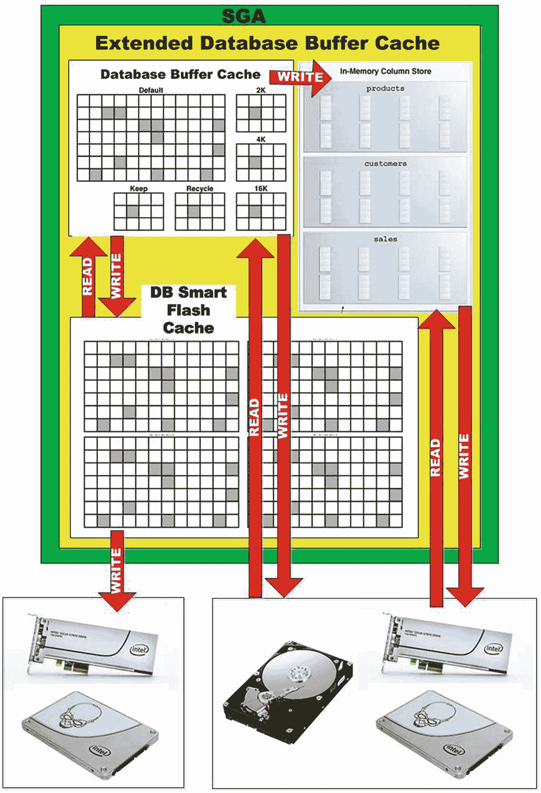

**图 7-12**
Oracle 的内存列存架构

如你在图 7-12 中所见，本章的许多其他功能都发挥了作用。对于 DBA 来说，了解 Oracle 如何工作的工作变得更加困难了。我想这就是为什么他们据说能赚大钱吧。

为了演示内存表能提供怎样的性能示例，现在请看图 7-13。该图显示了针对一个保存为行存储与列存储的 300GB 数据库运行 22 个 TPC-H 查询所需的时间。对于我的数据库服务器、数据库版本和配置，整体性能提升达到了惊人的 **90.89%**！然后，当我同时为内存表添加高级压缩后，运行时间相同，但所需的内存空间几乎减少了 75%！因此，即使我的数据库服务器只有 256GB 内存，该表也只需要 75GB 内存。所以我的数据库仍然有足够的内存用于正常的数据库分配和消耗。事实上，如果服务器只需处理此工作负载，那么使用内存更少的服务器也是可行的。你注意到这个转折点了吗？将表置于内存中，在某些情况下反而可能减少对内存的需求！

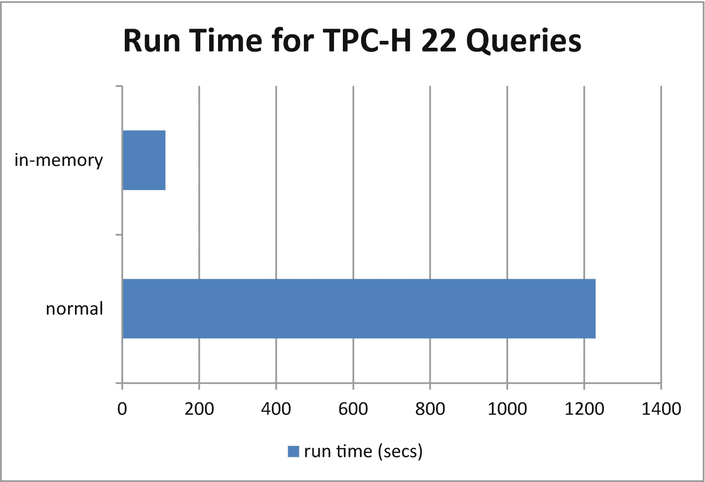

**图 7-13**
内存表带来的 TPC-H 性能提升

