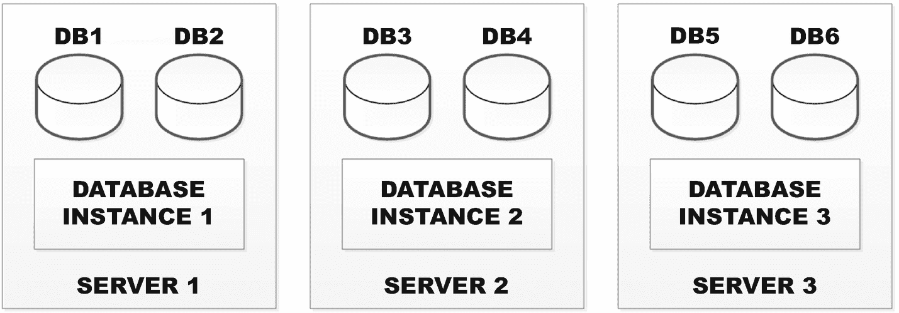
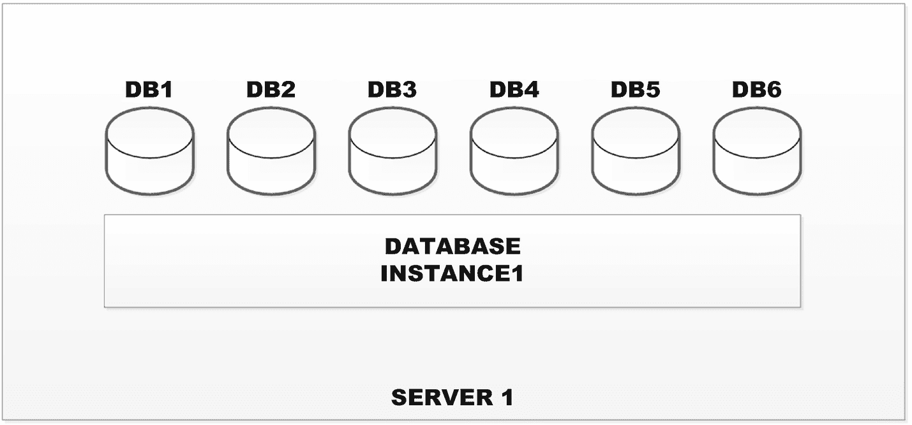
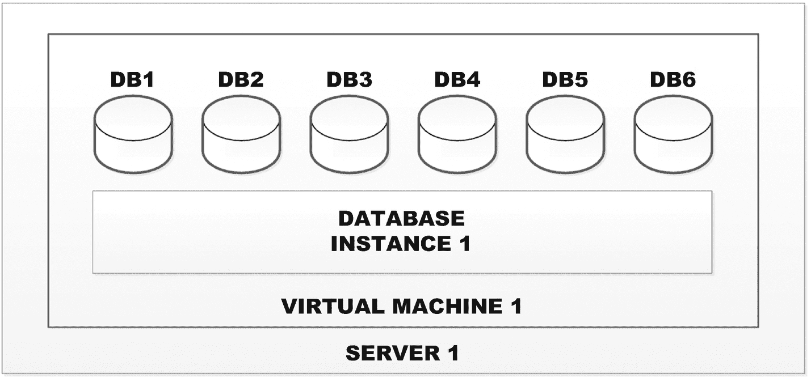
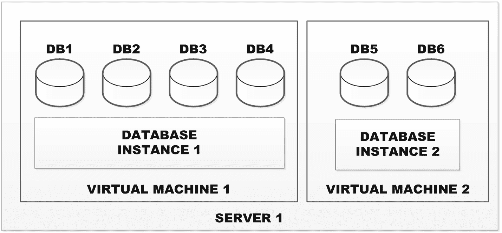
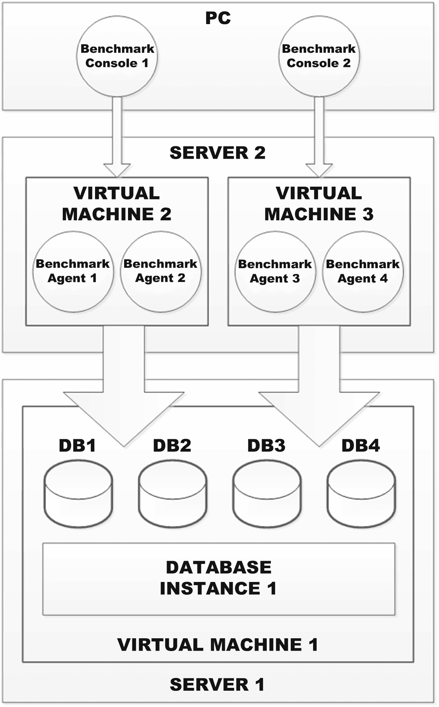
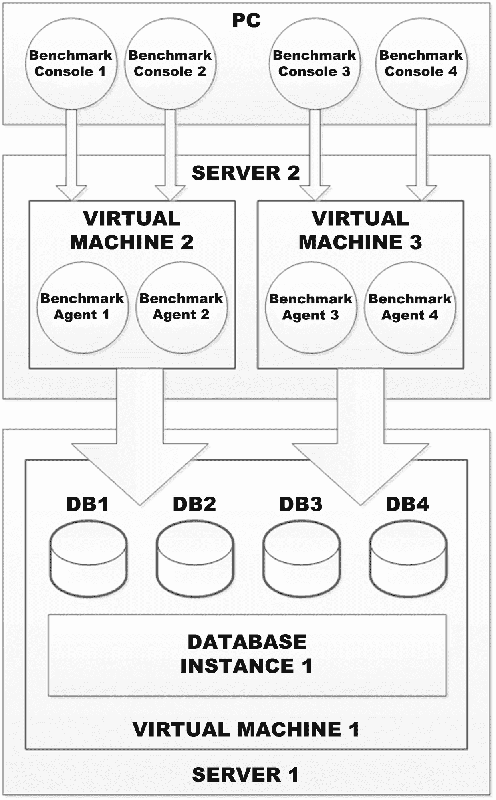
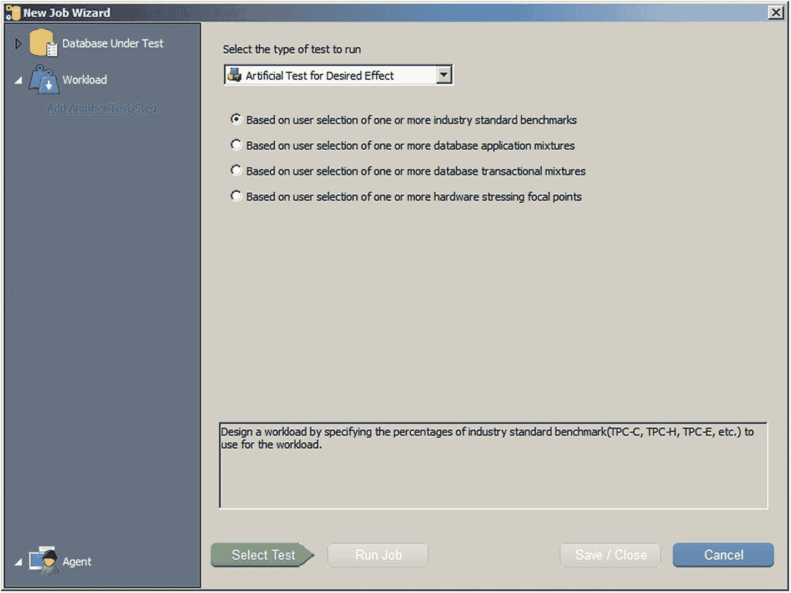
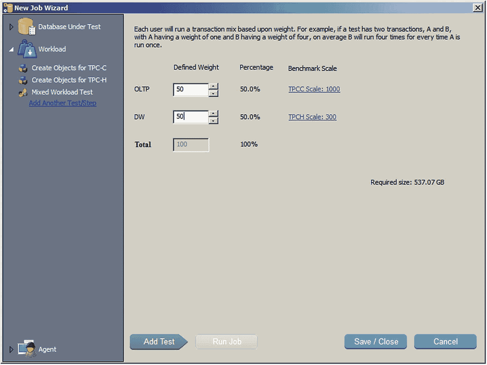
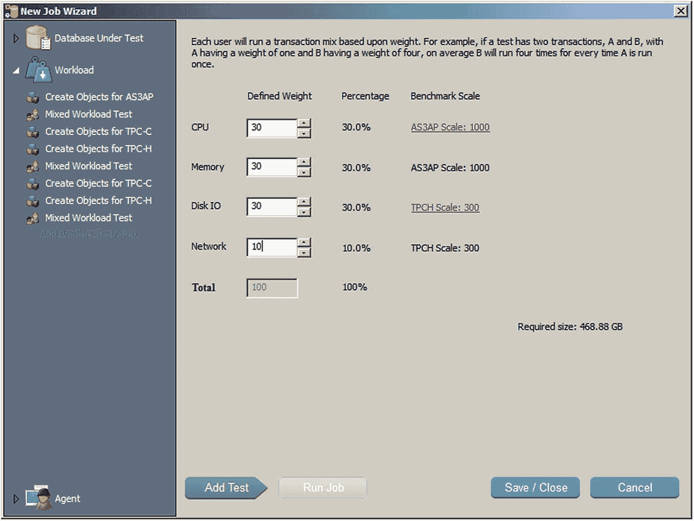

# 8. 整合基准测试

在本章中，我们将回顾当你为了整合数据库实例而测试场景时的基准测试注意事项。数据库整合发生在你试图减少数据库许可证总数以降低成本时。随着数据库许可证成本的上升，以及业务部门将数据库视为仅仅是应用程序所需的、现成的构建块对象，你的管理层可能需要进行整合工作。此外，如今的服务器非常强大，拥有多核 CPU 和大量廉价内存，我们不再需要刻意采用传统“孤岛”方式（每个服务器一个数据库）来隔离数据库。DBA 现在可以实际考虑将来自多个数据库实例的所有数据共同定位到单个数据库实例下。有时，此类工作可能与主要的数据库版本升级或许可“合规调整”工作同时进行。但有一点是肯定的，由于过去 20 年发生的“数据库蔓延”，我们拥有的数据库实例数量比任何人合理想象的都要多。因此，数据库整合工作可能比你想象的更常见。

我也见过管理层试图减少他们需要应对的数据库供应商数量的整合努力。例如，开发团队多年来可能同时使用了 Oracle 和 SQL Server，因此现在可能认为值得只标准化一个数据库供应商。我还见过整合工作寻求从单一数据库供应商（如 Oracle）迁移到同时纳入第二个开源供应商（如 PostgreSQL）。其想法是一石二鸟：即减少高成本许可证的数量，并整合到一个开源平台上。无论真实目标是什么，大多数数据库整合工作都可以简单地视为将来自不同实例的许多数据库合并到能力更强的服务器上的更少实例中。简而言之，就是减少物理数据库部署。因此，在本章的剩余部分，为了简化问题，我们将仅从这样一个单一维度的视角来看待这类工作。

## 整合方法

在执行数据库整合时，首先必须决定的是，将采用何种方法或途径来实现整合。因此，让我们先设想一下需要整合的数据库。假设我们有六个数据库，分布在三个实例中，而这三个实例位于三台不同的服务器上，如图 8-1 所示。这是一个非常简单但又常见的场景。你可能拥有远不止三台服务器，但本质上问题完全相同，只是规模更大。请注意，在图 8-1 中，我们起始于三台独立的物理数据库服务器，因为这些是多年前在虚拟化和云技术出现之前部署的遗留数据库。那么，我们有哪些选择呢？

*图 8-1：待整合的数据库实例*

第一种选择是购买一台大型物理服务器，运行一个数据库实例，并将所有六个数据库放置在该服务器上，如图 8-2 所示。我展示这个选项主要是因为它简单，也是过去人们会采用的方式。但请记住，如今大多数数据库实例都是在虚拟机管理程序上作为虚拟机运行，而不是在专用服务器上。因此，我并不是在推荐图 8-2 中的解决方案，而是出于遗留原因展示它，并且因为它从概念上或逻辑上展示了期望的最终结果（即所有六个数据库都在单个实例和数据库许可之下，以降低许可成本）。这种方法有点契合那句著名的三剑客格言：“人人为我，我为人人。”

*图 8-2：整合到物理服务器上*

因此，如今随着虚拟化技术的广泛普及，我们更可能将图 8-2 转变为本质上相同的基本设计，但作为虚拟机运行，如图 8-3 所示。现在你可能在想，最后这两个例子是显而易见的，因此有些多余。但图 8-3 为我们将在本章以及接下来两章讨论虚拟化数据库和云中的数据库奠定了基础。因此，图 8-3 应当被注意并记住。

*图 8-3：整合到单个虚拟机上*

现实情况是，由于任何真实世界的应用程序几乎普遍需要数据库，而这正导致了整合试图纠正的数据库蔓延问题，因此将会存在太多的数据库，无法整合成图 8-2 中的单个服务器或图 8-3 中的单个虚拟机。你需要确定合适的拆分点，使尽可能多的数据库能够共存，从而导致最少数量的物理服务器或虚拟机。假设采用虚拟化技术，并以此为基础（基于图 8-3），我们的首要目标必须是确定合适的实例和虚拟机数量，假设一台无限可扩展的服务器能够处理全部负载，从而形成图 8-4 所示的架构。我们将这第一步作为“*分而治之策略*”，这样一旦我们知道合适的虚拟机总数，接下来就可以确定托管这些虚拟机的物理服务器的合适数量。换一种说法，从科学角度看，我们是在有意识地限制所考虑的变量数量，以确保不会给结论引入不确定性。

*图 8-4：整合到多个虚拟机上*

一旦我们知道了哪些数据库可以因为它们的工作负载合理兼容（意味着它们的净请求累积起来不会过度压垮可用资源）而在单个虚拟机上和平共存，我们就可以查看每台虚拟机及其数据库集合需要多少台什么规模的物理服务器。此外，我们可以确定一台服务器是否可以托管多个虚拟机。例如，在图 8-4 中，如果我们知道虚拟机 #1 及其数据库需要 `2X` 的资源，而虚拟机 #2 需要 `3X` 的资源，那么我们就需要一台具有 `5X` 资源的服务器，或者用独立的物理服务器来托管它们。这就是我们将在本章中尝试进行基准测试的内容。

## 数据库共存

第一步是找出目前独立的数据库实例及其数据库中，哪些可以共存于单台虚拟机上。让我们假设目前跨物理服务器的分离是正确的，或者至少是基于兼容的工作负载而合理的。那么我们试图通过图 8-1 来探索的是，我们能否将物理服务器#1 和#2 连同它们的两个实例和四个数据库合并起来？为了实现这一点，我们需要按照图 8-5 所示进行基准测试。

这个图表相当复杂，所以我们来检查三个主要部分。该图的底部区域与图 8-4 的左半部分一致，目的是找出可以共存于一台虚拟机上的数据库。该图的顶部区域代表安装了数据库基准测试软件以运行中央命令控制台的台式机或笔记本电脑。该图的中间区域代表基准测试中央命令控制台当前运行的每个实例所需的代理（agents）。

目前可用的基准测试工具都无法轻松地同时运行多个测试，至少不那么容易或可靠。因此，如果我们需要运行两个并发的数据库基准测试工作负载，以正确模拟之前访问不同物理服务器的应用程序，那么我们将需要运行两个独立的基准测试控制台。此外，根据基准测试规模系数和并发用户会话的数量，每个中央控制台可能需要多个基准测试代理来运行累积的工作负载。事实上，你甚至可能需要将代理分布在多个虚拟机上，甚至跨物理服务器分布，以处理运行整个基准测试工作负载所需的资源。

**图 8-5** 用于整合的基准测试设置

图 8-5 所示的架构带来了一些可能不易察觉的管理问题。

首先，你需要手动协调两个独立基准测试控制台的所有工作。数据库基准测试的运行不会有自动或同步的启动和停止。

其次，所有关于警告或错误以及运行时性能结果的日志都将是独立且不相关的。因此，同样需要手动努力来剖析和划分你在给定基准测试中获取的信息。

第三，你可能需要比最初考虑的更多的物理服务器和虚拟机，因此构建如图 8-5 所示的适当数据库基准测试架构可能需要可观的时间和精力。例如，我曾参与一个项目，我们需要超过 300 个独立的代理，分布在 100 多台虚拟机和十几台物理服务器上，以生成足够的工作负载来充分压力测试候选的、已整合的数据库。所以请相应地做好计划。

## 意外问题

在尝试合并数据库实例及其数据库时，可能会出现一些意外问题。

想象一下，数据库管理员（DBA）首先通过简单地将两个实例的某个设置相加来设置一个实例配置参数。例如，如果实例#1 需要 100GB 内存，实例#2 需要 50GB 内存，DBA 可能会将单个整合后的实例配置为 150GB 内存。然而，根据我痛苦的经历，生活中没有什么事情，尤其是数据库实例配置参数，会如此简单。你需要做足功课，很可能需要审查所有关键的数据库实例配置参数。根据你的数据库平台，正确的净设置值可能大于或小于简单相加之和。在某些情况下，比如当该值本应大于总和时，它很可能会扭曲数据库基准测试结果。

另一个经常冒出来的问题是存储情况。我们一直关注服务器整合，而没有考虑 IO，但我们都知道任何数据库的致命弱点都是物理磁盘 IO。关键问题是，假设存储阵列和 LUN 保持不变，那就是 IO 带宽。运行 hypervisor 的虚拟化服务器能否提供所有整合数据库所需的最大净 IO 吞吐量，并且最好有额外余量来处理非典型的峰值负载？

我们将在下一章关于虚拟化数据库基准测试的内容中介绍一些与实现此目标相关的具体问题。目前，这只是一个值得注意的、在整合时需要考虑的事项。当前的基本问题是：物理服务器#1 是否拥有足够数量的主机总线适配器（HBA）或网络接口卡（NIC），并具有正确的多路径配置，以处理至少两倍于可能的最大并发 IO 请求？如果没有，那么在数据库基准测试工作中很可能会发生 IO 瓶颈，因为规模和并发用户会话将被特意设定为压力测试最大值。结果当然就是不准确的数据。所以请务必检查 IO 带宽。

## 服务器分配

一旦确定了哪些数据库实例及其所有数据库可以被整合，下一个逻辑问题是：哪些（如果有的话）聚合后的实例可以放在同一台物理或虚拟化服务器上？

让我们假设你已经虚拟化或使用了云环境，那么这个问题的重要性就大大降低了，因为这些实例可以被重新定位，或者根据需要调整其虚拟机的规模。例如（回到图 8-4），如果我们知道虚拟机#1 及其实例和四个数据库需要 5X 资源（如本章前面计算的），然后我们确定实例#2 及其两个数据库需要 4X 资源，那么我们就知道我们需要一台能够提供至少 9X 资源的物理服务器。

但我们需要再次考虑整合中的无形因素，这些因素可能会扭曲孤立进行的简单计算。我想建议的是，如果计算结果是 9X，那么将其解释为合并后需要 10X 或略大的资源将是更安全的选择。同样，这看起来像是一个懒惰的过度简化，但借助动态虚拟化 VM 重定位和云服务提供的、覆盖广泛可能性的可调整大小的 VM，精确解决这个问题的必要性远低于简单的整合步骤。

## 混合基准测试

当着手整合数据库实例及其数据库时，你几乎可以肯定，这些数据库在性质和用途上会有所不同，因此它们的工作负载也会大相径庭。在所有情况下，你都极不可能试图整合性质几乎相同的数据库，因此你很可能需要定制你的数据库基准测试，以最好地近似你试图整合的交易性质和混合情况。听起来很简单。问题在于，再次重申，目前大多数可用的数据库基准测试工具通常都不提供一种简便的方法来通过组合现有测试并赋予不同的权重或百分比来构建你自己的数据库基准。因此，最终你得到的是一个甚至更复杂的架构，如 `图 8-6` 所示。想象一下，你希望为每个数据库运行 50% 的 `TPC-C` 和 50% 的 `TPC-H` 的混合负载。现在，你必须为每个基准测试运行一个中央控制台，或者总共四个基准测试中央控制台——再次需要手动管理所有的时间安排、依赖关系以及它们之间的交互。这对于一般的基准测试用户来说基本上太笨重了。肯定有更好的方法。

`图 8-6` 混合数据库基准类型

出于多种原因，我特意克制没有推荐任何一款数据库基准测试工具。首先，这些工具都不完美，无法成为你唯一且的解决方案。其次，我不想听起来像是在为某个方案做代言而像个厂商的托儿。但话虽如此，我可以诚实地说，对于这种并发、混合数据库基准测试执行的场景，确实有一款工具提供了一个功能，使这种需求变得可行得多。该工具就是 Quest Software 的 `Benchmark Factory (BMF)`。它有一个非常简单且有用的向导，使用户能够构建他们自定义的数据库基准，如 `图 8-7` 所示，包括允许从以下选项中进行有意义的组合：

`图 8-7` BMF 允许用户自定义基准

*   行业标准数据库基准
*   应用事务（`OLTP` 与 `DW`）
*   SQL 语句（`SELECT`、`INSERT`、`UPDATE` 和 `DELETE`）
*   硬件压力测试（`CPU`、`内存`、`磁盘 IO` 和 `网络`）

让我们来审视这四个选项中最有价值的两个：应用事务和硬件压力测试。`图 8-8` 展示了非常简单但非常有用的应用事务选项，你只需指定 `OLTP` 类型事务的百分比与数据仓库的百分比。接下来，你为每种测试类型提供一个比例因子，这样就完成了。`BMF` 将随后按这些百分比随机混合这些类型的事务，并以混合顺序运行它们。仅凭这一个功能，大多数用户就可以快速轻松地构建出有效的数据库整合所需的数据库基准。

`图 8-8` BMF 提供混合事务工作负载

`图 8-9` 展示了第二个同样简单且有用的硬件压力测试选项，你只需指定应用于每个硬件资源的压力百分比。接下来，你为每种测试类型提供一个比例因子，这样就完成了。`BMF` 将再次按这些百分比随机混合这些类型的事务，并以混合顺序运行它们。我认为前一种自定义测试更适合整合数据库，而后一种更适合计算服务器分布（这两个主题本章前面已介绍过）。然而，你可能会发现两者在每个阶段都很有用。

`图 8-9` BMF 提供硬件压力测试工作负载

