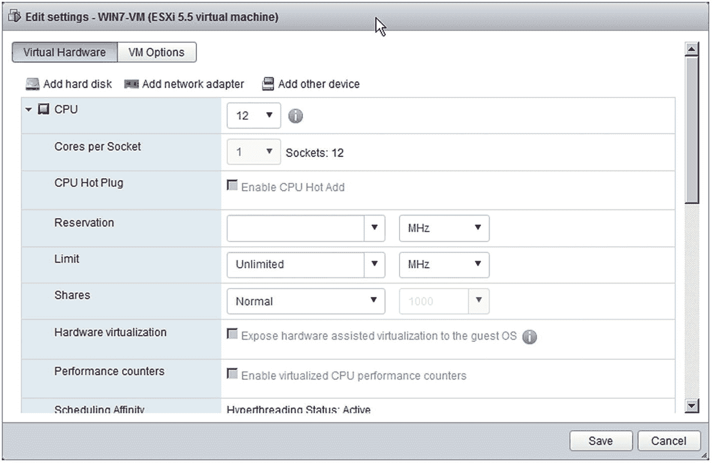
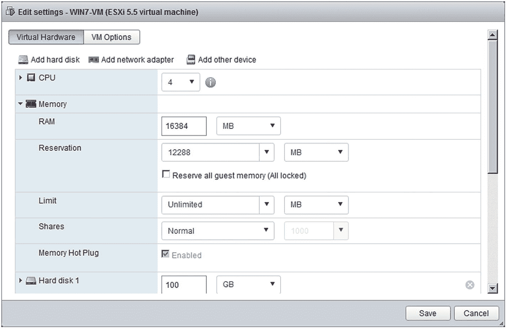
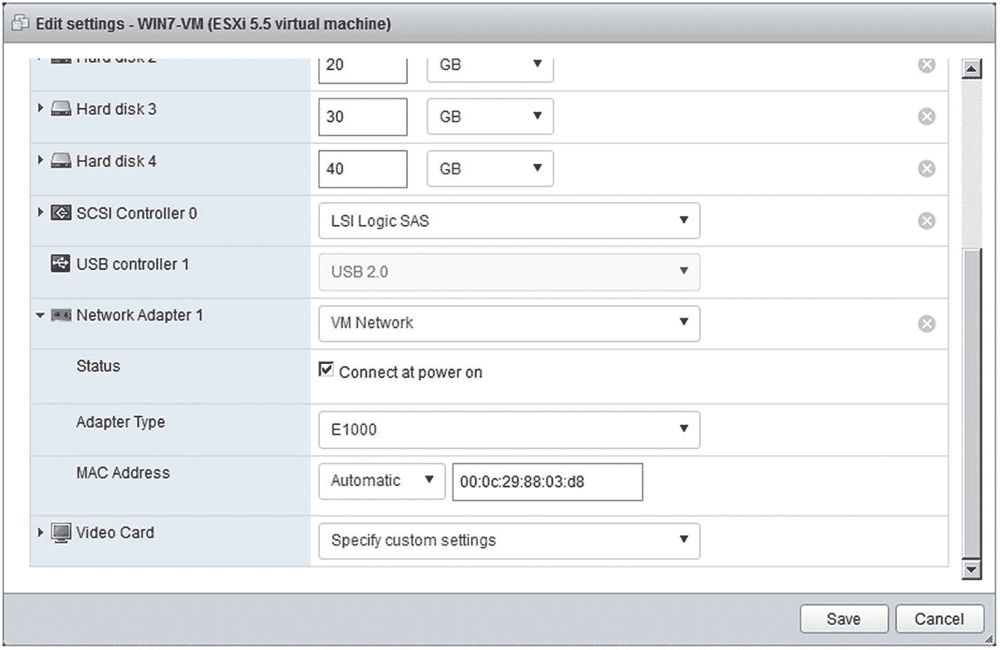
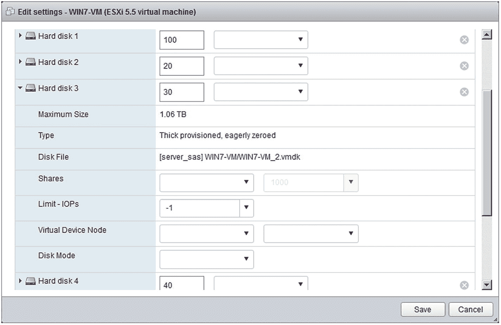
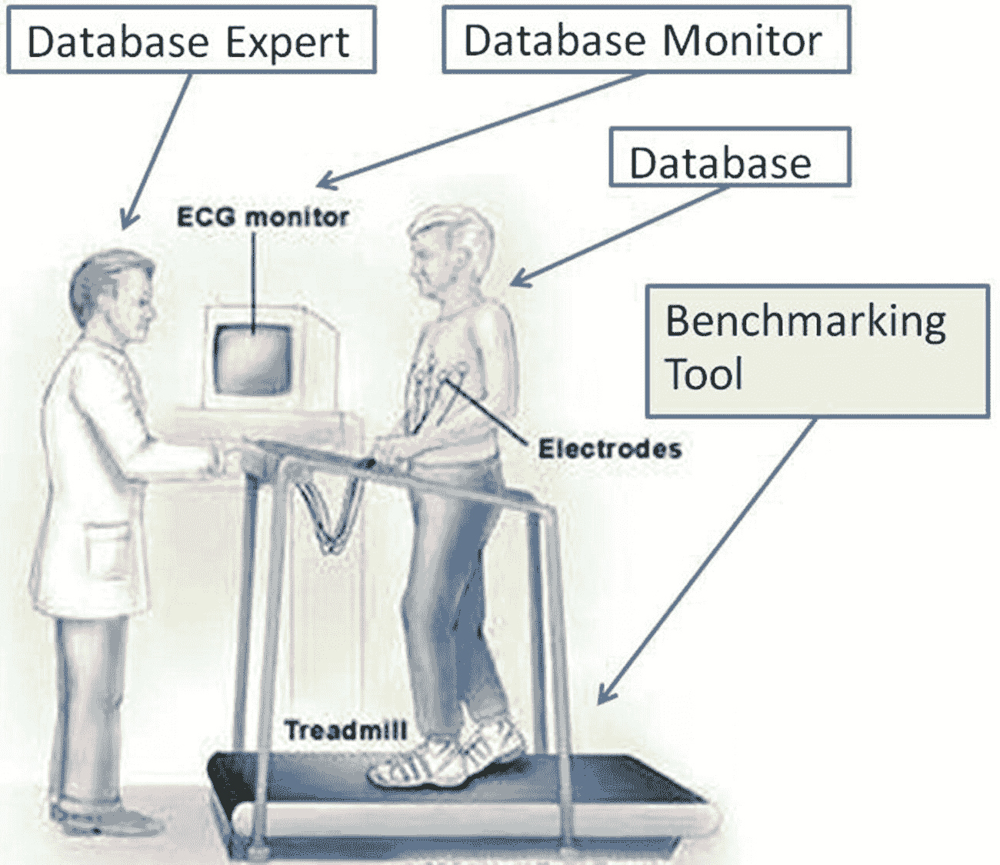

# 9. 面向虚拟化的基准测试

在本章中，我们将回顾当你需要为数据库实例及其数据库进行虚拟化而测试各种场景时的基准测试考量。在很多方面，前一章关于数据库整合的内容是本章的先决条件。前一章的基准测试工作旨在识别哪些数据库可以共享一个实例以减少实例数量，以及需要多少服务器来承载这些实例，这两者在很大程度上是相同的。因此，我们将把前一章视为虚拟化工作的第一部分。本章将处理第二部分：是否存在与特定虚拟化相关的问题，可能影响数据库基准测试工作及其结果。

本章展示的示例将来自 VMware 的虚拟机管理程序。再次说明，我并非建议你选择任何特定厂商，也不是在代言任何厂商。在此情况下，我展示 VMware 有两个原因。首先，我家里实验室正好有一台 VMware ESX 服务器。其次，VMware 拥有大部分市场份额，因此许多（如果不是大多数的话）数据库管理员对其都比较熟悉。我也经常使用 VMware Workstation、VMware Player、Oracle Virtual Box、Oracle VM（基于 Xen 的解决方案）、QEMU 和 Linux KVM。我提到这些主要是为了向读者保证，我充分接触过多个厂商的方案，因此我知道本章提出的概念在大多数虚拟化厂商解决方案中都有相关且类似的对应物。

### 注意

虽然本章可能重点介绍某个给定虚拟化厂商的示例，但本章展示的所有原则和概念都适用于任何虚拟化厂商的解决方案。确切的名称或术语可能会改变，但基本概念仍然适用。

## 服务器 BIOS

在开始基准测试之前，数据库管理员需要检查的第一件也是最明显的事情是，物理服务器的 `BIOS` 是否已针对运行任何虚拟机管理程序进行了正确配置。你可能会假设任何服务器出厂时都带有 `表 9-1` 中推荐的设置，但情况并非总是如此。此外，如果服务器是重新利用或购买的二手货呢？在这两种情况下，都需要再次检查这些设置。我曾见过一两次，这些设置未被设置，却以为已设置，后来在我们的基准测试工作中才发现，结果要么低于预期，要么无法重复。因此，在服务器启动时花五分钟检查一下 `BIOS` 设置，以确保万无一失。

`表 9-1` 虚拟化的 BIOS 设置

| `BIOS 设置` | `建议值` |
| --- | --- |
| 虚拟化技术 | 是 |
| VT-x, VT-d, AMD-V, AMD-Vi | 是 |
| 节点交错 | 否 |
| 睿频模式 | 是 |
| 超线程 | 是 |

### 注意事项

一些数据库管理员可能还记得，在超线程技术早期，它对数据库并不高效。然而，英特尔公司早已修复了那个最初的问题。但如果时间允许，您可能仍想在关闭超线程的情况下进行基准测试，以防您的数据库是个例外。

## 虚拟机配置

在创建用于托管其数据库的虚拟机镜像定义时，许多数据库管理员可能会首先关注 CPU 和内存，其次才会考虑到分配的磁盘。但还有其他重要设置需要留意，而且其中许多设置都有多层选项。本书的目的并非提供在虚拟机监控程序上部署数据库的完整最佳实践，但我们将在本章中涵盖那些被证明对数据库基准测试有显著影响的关键配置。

### CPU

首要且最重要的 CPU 准则是**不要过度分配处理器**。这对数据库管理员来说是个难以改掉的习惯，因为在物理服务器的几十年里，我们通常必须超量订购以应对增长和不可预测的峰值工作负载。所以这几乎已根深蒂固。但在虚拟化环境中，我们可以在需要时动态添加 CPU，通常无需重启（取决于虚拟机操作系统和数据库）。此外，虚拟机也可以被迁移到更大的服务器或总工作负载较少（因此有额外 CPU 周期可利用）的服务器上。最后要记住，所有虚拟机都必须共享有限的资源，包括 CPU，因此我们不应过度分配，否则很快就会导致每个物理服务器上只运行一两个虚拟机。

不应过度分配 CPU 资源的另一个原因是，有时它实际上并不能带来任何净收益。例如，假设您运行的是 SQL Server 标准版，它有一个限制，即`lesser`（两者中较小者）为 4 个插槽或 24 个核心。因此，当您为虚拟机分配虚拟 CPU 时，很容易在不经意间选择一个次优值。事实上，世界知名的 SQL Server MVP 和专家 Brent Ozar 就这一主题撰写过博客和文章。看图 9-1；这台运行 SQL Server 的虚拟机，其 CPU 数量定义为 12，即 12 个插槽，每个 CPU 插槽一个线程。因此，SQL Server 不会使用全部 12 个，而是将其 CPU 使用率限制在 4。CPU 设置本应设为 3 个插槽，每个插槽 4 个线程。这是一个非常容易犯也容易忽视的错误，尤其是在诊断性能不佳时。SQL Server 并非唯一存在此类问题的数据库，我只是以此为例来说明观点。这可能是提高虚拟机数据库性能最快速、最简单的纠正措施之一。您的虚拟化管理员可能不了解任何此类数据库限制，因此这个错误的发生频率可能超出您的想象。

图 9-1

低效的虚拟机 CPU 配置

我要讲的最后一个数据库虚拟化问题是，**不要高估超线程的有效性**。人们很容易相信炒作，认为 CPU 数量翻倍就意味着 CPU 能力翻倍。网上许多数据库管理员引用的共识是，超线程似乎能现实且可靠地带来大约 10%到 30%的提升。我怀疑这是对早期版本超线程技术残留的怀疑态度所致，因此我个人建议的经验法则是，将超线程视为 50%–60%的提升。如果您没有过度分配资源，这个值应该是安全的，并且对大多数情况来说足够好。但您必须自己决定赋予它什么值。只需意识到，赋予 100%（或接近 100%）的值是轻率的。

从数据库基准测试的角度来看，虚拟机 CPU 设置及其有效性可以带来显著的性能提升。假设您正在运行一个大规模因子（例如，1000 个仓库）的 TPC-C 测试，使得您可以运行 10,000 个并发用户会话。显然，当您运行数千个会话时，虚拟机的 CPU 资源分配至关重要。但再假设您正在运行一个大规模的 TPC-H 或 TPC-DS；然而，如果用户会话数量要少得多，您可能会认为 CPU 设置不那么重要。那您就错了！这些大型数据仓库工作负载通常运行极其复杂的查询，且往往针对分区表。大多数数据库优化器会尝试细分并并行执行分区之间和分区内部的操作，以及大表和索引扫描。因此，这个设置在这里同样至关重要。

### 内存

第二个同样关键的领域是虚拟机内存分配。很多时候，数据库管理员只是假设他们可以沿用过去的黄金法则。这在某种程度上是对的，但有一些非常重要的转折。在物理服务器上部署数据库时，该数据库可用的内存就是服务器所包含的内存量。然后，数据库管理员会做一些粗略的计算，类似于：

`虚拟机总内存 = 数据库总内存分配 + (数据库进程数 + 操作系统进程数) * 2MB + 操作系统内存 + 虚拟机开销`

然而，对于虚拟机，您还必须结合虚拟机监控程序管理虚拟机内存的方式。一些虚拟机监控程序需要在虚拟机上安装一个驱动程序，允许虚拟机监控程序从一个虚拟机窃取空闲内存来服务另一个虚拟机。VMware 称之为`气球驱动程序`。但虚拟机监控程序显然不能借用所有内存，因此存在一个限制（或下限）。您可以为虚拟机设置该限制，它通常被称为保留内存。您可以将其视为虚拟机监控程序无法再借用的绝对内存下限，其设置方式如图 9-2 所示。因此，在这种情况下，我按照上面的公式进行计算，得出的数字是 16GB。当我排除最后两项（即操作系统内存和虚拟机开销）后，值是 12GB，所以我将保留内存设为 12GB。此内存设置应显著降低气球膨胀和虚拟机操作系统交换的概率，从而保证虚拟机保留其最佳性能所需的内存。请注意，保留内存还有另一个重要作用。假设您的虚拟机监控程序允许动态虚拟机迁移，那么新的主机必须至少有该虚拟机的保留内存量是空闲的，否则虚拟机无法迁移到该主机。

图 9-2

设置一个借用内存下限

从数据库基准测试的角度来看，虚拟机内存设置也能带来有影响的性能提升。但其原因更多与虚拟化的性质有关，而非数据库视角。如果所有或大多数虚拟机都过度使用内存，那么虚拟机监控程序可能需要执行交换。这可能代价高昂，因为虚拟机监控程序不知道客户虚拟机操作系统的内部内存使用情况，因此它可能选择交换出对客户操作系统来说非最优的内存页。它可能交换出客户操作系统本不会交换的关键虚拟机内存页，例如 Linux 内核。虚拟机监控程序也可能选择交换出在客户操作系统级别是“干净”的内存页（即空页）。最后，可能发生一种称为“双重分页”的情况，即虚拟机监控程序和客户操作系统都交换出同一个内存页，当该页被调回时就会引发问题。

### 网络

对于正在进行任何数据库基准测试的虚拟机，网络设置只涉及两个非常简单的问题和建议。首先，也是最重要的，网络适配器应设置为适当且最优的驱动程序。我曾参与过几次基准测试工作，预期的结果未能达成，且没人能确切知道原因。经过调查他们的虚拟机网络设置（如图 9-3 所示），发现指定了一个次优的驱动程序。在虚拟机创建或转换/迁移到主机服务器时，网络驱动程序被设置为客户操作系统的通用默认值（本例中是 `E1000`）。然而，对于此虚拟机管理程序（即 VMware ESX），最佳驱动程序是一种称为 `VMXNET3` 的半虚拟化驱动。这又是一个非常简单、易于检查并修正的事情。请记住，这个用于大型 OLTP 基准测试的数据库虚拟机可能要处理数十万到数百万的用户会话请求并返回结果。对于数据仓库基准测试，它可能会返回相当大量的数据。无论哪种情况，网络都将成为整体性能的严重瓶颈。在 OLTP 测试案例中，这个简单的设置更改使平均响应时间提升了 500%，而这正是我们最希望优化的指标。如果你好奇为什么会这样，那是因为 `E1000` 驱动程序是针对通用千兆网卡的软件模拟，而 `VMXNET3` 则支持万兆。为什么会这样？虚拟机必须在客户操作系统中安装供应商的工具软件，此选项才可用。因此，除非你手动安装供应商工具，否则网络驱动程序会设置为次优的默认值。

图 9-3

选择最优的虚拟机管理程序网络驱动程序

第二个网络考虑因素是，如果你的虚拟机管理程序允许物理设备的“*直通*”模式，那么你可以选择一块网卡并将其标记为启用直通。然后你可以将该网卡分配给虚拟机，使得客户操作系统能看到实际的硬件，从而使用原生的操作系统硬件驱动程序——这也意味着你的网络流量将完全绕过虚拟机管理程序及其开销。然而，使用此技术有一个主要缺点：动态虚拟机迁移可能会变得不可能或困难得多，因为服务器可能具有不同的硬件，或者所有新主机的硬件可能已被分配，没有剩余资源用于新的直通设置。因此，你很可能会得出结论：对于网络流量而言，最优的虚拟机管理程序网络驱动程序（例如 `VMXNET3`）在保留整体最大灵活性的同时，性能也相当可接受，这就足够了。我个人两种方式都尝试过，无法给出任何明确的建议。请记住，虚拟机管理程序主机可能配置了链路聚合控制协议，将多个网卡的吞吐量合并起来，而如果你为一两个网卡使用自己专用的直通设置，就会错失这点。例如，我的服务器有八个千兆网卡，其中六个分配给了 LACP 组。

### 磁盘 IO

正如本书多次提到的，我们都知道物理磁盘 IO 是数据库性能的阿喀琉斯之踵。请记住之前的关键要点：

-   对于数据库数据和索引文件，避免使用 RAID 5。
-   对于数据库数据和索引文件，建议使用 RAID 10。
-   存储 LUN 要具有适当的条带宽度和深度/大小。

那么，在进行虚拟化数据库的基准测试时，我们需要在这个列表中添加哪些考虑因素呢？只有三个额外的点，而且它们都非常直接：

-   避免使用虚拟化快照（会增加不必要的开销）。
-   与网络类似，在合理的情况下，考虑为总线适配器使用直通驱动（就像网络一样，此选择可能会妨碍动态虚拟机迁移）。
-   选择最高效的磁盘初始化模式以实现最优的数据库 IO。

最后一点需要解释。许多 DBA 会同意，对于那些允许数据库数据文件动态增长的数据库平台来说，动态空间分配的成本可能是一个可测量的负担。例如，想象一个数据库文件，初始设置为 50MB，随着空间使用需要，按 50MB 的幅度增长，用于容纳一个 300GB TPC-H 的架构。仅数据加载过程就会导致大约 600 次动态磁盘空间扩展，索引可能还有 100 次。聪明的 DBA 会直接创建一个大约 500GB 磁盘空间的数据文件，以避免所有这些动态分配的开销。同样的原则也适用于你的虚拟机磁盘分配。例如，VMware 提供三种置备模式：

-   `Thin`：文件从零大小开始，随着请求的空间动态增长。
-   `延迟置零厚置备`（又名 `Flat`）：文件从指定大小开始，块在写入前必须动态清零。
-   `精置零厚置备`：文件从指定大小开始，所有块在文件可供使用前预先清零。

因此，在进行数据库基准测试并寻求最佳磁盘 IO 时，你不仅应该最小化数据库级别的动态磁盘增长，还应该通过选择完全预分配模式（如图 9-4 所示）来消除虚拟机管理程序级别的动态磁盘增长，以作补充。

图 9-4

选择最优的磁盘置备方法

## 监控问题

回到第 5 章，我们将数据库基准测试工作可视化，类似于心脏压力测试，如图 9-5 所示。在本书中，直到现在我们都没有过多提及监控方面。一个相当众所周知的事实是，并非所有的操作系统和数据库监控工具在客户操作系统及其数据库被虚拟化时都能报告准确的值。如果监控工具不是虚拟化感知的，或者仅仅在客户操作系统级别进行监控，那么监控软件看到的 CPU 时钟可能会漂移和偏移。这可能导致错误的诊断和解决方案。此外，目前可用的数据库基准测试工具本身都没有处理这个问题，因为它们的任务只是充当跑步机，单纯地给数据库施加压力。所以我的建议是，投资一个好的、完全虚拟化感知的监控解决方案。

图 9-5

基准测试如同心脏压力测试

