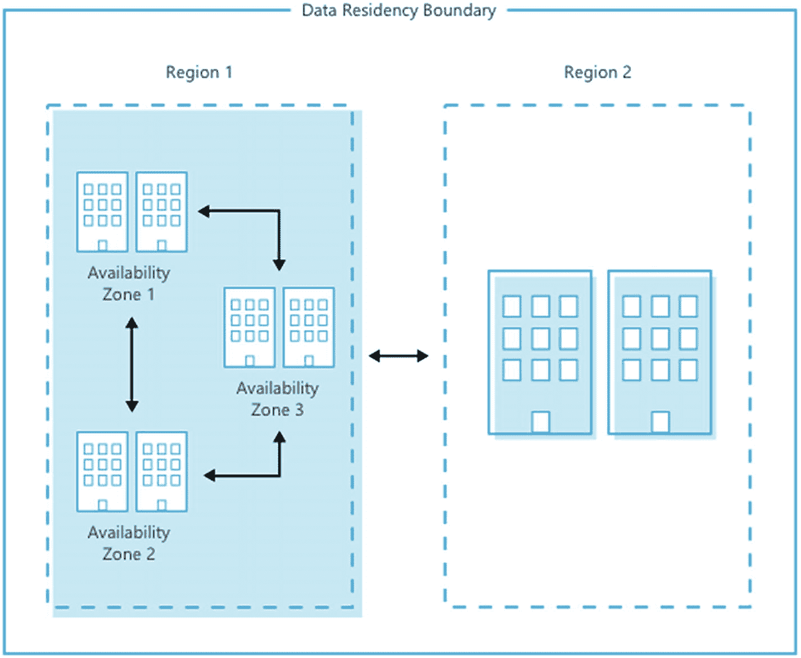
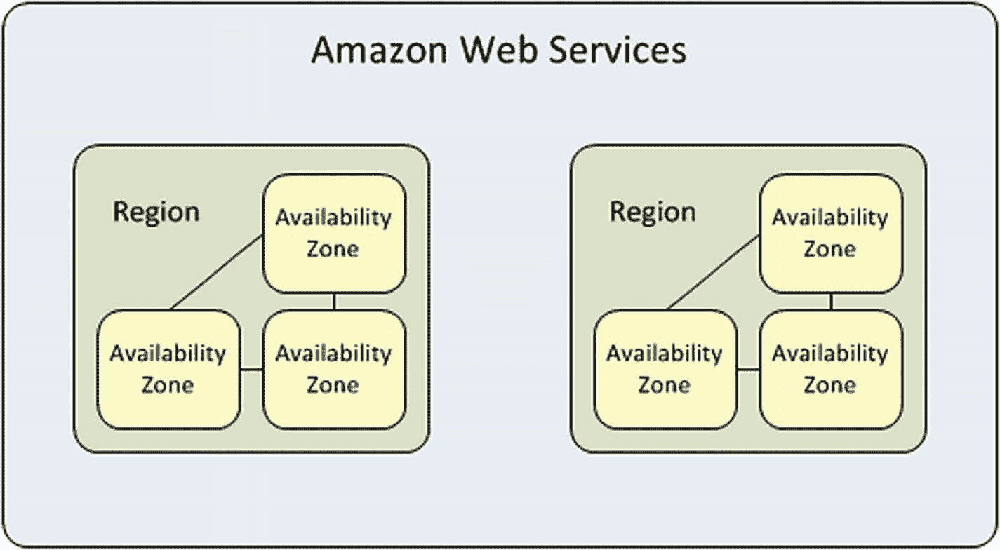
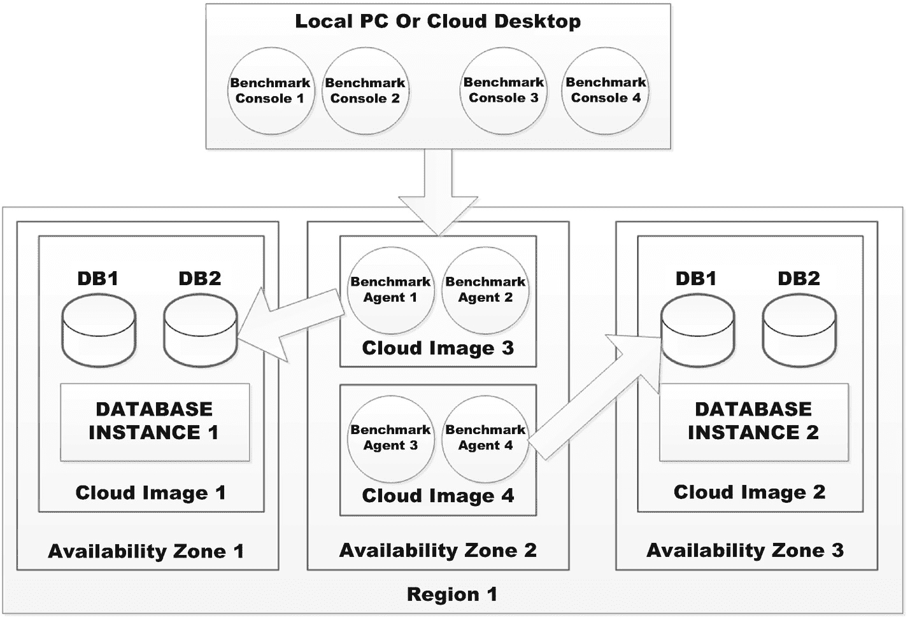

# 10. 公有云基准测试

在本章中，我们将探讨当您考虑或将数据库实例及其数据库迁移到公有云时，需要考虑的基准测试要点。本章特意保持简短，以便聚焦于主要问题，因为云环境变量众多，且每天都在发展。仅部署云数据库这一主题就足以单独写成一整本书。因此，这里我们必须集中讨论最具价值的核心事项。

本章所示示例和引述将来自亚马逊 AWS 和微软 Azure 云。再次说明，我并非建议您选择任何特定供应商，也不为任何供应商背书。但这两者是目前的主要参与者。最后请注意，前两章关于数据库整合和虚拟化的讨论，为部署到云奠定了基础。因此，如果您跳过了那些章节，或对其概念不完全熟悉，建议在继续之前回顾一下。

### 注意

虽然本章可能重点介绍某个特定公有云供应商的示例，但本章展示的所有原则和概念适用于任何云供应商的解决方案。具体名称或术语可能会有变化，但基本概念仍然适用。

## 镜像规格选择

DBA 在将任何数据库部署到云之前，首要且最明显的任务是定义要选择何种类型和规模的镜像。问题是，可选种类多不胜数。表 10-1 按主要类别进行了简单分类。请注意，每个类别下有多种不同规格，此外，有些供应商并不提供所有类别，而是允许用户为任何配置添加 GPU 和额外存储。

表 10-1

各类主要的云镜像类别

| | 亚马逊 (Amazon) | Azure | 谷歌 (Google) |
| --- | --- | --- | --- |
| 通用型 | T2, M5, M4 | B, Dsv3, Dv3, DSv2, Dv2, Av2 | n1-standard |
| 计算优化型 | C5, C4 | Fsv2, Fs, F | n1-highcpu |
| 内存优化型 | X1e, X1, R4 | Esv3, Ev3, M, GS, G, DSv2, Dv2 | n1-highmem, n1-ultramem |
| 存储优化型 | H1, I3, D2 | Ls | <none> |
| 加速计算型 | P3, P2, G3, F1 | NV, NC, NCv2, NCv3, ND | <none> |

假设您选择的云提供商是亚马逊，您已经阅读了其各种镜像类别的详细信息，并选择了 `M4` 类型镜像。我并非在推广或暗示这是数据库应选的规格。以下是 `M4` 的推荐使用场景：中小型数据库、需要额外内存的数据处理任务、缓存集群，以及运行 `SAP`、`Microsoft SharePoint`、集群计算和其他企业应用程序的后端服务器。我选择 `M4` 的原因很简单：它有如表 10-2 所示的合理数量的规格选项。如果我选择了 `M5`（对许多人来说可能是一个不错的`稳妥选择`），其规格表可能长达两页或更多。关键在于，选择正确的镜像类别，然后为该类别选择合适的规格，是一项艰巨的任务。好消息是，您可以相对轻松地更改规格。至于类别更改，则取决于云供应商是否支持以及更改的难度。

表 10-2

亚马逊 `M4` 镜像规格示例

| 型号 | vCPU | 内存 (GiB) | SSD 存储 (GB) | 专用 EBS 带宽 (Mbps) |
| --- | --- | --- | --- | --- |
| `m4.large` | 2 | 8 | `仅 EBS` | 450 |
| `m4.xlarge` | 4 | 16 | `仅 EBS` | 750 |
| `m4.2xlarge` | 8 | 32 | `仅 EBS` | 1,000 |
| `m4.4xlarge` | 16 | 64 | `仅 EBS` | 2,000 |
| `m4.10xlarge` | 40 | 160 | `仅 EBS` | 4,000 |
| `m4.16xlarge` | 64 | 256 | `仅 EBS` | 10,000 |

从数据库基准测试的角度来看，重要的是不要为了省钱而人为选择过小的规格，也不要为了展示最佳结果而选择过大的规格。您应该选择与计划在云上部署的生产环境相同的规格。因此，例如，如果您知道将要在 `m5d.xlarge` 镜像（包含 `NVMe SSD`）上部署运行于 `Oracle Enterprise Linux` 之上的 `Oracle 12g`，那么您进行所有基准测试时也应选择该规格。您可能认为这显而易见，无需多言，但我曾协助过许多基准测试工作，其中明显他们陷入了“我们只是在完成一个复选框项目”的模式，因此只是使用一个小型、便宜的镜像。我只想说，如此获得的结果可以说是相当无价值的。如果不选择相同的镜像类别和规格，存在的差异和选项太多，无法据此得出任何结论。

## 部署架构

DBA 在部署任何数据库到云端时需要定义的第二个同样重要的事情是部署架构。这里指的是您的镜像将位于何处。为此，我们首先需要定义一些特定于云部署选项的术语：“`regions`” 和 “`availability zones`”。

一个区域（region）在词典中被定义为一个地区或分区，尤其指一个国家或世界的一部分，具有可定义的特征但边界并不固定。然而，简单、更通俗的含义通常就足够了：一个区域就是一个国家的一部分。例如，在美国，我们通常认为这个国家被划分为五个主要区域：东北部、东南部、中西部、西南部和西部，如图 10-1 所示。

*图 10-1：美国五大主要区域*

然而，云提供商将区域定义为在一个延迟定义的边界内部署并通过专用的区域低延迟网络连接的一组数据中心。正如人们所预料的那样，不同的云区域在地理上分散在很远的距离，而其数据中心在该区域内则分布得更紧密。表 10-3 显示了 Amazon 和 Azure 的区域。

*表 10-3：云提供商美国区域*

| Amazon | Azure |
| --- | --- |
| 区域 | 位置 | 区域 | 位置 |
| --- | --- | --- | --- |
| us-east-1 | US East (N. Virginia) | East US | Virginia |
| us-east-2 | US East (Ohio) | East US 2 | Virginia |
| us-west-1 | US West (N. California) | Central US | Iowa |
| us-west-2 | US West (Oregon) | North Central US | Illinois |
|   |   | South Central US | Texas |
|   |   | West Central US | Wyoming |
|   |   | West US | California |
|   |   | West US 2 | Washington |

一个可用区（availability zone）或多或少等同于给定云区域内的一个数据中心。请注意，这些数据中心之间的距离足够远，因此应该不会受到常见的本地问题（如停电或风暴）的影响，但又足够近以保持它们之间的低延迟。一些云提供商公开其所有区域的数据中心位置，而另一些则将其视为某种机密。我猜“在云中”确实意味着确切的地点并不那么重要，只要区域的可用区在该区域提供高弹性即可。最后请注意，可用区的数量因区域而异。例如，在 Amazon 云上，弗吉尼亚区域提供六个可用区，而俄亥俄州只有三个。例如，在创建集群数据库并希望在不同可用区拥有一定数量的节点时，这些信息可能很重要。我通常更喜欢 Amazon 对这些概念的示意图，如图 10-2 所示。图 10-3 显示了对应的 Azure 示意图，以便您可以清楚地认识到这些概念在各种云提供商之间基本上是相同的。

*图 10-3：Azure 区域和可用区*

*图 10-2：Amazon 区域和可用区*

那么，所有这些与数据库基准测试有什么关系呢？很简单，您应该将您的云镜像部署在同一区域内，以避免任何延迟偏差。如果使用单实例（非集群）数据库，那么您可能还需要将所有镜像保留在同一可用区内，以进一步减少任何延迟偏差——尽管可用区之间的延迟默认保持较低。它仍然不如在同一可用区内低。现在，如果您正在使用一个多节点数据库实例，您可能将一个节点放在一个可用区，另一个放在第二个可用区，您可能需要考虑类似于图 10-4 所示的拆分方式。这本质上只是对第 8 章图 8-6 的重新设计。您应该回顾该图，然后检查图 10-4 如何为云和多节点集群数据库进行调整。

*图 10-4：复杂的集群云部署*

## 摘要

在本章中，我们探讨了为公有云执行数据库基准测试的问题和技术。如前所述，本章保持简短，因为关于云部署、调优和优化的注意事项，完全可以写一整本书。但是有两个必须理解并正确选择的**关键概念**：镜像类型和大小，以及镜像的部署位置（即区域和可用区）。我们还指出，使用与您预期实际使用不同的镜像类型、镜像大小或云镜像部署模型进行数据库基准测试，几乎是徒劳的。您应该始终使用您打算实际使用的东西进行测试。

