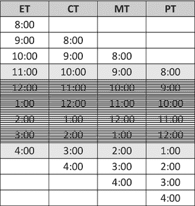
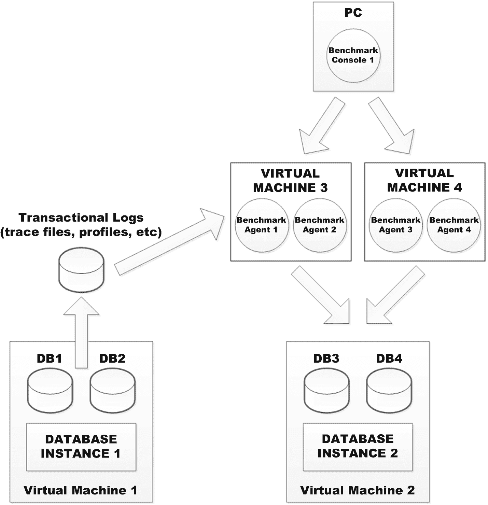
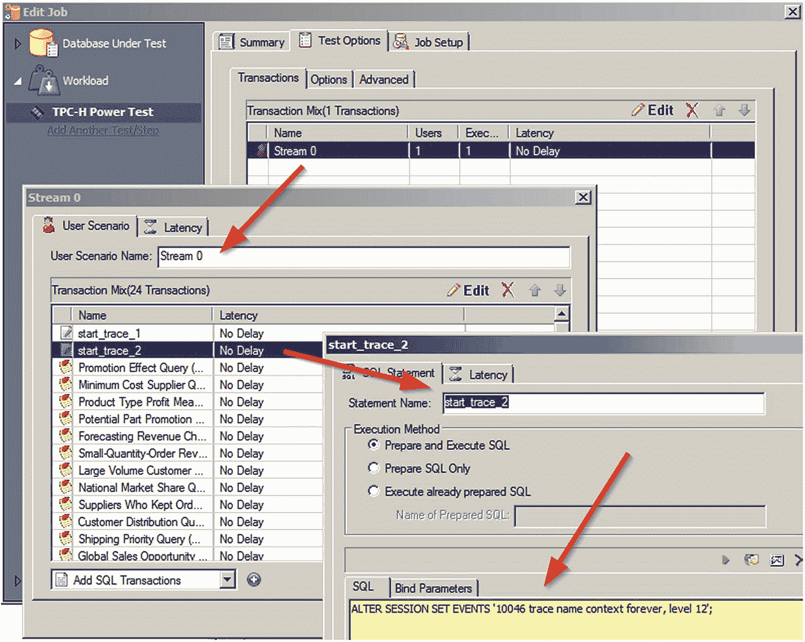
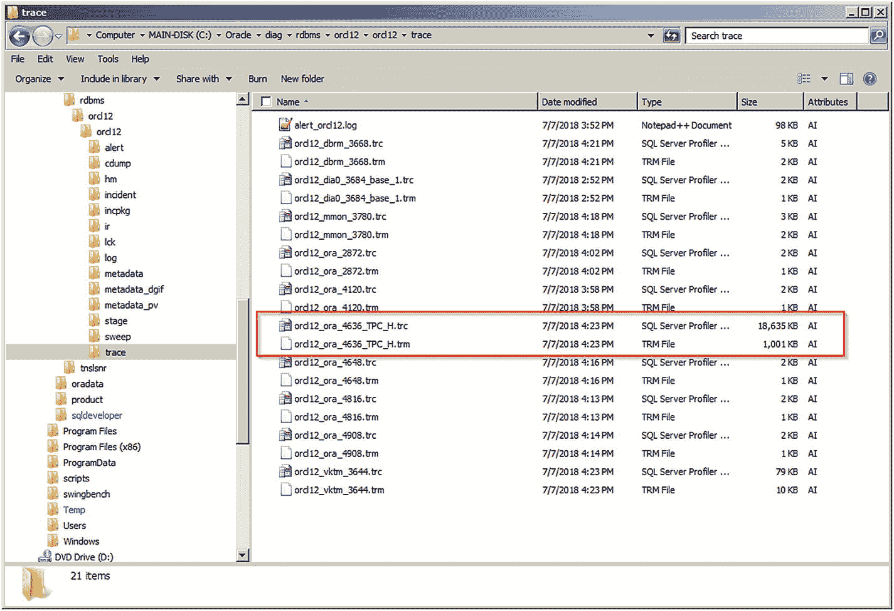
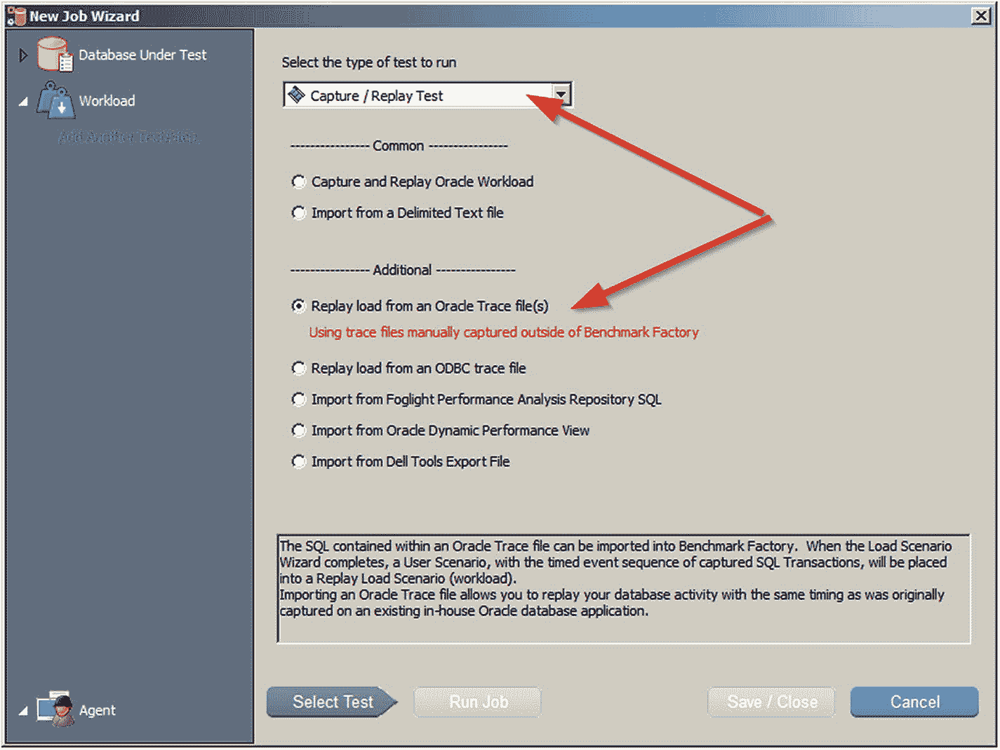
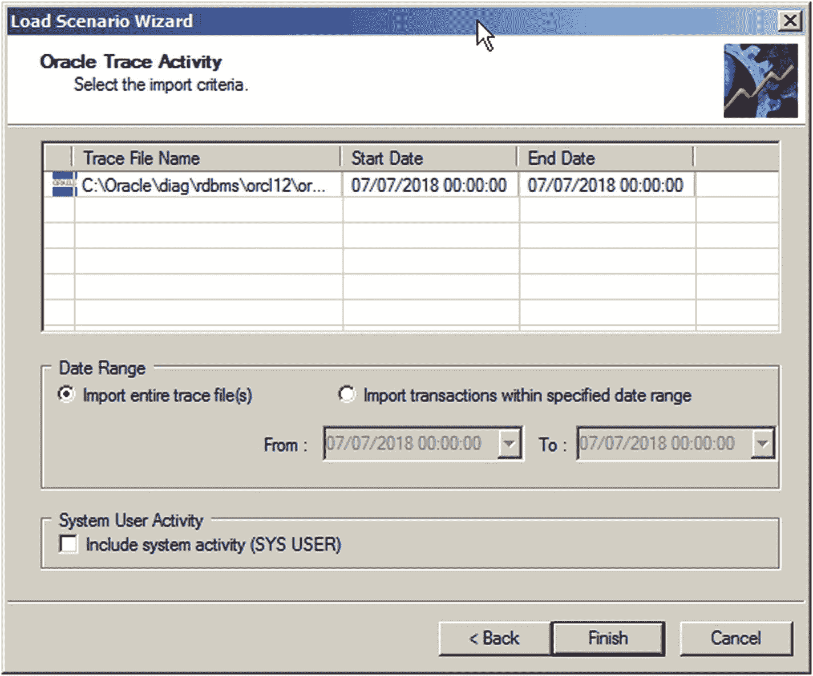

# 11. 工作负载捕获与回放

在本章中，我们将探讨数据库工作负载的捕获与回放。这种用于压力测试或数据库基准测试的方法具有若干显而易见的优势。首先，这些事务活动源自您自己的应用程序和数据库。因此，它与您当前面临的实际性能状况和问题直接相关且切题。其次，您已对数据库设计及其处理的一般业务需求非常熟悉，无需再阅读和理解规格说明。第三，基于这种熟悉度，研究和提出潜在解决方案会更为容易。此外，也便于与同样熟悉情况的同行交流想法。基于这些原因（以及其他一些因素），有些人很可能认为这是进行压力测试或数据库基准测试的理想方法。这种逻辑很难反驳，我理解他们的观点。尽管第 8 章可能展示了一种创建混合行业标准基准以近似任何目标系统的方法，但这充其量仍只是一种近似。我们很容易忽略某个可能彻底扭曲可达成结果的方面。而运行实际工作负载的准确性是无可比拟的。

关于数据库工作负载捕获与回放，还有更多好消息。虽然多年来一直有第三方软件供应商提供解决方案，但近年来，许多数据库供应商也开始提供此类工具。对于那些倾向于使用工作负载捕获与回放的人来说，这是一大胜利，因为对于某些关键的数据库管理任务（例如数据库监控、数据库复制、数据库备份等），当认为供应商具有天然优势时，倾向于选择数据库供应商提供的解决方案是很常见的。不仅如此，关键的数据库供应商不仅进入了这一领域，而且迅速发展和改进了他们的产品。因此，如今数据库管理员（DBA）拥有比以往任何时候都更多、更好的选择。这一点非常重要，因为我们正被要求处理截然不同的部署环境，例如在虚拟机管理程序上、容器内或云中的数据库。再加上在所有这些环境中采用 SSD 和 NVMe 等高级存储选项，还需要克服额外的复杂性层。拥有数据库工作负载捕获与回放的选项，在掌握所有这些情况方面发挥着重要作用。

## 万事俱备

为了成功执行工作负载回放，DBA 首先且最需要做的是创建源数据库及其原始数据状态的副本。该副本随后将被用作回放的独立目标系统。可以理解的是，您需要在捕获源数据库的工作负载之前进行此复制，以便在任何可能更改数据的事务运行之前，拥有时间点零 (`T0`) 的数据库副本。然后，需要将该副本加载到目标系统中，以便任何捕获的、在 `T0` 数据上操作的工作负载，能够以完全相同的数据和完全相同的顺序进行回放，从而希望产生完全相同的结果。

有了捕获的工作负载，存在两种关键的回放场景。第一种是在不对硬件或软件进行重大更改的情况下诊断和解决性能问题。这可能是更常见和更可能出现的场景。这可能包括与小型操作系统或数据库补丁相关的测试。第二种是测试硬件、软件或部署模型（例如虚拟化或迁移到云）中的一些重大变更。虽然这种场景可能不那么常见，但从战略和长期成功的角度来看，它可能是最重要的。让我们看看这两种场景。

在第一种场景中，我们测试的是在不进行重大平台更改情况下的简单性能优化。这意味着我们需要两个数据库许可证、两台服务器和双倍的磁盘空间。此外，我们应努力使服务器和磁盘存储特性尽可能与原始环境相似。因此，如果我们生产数据库服务器配备双路八核至强处理器、256GB 内存和 10TB RAID-10 存储，那么用于回放的测试系统应该相同或尽可能相似。另外，如果我们的生产数据库许可证是企业版并带有一些可选的付费附加组件，那么我们也必须为测试机器购买相同的配置。其理念在于，如果环境基本相同，那么在目标系统上进行的任何调优或优化很可能在源系统上也有效。这样，我们就能找出可以改进生产数据库的措施。

还需注意，我们还需要一些可以挂载并由两台机器共享的磁盘空间，来存放工作负载捕获文件。根据工作负载的不同，这些文件可能非常大，因此请相应规划。您还需要确保到该共享空间的 I/O 带宽足够强大，以免扭曲源或目标数据库服务器的性能。这在生产服务器上尤为关键，因为用户绝不能察觉到此操作导致了任何明显的减速，影响其正常工作。无论如何，这意味着额外的成本和风险。

在第二种场景中，由于所提议并测试内容的性质，限制较少。例如，我们可能试图通过切换到“标准版”来降低数据库许可费用。我们可能在比较当前服务器供应商与另一家供应商（例如戴尔 vs. 惠普 vs. 联想）。我们可能想看看是否能将数据库虚拟化或迁移到云中。我们也可能只是考虑用新供应商或全新技术（例如 SSD 或 VVMe）来取代当前的 NAS 或 SAN 设备，以替换旋转磁盘。因此，虽然我们可能需要两份某些类别的组件，但它们很可能差异很大，因为这正是测试的目的——测试这种差异。

一旦所有这些必要的基础设施就绪，通常就可以通过标准的备份和恢复来复制整个数据库，而且由于您很可能已经在执行备份，因此不会引入额外开销。您只需要将工作负载捕获的开始时间安排在完整备份之后，以便为捕获和回放都准备好真正的 `T0` 数据。完成之后，您就可以将目标系统恢复到初始状态，而不会对生产系统产生任何影响。

## 捕获/回放工具

用于执行数据库工作负载捕获与回放的工具基本上有四种类型：

-   提供使用原生数据库跟踪文件或配置文件进行捕获/回放的数据库基准测试工具（例如，HammerDB、结合 Trace Analyzer 的 Swingbench，以及 Quest Software 的 Benchmark Factory）
-   提供内置且低开销捕获/回放机制的数据库供应商工具（例如，SQL Server Distributed Replay 和 Oracle Real Application Testing，又名 RAT）
-   第三方供应商的数据库捕获回放工具（例如，ExactSolution 的 iReplay 和 ITGain 的 SQLReplayer）
-   开源数据库捕获/回放工具（例如，用于 SQL Server 的 Query Store Replay）

由于本书是关于数据库基准测试的，我们将讨论范围限制在提供工作负载捕获/回放的基准测试工具上，因为供应商解决方案虽然通常很好，但仅适用于他们自己的数据库。此外，对于某些数据库供应商，此功能是需要为源和目标数据库都购买的额外付费项目，因此成本再次加倍。

## 捕获时长

负责监控工作负载捕获的数据库管理员首先需要考虑的关键因素是捕获的时间和持续时间，这一点至关重要。虽然这看似一个显而易见且简单的问题，但我见过最常见的错误就是未能选择一个合适的工作负载捕获时段。捕获应选择在一天中工作负载较高的典型时段进行。是的，这会给生产环境增加额外开销，这从来不是一件受欢迎的事情。但在其他任何时段捕获工作负载，对于进行适当的调优和优化所产生的重放效果会大打折扣。事实上，我甚至认为，如果你对工作负载捕获和重放的需求不足以支持你在高峰活动时段进行操作，那么这可能根本就不值得做。想象一下，一名外科医生必须因为感染组织扩散而决定是否截肢。这是一个无需犹豫的决定，必须尽快执行，因为不这样做的代价很高。如果管理层说这项任务很重要，却不允许在高峰时段进行捕获，那么你应该解释这种立场的谬误所在，并极力争取进行一次无论成本如何都有价值的捕获。如果答案仍然是“不”，那么你应该据理力争，反对执行此操作，或者至少降低对其价值以及在次优捕获条件下可达成结果的期望。

一旦你获得了在高峰活动时段进行捕获的批准，下一个问题就是捕获运行多长时间。我们希望捕获运行足够长的时间，以收集有意义的、有用的样本。但我们也希望尽可能快地完成，以最小化对生产和最终用户的影响。我见过人们执行短至 15 分钟、长至 8 小时（甚至有一次长达 24 小时，但那是罕见的例外）的捕获。虽然没有绝对的正确或错误答案，但我建议这两个极端很可能是错误的。选择最佳时长的最佳方法是询问业务人员，真正关键的、高峰工作时段的小时数是哪些。例如，虽然一个典型的 OLTP 系统可能主要在上午 8 点到下午 5 点处理活动，但业务用户可能会在这个时间段内识别出一个关键范围来缩短时长。也许因为业务横跨美国的四个时区，关键时段就是所有时区都处于正常工作时间的时候，如表 11-1 所示。因此，最佳时段是上午 11 点到下午 5 点的任何时间。由于所有员工都有传统的中午一小时午休时间，我们排除了包含 12:00 的行。因此，我们现在只有两个选项：从 11:00 到 12:00 或从 16:00 到 17:00。事情并不总是这么简单，但核心思想是，通过向业务人员提出一些问题，合适的捕获时段选项就会显现出来。

***表 11-1.*** *寻找最佳捕获时段*

我将通过说明我的观点来结束这个话题：对我而言，理想的捕获时段通常且典型地不少于一小时且不超过四小时。总的来说，你需要捕获的活动既不能太少也不能太多，而应正好足以解决手头的任务。当然也会有例外。例如，假设季度末处理需要八小时来完成其任务，那么那就是针对该活动进行工作负载捕获的正确时段。最后一个考虑因素通常是捕获事务所需的处理开销和磁盘空间。因此，虽然较长的时段可能是最好的，但有时你可能不得不由于这些其他考虑因素及其成本而限制在最小可行时段内。

## 重放架构

采用提供捕获/重放功能的数据库基准测试工具这种方法，基准测试工具本身的部署架构至关重要。请看图 11-1，然后问问自己，为什么这张图如此复杂？

图 11-1 推荐的重放架构

答案很简单：你需要足够多的基准测试工具代理，以充分负载均衡数据库看到的所有工作，这些工作可能来自许多应用程序客户端和服务器。想象一下，一个由 10,000 名用户运行的传统客户端/服务器类型应用程序，或者一个基于 Web 的应用程序服务器每秒向数据库发送数千个事务。你必须在计算资源上分布足够的代理，以正确模拟原始工作负载的传输速度。否则，基准测试代理可能成为瓶颈，扭曲结果。

最后一点说明，数据库供应商的捕获/重放工具在所需架构方面的工作方式几乎相同。虽然数据库本身再次捕获工作负载，但你可能需要部署多个数据库重放代理，以便进行负载均衡并近似模拟工作负载的传输。另请注意，对于那些对此功能收费的数据库，它们要求你在源和目标数据库上都获得捕获/重放的许可。在某些情况下，这个成本可能相当可观。但是，它们不额外收取执行重放所需的代理费用；只是按数据库实例收费。

## 结果解读

对于行业标准的数据库基准测试评分，结果相当简单；你可以查看每秒事务数、平均响应时间或运行至完成的时间。换句话说，有一些简单的分数可以比较，这些分数在多次执行之间可能提高或不提高，以测试各种数据库的变更。但对于捕获/重放工作来说，事情就没那么简单了。很少有应用程序的计量方式能够恰当地提供简单的性能比较。此外，并非所有数据库都天然提供诸如每秒事务数或每秒读写兆字节等指标。再者，即使它们提供了，很可能 SQL 代码才是性能问题的根源，而不是其他任何东西。因此，利用重放的最佳方式是使用标准的数据库监控工具来发现并修正糟糕的 SQL。此外，你或许能够识别出那些不能很好地协同工作的 SQL 语句及其对应的任务。例如，我曾担任一家公司的主要生产数据库管理员，我们大多数批处理作业周期的问题，仅仅是需要重新安排那些资源密集型或需要对相同表进行大量操作的任务。

数据库管理员通常喜欢采用的另一种方法是，找到消耗过多时间的关键数据库等待事件，并纠正其根本原因。是的，有时这是一个数据库配置参数或其他一些数据库问题。但大多数时候，根本原因要么是糟糕的 SQL，要么是 SQL 重叠导致竞争数据库资源。因此，对于那些喜欢从等待事件入手的人，我不会质疑你的方法。我只想说，在 80%或更多的时间里，生产系统中的罪魁祸首是 SQL 代码。那么，为什么不首先寻找这样的 SQL 呢？

## 捕获/回放示例

本节将演示如何使用数据库基准测试工具执行工作负载的捕获与回放。不过，我打算“作弊”，因为我将同时使用该基准测试工具来生成用于捕获的工作负载。因此，我将针对源数据库运行一个`TPC-H`基准测试，并通过原生数据库机制（本例中是`Oracle`跟踪文件）捕获该工作负载。然后，我将使用相同的基准测试工具来读取并回放这些事务。这个示例本身可能不太实用，但它将完整演示应遵循的正确流程。我们将使用的基准测试工具是 Quest Software 的 `Benchmark Factory`。

第一步是按照第 5 章的建议创建两个`TPC-H`数据库基准测试作业：第一个用于加载数据库对象，第二个用于运行实际的基准测试工作负载。其次，运行数据库加载对象项目。在加载项目运行的同时，我们可以对基准测试的执行进行一些微小的修改。请记住，在本例中我们使用的是`Oracle`，但对于其他数据库平台，其概念和流程是相似的。我们只需要在基准测试的执行中手动添加一些语句，如图 11-2 所示。我添加了 `START_TRACE_1` 和 `START_TRACE_2`，它们分别包含以下两个`Oracle`命令：

*图 11-2：向数据库日志工作负载中添加命令*

*   `ALTER SESSION SET tracefile_identifier=TPC_H;`
*   `ALTER SESSION SET EVENTS'10046 trace name context forever, level 12';`

通过添加这两个非常特殊的`SQL`语句，`Oracle`将创建跟踪文件，并在其文件名中包含字符串`TPC_H`，从而使这些文件更易于识别。然后，我只需运行基准测试执行项目，该项目将运行`TPC-H`行业标准基准测试的 22 条复杂`SQL SELECT`命令，并生成一个跟踪文件（包含所有绑定变量值），如图 11-3 所示。

*图 11-3：基准测试运行创建的 Oracle 跟踪文件*

然后，这个跟踪文件可以由基准测试工具作为项目的命令加载并运行，如图 11-4 所示。同样请注意此图，除了`Oracle`跟踪文件之外，还有其他选项可用于创建工作负载回放测试。例如，如果你的应用程序是可计量的，并且可以指示其生成所运行`SQL`语句及其绑定值的文本文件日志，那么该日志也可以被解析并加载到此工具中。因此，除了数据库供应商的解决方案外，执行工作负载捕获与回放的方法不止几种。虽然我在此重点介绍了`Benchmark Factory`，但`HammerDB`和`Swingbench`都提供类似的功能和特性。

*图 11-4：从跟踪文件创建基准测试作业*

好处在于，当`Benchmark Factory`加载和解析跟踪文件时，它提供了导入整个文件或将其限制在某个日期/时间范围内的选项，如图 11-5 所示。这非常有用，因为可能捕获了数小时的活动，但只想回放其中一部分事务。事实上，这在调优和优化时非常有用。想象一下，第一次运行从上午 10:00 到下午 2:00 的工作负载回放，并能够识别出最大的问题发生在 12:00 到 12:30 之间。现在，你可能尝试通过更改数据库配置参数来纠正该问题。然后，你可以简单地重新运行工作负载回放，并将其限制在相关时间段内。仅此一项功能就能节省大量时间，使此特性非常值得使用。

*图 11-5：限制用于回放的跟踪文件输入*

