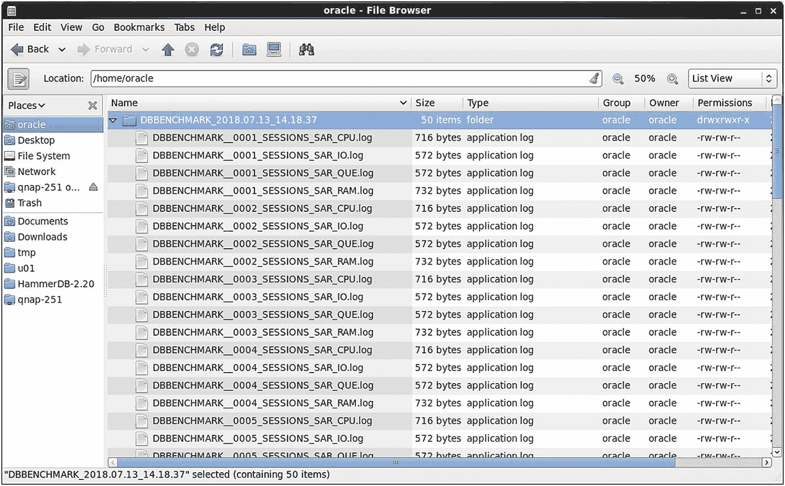
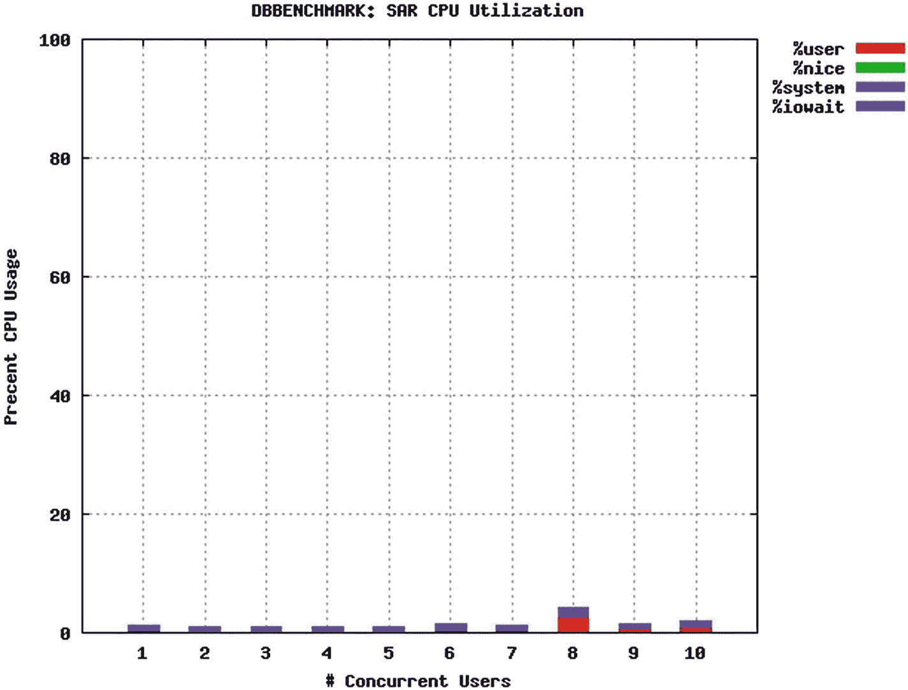
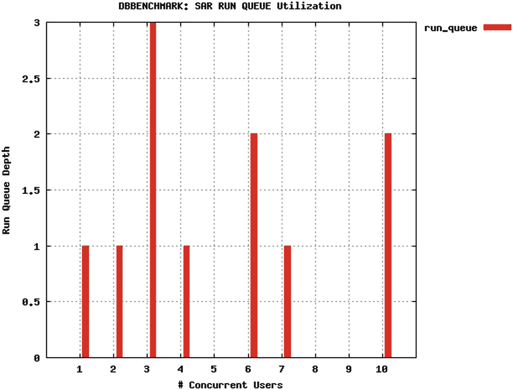
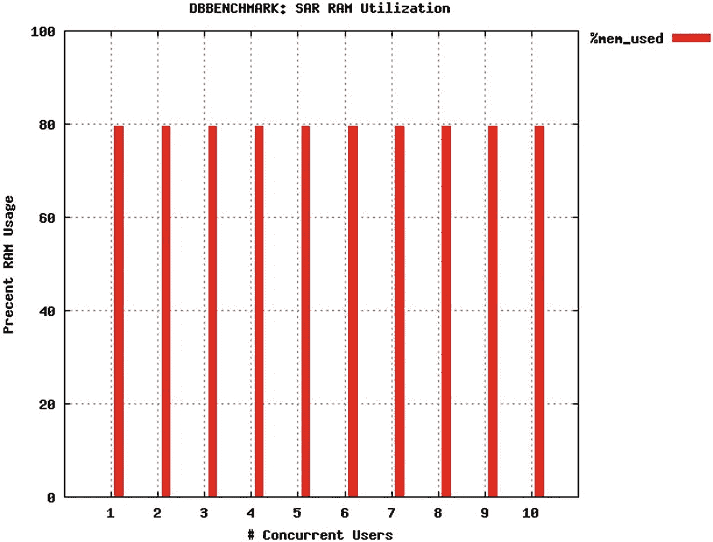
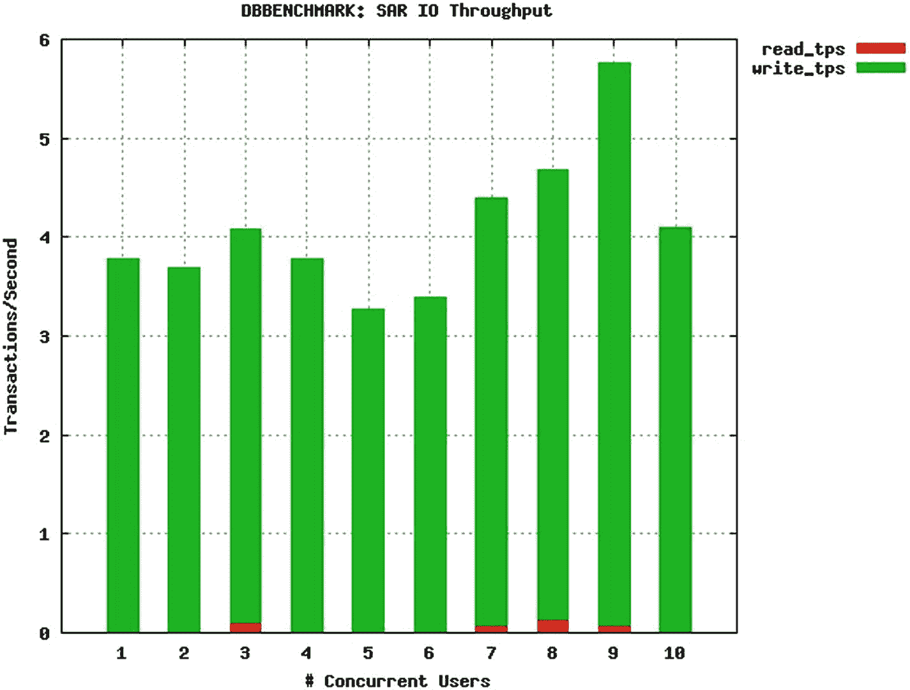

# 12. 数据库压力测试

在这最后一章中，我们将讨论简单的数据库压力测试，并介绍一个我编写的免费脚本工具，供大家使用或修改以满足其特定需求。压力测试很像行业标准基准测试，因为它试图对数据库施加压力。但两者又有很大不同，因为它应用简单、原子性的事务仅仅是为了对底层子系统，特别是`IO`带宽施加压力。我认为压力测试更像是“猛踩汽车发动机油门”，此时汽车处于空挡，你只是想看看在到达红线区之前`RPM`（每分钟转速）能升到多高。这并不意味着此类测试价值较低，只是它基本服务于不同的测试目的。对许多人来说，这对于他们可能称为数据库基准测试的需求来说已经足够了。

## 原始压力测试

正如本书前面章节所讨论的，数据库管理员通常希望测试数据库的原始性能，这通常意味着测量和比较一些极低层次的指标，比如每秒 IO 次数（IOPS）。有几个原因。首先，IOPS 易于理解，并且不包含像行业标准基准测试延迟这样的扭曲因素。其次，存储供应商经常用这些术语来表达性能和吞吐量。因此，假设你想测量像 IOPS 这样的`raw performance`指标，你会希望使用一个设计和目的与该目标相匹配的数据库基准测试工具。最流行的低层次数据库性能测试工具之一是`Simple Little Oracle Benchmark (SLOB)`，这在第 3 章末尾提到过。许多人信赖这个工具，并且有些人编写了扩展或封装程序来改进它。但在我看来，SLOB 有显著的局限性：

*   首先，逻辑在 C 程序中硬编码，并且还依赖于另一个用于信号量管理的 C 程序。我更喜欢将所有代码保留在 shell 脚本和 ANSI SQL 中，这些对于任何人按需修改都容易得多。
*   其次，设置和运行需要一个多步骤的过程。我更喜欢一个简单的命令行接口，无需设置即可直接调用。无需编译或链接。
*   第三，SLOB 的核心 IO 设计是“读取”进行轻量级块访问，“写入”绕过索引开销。我更喜欢更自然的数据库 IO 模式，更可能匹配真实世界的数据库使用情况。
*   最后，生成的 SLOB 负载配置文件是文本形式的，并且是针对单次运行的（因此才有了那些附加的封装程序和扩展）。

我更喜欢一个简单的工具，它能进行迭代测试并在一张易于阅读的图表中生成结果。因此，我编写并免费提供了我自己的工具，名为`DBBENCHMARK`。它基本上是一个类似 SLOB 的工具，完全解决了所有这些局限性。此外，`DBBENCHMARK`是一个简单的 Linux shell 脚本，使用了很少的 shell 脚本`special magic`，因此对于想在 Windows 上运行它的人来说，可以轻松地转换为 Power Shell。它的 Linux 软件包依赖非常少，它只是调用任何数据库的命令行接口。因此，一旦我最初为 Oracle 编写了这个工具，将其转换为 MySQL 是相当微不足道的。欢迎读者将其转换为 PostgreSQL、SQL Server 或任何其他数据库。我只是要求人们将此类修改公之于众，以造福大家。

### 注意

您可以从我的个人网站下载此工具：[`www.bertscalzo.com`](http://www.bertscalzo.com)。

## DBBENCHMARK 工具

运行`DBBENCHMARK`非常简单——只需简单地调用一个 Linux shell 脚本，用户只需指定几个相对不言自明的参数，如下所示（这是 Oracle 版本的脚本）：

```
[oracle@linux68 ~]$ ./dbbenchmark-oracle.sh -h
===============================================================
Usage: dbbenchmark-oracle.sh -h -u -p -d -z -s -S -i -r -P -T -a -b
===============================================================
CREDITS: utility for testing database performance by Bert Scalzo
OPTIONS:
-h   Help           (print this help information)   --DEFAULTS--
-u   Username       Database username               ()
-p   Password       Database password               ()
-d   Database       Database db name                ()
-z   Test Size      Values: SMALL, MEDIUM, LARGE    (SMALL)
-s   Session Start  Beginning user session count    (1)
-S   Session Stop   Ending user session count       (10)
-i   Increment by   Increment session count by      (1)
-r   Run Time       Run Time in Seconds             (30)
-P   Plot Data      Plot graphs of SAR data: Y/N    (Y)
-T   Tablespace      Default tablespace              (USERS)
-a   AWR Snapshot   Take AWR snapshots: Y/N         (N)
-b   AWR baseline   Create AWR baseline: Y/N        (N)
===============================================================
```

这是同一个脚本的 MySQL 版本。请注意，有些参数要么不同，要么缺失（即，MySQL 没有 AWR 功能）。同样请记住，这个版本调用不同的命令行接口，并传递一些略有不同的 SQL 来计算测试结果。

```
[oracle@linux68 ~]$ ./dbbenchmark-mysql.sh -h
===============================================================
Usage: dbbenchmark-mysql.sh -h -u -p -d -z -s -S -i -r -P
===============================================================
CREDITS: utility for testing database performance by Bert Scalzo
OPTIONS:
-h    Help           (print this help information)   --DEFAULTS--
-u    Username       Database username               ()
-p    Password       Database password               ()
-d    Database       Database db name                ()
-z    Test Size      Values: SMALL, MEDIUM, LARGE    (SMALL)
-s    Session Start  Beginning user session count    (1)
-S    Session Stop   Ending user session count       (10)
-i    Increment by   Increment session count by      (1)
-r    Run Time       Run Time in Seconds             (30)
-P    Plot Data      Plot graphs of SAR data: Y/N    (Y)
===============================================================
```

下面是一个实际针对运行在 SSD 驱动器上的 Oracle 12c R2 数据库运行此实用程序的示例。我只指定了用户名、密码和数据库的最小必需参数。我还只显示了脚本输出的开始和结束部分，而不是全部 10 次迭代（从 1 个用户到 10 个用户）。


### DBBENCHMARK 运行与结果分析

#### 执行与输出

```
[oracle@linux68 ~]$ ./dbbenchmark-oracle.sh -u bert -p bert -d ora122
===============================================================
参数:
DB_USERNAME    = bert
DB_PASSWORD    = bert
DB_DATABASE    = ora122
TEST_SIZE      = SMALL (10,000 rows / session)
SESSION_START  = 1
SESSION_STOP   = 10
SESSION_INCR   = 1
RUN_TIME       = 30 (seconds)
PLOT_DATA      = Y
DEF_TSP        = USERS
AWR_SNAP       = N
AWR_BASE       = N
===============================================================
工作中：测试 gnuplot 在当前 $PATH 中找到可执行文件
工作中：测试 gnuplot 版本必须至少 >= 4.2
工作中：测试 sqlplus 在当前 $PATH 中找到可执行文件
工作中：测试使用提供的参数连接数据库
工作中：运行基准测试的处理步骤
工作中：....创建 DBBENCHMARK_RESULTS 性能度量表
工作中：针对 DBBENCHMARK_TEST 表执行 1 个会话
工作中：....等待针对 DBBENCHMARK_TEST 表的 1 个会话
工作中：DBBENCHMARK_RESULTS 性能度量停止时间
...
工作中：针对 DBBENCHMARK_TEST 表执行 10 个会话
工作中：....等待针对 DBBENCHMARK_TEST 表的 10 个会话
工作中：DBBENCHMARK_RESULTS 性能度量停止时间
===============================================================
结果：
DBBENCHMARK_2018.07.13_14.18.37/DBBENCHMARK__SAR_AVERGAGE_IO.log
#users         read_tps        write_tps
1              0.00            3.78
2              0.00            3.69
3              0.10            3.98
4              0.00            3.78
5              0.00            3.27
6              0.00            3.39
7              0.07            4.32
8              0.14            4.54
9              0.07            5.69
10             0.00            4.09
DBBENCHMARK_2018.07.13_14.18.37/DBBENCHMARK__SAR_AVERGAGE_CPU.log
#users       %user        %nice         %system      %iowait
1            0.39         0.00          0.48         0.28
2            0.33         0.00          0.43         0.29
3            0.33         0.00          0.47         0.30
4            0.32         0.00          0.49         0.29
5            0.34         0.00          0.44         0.29
6            0.52         0.00          0.56         0.30
7            0.39         0.00          0.47         0.31
8            2.83         0.00          1.23         0.28
9            0.65         0.00          0.57         0.29
10           1.11         0.00          0.69         0.29
DBBENCHMARK_2018.07.13_14.18.37/DBBENCHMARK__SAR_AVERGAGE_RAM.log
#users         %mem_used
1              79.40
2              79.40
3              79.42
4              79.42
5              79.39
6              79.40
7              79.42
8              79.45
9              79.46
10             79.44
DBBENCHMARK_2018.07.13_14.18.37/DBBENCHMARK__SAR_AVERGAGE_QUE.log
#users         run_queue
1              1
2              1
3              3
4              1
5              0
6              2
7              1
8              0
9              0
10             2
===============================================================
工作中：将测试报告目录和文件压缩为一个 zip 文件
===============================================================
全部完成：处理已成功完成 ...
===============================================================
```

#### 输出文件结构

`DBBENCHMARK` 将创建一个目录和一个包含该目录内容的 zip 文件，两者都使用以下命名格式：
*   `DBBENCHMARK_ + YYYY_MM_DD_ + HH.MM.SS`

该目录中将包含三种类型的文件：每次迭代的 SAR 文件、关键 SAR 数据的汇总文件以及四个 GNU Plot JPEG 文件。图 12-1 展示了此目录结构和文件名的示例。



图 12-1：`DBBENCHMARK` 运行的输出示例

#### 性能图表分析

这些日志文件包含大量详细的监控信息，在工具文本输出的末尾（如上所示），会按每次迭代对四个主要类别（CPU、RAM、IO 和运行队列）进行汇总。但如果你和我一样，可能需要一张简单的图表来更充分地理解结果中的真实发现。因此，`DBBENCHMARK` 可以自动将所有关键结果绘制为此目录中的 JPEG 文件。

##### CPU 使用率

第一张 JPEG 文件（如图 12-2 所示）显示了 CPU 使用率。很明显，从处理器角度看，这台数据库服务器可能可以轻松处理超过 100 个并发用户。CPU 不是瓶颈。



图 12-2：`DBBENCHMARK` 生成的 CPU 图表

##### 运行队列长度

第二张 JPEG 文件（如图 12-3 所示）显示了平均运行队列长度——这通常是检测系统过载的关键指标。很明显，从运行队列角度看，这台数据库服务器还有余量。通常，当平均运行队列深度持续高于四时，系统可能达到扩展上限。因此，运行队列也不是瓶颈。



图 12-3：`DBBENCHMARK` 生成的运行队列图表

##### RAM 使用率

第三张 JPEG 文件（如图 12-4 所示）显示了 RAM 使用率。很明显，从内存角度看，这台数据库服务器的运行内存使用率接近理想的 80% 水平，因此它很可能比 CPU 更是一个限制因素。虽然我可能无法为数据库缓存分配更多内存，但似乎有足够的内存来生成运行命令行界面的操作系统会话。但内存很可能比 CPU 更能约束上限。因此，内存可能也不是瓶颈。



图 12-4：`DBBENCHMARK` 生成的内存图表

##### IO 事务率

第四张 JPEG 文件（如图 12-5 所示）显示了读写事务率。很明显，从 IO 角度看，这台数据库服务器同样负载很轻。一块 SSD 磁盘应该能够处理远超过每秒六次的 IO 操作。因此，IO 也不是瓶颈。



图 12-5：`DBBENCHMARK` 生成的 IO 图表

