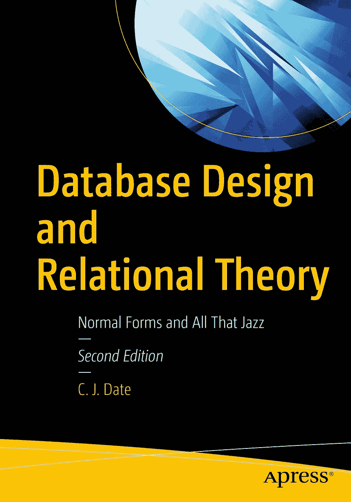

# 第一版前言

ISBN 978-1-4842-5539-1 e-ISBN 978-1-4842-5540-7 [`doi.org/10.1007/978-1-4842-5540-7`](https://doi.org/10.1007/978-1-4842-5540-7) © C. J. Date 2019  
本作品受版权保护。出版者保留所有权利，无论涉及材料的全部或部分，具体包括翻译、重印、插图复用、朗诵、广播、微缩胶片或其他任何物理方式的复制，以及信息存储与检索、电子改编、计算机软件，或目前已知或未来开发的任何类似或相异的方法论。本书可能出现商标名称、标识和图片。我们并非在每次出现商标名称、标识和图片时都使用商标符号，而是仅以编辑方式并为商标所有者利益使用这些名称、标识和图片，并无侵犯商标权的意图。本书中对商品名称、商标、服务标识及类似术语的使用，即使未特别标识，也不应被理解为对它们是否受专有权利约束的意见表达。尽管本书中的建议和信息在出版时被认为是真实准确的，但作者、编辑或出版商均不对可能存在的任何错误或遗漏承担法律责任。出版商对本出版物所含材料不作任何明示或暗示的担保。本书在全球范围内由 Springer Science+Business Media New York 发行，地址：233 Spring Street, 6th Floor, New York, NY 10013。电话 1-800-SPRINGER，传真 (201) 348-4505，电子邮件 orders-ny@springer-sbm.com，或访问 www.springeronline.com。Apress Media, LLC 是一家加州有限责任公司，其唯一成员（所有者）是 Springer Science + Business Media Finance Inc (SSBM Finance Inc)。SSBM Finance Inc 是一家特拉华州公司。

*在计算机领域，优雅并非可有可无的奢侈品，而是决定成败的品质。*
——埃兹赫·W·迪杰斯特拉

*拙劣的设计对设计者最为不利。*
——赫西俄德

*值得注意的是，当本文任何部分显得沉闷时，其中必有设计。*
——理查德·斯蒂尔爵士

*正式设计学科的理念常因模糊的文化/哲学谴责（如“扼杀创造力”）而遭到排斥；这种现象在……所谓“人文学科”的浪漫化视野实际上将技术无能理想化的背景下更为显著……[我们]知道，为了可靠性和理智的控制，我们必须保持设计的简洁和清晰。*
——埃兹赫·W·迪杰斯特拉

*我的设计绝对光明磊落。*
——佚名

——— ♦♦♦♦♦ ———

***谨以此书献给我的妻子琳迪和我的女儿莎拉与珍妮，并倾注我所有的爱***

本书最初是作为《数据库实战：从业者的关系理论》（O’Reilly，2005）一书中相对较短的一章开始的。该书后来被大幅扩展的版本《SQL 与关系理论：如何编写准确的 SQL 代码》（O’Reilly，2009）所取代，在那里，设计相关材料因与书籍主题略有偏离，不再自成一章，而是变成了一个（稍长的）附录。随后我开始着手准备后者的第二版。^(¹) 在这项工作的过程中，我发现关于数据库设计这一主题有太多内容需要阐述，以至于该附录的篇幅几乎要膨胀到与全书不成比例的地步。既然这个主题正如我所说，本就偏离了那本书的主要重点，我决定快刀斩乱麻，将这些材料分离出来，单独成书：也就是您现在看到的这本。

由上述情况立即引出三点：

*   首先，本书确实假定您熟悉《SQL 与关系理论》一书所涵盖的内容（特别是，它假定您确切知道`关系`、`属性`和`元组`是什么）。然而，我并不为此种情况致歉，因为本书面向数据库专业人士，而数据库专业人士无论如何都理应熟悉那本早期著作中的大部分内容。
*   其次，尽管有前一点所述，本书与那本早期著作之间不可避免地存在少量重叠。不过，我已尽力将这种重叠控制在最低限度。
*   第三，本书中再次不可避免地包含了许多对那本早期著作的引用。本书中对其他出版物的引用大多以完整形式给出，如本例：
    *   Ronald Fagin: “Normal Forms and Relational Database Operators,” Proc. 1979 ACM SIGMOD International Conference on Management of Data, Boston, Mass. (May/June 1979)

    然而，特别是针对《SQL 与关系理论》一书的引用，从现在开始，我将以该缩写标题本身的形式给出。

实际上，多年来我曾在不同地方发表过数篇关于设计理论各个方面的短文，本书的目的之一便是保留那些早期著述中的精华部分。但它并非仅仅是对先前发表材料的简单拼凑，我真诚地希望它不会被视为如此。一方面，它包含了许多新材料。另一方面，它对整个主题提出了一个更连贯，我认为也更好的视角（这些年来我自己也学到了很多！）。事实上，即使某部分文本基于早期出版物，相关内容也已彻底重写，并且我相信，得到了改进。

现在，关于数据库设计的书籍并不匮乏——那么这本有何不同？事实上，我认为市场上没有哪本书与这本完全相同。有许多关于设计实践的书（质量参差不齐，在我这个并非不偏不倚的人看来），但那些书（再次，根据我的个人意见）通常未能很好地解释底层理论。也有一些关于设计理论的书，但它们往往面向理论家而非实践者，且学术气息颇浓。我想做的是弥合这一鸿沟；换句话说，我想以实践者能够理解的方式来解释理论，并展示该理论为何具有重大的实际意义。我并非试图面面俱到；我不想讨论理论的每一个细节，而是专注于在我看来重要的部分（当然，对于我确实涵盖的部分，我的处理旨在尽可能精确和准确）。此外，我的目标是正式与非正式的明智结合；换句话说，我试图提供理论的一个平缓介绍，以便：
1.  您可以利用重要的理论成果来帮助实际进行设计，并且
2.  如果您有兴趣，您将能够去阅读更学术的著作并理解它们。

出于可读性的考虑，我特意撰写了一本篇幅较短的书，并且也有意让每一章都保持较短。^(²)（我深信应以小而易消化的块状方式传递信息。）此外，每一章都包含一套习题（其中大部分的答案在书末的附录 D 中提供），^(³) 我确实建议你尝试完成其中部分习题，若能完成全部则更好。有些习题旨在展示如何将理论思想应用于实践；另一些习题（即便不在习题本身中，也会在答案里）提供了主题相关的额外信息，超出了正文所涵盖的范围；还有一些习题——例如，要求你证明某个简单的理论结果——旨在让你理解“像理论家一样思考”涉及哪些内容。总体而言，我试图让你对设计理论是什么以及它为何如此，获得一些洞见。

## 前置知识

我的目标读者是数据库专业人士：更具体地说，是对数据库设计有浓厚兴趣的数据库专业人士。因此，我特别假定你对关系模型有相当程度的熟悉，或者至少熟悉该模型的某些方面（第 2 章将更详细地讨论这些问题）。如前所述，熟悉 `SQL 与关系理论` 这本书会很有帮助。

## 逻辑设计与物理设计

本书是关于设计`理论`的；因此，根据定义，它是关于逻辑设计，而非物理设计。当然，我并不是说物理设计不重要（当然不是）；但我的意思是，它是一项独立的活动，与逻辑设计分离且在逻辑设计之后进行。明确说明这一点，设计数据库的“正确”方式如下：

1.  首先进行清晰的逻辑设计。然后，作为一个独立的后续步骤：
2.  将该逻辑设计映射到目标 DBMS 所支持的任何物理结构上。^(⁴)

因此请注意，物理设计应当源自逻辑设计，而不是反过来。（事实上，理想情况下，系统应当能够从逻辑设计“自动”推导出物理设计，完全无需人工参与该过程。）^(⁵)

重申一下，本书是关于设计理论的。因此，它不涉及的另一件事是多年来不时提出的各种临时设计方法——如实体/关系建模等。当然，我意识到其中某些方法在实践中被相当广泛地使用，但事实是它们拥有的坚实理论基础相对较少。因此，它们大多超出了像本书这样的书籍的范围。不过，我确实在文中各处（尤其是在第 8 章、第 17 章以及附录 C 中）对这些“非理论性”问题发表了一些看法。

### 关于作者

脚注 1   2   3   4   5

