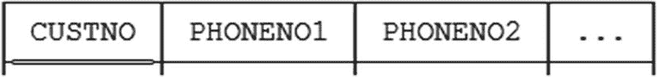
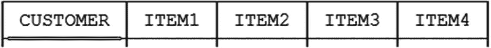
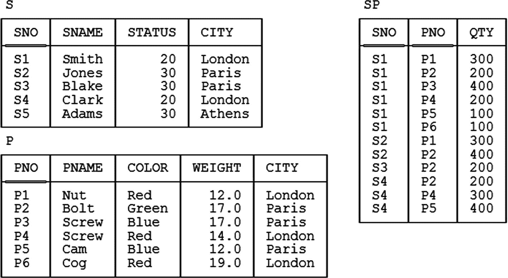
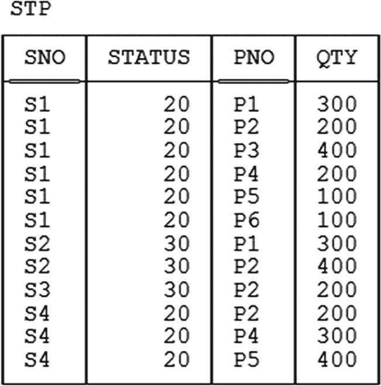
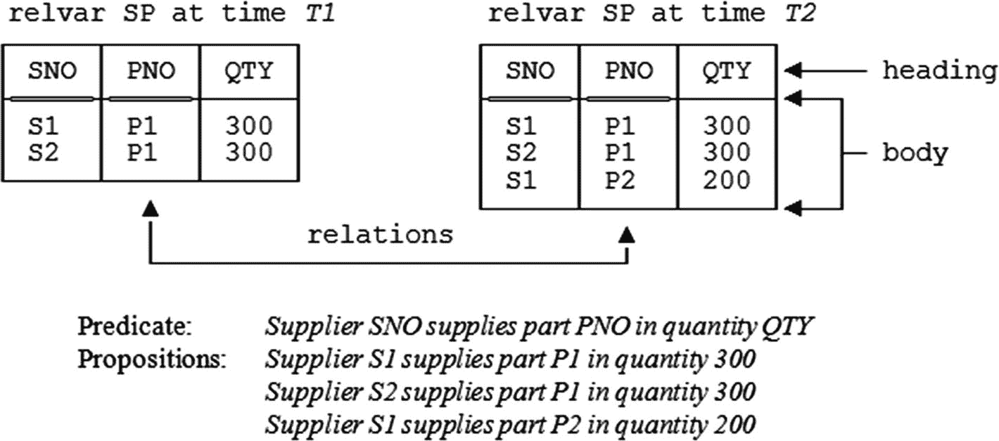
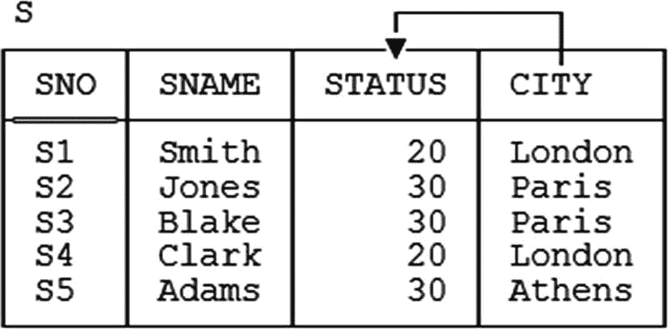
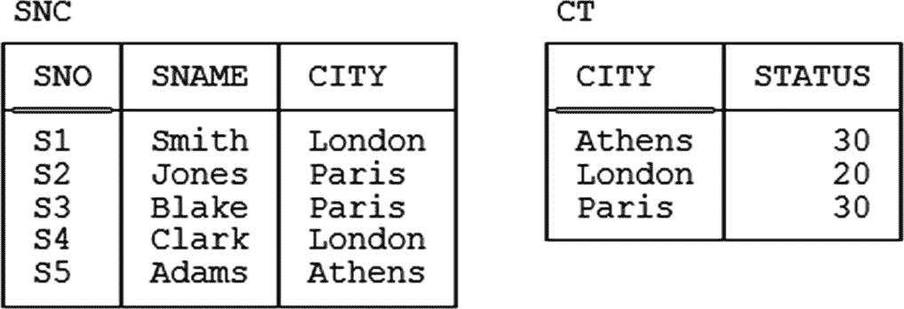
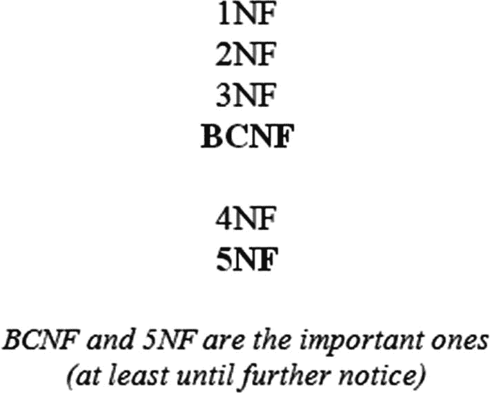

# 第一部分：背景介绍

本书的这一部分由两章介绍性章节组成，其标题（分别是“前言”和“前置知识”）或多或少是自解释的。

## 1. 前言

> *（当被问及什么是爵士乐时：）*
>
> *伙计，如果你还得问，那你永远也不会懂。*
>
> ——路易斯·阿姆斯特朗（据传）

本书的副标题是 `范式及其他相关话题`。显然需要一些解释！首先，我谈论的当然是设计理论——即数据库设计理论——而众所周知，范式是该理论的主要组成部分；因此有了副标题的前半部分。但该理论远不止范式，这一事实解释了副标题的后半部分。第三，不幸的是——至少从从业者的角度来看——设计理论似乎充斥着难以理解、并且似乎与实际进行的设计工作关系不大的术语和概念。这就是为什么我将副标题的后半部分用通俗（甚至可以说是俚语）的措辞表达出来；我想传达这样一个观念：虽然我们偶尔不可避免地会处理“困难”的材料，但我会尽可能让对该材料的处理显得不那么令人望而生畏。当然，我是否达到了这个目标，要由你来评判。

我还想就设计理论是否与实际进行的设计工作有关这一点再多说几句。让我明确一点：没有人能够或应该声称数据库设计是容易的。但扎实的理论知识只会有所帮助。事实上，如果你想正确地进行设计——如果你想构建出如预期那样健壮、灵活和准确的数据库——那么你必须掌握理论。别无选择：至少，如果你想声称自己是设计专业人士的话。设计理论是数据库设计的科学基础，正如关系模型是整个数据库技术的科学基础一样。正如任何从事一般数据库技术工作的专业人士都需要熟悉关系模型一样，任何专门从事数据库设计的人也需要熟悉设计理论。恰当的设计是如此重要！毕竟，数据库处于我们在计算世界中所做大量工作的核心；因此，如果它设计得很糟糕，负面影响可能会异常广泛。


### 文献中的一些引述

由于我们接下来将大量讨论范式，我想以一些文献引述作为开篇，这或许不能说是启发性的，但可能是有趣的（？）。整个范式概念的起点当然是*第一*范式（`1NF`），因此一个显而易见的问题是：*你知道`1NF`是什么吗？* 正如以下引述所表明的（为保护有过者省略了来源），很多人并不知道：

*   要实现第一范式，表中的每个字段必须传达唯一信息。

*   当所有属性都是单值时，称该实体处于第一范式（`1NF`）。

*   当且仅当所有底层域仅包含原子值时，关系才处于`1NF`。

*   如果不存在重复的属性组，那么[该表]就处于`1NF`。

现在，或许可以辩称，这些引述即使不是全部，也至少有一部分在某种程度上是正确的——但它们都马虎到无可救药，即使大体方向是对的。*注意：* 如果你好奇的话，我将在第 4 章给出`1NF`的精确定义。

让我们仔细看看这里的问题所在。再次列出上述第一条引述，这次是完整版本：

*   要实现第一范式，表中的每个字段必须传达唯一信息。例如，如果你有一个`Customer`表，其中有两列用于存储电话号码，那么你的设计就违反了第一范式。第一范式相当容易实现，因为很少有人会认为需要在表中存储重复信息。

好的，那么显然我们讨论的是一种类似这样的设计：



现在，我不能说这是一个好设计，但它肯定没有违反`1NF`。（我说不出它是否是好设计，因为我不知道“两列用于存储电话号码”确切是什么意思——“表中的重复信息”这个表述暗示我们记录了相同的电话号码两次，但这种解释本身就显得荒谬。但即使这种解释正确，它本身也不构成对`1NF`的违反。）

这是另一条引述：

*   第一范式...意味着表不应该有“重复组”字段...重复组是指你一遍又一遍地重复相同的基本属性（字段）。一个很好的例子是当你希望存储在杂货店购买的商品时...[*接着作者给出了一个例子，大概是为了说明重复组的概念，是一个名为`Item Table`的表，包含名为`Customer`、`Item1`、`Item2`、`Item3`和`Item4`的列*]：



嗯，这个设计几乎肯定是糟糕的——如果顾客购买的商品不是正好四件怎么办？——但它糟糕的原因并不是违反了`1NF`；和前一个例子一样，实际上它是一个`1NF`设计。因此，尽管或许可以声称——事实上也经常有人声称——`1NF`宽松地讲确实意味着“无重复组”，但重复组*并非*“一遍又一遍地重复相同的基本属性”。^(⁶)

这个怎么样（在互联网上找到的求助呼喊）？我完全逐字引用，只加了一些粗体：

*   我一直试图找出在`Access`中对表进行规范化的正确方法。据我所知，它从第一范式到第二范式，再到第三范式。通常，就到此为止了，但有时会到第五和第六范式。然后，还有`Cobb 第三范式`。这些我都理解。**我下周就要开始教这门课了，**而我刚拿到教科书。它说的完全不同。它说第二范式只适用于具有多字段主键的表，第三范式只适用于具有单字段键的表。第四范式可以从第一范式到第四范式，其中主键和非键字段之间不存在独立的一对多关系。有人能帮我澄清一下吗？

还有一个（这次附带了一个“有帮助的”回复）：

*   *我不太明白“**规范化**”是什么意思。你能具体说明你指的是哪些规范化规则吗？我的模式在哪些方面不规范？*

规范化：用对原始事物的引用来替换重复事物的过程。

*   例如，给定“`john is-a person`”和“`john obeys army`”，可以观察到第二句中的“`john`”是第一句中“`john`”的重复。使用系统提供的手段，第二句应存储为“`->john obeys army`”。


### 关于术语的说明

正如我确信你已注意到的，前一节中的引文主要以常见的“用户友好”术语——表、行和列（或字段）——来表达。相比之下，在本书中，我将倾向于使用更正式的术语 `关系`、`元组`（通常发音与 `couple` 押韵）和 `属性`。如果我的这一决定使文本变得有点难以理解，我深表歉意，但我确实有我的理由。正如我在 *SQL 与关系理论* 一书中所说：^(⁷)

> 我通常赞同使用更用户友好的术语的想法，前提是它们能帮助使这些概念更容易被接受。然而，在当前情况下，在我看来，遗憾的是，它们并没有使概念更容易被接受；相反，它们扭曲了概念，实际上对真正的理解事业造成了严重的损害。事实是，关系*不是*表，元组*不是*行，属性*不是*列。虽然在非正式语境下假装它们是一样的或许可以接受——事实上，我自己也经常这样做——但我认为，只有当所有相关方都理解那些更用户友好的术语只是对真相的近似，并且总体上未能捕捉到真正发生之事的本质时，这种做法才可以接受。换句话说：如果你确实理解了真实情况，那么明智地使用用户友好术语可能是个好主意；但首先，为了学习和理解那个真实情况，你确实需要掌握那些正式术语。

对于以上内容，请允许我补充一点（正如我在前言中所说），我确实假设你确切知道 `关系`、`属性` 和 `元组` 是什么——尽管关于这些结构的正式定义实际上可以在第 5 章中找到。

还有一个术语问题我也需要先说明一下。关系模型当然是一种数据模型。然而不幸的是，“数据模型”这个术语在数据库领域有两个截然不同的含义。^(⁸) 第一个也是更基本的含义如下：

**定义（数据模型，第一种含义）：** 对数据结构、数据操作符等进行的一种抽象的、自包含的逻辑定义，这些部分共同构成了用户与之交互的抽象机器。

这是我们谈论关系模型时心中所想的含义：关系模型中的数据结构当然是关系，而数据操作符则是关系操作符，如投影、连接以及所有其他操作符。（至于定义中的“等等”，它涵盖了诸如键、外键及各种相关概念等事宜。）

`数据模型` 这个术语的第二种含义如下：

**定义（数据模型，第二种含义）：** 针对某个特定企业的数据（尤其是持久数据）所建立的模型。

换句话说，第二种含义的数据模型只是一个（逻辑的、可能有些抽象的）数据库设计。例如，我们可能会谈到某个银行、医院或政府部门的数据模型。

在解释了这两种不同的含义之后，我想请大家注意一个我认为能很好地阐明它们之间关系的类比：

- 第一种含义的数据模型就像一门编程语言，其结构可用于解决许多具体问题，但其本身与任何此类具体问题并无直接联系。
- 第二种含义的数据模型就像是用那门语言编写的一个具体程序——它使用第一种含义的模型所提供的设施，来解决某个具体问题。

由以上所有内容可知，如果我们谈论的是第二种含义的数据模型，那么我们有理由以复数形式提及“关系模型”，或者使用不定冠词说“一个”关系模型。但如果我们谈论的是第一种含义的数据模型，那么*只有一个关系模型*，并且它是*这个*关系模型，使用定冠词。

现在，你可能知道，大多数关于数据库设计的著作，特别是如果其重点在于实践而非底层理论，都专门在第二种含义上使用“模型”或“数据模型”这个术语。但是——*请务必注意！*——在本书中，我不遵循这种做法；实际上，除了偶尔指代关系模型本身，我根本不用“模型”这个术语。

### 贯穿全书的示例

现在让我介绍一下我将作为本书后续大部分讨论基础的示例：那个熟悉的——甚至可以说是陈腐的——供应商-零件数据库。（我很抱歉又一次搬出这个老例子，但我确实相信，在各种不同的书籍和出版物中使用基本相同的例子，有助于而非阻碍学习过程。）示例值如次页的图 1-1 所示。^(⁹) 详细说明如下：



图 1-1
供应商-零件数据库——示例值

- `供应商`：关系变量 `S` 表示供应商。^(¹⁰) 每个供应商有一个供应商编号（`SNO`），对于该供应商是唯一的；一个名称（`SNAME`），不一定是唯一的（尽管图 1-1 中的 `SNAME` 值恰好是唯一的）；一个状态值（`STATUS`），表示供应商之间的某种排名或优先级；以及一个地点（`CITY`）。
- `零件`：关系变量 `P` 表示零件（更准确地说，是零件的种类）。每种零件有一个零件编号（`PNO`），它是唯一的；一个名称（`PNAME`），不一定是唯一的；一种颜色（`COLOR`）；一个重量（`WEIGHT`）；以及一个存储该种零件的地点（`CITY`）。
- `发货`：关系变量 `SP` 表示发货——它显示了哪些零件由哪些供应商供应或发运。每笔发货有一个供应商编号（`SNO`）、一个零件编号（`PNO`）和一个数量（`QTY`）。此外，为了示例方便，我假设在任何给定时间，对于给定的供应商和给定的零件，最多只有一笔发货，因此每笔发货都有一个唯一的供应商编号/零件编号组合。


### 键

在深入之前，我需要回顾一下 `键` 这个熟悉的概念，即该术语在关系意义上的含义。首先，我相信你知道，每个 `关系变量` 都至少有一个 `候选` 键。候选键基本上就是一个唯一标识符；换句话说，它是一个属性的组合——通常但不总是仅由单个属性组成的“组合”——使得关系变量中的每个元组对于该组合都有唯一的值。例如，参照图 1-1 的数据库：

*   每个供应商都有一个唯一的供应商编号，每个零件都有一个唯一的零件编号，因此 `{SNO}` 是 `S` 的一个候选键，而 `{PNO}` 是 `P` 的一个候选键。
*   对于发货情况，假设在任何给定时间，一个给定的供应商和一个给定的零件最多只有一条发货记录，那么 `{SNO, PNO}` 就是 `SP` 的一个候选键。

顺便注意一下花括号；重申一下，候选键始终是属性的组合，或者说 `集合`（即使该集合只包含一个属性），而在纸上表示集合的惯例是用花括号括起来的一个由元素组成的 `逗号列表`。

这是我第一次提到 `逗号列表` 这个术语，在后续章节中我会不时使用它。其定义如下。令 `xyz` 为某种语法结构（例如，“属性名”）；那么术语 `xyz 逗号列表` 表示一个由零个或多个 `xyz` 组成的序列，其中每对相邻的 `xyz` 之间用逗号分隔（紧跟在逗号之前或之后的空格被忽略）。例如，如果 `A`、`B` 和 `C` 是属性名，那么以下都是属性名逗号列表：

```
A , B , C
C , A , B
B
A , C
```

空的属性名序列同样也是。

此外，当某个逗号列表被花括号括起来从而表示一个集合时，那么（a）紧跟在左花括号之后或右花括号之前的空格被忽略；（b）元素在逗号列表中出现的顺序无关紧要（因为集合的元素没有顺序）；（c）如果一个元素出现多次，它被视为只出现一次（因为集合不包含重复元素）。

接下来，我相信你也知道，`主` 键是以某种方式被挑选出来接受某种特殊处理的候选键。现在，如果所讨论的关系变量只有一个候选键，那么我们称该键为主键并没有什么实质区别。但如果关系变量有两个或更多个候选键，通常会选择其中一个作为主键，意味着它在某种程度上“比其他键更重要”。例如，假设供应商总是同时拥有唯一的供应商编号和唯一的供应商名称，因此 `{SNO}` 和 `{SNAME}` 都是候选键。那么我们可能会选择（比如说）`{SNO}` 作为主键。

请注意，我说的是 *通常* 选择一个主键。确实如此——但这 *并非* 100% 必要。如果只有一个候选键，那就别无选择，也没有问题；但如果有一个以上，那么必须选择一个并使其成为主键，就带有一点随意性，至少对我来说是这样。（当然，有些情况下似乎没有任何真正的充分理由来做这样的选择。甚至可能有充分的理由不这么做。附录 C 详细阐述了这类问题。）出于熟悉的原因，我本人在本书中通常也会遵循主键规范——并且在图 1-1 这样的图中，我会用双下划线标示主键属性——但我想强调的是，从关系的角度来看，以及从设计理论的角度来看，真正重要的是候选键，而不是主键。部分出于这些原因，从今往后，我将使用 `键` 这个无修饰的术语来表示任何候选键，无论该候选键是否另外被指定为主键。（如果你好奇，主键相对于其他候选键所享有的特殊处理，主要本质上是语法上的；它不是根本性的，也不是非常重要。）

*更多术语：* 首先，涉及两个或更多属性的键被称为 `复合` 键（而非复合键有时被称为 `简单` 键）。其次，如果一个给定的关系变量有两个或更多个键，并且其中一个被选为主键，那么其他的键有时被称为 `备用` 键（参见附录 C）。第三，`外` 键是某个关系变量 `R2` 中属性的一个组合或集合 `FK`，要求每个 `FK` 值必须等于某个关系变量 `R1` 中某个键 `K` 的某个值（`R1` 和 `R2` 不必是不同的）。^(¹¹) 以图 1-1 为例，`{SNO}` 和 `{PNO}` 在关系变量 `SP` 中都是外键，分别对应于关系变量 `S` 和 `P` 中的键 `{SNO}` 和 `{PNO}`。


### 设计理论的地位

正如我在前言中所述，当使用术语*设计*时，我指的是逻辑设计，而非物理设计。逻辑设计关注的是用户视角下的数据库形态（通俗地说，指的是存在哪些`关系变量`以及这些`关系变量`上适用哪些约束）；相反，物理设计关注的是给定的逻辑设计如何映射到物理存储。^(¹²) 而术语*设计理论*特指逻辑设计，而非物理设计——关键在于，物理设计必然依赖于目标 DBMS 的某些方面（尤其是性能方面），而逻辑设计是，或者说应该是，独立于特定 DBMS 的。因此，在本书中，未加限定的术语*设计*应被理解为特指逻辑设计，除非上下文另有要求。

现在，设计理论本身并不是关系模型的一部分；相反，它是一个构建在关系模型之上的独立理论。（将其视为广义关系理论的一部分是合适的，但要重申，它本身并不是关系模型的一部分。）因此，像进一步规范化这样的设计概念，其本身是基于更基础的概念——例如，关系代数中的`投影`和`连接`运算符——而这些概念*确实*是关系模型的一部分。（尽管如此，当然也可以认为设计理论在某种意义上是关系模型的一个*逻辑推论*。换句话说，我认为，如果总体上同意关系模型，却不同意基于它的设计理论，这是不一致的。）

逻辑设计的总体目标是实现一个满足以下条件的设计：(a) 硬件独立，原因显而易见；(b) 操作系统和 DBMS 独立，同样原因显而易见；最后，也许有点争议性的是，(c) *应用*独立（换句话说，我们主要关心数据是什么，而不是数据将如何被使用）。这种意义上的应用独立性之所以可取，有一个非常好的理由：通常——也许总是——在设计时，并非所有数据将被投入的用途都已确定；因此，我们希望一个设计是健壮的，即它不会因为出现了原始设计时未曾预料到的应用需求而失效。请注意，这种情况的一个重要结果是，我们（或至少不应该）对因物理性能原因而做出设计折衷感兴趣。设计理论总体而言，特别是具体的数据库设计，绝不应该仅仅由性能考虑所驱动。

回到设计理论本身。正如我们将看到的，该理论包含许多形式化定理，这些定理为设计者提供了可遵循的实用指导原则。因此，如果你是一名设计者，你需要熟悉这些定理。让我赶紧补充一下，我的意思不是你需要知道如何证明这些定理（尽管证明通常相当简单）；我的意思是，你需要知道这些定理阐述了什么——即，你需要知道其结论——并且你需要准备好应用这些结论。这就是定理的优点：一旦有人证明了它们，那么它们的结论就可以在任何人需要时随时使用。

现在，有时人们声称——并非完全没有道理——所有设计理论真正所做的就是*增强你的直觉*。我这么说是什么意思呢？嗯，考虑供应商-零件数据库。该数据库最“显而易见”的设计就是图 1-1 所示的那个；我的意思是，很“明显”需要三个`关系变量`，属性`STATUS`属于关系变量`S`，属性`COLOR`属于关系变量`P`，属性`QTY`属于关系变量`SP`，等等。但为什么这些恰恰是显而易见的呢？嗯，假设我们尝试一种不同的设计；例如，假设我们将`STATUS`属性从关系变量`S`中移出，放入关系变量`SP`中（当然，直觉上这是它错误的位置，因为状态是供应商的属性，而不是发货的属性）。下页的图 1-2 显示了这个修改后的发货关系变量（为避免混淆，我将其称为`STP`）的一个示例值：^(¹³)



图 1-2

关系变量 `STP` — 示例值

看一眼图就足以说明这个设计的问题所在：它是*冗余*的，意思是供应商`S1`的每一行都告诉我们`S1`的状态是`20`，供应商`S2`的每一行都告诉我们`S2`的状态是`30`，依此类推。^(¹⁴) 而设计理论告诉我们，不以“显而易见”的方式设计数据库会导致这种冗余，并且（尽管可能是隐含地）也告诉我们这种冗余的后果会是什么。换句话说，设计理论主要——虽然不是全部——是关于减少冗余的，我们将会看到。（顺便提一句，我注意到部分由于这些原因，该理论被描述为——也许有点刻薄——*一个提供反面例子的好来源*。）

现在，如果设计理论真的只是增强你的直觉，那么它可能会（并且确实曾经）受到这样的批评：它实际上都只是常识罢了。作为例子，再次考虑关系变量`STP`。正如我所说，这个关系变量显然是糟糕设计；冗余是明显的，后果也是明显的，任何有能力的人类设计者都会“自然而然地”避免这样的设计，即使该设计者对设计理论没有任何明确的知识。但这里的“自然而然”是什么意思呢？那个选择更“自然”（也更好）设计的人类设计者，应用了什么原则呢？

答案是：他们应用的恰恰是设计理论所论述的原则（例如，规范化原则）。换句话说，有能力的设计师大脑中已经存在这些原则，即使他们从未正式学习过它们，也无法准确地叫出名字或清晰地阐述它们。所以是的，这些原则是常识——但它们是*形式化的*常识。（常识也许很常见，但要确切说出它是什么并不总是容易的！）设计理论所做的，是以*精确的方式*阐明某些常识的组成部分。在我看来，这才是该理论真正的成就——或者至少是真正的成就之一：它将某些常识性原则形式化，从而为将这些原则机械化（即将它们纳入计算机化的设计工具）打开了可能性。该理论的批评者常常忽略了这一点；他们正确地声称这些想法大多只是常识，但他们似乎没有意识到，以精确而正式的方式阐明常识的含义，这本身就是一项重大成就。


### 对常识与设计的反思

作为前述内容的补充，我意识到常识或许并非如我们想象的那般普遍。以下摘自罗伯特·R·布朗^(¹⁵)论文（经轻微编辑）的片段说明了这一点。布朗首先展示了一个“简化的实际例子”——这是他的原话——涉及一个员工文件（包含员工号、员工姓名、电话号码、部门号和经理姓名等字段）和一个部门文件（包含部门号、部门名称、经理姓名和经理电话号码等字段），其中所有字段都具有直观上显而易见的含义。接着他写道：

*   这个例子所依据的实际数据库拥有更多的文件和字段，以及更多的数据冗余。当被问及为何如此设计时，设计师给出的理由是性能和连接操作的困难。尽管在例子中冗余对您来说可能显而易见，但在设计文档中却不那么明显。在文件和字段更多的大型数据库中，如果不进行全面的信息分析，不与用户组织的专家进行深入讨论，是不可能发现这些重复的。

顺便提一下，我非常喜欢另一段引文——事实上，我曾将其用作《SQL 与关系理论》一书的题词——它支持了我的主张，即从业人员确实需要了解其领域的理论基础。这段话出自列奥纳多·达·芬奇之口（距今约有 500 年了！），内容如下（我添加了粗体）：

*   那些沉迷于实践而忽视理论的人，就像一个没有舵和罗盘就登上船的船长，永远无法确定自己要去哪里。**实践应始终基于扎实的理论知识。**

### 本书的目标

如果您和我一样，您可能在文献和现场演示等场合遇到过许多设计理论术语——例如*投影-连接范式*、*追踪*、*连接依赖*、*FD 保持*等——我相信您有时会疑惑这些术语到底是什么意思。因此，我在本书中的一个目标就是解释这些术语：仔细准确地定义它们，解释其相关性和适用性，并总体上消除它们可能看似笼罩的神秘感。如果我能成功实现这个目标，我将在很大程度上解释清楚设计理论是什么以及为什么它很重要（事实上，本书的一个可能替代标题很可能是《数据库设计理论：它是什么以及你为何应该关心》）。总的来说，我的目标是为数据库专业人员提供一个轻松的设计理论入门。更具体地说，我想做的是：

*   从您可能不熟悉的角度，回顾您应该已经熟悉的设计方面
*   深入探讨您可能尚不熟悉的方面
*   对所有相关概念提供清晰准确的解释和定义（附大量示例）
*   *不*在已经广泛理解的材料上花费过多时间，例如第二和第三范式（2NF 和 3NF）^(¹⁶)

尽管如此，我也应该说明，数据库设计并不是我最喜欢的科目。原因在于，该科目的大部分内容仍然有些……嗯，主观。正如我之前所说，设计理论是数据库设计的科学基础。但遗憾的是，有许多设计问题理论根本没有涉及（至少目前还没有）。因此，虽然我将在本书中描述的形式化原则代表了设计的科学部分，但其他部分，正如我在别处所说，仍然更像是一种艺术努力。实际上，本书传达的一个信息正是我们需要在这个领域引入更多科学（参见第 17 章）。

为了更积极地看待问题，我想请大家注意以下内容。设计理论至少部分涉及捕捉数据的含义，正如科德本人曾经就此概念所说：^(¹⁷)

*   [以某种相当正式的方式]捕捉数据含义的任务是永无止境的……然而，这个目标极其重要，因为*即使微小的成功也能为数据库设计领域带来理解和秩序*。

事实上，我要进一步说：如果你的设计违反了任何已知的科学原理，那么，正如我在别处（在稍有不同的语境中）所写，你唯一可以肯定的就是事情会出错。尽管可能很难确切说出什么会出错，也很难说事情会以严重还是轻微的方式出错，但你*知道*——这是必然的——事情一定会出错。理论很重要。

### 结语

这本书在写作过程中不断扩展；事实证明，尽管上一节的一些评论语调略显消极，但确实有相当多的好材料需要涵盖。更重要的是，这些材料是*递进式的*。因此，虽然前几章可能看起来进展相当缓慢，但我认为您会发现后续节奏会加快。部分原因在于需要引入大量的术语和概念；这些想法本身并不难，但它们可能看起来有点让人应接不暇，至少在您熟悉术语之前是这样。因此，至少在本书的某些关键部分，我会将材料呈现两次——首先是从非正式的角度，然后是从更正式的角度。（正如伯特兰·罗素曾令人难忘地说道：*写作要么可读，要么精确，但两者不可兼得。* 我正试图两者兼得。）

谈到伯特兰·罗素，似乎非常适合用他著作中的另一段精彩引语来结束本章：^(¹⁸)

*   我被指责有改变观点的习惯……我本人对此[习惯]毫不羞愧。1900 年时已活跃的物理学家，谁会梦想夸耀自己在过去的半个世纪里观点没有改变？……我所珍视并努力追求的那种哲学是科学的，其意义在于存在一些可以获取的明确知识，并且新的发现可以使任何公正的心灵不可避免地承认过去的错误。对于我所说的，无论是早期还是晚期，我并不声称拥有神学家们对其信条所宣称的那种真理。我最多只声称，当时表达的观点在那时是明智的……如果后续研究表明它需要修改，我一点也不会惊讶。[这些观点并非]意在作为教条式的宣言，而只是我那时为促进清晰准确的思考所能做的最好努力。清晰，始终是我的目标。

我曾在别处引用过这段摘录——特别是我的书《数据库系统导论》（第 8 版，Addison-Wesley，2004 年）的序言中。我提到后一本书是因为它包含了对本书中更深入涵盖的部分材料的教程式处理。但世界已经进步；我本人对理论的理解，我希望，比写那本早期书时要好得多，而且那本书中的某些处理方面，坦率地说，我现在想要修改。早期处理的一个问题是，我试图通过采用一个虚构的说法——即每个关系变量只有一个键，然后可以无害地将其视为主键——来使材料更易于接受。但这个简化假设的后果是，我给出的一些定义（例如 2NF 和 3NF）不够完全准确。这种情况导致了社区中一定程度的困惑——我坦率承认部分是我的过错，但部分也是由于人们断章取义地理解了这些定义。


### 练习题

这些练习题的目的，是让读者对后续章节的范围有所了解，或许也能测试一下读者现有知识的掌握程度。仅凭本章内容无法回答这些问题。

1.  关系模型确实不要求`关系变量`（`relvars`）处于任何特定的范式，此话当真？
2.  数据冗余是否应该总是被消除？它是否能够被消除？
3.  3NF 和 BCNF 之间有什么区别？
4.  每一个“全键”`关系变量`都处于 BCNF，此话当真？
5.  每一个二元`关系变量`都处于 4NF，此话当真？
6.  每一个“全键”`关系变量`都处于 5NF，此话当真？
7.  每一个二元`关系变量`都处于 5NF，此话当真？
8.  如果一个`关系变量`处于 BCNF 但不处于 5NF，那么它必然是全键的，此话当真？
9.  如果一个`关系变量`只有一个键和另外一个属性，那么它就处于 5NF，此话当真？
10. 你能给出一个关于 5NF 的精确定义吗？
11. 如果一个`关系变量`处于 5NF，那么它就是冗余自由的，此话当真？
12. `精确地讲`，什么是反规范化？
13. 什么是希斯定理（Heath’s Theorem）？它为什么重要？
14. 什么是`正交设计原则`（`The Principle of Orthogonal Design`）？
15. 是什么使得某些连接依赖（JD）是可约的，而另一些不是？
16. 什么是依赖保持？它为什么重要？
17. 什么是追赶（`the chase`）？
18. 你能说出多少种范式的名称？

### 答案

*注：* 本书所有“答案”部分（包括本部分）中的错误都是故意设置的 *<玩笑>*。

1.  是的，确实如此。良好的设计有益于用户，在某种程度上也有益于`DBMS`，但关系模型本身并不关心数据库恰好是如何设计的，只要它所处理的对象确实是关系而不是别的什么（不幸的是，在`SQL`^(¹⁹)中，它们常常不是关系）。
2.  参见第 17 章。
3.  参见第 4 和 5 章。
4.  是的（参见第 4 和 5 章）。
5.  不。（实际上，甚至并非每一个二元`关系变量`都处于 2NF。参见练习 4.6。）
6.  不（参见第 9 和 10 章）。
7.  根据对练习 1.5 的回答，更不可能是这样。
8.  不（参见第 13 章）。
9.  不（参见第 13 章）。
10. 参见第 10 章。
11. 不（参见第 9 和 17 章）。
12. 参见第 8 章。
13. 参见第 5 章。
14. 参见第 16 章。
15. 参见第 11 章。
16. 参见第 7 章。
17. 参见第 11 章。
18. 参见第 15 章。

脚注 1   2   3   4   5   6   7   8   9   10   11   12   13   14

## 2. 先决条件

> 世界是所有发生的事情。
>
> —路德维希·维特根斯坦：《逻辑哲学论》（1921）

你应该是一名数据库专业人士，我指的是这样的人：（a）是数据库从业者，（b）对关系理论有相当程度的熟悉。请注意——我很抱歉必须这么说，但这是事实——对`SQL`的了解，无论多么深入，都*不足以*满足该要求的第（b）部分。正如我在《SQL 与关系理论》中所说：

*   我确信你对`SQL`有所了解；但是——我为可能带有冒犯的语气道歉——如果你对关系模型的了解仅仅来自于你对`SQL`的了解，那么恐怕你对关系模型的了解不够深入，而且你可能知道一些并非如此的东西。我再说一遍：*`SQL`和关系模型不是一回事*。

因此，本章的目的是告诉你一些我希望你已经知道的事情。如果你知道，那么本章将起到复习的作用；如果你不知道，那么我希望它能成为一个足够的教程。更具体地说，我想做的是详细阐述关系理论的某些基本方面，这些方面在接下来的篇幅中我将大量依赖。根据我的经验，数据库从业者往往没有意识到这些方面（至少不是明确地意识到）。当然，我还会依赖关系理论的其他方面，如果我认为有必要，在我使用它们时再详细阐述。

### 概述

让我首先快速总结一下刚才提到的那些“关系理论的基本方面”，主要是为了便于后续参考：

*   任何给定的数据库都由一组`关系变量`（简称`关系变量`）组成。
*   任何给定`关系变量`在任何给定时间的值都是一个`关系值`（简称`关系`）。
*   每个`关系变量`都代表某个`谓词`（即“`关系变量谓词`”）。
*   在任何给定的`关系变量`中，每个元组都代表某个`命题`。
*   在`时间 T`的`关系变量 R`包含且仅包含那些代表`关系变量 R`对应`谓词`的实例化的元组，这些实例在`时间 T`时评估为`真`。

接下来的两节（大量基于《SQL 与关系理论》中的材料）将详细阐述这些观点。


### 关系与关系变量

再看一下第 1 章中的图 1-1，即供应商-零件数据库。该图显示了三个关系：具体来说，是数据库在某个特定时刻恰好存在的关系。但是，如果我们从另一个时间点查看同一个数据库，我们很可能会看到三个不同的关系取代了它们。换句话说，`S`、`P`和`SP`实际上是变量——精确地说是关系变量——并且就像一般变量一样，它们在不同时间具有不同的值。既然它们是关系变量，那么它们在任何给定时间的值，当然是关系值。

为了进一步探讨这些概念，考虑图 2-1。该图显示：(a)左边是图 1-1 中发货关系的一个大幅简化版本；(b)右边是在执行了某个更新后得到的关系。使用上一段的术语，我们可以说：(a)在图的左边，我们看到的是关系变量`SP`在某个特定时间*T1*的关系值；(b)在右边，我们看到的是同一个关系变量在某个可能稍晚的时间*T2*的关系值，在插入了一个额外的元组之后。



**图 2-1**

关系值与变量——一个例子

因此，关系值和关系变量之间存在明显的逻辑差异。问题在于，数据库界历来使用同一个术语*relation*来指代这两个概念，这种做法无疑导致了混淆（尤其是在本书讨论的上下文中，例如进一步规范化）。因此，在本书中，从此往后，我将非常仔细地区分这两者——当我说关系值时，我会用关系值这个术语；当我说关系变量时，我会用关系变量这个术语。不过，我也会在大多数时候将*relation value*简写为*relation*（正如我们大多时候将*integer value*简写为*integer*一样）。并且我会在大多数时候将*relation variable*简写为***relvar***；例如，我会说供应商-零件数据库包含三个*relvars*（更准确地说，是三个*base* relvars；视图也是 relvars，但本书中关于视图本身我没什么要多说的）。

实际上，关于视图，有一点我确实想说。*可交换性原则*（视图与基本 relvars 之间）实际上表明——至少对用户而言——视图应该看起来和感觉起来就像基本 relvars 一样。（我指的不是那些仅定义为简写形式的视图，我指的是旨在以某种方式使用户与“真实”数据库隔离的视图。详见第 17 章对这一点的阐述。）一般来说，用户实际上交互的并不是一个只包含基本 relvars（“真实”数据库）的数据库，而是一个可以称为*用户*数据库的东西，它包含一些基本 relvars 和视图的混合。但是，这个用户数据库对用户而言，应该看起来和感觉起来就像一个真实数据库一样；因此，本书将要讨论的所有设计原则，例如规范化原则，同样适用于此类用户数据库，而不仅仅是“真实”数据库。出于这个原因，在本书中我将随意使用不加限定的术语*relvar*，依靠上下文来表明该术语是指基本 relvars 和视图两者，还是仅特指基本 relvars（或仅特指视图）。

让我们回到图 2-1。正如该图所示，关系由两部分组成：*头部*和*体部*。基本上，头部是一个属性的集合，而体部是一个符合该头部的元组的集合。例如，图 2-1 中显示的两个关系都有一个包含三个属性的头部；此外，图中左边的关系有一个包含两个元组的体部，右边的那个有一个包含三个元组的体部。因此请注意，一个关系并不真正包含元组，至少不是直接包含——它包含一个体部，而那个体部又包含元组。然而，在实践中，为了简单起见，我们确实通常谈论得好像关系直接包含元组一样。由此引申的要点：

*   头部和体部的术语可以以显而易见的方式扩展到 relvars。当然，一个 relvar 的头部（就像关系的头部一样）永远不会改变——它等同于可能被赋给该 relvar 的所有可能关系的头部。相比之下，体部会改变；具体来说，随着在相关 relvar 上执行更新，它会改变。

*   我说过头部是一个属性的集合。然而，就本书而言，更简单的想法是将头部仅视为一组属性*名*——这当然是一种简化，但对所讨论的事项没有严重的负面影响。

*   实际上，更正确的想法是将头部视为一组*属性名/类型名对*（当然，同时保留要求这些属性名必须互不相同）。例如，在本书的所有示例中，我将假设属性`SNO`和`PNO`都是`CHAR`类型（任意长度的字符串），属性`QTY`是`INTEGER`类型（整数）。^(²⁰^) 当我说符合某个头部的元组时，我的意思是该元组中的每个属性值都必须是相应类型的值。例如，为了让一个元组符合 relvar `SP`的头部，它必须具有属性`SNO`、`PNO`和`QTY`（没有其他），并且这些属性的值必须分别是`CHAR`、`CHAR`和`INTEGER`类型。

虽然话是这么说，但我现在也必须说明，对于关系设计理论的目的而言，类型大多不是非常重要。这就是为什么从此往后，我将随意简化我对头部的定义。此外，在我大多数的关系和 relvar 示例（以及 relvar 定义）中，我也将只显示属性名，而不费心甚至不提及相应的类型。

*   给定头部中的属性数量是该头部的*度*（有时称为*元数*）。它也是具有该头部的任何关系或 relvar 的度。

*注意：*术语*度*也用于元组和键（以及外键）的上下文中。例如，relvar `SP`的所有元组都像该 relvar 本身一样，度为三；该 relvar 的唯一键`{SNO, PNO}`的度为二；该 relvar 中的两个外键`{SNO}`和`{PNO}`的度各为一。

*   给定体部中的元组数量是该体部的*基数*。它也是具有该体部的任何关系或 relvar 的基数。^(²¹^)

*   （头部、关系等的）度可以是任何非负整数。度 1 称为*一元*；度 2，*二元*；度 3，*三元*；以此类推。更一般地说，度*n*称为*n 元*。


### 谓词与命题

再次考虑供货关系变量 `SP`。和所有关系变量一样，该关系变量旨在表示现实世界的某个部分。实际上，我可以更精确地说：该关系变量的标题表示某个*谓词*，即它是关于现实世界某一部分的一种通用陈述（之所以说“通用”，是因为它是*参数化的*，我稍后会解释）。所讨论的谓词（即关系变量 `SP` 的谓词）非常简单：

*   供应商 `SNO` 供应零件 `PNO`，数量为 `QTY`。

这个谓词是关系变量 `SP` 的*预期解释*——换句话说，即其*含义*。

或许我应该就本书中*谓词*这一术语的用法再多说几句。首先，你可能已经熟悉这个术语了，因为 SQL 大量使用它来指代布尔值或真值表达式（它谈论比较谓词、`IN` 谓词、`EXISTS` 谓词等等）。然而，虽然 SQL 的这种用法并非完全错误，但它确实挪用了一个非常通用的术语——该术语在数据库语境中极其重要——并赋予其一个相当专门化的含义，这就是为什么我自己更倾向于不遵循那种用法。

其次，为了准确起见，我应该解释一下，谓词本身并不是一个陈述语句；确切地说，它是该陈述所作出的断言。例如，关系变量 `SP` 的谓词就是其本身，无论它是用英语、西班牙语还是其他语言表达的。然而，为了简便，在下文中我将假设谓词确实就是一个陈述语句本身，通常（但不一定）是用某种自然语言（如英语）表达的。

最后，我已经解释了我所说的这个术语的含义，但你应该意识到——尽管有上一段的内容——关于谓词*确切*是什么，即使在逻辑学家中似乎也鲜有共识。特别是，一些作者将谓词视为纯粹的形式构造，其本身没有意义，并将我所说的“预期解释”视为与谓词本身不同的东西。我不想在此陷入关于此类问题的争论；欲进一步讨论，请参阅 C. J. Date 和 Hugh Darwen 所著的《数据库探索：关于<第三宣言>及相关主题的论文集》(*Database Explorations: Essays on The Third Manifesto and Related Topics*, Trafford, 2010) 中的论文《什么是谓词？》(“What’s a Predicate?”)。

你可以将谓词（稍显宽松地）理解为*一个真值函数*。像所有函数一样，它有一组参数；调用时会返回一个结果；并且（因为它是真值函数）该结果要么是 `TRUE`（真），要么是 `FALSE`（假）。以关系变量 `SP` 的谓词为例，其参数是 `SNO`、`PNO` 和 `QTY`（当然对应于该关系变量的属性），它们代表相应类型的值（在这个简单例子中分别是 `CHAR`、`CHAR` 和 `INTEGER`）。当我们调用这个函数——当我们*实例化该谓词*时（用逻辑学家的话说）——我们用实参替换形参。假设我们分别用实参 `S1`、`P1` 和 `300` 替换。我们得到如下陈述：

*   供应商 `S1` 供应零件 `P1`，数量为 `300`。

这个陈述实际上是一个*命题*，在逻辑学中，命题是无条件地求值为 `TRUE` 或 `FALSE` 的东西。这里有几个例子：

1.  爱德华·艾比（Edward Abbey）写了《猴子扳手帮》(*The Monkey Wrench Gang*)。
2.  威廉·莎士比亚（William Shakespeare）写了《猴子扳手帮》(*The Monkey Wrench Gang*)。

第一个命题为真，第二个为假。不要陷入常见的误区，认为命题必须总是真的！不过，我此刻谈论的命题*确实*被假定为真命题，我现在解释如下：

*   首先，如前所述，每个关系变量都有一个相关联的谓词，称为该关系变量的*关系变量谓词*。（因此，*供应商 `SNO` 供应零件 `PNO`，数量为 `QTY`* 就是关系变量 `SP` 的关系变量谓词。）
*   设关系变量 `R` 具有谓词 `P`。那么，在某个给定时间 `T` 出现在 `R` 中的每个元组 `t`，都可视为表示某个命题 `p`，该命题是通过在时间 `T` 使用 `t` 中的属性值作为实参来调用（或*实例化*）`P` 而派生的。
*   并且（*非常重要！*）我们按约定假设，以这种方式获得的每个命题 `p` 求值结果均为 `TRUE`。

例如，给定图 2-1 左侧所示的关系变量 `SP` 的示例值，我们假定以下两个命题在时间 `T1` 求值结果均为 `TRUE`：

*   供应商 `S1` 供应零件 `P1`，数量为 `300`。
*   供应商 `S2` 供应零件 `P1`，数量为 `300`。

此外，我们更进一步：如果在某个给定时间 `T`，某个元组看似合理地可以出现在某个关系变量中但实际上没有，那么我们有权假设相应的命题在该时间 `T` 为假。例如，元组

```
( 'S1' , 'P2' , 200 )
```

（采用一种明显的简写表示法）肯定是一个合理的 `SP` 元组；但它在时间 `T1` 并没有出现在关系变量 `SP` 中——我再次指的是图 2-1——因此我们有权假设，在时间 `T1`，以下命题*并非*为真：

*   供应商 `S1` 供应零件 `P2`，数量为 `200`。

（另一方面，该命题在时间 `T2` 为真。）

总结一下：在任何给定时间，一个给定的关系变量 `R` 包含*所有且仅*那些在该时间表示真命题（即关系变量 `R` 的关系变量谓词的真实实例化）的元组——或者，至少，这是我们在实践中始终假设的。换句话说，我们在实践中采纳了所谓的*封闭世界假设*。由于该假设至关重要——它是我们使用数据库时所做几乎所有事情的基础，尽管很少被明确提及——我想在此将其明确阐述如下：

*   **定义（封闭世界假设）：** 设关系变量 `R` 具有谓词 `P`。那么*封闭世界假设*（`CWA`）指出：(a) 如果元组 `t` 在时间 `T` 出现在 `R` 中，则假定与 `t` 对应的 `P` 的实例化 `p` 在时间 `T` 为 `TRUE`；反之，(b) 如果元组 `t` 在时间 `T` 看似合理地可以出现在 `R` 中但实际没有，则假定与 `t` 对应的 `P` 的实例化 `p` 在时间 `T` 为 `FALSE`。换句话说（稍显宽松）：元组 `t` 在时间 `T` 出现在关系变量 `R` 中，当且仅当它在时间 `T` “满足 `R` 的谓词”。


### 关于供应商与零件的更多内容

现在，让我们回到供应商与零件数据库本身，其示例值如前一章图 1-1 所示。以下是该数据库中三个关系变量的定义，使用一种名为 `Tutorial D` 的语言表达（定义之后有进一步解释）：

```
VAR S BASE RELATION
{ SNO CHAR , SNAME CHAR , STATUS INTEGER , CITY CHAR }
KEY { SNO } ;
VAR P BASE RELATION
{ PNO CHAR , PNAME CHAR , COLOR CHAR , WEIGHT RATIONAL , CITY CHAR }
KEY { PNO } ;
VAR SP BASE RELATION
{ SNO CHAR , PNO CHAR , QTY INTEGER }
KEY { SNO , PNO }
FOREIGN KEY { SNO } REFERENCES S
FOREIGN KEY { PNO } REFERENCES P ;
```

正如我所说，这些定义是用一种名为 `Tutorial D` 的语言表达的。我认为这种语言在很大程度上是不言自明的；然而，如果需要，可以在 C. J. Date 和 Hugh Darwen 所著的 *Databases, Types, and the Relational Model: The Third Manifesto* （第 3 版，Addison-Wesley，2007 年）一书中找到全面的描述。²²^ *注意：* 正如其标题所示，该书也介绍并解释了*《The Third Manifesto》*，这是对关系模型及其支持的类型理论（顺带包括一个全面的类型继承模型）的一个精确但有些正式的定义。²³^ 特别地，它使用名称 `D` 作为任何符合 *《The Third Manifesto》* 所确立原则的语言的通用名称。任何数量的不同语言都可以成为有效的 `D`；然而遗憾的是，SQL 并不是其中之一，这就是为什么本书中的示例大多用 `Tutorial D` 而非 SQL 表达的原因。（当然，`Tutorial D` 是一个有效的 `D`；事实上，它是被明确设计为适合用作阐述和教授 *《The Third Manifesto》* 思想的载体。）

现在正好提一下，本书使用的术语基于*《The Third Manifesto》*（简称“*Manifesto*”）。因此，它偶尔会与一些设计理论文献中的术语有所不同。例如，那些文献通常不谈论关系标题；而是使用术语 *关系模式*。²⁴^ 它们也不谈论关系变量；而是将本书中称为赋给某个关系变量的关系值称为相应*模式*的*实例*。

回到关系变量的定义。如你所见，每个定义都包含一个 `KEY` 规范，这意味着任何可能赋给这些关系变量的关系都必须满足相应的*键约束*。（回想第 1 章，每个关系变量确实至少有一个键。）例如，任何可能赋给关系变量 `S` 的关系都必须满足这样一个约束：在该关系中，没有两个不同的元组具有相同的 `SNO` 值。此外，在本书中，除非有明确声明，否则我将假设以下*函数依赖*²⁵^（FD）也在关系变量 `S` 中成立：

```
{ CITY } → { STATUS }
```

你可以非正式地将此 FD 读作 *STATUS 函数依赖于 CITY*，或 *CITY 函数决定 STATUS*，或更简单地读作 *CITY 箭头 STATUS*。它的意思是，任何可能赋给关系变量 `S` 的关系都必须满足这样一个约束：如果该关系中的两个元组具有相同的 `CITY` 值，那么它们也必须具有相同的 `STATUS` 值。²⁶^ 观察图 1-1 中给出的关系变量 `S` 的示例值，它确实满足此约束。*注意：* 在本书的第二部分和第三部分，我将对 FD 进行更多的讨论，但我相信你已经熟悉了基本思想。

现在，正如使用 `KEY` 规范来声明键约束一样，我们需要某种语法来声明 FD 然而约束。然而，`Tutorial D` 并没有为此目的提供特定的语法²⁷^（SQL 也没有）。它确实允许以某种迂回的方式表达它们——例如：

```
CONSTRAINT XCT
COUNT ( S { CITY } ) = COUNT ( S { CITY , STATUS } ) ;
```

*解释：* 在 `Tutorial D` 中，形式为 *rx*{*A1*,...,*An*} 的表达式表示对关系表达式 *rx* 求值所得的关系 *r* 在属性 *A1*, ..., *An* 上的投影。因此，如果关系变量 `S` 的当前值是关系 *s*，那么 (a) 表达式 `S{CITY}` 表示 *s* 在 `CITY` 上的投影；(b) 表达式 `S{CITY,STATUS}` 表示 *s* 在 `CITY` 和 `STATUS` 上的投影；(c) 整个约束——我随意命名为 `XCT`——要求这两个投影的基数（由两个 `COUNT` 调用表示）相等。（如果要求这两个基数相等等价于要求所需的 FD 约束成立这一点不明显，可以尝试根据图 1-1 中的样本数据来解释所陈述的约束 `XCT`。）

你可能会觉得，在约束 `XCT` 的表述中使用 `COUNT` 有点不够优雅，这种感觉并非没有道理。如果是这样，那么这里有一个避免使用它们的替代表述：

```
CONSTRAINT XCT
WITH ( CT := S { CITY , STATUS } ) :
AND ( ( CT JOIN ( CT RENAME { STATUS AS X } ) ) , STATUS = X ) ;
```

*解释：* 首先，`WITH` 规范（“`WITH (…):`”）仅用于引入一个名称 `CT`，该名称可以在后面的整个表达式中使用，以避免多次写出它所代表的表达式。其次，`Tutorial D` 的 `RENAME` 运算符或多或少是不言自明的（但无论如何，在练习 2.15 的答案中有定义）。第三，`Tutorial D` 表达式 `AND(*rx*,*bx*)`，其中 *rx* 是关系表达式，*bx* 是布尔表达式，当且仅当对于 *rx* 所表示的关系中的每个元组，*bx* 所表示的条件求值为 `TRUE` 时，才返回 `TRUE`。

尽管有上述情况，我将在本书中假设可以使用前面演示的简单箭头符号来陈述（或“声明”）FD。类似的评论也适用于其他类型的依赖（特别是连接依赖和多值依赖，我将分别在第 9 章和第 12 章介绍）。

我将以一个小悬念结束本章。假设适用于供应商与零件数据库的唯一约束是前述的 FD 约束以及指定的键（和外键）约束，那么我们可以说关系变量 `S`、`P` 和 `SP` 分别处于第二、第五和第六范式。要理解这些观察的意义，请继续阅读！

### 练习

这些练习旨在测试你对关系理论的了解。其中大部分无法仅凭本章内容作答。然而，这些练习以及下一节答案中提及的所有内容，都在《*SQL 与关系理论*》一书中有详细讨论。

1.  什么是 `信息原理`？

2.  以下哪些陈述是正确的？
    1.  关系（以及关系变量）的元组没有顺序。
    2.  关系（以及关系变量）的属性没有顺序。
    3.  关系（以及关系变量）永远不会有没有名称的属性。
    4.  关系（以及关系变量）永远不会有两个或更多同名的属性。
    5.  关系（以及关系变量）永远不会包含重复的元组。
    6.  关系（以及关系变量）永远不会包含空值。
    7.  关系（以及关系变量）总是处于第一范式。
    8.  关系属性所基于的类型可以任意复杂。
    9.  关系（以及关系变量）本身具有类型。

3.  以下哪些陈述是正确的？
    1.  每个标题的子集都是一个标题。
    2.  每个主体的子集都是一个主体。
    3.  每个元组的子集都是一个元组。

4.  `定义域` 这个术语通常在关系理论的文本中找到，但在本章正文中并未提及。你如何看待这一事实？

5.  定义 `命题` 和 `谓词` 这两个术语。并举例说明。

6.  阐明供应商-零件数据库中关系变量 `S`、`P` 和 `SP` 的谓词。

7.  设 `DB` 为你碰巧熟悉的任意数据库，并设 `R` 为 `DB` 中的任意关系变量。`R` 的谓词是什么？*注意：* 此练习的要点是让你将本章正文讨论的一些想法应用到你自己的数据上，以期促使你用这些术语来泛化地思考数据。显然，这个练习没有唯一的正确答案。

8.  用你自己的话解释 `封闭世界假设`。是否存在一种叫做 `开放世界假设` 的东西？

9.  尽可能精确地定义 `元组` 和 `关系` 这两个术语。

10. 尽可能精确地说明：(a) 两个元组相等意味着什么；(b) 两个关系相等意味着什么。

11. 元组是一个集合（分量的集合）；那么你认为定义适用于元组的常规集合运算符（并、交等）的版本是否有意义？

12. 再次强调，元组是分量的集合。但空集是一个合法的集合；因此，我们可以定义一个 `空元组`，即相关分量集合为空的元组。这有何含义？你能想到这种元组的任何用途吗？

13. 键是一个属性的集合，而空集是一个合法的集合；因此，我们可以定义一个 `空键`，即相关属性集合为空的键。这有何含义？你能想到这种键的任何用途吗？

14. 谓词有一个参数的集合，而空集是一个合法的集合；因此，一个谓词可以有空的参数集合。这有何含义？

15. 规范化规则大量使用关系运算符投影和连接。尽可能精确地定义这两个运算符。另外，尝试定义属性重命名运算符（`Tutorial D` 中的 `RENAME`）。

16. 关系代数的运算符构成了一个封闭系统。你如何理解这一论述？

### 答案

1.  `信息原理` 是支撑整个关系模型的基本原理。可以表述如下：

    **定义（`信息原理`）：** 关系数据库中唯一允许的变量是关系变量或关系变量。等价地，数据库在任何给定时间点的全部信息内容仅以一种方式表示——即，作为关系中元组内属性位置上的值。

    注意，涉及从左到右列顺序或包含重复行或空值的 SQL 表（至少是数据库中的 SQL 表）都违反了 `信息原理`（参见下一个练习的答案）。然而有趣的是，具有匿名列或非唯一列名的 SQL 表显然不违反该原理。原因是所陈述的原理明确适用于数据库中的关系变量或关系。虽然 SQL 表通常可以有匿名列或非唯一列名，但这样的表不能成为数据库的一部分。这种状况相当强烈地表明，`信息原理` 可能需要稍作收紧。

2.  a. 正确。b. 正确。c. 正确。d. 正确。e. 正确。f. 正确。g. 正确。h. 错误。然而，这“几乎”是正确的；有两个小的例外，为了当前目的我稍作简化。第一个是，如果关系 `r` 的类型是 `T`，那么 `r` 的任何属性本身都不能是类型 `T`。第二个是，数据库中任何关系都不能有任何指针类型的属性。^(²⁸) i. 正确。

    *辅助练习：* 如果原始陈述是针对 SQL 表而非关系和关系变量来表述的，上述答案中是否有任何会改变？

    *答案：* 是的，除了 a. 和 h. 以外，其他都会改变。对于 h.，答案实际上也应该改变，从“错误”变为“错误，但更是如此”。造成这种状况的一个原因（并非唯一原因）是 SQL 没有恰当的表类型概念，因此 SQL 列根本不可能属于这种类型。

3.  a. 正确。b. 正确。c. 正确。*注意：* 在此我需声明，在本书中，按照标准数学惯例，我将“`B` 是 `A` 的子集”（符号表示为“`B` ⊆ `A`”）这种形式的表述理解为包含 `B` 和 `A` 可能相等的情况。因此，例如，每个标题都是其自身的子集，每个主体也是，每个元组也是。当我想排除这种可能性时，我会明确使用 *真* 子集（符号表示为“`B` ⊂ `A`”）。例如，我们通常的供应商关系的主体当然是它自身的子集，但不是它的真子集（*没有* 集合是其自身的真子集）。此外，上述评论同样适用于超集，作必要修改即可；例如，我们通常的供应商关系的主体是其自身的超集，但不是其自身的真超集。*更多术语：* 一个集合被称为 *包含* 其子集。顺便说一句，不要把包含（inclusion）与 *包含关系*（containment）混淆——一个集合 *包含* 其子集，但 *含有* 其元素。

4.  该术语未在正文中提及的原因是，它只是 `类型` 的同义词。（早期的关系著作，包括我自己的，倾向于使用它，但近期的著作则使用 `类型` 代替，因为它更简短，并且至少在计算机领域有更悠久的历史渊源。）因此，定义域是一个命名的、有限的值集合——某个特定种类的所有可能值：例如，所有可能的整数，或所有可能的字符串，或所有可能的三角形，或所有可能的 XML 文档，或具有特定标题的所有可能的关系（等等，等等）。顺便说一句，不要将关系世界中理解的定义域与 SQL 中同名的构造相混淆，后者（如《*SQL 与关系理论*》中所解释的）充其量只能被视为一种非常弱的类型。

5.  见本章正文。

### 关于关系变量的定义

*   **关系变量 S**：供应商的编号（*SNO*）、名称（*SNAME*）、所在城市（*CITY*）以及状态（*STATUS*）。
*   **关系变量 P**：零件的编号（*PNO*）、名称（*PNAME*）、颜色（*COLOR*）、重量（*WEIGHT*）以及存储城市（*CITY*）。
*   **关系变量 SP**：供应商（*SNO*）供应零件（*PNO*）的数量（*QTY*）。

### 答案

*未提供答案。*

### 封闭世界假设与开放世界假设

*封闭世界假设*（CWA）粗略地讲，是指数据库中明确陈述或隐含的一切都为真，而其他一切则为假。^(²⁹) 而*开放世界假设*（OWA）——没错，确实有这种东西——则是指数据库中明确陈述或隐含的一切都为真，而其他一切则为未知。这有什么含义呢？首先，我们同意将*封闭世界假设*和*开放世界假设*分别缩写为 CWA 和 OWA。现在考虑查询“供应商 S6 在罗马吗？”（更精确地说，“在关系变量*S*中，是否存在*SNO*值为'S6'且*CITY*值为'罗马'的元组？”）。**Tutorial D** 表述如下：

```
( S WHERE SNO = 'S6' AND CITY = 'Rome' ) { }
```

正如《SQL 与关系理论》中所解释的，该表达式的结果要么是`TABLE_DEE`，要么是`TABLE_DUM`。`TABLE_DEE`和`TABLE_DUM`是仅有的两个度数为零的关系；`TABLE_DEE`只包含一个元组（实际上是空元组），而`TABLE_DUM`则完全不包含任何元组。在 CWA 下，如果结果为`TABLE_DEE`，则意味着答案是*是的*，供应商 S6 确实存在且位于罗马；如果结果为`TABLE_DUM`，则意味着答案是*不是*，供应商 S6 不存在或不在罗马。相反，在 OWA 下，`TABLE_DEE`仍然意味着*是的*，但`TABLE_DUM`意味着供应商 S6 是否存在或在罗马是*未知的*。

现在考虑查询“如果供应商 S6 存在，那么该供应商在罗马吗？”（请注意此查询与上面讨论的查询在逻辑上的区别）。请注意，如果关系变量*S*显示供应商 S6 存在但位于罗马以外的其他城市，那么这个查询的答案必须是*不是*，无论我们讨论的是 CWA 还是 OWA。^(³⁰) 因此，这里的**Tutorial D**表述是：

```
TABLE_DEE MINUS ( ( S WHERE SNO = 'S6' AND CITY ≠ 'Rome' ) { } )
```

所以，务必注意，如果此表达式的结果是`TABLE_DUM`，那么这个`TABLE_DUM`必须意味着*不是*，*即使在 OWA 下也是如此*。因此，OWA 存在固有的模糊性：有时`TABLE_DUM`必须意味着*未知*，而有时它必须意味着*不是*——当然我们（一般来说）无法确定何时适用哪种解释。

需要再次强调的是：在关系世界中，`TABLE_DEE`和`TABLE_DUM`分别代表*是的*和*不是*，并且没有可用的“第三个度数为零的关系”来表示 OWA 从根本上要求的“第三个真值”。因此，OWA 和关系模型从根本上是不兼容的。

### 精确定义

精确的定义在第 5 章中给出。

### 值的相等性

任何类型的两个值，当且仅当它们是同一个值时才相等（这意味着它们必须是同一类型，这是不言而喻的）。因此，两个元组相等当且仅当它们是同一个元组，两个关系相等当且仅当它们是同一个关系。但我们可以更具体地阐述细节：
1.  两个元组*t*和*t'*相等，当且仅当它们具有相同的属性*A1*, ..., *An*，并且对于所有*i* (*i* = 1, ..., *n*)，*t*中*Ai*的值等于*t'*中*Ai*的值。
2.  两个关系*r*和*r'*相等，当且仅当它们有相同的标题和相同的体（即，它们的标题相等且体相等）。因此，特别要注意，两个“空关系”（即没有任何元组的关系，或等价地说体为空的关系）相等当且仅当它们的标题相等。

### 元组上的运算

是的！然而，我们当然希望此类运算符总是产生一个有效的元组作为结果（即，我们希望此类运算具有*闭包*，就像我们关系运算具有闭包一样——参见下面练习 2.16 的答案）。例如，对于元组并，我们希望输入元组满足同名属性具有相同值（因此，不言而喻，它们是同一类型）。举例来说，令*t1*和*t2*分别是一个供应商元组和一个发货元组，并且令*t1*和*t2*具有相同的*SNO*值。那么*t1*和*t2*的并集`UNION{*t1*,*t2*}`——使用**Tutorial D**符号——是一个类型为`TUPLE {SNO CHAR, SNAME CHAR, STATUS INTEGER, CITY CHAR, PNO CHAR, QTY INTEGER}`的元组，其属性值来自*t1*或*t2*或两者（如适用）。例如，如果*t1*是`(S1,Smith, 20,London)`，*t2*是`(S1,P1,300)`——使用本章正文“谓词与命题”一节中引入的元组简写符号^(³¹)——那么它们的并集是元组`(S1,Smith,20,London,P1,300)`。*注意：* 此操作同样可以称为*元组连接*而非元组并。

顺便说一句，不仅常见的集合运算符可以调整应用于元组——某些著名的关系运算符也是如此（正如我刚才在连接方面所暗示的）。一个重要的例子是元组投影运算符，它是关系投影运算符的直接改编。例如，令*t*为一个供应商元组；那么*t*在属性集`{SNO,CITY}`上的投影*t*{SNO,CITY}，是*t*中仅包含来自*t*的*SNO*和*CITY*分量的子元组。（当然，子元组本身也是一个元组。）同样，*t*{CITY}是*t*中仅包含*CITY*分量的子元组，而*t*{ }是*t*中不包含任何分量的子元组（换句话说，它是 0 元组——参见下面练习 2.12 的答案）。事实上，值得注意的是，*每一个*元组都有一个在空属性集上的投影，其值正是 0 元组。

### 空元组

空元组（注意有且只有一个这样的元组；等价地说，所有空元组彼此相等）就是前面练习答案中提到的 0 元组。至于这种元组的用途，我只想说，至少在概念上，这样一个元组的存在在许多方面至关重要。特别是，空元组是特殊关系`TABLE_DEE`中唯一的元组，这已在练习 2.8 的答案中提到。

### 空键

说关系变量*R*有一个空键，是说*R*永远不能包含超过一个元组。为什么？因为每个元组对于空属性集都有相同的值——即空元组（参见前两个练习的答案）；因此，如果*R*有一个空键，并且如果*R*包含两个或更多元组，我们将面临键唯一性违反。而且，是的，约束*R*永远不能包含超过一个元组当然可能是有用的。我将寻找这种情况的例子作为一个附属练习。

### 谓词与命题

一个具有空参数集的谓词是一个命题。换句话说，命题是一个退化的谓词；所有命题都是谓词，但“大多数”谓词不是命题。

### 投影与连接的定义

投影和连接的定义在第 5 章中给出，但这里是**RENAME**的定义：

**定义（属性重命名）**：令*r*为一个关系，*A*为*r*的一个属性，且*r*没有一个名为*B*的属性。那么重命名*r* `RENAME {*A* AS *B*}` 是一个关系*r'*，其 (a) 标题与*r*的标题相同，只是该标题中的属性*A*被重命名为*B*，(b) 体与*r*的体相同，只是该体中对*A*的所有引用（更准确地说，该体中的元组中对*A*的引用）被替换为对*B*的引用。


*注*：`Tutorial D`还支持一种形式的`RENAME`，允许并行执行两个或多个独立的属性重命名（“多重`RENAME`”）。示例见第 16 章。

## 第二部分：函数依赖、Boyce/Codd 范式及相关事项

**函数依赖、Boyce/Codd 范式及相关事项**

尽管范式本身并非设计理论的全部，但不可否认的是，它们构成了该理论中非常重要的一部分，并且构成本书第二至第四部分的主要主题。本部分，即第二部分，将讨论推进至**Boyce/Codd 范式**（`BCNF`），这是关于**函数依赖**（`FDs`）的“那个”范式。

## 3. 规范化：一些通则

> *正常：参见异常。*
>
> ——摘自早期 IBM PL/I 参考手册（1960 年代）

在本章中，我希望在开始深入具体细节之前（这将是下一章的内容），先阐明进一步规范化的一些通用方面。我将从更仔细地审视图 1-1 中关系变量`S`的样本值开始（为方便起见，在下方重复为图 3-1）：



图 3-1
供应商关系变量——样本值

现在回想一下，函数依赖（`FD`）

```
{ CITY } -> { STATUS }
```

在关系变量`S`中成立（我在图中加入了一个箭头来表示这一事实）。因为该`FD`在该关系变量中成立^(³²)，结果该关系变量处于第二范式（`2NF`）但不在第三范式（`3NF`）。因此，它存在冗余问题；具体来说，一个给定城市具有一个给定状态的事实通常会出现多次。于是，*进一步规范化*的原则——请注意，从此时起，我大多数时候会将其简称为*规范化*，不再加限定词——会建议我们将该关系变量分解为两个度更小的关系变量`SNC`和`CT`，如图 3-2 所示（该图当然展示了对应于图 3-1 中关系变量`S`样本值的这两个关系变量的值）。



图 3-2
关系变量`SNC`和`CT`——样本值

由此例引出的要点：

*   首先，分解或规范化确实消除了冗余——一个给定城市具有一个给定状态的事实现在只出现一次。
*   其次，分解过程基本上是一个*取投影*的过程——图 3-2 中显示的关系是图 3-1 中所示关系的各自投影。实际上，我们可以写出几个等式：^(³³)

    ```
    SNC  =  S { SNO , SNAME , CITY }
    CT   =  S { CITY , STATUS }
    ```

    *注：* 其他类型的分解也是可能的，但在没有进一步通知前，我将假定术语*分解*（不加限定词）特指通过投影进行的分解。

*   第三，分解过程是*无损*的（也称为*无损连接*）——在此过程中没有信息丢失，因为图 3-1 中所示的关系可以通过对图 3-2 中所示关系取*连接*来重建：

    ```
    S  =  SNC JOIN CT
    ```

    （再次使用`Tutorial D`语法）。因此，我们可以说图 3-1 中的关系与图 3-2 中的一对关系是*信息等价*的——或者，更精确地说，对于针对图 3-1 关系能执行的任何查询，都存在一个针对图 3-2 关系能执行的相应查询（反之亦然），能产生相同的结果。显然，分解的这种“无损性”是一个重要特性；无论我们进行何种规范化操作，我们在操作时绝不能丢失任何信息。
*   由上述可推知，正如投影是（常规理解的）规范化的分解算符一样，连接是其对应的*重*组合算符。

脚注 1   2   3   4   5   6   7   8   9   10   11   12


### 规范化服务于两个目的

到目前为止，一切都很好；这些都是我们非常熟悉的内容。但现在我想指出，如果你一直在仔细听讲，你或许有理由指责我在前面的论述中玩了一个小小的(?) 花招……具体来说，我探讨了*关系*的何种分解才是无损的；但规范化——我们真正应该讨论的主题——并非关乎分解关系，而是关乎分解*关系变量*。（毕竟，根据定义，数据库设计就是关于选择数据库中应该存在哪些关系变量，而不是哪些关系。）

假设我们确实决定执行将关系变量 `S` 分解为关系变量 `SNC` 和 `CT` 的建议。请注意，现在我确实在谈论关系变量而非关系；然而，为了明确起见，我们假设所讨论的关系变量具有图 3-1 和 3-2 所示的样本值。再次为了明确起见，让我们专门关注关系变量 `CT`。嗯，那个关系变量确实是一个关系变量——我的意思是，它是一个变量——因此我们可以更新它。例如（使用第 2 章介绍的元组简写符号），我们可能会插入元组

```
( 'Rome' , 10 )
```

但在此更新之后，关系变量 `CT` 包含了一个在关系变量 `S` 中没有对应项的元组（顺便说一句，在关系变量 `SNC` 中也没有对应项）。现在，这种可能性经常被用作——事实上，Codd 在他关于规范化的最初几篇论文中就曾亲自使用过（参见附录 D）——支持首先进行分解的论据：由此产生的双关系变量设计能够表示原始的单关系变量设计所不能表示的某些信息。（在当前案例中，它可以表示那些当前没有任何供应商位于的城市的状态信息。）但同一事实也意味着，这两种设计并非真正信息等价，此外，关系变量 `CT` 也并非完全就是关系变量 `S` 的一个“投影”^(³⁴)——它包含一个并非源自关系变量 `S` 中任何元组的投影或其他方式派生出来的元组。^(³⁵) 或者更确切地说（或许更关键的是），`CT` 也不是 `SNC` 和 `CT` 之连接的投影，因此，从某种意义上说，那个连接“丢失了信息”；具体来说，它丢失了罗马状态为 10 的信息。^(³⁶)

如果我们从关系变量 `SNC` 中删除元组

```
( 'S5' , 'Adams' , 'Athens' )
```

也会出现类似的情况。在此更新之后，我们可以说，^(³⁷) 关系变量 `S` 包含一个在关系变量 `SNC` 中没有对应项的元组（尽管在关系变量 `CT` 中有一个）。因此，这两种设计再次并非真正信息等价；而这次关系变量 `S` 并不完全算是关系变量 `SNC` 和 `CT` 的一个“连接”，因为它包含一个与关系变量 `SNC` 中任何元组都不对应的元组。

因此，这两种设计终究不是信息等价的。但我之前不是说过分解的“无损性”是一个重要属性吗？我们通常不都假设，如果设计 *B* 是通过规范化设计 *A* 而产生的，那么设计 *B* 和设计 *A* 应该是信息等价的吗？这里到底发生了什么？

#### 通过谓词来理解

为了回答这些问题，审视关系变量的谓词是有帮助的。`SNC` 的谓词是：

*   *供应商 `SNO` 的名称是 `SNAME`，并且位于城市 `CITY`。*

而 `CT` 的谓词是：

*   *城市 `CITY` 的状态为 `STATUS`。*

现在，假设一个城市即使没有任何供应商位于其中，也可能拥有一个状态；换句话说，假设关系变量 `CT` 可能包含一个像 `(Rome,10)` 这样的元组，而在关系变量 `SNC` 中没有对应项。^(³⁸) *那么，仅由关系变量 `S` 构成的设计就是完全错误的。* 也就是说，如果谓词 *城市 `CITY` 的状态为 `STATUS`* 的一个真例化可能存在，而与此同时，不存在一个具有相同 `CITY` 值的谓词 *供应商 `SNO` 的名称是 `SNAME`，并且位于城市 `CITY`* 的真例化，那么仅由关系变量 `S` 构成的设计就无法忠实地反映现实世界的事态（因为该设计无法表示没有任何供应商位于的城市的状态）。

类似地，假设一个供应商可能位于某个城市，即使该城市没有状态；换句话说，假设关系变量 `SNC` 可能包含一个元组，例如 `(S6,Lopez,Madrid)`，而在关系变量 `CT` 中没有对应项。那么，再次地，仅由关系变量 `S` 构成的设计就是不正确的，因为它要求每个有供应商位于的城市都必须有某种状态。

#### 一种完整性约束视角

这里有另一种方式来看待前面的论证。假设仅由关系变量 `S` 构成的设计确实忠实地反映了现实世界的事态。那么，关系变量 `SNC` 和 `CT` 将受到以下完整性约束（“`SNC` 中的每个城市都出现在 `CT` 中，反之亦然”）：

```
CONSTRAINT ... SNC { CITY } = CT { CITY } ;
```

但这个约束——这是我稍后将称之为*等值依赖*或 `EQD` 的一个例子——在所讨论的示例中显然未被满足。*注意：* 为简单起见，如你所见，我没有费心给这个约束命名。实际上，从现在起，除了有令人信服的理由需要命名的情况，我将在本书的所有示例中省略此类名称。

#### 规范化的两个目的

总结一下，我们看到规范化可以（并且确实）用于解决两个相当不同的问题：

1.  它可用于修正逻辑上不正确的设计，如本节前面讨论的示例所示。*练习：* 类似于该示例中提出的问题是否也适用于第 1 章“设计理论的地位”一节中的 `STP` 示例？（*答案：* 是的，适用。）

2.  它可用于减少一个在其他方面逻辑上正确设计中的冗余。（显然，一个设计不必在前述意义上是逻辑不正确的才会表现出冗余。）

实践中产生了许多混淆，因为这两种情况常常未被明确区分。事实上，大多数文献都集中在案例 2 上——并且为了明确起见，在接下来的内容中，如果这有影响的话，我自己也将假设是案例 2——但请不要忽视案例 1，它在实践中至少同样重要，甚至可能更重要。

此外，我应该指出，严格来说，投影和连接的术语仅适用于案例 2。这是因为在案例 1 中，正如我们所看到的，“新”关系变量不一定是“旧”关系变量的投影，“旧”关系变量也不一定是“新”关系变量的连接（如果你明白我的意思）。实际上，谈论关系变量（而非关系）的投影和连接到底意味着什么？嗯，正如我在其他地方或多或少写过的那样：^(³⁹)


根据定义，投影、连接等操作是专门应用于关系值的。它们当然也适用于那些恰好是关系变量当前值的值。因此，讨论，例如，关系变量`S`在属性`{CITY, STATUS}`上的投影是完全合理明确的，这意味着对关系变量`S`的当前值在这些属性上进行投影所得到的关系。然而，在某些上下文（例如，在规范化过程中）中，使用诸如“关系变量`S`在属性`{CITY, STATUS}`上的投影”这样的表达式，并赋予其稍有不同的含义，被证明是方便的。具体来说，我们可能会松散但非常方便地说，某个关系变量`CT`是关系变量`S`在属性`{CITY, STATUS}`上的投影——更准确地说，这意味着关系变量`CT`在任何时刻的值都等于该时刻关系变量`S`的值在这些属性上的投影。因此，在某种意义上，我们可以讨论关系变量本身的投影，而不仅仅是关系变量当前值的投影。类似的论述也适用于所有关系运算。

换句话说，我们仍然使用投影/连接术语，即使在情况 1 中也是如此。这样的说法有些欠妥——甚至可以说是草率的——但它至少很简洁。但更准确的说法应该是，分解不是一个直接进行投影的过程，而是一个*让人想起*投影（对重组和连接也是如此）但又与之并不完全相同的过程。

### 更新异常

*更新异常*的概念在讨论规范化时经常被提及。应该清楚，任何形式的冗余都可能导致异常——因为冗余大致意味着某些信息被表示了两次，因此总是存在两种表示不一致的可能性（即，如果其中一个被更新而另一个没有）。更具体地说，让我们考虑关系变量`S`的情况，其中存在以下函数依赖（`FD`）：

```
{ CITY } → { STATUS }
```

这个`FD`所导致的冗余——即，关于某个城市具有某种状态的事实的重复或双重表示——已经讨论过了。它会导致如下异常（这些例子假设了图 3-1 中关系变量`S`的样本值）：

*   **插入异常**：在罗马有供应商之前，我们无法插入“罗马的状态是 10”这个事实。
*   **删除异常**：如果我们删除唯一在雅典的供应商，我们就会丢失“雅典的状态是 30”这个事实。
*   **修改异常**：我们无法在不修改（通常）该供应商状态的情况下，更改（“修改”）给定供应商的城市。并且我们无法在不为该城市所有供应商进行相同修改的情况下，修改给定供应商的状态。

用两个“投影”关系变量`SNC`和`CT`替换关系变量`S`可以解决这些问题（具体如何解决？）。此外，我要正式声明，关系变量`S`（如前所述）处于第二范式（`2NF`）而非第三范式（`3NF`），而关系变量`SNC`和`CT`都处于第三范式（`3NF`），实际上也处于`BCNF`。一般来说，`BCNF`是解决上述各类异常所引起问题的方案。

### 范式层次结构

如你所知，存在许多不同的范式。下面的图 3-3 是我对所谓的范式层次结构的初步展示（但请注意，我将在后面的章节——具体是第 13 至 15 章——中扩展这个层次结构）。



图 3-3 范式层次结构（一）

要点：

*   首先，你可能认为这个层次结构是颠倒的，因为它把最高的范式放在底部，最低的放在顶部。我不想争论这一点；我只想说，按图中所示的方式展示（在我看来）更符合这样一个事实：例如，所有`2NF`关系变量都属于`1NF`，但有些`1NF`关系变量不属于`2NF`。
*   存在许多不同的范式：第一、第二、第三，等等。图中展示了六种，但如你所见，它们并未被标记为第一到第六（不完全如此）——在第三和第四范式之间有一个“闯入者”`BCNF`。我将在第 4 章解释这个术语怪异的原因；现在，我只想说`BCNF`是*Boyce/Codd 范式*的缩写。尽管存在`BCNF`这个例外，但使用*第 n 范式*这个术语来泛指不同级别的规范化是方便的，在下文中我将不时采用这种用法。
*   图中还在`BCNF`和`4NF`之间显示了一个有意的间隔。然而，这个间隔并非暗示那里可能存在某些“缺失”的范式（实际上没有）；相反，它反映了在前四种范式和后两种范式之间，层次结构中存在某种概念上的跳跃或转变。更多解释请参见本书第三部分。
*   除第一范式（`1NF`）外，所有范式都是根据某些*依赖*定义的——在此上下文中，这*依赖*只是完整性约束的另一个术语。从规范化角度看，依赖的主要类型是*函数*依赖（`FDs`）和*连接*依赖（`JDs`）。
*   图中将`BCNF`和`5NF`突出显示（用粗体），以表明它们相对于其他所示范式的重要性。`BCNF`是根据函数依赖定义的，`5NF`是根据连接依赖定义的。实际上，我们将在后续章节中看到，就函数依赖（`FDs`）而言，`BCNF`确实是“那个”范式；就连接依赖（`JDs`）而言，`5NF`确实是“那个”范式。
*   一般来说，从设计角度看，规范化级别越高越好——因为规范化级别越高，可能出现的冗余就越少，因此可能发生的更新异常也就越少。
*   一个关系变量可能处于*第 n*范式而不处于*第 n+1*范式。
*   相反，如果关系变量*R*处于*第 n+1*范式，那么它肯定也处于*第 n*范式。换句话说，第五范式（`5NF`）意味着第四范式（`4NF`），依此类推。因此，说关系变量*R*处于`BCNF`并不排除*R*也可能处于`5NF`的可能性。然而，在实践中，诸如“关系变量*R*处于，比如说，`BCNF`”这样的陈述，通常被理解为*R*处于`BCNF`*且不处于任何更高的范式*。因此，请特别注意，本书中我*不*遵循这种用法。
*   如果关系变量*R*处于*第 n*范式而不处于*第 n+1*范式，那么它总是可以通过投影以无损方式进行分解，使得（a）投影通常处于*第 n+1*范式，并且（b）*R*等于这些投影的连接。


*   最后，由前一点可知，任何给定的关系变量 *R* 总是可以被分解为 5NF 投影。换句话说，5NF 总是可以实现的。

*关于冗长性的概念说明：* 在第 1 章中，我说过设计理论在很大程度上——并非完全——是关于减少冗长性的，并且我在本章中多次提到了冗长性；特别是，我提到规范化程度越高，能防止的冗长性就越多。但是，给冗长性下一个精确的定义似乎相当困难！——事实上，困难到我认为在本书的这个早期阶段，甚至尝试定义它都是不合适的，所以我不会这样做。换句话说，在进一步通知之前，我只是假设我们至少能够识别它（即冗长性）——尽管，实际上，即便这是一个相当大的假设。第 17 章将深入探讨这个概念。

### 规范化与约束

与规范化相关的还有另一个常被忽视的问题。再次考虑将关系变量 `S` 分解为其投影 `SNC` 和 `CT` 的例子——`SNC` 在 `{SNO, SNAME, CITY}` 上，`CT` 在 `{CITY, STATUS}` 上。那么有三种情况需要考虑：

1.  假设原始设计，仅包含关系变量 `S`，至少在逻辑上是正确的（即，它仅仅遭受冗长性问题）。正如我在“规范化有两个目的”一节中指出的，那么，在这两个投影之间存在某个约束（一个“相等依赖”）：

    ```
    CONSTRAINT ... SNC { CITY } = CT { CITY } ;
    ```
    （“`SNC` 中的每个城市都出现在 `CT` 中，反之亦然”）。

2.  或者，假设 `SNC` 和 `CT` 中的一个可能包含一个在另一个中没有对应元组的元组，而反之则不可能。为了明确起见，再次假设 `CT` 可能包含像 `(Rome, 10)` 这样在 `SNC` 中没有对应元组的元组，而 `SNC` 永远不可能包含一个在 `CT` 中没有对应元组的元组。那么，在两个投影之间存在一个*外键约束*（从 `SNC` 到 `CT`，在刚才提到的具体例子中）：^(⁴⁰)

    ```
    FOREIGN KEY { CITY } REFERENCES CT
    ```

3.  第三种可能性，也许比前两种可能性小，是 `CT` 和 `SNC` 都可能被允许包含在对方中没有对应元组的元组。例如，可能 `CT` 包含元组 `(Rome, 10)` 但没有供应商位于罗马，而 `SNC` 包含元组 `(S6, Lopez, Madrid)` 但马德里没有状态。在这种情况下，显然在两个关系变量之间根本不涉及任何关于城市的约束（至少，为了这个例子，我们假设没有）。

现在，稍微简化一下，我说过一个处于 *n* 范式的关系变量 *R* 总是可以无损分解为处于 *n*+1 范式的投影。然而，如前所述，*这样的分解通常意味着至少有一个新的约束现在需要被维护*。更糟糕的是，所讨论的约束是一个*多关系变量*约束（即，它跨越两个关系变量，在某些情况下可能超过两个）。因此存在一个权衡：我们是想要分解的好处，还是想避免那个多关系变量约束？^(⁴¹)

或许有人会认为，至少在 `SNC` 和 `CT` 的例子中，分解也意味着现在有一个约束*不再*需要维护：即函数依赖 `{CITY} -> {STATUS}`。但这个论点并不完全有效——就这点而言，分解所做的只是将那个约束从一个关系变量转移到另一个关系变量（实际上是从关系变量 `S` 到关系变量 `CT`，在那里，维护约束 `{CITY}` 是一个键这一事实会附带维护该函数依赖）。

现在，在正在讨论的简单例子中，进行分解的好处几乎肯定超过了不进行分解的好处。但情况并非总是如此；事实上，在更复杂的情况下，是否要进行分解可能是一个相当令人头疼的问题。在下文中，为了避免大量重复的文字，我通常会假设我们总是希望进行分解——但请不要忘记，有时存在有说服力的不去分解的理由，特别是在比当前例子更复杂的例子中，如本书第三和第四部分所讨论的。


### 相等依赖

再次考虑将关系变量 S 分别投影到 {SNO, SNAME, CITY} 和 {CITY, STATUS} 上得到 SNC 和 CT 的分解例子。假设这两个投影之间存在如下约束：

```
CONSTRAINT ... SNC { CITY } = CT { CITY } ;
```
（即“SNC 中的每个城市都出现在 CT 中，反之亦然”）。如前一节所述，这个约束就是所谓的**相等依赖**的一个例子。我马上会精确定义这个概念。不过，首先我想引入一个约定，从今往后我将使用它来稍微简化投影的记法^(⁴²)。设关系表达式 *rx* 的计算结果为关系 *r*；关系 *r* 的标题为 *H*；*X* 是 *H* 的一个子集；*A1*, ..., *An* 是 *X* 的所有属性（即 *X* = {*A1*, ..., *An*}）。那么，我们允许投影表达式 *rx*{*A1*,...,*An*} 被缩写——虽然有点不合逻辑——为 *rx*{*X*}。

#### 定义（相等依赖）
粗略地说，一个约束要求两个指定的关系相等。更精确地说，设 *R1* 和 *R2* 是关系变量，其标题分别为 *H1* 和 *H2*。同时，设 *X1* 和 *X2* 分别是 *H1* 和 *H2* 的子集，并且存在一个可能为空的属性重命名集合，使得对 *R1* 在 *X1* 的属性上进行投影并应用这些重命名后的结果 *R* 具有标题 *X2*。那么，*R1* 和 *R2* 之间的一个相等依赖 (EQD) 是一个陈述，其大意是 *R* 和 *R2* 在 *X2* 的属性上的投影必须相等——即，*R* = *R2*{*X2*}。

事实上，相等依赖是一种更普遍现象——称为包含依赖——的一个重要特例：

#### 定义（包含依赖）
粗略地说，一个约束要求一个指定的关系包含在另一个关系中。更精确地说，设 *R1* 和 *R2* 是关系变量，其标题分别为 *H1* 和 *H2*。同时，设 *X1* 和 *X2* 分别是 *H1* 和 *H2* 的子集，并且存在一个可能为空的属性重命名集合，使得对 *R1* 在 *X1* 的属性上进行投影并应用这些重命名后的结果 *R* 具有标题 *X2*。那么，从 *R1* 到 *R2* 的一个包含依赖 (IND) 是一个陈述，其大意是 *R* 必须包含在（即是...的子集）*R2* 在 *X2* 的属性上的投影中——用符号表示，*R* ⊆ *R2*{*X2*}。

由后一个定义引发的一些要点：

*   外键约束是 IND 的一个特例。例如，在供应商-零件数据库中，关系变量 SP 中的 {SNO} 是一个外键，引用关系变量 S 中的键 {SNO}；因此，存在一个从 SP 到 S 的 IND——SP 在 {SNO} 上的投影包含在 S 在 {SNO} 上的投影中（用符号表示，`SP{SNO} ⊆ S{SNO}`）。但请注意，（使用前面定义中的记法）一般的 IND，与特定的外键约束不同，并不要求 *X2* 是 *R2* 的一个键^(⁴³)。

*   如前所述，EQD 也是 IND 的一个特例。更具体地说，EQD "*A* = *B*" 等价于一对 IND "*A* 包含在 *B* 中" 和 "*B* 包含在 *A* 中"（用符号表示，*A* ⊆ *B* 且 *B* ⊆ *A*）。换句话说，EQD 可以说是一种双向的 IND。

在接下来的内容中，我们将会看到许多 EQD 的例子，特别是相对于一般的 IND 而言。事实上，这种情况应该是显而易见的：将一个关系变量无损分解为投影通常至少会导致 IND，而且往往会导致 EQD，正如我们已经知道的。然而，在某种程度上，有趣的 EQD 是那些并非由无损分解产生的那些。原因是，这样一个 EQD 的存在通常被证明是冗余的标志——因为如果（正如我之前所说）某条信息被表示了两次，那么可能就需要一个 EQD 来保持两种表示的一致。

如果你以前从未听说过 EQD，你可能会想，鉴于它们的概念重要性，为什么没有呢？当然，它们在文献中似乎并没有受到太多关注。在我看来，造成这种不幸状况的最可能原因是 SQL 语言……如果你曾经尝试过，你就会知道，在 SQL 中表述 EQD 极其笨拙，因为 SQL 没有直接表达关系比较的方法^(⁴⁴)。支持这一论点的一个突出例子可以在本书第 17 章对示例 12 的讨论中找到。


### 结语

我想以讨论一个本书至今尚未涉及的问题来结束本章。这是一个术语问题。具体来说，为什么`1NF`、`2NF`等等被称为范式？再进一步，为什么规范化被称为规范化？

这些问题的答案源于数学，尽管所涉及的思想渗透到包括计算机科学在内的几个相关学科中。在数学中，我们经常发现自己必须处理某种大型的、甚至可能是无限的对象集合：例如，所有矩阵的集合，所有有理数的集合，或者——更贴近本书主题一点——所有关系的集合。在这种情况下，我们希望为所讨论的对象找到一组*规范形*。^(⁴⁵) 这里有一个定义：

*   **定义（规范形）：** 给定一个集合`s1`，连同在该集合元素间定义的一个等价概念，当且仅当在该等价概念下，`s1`的每个元素`x1`都等价于`s2`中的唯一元素`x2`（并且该元素`x2`就是元素`x1`的规范形）^(⁴⁶) 时，`s1`的子集`s2`是`s1`的一组规范形。适用于`x1`的各种“有趣”性质也适用于`x2`；因此，我们可以只研究小集合`s2`，而不是大集合`s1`，来证明各种“有趣”的定理或结果。

作为这一概念的一个简单说明，令`s1`是（无限的）非负整数集合{0,1,2,...}，并且当且仅当两个整数除以五的余数相同时，它们等价。那么我们可以定义`s2`为集合{0,1,2,3,4}。至于这个例子中适用的一个“有趣”定理，令`x1`、`y1`和`z1`是`s1`中的任意三个元素（即任意三个非负整数），并令它们在`s2`中的规范形分别为`x2`、`y2`和`z2`；那么乘积`y1` × `z1`等价于`x1`，当且仅当乘积`y2` × `z2`等价于`x2`。

现在，*范式*只是规范形的另一个术语。因此，当我们在数据库上下文中谈论范式时，我们谈论的是数据的一种规范表示。详细说明一下：众所周知，任何给定的数据集合都可以用许多不同的关系方式来表示。当然，所有这些方式都——事实上必须——是信息等价的；也就是说，信息等价就是我们在此特定上下文中所诉诸的“定义的等价概念”。然而，其中一些方式（即表示给定信息的方式）因各种原因优于其他方式。而这些优选的方式，当然就是关系范式，它们是本书大部分内容的主题。

至于术语*规范化*，它简单地指将某个给定对象映射到其规范等价物的一般过程。特别是在数据库上下文中，因此（如我们所知）它用于指将某个给定关系变量映射到一组关系变量的过程，这组关系变量（a）合起来考虑时，与原始关系变量信息等价，但（b）每个单独都处于某种优选的范式。

对于以上所述，我或许还应补充以下内容。据我所知，Codd 本人在其早期关于该主题的著作中，从未提及他引入范式或规范化术语的原因。但多年以后，他确实公开给出了他自己的、可能半开玩笑的解释：^(⁴⁷)

```
***采访者：*** “规范化”一词从何而来？

***科德：*** 当时我认为必须为数据库设计引入某种规范。我称之为规范化，因为当时尼克松总统经常谈到与中国关系的正常化。我想，既然他能够“正常化”关系，我也能。
```

### 练习题

1.  考虑第 1 章“设计理论的地位”一节中的 STP 示例。给出该设计可能产生的更新异常的例子。同时给出一个适当的分解，并说明该分解如何避免这些异常。

2.  无损分解基于这样一种思想：一个关系可以分解成若干投影，使得原始关系可以通过将这些投影连接回来而恢复。事实上，如果关系`r`的投影`r1`和`r2`满足`r`的每个属性都至少保留在`r1`和`r2`中的一个里，那么连接`r1`和`r2`将总是产生`r`的每一个元组（以及可能的其他元组）。证明这一断言。

    *注意：* 由此可知，非无损分解的问题不在于连接会丢失元组——而在于它会产生额外的、或称为“虚假”的元组。由于我们通常无法知道连接中的哪些元组（如果有的话）是虚假的，哪些是真实的，因此该分解已经丢失了信息。

3.  “规范化服务于两个目的。”用你自己的话解释这个观点。你认为这个观点被广泛理解了吗？

4.  用你自己的话解释以下内容：(a) 相等依赖；(b) 包含依赖；(c) 外键约束；(d) 规范形。

### 答案

1.  参考第 1 章（图 1-2）所示关系变量`STP`的样本值，我们无法插入“供应商 S5 的状态为 30”这一事实，直到供应商 S5 供应了某个零件；我们无法删除供应商 S3 的发货信息而不丢失“供应商 S3 的状态为 30”这一事实；而且我们无法修改某个给定供应商（例如供应商 S1）在一个元组中的状态而不修改其在所有元组中的状态。显而易见的分解是将其分解为关系变量，其头分别为`{SNO,STATUS}`和`{SNO,PNO,QTY}`；同样明显的是，这种分解避免了这些异常。

    *注意：* 值得指出的是，此示例中的插入和删除异常是由设计逻辑不正确引起的，而修改异常则是由它表现出冗余引起的（见练习 3.3）。

2.  令`r`的头被划分为属性集`X`、`Y`和`Z`，并令投影`r1`和`r2`分别基于`{X,Y}`和`{Y,Z}`。（注意，根据定义，`X`、`Y`和`Z`是不相交的。）现在令`(x,y,z)`是`r`的一个元组；^(⁴⁸) 那么`(x,y)`和`(y,z)`分别是`r1`和`r2`的元组，因此`(x,y,z)`是`r1`和`r2`连接中的一个元组。*补充练习：* 如果集合`Y`为空，上述证明会发生什么变化？

3.  两个目的（纠正不正确设计和减少冗余）在章节正文中已有解释。至于你是否认为该观点被广泛理解：嗯，只有你能回答这个问题，但就我个人而言，我不得不说，我认为没有。

4.  参见章节正文。

脚注 1   2   3   4   5   6   7   8   9   10   11   12   13   14   15   16   17


