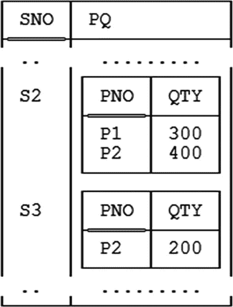
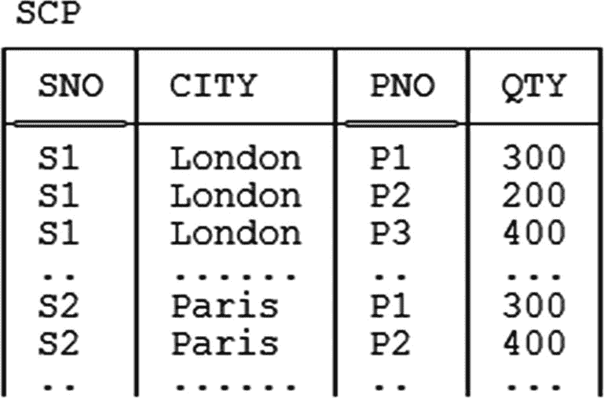
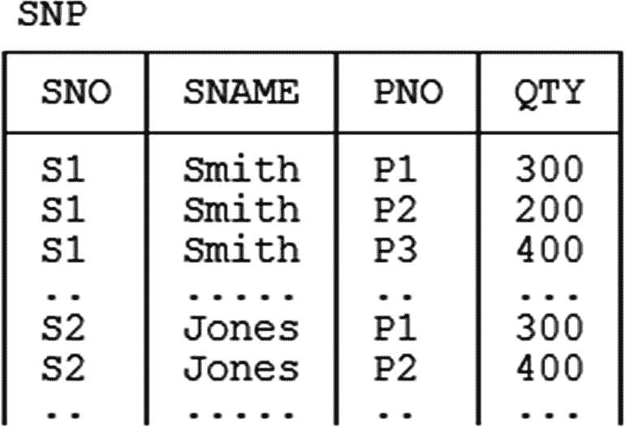
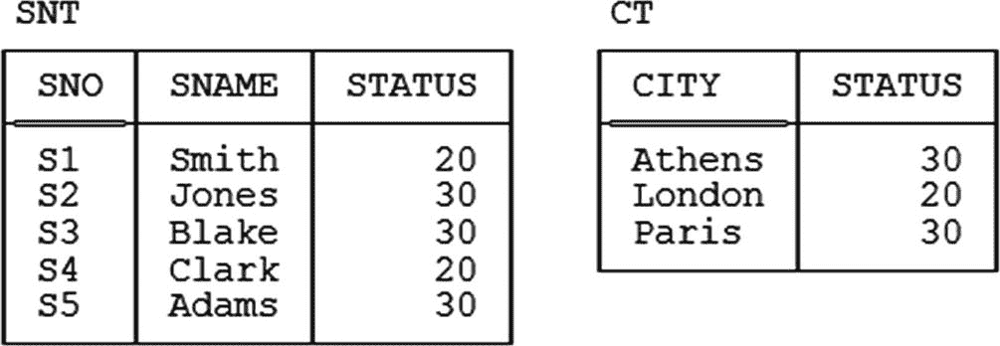

# 第四章 函数依赖与 BCNF（非正式讨论）

> *在抽象概念之前教授具体内容，简直是罪过。*
> 
> ——Z·A·梅尔扎克：《具体数学 companion》（1973）

如前一章所述，Boyce/Codd 范式（简称 `BCNF`）是根据函数依赖（`FDs`）定义的；事实上，就函数依赖而言，它确实是*那个*范式——正如，我们稍提前说明一下，`5NF` 就连接依赖（`JDs`）而言是*那个*范式一样。本章的主要目的是详细解释 `BCNF` 和 `FDs`；然而，正如章节标题所示，现阶段的各种解释及相关定义都特意采用了一点非正式的方式。（非正式，但不错误；我不会故意说谎。）更正式的处理方式将在下一章出现。

### 第一范式

设关系 `r` 具有属性 `A1`, ..., `An`，其类型分别为 `T1`, ..., `Tn`。根据定义，如果元组 `t` 出现在关系 `r` 中，那么 `t` 中属性 `Ai` 的值必须是类型 `Ti`（`i = 1, ..., n`）。例如，如果 `r` 是发货关系变量 `SP` 的当前值（参见第一章图 1-1），那么 `r` 中的每个元组都有一个类型为 `CHAR` 的 `SNO` 值，一个类型同样为 `CHAR` 的 `PNO` 值，以及一个类型为 `INTEGER` 的 `QTY` 值。

现在，前两句话的另一种表述方式就是：关系 `r` 处于*第一范式*（`1NF`）。因此，*每一个*关系都在 `1NF` 中！——因为如果一个“关系” `r` 不满足那两句话，它首先就不是一个关系。因此，对于重复表示歉意，但以下记录在案的是精确定义：^(⁴⁹)

*   **定义（第一范式）：** 设关系 `r` 具有属性 `A1`, ..., `An`，其类型分别为 `T1`, ..., `Tn`。那么，`r` 处于第一范式（`1NF`）当且仅当，对于 `r` 中出现的所有元组 `t`，属性 `Ai` 在 `t` 中的值属于类型 `Ti`（`i = 1, ..., n`）。

换句话说，`1NF` 仅仅意味着所讨论的关系中，每个元组对于每个属性都恰好包含一个适当类型的值。*因此要特别注意，`1NF` 绝对不限制这些属性类型可以是什么*。^(⁵⁰) 它们甚至可以是关系类型！也就是说，具有关系值属性（简称 `RVAs`）的关系是合法的（你听到这个可能会惊讶，但这是真的）。一个例子见下图 4-1。



图 4-1：一个具有关系值属性的关系

关于 `RVAs` 我稍后还有话要说，但首先我需要处理几个小问题。首先，我需要定义什么是*规范化*的关系：

*   **定义（规范化）：** 关系 `r` 是规范化的当且仅当它处于 `1NF`。

换句话说，*规范化* 和 *第一范式* 意义完全相同——所有规范化的关系都在 `1NF` 中，所有 `1NF` 的关系都是规范化的。这种有点奇怪状态的原因在于，*规范化* 是最初的（历史性的）术语；术语 *`1NF`* 直到人们开始讨论 `2NF` 及更高范式时才被引入，当时需要一个术语来描述那些^(⁵¹) 不属于那些更高范式的关系。当然，现在常见的情况是，*规范化* 一词被用来表示某种更高范式（通常是 `3NF`，或者可能是 `BCNF`）；事实上，我自己也曾经这样用过，尽管我通常尽量避免——因为严格来说，这种用法是草率且不正确的，除非不会引起混淆，否则最好避免。

转向我的“小问题”中的第二点：请注意，到目前为止本节的所有讨论（尤其是定义）都是围绕*关系*而非*关系变量*展开的。但由于根据定义，任何可以赋给一个关系变量的关系都处于 `1NF`，那么如果我们以显而易见的方式将 `1NF` 概念扩展到关系变量上也不会造成伤害——而且这样做是可取的，因为（我们将看到）所有其他范式都被定义为应用于关系变量，而非关系。事实上，可以说 `1NF` *之所以* 用关系而非关系变量定义，是因为一个令人遗憾的事实：关系与关系变量之间的区别过了很多年才被正确地区分开来。

回到 `RVAs`。我实际上说过，带有 `RVAs` 的关系变量是合法的——但现在我需要补充一点，至少从设计的角度来看，这样的关系变量通常是（并非总是）不推荐的。这并不意味着你应该完全避免 `RVAs`（特别是，如果某个查询结果的某个属性恰好是关系值，那没有问题）——它只是意味着我们通常不希望将 `RVAs` “设计进数据库中”。我不想在本书中深入探讨这个问题；让我只说一点，带有 `RVAs` 的关系变量往往看起来非常像在 IMS^(⁵²) 等旧的、非关系系统中出现的层次结构，因此过去与层次结构相关的所有老问题都会再次出现。以下供参考，列出了其中一些问题：

*   根本点在于层次结构是不对称的。因此，虽然它们可能使某些任务更容易，但肯定使其他任务更困难。
*   作为前一点的具体例证，查询本身也是不对称的，并且比它们对称的对应查询更复杂。例如，考虑针对图 4-1 的关系制定查询“获取由供应商 S2 供应的零件的零件号”和“获取供应零件 P2 的供应商的供应商号”所涉及的工作。这些查询的自然语言版本彼此是对称的，但它们在 `SQL`^(⁵³)——或 **Tutorial D**，或任何其他正式语言——中的制定方式绝对不是对称的（见练习 4.14）。
*   类似的评论也适用于安全性和完整性约束。
*   类似的评论也适用于更新，或许更有说服力。
*   通常，没有指导说明如何选择“最佳”层次结构。以供应商和零件为例，我们应该让零件从属于供应商——这实际上是图 4-1 所示设计的做法——还是让供应商从属于零件？
*   即使是像组织结构图和物料清单结构这样“自然的”层次结构，通常也最好用非层次化设计来表示。


### 违反第一范式

至此，你可能会疑惑：如果根据定义所有 `关系变量` 都在 `1NF` 中，那么说某物 *不在* `1NF` 中又意味着什么？或许令人惊讶的是，这个问题确实有一个合理的答案。关键在于，当今的商业 `DBMS` 根本没有完全支持 `关系变量`（或 `关系`）——相反，它们支持一种结构，为方便起见，我称之为 `表`，尽管我使用这个术语并不一定意味着仅限于 `SQL` 系统中的表。^(⁵⁴) 而与 `关系变量` 相对的表，确实可能不在 `1NF` 中。详细说明如下：

**定义（规范化表）：** 一个表是第一范式（`1NF`）——等价地说，该表是规范化的——当且仅当它是某个 `关系变量` 的直接且忠实的表示。

因此，问题自然是：一个表如何才算是一个 `关系变量` 的直接且忠实的表示？这个问题的答案涉及五个基本要求，所有这些都是以下事实的直接结果：`关系变量` 在任何给定时间的值（当然）始终是一个特定的 `关系`：

1.  表中从不包含任何重复的行。

2.  列没有从左到右的顺序。

3.  行没有从上到下的顺序。

4.  所有列都是常规列。

5.  每行每列的交叉点总是恰好包含一个适用类型的值，除此之外别无其他。

要求 1-3 是不言自明的，^(⁵⁵) 但另外两点可能需要稍多解释。首先，考虑要求 4（“所有列都是常规列”）。为了满足这个要求，所讨论的表必须满足以下两点：

1.  每一列都有一个正确的名称（即，用 `SQL` 的话说，一个可以在 `CREATE TABLE` 语句中指定为列名的名称），并且该名称在所讨论表的适用列名中是唯一的。

2.  不允许任何行包含超出上述列值的额外内容。因此，不存在只能通过特殊操作符而非常规列引用（“常规列引用”基本上就是列名）访问的“隐藏”列，也没有任何列会导致对行调用常规操作符时产生不规则的效果。特别地，因此，除了常规的关系键值之外，没有其他 *标识符*（没有隐藏的“行 ID”或“对象 ID”，不幸的是，这在当今一些 `SQL` 产品中存在），也没有像某些文献中“时态数据库”提案中存在的隐藏 *时间戳*。

至于要求 5：首先请注意，该要求意味着禁止 `null`（因为 `null`，无论它们可能是什么，肯定不是值）。然而，更一般地说，该要求旨在解决 *数据值原子性* 的问题。这是关系模型中“人人皆知”的关于 `关系` 的一点——即其中的属性值应该是原子的（对吗？）。那么，这里的 *原子* 到底是什么意思？嗯，Codd 在他著名的 1970 年论文中，^(⁵⁶) 仅表示其意为“不可分解”。在后来的著作中，他继续说明 *不可分解* 进而意味着“不能被 `DBMS` 分解”，我认为这意味着用户无法请求 `DBMS` 代表其显式或隐式地执行此类分解。好吧，那么让我们考虑几个例子：

*   *字符串：* 字符串在上述意义上是不可分解的吗？显然不是——例如，想想 `SQL` 的 `SUBSTRING`、`LIKE` 和连接操作符，它们显然都依赖于字符串通常具有某种内部结构并且因此可以分解成更小片段这一事实。然而，肯定没有人会争辩说 `关系` 中不应该允许存在字符串。

*   *定点数：* 可以分解为整数部分和小数部分。

*   *整数：* 可以分解为其质因数。（当然，我意识到这通常不是我们在这种语境下考虑的那种可分解性；我只是想说明可分解性概念本身有多种解释。）

*   *日期和时间：* 可以分别分解为年/月/日和时/分/秒成分。

*   *关系表达式：* 考虑，例如，目录中的视图定义。这些表达式当然是“可分解的”——事实上是可被 `DBMS` 分解的——因为如果它们不可分解，一开始将它们保存在目录中就毫无意义。

所有这些例子以及许多类似例子的核心结论是，如果关系 `r` 有一个属性 `A`，那么 `r` 中 `A` 的值可以是 *任何东西*，只要它们是为该属性 `A` 定义的类型 `T` 的值即可。而那个类型 `T` 本身又可以是任何类型！^(⁵⁷) 它甚至可以是 `关系` 类型（因此有了前几页讨论的关系值属性的可能性）。

`1NF` “原子性”要求有时以“无重复组”的形式陈述。事实上，我自己在许多早期的著作中也这样陈述过——特别是在本书的上一版中，我试图（但我想失败了）给出什么是重复组的精确定义。经过进一步思考，我得出的结论是，在此语境下最好不要试图去思考重复组，而是要关注（然后，正如我刚才所做的那样，去驳斥！）原子性概念。换句话说，我现在认为禁止重复组的禁令过去是、现在也仍然是本质上毫无意义的——我特此向任何可能被我在此方面早期的努力所误导的人道歉。

总之，如果违反了这五项要求中的任何一项，所讨论的表就没有“直接且忠实”地表示一个 `关系变量`，*那么一切都不作数了*。特别是，诸如 `连接` 之类的关系运算符不再保证能按预期工作（如果你——如我所假设的那样——熟悉 `SQL`，你早已知道这一点）。关系模型处理且只处理 *`关系`* 值和变量。


### 函数依赖

1NF 就讲到这里；现在我可以继续讨论一些更高阶的范式。前面已经提到，鲍依斯-科德范式（BCNF）是依据**函数依赖**（FD）来定义的，当然，第二范式（2NF）和第三范式（3NF）也是如此。下面是其定义：

**定义（函数依赖）：** 设 `X` 和 `Y` 是关系变量 `R` 的标题的子集；那么，当且仅当 `R` 的任意两个元组在 `X` 上一致时，它们在 `Y` 上也一致，则函数依赖（FD）
```
X → Y
```
在 `R` 中成立。^(^(⁵⁸)) 这里，`X` 和 `Y` 分别称为**决定因素**和**被决定因素**，整个 FD 可以读作“`X` 函数决定 `Y`”，或“`Y` 函数依赖于 `X`”，或者更简单地直接读作“`X` 箭头 `Y`”。

下面举几个例子：
*   FD `{CITY} → {STATUS}` 在关系变量 `S` 中成立，这从第 2 章我们知道。顺便注意这里的花括号；定义中的 `X` 和 `Y` 是 `R` 标题的子集，因此是（属性的）集合，即使像本例中它们恰好是单元素集。同样，`X` 和 `Y` 的值是元组，即使像本例中它们恰好是一元元组。
*   FD `{SNO} → {SNAME,STATUS}` 也在关系变量 `S` 中成立，因为 `{SNO}` 是该关系变量的一个键——事实上是唯一的键——并且**总是**存在“从键指出的箭头”（请参见紧接其后的“键”一节）。*注意：* 为避免不明确，我使用短语“从 `X` 指出的箭头”表示存在某个 `Y`，使得 FD `X → Y` 在相关关系变量中成立（其中 `X` 和 `Y` 是该关系变量标题的子集）。

现在有一个有用的结论要记住：如果 FD `X → Y` 在关系变量 `R` 中成立，那么对于 `X` 的所有超集 `X'` 和 `Y` 的所有子集 `Y'`（当然，`X'` 必须仍是标题的子集），FD `X' → Y'` 也一定在 `R` 中成立。换句话说，我们总可以在决定因素中添加属性，或从被决定因素中移除属性，得到的仍然是在该关系变量中成立的 FD。例如，下面这个 FD 也在关系变量 `S` 中成立：
```
{ SNO , CITY } → { STATUS }
```
（我从 FD `{SNO} → {SNAME,STATUS}` 开始，在决定因素中添加了 `CITY`，并从被决定因素中移除了 `SNAME`。）

我还需要解释 FD 何时是*平凡的*：

**定义（平凡 FD）：** 当且仅当 FD `X → Y` 不可能被违反时，它是**平凡的**。

例如，以下 FD 在任何包含名为 `STATUS` 和 `CITY` 属性的关系变量中都是平凡地成立的：^(^(⁵⁹))
```
{ CITY , STATUS } → { CITY }
{ CITY , STATUS } → { STATUS }
{ CITY }          → { CITY }
{ CITY }          → { }
```
简要说明一下（为简单起见，仅考虑第一个例子）：如果两个元组的 `CITY` 和 `STATUS` 值相同，那么它们的 `CITY` 值肯定相同。事实上，容易看出，FD `X → Y` 是平凡的，当且仅当 `Y` 是 `X` 的子集（用符号表示为 `Y ⊆ X`）。在进行数据库设计时，我们通常不会费心处理平凡 FD，因为它们是，嗯，平凡的；但当我们试图在这些问题上做到形式化和精确时——特别是，当我们试图发展一种设计*理论*时——那么我们就需要考虑所有 FD，包括平凡和非平凡的。

### 键的再探讨

我在第 1 章一般性地讨论了键的概念，但现在需要更精确一些，并引入更多术语。首先，这里记录一下**候选键**的精确定义——如第 1 章所述，在本书的大部分内容中，我将其简称为*键*：

**定义（候选键，键）：** 设 `K` 是关系变量 `R` 标题的子集。那么，当且仅当 `K` 同时具有以下两个性质时，`K` 是 `R` 的一个候选键（或简称为键）：
1.  **唯一性：** `R` 的任何合法值中都不包含两个不同的元组，它们在 `K` 上的值相同。
2.  **不可约性：** `K` 的任何真子集都不具有唯一性。

这是我们遇到的第一个涉及某种不可约性的定义，但在接下来的章节中我们还会遇到更多——在整个设计理论领域中，某种形式的不可约性无处不在且非常重要。具体到键的不可约性，其重要性的一个原因（并非唯一）是，如果我们指定了一个“键”但它不是不可约的，DBMS 就无法实施适当的唯一性约束。例如，假设我们告诉 DBMS（撒谎！）`{SNO,CITY}` 是关系变量 `S` 的一个键，而且是唯一的键。那么 DBMS 就无法实施供应商编号“全局”唯一的约束；相反，它只能实施一个更弱的约束，即供应商编号在相关城市内是“局部”唯一的。

我不打算在这里进一步讨论上述定义，因为这个概念非常熟悉^(⁶⁰)——但请注意接下来的几个定义是如何依赖于它的：

**定义（键属性）：** 当且仅当关系变量 `R` 的属性 `A` 是 `R` 的至少一个键的一部分时，它是 `R` 的一个**键属性**。

**定义（非键属性）：** 当且仅当关系变量 `R` 的属性 `A` 不是任何键的一部分时，它是 `R` 的一个**非键属性**。^(^(⁶¹))

例如，在关系变量 `SP` 中，`SNO` 和 `PNO` 是键属性，`QTY` 是非键属性。

**定义（“全键”关系变量）：** 当且仅当整个标题是一个键（此时它必然是唯一的键）时，一个关系变量是“**全键的**”——等价地，当且仅当整个标题的任何真子集都不是键。

*注意：* 如果一个关系变量是“全键的”，那么它当然没有非键属性，但反之不成立——一个关系变量可以使得其所有属性都是键属性，但本身并不是“全键的”（对吧？）。

**定义（超键）：** 设 `SK` 是关系变量 `R` 标题的子集。那么，当且仅当 `SK` 具有以下性质时，它是 `R` 的一个**超键**：
1.  **唯一性：** `R` 的任何合法值中都不包含两个不同的元组，它们在 `SK` 上的值相同。

更简洁地说，`R` 的一个超键是 `R` 标题的一个子集，它是唯一的但不一定是不可约的。换句话说，我们可以粗略地说，超键是键的一个超集（之所以说“粗略”，是因为该超集当然仍须是相关标题的子集）。因此请注意，所有的键都是超键，但“大多数”超键不是键。*注意：* 一个不是键的超键有时被称为**真超键**。

定义**子键**的概念也很方便：

**定义（子键）：** 设 `SK` 是关系变量 `R` 标题的子集。那么，当且仅当 `SK` 是 `R` 的至少一个键的子集时，它是 `R` 的一个**子键**。

*注意：* 一个不是键的子键有时被称为**真子键**。

举例来说，考虑关系变量 `SP`，它只有一个键，即 `{SNO,PNO}`。该关系变量有：
1.  两个超键：
    ```
    { SNO , PNO }
    { SNO , PNO , QTY }
    ```
    注意，标题对于任何关系变量 `R` 来说总是一个超键。
2.  四个子键：


### 数据库范式基础与核心概念

```
    { SNO , PNO }
    { SNO }
    { PNO }
    { }
```

请注意，空属性集始终是任何关系变量 `R` 的子键。

作为本节的结束，请注意，如果 `H` 和 `SK` 分别是关系变量 `R` 的超键和键，那么函数依赖 `SK → H` 必然在 `R` 中成立。（等价地，函数依赖 `SK → Y` 对 `H` 的所有子集 `Y` 在 `R` 中都成立。）原因是，如果 `R` 的两个元组在 `SK` 上的值相同，那么它们必然是同一个元组，显然它们在 `Y` 上的值也必须相同。当然，所有这些论述也适用于 `SK` 不仅仅是超键而且是键的重要特殊情况；正如我之前（当然，非常不严谨地）所说，键总有箭头指出。事实上，我们现在可以给出一个更普遍的陈述：超键总有箭头指出。

### 第二范式

在能够真正定义 2NF、3NF 和 BCNF 之前，我还需要引入一个概念，即 `FD` 不可约性（注意，这是另一种不可约性）：

*   **定义（不可约 FD）：** 函数依赖 `X → Y` 关于关系变量 `R` 是不可约的（或者如果 `R` 明确，则简称为不可约的），当且仅当它在 `R` 中成立，并且对于 `X` 的任何真子集 `X'`，`X' → Y` 在 `R` 中都不成立。

例如，函数依赖 `{SNO,PNO} → {QTY}` 关于关系变量 `SP` 是不可约的。*注意：* 这种不可约性有时被更明确地称为*左*不可约性（因为我们实际上讨论的是 `FD` 的左侧），但为了简洁，我在此省略了“左”这个词。

现在——你可能终于可以原谅地认为——我可以定义 2NF 了：

*   **定义（第二范式）：** 关系变量 `R` 处于第二范式，当且仅当，对于 `R` 的每一个键 `K` 和每一个非主属性 `A`，函数依赖 `K → {A}`（必然在 `R` 中成立）是不可约的。

*注意：* 以下（“首选”）定义在逻辑上等同于刚才给出的定义（参见本章末尾的练习 4.4），但有时可能更有用：

*   **定义（第二范式，首选）：** 关系变量 `R` 处于第二范式，当且仅当，对于在 `R` 中成立的每一个非平凡函数依赖 `X → Y`，以下至少有一条为真：
    1.  `X` 是一个超键。
    2.  `Y` 是一个子键。
    3.  `X` 不是一个子键。

要点说明：

*   首先，请理解将 2NF 视为设计过程的最终目标是非常不寻常的。事实上，2NF 和 3NF 主要具有历史意义；它们充其量被视为通向 BCNF 的垫脚石，而 BCNF 具有更重要的实践（以及理论）意义。
*   文献中对 2NF 的定义通常采取“`R` 处于 2NF 当且仅当它处于 1NF 并且……”的形式。然而，这类定义通常基于对 1NF 的错误理解。正如我们所见，*所有*关系变量都处于 1NF，因此“它处于 1NF 并且”这些词没有任何附加意义。

让我们看一个例子。实际上，对于范式来说，看一个反例通常比看一个例子更有启发性。因此，考虑一个修改版的关系变量 `SP`——我们称之为 `SCP`——它有一个额外的属性 `CITY`，表示对应供应商所在的城市。以下是一些样本元组：



这个关系变量显然存在冗余：供应商 `S1` 的每个元组都告诉我们 `S1` 在伦敦，供应商 `S2` 的每个元组都告诉我们 `S2` 在巴黎，等等。并且（诉诸上述 2NF 的第一个定义），该关系变量不处于第二范式——其唯一的键是 `{SNO,PNO}`，因此函数依赖 `{SNO,PNO} → {CITY}` 必然成立，但这个函数依赖不是不可约的；具体来说，我们可以从决定因素中删除 `PNO`，剩下的 `{SNO} → {CITY}` 仍然是该关系变量中成立的函数依赖。等价地，我们可以说函数依赖 `{SNO} → {CITY}` 成立且是非平凡的；此外，(a) `{SNO}` 不是一个超键，(b) `{CITY}` 不是一个子键，并且 (c) `{SNO}` *是*一个子键，因此再次（现在诉诸 2NF 的第二个“首选”定义）该关系变量不处于第二范式。

### 第三范式

这次我将直接从我的首选定义开始：

*   **定义（第三范式，首选）：** 关系变量 `R` 处于第三范式，当且仅当，对于在 `R` 中成立的每一个非平凡函数依赖 `X → Y`，以下至少有一条为真：
    1.  `X` 是一个超键。
    2.  `Y` 是一个子键。

要点说明：

*   重复我在前一节说过的话（也许与普遍看法相反），3NF 主要具有历史意义——它充其量应被视为通向 BCNF 的垫脚石。*注意：* 我这里说“与普遍看法相反”是因为，许多常见的“3NF”定义（至少在通俗文献中）实际上是 BCNF 的定义——而 BCNF，正如我已经指出的，*是*重要的。*读者须知。*
*   文献中对 3NF 的定义通常采取“`R` 处于 3NF 当且仅当它处于 2NF 并且……”的形式。我更喜欢一个不提及 2NF 的定义。然而请注意，我的 3NF 定义实际上可以通过从我的 2NF 首选定义中删除条件 (c)（“`X` 不是一个子键”）而推导出来。因此，3NF 蕴含 2NF——也就是说，如果一个关系变量处于 3NF，那么它必然也处于 2NF。

我们已经看到一个处于 2NF 但不处于 3NF 的关系变量的例子：即供应商关系变量 `S`（参见第 3 章中的图 3-1）。详细说明：非平凡函数依赖 `{CITY} → {STATUS}` 在该关系变量中成立，正如我们所知；此外，`{CITY}` 不是超键且 `{STATUS}` 不是子键，因此该关系变量不处于 3NF。（然而，它确实处于 2NF。*练习：* 验证这一说法！）


### 博伊斯-科德范式

正如我之前提到的，博伊斯-科德范式（BCNF）是针对函数依赖（FDs）的范式——但现在我可以精确地定义它：

*   **定义（博伊斯-科德范式）：** 当且仅当对于关系变量 `R` 中成立的每一个非平凡函数依赖 `X` → `Y`，以下条件成立时，该关系变量才符合博伊斯-科德范式（BCNF）：
    1.  `X` 是一个超键。

由此产生的一些要点：

*   根据定义可知，在一个符合 BCNF 的关系变量中，唯一成立的函数依赖要么是平凡的（显然，我们无法消除这些），要么是源自超键的函数依赖（这些我们同样无法消除）。或者，正如一些人喜欢说的那样：*每个事实都是关于键、整个键、且仅关于键的事实*——尽管我必须立刻补充一点，这种非正式的描述虽然直观上很吸引人，但其实并不准确，因为它（除其他假设外）假设了只有一个键。
*   该定义并未提及第二范式（2NF）或第三范式（3NF）。然而请注意，通过去掉条件 (b)（“`Y` 是子键”），可以从 3NF 的定义推导出 BCNF 的定义。由此可知，BCNF 蕴含着 3NF——也就是说，如果一个关系变量符合 BCNF，那么它必然也符合 3NF。

作为一个符合 3NF 但不符合 BCNF 的关系变量示例，考虑一个修订版的发货关系变量——我们称之为 `SNP`——它增加了一个属性 `SNAME`，代表相应供应商的名称。同时假设供应商名称必然是唯一的（即，任何时候都没有两个供应商拥有相同的名称）。以下是一些示例元组：



我们再次观察到一些冗余：每个供应商 `S1` 的元组都告诉我们 `S1` 的名字是 `Smith`，每个供应商 `S2` 的元组都告诉我们 `S2` 的名字是 `Jones`，等等；同样地，每个 `Smith` 的元组都告诉我们 `Smith` 的供应商编号是 `S1`，每个 `Jones` 的元组都告诉我们 `Jones` 的供应商编号是 `S2`，等等。而且该关系变量不符合 BCNF。首先，它有两个键：`{SNO,PNO}` 和 `{SNAME,PNO}`^(⁶²)。其次，标题的每一个子集——特别是子集 `{QTY}`——当然都函数依赖于这两个键。然而第三，函数依赖 `{SNO}` → `{SNAME}` 和 `{SNAME}` → `{SNO}` 也成立；这些函数依赖肯定不是平凡的，也不是源自超键的箭头，因此该关系变量不符合 BCNF（尽管它符合 3NF）。

最后，我相信你知道，规范化的规则是：如果关系变量 `R` 不符合 BCNF，那么就将其分解为符合 BCNF 的投影。对于关系变量 `SNP`，以下两种分解中的任何一种都能满足这个目标：

*   投影到 `{SNO,SNAME}` 和 `{SNO,PNO,QTY}` 上
*   投影到 `{SNO,SNAME}` 和 `{SNAME,PNO,QTY}` 上

我现在可以解释为什么 BCNF 是个例外，可以这么说，它没有被简单地称为“第 n 范式”（其中 *n* 是某个数字）。引用科德首次描述这一新范式的论文^(⁶³)：

*   最近，博伊斯和科德提出了以下定义：一个[关系变量] `R` 符合第三范式，当且仅当它符合第一范式，并且对于 `R` 的每一个属性集合 `C`，如果任何不在 `C` 中的属性函数依赖于 `C`，那么 `R` 中的所有属性都函数依赖于 `C` [*换句话说，`C` 是一个超键*]。

所以，科德在这里给出的是他认为的关于*第三*范式的“新改进版”定义。但问题是，这个新定义比旧定义更严格（过去和现在都是如此）；也就是说，任何根据新定义符合 3NF 的关系变量，根据旧定义也必然符合 3NF，但反之则不成立——一个关系变量可能根据旧定义符合 3NF，但根据新定义却不符合（上面讨论的关系变量 `SNP` 就是一个例子）。因此，那个“新改进版”定义真正定义的是一个新的、更强的范式，因此需要一个自己独特的名称。然而，当这一点被充分认识到时，法金已经定义了他所谓的第四范式，所以*那个*名字就不可用了^(⁶⁴)。因此就有了这个异常的名称*博伊斯-科德范式*。

### 练习

1.  在关系变量 `SP` 中成立的函数依赖有多少个？哪些是平凡的？哪些是不可约的？
2.  函数依赖的概念依赖于元组相等的概念，这是真的吗？
3.  从你自己的工作环境中给出例子：(a) 一个不符合 2NF 的关系变量；(b) 一个符合 3NF 但不符合 2NF 的关系变量；(c) 一个符合 BCNF 但不符合 3NF 的关系变量。
4.  证明本章正文中给出的两个 2NF 定义在逻辑上是等价的。
5.  如果一个关系变量不符合 2NF，那么它一定有一个复合键，这是真的吗？
6.  每个二元关系变量都符合 BCNF，这是真的吗？
7.  （*同练习 1.4*）每个“全键”关系变量都符合 BCNF，这是真的吗？
8.  编写 `Tutorial D` 的 `CONSTRAINT` 语句，以表达函数依赖对 `{SNO}` → `{SNAME}` 和 `{SNAME}` → `{SNO}` 在关系变量 `SNP` 中成立的事实（参见“博伊斯-科德范式”一节）。
    *注意：* 这是任何章节中第一个要求你用 `Tutorial D` 给出答案的练习。当然，我意识到你可能并不完全熟悉这门语言；因此，在所有此类练习中——例如，下面的练习 4.14 和 4.15——请尽力而为。我确实认为至少尝试一下这些问题是值得的。
9.  设 `R` 是一个度数为 *n* 的关系变量。在 `R` 中可能成立的函数依赖（包括平凡和非平凡的）的最大数量是多少？它最多可以有多少个键？
10. 鉴于函数依赖 `X` → `Y` 中的 `X` 和 `Y` 都是属性集合，如果其中任何一个集合为空会发生什么？
11. 你能想到一种情况，其中拥有一个带有关系值属性（RVA）的基本关系变量确实是合理的吗？
12. 近年来，业界关于*XML 数据库*的可能性有很多讨论。但 XML 文档本质上是层次结构的；那么你认为正文中对层次结构的批评是否适用于 XML 数据库？（嗯，是的，正如我在本章前面的脚注 4 中指出的那样。那么你得出什么结论？）
13. 在第 1 章中，我说过我会在关系的表格化图片中用双下划线标出主键属性。然而，在那时，我还没有恰当地讨论关系和关系变量之间的区别，而现在我们知道键通常适用于关系变量，而不是关系。但是，从那以后我们已经看到了几个表示关系本身的表格化图片（我指的是那些不仅仅是某个关系变量样本值的关系）——例如，参见图 4-1 有三个例子^(⁶⁵)——而且我肯定在这些图片中使用了双下划线约定。那么，现在我们可以对这个约定说些什么呢？
14. 针对图 4-1 所示的关系，给出以下查询的 `Tutorial D` 表述：
    1.  获取由供应商 `S2` 供应的零件的零件号。
    ```
    ( SNO S2 ) { PNO }
    ```
    2.  获取供应零件 `P2` 的供应商的供应商号。
    ```
    ( PNO P2 ) { SNO }
    ```
15. 假设我们需要更新数据库以表明供应商 `S2` 以 500 的数量供应零件 `P5`。针对以下设计给出所需更新的 `Tutorial D` 表述：(a) 图 1-1 的非 RVA 设计，(b) 图 4-1 的 RVA 设计。
16. 给定图 4-1 所示的 RVA 设计，请尽可能精确地陈述相应的关系变量谓词。


## 17. 以下是技术文献中对 1NF 的一些定义。鉴于本章正文中对这些问题的讨论，您对此有何评论？

### 第一范式的定义

*   **第一范式**（1NF）……规定属性的域必须只包含*原子*（简单、不可分割的）*值*，并且任何元组中任何属性的值必须是该属性域中的一个*单值*……1NF 不允许将一组值、一个值元组或两者的组合作为*单个元组*的属性值……1NF 不允许“关系中的关系”或“作为元组中属性值的关系”……1NF 允许的唯一属性值是单个**原子**（或**不可分割**）的值（Ramez Elmasri 和 Shamkant B. Navathe，《数据库系统基础》，第 4 版，Addison-Wesley，2004 年）

*   如果一个关系中的每个字段只包含原子值，即没有列表或集合，则该关系处于**第一范式**（Raghu Ramakrishnan 和 Johannes Gehrke，《数据库管理系统》，第 3 版，McGraw-Hill，2003 年）

*   *第一范式* 就是这样一个条件：每个元组的每个分量都是一个原子值（Hector Garcia-Molina, Jeffrey D. Ullman, 和 Jennifer Widom，《数据库系统：全书》，Prentice Hall，2002 年）

*   如果一个域的元素被认为是不可分割的单位，则该域是**原子的**……如果关系模式 *R* 的所有属性的域都是原子的，我们称该关系模式 *R* 处于**第一范式**（1NF）（Abraham Silberschatz, Henry F. Korth, 和 S. Sudarshan，《数据库系统概念》，第 4 版，McGraw-Hill，2002 年）

*   当且仅当一个关系满足其仅包含标量值这一条件时，才称该关系处于**第一范式**（缩写为 1NF）（C. J. Date，《数据库系统导论》，第 6 版，Addison-Wesley，1995 年）

### 答案

1.  关系变量 `SP` 的完整函数依赖集——形式上称为*闭包*（参见第 7 章），尽管它与关系代数的闭包性质无关——总共包含 31 个不同的 FD，如下所示：

    ```
    { SNO , PNO , QTY } → { SNO , PNO , QTY }
    { SNO , PNO , QTY } → { SNO , PNO }
    { SNO , PNO , QTY } → { SNO , QTY }
    { SNO , PNO , QTY } → { PNO , QTY }
    { SNO , PNO , QTY } → { SNO }
    { SNO , PNO , QTY } → { PNO }
    { SNO , PNO , QTY } → { QTY }
    { SNO , PNO , QTY } → { }
    { SNO , PNO }       → { SNO , PNO , QTY }
    { SNO , PNO }       → { SNO , PNO }
    { SNO , PNO }       → { SNO , QTY }
    { SNO , PNO }       → { PNO , QTY }
    { SNO , PNO }       → { SNO }
    { SNO , PNO }       → { PNO }
    { SNO , PNO }       → { QTY }
    { SNO , PNO }       → { }
    { SNO , QTY }       → { SNO , QTY }
    { SNO , QTY }       → { SNO }
    { SNO , QTY }       → { QTY }
    { SNO , QTY }       → { }
    { PNO , QTY }       → { PNO , QTY }
    { PNO , QTY }       → { PNO }
    { PNO , QTY }       → { QTY }
    { PNO , QTY }       → { }
    { SNO }             → { SNO }
    { SNO }             → { }
    { PNO }             → { PNO }
    { PNO }             → { }
    { QTY }             → { QTY }
    { QTY }             → { }
    { }                 → { }
    ```

    其中，只有以下四个不是平凡的：

    ```
    { SNO , PNO } → { SNO , PNO , QTY }
    { SNO , PNO } → { SNO , QTY }
    { SNO , PNO } → { PNO , QTY }
    { SNO , PNO } → { QTY }
    ```

    而只有以下十一个是不可约的：

    ```
    { SNO , PNO } → { SNO , PNO , QTY }
    { SNO , PNO } → { SNO , PNO }
    { SNO , PNO } → { SNO , QTY }
    { SNO , PNO } → { PNO , QTY }
    { SNO , PNO } → { QTY }
    { SNO , QTY } → { SNO , QTY }
    { PNO , QTY } → { PNO , QTY }
    { SNO }       → { SNO }
    { PNO }       → { PNO }
    { QTY }       → { QTY }
    { }           → { }
    ```

2.  是的，它是（“每当两个元组在 *X* 上一致时，它们在 *Y* 上也一致”蕴含了对所讨论元组在属性 *X* 和 *Y* 上的投影进行相等比较，而这两个投影本身又是元组）。*注：* 关于元组相等的总体概念，请参见第 2 章练习 2.10 的答案。

3.  *未提供答案。*

4.  首先，以下是两个定义，为了便于后续引用而编号：
    1.  当且仅当对于关系变量 *R* 的每个键 *K* 和每个非键属性 *A*，函数依赖 *K* → {*A*} 是不可约的，则关系变量 *R* 处于 2NF。
    2.  当且仅当对于在 *R* 中成立的每个非平凡函数依赖 *X* → *Y*，至少满足以下条件之一时，关系变量 *R* 处于 2NF：(a) *X* 是超键；(b) *Y* 是子键；(c) *X* 不是子键。

    假设根据定义 1，*R* 不处于 2NF。那么存在一个函数依赖——根据定义是非平凡的——*K* → {*A*}，其中 *K* 是 *R* 的一个键，*A* 是 *R* 的一个非键属性，它在 *R* 中成立并且是可约的。因为它是可约的，所以对于某个真子键 *X*（*X* ⊂ *K*），函数依赖 *X* → {*A*}（同样是非平凡的）在 *R* 中成立。因此，用 *Y* 表示 {*A*}，我们有一个非平凡的函数依赖 *X* → *Y* 在 *R* 中成立，其中 *X* 不是超键，*Y* 不是子键，且 *X* 是子键。所以根据定义 2，R 不处于 2NF。因此，粗略地说，定义 2 蕴含定义 1。⁶⁶

    现在假设根据定义 2，*R* 不处于 2NF。那么存在一个非平凡的函数依赖 *X* → *Y*（比如说 *F*）在 *R* 中成立，其中 *X* 不是超键，*Y* 不是子键，且 *X* 是子键。但如果 *X* 是子键而不是超键，它必定是某个键 *K* 的*真*子键。现在有两种情况需要考虑：
    1.  *Y* 包含一个非键属性 *A*。在这种情况下，*K* → {*A*} 在 *R* 中成立但是可约的，因此根据定义 1，*R* 不处于 2NF；所以，再次粗略地说，定义 1 蕴含定义 2。


2.  不存在这样的`F`使得`Y`包含一个非键属性`A`。然而，对于每一个`F`，每一个包含在`Y`中的属性`A`都满足`{A}`是一个子键。因此`R`属于`3NF`（因此当然也属于`2NF`）：产生矛盾。

由此可知，定义 1 和定义 2 是等价的。

5.  考虑以下（无效的！）论证。

    假设关系变量`R`不属于`2NF`。那么，必然存在`R`的某个键`K`和某个非键属性`A`，使得函数依赖`K` → `{A}`（该依赖在`R`中必然成立）是可约简的——这意味着可以从`K`中删除某些属性，得到`K'`，使得函数依赖`K'` → `{A}`仍然成立。因此`K`必须是复合的。

    这个论证似乎表明练习题的答案必须是“是”——即，如果一个关系变量不属于`2NF`，它一定有一个复合键。但这个论证是错误的！这里有一个反例。令`USA`为一个二元关系变量，其属性为`COUNTRY`和`STATE`；其谓词是`STATE 是 COUNTRY 的一部分`，但在每个元组中`COUNTRY`都是美国。现在，`{STATE}`是该关系变量的唯一键，因此函数依赖`{STATE}` → `{COUNTRY}`当然成立。然而，函数依赖`{}` → `{COUNTRY}`显然也成立（参见下面对练习 4.10 的解答）；因此函数依赖`{STATE}` → `{COUNTRY}`是可约简的，所以该关系变量不属于`2NF`，而键`{STATE}`却不是复合的。

6.  不是！作为反例，考虑上一题解答中的关系变量`USA`。该关系变量受函数依赖`{}` → `{COUNTRY}`约束，该依赖既不是平凡的，也不是从超键出发的函数依赖，因此该关系变量不属于`BCNF`。（事实上，正如我们在上一题的解答中所看到的，它甚至不属于`2NF`。）由此可知，该关系变量可以无损分解为它在`{COUNTRY}`和`{STATE}`上的两个一元投影。（请注意，为了重建原始关系变量而进行的相应连接，实际上简化为一个笛卡尔积。）

7.  是的，属于。如果不成立任何非平凡函数依赖——对于“全键”关系变量当然就是这种情况——那么肯定也没有成立任何非平凡函数依赖其决定因素不是超键，因此该关系变量属于`BCNF`。

8.  ```
    CONSTRAINT ...
    COUNT ( SNP { SNO , SNAME } ) = COUNT ( SNP { SNO } ) ;
    CONSTRAINT ...
    COUNT ( SNP { SNO , SNAME } ) = COUNT ( SNP { SNAME } ) ;
    ```

    *注：* 这种指定函数依赖成立的方法（即通过声明两个投影具有相同的基数）确实有效。然而，正如第 2 章所指出的，这远不够优雅，因此我在该章展示了使用`AND`、`JOIN`和`RENAME`来制定此类约束的另一种方法。以下是使用该方法对刚刚展示的两个约束的修订表述：

    ```
    CONSTRAINT ...
    WITH ( SS := S { SNO , SNAME } ) :
        AND ( ( SS JOIN ( SS RENAME { SNAME AS X } ) , SNAME = X ) ;
    CONSTRAINT
    WITH ( SS := S { SNO , SNAME } ) :
        AND ( ( SS JOIN ( SS RENAME { SNO AS X } ) , SNO = X ) ;
    ```

    或者，Hugh Darwen 和我提议^(⁶⁷)，`Tutorial D`应该支持另一种形式的`CONSTRAINT`语句，其中通常的布尔表达式被一个关系表达式所取代，并附带一个或多个键规范。根据此提议，上述约束可以表示为一个单一的约束，如下所示：

    ```
    CONSTRAINT ... SNP { SNO , SNAME }
        KEY { SNO }
        KEY { SNAME } ;
    ```

    *解释：* 可以将关系表达式——本例中的`SNP {SNO,SNAME}`——视为定义某个临时关系变量（可能是一个视图）；然后键规范——本例中的`KEY {SNO}`和`KEY {SNAME}`——指明指定的属性将构成该关系变量的键。^(⁶⁸)

    顺便提一下，我注意到 Darwen 和我还提议，应以类似的方式为表达式指定外键约束。

9.  令函数依赖`X` → `Y`在`R`中成立。根据定义，`X`和`Y`是`R`的 _heading_ 的子集。给定一个包含`n`个元素的集合有`2ⁿ`个可能的子集，因此`X`和`Y`各有`2ⁿ`个可能的值，因此可能在`R`中成立的函数依赖数量的上限是`2²ⁿ`。例如，如果`R`的度为 5，则可能成立的函数依赖数量的上限是 1,024（其中 243 个是平凡的）。*补充练习：*
    1.  那个数字 243 是从哪里来的？

    *解答：* 我让你自己想想这个！

    2.  假设这 1,024 个函数依赖确实全部成立。在那种情况下，我们能对`R`得出什么结论？

    *解答：* 它的基数必然小于二。原因是，在那种情况下成立的一个函数依赖是`{}` → `H`，其中`H`是整个 _heading_；由此可知`{}`是一个键，因此`R`被限制为最多包含一个元组，如下一题的解答所解释的。

    至于`R`最多可以有多少个键：令`m`为大于或等于`n/2`的最小整数。`R`在以下两种情况下将拥有最大可能数量的键：(a) 每个不同的`m`个属性的集合都是一个键，或 (b) `m`是奇数且每个不同的`m-1`个属性的集合都是一个键。无论哪种情况，由此可知键的最大数量是`n! / (m! × (n – m)!)`。^(⁶⁹) 例如，一个度为 5 的关系变量最多可以有 10 个不同的键，一个度为 3 的关系变量最多可以有 3 个不同的键。（后一种情况的例子可以在附录 C 中找到。）

10. 令指定的函数依赖`X` → `Y`在关系变量`R`中成立。现在，*每一个*元组（无论它是不是`R`的元组）在空属性集上的投影都具有相同的值——即 0 元组（参见第 2 章对练习 2.12 的解答）。因此，如果`Y`为空，则函数依赖`X` → `Y`对于`R`的所有可能的属性集`X`都成立；实际上，它是一个平凡函数依赖（因此不太有趣），因为空集是每个集合的子集，所以在这种情况下`Y`肯定是`X`的子集。另一方面，如果`X`为空，函数依赖`X` → `Y`意味着，在任何给定时间，`R`的所有元组对于`Y`都具有相同的值（因为它们当然对于`X`都具有相同的值）。更有甚者，如果`Y`又是整个`R`的 _heading_——换句话说，如果`X`是一个超键——那么`R`就被限制为最多包含一个元组（否则`R`将遭受超键唯一性违规）。*注：* 在后一种情况下，`X`不仅仅是一个超键，实际上还是一个键，因为它当然是不可约简的。而且，它是*唯一*的键，因为 _heading_ 的每个其他子集都将其作为真子集包含在内。

11. 考虑数据库目录中的一个关系变量（例如`FDR`），其目的是记录数据库中各种关系变量所成立的函数依赖。给定一个函数依赖是`X` → `Y`形式的表达式，其中`X`和`Y`是属性名集合，该关系变量`FDR`的一个合理设计是包含属性`R`（关系变量名）、`X`（决定因素）和`Y`（被决定因素），其谓词（此处表述得有些随意）是*函数依赖 X* → *Y 在关系变量 R 中成立*。因此，对于数据库中任何给定的关系变量`R`，关系变量`FDR`中对应的元组具有`X`和`Y`值，它们每个都是度为 1 的关系，其元组包含关系变量`R`的属性名（因此`X`和`Y`是 _RVA_）。

    再举一个例子，涉及一个“用户关系变量”而不是目录中的关系变量，你可能想思考以下问题：


我决定举办一场派对，因此拟定了受邀者名单并进行了一些初步征询。反响良好，但有几位人士表示，他们的出席以某些其他特定受邀者的出席为条件。例如，鲍勃和卡尔都说，他们来且仅当艾米来；费说她来且仅当唐和伊芙都来；盖伊说无论如何他都会来；哈尔说他来且仅当鲍勃和艾米都来；等等。设计一个数据库来展示谁的出席以谁为条件。（此处鸣谢休·达文。）

在我看来，一个合理的设计方案会涉及一个关系变量，该关系变量包含两个属性 `X` 和 `Y`，两者都是关系值的，其谓词（再次有意识地表述得稍显宽松）为：*人员集合 `X` 将出席，当且仅当人员集合 `Y` 将出席。*

*补充练习：* 你能想到对此设计的任何改进吗？*提示：* 鲍勃将出席，当且仅当鲍勃将出席，这是真的吗？

好吧，我不知道你们得出什么结论，但我知道我的结论。其中一点结论是，我们应时刻警惕，不要被最新的潮流所迷惑。（关于后者，我本可以再多说一些，但我认为这本书并非合适的讨论场所。）

有两种情况需要考虑：
1.  所示关系是某个关系变量 `R` 的示例值。
2.  所示关系是某个关系表达式 `rx` 的示例值，而 `rx` 是简单关系变量引用以外的东西（关系变量引用基本上就是相关的关系变量名称）。

在情况 a. 中，双下划线仅表示已为 `R` 声明了一个主键 `PK`，并且相关属性是 `PK` 的一部分。在情况 b. 中，你可以将 `rx` 视为某个临时关系变量 `R` 的定义表达式（如果你愿意，可以将其视为视图定义表达式，而 `R` 是对应的视图）；那么双下划线表示原则上可以为 `R` 声明一个主键 `PK`，并且相关属性是 `PK` 的一部分。

我假设，为了本练习和下一个练习，图 4-1 所示的关系是一个名为 `SPQ` 的关系变量的示例值。以下是两个查询的 **Tutorial D** 表述（并非唯一可能的表述）：
1.  `( ( SPQ WHERE SNO = 'S2' ) UNGROUP ( PQ ) ) { PNO }`
2.  `( ( SPQ UNGROUP ( PQ ) ) WHERE PNO = 'P2' ) { SNO }`

请注意，第一个表达式涉及一次限制后跟一次解组，而第二个表达式涉及一次解组后跟一次限制（这就是不对称性所在）。

*注：* `UNGROUP` 操作符未在本章正文中讨论，但其语义应能从示例中显而易见。基本上，它用于将具有关系值属性的关系映射为没有此类属性的关系。（还有一个 `GROUP` 操作符用于“反向操作”——即将没有关系值属性的关系映射为具有该属性的关系。）进一步解释，请参见 *SQL and Relational Theory*。

我认为在此先给出 **Tutorial D** 中 `<relation assign>`（关系赋值）的部分文法可能会有所帮助，这是 **Tutorial D** 中基本的关系更新操作符。（请注意，此处的文法为了当前目的已稍作简化。至于各种句法类别的名称，它们意在直观不言自明。）

```
<relation assign> ::= <relvar name> := <relation expression>
                   | <insert assign>
                   | <delete assign>
                   | <update assign>

<insert assign> ::= INSERT <relvar name> <relation expression>

<delete assign> ::= DELETE <relvar name> [ WHERE <boolean expression> ]

<update assign> ::= UPDATE <relvar name> [ WHERE <boolean expression> ] :
                   { <attribute assign> , ... }
```

而一个 `<attribute assign>`，如果所讨论的属性恰好是关系值的，那么它基本上就是一个 `<relation assign>`（只是在该 `<relation assign>` 中，相关的 `<attribute name>` 出现在目标 `<relvar name>` 的位置），而这正是我们讨论的起点。以下是所需更新的 **Tutorial D** 语句：
1.  `INSERT SP RELATION { TUPLE { 'S2' , 'P5' , 500 } } ;`
2.  `UPDATE SPQ WHERE SNO = 'S2' : { INSERT PQ RELATION { TUPLE { PNO 'P5' , QTY 500 } } } ;`

供应商 `SNO` 以数量 `QTY` 供应部件 `PNO`，当且仅当 (`PNO`, `QTY`) 是 `PQ` 中的一个元组。

一个显而易见的评论是，在 1995 年时，我和大家一样困惑！不过，我确实无意中（？）用编程语言领域中相对受尊重的术语 *标量* 取代了那个相当可疑的术语 *原子*，从而掩盖了我的困惑。然而，我已逐渐认识到，在这个语境中，*标量* 并不比 *原子* 更正式或更精确。事实是，这两个术语都没有任何绝对的含义——它仅仅取决于我们想用数据做什么。例如，有时我们想把一整套部件编号当作一个单一事物来处理；而另一些时候，我们想处理该集合内的单个部件编号——但那样我们就降到了更细节的层面（换句话说，到了更低的抽象层次）。下面的类比或许有助于澄清这一点。在物理学中——毕竟这是“原子性”术语的来源——情况恰恰类似：有时我们想把单个物理原子视为不可分割的对象；而另一些时候，我们想思考构成这些原子的质子、中子和电子。当然，那些质子和中子也并非真正不可分割——它们包含各种被称为 *夸克* 的“亚亚原子”粒子。如此类推，可能（？）。

最后一点：人们*可能*会尝试挽救绝对原子性的概念，如下所述。我们约定，如果存在操作符可以“拆解”某个值，那么该值就*不是*原子的。（我认为这个想法，或非常类似的想法，很可能是科德在说*不可分解*特指“不能被数据库管理系统分解”时所想到的。）因此，字符串不是原子的，因为它可以通过 `SUBSTRING` 操作符来拆解；集合不是原子的，因为它可以通过提取元素或子集的操作符来拆解；等等。相比之下，定点数是原子的，如果没有操作符可以提取其整数部分和小数部分（比方说）。但即使我们接受这一论点，在我看来，我们也将不得不接受这样一个论点：同一个值今天可能是原子的，明天可能是复合的！例如，对于一个定点数，如果最初没有操作符来提取其整数部分和小数部分，但后来引入了这样的操作符，情况就会如此。而且，在我看来，如果原子性概念以这种方式依赖于时间，那么（如前所述）它确实没有任何绝对意义。

脚注 [1] [2] [3] [4] [5] [6] [7] [8] [9] [10] [11] [12] [13] [14] [15] [16] [17] [18] [19] [20] [21] [22]


## 5. 函数依赖与 BCNF 范式（形式化）

> *形式化即是规范*
>
> *非规范化则不然*
>
> *若规范即形式化，*
>
> *非形式化又为何物？*
>
> ——佚名：*虫洞去处*

现在，我想后退一步，可以说是深吸一口气，重新审视函数依赖和 BCNF——但这次要以正确的方式进行（请原谅其中涉及的少量重复）。正如你将很快看到的，本章的处理方式比前一章要抽象得多；如果你已完全掌握前一章的内容，理解起来应该不会太困难，但肯定会更加形式化。因此，*在你完全消化前一章的所有内容之前，我希望你完全不要看本章。*（当然，做到这一点应该不难，因为前一章的大部分内容你肯定已经熟悉了。）

一个普遍要点：既然 BCNF 是*关于*函数依赖的*规范*范式，那么本章中我将不会涉及第二范式或第三范式（或者实际上的第一范式）。正如我已经或多或少提到过的，第二范式和第三范式本身现在已经不那么有趣了。

### 预备定义

在本节中，我仅给出一些熟悉但绝对基本的概念定义，几乎没有进一步阐述——这些定义比文献中常见的定义要精确得多（在某些情况下，也比本书前面给出的定义更精确）。举例说明这些定义的任务留作练习。

*   **定义（标题）：** 一个标题 `H` 是一个属性名称的集合。

我提醒你，前面的定义故意与第 2 章（见该章）给出的定义不完全相同。事实上，它比之前的定义更简单，^(⁷¹) 因此，接下来的某些定义也会相应简化。

*   **定义（元组）：** 标题为 `H` 的一个元组是一组有序对 `<A,v>` 的集合（`H` 中出现的每个属性名称 `A` 对应一个这样的对），其中 `v` 是一个值。短语 *标题为 H 的元组* 在 `H` 已被理解或与当前目的无关时，可以缩写为 *元组*。

*   **定义（元组投影）：** 设 `t` 是一个标题为 `H` 的元组，`X` 是 `H` 的一个子集。那么 `t` 在 `X` 的属性上的（元组）投影 `t{X}` 是一个标题为 `X` 的元组——即 `t` 的子集，仅包含那些 `A` 出现在 `X` 中的 `<A,v>` 对。^(⁷²)

前面的定义定义了一个通常的关系投影操作符的版本，该操作符适用于单个元组（参见第 2 章的练习 2.11）。在接下来的篇幅中，我将多次引用这个定义。请注意，正如关系的每个投影本身也是一个关系一样，元组的每个投影本身也是一个元组。

*   **定义（关系）：** 一个关系 `r` 是一个有序对 `<H,h>`，其中 `h` 是一组元组（即 `r` 的体），所有这些元组都具有标题 `H`。`H` 是 `r` 的标题，`H` 的属性就是 `r` 的属性。`h` 中的元组就是 `r` 的元组。

*   **定义（投影）：** 设 `r` 为关系 `<H,h>`，`X` 是 `H` 的一个子集。那么 `r` 在 `X` 的属性上的投影 `r{X}` 是关系 `<X,x>`，其中 `x` 是所有元组 `t{X}` 的集合，而 `t` 是 `h` 中的一个元组。

*   **定义（连接）：** 设关系 `r1`, ..., `rn`（`n` ≥ 0）是可连接的——即它们同名的属性属于相同的类型。那么 `r1`, ..., `rn` 的连接，`JOIN {r1,...,rn}`，是一个关系，其 (a) 标题是 `r1`, ..., `rn` 标题的并集，(b) 体是所有元组 `t` 的集合，其中 `t` 是来自 `r1` 的一个元组、...、来自 `rn` 的一个元组的并集。

由此产生的一些要点：

*   刚刚定义的那种连接有时被更明确地称为*自然*连接。

*   请注意，这里定义的连接是一个 *n* 元操作符，而不仅仅是一个二元操作符——`n` = 2 只是一个常见的特例。（至于 `n` < 2 的情况，请参见本章末尾的练习 5.1。）正是因为这个事实，`Tutorial D` 使用了定义中提到的**前缀**语法风格——

```
JOIN { r1 , ..., rn }
```

——尽管在 `n` = 2 的特殊情况下，它也支持**中缀**风格：

```
r1 JOIN r2
```

然而，在本书中，从这一刻起，我将倾向于使用前缀风格。

*   还要注意，在操作关系 `r1`, ..., `rn` 中没有任何两个具有共同属性名称的特殊情况下，连接简化为笛卡尔积。

本节的最后一个定义：

*   **定义（关系变量，relvar）：** 一个关系变量或 relvar，其标题为 `H`，是一个变量 `R`，使得一个值 `r` 只能被赋给该变量，如果该值 `r` 是一个具有标题 `H` 的关系。`H` 的属性就是 `R` 的属性。此外，如果关系 `r` 被赋给关系变量 `R`，那么在该赋值下，`r` 的体和元组分别成为 `R` 的体和元组。

*注意：* 前面的定义指出，关系 `r` *只能当* 它与 `R` 具有相同标题时才能被赋给关系变量 `R`。更准确地说，关系 `r` *当且仅当* (a) 它与 `R` 具有相同标题*并且* (b) 它满足所有适用于 `R` 的约束时，才能被赋给关系变量 `R`，其中短语“所有适用于 `R` 的约束”包括 `R` 中成立的函数依赖——参见紧接的下一节——但不限于函数依赖。

### 函数依赖再探讨

现在我能够妥善处理函数依赖的概念了。我将再次给出精确的定义——但在本节中（与上一节相比），我会对这些定义及其部分含义作更多的阐述。

#### 定义（函数依赖）
令 `H` 为一个标题；那么，关于 `H` 的一个函数依赖是一个形如 `X → Y` 的表达式，其中 `X`（决定因素）和 `Y`（被决定因素）都是 `H` 的子集。如果 `H` 是已知的，短语 *关于 H 的函数依赖* 可以简写为 *函数依赖*。

下面是一些例子：
```
{ CITY } → { STATUS }
{ CITY } → { SNO }
```

请注意——这或许与普遍的看法相反——函数依赖在形式上是相对于某个*标题*定义的，而不是相对于某个关系或某个关系变量。例如，刚才展示的两个函数依赖，是相对于任何包含名为 `CITY`、`STATUS` 和 `SNO` 属性（可能还有其他属性）的标题定义的。还需注意，从形式角度来看，一个函数依赖仅仅是一个*表达式*：一个表达式，当相对于某个特定关系进行解释时，就变成了一个（根据定义）求值结果为`TRUE`或`FALSE`的*命题*。例如，如果上面展示的两个函数依赖相对于关系变量 `S` 的当前值对应的关系（参见第 1 章中的图 1-1）进行解释，那么第一个求值为 `TRUE`，第二个则求值为 `FALSE`。当然，在非正式场合，通常只会在某个特定上下文中，当一个表达式在该上下文中求值为 `TRUE` 时，才将其定义为函数依赖；然而，这样的定义使得我们无法说明某个给定关系未能满足，或者说违反了某个给定的函数依赖。为什么？因为根据那个非正式的定义，一个未被满足的函数依赖首先就不是一个函数依赖！例如，我们就无法说关系变量 `S` 的当前值对应的关系违反了上面展示的第二个函数依赖。

我实在无法过分强调上述观点。对大多数人来说，这代表着思维方式的转变；然而，如果你想真正理解设计理论究竟是什么，这种转变是必须的。关键在于：大多数关于函数依赖的论述——包括首次引入该概念的早期研究论文——实际上根本没有定义函数依赖这个概念本身！相反，它们说的是类似于这样的话：“在关系 `r` 中，`Y` 函数依赖于 `X`，当且仅当，`r` 中任意两个元组只要在 `X` 上一致，它们在 `Y` 上也一致。” 这当然是完全正确的——但这并不是对函数依赖的定义；相反，这是对函数依赖*被满足*意味着什么的定义。但如果我们想发展一个关于函数依赖本身的理论，那么我们显然需要能够将函数依赖作为独立的对象来讨论，脱离某个特定关系或特定关系变量的上下文。更具体地说，我们需要将函数依赖本身的概念，与其可能在某个上下文中具有某种解释或含义的想法分离开来。事实上，设计理论可以被视为逻辑学的一个小分支，而逻辑学根本不是关于含义的——它是关于形式化操作的。

#### 定义（满足或违反函数依赖）
令关系 `r` 的标题为 `H`，并令 `X → Y` 是一个关于 `H` 的函数依赖，记为 `F`。如果 `r` 的所有元组对 `t1` 和 `t2` 满足：只要 `t1{*X*} = t2{*X*}`，就有 `t1{*Y*} = t2{*Y*}`，那么 `r` 满足 `F`；否则 `r` 违反 `F`。

请注意，是关系（而不是关系变量）满足或违反某个给定的函数依赖。例如，关系变量 `S` 的当前值对应的关系（参见图 3-1）满足以下两个函数依赖——
```
{ CITY }  → { STATUS }
{ SNAME } → { CITY }
```
——但违反这一个：
```
{ CITY } → { SNO }
```

#### 定义（函数依赖成立）
函数依赖 `F` 在关系变量 `R` 中成立（等价地，关系变量 `R` 受函数依赖 `F` 约束），当且仅当每个可以赋值给关系变量 `R` 的关系都满足 `F`。在关系变量 `R` 中成立的函数依赖就是 `R` 的函数依赖。

*重要提示：* 请注意我在此所做的术语区分——函数依赖由关系来*满足*（或*违反*），但在关系变量中*成立*（或*不成立*）。也请注意，在本书中我将始终遵循这一区分。举例来说，以下函数依赖在关系变量 `S` 中成立——
```
{ CITY } → { STATUS }
```
——而下面这两个不成立：
```
{ SNAME } → { CITY }
{ CITY }  → { SNO }
```
（请与前面定义后的例子进行对比。）因此，现在我们终于确切地知道了一个给定的关系变量受某个给定的函数依赖约束意味着什么。


### 重新审视鲍伊斯-科德范式

既然我们已经对`函数依赖`（FD）有了恰当的理解，现在可以着手探讨一个关系变量处于`BCNF`意味着什么这个问题了。我将再次通过一系列精确定义来展开论述。

#### 定义（平凡函数依赖）
设`X` → `Y`是一个关于`标题`（heading）`H`的`函数依赖`（FD），记为`F`。当且仅当`F`被每个具有标题`H`的关系所满足时，`F`是平凡的。

在第四章中，我将平凡`FD`定义为一种不可能被违反的`函数依赖`。当然，那个定义本身没有问题；然而，刚才给出的定义更优，因为它明确提到了相关的`标题`。我在第四章还说过，很容易看出`FD` `X` → `Y`是平凡的，当且仅当`Y`是`X`的子集。嗯，这也是对的；但现在我可以说，后一个事实其实不是一个定义，而是一个可以轻松从定义本身证明的*定理*。（另一方面，定义本身对于判断一个给定的`FD`是否是平凡的并没有太大帮助，而定理则很有用。因此，我们可以将该定理视为一个*操作型*定义，因为它提供了一个在实践中容易应用的有效测试方法。）让我将此定理明确陈述如下，以作记录：

#### 定理
设`X` → `Y`是一个`函数依赖`，记为`F`。那么，`F`是平凡的当且仅当因变量`Y`是决定因素`X`的子集（符号表示为 `Y ⊆ X`）。

我现在所区分的这类差异，有时被描述为*语义与句法*的区别。具体来说：原始定义——当且仅当`F`被具有相关标题的每个关系满足时，`F`才是平凡的——是语义的，因为它定义了概念的含义；相比之下，定理，或我所谓的“操作型”定义——当且仅当`Y`是`X`的子集时，`F`才是平凡的——是句法的，因为它提供了一个可以纯句法方式进行的检验。在接下来的内容中，我们将会再次（实际上相当频繁地）遇到语义概念与句法概念之间的这种区别。事实上，一个相关的例子几乎立刻出现在`FD`的**不可约性**（见下文）概念中。

继续定义：

#### 定义（超键）
关系变量`R`的一个超键是`R`的`标题``H`的一个子集`SK`，使得`FD` `SK` → `H`在`R`中成立（即“是`R`的一个`FD`”）。该`FD`就是`R`上的一个超键约束。

例如，`{供应商号}`（`{SNO}`）、`{供应商号,城市}`（`{SNO,CITY}`）和`{供应商号,城市,状态}`（`{SNO,CITY,STATUS}`）都是关系变量`S`的超键。

#### 定义（不可约函数依赖）
`FD` `X` → `Y`关于关系变量`R`是不可约的（或者如果`R`明确，则简称为不可约的），当且仅当它在`R`中成立，并且对于`X`的任何真子集`X'`，`X'` → `Y`在`R`中都不成立。

例如，`FD` `{城市}` → `{状态}`（`{CITY}` → `{STATUS}`）关于关系变量`S`是不可约的。相比之下，`FD` `{城市,供应商号}` → `{状态}`（`{CITY,SNO}` → `{STATUS}`），虽然是`S`的一个`FD`，但关于`S`却是*可约的*。请注意，虽然`FD`本身是定义在某个*标题*上的，但`FD`的不可约性却是定义在某个*关系变量*上的。换句话说，`FD`本身只是一个句法概念（`FD`只是一个具有特定句法形式的表达式），而`FD`的不可约性则是一个语义问题（它与相关的`FD`在相关关系变量中的含义有关）。*注意：*在下文中，我并不假设我们讨论的`FD`仅仅是不可约的那些，尽管在实践中我们通常只关注不可约的`FD`。

#### 定义（键）
关系变量`R`的一个键是`R`的`标题``H`的一个子集`K`，使得`FD` `K` → `H`是`R`的一个不可约`FD`。该`FD`就是`R`上的一个键约束。

请注意上述定义中对`FD`不可约性的引用。

#### 定义（由键所蕴含的函数依赖）
设关系变量`R`具有标题`H`，并设`X` → `Y`是关于`H`的一个`函数依赖`，记为`F`。那么，当且仅当每个满足`R`的键约束的关系`r`也满足`F`时，`F`是由`R`的键所蕴含的。

这个定义需要一些详细说明。首先，如果某个关系满足某个键约束，那么它当然满足相应的唯一性要求；并且如果它满足构成某个键的属性集合的唯一性要求，那么它也必然满足该属性集合的任何超集的唯一性要求（当然，只要该超集是相关标题的子集即可）——换句话说，也满足每个对应超键的唯一性要求。因此，定义中的短语“满足`R`的键约束”可以替换为“满足`R`的超键约束”，而不会产生重大差异。同样，“由键所蕴含”的概念也可以等同地称为“由超键所蕴含”，同样不会有重大差异。

其次，如果定义中提到的`FD` `F`是平凡的，会怎样？那么，根据定义，`F`被每个具有标题`H`的关系`r`所满足，因此`F`当然也被每个满足`R`的键约束的关系`r`所满足，这是不言而喻的。所以，平凡`FD`总是“由键所蕴含”的，这是平凡的。

第三，那么假设`F`是非平凡的。这样就很容易证明以下定理：

#### 定理
设`F`是在关系变量`R`中成立的一个`函数依赖`。那么，`F`是由`R`的键所蕴含的，当且仅当它是`R`上的一个超键约束。

换句话说，这就像平凡`FD`的情况一样：形式定义本身对于判断一个给定的`FD`是否由键所蕴含没有太大帮助，但定理却很有用。因此，我们可以将该定理视为一个*操作型*定义，因为它提供了一个在实践中容易应用的有效检验方法。

现在，我终于可以定义`BCNF`了：

#### 定义（鲍伊斯-科德范式）
关系变量`R`处于鲍伊斯-科德范式（`BCNF`），当且仅当`R`的每个`FD`都是由`R`的键所蕴含的。

然而，鉴于本节已讨论的各种定义和定理，我们可以看到以下操作型或“句法”定义（或定理）同样有效：

#### 定义（鲍伊斯-科德范式）
关系变量`R`处于鲍伊斯-科德范式（`BCNF`），当且仅当对于在`R`中成立的每个非平凡`FD` `X` → `Y`，`X`都是`R`的一个超键。

正如我在第四章所表述的，从这个定义可以推导出，在一个`BCNF`关系变量中成立的唯一`FD`，要么是平凡的（显然，我们无法消除这些），要么是源自超键的“箭头”（这些我们也无法消除）。不过，我现在想补充一点：当我说“消除”某个`FD`时，恐怕我表达得——我希望这不是我一贯的风格——有点不严谨……例如，考虑关系变量`S`。该关系变量受`FD` `{城市}` → `{状态}`（`{CITY}` → `{STATUS}`）以及其他一些`FD`的约束；因此，如第三章所解释，建议是将该关系变量分解为其在`{供应商号,供应商名,城市}`（`{SNO,SNAME,CITY}`）上的投影`SNC`，以及在`{城市,状态}`（`{CITY,STATUS}`）上的投影`CT`。但如果我们这样做了，那么同样在关系变量`S`中成立的`FD` `{供应商号}` → `{状态}`（`{SNO}` → `{STATUS}`），在某种意义上就“消失”了；因此，在某种意义上我们确实“消除”了它。但是，说`FD`消失了意味着什么？答案是：它被一个**多关系变量约束**（即，一个跨越两个或多个关系变量的约束）所取代了。因此，约束肯定仍然存在——它只是不再是一个`FD`了。⁷³^ 在本书中，每当我谈到“消除”任何类型的依赖关系时，无论是`FD`还是其他类型，都有类似的论述。


### 希斯定理

考虑关系变量`S`及其函数依赖`{CITY} → {STATUS}`。假设我们对其进行分解，但不是像第 3 章那样分解为关系变量`SNC`和`CT`，而是分解为关系变量`SNT`和`CT`——其中`CT`与之前相同，但`SNT`的标题是`{SNO,SNAME,STATUS}`而非`{SNO,SNAME,CITY}`。图 3-1 所示关系变量`S`的值对应的`SNT`和`CT`的样本值如图 5-1 所示：


图 5-1
关系变量`SNT`和`CT`——样本值

给定这个分解，我希望你能看出：

*   关系变量`SNT`和`CT`都属于 BCNF（键分别是`{SNO}`和`{CITY}`，并且在这些关系变量中成立的非平凡函数依赖仅限于“超键的箭头向外”）。
*   然而，与第 3 章的分解不同，这个分解不是无损的，而是*有损的*。例如，从图 5-1 我们无法判断供应商`S2`是在巴黎还是雅典——请注意，如果我们将这两个投影连接起来^(⁷⁴)^会发生什么——因此我们丢失了信息。

让我们更仔细地看看这个例子。首先，以下是关系变量`SNT`和`CT`的谓词：
*   `SNT`: *供应商`SNO`的名字是`SNAME`，并且其状态为`STATUS`。*
*   `CT`: *城市`CITY`的状态为`STATUS`。*

因此，这两个关系变量连接后的谓词是：
*   *供应商`SNO`的名字是`SNAME`，并且其状态为`STATUS`***且***城市`CITY`的状态为`STATUS`。*

现在回顾关系变量`S`的谓词（见第 2 章练习 2.6 的答案）：
*   *供应商`SNO`的名字是`SNAME`，并且位于城市`CITY`，***该城市***的状态为`STATUS`。*

后一个谓词显然与连接的谓词不同。更准确地说，如果某个给定元组`t`满足前者，那么它也满足连接的谓词，但反之则不成立。这就是为什么该连接“丢失信息”或“有损”——仅仅因为某个元组出现在连接结果中，我们不能假设它也出现在原始的关系变量`S`中。

那么，究竟是什么使得某些分解是无损的，而另一些是有损的？这个问题是规范化理论的核心所在。可以正式表述为：

*   ***设`r`是一个关系，`r1, ..., rn`是`r`的投影。为了使`r`等于这些投影的连接，必须满足什么条件？***

（顺便说一句，请注意这里隐含的假设，如前所述，连接是一个`n`元运算。）

这个问题的一个重要但不完整的答案由伊恩·希斯在 1971 年^(⁷⁵)^提供，他证明了如下定理：

*   **希斯定理**（*针对关系*）：设关系`r`的标题为`H`，并设`X`、`Y`和`Z`满足它们的并集等于`H`（因此`X`、`Y`和`Z`都是`H`的子集）。令`XY`表示`X`和`Y`的并集，`XZ`同理。如果`r`满足函数依赖`X → Y`，则`r`等于其在属性集`XY`和`XZ`上的投影的连接。

作为例子，再次考虑供应商关系（即图 3-1 所示关系变量`S`的当前值）。该关系满足函数依赖`{CITY} → {STATUS}`。因此，将`X`取为`{CITY}`，`Y`取为`{STATUS}`，`Z`取为`{SNO,SNAME}`，希斯定理告诉我们，将该关系分解为在属性集`{CITY,STATUS}`和`{CITY,SNO,SNAME}`^(⁷⁶)^上的投影是无损的——正如我们已知的那样。

现在，重要的是要理解（重申一下）希斯对原始问题的回答只是部分性的。我将根据前面的例子解释这意味着什么。基本上，该定理确实告诉我们图 3-2（见第 3 章）中的投影`SNC`和`CT`的分解是无损的；然而，它并没有告诉我们图 5-1 中`SNT`和`CT`的分解是有损的。换句话说，如果我们基于一个函数依赖进行分解（如图 3-2 的例子），那么希斯定理表明分解将是无损的；但如果我们基于其他依据进行分解（如图 5-1 的例子），那么该定理对此没有定论。因此，该定理给出了给定（二元）分解是无损的一个充分条件，而非必要条件。这意味着，即使关系`r`不满足函数依赖`X → Y`，也有可能将其无损分解为在`XY`和`XZ`上的投影。*注意：* 本书后面（见第 12 章）将描述一个更强的希斯定理形式，它给出了给定分解是无损的既必要又充分的条件。

作为旁注，我指出，希斯在其证明定理的论文中，也给出了他所谓的“第三”范式的定义，而该定义实际上就是 BCNF 的定义。由于该定义比博伊斯和科德的定义早了大约三年，在我看来，BCNF 理应被称为*希斯*范式。但事实并非如此。

现在，在第 3 章“规范化服务于两个目的”一节中，我曾说过类似这样的话：

*   如果你一直在仔细注意，你可能会有理由指责我在上述讨论中玩了一个小把戏。具体来说，我考虑的是一个*关系*分解是无损意味着什么；但规范化（我们本应讨论的主题）不是分解关系的问题，而是分解*关系变量*的问题。

嗯，这些评论在这里也适用！所以我们还是回到关系变量……再次考虑关系变量`S`。假设我们确实决定执行推荐的分解，将其分解为“投影”关系变量`SNC`和`CT`；此外，假设我们希望该分解是无损的，我们当然希望如此。换句话说，我们希望该分解能使得，*在任何时候*，关系变量`S`的当前值都等于`SNC`和`CT`当前值的连接^(⁷⁷)^。也就是说，我们希望关系变量`S`服从以下完整性约束`YCT`（实际上它是一个相等依赖——见第 3 章）：

```
CONSTRAINT YCT
S = JOIN { S { SNO , SNAME , CITY } , S { CITY , STATUS } } ;
```

现在，回顾第 2 章，关系变量`S`肯定服从我称之为`XCT`的约束：

```
CONSTRAINT XCT
COUNT ( S { CITY } ) = COUNT ( S { CITY , STATUS } ) ;
```

只是为了提醒你，后一个约束仅仅表明函数依赖`{CITY} → {STATUS}`在`S`中成立。因此，诉诸希斯定理，我们看到关系变量`S`的每一个可能值，既然它必然满足约束`XCT`，那么也必然满足约束`YCT`。因此，约束`XCT`*蕴含*约束`YCT`（为了阐明这一点，其含义是，如果关系变量`S`服从`XCT`——它确实服从——那么它也必然服从`YCT`）。因此，约束`YCT`确实成立，并且关系变量`S`分解为关系变量`SNC`和`CT`确实是无损的，符合要求。由此可见，我们可以将希斯定理应用于关系变量，而不仅仅是关系。所以让我们据此重述它：


