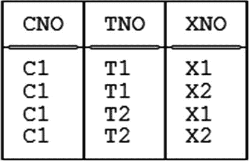
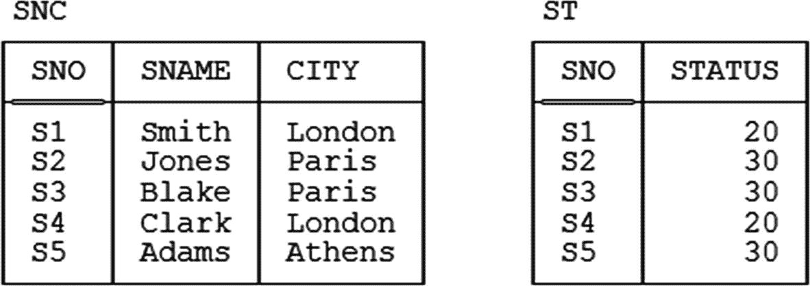
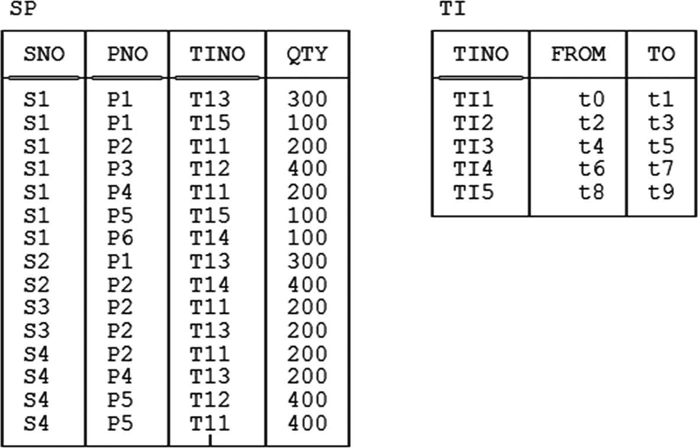
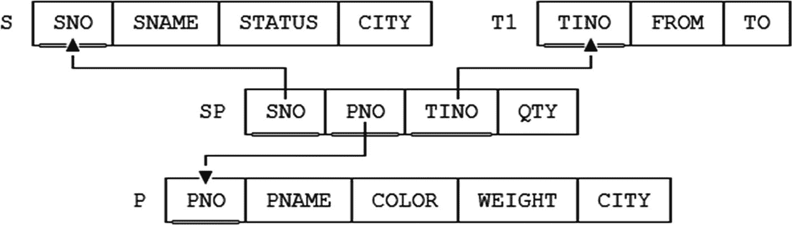

# **希思定理与非损耗分解**

## **希思定理（针对关系变量）**
设关系变量 `R` 的标题为 `H`，并令 `X`、`Y` 和 `Z` 满足它们的并集等于 `H`（因此 `X`、`Y` 和 `Z` 都是 `H` 的子集）。令 `XY` 表示 `X` 和 `Y` 的并集，`XZ` 同理。如果 `R` 受函数依赖 `X` → `Y` 约束，则 `R` 可以被非损耗分解为其在 `XY` 和 `XZ` 上的投影。

关于非损耗分解（分解到 BCNF 或其他形式）这个一般性话题，我还有最后一点要说明。再次考虑关系变量 `S`，及其函数依赖 `{CITY} → {STATUS}`。根据希思定理，该关系变量可以被非损耗分解为其在 `{SNO,SNAME,CITY}` 和 `{CITY,STATUS}` 上的投影。然而，显然它也可以被非损耗分解为这两个投影*外加*（比如说）在 `{SNAME,STATUS}` 上的投影；也就是说，如果我们把这三个投影连接起来，就能回到起点。（如果你不觉得这显而易见，可以使用我们为关系变量 `S` 准备的常规样本值来验证这个说法。）但是，在重建原始关系变量的过程中，显然不需要第三个投影。在进行数据库设计时，出于显而易见的原因，我们通常只考虑那些在重建过程中*需要*每个投影的分解方案——但在本书中，我讨论的是一般的分解，我不会将自己局限在那些每个投影在重建时都需要的分解方案上（当然，除非有明确声明）。

## **练习**

### **练习 1**
本章正文中定义的连接（join）运算对于任意的 *n* ≥ 0 是一个 *n* 元运算符，而不仅仅是二元运算符（*n* = 2）。那么，如果 *n* = 1 会发生什么？如果 *n* = 0 呢？

### **练习 2**
尽可能精确地定义“一个关系变量受一个函数依赖约束”是什么意思。

### **练习 3**
考虑以下函数依赖：
1. `{ CITY }` → `{ STATUS }`
2. `{ SNO , CITY }` → `{ STATUS }`
3. `{ SNO }` → `{ SNO }`
4. `{ SNO , CITY }` → `{ SNO }`
5. `{ SNO }` → `{ SNO , CITY }`
6. `{ SNAME , SNO }` → `{ STATUS , CITY }`
7. `{ SNO }` → `{ STATUS }`
8. `{ SNAME }` → `{ STATUS , SNO }`

其中哪些函数依赖是平凡的？哪些被图 3-1 中给出的关系变量 `S` 的当前值所满足？哪些在关系变量 `S` 中成立？哪些相对于关系变量 `S` 是不可约的？

### **练习 4**
证明希思定理（原始版本）。并证明该定理的逆命题不成立。*注：* 与此相关，请参见第 11 章的练习 11.3。

### **练习 5**
说一个函数依赖被一个超键所蕴含，究竟是什么意思？或者说被一个键所蕴含呢？

### **练习 6**
这是一个谓词：
> 在周期 `P` 中的第 `D` 天，学生 `S` 正在参加课程 `L`，该课程由教师 `T` 在教室 `C` 授课，其中 `D` 是一周中的一天（周一至周五），`P` 是一天中的一个节次（1-8）。课程持续一个节次，并拥有一个课程标识符 `L`，该标识符在本周内所有课程中是唯一的。

为这个数据库设计一组 BCNF 关系变量。它们的键是什么？

### **练习 7**
为以下情况设计一个数据库。需要表示的实体是员工和程序员。每个程序员都是员工，但并非每个员工都是程序员。员工拥有员工编号、姓名和薪水。程序员拥有（单门）编程语言技能。如果程序员可以拥有两门或更多此类技能，会对你的设计产生什么影响？

### **练习 8**
本章正文中给出的*键*的定义在形式上与第 4 章给出的定义有些不同。这些定义在逻辑上是等价的吗？

## **答案**

### **答案 1**
单个关系 `r` 的连接 `JOIN{*r*}` 就是 `r`；完全没有关系的连接 `JOIN{ }` 是 `TABLE_DEE`（唯一一个度为 0、基数为 1 的关系）。更多解释，请参见 *SQL 与关系理论*。

### **答案 2**
参见本章正文。

### **答案 3**
函数依赖 c. 和 d.（仅这两个）是平凡的。所有八个函数依赖 a. – h. 都被关系变量 `S` 的当前值所满足。除 h. 外，其余所有函数依赖在关系变量 `S` 中都成立。函数依赖 a., c., e., 和 g. 相对于关系变量 `S` 是不可约的；b., d., 和 f. 是可约的。（至于 h.，不可约性的问题不成立，因为该函数依赖在关系变量中不成立。如果你没有立刻理解这一点，请查阅函数依赖不可约性的定义。）

### **答案 4**
希思定理的原始版本指出，如果 (a) 关系 `r` 的标题为 `H`，(b) `X`、`Y` 和 `Z` 是 `H` 的子集，且它们的并集等于 `H`，并且 (c) `r` 满足函数依赖 `X` → `Y`，那么 (d) `r` 等于其在 `XY` 和 `XZ` 上投影的连接（其中 `XY` 表示 `X` 和 `Y` 的并集，`XZ` 同理）。下面，我将极其详细地展示该定理的一个证明。*注：* 证明中大量使用了“`t ∈ r.`”这种形式的表达式。该表达式可以读作“元组 `t` 出现在关系 `r` 中”。

首先考虑最简单的情况，即 `X`、`Y` 和 `Z` 都是单元素集合（即每个集合只包含一个属性）。设相关属性分别为 `A`、`B` 和 `C`。根据第 3 章练习 3.2 的答案，我们知道，取 `r` 在 `XY`（即 `{A,B}`）上的投影 `r1` 和在 `XZ`（即 `{A,C}`）上的投影 `r2`，然后将 `r1` 和 `r2` 连接回去，不会丢失 `r` 的任何元组。现在我来证明，反过来，连接中的每个元组确实都是 `r` 的元组（换句话说，连接不会产生任何“虚假”元组）。设 `(a,b,c) ∈ JOIN {r1,r2}`。为了在连接中生成这样一个元组，我们必须有 `(a,b) ∈ r1` 和 `(a,c) ∈ r2`。因此，必定存在 `b'` 和 `c'`，使得元组 `(a,b,c') ∈ r` 和 `(a,b',c) ∈ r` 存在。但是 `r` 满足 `{A} → {B}`；因此 `b = b'`，所以 `(a,b,c) ∈ r`。

下一个最简单的情况是 `X`、`Y` 和 `Z` 不一定是单元素集合，但它们两两不相交。在这种情况下，我们可以有效地将构成 `X` 的属性视为单个属性（`Y` 和 `Z` 同理），那么前一段的论证就直接适用了。

我们现在需要考虑如果 `X`、`Y` 和 `Z` 不是两两不相交会发生什么。有三种情况需要考虑：`X` 和 `Y` 相交，`X` 和 `Z` 相交，以及 `Y` 和 `Z` 相交。

首先，假设 `X` 和 `Y` 相交，但 `X` 和 `Z` 不相交，且 `Y` 和 `Z` 不相交（因此 `Z = H – XY`）。回想一下，如果 `X → Y` 被满足，那么对于 `Y` 的所有子集 `Y'`，`X → Y'` 也被满足。因此函数依赖 `X → Y – X` 被满足。但是 `X` 和 `Y – X` 是不相交的；根据前一个结果，`r` 等于其在 (a) `X` 和 `Y – X` 的并集以及 (b) `XZ` 上投影的连接。但是（再次）`X` 和 `Y – X` 是不相交的，所以它们的并集等于 `XY`。所以定理在这种情况下也适用，我们可以（并且我将）在证明的剩余部分不失一般性地假设 `X` 和 `Y` 是不相交的。

现在假设 `X` 和 `Z` 相交，但 `Y` 和 `Z` 不相交。那么根据前一个结果，`r` 等于其在 (a) `XY` 和 (b) `X` 和 `Z – X` 的并集上投影的连接。但是 `X` 和 `Z – X` 的并集等于 `XZ`。所以定理在这种情况下也适用，我们可以（并且我将）在证明的剩余部分不失一般性地假设 `X` 和 `Z` 是不相交的。


### Heath 定理的证明与讨论

现在，设`Y`和`Z`不相交。令`W` = `Z` – `Y`。由于`r`满足函数依赖（FD）`X` → `Y`，那么它也满足 FD `X` → `Y` – `W`，并且`Y` – `W`与`Z`是不相交的。根据先前的结果，因此`r`等于其在 (a) `X` 和 `Y` – `W` 的并集 与 (b) `XZ` 上的投影的连接。现在我引用一个容易证明（见下文）的引理，其内容是：如果(a) `r1`和`r2`是`r`的投影，使得`JOIN{r1, r2}` = `r`，(b) `H'`是`H`的子集，但是是`r1`标题（heading）的超集，且(c) `r'`是`r`在`H'`上的投影，那么(d) `JOIN{r', r2}` = `r`；通俗地说，`r1`可以扩展`r2`的任意属性而不改变连接的结果。从这个引理可以直接得出，`r`等于其在`XY`和`XZ`上的投影的连接；因此定理在此情况下也成立。

### 结论

Heath 定理在所有可能的情况下都成立。

### 引理

设`r`的标题为`H`，并将`H`划分为`A`、`B`、`C`和`D`，为简便起见，假设这四个子集均非空。（将证明扩展到该假设不成立的情况，留作补充练习。）不失一般性，我们可以将`A`、`B`、`C`和`D`视为单独的属性。所以设`r1` = `R{A, B}`，`r2` = `r{B, C, D}`，且设`(a, b)` ∈ `r1`，`(b, c, d)` ∈ `r2`。由于`r` = `JOIN{r1, r2}`，因此`(a, b, c, d)` ∈ `r`；故`(a, b, c)` ∈ `r{A, B, C}`，且`(b, c, d)` ∈ `r{B, C, D}`；因此`(a, b, c, d)` ∈ `JOIN{r{A, B, C}, r{B, C, D}}`。所需的结果随之得出——`r{B, C, D}`就是`r2`，而`r{A, B, C}`可以被视为`r'`，其中`H'` = `{A, B, C}`。

### Heath 定理的逆命题

Heath 定理的逆命题会说，如果关系`r`等于其在`XY`和`XZ`上的投影的连接，那么`r`满足 FD `X` → `Y`。这个逆命题是错误的。要证明这一点，只需举出一个反例。因此考虑一个关系变量 CTX，其属性为 CNO（课程）、TNO（教师）和 XNO（教材），其谓词为“课程 CNO 可以由教师 TNO 教授并使用教材 XNO”。以下是该关系变量的一个示例值：



这个示例值等于其在`{CNO, TNO}`和`{CNO, XNO}`上的投影的连接，但它显然不满足 FD `{CNO}` → `{TNO}`（也不满足 FD `{CNO}` → `{XNO}`）。**注意：** 我将在第 12 章中对这个特定例子有更多讨论。

### 练习

1.  见正文部分。

2.  假设我们从一个关系变量开始，其属性 D、P、S、L、T、C 显然对应于谓词的参数。那么在该关系变量中，以下非平凡的 FD 成立：
    ```
    { L }         → { D , P , C , T }
    { D , P , C } → { L , T }
    { D , P , T } → { L , C }
    { D , P , S } → { L , C , T }
    ```
    一个可能的 BCNF 关系变量集合（概要）如下：
    ```
    SCHEDULE { L , D , P , C , T }
    KEY { L }
    KEY { D , P , C }
    KEY { D , P , T }
    STUDYING { S , L }
    KEY { S , L }
    ```
    注意，FD `{D, P, S}` → `{L, C, T}` 在这种分解中“丢失”了（参见第 6 章）。

3.  最简单的设计（概要）是：
    ```
    EMP  { ENO , ENAME , SALARY }
    KEY { ENO }
    PGMR { ENO , LANG }
    KEY { ENO }
    FOREIGN KEY { ENO } REFERENCES EMP
    ```
    每个员工在 EMP 中都有一元组（且 EMP 没有其他元组）。碰巧是程序员的员工在 PGMR 中还有额外的一个元组（且 PGMR 没有其他元组）。注意，EMP 和 PGMR 的连接为程序员（仅）提供了完整信息——员工号、姓名、薪水和语言技能。

    如果程序员可能有两种或更多语言技能，唯一的显著区别是关系变量 PGMR 将是“全键”的（即，其唯一键是`{ENO, LANG}`），如下所示：
    ```
    PGMR { ENO , LANG }
    KEY { ENO , LANG }
    FOREIGN KEY { ENO } REFERENCES EMP
    ```

4.  是的，它们当然是的！


## 6. 保持函数依赖

> *大自然确实要求*
>
> *她进行保存的时候*
>
> —威廉·莎士比亚：《亨利八世》（1613 年）

再次考虑我们常用的关系变量 `S`。由于 `{SNO}` 是一个键，该关系变量显然受函数依赖 `{SNO} → {STATUS}` 约束。因此，取 `X` 为 `{SNO}`，`Y` 为 `{STATUS}`，`Z` 为 `{SNAME,CITY}`，希斯定理告诉我们，可以将该关系变量分解为关系变量 `SNC` 和 `ST`，其中 `SNC` 的标题为 `{SNO,SNAME,CITY}`，`ST` 的标题为 `{SNO,STATUS}`。图 6-1 显示了对应于图 3-1 中所示的 `S` 的值的 `SNC` 和 `ST` 的示例值：



图 6-1

关系变量 `SNC` 和 `ST` — 示例值

在此分解中：

-   关系变量 `SNC` 和 `ST` 都符合 BCNF——`{SNO}` 是两者的键，并且在这两个关系变量中成立的非平凡函数依赖只是“从超键指出的箭头”。
-   此外，该分解肯定是无损的（实际上由希斯定理保证）——如果我们连接 `SNC` 和 `ST`，就能恢复回 `S`。
-   然而，*函数依赖 `{CITY} → {STATUS}` 已经丢失*——我的意思是，当然，它已被某个特定的多关系变量约束所取代，如前一章所述。^(⁷⁹) 所讨论的多关系变量约束可以表述如下：

```sql
CONSTRAINT ... WITH ( SNCT := JOIN { SNC , ST } ) :
COUNT ( SNCT { CITY } ) =
COUNT ( SNCT { CITY , STATUS } ) ;
```

*解释：* 这个约束说明，如果我们连接 `SNC` 和 `ST`，会得到一个结果——称之为 `SNCT`——其中不同城市的数量等于不同的城市/状态对的数量。而后一性质成立，等同于说函数依赖 `{CITY} → {STATUS}` 在该连接中成立，因此在原始关系变量 `S` 中也成立（因为分解是无损的，意味着 `S` 和那个连接 `SNCT` 在逻辑上是相同的）。

所以我们“丢失”了一个函数依赖。这有什么影响？嗯，当然，替换它的多关系变量约束更难表述，正如我们刚才看到的。也许更重要的是，它更难实施：即，比重构为投影 `SNC` 和 `CT` 的首选分解更难实施，如第 3 章图 3-2 所示。^(⁸⁰) 例如，假设我们将关系变量 `SNC` 更新，将供应商 `S1` 的城市从伦敦改为雅典；那么我们也必须更新关系变量 `ST`，将供应商 `S1` 的状态从 20 改为 30——因为如果我们不这样做，那么将 `SNC` 和 `ST` 连接回去将产生一个不是关系变量 `S` 的合法值的结果。（相比之下，如果我们将关系变量 `SNC` 更新，将供应商 `S2` 的城市从巴黎改为雅典，那么我们*不*必同时更新关系变量 `ST`——但我们仍然必须检查关系变量 `ST` 以确定这一事实。）

如果有一个架构良好的 DBMS，也许可以让系统“自动”完成对关系变量 `ST` 的必要检查，而不必由用户手动完成。甚至可能让系统也“自动”执行任何必要的额外更新。然而，即使在这样的系统中，约束仍然更难实施（即，即使由系统而非用户完成，仍然需要做更多的工作）。无论如何，在撰写本文时，这些可能性只是空想——当今的商业产品大多甚至不允许一般性地声明多关系变量约束，更不用说实施它们了；前述可能性目前无法实现，因此处理（特别是实施）此类约束是用户的责任。

所以，传达的信息是：尽量选择能保持函数依赖的分解，而不是丢失它们的分解。（在当前情况下，将对 `{SNO,STATUS}` 的投影替换为对 `{CITY,STATUS}` 的投影就解决了问题。）粗略地说，换句话说，如果函数依赖 `X → Y` 在原始关系变量中成立，尽量不要选择一个分解，其中 `X` 最终落在一个关系变量中，而 `Y` 落在另一个中。*注意：* 当然，我这里假设分解不是基于那个函数依赖 `X → Y` 本身进行的——因为如果是，我们实际上会得到两个 `X`，其中一个将与 `Y` 在同一个关系变量中（必然如此），而另一个则不会。我还默认假设，`X → Y` 是所谓原始关系变量中成立的总函数依赖集的*不可约覆盖*的一部分。本章稍后将讨论不可约覆盖。


## 一个不幸的冲突

FD 保留的基本思想相当直接；然而，不幸的是，事情存在许多复杂情况，关于这个主题还有更多需要说明的内容。作为温和地介绍其中一些复杂情况的方式，我将提出一个可能被某些人视为病态的例子。我们有一个关系变量 `SJT`，其属性为 `S`（学生）、`J`（科目）和 `T`（教师），谓词是*学生 `S` 由教师 `T` 教授科目 `J`*。以下业务规则适用：^(⁸¹)

*   对于每个科目，学习该科目的每个学生只由一位教师教授。
*   每位教师只教授一个科目。
*   每位学生学习多个科目，因此通常由多位教师教授。
*   每个科目通常有多个学生学习。
*   每个科目通常由多位教师教授。
*   同一科目的不同学生可能由同一位教师教授该科目，也可能不是。

符合这些规则的关系变量 `SJT` 的一个样本值如图 6-2 所示：


图 6-2 关系变量 `SJT` 的样本值

关系变量 `SJT` 的函数依赖是什么？根据第一条业务规则，我们有 `{S,J} → {T}`。根据第二条，我们有 `{T} → {J}`。对剩余规则的仔细分析表明，除了平凡的或可归约的（或两者兼有）函数依赖外，没有其他函数依赖成立。因此，成立的唯一的非平凡、不可归约的函数依赖是这两个：

```
{ S , J } → { T }
{ T }     → { J }
```

那么，键是什么？嗯，`{S,J}` 是一个键，因为整个属性集显然函数依赖于 `{S,J}`，而不依赖于 `{S,J}` 的任何真子集。此外，`{S,T}` 也是一个键，因为：

1.  给定函数依赖 `{T} → {J}` 成立，整个属性集函数依赖于 `{S,T}`。
2.  同时，给定函数依赖 `{S} → {J}` 和 `{T} → {S}` *不* 成立，整个属性集不函数依赖于 `{S,T}` 的任何真子集。

因此存在两个键：`{S,J}` 和 `{S,T}`。^(⁸²) 或许更重要的是，`{T}` *不是* 一个键，因此关系变量 `SJT` 受制于一个并非“从一个键出发的箭头”的函数依赖（更正式地说，它不是由键所蕴含的）。因此，该关系变量不属于 BCNF，尽管它属于 3NF。（*练习：* 验证此说法。）并且它存在冗余；例如，给定图 6-2 所示的样本值，White 教授教授数学这一事实出现了两次。正如您所预料的那样，它也存在更新异常；例如，再次参考图 6-2，我们无法删除 Jones 正在学习物理的事实，同时不丢失 Brown 教授教授物理这一信息。

现在，我们可以通过适当地分解关系变量来解决这些问题。将 Heath 定理应用于函数依赖 `{T} → {J}`（令 `X`、`Y` 和 `Z` 分别为 `{T}`、`{J}` 和 `{S}`），我们得到以下无损分解：

```
TJ { T , J }
KEY { T }
TS { T , S }
KEY { T , S }
```

我将留下另一个练习由您来完成：（a）显示对应于图 6-2 所示 `SJT` 值的这两个关系变量的值，（b）证明这些关系变量属于 BCNF，以及（c）验证该分解确实避免了上述冗余和更新异常。特别要注意的是，函数依赖 `{T} → {J}` 在此分解中成为了一个键约束；而在原始设计中，它并非键约束，因此必须单独陈述和强制执行（我指的是在键约束之上）。

到目前为止，一切顺利。但还有另一个问题。事实是，尽管分解为 `TJ` 和 `TS` 确实解决了某些问题，但不幸的是它引入了其他问题。具体来说，函数依赖

```
{ S , J } → { T }
```

丢失了（它肯定不是由分解结果中唯一成立的非平凡函数依赖 `{T} → {J}` 所蕴含的）。因此，关系变量 `TJ` 和 `TS` 无法被独立更新。例如，尝试将元组

```
( Smith , Prof. Brown )
```

插入 `TS` 必须被拒绝，因为 Brown 教授教授物理，而 Smith 已经由 Green 教授教授物理；然而，如果不检查 `TJ`，就无法检测到这个事实。

总而言之，这个例子表明：在无损分解中，我们通常追求两个目标，即 BCNF 投影和 FD 保留，遗憾的是，这两个目标可能相互冲突。换句话说，并不总是能同时实现两者。

在本章早期的一个草稿中，我在此时写道：

*   那么，我们该放弃哪个目标呢？嗯，如果我能告诉你，我会的，但我不能。`SJT` 例子表明，规范化理论尽管重要，但其本身还不够；我的意思是，有些问题它无法回答。所以启示是：*我们需要更多的科学！* 规范化理论当然是科学的，但它不能解决所有设计问题。

然而，在一位审稿人的提示下，我得出了结论：上述段落可能言过其实。在这里，我们与其说需要更多的科学，不如说需要更好的实现！也就是说，在类似当前讨论的情况下，容忍一个未达到完全规范化的设计的主要论据，在于当今的数据库管理系统处理像示例中“丢失”的函数依赖这样的多关系变量约束非常笨拙。因此，让我在此明确表示，在存在冲突的情况下，依赖保留很可能是需要放弃的目标。^(⁸³)


## 另一个例子

我在前一节开头曾暗示，SJT 例子可能被认为是病态的。然而，现在我要宣称它并非完全如此；我将再给出几个例子，这些例子（在我看来）表明，函数依赖保持问题比你想象的更为常见。

通常理解的规范化是一个从 1NF 到 2NF 再到 3NF（等等）的顺序过程。让我们约定，将这种通常理解的过程——即按顺序从 1NF 到 2NF 再到 3NF（等等）——称为“**常规规范化过程**”。在本节及接下来的两节中，我想通过一系列例子来说明，如果过于盲目地遵循常规规范化过程，未必是一个好主意。我的第一个例子涉及一个如下的关系变量：

```
RX1 { SNO , PNO , CITY , STATUS , QTY }
```

名称 `RX1` 代表“关系变量示例 1”；其谓词是*供应商 `SNO` 位于城市 `CITY`，该城市的状态为 `STATUS`，并且供应零件 `PNO` 的数量为 `QTY`。*（为简便起见，我忽略了供应商名称。）让我们合理地假设，以下函数依赖在此关系变量中成立：

```
{ SNO }       → { CITY }
{ CITY }      → { STATUS }
{ SNO , PNO } → { QTY }
```

现在，直观上很明显，以下函数依赖也隐式成立：^(⁸⁴)

```
{ SNO }       → { STATUS }
{ SNO , PNO } → { CITY , STATUS }
```

事实上，最后一个函数依赖可以扩展为 `{SNO,PNO} → H`，其中 `H` 是整个标题；换句话说，`{SNO,PNO}` 是关系变量 `RX1` 的一个键。

现在回想一下，当且仅当对于每个键 *K* 和每个非键属性 *A*，函数依赖 *K* → {*A*} 都是不可约的时，关系变量 *R* 才处于 2NF。显然，`RX1` 不在 2NF 中，因为函数依赖 `{SNO,PNO} → {CITY}` 是 `RX1` 的“一个键的箭头”，但它不是不可约的；具体来说，它不可约是因为函数依赖 `{SNO} → {CITY}` 在该关系变量中也成立。因此，常规规范化过程会建议我们通过应用希斯定理到该函数依赖 `{SNO} → {CITY}` 来分解关系变量。但如果我们这样做，得到的结果是：

```
RX1A { SNO , CITY }
KEY { SNO }
RX1B { SNO , PNO , STATUS , QTY }
KEY { SNO , PNO }
```

现在观察，在此分解中，函数依赖 `{CITY} → {STATUS}` 丢失了。所以这个例子带来的一个直接教训是，函数依赖保持问题可能与从 1NF 到 2NF 的步骤相关——而不仅仅是 SJT 例子中展示的从 3NF 到 BCNF 的步骤。

这里的关系变量 `RX1A` 当然在 2NF 中。相比之下，关系变量 `RX1B` 不在 2NF 中，因为函数依赖 `{SNO,PNO} → {STATUS}` 是可约的。因此，我们可以再次应用希斯定理，将其分解为在 `{SNO,STATUS}` 和 `{SNO,PNO,QTY}` 上的投影，这两个投影都在 2NF 中；然而，损失已经造成——函数依赖 `{CITY} → {STATUS}` 已经丢失了。

在这个例子中我们如何保持函数依赖呢？一个答案是：基于函数依赖 `{SNO} → {CITY,STATUS}` 而不是 `{SNO} → {CITY}` 来分解。不过，请仔细注意，这个函数依赖并不是最初明确列出的那些之一，也不是我说过由那些明确依赖明显隐含的那些之一；因此，在常规规范化过程中，它不太可能被选为分解的基础。尽管如此，假设我们确实选择了它并执行了相应的分解。结果如下：

```
RX1A′ { SNO , CITY , STATUS }
KEY { SNO }
RX1B′ { SNO , PNO , QTY }
KEY { SNO , PNO }
```

在此分解中，`STATUS` 出现在键为 `{SNO}` 的关系变量中，而不是键为 `{SNO,PNO}` 的关系变量中，从而函数依赖 `{CITY} → {STATUS}` 得以保持。*注意：* 当然，这里的关系变量 `RX1A′` 仍然不在 3NF 中，因此我们很可能希望进一步分解它。不过，同样地，我们需要稍微小心；具体来说，我们需要基于函数依赖 `{CITY} → {STATUS}` 而不是 `{SNO} → {STATUS}` 进行分解，否则我们又会丢失一个函数依赖。但是 `{CITY} → {STATUS}` 是常规规范化过程会告诉我们要使用的函数依赖，所以这里不应该有问题。

现在，上述方案的另一种替代方法是基于函数依赖 `{CITY} → {STATUS}` 分解原始关系变量 `RX1`，产生：

```
RX1A′′ { CITY , STATUS }
KEY { CITY }
RX1B′′ { SNO , PNO , CITY , QTY }
KEY { SNO , PNO }
```

这种分解也保持了函数依赖 `{CITY} → {STATUS}`。然而，请注意，这个函数依赖并不是导致原始关系变量 `RX1` 违反 2NF 的那个（它不是一个“从真子键发出的箭头”）；因此，再次说明，如果我们遵循常规规范化过程，在实践中我们不太可能在这个阶段选择它作为分解的基础。还要注意，这里的关系变量 `RX1B′′` 仍然不在 3NF 中，因此我们很可能希望进一步分解它。我将把这个进一步分解的细节留给您思考。

## … 再来一个

让我们看另一个例子。假设供应商被划分为类别（`C1`、`C2` 等），因此我们有一个如下的关系变量 `RX2`（和 `RX1` 示例一样，我将为简便起见忽略供应商名称）：

```
RX2 { SNO , CLASS , CITY , STATUS }
KEY { SNO }
```

其谓词是*供应商 `SNO` 属于类别 `CLASS`，位于城市 `CITY`，并且状态为 `STATUS`。* 还假设 (a) 每个类别只有一个状态，并且 (b) 每个城市也只有一个状态，但 (c) 类别和城市在其他方面彼此独立。那么以下函数依赖成立：

```
{ CLASS } → { STATUS }
{ CITY }  → { STATUS }
```

*注意：* 我还假设有一个有效的业务规则，该规则表明，对于任何给定的供应商，城市状态等于类别状态（这就是为什么我们能够只使用一个 `STATUS` 属性而不是两个）。^(⁸⁵)

现在回想一下，当且仅当对于 *R* 中成立的每个非平凡函数依赖 *X* → *Y*，要么 *X* 是超键，要么 *Y* 是子键（或两者兼是），关系变量 *R* 才处于 3NF。显然，`RX2` 不在 3NF 中，因为在函数依赖 `{CITY} → {STATUS}` 中，`{CITY}` 不是超键，`{STATUS}` 也不是子键。因此，常规规范化过程会建议我们通过应用希斯定理到该函数依赖 `{CITY} → {STATUS}` 来分解关系变量。但如果我们这样做，得到的结果是（两个投影关系变量都在 3NF 中）：

```
RX2A { CITY , STATUS }
KEY { CITY }
RX2B { SNO , CLASS , CITY }
KEY { SNO }
```

现在观察，在此分解中，函数依赖 `{CLASS} → {STATUS}` 丢失了。（当然，如果我们基于该函数依赖而不是函数依赖 `{CITY} → {STATUS}` 进行分解，那么后面这个函数依赖反而会丢失。）所以现在我们看到，函数依赖保持问题也与从 2NF 到 3NF 的步骤相关。

现在，我们可以通过基于函数依赖 `{SNO} → {CLASS,CITY}` 分解来在这个例子中保持函数依赖——尽管这个函数依赖同样不太可能被选为分解的基础，因为它没有被明确陈述。^(⁸⁶) 尽管如此，结果如下：

```
RX2A′ { CLASS , CITY , STATUS }
KEY { CLASS , CITY }
RX2B′ { SNO , CLASS , CITY }
KEY { SNO }
```

在此分解中，`{CLASS,CITY}` 是 `RX2B′` 中的一个（复合）外键，引用 `RX2A′`。关系变量 `RX2B′` 在 3NF 中。然而，关系变量 `R2XA′` 甚至不在 2NF 中，因为函数依赖 `{CLASS,CITY} → {STATUS}` 显然是可约的。因此，如果我们决定保留该关系变量，则必须单独声明并强制执行函数依赖 `{CLASS} → {STATUS}` 和 `{CITY} → {STATUS}`。^(⁸⁷) 或者，我们可以将该关系变量分解为在 `{CLASS,STATUS}` 和 `{CITY,STATUS}` 上的投影，在这种情况下，必须单独声明并强制执行一个适当的多关系变量约束。*练习：* 该约束会是什么样子？


## ……再来一个

考虑前一章示例的一个修订版本，其中 (a) 供应商再次被划分为类别，但 (b) 每个类别现在只对应一个城市（每个城市又只对应一个状态，与之前一样）。因此，我们有一个关系变量 `RX3`，其结构如下（再次为简便忽略供应商名称）：
```
RX3 { SNO , CLASS , CITY , STATUS }
```
实际上，`RX3` 的表头（heading）与 `RX2` 相同，但谓词不同：*供应商 `SNO` 属于类别 `CLASS`，该类别有城市 `CITY`，该城市有状态 `STATUS`。* 以下函数依赖（FD）等成立：
```
{ SNO }   → { CLASS }
{ CLASS } → { CITY }
{ CITY }  → { STATUS }
```
关系变量 `RX3` 不属于 3NF，因为在 FD `{CLASS} → {CITY}` 中，`{CLASS}` 不是超键，`{CITY}` 不是子键。（对于 `{CITY} → {STATUS}`，情况类似，只需稍作调整。）因此，常规的规范化过程会建议我们应用 Heath 定理到这个 FD `{CLASS} → {CITY}` 来分解这个关系变量。但如果我们这样做，会得到：
```
RX3A { CLASS , CITY }
KEY { CLASS }
RX3B { SNO , CLASS , STATUS }
KEY { SNO }
```
在这个分解中，`RX3A` 属于 3NF，但 `RX3B` 仅属于 2NF——并且如你所见，FD `{CITY} → {STATUS}` 丢失了。实际上，更好的做法是基于 FD `{CITY} → {STATUS}` 进行分解：
```
RX3A′ { CITY , STATUS }
KEY { CITY }
RX3B′ { SNO , CLASS , CITY }
KEY { SNO }
```
`RX3A′` 属于 3NF，而 `RX3B′` 仅属于 2NF，但至少 FD `{CITY} → {STATUS}` 被保留了。此外，我们现在可以继续基于 FD `{CLASS} → {CITY}` 来分解 `RX3B′`，得到：
```
RX3BA′ { CLASS , CITY }
KEY { CLASS }
RX3BB′ { SNO , CLASS }
KEY { SNO }
```
这些关系变量都属于 3NF。

所以，现在我们已经看到了四个关于 FD 可能丢失的不同分解示例。这个话题还有很多内容可以讨论，但一个明确的信息是：常规的规范化过程——事实上是实践中经常教授的那种！——在几个方面是不足的。具体来说：

*   常规观点认为，FD 保留只与从 3NF 到 BCNF 的步骤相关，但正如我们所见，情况未必如此。
*   常规规范化过程通常建议作为分解基础的 FD，不一定是最好的选择。
*   该过程还假设可以通过从 1NF 到 2NF 再到 3NF（等等）按顺序逐步推进来找到最佳设计，这再次未必正确。

当然，“第一”、“第二”等命名法强化了最后这种看法；但这种命名法在某种程度上其实只是一个历史的偶然。我的意思是，如果第一个被定义的范式是 BCNF——这完全有可能，因为其定义在概念上如此简单，不涉及 FD 不可约性、非键属性、子键、1NF、2NF 或 3NF——那么实际上就永远没有必要将 2NF 和 3NF 作为特定的范式单独提出来。^(⁸⁸)

## 一个有效的方法

这里介绍一个保证能产生分解的方法，其中所有关系变量都属于 3NF（但不一定是 BCNF），并且所有 FD 都被保留。^(⁸⁹) 为方便起见，在下文中我将称之为 `the 3NF procedure`（3NF 过程）。输入是一个关系变量 `R` 和一组所谓的 `irreducible cover`（不可约覆盖，称它为 `C`），用于 `R` 中成立的 FD。我稍后会解释什么是 `irreducible cover`——顺便说一句，`irreducible`（不可约的）这个词又出现了——但让我先陈述这个过程：

1.  令 `S` 为一个头的集合。将 `S` 初始化为空集 `{ }`。
2.  令 `X` 为 `C` 中某个 FD 的左侧（决定因素）；令 `C` 中所有左侧为 `X` 的 FD 的完整集合为 `X → Y1`, ..., `X → Yn`；并令 `Y1`, ... `Yn` 的并集为 `Y`。将 `X` 和 `Y` 的并集添加到 `S` 中。对每个不同的 `X` 执行此步骤。
3.  令 `U` 为 `R` 中不属于 `S` 任何元素的属性集合。如果 `U` 非空，则将 `U` 添加到 `S` 中。
4.  如果 `S` 中没有元素是 `R` 的超键，则将 `R` 的某个键 `K` 添加到 `S` 中。

在这个过程结束时，`S` 的元素就是一组 3NF 关系变量的头，`R` 可以无损地分解为这些关系变量，而不会丢失任何 FD。尤其需要注意的是，该过程没有明确提到 2NF，甚至没有将其作为某种垫脚石。

那么它是如何工作的呢？显然，`irreducible cover` 的概念很重要。为了解释这个概念，让我先指出一件我已经多次顺便提到的事情：即 *一些 FD 蕴含其他 FD* 的事实。一个简单的例子是，FD `X → Y` 和 `Y → Z` 一起蕴含了 FD `X → Z`——我的意思是，如果前两个 FD 被关系 `r` 满足，那么第三个也必须被 `r` 满足。或者，更关键的是：如果前两个在关系变量 `R` 中成立，那么第三个也必须在 `R` 中成立。我们在前一节关于关系变量 `RX3` 的讨论中看到了一个例证，其中 FD `{CLASS} → {CITY}` 和 `{CITY} → {STATUS}` 都成立，因此 FD `{CLASS} → {STATUS}` 也成立。

因此，一些 FD 蕴含其他 FD。给定一个 FD 的集合 `F`，我们可以合理地讨论 `F` 的一个 `cover`（覆盖）。定义如下：

*   **定义（cover，覆盖）：** 一个 FD 集合 `F` 的 `cover` 是一个 FD 集合 `C`，使得 `F` 中的每个 FD 都由 `C` 中的 FD 所蕴含。

作为一个简单的例子，令 `F` 为集合：
```
{ X → Y , Y → Z , X → Z }
```
那么以下两者都是 `F` 的 `cover`：
```
{ X → Y , Y → Z }
{ X → Y , Y → Z , X → Z }
```
这个例子立即说明了三点：首先，`cover` 通常不是唯一的；其次，任何 FD 集合当然是它自身的 `cover`，因为每个 FD 都蕴含自身。第三点也更重要：对于给定的 FD 集合 `F`，强制执行其某个 `cover` `C` 中的 FD 将“自动”强制执行 `F` 中的 FD。因此，给定需要强制执行的 FD 集合 `F`，只需找到 `F` 的某个 `cover` `C` 并强制执行 `C` 中的 FD 即可。（事实上，只需强制执行 `F` 的一个 `irreducible cover` 中的 FD，这一点很快就会清楚。）

现在我可以定义什么是 `irreducible cover` 了：

*   **定义（irreducible cover，不可约覆盖）：** 一个 FD 集合 `F` 的 `cover` `C` 是 `irreducible` 的，当且仅当它具备以下所有属性：
    1.  *Singleton dependant（单例依赖项）：*`C` 中的每个 FD 的右侧只有一个属性。
    2.  *Irreducible determinant（不可约决定因素）：*`C` 中的每个 FD 本身是不可约的。^(⁹⁰)
    3.  *No redundant FDs（无冗余 FD）：*不能从 `C` 中丢弃任何 FD 而不失去 `C` 是 `F` 的 `cover` 这一性质。

当然，立即出现的问题是：给定某个特定的 FD 集合，如何找到该集合的一个 `irreducible cover`？我将在下一章详细回答这个问题。现在，让我先给一个例子——即以下 FD 集合，它们构成了我们通常的供应商关系变量 `S` 中成立的 FD 的一个 `irreducible cover`：


```
{ SNO }  → { SNAME }
{ SNO }  → { CITY }
{ CITY } → { STATUS }
```

简单阐述一下：显然，`S` 中成立的所有函数依赖 (`FD`) 都由这三个 `FD` 共同蕴含，因此这三个 `FD` 肯定构成一个**覆盖** (`cover`)。此外，每个 `FD` 的**依赖项** (`dependant`) 都是单属性的；从三个**决定因素** (`determinant`) 中都无法再删除任何属性；并且这三个 `FD` 中没有一个可以被丢弃。因此，这个覆盖实际上是一个**不可约的** (`irreducible`) 覆盖。相比之下，以下几组 `FD` 同样是 `S` 中成立的 `FD` 的覆盖，但它们不是不可约的（每种情况，为什么不是？）：

```
1. { SNO }  → { SNAME , CITY }
{ CITY } → { STATUS }
2. { SNO , SNAME } → { CITY }
{ SNO }         → { SNAME }
{ CITY }        → { STATUS }
3. { SNO }  → { SNAME }
{ SNO }  → { CITY }
{ CITY } → { STATUS }
{ SNO }  → { STATUS }
```

现在让我们回到 `3NF` 过程。具体来看一下它如何应用于 `SJT` 示例。提醒一下，该**关系变量** (`relvar`) 具有属性 `S`、`J` 和 `T`；候选键为 `{S,J}` 和 `{S,T}`；并且受到函数依赖 `{T} → {J}` 的约束。因此，以下 `FD` 成立：

```
{ S , J } → { T }
{ S , T } → { J }
{ T }     → { J }
```

然而，很容易看出，这里的 `FD` `{S,T} → {J}` 是冗余的——事实上，我在本章前面第一次讨论这个例子时实际上就假设了这一点——因此，另外两个 `FD` 一起构成了一个不可约覆盖（我称之为 `C`）：

```
{ S , J } → { T }
{ T }     → { J }
```

现在我们可以应用 `3NF` 过程。我们从一个空的标题集合 `S` 开始。第二步做两件事：它收集 `C` 中具有相同左部的 `FD`（在这个例子中这步实际上已经完成），然后将集合（实际上是标题）

```
{ S , J , T }
{ T , J }
```

添加到 `S` 中。第三步没有效果，因为原关系变量的每个属性现在都至少包含在 `S` 的一个元素中。最后一步也没有效果，因为 `S` 中的元素 `{S,J,T}` 是原关系变量的一个**超键** (`superkey`)。因此，总体而言，`3NF` 过程告诉我们，关系变量 `S` 可以**无损分解** (`nonloss decomposed`)，并且以保持 `FD` 的方式，分解为它在 `{S,J,T}` 和 `{T,J}` 上的**投影** (`projection`)。要点如下：

*   在 `{S,J,T}` 上的投影当然与原关系变量相同！——换句话说，它是一个**恒等投影** (`identity projection`)（见下一节），并且严格来说，这里并没有进行多少分解。
*   除非我们希望能够表达，例如，布莱克教授教授物理，但同时不存在任何由布莱克教授实际授课的学生，否则似乎没有太多理由在维护原关系变量的同时也维护第二个关系变量（即 `{T,J}` 上的投影）。如果我们不需要这种能力，我们可能就不希望维护那个关系变量。因此，`3NF` 过程产生的分解不一定是一个推荐的分解——但是，重申一遍，它确保了所有关系变量都在 `3NF` 中，并且所有的 `FD` 都得以保留。

我将把它留作一个练习（练习 6.3），来展示当 `3NF` 过程应用于关系变量 `RX1`、`RX2` 和 `RX3` 时会发生什么。同时，我想用几句话结束本节，讨论一下 `BCNF` 以及一个可能的 `BCNF` 过程。

首先，我们可以在 `3NF` 过程中添加另一个（第五）步骤，如下所示：

1.  设 `Z` 是 `S` 中的一个元素，使得关系变量 `R` 在 `Z` 的属性上的投影 `P` 不在 `BCNF` 中；设 `X → Y` 是 `C` 中在 `P` 中成立的一个 `FD`；并且设 `X` 不是 `P` 的一个超键。在 `S` 中用以下内容替换 `Z`：(a) `X` 和 `Y` 的并集，(b) `Z` 和 `Y` 之间的差集 `Z – Y`（按此顺序）。对每个不同的 `Z` 和每个不同的 `X` 执行此步骤。

现在，应用于关系变量 `SJT` 的 `3NF` 过程产生了一个由标题 `{T,J}` 和 `{S,J,T}` 组成的集合 `S`。`SJT` 在 `{T,J}` 上的投影是 `BCNF` 的，但 `SJT` 在 `{S,J,T}` 上的（恒等）投影不是，因为 `FD` `{T} → {J}` 在该投影中成立，而 `{T}` 不是一个超键。因此，应用步骤 5，我们删除标题 `{S,J,T}` 并插入 (a) `{T}` 和 `{J}` 的并集——但这个插入没有效果，因为该并集已经是 `S` 的一个元素——以及 (b) `{S,J,T}` 和 `{J}` 之间的差集，按此顺序。因此，`S` 最终包含以下标题作为元素：

```
{ S , T }
{ T , J }
```

这两个标题是一组 `BCNF` 关系变量的标题，`SJT` 可以无损分解为这些关系变量（这些关系变量的键分别是 `{S,T}` 和 `{T}`）。因此，在 `3NF` 过程中添加步骤 5 将其转换为一个 `BCNF` 过程，尽管不保证 `FD` 被保留。（事实上，当然不可能提供任何这样的保证，因为我们已经知道 `BCNF` 和 `FD` 保留可能是相互冲突的目标。）然而，任何丢失的 `FD` 都是那些如果不违反 `BCNF` 就无法保留的 `FD`。

实际上，我们可以简化问题，直接走向 `BCNF`，完全绕过 `3NF`，使用以下过程（输入与 `3NF` 过程相同——即，它由一个关系变量 `R` 和一个 `R` 中成立的 `FD` 的不可约覆盖 `C` 组成）：

1.  将 `S` 初始化为仅包含 `R` 的标题。
2.  （*与 `3NF` 过程的步骤 2 相同。*）设 `X` 是 `C` 中某个 `FD` 的左部（决定因素）；设 `C` 中左部为 `X` 的 `FD` 的完整集合为 `X → Y1`, ..., `X → Yn`；并设 `Y1`, ... `Yn` 的并集为 `Y`。将 `X` 和 `Y` 的并集添加到 `S` 中。对每个不同的 `X` 执行此步骤。
3.  （*与上面的步骤 5 相同。*）设 `Z` 是 `S` 中的一个元素，使得关系变量 `R` 在 `Z` 的属性上的投影 `P` 不在 `BCNF` 中；设 `X → Y` 是 `C` 中在 `P` 中成立的一个 `FD`；并且设 `X` 不是 `P` 的一个超键。在 `S` 中用以下内容替换 `Z`：(a) `X` 和 `Y` 的并集，(b) `Z` 和 `Y` 之间的差集 `Z – Y`（按此顺序）。对每个不同的 `Z` 和每个不同的 `X` 执行此步骤。

在这个过程结束时，`S` 的元素是一组 `BCNF` 关系变量的标题，`R` 可以无损分解为这些关系变量，但不一定会丢失 `FD`。请注意，该过程没有提及 `2NF` 或 `3NF`。


## 恒等分解

虽然有点偏离本章的主题，但我想简要阐述一下“恒等投影”的概念。这里给出一个定义（我是针对`关系变量`定义的，但当然，一个完全类似的定义也适用于关系——同样也适用于元组）：

*   定义（`恒等投影`）：给定`关系变量`的`恒等投影`，就是该关系变量在其所有属性上的投影。

现在，显然任何`关系变量`都可以被“无损”分解为其`恒等投影`，尽管这是平凡的。然而，有些人不喜欢将这种分解本身视为一种分解（正如我在讨论`SJT`例子时提到的，这里本质上并没有发生多少分解）。如果你恰好是这类人，那么你可能更喜欢以下看待问题的方式。设`关系变量 R`的`标题`为`H`。那么，函数依赖`FD { } → { }`在`R`中肯定成立，其中`{}`是空属性集（这个`FD`当然是平凡的，并且在*每一个*关系变量中都成立）。因此，根据希斯定理——分别将`X`、`Y`和`Z`取为`{}`、`{}`和`H`——`R`可以被`无损`分解为其投影`R1`和`R2`，其中：

1.  `R1`的`标题 XY`是`{}`和`{}`的并集，简化为`{}`；也就是说，`R1`是`R`在没有任何属性上的投影，其值如果`R`为空则是`TABLE_DUM`，否则是`TABLE_DEE`。^(⁹²)

2.  `R2`的`标题 XZ`是`{}`和`H`的并集，简化为`H`；也就是说，`R2`是`R`在其所有属性上的投影，或者换句话说，就是`R`的`恒等投影`。

现在，我希望很清楚这种分解是`无损`的——`R`当然等于`R1`和`R2`的连接。（另一方面，`R1`和`R2`的组合也确实未能满足通常的要求，即在重构过程中两个投影都应该被用到。）

既然谈到了可称为`恒等分解`的内容，让我指出，任何`关系变量`也总是可以被分解（同样是平凡的，但这次是“水平”分解而非“垂直”分解）为相应的`恒等限制`^(⁹³)。这里给出一个定义（我再次是针对`关系变量`定义的，但当然，类似的概念也适用于关系，尽管这次不适用于元组）：

*   定义（`恒等限制`）：给定`关系变量 R`的`恒等限制`，是`R`的任何限制条件恒为真的限制——换句话说，是`R`的任何在逻辑上等价于以下形式的限制：

```
R WHERE TRUE
```

*注：* 在逻辑中，恒为真的东西，例如布尔表达式`CITY = CITY`，被称为“永真式”。因此，我们可以说关系变量`R`的`恒等限制`是其限制条件为`永真式`的任何限制。

我顺便提一下，任何给定的`关系变量 R`也总是有一个“空限制”^(⁹⁴)，我们可以这样表示：

```
R WHERE FALSE
```

给定关系变量`R`的`恒等限制`和`空限制`的（不相交的！）并集当然恒等于`R`。*注：* 在逻辑中，恒为假的东西，例如布尔表达式`CITY ≠ CITY`，被称为“矛盾式”；因此，我们可以说关系变量`R`的`空限制`是其限制条件为`矛盾式`的任何限制。^(⁹⁵)

## 关于冲突的更多讨论

回到本章的主题：到目前为止，我们已经看过几个`FD`可能会丢失的例子。在大多数这些例子中，我们可以通过小心谨慎来避免丢失`FD`；然而，在一个例子中（`SJT`例子），保留`FD`和进行`BCNF`分解的目标确实是相互冲突的。那么，一个显而易见的问题出现了：我们能描述那些确实存在冲突的情况吗？答案是肯定的；事实上，这很容易做到。

设`R`是我们正在处理的`关系变量`，`C`是`R`中成立的`FD`的一个“最小覆盖”。按如下步骤构建一个“FD 图”：

1.  为`R`的每个属性创建一个节点。

2.  设`X → Y`是`C`中的一个`FD`，且`X`涉及两个或更多属性；创建一个“超节点”，仅包含`X`中命名的属性对应的节点。（如果你在纸上操作，可以画一个圆圈将各个属性节点框起来。超节点被视为节点。）对`C`中每个决定因素涉及两个或更多属性的`FD`重复此步骤。

3.  设`X → Y`是`C`中的一个`FD`。从`X`对应的节点向`Y`对应的节点画一条有向弧。对`C`中的每个`FD`重复此步骤。

4.  当且仅当完成的图中包含任何环路（环路指从一个节点到其自身的一条包含两个或多个有向弧的序列）时，`R`才无法在不丢失`FD`的情况下被`无损`分解为`BCNF`投影。

作为练习，尝试将上述过程应用于本章前面讨论过的各种例子。当你这样做时，你会很快理解（如果你还没有理解的话）这里真正发生的事情。明确地说：只有当`关系变量`涉及类似于`SJT`例子中出现的那种`FD`模式时，才存在真正的冲突。


## 独立投影

在结束本章之前，我想回到开篇时的例子。提醒一下，那个例子涉及对我们常用的关系变量 `S` 进行无损分解，将其投影为 `{SNO,SNAME,CITY}` 上的 `SNC` 和 `{SNO,STATUS}` 上的 `ST`。该分解丢失了函数依赖（FD）`{CITY} → {STATUS}`，其后果是，为了强制实施“每个城市只有一个状态”这一约束，对任一投影的更新有时需要同时更新另一个投影。相比之下，将 `S` “明智地”分解为其投影 `SNC`（在 `{SNO,SNAME,CITY}` 上）和 `CT`（在 `{CITY,STATUS}` 上）则不存在此类问题——更新可以独立地对任一投影进行，无需考虑另一个。^(⁹⁶)

出于当前讨论的目的，让我将像分解为 `SNC` 和 `ST` 这样的分解称为 `bad`，而将像分解为 `SNC` 和 `CT` 这样的分解称为 `good`。那么，正如我们所见，在一个好的分解中，投影可以彼此独立地更新；因此，它们有时被明确地称为 *独立投影*。相反，在一个不好的分解中，投影在同样的意义上并不独立。因此可以说，为了保留 FD，我们需要一个投影相互独立的分解。有一个由 Jorma Rissanen 提出的定理对此很有帮助。不过，在陈述该定理之前，让我先给出投影相互独立的确切定义：

*   **定义（独立投影）：** 关系变量 `R` 的投影 `R1` 和 `R2` 是独立的，当且仅当 `R` 中成立的每一个 FD 在 `R1` 和 `R2` 的连接中也成立。

现在给出定理：

*   **Rissanen 定理：** 设关系变量 `R`，其标题为 `H`，拥有投影 `R1` 和 `R2`，其标题分别为 `H1` 和 `H2`；进一步，设 `H1` 和 `H2` 都是 `H` 的真子集，它们的并集等于 `H`，并且它们的交集非空。^(⁹⁷) 那么，投影 `R1` 和 `R2` 是独立的，当且仅当 (a) 它们的公共属性构成其中至少一个投影的超键，并且 (b) `R` 中成立的每一个 FD 都由其中至少一个投影中成立的 FD 所蕴涵。

考虑将 `S` “好地”分解为其投影 `SNC` 和 `CT`。这两个投影是独立的，因为 (a) 公共属性集仅为 `{CITY}`，且 `{CITY}` 是 `CT` 的超键（实际上是键），以及 (b) `S` 中成立的每一个 FD 要么在两个投影之一中成立，要么由其中成立的 FD 所蕴涵（参见下一章）。相反，考虑“坏地”分解为投影 `SNC` 和 `ST`。这里的投影不独立，因为 FD `{CITY} → {STATUS}` 无法从这些投影中成立的 FD 推导出来（尽管至少公共属性集 `{SNO}` 是两者的超键——实际上是键）。

作为历史备注，我指出正是 Rissanen 关于独立投影的工作（完成于，或至少发表于 1977 年）为我们现在所称的 FD 保留理论奠定了基础。

### 练习

1.  来自“一个不幸的冲突”一节的关系变量 `SJT` 受 FD `{S,J} → {T}` 约束。编写一条 `Tutorial D` `CONSTRAINT` 语句，来表达如果我们把 `SJT` 分解为其在 `{T,J}` 和 `{T,S}` 上的投影 `TJ` 和 `TS` 后，替代此 FD 的多关系变量约束。

2.  （*重复自正文章节。*）假设来自“……再举一例”一节的关系变量 `RX2A′` 被分解为它在 `{CLASS,STATUS}` 和 `{CITY,STATUS}` 上的投影。如该节所述，现在必须单独声明并强制实施一个适当的多关系变量约束。该约束是什么样的？

3.  以下关系变量旨在表示一组美国街道地址：
    ```
    ADDR { STREET , CITY , STATE , ZIP }
    ```
    使用 `Tutorial D` 语法，此关系变量的一个典型元组可能如下所示：
    ```
    TUPLE { STREET '1600 Pennsylvania Ave.' ,
    CITY 'Washington' , STATE 'DC' , ZIP '20500' }
    ```
    假设（并非完全不切实际）此关系变量中成立以下 FD，并且它们是不可约的：
    ```
    { STREET , CITY , STATE } → { ZIP }
    { ZIP }                   → { CITY , STATE }
    ```
    你会如何分解这个关系变量？

4.  展示对正文章节中的关系变量 `RX1`、`RX3` 和 `RX2`（注意此处的顺序！）应用 3NF 过程的效果。

5.  这里有一个谓词：
    > 电影明星 `S` 在电影 `M` 中扮演角色 `R`，该电影由导演 `D` 执导并于年份 `Y` 上映；此外，明星 `S` 出生于日期 `B`，因此其星座为 `Z`，生肖为 `C`，并且 `Z` 和 `C` 共同决定 `S` 的星象 `H`。
    请给出一组能捕捉上述情况的 FD。请说明你所做的关于可能生效的业务规则的任何假设。另外，应用 BCNF 过程来获得一组适当的 BCNF 关系变量。该过程是否会丢失任何 FD？


### 答案

#### 1.

```
CONSTRAINT ... WITH ( SJT := JOIN { TJ , TS } ) :
COUNT ( SJT ) = COUNT ( SJT { S , J } ) ;
```

或者，使用第 4 章练习 4.8 答案中描述的约束替代风格：

1.  设 `LT` 和 `CT` 分别是 `RX2A′` 在 `{CLASS,STATUS}` 和 `{CITY,STATUS}` 上的投影。那么 (a) `{CLASS}` 和 `{CITY}` 将成为 `RX2B′` 中的外键，分别引用 `LT` 和 `CT`，并且 (b) 以下多关系变量约束也将成立：

```
CONSTRAINT ... WITH (
    LTX := LT RENAME { STATUS AS X } ,
    CTY := CT RENAME { STATUS AS Y }
) :
AND ( JOIN { RX2B′ , LTX , CTY } , X = Y ) ;
```

#### 2.

给定的第一个 FD `{STREET,CITY,STATE} → {ZIP}` 意味着 `{STREET,CITY,STATE}` 是一个键；第二个 FD 意味着该关系变量不符合 BCNF。然而，如果我们使用 Heath 定理基于函数依赖 `{ZIP} → {CITY,STATE}` 将其分解为 BCNF 投影，如下所示：

```
ZCT { ZIP , CITY , STATE }
KEY { ZIP }

ZR  { ZIP , STREET }
KEY { ZIP , STREET }
```

——那么我们就丢失了 FD `{STREET,CITY,STATE} → {ZIP}`。结果是，关系变量 `ZCT` 和 `ZR` 不能被独立更新。（*补充练习：* 为 `ZCT` 和 `ZR` 开发一些示例值来说明这一点。）当然，如果我们不执行此分解，就会存在一些冗余；具体来说，一个给定的邮政编码对应特定城市和州的事实会出现多次。但这种冗余会导致问题吗？考虑到一个给定城市和州的邮政编码不经常变化，答案是“可能，但不经常”。（另一方面，邮政编码*从不*改变的说法并不正确。）

#### 3.

以下是 `RX1` 的一个不可约覆盖：

```
{ SNO , PNO } → { QTY }
{ SNO }       → { CITY }
{ CITY }      → { STATUS }
```

3NF 过程产生 `{SNO,PNO,QTY}`、`{SNO,CITY}` 和 `{CITY,STATUS}`。

接下来是 `RX3`。一个不可约覆盖：

```
{ SNO }   → { CLASS }
{ CLASS } → { CITY }
{ CITY }  → { STATUS }
```

3NF 过程产生 `{SNO,CLASS}`、`{CLASS,CITY}` 和 `{CITY,STATUS}`。

最后是 `RX2`。不可约覆盖：

```
{ SNO }   → { CLASS }
{ SNO }   → { CITY }
{ CLASS } → { STATUS }
{ CITY }  → { STATUS }
```

3NF 过程产生 `{SNO,CLASS,CITY}`、`{CLASS,STATUS}` 和 `{CITY,STATUS}`。这个例子有趣的地方在于（正如正文中所示），如果我们基于 FD `{SNO} → {CLASS,CITY}` 进行分解，我们得到的是 `{SNO,CLASS,CITY}` 和 `{CLASS,CITY,STATUS}` 作为 3NF 投影头，而这*并非* 3NF 过程的结果。实际上，3NF 过程的结果需要维护以下相当复杂的多关系变量约束（一个相等依赖）：

```
CONSTRAINT ... JOIN { TJ , TS } KEY { S , J } ;
```

```
CONSTRAINT ... JOIN { SLC , LT } = JOIN { SLC , CT } ;
```

（“对于给定的供应商，班级状态 = 城市状态”；这里的 `SLC`、`LT` 和 `CT` 分别表示 `RX2` 在 `{SNO,CLASS,CITY}`、`{CLASS,STATUS}` 和 `{CITY,STATUS}` 上的投影）。这个例子说明了一点：尽管 3NF 过程保证产生 3NF 投影并且不会丢失任何 FD，但它可能不应该被过于盲目地遵循。

*注意：* 假设我们分别命名关系变量 `LT` 和 `CT` 中的状态属性，如下所示：

```
LT { CLASS , CLASS_STATUS }
CT { CITY , CITY_STATUS }
```

那么，对于任何给定的供应商，两个状态值必须相等的约束可以这样表述：

```
CONSTRAINT ... IS_EMPTY (
    ( JOIN { SLC , LT , CT } )
    WHERE CLASS_STATUS ≠ CITY_STATUS
) ;
```

（**Tutorial D** 表达式 `IS_EMPTY (rx)` 在由关系表达式 `rx` 表示的关系 `r` 为空时返回 `TRUE`，否则返回 `FALSE`。）或者：

```
CONSTRAINT ...
AND ( JOIN { SLC , LT , CT } , CLASS_STATUS = CITY_STATUS ) ;
```

这个例子的整体信息可以这样表述：在特定设计中丢失或保留 FD 的整个问题，实际上只是一个更普遍现象的特例：即，如果我们从某个设计 *D1* 开始，并将其映射到某个逻辑等价的设计 *D2*，那么通常该过程将涉及约束以及关系变量的某些重构，这（事实上）必然是显而易见的。

#### 4.

*假设：* 没有明星在同一部电影中扮演超过一个角色；没有电影有超过一个导演。（这些假设合理吗？）FDs：

```
{ S , M } → { R }
{ M }     → { D , Y }
{ S }     → { B }
{ B }     → { Z , C }
{ Z , C } → { H }
```

如果所有九个属性都组合在一个关系变量中，则该关系变量仅符合 1NF（`{S,M}` 是一个键）。BCNF 过程产生 `{S,M,R}`、`{M,D,Y}`、`{S,B}`、`{B,Z,C}` 和 `{Z,C,H}`。没有丢失任何 FD。

## 7. FD 公理化

> *[那]真实而坚实的活的公理*
> 
> ——弗朗西斯·培根：《新工具》（1620）

我已经多次提到一点，即一些 FD 蕴含另一些；现在是时候更具体地说明了。然而，首先我需要介绍一些符号——这种符号（a）减少了形式化证明等所需的击键次数，并且（b）有时也能帮助人们“见林也见木”。

正如你可能记得的，我在第 5 章中陈述的 Heath 定理包含了以下句子：*令 XY 表示 X 和 Y 的并集，XZ 同理。* 我想介绍的符号基本上只是这个简单想法的扩展（它有点不合逻辑，但非常方便）。具体来说，该符号使用形式为 *XY* 的表达式来表示：

*   如果 *X* 和 *Y* 是单个属性名，则表示 {*X*} 和 {*Y*} 的并集
*   如果 *X* 和 *Y* 是属性名集合，则表示 *X* 和 *Y* 的并集
*   如果 *X* 是单个属性名而 *Y* 表示这样一个名称的集合（或者如果 *X* 和 *Y* 的角色互换），则表示 {*X*} 和 *Y* 的并集（或 *X* 和 {*Y*} 的并集）

如果 *X* 表示单个属性，它还允许将 {*X*} 缩写为 *X*（例如，在 FD 中）。*注意：* 为方便起见，我将从此刻起将此符号称为 *Heath 符号*（尽管必须澄清的是，Heath 本人在他的论文中并未实际使用它）。


### 阿姆斯特朗公理

### 基本概念与规则

我们已经看到，从形式上讲，一个函数依赖（FD）就是一个表达式：具体来说，是 `X` → `Y` 形式的表达式，其中 `X` 和 `Y` 是集合（实际上是属性名的集合，但从形式角度看，集合由什么组成并不重要）。现在，假设我们给定某个 FD 集合（比如 `F`）。那么，我们可以应用某些正式的 *推理规则*，从 `F` 中的 FD 推导出进一步的 FD——这些 FD 是 `F` 中 FD 所 *蕴含* 的，意思是，如果 `F` 中的 FD 在某个给定的关系变量中成立，那么推导出的 FD 在该关系变量中也成立。这些规则最早由阿姆斯特朗在 1974 年提出，因此通常被称为 *阿姆斯特朗推理规则* 或（更常见地） *阿姆斯特朗公理*。它们可以用多种等价的方式表述，以下是最简单的一种：

1.  **自反性：** 如果 `Y` 是 `X` 的子集（即 `Y` ⊆ `X`），则 `X` → `Y`。
2.  **增广性：** 如果 `X` → `Y`，则 `XZ` → `YZ`。
3.  **传递性：** 如果 `X` → `Y` 且 `Y` → `Z`，则 `X` → `Z`。

观察到，鉴于 FD 的预期解释，这些规则在直觉上是合理的。也就是说，既然我们知道 FD “意味着”什么，我们很容易看出，例如，如果 FD `X` → `Y` 和 `Y` → `Z` 都在关系变量 `R` 中成立，那么 FD `X` → `Z` 也必然在该关系变量中成立。（供应商关系变量 `S` 说明了这条特定的规则——FD `{SNO}` → `{CITY}` 和 `{CITY}` → `{STATUS}` 都在该关系变量中成立，因此 FD `{SNO}` → `{STATUS}` 也成立。）

所以这些规则是合理的。但更重要的是，它们既是 *可靠* 的，又是 *完备* 的。可靠性和完备性是在形式系统中经常遇到的概念。在当前考虑的具体形式系统中，它们的含义如下：

*   **完备性：** 如果一个 FD `f` 被给定集合 `F` 中的 FD 所蕴含，那么它可以使用这些规则从 `F` 中的 FD 推导出来。（重申一下，说某个 FD `f` 被某个集合 `F` 中的 FD 所蕴含，意思是如果 `F` 中的 FD 成立，则 `f` 也成立。）
*   **可靠性：** 如果一个 FD `f` 未被给定集合 `F` 中的 FD 所蕴含，那么它不能使用这些规则从 `F` 中的 FD 推导出来。^(⁹⁸)

因此，这些规则构成了所谓的 FD 的 *公理化*。其结果是，它们可以用来推导出任何给定 FD 集合 `F` 的所谓 *闭包 `F+`*。定义如下：

*   **定义（FD 集合的闭包）：** 设 `F` 是一个 FD 集合。则 `F` 的闭包 `F+` 是所有被 `F` 中 FD 所蕴含的 FD 的集合。

更重要的是，这个推导过程可以 *机械化*；也就是说，阿姆斯特朗规则可以被纳入（例如）一个设计工具中，该工具给定某个关系变量 `R` 中成立的 FD 集合 `F`，将能够计算该集合 `F` 的闭包 `F+`，换句话说，就是计算在该关系变量中成立的所有 FD 的完整集合。这种情况的重要性应该不言而喻。

### 附加规则

可以从最初的三条规则推导出若干附加的推理规则，其中包括以下几条。这些附加规则可以用来简化从 `F` 计算 `F+` 的实际任务。以下是一些例子：

1.  **自确定：** `X` → `X`。
2.  **合并：** 如果 `X` → `Y` 且 `X` → `Z`，则 `X` → `YZ`。
3.  **复合：** 如果 `X` → `Y` 且 `Z` → `W`，则 `XZ` → `YW`。
4.  **分解：^(⁹⁹)** 如果 `X` → `YZ`，则 `X` → `Y` 且 `X` → `Z`。

在下一节中，我将展示如何从最初的三条规则推导出这四条规则。不过，首先让我给出几个例子，说明这些规则（包括原始规则和附加规则）在实际中如何使用。作为第一个例子，假设我们给定一个关系变量 `R`，其属性为 `A`、`B`、`C`、`D`、`E`、`F`，并被告知以下 FD 在该关系变量中成立：

```
A  → BC
B  → E
CD → EF
```

我现在来证明 FD `AD` → `F` 也在 `R` 中成立（我认为你会同意，这个事实并非显而易见）。^(¹⁰⁰) 证明如下：

1.  `A` → `BC`   （给定）
2.  `A` → `C`   （由 1，分解）
3.  `AD` → `CD`   （由 2，增广）
4.  `CD` → `EF`   （给定）
5.  `AD` → `EF`   （由 3 和 4，传递）
6.  `AD` → `F`   （由 5，分解）

对于第二个例子，回顾第 6 章中关于 *不可约覆盖* 的概念。提醒一下：(a) 对于给定的 FD 集合 `F`，一个覆盖是一个 FD 集合 `C`，使得 `F` 中的每一个 FD 都被 `C` 中的 FD 所蕴含；(b) 当且仅当覆盖 `C` 具有以下所有属性时，它才是不可约的：

1.  **单属性依赖体：** `C` 中的每个 FD 的右侧只有一个属性。
2.  **不可约决定因素：** 从 `C` 中任何 FD 的左侧删除任何属性，都会导致 `C` 不再是 `F` 的覆盖。
3.  **无冗余 FD：** 从 `C` 中删除任何 FD，都会导致 `C` 不再是 `F` 的覆盖。

在上一章中，我（默认地）假设每个 FD 集合 `F` 都有一个不可约覆盖。事实上，这很容易理解：

*   由于分解规则，我们可以不失一般性地假设 `F` 中的每个 FD 的右侧都是单属性。
*   接下来，对于 `F` 中的每个 FD，检查其左侧的每个属性 `A`；如果从该左侧删除 `A` 对闭包 `F+` 没有影响，则从该左侧删除 `A`。
*   对于 `F` 中剩下的每个 FD，如果从 `F` 中删除该 FD 对闭包 `F+` 没有影响，则从 `F` 中删除该 FD。

`F` 的最终版本是不可约的，并且是原始版本的覆盖。

下面是一个具体的例子，说明实际找到一个不可约覆盖的过程。设给定的 FD 集合（都假设在某个具有属性 `A`、`B`、`C`、`D` 的关系变量 `R` 中成立）如下：

```
A  → BC
B  → C
A  → B
AB → C
AC → D
```

那么，以下步骤将为这个给定集合生成一个不可约覆盖：

1.  首先，重写这些 FD，使得每个的右侧都是单属性：

    ```
    A  → B
    A  → C
    B  → C
    A  → B
    AB → C
    AC → D
    ```

    现在观察到 FD `A` → `B` 出现了两次，因此可以删除一次出现。
2.  可以从 FD `AC` → `D` 的左侧删除属性 `C`，因为我们有 `A` → `C`，所以通过增广有 `A` → `AC`，又给定 `AC` → `D`，所以通过传递性有 `A` → `D`；因此 `AC` → `D` 左侧的 `C` 是冗余的。
3.  FD `AB` → `C` 可以删除，因为我们又有 `A` → `C`，所以通过增广有 `AB` → `CB`，再通过分解有 `AB` → `C`。
4.  FD `A` → `C` 被 FD `A` → `B` 和 `B` → `C` 一起蕴含，因此可以删除。

最后我们得到：

```
A → B
B → C
A → D
```

这个集合是不可约的。

### 证明附加规则

如前所述，在本节中，我展示如何从原始的规则 1-3 推导出规则 4-7。

1.  **自确定：** `X` → `X`。
    **证明：** 由自反性立即可得。
2.  **合并：** 如果 `X` → `Y` 且 `X` → `Z`，则 `X` → `YZ`。
    **证明：** `X` → `Y`（给定），故由增广得 `X` → `XY`；又 `X` → `Z`（给定），故由增广得 `XY` → `YZ`；故由传递性得 `X` → `YZ`。
3.  **复合：** 如果 `X` → `Y` 且 `Z` → `W`，则 `XZ` → `YW`。
    **证明：** `X` → `Y`（给定），故由增广得 `XZ` → `YZ`；同样，`Z` → `W`（给定），故由增广得 `YZ` → `YW`；故由传递性得 `XZ` → `YW`。
4.  **分解：** 如果 `X` → `YZ`，则 `X` → `Y` 且 `X` → `Z`。
    **证明：** `X` → `YZ`（给定）且 `YZ` → `Y` 由自反性得；故由传递性得 `X` → `Y`（同理可得 `X` → `Z`）。


### 另一种闭包

回顾一下，一组函数依赖（FD）的闭包 `F^(+)` 是由 `F` 中的 FD 所蕴含的所有 FD 的集合。原则上，我们可以反复应用阿姆斯特朗规则（和/或由此导出的规则），直到不再产生新的 FD，从而从 `F` 计算出 `F^(+)`。然而在实践中，几乎没有必要专门计算 `F^(+)`（这或许是件好事，因为刚刚概述的过程效率很低）。但现在我想展示如何计算 `F^(+)` 的一个重要的子集：即由所有具有给定决定因素的 FD 组成的子集。更准确地说，我将展示，给定一个属性集 `H`、`H` 的一个子集 `Z` 以及关于 `H` 的一组 FD `F`，我们如何计算所谓的 `Z` 在 `F` 下的 `闭包 Z^(+)`。定义如下：

#### 定义（属性集的闭包）
设 `H` 是一个属性集，`Z` 是 `H` 的一个子集，`F` 是关于 `H` 的一组 FD。那么，`Z` 在 `F` 下的闭包 `Z^(+)` 是 `H` 的极大子集 `C`，使得 `Z → C` 由 `F` 中的 FD 所蕴含。

顺便提一下，请注意我们现在有两种闭包（注意不要混淆！）：一组 FD 的闭包，以及一组属性在一组 FD 下的闭包。^(¹⁰¹) 同时也请注意，我们对两者使用相同的“上标加号”表示法。

下面是一个计算 `Z` 在 `F` 下的闭包 `Z^(+)` 的简单伪代码算法：

```
Z+ := Z ;
do "forever" ;
for each FD X → Y in F
do ;
if X is a subset of Z+
then replace Z+ by the union of Z+ and Y ;
end ;
if Z+ did not change on this iteration
then quit ;  /* computation complete */
end ;
```

让我们来看一个例子。假设给定的属性集是 `ABCDEG`，我们想要在以下 FD 集 `F` 下计算属性集 `AB` 的闭包 `AB+`：

```
A  → BC
E  → CG
B  → E
CD → EG
```

现在让我们逐步执行该算法：

1.  首先，我们将结果 `AB+` 初始化为属性集 `AB`。
2.  现在我们循环内部循环四次，每个给定的 FD 一次。在第一次迭代中（对于 FD `A → BC`），我们发现决定因素 `A` 确实是到目前为止计算出的 `AB+` 的子集，因此我们将属性 `B` 和 `C` 添加到结果中。`AB+` 现在是集合 `ABC`。
3.  在第二次迭代中（对于 FD `E → CG`），我们发现决定因素 `E` **不是** 当前结果的子集，因此结果保持不变。
4.  在第三次迭代中（对于 FD `B → E`），我们将 `E` 添加到 `AB+`，因此其值现在为 `ABCE`。
5.  在第四次迭代中（对于 FD `CD → EG`），`AB+` 保持不变。
6.  现在我们再次循环内部循环四次。在第一次迭代中，结果保持不变；在第二次迭代中，它扩展到 `ABCEG`；在第三次和第四次迭代中，它保持不变。
7.  现在我们再次循环内部循环四次。结果保持不变，因此整个过程终止，`AB+ = ABCEG`。

嗯，我希望你能从这个例子中看出，在给定 `H`、`F` 和 `Z` 的情况下计算 `Z^(+)` 本质上是直接的。重要的是：给定某个 FD 集 `F`（关于某个属性集 `H`），我们可以轻松判断某个特定的 FD `X → Y`（关于同一个 `H`）是否被 `F` 蕴含，因为当且仅当 `Y` 是 `X` 在 `F` 下的闭包 `X^(+)` 的子集时，该 FD 才被蕴含。换句话说，我们现在有了一种简单的方法来确定给定的 FD `X → Y` 是否在 `F` 的闭包 `F^(+)` 中，而无需实际计算 `F^(+)`。

根据（属性集闭包的）定义还可以得出，关系变量 `R` 的超键正是那些 `R` 属性集的子集 `SK`，使得 `SK` 在相关 FD 集下的闭包 `SK^(+)` 等于 `R` 的整个属性集。

### 练习

*   **达文定理：** 如果 `X → Y` 且 `Z → W`，则 `XV → YW`，其中 `V = Z - Y`。
    证明这个定理。你使用了前两个练习中的哪些规则？那些练习中的哪些规则可以作为该定理的特例推导出来？
1.  说阿姆斯特朗规则是可靠（sound）的意味着什么？完备（complete）的呢？
2.  一组 FD 的闭包是什么？设 `F` 是仅包含 FD `{SNO,PNO} → {QTY}` 的 FD 集，该 FD 在关系变量 `SP` 中成立。展示该集合 `F` 的闭包。
3.  根据 FD 被满足的定义，展示自反性、增广性和传递性规则是合理的。
4.  （*尝试在不回看本章内容的情况下完成此练习。*）证明前一个练习中的三个规则蕴含了自确定、合并、复合和分解规则。
5.  以下定理由休·达文提出：^(¹⁰²)
1.  为以下 FD 集找到一个不可约覆盖：
1.  考虑以下 FD 集：
```
AB  → C      BE → C
C   → A      CE → FA
BC  → D      CF → BD
ACD → B      D  → EF
```
```
A   → B
BC  → DE
AEF → G
```
FD `ACF → DG` 是否由此集蕴含？
1.  如果且仅如果每个集合都是另一个的覆盖，则两个 FD 集是*等价*的。以下集合是否等价？
```
{ A → B , AB → C , D → AC , D → E }
{ A → BC , D → AE }
```
请注意，任何给定的 FD 集 `F` 当然等价于任何作为其不可约覆盖的集合，并且进一步说，两个集合等价当且仅当它们具有相同的不可约覆盖。
1.  关系变量 `R` 具有属性 `A`, `B`, `C`, `D`, `E`, `F`, `G`, `H`, `I`, 和 `J`，并受以下 FD 约束：
```
ABD → E        C  → J
AB  → G        CJ → I
B   → F        G  → H
```
这个集合是可约的吗？`R` 有哪些键？


### 答案

1.  见本章正文。

2.  一个函数依赖集 `F` 的闭包 `F^(+)` 是由 `F` 中所有函数依赖所隐含的函数依赖的集合。仅包含函数依赖 `{SNO,PNO} → {QTY}` 的集合的闭包，在第 4 章的练习 4.1 的答案中给出。

3.  函数依赖 `X → Y` 被满足，当且仅当每当两个元组在 `X` 上一致时，它们在 `Y` 上也一致（我特意以一种相当宽松的形式给出此定义）。因此：
    *   如果两个元组在 `X` 上一致，它们肯定在 `X` 的任何子集 `Y` 上也一致，所以自反规则是合理的。
    *   如果两个元组在 `XZ` 上一致，它们肯定在 `Z` 上一致。它们也肯定在 `X` 上一致，因此，如果 `X → Y` 被满足，那么在 `Y` 上也一致；因此它们在 `YZ` 上一致，所以增补规则是合理的。
    *   如果两个元组在 `X` 上一致且 `X → Y` 被满足，它们就在 `Y` 上一致。如果它们在 `Y` 上一致且 `Y → Z` 被满足，它们就在 `Z` 上一致。所以传递规则是合理的。

4.  见本章正文。

5.  令 `U` 表示 `Z` 和 `Y` 的交集，令 `V` 表示 `Z` 和 `Y` 之间的差集 `Z – Y`（按此顺序）。那么：
    1.  `X → Y`   （给定）
    2.  `Z → W`   （给定）
    3.  `X → U`   （1，分解）
    4.  `XV → UV`   （3，增补）
    5.  `XV → Z`   （简化 4）
    6.  `XV → W`   （5，2，传递）
    7.  `XV → YW`   （1，6，合成；证明完成）

    此证明中使用的规则在注释中指出。以下规则都是达文定理的特例：并集规则、传递规则和增补规则。下面这条有用的规则也是如此：

    如果 `X → Y` 且 `XY → Z`，则 `X → Z`。

    *注：* 后者是有时被称为伪传递规则的特例，其一般形式如下：

    *伪传递规则：* 如果 `X → Y` 且 `YW → Z`，则 `XW → Z`。

6.  第一步是重写给定的函数依赖集，使得每个函数依赖的右侧都是单属性：
    1.  `AB → C`
    2.  `C → A`
    3.  `BC → D`
    4.  `ACD → B`
    5.  `BE → C`
    6.  `CE → A`
    7.  `CE → F`
    8.  `CF → B`
    9.  `CF → D`
    10. `D → E`
    11. `D → F`

    现在：
    *   2 蕴含 6，因此可以去掉 6。
    *   8 通过增补蕴含 `CF → BC`，再结合 3 通过传递蕴含 `CF → D`，因此可以去掉 9。
    *   8 通过增补蕴含 `ACF → AB`，且 11 通过增补蕴含 `ACD → ACF`，因此通过传递得到 `ACD → AB`，再通过分解得到 `ACD → B`，因此可以去掉 4。

    无法进行进一步的简化，因此我们得到以下不可再简化的覆盖：
    ```
    AB  → C
    C   → A
    BC  → D
    BE  → C
    CE  → F
    CF  → B
    D   → E
    D   → F
    ```

    或者：
    *   2 蕴含 6，因此可以去掉 6（如前所述）。
    *   2 通过增补蕴含 `CD → AD`，再次通过增补蕴含 `CD → ACD`，再结合 4 通过传递蕴含 `CD → B`，因此可以用 `CD → B` 替换 4。
    *   2 和 9 通过合成蕴含 `CF → AD`，通过增补蕴含 `CF → ADC`，再结合（原始的）4 通过传递蕴含 `CF → B`，因此可以去掉 8。

    无法进行进一步的简化，因此我们得到以下不可再简化的覆盖：
    ```
    AB  → C
    C   → A
    BC  → D
    CD  → B
    BE  → C
    CE  → F
    CF  → D
    D   → E
    D   → F
    ```

    由此可见，原始函数依赖集至少存在两个不同的不可再简化覆盖。还需注意这两个覆盖具有不同的基数。

7.  是的，它是。证明此结果最简单的方法是计算集合 `ACF` 的闭包 `ACF^(+)`，结果发现是整个集合 `ABCDEFG`。或者，我们可以应用阿姆斯特朗公理和本章正文中讨论的其他规则，如下所示：
    1.  `A → B`   （给定）
    2.  `ACF → BCF`   （1，增补）
    3.  `BC → E`   （给定）
    4.  `BCF → EF`   （3，增补）
    5.  `ACF → EF`   （2，4，传递）
    6.  `ACF → AEF`   （5，增补）
    7.  `AEF → G`   （给定）
    8.  `ACF → G`   （6，7，传递）
    9.  `BC → DE`   （给定）
    10. `BC → D`   （9，分解）
    11. `BCF → DF`   （10，增补）
    12. `BCF → D`   （11，分解）
    13. `ACF → D`   （2，12，传递）
    14. `ACF → DG`   （7，13，合成）

8.  我们将第一个集合的函数依赖编号如下：
    1.  `A → B`
    2.  `AB → C`
    3.  `D → AC`
    4.  `D → E`

    现在，3 可以替换为：
    ```
    3.   D → A  且   D → C
    ```

    接下来，1 和 2 一起蕴含（参见练习 7.5 答案末尾提到的“有用规则”）2 可以替换为：
    ```
    2.   A → C
    ```

    但现在我们有了 `D → A` 和 `A → C`，所以 `D → C` 由传递性蕴含，可以去掉，留下：
    ```
    3.   D → A
    ```

    因此，第一个函数依赖集等价于以下不可再简化覆盖：
    ```
    A → B
    A → C
    D → A
    D → E
    ```

    第二个给定的函数依赖集
    ```
    A → BC
    D → AE
    ```
    显然也等价于这同一个不可再简化覆盖。因此，这两个给定的集合是等价的。

9.  该集合显然是可约简的，因为 `C → J` 和 `CJ → I` 一起蕴含 `C → I`。至于键：一个明显的超键是 `ABCDGJ`（所有给定函数依赖左侧出现的属性的组合）。我们可以从这个集合中去掉 `J`，因为 `C → J`，并且可以去掉 `G`，因为 `AB → G`。由于 `A`、`B`、`C`、`D` 中没有一个出现在任何给定函数依赖的右侧，因此 `ABCD` 是一个键。

脚注 1   2   3   4   5

## 8. 反规范化

> *到底什么是“规范”？*
> —佚名：*虫子去哪儿*

我想就反规范化说几句。到目前为止，我在这本书中还没有考虑过比 BCNF 更高级别的规范化（至少没有详细考虑过）。但是反规范化，如果它真有什么含义的话，不可能仅仅针对 BCNF；我的意思是，它不能仅仅指退回到某个低于 BCNF 的特定规范化级别。相反，它的含义必须是从*任何*给定的规范化级别退回到某个更低的级别。

话虽如此，我也需要指出，处于 BCNF 但不在更高范式的关系变量相对少见（不过我需要补充，并非完全未知）。因此，在实践中，反规范化通常确实相当具体地指退回到低于 BCNF 的某个规范化级别；因此，本章被包含在本书的这一部分。


### “为性能而反规范化”（？）

自 SQL 产品首次面世以来，“为性能而反规范化”的说法便广为流传。其（看似有理的！）论据大致如下：

1.  规范化意味着大量的关系变量。
2.  大量的关系变量意味着大量的存储文件。
3.  大量的存储文件意味着大量的 I/O。

以供应商和零件为例，一个获取供应红色零件的供应商详情的请求涉及两个二元连接——可能先是供应商与供货连接，然后该连接的结果再与零件连接。如果这三个关系变量对应三个物理上分离的存储文件，那么这两个连接将需要大量的 I/O，因此性能会很差。

如前所述，至少在原则上，这个论点是似是而非的。原因在于关系模型并未规定关系变量必须与存储文件一一映射。以供应商和零件为例，从逻辑上讲，我们没有理由不能将这三个关系变量的连接——去掉明显的冗余——作为一个单独的存储文件物理存储在磁盘上，^(¹⁰³) 这可以显著减少所考虑查询的 I/O 量。然而，这一点与当前讨论无关，因为：

*   首先，这个领域是大多数 DBMS 厂商严重让我们失望的地方；大多数 SQL 产品确实将关系变量与存储文件一一映射，几乎无一例外。^(¹⁰⁴) 即便是例外情况，也无法为我们提供我们可能期望或关系系统理论上能够实现的那么多数据独立性。因此，作为一个实际问题，那个“似是而非的”论点，对于当今大多数 SQL 产品来说，不幸是成立的。
*   其次，即使关系变量不与存储文件一一映射，在存储文件级别进行反规范化可能仍然是可取的。事实上，进行非一一映射的一个主要原因正是，它允许在物理级别（它应该属于的层级）进行反规范化，而无需让这种处理渗透到逻辑层级——从而污染它。

因此，让我们为了讨论而假设反规范化有时确实需要在某个层级进行。但*什么是*反规范化？

### 反规范化意味着什么？

奇怪的是，对于一种被广泛倡导的做法，关于反规范化实际包含什么似乎存在相当大的混淆。（教科书也帮不上什么大忙，即使是那些专门讲设计主题的。大多数甚至根本不提这个话题，提到的那些也很少给出定义，而且肯定不会深入讨论。）例如，几年前我曾有机会读到一篇专门讨论商业 SQL 产品中反规范化问题的论文。^(¹⁰⁵) 在下文中，我将称该论文为“反规范化论文”。现在，作者开篇是*反对*反规范化的。引用如下：

*   我认为规范化原则应该被视为*戒律*……除非你面临金钱、硬件可扩展性、当前 SQL 技术、网络优化、并行化或其他性能技术无法解决的性能问题[*措辞略有改动，斜体为后加*]。

我完全同意这一立场。事实上，我曾在 1990 年写的一篇关于实践中使用 SQL 系统的论文中说过非常类似的话，^(¹⁰⁶) 我建议反规范化作为一种性能策略“只有在其他所有方法都失败时”才使用。然而，不幸的是，反规范化论文的其余部分往往暗示作者并不真正知道反规范化是什么；在上面引用的开篇立场声明之后，论文接着给出了大约八个“为性能而设计”的例子，其中除一个外，其他都与反规范化毫无关系！

然而，为作者辩护，我再说一遍，在文献中确实很难找到一个精确的反规范化定义。当然，可以认为不需要这样的定义，因为（a）反规范化，无论它是什么，肯定都是规范化的逆过程，并且（b）规范化本身当然是精确定义的。但记录在案，我稍后会给出一个关于反规范化精确定义可能样子的概念。但在那之前，让我澄清一点，我对反规范化论文中建议的具体设计策略没有特别的异议；事实上，我在 1982 年自己写的一篇论文中就建议过其中几个相同的策略。^(¹⁰⁷) 我的异议只在于作者特别称它们为反规范化策略。

所以，这是我的定义，无论它值多少（如果它看起来有点长，我表示歉意）。我从这样一个观察开始，说得宽松一点，对某个关系变量 *R* 进行*规范化*意味着减少冗余。更具体地说，它通过以下方式减少冗余：

1.  用一组投影 *R1*, ..., *Rn* 替换 *R*，使得 *R1*, ..., *Rn* 中至少有一个比 *R* 具有更高的规范化级别，并且
2.  对于 *R* 的所有可能取值 *r*，如果将 *R1*, ..., *Rn* 对应的值 *r1*, ..., *rn*（分别）重新连接在一起，那么该连接的结果等于 *r*。

因此，提出以下定义：

**（反规范化）定义：** 对一组关系变量 *R1*, ..., *Rn* 进行反规范化意味着通过以下方式增加冗余：

1.  用它们的连接 *R* 替换 *R1*, ..., *Rn*，使得 *R* 比 *R1*, ..., *Rn* 中至少一个的规范化级别更低，并且
2.  对于 *R1*, ..., *Rn* 的所有可能取值 *r1*, ..., *rn*（分别），将 *R* 的对应值 *r* 在 *Ri* 的属性上进行投影的结果等于 *ri*（*i* = 1, ..., *n*）。

源于此定义的要点：


*   请注意，反规范化是一个应用于一组关系变量（`set` of relvars）的过程，而非针对单个孤立考虑的关系变量。例如，考虑关系变量 `SNC` 和 `CT`，其属性集分别为 `{SNO,SNAME,CITY}` 和 `{CITY,STATUS}`（参见第 3 章中的图 3-2 以了解一些样例值）。这两个关系变量都处于 BCNF。如果我们将它们连接起来，就会得到供应商关系变量 `S`（它仅处于 2NF，而非 3NF，因此也不在 BCNF 中）。因此，关系变量 `S` 可以被视为关系变量 `SNC` 和 `CT` 的反规范化。当然，更重要的是，关系变量 `S` 比 `SNC` 和 `CT` 引入了更多的冗余。

*   如果 (a) `R1`, ..., `Rn` 最初是通过对 `R` 进行投影得到的——换句话说，如果反规范化实际上是在撤销之前的规范化，正如前一个项目符号项中的供应商示例所示——并且同时 (b) 该早期规范化纯粹是为了减少冗余而进行，而不是为了修正逻辑上不正确的设计（关于这两种可能性的区别，请参见第 3 章中的评论），那么 (c) 对于 `R` 的所有可能取值 `r`，在 `Ri` 的属性上投影 `r` 必须得到 `ri` (`i` = 1, ..., `n`) 这一要求将自动得到满足。

支持反规范化的一般论点基本上是，它使检索更易于表达并使其性能更好。^(¹⁰⁸) 我将在后面的章节中探讨这一论点在多大程度上可能成立。然而，首先我想指出，一旦我们做出反规范化的决定，我们就踏上了一条非常滑的斜坡。问题是：我们在哪里停止？规范化的情况则不同，那里有明确的逻辑理由继续该过程，直到我们达到尽可能高的范式。那么我们是否可以得出结论，对于反规范化，我们应该进行到达到尽可能低的范式呢？当然不是；然而，没有逻辑标准来决定该过程应确切在何处停止。换句话说，在选择反规范化时，我们从一个至少有一些坚实科学和逻辑理论支撑的立场后退，并用一个纯粹是实用主义性质的立场取代了它（并且通常基于对整个问题较为狭隘的视角，这一点我稍后会详细阐述）。

### 反规范化不是什么（第一部分）

我曾说过反规范化意味着增加冗余。但这并不意味着增加冗余就等于反规范化！这是反规范化论文陷入的陷阱之一；它所描述的设计策略确实（通常）增加了冗余，但它们——除了之前提到的一个特例——本身并不是反规范化的应用。（在逻辑中，如果 `p implies q` 为真，并不能推出 `q implies p` 为真；如此论证是错误推理的一个著名例子，事实上它有一个专门的名称，称为 `The Fallacy of False Conversion` 《换位法谬误》。）

让我们检查一下反规范化论文中的几个例子。在一个例子中，给出了关系变量 `ITEM` 和 `SALES`，如下所示：

```
ITEM  { INO , INAME }
KEY { INO }
SALES { SNO , INO , QTY }
KEY { SNO , INO }
FOREIGN KEY { INO } REFERENCES ITEM
```

其谓词分别是 *商品 INO 的名称为 INAME* 和 *在商店 SNO 中售出了商品 INO 共 QTY 件*。出于性能原因，该论文建议在 `ITEM` 关系变量中添加一个 `TOTAL_QTY` 属性，其值对于任何给定商品是所有商店中该商品的总销售量。但是，尽管由此产生的设计确实涉及一些冗余，事实仍然是，两个关系变量仍然处于 BCNF（特别注意，函数依赖 `{INO} → {TOTAL_QTY}` 在修订后的关系变量 `ITEM` 中成立）。换句话说，在这个例子中，本身并没有反规范化。

第二个例子涉及论文中所谓的“内部数组”：

```
EMP { ENO , JAN_PAY , FEB_PAY , ..., DEC_PAY }
KEY { ENO }
```

谓词是 *员工 ENO 在一月份获得 JAN_PAY 金额的工资，在二月份获得 FEB_PAY 金额，……，在十二月份获得 DEC_PAY 金额的工资*。并且大概（虽然论文没有明确说明）这种“按元组”的设计意在与以下“按属性”的类比进行对比——并且出于性能原因，可能优先于后者：

```
EMP { ENO , MONTH , PAY }
KEY { ENO , MONTH }
```

但两种设计都处于 BCNF。同样，这里也没有反规范化；事实上，我提前说一句（参见第 17 章），我认为冗余也没有增加。（另一方面，原始的“按元组”设计可能很糟糕，如果你考虑查询“获取至少在某个月工资低于 5K 的员工，以及对应的月份”，你就会明白。）

关于前面的例子，一位同事最近提醒我注意 IBM 的 DBMS 产品 DB2 的一本参考手册中的以下摘录：

#### 第一范式：

如果一个关系实体的每个实例只包含一个值，从不包含多个重复属性，则该实体满足第一范式的要求。重复属性通常称为重复组，是本质上相同的不同属性。在满足第一范式要求的实体中，每个属性在其含义和名称上都是独立且唯一的。


#### 示例：

假设一个实体包含以下属性：

`EMPLOYEE_NAME`

`JANUARY_SALARY_AMOUNT`

`FEBRUARY_SALARY_AMOUNT`

`MARCH_SALARY_AMOUNT`

这种情况违反了第一范式的要求，因为 `JANUARY_SALARY_AMOUNT`、`FEBRUARY_SALARY_AMOUNT` 和 `MARCH_SALARY_AMOUNT` 本质上是同一个属性 `EMPLOYEE_MONTHLY_SALARY_AMOUNT`。

— *《z/OS 的 DB2 管理指南》*，IBM 表单号 SC27-8844-2

好吧，这段文字写得当然很糟糕，但它所传达的信息——就其还能被理解的程度而言——可以说更糟。我还能说什么呢。

第三个例子涉及将一个 `RESELLERS` 关系变量“水平”拆分为两个独立的关系变量 `ACTIVE_RESELLERS` 和 `INACTIVE_RESELLERS`。换句话说，原始关系变量通过 `选择`（而非 `投影`）被分解，并通过 `并`（而非 `连接`）从两个选择结果中重构出来。因此，我们这里显然根本不是在讨论经典意义上的规范化；更进一步，我们讨论的也不是经典的反规范化。^(¹⁰⁹^)

我将从反规范化论文中再举一例。这个例子以 `STORE` 和 `EMP` 关系变量开始，如下所示：

```
STORE { SNO , REGION , STATE , ... }
KEY { SNO , REGION , STATE }
EMP   { ENO , SNO , REGION , STATE , ... }
KEY { ENO }
FOREIGN KEY { SNO , REGION , STATE } REFERENCES STORE
```

其谓词是 `商店 SNO 位于州 STATE 内的地区 REGION` 和 `员工 ENO 受雇于州 STATE 内地区 REGION 的商店 SNO`。冗余显而易见，因此该论文建议为商店引入一个代理标识符，例如 `SID`，从而修改设计如下：

```
STORE { SID , SNO , REGION , STATE , ... }
KEY { SID }
KEY { SNO , REGION , STATE }
EMP   { ENO , SID , ... }
KEY { ENO }
FOREIGN KEY { SID } REFERENCES STORE
```

但这个修订后的设计不仅不涉及反规范化，实际上还减少了冗余！^(¹¹⁰^)——因为给定的 `SNO` 与给定的 `REGION` 和 `STATE` 的关联现在只出现一次，而不是为该商店的每个员工都出现一次。（为了把这点说透，这里*显然*没有反规范化，因为——除其他原因外——有一点是大家肯定都同意的：反规范化应该是增加冗余。）

顺便说一句，我知道这个例子可能会给人一种印象，认为我觉得代理键是个好主意。嗯，它们可以是——但遗憾的是，它们*并非总是*好主意。事实是，代理键虽然能解决一些问题，但也会带来它们自己的进一步问题。详见本章末尾的练习 8.3，以及第 17 章。

在结束本节之前，我想明确指出，前面的讨论绝非意在攻击反规范化论文或其作者。事实上，该论文中的以下引文清楚地表明，作者和我在更大的问题上其实立场一致：

> 我们应该停止批评关系模型，清楚地区分什么是 SQL，什么是关系……两者完全不同。

我完全同意这一立场，也同意其隐含的意思，即我们之所以必须担心逻辑层面的反规范化这类事情，唯一的原因在于当今 SQL 产品的失败。事实上，正如我在别处所写：^(¹¹¹^) 在一个理想的系统中，我们根本不需要在逻辑层面进行反规范化。即使在当今通常远非理想的系统中，我也认为我们应该只在万不得已的情况下才进行反规范化。也就是说，只有在所有其他提高性能的策略都未能满足要求时，我们才应放弃完全规范化的设计。（当然，我在这里沿用了通常的假设，即规范化会影响性能——在当前的 SQL 产品中，通常确实如此。）

### 反规范化不是什么（II）

到目前为止，本章已给出了我认为合理的反规范化定义，并提供了一些它不是什么的例子。然而，或许我错误地认为这个术语应该以某种精确或逻辑的方式使用。在行业中，它肯定没有被非常精确地使用；事实上，它似乎主要被用来——尤其是在数据仓库环境中——指代几乎任何在我看来只能被描述为糟糕设计实践的东西。不仅如此，这种糟糕的实践还经常被明确推荐！此类“被推荐”的糟糕实践的例子包括：

*   使用重复组^(¹¹²^)
*   允许重复行
*   使用空值；更糟的是，允许在键中使用空值
*   在同一列中混合不同类型的信息（使用单独的“标志”列来指定相关列中每个单独值的类型）
*   使用单个文本列来表示逻辑上应该是不同的列

我想在这里补充一点关于*星型模式*的说明，因为“星型模式”概念和“反规范化”经常被一起提及。^(¹¹³^) 该概念背后的基本思想如下。假设我们希望为分析目的收集业务交易的历史记录；例如，假设在供应商和零件的例子中，我们希望记录每次发货发生的特定时间区间。因此，我们可以用时间区间标识符（`TINO`）来标识时间区间，并引入另一个关系变量 `TI` 来将这些标识符与相应的时间区间本身关联起来。修订后的发货关系变量 `SP` 和新的时间区间关系变量 `TI` 可能如图 8-1 所示：^(¹¹⁴^)



**图 8-1**
示例事实表 (`SP`) 与维度表 (`TI`)

在星型模式术语中，本例中的 `SP` 是*事实表*，而 `TI` 是*一个维度表*。供应商关系变量 `S` 和零件关系变量 `P` 也是维度表（见图 8-2）。^(¹¹⁵^) 整体结构被称为“星型模式”，是因为想象中相应的实体/关系图类似于一个星形，事实表被维度表“环绕”，并通过“射线”或“辐条”与之相连，如图 8-2 所示。（这些射线或辐条当然对应于外键引用。）



**图 8-2**
供应商和零件的星型模式（含时间区间）

现在，你可能想知道星型模式与传统的关系设计之间有什么区别。事实上，对于像所讨论的简单例子，星型模式很可能与一个优秀的关系设计完全相同。然而，在更复杂的情况下，维度表往往未完全规范化（这里的目标显然是为了避免连接）。^(¹¹⁶^) 更甚者，其他关系设计建议也常常被违反（见本节前面的项目符号列表）。

关于星型模式及相关问题的详细讨论超出了本书范围；你可以在我的《*数据库系统概论*》（第 8 版，Addison-Wesley，2004 年）中找到稍长一些的讨论。


### 反规范化被认为是有害的 (I)

在本节中，我将提出一个论点——一个逻辑论点，而且可能是你以前未曾见过的——来支持这样一种立场：**只应将反规范化作为最后的手段**。本质上，该论点在于：虽然（众所周知）反规范化可能在逻辑上不利于更新操作，*但它也可能在逻辑上不利于检索操作*，因为它可能使某些查询的表述变得更加困难。（或者，它可能使这些查询更容易被错误地表述，这意味着，如果它们执行了，你得到的答案本身可能正确，但却是对错误问题的回答。）让我来说明一下。

再次考虑关系变量 `S`，其包含函数依赖 `{CITY} → {STATUS}`。如前文（在“反规范化意味着什么？”一节中）所述，该关系变量可被视为是关系变量 `SNC`（包含属性 `SNO`、`SNAME` 和 `CITY`）和 `CT`（包含属性 `CITY` 和 `STATUS`）进行反规范化的结果。现在考虑查询：“获取平均供应商城市状态值”。根据我们通常使用的样本值（参见第 3 章图 3-2），雅典、伦敦和巴黎的状态值分别为 30、20 和 30，因此平均值为 80/3，保留三位小数即 26.667。以下是尝试用 SQL 表述此查询的几种方式（为简单起见，我假设 `S` 非空，这样我们就不必担心在 SQL 中对空集应用 `AVG` 操作符时会发生什么）：^(¹¹⁷)

1.  ```sql
    SELECT AVG ( STATUS ) AS RESULT
    FROM S
    ```
    *结果*（错误）：26。这里的问题是伦敦的状态值和巴黎的状态值都被计算了两次。也许我们需要在 `AVG` 调用中加入 `DISTINCT`？让我们试试：

1.  ```sql
    SELECT AVG ( DISTINCT STATUS ) AS RESULT
    FROM S
    ```
    *结果*（错误）：25。不，我们需要检查的是不同的*城市*，而不是不同的状态值。我们可以通过分组来实现：

1.  ```sql
    SELECT CITY , AVG ( STATUS ) AS RESULT
    FROM S
    GROUP BY CITY
    ```
    *结果*（错误）：(Athens,30), (London,20), (Paris,30)。这个表述给出的是*每个城市*的平均状态值，而不是整体平均值。啊，那么也许我们想要的是平均值的平均值？——

1.  ```sql
    SELECT CITY , AVG ( AVG ( STATUS ) ) AS RESULT
    FROM S
    GROUP BY CITY
    ```
    *结果：* 语法错误——SQL 标准相当合理地不允许以这种方式嵌套“集合函数”调用。^(¹¹⁸) 再试一次：

1.  ```sql
    SELECT AVG ( TEMP.STATUS ) AS RESULT
    FROM ( SELECT DISTINCT S.CITY , S.STATUS
           FROM S ) AS TEMP
    ```
    *结果*（终于正确了）：26.667。但请注意，与完全规范化设计（关系变量 `SNC` 和 `CT`）上的类似表达相比，这个表达式是多么复杂：

1.  ```sql
    SELECT AVG ( STATUS ) AS RESULT
    FROM CT
    ```

### 反规范化被认为是有害的 (II)

我在前一节中提到，支持反规范化的论点是它使检索更易于表述并且性能更好。但是，这个论点真的能经得起仔细分析吗？让我们仔细看看。

首先，检索更易于表述显然不是普遍成立的；前一节提供了一个详细的反例，但可以用更简单的例子来说明这一点。举例来说，考虑针对 (a) 图 1-1 的规范化设计 和 (b) 将关系变量 `S`、`SP` 和 `P` 替换为一个称为 `SSPP` 的单一“连接”关系变量的反规范化设计，来表述查询“获取所有供应商详情”所涉及的内容。以下是 `Tutorial D` 表述：

1.  `S`
2.  `SSPP { SNO , SNAME , STATUS , CITY }`

或者如果你想要 SQL 解决方案：

1.  ```sql
    SELECT *
    FROM S
    ```
2.  ```sql
    SELECT DISTINCT SNO , SNAME , STATUS , CITY
    FROM SSPP
    ```

下一个观点是，许多查询的性能也很可能会变差。造成这种情况的原因有几个。一个是反规范化会导致冗余，而这反过来又可能导致需要执行重复项消除操作（在这方面，请注意上述第二个 SQL 表述中的 `DISTINCT`）。另一个原因如下：

*   再次假设供应商、供货和零件的连接被表示为一个单一的存储文件。同时，为简单起见，假设任何给定的存储文件都由一组物理上连续的存储记录组成，每条记录对应于该存储文件所表示的关系变量中当前出现的一个元组。

*   为了论证，我们还假设查询“获取供应红色零件的供应商详情”针对这种物理结构性能表现尚可。好吧；但是查询“获取所有供应商详情”的性能将*比*在三个关系变量映射到三个物理上独立的存储文件的结构上*更差*！为什么？因为在后一种设计中，所有供应商存储记录将是物理连续的，而在前一种设计中，它们实际上分布在更广的区域，因此需要更多的 I/O。类似的评论适用于任何仅访问供应商、或仅访问零件、或仅访问供货记录，而不是执行某种连接的查询。

*   还请注意，反规范化，同样因为它增加了冗余，很可能会导致更大的存储记录，而这一事实也会导致更多的 I/O，而不是更少。举一个简单的例子，一个 4K 的页面可以容纳两个 2K 的存储记录，但只能容纳一个 3K 的存储记录；因此，一个将冗余度增加 50%的反规范化可能会使 I/O 增加 100%。（当然，我在这里说得相当不严谨。）

我的下一个观察是，即使我们接受反规范化使检索更易于表述且性能更好的说法，它肯定会使更新更难以表述且性能更差。这一点（正如我之前所说）已被广泛理解；然而，不那么被广泛理解的是，反规范化也为完整性违规打开了大门。例如，在关系变量 `S` 中（与投影关系变量 `SNC` 和 `CT` 相反），*某人*——无论是系统还是用户，在当前实践中很可能是后者——将不得不负责维护函数依赖 `{CITY} → {STATUS}`；如果该维护未完成，完整性就会丢失。相比之下，在规范化的双关系变量设计中，所需要做的只是强制执行 `CT` 上的键约束——这肯定是由系统而非用户完成的——然后每个城市具有一个状态值的事实将“自动”得到维护。


本章的一位审阅者指出，进行规范化设计的另一个优势在于，此类设计倾向于简化复杂查询的表述，因为它使得代表此类表述的表达式能够通过嵌套简单的子表达式而更具模块性。原则上确实如此，但我感到有必要补充一点：尽管在像`Tutorial D`这样设计良好的语言中（使用该语言的`WITH`特性，本书其他章节的示例中有所说明）可以轻松构建这种模块化的表述，但在 SQL 中要表述它们却困难得多——有时甚至不可能。为什么？因为 SQL 的`WITH`特性远不如`Tutorial D`的有用，原因在于：(a) SQL 中 SELECT 子句的语义对整体表达式中某些其他结构（尤其但不限于`GROUP BY`和`HAVING`子句以及聚合运算符调用）的存在与否很敏感，因此也导致(b) 在 SQL 中，语义结构和语法结构之间不存在类似一对一的映射关系。

我的最后一点是：无论我们讨论的是

1.  真正的反规范化，仅在物理层面进行，还是
2.  在当今大多数 SQL 产品中我们必须做的那种反规范化，它也影响逻辑层面，

一个未被广泛认识到的关键点是，当人们说“为性能而反规范化”时，他们实际上指的是*特定应用*的性能。正如我之前在“反规范化意味着什么？”一节中所述，反规范化通常基于对整体问题较为狭隘的视角。*任何*特定的物理设计都可能对某些应用有利，而对另一些应用不利（就其性能影响而言）。

### 本章总结

在本章中，我提出了强有力的论据来支持不进行反规范化；因此，实际上，我给出了支持规范化的论据。当然，好的设计通常是完全规范化的。但重要的是要理解，反之则未必成立！也就是说，一个设计可以是完全规范化的，但仍然是糟糕的。例如，关系变量`S`在属性`SNO`和`STATUS`上的投影`ST`肯定是 BCNF——事实上，正如我们将在本书第四部分看到的，它处于最高可能的范式——但正如我们在第 6 章看到的，这显然不是一个好的设计。

### 结束语

### 练习题

1.  有时有人提出，二元关系变量相对于关系模型所支持的一般*n*元关系变量的一个优势是，二元关系变量总是处于 BCNF（这或许意味着我们无需担心规范化和反规范化）。请证明二元关系变量确实总是处于 BCNF，或者通过给出一个反例来证明该说法不正确。

2.  以下是某数据库顾问发表的一篇采访摘录。^(¹¹⁹) 它以该顾问的陈述开始：
    *   ***顾问：*** 这些问题...很大程度上是由于跨多个[关系变量]规范化数据造成的...然而，许多查询在数据被反规范化后要容易理解得多...
    *   ***采访者：*** 反规范化难道不会潜在地降低数据完整性并减少支持未预期查询的灵活性吗？
    *   ***顾问：*** 规范化及其对消除冗余存储的强调，纯粹是一个事务处理问题。当用户查看数据时，他们看到的是冗余形式的数据。为了将数据转换为对用户有用的形式，必须通过连接（join）对其进行反规范化，这本质上是一种为提高易用性而动态反规范化数据的方式。问题在于用户无法容忍连接所需的时间和成本。为了解决这个问题，公司不断在越来越多的决策支持数据库中复制数据，这些数据库代表了数据的反规范化视图。

    你认为上述观点有什么问题（如果有的话）？

3.  本章正文提到了使用代理标识符或键的可能性。事实上，许多设计者推荐使用此类人工或代理键来替代有时被称为“自然”键的键。例如，我们可能会在通常的供货关系变量中添加一个属性`SPNO`（当然要确保其具有唯一性），然后将`{SPNO}`作为该关系变量的一个代理键。（但请注意，`{SNO,PNO}`仍然是一个键；它只是不再是唯一的键了。）因此，代理键是通常意义上的关系键，但 (a) 它们总是由恰好一个属性组成，并且 (b) 它们的值仅作为其代表实体的代理（即，它们仅仅用于表示那些实体存在——它们绝对不携带任何额外的含义或包袱）。理想情况下，这些代理值应由系统生成，但它们是由系统还是用户生成，与代理键的基本概念本身无关。两个问题：代理键与元组 ID 是同一回事吗？你认为代理键是个好主意吗？

4.  如果两个设计是信息等价的，那么必须能够使用关系代数的操作将它们相互转换。因此，请考虑本章正文中给出的关于雇员关系变量的以下两种竞争性设计：

    ```
    EMP { ENO , JAN_PAY , FEB_PAY , ..., DEC_PAY }
    KEY { ENO }
    EMP { ENO , MONTH , PAY }
    KEY { ENO , MONTH }
    ```

    使用`Tutorial D`或 SQL（或你首选的数据库语言），展示如何将每种设计转换为另一种。


### 解答

1.  本练习（刻意地）用不同措辞重复了第 4 章的练习 4.6。该论断是不正确的，正如前面那个练习的答案所展示的那样。

2.  真是令人惊讶，如此简短的文本竟能包含这么多错误的陈述……以下是我对所表达观点的一些回应：
    *   “如果数据是反规范化的，许多查询会更容易理解”：我怀疑这里的*理解*实际上应该是*表述*（例如，*理解*查询“获取所有供应商详情”与数据库的设计方式无关）。如果我猜对了，那么这个论断可能是成立的。但反过来的论断也成立！——正如我在本章正文中展示的，如果数据不是反规范化的，许多查询更容易表述。
    *   采访者指出反规范化可能导致完整性问题，并降低支持未预期查询的灵活性。我同意这些看法。
    *   “规范化及其对消除冗余存储的强调，纯粹是一个事务处理问题”：规范化是关于减少*冗余*，而不是减少冗余*存储*——尽管考虑到当今最广泛可用的实现方式，原谅这位顾问混淆两者也说得通。但它绝对不是一个“事务处理问题”！正如我在第 1 章所述，当我们进行数据库设计，特别是进行规范化时，我们主要关注的是数据*是什么*，而不是数据将*如何被使用*。
    *   “当用户查看数据时，他们看到的是冗余形式”：有时是，有时不是。但即使他们看到的是冗余形式，这也不是支持反规范化设计的论据。例如，可以通过常规的视图机制向用户呈现数据的反规范化感知——我并不是说他们应该这样，只是说他们可以这样——而底层的数据库保持适当的规范化。
    *   “为了将数据转换成有用的形式……”：这纯粹是一种有倾向性的言论。
    *   “[连接]本质上是一种动态反规范化数据以提高易用性的方法”：用户可能认为连接是动态完成的，但通常没有理由认为它们不能静态完成（即提前完成）——而且我相信，在架构良好的`DBMS`下，它们常常会是静态完成的。^(¹²⁰) 认为连接的结果必须总是反规范化的，这也是不正确的。“更大的易用性”是另一个有倾向性的说法。
    *   “[用户]无法容忍连接所需的时间和成本”：连接不一定耗时或昂贵。这同样取决于实现方式。无论如何，在我看来，“无法容忍”这个说法太过武断。
    *   “为了解决这个问题，公司在数量不断增长的决策支持数据库中复制数据，这些数据库代表了数据的反规范化视图”：这可能是事实，但如果是这样，那是对当前实现方式的控诉，而不是支持反规范化本身的论据。

3.  首先，代理键*不同于*元组 ID。一方面（显而易见），代理键标识实体，而元组 ID 标识元组，实体和元组之间肯定不存在一一对应关系。（特别是考虑派生元组——例如，某个查询结果中的元组。事实上，派生元组是否会有元组 ID 根本不明确。）此外，元组 ID 通常带有性能含义，但代理键没有（通常认为通过元组 ID 访问元组很快，但对代理键没有这种说法）。另外，元组 ID 通常对用户隐藏，^(¹²¹) 但代理键不能隐藏，这要归因于*信息原理*（见第 2 章练习 2.1）；换句话说，在数据库关系变量中存储元组 ID 很可能是（也期望是！）不可能的，而存储代理键当然是（也期望是）可能的。简而言之：代理键与逻辑设计相关，元组 ID 与物理设计相关。

    代理键是个好主意吗？嗯，首先要观察到，关系模型对这个问题没有定论；实际上，像一般的设计问题一样，是否使用代理键与*如何应用*关系模型有关，而不是关系模型本身。话虽如此，我也必须说，代理键是好是坏这个问题远非简单明了。双方都有强有力的论据：事实上，论据如此之多，我无法在此详述（尽管其中一些在第 17 章有所总结）。更多细节，请参阅我所著《关系数据库文集 1989-1991》（Addison-Wesley，1992 年）中的论文《复合键》。*注：* 该论文之所以被称为《复合键》，是因为代理键在实践中最有可能在现有键及对应外键本身是复合键的情况下发挥作用。

4.  我用`SQL`展示解决方案，换换口味。用第二种形式定义第一种（概述）：
    ```sql
    SELECT DISTINCT EX.ENO ,
        ( SELECT PAY
          FROM   EMP AS EY
          WHERE  EY.ENO = EX.ENO
          AND    MONTH = 'Jan' ) AS JAN_PAY ,
        ...
        ( SELECT PAY
          FROM   EMP AS EY
          WHERE  EY.ENO = EX.ENO
          AND    MONTH = 'Dec' ) AS DEC_PAY
    FROM   EMP AS EX
    ```

    用第一种形式定义第二种（同样是概述）：
    ```sql
    SELECT ENO , 'Jan' AS MONTH , JAN_PAY AS PAY FROM EMP
    UNION
    ...
    UNION
    SELECT ENO , 'Dec' AS MONTH , DEC_PAY AS PAY FROM EMP
    ```

