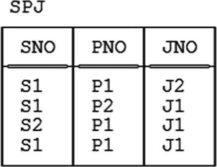
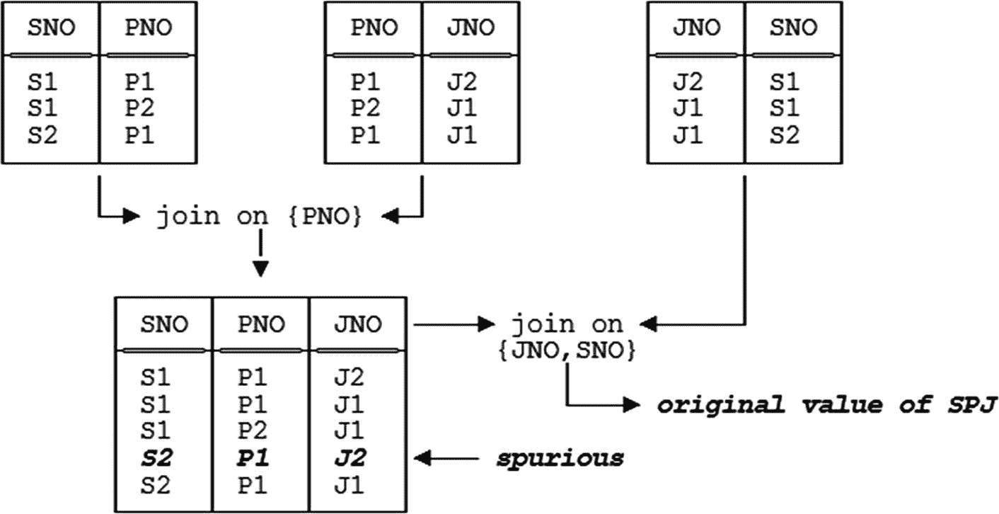
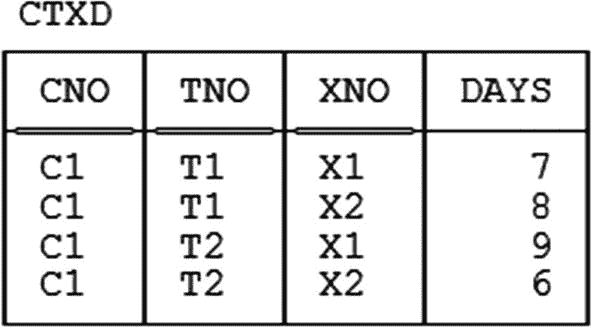
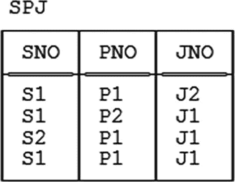
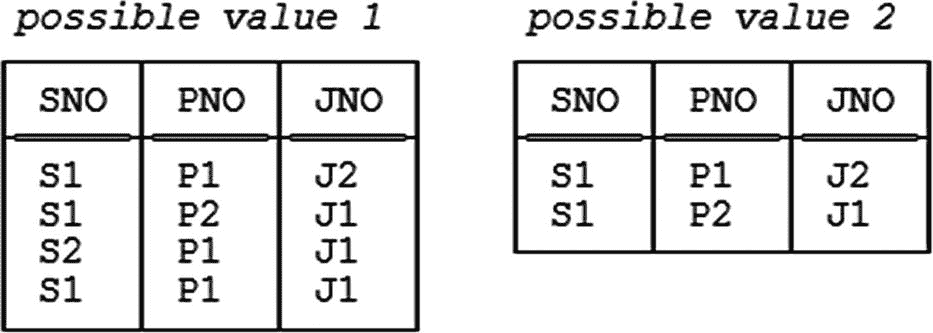
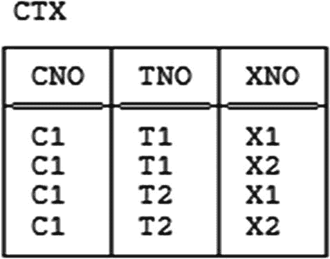
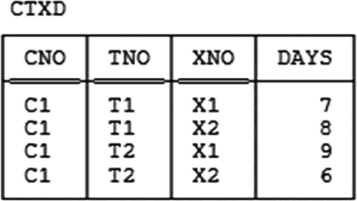

# 第九章 连接依赖与第五范式（非正式）

> *如果不能打败他们，就加入他们。*
> 
> ——佚名

正如鲍伊斯-科德范式是根据函数依赖来定义的，第五范式（5NF）同样是根据连接依赖（JDs）来定义的；^(¹²²) 如第 4 章所述，事实上，5NF 是关于连接依赖的*那个*范式，正如 BCNF 是关于函数依赖的*那个*范式一样。因此，本书这一部分对这些概念的处理方式，与第二部分对 BCNF 和函数依赖的处理是并行的。换句话说，我计划在第 10 章进行正式阐述，而在本章进行非正式讨论。

我必须立刻补充一点：尽管 5NF 确实是关于连接依赖的“那个”范式，但这并不必然意味着 5NF 是规范化过程的终极目标。*恰恰相反*，事实上：至少还有另外两种范式可能更有资格获得这个称号，我们将在本书的第四部分看到。然而，无论是从教学角度还是历史角度来看，我认为先详细讨论 5NF 是可取的。（我提到这一点只是为了避免造成误解；我的一位评审人认为我应该以不同的顺序呈现这些内容，但恕我难以苟同。）

过去，我在写作中倾向于将连接依赖视为一种广义的函数依赖。现在我意识到这种观点是错误的，或者至少是误导性的；相反，最好将连接依赖视为一种完全不同的现象。当然，函数依赖和连接依赖都属于依赖（即约束），并且它们在某些方面确实相似；特别是，某个连接依赖在关系变量`R`中成立，意味着`R`可以以某些方式进行无损分解，正如某个函数依赖在关系变量`R`中成立也意味着`R`可以以某些方式进行无损分解。同样正确的是，每一个函数依赖都隐含着一个连接依赖，因此，如果某个函数依赖`F`在关系变量`R`中成立，那么某个特定的连接依赖`J`在`R`中也成立。但并非所有连接依赖都是由函数依赖隐含的；事实上，说得非常宽松——但我必须在此强调，我接下来要说的*极其*不精确——我们或许可以说，5NF 涉及的是那些不被函数依赖所隐含的连接依赖。也就是说，当某个关系变量`R`处于 BCNF，但受到某个不被函数依赖隐含的连接依赖约束时，5NF 的概念才可能适用。

那么，一个关系变量处于 BCNF，当且仅当它所服从的所有函数依赖都由键隐含。因此，正如你可能预期的那样，一个关系变量处于 5NF，当且仅当它所服从的所有连接依赖都由键隐含。^(¹²³) 然而，后一个概念——即连接依赖由键隐含的概念——比其函数依赖的对应物更难精确界定；事实上，围绕这些概念有一个非常丰富的理论，你很快就会看到，其中一些理论初看起来可能有点让人难以招架（更不用说令人困惑了）。你需要保持清醒的头脑！正如一位在此领域比我渊博得多的人曾对我说过的：*连接依赖非常神秘*。

开场白到此为止；现在让我们进入正题。

### 连接依赖——基本概念

到目前为止，在本书的大部分内容中，我都在做一个隐含的假设：即当我们分解某个关系变量时，我们总是通过用该关系变量的恰好两个投影来替换它。^(¹²⁴) （请注意，希斯定理为我迄今为止关于无损分解的大部分论述提供了形式基础，它确实是专门针对分解为恰好两个投影的。）此外，只要我们的目标仅仅是达到 BCNF，这个假设就完全成立；换句话说，它成功地将我们带到了那个特定的目标。因此，你可能会惊讶地了解到，存在一些关系变量，它们不能被无损分解为两个投影，但可以被无损分解为三个（或更多）投影。

顺便提一下，值得注意的是，科德在 1969 年，即他关于关系模型的第一篇论文中（参见附录 D），就给出了一个例子，表明他已经意识到了上述可能性。然而，这个例子显然被该论文的大多数原始读者忽略了；当几年后（确切地说是 1977 年）这个可能性被重新发现时，研究界无疑感到很惊讶。

我之前曾宽松地提到，5NF 与那些不被函数依赖隐含的连接依赖有关。我现在可以进一步补充（尽管仍然是非常宽松的说法），它与那些不能被无损分解为两个投影，但可以被无损分解为三个或更多投影的关系变量有关。换句话说，当出现这些情况时——即存在(a) 不被函数依赖隐含的连接依赖和(b) 只能被无损分解为三个或更多投影的关系变量——你才真正需要认真研究连接依赖和 5NF。

那么，当我们说某个连接依赖在某个关系变量中成立时，确切含义是什么？定义如下：

*   **定义（连接依赖）：** 令 `X1`, ..., `Xn` 是关系变量 `R` 的标题 `H` 的子集；那么，连接依赖（JD）——有时更具体地称为 *n* 元连接依赖——
    ```
    ☼ { X1 , ... , Xn }
    ```
    在 `R` 中成立，当且仅当 `R` 可以无损分解为其在 `X1`, ..., `Xn` 上的投影，或者等价地说，当且仅当 `R` 的每一个合法值 `r` 都等于其在 `X1`, ..., `Xn` 上的投影 `r1`, ..., `rn` 的连接。`X1`, ..., `Xn` 被称为该连接依赖的组成部分，整个连接依赖可以读作“星 `X1`, ..., `Xn`”（有时也读作“连接 `X1`, ..., `Xn`”——不过我必须赶紧补充，“连接”在这里其实不是最贴切的词，因为通常理解的连接操作符连接的是*关系*，而 `X1`, ..., `Xn` 不是关系，而是标题）。

举个简单的例子，再次考虑供应商关系变量 `S`。如我们所知，该关系变量服从函数依赖 `{CITY} → {STATUS}`，因此希斯定理告诉我们，它可以无损分解为其在 `{SNO,SNAME,CITY}` 和 `{CITY,STATUS}` 上的投影。换句话说，以下二元连接依赖在该关系变量中成立：
```
☼ { { SNO , SNAME , CITY } , { CITY , STATUS } }
```

由此引出的要点：

*   注意，根据定义，组成部分 `X1`, ..., `Xn` 的并集必须等于 `H`（即 `H` 的每个属性必须至少出现在这些组成部分中的一个里），否则 `R` 就不可能等于这些组成部分对应投影的连接。

*   不同的作者使用不同的符号来表示连接依赖；我使用一种特殊类型的星号（“☼”），但符号 ⋈（“领结”）在研究文献中更常见。^(¹²⁵)

*   指出这一点可能有所帮助：说某个连接依赖成立，等价于说如果我们把相应的投影连接起来，永远不会得到任何“伪”元组（正如我在第 3 章的练习 3.2 中所称呼的那样）。


以下是排版后的文档内容：

假设我们观察到以下内容。我将通过一个简单但稍显抽象的例子来解释。设关系变量 *R* 仅包含属性 *A*、*B*、*C* 和 *D*，并且连接依赖 ☼{*AB*,*BC*,*CD*}（“希思记法” — 见第 7 章）在 *R* 中成立。此外，让我用符号 “∈” 表示 “出现在”（如第 5 章习题 5.4 的答案中所述）。那么，所述 JD 在 *R* 中成立等价于以下陈述：

```
if    EXISTS c1 ( EXISTS d1 ( ( a  , b  , c1 , d1 ) ∈ R ) ) AND
      EXISTS a2 ( EXISTS d2 ( ( a2 , b  , c  , d2 ) ∈ R ) ) AND
      EXISTS a3 ( EXISTS b3 ( ( a3 , b3 , c  , d  ) ∈ R ) )
then                          ( a  , b  , c  , d  ) ∈ R
```

*解释：* 假设 *R* 中存在一个元组满足 *A* = *a* 且 *B* = *b* ***并且*** *R* 中存在一个元组满足 *B* = *b* 且 *C* = *c* ***并且*** *R* 中存在一个元组满足 *C* = *c* 且 *D* = *d*。那么元组 (*a*,*b*)、(*b*,*c*) 和 (*c*,*d*) 将分别出现在 *R* 在 *AB*、*BC* 和 *CD* 上的投影中，因此当我们连接这三个投影时，元组 (*a*,*b*,*c*,*d*) 将会出现。

此外，其逆命题显然也成立：如果元组 (*a*,*b*,*c*,*d*) 出现在 *R* 中，那么元组 (*a*,*b*)、(*b*,*c*) 和 (*c*,*d*) 必然会出现在那三个投影中（因此上述正式陈述中的 ***如果*** 实际上可以被 ***当且仅当*** 所取代）。

作为这一点的简单说明，假设以下 JD 在关系变量 S 中成立：

```
☼ { { SNO , SNAME , CITY } , { CITY , STATUS } }
```

—— 这意味着元组 (*s*,*n*,*t*,*c*) 出现在 S 中当且仅当存在一个 S 中的元组满足 SNO = *s* 且 SNAME = *n* 且 CITY = *c* ***并且*** 存在一个 S 中的元组满足 CITY = *c* 且 STATUS = *t*。

继续这个例子，我们知道，前述 JD 在关系变量 S 中成立是希思定理的一个逻辑推论。事实上，我们现在可以重新表述希思定理如下：

*   **希思定理**（*针对关系变量，根据 JD 重述*）：设关系变量 *R* 的标题为 *H*，并设 *X*、*Y* 和 *Z* 是 *H* 的子集，使得 *X*、*Y* 和 *Z* 的并集等于 *H*。令 *XY* 表示 *X* 和 *Y* 的并集，类似地定义 *XZ*。如果 *R* 受函数依赖 *X* → *Y* 约束，那么 *R* 便受连接依赖 ☼{*XY*,*XZ*} 约束。

因此，如前所述，FD 蕴含 JD —— 但并非所有 JD 都由 FD 蕴含，我们稍后会看到。在详细阐述这一点之前，让我强调一下要求：给定 JD 的组件的并集必须等于相关标题。对于 FD 则没有类似的要求；对于 FD，其左右两边不必是它们的并集等于相关标题，它们只需是该标题的子集。这一区别（至少在直观上）可能有助于突出 JD 和 FD 在本质上确实不同。

现在，前述例子中的 JD —

```
☼ { { SNO , SNAME , CITY } , { CITY , STATUS } }
```

—— 是二元的，正如我所说：它有两个组件，并且对应于一个无损分解成两个投影。相比之下，以下另一个 JD 在关系变量 S 中成立：

```
☼ { { SNO , SNAME } , { SNO , CITY } , { CITY , STATUS } }
```

这个是三元的，但它实际上是通过“级联”两个二元 JD 得到的：

*   首先，我们已经知道，二元 JD ☼{{SNO,SNAME,CITY},{CITY,STATUS}} 在 S 中成立。
*   但是函数依赖 {SNO} → {SNAME} 在 S 在 {SNO,SNAME,CITY} 上的投影中成立（对应于该二元 JD 的一个组件），^(¹²⁶) 因此二元 JD ☼{{SNO,SNAME},{SNO,CITY}} 在该投影中成立。

由此可见，所述三元 JD 在原始关系变量中成立（并且该关系变量可以相应地无损分解成三个投影，但请理解我并不是说它应该这样做）。相比之下，在紧接的下一节中，我将给出一个三元 JD 的例子，它不是通过级联二元 JD 得到的，因此也是一个关系变量可以无损分解成三个投影而不能分解成两个的例子。

### 处于 BCNF 但非 5NF 的关系变量

我将从我们通常的发货关系变量 SP 的一个修改版本开始 —— 我称它为 SPJ。修改包括 (a) 删除属性 QTY 和 (b) 引入一个新属性 JNO（“项目编号”）。其谓词是*供应商 SNO 向项目 JNO 供应零件 PNO*，一个样本值如图 9-1 所示。注意，该关系变量是“全码”的，因此肯定处于 BCNF。



图 9-1
关系变量 SPJ — 样本值

现在假设以下业务规则（让我们称之为 BRX）生效：

*   如果 (a) 供应商 *s* 供应零件 *p* 并且 (b) 零件 *p* 被供应给项目 *j* 并且 (c) 项目 *j* 由供应商 *s* 供应，那么 (d) 供应商 *s* 向项目 *j* 供应零件 *p*。

用稍微更具体的话说，业务规则 BRX 表示，如果以下三个都是真命题 —

1.  Smith 向某个项目供应扳手
2.  某人向 Manhattan 项目供应扳手
3.  Smith 向 Manhattan 项目供应某物

—— 那么以下命题也是一个真命题：

4.  Smith 向 Manhattan 项目供应扳手。

换句话说，如果关系变量 SPJ 包含代表命题 a.、b. 和 c. 的元组，那么它必须也包含一个代表命题 d. 的元组。^(¹²⁷) 注意，图 9-1 中的要求得到了满足（取 S1 为 Smith，P1 为扳手，J1 为 Manhattan 项目）。

现在，命题 a.、b. 和 c. 通常并不蕴含命题 d.。详细来说，如果我们只知道命题 a.、b. 和 c. 为真，那么我们知道 Smith 向某个项目 *j* 供应扳手；我们知道某个供应商 *s* 向 Manhattan 项目供应扳手；并且我们知道 Smith 向 Manhattan 项目供应某个零件 *p* —— 但我们无法有效推断 *s* 就是 Smith，无法有效推断 *p* 就是扳手，也无法有效推断 *j* 就是 Manhattan 项目。诸如此类的错误推断就是有时被称为*连接陷阱*的例子。然而，在当前情况下，业务规则 BRX 告诉我们*没有陷阱*；也就是说，在这个特定案例中，我们*可以*从命题 a.、b. 和 c. 有效推断出命题 d.。

现在让我们更仔细地考虑这个例子。让我暂时用 SP、PJ 和 JS 分别表示 SPJ 在 {SNO,PNO}、{PNO,JNO} 和 {JNO,SNO} 上的投影。那么我们有以下结论：

*   根据投影和连接的定义，

    ```
    IF   ( s , p , j )     ∈  JOIN { SP , PJ , JS }
    THEN ( s , p )         ∈  SP
    AND  ( p , j )         ∈  PJ
    AND  ( j , s )         ∈  JS
    ```

    因此存在 *s'*、*p'* 和 *j'* 使得

    ```
    ( s  , p  , j' )  ∈  SPJ
    AND  ( s  , p' , j  )  ∈  SPJ
    AND  ( s' , p  , j  )  ∈  SPJ
    ```

*   但根据业务规则 BRX，

    ```
    IF   ( s  , p  , j' )  ∈  SPJ
    AND  ( s  , p' , j  )  ∈  SPJ
    AND  ( s' , p  , j  )  ∈  SPJ
    THEN ( s  , p  , j  )  ∈  SPJ
    ```

因此，如果 (*s*,*p*,*j*) 出现在 SP、PJ 和 JS 的连接中，那么它也出现在 SPJ 中。但其逆命题显然也成立 —— 即，如果 (*s*,*p*,*j*) 出现在 SPJ 中，那么它必然出现在 SP、PJ 和 JS 的连接中。

因此 (*s*,*p*,*j*) 出现在 SPJ 中***当且仅当***它出现在 SP、PJ 和 JS 的连接中。由此可见，关系变量 SPJ 的每个合法值都等于其在 {SNO,PNO}、{PNO,JNO} 和 {JNO,SNO} 上的投影的连接，因此以下 JD

```
☼ { { SNO , PNO } , { PNO , JNO } , { JNO , SNO } }
```

在关系变量 SPJ 中当然成立。


请注意，前述的 `JD` 是三元的——它包含三个分量。更重要的是，它并非由 `FDs` 所蕴含^(¹²⁸)。因此，它当然也不是由键所蕴含（回想第 5 章，键约束只是 `FD` 的一个特例）。其结果是，关系变量 `SPJ` 虽然处于 `BCNF`（因为它是“全键”的），却并未达到 `5NF`。

为了更好地理解这种状况，回顾图 9-1 所示的 `SPJ` 示例值会很有帮助。图 9-2 展示了 (a) 对应于该示例值的投影 `SP`、`PJ` 和 `JS` 的值，(b) 将 `SP` 和 `PJ` 投影（在 `{PNO}` 上）连接的效果，以及 (c) 将该结果与 `JS` 投影（在 `{JNO,SNO}` 上）连接的效果。如你所见，连接前两个投影会产生一个原始 `SPJ` 关系的副本，外加一个额外的（“虚假”）元组；再连接另一个投影则消除了那个额外的元组，从而让我们回到了原始的 `SPJ` 关系。此外，无论我们为第一次连接选择哪一对投影，最终效果都是相同的，尽管每种情况下的中间结果不同。*练习：* 验证这一说法。



**图 9-2**

`SPJ` 是其所有三个二元投影的连接，而非任意两个的连接

因此，再次强调，`JD` `☼{SP,PJ,JS}`——如果你现在允许我使用名称 `SP`、`PJ` 和 `SJ` 来指代相应的属性组而非投影本身——它在关系变量 `SPJ` 中成立；换句话说，这个 `JD` 可以说捕捉了业务规则 `BRX` 的本质。因此，关系变量 `SPJ` 可以据此进行无损分解。而且，它很可能应该被分解，因为它存在冗余；具体来说，以图 9-1 的示例值为例，“供应商 S1 向项目 J1 提供部件 P1”这一命题，既通过元组 (S1,P1,J1) 显式地表示，也作为 `JD` 以及其他三个元组所表示的命题的逻辑推论而隐式地存在。

*更多术语：* 我们说像在 `SPJ` 例子中成立的这种 `JD` 是*元组强制*的，因为如果某些元组出现，它就会强制某些额外的元组也必须出现。例如在图 9-1 中，三个元组 (S1,P1,J2)、(S1,P2,J1) 和 (S2,P1,J1) 的出现，强制了元组 (S1,P1,J1) 的出现。请注意，并非所有的 `JDs` 都是元组强制的；例如，连接依赖 `☼{{SNO,SNAME,CITY},{CITY,STATUS}}` 在关系变量 `S` 中成立，如我们所知，但它不会强制元组出现。*注记：* 提前说一下，我们稍后会看到，一个受元组强制 `JD` 约束的关系变量不可能处于 `5NF`（尽管如 `SPJ` 例子所示，它可以处于 `BCNF`）。

### 循环规则

现在观察业务规则 `BRX` 的循环性质（“如果 `s` 连接到 `p`，`p` 连接到 `j`，并且 `j` 又连接回 `s`，那么 `s`、`p` 和 `j` 必须都是*直接*连接的，意思是它们必须全部出现在同一个元组中”）。让我们同意将该规则 `BRX` 描述为“三路循环”的。那么更一般地说，如果对于某个 `n` > 2 存在一条 `n` 路循环规则，我们就可能面临一个关系变量，它 (a) 处于 `BCNF` 但未达到 `5NF`，因此 (b) 可以无损分解为 `n` 个投影，但不能分解为更少^(¹²⁹)。

话虽如此，我也必须指出，根据我的经验，此类循环规则在实践中很少见——这意味着，在实践中，大多数关系变量，如果它们至少处于 `BCNF`，很可能也处于 `5NF`。实际上，在实践中发现一个处于 `BCNF` 但未达到 `5NF` 的关系变量是相当不寻常的。虽然不寻常，但并非未知！——我自己当然也偶尔遇到过一些真实世界的例子。换句话说，这类关系变量不常见这一事实，并不意味着你不需要担心它们，或者不需要担心 `JDs` 和 `5NF`。事实上，恰恰相反：`JDs` 和 `5NF` 可以说是你设计工具箱中的工具，并且（在其他条件相同的情况下）你或许应该尝试确保你数据库中的所有关系变量都处于 `5NF`^(¹³⁰)。


### 结束语

本章将以几点补充说明收尾。首先请注意，在本书的这一部分——实际上在之前的部分也一样，并且在另行通知前都将如此——我假设就关系分解与重组而言，我们唯一关心的运算符是投影和连接（分解用投影，重组用连接）。在此假设下，根据连接依赖的定义，`JD`在某种意义上是“终极”类型的依赖；也就是说，不存在比`JD`“更高级”的依赖类型使得`JD`仅仅是该高级类型的一个特例。由此进一步得出——尽管我尚未正式定义它！——关于投影和连接，第五范式是最终的范式^(¹³¹)（这也解释了它的别名，即*投影-连接*范式或`PJ/NF`）。

其次，我已多次提及处于`BCNF`但非`5NF`的关系变量；实际上，我默认了一个假设：如果关系变量`R`处于`5NF`，那么它必然也处于`BCNF`。事实上这个假设是正确的。我还要声明，`5NF`总是可实现的；也就是说，任何不处于`5NF`的关系变量总能被分解为一组`5NF`投影——当然，这未必能无损地保留依赖，因为我们已经在第 7 章知道，保留依赖与分解到`BCNF`（更不用说`5NF`）可能是相互冲突的目标。

第三，根据`5NF`的定义，一个处于`5NF`的关系变量`R`保证可以消除那些能通过取投影来移除的冗余。换言之，说`R`处于`5NF`，就意味着对`R`进一步进行无损分解成投影，虽然可能可行，但肯定不会移除任何冗余。*然而需特别注意，说 R 处于 5NF 并不意味着 R 没有冗余。*（相反的看法是另一种普遍存在的误解。参见第 1 章练习 1.11。）事实是，有许多种冗余是投影本身无力消除的——这正说明了我在第 1 章“设计理论的地位”一节中提出的观点，即当前的设计理论完全未涉及诸多问题。例如，请看图 9-3，它展示了一个关系变量`CTXD`的示例值，该变量处于`5NF`但仍存在冗余。其谓词是*教师`TNO`在课程`CNO`上使用教材`XNO`共`DAYS`天*。唯一键是`{CNO,TNO,XNO}`。如你所见，例如教师`T1`教授课程`C1`这一事实出现了两次，同样，课程`C1`使用教材`X1`这一事实也出现了两次^(¹³²)。



图 9-3 处于`5NF`的关系变量`CTXD`——示例值

让我们更仔细地分析这个例子：
*   由于`{CNO,TNO,XNO}`是一个键，该关系变量服从以下函数依赖——
    ```
    { CNO , TNO , XNO } → { DAYS }
    ```
    ——这是一个“键向外的箭头”。
*   因此，`DAYS`依赖于`CNO`、`TNO`和`XNO`全部三者，所以它不能出现在缺少其中任何一个的关系变量中。
*   因此，根本不存在将该关系变量分解成投影的（非平凡）方案——该关系变量处于`5NF`。*注：* 一个分解是平凡的，当且仅当它基于的依赖（`FD`或`JD`）本身是平凡的；否则就是非平凡的。平凡`FD`已在第 4 章和第 5 章讨论；平凡`JD`将在下一章讨论。
*   因此，肯定不存在能移除冗余的分解成投影的方案，更不用说了。

### 练习

1.  （*重复自正文中内容。*）验证：(a) 连接图 9-2 中显示的任意一对二元关系，都会产生一个包含“伪”元组（即不出现在图 9-1 中的元组）的结果；(b) 将第三个二元关系连接到该中间结果上，然后会消除那个伪元组。
2.  编写一条`Tutorial D``CONSTRAINT`语句，来表达正文中讨论的关系变量`SPJ`中所成立的`JD`。
3.  为以下场景设计一个数据库。需要表示的实体是销售代表、销售区域和产品。每个代表负责一个或多个区域的销售；每个区域有一个或多个负责的代表。每个代表负责销售一种或多种产品，每种产品有一个或多个负责的代表。每种产品在一个或多个区域销售，每个区域有一种或多种产品在销售。最后，如果代表`r`负责区域`a`，并且产品`p`在区域`a`销售，并且代表`r`销售产品`p`，那么`r`在`a`销售`p`。
4.  如果可能，请给出一个来自你自己工作环境的、处于`BCNF`但非`5NF`的关系变量的例子。


### 答案

1.  在本章正文中讨论了连接 `SP` 和 `PJ`。连接 `PJ` 和 `JS` 会产生伪元组 `(S2,P2,J1)`，然后因为它不存在于 `SP` 中的 `(S2,P2)` 元组而被消除。连接 `JS` 和 `SP` 会产生伪元组 `(S1,P2,J2)`，然后因为它不存在于 `PJ` 中的 `(P2,J2)` 元组而被消除。

2.  ```
    CONSTRAINT ... SPJ = JOIN { SPJ { SNO , PNO } ,
    SPJ { PNO , JNO } ,
    SPJ { JNO , SNO } } ;
    ```
    请注意，此约束是一个**等式依赖**（即 `EQD`——参见第 3 章）。

3.  首先，我们大概需要三个关系变量，分别代表代表、区域和产品：
    ```
    R { RNO , ... } KEY { RNO }
    A { ANO , ... } KEY { ANO }
    P { PNO , ... } KEY { PNO }
    ```
    现在，如果代表 `r` 负责区域 `a`，并且产品 `p` 在区域 `a` 销售，且代表 `r` 销售产品 `p`，那么 `r` 就在区域 `a` 销售 `p`。这是一个三元循环规则。因此，如果我们有一个看起来像这样的关系变量 `RAP`——
    ```
    RAP { RNO , ANO , PNO } KEY { RNO , ANO , PNO }
    ```
    （具有明显的谓词）——那么在该关系变量中将成立以下连接依赖（JD）：
    ```
    ☼ { { RNO , ANO } , { ANO , PNO } , { PNO , RNO } }
    ```
    该关系变量因此会受到冗余的影响。那么，让我们用它的三个二元投影来替换它：
    ```
    RA { RNO , ANO } KEY { RNO , ANO }
    AP { ANO , PNO } KEY { ANO , PNO }
    PR { PNO , RNO } KEY { PNO , RNO }
    ```
    （现在需要声明并强制执行几个 `EQD`——例如，投影 `RA{RNO}` 和 `PR{RNO}` 必须始终相等——但细节很简单，此处省略。）
    接下来，每个代表负责一个或多个区域的销售，每个区域有一个或多个负责的代表。但此信息已包含在关系变量 `RA` 中，无需更多。类似地，关系变量 `AP` 处理每个区域有一个或多个产品在其销售且每个产品在一个或多个区域销售的**事实**，而关系变量 `PR` 处理每个产品有一个或多个负责的代表且每个代表负责销售一个或多个产品的**事实**。然而，请注意，用户**确实**需要被告知 `RA`、`AP` 和 `PR` 的连接**不**涉及任何“连接陷阱”（即三元循环规则成立）。让我们探讨这一点。首先，`RA`、`AP` 和 `PR` 的谓词如下：
    *   `RA`：*代表 `RNO` 负责区域 `ANO`。*
    *   `AP`：*产品 `PNO` 在区域 `ANO` 销售。*
    *   `PR`：*产品 `PNO` 由代表 `RNO` 销售。*
    顺便注意，一个架构良好的 `DBMS`——遗憾的是，据我所知，目前市场上没有这样的产品！——将允许设计者告知其这些谓词。*注：* 告知 `DBMS` 关于谓词的信息当然也能告知用户。区别在于，告知用户可以非正式地进行（实际上，在当今系统中必须非正式地进行），但告知 `DBMS`（如果能做到的话）则必须正式地进行。
    回到三元规则。显然，设计者不能仅仅告知用户关系变量 `RA`、`AP` 和 `PR` 的连接等于关系变量 `RAP`，因为在分解之后关系变量 `RAP` 已不复存在。然而，我们可以将该连接定义为一个视图（或“虚拟关系变量”）：
    ```
    VAR RAP VIRTUAL ( JOIN { RA , AP , PR } )
    KEY { RNO , ANO , PNO } ;
    ```
    然后，同一个架构良好的 `DBMS` 将能够推断出以下作为视图 `RAP` 的谓词：
    *代表 `RNO` 负责区域 `ANO`* **并且** *产品 `PNO` 在区域 `ANO` 销售* **并且** *产品 `PNO` 由代表 `RNO` 销售*。
    但此谓词**不完全符合事实**（它没有捕捉到三元循环规则）。因此，理想情况下，应该有一种方式让设计者告知 `DBMS`（以及用户），谓词实际上如下：^(¹³³)
    *代表 `RNO` 负责区域 `ANO`* **并且** *产品 `PNO` 在区域 `ANO` 销售* **并且** *产品 `PNO` 由代表 `RNO` 销售*
    **并且**
    *代表 `RNO` 在区域 `ANO` 销售产品 `PNO`。*
    请注意，后一个谓词比前一个更强，因为如果某个 `(RNO,PNO,ANO)` 三元组满足后者，则它必然满足前者，而反之则（显然）为假。

4.  *未提供答案。*

脚注 1   2   3   4   5   6   7   8   9   10   11   12

## 10. JD 与 5NF（形式化）

> *巨大的痛苦过后，一种形式化的感觉降临。*
> ——艾米莉·狄金森：
> 《诗作第 341 号》（约 1862 年）：
> 托马斯·H·约翰逊（编）：
> 《艾米莉·狄金森诗集全编》（1960 年）

正如第 5 章是对第 4 章非正式引入内容的形式化处理一样，本章也是对第 9 章非正式引入内容的形式化处理。但本章涵盖的内容比第 5 章要多得多，你很快就会看到。让我先说明一点，正如第 5 章很少谈及 `2NF` 或 `3NF`，本章也很少谈及 `4NF`；事实上，像 `2NF` 和 `3NF` 一样，`4NF` 至少从某些角度来看，主要是具有历史意义的。不过，我将在后面的章节（第 12 章）更详细地讨论它。


### 连接依赖再探

我首先给出连接依赖（JD）的精确定义，随后的解释性文本在结构上刻意与第 5 章对应文本平行。（类似的说明也适用于下一节。）

#### 定义（连接依赖）
令 `H` 为一个标题；那么，关于 `H` 的一个连接依赖（JD）是一个形如 ☼{`X1`,...,`Xn`} 的表达式，其中 `X1`, ..., `Xn`（该 JD 的分量）是 `H` 的子集，且它们的并集等于 `H`。**注意：** 如果 `H` 是已理解的，那么“关于 `H` 的 JD”这一短语可简称为“JD”。

以下是一些示例：

```
☼ { { SNO , SNAME , CITY } , { CITY , STATUS } }
☼ { { CITY , SNO } , { CITY , STATUS , SNAME } }
☼ { { SNO , SNAME } , { SNO , STATUS } , { SNAME , CITY } }
☼ { { SNO , CITY } , { CITY , STATUS } }
```

请注意，与函数依赖（FD）类似，JD 是针对某个标题定义的，而不是针对某个关系或某个关系变量。例如，就刚才显示的 JD 而言，前三个是针对标题 `{SNO,SNAME,STATUS,CITY}` 定义的，而第四个是针对标题 `{SNO,STATUS,CITY}` 定义的。

还需注意，同样像 FD 一样，从形式上来看，JD 只是表达式；当针对某个特定关系进行解释时，它们就成为（根据定义）求值结果为真（TRUE）或假（FALSE）的命题。例如，如果将上面显示的前两个 JD 针对关系变量 `S` 的当前值（见图 1-1 或图 3-1）所对应的关系进行解释，那么第一个 JD 求值为真，第二个则求值为假。

当然，在非正式语境下，通常将 ☼{`X1`,...,`Xn`} 定义为 JD 的条件是，它在某个特定上下文中求值为真。然而，这种定义方式无法用于描述某个给定关系不满足或违反某个给定 JD 的情况——因为根据那个非正式定义，一个不满足的 JD 根本就不算是 JD。例如，我们就无法说关系变量 `S` 的当前值违反了上面显示的第二个 JD。

这是另一个 JD 的例子，它恰好被关系变量 `S` 的当前值所满足（实际上也被该关系变量的所有合法值所满足）：

```
☼ { { SNO , SNAME , CITY } , { CITY , STATUS } , { CITY , STATUS } }
```

这个 JD 对应于一种无损分解，其中某个投影在重构过程中并非必需。实际上，它显然等价于前面显示的四个 JD 中的第一个^(¹³⁴)——

```
☼ { { SNO , SNAME , CITY } , { CITY , STATUS } }
```

——这意味着可以从原始 JD 中删除两个相同分量之一，而不会造成重大损失。基于这些原因，我将把任何给定 JD 的分量统称为一个集合^(¹³⁵)，即使该 JD 书面形式中的分量逗号列表可能包含重复项（集合本身永远不会包含重复项）。（当然，这就是为什么那个逗号列表要用花括号括起来。）

#### 定义（满足或违反 JD）
令关系 `r` 的标题为 `H`，并令 ☼{`X1`,...,`Xn`} 是一个关于 `H` 的 JD，记为 `J`。如果 `r` 等于其在 `X1`, ..., `Xn` 上投影的连接，则 `r` 满足 `J`；否则 `r` 违反 `J`。

请注意，是关系而不是关系变量满足或违反某个给定的 JD。例如，给定前一页顶部的四个 JD，关系变量 `S` 的当前值满足第一个和第三个——

```
☼ { { SNO , SNAME , CITY } , { CITY , STATUS } }
☼ { { SNO , SNAME } , { SNO , STATUS } , { SNAME , CITY } }
```

——但违反了第二个：

```
☼ { { CITY , SNO } , { CITY , STATUS , SNAME } }
```

请注意，该关系是否满足或违反第四个 JD 的问题——

```
☼ { { SNO , CITY } , { CITY , STATUS } }
```

——并不存在，因为该 JD 并非针对该关系的标题定义的。

#### 定义（JD 成立）
令关系变量 `R` 的标题为 `H`，并令 ☼{`X1`,...,`Xn`} 是一个关于 `H` 的 JD，记为 `J`。那么，JD `J` 在关系变量 `R` 中成立（等价地，关系变量 `R` 受限于 JD `J`）当且仅当任何可能赋值给关系变量 `R` 的关系都满足 `J`。在关系变量 `R` 中成立的 JD 就是 `R` 的 JD。

请注意我在此所做的术语区分——关系满足（或违反）JD，但 JD 在关系变量中成立（或不成立）。在接下来的内容中，我将始终遵循这一区分。

例如，前一页顶部给出的四个 JD 中，第一个在关系变量 `S` 中成立——

```
☼ { { SNO , SNAME , CITY } , { CITY , STATUS } }
```

——但第二个和第三个不成立：

```
☼ { { SNO , SNAME } , { SNO , STATUS } , { SNAME , CITY } }
☼ { { CITY , SNO } , { CITY , STATUS , SNAME } }
```

（与前一定义后的示例对比。）因此，现在我们终于确切知道了“一个给定的关系变量受限于某个给定的 JD”意味着什么。而且应该很清楚——事实上，从定义中可以直接看出——关系变量 `R` 可以无损分解为其在 `X1`, ..., `Xn` 上的投影***当且仅当***它受限于 JD ☼{`X1`,...,`Xn`}。


### 第五范式

之前，在我们讨论 `FDs` 和 `BCNF` 时，我们涉及了关于 **平凡 FD**、**FD 可归约性**、**由键蕴含的 FD** 以及各种相关事项的讨论。正如你目前可能预料到的那样，`JDs` 和 `5NF` 也存在类似的概念，但细节要稍微复杂一些。嗯，`JD` 是平凡的这个概念实际上非常直接：

*   **定义（**平凡 JD**）：** 设 `☼{*X1*,...,*Xn*}` 是一个关于关系模式 `H` 的 `JD`，记为 `J`。那么，当且仅当每一个具有关系模式 `H` 的关系都满足 `J` 时，`J` 才是平凡的。

根据这个定义，很容易证明以下结论：

*   **定理：** 设 `☼{*X1*,...,*Xn*}` 是一个关于关系模式 `H` 的 `JD`，记为 `J`。那么，当且仅当某个 `Xi`（1 ≤ `i` ≤ `n`）等于 `H` 时，`J` 才是平凡的（因为每个具有关系模式 `H` 的关系必然满足每一个形如 `☼{...,*H*,...}` 的、关于 `H` 的 `JD`）。

我们可以将此定理视为一个可操作的（或“语法上的”）定义，因为它提供了一个在实践中易于应用的有效测试。（相比之下，形式化或“语义上的”定义在判断一个给定 `JD` 是否平凡这一实际问题上用处不大。）

我将把 `JD 可归约性` 的讨论推迟到下一章。在此之前，我想解释一下 `JD` 由键蕴含的含义：

*   **定义（由键蕴含的 JD）：** 设关系变量 `R` 的关系模式为 `H`，并设 `☼{*X1*,...,*Xn*}` 是一个关于 `H` 的 `JD`，记为 `J`。那么，当且仅当每一个满足 `R` 的键约束的关系 `r` 也满足 `J` 时，`J` 才是由 `R` 的键所蕴含的。

这个定义需要一定的阐述。首先，说某个关系满足某个特定的键约束，就是说它满足适用的唯一性约束；并且，如果它满足构成某个键的属性集上的唯一性约束，那么它肯定也满足该属性集的每个超集上的唯一性约束（当然，只要该超集是相关关系模式的子集即可）——换句话说，也满足每个对应的超键上的唯一性约束。因此，定义中“满足 `R` 的键约束”的短语可以被替换为“满足 `R` 的超键约束”，而不会产生任何实质性差异。同样，“由键蕴含”的概念也完全可以视为“由超键蕴含”，同样也不会产生任何实质性差异。

其次，如果定义中提到的 `JD` `J` 是平凡的会怎样？嗯，在这种情况下，根据定义，`J` 被每一个具有关系模式 `H` 的关系 `r` 所满足，因此，它当然也被每一个满足 `R` 的键约束的关系 `r` 所满足。所以，平凡 `JDs` 总是“由键蕴含的”，这是显而易见的。

第三，考虑非平凡的 `JDs`。我们如何判断某个非平凡的 `JD` `J` 是否被某个关系变量的键所蕴含？这个问题确实有一个令人满意的答案，但它有点复杂，因此我将把它推迟到下一节讨论。在此之前，我想给出 `5NF` 的定义，并对该定义做些说明：

*   **定义（第五范式）：** 当且仅当关系变量 `R` 的每一个 `JD` 都由 `R` 的键所蕴含时，该关系变量才处于第五范式（`5NF`），也称为投影-连接范式（`PJ/NF`）。

现在，应该很清楚，如果一个 `JD` 由 `R` 的键所蕴含，那么它当然在 `R` 中成立（即它当然是“`R` 的一个 `JD`”）。*但反之则不成立：* 一个 `JD` 可以在 `R` 中成立，却没有被 `R` 的键所蕴含。换句话说，`5NF` 定义的关键在于，在一个 `5NF` 关系变量中成立的唯一 `JDs` 是我们无法消除的那些——这意味着它们是由键所蕴含的（包括平凡的情况作为一个特例）。^(¹³⁶)

我想通过指出 `BCNF` 和 `5NF` 定义之间一个直观上很有吸引力的平行关系来结束本节：

*   `R` 处于 `BCNF`，当且仅当每一个在 `R` 中成立的 `FD` 都由 `R` 的键所蕴含。

*   `R` 处于 `5NF`，当且仅当每一个在 `R` 中成立的 `JD` 都由 `R` 的键所蕴含。

然而，也有一个显著的差异。在 `BCNF` 定义中，我们可以将“由键蕴含”的短语简化为“由*一个*键蕴含”（意指任意单独考虑的键）——因为，如果关系变量 `R` 具有键 `K1`, ..., `Kn`，并且对于某个键 `Ki`，`FD` `Ki` → `Y` 在 `R` 中成立，那么对于所有键 `Ki`（1 ≤ `i` ≤ `n`），`FD` `Ki` → `Y` 必然在 `R` 中成立。相比之下，这种简化不适用于 `5NF`——在 `5NF` 关系变量中成立的 `JDs` 是那些由组合在一起的键所蕴含的 `JDs`，*而不仅仅*是由某个单独考虑的键所蕴含。例如，我们暂时假设关系变量 `S` 有两个键：`{SNO}` 和 `{SNAME}`。那么，下面的 `JD`（我们已经见过多次的一个重复）——
```
☼ { { SNO , SNAME } , { SNO , STATUS } , { SNAME , CITY } }
```
——将会在该关系变量中成立。（明确来说，每一个满足这两个键约束的关系都将满足此 `JD`。）但是，一个不满足*这两个*键约束的关系，也不一定会满足该 `JD`，因此该 `JD` 不在该关系变量中成立，正是因为 `{SNAME}` 实际上不是一个键。*练习：* 创建一些示例数据来证明这些陈述的真实性。


### 由键所蕴含的连接依赖

那么，我们如何确定一个给定的非平凡连接依赖是否由键所蕴含呢？事实证明存在一种算法，即*成员算法*（由 Fagin 提出），可以完成这项工作。它的工作原理如下。设关系变量 `R` 的标题为 `H`，并设 ☼ `{X1, ..., Xn}` 是相对于 `H` 的一个连接依赖，记为 `J`。那么：

1.  如果 `J` 的两个不同分量都包含 `R` 的同一个键 `K`，则在 `J` 中用它们的并集替换它们。
2.  重复上一步，直到无法再进行替换为止。

那么，当且仅当此时的 `J` 是平凡的——即当且仅当 `J` 的最终版本包含 `H` 作为一个分量时^(¹³⁷)，算法成功，且原始的连接依赖由 `R` 的键所蕴含。（注意，平凡的连接依赖尤其会使算法成功，这是显而易见的。）

让我们看几个例子。首先，考虑我们常用的关系变量 `S`。这里还有另一个在该关系变量中成立的连接依赖——我们称之为 `J1`：

```
☼ { { SNO , SNAME } , { SNO , STATUS } , { SNO , CITY } }
```

我们通过反复应用希斯定理已经知道这个连接依赖在 `S` 中成立。然而，现在请注意分量 `{SNO,SNAME}` 和 `{SNO,STATUS}` 都包含键 `{SNO}`。因此，应用成员算法，我们可以用它们的并集 `{SNO,SNAME,STATUS}` 替换它们。`J1` 现在看起来像这样：

```
☼ { { SNO , SNAME , STATUS } , { SNO , CITY } }
```

请注意，(a) 这个修订后的 `J1` 本身也是一个相对于关系变量 `S` 标题的连接依赖，并且 (b) 关系变量 `S` 也受其约束——这两个事实合起来应该能让我们对算法的工作原理有所了解（更多解释见后文）。

接下来，后一个连接依赖的分量 `{SNO,SNAME,STATUS}` 和 `{SNO,CITY}` 都包含键 `{SNO}`，因此我们可以用它们的并集替换它们。我们得到：

```
☼ { { SNO , SNAME , STATUS , CITY } }
```

`J1` 的这个进一步修订版又是一个连接依赖（实际上是一个*一元*连接依赖），相对于 `S` 的标题。然而，它表达的只是关系变量 `S` 等于其恒等投影的“连接”（回想一下第 5 章习题 5.1 的答案：单个关系 `r` 的连接 `JOIN{r}` 恒等于 `r`）。换句话说，`J1` 的这个进一步修订版只是说 `S` 可以被“无损分解”为其恒等投影。但这个观察是显然成立的：*任何*关系变量都可以被“无损分解”为其恒等投影，正如我们在第 6 章中所见。事实上，该连接依赖现在形式上是平凡的，因为它包含一个等于相关标题的分量。由此可知，最初陈述的连接依赖 `J1` 由关系变量 `S` 的键所蕴含。

作为反例，现在考虑以下连接依赖——我们称之为 `J2`——它也在关系变量 `S` 中成立：

```
☼ { { SNO , SNAME , CITY } , { CITY , STATUS } }
```

由于该关系变量的唯一键 `{SNO}` 显然没有包含在这个（二元）连接依赖的两个分量中，成员算法对它没有影响。因此，该算法的输出等于输入（即由原始的连接依赖 `J2` 组成，未改变）；该输出的任何分量都不等于整个标题，因此 `J2` 不是由键所蕴含的（所以关系变量 `S` 也就不在 5NF 中）。

最后，让我们考虑一些更抽象的例子。设关系变量 `R` 只有属性 `A`、`B`、`C`、`D`、`E` 和 `F`，并且 `R` 只有键 `{A}`、`{B}` 和 `{C,D}`。进一步，用 `AB` 表示属性集 `{A,B}`，其他属性名组合类似（“希斯表示法”——参见第 7 章）。现在考虑以下连接依赖：

1.  ☼ `{` `AB` `,` `ACDE` `,` `BF` `}`
2.  ☼ `{` `ABC` `,` `ACD` `,` `BEF` `}`
3.  ☼ `{` `AB` `,` `AC` `,` `ADEF` `}`
4.  ☼ `{` `ABC` `,` `CDEF` `}`
5.  ☼ `{` `ABD` `,` `ACDE` `,` `DF` `}`

在继续阅读之前，请尝试自己将成员算法应用于这些连接依赖。如果你这样做，你会发现编号 1-3 是由键所蕴含的（因此 `R` 必然受其约束），而编号 4-5 则不是。简要说明如下：

*   编号 1 和 2 都是由键对 `{A}` 和 `{B}` 共同蕴含的，但不是由任何单个键蕴含的。
*   相比之下，编号 3 是由键 `{A}` 单独蕴含的。
*   编号 4 当且仅当 `{C}` 是一个键时才会被键所蕴含（实际上是被一个单键蕴含），但它并不是；此外，该连接依赖不可能在 `R` 中成立，因为如果成立，那么 `{C}` 将必须是一个键（请思考一下！）。
*   至于编号 5，它显然不是由键所蕴含的；它可能在 `R` 中成立，也可能不成立，但如果成立，那么 `R` 就不可能在 5NF 中。

那么这些例子中到底发生了什么？让我试着解释一下我所说内容背后的直观含义（你可能愿意尝试根据关系变量 `S` 和连接依赖 ☼`{{SNO,SNAME},{SNO,STATUS},{SNAME,CITY}}` 来推导接下来的内容，并再次假设 `{SNO}` 和 `{SNAME}` 都是该关系变量的键）：

*   设 `X1`, ..., `Xn` 是关系变量 `R` 标题 `H` 的子集，使得 `X1`, ..., `Xn` 的并集等于 `H`。
*   设 `J` 为连接依赖 ☼`{X1, ..., Xn}`，并且 `J` 由 `R` 的键所蕴含。
*   设 `r` 是 `R` 的当前值的关系。
*   任意选择集合 `{X1, ..., Xn}` 中的两个不同元素（分量），例如 `X1` 和 `X2`。
*   设 `r1` 和 `r2` 分别是 `r` 在 `X1` 和 `X2` 上的投影。

现在，如果 `X1` 和 `X2` 都包含 `R` 的同一个键 `K`，那么 `r1` 和 `r2` 的连接 `r12`——其标题 `X12` 将是 `X1` 和 `X2` 的并集——将是一个严格的一对一连接，因此可以用 `r12` 替换 `r1` 和 `r2` 而不会丢失信息。（同时，`J` 中的 `X1` 和 `X2` 可以用 `X12` 替换。）由于（如前所述）原始的 `J` 是由 `R` 的键所蕴含的，重复进行此类替换将根据定义最终产生一个关系，该关系 (a) 等于原始关系 `r`，特别是 (b) 因此其标题等于整个标题 `H`。

现在让我指出，我到目前为止所说的一切在常见特殊情况下——即相关关系变量 `R` 只有一个键 `K` 时——会变得简单得多。在这种情况下，连接依赖 ☼`{X1, ..., Xn}` 由键所蕴含当且仅当以下两点同时为真：

1.  `R` 的每个属性都包含在至少一个 `X1`, ..., `Xn` 中。（当然，这个要求在一般情况下以及这个特殊情况下都适用。）
2.  `R` 的唯一键 `K` 包含在每一个 `X1`, ..., `Xn` 中——换句话说，每一个 `X1`, ..., `Xn` 都是一个超键。

因此，如果 `R` 只有一个键 `K`，那么 `R` 在 5NF 中当且仅当在 `R` 中成立的每一个连接依赖的每一个分量都包含那个键 `K`^(¹³⁸)。然而，请注意——***这一点非常重要！***——我在这里假设所考虑的连接依赖都是相对于 `R` 不可约的。更多解释请参见第 11 章。

作为上述观点的一个例子，考虑关系变量 `P`。在该关系变量中成立的唯一不可约连接依赖 ☼`{X1, ..., Xn}` 满足每一个 `Xi`（`i` = 1, ..., `n`）都包含唯一键 `{PNO}`。因此，这些连接依赖显然都由那个唯一键所蕴含，所以关系变量 `P` 在 5NF 中。以下是所讨论的其中一个连接依赖：

```
☼ { { PNO , PNAME , COLOR } , { PNO , WEIGHT , CITY } }
```

因此，关系变量 `P` 可以被无损分解为其在这个连接依赖分量上的投影。（当然，我们是否真的想执行这个分解是另一回事。我们知道如果我们想的话可以这样做，仅此而已。）

让我来结束本节的讨论，重新回顾一下第 9 章的`SPJ`示例。为方便起见，该关系变量的一个样本值显示在图 10-1 中（即图 9-1 的重复）。其谓词是“供应商`SNO`向项目`JNO`供应零件`PNO`”，且以下业务规则（`BRX`）生效：


*图 10-1：关系变量`SPJ`——样本值*

*   如果供应商`s`供应零件`p`，且零件`p`供应给项目`j`，并且项目`j`由供应商`s`供应，那么供应商`s`向项目`j`供应零件`p`。

现在，根据第 9 章的内容，我们知道（正如我在该章所述）以下`JD`捕捉了业务规则`BRX`的精髓，因此在关系变量`SPJ`中成立：
```
☼ { { SNO , PNO } , { PNO , JNO } , { JNO , SNO } }
```
现在我们可以看到，这个`JD`并非由该关系变量的唯一键（即`{SNO,PNO,JNO}`）所蕴含，因为成员资格判定算法失败，所以`SPJ`不在`5NF`中。因此，它可以无损分解为其三个二元投影，如果我们想要减少冗余，或许应该这样做。这三个投影都处于`5NF`中（除了平凡的`JD`外，它们中根本不成立任何`JD`）。

### 一个有用的定理
我在第 9 章说过，在实践中发现一个处于`BCNF`但不处于`5NF`中的关系变量是相当罕见的。事实上，有一个定理阐述了这个问题：
```
定理：设 R 是一个 BCNF 关系变量，且 R 没有复合键；则 R 处于 5NF 中。
```
（回顾第 1 章，复合键是指由两个或更多属性组成的键。）

这个定理非常有用。它说明的是，如果你能到达`BCNF`（这相当容易），并且如果你的`BCNF`关系变量中没有任何复合键（这通常是但并非总是如此），那么你就不必担心`JD`和`5NF`整体上的复杂性——你无需再进一步思考这个问题，就能知道该关系变量*本身*就处于`5NF`中。*注：* 实际上该定理适用于`3NF`，而非`BCNF`；也就是说，它真正说的是一个没有复合键的`3NF`关系变量处于`5NF`中。但每个`BCNF`关系变量都处于`3NF`中，而且无论如何，从实用角度讲（并且概念上也更简单），`BCNF`比`3NF`重要得多。

我不知道为什么，但人们常常误解上述定理。具体来说，鉴于没有复合键的`BCNF`关系变量是“自动”处于`5NF`中的，人们似乎常常认为，仅仅向一个`BCNF`关系变量中引入代理键（按定义就是非复合的）就意味着该关系变量“自动”现在处于`5NF`中。但这根本不是事实！如果该关系变量在引入代理键之前不处于`5NF`中，之后也不会处于`5NF`中。特别是，如果它在引入代理键之前有一个复合键，之后它仍然会有一个复合键。

### FD 不是 JD
在文献中不太正式的部分，常常出现诸如“每个`FD`都是一个`JD`”，或者（正如我在第 9 章所说）“`JD`是某种广义的`FD`”之类的说法；实际上，我在以前的书籍和其他著作中也说过这样的话。但这种说法是严格错误的。更好的说法是每个`FD`*蕴含*一个`JD`（事实上，这是通过希斯定理我们已知的情况）。换句话说，如果`R`受限于某个`FD`，比方说`F`，那么它当然也受限于某个`JD`，比方说`J`。然而，反过来则不成立——`R`可以受限于相同的`JD` `J`，而不受限于相同的`FD` `F`，我现在展示如下：
*   设关系变量`R`仅具有属性`A`、`B`和`C`，设`F`是`FD` `AB → C`，并设`R`受限于`F`（再次使用希斯记法）。
*   根据希斯定理，`R`受限于`JD` `☼{*ABC*,*AB*}`。（参考第 9 章给出的希斯定理表述，取`X`为`AB`，`Y`为`C`，`Z`为空属性集。）称此`JD`为`J`。
*   但此`JD` `J`是平凡的——它在每个具有标题`ABC`的关系变量`R`中都成立，无论该关系变量是否受限于`FD` `AB → C`。


### 更新异常再探讨

在第 3 章中，我们简要探讨了由 `FD` 可能引起的某些更新异常：具体来说，是那些存在于一个非 `BCNF` 关系变量中的 `FD`。然而坦率地说，更新异常的概念从未被非常精确地定义过（至少，在那个上下文中没有）；或许最恰当的说法是，更新异常问题只是从另一个角度看待冗余问题。那么 `JD` 呢？——特别是那些存在于一个非 `5NF` 关系变量中的 `JD`？正如我们所见，这样的 `JD` 确实会导致冗余，因此我们可以预期它们也会引起更新异常。而事实上也的确如此；更重要的是，在那个上下文中，这个概念可以（或者说至少是）被更精确地定义，我们将会看到这一点。

请看图 10-2，它显示了关系变量 `SPJ` 的两个可能值；左边的一个是图 10-1 中关系的重复，右边的一个则是通过从左边的关系中移除两个元组而得到的。



图 10-2：关系变量 `SPJ` 的两个可能值

现在回想一下，以下 `JD` 在关系变量 `SPJ` 中成立：

```
☼ { { SNO , PNO } , { PNO , JNO } , { JNO , SNO } }
```

由此可知：

- 如果关系变量的当前值是图中左侧的关系（“可能值 1”），则存在一个 `` `删除异常` ``：我们不能仅仅删除元组 `(S1,P1,J1)`，因为删除该元组后的结果违反了 `JD`，因此不是 `SPJ` 的合法值。

- 同样地，如果关系变量的当前值是图中右侧的关系（“可能值 2”），则存在一个 `` `插入异常` ``：我们不能仅仅插入元组 `(S2,P1,J1)`，因为插入该元组后的结果——同样由于相同的原因——也不是 `SPJ` 的合法值。

在此例中，`JD` 是 `` `元组强制` `` 的。（回想第 9 章，如果一个 `JD` 满足这样的条件：如果某些特定的元组出现，则某些额外的元组也被强制出现，那么该 `JD` 是元组强制的。）元组强制 `JD` 的概念——或者说其背后的直觉——允许我们定义在此类 `JD` 存在时可能发生的更新异常类型，这些定义比其 `FD` 对应定义（如果它们存在的话）更为精确。^(¹³⁹) 具体来说：

- **定义（带 `JD` 的删除异常）：** 设 `JD` `J` 在关系变量 `R` 中成立。当且仅当存在一个关系 `r` 和一个元组 `t`，两者都具有与 `R` 相同的标题，使得：
    1. `r` 满足 `J`，并且
    2. 通过从 `r` 的主体中移除 `t` 而得到的关系 `r'` 违反了 `J`。
    那么 `R` 相对于 `J` 遭受删除异常。

- **定义（带 `JD` 的插入异常）：** 设 `JD` `J` 在关系变量 `R` 中成立。当且仅当存在一个关系 `r` 和一个元组 `t`，两者都具有与 `R` 相同的标题，使得：
    1. `r` 满足 `J`，并且
    2. 通过向 `r` 的主体附加 `t` 而得到的关系 `r'` 满足 `R` 的键约束但违反了 `J`。
    那么 `R` 相对于 `J` 遭受插入异常。

- 引申要点：
    - 注意 (a) 上述异常是专门针对某个 `JD` `J` 定义的，以及 (b) 它们当然可能同时出现在同一个关系变量 `R` 中，如 `SPJ` 示例所示。然而，在第 13 章中，我们将看到，如果 `JD` `J` 在关系变量 `R` 中成立，`R` 也可能遭受插入异常而没有删除异常（两种情况下都是相对于 `J` 而言）。
    - 尽管比其 `FD` 对应定义更精确，上述异常仍然可以被视为从另一个角度看待的冗余问题——当然，这里我们指的是由 `JD` 引起的冗余，而非 `FD` 引起的冗余。
    - 如果关系变量 `R` 容易受到更新异常的影响，并且这些异常是由某个 `JD`（无论是元组强制与否）引起的，那么用一组 `5NF` 投影替换 `R` 将解决问题。也就是说，此类异常不会在 `5NF` 关系变量中发生。

但请务必注意，并非所有更新异常都是由 `FD` 或 `JD` 引起的。事实上，或许可以说，大多数（也许所有？）完整性约束都可能引起插入异常，其意义在于，总是存在某个元组，其插入会导致所讨论的约束被违反。（作为一个简单例子，假设存在一个约束，要求供应商的状态值必须在 1 到 100 的范围内，包括 1 和 100。）相比之下，相对较少的约束能引起删除异常。（一个能引起删除异常的约束是：必须始终至少存在两个不同的供应商。另一个是外键约束；例如，在供应商-零件数据库中，如果删除供应商会导致从 `SP` 到 `S` 的外键约束被违反，则该删除操作无法执行。^(¹⁴⁰)）

### 练习

1.  以下问题在第 1 章中重复出现，但现在你应该更有机会回答它们（假设你之前无法回答的话）：
    1.  （*练习 1.6*。）是否每个“全键”关系变量都是 `5NF` 的？
    2.  （*练习 1.7*。）是否每个二元关系变量都是 `5NF` 的？
    3.  （*练习 1.8*。）如果一个关系变量只有一个键和另一个属性，那么它是否一定是 `5NF` 的？
    4.  （*练习 1.9*。）如果一个关系变量是 `BCNF` 但不是 `5NF`，那么它是否必然是全键的？
    5.  （*练习 1.10*。）你能给出 `5NF` 的精确定义吗？
    6.  （*练习 1.11*。）是否 `5NF` 关系变量都是无冗余的？
2.  尽可能精确地定义一个关系变量受制于连接依赖意味着什么。
3.  发货关系变量 `SP` 中有多少个 `JD` 成立？
4.  说一个 `JD` 由超键蕴含是什么意思？
5.  什么是平凡 `JD`？平凡 `FD` 是特例吗？
6.  给出一个 `JD` 的例子，要求 (a) 是元组强制的，(b) 不是元组强制的。
7.  考虑第 9 章练习 9.2 答案中讨论的（基本关系变量或视图）`RAP`。给出一个在该关系变量上可能发生的插入异常和删除异常的例子。
8.  以下是某本数据库教科书中的一个经过轻微编辑的引述：
    - 第五范式涉及的依赖关系相当晦涩。它与可以被划分为子关系...但之后却无法重建的关系有关。这种情况出现的条件没有清晰、直观的含义。我们不知道此类依赖的后果，甚至不知道它们是否有任何实际后果。
    - 你有何评论？
9.  以下引述自我本人的教科书《数据库系统导论》（第 8 版，Addison-Wesley，2004）：
    - 关系变量 `R` 是 `5NF` 的，当且仅当 `R` 中成立的每一个非平凡 `JD` 都由 `R` 的键所蕴含，其中：
        1. `JD` ☼{*A*, *B*, ..., *Z*}（相对于 `R`）是平凡的，当且仅当 *A*, *B*, ..., *Z* 中至少有一个是 `R` 的标题。
        2. `JD` ☼{*A*, *B*, ..., *Z*} 由 `R` 的键所蕴含，当且仅当 *A*, *B*, ..., *Z* 中的每一个都是 `R` 的超键。
    - 你有何评论？


### 答案

1.  否（参见正文对关系变量`SPJ`的讨论，其中有一个反例）。 b. 否（事实上，正如第 4 章习题 4.6 的答案所示，二元关系变量甚至不一定满足`BCNF`，也不一定满足`2NF`）。 c. 否（参见第 13 章）。 d. 否（同样，参见第 13 章）。 e. 参见正文。 f. 否（参见第 9 章关系变量`CTXD`作为反例；另见第 17 章）。

2.  参见正文。

3.  首先，我假设没有任何`JD`包含重复的分量，否则`JD`的数量将字面上是无限的（尽管*逻辑上不同*的`JD`数量当然始终是有限的）。其次，关系变量`SP`满足`5NF`，实际上满足`6NF`；我们尚未讨论`6NF`（参见第 14 章），但我至少可以现在说，如果一个关系变量满足`6NF`，那么它所满足的所有`JD`都将是平凡的。所以问题变为：关系变量`SP`满足多少个平凡`JD`？嗯，所有这样的`JD`都具有形式`☼{*H*,*X1*,...,*Xn*}`，其中`H`表示整个标题，而`{X1,...,Xn}`是`H`的真子集构成的一个集合——可能是空集。由于`H`的度数为三，它有八个子集，除了一个之外都是真子集。那么，对于一个给定的包含七个元素的集合，其元素是其中某个子集的集合有多少个呢？嗯，有一个这样的集合完全没有元素；有七个这样的集合只有一个元素；更一般地说，有“7 选 *i*”个这样的集合包含*i*个元素（*i* = 0, 1, ..., 7）。^(¹⁴¹) 因此，`H`的真子集的集合总数 = (7 选 0) + (7 选 1) + (7 选 2) + ... + (7 选 7) = 1 + 7 + 21 + 35 + 35 + 21 + 7 + 1 = 128。因此，关系变量`SP`总共满足 128 个平凡`JD`。*注意：* 在这 128 个中，有 64 个涉及空分量，这可以合理地忽略——例如，`JD` `☼{*H*,{ }}` 和 `☼{*H*}` 显然是等价的^(¹⁴²)——从而将总数减少到 64。

4.  参见正文。

5.  定义参见正文。由于`FD`并非`JD`，而仅仅是蕴含一个`JD`，因此平凡`FD`并不是一个特例。然而，由平凡`FD`所蕴含的`JD`本身确实是平凡的。例如，在供应商关系变量`S`中，平凡`FD` `{CITY,STATUS} → {STATUS}` 成立。因此，应用希思定理，我们看到平凡`JD` `☼{*AB*,*AC*}` 在`S`中成立，其中`A`是`{CITY,STATUS}`，`B`是`{STATUS}`，`C`是`{SNO,SNAME}`（该`JD`是平凡的，因为`AC`等于整个标题）。

6.  关于元组强制`JD`的例子，参见正文中的`SPJ`示例。至于非元组强制的例子，请考虑例如在关系变量`S`中成立的`JD` `☼{{SNO,SNAME,CITY},{CITY,STATUS}}`（请注意，它之所以不是元组强制的，恰恰是因为它有一个分量是相关关系变量的超键）。

7.  可以通过系统性地将供应商号替换为`RNO`值、零件号替换为`ANO`值、项目号替换为`PNO`值，从正文中与关系变量`SPJ`相关的示例得到例子。*不提供进一步答案。*

8.  嗯，显然我不知道你是否有任何意见，但我肯定有。然而，我认为在这里发表它们是不礼貌的，所以我不会这样做。

9.  给出的“定义”不仅极其草率，而且是错误的！更具体地说：
    *   “`R` 满足 `5NF` 当且仅当 `R` 中成立的每个非平凡 `JD` 都由 `R` 的键所蕴含”是正确的。
    然而：
    *   给定`JD`是否平凡，应相对于标题而非关系变量来定义。
    *   要使`JD` `☼{*A*, *B*, ..., *Z*}` 在`R`中成立，`A`, `B`, ..., `Z` 的并集等于`R`的整个标题是必要条件，但显然不是充分条件。
    *   即使满足前述条件，`A`, `B`, ..., `Z` 中的每一个都是`R`的超键这一事实，*并非*足以使所讨论的`JD`由`R`的键所蕴含。（另一方面，在`R`只有一个键的简单特例中，这*是*充分的。）
    更多讨论参见第 13 章。

脚注 1   2   3   4   5   6   7   8   9

## 11. 隐式依赖

> *你指的是什么？*
>
> ——20 世纪流行语

我们在前几章已经看到了某些依赖蕴含其他依赖这一概念的几个示例。具体来说，我们在第 7 章看到了一些`FD`如何被其他`FD`所蕴含，并在第 9 章和第 10 章看到了一些`JD`如何被`FD`所蕴含。现在是时候更仔细地研究这些问题了。请注意，如果我们需要判断某个给定关系变量满足何种范式，我们确实需要知道该关系变量中成立的所有依赖，包括隐式和显式的。因此，在本章中，我计划讨论以下内容：

*   无关的`JD`分量
*   合并`JD`分量
*   不可约的`JD`
*   添加`JD`分量

这些不同的讨论将为解释所谓的*追踪*算法奠定基础，该算法将在本章的倒数第二节中描述。

### 无关分量

再次考虑关系变量`S`及其`FD` `{CITY} → {STATUS}`。正如我们从前几章所知：

*   该关系变量可以无损分解为其在`{SNO,SNAME,CITY}`和`{CITY,STATUS}`上的投影。
*   它也可以无损分解为相同的两个投影*以及*在（例如）`{SNAME,CITY}`上的投影。
*   然而，这第三个投影是无关的，因为显然在重建原始关系变量的过程中不需要它。

现在让我用`JD`重新表述上述示例如下：关系变量`S`服从`JD`

```
☼ { { SNO , SNAME , CITY } , { CITY , STATUS } }
```

也服从`JD`

```
☼ { { SNO , SNAME , CITY } , { CITY , STATUS } , { SNAME , CITY } }
```

然而，在后一个`JD`中，`{SNAME,CITY}`分量是无关的：它是另一个分量的真子集，因此在重建原始关系变量的过程中不需要相应的投影。

通过上述示例作为动机，我现在可以给出一个精确的定义，说明某个分量在某个`JD`中意味着什么：

*   **定义（无关分量）：** 设`☼{X1,..., Xn}`是一个`JD`，记为*J*；那么`Xi`在*J*中是无关的，当且仅当 (a) 存在*J*中的某个`Xj`使得`Xi`是`Xj`的真子集（符号表示为`Xi ⊂ Xj`），或 (b) 存在*J*中的某个`Xj`（`j < i`）使得`Xj = Xi`。^(¹⁴³)

我选择术语*无关*的原因应该很清楚：如果`Xi`在*J*中是无关的，那么每个满足*J*的关系也满足*J*′，其中*J*′是通过从*J*中删除`Xi`得到的。而且，反过来也成立：每个满足*J*′的关系也满足*J`。换句话说，`JD` *J*和*J′*是*等价的*：每个都蕴含另一个，并且满足其中任何一个的每个关系也必然满足另一个。因此，无关分量不仅可以被删除，而且总是可以被添加，而不会产生显著影响。


### 组合分量

至此我们已看到，某些连接依赖（JD）蕴含其他连接依赖，正如某些函数依赖（FD）蕴含其他函数依赖。但无关分量远非故事的结局。下一点如下所述（我将其标记为定理，但它非常明显，几乎配不上如此宏大的称谓）：

#### 定理

设 `J` 为一个 JD，并设 `J'` 是通过将 `J` 的两个分量替换为其并集而派生出的 JD。那么 `J` 蕴含 `J'`（即，每一个满足 `J` 的关系也满足 `J'`）。

举例来说，关系变量 `S` 的每一个合法值都满足以下 JD（这是上一节中的 JD，即包含一个无关分量的那个）——

```
☼ { { SNO , SNAME , CITY } , { CITY , STATUS } , { SNAME , CITY } }
```

——因此也满足下面这个 JD：

```
☼ { { SNO , SNAME , CITY } , { CITY , STATUS , SNAME } }
```

### 练习

请自行验证上述主张的有效性——如果它不是一目了然的话，甚至可以尝试形式化地证明它。（另外，通过这种方式组合分量，可以从给定的 JD 派生出多少个不同的 JD？）引申要点：

*   在第 10 章解释成员资格算法（即测试某个 JD 是否由键蕴含的算法）背后的直觉时，我隐式地利用了上述定理。
*   请注意，该定理涉及的是一个蕴含关系，而非等价关系：`J` 蕴含 `J'`，但反之不成立——一般而言，`J'` 并不蕴含 `J`，因此 `J` 和 `J'` 并不等价（同样，是一般情况下）。
    *注：* 事实上这一点很容易看出：如果我们持续用分量的并集替换分量，最终会得到一个等于整个标题的 JD，得到的 JD `J'` 将是平凡的——显然，并非每一个 JD 都等价于某个平凡 JD。
*   尽管上面所示的两个 JD 中的第二个（即二元 JD）在关系变量 `S` 中成立，但基于该 JD 对关系变量 `S` 进行无损分解**并不是**一个好主意。
    *注：* 练习 11.4 要求你进一步解释这一观察结果，但现在你或许可以花点时间让自己确信它是正确的。另外——提前说一下——我可以说所讨论的那个二元 JD，事实上对于 `S` 来说是*不可约的*（参见紧随其后的章节）。因此，这个例子表明，尽管不可约 JD 很重要，但它们不一定对应于好的分解。换句话说，非正式地说，我们需要区分“好”和“坏”的 JD，这里的“好”与“坏”指的是相应分解的质量。关于此类问题的进一步讨论，请参见第 16 章。

### 不可约 JD

到目前为止，一个 JD 蕴含另一个 JD 的概念或多或少是语法层面的——我并没有真正关注我们所讨论的 JD 是否确实在某个给定的关系变量中成立。（请注意，无论是无关分量的定义，还是关于用分量并集替换的定理，都没有提及任何关系变量，甚至没有提及标题。）然而，现在让我们考虑那些确实在某个关系变量中成立的 JD。于是我们有下面的定理：

#### 定理

设 JD `J` 在关系变量 `R` 中成立；那么 `J` 等价于某个同样在 `R` 中成立的不可约 JD（不一定唯一）。

我稍后会解释 JD 不可约的确切含义。但首先请注意，等价（即 JD 的等价）的概念必须在某个特定关系变量的上下文中理解；也就是说，可能存在两个 JD，它们在一个关系变量中都成立，但在另一个关系变量中只有一个成立。在这种情况下，这两个 JD 对于第一个关系变量可能等价也可能不等价，但对于第二个关系变量它们肯定不等价。

现在来谈谈 JD 等价本身。让我先提醒你本书第二部分关于 FD 的一点：即，每一个在关系变量 `R` 中成立的 FD 都蕴含某个同样在 `R` 中成立的不可约 FD。（这很容易理解：只需不断从决定因素中删除属性，直到剩下的不再是 `R` 中成立的 FD。）类似地，每一个在关系变量 `R` 中成立的 JD 都蕴含——事实上（一个更强的说法）——等价于某个同样在 `R` 中成立的不可约 JD。

#### 定义（不可约 JD）

设 `☼{*X1*,...,*Xn*}` 是一个在关系变量 `R` 中成立的 JD，记作 `J`，并且不存在 `{*X1*,...,*Xn*}` 的真子集 `{*Y1*,...,*Ym*}`，使得 JD `☼{*Y1*,...,*Ym*}` 也在 `R` 中成立。那么，`J` 对于 `R` 是不可约的（或者简称为不可约的，如果 `R` 是已知的）。

引申要点：

*   容易看出，每一个在关系变量 `R` 中成立的 JD 都蕴含一个同样在 `R` 中成立的不可约 JD：只需不断从给定的 JD 中删除分量，直到剩下的 JD 不再在 `R` 中成立，那么最后一个成立的 JD 就是不可约的。
*   也很容易看出，蕴含关系在另一个方向上也成立：从不可约 JD 开始，将被删除的分量一个一个地加回去，直到恢复原始 JD。在此过程的每一步，当前版本的 JD 都将是一个在 `R` 中成立的 JD。
    *注：* 综合这一点和前一点，可以得出：(a) 每一个在 `R` 中成立的 JD 都等价于某个在 `R` 中成立的不可约 JD（事实上如前所述），因此 (b) 在 `R` 中成立的不可约 JD 实际上蕴含了所有在 `R` 中成立的 JD。
*   如果某个分量 `Xi` 在 `J` 中是无关的，那么 `J` 对于它成立的每一个关系变量肯定是可约的（因为 `Xi` 可以被删除而不会造成重大损失）。然而，即使所有分量都是相关的，`J` 对于某个关系变量仍然可能是可约的，如下所示。

再次考虑供应商关系变量 `S`。但为了简单起见，我们同意忽略属性 `SNAME`；而且，我们同意在进一步通知之前，将名称“`S`”视为指代这个简化版本的关系变量。现在考虑以下 JD：

```
☼ { { SNO , CITY } , { CITY , STATUS } , { SNO , STATUS } }
```


这个连接依赖——我们称之为 `J1`——显然没有无关的组成部分。然而，我将证明：(a) 它在关系变量 `S` 中成立；但 (b) 它相对于该关系变量是可约的，因为 `{CITY,STATUS}` 这个组成部分可以被移除，而剩下的部分仍然是 `S` 的一个连接依赖。

*注意：* 实际上，本例中的可约性在直观上是显而易见的，因为（精确地说）`S` 在 `{CITY,STATUS}` 上的投影，显然等于 `S{SNO,CITY}` 和 `S{SNO,STATUS}` 的连接在 `{CITY,STATUS}` 上的投影。因此，`{CITY,STATUS}` 这个组成部分可以说没有增加任何信息。因此，重申一下：可约性是“显而易见”的——但现在我要证明它。

1.  首先，假设 `S` 中出现以下元组：

    ```
    s1  c1  t2
    s2  c1  t1
    s1  c2  t1
    ```

    （我在此使用了一种简化的元组表示法；`s1` 和 `s2` 表示供应商编号，`c1` 和 `c2` 表示供应商所在城市，`t1` 和 `t2` 表示状态值。请注意，这三个元组中的每一个都对应于连接依赖 `J1` 的一个组成部分。）

    现在，由于 `{SNO}` 是一个键，以下函数依赖在 `S` 中成立：

    ```
    { SNO } → { CITY }
    { SNO } → { STATUS }
    ```

    因此，我们可以推断出 `c1` = `c2` 且 `t1` = `t2`，所以元组

    ```
    s1  c1  t1
    ```

    必然出现在 `S` 中，因为它实际上与上文所示原始元组列表中的第一个（或者，同样地，第三个）元组完全相同。但是，说原始的“三个”元组导致这个“第四个”元组出现——如果你明白我的意思——精确地说，就是断言连接依赖 `J1` 成立（我的意思是，这正是 `J1` 所表述的）。因此，`J1` 确实在 `S` 中成立。

2.  现在，利用 `{SNO} → {CITY}` 或 `{SNO} → {STATUS}` 这两个函数依赖（正如我们所知，两者在 `S` 中都成立）以及希斯定理（Heath’s Theorem），我们看到以下连接依赖——称之为 `J2`——在关系变量 `S` 中必然成立：

    ```
    ☼ { { SNO , CITY } , { SNO , STATUS } }
    ```

    但是 `J2` 的组成部分是 `J1` 的组成部分的一个真子集。由此可知，`J1` 相对于 `S` 是可约的。具体来说，组成部分 `{CITY,STATUS}` 可以从 `J1` 中移除而不会造成损失，因为剩下的部分仍然是 `S` 的一个连接依赖。

现在请注意，上述证明并未使用函数依赖 `{CITY} → {STATUS}` 在 `S` 中成立这一事实（实际上，即使该函数依赖不成立，这个结论仍然有效）。但现在让我们再做一个利用到该函数依赖的例子：

*   首先，我们从上一个例子中知道，以下连接依赖（即该例中的 `J1`）在 `S` 中成立：

    ```
    ☼ { { SNO , CITY } , { CITY , STATUS } , { SNO , STATUS } }
    ```

*   但是函数依赖 `{CITY} → {STATUS}` 也成立，因此根据希斯定理，以下连接依赖——称之为 `J3`——同样成立：

    ```
    ☼ { { SNO , CITY } , { CITY , STATUS } }
    ```

*   `J3` 的组成部分是 `J1` 的组成部分的一个真子集，因此再次得出 `J1` 相对于 `S` 是可约的结论。具体来说，组成部分 `{SNO,STATUS}` 可以从 `J1` 中移除而不会造成损失，因为剩下的部分仍然是 `S` 的一个连接依赖。

因此，请注意，原始的连接依赖 `J1` 相对于关系变量 `S`，等价于两个不同的连接依赖：即 `J2` 和 `J3`。

当然，一般来说，问题是：给定关系变量 `R` 和一个在 `R` 中成立的连接依赖 `J`，我们如何找到一个不可约的等价物（更精确地说，是一个既与 `J` 等价又不可约的连接依赖，这里的`等价`和`不可约`都被理解为相对于 `R`）？嗯：

*   如果某个组成部分在 `J` 中是无关的，那么显然可以移除该组成部分。
*   如果所有组成部分都是相关的，我们只能尝试移除一个，然后：
    1.  如果剩下的部分仍然是 `R` 的一个连接依赖，我们就再移除另一个组成部分，并重复此过程。
    2.  如果剩下的部分不是 `R` 的一个连接依赖，我们就恢复被移除的那个组成部分，并尝试移除另一个。

最终，我们会得到一个与原始连接依赖等价且不可约的连接依赖。

那么，我们如何判断某个连接依赖是否确实是 `R` 的一个连接依赖呢？嗯，如果它是一个被明确声明为 `R` 的连接依赖，那显然没有问题；但如果不是，我们可以使用 `chase` 算法，我将在再下一节中描述它。


### 迄今总结

让我总结一下目前的进展。核心要点是：某些**连接依赖**（`JD`）蕴含着其他`JD`。作为这一点的具体说明，我们已经讨论过：

*   ***无关组件：*** 任意给定的`JD` `J`，等价于可以通过向`J`添加或从`J`删除无关组件而得到的每一个`JD` `J'`。

*   ***合并组件：*** 任意给定的`JD` `J`，蕴含着可以通过将`J`中的两个或多个组件替换为它们的并集而得到的每一个`JD` `J'`。

*   ***不可约性：*** 在关系变量 `R` 中成立的任意给定的`JD` `J`，等价于至少一个在 `R` 中成立且不可约的`JD` `J'`——该`J'`不一定与`J`不同（其中*等价*和*不可约*都必须理解为相对于 `R` 而言）。由此可知，`R` 的不可约`JD`实际上蕴含了 `R` 的所有`JD`。

以下观察同样有效（我没有详细讨论它们，但它们在直觉上是显而易见的）：

*   ***添加属性：*** 如果`JD` `J` 在关系变量 `R` 中成立，那么通过将 `R` 的某个属性添加到 `J` 的某个组件中而获得的每一个`JD` `J'` 也在 `R` 中成立。

*   ***添加组件：*** 如果`JD` `J` 在关系变量 `R` 中成立，那么通过将 `R` 的标题的任何子集作为另一个组件添加到 `J` 中而获得的每一个`JD` `J'` 也在 `R` 中成立。

然而，在后两种情况下，我们讨论的是蕴含关系，而非等价关系。例如，在关系变量 `S` 中（但为简单起见，再次忽略 `SNAME`），以下 `JD`
```
☼ { { SNO , STATUS } , { SNO , CITY } }
```
成立，因此，添加了一个组件的下列 `JD` 也成立：
```
☼ { { SNO , STATUS } , { SNO , CITY } , { CITY , STATUS } }
```
然而，反之则不成立——如果后一个 `JD` 成立，并不能推出前一个 `JD` 也成立。^(^[¹⁴⁴])

我们还可以这样说：如果 (a) `J` 是在关系变量 `R` 中成立的一个 `JD`，并且 `J` 蕴含另一个 `JD` `J'`（根据定义，`J'` 因此也在 `R` 中成立），并且 (b) `J'` 是通过从 `J` 的组件中删除属性 和/或 从 `J` 中删除整个组件而得到的，那么 `J` 必然是一个“坏”的 `JD`（参见“合并组件”一节末尾关于好`JD`与坏`JD`的论述）。然而，即使一个 `JD` `J` 不蕴含任何这样的 `JD` `J'`，它仍然可能是“坏”的，我们将会看到；也就是说，并非所有“坏”的 `JD` 都遵循上述简单模式。

现在，我想将讨论稍微推广一下。首先，从现在开始，术语*依赖*将根据上下文需要，指代`FD`（函数依赖）或`JD`（连接依赖）或两者兼有。^(^[¹⁴⁵]) 到目前为止，在本书中，每当我考虑一个依赖被其他依赖所蕴含的问题时，我大多（虽然是默认地）将注意力限制在由*单个*依赖所蕴含的那些依赖上。然而，更一般的情况是，某些依赖的*组合*可以蕴含其他依赖。让我举个例子。

考虑一个关系变量 `SPT`，其属性为 `SNO`、`PNO` 和 `STATUS`（仅此而已），其中属性的含义如常。假设我们得知，以下依赖（一个`FD`和一个`JD`）都在此关系变量中成立，这并非毫无道理：
```
{ SNO , PNO } → { STATUS }
☼ { { SNO , PNO } , { SNO , STATUS } }
```
现在，根据具体情况的语义，直觉上很明显：(a) `{SNO}` 不是 `SPT` 的键，然而 (b) `FD` `{SNO} → {STATUS}` 在 `SPT` 中隐含地成立（因此顺便说一句，`SPT` 不属于`2NF`）。请注意，我说的是*隐含地*——我们并未被明确告知该`FD`成立。问题是：仅凭给定的`FD`和`JD`成立，我们能否*证明* (a) 和 (b)？也就是说，我们能否在不考虑任何语义的情况下，形式地证明 (a) 和 (b) 是有效的？（毕竟，如果我们希望系统能够推断依赖，系统就必须这样做。系统不知道任何语义，正如我在这里使用该术语那样。）^(^[¹⁴⁶])

那么，让我们来尝试一下。首先，假设 `SPT` 中出现了以下元组——
```
s1  p1  t1
s1  p2  t2
```
——其中 `p1` ≠ `p2`。现在，为了证明 `FD` `{SNO} → {STATUS}` 成立，我们需要证明 `t1` 和 `t2` 必须相等。我们首先写下这两个元组对应于给定的 `JD` `☼{{SNO,PNO},{SNO,STATUS}}` 的组件上的投影：
```
s1  p1             s1  t1
s1  p2             s1  t2
```
将这两个投影连接起来，我们得到了原始的两个元组加上两个额外的元组（下面以**粗体**显示）：
```
s1  p1  t1
s1  p1  t2
s1  p2  t1
s1  p2  t2
```
由于给定的 `JD` 成立，这两个额外的元组实际上必须随原始两个元组一起出现在该关系变量中。但 `FD` `{SNO,PNO} → {STATUS}` 也成立；由此可推出 `t1` = `t2`，进而 `FD` `{SNO} → {STATUS}` 成立（每个具有 `SNO` 值为 `s1` 的元组也具有 `STATUS` 值为 `t1`）。这是待证部分的 (b)。同时，根据我们的假设有 `p1` ≠ `p2`——请注意，到目前为止的论证中没有任何内容使该假设无效——由此可推出 `FD` `{SNO} → {PNO}` *不*成立，因此 `{SNO}` 不是键；这就是待证部分的 (a)。

因此我们看到，任何给定的关系变量都既受显式依赖（这些是被显式声明的依赖）约束，也受隐式依赖（这些是由显式声明的依赖所蕴含的依赖）约束。为了记录在案，让我将这些要点整合到一个合适的定义中：

*   **定义（显式依赖与隐式依赖）：** 设 `R` 是一个关系变量。与 `R` 相关联的是两组显式依赖：一组是 `R` 中成立的显式`FD` `XFD`，另一组是 `R` 中成立的显式`JD` `XJD`。`XFD` 中的`FD`连同`XJD` 中的`JD` 就是 `R` 的显式依赖。那些不在 `XFD` 或 `XJD` 中，但却是 `XFD` 和 `XJD` 中依赖的逻辑结果的`FD`和`JD`，则是 `R` 的隐式依赖。`R` 的显式依赖和隐式依赖合在一起，就是 `R` 的依赖。一个关系 `r` 只有在满足 `R` 的所有依赖的条件下，才能被赋给 `R`。


### 追踪算法

从本章目前所讨论的所有内容来看，一个显而易见的问题自然浮现：

> ***给定某个依赖集合 D（函数依赖 FDs 或连接依赖 JDs 或混合体），该集合隐含了哪些依赖 d？***

这个问题的部分答案由*追踪算法*提供，该算法正是用于测试某个给定的依赖 *d* 是否由某个给定的依赖集合 *D* 所隐含。^(¹⁴⁷) 更具体地说，给定这样的集合 *D* 和依赖 *d*，追踪算法将：

1.  证明 *d* 由 *D* 隐含，或者
2.  通过提供一个明确的反例（即，一个满足 *D* 中所有依赖但违反 *d* 的关系）来证明它并非如此。

事实上，我们已经在实践中看到过一些追踪算法的例子。在上一节中，我展示了一个给定的 FD 和 JD 如何共同隐含某个特定的 FD 而不隐含另一个（后者实际上是一个键约束，当然，它是 FD 约束的一个特例）。而在再前一节，我给出了两个例子，其中一个给定的 FD 和 JD 共同隐含了某个特定的 JD（顺带说明，这证明了给定的 JD 是可约的）。所有这些例子实际上都是追踪算法的应用。但现在让我们更具体一些。为此，我首先需要引入更多一点术语：

*   考虑 FDs。抽象地（尽管当然非常宽泛地），一个 FD 的形式是“如果出现某些元组 `t1`, ..., `tn`，那么这些元组中的某些属性必须具有相等的值。” 因此，FD 有时被称为*相等生成*依赖。
*   现在考虑 JDs。同样抽象且宽泛地，一个 JD 的形式是“如果出现某些元组 `t1`, ..., `tn`，那么某个元组 `t` 必须出现。” 因此，JD 有时被称为*元组生成*依赖。

在继续之前，我必须提醒你不要混淆元组生成依赖和元组*强制*依赖。^(¹⁴⁸) 一个元组*强制*依赖是一种 JD，其特性是如果元组 `t1`, ..., `tn` 出现，那么某个不同于 `t1`, ..., `tn` 中每一个的元组 `t` 将被迫出现。相比之下，一个元组*生成*依赖 (a) 不要求“生成”的元组与给定元组不同，并且 (b) 实际上根本不必是 JD。（然而，本书中讨论的唯一元组生成依赖确实是 JD。因此，就当前目的而言，你可以将“元组生成依赖”理解为 JD；这样，我们可以说所有元组强制依赖都是元组生成依赖，但某些元组生成依赖并非元组强制依赖。）

相等生成依赖和元组生成依赖都涉及一组*前提*——即给定的元组 `t1`, ..., `tn`——和一个*结论*。对于元组生成依赖，结论是生成的元组 `t`；对于相等生成依赖，结论则是某个等式成立这一事实。

现在我可以解释追踪算法本身了。也许我应该先说，它本质上是常识；实际上，它往往更容易演示而非描述。然而，其大致工作流程如下：我们试图确定依赖 *d* 是否由集合 *D* 中的依赖所蕴含。我们按以下步骤进行：

1.  我们写下代表 *d* 之前提的元组。
2.  我们将 *D* 中的依赖应用于这些元组（可能生成额外的元组），并不断重复此过程，直到不再发生变化。

这个过程最终将产生：

1.  *d* 之结论的一种表示，在这种情况下 *d* 确实由 *D* 蕴含，或者
2.  一个满足 *D* 但不满足 *d* 的关系，在这种情况下 *d* 并非由 *D* 蕴含。

让我们看一个例子。假设给定的依赖集合如下：

```
{ A → C , B → C , C → D , CE → A , DE → C }
```
（实际上，如你所见，它们都是 FDs。）再考虑以下 JD（称之为 *J*）：

```
☼ { AB , AD , AE , BE , CDE }
```

我现在将展示，给定的 FDs 实际上确实隐含了 *J*（我认为你会同意，这种情况远非一目了然）。

第一步是写下代表该 JD *J* 之前提的元组。现在，让我详细说明该 JD 的确切含义：

*   如果以下所有情况都成立——出现一个 `A` = `a` 且 `B` = `b` 的元组；出现一个 `A` = `a` 且 `D` = `d` 的元组；出现一个 `A` = `a` 且 `E` = `e` 的元组；出现一个 `B` = `b` 且 `E` = `e` 的元组；出现一个 `C` = `c` 且 `D` = `d` 且 `E` = `e` 的元组。
*   ——那么以下情况也必须成立：出现一个 `A` = `a` 且 `B` = `b` 且 `C` = `c` 且 `D` = `d` 且 `E` = `e` 的元组。

然而，在后续步骤中，使用带后缀的 `x` 和 `y` 来表示属性值，而不是直接使用 `a`, `b`, `c`, `d`, `e`，会更加方便。具体来说，我将用 `x1`-`x5` 分别代替 `a`-`e`，并在所有其他位置使用 `y`；例如，我将用 `y23` 表示“第二个”前提元组中的“第三个”（即 `C`）值。因此，前提元组如下所示：^(¹⁴⁹)

```
x1   x2  y13  y14  y15
x1  y22  y23   x4  y25
x1  y32  y33  y34   x5
y41   x2  y43  y44   x5
y51  y52   x3   x4   x5
```

如果（且仅如果）该 JD 被这五个 FDs 所隐含，那么这些元组将“生成”以下元组：

```
x1   x2   x3   x4   x5
```

那么，让我们看看它是否能做到；即，让我们应用给定的依赖。

*   根据 `A` → `C`，我们有 `y13` = `y23` = `y33`；同样，根据 `B` → `C`，我们有 `y13` = `y43`。因此，我们可以用 `y13` 替换 `y23`、`y33` 和 `y43` 中的每一个。前提元组变为（替换内容以**粗体**显示）：

```
x1   x2  y13  y14  y15
x1  y22  **y13**   x4  y25
x1  y32  **y13**  y34   x5
y41   x2  **y13**  y44   x5
y51  y52   x3   x4   x5
```

*   根据 `C` → `D`，我们有 `y14` = `y34` = `y44` = `x4`。进行替换：

```
x1   x2  y13  **y14**  y15
x1  y22  y13   x4  y25
x1  y32  y13  **y34**   x5
y41   x2  y13  **y44**   x5
y51  y52   x3   x4   x5
```
替换后：
```
x1   x2  y13  **x4**  y15
x1  y22  y13   x4  y25
x1  y32  y13  **x4**   x5
y41   x2  y13  **x4**   x5
y51  y52   x3   x4   x5
```

*   根据 `CE` → `A`，我们有 `y41` = `x1`。进行替换：

```
x1   x2  y13   x4  y15
x1  y22  y13   x4  y25
x1  y32  y13   x4   x5
**y41**   x2  y13   x4   x5
y51  y52   x3   x4   x5
```
替换后：
```
x1   x2  y13   x4  y15
x1  y22  y13   x4  y25
x1  y32  y13   x4   x5
**x1**   x2  y13   x4   x5
y51  y52   x3   x4   x5
```

*   根据 `DE` → `C`，我们有 `y13` = `x3`。进行替换：

```
x1   x2  **y13**   x4  y15
x1  y22  **y13**   x4  y25
x1  y32  **y13**   x4   x5
x1   x2  **y13**   x4   x5
y51  y52   x3   x4   x5
```
替换后：
```
x1   x2  **x3**   x4  y15
x1  y22  **x3**   x4  y25
x1  y32  **x3**   x4   x5
x1   x2  **x3**   x4   x5
y51  y52   x3   x4   x5
```

*   这里的“第四个”元组全部是 `x`，因此 JD *J* 确实由给定的 FDs 所隐含。

```
x1   x2   x3   x4  y15
x1  y22   x3   x4  y25
x1  y32   x3   x4   x5
x1   x2   x3   x4   x5   成功：全是 x !!!
y51  y52   x3   x4   x5
```

让我们再看另一个例子。假设给定的依赖集合仅包含 JD `{AB,AC}`。这个集合是否隐含 FD `A` → `B`？*注意：* 我们已经知道答案是否定的，因为我们这里讨论的是希斯定理（Heath’s Theorem）的逆命题，并且我们从练习 5.4 知道希斯定理的逆命题是假的。但让我们看看追踪算法会告诉我们什么：

*   前提元组：

```
x1  y12  y13
x1  y22  y23
```

如果且仅如果该 FD 被该 JD 隐含，那么将该 JD 应用于这些元组将必须使 `y12` 和 `y22` 相等。它是否做到了呢？嗯：

*   给定的 JD “生成”元组如下：

```
x1  y12  y13
x1  y22  y23
x1  y12  y23
x1  y22  y13
```

*   这四个元组一起满足 JD，但不满足 FD；具体来说，它们并不要求 `y12` = `y22`。因此，该 FD 并非由该 JD 蕴含。


### 结束语

在本章中，我们已经看到连接依赖（JD）隐含连接依赖；一个 JD 和一个函数依赖（FD）共同隐含一个 FD；FD 隐含 JD；以及在前几章中，FD 隐含 FD。然而，请注意，追踪（chase）过程让我们能够做的，仅仅是确定一个*特定的*依赖是否由给定的依赖集推导出来。它并不能让我们从给定集合中*推断*或*生成*新的依赖（这就是为什么我在前一节开头附近说，追踪只提供了该问题的部分答案）。为此，我们需要为 FD 和 JD 建立一套公理化体系。尽管阿姆斯特朗规则（Armstrong's rules）为 FD 本身提供了一套可靠且完备的公理化体系，但不幸的是，一个已知的事实是，对于同时考虑 FD 和 JD 的情况，并不存在这样的公理化体系。^(¹⁵⁰)

### 练习

1.  考虑供应商-零件数据库中的零件关系变量 `P`。为简化起见，我们将属性 `PNO`、`PNAME`、`COLOR`、`WEIGHT` 和 `CITY` 分别重命名为 `A`、`B`、`C`、`D` 和 `E`，并再次使用希思（Heath）记号法。那么以下 JD 都是相对于 `P` 的标题定义的：
    1.  ☼ `{AC , ABDE}`
    2.  ☼ `{ACD , ABDE}`
    3.  ☼ `{AE , ABCD}`
    4.  ☼ `{AB , ACD , CE}`
    5.  ☼ `{AB , ACD , AE}`
    6.  ☼ `{AB , BCD , DE}`
    7.  ☼ `{ABC , ACDE , CE}`
    8.  ☼ `{ABCD , BDE , BCE}`
    9.  ☼ `{AB , ABC , BCD , CDE , AD}`
    10. ☼ `{AB , BC , CD , DE , AD}`
    11. ☼ `{ABD , CDE , ABC , BE , ABE}`
    12. ☼ `{A , AB , ABC , ABD , ACE}`

    这些 JD 中哪些是平凡的？哪些包含了无关分量？哪些隐含了列表中的其他 JD？哪些对之间是相互等价的？哪些被图 1-1 所示的关系变量 `P` 的样本值所满足？哪些在关系变量 `P` 中成立？哪些相对于 `P` 是不可约的？

2.  本练习中的依赖都是相对于由属性 `ABCD` 组成的标题定义的。
    1.  FD 集合 `{A → B, A → C}` 是否隐含 JD ☼{`AD`,`ABC`}？
    2.  FD 集合 `{C → D, B → C}` 是否隐含 JD ☼{`AB`,`BC`,`CD`}？
    3.  FD 集合 `{A → B, B → C}` 是否隐含 JD ☼{`AB`,`BC`,`CD`}？
    4.  JD ☼{`BC`,`ABD`} 是否隐含 JD ☼{`AB`,`BC`,`CD`}？

3.  我们从第 5 章的练习 5.4 中得知，希思定理（Heath's Theorem）的逆命题是错误的。然而，该定理有一个扩展版本，其逆命题是正确的。如下所示：

    **希思定理**（*扩展版本*）：设关系变量 `R` 的标题为 `H`，并设 `X`、`Y` 和 `Z` 是 `H` 的子集，使得 `X`、`Y` 和 `Z` 的并集等于 `H`。令 `XY` 表示 `X` 和 `Y` 的并集，`XZ` 同理。如果 `R` 受 FD `X → Y` 约束，那么 (a) `R` 受 JD ☼{`XY`,`XZ`} 约束，并且 (b) `XZ` 是 `R` 的一个超键。

    证明此定理的(b)部分。同时证明 (a) 和 (b) 一起蕴含 `X → Y` 成立（即扩展定理的逆命题）。

4.  考虑以下两个在关系变量 `S` 中成立的 JD：

    ```
    ☼ { { SNO , SNAME , CITY } , { CITY , STATUS } , { SNAME , CITY } }
    ☼ { { SNO , SNAME , CITY } , { CITY , STATUS , SNAME } }
    ```

    我在本章正文（“合并分量”一节）中指出，(a) 第一个 JD 隐含第二个 JD，但是 (b) 基于第二个 JD 对 `S` 进行分解（即使它是不可约的）也不是一个好主意。为什么？

5.  一个 JD 可以同时是平凡的并且是不可约的吗？

### 答案

1.  *哪些 JD 是平凡的？* 没有。*哪些包含了无关分量？* i.、k. 和 l.。*哪些隐含了其他 JD？* a. 隐含 b.；d. 隐含 g. 和 h.；e. 隐含 g.；f. 隐含 h. 和 i.；j. 隐含 k.。*哪些对之间是等价的？* 没有。*哪些被图 1-1 的样本值所满足？* a.、b.、c.、d.、e.、g. 和 l.。*哪些在关系变量 `P` 中成立？* a.、b.、c.、e. 和 l.。*哪些是不可约的？* a.、b.、c. 和 e.。

2.  1.  根据希思定理，答案显然是肯定的（取 `X` 为 `A`，`Y` 为 `BC`，`Z` 为 `D`）。但让我们看看是否能用追踪来证明这个结果。前提元组：

        ```
        x1  y12  y13   x4
        x1   x2   x3  y24
        ```

        根据 FD `A → B`，我们有 `y12 = x2`；根据 FD `A → C`，我们有 `y13 = x3`。进行替换：

        ```
        x1   x2   x3   x4
        x1   x2   x3  y24
        ```

        现在我们得到了一个全为 `x` 的元组，所需的结果随之得出：给定的 JD 确实由给定的 JD 隐含。

    2.  前提元组：

        ```
        x1   x2  y13  y14
        y21   x2   x3  y24
        y31  y32   x3   x4
        ```

        FD 隐含 `y24 = x4` 和 `y13 = x3`。进行替换：

        ```
        x1   x2   x3  y14
        y21   x2   x3   x4
        y31  y32   x3   x4
        ```

        现在 FD `C → D` 隐含 `y14 = x4`；进行替换后我们得到一个全为 `x` 的元组，因此结果成立：给定的 JD 确实由给定的 FD 隐含。注意在这个例子中，我们在追踪中不得不使用了一个 FD 两次。还需注意，我们可以通过应用两次希思定理获得相同的结果：FD `C → D` 隐含 JD ☼{`CD`,`CAB`}，而该 JD 又借助 FD `B → C` 隐含 JD ☼{`CD`,`BC`,`BA`}。

    3.  我留给你来证明这里的答案是*否定*的。

    4.  前提元组：

        ```
        x1   x2  y13  y14
        y21   x2   x3  y24
        y31  y32   x3   x4
        ```

        将 JD ☼{`BC`,`ABD`} 应用于具有相同 `B` 值（即 `x2`）的元组，生成以下元组：

        ```
        x1    x2   x3  y24
        y21   x2  y13  y14
        ```

        我们并没有得到一个全为 `x` 的元组，因此“目标”JD 并不由给定的 JD 隐含；事实上，我们现在有了一个满足后者但不满足前者的示例关系（由五个元组组成）。

3.  首先证明扩展定理的(b)部分：
    1.  `X → Y`     (给定)
    2.  `XZ → YZ`     (增广律)
    3.  `XZ → XZ`     (自反律)
    4.  `XZ → XYZ`     (由 2 和 3，合并)

    因此，`XZ` 是 `R` 的一个超键。

    至于逆命题，假设关系变量 `R` 包含以下元组：

    ```
    x  y1  z1
    x  y2  z2
    ```

    由于 JD ☼{`XY`,`XZ`}，以下元组也必然出现：

    ```
    x  y1  z2
    x  y2  z1
    ```

    但 `XZ` 是一个超键，因此 `XZ → Y` 成立，所以 `y1 = y2`；因此 `X → Y` 成立。

4.  这个练习在第 16 章有进一步讨论，但我在此先做一个初步分析。首先，假设进行了这样的分解（即基于第二个 JD）。设投影得到的关系变量按明显方式标记为 `SNC` 和 `CTN`。那么，`SNC` 和 `CTN` 在 `{SNAME,CITY}` 上的投影显然是相等的；也就是说，以下等式依赖（EQD）成立——

    ```
    CONSTRAINT ... SNC { SNAME , CITY } = CTN { SNAME , CITY } ;
    ```

    ——因此关系变量 `SNC` 和 `CTN` 存在冗余。

    进一步观察，在 `CTN` 中 FD `{CITY} → {STATUS}` 成立。因此，根据希思定理，我们可以将 `CTN` 分解为其在 `{CITY,STATUS}` 和 `{CITY,SNAME}` 上的投影，分别记为 `CT` 和 `CN`。由此可见，JD

    ```
    ☼ { { SNO , SNAME , CITY } , { CITY , STATUS , SNAME } }
    ```

    隐含了 JD

    ```
    ☼ { { SNO , SNAME , CITY } , { CITY , STATUS } , { CITY , SNAME } }
    ```


然而，在后一个连接依赖（JD）中，`{CITY, SNAME}` 分量显然是无关的，因为它是 `{SNO, SNAME, CITY}` 分量的一个**真子集**；因此，它可以被舍弃而不会造成重大损失。（当然，实际上，这后一个 JD 与原练习中给出的前两个 JD 是相同的。）

1.  是的！具体来说，每个关系变量 `R` 都服从一个平凡且不可约的连接依赖 `{H}`，其中 `H` 是 `R` 的标题。（相应的分解是分解为恒等投影。）

脚注 1   2   3   4   5   6   7   8

## 12. 多值依赖与第四范式 (4NF)

> *一垒手是谁，二垒手是什么，三垒手是“我不知道”。*
>
> ——巴德·阿博特和卢·科斯特洛：*《淘气的九十年代》* (1945)

在第 10 章中，我说过第四范式（4NF），像第二范式（2NF）和第三范式（3NF）一样，主要是具有历史意义。然而，这种描述可能有点不公平，因为：

*   首先，4NF 是*关于*所谓多值依赖（`MVD`）的*唯一*范式。现在，`MVD` 其实只是 `JD` 的一种特殊类型；所以，如果你大体上了解 `JD`，在某种意义上也就了解了 `MVD`。尽管如此，`MVD` 本身仍然值得研究（一方面，它们在实践中可能比非 `MVD` 的 `JD` 更常见）。

*   其次，与一般的 `JD` 相比，`MVD` 有更直观的现实世界解释，因此往往更容易理解一些。

*   第三，与一般的 `JD` 不同，`MVD` 确实有公理化系统，我们将会看到。

所以，让我们更仔细地看看。

### 引入性示例

在本节和下一节，我将从相对非正式的角度来考察 `MVD`；在之后的一节，我将再次考虑它们，但会更正式一些，并利用这种更正式的理解来引出 4NF。我先给出一个定义：

*   **定义（作为 `JD` 的多值依赖）：** 一个多值依赖（`MVD`）是一个**恰好有两个分量**的连接依赖。

根据这个定义，基于 `MVD` 的无损分解总是恰好产生两个投影（回想一下，一般的 `JD` 是某个正整数 *n* 的 *n*-路连接依赖，而 *n* 可以大于二；相比之下，`MVD` 总是恰好为 2-路）。进一步可以推断，下面的 `JD`（例如）实际上就是一个 `MVD`：

```
☼ { { SNO , SNAME , CITY } , { CITY , STATUS } }
```

现在，我们在本书中反复看到过这个特定的 `JD`；它在关系变量 `S` 中成立。但我不是在第 9 章中说过，这个特定的 `JD` 是由一个*函数*依赖所蕴含的：即 `FD` `{CITY} → {STATUS}`？确实如此；因此，这个例子表明，一些 `MVD` 是由 `FD` 所蕴含的。但并非所有 `MVD` 都是如此，而且正如你可能预期的，在某种意义上，那些不由 `FD` 蕴含的 `MVD` 才是有趣的。所以，让我们看一个这种“有趣者”的例子。考虑图 12-1，它显示了一个名为 `CTX` 的关系变量的示例值。^(¹⁵¹) 其谓词是 *课程 `CNO` 可以由教师 `TNO` 教授并使用教材 `XNO`*。



**图 12-1** 关系变量 `CTX` ── 示例值

现在，关系变量 `CTX` 是“全键”的，因此肯定属于 `BCNF`。然而，正如你所见，它存在冗余；例如，教师 `T1` 能教授课程 `C1` 这个事实出现了两次，课程 `C1` 使用教材 `X1` 这个事实也是如此。（因此它也存在某些更新异常。请参阅本章末尾的练习 12.3。）而这些冗余的原因是我做了一个假设（可能不太现实），即教师和教材是彼此独立的——也就是说，无论谁实际教授某门特定课程的某个特定授课，都使用相同的教材。我还假设，给定的教师或给定的教材可以与任意数量的课程相关联。因此：

*   每门课程 `c` 都有一个能教授它的教师集合 `T` 和一个它使用的教材集合 `X`。
*   并且，对于每门这样的课程 `c`，`CTX` 中都有一条元组，对应于从集合 `T` 中选出的教师 `t` 和从集合 `X` 中选出的教材 `x` 的每一种可能组合。（粗略地说，换句话说，每个 `CNO` 值都与和该 `CNO` 值相关的所有 `TNO` 和 `XNO` 值的*笛卡尔积*一起出现。）

更精确地说，以下约束在关系变量 `CTX` 中成立（回想一下，从第 9 章起，符号“∈”表示“出现在”）：

```
IF   ( c, t1, x1 )  ∈  CTX AND
     ( c, t2, x2 )  ∈  CTX
THEN ( c, t1, x2 )  ∈  CTX AND
     ( c, t2, x1 )  ∈  CTX
```

但是，说这个约束成立，就等价于说以下连接依赖成立：

```
☼ { { CNO , TNO } , { CNO , XNO } }
```

由此可知，`CTX` 服从这个 `JD`，并进一步可知，这个关系变量可以，而且很可能应该，被分解为它在 `{CNO, TNO}` 和 `{CNO, XNO}` 上的投影。*练习：* 展示对应于图 12-1 中关系变量 `CTX` 示例值的这些投影的值，并验证冗余消失了。（但现在需要强制执行什么样的多关系变量约束呢？）

我注意到，上面显示的约束可以通过简单地删除最后一行，从四行缩减到三行而没有损失。我的意思是：如果元组 (`c`, `t1`, `x1`) 和 (`c`, `t2`, `x2`) 都出现，那么元组 (`c`, `t1`, `x2`) 必须出现（如第三行所说）；所以，交换前两个元组，可以推断，如果 (`c`, `t2`, `x2`) 和 (`c`, `t1`, `x1`) 出现，那么 (`c`, `t2`, `x1`) 也必须出现（如第四行所说）。但四行版本的约束更对称，美学上更令人满意，也许也更容易理解。

顺便说一句，你可能会认为 `CTX` 中的冗余是不必要的；更具体地说，你可能认为对于给定的 `CNO`，关系变量不需要显示所有可能的 `TNO` / `XNO` 组合。例如，显然可以用两条元组来表示课程 `C1` 有两位教师和两本教材的信息。问题是，*哪*两条元组？任何特定的选择都会导致一个解释非常不直观、更新行为非常奇怪的关系变量。（试着为这样的关系变量陈述谓词！——即，试着陈述判定某个给定元组是否逻辑上属于该关系变量的标准。如果你尝试做这个练习，我想你会明白为什么 `CTX` 中的冗余毕竟是必要的。）


### 多值依赖（非正式）

很早就认识到存在像 `CTX` 这样的“有问题的”BCNF 关系变量，并且当时至少直观上也认识到了处理它们的方法（参见练习 12.8）。然而，直到 1977 年，法金（Fagin）引入了多值依赖（MVD）的概念，才将这些直观的想法置于坚实的理论基础之上。^(152)^ 让我详细说明一下。

关系变量 `CTX` 受连接依赖 ☼{{`CNO`,`TNO`},{`CNO`,`XNO`}} 约束。然而，我们同样可以说它受以下*一对多值依赖*约束：

```
{ CNO } →→ { TNO }
{ CNO } →→ { XNO }
```

*注：* 多值依赖 `X` →→ `Y` 可读作 "`X` 多值决定 `Y`" 或 "`Y` 多值依赖于 `X`"，或者更简单地读作 "`X` 双箭头 `Y`"。

综合起来看，上述多值依赖直观上的含义是：一门课程不只有一位教师或只有一本教材（即函数依赖 {`CNO`} → {`TNO`} 和 {`CNO`} → {`XNO`} 不成立）——但它确实有一个教师的*集合*和一个教材的*集合*（这两个集合都是非空的）。而且，对于一门给定的课程，教师集合和教材集合是彼此完全独立的。（正如我之前所说，无论谁实际教授某门课程的某个具体班次，使用的教材都是相同的。同样，对于某门课程，无论实际使用哪些教材，相同的教师都可以教授它。）因此，我们可以说：

*   对于一门给定的课程 `c` 和一本给定的教材 `x`，与该 (`c`,`x`) 对关联的教师集合 `T` 仅依赖于 `c`——选择哪个特定的 `x` 并没有影响。

*   同样，对于一门给定的课程 `c` 和一位给定的教师 `t`，与该 (`c`,`t`) 对关联的教材集合 `X` 也仅依赖于 `c`——选择哪个特定的 `t` 并没有影响。

请注意，图 12-1 中显示的关系变量 `CTX` 的示例值确实遵循这两条规则。

重申一下，关系变量 `CTX` 受*一对*多值依赖约束。事实上，一般来说，很容易证明（参见下一节），给定具有头`H`的关系变量`R`，以及`H`的子集`X`、`Y`和`Z`，使得`X`、`Y`和`Z`的并集等于`H`，那么多值依赖`X` →→ `Y`在`R`中成立当且仅当多值依赖`X` →→ `Z`也在`R`中成立。多值依赖总是以这种方式成对出现。因此，通常将它们写成“一行形式”，如下所示：

```
X →→ Y | Z
```

（"`X` 双箭头 `Y` 竖线 `Z`"）。以关系变量 `CTX` 为例，我们有：

```
{ CNO } →→ { TNO } | { XNO }
```

现在，我们可以说，*非常*不严格地说，一个 MVD 类似于一个 FD，只不过它不是“对于其中一个，有一个对应的那个”，而是“对于其中一个，有一个对应的那个的*集合*”（正是这种非正式的描述使得 MVD 比一般的 JD 更容易理解一些）。但成对出现这一点很重要（请注意，FD 没有类似的情况）。事实上，如果 MVD 概念定义得*过于*不精确——就像我刚才做的那样！——可能会错误地得出结论：对于相关关系变量头的*每一对*子集`X`和`Y`，都存在一个从`X`到`Y`的 MVD。例如，在发货关系变量`SP`中，对于每个供应商号肯定有一个数量的集合，但多值依赖 {`SNO`} →→ {`QTY`} *并不*成立——事实并非对于一个给定的供应商号`s`和给定的零件号`p`，与该(`s`,`p`)对关联的数量集合`Q`仅依赖于`s`。

### 多值依赖（形式化）

本节的定义与前面章节中为 FD 和 JD 给出的定义类似，因此不作过多进一步说明。

*   **定义（多值依赖）：** 令 `H` 为一个头；那么，关于 `H` 的一个多值依赖（MVD）是一个形式为 `X` →→ `Y` 的表达式，其中 `X`（决定因素）和 `Y`（被决定因素）都是 `H` 的子集。短语 *关于 H 的 MVD* 可简写为 *MVD*，如果 `H` 是已知的。

请注意，与 FD 和 JD 一样，MVD 是针对某个头定义的，而不是针对某个关系或某个关系变量定义的。还要注意，从形式上看（同样与 FD 和 JD 一样），MVD 只是表达式——这些表达式在针对某个特定关系进行解释时，会成为命题，根据定义，这些命题的取值要么为真（TRUE），要么为假（FALSE）。

*   **定义（满足或违反 MVD）：** 令关系 `r` 的头为 `H`；令 `X` →→ `Y` 是一个关于 `H` 的 MVD，记为 `M`；令 `Z` 为 `H` 中既不包含在 `X` 中也不包含在 `Y` 中的属性。（换句话说，(a) `Z` 是 `X` 和 `Y` 的并集关于 `H` 的补集，因此 (b) `X`、`Y` 和 `Z` 的并集等于 `H`。）如果 `r` 满足连接依赖 ☼{*XY*, *XZ*}，那么 `r` 满足 `M`；否则 `r` 违反 `M`。

请注意，上述定义在 `Y` 和 `Z` 上是对称的，因此可以得出：`r` 满足多值依赖 `X` →→ `Y` 当且仅当它满足多值依赖 `X` →→ `Z`（因此，如前一节所述，我们可以将它们写成“一行形式”）。

*   **定义（MVD 成立）：** 多值依赖 `M` 在关系变量 `R` 中成立（等价地，关系变量 `R` 受多值依赖 `M` 约束）当且仅当每一个可能被赋给关系变量 `R` 的关系都满足 `M`。在关系变量 `R` 中成立的多值依赖就是 `R` 的多值依赖。

从这个定义和前一个定义可以得出，`R` 受多值依赖 `X` →→ `Y` 约束当且仅当它受多值依赖 `X` →→ `Z` 约束。

*   **法金定理：**^(153)^ 关系变量 `R` 可以无损分解为其在 `XY` 和 `XZ` 上的投影，当且仅当多值依赖 `X` →→ `Y` | `Z` 在 `R` 中成立。

法金定理是我在第 5 章承诺过的“希斯定理的更强形式”。也就是说，希斯定理只给出了一个关系变量可无损分解为两个投影的充分条件，而法金定理给出了充要条件。当然，考虑到我们现在对一般 JD 的了解，法金定理是“显而易见的”；事后看来，如果首先定义并妥善研究了一般 JD，就根本没有必要形式化地定义 MVD 了。但法金定理是在一般 JD 得到妥善研究之前被证明的，在当时是一个新的重要成果；而且，它至今仍有实际意义，因为 MVD 确实对应于一种相当常见的业务规则，而对于第 9 和 10 章讨论的* n* > 2 的“循环” *n-* 路 JD，情况可能并非如此。


### 第四范式

听到存在一种叫做平凡多值依赖的东西，你可能不会感到惊讶：

- **定义（`平凡多值依赖`）：** 设 `X →→ Y` 是关于关系模式 `H` 的一个多值依赖，记为 `M`。那么，`M` 是平凡的，当且仅当每个具有关系模式 `H` 的关系都满足它。
- 根据这个定义，很容易证明以下定理（参见练习 12.7）：
- **定理：** 设 `X →→ Y` 是关于关系模式 `H` 的一个多值依赖，记为 `M`。那么，`M` 是平凡的，当且仅当 (a) `Y` 是 `X` 的子集 或者 (b) `X` 和 `Y` 的并集等于 `H`。
- 下一个定义你可能也不会感到惊讶：
- **定义（由键蕴含的 `多值依赖`）：** 设关系变量 `R` 的关系模式为 `H`，并设 `X →→ Y` 是关于 `H` 的一个多值依赖，记为 `M`。那么，`M` 由 `R` 的键所蕴含，当且仅当每个满足 `R` 的键约束的关系 `r` 也满足 `M`。
- 与函数依赖和连接依赖类似，这里的“由键蕴含”换成“由超键蕴含”也完全成立，不会产生实质性的差异。此外，如果 `M` 是平凡的，那么它被每个具有关系模式 `H` 的关系 `r` 所满足，因此它必然（a fortiori）被每个满足 `R` 的键约束的关系 `r` 所满足。因此，平凡的多值依赖总是“由键蕴含”的，这是不言而喻的。那么，假设 `M` 是非平凡的。这样就很容易证明以下定理：
- **定理：** 设 `M` 是在关系变量 `R` 中成立的一个非平凡多值依赖。那么，`M` 由 `R` 的键所蕴含，当且仅当它可归结为从 `R` 的一个超键出发的一个 `函数依赖`——也就是说，双箭头可归结为单箭头，并且决定因素是一个超键。

现在我可以定义第四范式了：

- **定义（第四范式）：** 关系变量 `R` 是第四范式（4NF）的，当且仅当 `R` 的每一个多值依赖都由 `R` 的键所蕴含。

然而，鉴于本节已经讨论过的各种定义和定理，我们可以看到以下可操作的定义（或定理）同样有效：

- **定义（第四范式）：** 关系变量 `R` 是第四范式（4NF）的，当且仅当对于在 `R` 中成立的每一个非平凡多值依赖 `X →→ Y`，`X` 都是 `R` 的一个超键（换句话说，每一个这样的多值依赖都可归结为“从一个超键出发的函数依赖”）。

当然，如果一个多值依赖由 `R` 的键所蕴含，那么它肯定在 `R` 中成立——也就是说，它肯定是“`R` 的一个多值依赖”。然而，反之则不成立：一个多值依赖可以在 `R` 中成立，但并非由 `R` 的键所蕴含（如关系变量 CTX 所示）。因此，关于 4NF 定义的全部要点在于：在一个 4NF 关系变量中成立的唯一多值依赖，是我们无法摆脱的那些——也就是由键所蕴含的那些（包括平凡的特殊情况）。^(¹⁵⁴)

现在回忆一下第 10 章中 BCNF 和 5NF 定义之间的平行关系。实际上，这种平行关系也延伸到了 4NF 定义。也就是说，我们有以下关系：

- `R` 是 BCNF 的，当且仅当在 `R` 中成立的每个函数依赖都由 `R` 的键所蕴含。
- `R` 是 4NF 的，当且仅当在 `R` 中成立的每个（非平凡）多值依赖都由 `R` 的键所蕴含。
- `R` 是 5NF 的，当且仅当在 `R` 中成立的每个连接依赖都由 `R` 的键所蕴含。

现在，在 BCNF 和 4NF 定义中，我们可以将“由键蕴含”简化为“由某个键蕴含”；然而，如第 10 章所述，对于 5NF 定义情况并非如此。从这个意义上说，4NF 更类似于 BCNF 而不是 5NF。另一方面，4NF 也比 BCNF 更类似于 5NF，因为 4NF 和 5NF 的定义都依赖于上下文——我指的是在一个 4NF 或 5NF 关系变量中成立的多值依赖和连接依赖，至少隐式地涉及了该关系变量的所有属性，而对于 BCNF 则不是这样。（正如我前面所说，多值依赖总是成对出现这一点很重要。函数依赖则没有类似的情况。）

现在回忆一下第 6 章中关于函数依赖保持的概念。其核心思想如下：如果函数依赖 `X → Y` 在关系变量 `R` 中成立，那么建议是——假设确实需要分解，并且进一步假设分解是基于 `X → Y` 本身以外的某个函数依赖进行的——以保持 `X` 和 `Y` 在同一个投影中的方式进行分解。嗯，这个概念也可以扩展到多值依赖——也就是说，如果我们把函数依赖 `X → Y` 替换为多值依赖 `X →→ Y`，这个建议仍然适用。

在结束本节之前，让我明确指出：

1.  如果关系变量 `R` 是 5NF 的，那么它肯定是 4NF 的；同样，如果关系变量 `R` 是 4NF 的，那么它肯定是 BCNF 的。
2.  一个关系变量可以是 4NF 的，但不是 5NF 的（参见本章末尾的练习 12.4）。
3.  4NF 总是可达到的。（事实上，我们已经知道这一点，因为我们知道 5NF 总是可达到的，并且现在我们也知道 5NF 蕴含 4NF。）

### 多值依赖公理化

正如我在本章开头提到的，多值依赖与一般的连接依赖不同，确实有一个公理化体系，换句话说，有一套可靠且完备的规则，用于从给定的多值依赖生成“新的”多值依赖。相关规则如下：

1.  *自反性：* 如果 `Y` 是 `X` 的子集，则 `X →→ Y`。
2.  *增广性：* 如果 `X →→ Y` 且 `Z` 是 `W` 的子集，则 `XW →→ YZ`。
3.  *传递性：* 如果 `X →→ Y` 且 `Y →→ Z`，则 `X →→ Z - Y`。
4.  *补足性：* 如果 (a) `X`、`Y` 和 `Z` 的并集等于相关的关系模式 `H`，并且 (b) `Y` 和 `Z` 的交集是 `X` 的子集，则 (c) `X →→ Y | Z`。

    现在，这四条规则远不如 Armstrong 规则对于函数依赖那样容易理解或记忆（至少在我看来是这样）。部分出于这个原因，我不会在此试图证明它们，也不会展示它们如何运作。不过，我至少可以说，可以从原始的四条规则推导出更多的规则，其中包括以下几条：

5.  *伪传递性：* 如果 `X →→ Y` 且 `YZ →→ W`，则 `XZ →→ W - YZ`。
6.  *合并：* 如果 `X →→ Y` 且 `X →→ Z`，则 `X →→ YZ`。
7.  *分解：* 如果 `X →→ YZ` 且 `W` 是 `Y` 和 `Z` 的交集，则 `X →→ Y - Z`、`X →→ Z - Y` 和 `X →→ W`。

    以下规则同时涉及多值依赖和函数依赖：

8.  *复制：* 如果 `X → Y`，则 `X →→ Y`。
9.  *合并：* 如果 (a) `X →→ Y`，(b) `Z → W`，(c) `W` 是 `Y` 的子集，并且 (d) `Y` 和 `Z` 的交集为空，则 (e) `X → W`。

    以下是另一条推导出的规则：

10.  *混合伪传递性：* 如果 `X →→ Y` 且 `XY → Z`，则 `X → Z - Y`。


### 嵌入依赖

回顾第 9 章的关系变量`CTXD`，其属性为`CNO`、`TNO`、`XNO`和`DAYS`；唯一键为`{CNO,TNO,XNO}`；谓语为*教师 TNO 在课程 CNO 上使用教材 XNO 花费了 DAYS 天。*^(¹⁵⁵)（这个关系变量可以看作是本章前面讨论的关系变量`CTX`的扩展版本。）一个示例值（重复自图 9-3）如图 12-2 所示：


图 12-2
5NF 关系变量`CTXD`——示例值

正如我们在第 9 章所见，这个关系变量存在冗余；^(¹⁵⁶) 然而它处于 5NF，这意味着除了由唯一键所隐含的连接依赖（JD）之外，不存在任何其他 JD（因而更不存在任何多值依赖（MVD））。特别是，以下 MVD

```
{ CNO } →→ { TNO } | { XNO }
```

并*不*成立。^(¹⁵⁷) 但是，请注意，与之相反，它们在`CTXD`在`{CNO,TNO,XNO}`上的投影中成立（对吧？）。因此，这些 MVD 被称为*嵌入依赖*（即相对于原始关系变量`CTXD`是嵌入的）。一般来说，给定某个具有标题`H`的关系变量`R`，一个相对于`R`的嵌入依赖是指一个在`R`本身中不成立，但在`R`在`H`的某个真子集上的投影中成立的依赖。如本例所示（并且正如实际上在第 9 章中以不同措辞指出的），嵌入依赖会导致冗余，但这种冗余无法通过取投影来消除。因此，这类冗余对应于必须单独声明和强制执行的约束（参见练习 12.2）。

顺便提一下，请注意，上述嵌入概念适用于 JD（进而适用于 MVD）^(¹⁵⁸)，但不适用于函数依赖（FD）。也就是说，给定某个关系变量`R`以及一个在标题中同时包含`X`和`Y`的`R`的投影，FD `X` → `Y`在该投影中成立，当且仅当它在`R`本身中成立（参见练习 12.5）。例如，FD `{CITY} → {STATUS}`在关系变量`S`中成立，也在该关系变量保留了这两个属性的每个投影中成立。

### 练习

1.  给出 (a) 一个度数至少为三、处于 BCNF 但不是 4NF 的关系变量的例子，以及 (b) 一个二元关系变量处于 BCNF 但不是 4NF 的例子。
2.  编写`Tutorial D`约束语句来表达 (a) 关系变量`CTX`中成立的 MVD，以及 (b) 关系变量`CTXD`中成立的嵌入 MVD，其中关系变量`CTX`和`CTXD`如本章正文所述。
3.  考虑本章正文中的关系变量`CTX`。该关系变量会发生哪些类型的更新异常？
4.  给出一个处于 4NF 但不是 5NF 的关系变量的例子。
5.  证明：给定某个关系变量`R`以及一个在标题中同时包含`X`和`Y`的`R`的投影，FD `X` → `Y`在该投影中成立，当且仅当它在`R`本身中成立（参见本章正文的“嵌入依赖”一节，以及第 9 章的脚注 5）。
6.  证明：如果关系变量`R`受 FD `X` → `Y`约束，则它也受 MVD `X` →→ `Y`约束。
7.  设`X` →→ `Y`是关于标题`H`的一个 MVD（记为`M`）。证明`M`是平凡的，当且仅当 (a) `Y`是`X`的子集，或者 (b) `X`与`Y`的并集等于`H`。顺便指出，由这个结果可知，给定一对 MVD `X` →→ `Y` | `Z`（定义于标题`H`，其中`H`等于`X`、`Y`和`Z`的并集），`X` →→ `Y`是平凡的当且仅当`X` →→ `Z`是平凡的。
8.  实践中常采用以下经验法则：
    设关系变量`R`的标题为`H`，且`H`被划分为不相交的子集`X`、`Y`和`Z`。进一步，设`X`为唯一键，并设`Y`和`Z`均为关系值。那么，再次使用 Heath 记号，`R`应被替换为`R1`和`R2`，其中`R1` = `(*R*{*XY*}) UNGROUP (*Y*)`，`R2` = `(*R*{*XZ*}) UNGROUP (*Z*)`。^(¹⁵⁹)
    这条非正式法则与本章讨论的主题有何关联？
9.  （*练习 9.3 的修改版*。）为以下场景设计一个数据库。需要表示的实体是销售代表、销售区域和产品。每位代表负责一个或多个区域的销售；每个区域有一位或多位负责的代表。每位代表负责一种或多种产品的销售，每种产品有一位或多位负责的代表。每种产品在每个区域销售；但是，没有两位代表在同一区域销售相同的产品。每位代表在其负责的每个区域销售相同的产品集。
10.  以下依赖是针对由属性`ABCD`组成的标题定义的：
    ```
    B → D
    A →→ B | C
    ```
    使用追赶法证明这些依赖蕴含了 MVD `A` →→ `C` | `D`。*注意*：我在这里使用了一种特定的简写记号，其中`A` →→ `B` | `C`和`A` →→ `C` | `D`分别表示`A` →→ `B` | `CD`和`A` →→ `C` | `BD`。详见本题解答。
11.  设关系变量`SCP`具有属性`SNO`、`PNO`和`CITY`，谓语为*供应商 SNO 和零件 PNO 都位于城市 CITY。* `SCP`能从我们常用的关系变量`S`、`P`和`SP`导出吗？它处于什么范式？你能想到这个例子可能与哪些传统智慧相悖吗？


### 答案

#### 1.
(a) 本章正文中的关系变量 `CTX` 是一个示例，当然，如果你能从自身工作环境提出一个例子则更好。
(b) 设 `C` 为某个俱乐部，且关系变量 `R{A,B}` 满足：当且仅当 `a` 和 `b` 均是 `C` 的成员时，元组 `(a,b)` 才出现在 `R` 中。那么 `R` 等于其投影 `R{A}` 和 `R{B}` 的笛卡尔积；因此，它服从连接依赖 ☼{*A*,*B*}，等价地，也服从以下多值依赖：
```
{ } →→ A | B
```
这些多值依赖并非平凡的，因为它们肯定不在所有二元关系变量中成立，而且它们也不被超键所蕴含（`R` 中唯一的键是整个属性集）。由此可知 `R` 不属于 4NF。然而，它肯定属于 BCNF，因为它是“全键”的。

#### 2.
可能的表述（注意这些是相等性依赖，EQDs）：
```
CONSTRAINT ... CTX = JOIN { CTX { CNO , TNO } , CTX { CNO , XNO } } ;
CONSTRAINT ... CTXD { CNO , TNO , XNO } = JOIN { CTXD { CNO , TNO } , CTXD { CNO , XNO } } ;
```

#### 3.
(a) 假设 `CTX` 的当前值如图 12-1 所示。那么图中所示的四个元组都无法单独被删除：这是一个删除异常。
(b) 假设 `CTX` 的当前值仅包含图 12-1 所示的“前两个”元组。那么图中所示的“第三个”和“第四个”元组都无法单独插入：这是一个插入异常。

#### 4.
第 9 章中的关系变量 `SPJ` 是一个示例（除了平凡的依赖外，该关系变量中根本没有多值依赖成立，因此该关系变量肯定属于 4NF）。

#### 5.
以下证明可能被认为对如此明显的观点过于小题大做。设所讨论的投影为 `R'`。函数依赖 `X → Y` 在 `R'` 中成立，当且仅当，每当 `R'` 的元组 `t1'` 和 `t2'` 具有相同的 `X` 值时，它们也具有相同的 `Y` 值。设 `T1` 和 `T2` 分别为 `R` 中导出 `t1'` 的元组集合和导出 `t2'` 的元组集合。根据投影的定义，`T1` 中的每个元组 `t1` 都与 `t1'` 具有相同的 `X` 和 `Y` 值；同样地，`T2` 中的每个元组 `t2` 都与 `t2'` 具有相同的 `X` 和 `Y` 值。由此可知，每当这样的元组 `t1` 和 `t2` 具有相同的 `X` 值时，它们也具有相同的 `Y` 值；因此函数依赖 `X → Y` 在 `R` 中成立。进一步可以推出，`X → Y` 在 `R'` 中成立当且仅当它在 `R` 中成立。

#### 6.
该结果可直接从希斯定理（Heath’s Theorem）得出：如果 `R` 服从函数依赖 `X → Y`，那么它也服从连接依赖 ☼{*XY*,*XZ*}（其中 `Z` 是 `R` 的“其余”属性），因此它也服从多值依赖 `X →→ Y | Z`。

#### 7.
连接依赖 ☼{*XY*,*XZ*} 是平凡的，当且仅当 `XY = H` 或 `XZ = H`。如果 `XY = H`，我们得到情况(b)。如果 `XZ = H`，那么（注意 `Y` 和 `Z` 根据定义不相交）必然是 `Y` 是 `X` 的子集，于是我们得到情况(a)。

#### 8.
该规则相当于说：如果我们从一个具有两个或多个独立关系值属性（RVA）的关系变量开始，并且我们想消除它们——我们通常（但并非总是）希望这样做（参见第 4 章习题 4.11 的答案）——那么我们应该做的第一件事就是分离那些关系值属性。使用本练习的记法，此步骤将为我们分别得到具有属性集 `XY` 和 `XZ` 的关系变量。接下来我们应该做的，是在这些关系变量中对关系值属性进行解组操作。假设 `Y` 和 `Z` 中的关系分别具有属性集 `A` 和 `B`；那么解组操作产生的关系变量将分别具有属性集 `XA` 和 `XB`。^(¹⁶⁰) 现在以常规方式对这些关系变量进行规范化，用 BCNF 投影替换它们。那么这些 BCNF 投影将“自动地”属于 4NF。换句话说，如果遵循了上述程序，导致关系变量*不*属于 4NF 的多值依赖在实践中就不应该出现。

顺便提一句，有趣的是，Codd 在他 1970 年关于关系模型的著名论文（见附录 D）中给出了一个例子，其中他实际上遵循了上述程序。次年他在另一篇论文中又简要提及（“Normalized Data Base Structure: A Brief Tutorial,” Proc. 1971 ACM SIGFIDET Workshop on Data Description, Access, and Control, San Diego, Calif., November 11th-12th, 1971；再次参见附录 D）。但我认为他后来再也没有提到过它，至少没有书面提到（或许是因为它太直观明显了）。

**注** 如果你觉得前面的讨论太抽象，不妨将 `R` 视为一个具有属性集 `{CNO,T,X}` 的关系变量，其中 `T` 和 `X` 是关系值的，并且分别包含具有属性集 `{TNO}` 和 `{XNO}` 的关系。分离关系值属性后，我们分别得到具有属性集 `{CNO,T}` 和 `{CNO,X}` 的关系变量。解组后，我们分别得到具有属性集 `{CNO,TNO}` 和 `{CNO,XNO}` 的关系变量——当然，这正是在 `CTX` 例子中我们想要的结果。

首先，我们大概需要三个关系变量，分别用于代表、区域和产品：
```
R { RNO , ... } KEY { RNO }
A { ANO , ... } KEY { ANO }
P { PNO , ... } KEY { PNO }
```
接下来，我们可以通过像这样的关系变量来表示（a）销售代表和销售区域之间以及（b）销售代表和产品之间的关系：
```
RA { RNO , ANO } KEY { RNO , ANO }
RP { RNO , PNO } KEY { RNO , PNO }
```
每个产品在每个区域都有销售。因此，如果我们引入一个关系变量
```
AP { ANO , PNO } KEY { ANO , PNO }
```
来表示区域和产品之间的关系，那么我们有以下约束（一个 EQD）：
```
CONSTRAINT C1 AP = JOIN { A { ANO } , P { PNO } } ;
```
（这里的连接实际上是笛卡尔积。）注意这个约束意味着 `AP` 不属于 4NF。实际上，`AP` 并没有给我们任何从其他关系变量无法获得的信息。准确地说，以下 EQD 成立：
```
AP { ANO } = A { ANO }
AP { PNO } = P { PNO }
```
但我们暂时假设关系变量 `AP` 无论如何都包含在我们的设计中。

没有两个代表在同一个区域销售相同的产品。换句话说，给定一个 `{ANO,PNO}` 组合，有且只有一个负责的销售代表 `RNO`，因此我们可以引入一个关系变量
```
APR { ANO , PNO , RNO } KEY { ANO , PNO }
```
其中（明确说明）以下函数依赖成立：
```
{ ANO , PNO } → { RNO }
```
（将 `{ANO,PNO}` 指定为键足以表达此函数依赖。）然而，关系变量 `RA`、`RP` 和 `AP` 现在都是冗余的，因为它们都是 `APR` 的投影；因此它们都可以被舍弃。现在，我们需要约束 `C2`（另一个 EQD）来代替约束 `C1`：
```
CONSTRAINT C2 APR { ANO , PNO } = JOIN { A { ANO } , P { PNO } } ;
```
这个约束必须单独且明确地声明，因为它不是“由键所蕴含的”。

此外，由于每个代表都在其所有销售区域销售其所有产品，我们在关系变量 `APR` 上有额外的约束 `C3`：
```
{ RNO } →→ { ANO } | { PNO }
```
（这些多值依赖是非平凡的，且不被键所蕴含，因此关系变量 `APR` 不属于 4NF。）^(¹⁶¹) 同样，该约束必须单独且明确地声明。

因此，最终设计由关系变量 `R`、`A`、`P` 和 `APR` 构成，同时包含约束 `C2` 和 `C3`（实际上两者又都是 EQD）：
```
CONSTRAINT C2 APR { ANO , PNO } = JOIN { A { ANO } , P { PNO } } ;
CONSTRAINT C3 APR = JOIN { APR { RNO , ANO } , APR { RNO , PNO } } ;
```
（还有一些从 `APR` 到其他三个关系变量的外键约束，但细节很直接，此处省略。）


本练习很好地说明了一个普遍观点：通常，规范化足以表示某个问题的某些语义方面（基本上，是由键所蕴含的函数依赖 FD、多值依赖 MVD 和连接依赖 JD），但几乎肯定还需要对其他方面明确声明额外的约束。它也说明了一个情况：并不总是需要“一路”规范化下去（关系变量 APR 属于 BCNF 但不属于 4NF）。

作为补充练习，你可以思考一下，对于所考虑的问题，涉及关系值属性的设计是否合适。这样的设计是否意味着上一段中的某些评论不再适用？

1.  这里需要注意的第一点是，多值依赖`A ->> B | C`和`A ->> C | D`分别没有提及属性`D`和`B`。但是，我之前不是说过，给定通用的多值依赖对`X ->> Y | Z`，`X`、`Y`和`Z`的并集必须等于关系的标题（heading）吗？嗯，是的，我说过——但我现在必须解释，我们也允许使用一种特定的简写符号，本练习中就展示了这种写法。为了明确起见，我们专注于表达式`A ->> B | C`。根据定义，这个表达式意味着`A ->> B`和`A ->> C`；并且`A ->> B`蕴含`A ->> CD`，`A ->> C`蕴含`A ->> BD`。此外，由于`A`、`B`、`C`和`D`是单一属性，因此相互不相交，多值依赖的分解规则允许我们从`A ->> CD`或`A ->> BD`推断出`A ->> D`。综合来看，我们发现`A ->> B | C`是`A ->> B | CD`和`A ->> BD | C`中任意一个或两者的简写。更有甚者，基于这种情况，我们采用一种简写方式，使得`A ->> B | CD`和`A ->> BD | C`都可以这样写：`A ->> B | C | D`——而这个后一个表达式又可以被视为以下*三个*MVD 组合的简写：`A ->> B`、`A ->> C`和`A ->> D`。^(¹⁶²)

现在让我们尝试追踪证明（chase）。以下是`A ->> C | D`的前提元组，正如我们刚才看到的，它等价于`A ->> BC | D`：

```
    x1   x2   x3  y14
    x1  y22  y23   x4
```

应用`A ->> B | CD`生成：

```
    x1   x2  y23   x4
    x1  y22   x3  y14
```

应用`B -> D`得出`y14 = x4`。替换后：

```
    x1   x2   x3   x4
    x1  y22  y23   x4
    x1   x2  y23   x4
    x1  y22   x3   x4
```

现在我们得到了一个所有分量都是`x`的元组，因此给定的依赖确实蕴含了目标多值依赖。

2.  SCP 可以定义为一个视图（或“虚拟关系变量”），如下：

```
VAR SCP VIRTUAL ( ( JOIN { S , SP , P } ) { SNO , PNO , CITY } ) ;
```

以下函数依赖在此视图中成立：

```
{ SNO , PNO } -> { CITY }
```

事实上，`{SNO,PNO}`是一个键，可以像这样声明：^(¹⁶³)

```
VAR SCP VIRTUAL ( ( JOIN { S , SP , P } ) { SNO , PNO , CITY } )
KEY { SNO , PNO } ;
```

以下（非平凡的）多值依赖也成立：

```
{ CITY } ->> { SNO } | { PNO }
```

由于这些多值依赖，关系变量 SCP 不属于 4NF，尽管它属于 BCNF。至于“传统观点”，这个例子揭穿了另一个流行的误解：即，仅由单一键和单一非键属性组成的关系变量必然属于 5NF（参见练习 1.8 和 10.1）。

脚注 1   2   3   4   5   6   7   8   9   10   11   12   13

