# 第四部分：进一步的范式

## 进一步的范式

本书的第二和第三部分共同涵盖了第 3 章所称的范式层次结构“初探”（参见图 3-3）中包含的所有范式；具体来说，它们详细讨论了经典范式 1NF、2NF、3NF、BCNF、4NF 和 5NF，重点放在作为最重要范式的 BCNF 和 5NF 上。但是，这六个范式并不是故事的终点！——还有其他几个范式，它们构成了本书这一部分的主要主题。

或许我应该补充一点，在本书这一部分的三个章节中，第 14 章可能是最重要的。其他两章的加入，主要是我试图追求某种完整性。


## 13. ETNF, RFNF, SKNF

> *形式中最重要的事情，是无论使用何种形式，都要保持自由。*
>
> ——华莱士·史蒂文斯：*《关于诗歌的笔记》* (1937)

在其他条件相同的情况下，我们通常希望数据库中的*冗余*尽可能少。这里的*冗余*我特指——至少就本章而言——可以通过取投影来消除的任何冗余。当然，我们使用进一步规范化（或简称规范化）的原则来帮助我们实现这一目标。多年来，人们一直认为一个关系变量必须符合第五范式（`5NF`，也称为投影-连接范式或`PJ/NF`），才能在上述意义上消除冗余。然而，令人有些惊讶的是，事实证明这种看法是不正确的——也就是说，事实证明可以定义几种其他的范式，它们都弱于`5NF`且强于第四范式（`4NF`），并且它们在消除冗余方面与`5NF`同样有效。这些范式是：

*   本质元组范式，`ETNF`
*   无冗余范式，`RFNF`（也称为键完全范式，`KCNF`）
*   超键范式，`SKNF`

此外，使用符号“`⇒`”表示逻辑蕴涵，存在一个定理，大意是：`5NF` ⇒ `SKNF` ⇒ `RFNF` ⇒ `ETNF` ⇒ `4NF`，而反向的蕴涵关系均不成立；也就是说，一个关系变量若符合此处列出的任一范式，则（a）必然也符合其在序列中右侧的下一个范式，但（b）*不一定*也符合其左侧的范式。请参阅图 13-1（这是第 3 章图 3-3 的扩展版本）。

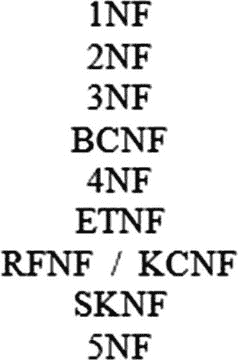

图 13-1

范式层次结构（II）

本章剩余部分将相当深入地描述这些新范式——即 `ETNF`、`RFNF`（或 `KCNF`）和 `SKNF`——以及各种相关事项。但请注意，本章既旨在作为教程，也至少同样旨在作为参考；其中的细节微妙且相当令人困惑，并且可能难以记住，我当然不期望你仅通过一两次阅读就全部吸收它们。我认为在大多数情况下你也不需要做到这一点。不过，至少让我给你一些关于即将展开的讨论结构的概览，这样在我们开始深入细节之前，你能对整体论证过程有所了解。

本章包含四个主要小节。第一节，“`5NF` 过于严格”，提供了一些动机性材料，接下来的三节则分别讨论 `ETNF`、`RFNF` 和 `SKNF`。具体而言：

*   关于 `ETNF` 的小节——顺便说一句，这显然最长——提供了 (a) 一个符合 `ETNF` 但不符合 `5NF` 的关系变量，以及 (b) 一个符合 `4NF` 但不符合 `ETNF` 的关系变量的示例。
*   关于 `RFNF` 的小节提供了 (a) 一个符合 `RFNF` 但不符合 `5NF` 的关系变量，以及 (b) 一个符合 `ETNF` 但不符合 `RFNF` 的关系变量的示例。
*   关于 `SKNF` 的小节提供了 (a) 一个符合 `SKNF` 但不符合 `5NF` 的关系变量，以及 (b) 一个符合 `RFNF` 但不符合 `SKNF` 的关系变量的示例。

因此，综合来看，这些示例除其他外，阐明了那个主张——或者更确切地说是定理——`5NF` ⇒ `SKNF` ⇒ `RFNF` ⇒ `ETNF` ⇒ `4NF`，而反向的蕴涵关系均不成立。

### 5NF 过于严格

本节提供两个例子。第一个例子提醒我们 `5NF` 旨在解决的冗余问题；第二个例子表明，也许 `5NF` 并不是该问题的最佳解决方案。

#### 第一个例子：5NF 的作用

第一个例子只是第 9 章和第 10 章中 `SPJ` 例子的重复。我相信你会记得，关系变量 `SPJ` 是全键的（因此肯定符合 `BCNF`）——它的属性是 `SNO`、`PNO` 和 `JNO`，其谓词是*供应商 `SNO` 向项目 `JNO` 供应零件 `PNO`*。此外，以下业务规则（`BRX`）生效：

*   如果供应商 *s* 供应零件 *p*，且零件 *p* 被供应给项目 *j*，且项目 *j* 由供应商 *s* 供应，那么供应商 *s* 向项目 *j* 供应零件 *p*。

以下连接依赖（`JD`）捕捉了业务规则 `BRX` 的本质，因此在关系变量 `SPJ` 中成立：

```
{ { SNO , PNO } , { PNO , JNO } , { JNO , SNO } }
```

如果你需要回忆连接依赖的相关内容，这个 `JD` 表示在任何给定时间，`SPJ` 的当前值等于其在 `{SNO,PNO}`、`{PNO,JNO}` 和 `{JNO,SNO}` 上的投影的连接。但请注意，这个 `JD` 并不是由关系变量 `SPJ` 的唯一键所蕴涵的——如果你需要回忆 `JD` 如何被键蕴涵的含义，请参阅第 10 章——因此该关系变量不符合 `5NF`。而且，它确实存在冗余。具体来说，假设它包含以下三个元组：

```
t1  :  s1  p1  j2
t2  :  s1  p2  j1
t3  :  s2  p1  j1
```

（这里 *s1* 和 *s2* 表示供应商编号；*p1* 和 *p2* 表示零件编号；*j1* 和 *j2* 表示项目编号；*t1*、*t2* 和 *t3* 只是这三个元组的标签，为方便起见在接下来的内容中使用。此外，我假设在另行通知前，*s1* ≠ *s2*，*p1* ≠ *p2*，且 *j1* ≠ *j2*。）由于 `JD` 的存在，以下元组也必须出现在关系变量 `SPJ` 中：

```
t4  :  s1  p1  j1
```

因此，我们可以说，元组 *t1-t3* 的出现强制要求元组 *t4* 也必须出现（因此该 `JD` 具体是一个元组强制 `JD`）。换句话说，该关系变量确实如所声称的那样存在冗余，因为命题“*s1* 向 *j1* 供应 *p1*”既被显式表示（通过元组 *t4*），也被隐式表示（作为 `JD` 与元组 *t1-t3* 所表示的命题共同推出的逻辑结论）。因此，规范化原则建议我们将其分解为在 `{SNO, PNO}` 上的投影 `SP`、在 `{PNO,JNO}` 上的投影 `PJ` 以及在 `{JNO,SNO}` 上的投影 `JS`。该分解是无损的（`SPJ` 等于 `SP`、`PJ` 和 `JS` 的连接）；`SP`、`PJ` 和 `JS` 都符合 `5NF`；并且冗余消失了。

顺便说一下，关系变量 `SPJ` 所展示的冗余有一些有趣的含义（这些观察应该对后面有帮助）。让元组 *t1-t4* 如前所述，并再次假设 *s1* ≠ *s2*，*p1* ≠ *p2*，且 *j1* ≠ *j2*。那么：

*   如果关系变量包含所有四个元组 *t1-t4*，那么试图仅删除元组 *t4* 显然必须失败，因为 `JD` 的存在。换句话说，如第 10 章所解释的，关系变量 `SPJ` 对该 `JD` 存在删除异常。
*   或者，如果关系变量只包含元组 *t1* 和 *t2*，那么试图仅插入元组 *t3* 也必须失败，同样因为 `JD` 的存在。同样如第 10 章所解释的，我们可以说关系变量 `SPJ` 对该 `JD` 存在插入异常。

将 `SPJ` 分解为其投影 `SP`、`PJ` 和 `JS` 就消除了这些异常。


#### 第二个例子：为什么 5NF 做得太多了

现在来看承诺的第二个例子。假设我们有另一个关系变量 `SPJ′`，它与 `SPJ` 相同，但额外受制于以下业务规则（BRY）：

*   对于给定的供应商 `s` 和给定的零件 `p`，其供应的项目 `j` 至多只有一个。

以下函数依赖（FD）抓住了规则 BRY 的本质，因此在关系变量 `SPJ′` 中成立：

```
{ SNO , PNO } → { JNO }
```

换言之，`{SNO,PNO}` 是 `SPJ′` 的一个键。更重要的是，可以证明，除了刚才展示的 FD（以及平凡的 FD）外，`SPJ′` 中没有其他 FD 成立，因此 `SPJ′` 和 `SPJ` 一样，处于 `BCNF`。然而，它不处于 `5NF`，因为之前展示的连接依赖（JD）在 `SPJ′` 中同样成立，也并非由键所蕴含。

这个例子因此戳穿了两个流行的误解——第一，一个不处于 `5NF` 的 `BCNF` 关系变量必须是全键的（参见练习 1.8）；第二，一个只有一个键和一个非键属性的关系变量必须处于 `5NF`（参见练习 1.9）。

现在，假设和 `SPJ` 一样，关系变量 `SPJ′` 包含以下三个元组：

```
t1  :  s1  p1  j2
t2  :  s1  p2  j1
t3  :  s2  p1  j1
```

那么，由于 JD 的存在，以下元组也必须出现：

```
t4  :  s1  p1  j1
```

但是 `{SNO,PNO}` 是一个键；由此可知，由于元组 `t1` 和 `t4` 在该键上的值相同，它们实际上是同一个元组（因此 `j1` = `j2`，所以我们现在必须至少部分放弃最初的假设，即 `s1` ≠ `s2`，`p1` ≠ `p2`，且 `j1` ≠ `j2`）。因此，我们在 `SPJ` 中观察到的那种冗余在 `SPJ′` 中不会发生。（具体来说，这种情况下元组 `t4` 并不是一个“额外”的元组，因为它已经存在了。）换言之，`SPJ′` 尽管不处于 `5NF`，却不会 `事实上也不可能` 遭受 `5NF` 旨在解决的那种冗余。因此，看起来 `5NF` 在某种意义上，对于这个目的来说可能太强了。

### 基本元组范式

基本元组范式（`ETNF`）最早由 Ron Fagin、Hugh Darwen 和我在 2012 年的一篇论文中描述——下文简称“`ETNF` 论文”。我将首先对该论文的主要结果做一个简要且有些非正式的总结（但请注意，以下总结并非独立成文——纯粹是作为一个方便的概述提供）：

*   宽泛地说，说一个关系变量 `R` 没有冗余，是指当前出现在 `R` 中的任何元组 `t` 都不代表可以从当前也出现在 `R` 中、但区别于 `t` 的其他元组推导出的信息。
*   当且仅当关系变量 `R` 在上述意义上没有冗余时，它才处于基本元组范式（`ETNF`）。
*   当且仅当关系变量 `R` 处于 `BCNF`，并且对于 `R` 中成立的每个连接依赖（`JD`） `J`，`J` 的至少一个分量是 `R` 的超键时，`R` 才处于 `ETNF`。
*   `5NF` ⇒ `ETNF` ⇒ `4NF`，而反向蕴含不成立（换句话说，`ETNF` 严格地位于 `4NF` 和 `5NF` 之间）。

如果关系变量 `R` 处于 `BCNF` 并且有一个非复合键，那么它就处于 `ETNF`。

#### 定义与定理

现在我将呈现一系列定义和定理（附带讨论），它们共同构成了 `ETNF` 论文的主要成果。首先，让我给出——你可能觉得早就该给了——元组强制连接依赖这个概念的精确定义：

*   **定义（元组强制 `JD`）：** 设 `J` 是一个关于头 `H` 的 `JD`，且 `J` 在关系变量 `R` 中成立。那么 `J` 可能会导致，也可能不会导致：如果某些元组 `t1`, ..., `tn` 出现在 `R` 中，则某个额外的元组 `t` 被强制也出现在 `R` 中（这里术语 `额外的` 意味着 `t` 区别于 `t1`, ..., `tn` 中的每一个）。当且仅当它确实有这个后果时，`J` 相对于 `R` 是元组强制的。

给定这个定义，很容易看出，如果 `J` 确实相对于 `R` 是元组强制的，那么它必须是（a）非平凡的，（b）不是由 `R` 的键所蕴含的，并且（c）不是由 `R` 的任何 `FD` 所蕴含的。（由于这里的（a）和（b），还可以推出 `R` 不可能处于 `5NF`。）

接下来，引入 `FD` 冗余和 `JD` 冗余这两个术语是很方便的：

*   **定义（`FD` 冗余）：** 当且仅当关系变量 `R` 不处于 `BCNF` 时，它是 `FD` 冗余的。
*   **定义（`JD` 冗余）：** 当且仅当某个元组强制 `JD` 在 `R` 中成立时，关系变量 `R` 是 `JD` 冗余的。

注意，这两种冗余互不蕴含；也就是说，一个关系变量可以是 `FD` 冗余的而不是 `JD` 冗余的，也可以是 `JD` 冗余的而不是 `FD` 冗余的。例如：

*   来自“`5NF` 太强了”一节的关系变量 `SPJ`——具有属性 `SNO`、`PNO` 和 `JNO`；键 `{SNO,PNO,JNO}`；以及 JD ☼{{SNO,PNO},{PNO,JNO},{JNO,SNO}}——处于 `BCNF`，因此不是 `FD` 冗余的，但它显然是 `JD` 冗余的，因为那个 JD 是元组强制的。
*   来自第 1 章的关系变量 `S`——具有属性 `SNO`、`SNAME`、`STATUS` 和 `CITY`；键 `{SNO}`；以及 FD `{CITY}` → `{STATUS}`——不处于 `BCNF`，因此是 `FD` 冗余的。但是该关系变量中没有任何元组强制 `JD` 成立，因此它不是 `JD` 冗余的。

继续定义：

*   **定义（无冗余）：** 当且仅当关系变量 `R` 既不是 `FD` 冗余的也不是 `JD` 冗余的时，它是无冗余的。

注意，根据这个定义，一个 `5NF` 关系变量肯定是无冗余的。然而，正如我将要展示的，一个关系变量并不需要处于 `5NF` 才能是无冗余的；相反，只需它处于 `ETNF` 就足够了。事实上，这就是 `ETNF` 的定义：

*   **定义（基本元组范式）：** 当且仅当关系变量 `R` 是无冗余的时，它才处于基本元组范式（`ETNF`）。

换句话说，当且仅当关系变量 `R` 既不是 `FD` 冗余的也不是 `JD` 冗余的——等价地说，当且仅当它处于 `BCNF` 并且没有任何元组强制 `JD` 成立时，它才处于 `ETNF`。

当然，虽然上述定义既精确又准确，但它几乎没有实际用处，因为它对于确定一个给定的关系变量是否确实处于 `ETNF` 帮助不大。但以下定理在这方面确实有帮助：

*   **定理：** 当且仅当关系变量 `R` 处于 `BCNF`，并且对于 `R` 中成立的每个显式 `JD` `J`，`J` 的某个分量是 `R` 的超键时，`R` 才处于 `ETNF`。

这个定理为关系变量处于 `ETNF` 提供了必要且充分的条件。因此，我们可以将其视为一个有用、可用的测试——实际上，视为 `ETNF` 的一个有效 `定义`。（换句话说，原始定义是一个语义定义，而该定理提供了一个操作性的或句法的定义。关于此类问题的解释性说明请参见第 5 章。）


顺便提一下，该定理涉及的是关系变量*R*的*显式*JD，但实际上我们可以去掉“显式”这个限定词，结论依然成立（即，*R*处于 ETNF 中，当且仅当在*R*中成立的*每一个*JD 都有一个超键分量）。^(¹⁶⁸) 不过，在某种意义上，包含这个限定词使定理更“精确”。特别是，这意味着为了测试所讨论的关系变量是否处于 ETNF，无需检查其隐式 JD。

下一个定理提供了另一个简单而有用的测试：

*   **定理：** 如果关系变量*R*处于 BCNF 且至少有一个非复合键（其中，非复合键指非复合的键，而复合键指由两个或多个属性组成的键），则该关系变量处于 ETNF。

该定理为关系变量处于 ETNF 提供了一个充分条件（尽管不是必要条件）。顺便提一下，值得注意的是，该条件具有一个吸引人的特性，即它只涉及键，不涉及 JD 和 FD（至少不是显式地涉及）。

下一个定理表明，ETNF 确实严格介于 4NF 和 5NF 之间：

*   **定理：** 5NF ⇒ ETNF ⇒ 4NF，而反向蕴含均不成立。

最后，这里还有另一个定理，给出了关系变量处于 ETNF 的一个充分条件（尽管不是必要条件）：

*   **定理：** 如果关系变量*R*处于 3NF 且没有复合键，则该关系变量处于 ETNF。

这个结果是直接的，因为所述条件实际上意味着关系变量*R*处于 5NF。^(¹⁶⁹) 因此，它理所当然地处于 ETNF。

#### 一个处于 ETNF 但不处于 5NF 的关系变量

关系变量`SPJ′`，即上一节（“5NF 太强了”）中的第二个例子，提供了一个处于 ETNF 但不处于 5NF 的具体实例。提醒一下，该关系变量具有属性`SNO`、`PNO`和`JNO`；它只有一个键，即`{SNO,PNO}`；它处于 BCNF；其谓词是*供应商`SNO`向项目`JNO`供应零件`PNO`*；并且以下 JD 成立（但没有其他 JD 成立，除了从此 JD 和/或唯一键逻辑推导出来的 JD）：

```
☼ { { SNO , PNO } , { PNO , JNO } , { JNO , SNO } }
```

如前所述，该关系变量不处于 5NF，正是因为上述 JD 并非由唯一键所蕴含。然而，它*确实*处于 ETNF，因为在此关系变量中成立的唯一显式 JD——即刚才显示的那个——有一个分量是超键（即分量`{SNO,PNO}`）。换句话说，该关系变量即使不处于 5NF，也既没有 FD 冗余也没有 JD 冗余，因此是无冗余的，从而处于 ETNF。

现在假设该关系变量仅包含以下两个元组：

```
t1  :  s1  p1  j2
t2  :  s1  p2  j1
```

（这里假设*p1* ≠ *p2* 且 *j1* ≠ *j2*）。假设我们现在插入以下元组：

```
t3  :  s2  p1  j1
```

（其中*s2* ≠ *s1*）。那么，该 JD 意味着以下元组也必须出现：

```
t4  :  s1  p1  j1
```

然而，正如我们之前所见，这里的元组*t1*和*t4*实际上必须是同一个元组，因为它们具有相同的键值。由此可得*j1* = *j2*，这与最初的一个假设相矛盾。因此，如果元组*t1*和*t2*存在，那么尝试插入元组*t3*必定失败，正是因为它导致了那个矛盾。此外，由于直接尝试插入元组*t4*也必定失败（无论是由于键唯一性违规，还是因为它蕴含了*j1* = *j2*，任你选择），因此以下有点离奇的业务规则也必须生效：

*   如果(a) 供应商*s1*向项目*j2*供应零件*p1*，且(b) 供应商*s1*向项目*j1*供应零件*p2*（*p1* ≠ *p2*，*j1* ≠ *j2*），那么(c) 没有任何供应商（即使是*s1*）能向项目*j1*供应零件*p1*。

事实上，同样离奇的规则也必须生效（注意其对称性）：^(¹⁷⁰)

*   如果(a) 供应商*s1*向项目*j2*供应零件*p1*，且(b) 供应商*s2*向项目*j1*供应零件*p1*（*s1* ≠ *s2*，*j1* ≠ *j2*），那么(c) 没有任何零件（即使是*p1*）能被供应商*s1*供应给项目*j1*。

*   如果(a) 供应商*s1*向项目*j1*供应零件*p2*，且(b) 供应商*s2*向项目*j1*供应零件*p1*（*s1* ≠ *s2*，*p1* ≠ *p2*），那么(c) 没有任何项目（即使是*j1*）能被供应商*s1*供应零件*p1*。

实际上，这三个规则可以合并为一个，如下。我们同意，关系变量`SPJ′`的每个元组代表一次发货（由某个供应商向某个项目发送某个零件）。那么就不可能存在三个不同的发货*x*、*y*和*z*，使得*x*和*y*涉及同一供应商，*y*和*z*涉及同一零件，*z*和*x*涉及同一项目。

关于`SPJ′`的例子，还有另一点要说明（很重要）。请再回顾一下导致上述三个“离奇”业务规则（尤其是第一个规则）的分析。该分析表明，元组*t3*不能与元组*t1*和*t2*同时出现在关系变量中。因此，`SPJ′`尽管处于 ETNF，却仍然遭受插入异常。（相比之下，它不会遭受删除异常——假设成立的唯一约束是所述的 JD 和所述的键约束及其逻辑推论。）所以，5NF 和 ETNF 之间的一个区别如下：

*   尽管两者都是无冗余的，但 5NF 保证“没有插入异常”，而 ETNF 不保证——再次假设 FD 和 JD 是唯一考虑的约束类型。^(¹⁷¹)

当然，从`SPJ′`这个例子很容易得出结论：处于 ETNF 但不处于 5NF 的关系变量在实践中可能很少见。然而，两者之间存在明显的逻辑差异，因此——至少从减少冗余的角度来看——应该瞄准的目标是 ETNF，而不是 5NF。

事实上，`SPJ′`这个例子也从另一个角度强化了后一种主张。由于该关系变量满足三元 JD`☼{{SNO,PNO},{PNO,JNO},{JNO,SNO}}`，它可以被无损分解为它在`{SNO,PNO}`、`{PNO,JNO}`和`{JNO,SNO}`上的投影。这些投影都是全键的，并且实际上每个都处于 5NF。然而，这种分解“丢失了”FD`{SNO,PNO} → {JNO}`！正如我们在本书第二部分所看到的，以这种方式丢失依赖关系通常是不可取的；因此，关系变量`SPJ′`说明了一点：不仅 5NF 有时太强，而且它有时可能绝对是禁忌。

#### 一个处于 4NF 但不处于 ETNF 的关系变量

如我们所见，关系变量`SPJ′`处于 ETNF 但不处于 5NF。然而，它处于 4NF（尽管不处于 BCNF），因为该关系变量中根本不成立任何非平凡的 MVD。那么，一个处于 4NF 但不处于 ETNF 的关系变量是怎样的呢？事实上，关系变量`SPJ`（不是`SPJ′`）提供了一个例子。回顾一下，该关系变量具有属性`SNO`、`PNO`和`JNO`；是全键的；并且受某个三元 JD 约束。然而，该关系变量中根本不成立任何非平凡的 MVD——等价地，没有非平凡的二元 JD——因此它肯定处于 4NF。但它不处于 ETNF（我们知道这一点），因为该三元 JD 的任何分量都不是超键。它当然也不处于 5NF，这是理所当然的。


#### 我们的选择

在 Fagin、Darwen 和我完成了我们关于 `ETNF` 的主体工作之后，我们的注意力被引向 Millist Vincent 的一篇论文，^(¹⁷²) 特别是注意到我们最初的名字“无冗余范式”（`RFNF`）已经被 Vincent 用来指代别的东西。既然这个名字已被占用，我们当然必须另选一个，最终我们选择了“基本元组范式”（`ETNF`）。以下是我们做出此选择的理由。令 `R` 为一个关系变量（relvar），`r` 为 `R` 的一个值，`t` 为 `r` 中的一个元组。那么我们定义 `t` 在 `r` 中是*部分*还是*完全*冗余的，如下所示：

*   **定义（部分冗余元组）：** 当且仅当存在一个 `FD` `X → Y` 在 `R` 中成立，并且存在一个 `r` 中的元组 `t′`（`t ≠ t′`）使得 `t{X} = t′{X}` 时，元组 `t` 在 `r` 中是部分冗余的。
*   **定义（完全冗余元组）：** 当且仅当存在一个 `r` 中的元组集合 `s`（`t ∉ s`），使得根据 `R` 的某个 `JD`，`s` 中的元组迫使 `t` 出现在 `r` 中时，元组 `t` 在 `r` 中是完全冗余的。

然后我们继续定义，当且仅当 `t` 在 `r` 中是部分冗余或完全冗余时，`t` 在 `r` 中是冗余的。现在，这一点应该立即显而易见：
1.  存在这样的 `r` 和 `t`，且 `t` 在 `r` 中是部分冗余的，当且仅当 `R` 是 `FD` 冗余的。
2.  存在这样的 `r` 和 `t`，且 `t` 在 `r` 中是完全冗余的，当且仅当 `R` 是 `JD` 冗余的。^(¹⁷³)

因此，将*基本*视为*冗余*的反义词，我们定义 (a) 当且仅当 `t` 在 `r` 中不是冗余的时，`t` 在 `r` 中是基本的；以及 (b) 当且仅当 `R` 的每一个合法值关系 `r` 中的每一个元组在上述意义上都是基本的时，`R` 处于 `ETNF` 范式中。^(¹⁷⁴)

### 无冗余范式

现在我来谈谈 Vincent 的 `RFNF`。考虑我们常用的供应商关系变量 `S`，其属性为 `SNO`、`SNAME`、`STATUS` 和 `CITY`；唯一键是 `{SNO}`；显式的 `FD {CITY} → {STATUS}`。一个示例值如图 13-2 所示（基本上只是第 3 章图 3-1 的重复）：

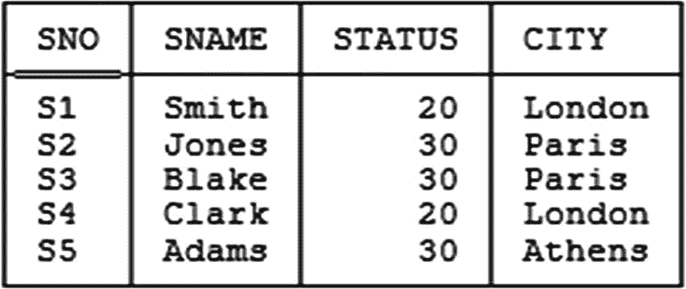

图 13-2 供应商关系变量 — 示例值

现在，图中供应商 `S1` 的元组所在城市为 `London`，状态为 `20`。因此，同样城市为 `London` 的供应商 `S4` 的元组的状态*必须*是 `20`，否则将违反 `FD {CITY} → {STATUS}`。因此，在某种意义上，状态值 `20` 在供应商 `S4` 的元组中的出现是冗余的，因为它不可能是其他任何值——它是整个关系中其他地方出现的值的逻辑结果，并由这些值完全确定。

上述例子为以下直观上颇具吸引力的定义（归功于 Vincent，但此处已做大量转述）提供了动机：

*   **定义（根据 Vincent 的冗余）：** 令关系 `r` 是关系变量 `R` 的一个值，`t` 是 `r` 中的一个元组，`v` 是 `t` 中的一个属性值。那么，`v` 在 `t` 中的此次出现在 `r` 中是冗余的，并且 `R` 受制于冗余，当且仅当将 `v` 的这次出现替换为 `v′`（`v′ ≠ v`）的一次出现，同时保持其他一切不变，会导致 `R` 的某个依赖^(¹⁷⁵) 被违反。

换句话说，如果所讨论的属性值出现*必须*是 `v` 而不能是其他任何值，那么 Vincent 的这种冗余就存在。顺便注意，一个包含部分冗余元组（根据我们的定义）的关系，无疑会表现出 Vincent 的这种冗余。

尽管我说过上述定义在直观上很有吸引力（我也确实这么认为），但我应该指出，至少在一个方面它也有点奇怪。再次考虑图 13-2 的例子，其中供应商 `S4` 的元组必须具有状态值 `20`，因为供应商 `S1` 的元组状态值是 `20`。现在请注意，反向论证同样成立：供应商 `S1` 的元组必须具有状态值 `20`，因为供应商 `S4` 的元组状态值是 `20`！现在，说这两个 `20` *都*是冗余的（是吗？）肯定没有意义——但如果我们按字面意思理解定义，它就是这么说的。因此，在我看来，这个定义稍显薄弱，可以稍加收紧。如果你有兴趣，我将此留作练习，由你来提出这样一个更精确的定义。

无论如何，让我们约定将这样定义的冗余称为“按 Vincent 定义的冗余”。然后我们可以定义一个新的范式，如下所示：

*   **定义（无冗余范式）：** 当且仅当关系变量 `R` 不受制于按 Vincent 定义的冗余时，它处于无冗余范式（`RFNF`）。^(¹⁷⁶)

现在，我希望显而易见的是，一个不处于 `4NF` 的关系变量，按照上述定义，也不处于 `RFNF`。^(¹⁷⁷) 但是，一个处于 `ETNF` 的关系变量呢？那么，请再次考虑前一节（关于 `ETNF`）中的关系变量 `SPJ′` 的例子。如你所忆，该关系变量既不受 `FD` 冗余之苦，也不受 `JD` 冗余之苦，因此处于 `ETNF`（尽管不在 `5NF` 中）。现在，我们在前面那一节中看到，如果该关系变量包含以下三个元组：

```
t1  :  s1  p1  j2
t2  :  s1  p2  j1
t3  :  s2  p1  j1
```

——那么以下元组也必须出现：

```
t4  :  s1  p1  j1
```

但是 `{SNO,PNO}` 是一个键；因此可以推出 (a) 元组 `t1` 和 `t4`，由于它们具有相同的键值，实际上是同一个元组，因此 (b) `j1 = j2`。然而，现在请注意，`t1` 中的 `j2` 必须等于 `j1` 这一事实本身就意味着该关系变量受制于按 Vincent 定义的冗余！^(¹⁷⁸) 由此可见，`RFNF` 和 `ETNF` 在逻辑上是不同的；事实上，`RFNF` 比 `ETNF` 更强，其含义是，一个关系变量可以处于 `ETNF`——因此按我们的定义是无冗余的——而不处于 `RFNF`，但反之则不然。事实上，`ETNF` 论文证明了以下更强的结果：

*   **定理：** `5NF ⇒ RFNF ⇒ ETNF ⇒ 4NF`，而所有反向蕴涵均不成立。

因此，请注意，`ETNF` 严格介于 `4NF` 和 `RFNF` 之间。Vincent 还证明了以下有用的结果：

*   **定理：** 当且仅当关系变量 `R` 处于 `BCNF`，并且对于在 `R` 中成立的每一个 `JD` `J`，其超键于 `R` 的那些分量的并集等于 `R` 的标题时，`R` 处于 `RFNF`。

Vincent 在这里实际做的是：他定义关系变量 `R` 处于另一种他称之为键完备范式（`KCNF`）的范式中，当且仅当它满足所述条件（即，当且仅当 `R` 处于 `BCNF`，并且对于在 `R` 中成立的每一个 `JD` `J`，其超键于 `R` 的那些分量的并集等于 `R` 的标题）。然后他继续证明 `KCNF` 和 `RFNF` 实际上是一回事。换句话说，他最初的 `RFNF` 定义是一个语义定义，而他的 `KCNF` 定义——实际上就是上述定理——是一个操作性或语法的定义。


#### 一个属于 RFNF 但不属于 5NF 的关系变量

我们可以构造一个属于 RFNF 但不属于 5NF 的关系变量示例，方法是采用本章前面讨论的具有两个依赖的关系变量`SPJ′`——

```
{ SNO , PNO } → { JNO }
☼ { { SNO , PNO } , { PNO , JNO } , { JNO , SNO } }
```

——并添加另一个依赖：

```
{ PNO , JNO } → { SNO }
```

这个额外的依赖（当然也意味着`{PNO,JNO}`是该关系变量的另一个键）对应于一条额外的业务规则（`BRZ`）：

*   对于给定的零件`p`和给定的项目`j`，最多只有一个供应商`s`供应。

让我将`SPJ′`的这个修订版本称为`SPJ′′`，并将给定的三元 JD 称为`J`。那么，`J`的`{SNO,PNO}`和`{PNO,JNO}`分量都是`SPJ′′`的超键；它们的并集等于`SPJ′′`的标题；因此——由于可以证明没有其他不可约的 JD 成立——可以得出结论`SPJ′′`属于 RFNF。然而，它不属于 5NF，因为成员资格算法在该三元 JD `J`上失败了。

#### 一个属于 ETNF 但不属于 RFNF 的关系变量

正如已经指出的，关系变量`SPJ′`——不是`SPJ′′`！——是一个属于 ETNF 但不属于 RFNF 的关系变量示例。为了明确这一点：那个三元 JD 再次成立。但由于该 JD 中唯一是超键的分量是`{SNO,PNO}`，所有超键分量的并集肯定不等于标题，因此该关系变量不属于 RFNF。

### 超键范式

当 Fagin、Darwen 和我正在研究后来成为 ETNF 的成果时，我们的注意力被 Ragnar Normann 的另一篇论文^(¹⁷⁹)所吸引，该论文讨论了与我们工作相关的问题。然而，那篇论文并没有描述任何等同于我们的 ETNF 或 Vincent 的 RFNF 的东西；相反，它的重点是表明某些教科书上对 5NF 的定义是不正确的^(¹⁸⁰)。它通过定义所谓的`最小无损分解`（基本上对应于本书中定义的不可约 JD），然后以这个概念为基础定义一个新的范式：^(¹⁸¹)

*   **定义（超键范式）：** 当且仅当对于关系变量`R`中成立的每一个不可约 JD `☼{X1,...,Xn}`，`X1`, ..., `Xn`中的每一个都是`R`的超键时，关系变量`R`才属于超键范式（`SKNF`）。

该论文还证明了`5NF ⇒ SKNF ⇒ 4NF`，并且反向蕴含不成立。它没有证明`SKNF`是无冗余的（既不是我定义的术语，也不是 Vincent 意义上的），尽管事实上它是。^(¹⁸²)

重复一下，Normann 的论文证明了`5NF ⇒ SKNF ⇒ 4NF`。然而，ETNF 论文实际上证明了以下更强的结果：

*   **定理：** `5NF ⇒ SKNF ⇒ RFNF ⇒ ETNF ⇒ 4NF`，并且所有反向蕴含均不成立。

因此请注意，`SKNF`严格地位于`RFNF`和`5NF`之间。

#### 一个属于 SKNF 但不属于 5NF 的关系变量

这里是一个属于`SKNF`但不属于`5NF`的关系变量示例。设关系变量`R`具有属性`A`、`B`和`C`；使用 Heath 表示法，设`AB`、`BC`和`CA`分别是`R`的键；并设 JD `☼{AB,BC,CA}`——称之为`J`——在`R`中成立。那么可以证明这个关系变量属于`SKNF`^(¹⁸³)；然而它不属于`5NF`，因为成员资格算法在`J`上失败了。*注意：* 为了使示例更具体一些，设谓词为*存在一个人，其最喜欢的颜色是 A，最喜欢的餐馆是 B，最喜欢的作曲家是 C*，并且设有一些业务规则，大意是(a)两个不同的人不能共享超过一个共同的喜好，以及(b)不存在三个不同的人，使得对于每一个喜好，这三人中都有两人共享它。

#### 一个属于 RFNF 但不属于 SKNF 的关系变量

前一节标题“A Relvar in RFNF and not 5NF”下给出的示例在这里也适用，因为所讨论的关系变量确实不属于`SKNF`，尽管它属于`RFNF`。

### 结束语

重复一下我在引言中警告过你的事情，本章我们涵盖的所有内容的细节都是微妙且令人困惑的，并且可能难以记住——事实上，如果你到现在还没有同意这些看法，我会非常惊讶！——我不指望你仅仅通过一两次阅读就能吸收所有这些细节。然而，以下简要总结，重点列出了各种新范式之间最重要的逻辑差异，可能会有所帮助：

*   当且仅当关系变量`R`属于`BCNF`，并且对于`R`中成立的每一个 JD `J`，`J`的某个分量是`R`的超键时，`R`才属于`ETNF`。
*   当且仅当关系变量`R`属于`BCNF`，并且对于`R`中成立的每一个 JD `J`，`J`中那些是`R`超键的分量的并集等于`R`的标题时，`R`才属于`RFNF`。
*   当且仅当关系变量`R`属于`BCNF`，并且对于`R`中成立的每一个 JD `J`，`J`的每一个分量都是`R`的超键时，`R`才属于`SKNF`。

让我通过指出一点来结束本章：一个关系变量可以属于`5NF`——因此也属于本章讨论的任何或所有新范式——但仍然可能受到某种冗余的影响，这种冗余虽然与本章中我使用的各种冗余定义不完全相同，但非常接近。^(¹⁸⁴) 考虑关系变量`SPJQ`，其属性为`SNO`、`PNO`、`JNO`和`QTY`（仅此而已），谓词为*供应商`SNO`以数量`QTY`供应零件`PNO`给项目`JNO`*。唯一的键是`{SNO,PNO,JNO}`，该关系变量属于`BCNF`。请注意，JD `☼{{SNO,PNO},{PNO,JNO},{JNO,SNO}}`在该关系变量中*不*成立。然而，它在该关系变量在`{SNO,PNO,JNO}`上的投影中确实成立（实际上它是一个嵌入式依赖的例子——见第 12 章）。现在假设该关系变量包含以下元组（仅此而已）：

```
s1  p1  j2  100
s1  p2  j1  200
s2  p1  j1  300
s1  p1  j3  400
```

多亏了嵌入式依赖，我们必须有`j3 = j1`。因此，关系变量`SPJQ`确实以某种形式受到冗余的影响。尽管如此，该关系变量属于`ETNF`、`RFNF`、`SKNF`，实际上也属于`5NF`。关键在于，本章讨论的冗余与在所讨论的关系变量中成立的*函数依赖和连接依赖*（仅此而已）有关。遗憾的是，这个定义对于其他可能也恰好成立的约束——嵌入式依赖或任何其他类型的约束——完全无能为力。


### 练习题

1.  凭记忆绘制标准形式层级（“版本 II”）。你的绘图应至少包含九种标准形式。

2.  定义 (a) `FD` 冗余（函数依赖冗余）；(b) `JD` 冗余（连接依赖冗余）；(c) `ETNF`（初等元组范式）。

3.  在本章正文中，我提到关系变量可以处于 `SKNF`（对称键范式）而不在 `5NF`（第五范式）中，并提出了以下关系变量作为例子：
    令关系变量 `R` 具有属性 `A`、`B` 和 `C`；使用 `Heath` 表示法，令 `AB`、`BC` 和 `CA` 都是 `R` 的键；并令连接依赖 `☼{AB,BC,CA}`——称之为 `J`——在 `R` 中成立。
    但你可能不无理由地对这个例子感到些许怀疑。具体来说，你可能想知道，一个关系变量是否真的能存在，且恰好受制于指定的键约束和指定的 `JD`（尽管我确实接着给出了这个例子的一个稍微具体一些的版本）。通过证明事实上所有可能的依赖集（`FDs` 和 `JDs`）都是一致的——即总能找到至少一个满足该集合中所有依赖的关系——来表明这个例子毕竟是合理的。

4.  从“`5NF` 过强”一节中的关系变量 `SPJ′` 受制于可能被称为“对称”的 `JD`——即 `JD ☼{{SNO,PNO},{PNO,JNO},{JNO,SNO}}`——但它也表现出一些不对称性，因为该 `JD` 的三个分量中只有一个对应于一个键。直观上，你可能期望另外两个分量也对应于键。证明情况并非必然如此。

5.  关于本章正文中的关系变量 `SPJ′`，证明以下业务规则必须如所述生效：
    *   如果供应商 `s1` 向项目 `j2` 提供零件 `p1`，且供应商 `s2` 向项目 `j1` 提供零件 `p1`（`s1` ≠ `s2`，`j1` ≠ `j2`），那么任何零件，甚至 `p1`，都不能由供应商 `s1` 提供给项目 `j1`。
    *   如果供应商 `s1` 向项目 `j1` 提供零件 `p2`，且供应商 `s2` 向项目 `j1` 提供零件 `p1`（`s1` ≠ `s2`，`p1` ≠ `p2`），那么任何项目，甚至 `j1`，都不能由供应商 `s1` 提供零件 `p1`。

6.  再次关于本章正文中的关系变量 `SPJ′`，给出一个 **Tutorial D** `CONSTRAINT` 语句，对应于以下业务规则：
    *   如果 (a) 供应商 `s1` 向项目 `j2` 提供零件 `p1` 且 (b) 供应商 `s1` 向项目 `j1` 提供零件 `p2`（`p1` ≠ `p2`，`j1` ≠ `j2`），那么 (c) 任何供应商，甚至 `s1`，都不能向项目 `j1` 提供零件 `p1`。

### 答案

1.  参见图 13-1。

2.  参见本章正文。

3.  令关系 `r` 的标题为 `H`。那么如果 `r` 的基数（cardinality）为 `1` 或 `0`，它肯定将满足所有可以针对 `H` 定义的可能的 `FDs` 和 `JDs`。由此可知，所有可能的依赖集（`FDs` 和 `JDs`）都是一致的，尽管其中一些依赖集可能蕴含满足它们的关系其基数至多为一。（请注意，顺便说一句，基数至多为一的关系变量其唯一的键是空集 `{ }`——参见第 4 章练习 4.10 的答案——并且必然处于 `5NF`。）

4.  以下无疑是关系变量 `SPJ′` 的一个合法值—
    ```
    s1  p1  j1
    s2  p1  j1
    ```
    （`s1` ≠ `s2`）—因此 `{PNO,JNO}` 不是一个键。同样，以下也是 `SPJ′` 的一个合法值—
    ```
    s1  p1  j1
    s1  p2  j1
    ```
    （`p1` ≠ `p2`）—因此 `{JNO,SNO}` 也不是一个键。

5.  关于所述的第一条规则，假设关系变量 `SPJ′` 包含以下元组（注意“第三”个元组直接违反了该规则）：
    ```
    s1  p1  j2
    s2  p1  j1
    s1  px  j1
    ```
    （`s1` ≠ `s2`，`j1` ≠ `j2`）。以下是对应的二元投影：
    ```
    s1  p1      p1  j2      j2  s1
    s2  p1      p1  j1      j1  s2
    s1  px      px  j1      j1  s1
    ```
    连接最左边的两个投影得到：
    ```
    s1  p1  j2
    s1  p1  j1
    s2  p1  j2
    s2  p1  j1
    s1  px  j1
    ```
    将此结果与第三个投影连接得到：
    ```
    s1  p1  j2
    s1  p1  j1
    s2  p1  j1
    s1  px  j1
    ```
    但 `{SNO,PNO}` 是一个键，所以从“前两个元组”可以得出 `j1` = `j2`：矛盾。因此第一条规则确实必须生效。
    证明第二条规则也生效遵循相同的一般模式。

6.  `CONSTRAINT ...`
    ```
    WITH ( T1 := SPJ′ RENAME { PNO AS Y1 , JNO AS Z1 } ) ,
          T2 := SPJ′ RENAME { PNO AS Y2 , JNO AS Z2 } ) ,
          T3 := JOIN { T1 , T2 } ,
          T4 := T3 WHERE Y1 ≠ Y2 AND Z1 ≠ Z2 ,
          T5 := T4 { Y1 , Z2 } ,
          T6 := T5 RENAME { Y1 AS PNO , Z2 AS JNO } ,
          T7 := JOIN { SPJ′ , T6 } ) :
          IS_EMPTY ( T7 ) ;
    ```

    以下是一个用关系演算表述的上述约束（**Tutorial D** 当然基于关系代数）。令 `t1`、`t2`、`t3` 为在关系变量 `SPJ′` 上取值的范围变量（range variables）。那么我们有：
    ```
    CONSTRAINT ...
    FORALL t1 FORALL t2 FORALL t3
    ( IF   t1.SNO = t2.SNO AND t1.PNO ≠ t2.PNO AND t1.JNO ≠ t2.JNO
      THEN t3.PNO ≠ t1.PNO OR  t3.JNO ≠ t2.JNO ) ;
    ```

### 脚注

1 2 3 4 5 6 7 8 9 10 11 12 13 14 15 16 17 18 19 20 21


## 14. 6NF

> *为什么，在早餐前，我有时能相信六件不可能的事情。*
>
> ——刘易斯·卡罗尔：《爱丽丝梦游仙境》（1865）

套用我在第 9 章说过的话，到目前为止，在本书中我一直假设，我们唯一关心的范式，是那些涉及以投影作为分解运算符、并以连接作为相应重组运算符的范式。在那一章中我也说过，基于这个假设，5NF 是最终的范式。然而，我在该章的一个脚注中也提到了一种叫做*第六*范式或 6NF 的东西，^(¹⁸⁵) 这正是本章要讨论的内容。

那么，如果我们偏离关于分解和重组运算符的通常假设，会发生什么呢？嗯，在我们合著的《时间与关系理论：关系模型和 SQL 中的时间数据库》（Morgan Kaufmann，2014 年）——下文简称为“时间书”——中，休·达文（Hugh Darwen）、尼科斯·洛伦佐斯（Nikos Lorentzos）和我定义了：

1.  关系运算符的广义版本，特别是广义化的投影和连接，因此
2.  基于这些广义化的投影和连接，定义了一种广义化的连接依赖，进而
3.  定义了一种新的范式（即 6NF）。^(¹⁸⁶)

正如描述这些发展的书名所暗示的，这些发展在时间数据方面尤为重要。然而，6NF 本身可以被定义为 (a) 不依赖于那些广义化的概念，从而 (b) 同样适用于——我敢说，甚至很重要——普通的或“常规的”（即非时间性的）数据。这正是下一节要讨论的内容。

### 常规数据的第六范式

定义如下：

*   `定义（常规数据的第六范式）`：关系变量 `R` 属于第六范式（6NF），当且仅当在 `R` 中成立的唯一连接依赖（JD）是平凡连接依赖；换句话说，在 `R` 中成立的唯一连接依赖是 ☼{ ..., `H`, ... } 这种形式，其中 `H` 是 `R` 的标题。

当然，我们永远无法摆脱平凡依赖；因此，一个 6NF 的关系变量除了通过平凡方式外，根本不能进行无损分解。^(¹⁸⁷) 因此，一个 6NF 的关系变量有时被称为*不可约的*（注意，这是另一种不可约性）。我们常用的供货关系变量 `SP` 属于 6NF，第 9 章中的关系变量 `CTXD` 也属于 6NF；相比之下，我们常用的零件关系变量 `P` 属于 5NF 但不属于 6NF。（当然，我们常用的供应商关系变量 `S` 甚至不属于 3NF。）

现在，根据定义可以直接得出，每个 6NF 的关系变量当然也属于 5NF——也就是说，6NF 蕴含 5NF。此外，6NF 总是可达的。它在直觉上也很有吸引力，原因如下：

*   如果关系变量 `R` 被其 6NF 投影 `R1`, ..., `Rn` 取代，那么 `R1`, ..., `Rn` 的谓词都是简单谓词，而 `R` 整体的谓词是这些简单谓词的合取（即它是一个*合取谓词*）。

让我立即解释一下这些话的含义：

*   `定义（简单谓词与复合谓词）`：一个谓词是简单的，当且仅当它不涉及任何连接词。一个谓词是复合的（或称组合的），当且仅当它不是简单的。
*   `定义（连接词）`：连接词是像 `AND`、`OR` 或 `NOT` 这样的逻辑运算符。
*   `定义（合取谓词）`：一个合取谓词是两个或多个其他谓词的逻辑 `AND`。^(¹⁸⁸)

例如，假设我们将关系变量 `P` 替换为其在属性 `{PNO,PNAME}`、`{PNO,COLOR}`、`{PNO,WEIGHT}` 和 `{PNO,CITY}` 上的投影 `PN`、`PL`、`PW` 和 `PC`。那么这些投影的谓词如下（请注意，这些谓词都是简单谓词）：

*   `PN`：     *零件 `PNO` 的名称是 `PNAME`。*
*   `PL`：     *零件 `PNO` 的颜色是 `COLOR`。*
*   `PW`：     *零件 `PNO` 的重量是 `WEIGHT`。*
*   `PC`：     *零件 `PNO` 存放在城市 `CITY`。*

而 `P` 本身的谓词是这四个谓词的逻辑 `AND`。^(¹⁸⁹) 因此，如例子所示，属于 6NF 的关系变量可以看作是将数据的含义分解成了无法再进一步分解的片段（它们代表了有时被称为“原子事实”，或更可取的说法是“不可约事实”的东西）。粗略地说，我们可能会说，一个 6NF 关系变量的谓词不涉及任何 `AND`。

在这方面，让我简要提醒一下第 12 章和第 9 章中的关系变量 `CTX` 和 `SPJ`。对于 `CTX`，其谓词无疑是合取的——*课程 `CNO` 可由教师 `TNO` 教授* **并且** *课程 `CNO` 使用教材 `XNO`*——将该关系变量分解为其在 `{CNO,TNO}` 和 `{CNO,XNO}` 上的二元（事实上是 6NF）投影，实际上消除了那个 `AND`。至于 `SPJ`，那里的谓词也是合取的，尽管在我陈述的简化形式中可能不明显。这是一个更完整的版本：*供应商 `SNO` 供应零件 `PNO`* **并且** *零件 `PNO` 被供应给项目 `JNO`* **并且** *项目 `JNO` 由供应商 `SNO` 供应* **并且** *供应商 `SNO` 将零件 `PNO` 供应给项目 `JNO`*。同样，将该关系变量分解为其三个二元（事实上是 6NF）投影，实际上消除了这些 `AND`。

*   这里是对 6NF 的一个很好的特征描述（实际上，它是一个定理）：
*   `定理`：关系变量 `R` 属于 6NF，当且仅当 (a) 它属于 5NF，(b) 它的度为 `n`，并且 (c) 它没有度小于 `n` – 1 的键。


例如，令 `PLUS` 为一个关系变量，其属性为 `A`、`B` 和 `C`（因此度数为三），并令关系变量谓词为 `A + B = C`。那么 `PLUS` 属于 5NF，并且它有三个键（即 `AB`、`BC` 和 `CA`，再次使用 Heath 表示法）；然而，这些键中没有一个的度数小于二，因此 `PLUS` 也属于 6NF。

顺便说一句，请不要误解我的意思——我*并非*说关系变量应始终处于 6NF，或者规范化应始终进行到 6NF。有时，一些较低的范式（例如 5NF）至少是足够的。此外，重复我在第 8 章说过的一点，一个设计可以是完全规范化的（意味着所有关系变量都处于 5NF，甚至 6NF），但仍然是糟糕的。例如，供应商关系变量 `S` 在 `{SNO,SNAME}`、`{SNO,STATUS}` 和 `{SNO,CITY}` 上的投影都处于 6NF，但由这三个投影组成的设计可能并不好，因为（正如我们在第 6 章所见）它丢失了一个函数依赖（FD）。

另一个需要考虑的点是，用 6NF 投影替换一个 5NF 关系变量可能会导致需要维护某些相等依赖（EQD）。回顾第 3 章，EQD 是一种约束，大意是说某些关系变量的某些投影必须相等（说得稍微宽松一点）。例如，如果我们如上所述将关系变量 `P` 分解为其投影 `PN`、`PL`、`PW` 和 `PC`，那么可能会应用以下 EQD：^(¹⁹⁰)

```
CONSTRAINT ... PL { PNO } = PN { PNO } ;
CONSTRAINT ... PW { PNO } = PN { PNO } ;
CONSTRAINT ... PC { PNO } = PN { PNO } ;
```

另一方面，正如其他地方所解释的，^(¹⁹¹) 像讨论中的这种分解可以成为处理缺失信息的一个良好基础。假设每个零件确实总是有一个已知的名称，但不一定有已知的颜色、重量或城市。那么，一个没有已知颜色的零件将简单地在关系变量 `PL` 中没有元组（重量和城市以及关系变量 `PW` 和 `PC` 同理）。当然，相等依赖随后将变为*包含*依赖（实际上是外键约束），分别从 `PL` 到 `PN`、`PW` 到 `PN` 以及 `PC` 到 `PN`。

上述讨论的要点如下（为了明确起见，我将用零件的例子来表达）：如果有两个或多个属性，例如名称和颜色，是每个零件始终拥有的，那么将这两个属性分离到不同的投影中可能是个坏主意；但是，如果某个属性是“可选的”——换句话说，如果它有可能因某种原因而“缺失”或未知——那么将该属性放在其独立的关系变量中可能是个好主意。

### 时态数据的第六范式

当然，时态数据本身就是一个庞大的主题，我在此只能做一个非常肤浅的介绍；然而，我想涵盖足够的内容来至少非正式地解释 6NF 的广义版本是什么。考虑图 14-1，它显示了一个名为 `S_DURING` 的关系变量的示例值，其谓词如下：

> *供应商 `SNO` 在整个时间区间 `DURING` 内都处于合同状态。*

例如，我们从图中看到（除其他信息外）供应商 `S1` 从“第 4 天”（`d04`）到“第 7 天”（`d07`）（包括首尾）的整个区间内都处于合同状态。

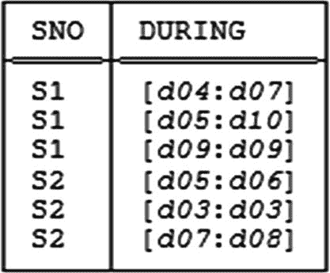
*图 14-1 关系变量 `S_DURING`——示例值*

正如示例所示，区间对于时态数据支持至关重要。然而，区间概念实际上具有更广泛的适用性，因为它出现在大量实际情境中。例如，税级（例如，$50,000–$75,000）可以被视为区间，这些区间涉及的是货币价值而非日期或时间价值。因此，尽管本节标题明确指代时态数据本身，但请注意，所有将要讨论的概念——不仅是区间概念本身，还包括各种相关概念——都具有更广泛的适用性和有用性。（事实上，我曾考虑将本节命名为“区间数据的第六范式”，这个标题在某些方面可能更贴切，尽管或许不那么直观易懂。）

现在，图 14-1 中的关系显然表现出一些冗余；例如，它两次告诉我们供应商 `S1` 在第 6 天处于合同状态。它还表现出一种*迂回表述*；例如，它用了三个元组来告诉我们本可以用一个元组就能说明的信息，即供应商 `S1` 在整个区间 [`d04`:`d10`] 内都处于合同状态。^(¹⁹²) 相比之下，图 14-2 所示的关系包含与图 14-1 相同的信息——即*信息等价*于^(¹⁹³) 图 14-1 中的关系——但没有表现出这种冗余或迂回表述：

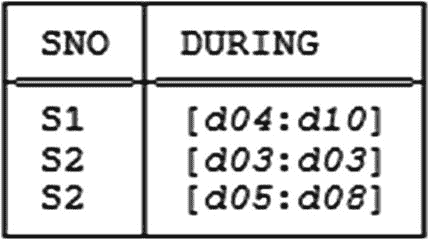
*图 14-2 图 14-1 中关系的打包形式*

图 14-2 中的关系是图 14-1 中关系的*打包形式*，可以通过一种称为 `PACK` 的新关系运算符从后者获得，如下所示：

```
PACK S_DURING ON ( DURING )
```

实际上，这个表达式的作用是：对于当前关系变量 `S_DURING` 的值中表示的每个供应商，它将任何重叠或相邻的 `DURING` 值组合成一个单一的区间。例如，参考图 14-1 和 14-2：

*   对于供应商 `S1`，区间 [`d04`:`d07`] 和 [`d05`:`d10`] 重叠，因此可以将它们组合形成区间 [`d04`:`d10`]。
*   对于供应商 `S2`，区间 [`d05`:`d06`] 和 [`d07`:`d08`] 相邻，因此可以将它们组合形成区间 [`d05`:`d08`]。

*注意：* `S1` 的“另一个”区间，即 [`d09`:`d09`]，实际上只是被吸收进了那个组合区间 [`d04`:`d10`]。相比之下，供应商 `S2` 的“另一个”区间，即 [`d03`:`d03`]，无法以这种方式与其他任何区间组合，因此保持不变。


还有另一个新的操作符，`UNPACK`，它可以说是“反其道而行之”；也就是说，给定如图 14-1 所示（或如图 14-2 所示）的关系作为输入，它会产生一个关系，其中的`DURING`值都是尽可能小的区间（换句话说，它们是*单元区间*）。例如，将以下表达式应用于图 14-1 所示的关系：

```sql
UNPACK S_DURING ON ( DURING )
```

—会产生如下图 14-3 所示的结果。该结果是图 14-1 所示关系的*解包形式*（也是图 14-2 所示关系的解包形式，我希望这应该是显而易见的）。

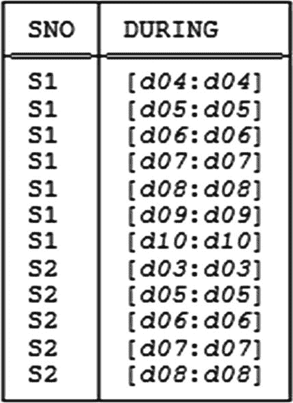

图 14-3：图 14-1 和图 14-2 中关系的解包形式

图 14-3 所示的关系在信息上等价于图 14-1 和图 14-2 中的每一个关系。更重要的是，和图 14-2 中的关系一样，它没有冗余问题（尽管和图 14-1 中的关系一样，它确实明显存在冗余表述的问题）。

现在，根据我目前所说的，你可能会认为，要避免那些冗余和冗余表述的问题，我们只需要确保关系变量始终保持为打包形式即可。(¹⁹⁴) 然而，不幸的是，打包形式虽然是解决方案的一部分，但不足以完全解决问题，下面的例子说明了原因。考虑图 14-4，它显示了一个名为`SCT_DURING`的关系变量的样本值，其谓词如下：*供应商`SNO`在整个区间`DURING`内都位于城市`CITY`并具有状态`STATUS`。*

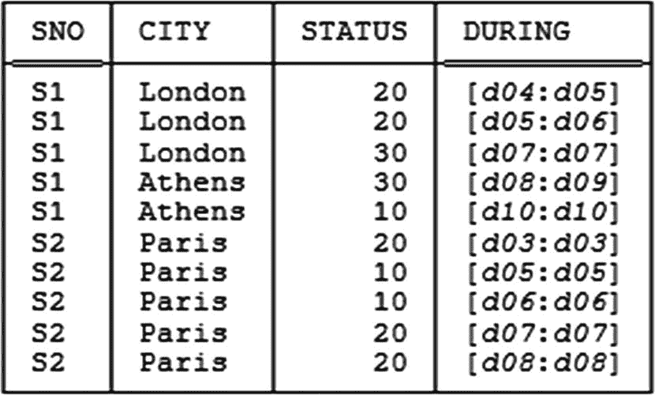

图 14-4：关系变量 `SCT_DURING` — 样本值

现在我们假设（与前面章节相反）函数依赖 `{CITY} -> {STATUS}` 不再成立。那么关系变量 `SCT_DURING` 处于 `BCNF`——唯一键是 `{SNO, DURING}`，并且唯一成立的函数依赖是该键所蕴含的依赖。（事实上，虽然我不打算证明，但该关系变量也处于 `5NF`。）然而，图 14-4 中的样本值明显同时表现出冗余和冗余表述。因此，这个例子的第一个教训是：经典理解的无损分解——即基于经典投影和经典连接的无损分解——对于避免这些问题毫无帮助。我们需要别的方法。

而且，正如我已经说过的，打包形式本身也不能解决问题。图 14-5 显示了图 14-4 中关系的打包形式——如你所见，该关系虽然没有冗余问题，但仍然存在冗余表述。（当然，图 14-4 和图 14-5 中的关系在信息上是等价的。）

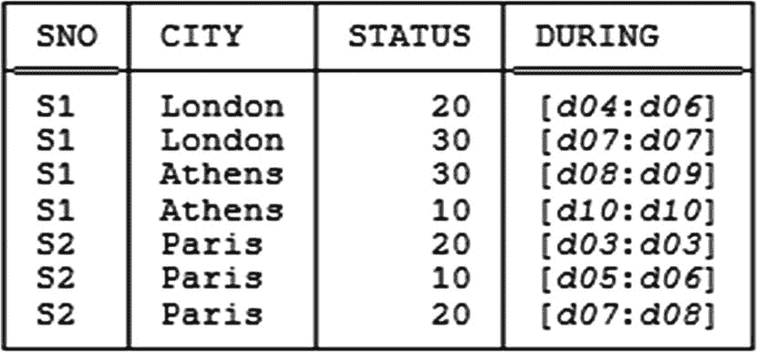

图 14-5：图 14-4 中关系的打包形式

所以打包形式不是解决方案（至少，不是完整的解决方案）；重申一下，我们需要别的方法。为了看清这个“别的方法”可能是什么，请注意，图 14-4 中的冗余和冗余表述，以及图 14-5 中的冗余表述，实际上都源于一个事实：任何给定元组中的`DURING`值并不单独适用于该元组中的`CITY`和`STATUS`值，而是适用于这些`CITY`和`STATUS`值的组合。但正如该例子清楚表明的，一个给定供应商的城市和状态随时间独立变化；因此，我们肯定需要做的是将原始关系拆分为两个独立的关系，一个用于供应商城市，一个用于供应商状态值，每个关系都有自己的`DURING`属性。我们可以通过以下步骤实现这个拆分——首先，在`DURING`上解包原始关系；其次，分别对该解包形式在`{SNO, CITY, DURING}`和`{SNO, STATUS, DURING}`上进行投影；最后，在`DURING`上打包这两个投影。给定图 14-4 的样本`SCT_DURING`值，图 14-6 显示了此过程产生的关系——如你所见，这些关系既不表现冗余，也不表现冗余表述：

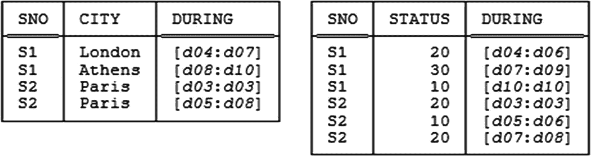

图 14-6：关系变量 `SC_DURING` 和 `ST_DURING` — 样本值

此外，如图标题所示，这两个关系可以被视为两个关系变量`SC_DURING`和`ST_DURING`的样本值，我认为，将它们作为原始关系变量`SCT_DURING`的替代是合理且可取的。

现在，这个例子中涉及的一系列步骤——解包、投影、再次打包——在实践中需要如此频繁地使用，以至于定义一个适当的简写似乎是个好主意。因此，这里定义了一个操作符（实际上是经典投影的广义形式），出于应该很快就会明了的原因，我们称之为`U_projection`：

**定义 (`U_projection`):** 令 *r* 为一个关系，令 *r* 的属性 *A* 为区间值，令 *X* 为包含 *A* 的 *r* 的标题的一个子集。那么表达式 `USING (A) : r{X}` 表示 *r* 在 *X* 上关于 *A* 的 `U_projection`，并被定义为以下操作的简写：

```sql
PACK
( ( UNPACK r ON ( A ) ) { X } )
ON ( A )
```

换句话说，`U_projection`的工作方式是：首先如指示那样解包输入关系，然后对该解包的中间结果进行常规投影，最后（重新）打包该投影的结果以获得最终的打包结果。这里有几个例子：

```sql
USING ( DURING ) : SCT_DURING { SNO , CITY , DURING }
USING ( DURING ) : SCT_DURING { SNO , STATUS , DURING }
```

给定图 14-4 中关系变量`SCT_DURING`的样本值，这两个表达式会产生图 14-6 所示的关系。*练习：* 如果你还没有做，请验证这一说法。

那么，我建议的是，用两个“U_projection”关系变量`SC_DURING`和`ST_DURING`来替代原始的关系变量`SCT_DURING`。然而，要使这种替换有效，它显然必须是无损的。现在，如果我们对图 14-6 中所示的两个`U_projections`进行常规连接（连接将基于属性`SNO`和`DURING`），我们显然无法得到图 14-4 或图 14-5 所示的关系。事实上，我们只会得到以下结果：

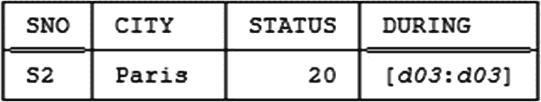


#### 引言
嗯，在这一点上你可能已经超过我了（事实上，我希望如此）……显然，我们需要做的是：首先，解包（unpack）两个输入关系；然后对这些解包后的关系执行连接（join）；接着将连接结果重新打包（pack）以获得最终结果。如果我们完成了所有这些步骤，那么我们将得到如图 14-5 所示的打包后的关系。*练习：* 再次验证这一结论（参见练习 14.6d）。

#### 定义（U_join）
以上述示例作为动机，因此，这里给出一个定义——请注意，这又是一个大大简化的定义——关于一种我们称之为 `U_join` 的广义连接形式：

*   **定义 (`U_join`)** **：** 设关系 `r1` 和 `r2` 是可连接的^(¹⁹⁵)，并且它们有一个共同的区间值属性 `A`。那么表达式 `USING (A) : JOIN {r1,r2}` 表示 `r1` 和 `r2` 的 `U_join`（关于 `A`），它被定义为以下内容的简写：

```
PACK
( JOIN
{ ( UNPACK r1 ON ( A ) ) ,
( UNPACK r2 ON ( A ) ) }
ON ( A )
```

所以，正如我或多或少已经说过的，`U_join` 的工作方式是：首先解包两个输入关系，然后对这些解包后的中间结果执行常规连接，最后将连接结果（重新）打包以获得最终结果。

#### 定义（U_equality）
现在我也可以如承诺的那样，让信息等价这个概念更精确一些。具体来说，图 14-4 和图 14-5 中的关系是信息等价的，因为它们具有相同的解包形式；实际上，它们是 `U_equal` 的。以下是一个简化的定义：

*   **定义 (`U_equality`)** **：** 设关系 `r1` 和 `r2` 具有相同的标题 `H`，并且它们有一个共同的区间值属性 `A`。那么表达式 `USING (A) : r1 = r2` 表示 `r1` 和 `r2` 之间关于 `A` 的 `U_equality` 比较，它被定义为以下内容的简写：

```
( UNPACK r1 ON ( A ) ) = ( UNPACK r2 ON ( A ) )
```

那么，总结一下目前的内容：图 14-4 中的关系当然不等于其关于 `{SNO,CITY,DURING}` 和 `{SNO,STATUS,DURING}` 的常规投影的常规连接。然而，它 *是* 相应 `U_projections` 的 `U_join` 的 `U_equal`。

#### 定义（U_join 依赖）
现在假设这种情况并非偶然——这不仅仅是我碰巧选择在图 14-4 中展示的样本值的问题——而是适用于所讨论关系变量（即关系变量 `SCT_DURING`）所有可能值的一个属性。那么我们可以说所讨论的关系变量服从某个广义连接依赖（实际上是一个 `U_JD`）。以下是一个简化的定义：

*   **定义 (U_join 依赖)：** 设 `H` 是一个标题，并设 `H` 的属性 `A` 是区间值的。那么关于 `A` 和 `H` 的 U_join 依赖（简称 `U_JD`）是一个形式为 `USING (A) : ☼{X1,X2,...,Xn}` 的表达式，其中 `X1`, `X2`, ..., `Xn`（`U_JD` 的组成部分）是 `H` 的子集，且它们的并集等于 `H`。

当然，接着我们会说：

*   一个给定的关系满足一个给定的 `U_JD`，当且仅当它 `U_equal` 于相关 `U_projections` 的 `U_join`。
*   一个给定的关系变量服从一个给定的 `U_JD`——等价地说，该给定的 `U_JD` 在该给定的关系变量中成立——当且仅当可以赋值给该关系变量的每一个关系都满足该 `U_JD`。

因此，在示例中，以下 `U_JD` 在关系变量 `SCT_DURING` 中成立：

```
USING ( DURING ) :
☼ { { SNO , CITY , DURING } , { SNO , STATUS, DURING } }
```

此外，由于原始关系变量存在某些冗余和迂回，而这些并不适用于那些 `U_projections`，因此建议对其进行无损分解。并且我们可以基于此类考虑定义一种新的范式，使得关系变量 `SCT_DURING` 不在该新范式中，但其 `U_projections` 却在。然而，在定义那个新范式之前，还有一些进一步的重要要点需要说明——这些要点我在前面已经暗示过，但尚未明确陈述：

*   类似地，常规连接在语法和语义上都是 `U_join` 的特例。
*   类似地，常规 `JD` 在语法和语义上都是 `U_JD` 的特例。
*   第一点是，我们称之为 `U_projection` 的广义投影形式确实是一种真正的泛化。换句话说，常规投影只是 `U_projection` 的一个特例——或者换句话说，所有投影都是 `U_projections`，但有些 `U_projections` 不是投影（至少，后者按通常理解时）。原因如下（再次稍作简化）：
    1.  首先，我们允许对关系 `r` 进行关于 *零个属性* 的 `U_projection`。定义变为：

        ```
        PACK
        ( ( UNPACK r ON ( ) ) { X } )
        ON ( )
        ```

    2.  其次，事实证明——如果需要进一步解释，请参阅时序方面的书籍——当关于零个属性执行时，`PACK` 和 `UNPACK` 都只是返回其输入，因此上述表达式简化为 `r{X}`，即 `r` 关于 `X` 的常规投影。
    3.  第三，对于关于零个属性执行的 `U_projection`，我们允许从具体语法中省略 `USING` 前缀及其附带的冒号。

从上述内容可以得出结论，正如所声称的，常规投影在语法和语义上都只是 `U_projection` 的特例。

因此，如果我们愿意，可以去掉那些 `U_` 前缀（除非在需要强调的场合），并简单地理解为：此后投影指的是 `U_projection`，连接和连接依赖也类似（关系的相等性也类似）。^(¹⁹⁶) 所以我们想要定义的“新范式”就是 `6NF`，只不过支撑该范式的概念（投影、连接等）现在有了扩展的解释。所以定义如下（当然，它一直保持不变）：

#### 定义（第六范式）
*   **定义 (第六范式)：** 关系变量 `R` 处于第六范式 (`6NF`) 中，当且仅当在 `R` 中成立的 `JD` 只有平凡的；换句话说，在 `R` 中成立的 `JD` 只有形式为 `☼{ ..., H, ... }` 的，其中 `H` 是 `R` 的标题。


### 练习题

1.  `6NF` 关系变量有时被称为不可约的，我在本章正文中也提到过，这是设计理论相关的众多不可约性中的又一种。你能识别出多少种不同的不可约性？

2.  假设关系变量 `P` 已按照本章正文的讨论，被其 `6NF` 投影 `PN`、`PL`、`PW` 和 `PC` 所取代。你能想到这个设计有什么改进之处吗？

3.  考虑一个表示婚姻的关系变量 `R`，其属性为 `A`、`B` 和 `C`，谓词是*人物 A 于日期 C 与人物 B 结婚*。假设没有一夫多妻制；同时假设任意两人之间结婚不会超过一次。`R` 有哪些键？连接依赖 `{AB, BC, CA}` 是否成立？`R` 处于最高级范式是什么？

4.  为以下场景设计一个数据库。需要表示的实体是某支球队的足球比赛赛程。对于已经进行过的比赛，我们希望记录“进球数”和“失球数”；然而，对于尚未进行的比赛，这两个属性显然没有意义。你的关系变量处于哪些范式？

5.  在本章正文中，我非正式地展示了如何将一个关系变量归约为 `6NF` 投影，这对应于将一个合取谓词归约为简单谓词。是否存在所谓的析取谓词？一个关系变量如何对应这样的谓词？将这样的谓词归约为简单谓词会涉及什么？

6.  给定图 14-4 中关系变量 `SCT_DURING` 的示例值，展示计算以下每个表达式的结果：
    1.  `USING ( DURING ) : SCT_DURING { SNO , DURING }`
    2.  `USING ( DURING ) : SCT_DURING { CITY , DURING }`
    3.  `USING ( DURING ) : SCT_DURING { STATUS , DURING }`
    4.  `USING ( DURING ) : JOIN { SCT_DURING { SNO , CITY , DURING } , SCT_DURING { SNO , STATUS , DURING } }`

    *注：* 最后一个案例的答案当然是图 14-5 所示的关系——但请不要只听我说，请自行确认该结果（除非你已经这么做过了）。

### 答案

1.  键和 `FD` 的不可约性，以及 `FD` 不可约性与 `2NF` 的相关性，都在第 4 章讨论过；`FD` 不可约性在第 5 章有进一步讨论。不可约覆盖在第 6 章讨论。不可约 `JD` 在第 11 章讨论。不可约（即 `6NF`）关系变量及相关的“不可约事实”概念在本章讨论。

2.  我想到的主要一点是，或许可以有一个某种形式的“主”关系变量，其主要目的只是记录当前数据库中所有零件的零件号。如果我们称该关系变量为 `P`，那么在那个关系变量 `P` 与关系变量 `PN`、`PL`、`PW` 和 `PC` 各自在 `{PNO}` 上的投影之间，将会存在 `EQD`（替代任意地选择 `PN` 在 `{PNO}` 上的投影与 `PL`、`PW` 和 `PC` 各自在 `{PNO}` 上的投影之间的 `EQD`；事实上，拥有这个主关系变量的一个好处恰恰在于它避免了那种轻微的任意性）。

    此外，假设每个零件总是有一个已知的名称和重量，但不一定有已知的颜色或城市。那么我们可以合并关系变量 `P`、`PN` 和 `PW`，将这个组合——我仍然称之为 `P`——作为主关系变量，并用从 `PL` 和 `PC` 到那个主关系变量 `P` 的外键约束取代之前需要的 `EQD`。（一个没有已知颜色的零件将在 `P` 中表示，但不在 `PL` 中表示；同样，一个没有已知城市的零件将在 `P` 中表示，但不在 `PC` 中表示。）

    顺便说一句，支持包含那个主关系变量 `P` 的另一个论据与零件供应关系变量 `SP` 有关——有了那个主关系变量，我们可以保留从 `SP` 到 `P` 的常规外键约束；没有它，事情会变得相当混乱（对吧？）。

3.  每一对属性都是一个键。指定的 `JD` 不成立，因为下面的值肯定是一个关系变量的合法值：

    ```
    a1  b1  c2
    b1  a1  c2
    a2  b1  c1
    b1  a2  c1
    a1  b2  c1
    b2  a1  c1
    ```

    （`a1` ≠ `a2`, `b1` ≠ `b2`, `c1` ≠ `c2`）；也就是说，元组 (`a1`,`b1`,`c2`)、(`a2`,`b1`,`c1`) 和 (`a1`,`b2`,`c1`) 肯定不会强制元组 (`a1`,`b1`,`c1`) 出现（！）。该关系变量处于 `6NF`。但请注意，它受制于某种*对称*约束；具体来说，元组 (`a`,`b`,`c`) 出现当且仅当元组 (`b`,`a`,`c`) 出现（上图所示示例值就说明了这一点）。^(¹⁹⁷) 因此，该关系变量也受制于某些插入和删除异常。（特别是，因此，它不在 `DK/NF` 中。见第 15 章。）

4.  这里要做的就是区分已经进行过的比赛和尚未进行的比赛：

    ```
    PAST_MATCHES { DATE , OPPONENT , GOALS_FOR , GOALS_AGAINST , ... }
    KEY { DATE }
    FUTURE_MATCHES { DATE , OPPONENT , ... }
    KEY { DATE }
    ```

    这些关系变量都处于 `5NF`。特别是 `PAST_MATCHES` 可能不应该被 `6NF` 投影所取代。*注：* 或者，我们可以考虑用一个关系变量 `FIXTURES` 取代 `FUTURE_MATCHES`，给出所有过去和未来比赛的 `DATE` 和 `OPPONENT`。那样会适用什么约束？话说回来，上面展示的设计适用什么约束？

5.  析取谓词是两个或多个其他谓词的逻辑 `OR`。如果某个关系变量 `R` 具有析取关系变量谓词，那么被 `OR` 在一起的各个谓词必须具有相同的参数（因为满足它们的元组都必须是相同类型）。将这样的关系变量归约为具有简单谓词的关系变量，可能涉及通过限制（restriction）而不是投影进行分解（并通过并集而不是连接进行重组）。更多讨论见第 15 和 16 章。

6.  1.  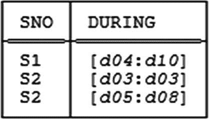
    2.  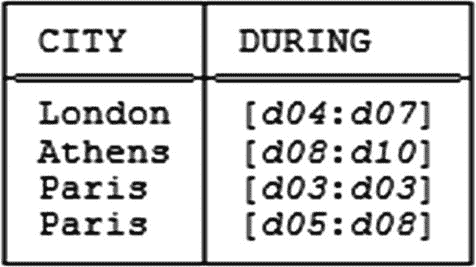
    3.  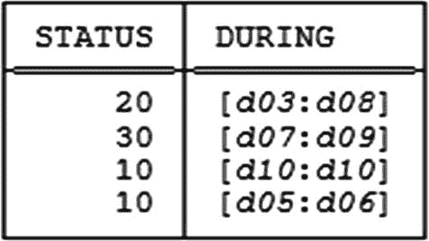
    4.  首先是两个 `U_ 投影`（从图 14-6 重复而来）：
        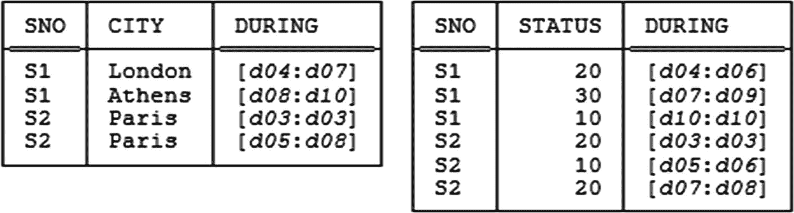
        对应的解包形式如下：
        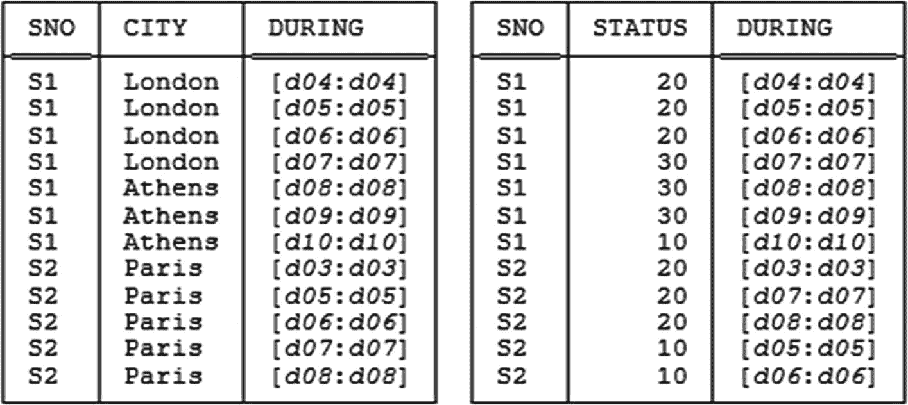
        以下是这两个解包关系的连接：
        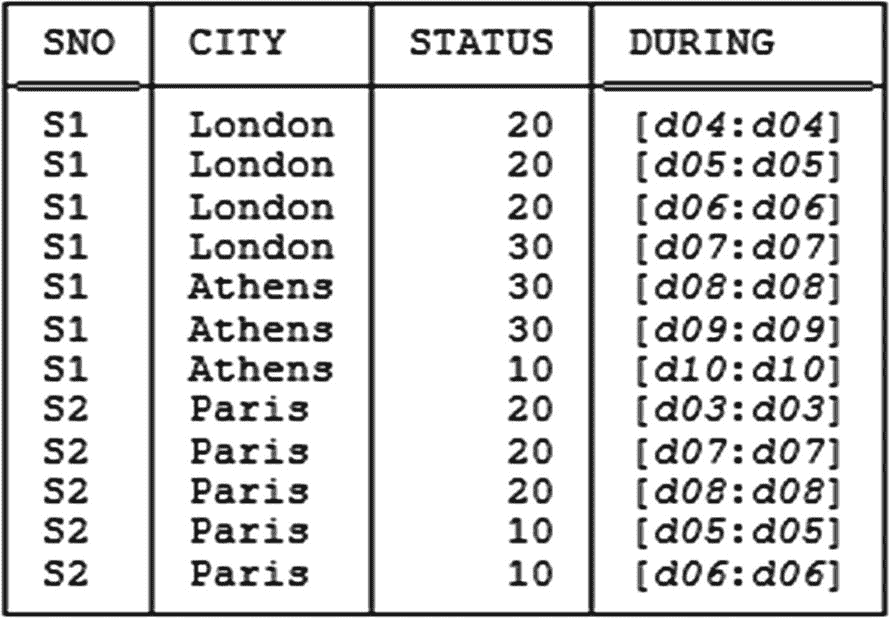
        在 `DURING` 上打包这个结果，就得到了图 14-5 所示的关系。

脚注 1   2   3   4   5   6   7   8   9   10   11   12   13


## 15. 这还不是结束

> *这还不是结束，甚至都不是结束的开始。*
>
> *但或许，这是开始的结束。*
>
> —温斯顿·丘吉尔：*在伦敦市长大人日午宴上的演讲* (1942 年 11 月 10 日)

> *永恒是个可怕的念头。*
>
> *我的意思是，这一切究竟会在哪里结束？*
>
> —汤姆·斯托帕德：*《君臣人子小命呜呼》* (1967)

这真是一段漫长而奇特的旅程……在本书第二部分，我们涵盖了 1NF、2NF、3NF 以及 BCNF（最后一个讲得相当详细）；在第三部分，我们涵盖了 4NF 和 5NF（后者也花了相当长的篇幅）；而在之前的两章中，我们又见识了另外四种范式：ETNF、RFNF、SKNF 和 6NF（其中最后一种显然是最重要的）。但这依然不是故事的结局。在本章中，仅为了完整性，我将简要描述或至少提及文献中曾定义过的其他几种范式。

### 域键范式

域键范式（DK/NF）与本书此前讨论的所有范式都不同，因为它根本不是根据 FD、MVD 和 JD 来定义的。^(¹⁹⁸) DK/NF 实际上是一种“理想”的范式：根据定义，处于 DK/NF 的关系变量可以保证免受某些更新异常的影响，因此它是可取的；然而可悲的是，它并非总是可以达到，而且“究竟何时才能达到？”这个问题也尚未得到解答。尽管如此，我们还是来研究一下。

DK/NF 是根据*域约束*和*键约束*来定义的。键约束当然是我们已经熟悉的（在第 5 章中有正式定义）。至于域约束，我提醒一下，*域*本质上就是*类型*的另一个名称（参见第 2 章练习 2.4 的答案）。由此推论，域约束在逻辑上应该与类型约束是同一回事；换句话说，它应该就是构成目标类型的那个值集的规格说明（关于这个概念的进一步讨论，请参见《SQL 与关系理论》）。然而，该术语在当前上下文中有着稍特殊的含义。具体来说，这里使用的*域约束*这个术语，指的是一个约束，其大意是：给定属性的值不仅取自某个规定的域，而且必须取自该域的某个规定的子集。例如，供应商关系变量`S`上可能存在一个约束，要求`STATUS`值（它们是整数，即`INTEGER`类型的值）必须在 1 到 100 之间（含）。

那么，以下是一些定义：

- **定义（域键范式）：** 当且仅当关系变量`R`中成立的每一个单关系变量约束都是由`R`中成立的域约束和键约束所隐含的时候，关系变量`R`才处于域键范式（DK/NF）。
- **定义（单关系变量约束）：** 任何可以通过单独检查相关关系变量（即无需检查数据库中的任何其他关系变量）来测试的完整性约束。^(¹⁹⁹)

因此，在概念上，对 DK/NF 关系变量施加强制约束是简单的，因为只需强制执行相关的域约束和键约束就足够了，然后所有约束——不仅仅是 FD、MVD 和 JD，而是适用于该关系变量的*所有*单关系变量约束——都将被自动强制执行。

DK/NF 最早由 Fagin 于 1981 年定义，^(²⁰⁰) 正是这篇 DK/NF 论文首次为*插入异常*和*删除异常*这些术语给出了精确定义。我在第 10 章定义了这些概念（并在第 13 章再次提及），但之前的那些定义和讨论是专门针对 JD 来阐述的。现记录在此的是一般性定义（请注意，它们指的是单关系变量约束，而不仅仅是碰巧为 FD、MVD 或 JD 的约束）：^(²⁰¹)

- **定义（插入异常）：** 当且仅当存在关系变量`R`的一个合法值`r`以及一个与`R`具有相同标题的元组`t`，使得将`t`附加到`r`所得到的关系满足`R`的键约束但违反`R`上的某个其他单关系变量约束时，关系变量`R`才遭受插入异常。
- **定义（删除异常）：** 当且仅当存在关系变量`R`的一个合法值`r`以及`r`的一个元组`t`，使得从`r`中移除`t`所得到的关系违反`R`上的某个单关系变量约束时，关系变量`R`才遭受删除异常。

DK/NF 论文证明，处于 DK/NF 的关系变量不可能遭受上述定义的插入或删除异常。（实际上它证明了一个更强的结果：即当且仅当关系变量处于 DK/NF 时，它才不会遭受此类异常。）

最后，我们有如下定理：

- **定理：** 只要每一个相关属性至少可以取两个不同的值，DK/NF 就蕴含 5NF。

也就是说（说得稍不严谨一点），每一个 DK/NF 关系变量都处于 5NF——尽管它当然不一定处于 6NF。正如在第 13 章（在一个脚注中）指出的，事实上，在唯一成立的约束恰好是 FD 和 JD 的这种（可惜可能不太常见的）特殊情况下，DK/NF 和 5NF 是一致的。

### 初等键范式

初等键范式（EKNF）由 Zaniolo 于 1982 年引入。^(²⁰²) 定义如下：

- **定义（初等键范式）：** 当且仅当，对于`R`中成立的每一个非平凡 FD `X → Y`，都有（a）`X`是超键，或者（b）`Y`是某个初等键的子键时，关系变量`R`才处于初等键范式（EKNF）——其中，键`K`是初等键当且仅当存在`R`的某个属性`A`，使得 FD `K → {A}`是非平凡且不可约的。

从这个定义可以直接看出，EKNF 严格介于 3NF 和 BCNF 之间；也就是说，BCNF 蕴含 EKNF，EKNF 蕴含 3NF，而反向的蕴含关系不成立。至于例子：嗯，正如本书其他地方指出的，对于范式来说，展示一个反例通常比展示一个正例更具启发性。因此，假设：

1.  我们惯常的发货关系变量`SP`，除了通常的`QTY`属性外，还有一个属性`SNAME`，代表相应供应商的名称。
2.  供应商名称必须是唯一的（即没有两个不同的供应商在同一时间拥有相同的名称）。

那么这个修改版的`SP`就有两个键：`{SNO,PNO}`和`{SNAME,PNO}`。然而，这些键都不是初等键，因为以这些键之一作为决定因素所成立的非平凡 FD 只有`{SNO,PNO} → {SNAME}`和`{SNAME,PNO} → {SNO}`，而这两个 FD 都是可约的（在这两种情况下，`PNO`都可以从决定因素中删除而不造成损失）。因此，该关系变量受到两个非平凡 FD 的约束：`{SNO} → {SNAME}`和`{SNAME} → {SNO}`，在这两个 FD 中，决定因素不是超键，且被决定因素也不是初等键的子键。因此，这个版本的`SP`关系变量不处于 EKNF（尽管它处于 3NF）。

EKNF 的既定目标是“捕捉 3NF 和 BCNF 两者的显著特性”，同时避免两者的问题（即 3NF“过于宽容”，而 BCNF“易于导致计算复杂性”）。话虽如此，我也应该说，EKNF 在文献中并不常被引用。


### 过强的 PJ/NF

回顾一下，5NF 最初被称为 PJ/NF，而 PJ/NF 的含义是（相当宽松地说）每个连接依赖（JD）都是由键所蕴含的。事实上，在引入 PJ/NF 的那篇论文中，Fagin 还引入了他称为 `过强的` PJ/NF，其含义是（再次相当宽松地说）每个 JD 都是由某个**单独考虑**的特定键所蕴含的。请注意，后者正是人们可能直觉上认为 `常规的` PJ/NF（即 5NF）定义应该有的样子——回顾第 10 章和第 12 章中关于 BCNF、4NF 和 5NF 定义之间平行性的论述。尽管如此，定义如下：

`定义（过强的 PJ/NF）：` 当且仅当关系变量 `R` 的每一个 JD 都由 `R` 的某个键所蕴含时，关系变量 `R` 才处于过强的 PJ/NF 中。

过强的 PJ/NF 显然蕴含 5NF（即“常规的” PJ/NF），但反之则不成立。一个反例就足以证明后一个事实：^(²⁰³) 考虑一个仅包含属性 `A`、`B`、`C` 和 `D` 的关系变量 `R`，且仅有键 `{A}` 和 `{B}`。让 `R` 中唯一成立的依赖是那些由这些键所蕴含的依赖（因此 `R` 肯定处于 5NF）。现在考虑 JD ☼{`AB`,`BC`,`AD`}。应用成员算法，我们看到这个 JD 在 `R` 中成立；但它并非任何一个键**单独考虑**时的结果，通过检查成员算法也可以看出这一点。因此，`R` 处于 5NF（或 PJ/NF）中，但并不处于过强的 PJ/NF 中。

### “限制-并”范式

考虑供应商-零件数据库中的零件关系变量 `P`。到目前为止我所描述的规范化理论告诉我们关系变量 `P` 处于一个“良好”的范式中；实际上，它处于 5NF 中，因此可以保证不存在可以通过进行投影来消除的异常。但为什么要把所有零件都保存在一个关系变量中呢？如果将红色零件保存在一个关系变量（例如 `RP`）中，蓝色零件保存在另一个关系变量（例如 `BP`）中，以此类推，这种设计怎么样呢？换句话说，通过**限制**（restriction）而不是投影来分解原始零件关系变量的可能性如何？由此产生的结构会是一个好的设计还是一个坏的设计？（实际上，除非我们非常小心，否则这几乎肯定是一个坏设计，我们将在本书的第五部分看到；然而，这里的要点是，经典的规范化理论本身对此完全没有发言权。）

因此，设计研究的另一个方向在于研究通过投影之外的某种算子来分解关系变量的含义。在上面的例子中，分解算子是，如前所述，（不相交的）限制，而相应的重组算子是（不相交的）并。因此，或许有可能构建一种“限制-并”规范化理论，类似于——但区别于——我们在这本书大部分篇幅中一直在考虑的投影-连接规范化理论。我不想在这里就这些事情说得更具体；可以说，沿着这些思路的一些初步想法可以在以下文献中找到：

1.  Smith 的一篇论文，其中讨论了一种称为 (3,3)NF 的范式。^(²⁰⁴) Smith 首先表明，(3,3)NF 蕴含 BCNF；其次，一个 (3,3)NF 的关系变量不必处于 4NF，一个 4NF 的关系变量也不必处于 (3,3)NF。因此，如上所述，归约到 (3,3)NF 与归约到 4NF（以及 5NF）是正交的。

2.  在 Fagin 的 PJ/NF 论文中，作为某种附录，初步讨论了一种称为 PJSU/NF 的范式（S 代表“分割”，U 代表并）。*暂定定义：* 当且仅当关系变量 `R` 处于 PJ/NF（即 5NF）中，并且无法通过限制将其分割成关系变量 `R1` 和 `R2`，使得 `R1` 和 `R2` 的依赖不同时，关系变量 `R` 才处于 PJSU/NF 中。

### 练习

1.  定义 DK/NF。给出一个处于 6NF 但不处于 DK/NF 的关系变量的例子。

2.  SKNF 和过强的 PJ/NF 之间有什么区别？实际上，*存在*区别吗？

3.  尽可能精确地给出关系算子**限制**和**并**的定义。

4.  你会如何将本章提到的各种范式（以及 6NF）纳入图 13-1 的范式层次结构中？

### 答案

1.  定义见本章正文。至于例子，假设关系变量 `SP` 受到一个约束，其大意是：奇数编号的零件只能由奇数编号的供应商提供，偶数编号的零件只能由偶数编号的供应商提供。（当然，这个例子非常牵强，但对于当前目的来说足够了。）那么这个约束显然不是由关系变量 `SP` 中成立的域和键约束所蕴含的，因此该关系变量不处于 DK/NF 中；然而它肯定处于 6NF 中。

2.  肯定存在区别，因为过强的 PJ/NF 蕴含 5NF，而 5NF 蕴含 SKNF，并且反向蕴含不成立。但很容易混淆两者，因为以下两个表面相似的观察都是正确的。令 `R` 为一个关系变量，并令 `J` = ☼{`X1`,...,`Xn`} 为一个在 `R` 中成立的不可约的 JD。那么：
    *   当且仅当对于每一个这样的 `J`，每个 `Xi` (`i` = 1, ..., `n`) 都包含 `R` 的**某个**键时，`R` 才处于 SKNF 中。
    *   当且仅当对于每一个这样的 `J`，每个 `Xi` (`i` = 1, ..., `n`) 都包含 `R` 的**同一个**键时，`R` 才处于过强的 PJ/NF 中。

3.  如果你认为这些定义来得太晚，我很抱歉：
    *   `定义（限制）：` 令 `r` 为关系 <`H`,`h`>，并令 `bx` 为一个布尔表达式，其中每个属性引用都标识了 `r` 的某个属性，并且没有任何关系变量引用。那么 `bx` 表示一个限制条件，记作 `c`，而 `r` 按照 `c` 的限制，即 `r WHERE c`，是关系 <`H`,`x`>，其中 `x` 是 `r` 的所有使 `c` 求值为 TRUE 的元组的集合。
    *   `定义（并）：` 令关系 `r1`, ..., `rn` (`n` ≥ 0) 都具有相同的标题 `H`。那么 `r1`, ..., `rn` 的并，即 `UNION {r1,...,rn}`，是一个标题为 `H`、主体为所有满足 `t` 至少出现在 `r1, r2, ..., rn` 之一中的元组 `t` 的集合的关系。（如果 `n` = 0，则需要某种语法机制（此处未显示）来指定相关的标题 `H`，结果是具有该标题的唯一空关系。）请注意，这里定义的并是一个 `n` 元算子，而不仅仅是一个二元算子。

4.  这个问题不容易回答！图 15-1 是我的尝试。

    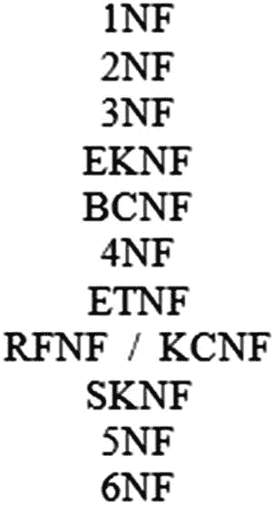

    图 15-1：范式层次结构（III）

该图就其范围而言是准确的。但是：

*   需要添加 DK/NF——可能与 6NF 处于同一级别（DK/NF 和 6NF 都不蕴含对方，但“大多数” DK/NF 的关系变量处于 5NF 中）。
*   需要添加过强的 PJ/NF——同样，可能与 6NF 处于同一级别。
*   需要添加 (3,3)NF——可能与 EKNF 处于同一级别但偏向一侧（因为 (3,3)NF 蕴含 BCNF，但 (3,3)NF 和 4NF 都不蕴含对方）。
*   需要添加 PJSU/NF——同样，可能与 6NF 处于同一级别。

但请注意，即使我们只停留在“直接主流”中（即从 1NF 到 6NF，包含两者），仍然有十一个逻辑上不同的范式；其他的——即本章讨论的那些——或许可以公允地称为“特例”。


