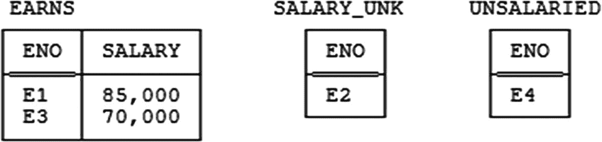

# 第十六章 正交设计原则

> *正交* 与……成直角；独立的。
>
> ——戴维·达林：《数学之书》（2004 年）

我在本书前面的部分反复提到，规范化是支撑数据库设计的科学（或至少是其重要组成部分）。因此，本章从快速回顾规范化原则并简要分析规范化实现其目标的程度开始是恰当的。

### 为规范化欢呼两声

那么，首先是一个简化的规范化原则总结：

1.  一个不在`5NF`中的`关系变量`应被分解为一组`5NF`投影。^(²⁰⁵^)
2.  原始`关系变量`应能通过将这些投影重新连接起来而重建——即，分解应是无损的。
3.  每个投影在重建过程中都应是必需的。
4.  分解应尽可能保留依赖关系（`FD`和`JD`），只要这样做不违背第一条原则。

然而，规范化远非万能药，这一点通过考察其目标及其实现程度便可轻易看出。其目标如下：

*   实现一个能"良好"表示现实世界的设计（即逻辑上正确、直观易懂，并且是未来发展的良好基础）
*   减少冗余
*   从而避免某些可能发生的更新异常
*   简化某些完整性约束的声明与执行

我将逐一考察。

*   *良好地表示现实世界：* 规范化在这方面做得很好。我对此没有批评意见。
*   *减少冗余：* 规范化在解决这个问题上也是一个好的开端，但它仅仅是个开端。一方面，这是一个取投影的过程，而我们已经看到，并非所有冗余都能通过取投影来消除；事实上，规范化根本完全不涉及许多种冗余。（第十七章将讨论这个问题。）另一方面，即使分解是无损的，取投影也可能导致依赖丢失，正如我们在第六章及其他地方看到的那样。
*   *避免更新异常：* 这一点至少部分地是上一条的另一种说法。众所周知，未适当规范化的设计可能容易受到某些更新异常的影响，这正是因为它们所带来的冗余。例如，在`关系变量 STP`中（见第 1 章图 1-2），供应商`S1`可能在一个元组中显示状态为`20`，在另一个元组中显示状态为`25`。

当然，这种特定的异常只有在完整性约束执行不完美的情况下才会出现。或许思考更新异常问题的更好方式是：如果设计是适当规范化的，防止此类异常所需的约束会更易于声明，并且可能更容易执行，反之则不然（见下面的下一个要点）。另一种思考方式是：如果设计是适当规范化的，那么逻辑上可接受的单个元组更新^[(206)^]会比不规范化时更多（因为未规范化的设计意味着冗余——即，多个元组表达相同的事情——而冗余反过来又意味着有时我们必须同时更新多个事项）。

*   *简化约束的声明与执行：* 从前面的章节我们知道，某些依赖隐含了其他依赖。（更一般地说，事实上任何类型的约束都可能隐含其他约束。作为一个简单的例子，如果发货数量必须小于或等于`5000`，那么它们当然必须小于或等于`6000`。）现在，如果约束*A*隐含约束*B*，那么声明和执行*A*将有效地"自动"声明和执行*B*（实际上，*B*根本不需要单独声明，除了可能作为文档说明）。而规范化到（至少）`5NF`为我们提供了一种非常简单的方法来声明和执行某些重要的约束；基本上，我们所要做的就是定义键并执行其唯一性——这我们本来就会做——然后所有适用的`JD`（以及所有适用的`MVD`和`FD`）都将有效地被自动声明和执行，因为它们都将被这些键所隐含。因此，规范化在这个领域也做得相当不错。（当然，我在这里忽略了规范化过程可能引发的各种多关系变量约束。）

另一方面，除了已给出的理由之外，规范化并非万能药还有以下几个原因：

*   首先，`JD`和`MVD`以及`FD`并非唯一的约束类型，规范化对其他类型的约束没有帮助。
*   其次，给定一组特定的`关系变量`，通常会有几种不同的无损分解为`5NF`投影的方案——参见第 6 章的几个例子——而我们几乎没有或完全没有正式的指导来告诉我们在此类情况下该选择哪一种。（不过说实话，我怀疑这种缺失在实践中不太可能造成重大问题。）
*   第三，有许多设计问题是规范化根本不涉及的。例如，是什么告诉我们应该只有一个供应商`关系变量`，而不是为伦敦供应商设一个、为巴黎供应商设一个，等等？这肯定不是经典理解中的规范化所能决定的。

尽管如此，我必须明确表示，我不希望上述评论被视为任何形式的攻击。正如我在第 8 章所说，我相信任何未完全规范化的设计都是强烈不适宜的。但事实仍然是，规范化（我称之为"设计中科学的部分"）本身确实没有完成我们期望的那么多工作——因此，能够说现在有额外的一小块科学可供我们使用是件好事。这就是正交设计的全部意义所在。

*注：* 正交性的概念随着时间的推移而演变。因此，本章部分内容与之前关于同一主题的著作——主要是我自己的——有些出入。此外，我非常怀疑本章是否就是最终定论。我确实相信本章在其论述范围内是准确的；然而，未来很可能（也值得）对该材料进行进一步的完善。*读者宜自行判断*。


### 一个激励性示例

为简化起见，让我们假设函数依赖（FD）`{CITY} → {STATUS}` 在关系变量 `S` 中*不再*成立（*请注意，在本章后续内容中，我将一直沿用这一修正后的假设*）。现在考虑对该关系变量进行如下分解：

```
SNC { SNO , SNAME , CITY }
KEY { SNO }
STC { SNO , STATUS , CITY }
KEY { SNO }
```

示例值如图 16-1 所示。如图所示，这种分解相当不合理（尤其要注意，给定供应商位于给定城市的事实出现了两次），然而它却遵守了所有的规范化原则——两个投影都是 5NF；分解是无损的；重建过程需要这两个投影；并且依赖关系得到了保留。


图 16-1
关系变量 `SNC` 和 `STC` — 示例值

直观上看，上述设计的问题显而易见：元组 `(s,n,c)` 出现在 `SNC` 中当且仅当元组 `(s,t,c)` 出现在 `STC` 中；等价地说，元组 `(s,c)` 出现在 `SNC` 在 `{SNO, CITY}` 上的投影中当且仅当同一个元组 `(s,c)` 出现在 `STC` 在 `{SNO, CITY}` 上的投影中。稍正式一点表述，我们可以说该设计受制于以下相等依赖（EQD）——

```
CONSTRAINT ... SNC { SNO , CITY } = STC { SNO , CITY } ;
```

——而这个 EQD 使冗余变得明确。

然而，需要重申的是，上述设计遵守了*所有*公认的规范化原则。由此可见，仅靠这些原则是不够的——我们需要其他东西来告诉我们设计错在哪里（*形式化*的其他东西，即；我们都从非形式化角度知道问题所在）。换句话说，规范化准则提供了一套形式化原则来指导我们减少冗余，但正如例子清楚表明的，这套原则本身是不充分的。我们需要另一个原则；换言之，正如我一直强调的，我们需要更多的科学。

### 一个更简单的例子

为了了解我们需要的原则可能是什么样子，让我们考虑另一个更简单（？）的例子。如你所知，规范化本身——特别是像上一节 `SNC` / `STC` 例子中使用的规范化——与关系变量的“垂直”分解（即通过投影进行的分解）有关。但“水平”分解（即通过限制进行的分解）显然也是可能的。考虑图 16-2 所示的设计，其中零件关系变量 `P` 被水平地——实际上是被分区——拆分为两个关系变量，一个（“轻零件”，`LP`）包含重量小于 17.0 磅的零件，另一个（“重零件”，`HP`）包含重量大于或等于 17.0 磅的零件。^(²⁰⁷)


图 16-2
关系变量 `LP` 和 `HP` — 示例值

谓词如下：

*   `LP`：*零件 `PNO` 的名称为 `PNAME`，具有颜色 `COLOR` 和重量 `WEIGHT`（小于 17.0 磅），并存储在城市 `CITY`。*
*   `HP`：*零件 `PNO` 的名称为 `PNAME`，具有颜色 `COLOR` 和重量 `WEIGHT`（大于或等于 17.0 磅），并存储在城市 `CITY`。*

请注意，原始关系变量 `P` 可以通过取关系变量 `LP` 和 `HP` 的（不相交）并集来恢复。

我们为什么可能想进行这样的水平分解？坦率地说，我不知道有任何好的逻辑理由这样做，当然这并非说这样的理由不存在。尽管如此，请注意我们可以，并且应该，陈述两个适用于这些关系变量的约束：

```
CONSTRAINT LPC AND ( LP , WEIGHT < 17.0 ) ;
CONSTRAINT HPC AND ( HP , WEIGHT ≥ 17.0 ) ;
```

（我提醒你回顾第 2 章，`Tutorial D` 表达式 `AND (rx, bx)`，其中 `rx` 是关系表达式，`bx` 是布尔表达式，当且仅当由 `bx` 表示的条件对由 `rx` 表示的关系中的每个元组求值为 `TRUE` 时，它返回 `TRUE`。）

因此，我们在这里至少可以说遇到了一种有点不寻常的情况。具体来说，对于关系变量 `LP` 和 `HP` 中的每一个，部分谓词可以并且应该以显式约束的形式被形式化地捕获。实际上，需要陈述和强制执行此类约束这一事实本身可能就被视为不利于该设计。但即使水平分解在逻辑层面上因此被视为禁忌，在物理层面上进行这种分解仍然有很多实际原因（与恢复、安全性、性能和其他此类问题有关）。因此，鉴于在当今的 DBMS 中，逻辑层和物理层往往步调一致——即，这些 DBMS 中的数据独立性远未达到应有的程度——由此可见，在逻辑层面上进行这种分解也可能有实际原因，即使没有逻辑原因，至少根据当前实现的技术水平来看是这样。

现在，无论你对上述论点有何看法，至少图 16-2 的设计没有明显不妥之处（嗯，无论如何，为了这个例子，让我们姑且这么认为）。^(²⁰⁸) 但假设我们将关系变量 `LP` 定义得稍有不同；具体来说，假设我们将其定义为包含重量小于*或等于* 17.0 磅的零件（当然，相应地调整谓词和约束 `LPC`）。图 16-3 是图 16-2 的修订版，展示了采用这种修订设计后发生的情况。


图 16-3
关系变量 `LP`（修订后）和 `HP` — 示例值


如你所见，现在这个设计显然是糟糕的；具体来说，零件 P2 和 P3 的元组现在同时出现在图 16-3 的两个关系变量中（换句话说，存在一些冗余）。更有甚者，这些元组*必须*同时出现在两个关系变量中！因为我们可以反过来假设：假如（比如说）零件 P2 的元组出现在`HP`中而不在`LP`中。那么，注意到`LP`中不包含零件 P2 的元组，我们就可以根据`闭世界假设`（参见第 2 章）合法地推断出：并不存在零件 P2 重 17.0 磅这种情况。但是，我们接着从`HP`中看到零件 P2 实际上重 17.0 磅，于是数据库就不一致了（它包含矛盾）。*注意：* 当然，数据库中的不一致性是极其不可取的。事实上，我将在附录 B 中展示，你永远无法信任从不一致的数据库中得到的结果；确实，你可能会从这样的数据库中得到*任何可能的结果*——甚至是诸如 1=0 这种隐含荒谬内容的结论！

现在，图 16-3 的设计问题显而易见：`LP`和`HP`的谓词是“重叠”的，这意味着完全相同的元组*t*可以同时满足两者。更有甚者，正如我们已经看到的，如果*t*是这样一个元组，并且在某个给定时间点元组*t*代表一个“真实事实”，那么，根据`闭世界假设`，元组*t*在相关时间点必然同时出现在两个关系变量中（当然，冗余由此产生）。实际上，我们面临着另一个等价约束（EQD）：

```
CONSTRAINT ... ( LP WHERE WEIGHT = 17.0 ) =
( HP WHERE WEIGHT = 17.0 ) ;
```

再强调一次，这个例子中的问题是我们允许两个关系变量具有重叠的谓词。显然，我们要寻找的原则应该类似于：不要那样做！让我们试着更精确地陈述这一点：

*   **定义（*正交设计原则*，第一次尝试）：** 如果关系变量`R1`和`R2`是不同的，则不能存在一个元组，其性质是：它出现在`R1`中当且仅当它出现在`R2`中。^(²⁰⁹)

术语*正交*源于这一原则实质上要求关系变量之间应彼此独立——如果它们的含义在前述意义上重叠，则它们就不会是独立的。*注意：* 在下文中，我常常将`正交性原则`简写为`the orthogonality principle`，有时甚至直接简写为`orthogonality`。

正如本书其他地方一样，我可能会被指责在前面略施小计。请再看一下图 16-3；特别地，看一下零件 P2 的元组。该元组同时出现在`LP`和`HP`中，因为它代表`LP`谓词的一个真实实例化*以及*`HP`谓词的一个真实实例化。还是说不是这样？这些谓词针对零件 P2 的实例化实际上如下：

*   `LP`：*零件 P2 名为螺栓，颜色为绿色，重量为 17.0 磅（小于等于 17.0 磅），存储在巴黎。*

*   `HP`：*零件 P2 名为螺栓，颜色为绿色，重量为 17.0 磅（大于等于 17.0 磅），存储在巴黎。*

这两个命题并不相同！当然，它们*等价*——但为了认识到这种等价性，我们需要知道`17.0 ≤ 17.0`和`17.0 ≥ 17.0`都为真，然后我们需要进行一点逻辑推理。（关键在于，对我们人类来说显而易见的事情，对机器来说不一定显而易见，为了严谨起见，我本应在我之前的论证中详细说明缺失的步骤。）

现在，在轻重零件例子中遵守正交性原则当然可以避免图 16-3 所展示的冗余。但请注意，所述原则仅适用于像`LP`和`HP`这样具有完全相同标题的关系变量，因为如果所讨论的关系变量具有不同的标题，完全相同的元组当然不可能出现在两个不同的关系变量中。因此，你可能会认为正交性原则用处不大，因为在实践中，同一数据库中有两个标题相同的关系变量可能并不常见^(²¹⁰)。如果仅止于此，那么我可能会同意你的观点；我的意思是，那样的话事情就相当简单了，本章也可以在此结束（甚至可能不值得为如此显而易见的规则冠以“原则”这样宏大的标签）。但是，当然，关于这个问题还有很多话要说。为了进一步探讨各种可能性，我首先需要更仔细地研究一下元组和命题之间的关系。


### 元组与命题

如您所知，在某个给定时间，出现在某个给定关系变量 `R` 中的每个元组都表示某个特定的命题。该命题是关系变量 `R` 的关系变量谓词的一个实例化，（按惯例）在所讨论的时间被理解为真。例如，以下是关系变量 `HP` 的谓词（示例值如图 16-2 和 16-3 所示）：

*   *零件 `PNO` 的名称是 `PNAME`，颜色为 `COLOR`，重量为 `WEIGHT`（大于或等于 17.0 磅），并且存储在城市 `CITY` 中。*

当前该关系变量包含（除其他外）一个关于零件 `P6` 的元组，该元组代表了上述谓词的以下实例化：

*   *零件 `P6` 的名称是 `Cog`，颜色为 `Red`，重量为 `19.0` 磅（大于或等于 17.0 磅），并且存储在城市 `London` 中。*

粗略地说，我们可以说数据库“包含命题”（或至少是命题的表示）。现在，我曾在本书前面的几个地方说过，或者至少暗示过，数据库涉及一些冗余，当且仅当它将同一件事说了两次。现在我可以让这个说法更精确一点：

*   **定义（冗余）：** 数据库涉及冗余，当且仅当它包含同一命题的两种不同表示。

既然元组表示命题，就很容易将上述定义理解为：数据库涉及冗余，当且仅当它包含同一个元组的两种不同出现。^(²¹¹) 然而，不幸的是，这种对定义的（错误）解释充其量是过度简化了。让我们更仔细地审视它。

首先，当然，至少有一点是真实的：我们不希望同一个元组在同一关系变量中出现多次（即在同一时间），因为这种情况肯定构成了“将同一件事说了两次”。（我曾听科德说过：如果某件事是真的，说两次也不会让它变得更真。）现在，关系模型本身通过定义处理了这个特定要求——关系从不包含重复元组，关系变量也是如此，因此我们可以忽略这种可能性。

这里有两点。第一，鉴于上述事实，可以说避免冗余的愿望是选择集合（根据定义不能包含重复元素）而不是“包”（可以包含）作为建立坚实数据库理论的正确数学抽象的动机之一——尽管可能是一个次要的动机（？）。SQL 的辩护者们请注意！

第二，我注意到现在我们有了“重复元组”概念的精确描述。（人们一直在使用这个短语，但我非常怀疑如果被追问，他们中有多少人能精确定义它。）严格来说，当然，两个元组是重复的，当且仅当它们是同一个元组，就像两个整数是重复的当且仅当它们是同一个整数。因此，从逻辑角度来看，“重复元组”这个短语并没有太大意义（说两个不同的元组是重复的是一种矛盾）。当人们使用那个短语时，他们真正谈论的是同一个元组的重复*出现*。因此，在数据库上下文中经常遇到的短语“重复消除”，更准确地说应该是*重复*消除。但我离题了……让我们回到主要讨论。

接下来，我观察到我们通常也不希望相同的*子*元组在同一关系变量中出现多次（同样，是在同一时间）。^(²¹²) 但经典规范化处理了这一点；例如，正是因为，在之前的章节中，函数依赖 `{CITY} -> {STATUS}` 在关系变量 `S` 中成立——导致相同的 `{CITY,STATUS}` 对（或子元组）反复出现，每次出现时具有相同的含义——我们被建议用其在 `{CITY,STATUS}` 和 `{SNO,SNAME,CITY}` 上的投影来替换该关系变量。

我的下一个观点是，同一个元组可以表示任意数量的不同命题，这很容易看出。作为一个简单的例子，令 `SC` 和 `PC` 分别为关系变量 `S` 在 `{CITY}` 上的投影和关系变量 `P` 在 `{CITY}` 上的投影。给定我们通常的示例值，那么，仅包含 `CITY` 值 `London` 的元组同时出现在 `SC` 和 `PC` 中——但这两种出现代表不同的命题。具体来说，在 `SC` 中的出现代表命题 *伦敦至少有一个供应商*，而在 `PC` 中的出现代表命题 *伦敦至少有一个零件*（为示例起见，两种情况都略有简化）。

更重要的是——在这里我必须稍微更正式一点——同一个命题也可以由任意数量的不同元组表示。这是因为，形式上，相关的属性名称是元组的一部分（如果需要确认这一点，请查看第 5 章中*元组*的定义）。例如，考虑我们通常的供应关系变量 `SP`，其属性为 `SNO`、`PNO` 和 `QTY`，谓词为：

*   *供应商 `SNO` 以数量 `QTY` 供应零件 `PNO`。*

现在假设我们另外有一个关系变量 `PS`，其属性为 `SNR`、`PNR` 和 `AMT`，谓词为：

*   *供应商 `SNR` 以数量 `AMT` 供应零件 `PNR`。*

那么（使用 `Tutorial D` 语法）以下元组很可能分别出现在关系变量 `SP` 和 `PS` 中：

```
TUPLE { SNO 'S1' , PNO 'P1' , QTY 300 }
TUPLE { SNR 'S1' , PNR 'P1' , AMT 300 }
```

这些显然是不同的元组，但它们都表示同一个命题，即：

*   *供应商 `S1` 以数量 `300` 供应零件 `P1`。*

事实上，两个关系变量 `SP` 和 `PS` 中的每一个都可以用另一个来定义，正如以下约束（实际上是 `EQD`）所示：

```
CONSTRAINT ...
PS = SP RENAME { SNO AS SNR , PNO AS PNR , QTY AS AMT } ;
CONSTRAINT ...
SP = PS RENAME { SNR AS SNO , PNR AS PNO , AMT AS QTY } ;
```

因此，一个同时包含这两个关系变量的数据库显然涉及冗余。^(²¹³)

上述讨论的要点是：元组和命题之间存在多对多的关系——任意数量的元组可以表示同一个命题，任意数量的命题可以由同一个元组表示。鉴于这种情况，这里尝试更精确地阐述正交性原则：

*   **定义（*****正交设计原则*****, 第二次尝试）**：设关系变量 `R1` 和 `R2` 是不同的，并且让它们的标题分别为 `{A1,...,An}` 和 `{B1,...,Bn}`。将关系变量 `R1` 定义如下：

    ```
    R1 = R RENAME { A1 AS B1′ , ... , An AS Bn′ }
    ```

    其中 `B1′`, ..., `Bn′` 是 `B1`, ..., `Bn` 的某种排列。（注意 `R1` 和 `R2` 因此具有相同的标题。）^(²¹⁴) 那么，必须不存在限制条件 `c1` 和 `c2`（两者都不是恒假），使得以下等式依赖成立：

    ```
    ( R1 WHERE c1 ) = ( R2 WHERE c2 )
    ```

#### 源自这第二次尝试的要点：

*   遵守此版本的原则可以解决图 16-3 设计中的问题。具体来说，将 `R` 和 `R2` 分别设为 `LP` 和 `HP`，并将 `R1` 定义如下：

    ```
    R1 = LP RENAME { PNO AS PNO , ... , CITY AS CITY }
    ```


（换句话说，令 `R1` 与 `R` 恒等。）现在令 `c1` 和 `c2` 都为限制条件 `WEIGHT = 17.0`。那么等式依赖（`R1` WHERE `c1`）=（`R2` WHERE `c2`）显然成立，因此该设计违反了正交性。

*注意：* 正如此例所示，只要 `c1` 和 `c2` 并非恒假，就必然存在某些元组，当它们代表“真实事实”时，将必然同时出现在 `R1` 和 `R2` 中——本质上，这正是我们希望禁止的情况。（相比之下，如果 `c1` 和 `c2` 中任一为恒假，则对应的限制——`R1` WHERE `c1` 或 `R2` WHERE `c2`（视情况而定）——将为空，因此也就不会且不可能发生任何正交性违反。）

- 该原则的第二版本涵盖了第一版本，因为我们可以使 `R1` 与 `R` 相同——实际上是通过使重命名操作成为“空操作”来实现，如前一要点项所示。（正如我之前指出的，原则的先前版本确实假设所讨论的关系变量具有相同的标题。然而，正如本节的讨论所表明的，我们不能只关注那种简单情况。）当然，第二版本也解决了 SP 与 PS 的问题——实际上是通过将 `c1` 和 `c2` 分别简单地设为 TRUE。
- 回忆第 6 章可知，在逻辑学中，恒假的事物（例如，布尔表达式 `WEIGHT >= 17.0 AND WEIGHT < 17.0`）被称为*矛盾*。因此，要求 `c1` 和 `c2` 不恒假可以这样表述：`c1` 和 `c2` 都不是逻辑意义上的矛盾。

### 重访第一个示例

现在让我们回到最初的驱动示例，其中关系变量 `S` 被垂直分解为它在 `{SNO, SNAME, CITY}` 和 `{SNO, STATUS, CITY}` 上的投影 `SNC` 和 `STC`。^(²¹⁵^(#fn215)) （当然，涉及轻型与重型零件的示例是水平分解。）现在观察，虽然 `SNC` 和 `STC` 的度数相同，但任何给定的元组都不可能同时出现在两者中：`SNC` 中的元组具有 `SNAME` 属性，而 `STC` 中的元组则具有 `STATUS` 属性。此外，我们无法简单地通过重命名（例如）`SNC` 中的 `SNAME` 属性为 `STATUS` 来生成一个与 `STC` 标题相同的关系变量，因为 `SNC` 中的 `SNAME` 类型为 `CHAR`，而 `STC` 中的 `STATUS` 类型为 `INTEGER`。（重命名属性改变的是*名称*，而非类型。）由此可见，我们定义正交性原则的第二次尝试仍然不充分；实际上，在当前情况下，它根本不再适用。

现在回顾前述设计的问题：元组 (`s`, `c`) 出现在 `SNC` 在 `{SNO, CITY}` 上的投影中，当且仅当完全相同的元组 (`s`, `c`) 出现在 `STC` 在 `{SNO, CITY}` 上的投影中。也就是说，下列等式依赖（EQD）成立：

```
CONSTRAINT ... SNC { SNO , CITY } = STC { SNO , CITY } ;
```

让我们暂时忽略属性重命名的问题，因为它与本例无关。那么，关于上述等式依赖的关键点在于，它并非在不同的数据库关系变量之间成立，而是在*同一*数据库关系变量的不同*投影*之间成立：具体而言，这些投影源于数据库关系变量 `S` 的垂直分解。但情况当然不一定如此——我的意思是，`SNC` 和 `STC` 本可以独立定义，作为两个完全不同的关系变量，而从未存在过一个（在设计者心中）等于它们连接的关系变量 `S`。它们甚至可能不是独立的关系变量本身，而是两个这样的不同关系变量的投影。所有这些引出了定义正交性原则的第三次尝试：

- **定义（正交性设计原则，第三次尝试）**：设关系变量 `R1` 和 `R2` 是相异的。那么：
  1. 不能存在一个相对于 `R1`^(²¹⁶^(#fn216)) 不可约的连接依赖 `{X1,...,Xn}`，使得
  2. 存在某个 `Xi`（1 <= `i` <= `n`）以及作用于 `R1` 在 `Xi` 上投影（记作 `R1X`）的一个可能为空的属性重命名集，该重命名将 `R1X` 映射为 `R1Y`，使得
  3. `R1Y` 与 `R2` 的标题的某个子集 `Y` 具有相同的标题，且
  4. 下列等式依赖成立：
     ```
     R1Y = R2Y
     ```
     （其中 `R2Y` 是 `R2` 在 `Y` 上的投影）。

现在，这一切看起来相当复杂，但基本上只是说明：`R1` 的任何无损分解中的任何投影，都不能与 `R2` 的任何投影信息等价。确实，正如你可能看出的，定义中的大部分复杂性（如果有的话）源于需要处理重命名问题。下面这个稍简单的定义版本忽略了该复杂性，可能有助于更清晰地阐明要点：

- **定义（正交性设计原则，第三次尝试，忽略重命名）**：设关系变量 `R1` 和 `R2` 是相异的。那么：
  1. 不能存在一个相对于 `R1` 不可约的连接依赖 `{X1,...,Xn}`，使得
  2. 存在某个 `Xi`（1 <= `i` <= `n`）与 `R2` 的标题的某个子集 `Y` 相同，使得
  3. 下列等式依赖成立：
     ```
     R1Y = R2Y
     ```
     （其中 `R1Y` 和 `R2Y` 分别是 `R1` 和 `R2` 在 `Y` 上的投影）。

现在观察，遵循此第三版本的原则解决了我们驱动示例中的问题，即关系变量 `S` 被分解为其在 `{SNO, SNAME, CITY}` 和 `{SNO, STATUS, CITY}` 上的投影 `SNC` 和 `STC`。假设该分解已完成。那么：


1.  数据库中现在包含两个不同的关系变量，即 `SNC` 和 `STC`。

2.  值得感谢的是，**希斯定理**以及函数依赖 `{SNO} → {SNAME}` 在关系变量 `SNC` 中成立这一事实，意味着连接依赖 `☼{{SNO,SNAME},{SNO,CITY}}` 在关系变量 `SNC` 中成立——事实上，它相对于该关系变量是不可约的。

3.  因此，关系变量 `SNC` 在 `{SNO,CITY}` 上的投影是其有效无损分解的一部分。但是，在该投影与关系变量 `STC` 在相同属性集上的投影之间，存在一个**相等性依赖**。因此，正如刚才所述（“第三次尝试”），该设计违反了正交性原则。

我现在观察到，正交性原则的这个版本让我有机会处理第 11 章中的一项未竟之事。你或许还记得，我在那一章中指出，以下连接依赖在关系变量 `S` 中成立，并且实际上相对于该关系变量是不可约的：

```
☼ { { SNO , SNAME , CITY } , { CITY , STATUS , SNAME } }
```

但我也说过，基于这个连接依赖对关系变量 `S` 进行分解并不是个好主意（练习 11.4 询问了原因）。好吧，我们现在可以看到，如果进行了那种分解：

1.  数据库中现在包含两个不同的关系变量——我将称它们为 `SNC` 和 `CTN`——它们的标题分别为 `{SNO,SNAME,CITY}` 和 `{CITY,STATUS,SNAME}`。

2.  值得感谢的是，**希斯定理**以及函数依赖 `{CITY} → {STATUS}` 在 `CTN` 中成立——至少，就第 11 章的范围而言它确实成立——这一事实意味着连接依赖 `☼{{CITY,STATUS},{CITY,SNAME}}` 在关系变量 `CTN` 中成立，并且实际上相对于该关系变量是不可约的。

3.  因此，关系变量 `CTN` 在 `{CITY,SNAME}` 上的投影是其有效无损分解的一部分。但是，在该投影与关系变量 `SNC` 在相同属性集上的投影之间，存在一个**相等性依赖**。换句话说，该设计再次违反了正交性原则。

这个例子的要旨是：基于一个“不良”的连接依赖进行无损分解，是违背**正交设计原则**的。（例子中的连接依赖是“不良的”，因为属性 `SNAME` 可以从 `{CITY,STATUS,SNAME}` 这个分量中移除，而不会造成重大损失。）更重要的是，遵守正交性原则的一个结果是，本章开头给出的第三个规范化原则——即每一个投影在重建过程中都应该是必需的——将自动得到满足（因此，正交性与规范化之间毕竟存在某种逻辑联系）。

### 再探第二个例子

不幸的是，上一节给出的正交性原则的第三个版本仍然遗漏了一些东西，重温轻量与重量部件的例子揭示了它是什么：它遗漏了关于**约束**的那部分业务。（在那个例子中，相等性依赖并非存在于数据库关系变量本身之间，也非存在于这些关系变量的投影之间，而是存在于这些关系变量的某些**约束**之间。）换句话说，该原则的第三个版本未能包含第二个版本。相比之下，下面的表述同时处理了约束问题和投影问题：

**定义（正交设计原则，第四次尝试）：** 设关系变量 `R1` 和 `R2` 是不同的。那么：

1.  不存在一个相对于 `R1` 不可约的连接依赖 `☼{X1,...,Xn}`，使得

2.  存在某个 `Xi`（1 ≤ `i` ≤ `n`）以及一组可能为空的属性重命名，作用于 `R1` 在 `Xi` 上的投影（记为 `R1X`），该重命名将 `R1X` 映射为 `R1Y`，并且

3.  `R1Y` 的标题与 `R2` 的标题的某个子集 `Y` 相同，并且

4.  存在限制条件 `c1` 和 `c2`，两者均非恒假，并且

5.  以下相等性依赖成立：

```
( R1Y WHERE c1 ) = ( R2Y WHERE c2 )
```

（其中 `R2Y` 是 `R2` 在 `Y` 上的投影）。

### 最终版本（？）

信不信由你，仍然存在问题……考虑供应商关系变量的一个版本——我称之为 `SCC`——它具有属性 `SNO`、`CITYA` 和 `CITYB`。设 `SCC` 受到约束：对于任何给定的供应商，`CITYA` 和 `CITYB` 的值必须相同。*结果：* 冗余！当然，这是一个糟糕的设计，但它是一种可能的设计，如果能扩展正交性原则以处理（即禁止）这种设计，那就太好了。下面这个最终（？）的表述应该可以做到（我将其作为一个练习留给你去弄清楚具体是如何做到的）：

**定义（正交设计原则，“最终”版本）：** 设 `R1` 和 `R2` 为关系变量（不一定不同）。那么：

1.  不存在一个相对于 `R1` 不可约的连接依赖 `☼{X1,...,Xn}`，使得

2.  存在某个 `Xi`（1 ≤ `i` ≤ `n`）以及一组可能为空的属性重命名，作用于 `R1` 在 `Xi` 上的投影（记为 `R1X`），该重命名将 `R1X` 映射为 `R1Y`，并且

3.  `R1Y` 的标题与 `R2` 的标题的某个子集 `Y` 相同（如果 `R1` 和 `R2` 是同一个关系变量，则 `Y` 必须与 `Xi` 不同），并且

4.  存在限制条件 `c1` 和 `c2`，两者均非恒假，并且

5.  以下相等性依赖成立：

```
( R1Y WHERE c1 ) = ( R2Y WHERE c2 )
```

（其中 `R2Y` 是 `R2` 在 `Y` 上的投影）。

这个版本的原则包含了所有先前的版本。


### 澄清说明

我很遗憾地必须指出，文献中关于正交性的概念存在相当多的混淆，尽管其基本思想非常简单。我更加遗憾地必须说，这种混淆可能源于我本人——我之前关于这个主题的一些文章（说得不客气些）是完全错误的。因此，请允许我借此机会尝试纠正记录。基本要点如下：

> 正交性指的是关系变量不应具有重叠的含义；它并非说关系变量不应具有相同的-heading（或者，更一般地说，不应具有“重叠”的-heading）。

#### 示例 1：ON_VACATION 与 NEEDS_PHONE

这是一个由休·达文（Hugh Darwen）提出的简单例子，用以说明其中的区别。考虑谓词 *员工 ENO 正在休假* 和 *员工 ENO 等待分配电话号码*。这种情况的显而易见的设计涉及两个一度的关系变量，大致如下：

```
ON_VACATION { ENO }
KEY { ENO }
NEEDS_PHONE { ENO }
KEY { ENO }
```

显然，完全相同的元组可以同时出现在这两个关系变量中。但即使如此，这两个出现代表的是两个不同的命题，并不涉及冗余，也没有违反正交性。²¹⁷

现在请注意，刚刚讨论的例子与本章前面图 16-2 和 16-3 展示的轻量零件与重量零件示例（关系变量 `LP` 和 `HP`）之间存在本质区别。在后一种情况下，正如我们之前看到的，我们可以编写一个形式化约束，大意是相关的 `WEIGHT` 值必须位于某个范围内，某个元组必须满足该条件才能被接受插入到 `LP` 或 `HP` 或两者中。然而，对于 `ON_VACATION` 或 `NEEDS_PHONE` 或两者，我们无法编写一个元组必须满足的形式化约束才能被接受插入。换句话说，如果用户断言某个元组要插入到，比如 `ON_VACATION` 中，那么系统只能相信用户；它无法执行任何检查来确定该元组确实属于 `ON_VACATION` 而不是（或同时属于）`NEEDS_PHONE`。

#### 示例 2：EARNS、SALARY_UNK 与 UNSALARIED

这是另一个例子，同样由休·达文提出，可能也会被错误地认为违反了正交性，但实际上并没有。我们有三个关系变量，大致如下：²¹⁸

```
EARNS      { ENO , SALARY }
KEY { ENO }
SALARY_UNK { ENO }
KEY { ENO }
UNSALARIED { ENO }
KEY { ENO }
```

示例值如图 16-4 所示。



图 16-4

`EARNS`、`SALARY_UNK` 和 `UNSALARIED` ── 示例值

这三个关系变量的谓词如下：

*   `EARNS`: *员工 ENO 的薪资为 SALARY。*
*   `SALARY_UNK`: *员工 ENO 有薪资，但我们不知道具体数额。*
*   `UNSALARIED`: *员工 ENO 没有薪资。*

现在，关系变量 `SALARY_UNK` 和 `UNSALARIED` 确实具有相同的-heading——但即使相同的元组可以同时出现在两者中，也不会有任何冗余，因为所讨论的出现代表的是两个不同的命题。当然，事实上，该情况的语义决定了没有元组应该同时出现在两者中（换句话说，这两个关系变量是不相交的）。以下约束将满足这一要求：

```
CONSTRAINT ... IS_EMPTY ( JOIN { SALARY_UNK , UNSALARIED } ) ;
```

（如第 6 章习题 6.4 的答案所述，`Tutorial D` 表达式 `IS_EMPTY ( *rx* )` 如果关系表达式 `rx` 所表示的关系 `r` 为空则返回 `TRUE`，否则返回 `FALSE`。）

*注：* 事实上，当然，任何员工都不应该在 `EARNS`、`SALARY_UNK` 和 `UNSALARIED` 这三个关系变量中超过一个里出现，因此前述约束应该被适当扩展或修订。细节我将留作练习（习题 16.3 的一部分）。

### 结束语

最后，我想就正交性这个概念再做一些（有些是零散的）观察。首先，正交性设计的总体目标，如同规范化一样，是减少冗余，从而避免某些可能发生的更新异常。事实上，正交性是对规范化的补充，因为——说得宽松一点——规范化减少了关系变量内部的冗余，而正交性减少了关系变量之间的冗余。

此外，正交性在另一个方面也对规范化起到了补充作用。再次考虑关系变量 `S` 分解为其投影 `SNC` 和 `STC` 的（不良）分解，如图 16-1 所示。正如我们之前看到的，该分解遵循了所有通常的规范化原则；换句话说，是正交性，而不是规范化，告诉我们这个设计是不好的。

我的下一个观点是，如同规范化原则一样，*正交设计原则* 本质上只是常识——但是（也如同规范化一样）它是形式化的常识，我在第 1 章中关于这种形式化的评论在这里同样适用。正如我在那一章中所说：

*   设计理论所做的是[形式化]某些常识性原则，从而为将这些原则机械化（即，将它们纳入计算机化的设计工具）打开了可能性。该理论的批评者常常忽略了这一点；他们相当正确地声称，这些思想大多只是常识，但他们似乎没有意识到，以精确和形式化的方式阐明常识意味着什么，是一项重大成就。

我的最后一点是：假设我们从常见的零件关系变量 `P` 开始，但出于设计目的，决定将该关系变量分解为一组限制，如轻量零件与重量零件示例。那么正交性原则告诉我们，所讨论的限制应该两两不相交（当然，还要求它们的并集——实际上将是一个不相交并集——应该能带我们回到原始的关系变量）。

*注：* 在以前的著作中，我将满足上述要求的分解称为正交分解。然而，我现在认为最好推广这个术语，用它来表示任何遵循正交性原则的分解。这个修订后的定义将之前的定义作为一个特例包括在内。


### 练习题

1.  尝试在不回顾章节正文的情况下，陈述 `正交设计原则` 的最终版本。

2.  考虑你碰巧熟悉的任何数据库的设计。它是否涉及任何违反 `正交设计原则` 的情况？是否存在任何约束——尤其是“重叠”的约束——本应声明性地陈述但尚未做到？

3.  考虑“澄清”小节中的第二个示例（涉及关系变量 `EARNS`、`SALARY_UNK` 和 `UNSALARIED`）。你认为该示例中展示的设计是无冗余的吗？同时尝试陈述一个形式化约束，以确保没有员工出现在超过一个上述关系变量中。

4.  假设我们将供应商关系变量 `S` 替换为一组关系变量 `LS`、`PS`、`AS`、...（每个不同的供应商城市对应一个，例如 `LS` 关系变量仅包含伦敦的供应商元组）。这些关系变量都具有相同的属性，即 `SNO`、`SNAME` 和 `STATUS`（没有必要保留 `CITY` 属性，因为如果保留，其值在整个关系变量中将是恒定的）。这个设计是否违反了正交性？你能想到它有什么其他问题吗？

    顺便说一句，如果我们确实在关系变量 `LS`、`PS`、`AS` 等中保留了 `CITY` 属性，该设计实际上将违反规范化原则！为什么呢，具体原因是什么？

5.  假设供应商关系变量 `S` 和零件关系变量 `P` 中的属性 `CITY` 都被一对属性 `CITY` 和 `STATE` 替代（示例值：Burlington, Vermont 对比 Burlington, Massachusetts）。这个修订后的设计是否显示出任何冗余？它是否违反了规范化原则？是否违反了正交性？

### 答案

1.  请参见章节正文。

2.  *未提供答案。*

3.  不，它并非无冗余（关于此类示例的进一步讨论见第 17 章）。至于约束，以下内容将足够：

    ```
    CONSTRAINT ... IS_EMPTY ( JOIN { SALARY_UNK , UNSALARIED } )
    AND IS_EMPTY ( JOIN { EARNS , SALARY_UNK } )
    AND IS_EMPTY ( JOIN { EARNS , UNSALARIED } ) ;
    ```

    *注：* 在我的书 `View Updating and Relational Theory: Solving the View Update Problem` (O’Reilly, 2013) 中，我提议支持形如 `DISJOINT {*r1*,*...*,*rn*}` 的表达式，当且仅当参数关系 *r1*, ..., *rn* 中任意两个都没有共同的元组时，它返回 `TRUE`。使用这个 `DISJOINT` 操作符，前述约束可简化为：

    ```
    CONSTRAINT ... DISJOINT { EARNS { ENO } , SALARY_UNK , UNSALARIED } ;
    ```

4.  该设计并不违反正交性，但存在其他几个问题。例如，你如何表达查询“获取供应商 `S1` 的城市”？（需要考虑两种情况：一种是你至少知道存在哪些供应商城市，另一种是你不知道。在后一种情况下，你可能还想思考这个查询：“供应商 `S1` 是否存在于数据库中？”）此外，函数依赖 `{CITY} -> {STATUS}` 怎么了（假设这样一个函数依赖应该成立）？关系变量 `SP` 中的 `{SNO}` 外键又如何？（同样有两种情况需要考虑——实际上与之前相同的两种情况。）

    如果我们确实在关系变量 `LS`、`PS` 等中保留了 `CITY` 属性，那么：
    1.  如果原始供应商关系变量 `S` 中函数依赖 `{CITY} -> {STATUS}` 成立，那么它肯定在关系变量 `LS`、`PS` 等中仍然成立，因此这些关系变量不属于 BCNF。

    2.  此外，函数依赖 `{ } -> {CITY}` 在每个这样的关系变量中也成立。由于这个函数依赖不是“从键出发的箭头”，这是这些关系变量不属于 BCNF 的另一个原因。（参见第 4 章中练习题 4.6 的答案，其中讨论了一个本质相似的例子。）

    最后，如果函数依赖 `{CITY} -> {STATUS}` 在原始供应商关系变量 `S` 中成立，那么——无论我们是否在关系变量 `LS`、`PS` 等中保留 `CITY` 属性——函数依赖 `{ } -> {STATUS}` 也在每个这样的关系变量中成立，因此这些关系变量又不属于 BCNF。所以请注意，在建议的水平分解下，函数依赖 `{CITY} -> {STATUS}`（如果它确实成立——当然这只能在保留 `CITY` 属性的情况下）实际上是可约简的。

5.  如果存在两个不同的元组（都在 `S` 中，或都在 `P` 中，或一个在 `S` 一个在 `P`），它们包含相同的 `CITY` / `STATE` 对（比如 Burlington, Vermont），那么显然涉及某种冗余。但这并未违反规范化原则——两个关系变量仍然属于 5NF。也没有违反正交性！——如果还需要证据，这更证明了我们在这个领域需要更多的科学。

    顺便提一下，注意 `S` 和 `P` 关系变量中的 `{CITY,STATE}` 很可能是外键，引用了某个其他关系变量中的 `{CITY,STATE}` 键。我将这一可能性的含义留给你去思考。

    现在回顾章节正文中的 `ON_VACATION` 和 `NEEDS_PHONE` 关系变量的例子。假设我们将这两个关系变量都扩展为包含一个员工工资属性 (`SALARY`)。那么（像 `{CITY,STATE}` 例子一样）这个修订后的设计确实存在冗余，但它既不违反规范化原则，也不违反正交性。不过这一次，我们至少可以编写一个形式化约束来明确表达冗余。让我将 `ON_VACATION` 和 `NEEDS_PHONE` 分别缩写为 `OV` 和 `NP`。那么我们有：

    ```
    CONSTRAINT ... WITH ( X := JOIN { OV { ENO } , NP { ENO } } ) :
    JOIN { X , OV } = JOIN { X , NP } ;
    ```

    这个约束要求，如果 `ENO` *e* 同时出现在两个关系变量中，那么 *e* 的工资在两者中必须相同。

脚注 1   2   3   4   5   6   7   8   9   10   11   12   13   14

