# 第六部分 冗余

冗余

在本书中，我们一直致力于从设计中消除冗余。但*什么是*冗余？


## 17. 我们需要更多科学

> *我告诉你三次的就是真理。*
>
> —刘易斯·卡罗尔：《猎鲨记》(1876)

说某物是“冗余的”意味着什么？事实证明——相当令人惊讶，或者考虑到我们之前章节中已经遇到过的种种困难，也许这并不令人惊讶——要给出一个精确的答案相当困难。最好的《钱伯斯二十世纪词典》（其定义通常精炼而准确）也只能给出以下解释：

*   `redundant` 丰富的：过度丰富的：多余的

*   然而，《钱伯斯二十世纪同义词词典》（该词典的配套用书）确实给出了以下一系列精彩的同义词或近义词：

*   `redundant` *多余的*， 冗长的， 过度的， 额外的， 非本质的， 过度的， 填充的， 委婉迂回的， 赘述的， 冗长啰嗦的， 重复的， 非必须的， 多余的， 额外的， 过剩的， 同义反复的， 闲置的， 不必要的， 不需要的， 不想要的， 冗长的， 啰嗦的

它还给出了以下一组很好的反义词：

*   简洁的， 本质的， 必要的

尽管如此，我们已经看到，设计理论总体上可以被视为一套用于减少冗余的原则和技术（从而减少某些可能发生的不一致性和更新异常的可能性）。然而，重申一下，冗余到底是什么？我们似乎对这个术语没有一个非常精确的定义——我们只是有一个模糊的概念，即它可能导致问题，至少如果没有妥善管理的话。本章将更深入地探讨这些问题。

为了能更好地理解什么是冗余，我们首先需要清晰地区分系统的逻辑层和物理层。显然，这两个层面的设计目标是不同的。在物理层，冗余几乎肯定会以某种形式存在。原因有以下几点：

*   索引和其他此类“快速访问路径”结构必然涉及一些冗余，因为某些数据值既存储在这些辅助结构中，也存储在它们提供“快速访问”的结构中。
*   以某种方式物理存储的派生关系变量和/或派生关系——即所谓的*快照*、*汇总表*、*物化查询*或*物化视图* ^(²¹⁹)——显然也涉及一些冗余。

当然，物理层存在冗余的原因是为了性能。但物理冗余对逻辑层没有，或者应该没有影响——它由数据库管理系统管理，用户看不到，或者不应该看到。我在这里提及它，只是为了先把它撇开。从现在开始，我将只关注逻辑层的冗余。

那么，在逻辑层面，人们很容易直接说冗余总是不好的。但这个说法当然过于简单化了，即使不考虑其他因素，仅视图机制的存在就足以说明问题。让我稍微离题一下，详细说明后一点。众所周知，但仍然值得明确指出的是，视图（实际上，就像规范化一样，尽管原因截然不同）服务于两个相当不同的目的：

1.  实际上定义视图`V`的用户，显然知道定义`V`所用的表达式`X`。该用户可以在原本打算使用表达式`X`的地方使用名称`V`，但这种用法基本上只是一种简写（很像编程语言中宏的使用）。
2.  相比之下，一个仅仅被告知视图`V`存在且可用的用户，应该不知道那个定义表达式`X`；实际上，对这个用户来说，`V`看起来和感觉上应该就像一个基本关系变量。 ^(²²⁰)

作为情况 1 的例子，假设用户认为数据库包含两个关系变量`R1`和`R2`，并接着将它们的连接定义为一个视图；显然，就该用户而言，这个视图是冗余的，即使删除它也不会丢失任何信息。因此，为了确定性，我将从此处开始（除非有明确说明）假设数据库中没有任何关系变量是用其他关系变量定义的，这样至少这种特定类型的冗余就不存在了。排除了这种可能性之后，人们很容易再次断言逻辑层面的冗余总是不可取的。然而，要采取这样的立场，我们需要能够说明我们所说的这个术语是什么意思，否则这个立场就不可能成立。而且，即使我们设法给出了一个好的定义，这个立场（即逻辑层面的冗余总是不好的）真的站得住脚吗？有可能消除所有冗余吗？甚至有必要消除所有冗余吗？

这些当然是具有重大实际意义的问题。事实上，我认为值得注意的是，科德在他关于关系模型的第一篇（1969 年）论文中，就将其命名为“存储在大型数据库中的关系的可导出性、*冗余*和一致性”（*冗余*为斜体）。而他的第二篇（1970 年）论文“大型共享数据库的关系模型”——通常被认为是该领域的开创性论文，尽管这个评价对它 1969 年的前作有点不公平——由几乎等长的两部分组成，第二部分叫做“冗余与一致性”（第一部分叫做“关系模型与范式”）。因此，科德显然将他对冗余的思考视为其关系工作的主要贡献之一：在我看来，他这样做是对的，因为他至少为我们提供了一个框架，使我们能够开始精确和系统地处理这个问题。

现在，我在前一章已经展示了一个行不通的冗余的假想定义是这样的：当且仅当数据库包含同一元组的两个不同出现时，才涉及冗余。但我们可以有效地这样说： ^(²²¹)

*   **定义（数据库中的冗余，通用版本）：** 当且仅当数据库直接或间接地包含同一命题的两个不同表示时，才涉及冗余。

问题在于，尽管这个定义显然是正确的，但它对减少冗余的实际问题帮助不大。但它至少暗示了以下这个稍微好一点的定义：

*   **定义（数据库中的冗余，初步详细版本）：** 设`D`是一个数据库设计，`p`是一个命题。那么：
    1.  如果存在一个符合`D`的数据库值（即`D`中提到的关系变量的一组值）`DB`，并且
    2.  在`DB`中存在某个元组或元组组合的特定出现，该出现显式或隐式地表示了`p`，并且
    3.  在`DB`中存在某个不同的元组或元组组合的出现，该出现也显式或隐式地表示了`p`，那么
    4.  `DB`包含冗余，并且`D`允许冗余。

规范化原则和*正交设计原则*正是旨在减少上述意义上的冗余。然而请注意，该定义只是说*如果*——而不是*当且仅当*——某些元组出现，*那么*就存在冗余。换句话说，这不是一个完整的定义。确实，我们将在本章后面看到一些明显涉及冗余的设计示例，尽管它们并不包含表示同一命题的不同元组或元组组合。更重要的是，这些例子中的大部分在很大程度上是完全规范化和完全正交的。因此，规范化和正交性原则虽然是必要的且无疑很重要，但远非充分。

### 历史小记

在讨论为何规范化和正交性还不够充分之前，我想再谈谈科德在其最早的两篇论文中为解决冗余问题所做的尝试。他在 1969 年的论文中这样写道：

*   如果一组关系中**至少包含一个**可从该组中[其他关系]推导出的关系，则这组关系是*强冗余*的。

而在 1970 年的论文中，他将这一定义稍作收紧：

*   如果一组关系中至少包含一个拥有**投影**的关系，且该投影可从该组中其他关系的投影推导得出，则这组关系是*强冗余*的。

我需要解释一下，当科德说关系 `r` *可从*一组关系 `S` 推导时，他的意思是 `r` 等于对 `S` 中的关系应用一系列关系运算（连接、投影等）所得的结果。不过，我对他的定义有几点评论：

*   更关键的是，1970 年定义中首次提到的（至少）*投影*，应替换为*对应于不可约 JD 的分量的投影*。（上一条要点中的第一个反对意见，即反对意见 a，就会因此消失。）

*   首先，术语*关系*应全部替换为术语*关系变量*。（当然，后一术语是几年后才引入的，而科德从未使用过。）事实上，我认为可以公平地说，科德在这些引文中使用的*关系*一词，指的不仅仅是一个`关系变量`本身，而更具体地说，是一个*基本*`关系变量`。

*   其次，我们可以忽略修饰语*强*。科德当时在区分“强”冗余和他所谓的*弱*冗余，但弱冗余与我们无关。原因是弱冗余仅仅涉及并非始终成立、但恰好在特定时间满足（给定当时恰好存在的关系值）的相等性依赖。

实际上，在我看来，这里发生的事情正是科德在努力处理关系和关系变量之间的逻辑差异！——参见前一点要点。“强”冗余适用于关系变量（这是我们在谈论数据库设计时通常所指的*冗余*）。相比之下，“弱”冗余适用于关系而非关系变量（它只是关系变量在某个特定时间恰好具有的值的产物，并不特别有趣）。

*   1969 年的定义当然被 1970 年的定义所涵盖，因为（正如我们从第 6 章所知）每个关系变量 `R` 都恒等于 `R` 的某个特定投影——即相应的恒等投影。

*   更关键的是，1970 年的定义作为冗余的一般定义仍然存在缺陷，至少由于以下两个原因：
    1.  它包含了一些我们通常根本不认为是冗余的可能性。例如，假设供应商-零件数据库受制于一个约束：每个零件必须至少由一个供应商供应。那么关系变量 `SP` 在 `{PNO}` 上的投影必然等于关系变量 `P` 在 `{PNO}` 上的投影，这样我们就面临一个“强冗余”。
    *注：* 或许一个更能说明同样问题的更现实的例子是，对人员数据库施加约束：每个员工必须属于一个部门，且每个部门必须至少有一名员工。
    2.  同时，它排除了许多我们肯定会视为冗余的可能性——例如，参见第 16 章中关于轻型零件与重型零件的例子（第二个版本，如图 16-3 所示）。本章后续章节会给出更多例子。

关于科德定义的最后一点评论：科德至少（在两篇论文中）都提到，“我们将[数据库]关联一组语句[用以]定义该数据库中的所有冗余”。科德这里所指的“语句”，当然是`Tutorial D`中的`CONSTRAINT`语句（或在逻辑上等价于此的语句）。换句话说，科德当然希望系统能感知冗余，并希望这些冗余能被相应地管理。然而，不幸的是，他接着又说：

不一致性的产生……可以在内部记录，这样如果它在某个合理时间内未被纠正……系统就可以通知安全官[*原文如此*]。或者，系统可以[通知用户]某些关系现在需要更改以恢复一致性……理想情况下，[不同的补救措施]应该……能够应用于关系的不同子集。

*注：* “不一致性”（或者我更愿意称之为完整性违规）当然可能由冗余引起——更准确地说，是由管理不当的冗余引起——但并非所有的完整性违规都是由冗余引起的，这一点是肯定的。更关键的是，我认为数据库*绝不应*被允许包含任何不一致性，至少从用户的角度来看是这样；正如我在第 16 章所说，你永远无法信任从不一致的数据库中得到的结果。换句话说，“纠正不一致性”需要立即在单条语句层面完成（甚至不是在事务层面）。^(²²²) 请参阅本章后面的“管理冗余”一节。

### 谓词与约束

虽然在前面的章节中，我对谓词和约束都有很多论述，但我还没有明确指出这些概念之间的逻辑差异；所以现在让我来弥补这个不足。首先，对于给定的关系变量 *R*，其谓词——有时为了明确起见，更具体地称为关系变量谓词——是 *R* 的*预期解释*或*含义*。当然，每个给定关系变量 *R* 的用户都应该（或被假定！）理解相应的谓词。然而需要注意的是，至少在当前的实现中，谓词是用自然语言陈述的，因此本质上是非正式的。

因此，谓词是非正式的。相比之下，约束是*正式的*。本质上，约束是一个布尔表达式，用某种形式语言（如 SQL 或 **`Tutorial D`**）表达，并且通常包含对数据库中关系变量的引用，它被要求始终计算为 TRUE。设 *R* 是一个关系变量。那么，将提到 *R* 的所有约束的逻辑与视为 *R* 的约束是很方便的。因此，请注意，*R* 的谓词只有用户理解，而 *R* 的约束则是用户*和系统*都能“理解”的。事实上，*R* 的约束可以看作系统对 *R* 谓词的近似表示。当然，理想情况下，我们希望 *R* 始终满足其谓词；然而，我们所能期望的最好情况是它始终满足其约束。^(²²³)

鉴于数据库应该是所谓的“感兴趣微世界”语义的忠实表示，因此谓词和约束与数据库设计工作高度相关。我们可以说，谓词是这些语义的非正式表示，而约束则是正式表示。因此，总的来说，我认为数据库设计过程是这样的：^(²²⁴)

1.  首先，我们尽可能仔细地确定关系变量谓词（和其他业务规则）。
2.  然后，我们将这些谓词和规则映射为关系变量和约束。

由上可见，我们可以看到，理解设计理论（规范化等）的另一种方式是：*它是一套帮助确定谓词（从而也是约束）的原则和技术*。这个观点支撑着本章后续的大部分内容。

顺便提一下，我认为上述内容在很大程度上解释了为什么我不是 E/R（“实体/关系”）建模和类似图形化方法的粉丝。（你可能已经注意到前面章节中完全没有 E/R 图之类的东西！）E/R 建模和类似方案的问题在于，它们不如形式逻辑强大——远不如。特别是，它们没有包含对量词（`EXISTS` 和 `FORALL`）^(²²⁵) 的足够支持——这是一个严重的遗漏，因为约束的表述*总是*至少隐含地需要这种支持，或等效于此种支持的东西。^(²²⁶) 因此，这些方案和这些图完全无法表示除少数（虽然重要但有限）约束之外的所有约束。因此，虽然在高抽象层次上使用此类图来阐明整体设计可能是可以接受的，但认为此类图实际上就是*整个*设计则是误导性的，在某些方面是相当危险的。*恰恰相反*：设计是关系变量（这些图确实显示了）加上约束（这些图没有显示）。^(²²⁷)

### 示例 1

我认为，作为一个研究领域，设计理论总体上仍然非常开放。为了支持这一观点，在本节及接下来的几节中，我想给出一些设计示例，这些设计（a）是完全规范化且完全正交的（至少在大多数情况下），但（b）仍然存在各种冗余（同样，在大多数情况下）。

对于我的第一个例子，考虑下面这个简单的关系变量，它表示一组姓名和地址（谓词是 *人员姓名 NAME 居住在地址 ADDR*）：

```
NADDR { NAME , ADDR }
KEY { NAME }
```

假设该关系变量中的属性 `ADDR` 是*元组值*的，其中相关元组具有属性 `STREET`、`CITY`、`STATE` 和 `ZIP`。（是的，元组值属性或 TVA 是合法的，就像关系值属性或 RVA 是合法的一样——参见第 4 章——并且原因大致相同。）图 17-1 显示了该关系变量的一个示例值。

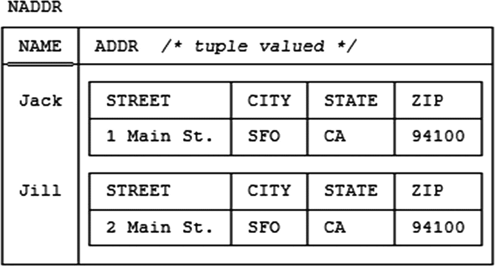

图 17-1

关系变量 `NADDR`（属性 `ADDR` 为元组值）─示例值

现在，为了示例的缘故，假设（如我们在练习 6.2 中所做的那样），每当两个 `ADDR` 值具有相同的 `ZIP` 分量时，它们也具有相同的 `CITY` 和 `STATE` 分量。那么，上述设计显然涉及一些冗余。然而，这里并没有违反规范化。特别是，函数依赖

```
{ ZIP } → { CITY , STATE }
```

*不*成立。（为什么不？*答案*：因为 FD 被定义为在属性之间成立，而不是在属性的分量之间成立。）

话虽如此，让我现在指出，上述 FD 在用以下表达式的结果替换 `NADDR` 后是成立的：

```
NADDR UNWRAP ( ADDR )
```

**`Tutorial D`** 的 `UNWRAP` 操作符有效地将某个元组值属性替换为一组属性，每个分量一个；因此，上述表达式返回一个具有属性 `NAME`、`STREET`、`CITY`、`STATE` 和 `ZIP` 的结果。当然，该结果仍然只有 2NF，甚至不是 BCNF，并且它仍然存在冗余。

我们可能忍不住从这个例子得出结论，解包 TVA 是个好主意。但是，这是否足以被确立为良好设计的*原则*，而不仅仅是一个建议或经验法则？^(²²⁸)

### 示例 2

Codd 可能会以属性 `ADDR` 的值不是“原子的”为由反对示例 1 的设计（尽管我不清楚他是否曾在其任何著作中明确处理过元组值属性本身的问题）。现在，我自己并不同意这个立场，原因在本书第 4 章及其他地方有详细解释——但这个点不值得争论，因为我们显然可以用 `CHAR` 类型的属性替换该元组值属性，如图 17-2 所示。而 Codd 肯定会允许这种修改后的设计，然而它同样遭受着与示例 1 中类似的冗余。

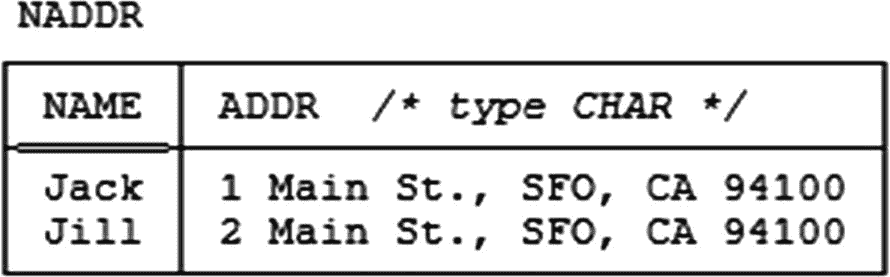

图 17-2

修改后的关系变量 `NADDR`（属性 `ADDR` 为文本值）─示例值

如果你不喜欢这个例子，可以考虑如果属性 `ADDR` 是某种用户定义类型（比如 `ADDRESS`）而不是 `CHAR` 类型，可能会发生什么。

#### 示例 3

与示例 2 中类似的冗余可能出现在 `DATE` 类型的属性中，如果这些属性包含——它们经常如此——星期几和日历日期（例如，“Friday, January 18th, 2019”）。


#### 示例 4

我的下一个例子是常见的员工与程序员数据库的一个极简版本，其中所有程序员都是员工，但有些员工不是程序员（如第 5 章练习 5.7 所述）。我顺便提一下，有些人会说本例中的员工和程序员分别对应*实体超类型*和*实体 subtype*。^(²²⁹) 尽管如此，传统的设计如下：

```
EMP  { ENO }
KEY { ENO }
PGMR { ENO , LANG }
KEY { ENO }
```

为简单起见，我假设：

1.  员工总体上除了 `ENO` 之外没有其他关注的属性（因为即使有，也不会实质性影响情况）。
2.  程序员只有一个额外属性，`LANG`（编程语言技能——例如，“Java”、“SQL”或 `Tutorial D`）。

现在我们面临一个选择：在 `EMP` 中记录所有员工，还是只在 `EMP` 中记录非程序员？哪种更好？嗯，如果只在 `EMP` 中记录非程序员，那么当员工成为或不再是程序员时，涉及的处理就稍微有点复杂（在这两种情况下，我们都必须从一个关系变量中删除一个元组，并向另一个关系变量中插入一个元组）。我们还需要声明并强制执行以下约束：

```
CONSTRAINT ... IS_EMPTY ( JOIN { EMP , PGMR } ) ;
```

还要注意，如果我们希望其他某个关系变量包含对员工的引用，其隐含意义；通常这样的引用会是一个简单的外键，但如果员工如上所述被拆分到两个关系变量中，这就无法实现（至少，不能按常规理解的外键来实现）。^(²³⁰)

这类考量的结果是，这种特定设计可能不被推荐——相反，我们可能希望在 `EMP` 中记录所有员工。^(²³¹) 然而，无论哪种方式，该示例都没有显示冗余。^(²³²)

#### 示例 5

现在我想稍微修改一下示例 4，以说明另一个要点。假设关系变量 `EMP` 确实包含至少一个额外属性 `JOB`；再假设一个给定的员工是程序员，并在关系变量 `PGMR` 中表示，当且仅当该员工在 `EMP` 中的元组的 `JOB` 值为 `Programmer`（也许 `JOB` 的其他值——例如 `Janitor`——以类似方式对应其他关系变量）。顺便说一句，这类情况在实践中并不少见。现在肯定存在一些冗余，因为某个给定员工 `e` 是程序员这一事实被表示了两次——一次通过 `PGMR` 中存在 `e` 的元组这一事实，另一次通过 `e` 在 `EMP` 中的元组的 `JOB` 值为 `Programmer` 这一事实。实际上，该设计受以下相等性依赖（可能还有许多类似的）约束：

```
CONSTRAINT ...
PGMR { ENO } = ( EMP WHERE JOB = 'Programmer' ) { ENO } ;
```

然而请注意，本例中没有违反正交性，即使考虑到所有员工（包括程序员）都在 `EMP` 中表示，`PGMR` 在 `{ENO}` 上的投影确实等于 `EMP` 在 `{ENO}` 上的投影的某个子集——但它本身并不是一种限制。^(²³³) 但这两个投影都不对应于相关关系变量中成立的任何不可约 JD 的组成部分。^(²³⁴) （如果需要刷新对此的记忆，请查阅第 16 章中*正交设计原则*的最终版本。）因此，一个数据库可以是完全正交的，但仍然表现出一些冗余。

#### 示例 6

在他 1979 年的论文“扩展数据库关系模型以捕获更多意义”（*ACM Transactions on Database Systems 4*, No. 4, December 1979）中，Codd 提出了一种特定的设计规范，稍微简化一下，可以描述如下：

*   设 *E* 为一个“实体类型”，*ID* 为一个数据类型，使得类型为 *E* 的每个实体都有一个且仅有一个*主标识符*（我的术语，不是 Codd 的），类型为 *ID*。例如，*E* 和 *ID* 可能分别是实体类型“供应商”和数据类型“字符串”。
*   设 *P1*, ..., *Pn* 为一组“属性类型”，使得类型为 *E* 的每个实体对于每个类型 *P1*, ..., *Pn* 至多有一个属性。例如，对于供应商，*P1*, *P2* 和 *P3* 可能是属性类型“名称”、“状态”和“城市”（所以在本例中 *n* = 3）。
    *注意：* 为了当前的讨论（仅），我假设一个给定的供应商可以拥有这三个属性的任何子集，特别是空子集。
*   相应地，对于每个实体类型 *E*，数据库应包含：
    1.  一个且仅一个 *E-关系变量* ，包含在某个时间存在的类型为 *E* 的那些实体的 *ID* 值，以及
    2.  对于每个 *Pi* (*i* = 1, ..., *n*)，一个且仅一个 *P-关系变量*，包含对于在某个时间存在且当时具有类型为 *Pi* 的属性的类型为 *E* 的每个实体的 {*ID* 值, *Pi* 值} 对。

我将这种规范称为 *RM/T 规范* ，因为它是 Codd 在那篇 1979 年论文中称为“扩展关系模型 RM/T”（T 代表塔斯马尼亚，Codd 在那里首次提出了他关于该扩展模型的想法）的一部分。将该规范具体应用于供应商案例，我们得到一个如下所示的设计（为简单起见，我在此忽略本书大部分内容中假设在关系变量 `S` 中成立的函数依赖 `{CITY} -> {STATUS}`）：

```
S  { SNO }
KEY { SNO } ;
SN { SNO , SNAME }
KEY { SNO }
FOREIGN KEY { SNO } REFERENCES S ;
ST { SNO , STATUS }
KEY { SNO }
FOREIGN KEY { SNO } REFERENCES S ;
SC { SNO , CITY }
KEY { SNO }
FOREIGN KEY { SNO } REFERENCES S ;
```

这些关系变量中的每一个都处于 6NF。^(²³⁵) 图 17-3 显示了一组示例值。*注意：* 所示值并非旨在与我们常用的示例值完全对应，但很接近。请特别注意：(a) 供应商 S3 没有状态，(b) 供应商 S4 没有状态也没有城市，以及 (c) 供应商 S5 没有名称、没有状态也没有城市。

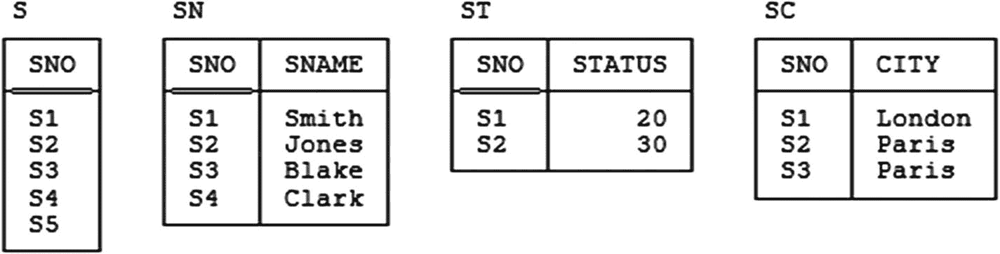

图 17-3

供应商的 RM/T 设计——示例值

事实上，这类设计确实有很多可取之处（至少，在拥有架构良好的 DBMS 的情况下会是这样）。然而，就当前目的而言，我只想提请各位注意以下一点：只要类型为 *E* 的每个实体至少拥有 *n* 个属性中的一个，那么这样的设计就肯定涉及一些冗余——事实上，可以说，是 Codd 本人在其 1970 年论文中定义的*强*冗余——因为在任何给定时间，E-关系变量的值将等于 P-关系变量在标识符属性上的投影的并集。例如，对于供应商，会有一个约束（当然，是一个 EQD）如下：

```
CONSTRAINT ... S { SNO } = UNION { SN { SNO } ,
ST { SNO } ,
SC { SNO } } ;
```

*注意：* 这个特定的冗余不适用于图 17-3——即，给定该图中显示的值，该约束不成立——因为有一个供应商（供应商 S5）没有名称、状态和城市这三个属性中的任何一个。


现在请注意，前述设计在（常见的？）特定情况下会变得“更加冗余”，即当类型为 `E` 的每个实体实际上都拥有全部 `n` 个属性时。图 17-4 是图 17-3 的修订版本，说明了这种情况：

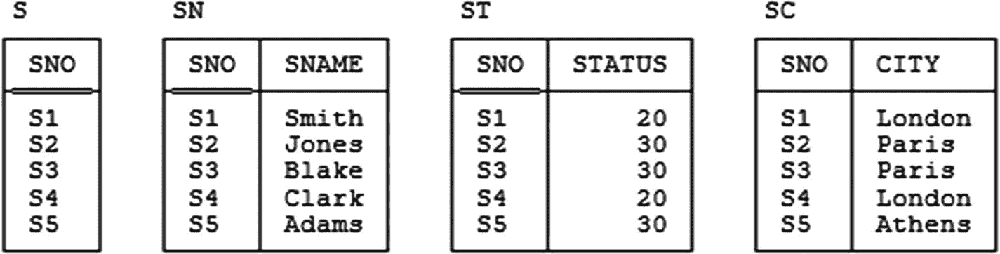

#### 图 17-4
图 17-3 的修订版本

现在观察——说得宽松一点——`{SNO}` 在每个关系变量中都成了一个外键，引用着其他关系变量中唯一的键 `{SNO}`；等价地说，任何一个关系变量在 `{SNO}` 上的投影都等于其他任何一个关系变量在 `{SNO}` 上的投影。嗯……为了更精确地表述这一点，四个关系变量之间存在着一个相等性依赖，关联着每一对关系变量：

```
CONSTRAINT ...
IDENTICAL { S { SNO } , SN { SNO } , ST { SNO } , SC { SNO } } ;
```

`IDENTICAL` 是由休·达文（Hugh Darwen）和我在我们的著作 *Database Explorations: Essays on The Third Manifesto and Related Topics* (Trafford, 2010) 及其他地方提出的一个操作符，作为 `Tutorial D` 的补充。你可以将它看作一种 `n-`元的“=”操作符。其语义如下：表达式

`IDENTICAL { rx1 , ... , rxn }`

如果表达式 `rx1`, ..., `rxn` 所分别表示的 `r1`, ..., `rn` 这些关系全都相等，则返回 TRUE；否则返回 FALSE。

然而，即使在图 17-4 所示的极端情况下，该设计也没有违反正交性。此外，我再次说明，如果在一个架构良好的 DBMS 中，这类设计将有很多可取之处。特别是，在这样的系统中，相等性依赖以及由此产生的冗余将被“自动”管理和维护（参见后面的“管理冗余”章节）。

#### 示例 7

考虑一家公司，其中要求每位员工必须恰好属于一个部门，并且要求每个部门至少有一名员工。图 17-5 展示了针对这种情况的 RM/T 设计的示例值（概要形式）：

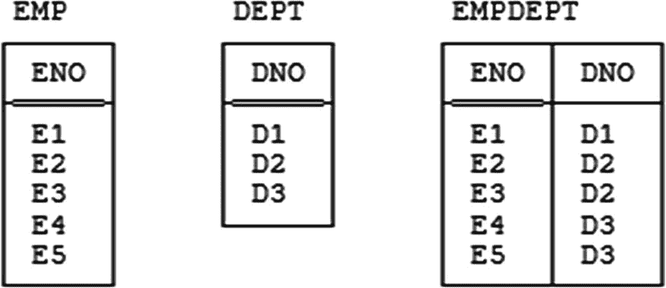

#### 图 17-5
员工与部门─示例值

顺便问一下，你认为这里的关系变量 `EMPDEPT` 是员工的 P-关系变量，还是部门的，还是两者的？请说明你的理由！（事实上，再深入探讨一下，RM/T 设计在这个例子中可能不是最佳选择，因为 `EMP` 和 `EMPDEPT` 之间必然存在一一对应关系，似乎没有理由不将这两个关系变量合并为一个。）

不管怎样，参考图中的示例值，我们看到正好有五名员工和三个部门。既然每位员工必须恰好属于一个部门，而每个部门必须至少有一名员工，那么为什么不定义一个部门——比如说 `D3`——为“默认”部门，并采用一条规则：任何在 `EMP` 中提到但未出现在 `EMPDEPT` 中的员工都属于该默认部门？根据图 17-4，这条规则将允许我们从 `EMPDEPT` 中省略元组 `(E4,D3)` 和 `(E5,D3)`。请注意，如果我们不采用这样的规则，那么该设计显然又涉及了一些冗余——具体来说，它受制于以下相等性依赖：

```
CONSTRAINT EVERY_EMP_HAS_A_DEPT EMP { ENO } = EMPDEPT { ENO } ;
CONSTRAINT EVERY_DEPT_HAS_AN_EMP DEPT { DNO } = EMPDEPT { DNO } ;
```

然而，在我看来，至少有两个因素不利于采用这种“默认部门”设计。首先，选择哪个部门作为默认部门可能是任意的。其次，现在我们需要对关系变量 `EMPDEPT` 的含义格外小心！显而易见的谓词 *员工 `ENO` 属于部门 `DNO`* 行不通了。为什么不行？因为，在该谓词下（并假设部门 `D3` 是默认部门），省略元组 `(E5,D3)`，比如说，将意味着——由于 **`封闭世界假设`**——员工 `E5` **不属于** 部门 `D3`！因此，谓词必须是如下形式：

*   *员工 `ENO` 属于部门 `DNO`（该部门不是默认部门编号 `D3`）。*

现在，这个谓词确实有效（我认为！），但它相当棘手。假设元组 `(E1,D1)` 出现在关系变量中，如图 17-5 所示。那么相应的命题是：

*   *员工 `E1` 属于部门 `D1`（该部门不是默认部门编号 `D3`）。*

当然，这个命题评估为真。目前还好。然而，现在假设关系变量中没有员工 `E5` 的元组。预期的解释当然是员工 `E5` 属于部门 `D3`；但 **`封闭世界假设`** 实际上是怎么说的呢？首先，注意，例如，特定的元组 `(E5,D1)` 并没有出现。那么，根据 **`封闭世界假设`**，以下必须是一个真命题：

*   **`并非`** *员工 `E5` 属于部门 `D1`（该部门不是默认部门编号 `D3`）。*

或者稍微更正式一点：

```
NOT ( E5 属于 D1 AND D1 ≠ D3 )
```

根据德摩根定律，这个表达式等价于：

```
E5 不属于 D1 OR D1 = D3
```

由于 `D1 = D3` 为假，该表达式简化为“`E5` 不属于 `D1`”，这正是我们想要的（我的意思是，这是一个真命题）。

类似的分析表明，我们可以推断 `E5` 肯定不属于任何非默认部门 `D3` 的部门。但那个默认部门呢？嗯，元组 `(E5,D3)` 没有出现，因此以下必须是一个真命题：

```
NOT ( E5 属于 D3 AND D3 ≠ D3 )
```

等价于：

```
E5 不属于 D3 OR D3 = D3
```

由于 `D3 = D3` 为真，该表达式简化为真（TRUE）。然而，请注意，这个命题为真并不能告诉我们 `E5` **属于** `D3`！现在，也许我们可以推断出后一个事实，给定 `E5` 确实存在并且肯定不属于任何不等于 `D3` 的部门（？）。但我严重怀疑用户在实践中是否愿意处理如此迂回、抠逻辑细节的论证。

#### 示例 8

考虑图 17-6 所示的设计（这是前一章图 16-4 的一个略微修订、有些类 RM/T 的版本）：

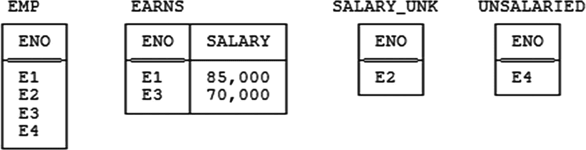

#### 图 17-6
员工与薪资的 RM/T 设计─示例值

这些关系变量的谓词如下：

*   `EMP`: *员工 `ENO` 受雇于公司。*
*   `EARNS`: *员工 `ENO` 拥有薪资 `SALARY`。*
*   `SALARY_UNK`: *员工 `ENO` 拥有薪资，但我们不知道具体是多少。*
*   `UNSALARIED`: *员工 `ENO` 没有薪资。*

现在请注意，关系变量 `SALARY_UNK` 或 `UNSALARIED` 中有一个是冗余的——任何在关系变量 `EMP` 中表示但未在 `EARNS` 中表示的员工，必须恰好在另外两个关系变量中的一个中表示；因此，我们可以丢弃，比如关系变量 `SALARY_UNK`，而不会造成任何信息丢失。^(²³⁶) 然而，似乎没有任何充分的理由在 `SALARY_UNK` 和 `UNSALARIED` 中选择一个丢弃，而对称性的考虑会主张保留两者，并忍受这种冗余（？）。

对称性通常是另一个良好的设计原则。引用波利亚（Polya）的话：^(²³⁷) “尝试对称地处理对称的事物，不要肆意破坏任何自然的对称性。”但示例 8 以及类似的例子——也许也包括示例 7——表明，对称性和无冗余有时可能是相互冲突的目标。


### 示例 9

此示例源自 Hugh Darwen。它基于英国开放大学（Open University）相关的一个真实情境。我们有一个关系变量，如下所示：

```
SCT { SNO , CNO , TNO }
KEY { SNO , CNO , TNO }
```

其谓词是：*学生 `SNO` 注册了课程 `CNO`，并且在该课程上由导师 `TNO` 辅导*（或者更简洁地说，*导师 `TNO` 在课程 `CNO` 上辅导学生 `SNO`*）。图 17-7 展示了这个关系变量的一个示例值。冗余是显而易见的：例如，“学生 S1 注册了课程 C1”、“课程 C1 由导师 T1 辅导”以及“导师 T1 辅导学生 S1”这些事实，在图中所示的示例值中都重复表示了多次。^(²³⁸)

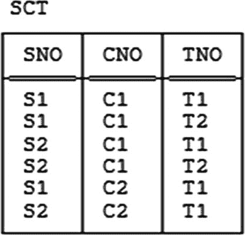

图 17-7

关系变量 `SCT` — 示例值

现在，对于此类例子，我们可能考虑的一种减少冗余的策略是使用代理键（简称代理）。^(²³⁹) 例如，我们可以引入一个属性 `XNO`，其值作为 (`SNO`,`CNO`) 对的代理，如图 17-8 所示。（从图中观察可知，我已将 {`XNO`} 设为关系变量 `XSC` 的主键。当然，组合 {`SNO`,`CNO`} 也是一个键。）

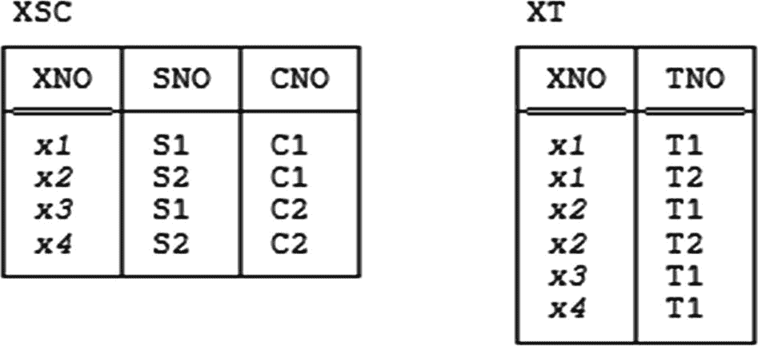

图 17-8

*为 {`SNO`,`CNO`} 组合使用代理*

这种方法的一个困难点如下：我们基于什么决定为 {`SNO`,`CNO`} 组合使用代理，而不为 {`CNO`,`TNO`} 组合或 {`TNO`,`SNO`} 组合使用代理？无论我们作何选择，都是不对称的。此外，代理本身也并非没有问题。以下是一些问题：^(²⁴⁰)

*   代理可能使更新变得更复杂（本质上，用户必须进行自己的外键检查）。
*   更糟糕的是，系统的外键检查——几乎肯定仍需执行——(a) 永远不会失败，并且 (b) 因此将成为纯粹的开销。
*   查询和更新语句变得更长、编写更繁琐、更容易出错、更难调试和维护。
*   需要更多的完整性约束。

然而，就当前目的而言，真正的问题是：引入代理是否真的有助于减少冗余？我不想在此尝试回答这个问题；我将在后面的章节“精炼定义”中再回到这个问题。

### 示例 10

对于类似图 17-7 的例子，我们可以考虑的另一种减少冗余的策略是引入一些关系值属性（RVA）。图 17-9 给出了一个例子。

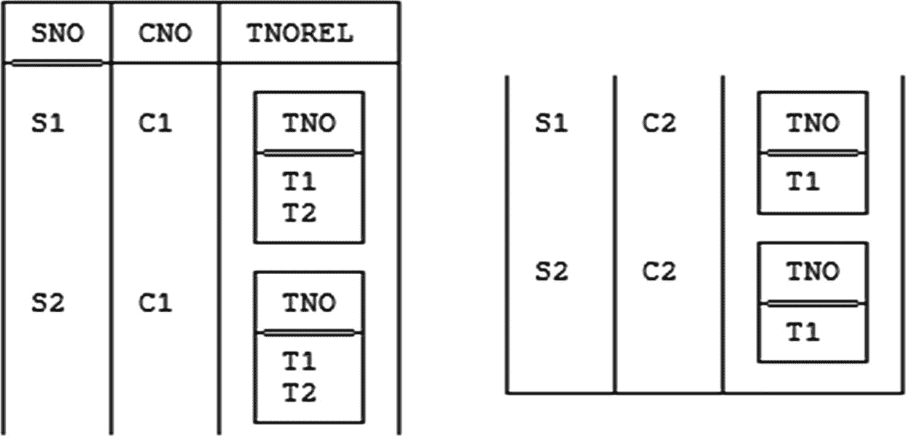

图 17-9

为导师使用 RVA

这种方法一个显而易见的问题——当然，完全撇开使用 RVA 通常伴随的所有常见问题不谈，正如第 4 章所述——再次是不对称性：我们基于什么决定为导师使用 RVA，而不为学生或课程使用？无论如何，这种策略是否真的减少了冗余？我同样将在后面的章节“精炼定义”中回到这个问题。

### 示例 11

这个例子只是一个占位符。在我们合著的《时间与关系理论：关系模型和 SQL 中的时态数据库》（*Time and Relational Theory: Temporal Databases in the Relational Model and SQL*，Morgan Kaufmann，2014）一书中，Hugh Darwen、Nikos Lorentzos 和我展示了与时态数据相关时可能出现的某些“新”类型的冗余，并提出了许多处理它们的新设计原则和技术。^(²⁴¹)

### 示例 12

我的最后一个例子是一种常见实际情况的典型代表。它大致基于 Fabian Pascal 所著《数据库管理实践问题：思考型实践者参考手册》（*Practical Issues in Database Management: A Reference for the Thinking Practitioner*，Addison-Wesley，2000）中的一个例子。我们有两个关系变量，如下所示（并且我假设在进一步通知之前，它们具体是基本关系变量）：

```
PAYMENTS { CUSTNO , DATE , AMOUNT }
KEY { CUSTNO , DATE }
TOTALS { CUSTNO , TOTAL }
KEY { CUSTNO }
```

关系变量 `TOTALS` 中的属性 `TOTAL` 是通常称为*派生数据*的一个例子；对于任何给定客户，其值是通过对相关客户的付款金额求和得出的。事实上，以下相等依赖成立^(²⁴²)（请注意，这次我为约束起了个名字，即 `C12`，因为我稍后需要引用它）：

```
CONSTRAINT C12 TOTALS = SUMMARIZE PAYMENTS BY { CUSTNO } :
{ TOTAL := SUM ( AMOUNT ) } ;
```

*注意：* `SUMMARIZE` 是 `Tutorial D` 中类似于 SQL 带 `GROUP BY` 的 `SELECT` 的操作（*非常*宽松地说！）。^(²⁴³) 不过，如果你对 SQL 比 `Tutorial D` 更熟悉，让我也给出前面语句的 SQL 版本：

```
CREATE ASSERTION C12 CHECK
( NOT EXISTS
( SELECT *
FROM   TOTALS
WHERE  NOT EXISTS
( SELECT *
FROM ( SELECT CUSTNO , SUM ( AMT ) AS TOTAL
FROM   PAYMENTS
GROUP  BY CUSTNO ) AS TEMP1
WHERE  TOTALS.CUSTNO = TEMP1.CUSTNO ) )
AND
NOT EXISTS
( SELECT *
FROM ( SELECT CUSTNO , SUM ( AMT ) AS TOTAL
FROM   PAYMENTS
GROUP  BY CUSTNO ) AS TEMP2
WHERE  NOT EXISTS
( SELECT *
FROM   TOTALS
WHERE  TOTALS.CUSTNO = TEMP2.CUSTNO ) ) ) ;
```

现在，派生数据根据定义就是冗余的——尽管该例子中再次没有违反规范化或正交性（特别是，关系变量 `PAYMENTS` 和 `TOTALS` 都属于 6NF）。我将在紧接的下一节中更详细地分析这个例子。

### 管理冗余

上一节中的示例 12 设计是冗余的，这一点由指定的相等依赖（约束 `C12`）成立所清楚表明。处理该示例所展示的这种冗余，至少在原则上，有四种基本方法：

1.  仅采用原始设计
2.  声明约束
3.  使用视图
4.  使用快照

让我们仔细看看。

#### 1. 仅采用原始设计

鉴于当今大多数 DBMS 提供的功能有限，这也许是实践中可能最常遇到的方法。其思路很简单：

1.  关系变量 `PAYMENTS` 和 `TOTALS` 按照上一节所示准确定义。
2.  约束 `C12` *不* 声明给 DBMS。
3.  维护派生数据 100% 是用户的责任。（或者，至少是某些用户的责任；维护可以通过触发过程来完成，但仍然需要某个用户来编写该过程的代码。）^(²⁴⁴)

实际上，这种方法权衡了 (a) 用户（或至少是某些用户）在执行某些更新时所涉及的额外工作（以及相关的性能影响）与 (b) 执行某些查询时获得的更好性能。但这没有保证；如果用户在某个更新过程中犯了错误，导致（实质上）违反了约束 `C12`，那么，就麻烦了。

#### 2. 声明约束

在这种方法中，约束 `C12` 被显式声明给 DBMS，DBMS 负责强制执行它。然而，维护派生数据仍然是用户的责任，与上一种方法完全一样。更重要的是，如果用户可靠且正确地执行了这项任务，约束检查将永远不会失败，因此，它实际上构成对用户更新的纯粹开销。但我们不能省略这个约束，恰恰是因为我们需要系统来检查用户*是否*可靠且正确地执行了维护任务。


#### 3. 使用视图

显然，如果我们可以不仅仅是声明约束，而是能够实际告知系统派生数据所依据的规则，并让系统自动执行派生过程，那会更好。而我们确实可以做到；这正是视图机制的作用。具体来说，我们可以用一个同名的视图（或“虚拟关系变量”）来替换基础关系变量 `TOTALS`，如下所示：

```
VAR TOTALS VIRTUAL
( SUMMARIZE PAYMENTS BY { CUSTNO } :
{ TOTAL := SUM ( AMOUNT ) } ) ;
```

现在用户不再需要担心维护派生数据；此外，约束 C12 现在已不可能被违反，甚至也不再需要声明它了，除非可能是非正式地（例如，作为告知用户视图语义的一种方式）。然而，请注意，必须明确告知用户不要试图去维护总计数据！这个事实并不意味着必须告知用户关系变量 `TOTALS` 是一个视图；它只是意味着用户必须被告知，维护任务实际上将由系统执行，用户不应干预。

#### 4. 使用快照

然而，视图解决方案的缺点在于，每次引用视图时都会执行派生过程（即使自上次引用以来没有进行任何更新）。因此，如果整个操作的目标是在更新时执行派生工作以提升后续查询性能，那么视图方案显然就不够用了。在这种情况下，我们应该使用快照来代替视图：

```
VAR TOTALS SNAPSHOT ... /* 假设语法 */
( SUMMARIZE PAYMENTS BY { CUSTNO } :
{ TOTAL := SUM ( AMOUNT ) } )
REFRESH ON EVERY UPDATE ;
```

快照概念起源于 Adiba 的一篇论文^(²⁴⁵)。基本上，快照和视图一样，都是派生关系变量；然而，与视图不同，它们是真实的，而非虚拟的——也就是说，它们不仅由其关于其他关系变量的定义来表示，而且（至少在概念上）还由其自身独立物化的数据副本表示。换句话说，定义快照很像执行查询，除了：

1.  查询的结果以指定名称（在示例中是 `TOTALS`）作为 *只读关系变量* 保存在数据库中（只读，即除了定期刷新外——参见下面的点 b）。

2.  定期（在示例中是 `ON EVERY UPDATE`）对快照进行 *刷新*——即丢弃其当前值，再次执行查询，该新执行的结果成为新的快照值。

    `REFRESH` 子句的一般形式是

```
REFRESH [ ON ] EVERY <now and then>
```

其中 `<now and then>` 可能是，例如，`MONTH` 或 `WEEK` 或 `DAY` 或 `HOUR` 或 `n MINUTES` 或 `MONDAY` 或 `WEEKDAY`（等等）。具体来说，`REFRESH ON EVERY UPDATE` 规范意味着快照与从中派生它的一个或多个关系变量保持永久同步——这大概正是我们在例 12 中想要的。

到目前为止，在本节中，我集中讨论了例 12 以及该例所展示的那种特定的“派生数据”。然而，事实是 *所有* 形式的冗余都可以被视为派生数据——如果 *x* 是冗余的，那么根据定义，*x* 可以从数据库中的其他东西派生出来。（将 *派生数据* 一词的使用局限于例 12 所说明的那种情况，因此是误导性的，不推荐。）由此可见，上述分析——特别是那四种不同的方法——可以推广到适用于所有类型的冗余，至少在原则上如此。请特别注意，其中第三种和第四种方法，分别使用视图和快照，都构成了有时称为 *受控* 冗余的例子。如果冗余确实存在（并且用户知晓它），但确保它永远不会导致任何不一致的“传播更新”任务是由系统而非用户管理的，则称该冗余是受控的。不受控的冗余可能是个问题，但受控的冗余不应该成为问题。事实上，我想更进一步——我想说，虽然可能无法完全消除冗余，甚至可能也不希望完全消除，但任何未被消除的冗余至少应该是受控的。特别是，我们需要对快照的支持^(²⁴⁶)。


### 精炼定义

> 注意：我刻意将这个篇幅稍长的章节几乎留到了本章最后。

考虑发货关系变量 `SP`，其谓词为*供应商 `SNO` 以数量 `QTY` 供应零件 `PNO`*。再考虑图 1-1（见第 1 章）中所示作为该关系变量值的那个关系。观察以下几点：

1.  该关系中的两个元组是 (`S1`,`P5`,`100`) 和 (`S1`,`S6`,`100`)。
2.  这两个元组都包含 (`S1`,`100`) 作为一个子元组。

这两个子元组出现的含义是什么？在 (`S1`,`P5`,`100`) 中的出现意味着（我为此命题编号——注意它确实是一个命题——以便将来引用）：

1.  *供应商 `S1` 以数量 `100` 供应某些零件。*

而在 (`S1`,`P6`,`100`) 中的出现含义完全相同！那么，我们这里是否面临数据库包含某个（子）元组的两个不同出现，却代表完全相同命题的情况？换句话说，根据我在本章引言中给出的定义，数据库是否包含某种冗余？

在我尝试回答这个问题之前，我想给出一个更简单的说明来阐述同一点。再次参考图 1-1，考虑图中所示供应商 `S1` 的六个发货 (`SP`) 元组。显然，这些元组都包含度数为一的子元组 (`S1`)。而这六个子元组的出现都意味着同一件事：

2.  *供应商 `S1` 以某个数量供应某些零件。*

我们甚至可以进一步推进这个论证，考虑*每个* `SP` 元组——实际上，无论其具有什么属性，每个可能的元组——总是将 0-元组作为一个子元组。因此，在图 1-1 的发货关系中，该子元组有十二个“出现”（如果你明白我的意思！），它们都代表以下命题：

3.  *某个供应商以某个数量供应某些零件。*

那么，我们这里是否存在冗余？注意，命题 1-3 都涉及某种*存在量化*。以下是这些命题稍微更正式的版本，其中该量化被明确并突出显示：

1.  ***存在某个零件 `PNO` 使得*** *供应商 `S1` 以数量 `100` 供应零件 `PNO`。*
2.  ***存在某个零件 `PNO` 使得存在某个数量 `QTY`*** *使得供应商 `S1` 以数量 `QTY` 供应零件 `PNO`。*
3.  ***存在某个供应商 `SNO` 使得存在某个零件 `PNO` 使得存在某个数量 `QTY`*** *使得供应商 `SNO` 以数量 `QTY` 供应零件 `PNO`。*

在这些命题中，第三个中的 `SNO`、第二个和第三个中的 `QTY`，以及所有三个中的 `PNO` 不是参数——当然不是，因为命题从不包含参数！——而是逻辑学家所称的*绑定变量*，因为它们都被短语*存在某个……使得*“存在量化”。^(²⁴⁷) *注意：* 如果你不熟悉这些概念（即绑定变量和存在量化），可以在*《SQL 与关系理论》* 中找到教程式的处理。不过，我认为即使你事先对此类问题一无所知，当前的讨论也应易于理解。

与上述情况相反，底层关系变量 `SP` 中的元组所代表的命题不涉及任何存在量词。这是因为它们都只是关系变量谓词的实例化（即，它们都是通过为该谓词的参数替换参数而获得的），而该谓词本身（如下所示）也不涉及此类量词：

*   *供应商 `SNO` 以数量 `QTY` 供应零件 `PNO`。*

总结到目前为止的内容，似乎适用以下观察结果：

1.  所谓的*给定*命题——由给定关系变量中的元组表示的命题——是无量词的。

    > 说这类“给定命题”总是无量词的可能不完全正确；例如，考虑一个具有属性 `WEIGHT` 和 `HEIGHT` 以及谓词*某个人具有重量 `WEIGHT` 和身高 `HEIGHT`* 的关系变量。然而，我们可以通过一个称为*斯柯伦化*（以逻辑学家 T. A. Skolem 命名）的过程，有效地消除这种情况下的量词。在该例子中，该过程涉及将原始谓词替换为形式如*人 `p` 具有重量 `WEIGHT` 和身高 `HEIGHT`* 的谓词（其中 `p` 表示某个未知的人）。后一个谓词是无量词的。

2.  相比之下，*派生*命题——至少，对应于通过对给定关系变量中的元组进行投影所获得的元组的派生命题——确实涉及至少一个存在量词，可能还不止一个。

现在，我们当然不想认为我们通常的发货关系变量 `SP` 本质上是冗余的。因此，看起来我们可能想说的是类似于以下内容：

*   （*警告：暂定！*）如果同一个命题被表示了两次，但该命题是存在量化的，那么这种重复不计为冗余。

但是等等——供应商关系变量 `S` 及其函数依赖 `{CITY} → {STATUS}`（我现在想再次假设它成立）呢？一个与前述完全类似的论证似乎表明，例如，在图 1-1 所示的两个供应商元组中作为子元组出现的元组 (`London`,`20`)，代表了命题：

*   ***存在某个供应商 `SNO` 使得存在某个名称 `SNAME`*** *使得供应商 `SNO` 的名称为 `SNAME`，状态为 `20`，并且位于城市 `London`。*

显然，这个命题是存在量化的；然而它被表示了两次，而我们*确实*希望这种重复计为冗余。（我们知道，具有函数依赖 `{CITY} → {STATUS}` 的关系变量 `S` 不在 `BCNF` 中。）那么，这是怎么回事呢？

和常见的情况一样，我相信这个问题的答案可以通过更仔细地考察谓词来找到。首先，回顾第 14 章，一个谓词是*简单*的当且仅当它不涉及连接词，如果它由一组通过 `AND` 连接的其他谓词组成，则是*合取*的（为当前目的，我将假设那些其他谓词都是简单的）。^(²⁴⁸) 现在，关系变量 `SP` 的谓词*供应商 `SNO` 以数量 `QTY` 供应零件 `PNO`* 在前述意义上是简单的。相比之下，关系变量 `S` 的谓词是合取的——它可以分解为一组简单谓词。通过以下稍微生硬但实际上更符合逻辑的形式陈述该谓词，我可以使后一事实更显而易见：

*   *供应商 `SNO` 的名称为 `SNAME`* **且**
*   *供应商 `SNO` 位于城市 `CITY`* **且**
*   *城市 `CITY` 具有状态 `STATUS`。*

从这个版本的谓词，可以清楚地看出：

1.  关系变量 `S` 受到非平凡、不可约的 JD ☼{`SN`,`SC`,`CT`} 的约束，其中名称 `SN`、`SC` 和 `CT` 分别表示表头 {`SNO`,`SNAME`}、{`SNO`,`CITY`} 和 {`CITY`,`STATUS`}。（相比之下，在关系变量 `SP` 中成立的唯一 JD 是平凡的，并且 `SP` 处于 `6NF`。重复一遍，关系变量 `S` 甚至不在 `BCNF` 中。）
2.  因此，关系变量 `S` 可以根据该 JD 进行无损分解。相应投影的谓词如下：
    *   `SN`: *供应商 `SNO` 的名称为 `SNAME`。*
    *   `SC`: *供应商 `SNO` 位于城市 `CITY`。*
    *   `CT`: *城市 `CITY` 具有状态 `STATUS`。*

这些谓词不涉及存在量化，因此相应的命题也不涉及。^(²⁴⁹)


#### Relvar S 中的元组与冗余

Relvar S 确实包含对应于 SN、SC 和 CT 的子元组；然而，对应于 SN 和 SC 的子元组从不重复，因为 `{SNO}` 是一个键。相比之下，对应于 CT 的子元组至少是可能重复的（如我们从图 `1-1` 所知），并且这种重复确实构成了冗余。

在进行了上述所有动机性说明之后，我提出以下作为数据库表现出冗余的所谓“最终”定义：

1.  如果存在一个符合 *D* 的数据库值（即 *D* 中提及的关联变量的一组值）*DB*，使得
2.  在 *DB* 内存在某个特定的、表示 *p* 的元组或元组组合的出现（无论是显式还是隐式），并且
3.  在 *DB* 内存在另一个不同的、也表示 *p* 的元组或元组组合的出现（无论是显式还是隐式），那么
4.  *DB* 包含冗余，并且 *D* 允许冗余。

*   **定义（数据库中的冗余，“最终”详细版本）：** 令 *D* 为一个数据库设计，且令命题 *p* 既是简单的又是非量化的。那么：

当然，上述定义也可以更简洁地表述如下：

*   **定义（数据库中的冗余，“最终”简洁版本）：** 令 *D* 为一个数据库设计；令 *DB* 为一个符合 *D* 的数据库值（即 *D* 中提及的关联变量的一组值）；并令 *p* 为一个简单的非量化命题。如果 *DB* 包含 *p* 的两个或更多不同的表示（无论是隐式还是显式），则 *DB* 包含冗余，并且 *D* 允许冗余。

需要特别注意的是，根据此定义，即使数据库完全符合**正交设计原则**和所有规范化原则，它仍然可能表现出冗余。然而，请注意，该定义仍然说的是 *如果*——而非**当且仅当**——某个条件成立，**那么**就存在冗余；我很想将那个 *如果* 替换为**当且仅当**，但我目前还没有十足的把握。暂时还没有。

尽管如此，让我们考虑本章前面章节中的示例 1 到 12，看看上述定义对这些示例具体有何影响。*请仔细注意：* 在以下分析中，未加修饰的术语 *命题* 应理解为一个简单的、非存在量化的命题，除非上下文要求另有解释。（然而，为了强调，我经常仍然使用更明确的术语 *简单的非量化命题*。）

#### 示例 1 和 2
这两个示例都表现出冗余，因为简单的非量化命题 *旧金山，加利福尼亚州是邮政编码 94100 对应的城市* 被表示了两次。

#### 示例 3
假设两个不同的元组都包含 DATE 值 "Friday, January 18th, 2019"；那么数据库显然表现出冗余，因为简单的非量化命题 *2019 年 1 月 18 日是星期五* 被显式地表示了两次。事实上，即使该 DATE 值只出现一次，也存在冗余！原因在于，即使在那时，命题 *2019 年 1 月 18 日是星期五* 也是被显式和隐式地同时表示。显而易见；隐式表示是值的一部分，即星期几（示例中为星期五），可以从值的其余部分（示例中为 2019 年 1 月 18 日）计算出来这一事实的结果。^(²⁵⁰)

#### 示例 4
此示例中不存在冗余。

#### 示例 5
令员工 *e* 在关联变量 `EMP` 中表示，并且令 *e* 的 `JOB` 值为 "Programmer"（因此员工 *e* 也在关联变量 `PGMR` 中表示）。正如前面指出的，简单的非量化命题 *员工 e 是一名程序员* 显然（显式地！）以两种不同的方式表示。

#### 示例 6
对于不具备全部三个属性（即名称、状态和城市）的供应商 *s*，此示例本质上类似于示例 4，参见该示例。对于拥有全部三个属性的供应商 *s*，我们可以说该供应商的 `E`-关联变量元组是冗余的——**如果**我们接受该 `E`-关联变量的谓词形式为 *SNO 是供应商*，而 `P`-关联变量的谓词形式为 *SNO 是供应商* ***并且*** *...*（等等），这意味着被多次表示的非量化命题是 *S1 是供应商*、*S2 是供应商* 等等。也许有争议。你怎么看？

#### 示例 7
我之前说过，这里有很好的理由反对采用“默认部门”设计（也确实有）。但如果我们确实采用了该设计，那么我们可以说命题 *员工 E4 在部门 D3 中*（例如）被表示了两次：一次通过一个显式的元组，另一次通过**缺乏**一个对应于命题 *员工 E4 在部门 Dj 中*（对于任何不等于 D3 的部门 *Dj*）的元组。但这是一个相当牵强的论点！此外，（缺失的）命题 "*员工 E4 在某个不等于 D3 的部门 Dj 中*" 并不真正是非量化的——它是对如下内容的缩写：

*   ***不存在一个部门 Dj 使得*** *员工 E4 在部门 Dj 中且 Dj ≠ D3。*^(²⁵¹)

你怎么看？

#### 示例 8
命题 *员工 E4 是无薪的* 既被 `UNSALARIED` 中的一个元组显式表示，也被 `EARNS` 或 `SALARY_UNK` 中缺乏员工 E4 的元组隐式表示。（此示例与示例 6 和示例 7 都有相似之处。）


### 示例 9 和 10

在之前关于示例 9 的讨论中，我说了以下内容：

*   冗余……是显而易见的：例如，学生 `S1` 选修课程 `C1`、课程 `C1` 由导师 `T1` 辅导以及导师 `T1` 辅导学生 `S1` 这些事实，在图 17-7 所示的示例值中都被表示了不止一次。

我还说过，其谓词是 **导师 `TNO` 辅导学生 `SNO` 学习课程 `CNO`**。但如果冗余真如所述那样，事情就不会那么简单——相反，它必须是这样：

*   **学生 `SNO` 选修课程 `CNO`** **AND**

*   **课程 `CNO` 由导师 `TNO` 辅导** **AND**

*   **导师 `TNO` 辅导学生 `SNO`** **AND**

*   **导师 `TNO` 辅导学生 `SNO` 学习课程 `CNO`。**

因此，一个更完整的设计将涉及如下关系变量：

*   `S {SNO,...}`、`C {CNO,...}` 和 `T {TNO,...}`，分别表示学生、课程和教师；

*   `SC {SNO,CNO,...}`、`CT {CNO,TNO,...}` 和 `TS {TNO,SNO,...}`，分别显示哪些学生选修了哪些课程、哪些课程由哪些导师辅导以及哪些导师辅导了哪些学生；

*   `SCT {SNO,CNO,TNO}`，与示例原始版本中的一样。

现在请注意：

1.  关系变量 `SC` 等于 `S{SNO}` 和 `C{CNO}` 的连接（实际上是笛卡尔积）的某个子集，对于 `CT` 和 `TS` 也类似。

2.  更重要的是，关系变量 `SC` 也等于 `SCT` 在 `{SNO,CNO}` 上的投影（并且，再次说明，对于 `CT` 和 `TS` 也类似）。至少，`SC` 等于 `SCT` 在 `{SNO,CNO}` 上的投影，只要以下假设成立：**没有学生可以不经分配导师就选修一门课程**。（为了明确起见，我专注于 `SC`，但当然类似的评论也适用于 `CT` 和 `TS`。）但是：
    1.  如果该假设成立，那么 `SC` 可以被删除（对于 `CT` 和 `TS` 也类似）。

    2.  或者，如果该假设不成立，那么 `SC` **绝不能**被删除——仅由 `SCT` 组成的设计是无效的。^(²⁵²) （再次说明，类似的评论也适用于 `CT` 和 `TS`。）

3.  关系变量 `SCT` 也等于 `SC`、`CT` 和 `TS` 的连接的某个子集，而该连接又等于 `S{SNO}`、`C{CNO}` 和 `T{TNO}` 的连接（实际上是笛卡尔积）的某个子集。

现在，如果 `SC`、`CT` 和 `TS` 没有被删除，那么显然存在冗余。例如，给定图 17-7 中的样本值，简单无量化命题 **学生 `S1` 选修课程 `C1`** 由以下方式表示：(a) 关系变量 `SC` 中的一个显式元组，以及 (b) 作为以下（也是无量化但非简单）命题中的一个合取项，该命题由关系变量 `SCT` 中的一个显式元组表示：

*   **学生 `S1` 选修课程 `C1`** **AND**

*   **课程 `C1` 由导师 `T1` 辅导** **AND**

*   **导师 `T1` 辅导学生 `S1`** **AND**

*   **导师 `T1` 辅导学生 `S1` 学习课程 `C1`。**

然而，即使 `SC` 或 `CT` 或 `TS` 被删除，仍然存在冗余。例如，同一个命题 **学生 `S1` 选修课程 `C1`** 作为上述（复合）命题中的一个合取项 **和** 作为以下（也是复合）命题中的一个合取项被表示：

*   **学生 `S1` 选修课程 `C1`** **AND**

*   **课程 `C1` 由导师 `T2` 辅导** **AND**

*   **导师 `T2` 辅导学生 `S1`** **AND**

*   **导师 `T2` 辅导学生 `S1` 学习课程 `C1`。**

这两个复合命题都由 `SCT` 中的显式元组表示。因此，尽管我之前对此示例中冗余的描述可能有些误导，但我认为某种形式的冗余确实存在。更重要的是，如果你同意这个观点，我认为你也必须同意，使用代理（surrogate）（参见本章前面关于示例 9 的讨论）或者——也许更明显地——关系值属性（relational-valued attribute，RVA）（参见本章前面关于示例 10 的讨论）并不会产生本质区别！也就是说，使用代理和 RVA，通常仍然存在某些命题被表示多次的情况。换句话说，我认为此示例中的冗余是固有的。

现在，我承认我的这些主张可能有争议。但是，如果你不同意它们，那么我认为你需要非常仔细地证明你的立场；特别是，我认为你需要提出一个替代方案——实际上是一个改进方案——来替代我提出的“最终”冗余定义。

作为上述所有内容的一个附录，让我补充一点，我认为类似的分析也适用于本书前面的一些其他示例。例如，考虑来自第 9 章和第 12 章的关系变量 `CTXD`，其属性为 `CNO`、`TNO`、`XNO` 和 `DAYS`。当我最初引入该示例时，我说谓词是 **教师 `TNO` 在课程 `CNO` 上花费 `DAYS` 天使用教材 `XNO`**。但更准确的说法应该是：

*   **课程 `CNO` 可以由教师 `TNO` 教授** **AND**

*   **课程 `CNO` 使用教材 `XNO`** **AND**

*   **教师 `TNO` 在课程 `CNO` 上花费 `DAYS` 天使用教材 `XNO`。**

类似地，考虑来自第 9 章和第 10 章的关系变量 `SPJ`，其属性为 `SNO`、`PNO` 和 `JNO`。当我最初引入该示例时，我说谓词是 **供应商 `SNO` 向项目 `JNO` 供应零件 `PNO`**。然而，正如第 14 章所指出的，更准确的说法应该是：

*   **供应商 `SNO` 供应零件 `PNO`** **AND**

*   **零件 `PNO` 被供应给项目 `JNO`** **AND**

*   **项目 `JNO` 由供应商 `SNO` 供应** **AND**

*   **供应商 `SNO` 向项目 `JNO` 供应零件 `PNO`。**

### 示例 11

时序数据引发的一些问题已在第 14 章中讨论过。进一步讨论此类问题超出了本书的范围。

### 示例 12

令 *c* 为一个客户，并令客户 *c* 的付款总和为（例如）10,000 美元。那么，该命题本身——**客户 *c* 的付款总和是 10,000 美元**——由关系变量 `TOTALS` 中客户 *c* 的一个元组显式地表示，并隐含地由关系变量 `PAYMENTS` 中同一客户的一组元组表示。


### 结束语

我主张，如果一个数据库中包含同一个简单无量化命题的两种不同表示，那么它必然存在冗余。具体来说，如果同一个元组出现在两个不同的位置，并且这两个出现代表的是同一个命题，那么我们是不希望这种情况发生的。（显然，我们应该禁止重复命题本身；然而不幸的是，`DBMS` 并不理解命题本身。）但是，如果同一个元组出现在两个不同的位置，并且这两个出现*不*代表同一个命题，那么这种情况是允许的——而且无论如何，正如我们已经看到的，即使没有任何元组重复出现，我们也可能有冗余。

规范化（Normalization）和正交性（Orthogonality）似乎是目前我们用以科学解决冗余问题的全部手段。不幸的是，我们已经看到，规范化和正交性对于解决这个问题作用有限——它们肯定能减少冗余，但不能完全消除。具体来说，我们已经看到几个完全符合规范化和正交性原则的设计示例，但仍然表现出一些冗余，而且这些讨论远非详尽无遗。我们需要更多的科学！（现在我已经告诉过你至少三次了，而我告诉你三次的事情就是真的。）

鉴于上述情况，冗余似乎在大多数数据库中肯定会存在。如果确实如此，那么：

*   至少应该控制它，也就是说，`DBMS` 应该负责保证它永远不会导致不一致。

*   如果无法控制，那么至少应该声明适当的约束，并由系统强制执行，以确保（再次）它永远不会导致不一致。

*   如果无法控制，且约束无法由系统强制执行（或者甚至可能无法正式声明），那么你就只能靠自己了——如果你犯了任何错误，那就自求多福吧。

可悲的是，考虑到当今商业实现的现状，最后一种情况在实践中最有可能出现。

### 练习

1.  我在本章正文中声称，如果数据库 `DB` 包含（显式或隐式）某个简单无量化命题 `p` 的两个或更多不同表示，那么 `DB` 就包含一些冗余。你能想出一个数据库，它不包含任何此类命题的两个或更多表示，但你认为它仍然表现出一些冗余吗？

### 答案

1.  如果你对这个练习有一个好答案，请通过 `PO Box 1000, Healdsburg, CA 95448, USA`（仅限普通邮件）与我联系。

脚注
```
[1] [2] [3] [4] [5] [6] [7] [8] [9] [10] [11] [12] [13] [14] [15] [16] [17] [18] [19] [20] [21] [22] [23] [24] [25] [26] [27] [28] [29] [30] [31] [32] [33] [34]
```

## 第七部分 附录

## 究竟什么是数据库设计？

> *官方设计咄咄逼人地被阉割，*
> *是一个无眼电脑的清教徒作品。*
> ——约翰·贝杰曼：《最新的巴斯指南》（1974 年）

> *此附录的一个早期版本曾作为海莉·赫尔斯基亚霍（Heli Helskyaho）所著《Oracle SQL Developer Data Modeler for Database Design Mastery》（Oracle Press，2015 年）一书的前言发表，该前言的修订和大幅扩展版本随后出现在 O'Reilly 网站上（[`www.oreilly.com/data/free/what-is-database-design-anyway.csp`](http://www.oreilly.com/data/free/what-is-database-design-anyway.csp)）。但我觉得它作为对数据库设计主要内容的广泛概述，非常适合收录在本书中。不过，由于它的语气比本书大部分内容随意得多，我决定将其放入附录。感谢海莉、Oracle Press 和 O'Reilly 允许我以目前的形式在此重新发表这些材料。*

> *注意：以下内容与本书正文中的材料自然存在一些重叠，但我已尽力将这种重叠保持在最低限度。*

数据库位于我们在 IT 世界所做工作的核心，因此显然需要进行适当的设计。然而，设计理论——当然这里特指数据库设计理论——在业界似乎并未被广泛理解，设计最佳实践也是如此。你只需看看维基百科上关于数据库设计的条目，就能证实这些说法！事实上，在进一步讨论之前，我想引用一些该维基百科文章的引文（并附上我的评论）作为支持这些说法的证据。^(²⁵³^) 这是第一条：

*   **数据库设计**是为*数据库*生成详细*数据模型*的过程。这个*逻辑数据模型*包含了生成设计所需的所有逻辑和物理设计选择以及物理存储参数……

*评论：* 所以“逻辑数据模型”包含了“物理设计选择”和“物理存储参数”？显然，这里有人混淆了，我认为不是我。还要注意上述“定义”的循环性质（进行数据库设计显然包括生成进行数据库设计所需的东西）。维基百科文章实际上以这段摘录开头，这对接下来的内容可不是好兆头——但我想至少可以认为，我们已经得到了公平的警告。

*   术语数据库设计可用于描述整个*数据库系统*设计的许多不同部分。最主要，也是最正确地，它可以被认为是用于存储数据的基础数据结构的逻辑设计。在*关系模型*中，这些是*表*和*视图* [*原文为 "view"，单数*]。

*评论：* 我将在本附录后面论证，数据库设计*并非*“最主要和最正确”地关乎“基础数据结构的逻辑设计”（至少，不是完全如此），所以我暂时不对那个特定问题作进一步评论。我稍后也会对“表和视图”是“用于存储数据”的观点说点看法，因此在这一点上我也不再作进一步评论。但我想在这里对“表和视图”这个短语说点什么。


## 关于“表和视图”常见误解的讨论

遗憾的是，“表和视图”这个短语，或非常类似的表述，在数据库文献中随处可见。^(²⁵⁴) 尤其是，它出现在各种 SQL 书籍、SQL 期刊、SQL 产品文档等等之中（甚至在 SQL 标准本身中也短暂但不幸地出现过）。但显然，任何这样谈论的人都持有一种印象，即表和视图是不同的东西，并且很可能也认为“表”总是特指基表，还可能认为基表是物理存储的而视图不是（参见我对下一条引文的评论）。然而，关于视图的整个要点在于，它**就是**一张表——正如在数学中，例如两个集合并集的整个要点在于它就是一个集合。因此，在数学中我们可以对两个集合并集执行与常规集合相同的操作，因为并集**就是**一个常规集合。完全以同样的方式，在关系模型中，我们可以对视图执行与常规表相同的操作，因为视图**就是**一张“常规表”。所以，掉入认为术语`table`总是特指基表这个常见陷阱是非常重要的。掉入这个陷阱的人没有进行关系化思考，因此很可能会犯错——数据库设计中的错误、应用程序中的错误，甚至在某种程度上，SQL 语言本身设计中的错误。

再稍微延伸一下这个观点：事实上，可以认为 SQL 操作符`CREATE TABLE`和`CREATE VIEW`的名称本身至少是一个心理上的错误，因为它们倾向于强化两种观念：(a) 术语`table`特指基表；(b) 视图和表是不同的东西。

### 对“存储对象”观点的批评

> 一旦确定了各种信息片段之间的关系和依赖，就可以将数据安排成一个逻辑结构，然后将其映射到*数据库管理系统*支持的存储对象上。对于*关系数据库*，存储对象是*表*，它们以行和列的形式存储数据。

**评论：** 关系模型中的表——即使是基表——绝对**不是**“存储对象”！^(²⁵⁵) 关系模型有意地对物理存储的内容不做任何规定；事实上，它对物理存储问题完全不做规定。特别是，它并**没有**说基表是物理存储的而视图不是。唯一的要求是，无论物理存储什么，都必须在它和基表之间存在某种映射，以便在需要时能够获得那些基表（至少在概念上如此）。如果基表可以从物理存储中获得，那么其他一切也可以。例如，我们可能物理存储员工和部门基表的连接（join），而不是分别存储它们；那么，通过适当地投影（project）那个连接，就可以概念性地获得那些基表。

重申一下，关系模型对物理存储问题不做任何规定，当然，这种省略是故意的。其想法是给实现者以自由，让他们以任何他们选择的方式——特别是，任何可能产生良好性能的方式——来实现模型，同时不损害物理数据独立性。不幸的是，大多数 SQL 产品供应商似乎没有理解这一点（或者至少没有迎接这个挑战）；相反，他们确实将基表相当直接地映射到物理存储，因此他们的产品提供的物理数据独立性远低于关系系统所能或应该提供的水平。^(²⁵⁶) 但这种状况需要被如实认识：即，这是相关产品中的一个（重大）缺陷。它不是，也不应该被当作是，关系模型本身所固有的东西。

### 对“逻辑对象和关系”以及“链接”观点的批评

> 每个表可以代表一个逻辑对象的实现，或者是连接一个或多个逻辑对象实例的一个或多个实例的关系。表之间的关系然后可以存储为连接子表与父表的链接。由于复杂的逻辑关系本身是表，它们可能会链接到多个父表。

**评论：** 我对此有相当多的话要说！具体来说：

*   首先，作者在用词上确实相当随意。例如，一名员工或许可以被视为一个“逻辑对象”；但随后`employees`表将“代表一种实现”，不是那个“逻辑对象”本身的实现，而是企业中所有当前存在的此类“逻辑对象”（“实例”？）的集合。并且第一句中使用的术语“joining”是不恰当的（“associating”可能更好）。
*   其次，关于“逻辑对象或关系”这个短语：关系模型的一个非常强大的优势在于，它认识到一个人（或一个应用程序）眼中的“关系”，在另一个人看来可能是“逻辑对象”，反之亦然。换句话说，在关系模型中，“关系”**就是**“逻辑对象”，它们以与其他所有“逻辑对象”完全相同的方式表示——即，作为表中的行。
*   第三，由此可知，谈论“表之间的关系”被“存储为链接”是极其误导的；事实上，这是完全错误的。我的意思是，在关系模型中没有“链接”这种东西——只有表。
*   第四，（未解释的）“子表和父表”的术语是极不赞成使用的，原因我都不愿在此详述。
*   第五，什么是“复杂的逻辑关系”？更具体地说，什么样的关系不是“复杂的”，或者不是“逻辑的”？正如我曾在其他地方写过的，在关系这个尤其强调表达精确性（更不用说思维精确性）的领域，发现如此糟糕的草率措辞，真令人感到沮丧。

**注意：** 上述对这段引文的批评列表并不意味着是完整的。例如，正如最后一句所说，“复杂的逻辑关系是表”到底是什么意思？但我认为不需要对文本做进一步的解构了。我想我已经表明了我的观点。

### 对“物理设计包含数据类型”观点的批评

> 数据库的物理设计指定了数据库在存储介质上的物理配置。这包括……数据类型……和其他参数……的详细规范。

**评论：** 我很抱歉，但数据类型绝对是一个逻辑上的考虑，而不是物理上的！除非——这个想法刚刚闪过我的脑海，因为很难相信有人会如此深度地混乱——作者这里说的“数据类型”其实是指*表示*（representations）？（好吧，我想我不应该这么惊讶。事实上，我现在回想起来，在某些早期其他一些人士的著作中，类型与表示的混淆并非不为人知，其中还包括一些备受尊敬的名字……但那是过去的事了，我希望从那时起我们对这些问题的理解可能已经有所改进。）


## 逻辑设计与物理设计

维基百科就说到这儿吧；我认为我已经表明，抱怨整个行业似乎对设计理论和设计最佳实践理解不深是有道理的。因此，在本附录的剩余部分，我想尝试为这场讨论注入一些清晰度；更具体地说，我想试着澄清数据库设计究竟是什么，或者至少应该是什么。我将从一些定义开始。

*   **定义（数据库设计）：** 指逻辑数据库设计或物理数据库设计，具体取决于上下文——虽然未加限定的术语 `数据库设计`，或者有时简称为 `设计`，除非上下文另有要求，通常被理解为特指逻辑数据库设计。

*   **定义（逻辑数据库设计，或简称逻辑设计）：** 指决定某个数据库应包含哪些表、这些表应有哪些列、以及这些表和列应遵循哪些完整性约束的过程，或该过程的结果。

逻辑设计过程的目标是产生一个独立于所有与物理实现或具体应用相关考虑的设计（后一目标之所以可取，理由非常充分：在设计时通常无法知晓数据库的所有预期用途）。并且根据前述定义，整个过程可概括为：

1.  尽可能仔细地确定表谓词和其他业务规则，尽管必然有些非正式，然后
2.  将这些非正式的谓词和规则映射到正式定义的表、列和完整性约束——最好能以确保过程结果不涉及受控冗余的方式实现。

我将在本附录后面解释 `表谓词`、`业务规则` 和 `不受控冗余` 这些术语的含义。同时，这里还有一个定义：

*   **定义（物理数据库设计，或简称物理设计）：** 指给定某个逻辑设计后，决定该设计应如何映射到目标 DBMS 所支持的任何物理结构的过程，或该过程的结果。

请仔细注意（如前所述定义所指出的），物理设计应源自逻辑设计，而不是反过来。实际上，理想情况下它应自动派生，尽管我意识到对于当今大多数商业产品而言，这可能有点不切实际。`^(²⁵⁷)`

在本附录的剩余部分，我将特别专注于逻辑设计（从此时起，我通常将其简称为 `设计`）。

## 理论的作用

我在此想说的主要一点是，确实存在一些科学或理论可以帮助逻辑设计过程。我指的当然是诸如进一步规范化原则和 `正交设计原理` 等事项。换句话说，如果你是一名设计师，你对自己——以及你的客户，也就是那些最终将不得不与你设计的数据库打交道的人——负有责任，去彻底熟悉这些原则，并知道如何以及何时应用它们。（我顺便指出，理论内容比许多人似乎意识到的要多得多。它当然不仅仅是确保所有表都符合某种特定范式的问题。不过，这里不是深入细节的地方。`^(²⁵⁸)`）

我想说的第二点是，虽然科学很重要，但遗憾的是，设计中有许多方面是科学完全无法涉及的。而这就需要实践经验来弥补。如果你在设计领域有丰富的个人经验，嗯，那很好——你可能已经（或许是艰难地！）学会了哪些方法可行，哪些不可行。但如果你自己没有太多经验可以依靠（或者即使你有），那么你就需要能够遵循的合理建议，来自确实有此类经验的人的建议。一本由合格专业人员撰写的设计方面的好书，可以帮助满足这一需求。不过，有一点需要警惕：关于数据库技术的书籍，与专门关于设计的书籍相对，可能 *并非* 你这里所需要的。这类书籍确实经常描述理论设计概念（例如各种范式），但它们通常不会就如何将这些概念应用于实际设计任务提供太多指导。*读者须自担风险*。


## 谓词

现在，我将按承诺详细阐述 `表谓词`、`业务规则` 和 `不受控冗余` 这些术语。我将在本节讨论谓词，并在接下来的两节中讨论规则和冗余。

首先，是谓词。对于一个给定的表，其 `表谓词` 简单来说就是一个相当精确但非正式的自然语言陈述，它说明了该表的含义——换言之，它陈述了用户应如何理解该表。例如，假设我们有一个名为 `EMP`（“员工”）的表，其列名为 `ENO`、`ENAME`、`DNO` 和 `SALARY`。那么，该表 `EMP` 的谓词可能类似于：

> *员工号为 `ENO` 的人是公司的员工，名为 `ENAME`，在部门编号为 `DNO` 的部门工作，其薪资为 `SALARY`。*

`ENO`、`ENAME`、`DNO` 和 `SALARY` 是此谓词的*参数*，当然它们对应于具有相同名称的表中的列。

让我花点时间解释一下表谓词这个术语的来源。^(²⁵⁹) 在逻辑学中，谓词基本上就是一个*真值函数*。像所有函数一样，它有一组参数；调用时它会返回一个结果；并且（因为它是真值函数）该结果要么是 `TRUE`，要么是 `FALSE`。这里有一个简单的例子：

```
x > y
```

对于这个谓词，参数是 `x` 和 `y`，它们代表（为了这个例子，我们姑且约定）`INTEGER` 类型的值。当我们调用这个函数时，我们用适当类型的实参替换参数。假设我们分别用整数 `8` 和 `5` 替换。我们得到以下语句：

```
8 > 5
```

这个语句实际上是一个*命题*，在逻辑学中，命题是明确无误地或为真或为假的东西。在当前例子中，它当然是真的；但是，如果我们代入，比如说，`3` 和 `7` 而不是 `8` 和 `5` 作为相关实参，得到的命题将是假的。

现在让我回到表 `EMP` 的谓词。对于该谓词，参数如前所述，是 `ENO`、`ENAME`、`DNO` 和 `SALARY`，它们代表（同样为了这个例子，我们姑且约定）类型分别为 `CHAR`、`CHAR`、`CHAR` 和 `MONEY` 的值。（关于数据类型的问题，请参见下一节。）现在假设我们调用这个函数——即，假设我们*实例化这个谓词*，正如逻辑学家所说——并分别用实参 `E4`、`Evans`、`D8` 和 `70K` 替换参数。我们得到以下命题：

> *员工号为 `E4` 的人是公司的员工，名为 `Evans`，在部门编号为 `D8` 的部门工作，其薪资为 `70K`。*

而且——关键点来了——*当且仅当这个特定命题为真时，对应的行 `(E4, Evans, D8, 70K)` 才会出现在 `EMP` 表中*。从逻辑角度来看，事实上，这正是“表”的定义：它是一组行，其中的行包含且仅包含那些其列值构成某个指定谓词的真实实例化的实参的行——而那个指定的谓词，恰恰就是相关表的 `表谓词`。

另一种表述方式如下（这通常被称为*封闭世界假设*）：

*   如果行 `r` 出现在表 `T` 中，那么与 `r` 对应的命题为真。
*   如果行 `r` 可能出现在 `T` 中但并未出现，那么与 `r` 对应的命题为假。

*注意：* 上述中“与 `r` 对应的命题”，我指的是，当然是，通过将 `r` 中的列值代入 `T` 的表谓词的参数而得到的该谓词的实例化。

## 规则

现在我转向我承诺要解释的第二个术语，`业务规则`。与表谓词类似，业务规则也是一个相当精确但非正式的自然语言陈述。然而，它在目的上不同于表谓词，其目的是捕捉数据库中数据需要被约束的某些方面：^(²⁶⁰)

*   首先，肯定会有规则规定那些表谓词的参数所表示的信息类型。以员工为例，例如，会有一条规则，大意是 `SALARY` 参数（“薪资”）表示货币价值，以，比如说，欧元或美元表示。^(²⁶¹)
*   其次，会有规则约束这些参数对于一个孤立考虑的给定员工所能取的值。例如，可能有一条规则说薪资不能为负，并且必须小于某个指定的上限。
*   第三，会有规则约束作为一个整体的员工集合，独立于可能在同一数据库中表示的其他“实体”，如部门。例如，可能有一条规则，大意是员工号必须是唯一的。
*   最后，会有规则约束与数据库中表示的其他实体相结合考虑的员工。例如，可能有一条规则，大意是每个员工必须被分配到某个已知的部门；或者一条规则，大意是任何员工的薪资都不能超过其所属部门经理的薪资。

我想就业务规则这个问题再多说几句，因为它很重要——也因为在实践中它往往被有些忽视。正如前面的讨论所足以表明的，业务规则可能相当复杂（事实上，可以随你所愿地复杂）。然而，正如我所说，它们必然是非正式的。它们的形式化对应物——即它们在逻辑设计中映射到的东西——是*完整性约束*（简称约束），因此需要用某种形式化语言来陈述，并由 DBMS 强制执行。换句话说，我在此与某些其他作者的观点不同，我明确声明数据库设计不仅仅是选择数据结构——完整性约束同样至关重要。（当然，其他作者通常确实至少会谈论主键和外键约束——有时也包括基数约束——但这些特定的约束只不过是一个更普遍现象的几个重要特例。）在这方面，我想请大家注意罗恩·罗斯（Ron Ross，Business Rule Solutions Inc.，1997）所著《业务规则书》（第二版）中的以下评论（此处略有转述）：

> 尽管业务规则（像数据本身一样）是“共享”和普遍的，但传统上它们并未在数据库设计中被捕获。相反，它们通常只是模糊地（如果有的话）陈述在很大程度上不协调的分析和设计文档中，然后被深埋在应用程序的逻辑中。由于应用程序在一致且正确地应用此类规则方面是出了名的不可靠，这已经成为相当多挫折和错误的来源。

我完全同意。此外，请注意其中隐含但强烈的批评，针对的是那些未能为完整性约束提供足够支持的 DBMS 产品！（有趣的是，SQL 标准在这方面提供的支持实际上并不太差。然而，不幸的是，SQL 产品在实现标准的这一方面一直相当缓慢，至少可以说。）


## 冗余

我之前承诺要解释的第三个术语是*不受控冗余*。现在，我们常常松散地说，数据库是冗余的当且仅当它“说了两遍同样的事情”。我们也经常同样松散地说，我们不希望数据库涉及任何这种意义上的冗余。然而，更准确的说法是，我们不希望它涉及任何*不受控的*冗余。不受控冗余可能是个问题，但受控冗余则不应该。让我来解释一下……首先，这里是一些更精确的定义：

*   **定义（受控冗余）：** 如果用户知晓数据库中的冗余，但保证它永远不会导致任何不一致性，那么该冗余是受控的。

*   **定义（不受控冗余）：** 如果数据库中的冗余有可能导致不一致性，那么该冗余是不受控的。

*   **定义（不一致性）：** 当且仅当数据库存在某些它本应遵守但未遵守的完整性约束时，数据库是不一致的（至少从形式上讲）。

因此，如果受控冗余意味着没有不一致性，那它也必然意味着没有违反任何约束——或者更准确地说，至少没有违反与数据冗余本身相关的约束。当然，并非所有约束都与数据冗余本身相关；例如，关于薪资不能为负的约束就与冗余无关。因此，如果数据库显示某位员工的薪资为负，它肯定是不一致的，但这种特定的不一致性并非由冗余引起。²⁶² （然而，这将意味着数据库是不正确的，即它未能忠实反映现实世界中的真实情况。不一致意味着不正确，但反之则不成立——数据库可以不正确但并非不一致。例如，如果它显示某位员工的薪资与该员工的真实薪资不同，那么它是不正确的，但很可能并非不一致。）

所以要重申，约束并不总是与冗余有关。但冗余总是与约束有关。²⁶³ 例如，假设——非常不切实际地！——存在一个约束，要求同一部门的所有员工必须获得相同的薪资。再进一步假设数据库显示 Heli 和 Chris 在同一部门。那么，如果数据库还分别显示 Heli 和 Chris 获得相同的薪资，这就是冗余；相反，如果它显示 Heli 和 Chris 获得不同的薪资，那将是不一致的（且不正确的）。

因此，说数据库涉及某种冗余，就是在说某个约束本应适用。在“相同薪资”的例子中，该约束在 SQL 中可能表述如下：²⁶⁴

```sql
CREATE ASSERTION AX1 CHECK
( ( SELECT COUNT ( DISTINCT DNO ) FROM EMP ) =
( SELECT COUNT ( * ) FROM
( SELECT DISTINCT DNO , SALARY FROM EMP ) AS POINTLESS ) ) ;
```

声明这个约束是为了告知用户冗余的存在；执行它则是为了确保它不会导致任何不一致性，从而保证所讨论的冗余是受控的。请注意，我们再次（并非偶然地）看到了能够形式化地声明约束以及数据库管理系统能够执行它们是多么重要。

## “最终一致性”

在这个附录中，我还想讨论最后一个主题。我确信一些读者会对上一节关于一致性和冗余的论述感到些许困惑，尤其是考虑到最近人们对所谓的*最终一致性*（特别是在所谓的“NoSQL”系统背景下）的兴趣。因此，让我尝试澄清一下那些论述。

首先，重申一下，说数据库是一致的，仅仅意味着，从形式上讲，数据库符合所有已声明的约束。现在，数据库*必须*始终在形式上保持一致，这一点至关重要；实际上，在某个特定时间点不一致的数据库，就像一个包含矛盾的逻辑系统。嗯，实际上，它正是一个包含矛盾的逻辑系统。而在一个包含矛盾的逻辑系统中，你可以证明*任何事情*；例如，你可以证明 `1 = 0`。²⁶⁵ 这在数据库术语中意味着，如果数据库在上述形式意义上曾经不一致，你就永远无法信任查询得到的答案——它们可能是假的，也可能是真的，你通常无法知道是哪种情况。换句话说，一切都无法确定了。这就是为什么形式上的一致性如此关键。这也解释了为什么，与普遍看法相反，完整性检查必须总是即时的——即，它必须在任何有可能违反相关完整性约束的更新操作结束时执行。（换句话说，所谓的“延迟检查”，即将完整性检查推迟到相关事务结束时进行，违反了关系模型的原则；实际上，这是一个逻辑错误。）

但是，形式意义上的一致性不一定等同于通常理解的一致性，尤其不同于数据库领域之外通常使用的一致性。假设数据库中的项目 `X` 和 `Y` 旨在表示现实世界中的数量 `x` 和 `y`，并进一步假设 `x` 和 `y` 应该始终相等。（例如，它们可能都是某种商品的售价，因为使用了复制技术来提高可用性而在数据库中重复存储。）如果 `X` 和 `Y` 在某个给定时间点实际上具有不同的值，我们非正式地可能会说，当时存储的数据存在不一致性。但是，这种“不一致性”只有在*系统被告知 `X` 和 `Y` 应该相等*——即只有当“`X = Y`”被声明为正式的完整性约束时——才在系统层面构成不一致。如果它没有被声明，那么（a）`X ≠ Y` 这一事实本身并不构成系统层面的完整性违规，而且（b）重要的是，系统永远不会依赖于 `X` 和 `Y` 相等的假设。

因此，如果我们只希望 `X` 和 `Y` “最终”相等——即如果我们满足于在应用层处理这个要求——那么对于数据库系统来说，我们要做的仅仅是省略将“`X = Y`”声明为形式化约束。没有问题，尤其不违反关系模型。

脚注 1   2   3   4   5   6   7   8   9   10   11   12   13


## 关于一致性的更多论述

> *你可以保持一致或不一致，但不应该在这两者之间来回摇摆。*
> 
> —佚名，引自 Edsger W. Dijkstra：
> 
> *Selected Writings on Computing: A Personal Perspective* (1982)

以下内容节选自附录 A，并略有编辑：

*   说数据库是*一致的*，意味着它符合所有规定的约束。现在，在形式意义上数据库始终保持一致是至关重要的；事实上，在某个特定时间不一致的数据库，就如同一个包含矛盾的逻辑系统。嗯，实际上，它恰恰就是一个包含矛盾的逻辑系统。而在一个包含矛盾的逻辑系统中，你可以证明*任何*东西；例如，你可以证明 1 = 0。（事实上，你可以*证明*你能证明 1 = 0！）在数据库术语中，这意味着如果数据库在前述形式意义上曾出现不一致，那么你就永远无法信任查询得到的答案——它们可能是假的，也可能是真的，而你通常无法辨别它们属于哪种情况。换句话说，所有的保证都失效了。这就是为什么在形式意义上的一致性如此关键。这也解释了，与普遍看法相反，完整性检查必须总是即时的——也就是说，它必须在任何有可能违反所讨论完整性约束的更新操作结束时执行。换句话说，所谓的“延迟检查”，即推迟到相关事务结束时才进行完整性检查，违反了关系模型的原则；事实上，这是一个逻辑错误。

在重新审阅前一个附录时，我想到上述文本所包含的信息可以做一些阐述。我的意思是，它提出了各种问题——相当重要的问题——任何称职的数据库专业人员都理应能够回答，但似乎在文献中并未得到太多关注^(²⁶⁶)。因此，我想在这个附录中讨论这些问题（因此可以将其视为前一个附录的某种后记——如果你愿意，可以看作是附录的附录）。

### 数据库是一个逻辑系统

令 *D* 为数据库设计，令 *DB* 为对应的数据库值（即，为 *D* 中提及的关系变量所赋的一组值）。那么我们知道，*DB* 中关系^(²⁶⁷)中的元组可以被视为表示某些命题，这些命题按约定被假定为真命题。举例来说，在进一步说明之前，我们假设 *D* 是我们常用的供应商和零件设计，*DB* 相应地是我们常用的样本值（为方便起见，再次展示在图 B-1 中）。那么，以下都是“真实事实”：

*   *供应商 S1 名为 Smith，状态为 20，位于城市 London。*

*   *零件 P1 名为 Nut，颜色为 Red，重量为 12.0，存储于城市 London。*

*   *供应商 S1 供应零件 P1，数量为 300。*

等等。

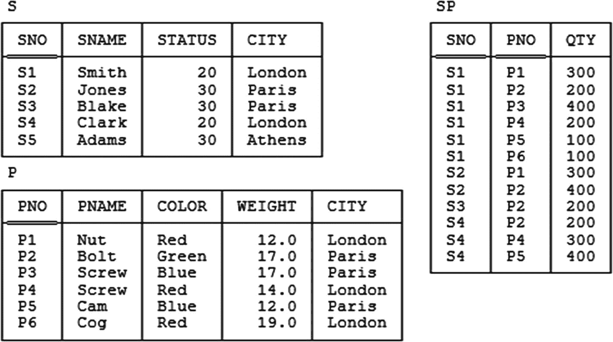

图 B-1

供应商-零件数据库——样本值

然而，我先前没有提到的是，任何特定数据库值应满足的完整性约束也可以被理解为命题（同样，被假定为真命题）。例如，考虑以下表达式，它可能用于表示发货表 (`SP`) 和供应商表 (`S`) 之间存在外键约束这一事实：

```
SP { SNO } ⊆ S { SNO }
```

（“`SP` 在 `SNO` 上的投影是 `S` 在 `SNO` 上的投影的子集——不一定是真子集”）。符号 `SP` 和 `S` 当然是关系变量名，但从逻辑上讲，它们可以被理解为*指示词*，其中指示词仅仅是表示或指定某个特定对象的东西。就数据库值 *DB* 而言，这些特定的指示词分别表示供应商关系变量的当前值和发货关系变量的当前值，于是该约束变为（转述）：

*   *发货关系中的每一个供应商编号也出现在供应商关系中。*

而这后一个陈述确实是一个命题。因此，*DB* 整体（数据加约束）可以（略微宽松地）被视为一组命题，这些命题——再重申一次——被假定为真命题。

但我们还可以更进一步。事实上，像 *DB* 这样的数据库值，连同可以应用于该数据库中命题的运算符，可以被视为*一个逻辑系统*。也就是说，它是一个形式系统——就像欧几里得几何一样——拥有*公理*（“给定的真理”）和*推理规则*，通过这些规则我们可以从公理中证明*定理*（“推导出的真理”）。确实，这正是 Codd 在 1969 年首次发明关系模型时的伟大洞见：数据库实际上并不只是*数据*的集合（尽管有此名称）；相反，它是*事实*的集合，或者逻辑学家所称的真命题。这些命题由关系中的元组和相关的约束表示，它们构成了所讨论逻辑系统的公理。而推理规则本质上是那些能够从给定命题推导出新命题的规则；换句话说，它们是告诉我们如何应用关系代数运算符的规则。因此，当系统评估某个关系表达式——特别是当它响应某个查询时——它实际上是在从给定的真理中推导出新的真理；实际上，它是在证明一个定理！

一旦我们认识到上述事实的真实性，我们就会看到形式逻辑的全部工具都可以用于解决“数据库问题”。换句话说，诸如以下的问题：

*   数据在用户面前应该是什么样子的？

*   约束应该是什么样子的？

*   查询语言应该是什么样子的？

*   结果应该如何呈现给用户？

*   我们如何才能最好地实现查询（或者更一般地，评估数据库表达式）？

*   我们首先应该如何设计数据库？

实际上都变成了逻辑问题——即，易于进行逻辑处理并能够给出逻辑答案的问题。

当然，不言而喻，关系模型非常直接地支持了上述对数据库本质的看法——这也就是为什么，在我看来，关系模型是坚如磐石、“正确”且将持久存在的。

### 证明 1 = 0

在本附录开头引用的文本中，我大致说了这样一句话：

*   在一个包含矛盾的逻辑系统中，你可以证明*任何*东西；例如，你可以证明 1 = 0。事实上，你可以*证明*你能证明 1 = 0！

好吧，那么证明如下：

*   假设所讨论的系统是这样：它要么隐含地、要么明确地^(²⁶⁸)陈述了 *p* 和 `NOT` *p* 都为真（这就是矛盾所在），其中 *p* 是某个命题。

*   令 *q* 为一个任意命题。

*   从 *p* 为真，我们可以推断出 *p* `OR` *q* 为真。

*   从 *p* `OR` *q* 为真 和 `NOT` *p* 为真，我们可以推断出 *q* 为真。

*   但 *q* 是任意的！——例如，它可以是命题 1 = 0。证毕。

由此可以更普遍地推断出，在不一致的系统中，*绝对任何命题都可以被证明为“真”*。


### 错误答案

前述论证应足以表明完整性约束的关键重要性。具体而言，如果数据库违反了某些约束，那么作为逻辑系统的数据库就是不一致的——而（正如我们现在所知）我们从一个不一致的系统中可以得到任何答案。^(²⁶⁹)

话虽如此，怀疑论者可能仍会说：“真的吗？我不信。得了吧，给我看个现实的例子，别用你那些抽象的*p*和*q*的论证。”那么，让我看看是否能应对这一挑战。

我会从一个非常简单的例子开始。假设当前供应商-零件数据库的值满足：(a) 至少存在一个供应商；(b) 存在一个约束，要求必须始终至少有一个零件；但事实上 (c) 现在根本没有任何零件（这就是不一致性）。现在考虑这个关系演算表达式：^(²⁷⁰)

```
S WHERE EXISTS P ( TRUE )
```

或者如果你更喜欢 SQL：

```sql
SELECT ∗
FROM   S
WHERE  EXISTS
( SELECT ∗
FROM   P )
```

现在，如果直接计算这两个表达式中的任意一个，结果都将为空，因为 `WHERE` 子句中的表达式计算结果为 `FALSE`。或者，如果系统（或者用户也一样）观察到有一个约束要求 `EXISTS P (TRUE)` 必须计算为 `TRUE`——或者在 SQL 中，`SELECT ∗ FROM P` 必须返回非空结果——那么那个 `WHERE` 子句就可以被一个简单地说 `WHERE TRUE` 的子句替换，结果就会是所有供应商。^(²⁷¹) 至少有一个答案肯定是错的！事实上，在某种意义上，它们都是错的；给定一个不一致的数据库，根本不存在——也不可能存在——任何定义明确的正确性概念，任何答案都和其他答案一样（好或坏）。确实，这种情况应该是不言自明的：如果我告诉你某个命题*p*既真又假，然后我问你某个以某种方式依赖于*p*的命题是否为真，你根本无法给我一个正确的答案。

如果你还不信服，请看下面这个稍现实一点的 SQL 示例：

```sql
SELECT CASE
WHEN EXISTS ( SELECT ∗ FROM P )
THEN ( x )
ELSE ( y )
END AS Z
FROM   S
```

在与之前相同的假设下——即，至少有一个供应商但没有零件，尽管有约束说应该有零件——这个表达式将返回 `x` 或 `y`（更准确地说，它将返回一个包含一行、该行包含 `x` 或 `y` 的表），实际上，取决于 `EXISTS` 调用是否被简单地替换为 `TRUE`。现在想想，`x` 和 `y` 各自可以是任何东西……例如，`x` 可能是 SQL 表达式 `SELECT SUM (WEIGHT) FROM P`，而 `y` 可能是字面量 `0.0`——在这种情况下，执行查询很容易导致错误的结论，认为零件总重量是 `null` 而不是零。（当然，如果没有零件，零件总重量应该是零。在这个例子中，错误答案特别令人恼火的一点是，用户显然特意以这种方式表述查询，以便在确实没有零件时获得逻辑上正确的答案零。）

### 推广论证

一位审阅此附录早期版本的审阅者，仍然不信服，尝试了一个不同的问题。他实际上问的是，我们如何才能表达查询“获取所有发货单的总发货数量”，以便从某个不一致的数据库中获得某个特定的错误答案，比如 5000。嗯，在我尝试回答这个问题之前，让我先推广一下上一节中提出的论证。

首先，我们知道数据库值抽象地看是一组命题。令 `DBP` 为构成数据库值 `DB` 的命题集合。令 `LA` 是 `DBP` 中所有命题的逻辑与——即合取。此外，假设针对 `DB` 的某个查询返回一个结果 `R`，其中 `R` 是通过计算表示给定查询的关系表达式，从 `DB` 中的关系派生出的一个关系。当然，`R` 本身也可以被理解为另一组命题 `RP`；因此我们可以说“`LA` 蕴含 `RP`”为真，换句话说，`RP` 中的命题是 `LA` 中命题的逻辑结果。但是，如果 `DB` 是不一致的（即，如果 `DBP` 涉及矛盾），`LA` 就计算为 `FALSE`——而蕴含式“`FALSE` 蕴含 `p`”对于所有可能的命题 `p` 都计算为 `TRUE`，^(²⁷²) 无论该命题 `p` 本身是真还是假。因此，如果 `DB` 是不一致的，我们（通常）就无法知道 `RP` 中的各个命题是真还是假。

现在回到审阅者的问题：我们如何才能表达查询“获取所有发货单的总发货数量”，以便从某个不一致的数据库中获得答案 5000？事实上，我认为这个问题的表述方式没有多大意义。在 **Tutorial D** 中，表达此查询本身（即，暂时忽略必须针对某个不一致数据库返回值 5000 的要求）的明显方式如下：

```
EXTEND TABLE_DEE : { TOTQ := SUM ( SP , QTY } }
```

或者如果你更喜欢 SQL：

```sql
SELECT SUM ( QTY ) AS TOTQ
FROM   SP
```

计算这两个表达式中的任意一个，都会产生一个类似这样的结果：

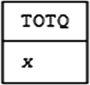

相应的命题是“所有发货单的总发货数量 `TOTQ` 是 `x`。”现在，`x` 的实际值是多少并不重要（它可能是 5000，也可能不是）；重要的是，如果数据库是不一致的，我们就无法知道相应的命题是真还是假（即，`x` 是否为真实的总量）。换句话说，问题的关键不在于*我们如何编写查询*——而在于*我们如何解释结果*。更具体地说，我们不能假设得到的结果是正确的。正如我之前所说，如果数据库不一致，那么一切都不可信了。^(²⁷³)


### 为什么完整性检查必须是即时的

在本附录开头引用的文字中，我大致表达了以下观点：

*   与普遍看法相反，完整性检查必须始终是即时的——也就是说，必须在“语句边界”处完成，即在任何有可能违反相关完整性约束的更新操作结束时进行。换句话说，所谓的“延迟检查”（即推迟到相关事务结束时才进行的检查）违反了关系模型的原则；事实上，这是一种逻辑错误。

坚持数据库约束必须在语句边界进行检查的原因至少有五点，但首要也是最重要的一点是：正如我在前面章节试图展示的那样，我们*永远*不能容忍数据库中的任何不一致性，即使是在单个事务的范围内也不行。也就是说，虽然由于事务所谓的隔离性，可能确实最多只有一个事务会看到某个特定的不一致性，但事实是，该特定事务确实看到了这个不一致性，并可能因此产生错误的答案。*注：* 书籍 `SQL 与关系理论` 对上述问题以及其他四个原因（即坚持数据库约束必须始终在语句边界进行检查的其他四个原因）进行了详细讨论。

脚注 1   2   3   4   5   6   7   8

## 主键虽好，但非必需

> 生活相当像一罐沙丁鱼——我们都在寻找那把钥匙。
>
> ——艾伦·贝内特：`Beyond the Fringe` (1960)

回顾第 1 章中的这段文字：

*   我说过选择主键是*通常的*做法。这确实是通常的做法——但它并非 100% 必要。如果只有一个候选键，那么就没有选择，也没有问题；但如果存在两个或更多，那么必须选择其中一个并将其设为主键，就多少带点随意性，至少对我来说是这样。（当然，在某些情况下，似乎确实没有真正充分的理由来做这种选择。甚至可能有很好的理由不这样做。附录 C [*即本附录*] 对此有详细阐述。）

现在，这段摘录中阐明的观点显然与传统智慧背道而驰；事实上，甚至可以说它违反了关系模型或一般关系理论中某些被广泛接受的准则。具体来说：

*   从一个给定关系变量必然非空的键集合中，最初定义的关系模型赋予该集合中一个任意选择的成员——称为*主*键——一个首要的角色。

*   关系设计方法论——虽然不是关系模型本身——倾向于建议，同样有点随意地，一个给定的“实体”应该在整个数据库中由同一个（主）键值来识别和引用，无论它在哪里被表示。

然而，如上所述，这些建议——有些人甚至可能称之为*规定*——都涉及一定程度的随意性。特别是第一点，一直以来都让关系模型的支持者（包括我自己）感到些许尴尬。支持关系模型最有力的论据之一一直是它声称拥有坚实的逻辑基础。然而，虽然这一声称在很大程度上显然是合理的，但主键和候选键^(²⁷⁴) 之间的区别——即必须从一组相等的成员中选择一个并使其在某种程度上“比其他成员更平等”的观念——似乎一直建立在不享有同等理论声誉的基础上。当然，似乎没有任何*正式*的理由来支持这种区别；它似乎更像是教条而非逻辑，这就是为什么我说这种情况令人尴尬。本附录源于我对关系正统立场在这些问题上似乎缺乏坚实依据的日益不满。（正如我的一位朋友曾经对我说，在现场演示中，这些领域就是“你讲得很快，希望没人会注意到”的地方。）

更重要的是，不仅似乎没有理由来证明 `PK:AK` 区别的合理性，似乎也没有任何正式的方法来做出选择。事实上，科德本人曾明确表示“选择的正常依据是简单性，*但这个方面超出了关系模型的范围*”（斜体为我所加）。^(²⁷⁵) 但为什么必须做出选择呢？——也就是说，在确实存在真正选择的情况下，为什么有必要或可取地要引入这种随意性的因素呢？

此外，最初定义的关系模型还坚持，数据库中任何地方通过外键对（一个给定关系变量中的）元组的所有引用，都必须始终通过该关系变量的主键进行，绝不能通过某个替代键。因此我们看到，一个本质上随意的决定——选择哪个键作为主键——也可能导致后续决定受到随意性限制；也就是说，它可能以一种在做出第一个决定（即主键决定）时未曾预料到的方式，限制关于什么可以和不可以成为合法外键的决策集合。

因此我认为，在关系模型本身中区分主键和替代键（以下简称为 *`PK:AK` 区别*）的观念，给原本是一个形式化定义的系统（即关系模型）引入了随意性、人为性、笨拙性和不对称性这些令人不快的音符。我进一步认为，它也可能给数据库本身引入令人不快的随意性、人为性、笨拙性和不对称性。我还要进一步指出，正如我将展示的那样，它还可能导致基本关系变量和派生关系变量之间出现不良且不必要的区别。

既然如此，`PK:AK` 区别真的合理吗？本附录提供了我认为强有力的论据，支持对这个问题的回答必须是*否定的*。


### 为 PK:AK 区分辩护的论点

在我详细探讨 `PK:AK` 区分的后果之前，我应首先审视为该区分辩护的论点。既然我自己也记录在案，是该区分的捍卫者^(²⁷⁶)，或许我应该从总结并事后反思我自己的论点开始！主要论点如下：

#### 主要论点

1.  放弃 `PK:AK` 区分将意味着，除其他事项外，“实体完整性规则”必须扩展到适用于所有候选键（至少是基关系变量中的所有候选键）。*注意：* 如果需要复习*候选键*这个术语，请参阅第 1 章。

正如我期望您所知，实体完整性规则是指基关系变量主键中的属性不允许为空值。现在，我长期以来一直主张无论如何都应该废除这条规则，部分原因在于它与空值有关（这是一个我断然拒绝的概念），部分原因在于它区分了基关系变量和其他关系变量，从而违反了`可互换性原则`（即基关系变量与视图）；因此，我现在发现这第一个支持 `PK:AK` 区分的论点已经无关紧要了。

*注意：* 如果您不熟悉`可互换性原则`，我应该解释其基本含义是：在基关系变量和视图之间不应有任何不必要的区分——视图对用户来说应具有与基关系变量相同的"外观和感觉"。

2.  使用相同符号在任何地方标识给定实体的规范，使系统能够识别出这些引用确实都指向同一个事物。

这个论点在其范围内显然是有效的，但我现在认为，所提到的规范应被视为非正式的指导方针，而非硬性规定。请参阅本附录后面的讨论——特别是 `applicants` 和 `employees` 的例子——了解在实践中可能不希望遵循此类指导方针的情况。无论如何，所讨论的规范实际上与设计有关（换句话说，涉及如何在某些特定情况下应用关系模型），而不是关系模型本身；因此，特别是，它与关系模型本身是否应坚持主键无关。我当初提出这个论点时一定有点混淆了。

3.  如果实体在不同地方以不同方式被标识，“元查询”——即对目录的查询——可能会更难以表述。例如，考虑一下，如果雇员有时通过员工编号被引用，有时通过社会保障号被引用，那么表述元查询“哪些关系变量引用了雇员？”会涉及什么。

这里的想法基本上是，上述第 2 点提到的规范对用户和系统都可能有益。然而，在我看来，我们再次讨论的是非正式指导方针，而非绝对要求。

4.  我的下一个观点并不完全是支持 `PK:AK` 区分的论点，而是对一个反对其区分的论点的批评。后者的论点如下：假设某个用户因安全原因无法看到某个主键；那么该用户需要通过某个备用键来访问数据；那么最初为什么要区分 `PK:AK` 呢？

我仍然觉得"这个后者的论点"不太有说服力，但当然，批评一个反对某个立场的论点并不能证明相反立场是正确的！

5.  我的最后一点诉诸了奥卡姆剃刀原则（"如无必要，勿增实体"）。实际上，我当时是在论证，将所有候选键平等对待会使关系模型的元组级寻址方案不必要地复杂化。但现在很可能会被反驳（而且我现在也会这样反驳），奥卡姆剃刀实际上适用于相反的方向，主键和备用键的概念才是不必要的！——即，我们真正需要的只是候选键，或者换句话说，只需要*键*这个概念。

#### 后续反思

简而言之，上述论点在我看来不再那么有说服力了；唯一似乎仍然有效的，是上面第 2 和第 3 点总结的那个论点，而这个论点（如我所说）本身也并非真正论证需要在关系模型本身中做出 `PK:AK` 区分。正如我也说过的，我现在认为该特定论点所支持的立场，更应被视为一种指导方针，而非不可违反的规则（再次，请参阅后面的例证）。

我顺便注意到，我最初讨论这个问题时确实做了一些对冲……这是相关论文的另一段摘录（此处我稍作改写）：

*   注意，如果我们同意暂时保留 `PK:AK` 区分，那么在未来某个时候如果需要，总是有可能消除这种区分。而且请注意，这个论点不适用于反方向：一旦我们致力于平等对待所有候选键，一个要求有特殊主键的系统将永远是非标准的。

尽管我当时没有明说，但这段引述实际上构成了对`谨慎设计原则`的诉求，这是我仍然坚信的原则^(²⁷⁷)。事实上，我能够现在改变我对 `PK:AK` 区分的立场——这也正是我在做的——似乎本身就证明了该原则的正确性。

#### Codd 的观点

在结束本节之前，我指出，Codd 本人在同一论文中（他曾说选择主键没有形式化基础）也记录在案，是 `PK:AK` 区分的捍卫者（这并不奇怪，因为他是该区分的提出者）：

*   如果允许任何关系变量拥有多个主键，将会出现严重问题……允许一个单一基关系变量拥有多个主键的后果……将是灾难性的。

（我冒昧地在本段摘录中两次用 `relvar` 这个术语替换了 Codd 的术语*relation*。）他接着举了一个涉及具有"几种不同职责"——项目管理、部门管理、库存管理等——的雇员的例子，然后说：

*   比较标识符的相等性……旨在确定涉及的是同一个雇员……如果用于雇员的标识符类型可能根据为比较选择了哪一对雇员标识[属性]而不同，那么这个目标将受到严重打击。

嗯，我认为您可以看出这个论点本质上与上面第 2 和第 3 点给出的论点相同，而这个论点（a）正如我已经指出的，有些混淆，并且（b）正如我们将在本附录后面看到的，无论如何在仔细推敲下都无法完全站得住脚。


### 具有两个或更多键的关系变量

现在，让我们来看一些具有两个或更多键的关系变量的合理实际例子。第一个例子是关系变量 `EXAM`，它具有属性 `S`（学生）、`J`（科目）和 `P`（名次），其谓词是*学生 S 参加了科目 J 的考试，并在班级排名中获得第 P 名*。为了这个例子，我们假设没有并列名次（即，没有两名学生在同一科目中获得相同的名次）。那么，很明显，给定一个学生和科目，就有一个唯一对应的名次；同样，给定一个科目和名次，就有一个唯一对应的学生。因此，函数依赖 `{S,J} → {P}` 和 `{J,P} → {S}` 都成立，并且 `{S,J}` 和 `{J,P}` 都是键（或者，如果你愿意，都是候选键）：

```
EXAM { S , J , P }
KEY { S , J }
KEY { J , P }
```

*练习：* 这个关系变量属于哪种范式？

这是另一个例子（它基本上是第 14 章的练习 14.3）：我们有一个表示婚姻的关系变量，具有属性 `A`、`B` 和 `C`，其谓词是*人物 A 在日期 C 与人物 B 结婚*。假设没有一夫多妻制，并且也假设没有两个人彼此结婚超过一次，那么这里的每一对属性都是一个键：

```
MARRIAGE { A , B , C }
KEY { A , B }
KEY { B , C }
KEY { C , A }
```

这是又一个例子，基于一个简单的航空公司应用（其谓词是*飞行员 `PILOT` 在日期 `DAY` 的小时 `HOUR` 从登机口 `GATE` 驾驶航班出发*）：

```
ROSTER { DAY , HOUR , GATE , PILOT }
KEY { DAY , HOUR , GATE }
KEY { DAY , HOUR , PILOT }
```

在上述情况下，我们如何选择主键？有什么理由选择一个键而不是另一个？Codd 的“简单性”标准似乎没什么帮助。还要注意，无论我们选择哪一个，最终都会导致一种令人不快的不对称性；例如，在婚姻的例子中，我们可能会发现自己将一位配偶视为“比另一位更平等”（从而肯定会冒犯某人）。为什么我们被迫引入这种不对称性？不对称通常不是个好主意。这里再次引用第 17 章中引用的波利亚的话：“尝试对称地处理对称的事物，不要肆意破坏任何自然的对称性。”

现在，在上述所有例子中，键不仅是复合的，而且它们都相互重叠（即，它们有一个共同的属性）。为了防止人们认为只有在键重叠时选择主键才会有困难，因此，让我给出一个反例。假设我们有一个代表元素周期表（即化学元素表）的关系变量 `ELEMENT`。那么每个元素都有一个唯一的名称（例如，铅）、一个唯一的符号（例如，铅的符号是 `Pb`）和一个唯一的原子序数（例如，铅的原子序数是 82）。该关系变量因此显然有三个不同的键，它们都是简单的（即，每个键只涉及一个属性），并且显然没有任何重叠。我们基于什么理由从这三个键中选择一个作为主键？在我看来，根据具体情况，为其中任何一个键辩护都有充分的理由。

这是另一个熟悉（也许过于熟悉）的具有多个键的关系变量的例子，所有这些键都是简单的：

```
TAX_BRACKET { LOW , HIGH , RATE }
KEY { LOW }
KEY { HIGH }
KEY { RATE }
```

当然，我在这里假设没有两个应税收入范围（`LOW` 到 `HIGH`）适用相同的税率。*注意：* 我在第 14 章中建议，税级可能更适合表示为单个区间值属性（比如 `RANGE`），而不是分开的 `LOW` 和 `HIGH` 属性。然而，即使那样表示，仍然会有两个不重叠的键，`RANGE` 和 `RATE`。

我可以给出更多的例子，但到现在我的观点应该很清楚了：不仅在有选择的情况下，没有正式标准来选择一个键而不是另一个键，而且有时似乎连非正式的标准都没有。因此，即使坚持必须始终做出这样的选择在某些情况下（也许在大多数情况下）是合适的，但似乎并不合适。

还有一点需要提及，这是我迄今为止提出的大多数论点中更为正式的一点。在过去的 50 年里，关于依赖理论和进一步规范化、视图更新、优化（特别是语义优化）以及许多其他问题已经进行了大量研究。在所有这些研究中，起关键作用的是候选键，而不是主键。（事实上，它必须如此，正是因为所讨论的研究是形式化的。候选键概念是形式化定义的。主键概念则不是。）既然如此，似乎真的不适合在*形式上*坚持 `PK:AK` 的区分——尽管，重申一遍，在*非正式*层面上推荐它可能是合适的。

我想提出的另一点是，`PK:AK` 的区分似乎导致了基础关系变量与其他关系变量之间一种不合意且不必要的区别（至少根据 Codd 的说法）。这是因为，根据 Codd 的说法，关系模型：

*   *要求*基础关系变量必须有主键；
*   *允许*但不要求视图和快照具有主键；并且
*   认为对于任何其他关系变量，“主键的声明或推导是*完全不必要*的”（原文为斜体）。

这些陈述转述（但只是略微转述）自 Codd 说选择主键没有正式基础的那篇论文。事实上，该论文甚至暗示，基础关系变量之外的关系变量可能根本不具备主键，如果这一暗示是真的，那肯定会对这个概念本身提出严重的疑问（记住*可互换性原理*）。尽管如此，我在这些问题上的立场则相当不同。具体来说，我认为：

*   首先，每个关系变量，无论是基础的还是派生的，都至少有一个键（因为，当然，没有关系，更不用说关系变量，会允许重复元组）。
*   其次，每个基础关系变量必须至少显式声明一个键。当然，最好所有这样的键都能显式声明。（事实上，一个未显式声明的基础关系变量键，就系统——或者就此而言，关系模型本身——而言，根本就不是一个键。）
*   通常，一个基础关系变量会特别有一个显式声明的主键，但我不坚持将这种状态作为硬性要求。
*   基于在《SQL 与关系理论》中详细解释的原因，我相信系统应该能够推导派生关系变量的键。
*   尽管有前一点，我相信也应该可以为派生关系变量（特别是视图和快照）显式声明键。同样，请参阅《SQL 与关系理论》以获取进一步讨论。


### 发票与发货单示例

现在，我将关注一个更详尽的示例。该示例（基于一个真实世界的应用）涉及发票和发货单，并且这两种实体类型之间存在一对一的关系：每个发货单恰好对应一张发票，每张发票恰好对应一个发货单。以下便是“显而易见”的数据库设计（为示例清晰起见，我使用了一种假设的语法，以明确区分主键和候选键）：[²⁸⁰]

```
INVOICE  { INVNO , SHIPNO , INV_DETAILS }
PRIMARY KEY { INVNO }
ALTERNATE KEY { SHIPNO }
FOREIGN KEY { SHIPNO } REFERENCES SHIPMENT
SHIPMENT { SHIPNO , INVNO , SHIP_DETAILS }
PRIMARY KEY { SHIPNO }
ALTERNATE KEY { INVNO }
FOREIGN KEY { INVNO } REFERENCES INVOICE
```

因此，数据库结构如图 C-1 所示（请注意，与本书其他图中的箭头不同，该图中的箭头表示外键引用，而非函数依赖）：

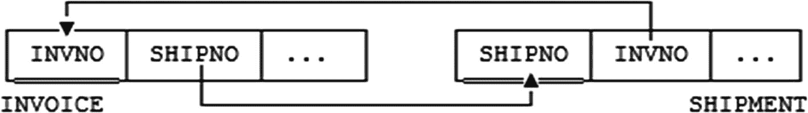

图 C-1

发票与发货单数据库

现在，在这个示例中，每个关系变量实际上都有两个键：`{`INVNO`}` 和 `{`SHIPNO`}`。然而，为了论证方便，我假设我们可以达成共识：`INVOICE` 的“自然”主键是 `{`INVNO`}`，而 `SHIPMENT` 的“自然”主键是 `{`SHIPNO`}`；那么，`INVOICE` 中的 `{`SHIPNO`}` 和 `SHIPMENT` 中的 `{`INVNO`}` 就是候选键。此外，当然，这些候选键中的每一个也是一个外键（如图 C-1 所示），引用了另一个关系变量的主键。

上述设计存在一个问题，如下所述。显然，数据库需要满足一个约束——实际上，这是一个相等依赖，我将其称为 `Constraint CIS`——即，如果 `INVOICE` 关系变量显示发票 `i` 对应发货单 `s`，那么 `SHIPMENT` 关系变量必须显示发货单 `s` 对应发票 `i`（反之亦然）：[²⁸¹]

```
CONSTRAINT CIS
INVOICE { INVNO , SHIPNO } = SHIPMENT { INVNO , SHIPNO } ;
```

换言之，元组 `(`i`,`s`,...)` 出现在 `INVOICE` 中，当且仅当元组 `(`s`,`i`,...)` 出现在 `SHIPMENT` 中。但是，图 C-1 所示的设计并未捕获或强制执行此约束（例如，图 C-2 所示的值配置被该设计所允许，但却违反了该约束）。因此，该约束需要被单独陈述（如上所述）并被单独强制执行。

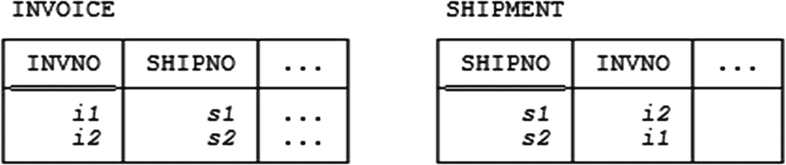

图 C-2

违反 `CIS` 约束的“合法” `INVOICE` 和 `SHIPMENT` 值

或许有人会想，如果我们假装每个关系变量的主键是 *组合* `{`INVNO`,`SHIPNO`}`，并且进一步将这些伪造的“主键”定义为引用另一个关系变量的外键，那么 `Constraint CIS` 就会自动得到处理。（事实上，我确实见过有人明确推荐这种权宜之计，而这些人本应更了解情况。）但是，关系模型要求主键——实际上是所有键——必须是不可约的，这意味着它们不能包含任何对唯一标识目的无关的属性（正如我们从第 4 章所知，这个要求有其充分的理由）。换言之，`{`INVNO`,`SHIPNO`}` 对于任何一个关系变量来说都 *不是* 一个键（因此它当然也不能是主键），如果我们告诉系统并非如此，那就是在撒谎。事实上，如果 `{`INVNO`,`SHIPNO`}` 真的是一个键，那么发票和发货单之间的关系将是多对多的，而实际上并非如此。

正因为 `Constraint CIS` 成立，图 C-1 的设计显然涉及一些冗余：出现在任一关系变量中的每一对 `{`INVNO`,`SHIPNO`}` 值也必然出现在另一个关系变量中。现在，我们可以通过将两个关系变量合并为一个（`INV_SHIP`）来避免这种冗余，如下所示：

```
INV_SHIP { INVNO , SHIPNO , INV_DETAILS , SHIP_DETAILS }
PRIMARY KEY { INVNO }
ALTERNATE KEY { SHIPNO }
```

通过这种方式消除冗余，我们也消除了陈述和强制执行 `Constraint CIS` 的需要。此外，我们现在可以将原始的 `INVOICE` 和 `SHIPMENT` 关系变量定义为 `INV_SHIP` 的视图——具体来说，是投影视图——从而让用户仍然可以将发票和发货单视为不同的实体。[²⁸²] 因此，这个修订后的设计确实比“显而易见”的版本享有某些优势。

另一方面，它也存在一些缺点。首先请注意，我们不得不再次做出非对称的决定，任意选择 `{`INVNO`}` 而非 `{`SHIPNO`}` 作为关系变量 `INV_SHIP` 的主键。[²⁸³] 其次，进一步假设发货单具有一些发票所没有的附属信息；例如，假设货物是集装箱运输的，每个发货单涉及多个集装箱。那么就需要一个新的 `CONTAINER` 关系变量：

```
CONTAINER { CONTNO , SHIPNO , ... }
PRIMARY KEY { CONTNO }
FOREIGN KEY { SHIPNO } REFERENCES INV_SHIP { SHIPNO }
```

而现在我们有了一个引用候选键的外键！——正如我们所知，原始定义的关系模型明确禁止这种情况。

那么，我们能否避免这种表面上的违背原始模型规定的情况呢？答案当然是 *肯定的*。可以通过多种方式来实现：

1.  我们可以回到两个关系变量的设计（尽管这会重新引入数据冗余和对额外约束的需求）。
2.  我们可以在 `CONTAINER` 关系变量中用 `INVNO` 替换 `SHIPNO`。然而，这种方法似乎非常不自然（集装箱本身与发票无关），而且会在设计中引入令人不快的间接层（对于给定的集装箱，只能通过相应的发票访问其所属的发货单）。
3.  我们可以让 `CONTAINER` 关系变量保持原样，但将外键规范替换为一个显式声明，以表明 `CONTAINER` 中的每个 `SHIPNO` 值也必须出现在 `INV_SHIP` 中（使用像 SQL 或 **Tutorial D** 这样允许定义任意复杂约束的语言）。但是，必须以如此迂回的方式处理一个与“真正的”外键约束如此相似的约束，确实令人遗憾；事实上，可以认为其效果同样是引入了不良的非对称性，即引用主键的外键以一种方式处理，而引用候选键的“外键”则以完全不同的方式处理。
4.  我们可以为 `INV_SHIP` 引入一个代理主键（例如 `{`ISNO`}`），并在 `CONTAINER` 表中使用它作为外键——这仍然会像上面第 2 点那样引入间接层，但至少会重新引入当我们任意选择 `{`INVNO`}` 作为 `INV_SHIP` 的主键时所丢失的对称性。

[²⁸⁰]: 这里的语法是假设的，纯粹是为了明确区分主键和候选键。
[²⁸¹]: 严格来说，约束 `CIS` 是一个更通用的约束（相等依赖）的特例。详细讨论见正文。
[²⁸²]: 这里假设所使用的语言支持对视图进行更新。如果视图可更新，则用户可能（例如）通过 `INVOICE` 视图插入一行，而 DBMS 则会在底层的 `INV_SHIP` 关系变量中实现相应的插入操作。
[²⁸³]: 有人可能会问，为什么我们不选择 `{`SHIPNO`}` 作为主键呢？答案是，这确实是一个任意的选择；不过，一旦做出了选择（无论选择哪一个），它就固定下来了，这体现了该设计的非对称性。


总结：这四种“变通”方法似乎都不完全令人满意。这个例子因此表明——如果我们希望避免冗余、任意性、人为性、不对称性和间接性——那么我们需要能够将主键和备用键同等对待，并且需要能够拥有引用备用键的外键。换句话说，我们需要忽略主键和备用键之间的差异，而简单地将它们都视为键。然而，请注意，我`不是`说这个例子中明显需要违反原始关系模型某些准则的情况无法避免；我所说的是，我看不到一个避免它的好方法，也没有一个采用糟糕方法的好理由。因此，我想建议将相关准则视为强（？）指导方针，而非不可违反的规则。

### 每个实体类型只有一个主键？

现在我转向本附录引言中提到的第二个问题：即给定类型的实体应以完全相同的方式在数据库中的任何地方进行标识。通俗地说，这意味着通常会存在：

*   一个针对相关实体类型的单一“锚点”关系变量（relvar），具有某个特定主键，以及
*   零个或多个从属关系变量，提供关于该类型实体的进一步信息，每个从属关系变量都有一个外键引用回该锚点关系变量的主键。

（这种情况是否让你想起了第 17 章讨论的 `RM/T` 设计规范？）但几个显而易见的问题出现了：

*   是否存在充分的理由为给定实体类型设置多个锚点关系变量，可能对应于该实体类型的不同“角色”——参见下一节关于申请人和雇员的讨论？
*   如果存在多个这样的锚点关系变量，是否可能存在充分的理由，使得不同的锚点关系变量具有不同的主键——从而意味着同一个实体可能在不同的上下文中以不同的方式被标识？
*   因此，是否可能存在充分的理由，使得在不同的关系变量中存在不同的外键，再次在不同的上下文中以不同的方式标识同一个实体？
*   最后，在*同一个*关系变量中，为同一个实体设置多个不同的标识符且权重相等，是否甚至也可能存在充分的理由？

我们在本附录的前面部分（在“具有多个键的关系变量”一节）已经看到了几个例子，其中对最后一个问题的回答显然是 `是`。为了考察其他问题，让我们考虑另一个例子。

### 申请人和雇员的例子

这个例子（与发票和发货的例子一样，基于一个真实世界的应用）涉及某企业工作的申请人。关系变量 `APPLICANT` 用于记录这些申请人：

```
APPLICANT { ANO , NAME , ADDR , ... }
PRIMARY KEY { ANO }
```

申请号 (`ANO`) 在申请人申请工作时分配；它对申请人是唯一的，因此 `{ANO}` 构成了显而易见的主键（事实上，它是唯一的键）。

接下来，使用几个进一步的关系变量来保存从属的申请人信息（以前从事的工作、推荐人列表、家属列表等）。这里我只考虑其中一个，“以前从事的工作”关系变量 (`APPLICANT_JOBS`)：

```
APPLICANT_JOBS { ANO , EMPLOYER , JOB , START , END , ... }
PRIMARY KEY { ANO , START }
ALTERNATE KEY { ANO , END }
FOREIGN KEY { ANO } REFERENCES APPLICANT
```

顺便注意一下，我们似乎再次面临主键选择的任意性问题，但这不是我想在此考察的重点。^(²⁸⁴)

现在，当一名求职者成功并成为一名雇员时，他或她将被分配一个雇员号 (`ENO`，对雇员唯一)，有关新雇员的信息——职位、部门号、电话号码等——被记录在一个 `EMP` 关系变量中：

```
EMP { ENO , JOB , DNO , PHONENO , ... }
PRIMARY KEY { ENO }
```

现在我们有了两个不同的锚点关系变量 `APPLICANT` 和 `EMP`，其中同一个实体（即，成功的申请人）在一个关系变量中由一个 `ANO` 值标识，在另一个关系变量中由一个 `ENO` 值标识。当然，确实这两个关系变量代表不同的*角色*——`APPLICANT` 中的一个元组表示处于申请人角色的人，而 `EMP` 中相应的元组（如果存在的话）表示处于雇员角色的同一个人——但事实是，所涉及的只是一个单一的实体。

前述情况并非故事的结局。显然，关系变量 `EMP` 需要以某种方式引用回关系变量 `APPLICANT`（为了这个例子，我假设每个雇员都曾经是申请人，尽管这个假设可能有点不现实）。因此，我们需要在 `EMP` 关系变量中添加一个 `ANO` 属性，并相应地定义一个外键：

```
EMP { ENO , ANO , JOB , DNO , PHONENO , ... }
PRIMARY KEY { ENO }
ALTERNATE KEY { ANO }
FOREIGN KEY { ANO } REFERENCES APPLICANT
```

现在我们再次有了两个候选键！——即 `{ENO}` 和 `{ANO}`。这一点稍后会相关；不过目前，我将忽略它。

接下来，当然，我们将需要额外的关系变量来保存雇员的从属信息（薪资历史、福利详情等）。这是薪资历史关系变量：

```
SAL_HIST { ENO , DATE , SALARY , ... }
PRIMARY KEY { ENO , DATE }
FOREIGN KEY { ENO } REFERENCES EMP
```

现在，同一个实体不仅在一个关系变量 (`SAL_HIST`) 中通过 `ENO` 值被*标识*，而且在其他关系变量 (`APPLICANT_JOBS`, `EMP`) 中通过 `ANO` 值被*引用*。换句话说，数据库结构如图 C-3 所示。

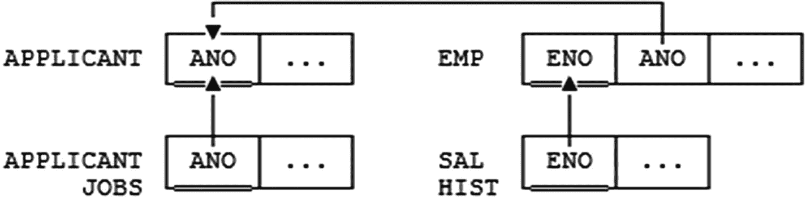

图 C-3

申请人和雇员数据库

现在，通过将 `EMP` 视为 `APPLICANT` 的一个 `子类型`，^(²⁸⁵)我们或许可以避免明显需要为同一实体类型设置两个不同标识符 (`ANO` 和 `ENO`) 的情况；毕竟，每个雇员都是或曾经是一名申请人（通俗地说），而反之则不然。这样，我们可以将 `{ANO}` 用作 `EMP` 的主键，将 `{ENO}` 视为一个备用键（甚至完全去掉它），并在 `SAL_HIST` 关系变量中用 `ANO` 替换 `ENO`。数据库结构现在如图 C-4 所示：

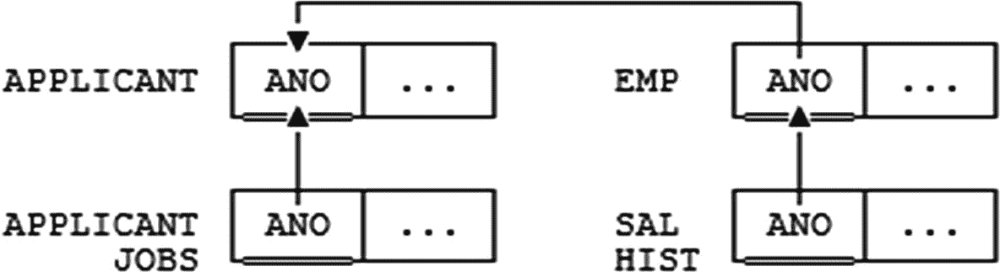

图 C-4

使用 `{ANO}` 作为 `EMP` 的主键


然而，请注意这种状况带来的影响：改变的不仅是数据库设计，还有企业的运作方式。（首先，企业现在必须通过申请人编号而非员工编号来识别员工。）为什么企业仅仅因为一条关系型教条（`“每种实体类型对应一个主键”`）就必须改变其业务运作方式？具体来说，为什么不允许通过申请人编号识别申请人、通过员工编号识别员工——尽管申请人和员工都是人，而且每位员工都（或曾经是）申请人？

另一种可能是引入一个 `PERSON` 关系变量，然后将 `APPLICANT` 和 `EMPLOYEE` 都视为 `PERSON` 的子类型。我将细节留给读者作为练习；仅简单说明此方法基本上解决不了任何问题，即使我们发明一个`“人员编号”`（`PNO`）并将 `{PNO}` 设为 `PERSON` 的主键。

总结而言：前述例子强烈表明，可能存在这样的情况：确实需要 (a) 为同一实体类型拥有多个不同的锚定关系变量；(b) 在这些锚定关系变量中各设一个不同的主键；(c) 在不同的附属关系变量中用不同的外键引用这些不同的主键。再次强调，请注意我`不是`说此处显而易见的、需要违反`“每种实体类型对应一个主键”`规则的情况无法避免；我的意思是，我看不到避免它的好方法，也看不到采用糟糕方法的好理由。因此，我再次建议将`“一种实体类型对应一个主键”`视为一条强有力的（？）指导原则，而非不可违反的规则。

### 结语

在本附录中，我提出了若干务实的论点，支持：

*   放宽被普遍接受的规则：每个基本关系变量都应有一个称为“主键”的特定键。
*   放宽那条（或许不那么普遍接受的）规则：每个外键都必须专门引用主键，而非备用键^(²⁸⁶)
*   放宽被普遍接受的规则：每种实体类型只对应一个锚定关系变量。

当然，我非常清楚，如果我们放宽这些规则，就会为不良设计打开大门。这就是为什么我建议保留诸如`“每种实体类型对应一个主键”`这类规则作为经验法则或优秀的设计指南。换句话说，只有在确有充分理由时，才应违反这些规则。但我在本附录中试图表明，有时这种充分的理由确实存在。

脚注 1   2   3   4   5   6   7   8   9   10   11   12   13


## 历史注释

> *历史并非你想象的那样。*
>
> *历史是你的记忆所能触及的。*
>
> —W. C. 塞勒与 R. J. 叶茨曼：《1066 年及其他》(1930)

> *本附录旨在对设计理论领域的部分开创性研究文献进行一次简短且并非毫无偏倚的概述。所提及的文献大致按年代顺序列出。*

关系模型本身起源于科德的两篇里程碑式论文：

*   E. F. 科德：“大型数据库中存储关系的可推导性、冗余性与一致性”，IBM 研究报告 RJ599 (1969 年 8 月 19 日) 及其他出处

*   E. F. 科德：“大型共享数据库的关系数据模型”，`ACM 通信 13`，第 6 期 (1970 年 6 月) 及其他出处

其中第一篇论文并未直接讨论设计本身。然而，第二篇论文中有一个标题为“范式”的章节，包含了如下引人入胜的评述：

*   进一步的规范化操作是可能的。本文不讨论这些操作。

这些评述出现在一个展示如何消除关系值属性或 `RVAs`（参见第 12 章练习 12.8 的答案）的示例之后。*注：* 所讨论的“进一步操作”——实际上只有一种——即 `Tutorial D` 中所称的 `UNGROUP`。参见第 4 章练习 4.14 的答案。

*   设计理论本身始于科德在以下论文中引入 `FDs`、`2NF` 和 `3NF`：
    *   E.F. 科德：“数据库关系模型的进一步规范化”，载于 Randall J. Rustin 编，`数据库系统：库朗计算机科学研讨会系列 6` (Prentice Hall, 1972)

这里有两个简要评论：首先，论文标题具有误导性——进一步的规范化并非对关系模型本身进行的操作，而是对 `relvars`（关系变量），或者更准确地说是对 `relvar` 设计进行的操作。（套用我在第 1 章练习 1.1 答案中的话，关系模型本身并不关心 `relvars` 处于何种范式，只要这些 `relvars` 确实是 `relvars`——即关系变量——而不是其他东西即可）。其次，该论文中部分材料的早期版本可见于科德的另外两篇更早的论文。第一篇是：

*   E.F. 科德：“关系模型的第二和第三范式”，IBM 内部备忘录 (1970 年 10 月 6 日)

第二篇是：

*   E.F. 科德：“规范化数据库结构：简要教程”，1971 年 ACM SIGFIDET 数据描述、访问与控制研讨会论文集，加州圣地亚哥，(1971 年 11 月 11 日-12 日)^(²⁸⁷)

希斯定理（当时尚未冠以此名）在这篇论文的同一研讨会上提出。^(²⁸⁸) 参见：

*   I. J. 希斯：“关系数据库中不可接受的文件操作”，1971 年 ACM SIGFIDET 数据描述、访问与控制研讨会论文集，加州圣地亚哥 (1971 年 11 月 11 日-12 日)

`BCNF` 在以下论文中被定义（尽管文中称之为“第三”范式的“改进版”）：

*   E. F. 科德：“关系数据库系统的最新研究”，IFIP 大会论文集，瑞典斯德哥尔摩 (North-Holland, 1974) 及其他出处

同一届 IFIP 大会也首次展示了阿姆斯特朗关于 `FDs` 的公理：

*   W. W. 阿姆斯特朗：“数据库关系的依赖结构”，IFIP 大会论文集，瑞典斯德哥尔摩 (North-Holland, 1974)

`MVDs`、`4NF` 以及我在第 12 章所称的法金定理均在以下论文中定义：

*   罗纳德·法金：“多值依赖及关系数据库的一种新范式”，`ACM 数据库系统汇刊 2`，第 3 期 (1977 年 9 月)

`MVDs` 的公理化体系定义在：

*   卡特里尔·贝里、罗纳德·法金、约翰·H·霍华德：“函数依赖与多值依赖的完整公理化”，1977 年 ACM SIGMOD 国际数据管理大会论文集，加拿大多伦多 (1977 年 8 月)

依赖保持理论起源于：

*   约尔马·里萨宁：“关系的独立分量”，`ACM 数据库系统汇刊 2`，第 4 期 (1977 年 12 月)

下一篇论文通常被认为是首次指出存在这样的 `relvars`：它们不等于其任何两个投影的连接，但等于三个或更多投影的连接（尽管事实上，如第 9 章所述，科德在其 1969 年的原始论文中已实质上做出了相同的观察）：

*   A. V. 阿霍、C. 贝里、J. D. 乌尔曼：“关系数据库中的连接理论”，第 19 届 IEEE 计算机科学基础研讨会论文集 (1977 年 10 月)；后重刊于 `ACM 数据库系统汇刊 4`，第 3 期 (1979 年 9 月)

前述论文也是追索算法的来源——至少对于 `FDs` 和 `MVDs` 而言，但不适用于一般的 `JDs`，因为一般的 `JDs` 当时尚未被定义。事实上，它们首次定义于：

*   约尔马·里萨宁：“数据库关系理论——教程概览”，第 7 届计算机科学数学基础研讨会论文集，Springer-Verlag 计算机科学讲义 `64` (Springer-Verlag, 1979)

下一篇论文引入了投影-连接范式（`PJ/NF`），也称为 `5NF`（它可被视为对所谓“经典”规范化理论——即以投影作为分解运算符、以自然连接作为相应重组运算符的非损失分解理论，以及范式 `BCNF`、`4NF` 和 `5NF`——的权威阐述）：

*   罗纳德·法金：“范式与关系数据库运算符”，1979 年 ACM SIGMOD 国际数据管理大会论文集，麻省波士顿 (1979 年 5 月/6 月)

下一篇论文为包含依赖（`INDs`）提出了一套可靠且完备的推理规则集——换言之，一种公理化体系：^(²⁸⁹)

*   马可·A·卡萨诺瓦、罗纳德·法金、克里斯托斯·H·帕帕迪米特里乌：“包含依赖及其与函数依赖的相互作用”，第一届 ACM SIGACT-SIGMOD 数据库系统原理研讨会论文集，加州洛杉矶 (1982 年 3 月)

接下来的三篇论文分别定义了 `ETNF`、`RFNF` 和 `SKNF`：

*   休·达文、C. J. 戴特、罗纳德·法金：“一种防止关系数据库中冗余元组的范式”，第 15 届国际数据库理论会议论文集，德国柏林 (2012 年 3 月 26 日-29 日)

*   米利斯特·W·文森特：“冗余消除与关系数据库设计的新范式”，载于 B. 塔尔海姆和 L. 利布金编，`数据库语义学`，`计算机科学讲义` 第 1358 卷 (Springer, 1998)

*   拉格纳·诺曼：“最小无损分解及介于 4NF 与 PJ/NF 之间的若干范式”，`信息系统 23, 第 7 期` (1998)

`6NF` 最初定义于：

*   C. J. 戴特、休·达文、尼科斯·A·洛伦佐斯：*时态数据与关系模型：将区间与关系理论应用于时态数据库管理问题的详细研究* (Morgan Kaufmann, 2003)

然而，该书后已被以下著作取代：

*   C. J. 戴特、休·达文、尼科斯·A·洛伦佐斯：*时间与关系理论：关系模型与 SQL 中的时态数据库* (Morgan Kaufmann, 2014)

域键范式定义于：

*   罗纳德·法金：“一种基于域和键的关系数据库范式”，`ACM 数据库系统汇刊 6`，第 3 期 (1981 年 9 月)

至于正交性，这一概念虽未冠此名，但最早在以下论文中讨论：

*   C. J. 戴特、大卫·麦戈文：“一种新的数据库设计原则”，`数据库编程与设计 7`，第 7 期 (1994 年 7 月)；重刊于 C. J. 戴特，*关系数据库文集 1991-1994* (Addison-Wesley, 1995)

但请注意，本书所描述的正交性与上述论文中讨论的版本有显著不同。（我对此状况负全部责任；尽管该概念最初由大卫·麦戈文提出，但我撰写了该论文的主体部分，我现在意识到当时我一定相当困惑。）

脚注 1   2   3


## 索引

### 关于

*为达到字母排序目的，(a) 字体和大小写差异将被忽略；(b) 引号将被忽略；(c) 其他标点符号——连字符、下划线、括号等——将被视为空格处理；(d) 数字排在字母之前；(e) 空格排在其他所有内容之前。*

### 符号

→ (FD 箭头) →→ (MVD 双箭头) ☼ (JD 星) ⋈ (蝴蝶结) ∈ (集合成员) ⇒ (逻辑蕴含) ⊆ (子集) ⊂ (真子集)

### 数字

0‑元组 参见 空元组
1NF 参见 第一范式
2NF 参见 第二范式
3NF 参见 第三范式
3NF 过程 (3,3)NF
4NF 参见 第四范式
5NF 参见 第五范式
6NF 参见 第六范式

### A

Abbey, Edward
Abbott, Bud
Abiteboul, Serge
Adamson, Chris
Adiba, Michel
Aho, A.V.
ALL BUT
所有键
替换键
AND (聚合运算符)
元数
Armstrong, Louis
Armstrong, W.W.
Armstrong 公理
“箭头输出”, 73
“原子事实”, 289
原子性 (数据)
属性
属性名 / 类型名对
关系值 参见 关系值属性
元组值 参见 元组值属性
属性重命名 参见 RENAME
公理化
FDs
MVDs
JDs 不适用

### B

Bacon, Francis
基关系变量
BCNF 参见 Boyce/Codd 范式
BCNF 过程
Beeri, Catriel
Bennett, Alan
Betjeman, John
体
关系
关系变量
约束变量
Boyce, Raymond F.
Boyce/Codd 范式
名称解释
Brown, Robert R.
业务规则

### C

候选键
规范形式
基数
Carroll, Lewis
Casanova, Marco A.
目录
追赶算法
Churchill, Winston
`封闭世界假设`
闭包
关系代数
属性集
FD 集
Codd, E. F., *各处出现*
逗号列表
常识
完备性
分量 (JD)
复合键
复合谓词
连接陷阱
连接词
一致性 (数据库)
一致性 (依赖)
`CONSTRAINT`
立即检查的约束
另见 单关系变量约束；多关系变量约束
包含 vs. 包含于
矛盾
Costello, Lou
覆盖 (FDs)
CWA 参见 `封闭世界假设`
循环规则

### D

**D**
`D_UNION`
达·芬奇，Leonardo
Darling, David
Darwen, Hugh, *各处出现*
Darwen 定理
数据模型
第一种意义
第二种意义
数据库
逻辑系统
数据库专业人员
Date, C. J., *各处出现*
DB2
DBMS
分解
参见 无损分解
度
删除异常
与 FDs
与 JDs
通用
反规范化, 161 页起
被认为有害, 172 页起
增加冗余
依赖
显式 参见 显式依赖
隐式 参见 隐式依赖
依赖保持性, 117 页起
ETNF vs. 5NF
MVDs
依赖项
FD
MVD
派生数据
设计过程
指示符
决定者
FD
MVD
Dickinson, Emily
Dijkstra, Edsger W.
维度表
DISJOINT
DK/NF 参见 域键范式
域
域约束
(DK/NF)
域键范式
双下划线
重复元组
另见 元组相等性

### E

E-关系变量
E/R 建模
EKNF 参见 基本键范式
基本键
基本键范式
Elmasri, Ramez
嵌入式依赖
空键
空限制
空序列
空参数集
空元组
实体完整性
实体/关系建模
参见 E/R 建模
实体超类型/子类型
相等性
关系 参见 关系相等性
元组 参见 元组相等性
相等性依赖
相等性生成依赖
EQD 参见 相等性依赖
等价
信息 参见 信息等价
JDs
FD 集
本质的
本质元组范式
名称选择
本质性
ETNF 参见 本质元组范式
ETNF vs. RFNF vs. SKNF
“最终一致性,” 405-406
显式依赖
`EXTEND`

### F

事实表
阶乘
Fagin, Ronald, *各处出现*
Fagin 定理
*错误换位法谬误*
FD
关系变量的公理化
由超键蕴含
不是 JD
平凡 FD
图
FD 冗余
第五范式
不一定无冗余
第一范式
DB2
关系
违反的关系变量
外键
第四范式
按 Boyce
Frege, Gottlob
完全冗余元组
函数
函数依赖
参见 FD
另见 Boyce/Codd 范式
进一步规范化

### G

Garcia-Molina, Hector
Gehrke, Johannes
“消除”（约束）
`GROUP`
分组-逆分组范式

### H

Hall, Patrick
Hamdan, Sam
标题
Heath, Ian J.
Heath 记法
Heath 定理
扩展版本
Helskyaho, Heli
Hesiod
层次结构
参见 关系值属性
持有（在一个关系变量中）
FD
JD
MVD
U_JD
水平分解
Howard, John H.
Hull, Richard

### I

`IDENTICAL`
恒等分解
恒等投影
恒等限制
像关系
隐式依赖
由键蕴含
FD
JD
MVD
由超键蕴含
参见 由键蕴含
IMS
包含于 vs. 包含
包含依赖
不一致性
IND 参见 包含依赖
独立投影
信息等价
*信息原理*
SQL 违规
插入异常
与 FDs
与 JDs
通用
实例
参见 关系模式
实例化
完整性约束
参见 约束
预期解释
区间, 291 页起
不可约性
覆盖“事实,” 289
FD
JD
键
关系变量
无关分量 (JD)
`IS_EMPTY`

### J

JD
广义 参见 U_JD
由 FD 蕴含
由超键蕴含
关系变量的
平凡
另见 第五范式；第六范式
JD 冗余
连接
广义 参见 U_join
零个关系
一个关系
连接依赖
参见 JD
可连接的

### K

KCNF 参见 键完备范式
键
键属性
键约束
键完备范式
Kimball, Ralph
Korth, Henry F.

### L

逻辑 vs. 物理设计
Lorentzos, Nikos A.
丢失依赖
参见 依赖保持性
无损分解
参见 无损分解
有损分解
有损连接

### M

Maier, David
“物化视图,” 350
McGoveran, David
Melzak, Z.A.
成员算法
Mendelzon, Alberto O.
最小无损分解
缺失信息
修改异常
多重赋值
多关系变量约束
多值依赖
参见 MVD
MVD 由超键蕴含
简写记法
平凡
另见 第四范式

### N

*n* 选*r*
命名建议
自然连接
参见 连接
Navathe, Shamkant B.
Nixon, Richard M.
非键属性
无损分解
非主属性
范式
范式层次
规范化
与约束
常规过程
减少冗余
目标
原则
两个目的
已规范化
Normann, Ragnar
空值

### O

奥卡姆剃刀
*开放世界假设*
Oram, Andy
正交分解
正交性, 319 页起
与规范化的联系
另见 *正交设计原则*
过强的
PJ/NF
OWA 参见 *开放世界假设*
Owlett, John

### P

P-关系变量
`PACK`
紧凑形式
Papadimitriou, Christos H.
部分冗余元组
Pascal, Fabian
物理设计
参见 逻辑设计
自动化
PJ/NF 参见 第五范式
PJSU/NF
PK:AK 区分
PL/I
貌似真实的元组
参见 `封闭世界假设`
Polya, George
谓词
复合 / 复合
合取式
析取式
空参数集
重叠的
关系变量 参见 关系变量谓词
简单
与保持约束的依赖
参见 依赖保持性
主键
主属性
*谨慎设计原则*
*互换性原则*
*正交设计原则*
第一定义
第二定义
第三定义
第四定义
“最终”定义
规范化原则
参见 规范化
投影
广义 参见 U_projection
简化记法
投影连接范式
真子集
参见 子集
真超集
参见 超集
命题
量化

### Q

量化命题
参见 命题
量词

### R

Ramakrishnan, Raghu
真实数据库
受控冗余
“最终”定义
管理
Vincent 的定义
无冗余 (ETNF)
无冗余范式
刷新
参见 快照
常规列
关系
vs. 关系变量
另见 关系变量
关系常量
关系相等性
关系模式
关系值
参见 关系
关系值属性
不建议使用
关系变量
参见 关系变量
关系赋值
关系变量谓词
参见 关系变量谓词
虚拟
参见 视图
vs. 关系
另见 关系
关系变量谓词
`RENAME`
重复组
限制
限制条件
“限制-并”范式
RFNF 参见 无冗余范式
Rissanen, Jorma
Rissanen 定理
RM/T
RM/T 规范
Ross, Ron
Russell, Bertrand
RVA 参见 关系值属性


### S

Sagiv, Yehoshua 萨吉夫，耶霍舒亚
`FD` `JD` `MVD` `U_JD` 满足（通过一个关系）
标量
第二范式
两种定义
Sellar, W.C. 塞勒，W.C.
语义转换
语义与语法定义
Shakespeare, William 莎士比亚，威廉
Silberschatz, Abraham 西尔伯曼，亚伯拉罕
简单键
单关系变量约束
第六范式
规则数据
时间数据
`SKNF` 超键范式
Skolem, T.A. 斯科伦，T.A.
斯科伦化
Smith, J.M. 史密斯，J.M.
快照
`SNF` 有效性
虚假元组
`SQL` 与关系模型
《SQL and Rel relational Theory》，xv
星型模式
“陈述或隐含的”，39
Steele, Richard 斯蒂尔，理查德
Stevens, Wallace 史蒂文斯，华莱士
Stoppard, Tom 斯托帕德，汤姆
主题为 参见 保持
子键
真子集
Sudarshan, S. 苏达山，S.
`SUMMARIZE`
超键
真超键约束
超键范式
超集
代理键
对称性

### T

`TABLE_DEE`
`TABLE_DUM`
表谓词
表
“表与视图”，394-395
Tasmania 塔斯马尼亚
重言式
时间数据
`Third Manifesto` 第三宣言
第三范式
Todd, Stephen 托德，斯蒂芬
`TransRelational Model` 转换关系模型
平凡分解
平凡依赖
参见 `FD`；`JD`；`MVD`
元组
与实体相比
与命题相比
元组相等性
元组强制依赖
元组强制 `JD`
元组生成依赖
元组 ID
元组连接
元组投影
元组并集
元组值属性
`Tutorial D`
`tva`
参见 元组值属性
类型约束

### U

`U_equality`
`U_JD`
`U_join`
`U_projection`
Ullman, J.D. 乌尔曼，J.D.
`UNGROUP`
并集
唯一性（键）
单位区间
单位
`UNPACK`
解包形式
`UNWRAP`
更新异常
另见 删除异常；插入异常；修改异常
更新传播
用户数据库

### V

垂直分解
Vianu, Victor 维安努，维克多
视图
“物化视图”，
参见 快照
Vincent, Millist W. 文森特，米利斯特 W.
违反（通过一个关系）`FD` `JD` `MVD` `U_JD`
虚拟关系变量
参见 视图

### W

“架构良好”，
Widom, Jennifer 维多姆，詹妮弗
`WITH`
Wittgenstein, Ludwig 维特根斯坦，路德维希
`WRAP`
包装-解包装范式

### X

`XML`

### Y

Yeatman, R.J. 耶特曼，R.J.

### Z

Zaniolo, Carlo 扎尼奥洛，卡洛
