# 实用 JavaScript 概念与项目

本章介绍一些有用的 JavaScript 概念和项目，涵盖从菜单到链接、着色和定位等各种问题。我提供了大约 50 个独立的代码示例，并对每个示例进行了详细描述。有些示例有点复杂，但对于这些，我包含了更多的解释。

我尽量保持技能水平呈递进式——一个引导另一个。我们将在接下来的章节中使用这些基本技能。请享受学习过程。

## 显示与隐藏可见性

毫无疑问，你遇到过这样的情况：你点击了一个操作对象，页面上的其他选项（如链接或图片）变为可见。这是通过使用 `document` 对象的 DOM `style` 方法实现的。在此示例中，当输入按钮被点击时，`hidden` 属性简单地从“`hidden`”切换为“`visible`”。该操作是一个 HTML 的 `onClick` 事件处理程序，清单 6-1 中展示了如何在两个输入按钮上更改此属性。

```
This is text. This is text. This is text.

Listing 6-1
Toggling the visible and hidden page elements
```

应该提到的是，较旧的浏览器可能需要你稍微调整思路来适应它们。如果你注意到，“`x`”标识符仅仅是在 `onClick` 声明中声明的——它除了将该文档部分标识为一个唯一部分外，没有其他作用。在它上面的 `<p>` 元素中，`id` 属性在应用 DOM 语句之前被设置为 `x`。标准的冒泡顺序规则适用，因此 `x` 必须在 DOM 语句之前声明。否则，你会得到一个错误，提示无法找到你所引用的文档元素（`x`）。

## 更改元素的背景颜色
下面的代码片段展示了如何更改几个表格元素的背景颜色。在此示例中，该操作仅应用于声明它的表格的 `<td>` 元素。你可以将此方法应用于 DOM 允许访问的任何页面元素，包括通过更改 `<body>` 元素的属性值来进行文档范围的更改。


## JavaScript 与 DOM 操作

这些方法既可用于操作单个页面元素，也能通过 CSS 规则实现大范围更改。只需相应修改位于文档 `head` 内的 `script` 元素中所给出的 JavaScript 语句中的 DOM 命令即可。

```javascript
function bgChange(bg) {
    document.body.style.background=bg;
}
```
当鼠标悬停在方块上时，背景颜色将会改变。

### 清单 6-2 动态更改颜色

你可以尝试修改一些内容，例如：更改触发 DOM 声明中所更改的事件、修改哪些属性，或者如果你想更进一步，可以分配一个变量来存储由其他函数（例如根据存储的用户偏好）决定的信息。
为此，可以将传递给 `bgChange()` 函数的参数从字面值改为变量名。例如，使用一个变量名代替单词 `"green"` —— 实际要应用的颜色可以在另一个函数中决定，并作为该变量的数据。你可以使用命名颜色、十六进制颜色或 RGB 颜色来定义要应用的颜色。

## 使用 onLoad 事件触发器

学会使用 `onLoad` 事件处理程序非常棒。通过这个简单的事件处理程序，你可以安排动作与细微事件同步，例如在页面元素加载完成并显示时启动一个动作——比如，当一个大图片下载完成后应用一条 CSS 规则。
尝试下载一个大文件，比如音频或视频文件。将表格的 `border` 属性改为 1，并添加一个 `bgcolor="red"` 语句，当文件加载到页面完成后，对象周围将显示一个 1 像素宽的红色边框。将指令放在文档 `head` 部分的脚本中，并在文档的 `body` 中声明当 `onLoad` 事件触发时要处理的 JavaScript 函数。

### 清单 6-3 使用 `onLoad()` 事件处理程序
清单 6-3 在 `BODY` 元素中使用了 `onLoad` 事件，当整个文档加载完成后，显示一个带有给定文本的警告框。你不必将这个规则应用于文档范围的更改——`onLoad` 事件可以在任何 HTML 元素中触发，并在浏览器完成该元素加载时应用。

```javascript
function myMessage() {
    alert("此消息是由 onLoad 事件触发的");
}
```

使用这个简单的事件，你可以实现相当多的创造性操作。尝试将这个事件与其对立事件 `onUnload` 事件处理程序混合使用。我发现，`onUnload` 在页面关闭时将用户偏好或任何生成的数据写入 cookie 非常方便。然后，你可以在下一个页面中通过其 `onLoad` 函数使用 cookie 中包含的数据并将其应用到下一页。

## 使用 `this` 更改颜色

这是一种实现令人印象深刻效果的非常简单的方法。DOM 指令通过一个简单的 `onClick` 事件触发，将“Click Me!”文本的原始颜色更改为红色。你可以使用命名颜色、十六进制颜色或 RGB 颜色。

`this` 指令在独特位置使用时功能非常强大。然而，你不会希望用这种方法更改文档中的许多项目。它在大型场景下效率低下，并且不是解决文档范围甚至选择性区域更改问题的最佳方法。

```html
<span onclick="this.style.color='red'">点击我！</span>
```
### 清单 6-4 使用 `this` 指令

自 HTML 3.2 版以来，你可以将此技术应用于任何给定文档中任何格式正确的容器。此功能非常普遍，因此在可预见的未来，它将包含在每个版本的 HTML（以及 DOM）中。

## 即时切换图像

切换图像是相当简单的，只要意识到几件事：你必须将要切换到的图像数据预加载到一个变量中，并且如果你想将图像切换回来，你必须将原始图像数据加载到它自己的变量中。你通过使用文档对象的 `src` 属性来完成此操作。查看清单 6-5 中的示例。

### 清单 6-5 操作图像
```javascript
document.getElementById("image").src="image2.jpg";
```
> 原始图像是 `image1.gif`，脚本将其更改为 `image2.jpg`。

你可以将实现此操作的 JavaScript 函数放在文档中的任何位置。然而，较旧的浏览器要求你将函数放在文档的一个部分中，该部分在声明要更改的图像位置之前被解析。你可以在 `SCRIPT` 的开始和结束元素内使用 JavaScript 函数，也可以使用 HTML 规范中任何合法元素的 `javascript:` 参数。
要将图像更改回原始图像，你必须使用文档对象的相同 `src` 属性来执行此操作——只需更改图像文件的 URL。浏览器将加载数据并存储，直到它被你选择的事件处理程序触发。
在前面的例子中，我们使用了两个变量来存储和检索图像数据。完全有可能，并且在某些情况下是可取的，使用一个数组而不是许多变量。只需声明数组，按照前面给出的确切方式分配 `src` 属性，但使用 `arrayName[count]=` 赋值代替简单的变量声明。
如果你需要在不同时间更改文档许多不同部分中的许多不同图像，你会使用这种技术。如果你想同时更改许多相同的图像，你应该使用变量——存储在变量中的图像数据可以重复使用。

## 使用 `innerHTML` 更改 HTML 代码

根据我的发现，`innerHTML` 属性在使用上有时有点令人困惑。出于某种原因，`outerHTML` 似乎对大多数人来说是最好的选择，但情况并非总是如此——证明这一点很简单，因为 HTML 规范中包含的是 `innerHTML` 属性，而不仅仅是 `outerHTML` 属性。

使用 `id` 属性将 `nameon()` 函数中的 JavaScript 命令分配给该单个页面元素。将作为 `id` 属性值的名称作为参数传递给我们用于实现目标的两个函数。我们使用两个事件来触发两个单独的动作：`onMouseOut` 和 `onMouseOver`。

### 清单 6-6 `innerHTML` 练习
```javascript
function nameon() {
    document.getElementById('h2text').innerHTML="欢迎！";
}
function nameout() {
    document.getElementById('h2text').innerHTML="你今天好吗？";
}
```
```html
<span onmouseover="nameon()" onmouseout="nameout()">将鼠标悬停在此文本上！</span>
```

如果你有一个必须随着用户触发事件而改变的操作，这将特别有用。请记住，你不必止步于一个命令，因此你可以在函数中加载任何你想要的功能。`innerHTML` 属性主要用作文本编辑指令，但通过一点事先思考和创造力，你可以在文本更改时分配 DOM 样式表规则。你希望包含为更改内容的每一组文本都可以应用其自己的样式表规则。


## 更改页面元素的位置

在我们深入探讨 `style.position` 语句的使用之前，你必须理解该语句的两个选项之间的区别。你通常会将它们与 `ilayer` 元素一起使用，以实现下拉菜单。它们各有优缺点，并且每种都有其特定的使用方式。

### 绝对定位

第一个选项是 `absolute`。绝对定位的文档元素根据浏览器计算出的、相对于文档左上角的位置进行定位。它以像素为单位表示。被分配此定位模式的元素将保持在给定的位置，即使文档的其余部分在浏览器窗口调整大小时发生调整或移动也是如此。

例如，如果你在文档中对一个居中的表格进行了绝对定位，然后用户调整了窗口大小，那么表格中被绝对引用的那部分将保持不动——文档的其余部分将会移动。如果你想使用这种定位技术，出于实际原因，你必须将页面左对齐，`valign=top`。这是因为文档是根据文档的左上角进行绝对定位的。如果浏览器窗口被调整大小，页面不会移动，绝对定位的元素在文档中的引用位置也将保持不变。

### 相对定位

相对定位的页面元素是迄今为止最有用的。它通常被应用为表格中的一个位置。该位置被引用为一个绝对定位的点，但是参照由 `TD` 元素指定的文档区域的左上角。如果页面被调整大小，`TD` 元素将会移动，但附着在该元素左上角的内容将随着 `TD` 元素的调整而调整，从而保持表格结构的完整性。因此，调整浏览器窗口大小将会移动整个表格，包括作为表格内容给出的相对定位部分。

```javascript
function moveleft() {
    document.getElementById('header').style.position="absolute";
    document.getElementById('header').style.left="0";
}
function moveback() {
    document.getElementById('header').style.position="relative";
}
```

将鼠标悬停在此文本上

清单 6-7
定位页面元素

请注意，`style.left` 属性在 JavaScript 函数中被声明为第二条语句。这是浏览器将用于定位内容的值，以像素为单位。另请注意，如果你使用的是相对定位，则不必使用 `style.left` 属性。

## 使用 `onMouseMove`

`onMouseMove` 是一个文档范围的事件处理程序，仅适用于 `BODY` 元素。你可以使用 JavaScript 方法，但这通常不是好做法，因为它会用不需要的属性弄乱你的 `BODY` 元素。在文档的头部使用一个 JavaScript 函数，并像往常一样通过 `onMouseMove` 事件处理程序来调用它。

```javascript
var i=1;
function moveright() {
    document.getElementById('header').style.position="absolute";
    document.getElementById('header').style.left=i;
    i++;
}
```

将鼠标移到此页面上

清单 6-8
使用 `onMouseMove` 事件处理程序

请注意，一个赋值了值的变量被用作 `style.left` 属性的参数。这只是为了展示可以使用变量名作为值。你可以在文档的其余部分使用其他 JavaScript 函数来计算变量中给出的值。这将允许一种有限的动态定位，同时仍然受益于支配绝对定位文档元素的规则。

## 使用 `onLoad` 和 `onUnload`

加载事件处理程序非常有用。你可以通过许多不同的方式使用它们，所有这些方式都非常实用且易于实现。示例中使用的两个 JavaScript 函数相当基础，尽管第一个函数 `starttimer()` 使用了四条 DOM 语句和两个 JavaScript 对象激活。

```javascript
var i=10
function starttimer() {
    document.getElementById('h_one').style.position="relative";
    document.getElementById('h_one').style.left=+i;
    document.getElementById('h_two').style.position="relative";
    document.getElementById('h_two').style.top=+i;
    i++;
}
```

标题一
标题二

清单 6-9
使用 `onLoad` 和 `onUnload` 事件处理程序

我们已声明的 JavaScript 函数是相对定位的。文档中这个相对定位部分的值由变量 `i` 给出。请注意，递增操作符（`+`）与变量名一起使用。这将变量内的数值递增一，从而改变所述页面元素的位置。

能够将数据从一个页面携带到下一个页面，而无需先将该数据发送到 Web 服务器进行存储、处理并在下一个页面重新提供，这极其方便。使用 `onUnload` 事件处理程序，你可以附加一系列嵌套命令，允许你将用户偏好等数据存储在用户机器上的 Cookie 中，并通过使用 `onLoad` 事件处理程序从该 Cookie 加载数据，动态地格式化下一个页面。

## 让文本变大

应用文本格式化程序非常简单。只需使用 DOM 规范中包含的任何 CSS 规则即可。在这种情况下，我们正在改变文本的大小。我们将更进一步，同时引入一个最大的文本尺寸。

```javascript
txtsize=0;
maxsize=100;
function writemsg() {
    if (txtsize < maxsize) {
        txtsize=txtsize+2;
        document.getElementById('mytext').style.fontSize=txtsize;
    }
}
```

这段文本将会变大

清单 6-10
更改文本大小属性

`style.fontSize` 属性用于更改文本的大小。有许多样式规则可以以完全相同的方式应用在此处，以更改许多不同的文本格式化选项。但是，你并不局限于每个函数只应用一个文本格式化选项——你也可以应用规则组来构建你想要的外观和感觉。

## 更改“输入”字段的背景颜色

此选项可以轻松地在页面加载时应用，或根据用户选择来应用。我们使用 `style.background` 语句来更改颜色。颜色可以声明为命名颜色、十六进制颜色或 RGB 颜色。

```javascript
function changeColor(color) {
    document.getElementById('x').style.background=color;
}
```

将鼠标悬停在三个表格单元格上，输入字段将改变其背景颜色

清单 6-11
更改 INPUT 字段的颜色

请确保在你想要应用更改的输入字段上使用适当的 `id` 属性。传递给 `changeColor()` 函数的参数以命名颜色的方式静态声明，但也可以通过用变量替换命名颜色，由其他函数来决定。该值的值随后可以由页面内的其他函数决定。

## 更改“输入”字段的文本颜色

更改输入字段内文本的一个简单方法是使用常用的 `style.color` 语句。

它可以根据一个或多个选项进行更改。完全有可能让这些关于更改为什么颜色的决定成为其他 JavaScript 函数的一部分。

使用的着色方法是命名颜色、十六进制颜色或 RGB 颜色。你可以在脚本逻辑进程中的任何给定点混合使用这三种方式。

```javascript
function changeColor(color) {
    document.getElementById('x').style.color=color;
}
```

将鼠标悬停在三个彩色的表格单元格上。文本将会改变颜色。

清单 6-12
更改 INPUT 字段的文本颜色

请注意，这种更改文本格式的方法可以应用于文档中的任何位置，使用任何有效的、反映 CSS 规则的 DOM 对象。

## 更改“输入”字段的背景图片

许多网站都使用这个小而强大的功能块。互联网基于外观和感觉，因此处理大量显示选项显然是非常常见的。最容易理解的就是简单地更改文本输入字段中使用的背景图片。


我们使用预加载器来获取即将显示的图像数据。`document` 对象的 `src` 属性用于告知浏览器文件的位置。页面加载时，图像的数据会被获取并存储，整个页面即可立即使用。需要注意的是，如果您希望将显示的图像切换回原始图像，必须使用另一个 `src` 属性语句来获取原始图像数据并存储。然后，您可以根据需要让图像切换回去。

```
function bgChange(bg) {
    document.getElementById('x').style.background = "url(" + bg + ")";
}

将鼠标悬停在这些图像上。输入框将获得新的背景图像。

代码清单 6-13
将图像用作背景
```

使用一个简单的 `id` 属性来唯一标识要应用更改的页面元素。此 `id` 用作 `getElementById` 对象的参数。然后，我们使用 `style.background` 属性从众多可用的样式表选项中进行选择，并在触发 `onMouseOver` 事件时应用新值。您可以为图像文件位置使用相对或绝对 URL，图像格式可以是浏览器支持的任何格式，在本例中为 `.jpg`。

## 选择表单中的所有复选框

这是一个非常有用且易于理解的实现过程。在处理表单时，如果您有大量选项需要选择或处理长列表，您无疑至少需要在一个页面中包含此功能。此功能的一个例子是雅虎邮件中选择所有电子邮件进行删除或移动的选项。`checked=true` 值用于勾选该单个表单内的所有复选框。重要的是要意识到，这仅在您使用单个表单（无论大小）时才有效。如果同一页面上有多个表单需要提交此功能，您必须在另一个不同的函数中提供完全独立的 `checked=true` 语句。

```
function makeCheck(thisForm) {
    for (i = 0; i < thisForm.elements.length; i++) {
        thisForm.elements[i].checked = true;
    }
}

<input type="checkbox" name="CheckBox1">CheckBox1
<input type="checkbox" name="CheckBox2">CheckBox2
<input type="checkbox" name="CheckBox3">CheckBox3
<input type="checkbox" name="CheckBox4">CheckBox4

代码清单 6-14
选择 HTML 表单中的所有复选框
```

如果您愿意，可以使用一个 `type=submit` 按钮同时勾选所有复选框并提交。这通常用于训练有素的员工在内联网或私人互联网页面上多次使用表单的情况。他们知道表单将在所有复选框被勾选的情况下提交。对于用户仅访问一次的互联网页面，不应具备此功能，因为用户可能由于从未使用过该特定表单而无法完全理解刚刚发生的事情。

## 选择提交按钮的背景颜色

互联网页面是一种视觉媒介，因此应尽可能美观。提交按钮的默认灰色有时并不理想，因此您现在可以将其更改为正常调色板中数百万种颜色中的任何一种。您可以在文档头部的 CSS 规则中指定永久颜色，或者动态地或根据用户输入更改它。

您可以使用任何着色方法，如命名颜色、十六进制颜色或 RGB 颜色。我们使用 `style.color` 属性应用颜色更改，并通过 `onMouseOver` 事件调用它。请注意，颜色被指定为静态命名颜色。您可以使用 JavaScript 变量或数组索引值替代此静态值。这样，值（颜色）可以由不同的 JavaScript 函数决定，并像您声明静态值一样准确应用。

```
function changeColor(color) {
    document.getElementById('x').style.background = color;
}

将鼠标悬停在三个彩色表格单元格上。背景颜色将改变：

代码清单 6-15
更改 INPUT 元素的背景颜色
```

在要进行更改的页面元素内使用 `id` 属性。这应反映为传递给 `getElementById` 对象的参数。当触发 `onMouseOver` 事件时，将应用新颜色。

## 更改提交按钮的文本颜色

文本着色极其重要，因为它是页面中传达最多信息并对用户产生最大影响的部分。我们使用 `style.color` 属性分配新颜色，并使用 `onMouseOver` 事件触发分配。在本例中，新颜色值是静态命名颜色，但它并不总是必须如此——您可以使用变量名替代静态值，并使用不同的函数来获取用户偏好的颜色值。

着色方法可以是命名颜色、十六进制颜色或 RGB 颜色。您不仅限于仅应用文本颜色更改。您还可以通过每个 CSS 规则的 DOM 反射应用任何可用的格式选项。这些规则是 `style` 属性的一部分，并且有很多。只需在文档头部的 JavaScript 函数内另一行提供另一个合法的样式指令即可。

```
function changeColor(color) {
    document.getElementById('x').style.color = color;
}

将鼠标悬停在三个表格单元格上。文本颜色将改变：

代码清单 6-16
更改 HTML INPUT 元素的文本颜色
```

需要注意的是，如果您想切换回原始颜色，必须创建另一个不同的 JavaScript 函数来实现。您通常会使用 `onMouseOut` 事件处理程序来触发此更改，该处理程序调用这个新函数。

## 在按钮上插入背景图像

为提交按钮提供背景图像是一个好主意。默认的平坦灰色按钮看起来不太美观。为您的按钮使用任何尺寸的图像——浏览器会自动相应调整按钮大小。当然，保持其实用尺寸。

我们使用 `style.background` 属性来调整要使用的图像。文件的 URL 可以是绝对路径或相对路径，并且可以是浏览器支持的任何图像格式。`onMouseOver` 事件用于触发文档头部给出的 JavaScript 函数的执行。

```
function bgChange(bg) {
    document.getElementById('x').style.background = "url(" + bg + ")";
}

将鼠标悬停在这些图像上。按钮将获得新的背景图像。

代码清单 6-17
更改 HTML INPUT 元素的背景图像
```

添加一些定制会很有趣。一个想法是在按钮被点击时更改图像。您需要在文档头部创建一个具有完全相同指令的不同 JavaScript 函数；只需更改文件名。使用 `onMouseDown` 事件切换到您想要使用的按下状态图像，并使用 `onMouseUp` 事件将图像切回抬起状态图像。

## 更改下拉列表的背景颜色

下拉列表通常使用简单的白色背景着色。您可以使用 `style.background` 属性将其更改为正常可用范围内的任何颜色（数百万种颜色）。颜色值可以声明为命名颜色、十六进制颜色或 RGB 颜色。

我们在文档头部的 JavaScript 函数中使用 `style.background` 属性。此函数由 `onMouseOver` 事件触发，并应用新颜色。

```
function changeColor(color) {
    formname.elements[0].style.background = color;
}

将鼠标悬停在三个表格单元格上。选项列表将改变颜色：

将鼠标悬停在彩色表格单元格上
将鼠标悬停在彩色表格单元格上
将鼠标悬停在彩色表格单元格上
将鼠标悬停在彩色表格单元格上

代码清单 6-18
使用列表


## 使用 JavaScript 动态更改页面元素样式

### 更改下拉列表的文本颜色

请注意，我们说明要使用的颜色为一个命名颜色。这作为参数传递给在文档头部创建的 `changeColor()` 函数。在此示例中，我们使用表单的 `elements[0]` 集合来指定要使用的页面元素。如果你更习惯，也可以使用 `document.getElementById(formname)` 语句。

有时，默认的文本颜色——黑色——与你的页面并不搭配。你可以在页面加载时轻松更改此颜色，或根据用户偏好动态更改。我们使用 `style.color` 语句来访问新颜色并将其应用于通过 `name=` 属性指定的页面元素。

我们使用 `onMouseOver` 事件来触发在文档头部给出的 JavaScript 函数。声明的实际颜色值是一个命名颜色，并作为参数传递给创建的 JavaScript 函数，在本例中是 `changeColor()`。使用的着色方法可以是命名颜色、十六进制颜色或 RGB 颜色。

```javascript
function changeColor(color) {
  thisform.elements[0].style.color=color;
}
```

将鼠标悬停在三个表格单元格上。选项列表文本将更改颜色：

*将鼠标悬停在彩色表格单元格上*
*将鼠标悬停在彩色表格单元格上*
*将鼠标悬停在彩色表格单元格上*
*将鼠标悬停在彩色表格单元格上*

**清单 6-19**
更改 HTML `INPUT` 元素的文本颜色

请注意，在此示例中，我没有在选项元素中给出 `name=` 或 `value=` 值。这是因为如果指定了表单的 `name=` 属性，服务器端脚本就不需要它们。所有选项元素都将被视为所提交表单的一部分。但应该注意的是，如果你在单个页面中使用多个表单，则必须声明 `name=` 和 `value=` 属性。这是浏览器的要求，而不是服务器端脚本的问题。

### 更改文本区域元素的背景颜色

文本域通常相当大，因此它们对页面外观的影响也很大。为它们着色可以给访问者留下独特印象的好方法。我们使用 `style.background` 属性来更改这一点。你可以在页面加载时将其设置为默认颜色，或根据用户操作随时更改。

我们使用 `onMouseOver` 事件来触发在文档头部给出的 JavaScript 函数。着色方法可以声明为命名颜色、十六进制颜色或 RGB 颜色。

```javascript
function newColor(color) {
  document.getElementById('x').style.background=color;
}
```

将鼠标悬停在三个表格单元格上。文本区域背景将更改颜色：

**清单 6-20**
更改 HTML `TEXTAREA` 元素的背景颜色

新的背景颜色被声明为参数，传递给在文档头部声明的 JavaScript 函数中给出的 `newColor()` 函数。你可以使用变量或数组项作为值。这样，要应用的颜色可以由脚本操作决定，例如根据用户偏好的选择。

### 将背景图像插入文本区域元素

将背景图像插入到你的 `TEXTAREA` 中是打造具有独特外观和感觉网站的有效方式。使用浏览器支持的任何图像格式。`style.background=url` 属性用于给出文件的位置，可以是绝对 URL 或相对 URL。

`style.background` 属性的作用类似于你可能在 `BODY` 元素上使用的 `background=url` 属性。图像按其实际大小显示，如果文本区域小于图像，则任何重叠区域都不会显示。如果文本区域元素大于图像，它将被重复（平铺）。

```javascript
function bgChange(bg) {
  document.getElementById('x').style.background="url(" + bg + ")";
}
```

将鼠标悬停在图像上。文本区域将获得背景图像。

**清单 6-21**
将图像插入 HTML `TEXTAREA` 元素

我见过一些网站使用背景图像作为给用户的信息指示器。完全可以计算 `TEXTAREA` 中输入的字符数，并根据这些计数值更改显示的图像。随着用户输入，可以将进度条显示为背景图像，让他们了解如果指定了最小值，还需要添加多少字符，或者如果指定了最大值，还剩下多少字符。

### 预加载和存储图像

图像预加载是你将反复使用的一项基本技能。试想一下：你已经加载了页面，并且有一个菜单系统，其图像在鼠标悬停时会发生变化。页面加载后，用户执行此操作，但在鼠标滑过该区域和新图像显示之间存在延迟。这是因为浏览器必须获取新图像并将其显示出来。如果你在页面加载时将图像预加载到变量中，并在鼠标悬停时触发其显示，则可以消除这种延迟。这个过程本质上是即时的，效果很好。

```javascript
img2=new Image();
img2.src="image1.gif";
function changeImage() {
  document.getElementById('myImage').src=img2.src;
}
```

当您将鼠标悬停在图像上时，将显示一个新图像。

**清单 6-22**
预加载和存储图像

我们使用 `onMouseOver` 事件来触发在文档头部声明的 JavaScript 函数。原始图像会一直显示，直到鼠标悬停在其上。然后显示新图像。请注意，如果你想切换回原始图像，必须提供一个不同的函数名称（包含原始文件名），并使用 `onMouseOut` 事件来触发它。

### 更改图像的大小

完全有可能更改图像的大小。你可以将更改应用于同一图像，或者下载新图像并显示调整大小后的版本。我们使用 `getElementById()` 方法来访问与该图像关联的数据，在本例中是图像的尺寸。可以命令浏览器以非图像实际大小的尺寸显示图像。因此，可以动态更改图像尺寸。

```javascript
function moveover() {
  document.getElementById('image').width="200";
  document.getElementById('image').height="360";
}
function moveback() {
  document.getElementById('image').width="100";
  document.getElementById('image').height="180";
}
```

将鼠标悬停在图像上：

**清单 6-23**
更改图像的大小

如果你要调整图像大小，有几件事需要考虑。首先是简单的页面布局。如果你使用包含要调整大小的图像的表格，则会在调整大小时更改整个表格。大多数情况下，这不是你想要的结果，因此有时谨慎的做法是考虑新图像的尺寸。在表格的 `TD` 元素内，将 `TD` 区域的大小声明为最大图像维度的大小。这样，表格就不会因过大的图像而改变，页面也会如你所愿地呈现。

### 更改图像的源

你可能需要更改正在处理的页面上该空间显示的图像位置。这可以通过 `src` 属性声明来完成。页面元素通过 `getElementById()` 方法访问，然后图像被更改。图像可以是不同的图像，也可以是位于其他位置的同一图像的副本。

```javascript
function moveover() {
  document.getElementById('image').src="imageon.gif";
}
function moveback() {
  document.getElementById('image').src="imageoff.gif";
}
```

**清单 6-24**
更改要使用的源图像


## 动态网页效果教程

### 图像鼠标事件
我们使用`onMouseOver`事件触发第一次改变，使用`onMouseOut`事件将图像变回原始状态。这对于需要位于不同目录甚至不同服务器上的图像很有优势。根据需要，URL 可以声明为绝对路径或相对路径。如果要更换服务器，请务必使用绝对路径`http://www.domain.com/`以避免混淆。

### 改变图像位置
你是否访问过有飞动横幅的页面？这种引人注目的显示选项有许多用途。有些人将其发挥到极致，但现在，我们将保持简单。这是快速理解动态定位概念的一个很好的练习。

我们将同时使用绝对定位和相对定位技术。第一个位置是绝对的，第二个位置是相对于第一个绝对位置的。如果需要，你可以使用增量运算符（`++`）将文档坐标逐个改变，甚至使用加法运算符（`+`）以十为单位跳跃（或任何给定的数字）。`style.left`属性用于以像素为单位给出图像位置。你可以在这里声明一个静态值，也可以使用变量或数组项通过脚本操作获得新坐标。

图像可以是任何尺寸或格式，只要该格式受浏览器支持。动态更改图像也是一个很好的效果。

我们使用`getElementById()`方法来访问该图像的显示属性，包括它在页面上的位置。必须在`IMG`元素中声明`id`属性，以便浏览器识别要定位的元素。

```javascript
function moveleft() {
    document.getElementById('image').style.position="absolute";
    document.getElementById('image').style.left="0";
}
function moveback() {
    document.getElementById('image').style.position="relative";
}

清单 6-25
处理图像定位
```

要更改回原始位置，需使用相对定位方法。它会调用图像在页面上的原始位置并相应地操作。如果你要在页面中的表格内移动图像，必须考虑图像将在其中移动的区域，否则表格将自动调整以适应新的图像位置。例如，如果你要将一个宽度为 100 像素的图像在两个方向上各移动 10 像素，则包含它的`TD`元素中必须留有 120 像素宽的空间——左边 10 像素，右边 10 像素，加上原始 100 像素宽的图像。

### 改变背景图像
只需更改`BODY`标签的该参数，即可更改整个文档的背景图像。我们将使用`document.body.background`语句来实现这一点。背景图像可以是浏览器支持的任何格式。其位置可以声明为绝对路径或相对路径。

根据正常功能，要显示的背景图像将按其实际尺寸显示。如果图像大于浏览器窗口区域，则大于窗口的图像部分将不会被显示。如果背景图像小于浏览器窗口，则图像将重复（平铺）以填充剩余的背景区域。

```javascript
function bgChange(bg) {
    document.body.background=bg;
}

清单 6-26
更改背景图像
```

另外请注意，这可以在表格中使用——而不仅仅是整个显示文档。只需更改文档头部 JavaScript 函数中给出的 DOM 语句。表格可以选择显示图像作为背景，因此研究一下这个可能是个好主意。在这种情况下使用`getElementById.style.background`语句。根据需要提供图像的位置，并使用`onLoad`事件处理程序在页面加载时应用背景图像，或使用`onMouseOver`事件在用户选择时显示背景图像。

### 图像查看器
这是一个很好的实验。你可以使用这个基本应用程序在不使用服务器端脚本的情况下实现一些惊人的效果。我们使用预加载器将图像数据下载到数组中。然后我们引用数组项并相应地显示。

`getElementById()`方法用于访问每个图像的属性。然后显示图像。这可以更进一步——例如制作幻灯片，或者只是以你想要的方式显示图像。

```javascript
myImages=new Array();
myImages[0]="image1.gif";
myImages[1]="bulbon.gif";
myImages[2]="landscape.jpg";
myImages[3]="image2.gif";
myImages[4]="bulboff.gif";
myImages[5]="smiley.gif";
imagecounter=myImages.length-1;
i=0;
function first() {
    document.getElementById('imageviewer').src=myImages[0];
    i=0;
}
function previous() {
    if (i>0) {
        i--;
        document.getElementById('imageviewer').src=myImages[i];
    }
}
function next() {
    if (i

清单 6-27
浏览器内的图像查看器
```

单击可访问文档头部 JavaScript 函数中声明的数组中的下一个、上一个、第一个或最后一个图像。创建了四个函数，每个函数都有特定的操作来访问数组中的索引项。原始图像甚至不必被看到——它可以是一个 1 像素乘 1 像素的透明图像，或者一个与页面背景大小和颜色相同的图像。

### 数字时钟
时钟无处不在，所以它们也应该在你的网页中。你可以根据你的品味让它们显眼或低调。在这个例子中，我们显示十张图像作为时钟的数字。每个数字是一个唯一的图像，预加载到一个数组中。然后我们以秒、分或小时的增量显示图像。

```javascript
function getDigits() {
    num=new Array("0.gif","1.gif","2.gif","3.gif","4.gif","5.gif","6.gif","7.gif","8.gif","9.gif");
    time=new Date();
    hour=time.getHours()
    if (hour

清单 6-28
一个简单的数字时钟
```

它看起来比实际复杂一点。图像被放在一个数组中。使用`getSeconds()`、`getMinutes()`和`getHours()`方法读取日期。然后，我们根据以毫秒为单位声明的秒、分、小时增量来递增这些值。对于毫秒的每一次递增，从我们预加载的数组中显示相应的图像。

### 下拉菜单
这个简单的下拉菜单使用 CSS 规则以及`style`对象的`hidden`和`visible`属性。菜单始终存在——它只是被设置为隐藏。当鼠标悬停在其上时，属性更改为`visible`，你就能看到菜单了。很简单。

我们使用`getElementById()`方法来访问页面属性并仅更改`hidden`或`visible`属性。根据需要使用简单或复杂的菜单。这并不重要。通过简单的 CSS 规则更改其外观。我包含了八条规则，但实际远不止这些。

```css
body{font-family:arial;}
table{font-size:80%;background:black}
a{color:black;text-decoration:none;font:bold}
a:hover{color:#606060}
td.menu{background:lightblue}
table.menu {
    font-size:100%;
    position:absolute;
    visibility:hidden;
}
```

```javascript
function showmenu(elmnt) {
    document.getElementById(elmnt).style.visibility="visible";
}
function hidemenu(elmnt) {
    document.getElementById(elmnt).style.visibility="hidden";
}
```

```html
教程
    <table class="menu">
        <tr><td>列表项</td></tr>
        <tr><td>列表项</td></tr>
        <tr><td>列表项</td></tr>
        <tr><td>列表项</td></tr>
    </table>
脚本
    <table class="menu">
        <tr><td>列表项</td></tr>
        <tr><td>列表项</td></tr>
        <tr><td>列表项</td></tr>
        <tr><td>列表项</td></tr>
        <tr><td>列表项</td></tr>
    </table>
验证
    <table class="menu">
        <tr><td>列表项</td></tr>
        <tr><td>列表项</td></tr>
        <tr><td>列表项</td></tr>
        <tr><td>列表项</td></tr>
        <tr><td>列表项</td></tr>
    </table>

清单 6-29
一个下拉菜单系统
```

列表项在给定的表格内显示。注意使用了一些嵌套表格。你可以根据需要将其做得更复杂，并使用任何有效的 HTML 编码包含任何格式选项。你甚至可以在每个下拉列表中放置图像和/或带有许多输入元素的表单。


### 创建内嵌或外凸边框按钮

当你学会使用项目符号列表时，就已经接触过内嵌和外凸放置按钮的概念。每个项目符号项都相对于 `UL` 或 `OL` 元素的起始位置放置。每个列表项随后用 `LI` 元素声明。内嵌项目符号被设置在 `OL` 或 `UL` 元素指定起始位置的右侧。外凸项目符号则更靠左。

`style.borderStyle` 属性的工作方式相同。你能够以内嵌或外凸样式的显示方式来定位边框。理解这一点最简单的方法是直接运行清单 6-30 中给出的脚本。

```
function inset(elmnt) {
    elmnt.style.borderStyle="inset";
}
function outset(elmnt) {
    elmnt.style.borderStyle="outset";
}

td {
    background:C0C0C0;
    border:2px outset;
}

项目一
项目二
项目三
项目四
```
清单 6-30：创建内嵌或外凸按钮

我们使用 `onMouseOver` 和 `onMouseOut` 来触发不同的边框样式。然而，你不必非要恢复到原始样式，而是可以根据需要调整边框样式。一个很好的例子是创建一个显示用户已阅读或审阅文档各部分的展示。当他们审阅完整个文档后，所有的边框样式将变得一致，让他们以一种简单的方式知道自己已完成所开始的任务。

这个代码片段不受 Microsoft Edge 支持的情况并不常见。在很大程度上，任何给定标记语言实现之间存在巨大差异的时代已经过去。你可以将此归因于公众参与度的提高以及 `W3C.org`（万维网联盟）的出色运营和组织。

### 描述性菜单

这是为你的链接增添一些令人惊喜功能的好方法。你可以链接到另一个文档中的任何内容，或使用锚标签内的属性链接到当前文档中的某个位置。链接可以是相对的或绝对的。适用于普通链接的 CSS 规则同样适用，并在文档的头部给出。

我们使用 `getElementById()` 方法来访问锚元素的属性，在本例中，用于分配链接的位置和其他属性。

```
Table {
    background:black;
}
a {
    text-decoration:none;
    color:#000000;
}
th {
    width:150px;
    background:#FF8080;
}
td {
    font:bold;
    background:#ADD8E6;
}

function get(txt) {
    document.getElementById('tip').innerHTML="txt";
}
function reset() {
    document.getElementById('tip').innerHTML=" ";
}

项目一
项目二
项目三
```
清单 6-31：描述性菜单功能

我把链接放在了一个表格里，但这并非必须。你可以使用任何你喜欢的方法将它们放置在任何你喜欢的位置，只要它们能够被浏览器渲染出来即可。

### 为图像创建描述框

这一系列指令根据你想要展示的内容显示一个小的弹出式描述。你将描述性文本放置在它们位于文档中的函数内。这些函数通过 `onMouseOver` 事件处理程序触发，并通过调用 `onMouseOut` 事件处理程序中的 `reset()` 方法来重置。

分配任何你喜欢的 CSS 规则，只要它们适用于文本链接。如果你想尝试一下，可以包含许多不同的格式样式以及任何反映在 DOM 规范中的有效 CSS 规则。这样的规则有很多，大约有 400 个。

```
table {
    background:black;
}
a {
    text-decoration:none;
    color:#000000;
}
td {
    font:bold;
    background:#ADD8E6;
}

function get(image) {
    document.getElementById('tip').innerHTML="";
}
function reset() {
    document.getElementById('tip').innerHTML=" ";
}

项目一
项目二
项目三
```
清单 6-32：图像描述框

我已将链接放置在表格内，并提供了一个 `reset()` 方法来清除描述文本的显示。不过，你可能不想这样做——如果需要，可以保持描述显示而不调用 `reset()` 方法。

### 滑动水平菜单

这些菜单一直非常受欢迎，因为它们既令人印象深刻又实用。我们使用一系列 CSS 规则来分配格式和定位。JavaScript 函数通过 `onMouseOver` 事件处理程序调用来打开菜单，并通过 `onMouseOut` 事件处理程序调用来关闭菜单。

`getElementById()` 方法用于访问初始格式和显示选项的显示属性。然后我们根据脚本其余部分给出的说明来更改这些选项。

菜单打开的速度是一个可以根据你的偏好设置的选项。如果你希望滑动得更快，请减小此值。如果你希望滑动得更慢，请增大该值。

```
body {
    font-family:arial;
}
a {
    color:black;text-decoration:none;font:bold;
}
a:hover {
    color:#606060;
}
td.menu {
    background:lightblue;
}
table.nav {
    background:black;
    position:relative;
    font: bold 80% arial;
    top:0px;
    left:-135px;
}

var i=-135;
var intHide;
var speed=3;
function showmenu() {
    clearInterval(intHide);
    intShow=setInterval("show()",10);
}
function hidemenu() {
    clearInterval(intShow);
    intHide=setInterval("hide()",10);
}
function show() {
    if (i-135) {
        i=i-speed;
        document.getElementById('myMenu').style.left=i;
    }
}

项目一
项目二
项目三
项目四
项目五
```
清单 6-33：滑动水平菜单

你可以在你的滑动菜单中包含任何有效的 HTML 代码。其中的一些例子包括表单、图像以及用于视频和音频的嵌入文件。通过区分 `class=` 属性，你能够为菜单内的每个元素单独分配特定的格式。

### 点击驱动的水平滑动菜单

你们都见过鼠标悬停时会弹出的水平菜单，但如果你发现这不符合你的需求，完全有可能改变这一点。你可以通过鼠标点击（`onClick` 事件处理程序）来启动菜单，并用一个 `onMouseOut` 事件使其滑动回去从而收起菜单。如果你希望菜单在按钮按下时滑出，在按钮抬起时滑回，请使用 `onMouseDown` 和 `onMouseUp` 事件处理程序。

可以应用任何 CSS 规则，并且可以在菜单内使用任何 HTML 元素。你甚至可以在上面放置一个表单，如果你选择这样做的话。一定要添加一些或大或小的图像来增加吸引力。

我们使用 `getElementById()` 方法来访问页面元素的属性并对其执行操作。一个单独的 `onClick` 事件处理程序执行文档头部的 JavaScript 函数，然后菜单就会滑出。

```
body{
    font-family:arial;
}
a {
    color:black;text-decoration:none;font:bold;
}
a:hover {
    color:#606060;
}
td.menu {
    background:lightblue;
}
table.nav {
    background:black;
    position:relative;
    font: bold 80% arial;
    top:0px;
    left:-135px;
    margin-left:3px;
}

var i=-135;
var c=0;
var intHide;
var speed=3;
function show_hide_menu() {
    if (c==0)
    {
        c=1;
        clearInterval(intHide);
        intShow=setInterval("show()",10);
    } else {
        c=0;
        clearInterval(intShow);
        intHide=setInterval("hide()",10);
    }
}
function show() {
    if (i-135)
    {
        i=i-speed;
        document.getElementById('myMenu').style.left=i;
    }
}

项目一
项目二
项目三
项目四
项目五
```
清单 6-34：点击驱动的水平菜单

菜单项可以如你所愿地设置多个，而且它们不一定非得像我这里这样放在单独的一列中。多列菜单是完全可能的——如果它可以在普通页面中渲染，你就可以将其包含在你的菜单中。


### 返回光标坐标

如果您要在网页开发中使用任何类型的定位功能，了解并理解浏览器如何重新计算、返回和修改坐标是绝对必要的。

浏览器中的坐标由 X 轴和 Y 轴表示。浏览器内置了各自独立的对象和方法来读取或修改 X 和 Y 值。

我们将使用 `event.clientX` 和 `event.clientY` 属性来返回函数触发时，鼠标指针尖端在网页上当前位置的精确坐标值。该值会非常快速地返回，您也可以通过脚本操作同样迅速地对该值进行操作和修改。

您会在任何具有可移动按钮或飘浮横幅的页面中看到这段代码。这是一个通用操作，因此最好仔细研究并记住它。它比听起来简单得多。

```javascript
function show_coords(event) {
    x = event.clientX;
    y = event.clientY;
    alert("X coords: " + x + ", Y coords: " + y);
}
```

点击任意位置以返回鼠标位置

列表 6-35
返回光标坐标

注意到这有多简单了吗？不过，这非常重要。该脚本设置为在您点击文档任意位置时显示一个警告框，这是通过作为 `BODY` 元素属性放置的 `onClick` 事件处理程序来实现的。

### 让文本跟随光标

您可以指示浏览器让一串文本在活动窗口内跟随光标移动。我们首先确定鼠标指针的 X 和 Y 坐标。然后我们确定文本应该呈现的样式想法，并使用常见的 CSS 规则来分配它们。

定位被确定，文本被设置为跟随指针，同时 X 和 Y 坐标在文档头部的 JavaScript 函数的冒泡顺序中被生成和传递。

文本实际上一直存在——我们只是用 `style.visibility` 属性将其设置为隐藏，并在需要时设置为可见。当您沿 X 轴或 Y 轴移动光标 1 个像素时，`onMouseMove` 事件处理程序会触发 JavaScript 函数。如果您保持不动，文本也会保持不动。

为了对移动的渲染进行更精细的控制——如果看起来有些抖动——只需修改脚本每次迭代中 X 或 Y 轴递增的量即可。较小的值会使外观更平滑，但如果您在光标后显示大量文本或者计算机使用负载很高，可能会稍微滞后。如果担心这一点，可以增加定位的增量，文本会移动得更快并紧跟光标。

```javascript
function cursor(event) {
    document.getElementById('trail').style.visibility = "visible";
    document.getElementById('trail').style.position = "absolute";
    document.getElementById('trail').style.left = event.clientX + 10;
    document.getElementById('trail').style.top = event.clientY;
}
```

光标文本

列表 6-36
让文本跟随指针

您也可以分配一个图像来跟随光标。只需为图像版本声明一个简单的 `IMG` 元素，并使用与文本版本相同的前述属性即可。坐标系统对文本和图像的工作方式相同，因为它最初不是基于文本或图像的位置，而是基于鼠标指针的位置。

## 总结

我们在本章中涵盖了很多内容。我们探讨了 HTML、CSS、DOM 和 JavaScript 如何在网页中协同工作。我们涉及了格式和设计。我们介绍了诸如创建和加载变量与数组——以及使用其中包含的内容等概念。

# 7. 安装和使用 Perl 服务器

本章内容简短，因为安装和使用 Perl 服务器需要了解的知识就这么多。在大多数情况下，操作都很简单且直观明了。

## Perl 在哪里？

如前一章所述，任何 Perl 脚本的第一行被称为 *shebang*。它是 Perl 可执行文件在硬盘上的位置。在 Linux 操作系统上，通常是 `#!/usr/bin/perl`。

在 Windows 操作系统上，Perl 的位置有点复杂且不太直观。所有可用的 Perl `.msi` 软件包都直接安装到 `c:\Program Files\Perl\bin\perl.exe`。这有一个非常恼人的缺点，即单词 Program 和单词 Files 之间的空格会导致错误，因为脚本和其他程序会被这个讨厌的空格卡住。为了解决这个问题，Perl 的路径应该是 `#!c:/progra~1/perl/bin/perl.exe`。

我建议将 Perl 安装到 C 盘的根目录，如下所示：`C:\Perl\bin\perl.exe`。您必须在安装 Perl 二进制文件时指定此路径。

## 准备您的工作站

与大多数软件安装一样，您需要关闭所有程序，并务必先保存您的工作。所有程序关闭并保存工作后，双击您下载的 `.msi` 软件包开始安装。此 `.msi` 软件包的名称取决于您决定使用的 Perl 版本。

## 安装 Perl 服务器

单击 `.msi` 软件包后，安装将被一个窗口中断，该窗口要求安装程序获得对您的操作系统进行更改并安装程序的许可。如果您拒绝，安装将立即停止。

安装程序的第一个窗口总会有一个徽标屏幕。某些版本的 Perl 将最终用户许可协议放在第一个窗口中。如果协议不在第一个窗口，那它就在第二个窗口。单击“我同意”以接受合同条款。

接下来是一个窗口，询问要安装什么或安装到硬盘的哪个位置。默认情况下，对于 Windows 工作站，此位置是 `C:\Program Files\Perl`，对于 Linux 工作站是 `#!/usr/bin/perl`。

如果第二个窗口不是安装选项，那么第三个窗口将是。我建议您安装所有内容。这包括 Perl 可执行文件和支持库，以及关于如何使用 Perl 服务器的文档。包含文档会使安装时间增加大约两分钟。

## 需要考虑的主题

安装期间需要考虑的主题之一就是 Perl 的位置。我建议您在 Windows 操作系统上的路径为 `C:\Perl`。这与默认路径相悖，但您将来实际上会从中受益。

如果您在安装时使用默认路径，某些程序不喜欢 Program 和 Files 之间的空格。有一个变通方法，但有点不直观。一些不喜欢空格的程序需要路径 `C:\Progra~@\Perl` 才能运行。安装到 `C:\Perl` 允许这些遗留程序找到 Perl，而无需添加额外的工作，例如包含 `PATH` 语句（这是对操作系统的直接更改，超出了本书的范围）。

## Perl 随时待命

Perl 最好的一点是，您无需启动服务器或服务即可使用 Perl 服务器的全部功能。它总是准备好接受工作。每个 Perl 脚本的第一行给出了 Perl 可执行文件的位置。Perl 服务器会以最小的麻烦迅速启动。

Perl 是一种内联语言，意味着执行从脚本顶部开始，向下移动，按照放置在脚本主体中的指令执行。


## 安装 Perl 模块

在 Perl 服务器上，额外的功能来自于 Perl 模块。Perl 模块是一个软件包，用于增强和扩展标准 Perl 安装的功能。最常用的 Perl 模块随安装二进制文件标准提供，并可通过其 `.pm` 扩展名识别。我们将广泛使用的两个 Perl 模块是 `DBD.pm` 和 `DBI.pm`。它们允许 Perl 脚本与数据库服务器（您将在下一章中安装）进行交互。

安装 Perl 模块有两种方法——使用 `CPAN.bat` 和 `PPM.bat`。大多数情况下它们都能正常工作，但由于有数千个 Perl 模块可供选择，您可能需要在 `CPAN` 和 `PPM` 之间切换才能成功安装。也就是说，如果一种方法不起作用，请尝试另一种。

有些模块依赖其他模块来完成其功能。例如，前面提到的 `DBD.pm` 必须在安装 `DBI.pm` 之前安装。如果您遗漏了 `DBD.pm` 而只安装了 `DBI.pm`，将会引发致命错误。大多数情况下，安装程序知道需要安装哪些模块并会自动安装它们，过程非常简便。

### CPAN.bat

`CPAN` 代表 Comprehensive Perl Archive Network（综合 Perl 档案网）。它是您将在后续章节项目中安装 Perl 模块的方式。Perl 模块的网站是 `CPAN.org`。它是 Perl 提供的所有功能的易用且完整的列表。

要启动 `CPAN.bat`，只需双击您在 `Perl/bin` 目录中找到的链接。将打开一个带有闪烁光标的对话框，表示 `CPAN.bat` 已准备就绪。然后在命令提示符处输入问号，`CPAN.bat` 的帮助选项将如图 7-1 所示出现。

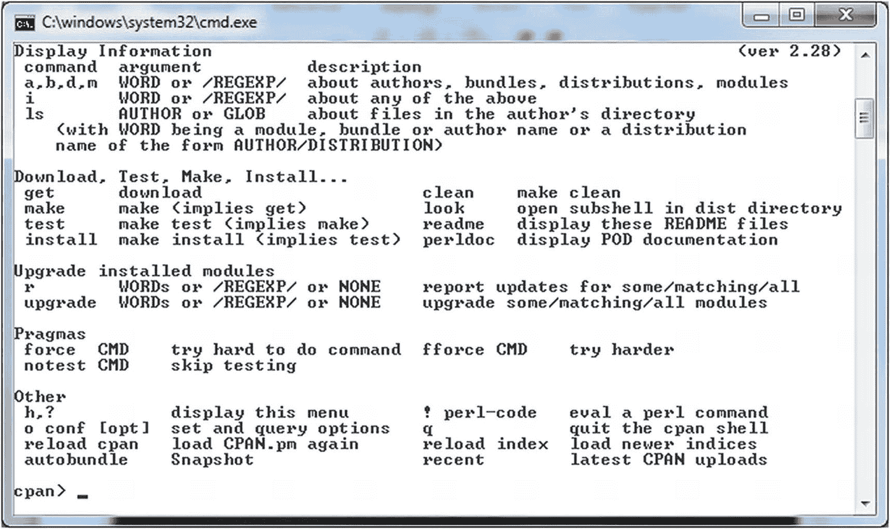

*一个标题为 C slash window slash systems 32 slash C M D. E X E 的输出窗口截图。页面包含显示信息、命令参数、升级已安装模块、指令和其他。*

**图 7-1**
CPAN.bat 帮助选项

只需输入如下指令：
```
Install DBD
```
`CPAN.bat` 就会开始工作并安装 `DBD.pm` 模块。如本章前面所述，请在安装 `DBI.pm` 之前执行此操作。如前所述，`CPAN.bat` 通常知道安装每个模块的全部功能需要哪些库。

### Perl 包管理器 (PPM)

Perl 包管理器是安装 Perl 模块的另一种方法。有人说它更易用，可能确实如此，但 `PPM` 的功能存在限制。例如，`CPAN.bat` 知道迄今为止创建的几乎每个模块所需安装的库。`PPM` 没有一个全面的数据库，因此有时 `PPM` 无法工作。

与 `CPAN.bat` 一样，只需双击 `ppm.bat` Windows 批处理文件。将显示一个命令对话框。在命令提示符处输入单词 `help`，将出现如图 7-2 所示的屏幕。

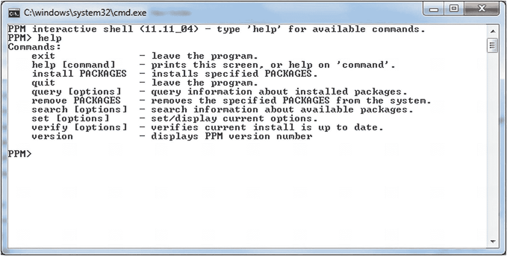

*一个标题为 C slash windows slash system 32 slash C M D. E X E 的输出窗口截图。页面显示 P P M 交互式 shell，键入和下方的命令列表。*

**图 7-2**
PPM.bat

如您所见，由于缺少可选命令，`PPM` 比 `CPAN.bat` 更易于使用。虽然大多数模块都能顺利安装，但要做好准备，当您需要的一两个模块无法用 `PPM` 安装时。

### 常用 Perl 模块

正如您将在后面的章节中看到的，几乎对于目前互联网上可能实现的任何事情，都有一个相应的模块。之前也提到过，有些 Perl 模块需要先安装支持模块。

在后续章节的项目中，您将在每个脚本的顶部看到 Perl 脚本工作所需的 Perl 模块列表。我发现标准发行版中最常用的模块如下：

- `Size.pm`
- `Resize.pm`
- `File::Copy`
- `Image::Magick`

从它们的名称就可以直观地看出它们的用途。`Size.pm` 用于以像素为单位返回图像的大小。`Resize.pm` 用于将图像调整为更大或更小的尺寸。与所有 Perl 事物一样，有几点需要注意。`Size.pm` 和 `Resize.pm` 模块都只适用于 `jpg` (jpeg)、`gif` 和 `png` 文件格式。

`Image::Magick` 模块需要在您的服务器上安装其软件包，才能访问 `Image::Magick` 模块的高级功能。有源代码（用于 Linux）和二进制文件（用于 Windows）可供下载和安装。在两种操作系统上安装都非常简单容易。`Image::Magick` 支持几乎所有现有的图像文件格式。借助它，您可以通过脚本操作来处理图像，正如第 6 章所提及的。

## 总结

在本章中，我们安装了 Perl 并回顾了典型 Perl 安装的要点。我们讨论了 Perl 模块及其工作原理。我们还探讨了如何使用 `CPAN.bat` 和 `PPM.bat` 安装 Perl 模块。

# 8. 安装和使用 MySQL 数据库服务器

MySQL 数据库服务器已存在多年，因此它是一款健壮且实用的软件。其功能众多且强大。MySQL 是世界上使用最广泛的数据库。要获得这个称号，它必须足够优秀。这是一项相当了不起的成就。即使与 Oracle 这样的大型数据库供应商相比，MySQL 也能胜任。SQL（结构化查询语言）是一种易于学习的简单数据库语言，而服务器本身也易于安装、使用和配置。MySQL 是一款内存驻留型软件，这意味着服务器的所有功能部件都加载到内存中，准备好执行查询，而无需暂停以将更多软件加载到内存来完成手头的任务。

## 定位和下载 MySQL 服务器二进制文件

您要安装 MySQL 服务器的软件可以从 `MySQL.com` 获取。他们免费提供 MySQL 数据库。付费软件包适用于需要高级功能（如集群和其他用于容纳高流量网络所需技术）的生产环境。他们向您销售该软件，并附带技术支持选项。大多数人认为它比免费版本更好，就功能而言，他们是对的。来自 `MySQL.com` 的二进制包是为网站设计的，不提供对集群或数据库场的支持。

## 什么是 Beta 版？

如果您过去安装过软件，您可能遇到过下载 Beta 版的选项。Beta 版是处于调试过程中的软件片段。它们已经编写完成，但仍包含错误或遗漏。请预期 Beta 版会出现错误。不建议您在活动的数据库服务器上使用 Beta 版，因为其中存在的错误将导致麻烦接踵而至。它们玩玩很有趣，但在实际生产环境中运行只会让您感到沮丧。

## 准备您的工作站

建议您在开始安装过程之前保存所有工作并关闭任何活动的软件。运行可能干扰服务器或与服务器不兼容的软件，确实会对您的安装以及整个工作站的基本健康构成威胁。还建议您在开始安装前重新启动工作站。这将确保您使用的是一个未因其他软件而引入错误或缺陷的操作系统。


## 安装 MySQL 服务器

### 安装类型选择

与大多数软件安装一样，系统首先会询问你是否允许对操作系统进行更改。点击 `Yes` 或 `No`。选择 `Yes` 将开始 MySQL 服务器的安装。选择 `No` 则会立即终止安装。

安装程序打开的第一个对话框是用于选择安装类型的。共有五种不同的安装选项。虽然最终都应该逐一探索，但为了便于讨论，我们将选择 `Full` 完整安装类型。这将安装该二进制文件所能提供的所有功能和特性，包括官方手册。

MySQL 服务器的安装和配置通常需要大约十分钟，具体取决于你可用的资源以及你选择安装的内容。系统将要求你提供一些基本信息，如用户名、密码和网络配置等，我们将在需要时进行讨论。

MySQL 安装包主要有两种安装类型：一种是小型安装包，大小为 4 或 5 兆字节；另一种是 450 兆字节的安装包。两者之间的区别在于安装过程的进行方式。小型安装包是一个 Web 安装程序。如果使用此安装包，安装将开始，但随后会暂停以下载其余的安装软件。大型安装包则是一个完整的`MSI`安装程序包。

建议你下载完整的 450 兆字节安装包，这样即使互联网连接出现问题，你仍然可以安装和配置工作站（图 8-1）。

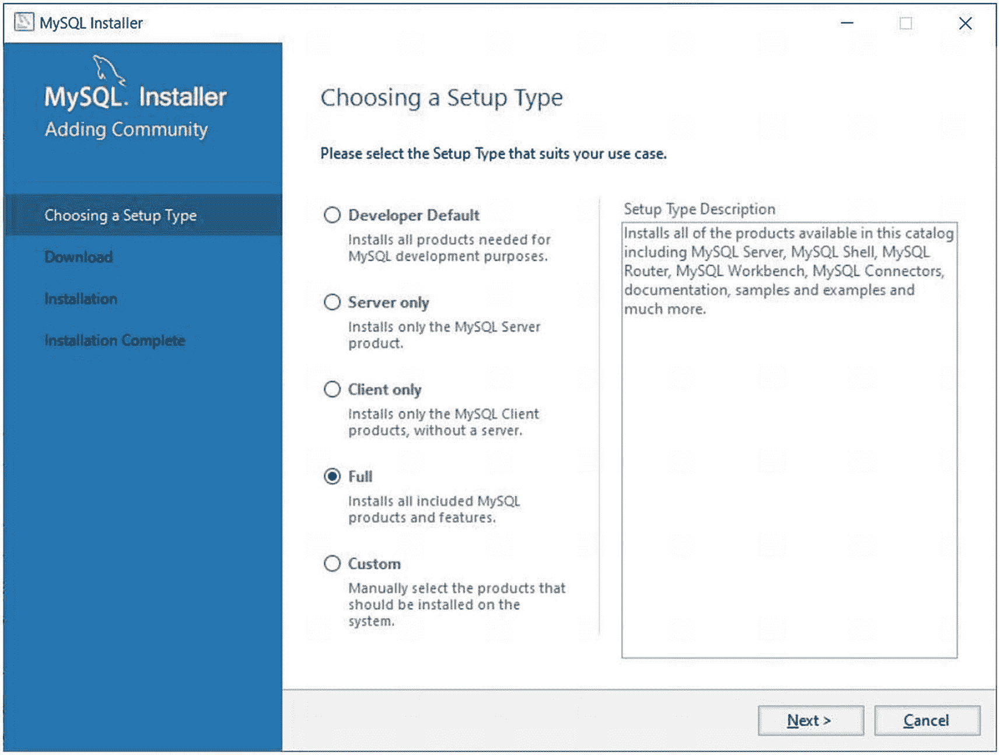

*一个标题为“MySQL installer”的窗口截图。页面包含安装类型选择，选项有开发者默认、仅服务器、仅客户端、完整和自定义。此处选择了完整套件选项。屏幕左侧提供了安装类型描述框。*

**图 8-1** 选择安装类型

每种安装类型的作用是直观明了的。选择每个选项都会在单选按钮右侧的“安装类型描述”框中简要说明将要发生的情况。该安装程序是一个非常稳定且功能强大的工具。

我们选择 `Full` 完整安装是因为能够方便地在本地工作站上随时查阅所有手册和文档。`Full` 完整安装附带的手册和工具是不可或缺的。

如果你安装了 `Full` 完整版，所有功能都将准备就绪，可供使用。如果你安装的是 `Developer` 开发版，你将不会获得 `Full` 完整安装中包含的文献或工具，但你的安装仍然会非常强大。

选择 `Custom` 自定义安装将为你提供广泛可用的功能特性，可通过单选按钮、复选框和下拉列表进行选择。

### 检查系统要求

下一个对话框（图 8-2）会检查你的工作站是否满足系统要求。根据先前已安装的软件，安装程序可能会尝试安装多达十项系统要求。

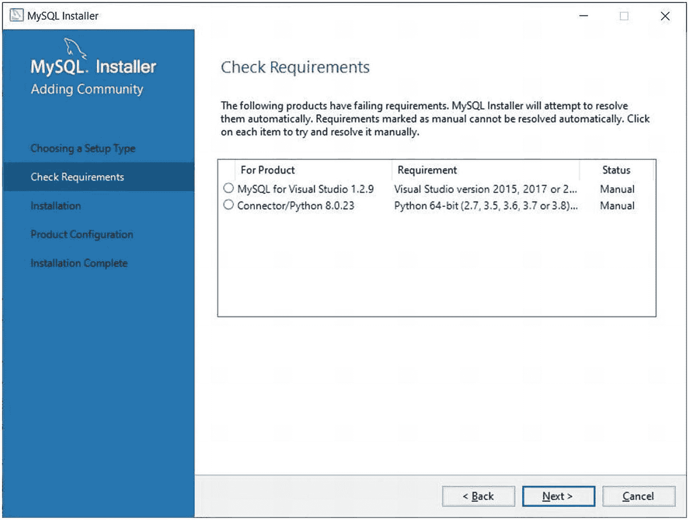

*一个标题为“MySQL”的窗口截图。屏幕右侧包含选择设置、检查要求、安装、产品和安装配置。此处选择了检查要求选项。页面中间部分打开，包含描述。下方提供了产品及相关要求。*

**图 8-2** 检查系统要求

可能有少数几项系统要求是安装程序无法安装的。这些要求通常不是必需的，除非你使用的是与向网页提供数据无关的工具。如图 8-2 所示，仅剩的两个用于实现完整功能的系统要求通常不用于互联网站点，并且超出了本书的讨论范围。

标记为“Manual”（手动）的要求需要你自行查找、下载并安装支持软件，以最终获得具有完整功能的完整安装。正如我所提到的，这些产品通常不用于当今的网页。

### 安装过程

如图 8-3 所示，有十个产品已准备好安装。这是 `Full` 完整安装的典型情况。使用这些产品，你几乎可以完成现代网页所需的任何工作。

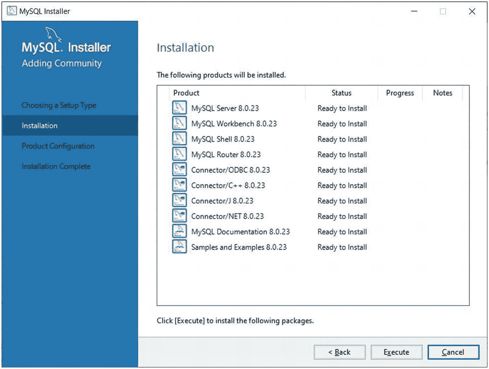

*一个标题为“MySQL”的窗口截图。屏幕右侧包含选择设置、安装、产品和安装配置。此处选择了安装选项。页面中间部分打开，显示以下产品：MySQL server 8.0.23、MySQL shell 8.0.23 等。*

**图 8-3** 待安装的软件

应当注意，如果你打算安装到的硬盘驱动器上没有足够的可用空间，操作系统此时将中止安装。下载的 `MSI` 文件大小约为 450 兆字节。解压缩文件后预计会占用更多空间，大约在 520 兆字节范围内。因此，总共需要的空间大约是 1GB。请确保你的硬盘驱动器有足够的空间。查看图 8-4：

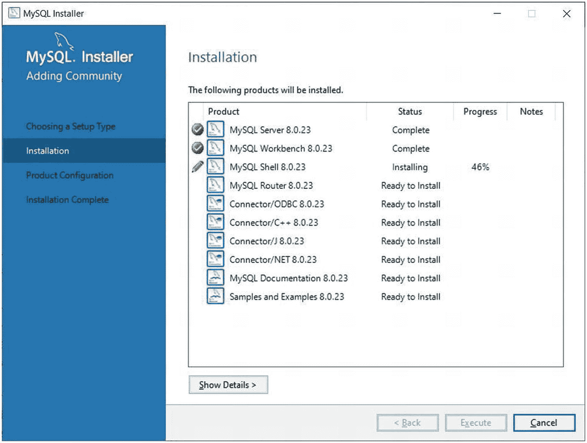

*一个标题为“MySQL”的窗口截图。屏幕右侧包含选择设置、安装、产品和安装配置。此处选择了安装选项。包含产品列表、状态、进度和注释。前两个产品已完成，第三个处于安装状态。*

**图 8-4** 正在安装 MySQL 服务器

我见过此阶段花费的最长时间是十分钟。任何较新的工作站都能轻松应对安装程序的要求。成功安装的产品会显示一个绿色对勾。当前正在安装的产品则显示为一个可爱的铅笔图标。

这个阶段基本上就是你坐下来观看安装程序工作。此时安装程序应该已经报告了错误，所以可以很有把握地认为安装将会成功。如果你想实时查看具体进展，请点击 `Show Details`（显示详细信息）按钮。

如果有其他正在访问安装程序所需相同资源的软件在运行，安装可能会出现问题。请务必关闭所有可以关闭的程序，特别是使用互联网或通信功能的软件。也不要保留你用来下载二进制文件的网页浏览器。

### 安装完成

如图 8-5 所示，所有产品均已成功安装。现在，安装程序将弹出一系列对话框，要求你设置用户名和密码。我建议你将这些信息记录在多个不同的地方，直到它们成为你的第二天性，因为你每天将会多次使用这些信息来配置你的安装。

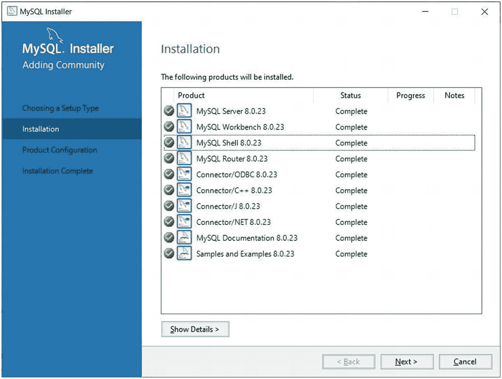

*一个标题为“MySQL”的窗口截图。屏幕右侧包含选择设置、安装、产品和安装配置。此处选择了安装选项。包含产品列表、状态、进度和注释。所有产品状态均为完成。第三个产品被打上了方框标记。*

**图 8-5** 所有产品安装完成

## MySQL 安装与配置指南

值得注意的是，安装的 MySQL 文档包含了适用于您日常数据库管理工作的便捷提示和工具。请务必查看并阅读。我使用 MySQL 已有二十年，每次阅读 MySQL 文档和“示例”时都能学到新知识。

无论您选择何种类型的安装，都至少需要为以下三个产品提供一些信息。问题涉及 `root` 用户名和密码以及普通用户的用户名和密码（参见图 8-6）。

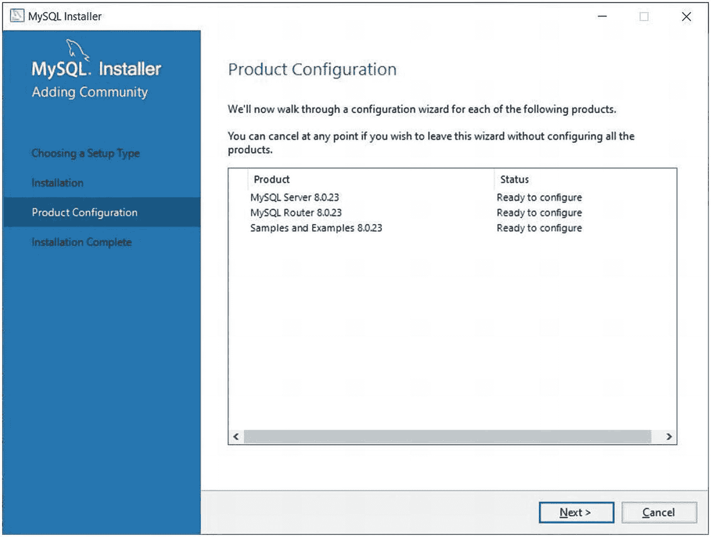

一个标题为“My SQL”的窗口截图。屏幕右侧包括选择设置、安装、产品和安装配置。此处选择了产品配置选项。页面中间打开，包含描述和三个产品的状态列表。

**图 8-6** 产品配置区域的首个屏幕

正如我之前提到的，请将这些信息记录在多个地方。您必须提供管理员以及用户的用户名和密码。

请看图 8-7，它显示了在本地网络上配置服务器的选项。有几种不同的配置类型 (`Config Types`) 可供选择。我建议您保持选择“开发计算机” (`Development Computer`)。这是因为其他选项假设该工作站（现在是服务器）是运行的主要软件。MySQL 引擎和支持程序被直接加载到内存中。操作系统未占用的其余可用内存都将分配给 MySQL 服务器。

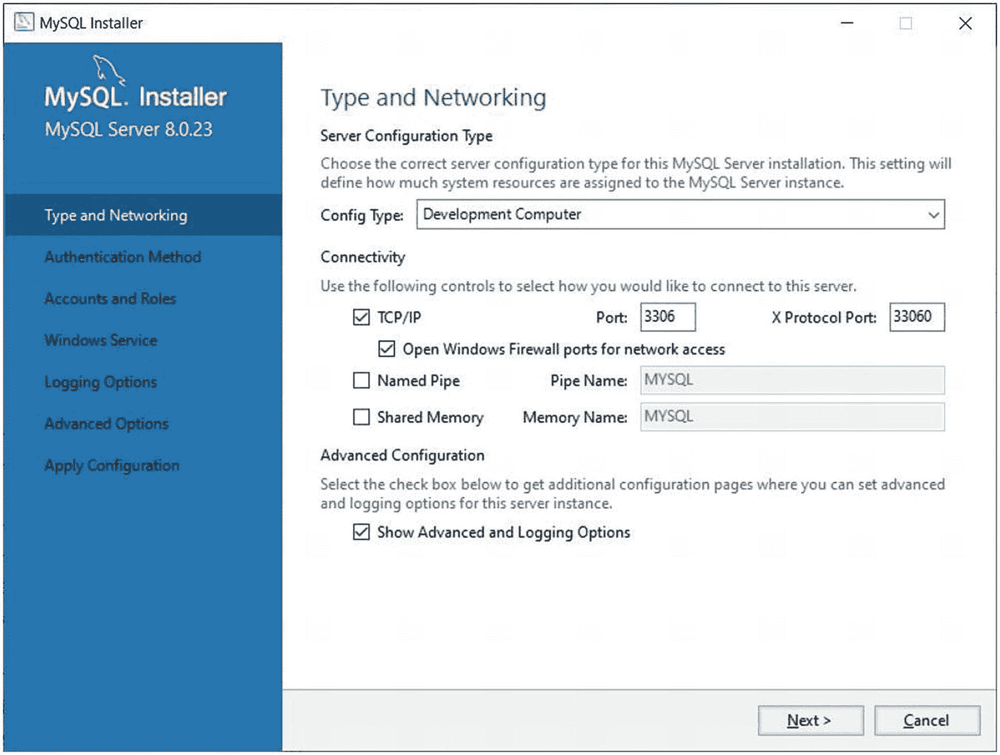

一个标题为“My SQL”的窗口截图。屏幕右侧包括类型与网络、认证方法、账户与角色、Windows 服务等选项。类型与网络选项被选中。页面中间打开，显示服务器配置类型、连接性和高级配置。

**图 8-7** 设置网络和安装选项

图 8-7 显示了通过 MySQL 安装程序可用的选项。请始终选择 `TCP/IP`。默认端口（已填好）应与您所有的用户名和密码一起记录下来。其他技术，如 Apache Web 服务器，为每种通信协议使用双方商定的端口号。每个主要服务器或工具都有自己的连接端口，这从程序角度来说可以提高速度。

还有一个选项是使用 `Windows Firewall` 为将来的数据库使用提供一些安全保障。`TCP/IP` 是一种非常强大的通信协议，自互联网作为研发项目的最早期以来，它一直是互联网上使用的主要协议。

另一个需要注意的复选框是“显示高级和日志记录选项” (`Show Advanced and Logging Options`)。如果您曾经安装过使用通信和操作系统高级功能的东西，您很可能通过查看数十个日志中的一个或多个来解决该问题，这些日志提供了错误线索，有时甚至就如何处理致命错误给出建议。

图 8-8 中给出的两个选项，基本上是在要求一种对连接到 MySQL 服务器并运行查询所需的用户名和密码进行认证的方法。

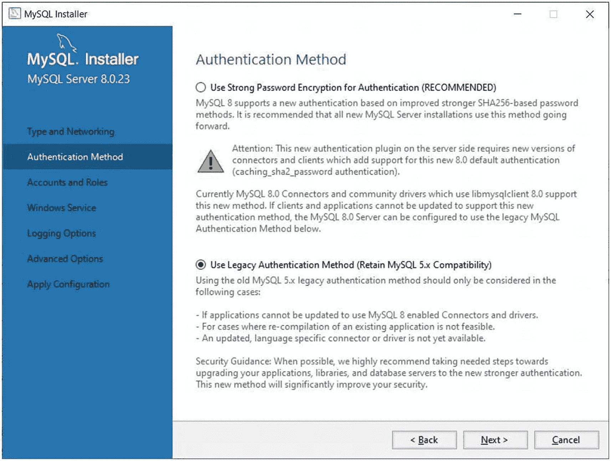

一个标题为“My SQL”的窗口截图。屏幕右侧包括类型与网络、认证方法、账户与角色、Windows 服务等选项。认证方法被选中。页面中间打开，显示强密码加密和传统认证方法。

**图 8-8** 认证方法的两个选项

由于您很可能不是在安装专用的数据库服务器，因此建议您选择“使用传统认证方法” (`Use Legacy Authentication Method`)。这是为了向后兼容以前的、过时的（但仍在使用的）服务器。上一次认证方法被更改或添加是在 MySQL 服务器 5.X 版本时期。

您必须指定一个 `root` 用户名和密码。再次强调，在多个地方记录下来，直到您使用得如此频繁，以至于在需要认证时能够不假思索地回忆起来（图 8-9）。

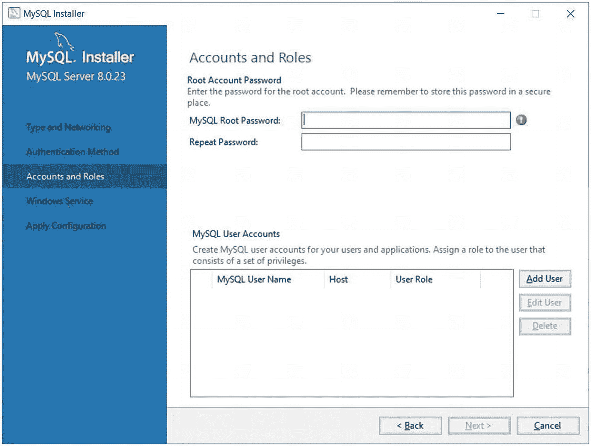

一个标题为“My SQL”的窗口截图。屏幕右侧包括类型与网络、认证方法、账户与角色、Windows 服务等选项。账户与角色选项被选中。页面包含 `root` 账户密码、我的 SQL `root` 密码、我的重复密码和我的 SQL 用户账户。

**图 8-9** 设置管理用户名和密码

有一个显示密码强度的度量条。请使用大小写字母、数字和标点符号。在密码中使用这四种类型的字符将产生一个强密码，您必须将其记录下来，直到能够瞬间想起它。
如果密码强度被判定为弱，安装程序将不允许您继续。在安装程序允许您继续之前，密码强度必须至少为“中等”。
建议您在此对话框中至少创建一个用户，并将管理权限分配给该新创建的用户。使用超级用户 (`superuser`) 而不是 `root` 账户，可以让 MySQL 服务器和操作系统的安全关注点协同工作，确保每次访问数据库时都能进行安全的事务处理。

图 8-10 中要求填写的信息字段是直观明了的。您将提供一个用户名以及一个密码，该密码的强度同样必须至少为“中等”。

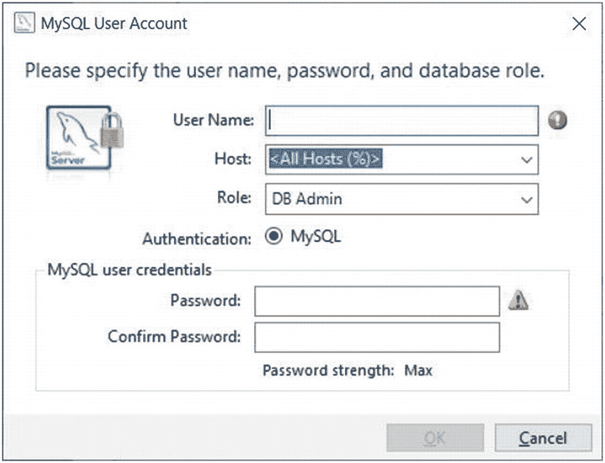

一个标题为“my SQL 用户账户”的页面截图。该页面包括用户名选项、主机和角色下拉框，以及“my SQL 认证”选项。在“my SQL 用户凭据”中，选项包括密码和确认密码。

**图 8-10** 添加用户

为第一个用户保留“数据库管理员” (`DB Admin`) 角色。将此用户名和密码记录在多个地方。到现在为止，您应该已经记录了大约半页的安全信息，这些信息对于使用 MySQL 服务器至关重要。制作多份副本并分发给所有需要的人。
让认证由 MySQL 解决。这是因为 MySQL 用户名和密码经过比操作系统等其他实体更严格的认证协议。
当密码强度为“中”或“最大”时，“确定”按钮将变为可用，允许您继续进行服务器配置。

图 8-11 显示了将安装配置为 `Windows Service` 的选项。我们不希望这样，所以请取消此字段的勾选。您还会看到一个“在启动时运行服务器” (`Run at Startup`) 的复选框。您不希望发生这种情况，请确保它未被勾选。

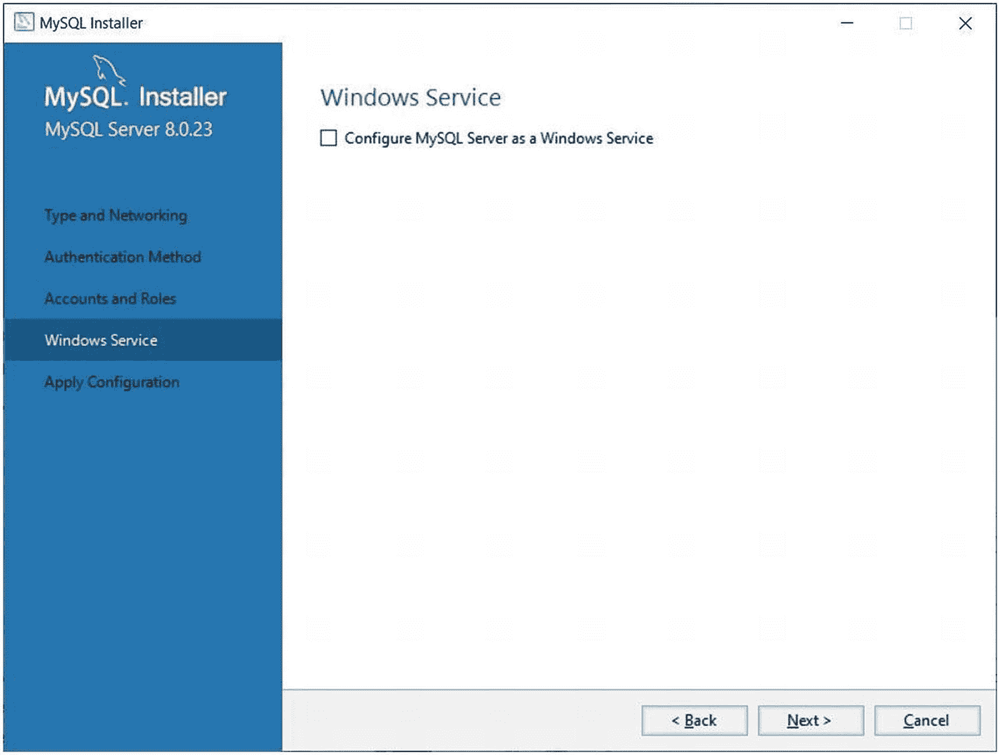

一个标题为“My SQL”的窗口截图。屏幕右侧包括类型与网络、认证方法、账户与角色、Windows 服务和应用程序更改等选项。Windows 服务选项被选中。页面中间打开，显示“将 my SQL 服务器配置为 Windows 服务”选项。

**图 8-11** 选择配置方案

### 在启动时运行 MySQL 服务器

如果你在启动时运行 MySQL 服务器，操作系统的其余能力将会受到影响，并且比你在控制台中启动 MySQL 服务器时更受限，这将在本章接下来的部分中讨论。

### 应用配置

接下来显示的对话框是“应用配置”部分（图 8-12）。正如我在本章前一节中提到的，如果安装过程中有任何错误，到现在应该已经出现了。你的安装配置很可能会成功应用。

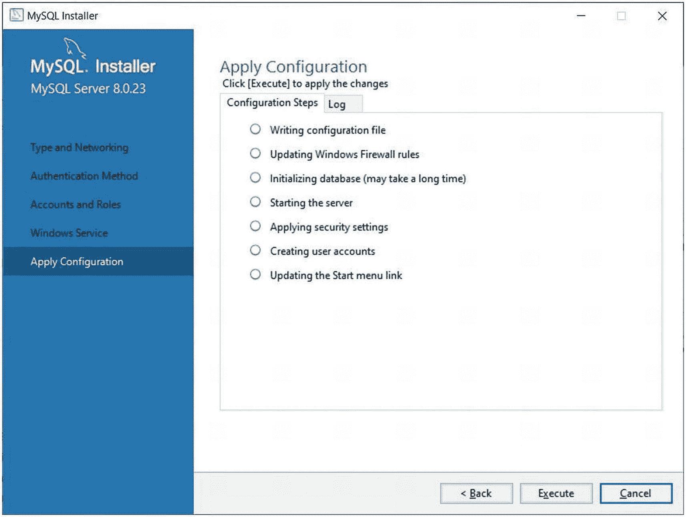

一个标题为 MySQL 的窗口截图。屏幕右侧包括类型和网络、身份验证方法、账户和角色、Windows 服务等。应用配置选项被选中。页面包含一系列将执行以应用更改的配置步骤。

图 8-12
应用服务器配置偏好设置

点击此对话框中的 `Execute` 开始应用配置。注意有一个 `Log` 选项卡可以点击。如果你遇到错误，这个日志将报告正在执行的所有操作。在安装的这个阶段，致命错误通常只来自磁盘空间不足或处理器利用错误和兼容性问题。

这个过程需要几分钟。你会注意到指针随着配置的进行变成沙漏和工作环。如果你启用了防火墙，系统可能会要求你允许 MySQL 服务器进行身份验证，或者完全绕过防火墙的身份验证。我的建议是让防火墙忽略 MySQL 查询，允许它们通过防火墙的影响范围。

这种绕过是为了让你能够练习使用专用的 MySQL 服务器，也许是在多服务器设置中。正如你将在后续章节中看到的，MySQL 与 Perl 和 Apache Web 服务器配合得很好。一个常见的多服务器设置是使用三个独立的物理服务器：一个用于数据库服务器，一个用于 Perl 脚本服务器，一个用作文件服务器。

### 启动 MySQL 服务器

通过命令行启动 MySQL 服务器是一个简单的任务。开始启动只需要这个简短的命令： `mysql -u root -p` 。下面的用户是 `root` 服务器。按 Enter 键后，系统会要求你输入用户名和密码。请从你已经积累并希望已经记住的用户名和密码页面提供它们。

```bash
mysql -u root -p
```

## 总结

在本章中，我们讨论了 MySQL 数据库服务器的安装和配置。你学习了如何将你的工作站变成一个强大的数据库服务器。在接下来的章节中，本章提供的知识将是无价的。请继续阅读；在我们完成之前还有很长的路要走。

# 9. 安装和使用 Apache Web 服务器

Apache Web 服务器的核心功能是提供网页服务。它是一个高度专业化且强大的软件应用程序，每天用于服务数十亿网页。Apache Web 服务器是当今互联网上使用最多的 Web 服务器。

Apache 最基本的功能是提供静态的、不变的 HTML 文档。这具有易于实现的优点——HTML 是一种简单的语言。如果你的网站正如你所设想的那样是一个简单的事务，那么请务必探索这一点。如果你想要由强大的数据库驱动的动态生成的网页，那么请继续阅读。Apache 可以与 Perl 一起使用，根据 Perl 脚本中给出的规则生成网页。这比静态 HTML 方法更复杂，但额外的思考、规划和时间是非常值得的。你努力工作的回报将是一些非常强大且功能齐全的网站，它们会吸引用户的注意力并保持住。

Apache 可以与多种编程语言一起工作，无论是脚本语言还是编译语言。Apache 通过使用这些不同的编程语言提供了广泛的数据处理能力。它是一个多功能且制作精良的产品。

## 处理错误

Apache 几乎为所有东西都提供了一个错误页面。正如你将在后续章节中看到的，当出现问题时（通常是在通过 `httpd.conf` 文件配置 Apache 时），这些错误页面是不可或缺的。这个配置文件将在后续页面中完整解释。

在开始安装之前，建议你“ping 堆栈”，这是操作系统准备好执行你可能要安装的任何功能的技术术语。

如果控制 Windows 工作站上通信的软件和/或硬件失败，你要做的第一件事就是 ping 环回地址，如图 9-1 所示。

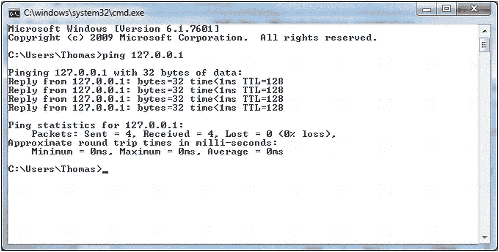

一个标题为 C:\windows\system32\CMD.EXE 的输出窗口截图。它描绘了工作站失败时 ping 环回地址的情况。页面显示 C:\Users\Thomas> ping 127.0.0.1。Ping 从 127.0.0.1 开始，数据为 32 字节。

图 9-1
Ping 本地环回地址

如你所见，向 `127.0.0.1` 发送了四个 ping 以确保操作系统正常运行。如果操作系统状态不佳，你会收到一条错误消息，指出找不到该 `IP` 地址。

## 下载和安装 Apache Web 服务器二进制文件

学习 Apache Web 服务器的第一步是简单地找到软件。一个简单的 Google 搜索会告诉你在哪里可以找到 Apache。Apache 已经存在了几十年。制作它的人过去和现在都做得非常好，而且找到 Apache 二进制文件相当容易。这个 Web 服务器是在考虑 Linux 操作系统的情况下开发的。它被移植到一个 Windows 操作系统可以处理的可执行包中。

二进制文件以 `.msi` 包的形式提供，这是在 Windows 上安装几乎所有软件包的标准方法。安装相当基础。在配置服务器并使其在 Windows 工作站上加载时，学习曲线会变得陡峭。

## 允许对操作系统进行更改

Windows 操作系统首先会询问你是否允许对你的计算机进行更改。如果你拒绝此提示，安装将停止。安装在 Windows 计算机上的每个程序都将以此方式启动。启动画面出现，如图 9-2 所示。单击“下一步”继续。

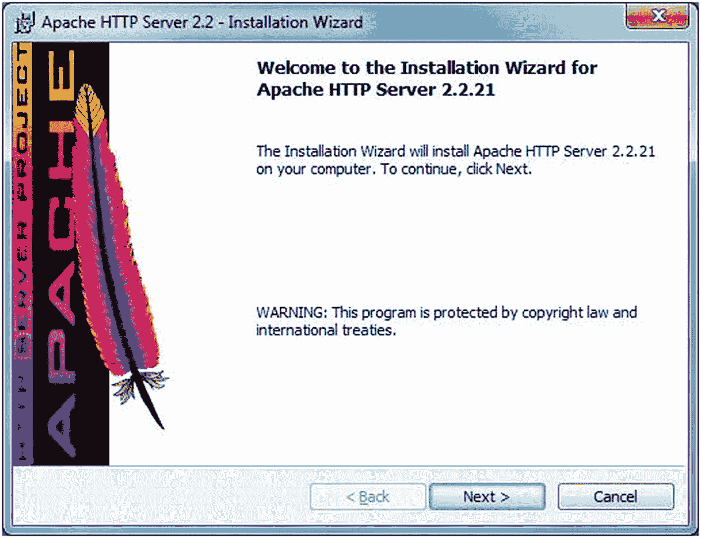

一个标题为 Apache HTTP Server 2.2 Installation Wizard 的窗口截图。模板页面显示“欢迎使用 Apache HTTP Server 2.2.21 安装向导”。它包含一个警告提示。

### 图 9-2

Apache 二进制安装程序的启动画面。

如同所有软件安装一样，首先会显示一个标题页面，展示重要数据，如版本和版权声明。接下来是许可协议和法律条款。您必须审阅此页面上的信息，以确保不会违反合同。内容相当基础。

许可协议本身并不冗长或复杂。其中大部分是基本规则和通用使用说明。基本上，只要您不修改源代码并期望它正常工作，就可以使用。

协议中的另一项重要声明是，您不得将 Apache 服务器作为自己的产品出售，即使在修改了大部分源代码之后。

请务必阅读该协议。只需几分钟，但它回答了许多关于如何以及如何不能使用此软件的问题。

点击图 9-3 所示的接受选项，然后点击下一步。

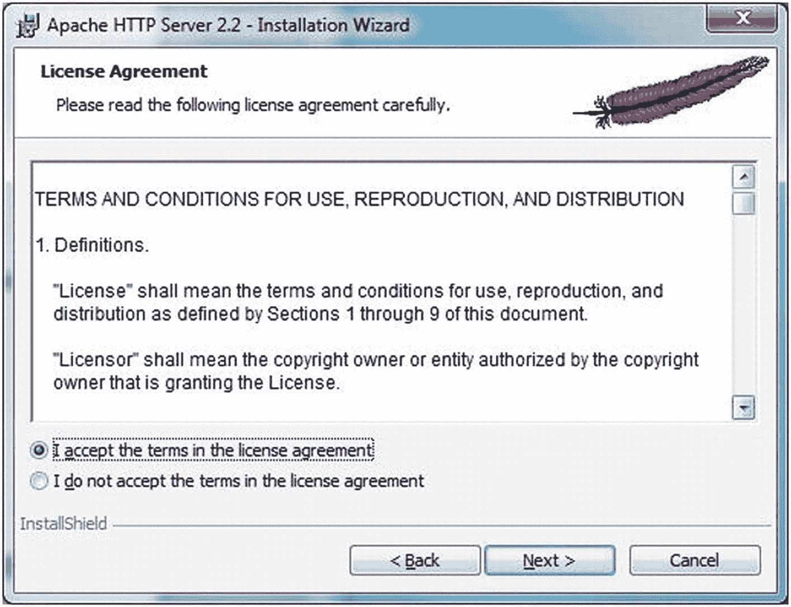

一个标题为 "Apache HTTP server 2.2 安装向导" 的窗口截图。该页面显示许可协议及其下方的条款和条件。要进入下一页，需选择接受选项。

### 图 9-3

接受许可协议。

免费软件中使用的协议通常始于 GNU 公共许可证，这是 Apache 等免费软件早期使用的标准协议。

许可协议之后是一个窗口，您需要在两处输入本地回环地址 `127.0.0.1`，如图 9-4 所示。该页面要求提供网络域名 Internet 地址、服务器名称、管理员电子邮件，以及是作为服务安装还是在控制台中手动安装。

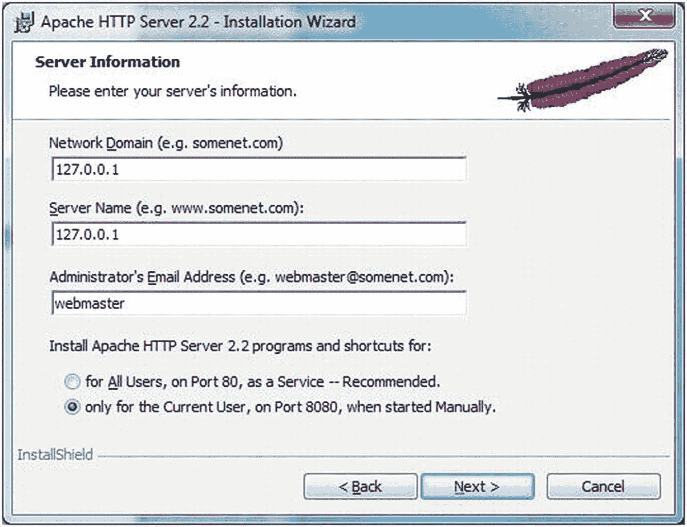

一个标题为 "Apache HTTP server 2.2 安装向导" 的窗口截图。该页面显示服务器信息。它包括网络域名、服务器名称和管理员的电子邮件地址。

### 图 9-4

填写安装选项。

这里我们需要解释一下。一个程序——在此情况下是一个服务器——可以作为操作系统的**服务**运行，也可以作为控制台中的**程序**运行。在控制台中运行的程序是从命令行启动的，并在黑底白字的屏幕上显示其操作参数。

选择哪种方式通常取决于您安装的用途。如果 Apache 安装在将作为实时 Web 服务器运行、通过 Internet 提供页面的服务器上，请选择作为服务安装。如果它将是一个 Web 开发工作站，请选择手动启动（即在命令提示符下启动）。在控制台中启动仍然提供完整功能，但不会持续运行，例如当您不编写网页时。

您可能想知道为什么我在 "网络域名" 和 "服务器名称" 字段中都使用本地回环地址。为了提供域名服务，您必须安装并使用 `DNS`（域名服务器）。`DNS` 服务器将计算机理解的 `IP` 地址匹配成人类可以理解的形式，即域名。虽然您可以轻松地通过 `IP` 地址找到网站，但对大多数人来说，如果想再次找到该网站，记住单词比数字更有效。`DNS` 服务器如何完成这些工作超出了本书的范围。为了使工作站能为自身提供网页服务，您需要使用此地址，操作系统会自动将其视为本地安装。

作为服务安装 Apache 需要管理员权限。停止和启动服务器也需要此权限，如果您以这种方式安装，将会看到。

作为手动启动的程序安装，允许您根据需要简单地停止和启动 Apache 服务器，而不是在您不编程或不提供页面时，它始终作为一个占用资源的活动服务。下一个窗口，图 9-5，要求您选择 "自定义" 或 "典型" 安装。选择 "自定义" 并点击下一步。

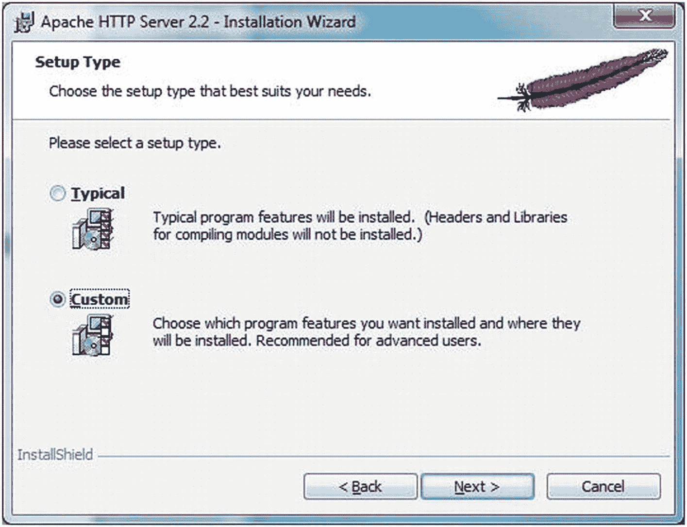

一个标题为 "Apache HTTP server 2.2 安装向导" 的窗口截图。该页面显示安装类型。包括两种类型：典型和自定义。此处选择了自定义选项。

### 图 9-5

选择典型或自定义安装。

询问安装选项。默认情况下 `Build Headers and Libraries` 未被选中。勾选它以进行安装。将安装目录设置为 `C:\Apache`。

您可能需要多次更改此字段。安装程序希望您将 Apache 目录命名为 `Apache2.2`。本书其他地方我曾说过要尽可能保持简单。使用简单易记的安装路径，您就不必查找目录或资源名称。请务必保持简单。查看图 9-6：

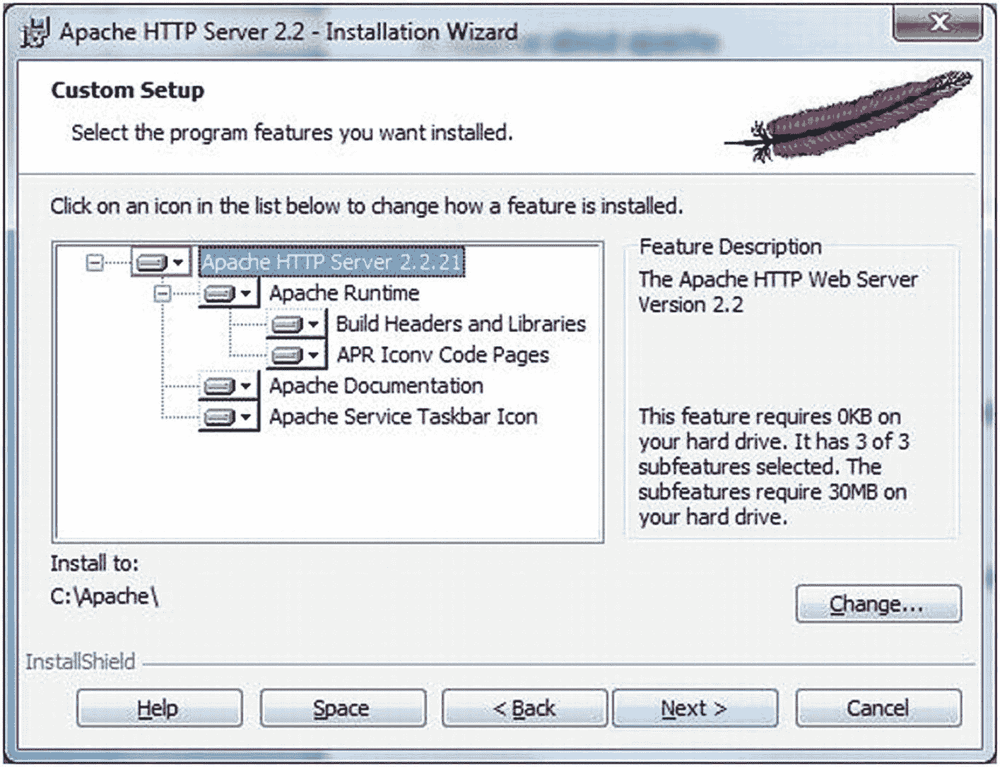

一个标题为 "Apache HTTP server 2.2 安装向导" 的窗口截图。该页面显示自定义安装选项。它包含一个功能列表及其描述。第一个功能被选中，下方提供了相关描述。

### 图 9-6

指定要安装到硬盘上的内容。

下一个选项是点击 "安装" 按钮开始安装，如图 9-7 所示。您将看到一个带有进度条的窗口，让您了解安装进度。安装通常只需要几分钟。

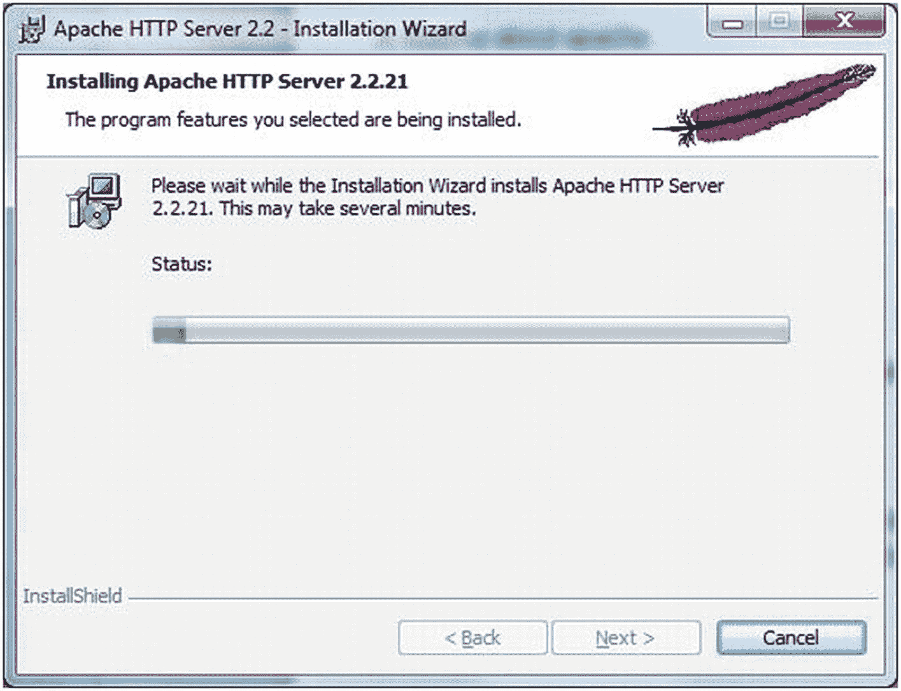

一个标题为 "Apache HTTP server 2.2 安装向导" 的窗口截图。该页面显示正在安装 Apache HTTP server 2.2.21。选定的程序功能正在安装。下方提供了安装过程的状态。

### 图 9-7

安装进度窗口。

进度条消失后，您的计算机显示图 9-8，表示您已完成安装。现在 Apache Web 服务器已在您的工作站上。

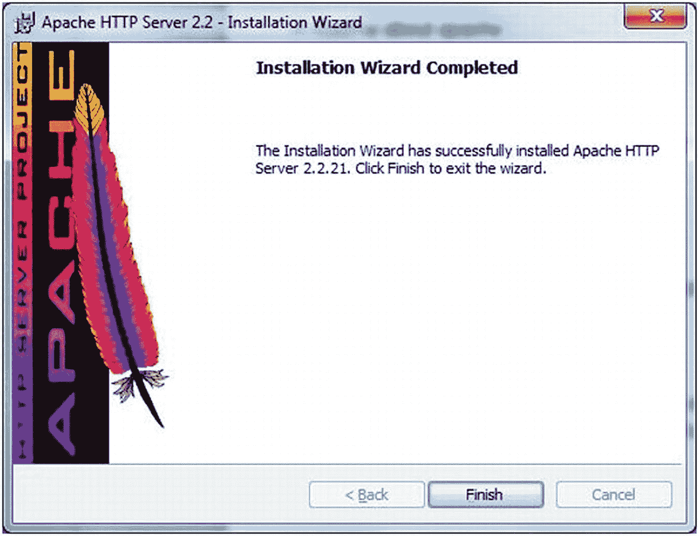

一个标题为 "Apache HTTP server 2.2 安装向导" 的窗口截图。模板页面显示已完成的安装向导窗口。

### 图 9-8

安装完成窗口。

## Apache 和 DBI.pm

Perl 的 `DBI` 模块可能是已投入生产的最佳模块之一。借助它，您能够及时有效地与多个流行的数据库服务器进行交互。`DBI` 提供的方法使得连接和与数据库交互变得简单而有效。以下所有示例均假设您使用的是当前版本的 `MySQL`。

首先，让我们专注于连接到数据库。与所有 Perl 事物一样，有几种不同的方法可以做到这一点，并且都可以是正确的。我们将使用我所见过的连接到 `MySQL` 数据库的最常见语法。

您在使用数据库时遇到的错误原因，与使用系统调用时类似。正如您应该始终检查系统调用的返回码一样，您也应该始终检查数据库调用的返回状态。最简单的方法是将 `DBI` 的 `RaiseError` 属性设置为 `1`。首先，您需要连接到数据库并检查返回值。您将设置 `RaiseError` 属性，如代码清单 9-1 所示。


### 连接到 MySQL 数据库

```perl
$dbh = DBI->connect('DBI:mysql:host=127.0.0.1;database=tvalentine3', 'tvalentine', 'valentine1',
{'RaiseError' => 1}) or die "Cannot Connect to the database:", $DBI::errstr;
```
*列表 9-1 连接到 MySQL 数据库*

通过这样做，你确保任何数据库错误都会引发 `DBI` 抛出 `die`。
如果你正在编写数据库应用程序并遇到了数据库错误，你不希望继续执行，好像什么都没发生一样。你也可以在 `eval` 中捕获 `die`——只要确保你处理了错误，而不是忽略了它。

### 使用占位符

这就是连接到数据库；现在让我们来研究使用占位符而不是字面值。许多人总是建议在数据库调用中使用占位符而不是字面值。这可以加快执行速度，并通常使数据库调用更快、更可靠。请看下面的例子：

```perl
$dbh->do(qq{INSERT INTO $this_table (col1, col2, col3)
VALUES (?, ?, ?)}, undef, '$col1', '$col2', '$col3');
```

我们在一行中插入了三列：`col1`，`col2` 和 `col3`。我们所做的是将占位符用作数据库插入的值，并提供了包含实际要插入数据的变量。这是一种执行数据库调用的简单且非常快速的方法。

### 处理 SELECT 语句

现在让我们专注于 `SELECT` 语句。当你执行一个 `SELECT` 语句时，你显然希望尽快取回数据。最快的方法是使用 `bind_columns()` 和 `fetchrow_array()` 方法。`bind_columns` 将 Perl 变量绑定到 `SELECT` 语句返回的列。例如，如果你有以下 SQL 语句：

```sql
SELECT id, name, postid FROM $thistable
```

你会希望使用 `bind_columns()` 方法将三个变量绑定到相关联的列。因此，你设置好变量，然后使用 `bind_columns` 来绑定它们：

```perl
$sth->bind_columns(undef, \$id, \$name, \$postid);
```

传递给 `bind_columns` 的第一个参数实际上是一个哈希引用，用于指定要与此特定方法关联的 `DBI` 属性。我们不想为此特定方法关联任何属性，所以我们只传递 `undef`，这是完全可以的。在你对语句句柄调用 `execute` 之后，你需要获取数据。为此，请使用 `fetchrow_array()` 方法，该方法获取下一行并返回一个包含字段值的数组引用。但你并不需要使用该数组引用，因为你已经将列值绑定到了 Perl 变量，你可以直接使用它们，如 **列表 9-2** 所示。

```perl
while (@this_data = $sth->fetchrow_array()) {
    $id = $this_data[0];
    $name = $this_data[1];
    $postid = $this_data[2];
}
```
*列表 9-2 选择和检索三个数据库项*

每次你在语句句柄上调用 `fetchrow_array()` 时，绑定变量的值都会被更新。

### mod_perl 与 DBI

现在让我们看看 `mod_perl`。`mod_perl` 的部分目的是让 Perl 程序在 Apache web 服务器上运行得更快。`mod_perl` 通过将 Perl 解释器构建到 web 服务器中并编译你的程序到内存中来实现这一点。因此，当它收到一个新请求时，它会将该请求映射到一个已编译到内存中的程序，从而大大加快速度。如果你打算将 `DBI` 与 `mod_perl` 一起使用，你会希望确保你的数据库事务也很快，因为你不想让数据库成为瓶颈。实现此目标的最简单方法是使用 `Apache::DBI` 模块，它为你的程序提供持久的数据库连接。它通过覆盖 `DBI` 的 `connect` 方法并保持一个开放数据库句柄的缓存来实现这一点。`Apache::DBI` 最好的一点是，你不需要修改你现有的 `DBI` 代码来使用它。只需在你的 `use DBI;` 调用之前添加以下内容：

```perl
use Apache::DBI;
```

你甚至不需要移除调用 `disconnect` 的代码，因为 `Apache::DBI` 会覆盖这些调用并确保句柄实际上不会被断开连接。这种持久连接通过避免为脚本的连续调用而重新连接数据库来加快执行速度——因为一个开放的数据库连接已经存在。

## 启动 Apache 服务器

正确启动你的 Apache 服务器是一项简单但重要的任务。`httpd` 在被调用时做的第一件事是定位并读取配置文件 `httpd.conf`。在此文件中包含了 Apache 服务器启动的位置和设置。你将指定你的根 web 位置是什么，以及其他几十个配置指令。
在启动期间，Apache 服务器解析 `httpd.conf` 文件，并将该文件中的设置和指令应用到该 Apache 服务器实例。你的文件位置可以在当前机器上的任何位置，无论是在 Linux 操作系统还是 Windows 操作系统上。在安装 Apache 之前，默认用户已熟练掌握这两种操作系统中的一种或两种。

### 在 Windows 操作系统上启动

在 Windows 操作系统上安装时，你可以选择从源代码编译服务器的文件或使用预编译的二进制文件。如果你的 Windows 版本高于 Windows 98 并且 `MSI` 安装程序是最新的，你可以下载 `.msi` 包在你的 Windows 机器上安装 Apache。这是推荐的做法，因为它大大简化了安装过程，并确保安装程序能处理和修复可能发生的任何错误。`MSI` 安装程序是一个内部包含了在 Windows 操作系统上安装几乎所有程序规则的程序。

在 Windows 操作系统上启动是一件容易的事情。你只需指定 `Apache.exe` 文件的路径以及一两个开关。然后你给出 `httpd.conf` 文件的位置和 Apache 源文件目录的根目录：

```cmd
C:\Apache\bin\Apache.exe -w -f "C:\Apache\conf\httpd.conf" -d "C:\Apache"
```

首先，我们声明了 `Apache.exe` 可执行文件的路径。然后我们包含了启动开关。接下来，我们包含了 `httpd.conf` 文件的路径以用于启动选项。最后，我们给出了 Apache 安装的根目录位置。

## 停止或重启服务器

为了停止或重启 Apache，你必须向正在运行的 `httpd` 进程发送信号。我们将先检查在 Windows 机器上停止服务器。在大多数情况下，这就像按下 `Ctrl+C` 一样简单，因此我们不会深入探讨在 Windows 机器上停止 Apache 服务器。相反，让我们专注于命令行开关，除了可执行文件的路径外，这些开关在 Linux 和 Windows 操作系统上是相同的。
有许多开关可用于启动、停止或重启服务器。这些开关的完整列表超出了本书的范围。但是，Apache 安装附带的手册解释了所有这些开关以及更多内容——建议你在使用 Apache 固有的任何高级功能之前阅读该手册。

### 停止 Apache 服务器

停止你的 Apache 安装是一件非常容易的事情，但为了你将来能使用 Apache，必须涵盖这一点。以下命令显示了如何在 Linux 系统上停止 Apache 服务器：

```bash
apachectl -k stop
```

此示例假设你位于 Apache 的工作目录内。如果不是，那么你需要使用 `apachectl` 可执行文件的完整路径。
在 Windows 上，有两种选择可以停止已启动并在控制台中运行的 Apache web 服务器。你可以按 `Ctrl+C` 退出，或者转到任务管理器窗口并从那里退出程序。

### 优雅地重启 Apache 服务器


重启服务器有几种方式。你可以使用命令行指令，或者通过操作系统来停止 Apache 进程。然后，你需要按照本文档前面章节给出的流程来重启服务器。请检查以下命令：

```
apachectl -k graceful
```

**优雅重启**会在所有等待中的服务器调用完成后重启服务器。服务器随后会重启并接受新的调用。这样做的好处是在重启前完成所有等待中的服务器调用。通常在修改了 `httpd.conf` 文件中的配置后，你会以这种方式重启。

## 审查运行时配置指令

运行时配置指令是 Apache 用于启动服务器的命令和配置说明。这类指令大约有 200 条，因此全面解释这些指令超出了本书的范围。关于每个运行时配置指令详尽而详细的解释，请参阅 Apache 发行版附带的手册。

运行时指令大致分为九种类型。它们是：服务器配置、虚拟主机、目录、`.htaccess`、核心、MPM（多处理模块）、基础、扩展和实验性。每种运行时配置类型都是 Apache 服务器配置不可或缺的一部分，并在服务器启动时读取。

配置指令在 `httpd.conf` 文件内被分为三个基本部分：

1.  控制 Apache 服务器进程整体操作的指令（“全局环境”）。
2.  定义“主”或“默认”服务器参数的指令，该服务器响应未被虚拟主机处理的请求。这些指令也为所有虚拟主机的设置提供默认值。
3.  虚拟主机的设置，允许将 Web 请求发送到不同的 IP 地址或主机名，并由同一个 Apache 服务器进程处理。

随着服务器的进一步使用以及阅读 Apache 手册，你会逐渐了解每种类型指令的作用。

### 设置服务器根目录

服务器根目录是 Apache 可执行文件和配置文件在本地计算机上的存储位置。

```
ServerRoot "C:/Apache "
```

`ServerRoot` 指令告诉 Apache 服务器网站文档、可执行文件和配置文件的起始位置。

### 设置服务器名称

服务器名称是 Apache 服务器将为其提供文件的域名。你可以指定一个域名或 IP 地址作为服务器名称属性，但在本例中，你需要输入本地环回地址：`ServerName 127.0.0.1`

`ServerName` 指令告诉 Apache 服务器其 URL 应该是什么。如果你将 Apache 用作自己桌面计算机上的开发服务器，请使用“127.0.0.1”作为服务器名称。这是本地环回地址，允许你从本机向本机提供页面。

### 设置文档根目录

文档根目录是将为你的网站提供页面的目录位置。它以文件系统路径的形式给出。以下示例是 Windows 计算机上的文档根目录：

```
DocumentRoot "C:\Apache\htdocs"
```

`DocumentRoot` 指令告诉服务器将在哪里找到要提供的 HTML 文件，并反映了你的文件系统结构。它也用于显示用于 Perl 脚本的 CGI-BIN 的大致位置。

### 设置 CGI-BIN 位置

为了在你的 Apache 安装中使用 Perl，需要在本地计算机上安装 Perl。CGI-BIN 位置显示了你的 Apache 服务器将提供服务的 Perl 脚本的位置：

```
ScriptAlias /cgi-bin/ "C:\apache\htdocs\cgi-bin\"
```

该示例设置了 `ScriptAlias` 位置。这告诉服务器期望找到 CGI 脚本的位置。你的 `ScriptAlias` 不必位于文档根目录或服务器根目录内——你可以将其放在本地计算机上任何支持的操作系统的任何位置。

你可以将 CGI-BIN 的位置和名称指定为非标准形式。Apache 为那些不符合常规的服务器配置提供了此功能。使用这种方式进行配置虽然不是常规做法，但可以作为一种有趣的方式，按照你的规格个性化你的网站。你甚至不必让 CGI 脚本以 `.cgi` 或 `.pl` 扩展名结尾。你可以使用一些描述性的东西来符合你网站的主题。只需运用后续页面中的知识来更改 Apache 指令，以符合你的主题。

你需要做的是修改 `httpd.conf` 文件中的默认设置，该文件是 Apache 在启动时使用的主要配置文件，用于应用你选择的设置。这些设置不必包含默认设置——你可以指定任何你喜欢的内容。我遇到过几个大型网站，它们使用了这样的自定义设置。它们利用了网站主题的优势，为配置文件添加了定制化的风格，这种风格会反映在浏览器的地址栏中。

## 总结

在本章中，我们了解了 Apache Web 服务器。如我们所触及的，Apache 是一个很好的服务器。它是一个功能强大且能干的服务器，提供了许多配置选项。Apache 的每一个选项和所有功能可能性都超出了本书的范围——它本身就可以成为一本书。

# 10. 脚本化电子邮件：使用 sendmail

本章将介绍 `sendmail`，这是一个广为人知的 Linux 守护进程，使你能够调度和发送大量电子邮件。我将向你展示如何使用 Perl 脚本，配合从数据库中取出的值，快速轻松地完成此操作。

## 准备工作

首先，我们必须奠定基础，从一些简单的 HTML 标记开始。允许 `FORM` 控件上传图像的 HTML 代码很简单，但其组成部分非常重要。我们将用于本节讨论的 HTML 标记如代码清单 10-1 所示。

```
1.
2.
3.
代码清单 10-1
HTML 标记
```

如你所见，显示了三个文件字段。每个字段都有一个唯一的 `name` 属性，并按逻辑顺序列出。“file” 输入类型告诉浏览器期望某种文件上传。`enctype="multipart/form-data"` 对于上传的成功至关重要，不能省略。文件的名称和数据（文件内容）以两个完全独立的部分发送到服务器。因此，它被称为多部分表单。

我在示例中使用的简单 HTML 确实就是构成一个美观页面元素所需的全部内容。现在让我们进入上传脚本本身。与所有 Perl 脚本一样，脚本从其第一行开始，该区域称为 shebang（释伴）。Linux 服务器是 Web 上的常态，因此找到 `Perl.exe` 的路径通常是 `#!/usr/bin/perl`。

路径可以是任何内容，但在描述对象的路径时，最好遵循常规约定和协议。在 Windows 计算机上，shebang 通常如代码清单 10-2 所示。

```
C:\Progra~@\Perl\bin\perl
代码清单 10-2
Windows 工作站上的 shebang
```

要处理的第一段 Perl 脚本如代码清单 10-3 所示。

```
$thisfilename0 = $cgi->param('FILE0');
$thisfilename1 = $cgi->param('FILE1');
$thisfilename2 = $cgi->param('FILE2');
$thisfile0 = $cgi->upload('FILE0');
$thisfile1 = $cgi->upload('FILE1');
$thisfile2 = $cgi->upload('FILE2');
代码清单 10-3
必需的 param() 和 upload() 代码片段
```


如同往常，在设计脚本时需要考虑诸多因素。我发现，在脚本顶部处理参数和数据效果最佳，因为 Perl 是从上到下读取和执行的。同时我也认识到，始终保持脚本尽可能简单总是最佳实践。可以看到，所有变量都具有唯一标识。

开发者编写第一个上传器时最常犯的错误，是仅使用 `param()` 方法来捕获数据，或仅使用 `upload()` 方法来捕获数据。实际上必须同时使用这两种方法，正如前一个代码块所示。使用 `param()` 方法处理文件名，而文件内的数据则通过 `upload()` 方法传输。

接下来便是有趣的部分。本节我们将处理文件和 Perl 模块，那么首先说明我为何要使用 `length()` 方法进行文件操作。我检查变量长度的原因是为确认 HTML 输入字段是否留空。共有三个文件上传位置。我通过检查变量长度来判断输入字段是否为空。若为空，则不会向 `@thumb` 和 `@thesefiles` 推送数据。这将影响代码清单 10-4 中的代码逻辑。

```
$thisLength0 = length($thisfilename0);
if ($thisLength0 > 0) {
open(FILE0, ">/$dirPath/$thisfilename0;
while() {
print FILE0;
};
close FILE0;
push @thumb, "tn_" . $thisfilename0;
push @thesefiles, $thisfilename0;
copy ("/$dirPath/$thisfilename0",  "/$dirPath/tn_$thisfilename0");
};
代码清单 10-4
检测数据长度并执行相应操作
```

在检测 `$thisfilename0` 后，简单的 `if` 语句将决定是否创建、存储并命名文件。接着是 `while()` 语句，用于读取 `$thisfile0` 中的数据。随后 `print FILE0` 语句将数据写入以 `$thisfilename0` 命名的文件。之后数据流被关闭。

为正确引用存储数据的变量名（尤其是文件名），我将文件名和缩略图名称分别推送到数组 `@thumb` 和 `@thesefiles`。通过对原始文件名进行简单拼接可知，将为上传的文件生成缩略图，其名称以 `tn_` 开头。

```
$count = "0";
foreach (@thesefiles) {
// 根据需要调整原始图像尺寸。高度需超过 1500，宽度需超过 640
// 获取上传文件的尺寸
($globe_x, $globe_y) = imgsize("/$dirPath/$thesefiles[$count]");
// 判断是否需要调整原始图像尺寸
if (($globe_x or $globe_y) > 640) {
// 通过 if 语句规避 x/y 除零风险
if ($globe_x  640) {
$globe_y = "640";
$globe_x = $globe_y / $ratio;
}
$newwidth1 = int($globe_y);
// 根据需要将高度按比例调整至最大 1500
$ratio = $globe_y / $globe_x;
if ($globe_x >= 1500) {
$globe_x = "1500";
$globe_y = $globe_x / $ratio;
}
$newheight1 = int($globe_x);
$image = Image::Magick->new();
$image->Read("/$dirPath/$thesefiles[$count]");
$image->Resize(geometry => "$newheight1x$newwidth1");
$image->Write("/$dirPath/$thesefiles[$count]");
};
```

接下来是调整图像尺寸的决策环节。首先需要生成的比例关系是 `$globe_x` 与 `$globe_y` 的比值，即 `$ratio = $globe_y / $globe_x`。随后通过 `if` 语句检测尺寸：若超过 640，则 `globe_y` 设为 640，`$globe_x` 设为 `$globe_y / $ratio` 的计算结果。当宽度超过 640 像素限制时，`$newwidth1` 将取 `$globe_x` 的整数值作为最终调整前的参数。

判断图像宽度是否需要调整的同一套代码，也用于计算最大高度。高度超过 1500 像素的图像将被调整尺寸。

现在将进行实际图像处理。通过创建新的 `Image::Magick` 对象来调用该模块，随后依次执行三行独立操作：`Read()`、`Resize()` 和 `Write()`。

我们从 `$count = "0"` 声明开始。基于零值的 `$count` 将输入 `foreach` 循环。每次循环迭代时，都会生成一个保持比例的 100×100 像素缩略图，如代码清单 10-5 所示。

```
## 开始处理 @thumbs 数组
$count = "0";
foreach (@thumb) {
### 开始处理 $thumb，调整为 100 像素正方形
### 获取上传文件尺寸
($globe_x, $globe_y) = imgsize("/home/public_html/content/$thumb[$count]");
### 判断是否需要调整尺寸（此为原始图像调整逻辑）
### 大型 if 语句起始
if (($globe_x or $globe_y) > 100) {
### 通过独立 if 语句规避 x/y 除零风险
if ($globe_x  100) {
$globe_y = "100";
$globe_x = $globe_y / $ratio;
}
$newwidth2 = int($globe_y);
### 根据需要按比例将高度调整至最大 100
$ratio = $globe_y / $globe_x;
if ($globe_x > 100) {
$globe_x = "100";
$globe_y = $globe_x / $ratio;
}
$newheight2 = int($globe_x);
$image = Image::Magick->new();
$image->Read("/home/public_html/content/$thumb[$count]");
$image->Resize(geometry => "$newheight2 x $newwidth2");
$image->Write("/home/public_html/content/$thumb[$count]");
++$count;
};
代码清单 10-5
上传、捕获和格式化图像文件内数据的完整流程
```

现在您可以看到如何通过脚本操作调整图像尺寸。建议亲自尝试实践。

图像处理部分已完成，接下来将生成在浏览器中显示已上传缩略图的 HTML 标记。请研究代码清单 10-6 中的代码块。

```
### 开始处理 3 个已上传图像
$count = "0";
$filesuploaded = @thumb;
foreach (@thumb) {
$onecontentelement = qq{
};
push @contentarray, $onecontentelement;
++$count;
};
代码清单 10-6
生成展示已上传文件 URL 的 HTML 标记
```

我们首先声明 `$count = "0"`。这个数字将在 `foreach` 循环每次迭代后递增，用于向 `@contentarray` 加载数值。我们逐步构建 HTML，每次 `foreach` 语句迭代时添加 HTML 代码。`$onecontentelement` 包含一个 `TD` 元素，其值随循环末行 `$count` 的递增而改变。

可能认为为每个缩略图生成 HTML 标记后工作就已完成，但现在必须制定规则确定用何种标记封装生成的代码。接下来的部分将讨论一些脚本编写中需要关注的问题。

由于 Perl 是行内解释语言，执行顺序自上而下。编写页面 HTML 时，首先需明确生成内容在整个文档中的位置。请仔细阅读代码清单 10-7 中的代码。

```
$topofcontent = qq{HTML>

EasyUploader.pl

上传成功！

$filesuploaded 个文件已上传

显示 $filesuploaded 个缩略图
};
$bottomofcontent = qq{
```


};
### 打印页面
`print` qq{Content-type: text/html\n\n};
`print` qq{$topofcontent @contentarray $bottomofcontent};
清单 10-7
展示构建并提供包含数据库值的 HTML 的过程
```

好了，我们已经讨论了上传脚本，但还没有完全完成。你必须考虑如何让脚本将格式化的 HTML 标记打印到浏览器。正如你可以在前面的代码块中看到的，有两个 `print` 命令。第一个用于告诉浏览器期望接收什么类型的数据，在本例中是 "text/html"。

然后是另一个 `print` 命令，这次是声明按顺序打印 `$topofcontent`、`@content` 和 `$bottomofcontent`。如果你看一下，会发现表格的开头在 `$topofcontent` 中，表格的结尾在 `$bottomofcontent` 中。我们将 `@content` 放在中间，因为 HTML 将完全按此顺序发送：动态生成并填充到 `@content` 中的内容会按正确的顺序打印出来，在本例中最多显示三个图像缩略图。

## 总结

在本章中，我们研究了一个非常酷的解决方案，仅使用少量 Perl 脚本，并从数据库中选择值，就能快速轻松地发送大量电子邮件。静态文件也被用作静态数据页面的来源。`sendmail` 是一个广为人知的 Linux 守护进程，如果你愿意，它允许你每天发送数百万封电子邮件。

