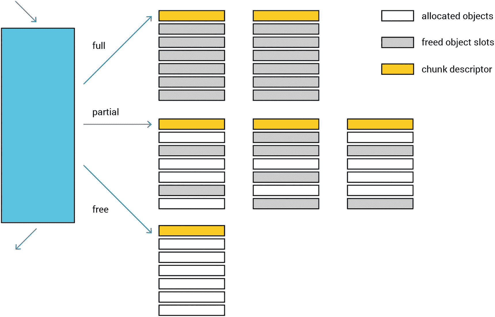
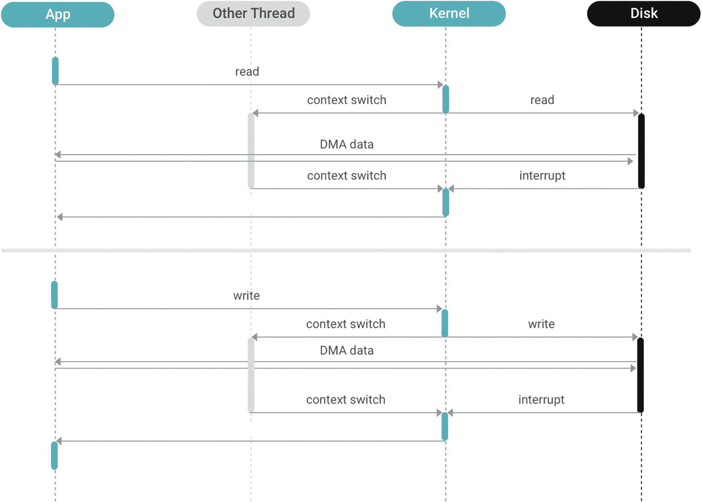

# 3. 数据库内部结构：硬件和操作系统交互

CPU 内存 I/O 网络总结

数据库的内部架构对其能够达到的延迟和能够处理的吞吐量有着巨大的影响。作为一个极其复杂的软件，数据库并非孤立存在，而是与环境相互作用，这包括操作系统和硬件。

虽然让大规模的千兆字节到拍字节规模系统运行起来是一件事情，但确保它们以最高效率运行则是另一回事。实际上，这通常不仅仅是“另一件事”。大型分布式系统的性能优化通常是一个多变量问题——结合底层硬件、网络、调整操作系统以及与虚拟化和应用程序架构各层进行协调。

这样复杂的问题需要从多个角度进行探索。本章通过探讨数据库如何通过利用现代硬件和操作系统来优化性能，开始了对数据库内部结构的讨论。它涵盖了数据库与操作系统、CPU、内存、存储和网络之间的交互。然后，下一章将重点转向算法优化。1

## CPU

编程书籍告诉程序员，他们有一个可以运行进程或线程的 CPU，而“运行”意味着有一些简单的顺序指令执行。然后有一个脚注解释说，在多个线程的情况下，可能需要考虑进行一些同步。实际上，事情在 CPU 核心内部的实际执行方式完全不同，并且要复杂得多。如果没有从书籍中获得的这些抽象，编程这些机器将会非常困难，但它们在某种程度上是谎言。如何有效地利用 CPU 能力仍然非常重要。

### 核心间无共享

单个 CPU 核心的速度并没有加快。它们的时钟速度早已达到性能平台期。现在，CPU 性能的持续提升是横向的：通过增加处理单元的数量。反过来，核心数量的增加意味着性能现在取决于多个核心之间的协调（而不是单个核心的吞吐量）。

在现代硬件上，标准工作负载的性能更多地取决于锁定和核心间的协调，而不是单个核心的性能。软件架构师面临着两个不吸引人的选择：

+   粗粒度锁定，这会导致应用程序线程争夺对数据的控制权，并等待而不是产生有用的工作。

+   细粒度锁定，除了编程和调试困难外，即使在没有竞争发生的情况下，由于锁定原语本身也会产生显著的开销。

考虑一个 SSD 驱动器。在现代 NVMe 设备上与 SSD 通信所需的典型时间相当长——大约 20 微秒。这足以让 CPU 执行数万条指令。开发者应该将其视为网络设备，但通常不会以这种方式编程。相反，他们经常使用同步（我们稍后会回到这一点）的 API，这会产生一个可能会阻塞的线程。

观察英特尔至强处理器逻辑布局的图像（见图 3-1），很明显，这也是一个网络设备。

英特尔至强处理器布局示意图。四个斯凯莱处理器通过英特尔 UPI 互连，每个处理器都包含 DDR4 DIMMs。

图 3-1

英特尔至强处理器的逻辑布局

核心之间通过本质上是一个网络——一个双环互连架构连接在一起。有两个这样的环，并且它们是双向的。那么开发者为什么要使用同步 API 呢？由于跨核心共享信息需要昂贵的锁定，无共享模型是值得考虑的。在这种模型中，所有请求都被分片到各个核心，每个核心运行一个应用程序线程，通信依赖于显式的消息传递，而不是线程间的共享内存。这种设计避免了缓慢、不可扩展的锁定原语和缓存波动。

在现代处理器中，跨核心的资源共享必须显式处理。例如，当两个请求是同一会话的一部分，并且两个 CPU 各自收到一个依赖于相同会话状态的请求时，一个 CPU 必须显式地将请求转发给另一个 CPU。任一 CPU 都可以处理任一响应。理想情况下，你的数据库提供限制跨核心通信需求的设施——但是当通信不可避免时，它提供高性能的非阻塞通信原语，以确保性能不会降低。

### Futures-Promises

在多个核心之间协调工作有许多解决方案。其中一些非常符合程序员的需求，并能够开发出在单核上运行的软件。例如，经典的 UNIX 进程模型旨在保持每个进程的总隔离，并依赖于内核代码来维护每个进程的单独虚拟内存空间。不幸的是，这增加了操作系统层面的开销。

有一个被称为“future 和 promise”的模型。一个 *future* 是表示某些尚未确定的结果的数据结构。一个 *promise* 是这个结果提供者。有助于将 promise/future 对象想象为一个最大长度为一件物品的先进先出（FIFO）队列，该物品只能使用一次。promise 是队列的生产端，而 future 是消费端。像 FIFOs 一样，futures 和 promises 解耦了数据生产者和数据消费者。

然而，未来和承诺的优化实现需要考虑几个因素。虽然标准实现针对粗粒度任务，这些任务可能会阻塞并且需要很长时间才能完成，但优化后的未来和承诺用于管理细粒度、非阻塞任务。为了有效地满足这一要求，它们应该：

+   不需要锁定

+   不分配内存

+   支持续传

未来-承诺设计消除了与维护单个线程相关的成本，允许接近完全利用 CPU。另一方面，它要求用户空间 CPU 调度，并且很可能限制了开发者的自愿预占调度。后者反过来又容易在流行的生产者-消费者编程模板中产生幽灵拥堵。2

将未来-承诺设计应用于数据库内部具有明显的优势。首先，数据库工作负载可以自然地成为 CPU 密集型。例如，内存数据库引擎通常就是这样，聚合的评估也涉及到相当密集的 CPU 工作。即使是巨大的磁盘数据集，当查询时间通常由 I/O 主导时，也应该考虑 CPU。解析查询是一项 CPU 密集型任务，无论工作负载是 CPU 密集型还是存储密集型，收集、转换并将数据发送回用户也需要仔细的 CPU 利用。最后但同样重要的是：处理数据总是涉及到*大量*高级操作和低级指令。以最佳方式维护它们需要一个良好的低级编程范式，而未来-承诺是最佳选择之一。然而，大的指令集需要更多的关注；这导致了“执行阶段”。

### 执行阶段

让我们更深入地了解 CPU 微架构，因为（如前所述）数据库引擎 CPU 通常需要处理数百万甚至数十亿条指令，帮助这个可怜的家伙是至关重要的。以非常简化的方式，现代 x86 CPU 的微架构——从自上而下的分析角度来看——由四个主要组件组成：前端、后端、分支预测和退役。

#### 前端

处理器的 frontend 负责获取和解析将要执行的指令。当存在延迟问题或带宽不足时，它可能会成为瓶颈。前者可能是由指令缓存未命中引起的。后者发生在指令解码器无法跟上时。在这种情况下，解决方案可能是尝试使热路径（或至少其重要部分）适合解码 μop 缓存（DSB）或可被循环检测器（LSD）识别。

#### 分支预测

顶层分析归类为 *不良推测* 的流水线槽位并未停滞，而是浪费了。这发生在分支预测错误，而 CPU 执行的 μop 最终无法提交的情况下。分支预测器通常被认为是前端的一部分。然而，它的问题可能会以超出仅仅导致后端指令获取和解码不足的方式影响整个流水线。（注意：分支误判将在本章稍后更详细地介绍。）

#### 后端

后端接收解码后的 μops 并执行它们。停滞可能发生，要么是因为执行端口忙碌，要么是因为缓存未命中。在较低级别，流水线槽位可能因为数据依赖或可用的执行单元数量不足而受限。由内存引起的停滞可能由不同级别的数据缓存中的缓存未命中、外部内存延迟或带宽不足引起。

#### 退休

最后，有一些流水线槽位被归类为 *退休*。它们是那些能够无任何问题执行和提交 μop 的幸运儿。当 100% 的流水线槽位能够无停滞地退休时，该 CPU 模型的程序已经实现了每周期最大指令数。尽管这非常理想，但这并不意味着没有改进的机会。相反，这意味着 CPU 已被充分利用，提高性能的唯一方法是减少指令数量。

#### 对数据库的影响

CPU 的架构方式对数据库设计有直接影响。完全有可能发生单个请求涉及大量逻辑和相对较少数据的情况，这是一个会显著增加 CPU 负担的场景。这种类型的工作负载将完全由前端主导——特别是指令缓存未命中。如果你稍微思考一下，这不应该非常令人惊讶。每个请求通过的流水线相当长。例如，写请求可能需要通过传输协议逻辑、查询解析代码、在缓存层中查找，或者应用到 memtable 等。

解决这个问题最明显的方法是尝试减少热路径中的逻辑量。不幸的是，这种方法并不提供巨大的性能提升潜力。减少执行特定活动所需的指令数量是一种流行的优化实践，但开发者不能无限地缩短代码。在某个时刻，代码“冻结”——字面意义上的。即使是比较两个字符串并返回结果，也需要一些最小数量的指令。用单个指令完成这是不可能的。

处理指令缓存问题的更高层次方法被称为阶段事件驱动架构（简称 SEDA）。这是一种将请求处理管道分割成一系列阶段的架构——从而将逻辑与事件和线程调度解耦。这种方法通常比之前的方法带来更大的性能提升。

## 内存

内存管理是编程所有方面的核心设计点。甚至比较编程语言时，也总是涉及关于程序员应该如何处理内存分配和释放的讨论。难怪内存管理设计对数据库性能的影响如此之大。

在数据库工程中，内存管理通常分为两个相关但独立的子系统：内存分配和缓存控制。前者实际上是一个非常通用的软件工程问题，因此对其的考虑并不特别针对数据库（尽管它们至关重要，值得研究）。相比之下，后者本身非常广泛，受使用细节和边缘情况的影响。在数据库世界中，缓存控制有其独特的风格。

### 分配

程序或子系统分配和释放内存的方式是内存管理的核心。有几个方法值得考虑。

如图 3-2 所示，所谓的“日志结构化分配”在文件系统中是已知的，它将顺序写入持久存储上的循环日志，并以完全相同的方式处理更新。在某个时刻，该文件系统必须回收日志区域中成为过时条目的块，以便为未来的写入腾出更多空间。在简单的实现中，未使用的条目通过重新读取和从头开始重写日志来回收；然后在这个过程中跳过过时的块。

使用日志展示数据分配结构和超级块的一个示例。使用的四种日志类型是文件、inode、目录和 inode 映射。

图 3-2

日志结构化分配将顺序写入持久存储上的循环日志，并以相同的方式处理更新

对于简单的代码，内存分配器可以执行类似操作。在其最简单形式中，它会通过移动一个指向下一个空闲指针来分配下一块内存。释放分配只需要将分配区域标记为已释放。这种方法的优点是分配速度快。另一个优点是，如果按照先进先出（FIFO）顺序进行或影响整个分配空间，则释放的简单性和效率。堆栈内存分配在释放时按照与分配相反的顺序进行，因此这是此类方法最突出且最有效率的例子。

使用线性分配器作为通用分配器可能会更成问题，因为空间回收困难。要回收空间，仅仅将条目标记为空闲是不够的。这会导致内存碎片化，从而抵消了线性分配的优势。因此，与文件系统一样，必须回收内存，使其只包含已分配条目，而空闲空间可以再次使用。回收需要移动已分配条目——这个过程会改变并使它们之前已知的地址无效。在原始代码中，分配条目的引用位置（存储为指针的地址）对分配器来说是未知的。现有的引用必须进行修补，以便使分配器操作对调用者透明；对于像 malloc 这样的通用分配器来说，这是不可行的。记录分配器使用与编程语言选择有关。一些 RTTIs，如 C++，可以通过提供移动构造函数来极大地简化这一点。然而，传递指向您无法控制的库（例如，glibc）的指针仍然是一个问题。

另一个替代方案是采用池分配器的策略，它为固定大小的条目分配提供分配空间（见图 3-3）。通过这种方式限制分配空间，可以减少碎片化。许多通用分配器使用池分配器进行小规模分配。在某些情况下，这些应用程序空间基于每个线程存在，以消除锁定的需要并提高 CPU 缓存利用率。

数据分配到槽位数组的示例。三种类型的池分配数组是满的、部分满的和空的。释放的对象槽位被阴影覆盖。

图 3-3

池分配器为固定大小的条目分配提供分配空间。通过限制分配空间来减少碎片化

这种池分配策略提供了两个核心好处。首先，它让您免于搜索可用内存空间。其次，它通过在内存中预先分配用于一组对象大小的缓存来减轻内存碎片化。以下是它是如何实现这一点的：

1.  每个大小区域都有固定大小的内存块，这些内存块适合包含的对象，并且这些块都由分配器跟踪。

1.  当分配器需要为某种类型的数据对象分配内存时，通常可以使用现有内存 slab 中的一个空闲槽位（块）。^(3)

1.  当分配器需要释放对象的内存时，它可以将该槽位简单地移动到包含的 slab 的未使用/空闲内存槽位列表中。

1.  当调用创建相同类型的对象（或调用分配相同大小的内存）时，该内存槽位（或某些其他空闲槽位）将从空闲槽位列表中移除。

最佳的分配方法很大程度上取决于使用场景。日志结构化方法的一个巨大好处是它以更有效的方式处理了小子池的碎片化。另一方面，池分配器由于缺乏压缩活动，对 CPU 的背景负载较少。

### 缓存控制

当涉及到存储大量数据在磁盘上的软件应用程序的内存管理时，你不能忽视缓存控制这个话题。在数据处理中，缓存总是必须的，并且决定缓存什么和在哪里缓存是至关重要的。

如果缓存是在 I/O 级别进行的，无论是读取/写入还是 mmap，缓存就可能成为内核的责任。系统的大部分内存都分配给了页面缓存。内核决定在内存不足时哪些页面应该被移除，决定何时需要将页面写回磁盘，并控制预读。应用程序可以通过使用`madvise(2)`和`fadvise(2)`系统调用来向内核提供一些指导。

让内核控制缓存的优点是内核开发者已经投入了数十年的努力来调整缓存所使用的算法。这些算法被成千上万的不同的应用程序使用，并且通常是有效的。然而，缺点是这些算法是通用性的，并没有针对特定应用程序进行优化。内核必须猜测应用程序下一步的行为。即使应用程序知道不同的情况，通常也没有办法帮助内核做出正确的猜测。这导致错误的页面被移除，I/O 被错误地调度，或者为不久的将来不会消费的数据安排了预读。

接下来，在 I/O 级别进行缓存与通常称为 IMR（内存表示）的话题有关。不奇怪的是，数据在磁盘上存储的格式与相同数据在内存中作为对象分配的格式不同。最简单的理由是字节序。考虑到这一点，如果数据从磁盘读取后缓存，它需要进一步转换或解析成内存中使用的对象。这可能会浪费 CPU 周期，因此应用程序可能会选择在对象级别进行缓存。

选择在对象级别进行缓存会影响许多其他设计点。因此，缓存管理完全在应用端，包括跨核心同步、数据一致性、失效等。接下来，由于对象可以（并且通常）比平均 I/O 大小小得多，缓存数百万甚至数十亿个这样的对象需要一个能够处理它的集合选择（你很快就会了解到这一点）。最后，对象级别的缓存极大地影响了 I/O 的执行方式。

## I/O

除非数据库引擎是内存中的，否则它必须在外部存储上保留数据。这可以有多种选择，包括本地磁盘、网络附加存储、分布式文件和对象存储系统等等。术语“I/O”通常指的是访问本地存储上的数据——磁盘或文件系统（这些文件系统本身也位于磁盘上）。一般来说，在 Linux 服务器上访问文件有四种选择：读写、mmap、直接 I/O（DIO）读写和异步 I/O（AIO/DIO，因为这种 I/O 很少在缓存模式下使用）。

### 传统读写

传统的做法是使用`read(2`*)* 和 `write(2)`系统调用。在现代实现中，读取系统调用（或其许多变体之一——`pread`、`readv`、`preadv`等）请求内核读取文件的一部分并将数据复制到调用进程的地址空间。如果所有请求的数据都在页面缓存中，内核将复制它并立即返回；否则，它将安排磁盘读取请求的数据到页面缓存，阻塞调用线程，当数据可用时，它将恢复线程并复制数据。另一方面，写入通常¹只是将数据复制到页面缓存；内核将在之后某个时间将页面缓存写回磁盘。

### mmap

一种替代的更现代的方法是使用`mmap(2)`系统调用将文件内存映射到应用程序地址空间。这导致地址空间的一部分直接引用包含文件数据的页面缓存页。在此准备步骤之后，应用程序可以使用处理器的内存读取和内存写入指令访问文件数据。如果请求的数据恰好位于缓存中，内核将被完全绕过，并且以内存速度执行读取（或写入）。如果发生缓存未命中，则发生页面错误，内核将挂起活动线程，然后去读取该页的数据。当数据最终可用时，内存管理单元被编程，以便新读取的数据对线程可用，然后线程被唤醒。

### 直接 I/O (DIO)

传统的读写和 mmap 都涉及内核页面缓存并将 I/O 调度推迟到内核。当应用程序想要自己调度 I/O（原因我们稍后解释）时，可以使用直接 I/O，如图 3-4 所示。这涉及到使用`O_DIRECT`标志打开文件；进一步的活动将使用正常的读写系统调用。然而，它们的行为现在已改变：不再是访问缓存，而是直接访问磁盘，这意味着调用线程将被无条件地挂起。此外，磁盘控制器将直接将数据复制到用户空间，绕过内核。

应用程序、线程、内核和磁盘的输入和输出示意图。应用程序将数据读入和写入内核。应用程序和磁盘之间使用 DMA 数据和上下文切换。

图 3-4

直接 I/O 涉及使用 O_DIRECT 标志打开文件；进一步的活动将使用正常的读写系统调用系列，但它们的行为现在已改变

### 异步 I/O (AIO/DIO)

直接 I/O 的改进版，异步直接 I/O，行为类似但防止调用线程阻塞（见图 3-5）。相反，应用程序线程使用`io_submit(2)`系统调用安排直接 I/O 操作，但线程不会被阻塞；I/O 操作与正常线程执行并行运行。一个单独的系统调用`io_getevents(2)`等待并收集完成的 I/O 操作的结果。与 DIO 一样，内核的页面缓存被绕过，磁盘控制器负责将数据直接复制到用户空间。

应用程序、线程、内核和磁盘的输入和输出示意图。应用程序将数据读入和写入内核。应用程序和磁盘之间使用 DMA 数据。

图 3-5

直接 I/O 的改进版，异步直接 I/O 行为类似但防止调用线程阻塞

注意：io_uring

执行异步 I/O 的 API 在 Linux 中很久以前就出现了，并且受到了社区的欢迎。然而，正如经常发生的那样，实际使用很快揭示了许多低效之处，例如在某些情况下会阻塞（尽管名称上不是这样），需要频繁调用内核，以及提交请求取消支持不佳。最终，很明显，更新的要求与现有的 API 不兼容，因此需要一个新的 API。

这就是`io_uring()` API 出现的原因。它提供了与 AIO 相同的设施，但以更方便、更高效的方式（它还具有显著更好的文档）。不深入实现细节，只需说它存在，并且比传统的 AIO 更受欢迎。

### 理解权衡

不同的访问方法在某些方面具有一些共同特性，在其他方面则有所不同。表 3-1 总结了这些特性，这些特性将在本节中进一步讨论。

表 3-1

比较不同的 I/O 访问方法

| 特性 | R/W | mmap | DIO | AIO/DIO |
| --- | --- | --- | --- | --- |
| 缓存控制 | 内核 | 内核 | 用户 | 用户 |
| 复制 | 是 | 否 | 否 | 否 |
| MMU 活动 | 低 | 高 | 无 | 无 |
| I/O 调度 | 内核 | 内核 | 混合 | 用户 |
| 线程调度 | 内核 | 内核 | 内核 | 用户 |
| I/O 对齐 | 自动 | 自动 | 手动 | 手动 |
| 应用复杂性 | 低 | 低 | 中等 | 高 |

#### 复制和 MMU 活动

mmap 方法的一个好处是，如果数据在缓存中，则内核可以完全绕过。内核不需要在内核空间和用户空间之间复制数据，因此可以节省处理器周期用于这项活动。这对主要在缓存中的工作负载有益（例如，如果存储大小与 RAM 大小的比例接近 1:1）。

然而，mmap 的缺点在于数据不在缓存中时。这通常发生在存储大小与 RAM 大小的比例显著高于 1:1 的情况下。每个被带入缓存的一页都会导致另一页被驱逐。这些页面需要被插入和从页面表中移除；内核必须扫描页面表以隔离不活跃的页面，使它们成为驱逐的候选者，等等。此外，mmap 需要内存用于页面表。在 x86 处理器上，这需要映射文件大小的 0.2%。这似乎很低，但如果应用程序的存储与内存的比例为 100:1，那么结果是 20% 的内存（0.2% * 100）被用于页面表。

#### I/O 调度

让内核控制缓存（使用 mmap 和读写访问方法）的一个问题是，应用程序失去了对 I/O 调度的控制。内核选择它认为合适的任何数据块，并为其安排写入或读取。这可能导致以下问题：

+   **写风暴**。当内核调度大量写入时，磁盘将长时间忙碌，影响读取延迟。

+   **内核无法区分“重要”和“不重要”的 I/O**。属于后台任务的 I/O 可能会压倒前台任务，影响其延迟²

通过绕过内核页面缓存，应用程序承担了调度 I/O 的负担。这并不意味着问题已经解决，但确实意味着问题*可以*解决——只要给予足够的关注和努力。

在使用直接 I/O 时，每个线程控制何时发起 I/O。然而，内核控制线程的运行时间，因此发起 I/O 的责任在内核和应用程序之间共享。使用 AIO/DIO，应用程序完全控制 I/O 的发起时间。

#### 线程调度

使用 mmap 或读写操作的 I/O 密集型应用程序无法预测其缓存命中率。因此，它必须运行大量线程（显著大于其运行的机器的核心数）。使用线程过少，它们可能都在等待磁盘，导致处理器利用率低下。由于每个线程通常最多只有一个磁盘 I/O 正在执行，因此运行线程的数量必须大约是存储子系统并发性的乘以某个小因子，以便使磁盘保持完全占用。然而，如果缓存命中率足够高，那么这些大量线程将相互竞争有限的核数。

当使用直接 I/O 时，这个问题得到了一定程度的缓解。应用程序确切地知道何时线程因 I/O 而被阻塞，何时可以运行，因此应用程序可以根据运行时条件调整运行线程的数量。

使用 AIO/DIO 时，应用程序对运行线程和等待 I/O（这两者完全分离）都有完全的控制权，因此它可以很容易地调整到内存密集型或磁盘密集型条件或两者之间的任何条件。

#### I/O 对齐

存储设备有块大小；所有 I/O 都必须以这个块大小的倍数进行，这通常是 512 或 4096 字节。使用读写或 mmap，内核会自动执行对齐；内核会在发出之前将小的读取或写入扩展到正确的块边界。

使用 DIO 时，块对齐的责任由应用程序承担。这带来了一些复杂性，但也提供了一些优势：内核通常会过度对齐到 4096 字节边界，即使 512 字节边界就足够了。然而，使用 DIO 的用户应用程序可以发出 512 字节对齐的读取操作，这在小项上可以节省带宽。

#### 应用程序复杂性

虽然之前的讨论倾向于为 I/O 密集型应用选择 AIO/DIO，但这种方法伴随着一个显著的成本：复杂性。将缓存管理的责任放在应用程序上意味着它可以做出比内核更好的选择，并且以更低的开销做出这些选择。然而，这些算法需要编写和测试。使用异步 I/O 要求应用程序使用回调、协程或类似的方法编写，这通常降低了许多可用库的可重用性。

### 选择文件系统或磁盘

除了执行 I/O 本身之外，数据库设计还必须考虑执行此 I/O 的介质。在许多情况下，选择通常是文件系统或原始块设备，这反过来又可以是传统旋转磁盘或 SSD 驱动器的选择。然而，在云环境中，可能还有第三个选项，因为本地驱动器总是短暂的——这给复制带来了严格的要求。

### 文件系统与原始磁盘

这个决策可以从两个角度来考虑：管理成本和性能。

如果你将存储作为原始块设备访问，所有与块分配和回收相关的困难都在应用程序一侧。我们之前在讨论内存管理时略微提到了这个话题。相同的挑战也适用于 RAM 和磁盘。

另一个相关但非常不同的挑战是在发生崩溃的情况下提供数据完整性。除非数据库完全是内存中的，否则 I/O 操作应该以避免在重启后丢失数据或从磁盘读取垃圾数据的方式进行。然而，现代文件系统提供了这两者，并且非常成熟，可以信赖其分配效率和数据的完整性。不幸的是，访问原始块设备却缺少这些功能（因此它们需要在应用层面以相同的质量实现）。

从性能角度来看，这种差异并不那么剧烈。一方面，将数据写入文件总是伴随着相关的元数据更新。这消耗了磁盘空间和 I/O 带宽。然而，一些现代文件系统提供了非常好的性能和效率的平衡，几乎消除了 I/O 延迟。（最突出的例子之一是 XFS。另一个非常好且成熟的软件是 Ext4）。在这个领域中的强大盟友是`fallocate(2)`系统调用，它使文件系统在磁盘上预先分配空间。当使用时，文件系统也有机会充分利用范围机制，从而将使用文件的质量服务提升到与使用原始块设备相同的表现水平。

#### 追加写入

数据库可能对文件的追加操作有很强的依赖性，或者需要单个文件块的就地更新。这两种方法都需要系统架构师给予特别的关注，因为它们对底层系统提出了不同的要求。

一方面，追加写入需要与文件系统进行仔细的交互，以确保元数据更新（尤其是文件大小）不会主导常规 I/O。另一方面，追加写入（作为一种某种程度上无缓存意识的算法）以自然的方式处理磁盘覆盖困难。与此相反，就地更新不能在随机的偏移量和大小处发生，因为磁盘可能无法容忍这种类型的工作负载，即使它们是以原始块设备的方式使用（而不是通过文件系统）。

话虽如此，让我们更深入地探讨堆栈，并深入到硬件层面。

### 如何现代固态硬盘工作

就像其他计算资源一样，磁盘在提供速度方面是有限的。这个速度通常以每秒的二维值来衡量，即*每秒输入/输出操作数*（IOPS）和*每秒字节数*（吞吐量）。当然，即使是对于每个特定的磁盘，这些参数也不是一成不变的，最大请求数或字节数很大程度上取决于请求的分布、排队和并发、缓冲或缓存、磁盘年龄以及许多其他因素。因此，在进行 I/O 操作时，磁盘必须始终在两种低效状态之间取得平衡——请求过多压垮磁盘和磁盘利用率不足。

应避免过度负载磁盘，因为当磁盘充满请求时，它无法区分某些请求相对于其他请求的重要性。当然，所有请求都很重要，但优先处理对延迟敏感的请求是有意义的。例如，ScyllaDB 提供需要以个位数毫秒或更少的时间完成的实时查询，同时并行处理用于压缩、流式传输、退役等操作的数据。前者对延迟敏感度强；后者则不那么敏感。试图在保持延迟敏感任务延迟尽可能低的同时最大化 I/O 带宽的良好 I/O 维护变得足够复杂，以至于成为一个独立的组件，称为*I/O Scheduler*。

当评估磁盘时，你很可能会查看其四个参数——读写 IOPS 和读写吞吐量（如 MB/s）。将这些数字相互比较是声称一个磁盘比另一个磁盘更好的一种流行方式，并通过应用 Little's Law 来估计所提到的“带宽容量”。因此，I/O 调度器的任务是向磁盘提供一定程度的并发性，以获得最大的带宽，但不要使这种并发性过高，以防止磁盘内部队列请求的时间超过所需时间。

例如，图 3-6 说明了读取请求延迟如何取决于小读取的强度（挑战磁盘 IOPS 容量）与大型写入的强度（追求磁盘带宽）。延迟值用颜色编码，而“有趣区域”用青色标出——这是延迟保持在 1 毫秒以下的地方。所测量的驱动器是随 AWS EC2 i3en.3xlarge 实例提供的 NVMe 磁盘。

两个从 0 到 1 G B 每秒的 p 50 和 p 95 延迟图。图显示了下降趋势。在图的右侧给出了两个阴影条带。

图 3-6

显示读取请求延迟如何取决于小读取的强度（挑战磁盘 IOPS 容量）与大型写入的强度（追求磁盘带宽）的带宽/延迟图

该驱动器展示了几乎完美的半双工行为——增加读取强度几倍需要大约相同程度的写入强度减少，以保持磁盘以相同的速度运行。

小贴士：如何测量你的磁盘在负载下的行为

你对自己的磁盘在负载下的性能理解得越好，你就能更好地调整它们以利用它们的“最佳性能点”。实现这一目标的一种方法是用 Diskplorer^(4)，这是一个开源的磁盘延迟/带宽探索工具集。通过在底层使用 Linux fio，它运行一系列测量以发现特定硬件配置的性能特征，让你一目了然地看到服务器存储 I/O 在负载下的行为。

关于如何使用此工具的教程，请参阅 Linux 基金会视频，“在负载下理解存储 I/O。”^(5)

## 网络

Linux 中可用的传统网络功能非常全面、成熟且性能出色。由于数据库很少对每个 ping 施加严重的延迟要求，因此当正确配置和使用时，很少会有惊喜。尽管如此，仍需考虑一些因素。

如大卫·阿赫尔所述，“Linux 将在处理中断时处理一定数量的数据包，这些数据包是在处理中断时 CPU 上正在运行的任何进程的上下文中。系统会计将那些 CPU 周期归因于当时运行的任何进程，即使该进程没有为其做任何工作。例如，‘top’可以显示一个看似使用 99%以上 CPU 的进程，但实际上，60%的时间是用于处理数据包——这意味着该进程实际上只有 40%的 CPU 用于在其工作负载上取得进展。”^(6)

然而，对于真正密集型网络应用，Linux 栈受到限制：

+   **内核空间实现**：将网络栈分离到内核空间意味着执行网络操作需要昂贵的上下文切换，并且必须执行数据复制以将数据从内核缓冲区传输到用户缓冲区，反之亦然。

+   **时间共享**：Linux 是一个时间共享系统，因此必须依赖于缓慢且昂贵的中断来通知内核有新的数据包需要处理。

+   **线程模型**：Linux 内核高度线程化，因此所有数据结构都由锁保护。尽管 Linux 已经非常可扩展，但这并非没有限制，并且在大核心计数时会发生竞争。即使没有竞争，锁原语本身也相对较慢，并影响网络性能。

如前所述，克服这种限制的方法是将数据包处理移动到用户空间。有许多值得考虑的内核外 TCP 算法实现。

### DPDK

网络领域中经常被提及的一种通用方法是轮询模式与中断模型。当一个数据包到达时，系统可能有两种方式来获取通知——通过硬件设置和中断（或者在用户空间实现的情况下，通过使用系统调用中的 *poll* 家族从内核文件描述符）或者时不时地自行轮询网络卡，直到注意到数据包。

著名的用户空间网络工具包，称为 *DPDK*，专门设计用于快速数据包处理，通常每个数据包少于 80 个 CPU 周期.^(7) 它与 Linux 无缝集成，以便利用高性能硬件。

### IRQ 绑定

如前所述，数据包处理可能占用高达 60%的 CPU 时间，这远远太多。这个百分比留给数据库本身的工作的 CPU 周期太少。即使在这种情况下，背压机制最有可能保持外部活动关闭，系统可能会找到平衡，但结果系统的吞吐量可能是不可以接受的。

系统架构师可以考虑采用非对称 CPU 方法来减轻这一问题。如果你让 Linux 内核处理网络数据包，有几种方法可以将这种处理本地化到单独的 CPU 上。

最简单的方法是将网络接口卡（NIC）的 IRQ 处理绑定到特定的核心或超线程。Linux 使用两步处理传入数据包，称为 IRQ 和软 IRQ。如果 IRQ 被正确绑定到核心，软 IRQ 也会在这些核心上发生——从而完全本地化处理。

对于运行着数十到数百个核心的巨大规模节点，仅网络核心的数量可能实际上会超过一个。在这种情况下，通过分配来自不同 NUMA 节点的核心，并教会网络接口卡（NIC）利用 Linux 内核的接收数据包引导功能来平衡这些核心之间的流量，进一步本地化处理可能是有意义的。

## 摘要

本章介绍了几种数据库工程决策的方式，这些决策使数据库用户能够从现代基础设施中获得更多动力。对于 CPU，本章讨论了通过限制核心间的资源共享和利用未来承诺设计来协调核心间工作，从而利用多核服务器。本章还提供了一个具体的例子，说明了底层 CPU 架构对数据库的直接影响。

接下来是内存部分，你了解到两个相关但独立的子系统：内存分配和缓存控制。对于 I/O，本章讨论了 Linux 的选项，如传统的读写、mmap、直接 I/O（DIO）读写和异步 I/O——包括每种方法的各项权衡。随后深入探讨了现代 SSD 的工作原理以及数据库如何利用驱动器的独特特性。最后，你了解了与 Linux 网络堆栈相关的约束，并探讨了 DPDK 和中断请求（IRQ）绑定等替代方案。下一章将重点从硬件交互转移到算法优化：纯软件挑战。

**开放获取** 本章节根据 Creative Commons Attribution 4.0 国际许可协议（[`creativecommons.org/licenses/by/4.0/`](http://creativecommons.org/licenses/by/4.0/)）授权，允许在任何媒介或格式中使用、分享、改编、分发和复制，只要您适当引用原始作者和来源，提供 Creative Commons 许可的链接，并指出是否进行了修改。

本章中包含的图片或其他第三方材料均包含在章节的 Creative Commons 许可证中，除非在材料引用行中另有说明。如果材料未包含在章节的 Creative Commons 许可证中，且您的使用意图不受法定法规允许或超出允许的使用范围，您将需要直接从版权持有人处获得许可。
