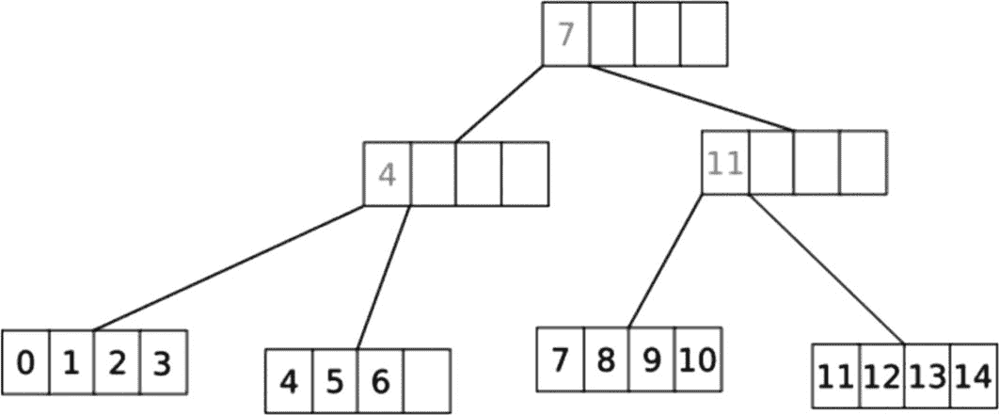
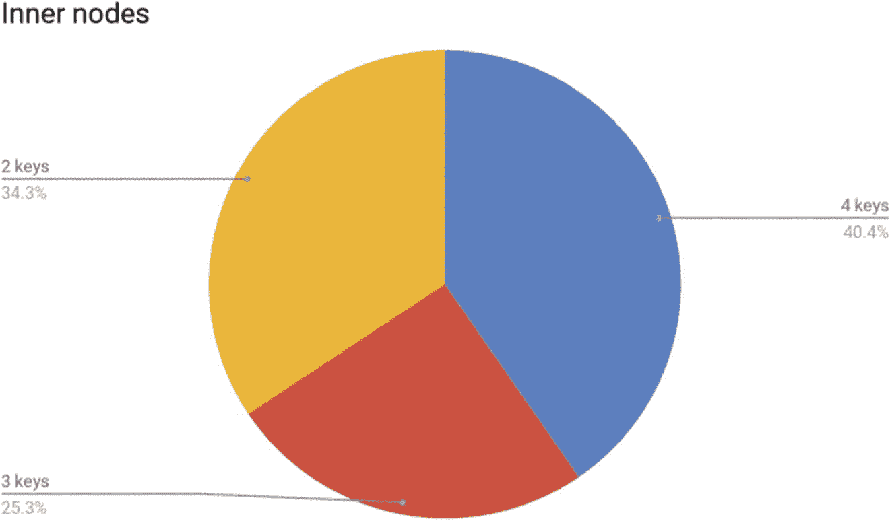

# 4. 数据库内部：算法优化

优化集合是使用 B 树还是不使用 B 树线性搜索的强化扫描树当树的大小很重要时分离键的神秘生活总结

在性能领域，硬件始终是不可逾越的限制因素——从系统中无法挤压出比底层芯片提供的更多性能单元。相比之下，系统的软件部分通常被认为是编程中最灵活的东西——从意义上说，只要开发者有足够的头脑和双手（以及投资者的资金），它可以在任何时候进行更改。

然而，情况并不总是如此。有时，选择算法应该在架构阶段就尽可能谨慎地进行，因为选择的方法变得极其基本，改变它实际上意味着从头开始重写整个引擎，或者要求用户从一个实例迁移到另一个实例的数以亿计的数据。

本章分享了一个算法优化的详细示例——从领导这次优化的工程师的角度来看。具体来说，本章探讨了 B 树家族如何用于在缓存实现和其他辅助内存结构中存储数据。对这一代表性工程挑战的探讨应该有助于你更好地理解各种数据库在底层可能做出的权衡或优化——理想情况下，这样你可以更好地利用其非常谨慎的设计决策。^([1)]

注意

本章的目标**不是**说服数据库用户他们需要一个具有特定算法优化功能的数据库——也不是为了教育基础设施工程师如何设计 B 树或算法优化的细节。相反，它是为了帮助任何选择或使用数据库的人了解可能影响数据库性能的算法优化水平。希望这能激发你对了解你所使用的数据库及其/或你正在考虑的替代数据库背后的工程学的兴趣。

## 优化集合

在内存中维护大量对象需要与在外部内存（例如，旋转磁盘或网络附加存储）中维护对象相同级别的关注。对于像通过普通键查找对象这样简单的任务，通常的解决方案是一个普通的哈希表（即使对哈希函数的选择非常注意）或二叉平衡树（通常是因为其实施简单，通常是红黑树）。然而，像 B 树家族这样的分支树可以显著提高性能。它们也有许多不明显的问题。

## 是使用 B 树还是不使用 B 树

树的一个重要特征是**基数**。这是另一个节点可能拥有的最大子节点数。在基数为二的情况下，该树被称为**二叉**树。对于其他情况，存在一大类所谓的 B 树。关于二叉树与 B 树之间的普遍看法是，当数据存储在 RAM 中时，应使用前者，而后者应存在于磁盘上。这种划分的理由是 RAM 的访问速度远高于磁盘。此外，磁盘 I/O 以块为单位执行，因此在一次请求中获取几个“相邻”的键要更好、更快。与磁盘不同，RAM 允许几乎任何粒度的随机访问，因此可以有一个分散的键集，它们相互指向。

然而，有许多原因使得 B 树经常是内存集合的一个好选择。第一个原因是缓存**局部性**。在二叉树中搜索一个键时，算法会访问多达**logN**个元素，这些元素很可能分散在内存中。在 B 树中，这种搜索将包括两个**阶段**——节点内搜索和树下降——依次执行。虽然树下降在上述意义上与二叉树没有太大区别，但节点内搜索将访问相邻的键，从而更好地利用 CPU 缓存。图 4-1 展示了沿着二叉树行走的过程。将其与图 4-2 进行比较，后者展示了 B 树集合中的搜索过程。

一个插图展示了 M 等于 6 时在 B 树集合中的搜索过程。CPU 核心将每个指令的处理分成几个阶段。

图 4-2

在 B 树集合中搜索

一个框图，1. 一个名为 15 的块，如果小于 16，则转到右子树，否则转到左子树，块 10 分为 8 和 12，2. 一个名为 20 的块，如果大于 16，则转到左子树，否则转到右子树，块 25 指向块 30，3. 左子树，块 18 分为 16 和 19。

图 4-1

在二叉树根中搜索

B 树经常是内存集合的良好选择，第二个原因也来自于二叉树的分散性质以及现代 CPU 的设计。众所周知，当执行指令流时，CPU 核心将每个指令的处理分为阶段（加载指令、解码它们、准备参数和执行本身）并在一个称为*传送带*的单元中并行运行这些阶段。当条件分支指令出现在这个流中时，传送带需要猜测它将执行哪个潜在的分支，并将其加载到传送带管道中。如果这个猜测失败，传送带将被清空并从头开始工作。这种失败称为*分支预测错误*。从性能角度来看，这些错误是有害的^(2)，并且对二分搜索算法有直接影响。在搜索树中的键时，算法根据键比较结果左右跳跃，而没有给 CPU 一个学习哪个方向是“首选”的机会。在许多情况下，CPU 传送带会被清空。

关于分支预测，两阶段 B 树搜索可以做得更好。技巧在于使节点内搜索线性（即逐个键向前遍历键数组）。在这种情况下，将只有一个“是否前进”的条件，这个条件更加可预测。甚至有一个将二分搜索转换为线性搜索而不牺牲比较次数的巧妙技巧，^(3) 但这种方法适用于读操作为主的集合，因为在此布局中插入复杂且比排序数组更复杂。这种方法在 ScyllaDB 的实现中得到了证明，并且在 Tarantool 内存数据库中也得到了广泛应用.^(4)

## 精炼的线性搜索

线性搜索还可以进一步改进。让我们仔细计算在树中找到单个键可能需要的关键比较次数。对于二叉树，众所周知，它需要 *log*[*2*]*N* 次比较（平均而言），其中 *N* 是元素的数量。我们在这里放置对数底是为了一个原因。接下来，考虑一个具有每个节点 *k* 个子节点的 *k* 叉树。它需要更少的比较次数吗？（剧透：不是）。为了找到元素，你必须进行相同的搜索——获取一个节点，找到它所在的分支，然后继续搜索。你在树中有 *log*[*k*]*N* 个层级，所以你必须进行这么多下降步骤。然而，在每一步中，你都需要在 *k* 个元素中进行搜索，如果你进行二分搜索，这又是 *log*[*2*]*k*。将两者相乘，你仍然至少需要 *log*[*2*]*N* 次比较。

减少这种数量的方法是，在进行节点内搜索时同时比较多个键。如果键足够小，SIMD 指令可以一次比较多达 64 个键。尽管 SIMD 比较指令可能比经典的 cmp 指令慢，并且需要额外的指令来处理比较掩码，但线性 SIMD 加速的搜索在足够短的数组（以及 B 树节点足够短）上仍然占优势。例如，图 4-3 展示了使用三种技术——线性搜索、二分搜索和 SIMD 优化的线性搜索（如 x86 高级向量扩展 AVX）在有序数组中查找整数的耗时。

一个水平分组条形图，显示了线性、二进制和 AVX 查找 4、16 和 64 个键的时间。对于 4 个键，这些值分别是 9、10.5 和 3，分别对应线性、二进制和 AVX。对于 16 个键，这些值分别是 5.5、7 和 2.5，分别对应线性、二进制和 AVX。对于 64 个键，这些值分别是 3.5、3 和 2.5，分别对应线性、二进制和 AVX。

图 4-3

该测试使用了大量随机生成的、散布在内存中的值数组，以消除缓存使用差异，以及大量随机搜索键以模糊分支预测。这些是按数组长度归一化的找到数组中键的平均时间。较小的结果表示更快（更好）

## 扫描树

一种有趣的 B 树变种称为 B+-树。在这棵树中，有两种类型的键——*真实*键和*分隔*键。真实键位于叶节点上（即没有子节点的那些），而分隔键位于内部节点上，用于在下降树时选择下一个要访问的分支。这种差异的明显后果是，与 B 树相比，在 B+-树中保持相同数量的键需要更多的内存。但这不仅仅是这样。

树的一个很好的隐含特性是能够以排序方式遍历元素（称为扫描）。要扫描经典 B 树，存在递归和状态机算法，它们以非常非均匀的方式处理键——算法在移动时上下移动树。尽管 B 树被描述为缓存友好的，但扫描它们需要访问每个节点，内部节点以缓存不友好的方式被访问。图 4-4 说明了这一现象。

一个有四个分割的盒子，第一个部分有 11，分成两个盒子，每个盒子有四个分割。第一个盒子在前两个部分中有 3 和 8。第二个盒子在前三个部分中有 12、13 和 14。第一个盒子再次分成三个盒子，每个盒子有四个分割。第一个盒子有 0、1、2，第二个盒子有 4、5、6、7，第三个盒子有 9、10。

图 4-4

扫描经典 B 树涉及在树中上下移动；每个节点和内部节点都会被访问

与此相反，B+树扫描只需遍历其叶节点，通过一些额外的工作，可以将其实现为对数组链表的线性扫描，如图 4-5 所示。

一个有四个分割的盒子，第一个部分有 7 个，分割成两个盒子，每个盒子有四个分割。第一个盒子在第一个部分有 4 个。第二个盒子在第一个部分有 11 个。第一个盒子再次分割成两个盒子，每个盒子有四个分割，其中一个有 0, 1, 2, 3，而另一个有 4, 5, 6。第二个盒子再次分割成两个盒子，每个盒子有四个分割，其中一个有 7, 8, 9, 10，而另一个有 11, 12, 13, 14。

图 4-5

B+树扫描只需覆盖叶节点

## 当树的大小很重要时

谈到内存，B 树（以及 B+树）并不免费提供所有这些好处。随着树的成长，其中的节点数量也在增加，考虑存储单个键所需的额外开销是有用的。对于二叉树，额外开销是三个指针——指向左右子节点以及父节点。对于 B 树，内节点和叶节点的开销会有所不同。对于这两种类型，额外开销是一个父指针和*k*个指向键的指针，即使它们尚未插入到树中。对于内节点，还会有*k+1*个指向子节点的指针。

对于大量键，B 树中的节点数量很容易估算。随着节点数量的增加，每键开销会随着键“共享”父亲和子指针而变得模糊。然而，在树的成长初期有一个非常有趣的观点。当键的数量变为*k+1*（即树超过了其第一个叶节点）时，节点数量会翻三倍，因为在这种情况下，需要分配一个额外的叶节点和一个内节点来连接这两个节点。

有一种很好的且相对便宜的优化方法可以缓解这种峰值，称为“线性根”。叶根节点按需增长，每一步翻倍，就像 C++中的`std::vector`一样，并且可以在一定程度上超过*k*的容量。图 4-6 显示了具有 50%初始过度增长的 4 叉 B 树的每键开销。注意在五个键处的经典算法的第一个分裂峰值。

一个关于每键开销和树中键的数量之间的图表，对于二叉树、B 树和线性根。二叉树的线条在 y 轴值为 3 处平坦。B 树的线条从(0, 5)开始，下降到(4, 1.2)，上升到(5, 4)，然后结束于(7, 2.8)。线性根线条从(0, 2)开始，上升到(7, 2.8)，然后下降到(25, 1.4)。数值为估算值。

图 4-6

具有 50%初始过度增长的 4 叉 B 树的每键开销

当讨论 B 树如何处理少量键时，值得提及一个键的边缘情况。在 ScyllaDB 中，B 树用于存储称为分区的一组排序行。由于可能存在每个分区始终只有一个行的模式，因此对我们来说，这个边缘情况并不是那么“边缘”。在二叉树的情况下，单元素树相当于从树所有者直接指向该元素（加上两个指向左右子节点的 nil 指针的成本）。在 B 树的情况下，保持单个键的成本始终在于有一个根节点，这需要额外的指针获取来访问此键。即使是线性的根优化在这里也无能为力。通过重用指向根节点的指针直接指向单个键，可以解决这个问题。

## 分离键的神秘生活

本节深入探讨了 B+-树实现的细节。

在 B+-树中管理分离键有两种方式。任何级别的分离键必须小于或等于其右子树中的所有键，并且大于或等于其左子树中的所有键。注意“或”条件——分离键的确切值**可能**与相应分支中某些键的值**相同**，也可能**不同**（显然，这个“某些”将是左分支的最右键或右分支的最左键）。让我们看看这两种情况。如果树平衡保持分离键独立于其他键值，那么它就是**轻量**模式；如果它必须与其中的一些键值相匹配，那么它将被称为**严格**模式。

在轻量分离模式下，插入和删除操作要快一些，因为它们不必太在意分离键。只要它们分开分支就足够了。轻量分离的一个不太好的后果是，分离键是可能通过复制现有键出现在树中的独立值。如果键很简单（例如，一个整数），这可能不会引起任何麻烦。然而，如果键是字符串，或者在 ScyllaDB 的情况下是数据库分区或聚类键，复制它可能会既消耗资源，又存在内存不足的风险。

另一方面，严格分离模式使得通过将分离键实现为对真实键的引用来避免键复制成为可能。这将涉及插入和特别是删除操作的一些复杂性。特别是，在真实键删除时，将需要找到并更新相关的分离键。另一个需要注意的困难是，如果需要（例如，在 ScyllaDB 的情况下，键作为内存碎片整理卫生的一部分在内存中移动），移动真实键值也将需要更新分离键中的相关引用。然而，可以证明每个真实键最多被一个分离键引用。

谈及内存消耗，虽然大 B 树在填满时每键的内存消耗较少，但实际开销可能会非常大，因为树的节点通常由于平衡算法的工作方式而通常未完全填满。例如，图 4-7 和 4-8 展示了随机填充的 4 叉 B 树中节点的样子。

节点内键的数量分布饼图，按百分比。1. 2 键，34.3%，2. 3 键，25.3%，3. 4 键，40.4%。

图 4-8

节点内键的数量分布

节点内键的数量分布饼图，按百分比。1. 2 键，18.4%，2. 3 键，31.6%，3. 4 键，50%。

图 4-7

节点内键的数量分布

对于 B 树，可以定义一个压缩操作，该操作会选择几个相邻的节点并将它们压缩在一起，但这种操作有其局限性。首先，一定数量的未充分利用的节点使得在不需要重新平衡的情况下将新元素插入到树中成为可能，从而节省 CPU 周期。其次，由于每个节点不能包含少于其容量的一半，因此压缩两个相邻节点是不可能的。即使考虑三个相邻节点，真正可压缩的节点数量也会少于 5%的叶子节点和少于 1%的内节点。

## 摘要

尽管这些优化看起来很多，但它们实际上只是冰山一角。从工程角度来看，许多重要的细微差别被省略了（例如，节点上奇数与偶数键的微妙差异）。对于数据库用户来说，这里的关键收获是，为了确定数据库如何存储和检索数据，软件中往往需要进行痛苦程度的设计和实验。你当然不需要熟悉数据库工程的每一个方面。但了解你的数据库所关注的算法优化将帮助你理解为什么它在不同的环境下以某种方式表现。你可能会发现一些令人印象深刻的工程能力，这可以帮助你处理更多的用户请求或从 P99 延迟中节省几毫秒。下一章将带你深入了解数据库驱动程序的内部工作原理，并分享如何最大限度地利用驱动程序的技巧，特别是从性能的角度来看。

[(https://creativecommons.org/licenses/by/4.0)]

**开放获取** 本章节根据 Creative Commons Attribution 4.0 国际许可协议（[`creativecommons.org/licenses/by/4.0/`](http://creativecommons.org/licenses/by/4.0/)）许可，允许在任何媒介或格式中使用、分享、改编、分发和复制，只要您适当引用原始作者和来源，提供 Creative Commons 许可的链接，并指出是否进行了修改。

本章中包含的图像或其他第三方材料均包含在章节的 Creative Commons 许可协议中，除非在材料信用行中另有说明。如果材料未包含在章节的 Creative Commons 许可协议中，且您的使用意图不受法定法规允许或超出允许的使用范围，您将需要直接从版权持有人处获得许可。
