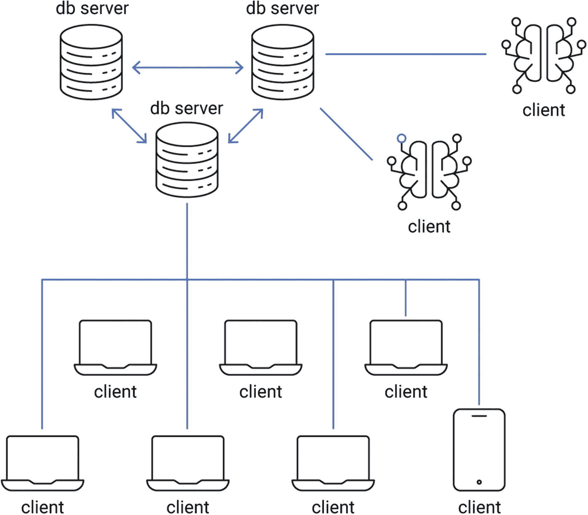
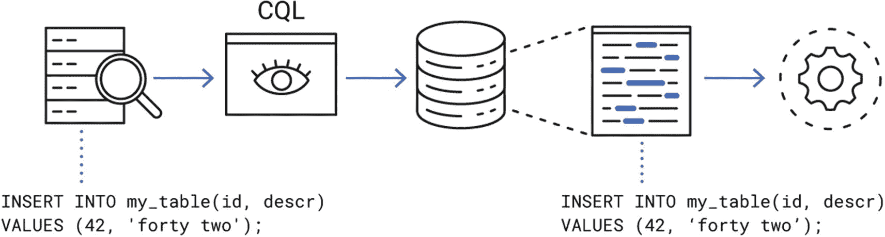
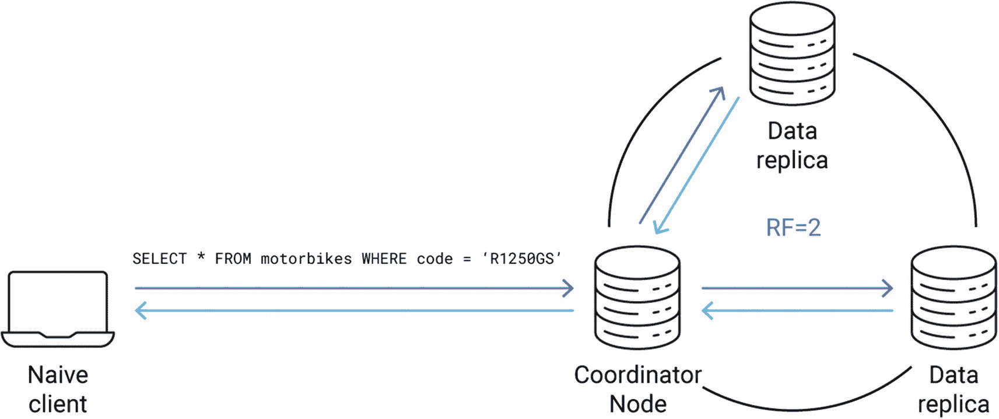
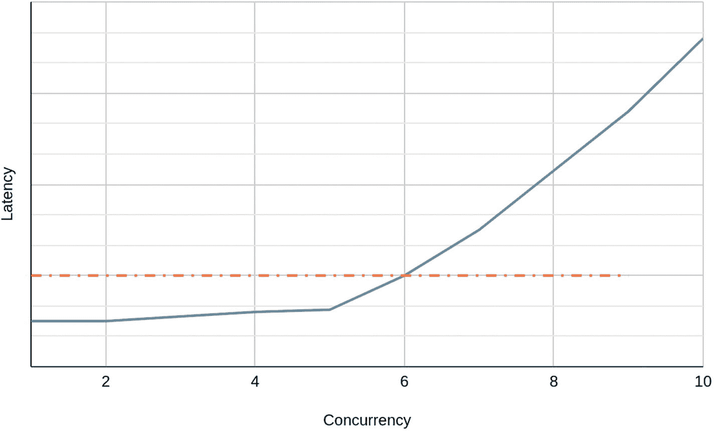

# 5. 数据库驱动程序

客户端与服务器之间的关系超时上下文感知查询局部性重试分页并发选择驱动程序时要注意的事项总结

数据库通常为用户提供特定的通信协议。这个协议是客户端和服务器之间通信的基础，因此它通常有很好的文档记录和正式规范。一些数据库，如 PostgreSQL，在 TCP/IP 堆栈之上实现自己的二进制格式。1 其他数据库，如 Amazon DynamoDB，2 则在其之上构建，基于 HTTP，这比 HTTP 更冗长，但更灵活，也与网络浏览器兼容。也可以看到数据库公开基于 gRPC3 或任何其他已建立框架的协议。

无论实现细节如何，用户很少直接使用裸协议，因为这通常是一个相当低级的 API。取而代之的是使用一个**驱动程序**——用特定语言编写的编程接口，它实现了与数据库通信的高级抽象。驱动程序隐藏了所有繁琐的细节，通过一个方便的接口提供给用户，从而节省了用户手动处理连接管理、解析、验证、握手、身份验证、超时、重试等工作。

在分布式环境中（可扩展的数据库集群通常是这样的），客户端和因此驱动程序是生态系统中的极其重要的一部分。客户端通常是系统中数量最多的参与者群体，它们在本质上也非常异质，如图 5-1 所示。一些客户端通过本地网络接口连接，其他一些通过另一个大陆上的可疑 Wi-Fi 热点连接，因此具有截然不同的延迟特性和错误率。一些可能在具有 1MiB 随机存取内存的微控制器上运行，而其他一些则利用云提供商的 128 核心裸机。由于这种多样性，在考虑性能、可扩展性和对失败的恢复能力时，考虑驱动程序非常重要。最终，是驱动程序生成流量及其并发性，因此它们与数据库节点之间的合作对于整个系统保持健康和高效至关重要。

注意

作为提醒，本书中提到的**并发**是指在同一时间点执行的操作数量。从概念上讲，它与并行性相似。在并发的情况下，操作在物理上是同时发生的（例如，在多个 CPU 核心或多台机器上）。并行性并不指定这一点；操作也可以在单台机器上以小步骤执行。如今，分布式系统必须依赖提供高并发性以保持竞争力并赶上不断发展的技术。

本章探讨了驱动程序如何影响性能——通过那些为性能而设计驱动程序的人的眼睛。它提供了关于驱动程序如何支持高效的客户端-服务器交互的见解，并分享了如何充分利用驱动程序的建议，尤其是从性能的角度来看。最后，本章总结了在选择驱动程序时需要考虑的几个要点。

## 客户端与服务器之间的关系

可扩展性是衡量你的系统对增加负载反应能力的指标。这种负载通常由客户端使用他们的驱动程序生成，因此保持你的客户端和服务器之间的关系良好是一个重要的问题。你对工作负载、客户端行为及其使用模式了解得越多，你就越能准备好处理突然的交通高峰和持续的长期增长。

每个客户端都是不同的，应该这样对待。差异既来自客户端的特征，如它们的数量和体积，也来自它们的需求。一些客户端有严格的延迟保证，即使是以更高的错误率为代价。其他客户端并不特别关心单个数据库查询的延迟，只是希望他们的长期查询能够保持稳定的进度。一些数据库针对特定类型的客户端（例如，分析型数据库，它期望客户端处理大量聚合查询，操作大量历史数据）。其他数据库则力求通用，处理所有类型的客户端，并平衡负载，使每个人都满意（或者更准确地说，“足够满意”）。



一个图示，其中两个客户端与三个相互交互的数据库服务器交互，并且连接到七个客户端。

图 5-1

分布式系统中客户端和服务器可视化

### 工作负载类型

对数据库客户端进行分类有多种方式。一种特别有趣的方式是区分处理交互式和批量（例如，分析型）工作负载的客户端，也称为 OLTP（在线事务处理）与 OLAP（在线分析处理）——参见图 5-2。


两个图示。1. 标题是交互式。三个数据库服务器分别与四个客户端交互。2. 标题是批量。三个数据库服务器作为一个整体与四个客户端交互。

图 5-2

交互式和批量（分析型）工作负载之间的区别

#### 交互式工作负载

处理交互式工作负载的客户端通常希望获得一定的延迟保证。快速收到响应比确保查询成功更重要。换句话说，及时返回错误比让客户端无限期地等待正确响应要好。这类工作负载通常以无界并发为特征，这意味着正在进行的操作数量难以预测。

一个交互式工作负载的典型例子是服务器处理来自网页浏览器的请求。想象一下一个在线游戏，玩家可以直接从他们最喜欢的浏览器与系统互动。对于这样的玩家来说，高延迟意味着糟糕的用户体验，因为人们往往讨厌等待在线内容超过几百毫秒；如果延迟达到几秒，大多数人会放弃游戏，认为它无法使用，并尝试其他东西。因此，尽可能实现交互性并快速返回结果尤为重要——即使结果可能是一个临时错误。在这种情况下，客户端的并发性变化无常，对于数据库来说难以控制。有时可能会有大量玩家涌入，数据库可能需要拒绝其中一些玩家以避免过载。

#### 批量（分析）工作负载

批量（分析）工作负载是交互式工作负载的概念对立面。对于这类工作负载来说，单个请求是否在几毫秒或几小时内处理并不重要。重要的是处理过程以令人满意的错误率稳步进行，理想情况下错误率为零。批量工作负载通常具有固定的并发性，这使得数据库更容易控制负载。

批量工作负载的一个好例子是 Apache Spark^(4)在大型数据集（如 TB 级）上执行分析作业。与数据库建立的连接只有几个，它们持续发送请求以获取用于长时间计算的数据。由于并发性可预测，数据库可以很容易地通过应用背压（例如，稍微延迟响应）来应对增加的负载。分析处理将简单地减慢速度，根据数据库消耗查询的速度调整其速度。

#### 混合工作负载

某些工作负载难以完全归类为完全交互式或完全批量。客户端可以自由地混合他们的需求、并发性和负载，因此数据库也应该为意外情况做好准备。例如，批量工作负载可能会突然经历并发性的巨大临时峰值。数据库一方面应保持对工作负载典型模式的信任，另一方面应预料到工作负载可能会随着时间的推移而改变——由于错误、硬件变化，或者仅仅是因为用例已经偏离了其原始目标。

### 吞吐量与有效吞吐量

一个健康的分布式数据库集群的特点是稳定的良好吞吐量，而不是吞吐量。*良好吞吐量*是*良好*和*吞吐量*的有趣组合，它是衡量客户端和服务器之间通过网络传输的*有用*数据的度量，而不是任何数据。良好吞吐量忽略了错误和其他类似冗余重试的 churn，用于判断通信的实际效果。

这种区别很重要。

想象一个极端情况，一个过载的节点持续对每个进入的请求返回错误。即使可以观察到稳定和可持续的吞吐量，这个数据库对最终用户来说也没有任何价值。因此，跟踪在可接受的时间内可以传输多少有效数据是至关重要的。例如，这可以通过跟踪总吞吐量和用于发送错误信息的吞吐量，然后从另一个中减去以查看传输了多少有效数据来实现（见图 5-3)。


两个图表。1. 图表标题是“客户端接收请求”。有两条每秒 100 千字节和 60 千字节的振荡线。2. 图表标题是“每秒写入超时”。在晚上 7 点有每秒 14 个写入者的峰值，在晚上 9 点有每秒 10 个写入者的峰值。

图 5-3

注意吞吐量的一部分超时，这实际上需要客户端做更多的工作以实现良好的吞吐量

最大化良好吞吐量是一项微妙的工作，它严重依赖于基础设施、工作负载类型、客户端行为以及许多其他因素。在某些情况下，数据库卸载负载可能对整个系统有益。*卸载*是处理过载的一种相当激进的措施：将“风险”请求简单地由服务器忽略，或者立即以错误终止。这种类型的过载保护特别适用于由无界并发交互式工作负载引起的问题（数据库除了在早期丢弃一些传入请求外，几乎没有其他方法来保护自己）。

数据库服务器不是先知；它无法准确预测请求是否会因为过载而失败，因此必须猜测。幸运的是，有相当多的方法可以使这种猜测变得有根据：

+   如果已经处理了 X 个请求，则卸载负载，其中 X 是数据库节点可以处理的估计最大值。

+   如果请求的估计内存使用量大于数据库当前可以处理的量，则拒绝该请求。

+   如果已经处理了 Y 个请求，则概率性地拒绝请求，其中 Y 是数据库节点可以处理的估计最大值的百分比，一旦达到某个阈值，概率将上升到 100%。

+   如果请求的估计执行时间表明它不会及时完成，而是很可能超时，则拒绝该请求。

虽然拒绝客户端请求会损害用户体验，但有时这可能是两个恶中较小的一个。如果放弃一些请求可以让更多的请求及时成功完成，这会增加集群的吞吐量。

客户端可以通过声明请求被认为是有效的时间长度来帮助数据库最大化吞吐量和保持低延迟。例如，在高频交易中，耗时超过几毫秒的请求与失败的请求一样好。通过让数据库知道这一点，你可以允许它提前终止一些请求，为其他仍有成功机会的请求留下宝贵的资源。适当的超时管理是一个广泛的话题，它值得单独一节来讨论。

## 超时

在分布式系统中，有两种基本类型的时间超时相互影响：客户端超时和服务器端超时。虽然两者在概念上相似，但它们有不同的特性。正确配置两者对于防止数据竞争和一致性问题是至关重要的。

### 客户端超时

这种类型的超时通常在数据库驱动程序中配置。它表示驱动程序决定服务器响应不太可能到达所需的时间。在一个建立在完美网络之上的理想世界中，所有各方总是对其请求做出响应。然而，在实践中，有许多原因可能导致响应延迟或丢失：

+   收件人死亡

+   收件人正忙于其他任务

+   网络失败，可能是由于硬件故障

+   网络有显著的延迟，因为数据包卡在中间路由器中

+   软件错误导致数据包丢失

+   等等

由于在分布式环境中通常无法猜测发生了什么，客户端有时必须决定请求已丢失。另一种选择是无限制地等待。这可能适用于一些特定的用例，但通常是不被接受的。如果单个失败的请求在不确定的时间内占用资源，系统最终注定要失败。因此，客户端超时被用作确保系统即使在通信问题发生时也能运行的机制。

客户端超时的一个独特特性是，放弃请求的决定完全由客户端做出，而不考虑来自服务器的任何反馈。完全有可能的情况是，相关的请求仍在处理中，并正在使用服务器的资源。而且，最糟糕的是，无意识的服务器在处理完毕后可能会愉快地向客户端返回响应，尽管此时没有人对这过时的数据感兴趣！这又提出了错误处理的一个方面：驱动程序必须准备好正确处理这些意外的、过期的响应。

### 服务器端超时

服务器端超时确定数据库节点何时应开始考虑特定请求已过期。一旦这个时间点过去，就没有理由继续处理查询。（这样做会浪费资源，这些资源本可以用于服务其他仍有成功机会的查询。）当指定的时间过去后，数据库通常会返回一个错误，表明请求耗时过长。

使用合理的服务器端超时值有助于数据库更精确地管理其优先级，为可能及时成功查询分配 CPU、内存和其他稀缺资源。收到指示服务器端超时发生的错误的通知器也应该相应地采取行动——可能通过减轻特定节点的压力或在最近没有超时的其他节点上重试。

#### 一个警告故事

CQL 协议，它指定了 Apache Cassandra 和 ScyllaDB 的通信层，内置了对并发的支持。具体来说，每个请求都被分配一个流 ID，每个连接都是唯一的。这个流 ID 被编码为一个 16 位的整数，其中协议保留第一个位，这为驱动程序留下了 32768 个唯一的值来处理每个连接的单个连接中的飞行请求。这个流 ID 随后被用来匹配一个传入的响应与其原始请求。考虑到现代系统通常每秒处理数百万个请求，这并不是一个特别大的数字。因此，驱动程序最终需要重用之前分配的流 ID。

但 Python 的 CQL 驱动程序有一个错误.^(5) 在客户端超时的情况下，它假设已过期的请求的流 ID 立即可以重用。如果服务器崩溃，这个假设是正确的，但如果处理时间比预期长，则是不正确的。因此，一旦带有给定流 ID 的响应到达，另一个请求可能已经重用了该流 ID，并且驱动程序会错误地将响应与新的请求匹配。如果用户运气好，他们只会收到未通过验证的垃圾数据。不幸的是，来自不匹配响应的数据可能看起来是正确的，即使它来自一个完全不同的请求。这种看起来无害的 bug，可能会造成人们登录到他人的银行账户，并对其生活造成破坏。

客户端超时的一个经验法则是要确保服务器端超时也存在，并且比客户端超时严格短。它应该考虑到客户端和服务器之间的时钟同步（或缺乏同步），以及估计的网络延迟。这样的程序可以最大限度地减少晚响应到达的机会，从而消除许多问题和漏洞的根本原因。

## 上下文感知

到目前为止，应该很清楚，如果服务器和客户端了解彼此更多，它们可以做出更好、更明智且互惠互利的决策。交换超时信息很重要，但驱动程序和服务器可以做得更多，以保持彼此的最新状态。

### 拓扑和元数据

数据库服务器通常组合成复杂的拓扑结构，其中某些节点被分组在单个地理位置，其他节点仅用作快速缓存层，而还有一些节点将很少访问的冷数据存储在便宜的地方，仅用于应急。

并非每个数据库都会向最终用户暴露其拓扑结构。例如，DynamoDB 从客户端卸下了这个负担，只暴露一个单一端点，并自行处理负载均衡、过载预防和重试机制。另一方面，相当一部分流行的数据库（包括 ScyllaDB、Cassandra 和 ArangoDB）依赖于驱动程序来连接到每个节点，决定保持多少个连接，何时进行推测性重试，以及何时关闭疑似故障的连接。在 ScyllaDB 的情况下，与驱动程序共享最新的拓扑信息有助于它们做出正确的决策。这些数据可以通过多种方式共享：

+   定期从服务器获取拓扑信息的客户端

+   订阅服务器发送事件的客户端

+   参与信息交换协议（例如，八卦^(6))的客户端

+   这些方式的任何组合

根据数据库模型，客户端通常还会缓存另一项有价值的信息——元数据——其中最重要的例子是数据库模式。SQL 数据库以及许多 NoSQL 数据库至少部分地保持数据结构化。模式定义了数据库行（或列）的形状，不同列中存储的数据类型，以及各种其他特性（例如，数据库行在垃圾回收之前应该存活多长时间）。基于最新的模式，驱动程序可以执行额外的验证，确保发送到服务器的数据具有正确的类型，并遵守数据库要求的任何约束。另一方面，当模式缓存与驱动程序不同步时，客户端可能会遇到查询无端失败的情况。

同步完整的模式信息在性能上可能代价高昂，如何找到更新频率的良好折衷方案高度依赖于用例。一个经验法则是仅更新到确保元数据交换引起的流量不会对用户体验产生负面影响为止。还值得注意的是，在分布式数据库中，客户端并不总是与最新的模式信息保持同步，整个系统应该准备好处理这种情况，并提供处理此类不一致的策略。

### 当前负载

过载保护和请求延迟优化是繁琐的任务，但通过在相关方之间尽可能多地交换上下文可以大大简化这些任务。

以下方法可以应用于在分布式系统中均匀分配负载并防止不必要的峰值：

1.  在驱动程序中收集每个数据库连接的延迟统计信息：

    1.  这个连接的平均延迟是多少？

    1.  99 分位数的延迟是多少？

    1.  在最近一段时间内，体验到的最大延迟是多少？

1.  交换有关服务器端缓存的：

    1.  缓存是否已满？

    1.  缓存是否已预热（即填充了有用的数据）？

    1.  是否有某些项目经历了高流量和/或延迟？

1.  解释服务器事件：

    1.  服务器是否已经开始回复“过载错误”？

    1.  这个服务器的请求超时频率是多少？

    1.  这个服务器的错误一般速率是多少？

    1.  这个服务器测量的良好吞吐量是多少？

根据这些指标，驱动程序应尝试调整发送的数据量、并发性和重试速率，以及推测性执行，这可以使整个分布式系统保持健康、平衡的状态。最终，减轻开始显示过载症状的节点压力是驱动程序的利益所在，无论是通过减少操作并发性、限制重试频率和次数、暂时放弃推测性发送的请求等等。否则，如果数据库服务器过载，所有客户端可能会经历失败请求、超时、延迟增加等症状。

### 请求缓存

许多数据库管理系统，从 SQLite、MySQL 和 Postgres 到 NoSQL 数据库，都实现了一种称为 *预编译语句* 的优化技术。虽然与数据库通信使用的语言通常是可读的（或者至少是开发者可读的），但这并不是从一台计算机传输数据到另一台计算机的最有效方式。

让我们看看一个未准备好的语句在被 ScyllaDB 驱动程序发送到数据库并返回后的（简化版）生命周期。这如图 5-4 所示。



未准备语句的生命周期包括，1. 一个查询字符串，2. 驱动程序将字符串打包到 CQL 框架中，3. CQL 框架通过网络发送，4. 数据库解析字符串以验证其内容，5. 数据库处理。

图 5-4

未准备语句的生命周期

1.  创建一个查询字符串：

    `INSERT INTO my_table(id, descr) VALUES (42, 'forty two');`

1.  驱动程序会将字符串打包成一个 CQL 帧。每个 CQL 帧都包含一个头部，用于描述该帧的目的。在头部之后，还可以发送特定的有效载荷。完整的协议规范可在[`github.com/apache/cassandra/blob/trunk/doc/native_protocol_v4.spec`](https://github.com/apache/cassandra/blob/trunk/doc/native_protocol_v4.spec)找到。

1.  CQL 帧通过网络发送。

1.  数据库接收该帧。

1.  一旦接收到帧，数据库将解释帧头部，然后开始解析有效载荷。如果有未准备好的语句，有效载荷将简单地表示为一个字符串，如步骤 1 所示。

1.  数据库解析该字符串以验证其内容并解释请求的操作类型：是插入、更新、删除、选择？

1.  一旦解析了语句，数据库就可以继续处理它（例如，在磁盘上持久化数据、获取所需的数据等）。

现在，假设用户想要在数据库上快速连续执行一亿个操作，因为数据是从另一个系统迁移过来的。即使解析查询字符串是一个相对较快的操作，耗时 50 微秒，但解析字符串的总时间将超过一个小时的 CPU 时间。听起来这是一个明显的优化目标。

关键观察结果是，在数据库上执行的操作通常彼此相似，并遵循某种模式。例如，将表从一个系统迁移到另一个系统可能意味着发送大量具有以下模式的请求：

```
INSERT INTO my_table(id, descr) VALUES (?, ?)
```

其中`?`表示字符串中唯一在请求之间变化的部分。

这个用问号代替实际值的查询字符串实际上也是有效的 CQL！虽然它不能直接执行（因为一些值是未知的），但它可以被准备。

准备这样的语句意味着数据库将仔细分析字符串，解析它，并在自己的内存中创建语句的内部表示。完成后，将生成一个唯一的标识符并将其发送回驱动程序。客户端现在可以通过仅提供其标识符（在 ScyllaDB 中是一个 128 位的 UUID^(7))以及从准备好的查询字符串中缺失的所有值来执行语句。将问号替换为实际值的过程称为*绑定*，这是数据库需要做的唯一事情，而不是启动 CQL 解析器，这可以显著提高速度。

不加注意地准备语句也可能对整体集群性能产生不利影响。当语句被准备时，数据库需要在内存中保留一定量的关于它的信息，这几乎不是一种无限资源。准备语句的缓存通常相对较小，假设驱动程序的用户（应用程序开发者）是友好的，并且只准备经常使用的查询。另一方面，如果用户准备了许多独特且不太可能很快被重用的语句，数据库缓存可能会使频繁使用的查询的现有条目失效。条目如何失效的确切启发式方法取决于缓存中使用的算法，但简单的 LRU（最近最少使用）淘汰策略容易受到这个问题的影响。因此，在设计缓存时，如果没有关于预期使用模式的完整信息，应考虑其他对这种边缘情况具有弹性的缓存算法。以下是一些值得注意的例子：

+   **LFU（最少使用频率）**

    除了跟踪最近访问过的项目外，LFU（最少使用频率）还会计算在给定时间段内需要它的次数，并尝试将频繁使用的项目保留在缓存中。

+   **LRU（最近最少使用）与两个池**

    一个用于新条目的试用期池，另一个通常更大的池用于频繁使用的项目。此算法避免了当大量一次性条目被插入缓存时发生缓存抖动，因为它们只会从试用期池中淘汰其他项目，而更频繁访问的条目在主池中是安全的。

最后，无论服务器端实现缓存淘汰所使用的算法是什么，驱动程序都应该注意不要过于积极地准备查询，尤其是如果它是自动发生的，这在对象关系映射（ORMs）中通常是情况。使接口对用户方便听起来可能很有吸引力，开发者的体验确实在设计驱动程序时是一个重要的因素，但过于急切地预留宝贵的数据库资源可能在长期内是不利的。

## 查询局部性

在分布式系统中，任何类型的局部性都是受欢迎的，因为它减少了失败的可能性，保持了低延迟，并且通常防止了许多不希望发生的事件。虽然数据库客户端以及驱动程序通常不与数据库集群位于同一台机器上，但有可能缩短它们之间的距离。“距离”可能意味着物理测量或网络拓扑中的中间设备数量。无论如何，为了延迟，最好在需要频繁互相通信的各方之间最小化它。

许多数据库管理系统允许他们的客户端宣布他们的“位置”，例如，通过声明哪个数据中心是他们的本地默认数据中心。驱动器在与其他数据库节点通信时应考虑这些信息。只要所有一致性要求都得到满足，通常最好直接将数据发送到附近的节点，假设它将在传输中花费更少的时间。短路径通常也意味着中间人更少，这反过来又意味着潜在的故障点更少。

驱动器可以做出更加明智的选择。许多 NoSQL 数据库可以被描述为“分布式哈希表”，因为它们将数据分区并分散到拥有特定哈希集的多台节点上。如果哈希算法是众所周知的且确定性的，驱动器可以利用这一事实来进一步优化查询——直接将数据发送到适当的节点，甚至直接发送到处理它的单个 CPU 核心。

ScyllaDB、Cassandra 和其他 NoSQL 数据库应用了一个令牌意识的概念（参见图 5-5、5-6 和 5-7）：

1.  一个请求到达。

1.  接收节点计算给定输入的哈希值。

1.  根据这个哈希值的值，它计算出哪些数据库节点负责这个特定的值。

1.  最后，它将请求直接转发到拥有节点。



一个简单的客户端与协调节点交互，该节点随后与数据副本交互。

图 5-5

简单客户端将查询路由到任何节点（协调器）

然而，在某些情况下，驱动器可以在本地自行计算令牌，然后使用集群拓扑信息将请求直接路由到拥有节点。这种本地节点级路由至少节省了一个网络往返以及一些节点的 CPU 时间。


一个具有令牌意识的客户端与协调节点和数据副本交互，该节点随后与数据副本交互。

图 5-6

令牌意识客户端将查询路由到正确的节点

在 Cassandra/ScyllaDB 的情况下，这是可能的，因为每个表都有一个定义良好的“分区器”，这仅仅意味着一个哈希函数实现。默认选择——在 Cassandra 中使用——是 murmur3，^(9)，它返回一个 64 位的哈希值，具有令人满意的分布，并且计算相对便宜。ScyllaDB 更进一步，允许驱动器计算哪个数据库节点的哪个 CPU 核心拥有特定的数据。当驱动器是协作的并且主动为每台机器的每个核心建立单独的连接时，它不仅可以发送到正确的节点，还可以直接发送到处理它的单个 CPU 核心。这不仅节省了网络带宽，而且对 CPU 缓存非常友好。


分片感知客户端与协调器加数据副本交互，而数据副本反过来与数据副本交互。

图 5-7

分片感知客户端将查询路由到正确的节点（+核心）

## 重试

在一个完美的系统中，没有任何请求会失败，并且驱动程序中实现的逻辑可以保持简洁和最小化。在现实世界中，失败发生得令人不安地频繁，因此驱动程序也应该准备好处理它们。一种用于容错性的机制是驱动程序的重试策略。重试策略的职责是决定是否因为失败（或者至少驱动程序强烈怀疑它失败了）而再次发送请求。

### 错误类别

在深入研究智能重试请求的技术之前，有一个更基本的问题需要考虑：重试是否真的有意义？答案并不明显，并且取决于许多内部和外部因素。当请求失败时，错误可以归入以下类别，以下是一些示例：

1.  超时

    1.  读取超时

    1.  写入超时

1.  临时错误

    1.  数据库节点过载

    1.  目标节点已死亡

    1.  临时模式不匹配

1.  永久性错误

    1.  不正确的查询语法

    1.  认证错误

    1.  权限不足

根据类别，重试决策可能会有很大差异。例如，重试具有不正确语法的请求完全没有意义。它不会神奇地变得正确，这样的重试尝试只会浪费带宽和数据库资源。

### 幂等性

除了错误类别之外，重试策略还必须考虑请求本身的一个重要特性：其*幂等性*。幂等请求可以安全地多次应用，其结果将与应用一次无法区分。

为什么需要考虑这一点？对于某些错误类别，驱动程序不能确定请求是否实际上成功了。这类错误的典型例子是超时。驱动程序未能及时获得响应并不意味着服务器没有成功处理请求。如果网络连接中断，情况也类似：驱动程序将不知道数据库服务器是否实际上成功应用了请求。

当不确定时，驱动程序应该做出明智的猜测，以确保一致性。想象一下，一个从某人的银行账户中提取 100 美元的请求。如果你不是绝对确定它失败了，你当然不希望再次执行相同的请求；否则，银行客户可能会有些怨恨。这是一个非幂等请求的完美例子：多次应用它改变了最终结果。

幸运的是，存在大量幂等查询可以安全重试，即使不清楚它们是否已经成功：

1.  **只读请求**

    由于它们不修改任何数据，无论重试多少次，都不会有任何副作用。

1.  **具有比较和设置特性的某些条件请求**（例如，“如果前一个值是 42，则增加值 1”）

    根据用例，这样的条件可能足以保证幂等性。一旦这个请求被应用，再次应用它将不会有任何效果，因为之前的值将是 43。

1.  **具有唯一时间戳的请求**

    当每个请求都有一个唯一的时间戳（以墙钟时间表示或基于逻辑时钟^(10))时，应用多次可以是幂等的。重试尝试将包含与原始请求相同的时间戳，因此它将只覆盖由这个特定时间戳标识的数据。如果在之间有带有较新时间戳的新数据到达，它不会被带有较旧时间戳的重试尝试覆盖。

通常，让驱动程序给用户提供一个明确声明请求幂等性的机会是个好主意。一些查询可以通过驱动程序简单地推断为幂等（例如，当它是数据库世界中的只读`SELECT`语句时），但其他可能不那么明显。例如，前一步第 2 步的条件示例，如果值从未减少，则是幂等的，但在一般情况下则不是。想象以下反例：

1.  当前值为 42。

1.  发送一个“如果前一个值是 42，则增加值 1”的请求。

1.  重试一个“如果前一个值是 42，则增加值 1”的请求。

1.  发送另一个请求，“将值减 1”。

1.  第 2 步的请求到达并被应用——将值更改为 43。

1.  第 4 步的请求到达并被应用——将值更改为 42。

1.  第 3 步的重试被应用——将值改回 43，并干扰第 4 步查询的效果。最终，它根本不是幂等的！

由于仅通过分析其内容通常无法猜测请求是否幂等，因此最好让驱动程序在其 API 中公开一个`set_idempotent()`函数。它允许用户明确标记一些查询为幂等，然后驱动程序中实现的逻辑可以假设在需要时安全地重试此类请求。

### 重试策略

最后，有足够的上下文来讨论数据库驱动程序可以实施的实际重试策略。重试策略的唯一任务是分析失败的查询并返回一个决策。这个决策取决于数据库系统和其固有特性，但通常是以下之一（见图 5-8）：


决策图的三个重试查询示例。1. 带有标签“幂等”和问号的框，如果回答是，则指向另一个名为“安全”的框。2. 带有标签“确定失败”和问号的框，如果回答是，则指向另一个名为“安全”的框。3. 带有标签“可以写两次”和问号的框，如果回答是，则指向另一个名为“安全”的框，如果回答否，则指向另一个名为“不安全”的框。

图 5-8

重试查询的决策图

+   不重试

+   在同一数据库节点上重试

+   重试，但在不同的节点上

+   重试，但不是立即——应用一些延迟

不重试通常是一个不错的选择——当驱动程序不确定幂等查询是否真的失败或只是超时时，这是唯一正确的选择。对于永久性错误来说，这也是一个明显的选择；由于语法错误而之前被拒绝的请求重试是没有意义的。而且，每当系统过载时，“不重试”的方法可能有助于整个集群。虽然立即效果（阻止用户的请求被驱动完成）是不希望的，但它提供了一种过载保护水平，这可能在将来得到回报。它防止过载条件继续升级。一旦节点流量过多，它就会拒绝更多请求，这会增加重试率，最终陷入恶性循环。

在同一数据库节点上重试通常是一个好的选择，对于超时来说尤其如此。假设请求是幂等的，相同的节点可能更快地解决潜在冲突。如果前一个节点显示出过载的迹象，或者有输入/输出错误表明是暂时性问题，那么在不同的节点上重试是个好主意。

最后，在某些情况下，延迟重试而不是立即执行是一个好主意（见图 5-9）。


一幅带有三条线（从下到上分别为：终端用户、应用和集群）的插图。尝试 1 仅超出应用并结束。尝试 2 达到集群并弹回。尝试 3 达到集群，弹回到应用，然后到终端用户。

图 5-9

最终导致成功查询的重试尝试

当整个集群显示出过载的迹象——无论是高报告的 CPU 使用率还是感知到的延迟增加——请求失败后立即重试可能会加剧问题。驱动程序可以做的另一件事是应用一个温和的退避算法，给数据库集群恢复的时间。记住，即使是失败的重试也会消耗资源：网络、CPU 和内存。因此，以合理的方式平衡成本和成功的机会会更好。

三种最常见的退避策略是常数、线性以及指数退避，如图 5-10 所示。


三条线。1. 一个指数线，点在 1, 2, 7, 16 和 32，2. 一个线性线，点在 1, 2, 3, 6, 10, 16, 23 和 32，3. 一个常数线，点从 1 到 32。

图 5-10

常数、线性以及指数退避

第一种类型（恒定）简单地在重试之前等待一个预定义的固定时间。线性退避以线性方式增加尝试之间的时间；它可能在第一次尝试前等待一秒钟，第二次尝试前等待两秒钟，以此类推。最后，指数退避，可以说是最常用的方法，通过每次乘以一个常数来增加延迟。通常它只是将其翻倍——因为处理器和开发者都喜欢乘以和除以二（后者大多只是为了炫耀他们对位运算符的复杂知识的了解）。指数退避在防止过载方面具有特别好的特性。重试率呈指数下降，因此对数据库集群的压力也相应减少。

## 分页

数据库通常存储的数据量比单个客户端机器能够处理的数据量大得多。如果你获取所有可用的记录，结果很可能无法适应你的本地磁盘，更不用说你的可用 RAM 了。尽管如此，处理大量数据的许多情况都是有效的，例如分析日志或搜索特定文档。要求数据库提供所有数据是完全可接受的——但你可能希望它以较小的数据块提供这些数据。

那种技术通常被称为*分页*，它无处不在。这正是你在浏览谷歌搜索结果的第 17 页，徒劳地寻找一个只在七年前的非活跃论坛上提出的问题的答案时所经历的——或者到达 eBay 列表的第 24 页，寻找那个完美的单一报价。数据库及其驱动程序也将分页作为一种对双方都有益的机制实现。驱动程序以较小的数据块获取数据，这可以以较低的延迟完成。数据库接收到的查询也更小，这有助于缓存管理、工作负载优先级、内存使用等。

不同的数据库模型可能对分页的具体内容和如何与之交互有不同的看法。一些系统可能提供细粒度控制，允许你请求“数据第 16 页”。其他系统则是“单向前进”：它们将用户界面简化为“这是当前页——如果你想的话可以请求下一页。”你控制页面大小的能力也各不相同。有时可以指定大小为数据库记录数或字节数。在其他情况下，页面大小是固定的。

在允许请求分页的最小界面之上，驱动程序可以提供许多与分页相关的有趣功能和优化。其中之一是*预读*——这通常意味着在您实际请求读取之前，驱动程序透明地、推测性地获取新的页面。预读是双刃剑的经典例子。一方面，它使得某些读取操作更快，特别是如果工作负载由大连续读取组成。另一方面，它可能造成过高的开销，特别是如果工作负载基于小随机读取。

尽管大多数驱动程序支持分页，但检查该功能是默认开启还是关闭，并自觉地决定对特定工作负载最好的做法是很重要的。特别是要注意以下方面：

1.  默认行为是什么（读取查询会被分页还是未分页）？

1.  默认的分页大小是什么，并且是否可配置？如果是，大小可以用什么单位指定？字节？记录数？

1.  预读是否默认开启？能否开启/关闭？

1.  预读是否可以进一步配置？例如，您能否指定要获取多少页面或何时决定开始获取（例如，“当至少有三个连续的读取请求已经发生”）？

正确设置分页非常重要，因为单个未分页的响应可能足够大，对被迫产生它的数据库服务器和试图接收它的客户端都可能是问题。另一方面，过于细粒度的分页可能导致不必要的开销（只需想象尝试逐行读取十亿条记录，因为默认的分页大小为“1 行”）。最后，预读可以是一种出色的优化技术——但它也可能完全多余，获取不需要的页面，消耗内存、CPU 时间、吞吐量，并混淆指标和日志。在分页配置中，最好尽可能明确。

## 并发

在许多情况下，要充分利用数据库并实现最佳性能，通常需要驱动程序同时执行许多 I/O 操作。这反过来又通常通过发布异步任务来实现。话虽如此，让我们退后几步来解释这究竟意味着什么，以及从硬件和软件的角度实现这一点涉及哪些内容。

注意

高并发并不是万能的。当它过高时，很容易超载系统并破坏其他用户的服务质量——参见图 5-11 以了解其对延迟的影响。第一章包括一个关于并发超出界限可能发生什么的警告故事，第二章也提到了无界并发的危险。

### 现代硬件

在过去，关于 I/O 并发的决策很容易，因为磁存储驱动器（HDD）的有效并发性为 1。通常只有一个执行器臂用于导航盘片，因此一次只能读取一个数据扇区。然后，发生了 SSD 革命。突然之间，磁盘可以并发地从多个偏移量读取。此外，如果不实际请求并发执行多个操作，几乎不可能充分利用磁盘（即以标签上印制的闪亮数字的速度读取和写入），现在，随着企业级 NVMe 驱动器和英特尔 Optane 等发明，^(11) 并发性在基准测试输入/输出设备时成为一个主要因素。见图 5-11。



一条表示延迟与并发的折线图。一条实线从左下角开始，几乎保持平坦，在 x 轴值为 5 之后逐渐上升，达到右上角。在 y 轴值为 3 的位置还有另一条线。数值为估算值。

图 5-11

系统并发与延迟之间的关系

网络技术也没有落后。现代网卡拥有多个独立的队列，借助接收端扩展（RSS^(12）），实现了以前难以想象的高性能水平，吞吐量以 Tbps 计算.^(13) 在这样先进的硬件支持下，软件实现高并发只需要简单地利用现有能力。

显然，CPU 核心也值得在这里提及。这是与并发最常相关的一部分计算机基础设施。购买 64 核心的消费级处理器只需去隔壁的硬件店，而专业服务器的种类则更加丰富。

操作系统也专注于促进高度并发的程序。Jens Axboe 的 io_uring^(14)是 Linux 内核的一个新功能。如第三章所述，它是为异步 I/O 开发的，而异步 I/O 又对软件实现高并发成为新标准起到了重要作用。一些数据库驱动程序已经在底层使用 io_uring，而更多的则将集成放在优先级列表中的很高位置。

### 现代软件

现代软件如何适应这个高度并发的时代呢？从历史上看，确保多个操作可以同时执行的一个流行模型是保持一个操作系统的线程池，每个线程都有自己的任务队列。但这只能以有限的方式扩展，因此现在业界倾向于所谓的“绿色线程”，它们在概念上与操作系统的同名线程相似，但它们是在用户空间中以更轻量级的方式实现的。

例如，在 Seastar（一个基于未来-承诺模型并在 C++ 中实现的高性能异步框架^(15)^）中，有相当多的方式来表达单个执行流程，这可以称为绿色线程。可以通过链式连接未来（futures）来创建执行纤维，您还可以使用 C++ 协程机制以干净的方式构建异步程序，编译器将协助使代码更易于异步化。

在 Rust 语言中，异步模型非常独特。在那里，一个未来（future）代表计算过程，而推进这个异步状态机的状态则是程序员的职责。其他语言，如 JavaScript、Go 和 Java，也提供了对异步编程的明确和标准化的支持。

这种异步编程支持是好的，因为数据库驱动器是应该从第一天起就支持异步操作的软件的典型例子。驱动器通常负责与高度专业化的数据库集群进行网络通信，这些集群能够同时执行大量的 I/O 操作。我们无法强调得更多，高并发是充分利用数据库的唯一途径。异步代码使这一点变得容易得多，因为它允许在不耗尽本地资源的情况下实现高并发级别。绿色线程轻量级，即使在消费级笔记本电脑上也可以有成千上万个。异步 I/O 也非常适合这种用例，因为它允许在并行发送数千个请求到网络的同时，不阻塞 CPU 并迫使它等待任何操作完成，这在传统的线程池模型中是一个已知的瓶颈。

注意

未来-承诺模型和异步 I/O 在第三章中介绍。

## 选择驱动器时需要注意的事项

数据库驱动器通常作为开源软件提供。这是一个很好的模式，它允许人们做出贡献，同时也使得软件易于访问，因此受到欢迎（这正是数据库供应商所希望的）。驱动器可以由供应商、另一家公司或简单地由您隔壁的开源贡献者开发。这种竞争对整个系统非常有益，但也迫使用户做出选择：使用哪个驱动器？例如，在撰写本文时，官方 PostgreSQL 文档仅列出六个 C/C++ 驱动器，完整的列表要长得多.^(16)

选择驱动器应该是一个非常谨慎的决定，需要根据您独特的状况进行定制，并在测试、基准测试和评估之后进行。尽管如此，还有一些一般性的经验法则可以帮助您进行指导：

1.  **清晰的文档**

    清晰的文档通常最初被数据库驱动程序的用户和开发者低估。然而，从长远来看，它是每个人最重要的知识库，其中可以详细解释实现细节、最佳实践和隐藏的假设。选择一个未记录的驱动程序就像买了一只猪在袋子里一样。不要被首页上闪亮的基准测试所分散注意力；真正有价值的是详尽的文档。请注意，它不必是一本厚重的书。相反——简洁、直截了当的文档，以及清晰、可工作的示例甚至更好。

1.  **长期支持和活跃维护**

    官方支持的驱动程序通常由其供应商维护，定期发布，并且其安全漏洞得到更快的修复。外部开源驱动程序可能一开始看起来很有吸引力，在它们自己展示的基准测试中轻易获胜，但重要的是要研究它们发布的频率、修复错误的频率以及它们在未来可预见的时期内被维护的可能性。另一方面，有时情况相反：最现代、最有效的代码可以在开源驱动程序中找到，而官方的一个几乎没有得到维护！

1.  **异步 API**

    你的代码最终将需要高并发性，因此最好选择一个异步友好的驱动程序，即使你现在还没有准备好充分利用这一点。这个决定很可能会在以后得到回报。虽然使用异步驱动程序以同步方式操作很容易，但反过来则不然。

1.  **合理的测试覆盖率**

    测试对于数据库节点和驱动程序都极其重要。它们是用户和数据库集群之间的第一个代理，任何驱动程序中的错误都可能迅速传播到整个系统。如果驱动程序破坏了输出的数据，它可能会在数据库中持久化，最终使整个集群无法使用。如果驱动程序错误地解释了输入的数据，它的用户将有一个错误的数据库状态图景。如果它基于这个错误的图景产生数据，它同样可能破坏整个数据库集群。一个无法正确处理其负载均衡和重试策略的驱动程序可能会无意中用过多的请求超载数据库节点，这对整个系统是有害的。如果驱动程序至少得到了适当的测试，用户可以对其有更高的信任度。

1.  **数据库特定优化**

    一个好的驱动程序应该与它的数据库协作。它从集群中收集的上下文越多，它就能做出越明智的决定。记住，客户端，以及因此驱动程序，通常是分布式系统中最普遍的代理组，直接贡献于集群范围内的并发性。这使得它们特别重要，需要它们具有协作性。

## 摘要

本章节探讨了数据库驱动程序选择对性能的影响，并强调了在选择驱动程序时需要考虑的因素。驱动程序通常是分布式系统中被忽视的部分。这很遗憾，因为驱动程序与数据库用户在物理上和比喻上都非常接近！在所有网络化系统中，邻近性是一个极其重要的因素，因为它直接转化为延迟。下一章将从略微不同的角度探讨邻近性：如何将数据本身更靠近应用程序用户。


**开放获取** 本章节根据 Creative Commons Attribution 4.0 International License（[`creativecommons.org/licenses/by/4.0/`](http://creativecommons.org/licenses/by/4.0/)）的条款进行许可，允许在任何媒介或格式中使用、分享、改编、分发和复制，只要您适当引用原始作者和来源，提供 Creative Commons 许可的链接，并指出是否进行了修改。

本章节中的图像或其他第三方材料包含在本章节的 Creative Commons 许可中，除非在材料引用行中另有说明。如果材料未包含在本章节的 Creative Commons 许可中，且您的使用未得到法定规定的许可或超出了许可的使用范围，您将需要直接从版权持有人处获得许可。
