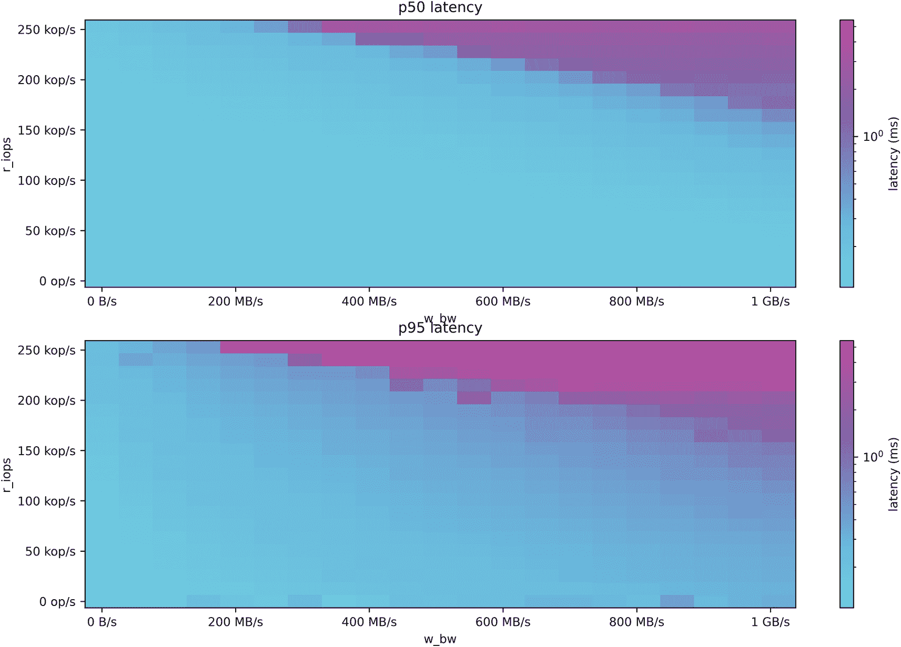

# 7. 基础设施和部署模型

核心硬件考量，以实现大规模速度特定硬件组件的建议云中的考量完全托管数据库即服务无服务器部署模型容器化和 Kubernetes 总结

如前一章所述，许多现代数据库提供了超越“仅仅”存储和检索数据的特性。但所有数据库都是从头开始构建，以尽可能高效地服务 I/O。在选择您的基础设施和首选部署模型时，这一点至关重要要记住。

从理论上讲，数据库的目的相当简单：您提交一个请求，并期望得到响应。但正如您在前几章所看到的，大量的工程努力被投入到不断改进和加速这一过程中。很可能，多年的时间都致力于优化算法，可能只为您带来几个 CPU 周期的处理提升，或者最小化内存碎片化，或者减少查找特定数据集所需的存储 I/O 量。所有这些进步最终都汇聚在一起，创建了一个适合大规模性能的数据库。

无论您选择哪种数据库，您最终可能会遇到一个工程努力无法突破的障碍：数据库的物理硬件。当您投入的硬件可能不是最优时，为性能而设计的解决方案几乎没有意义。同样，性能较差的数据库可能无法有效地利用大量可用的物理资源。

本章探讨了在选择 CPU、内存、存储和网络时，为您的分布式数据库基础设施所必须考虑的关键因素和权衡。它描述了不同资源是如何协作的，以及如何配置数据库以提供最佳性能。特别关注存储 I/O，因为这是最难处理的部分。同时，也详细研究了适合高性能分布式数据库的基于云的最佳部署方案（鉴于这些是大多数企业的部署首选）。

虽然确实，数据库即服务（DBaaS）的部署将通过您的选择过程让您免于许多基础设施和硬件决策，但了解任何数据库所需的通用计算资源的基本理解对于识别可能限制性能的潜在瓶颈至关重要。在介绍涉及每个部署模型的硬件之后——无论您是否考虑过——本章将重点转向不同的部署选项及其对性能的影响。它涵盖了与云托管部署、数据库即服务、无服务器、容器化和容器编排技术（如 Kubernetes）相关的特殊考量。

## 核心硬件考量，以实现大规模速度

当你设计系统以处理大量数据和请求时，主要的硬件考虑因素包括：

+   存储

+   CPU（核心）

+   内存（RAM）

+   网络接口

每个都可能是内部数据库延迟的潜在瓶颈：从请求被数据库（或数据库中的节点）接收，到数据库提供响应之间的延迟。

### 识别性能瓶颈的来源

了解你的数据库的读写路径有助于识别潜在的性能瓶颈并追踪到罪魁祸首。这也有助于理解你的用例可能主要受哪些物理资源的限制。

例如，写入优化的数据库使用这种命名法，因为写入主要进入内存，而不是立即持久化到磁盘。然而，大多数现代数据库需要采用一些“崩溃恢复”机制，以避免意外服务中断导致的数据丢失。因此，即使是写入优化的数据库也会求助于磁盘访问，以便快速持久化你的数据，以防万一。例如，Cassandra 集群的写入将被持久化到一个名为“提交日志”的“预写日志”磁盘结构和一个名为“memtable”的内存结构。只有当这两个操作都成功后，写入才被认为是成功的。

在光谱的另一端，数据库的读取路径通常也会涉及几个物理组件。假设你没有使用内存数据库，那么读取路径将首先检查你正在寻找的数据是否存在于数据库缓存中。但如果不在，数据库需要从磁盘查找和检索数据，反序列化它，然后回答结果。

网络在整个过程中也扮演着至关重要的角色。当你写入时，数据需要迅速复制到其他副本。当你读取时，数据库需要选择包含应用程序所需数据的正确副本（分片），因此可能需要与集群中的其他节点通信。此外，强一致性用例始终要求大多数成员对操作的成功响应——因此副本的延迟响应可以显著增加路由到该副本的请求的尾部延迟。

### 实现平衡

平衡是任何分布式系统，包括数据库在内的关键。在一个拥有最快网络链路但只依赖很少 CPU 的系统里尝试实现每秒一百万次操作（OPS）几乎毫无意义。同样，如果你的用例只需要 10K OPS，购买最昂贵和性能最好的基础设施也并不高效。

此外，重要的是要认识到集群不平衡很容易拖垮整个分布式系统的性能。这是因为分布式系统不能比最慢的组件更快——这是一个经常让人感到惊讶的事实。

这里有一个现实生活中的例子。一位客户报告了整个 18 节点集群的延迟升高。在收集系统信息后，我们注意到他们的大多数节点都正确地使用了本地连接的非易失性内存表达（NVMe）磁盘——除了一个使用了软件冗余独立磁盘阵列（RAID）的节点，该 RAID 包含 NVMes 和网络连接的磁盘混合。客户澄清说，他们快用完存储空间，并决定连接另一个磁盘以解决问题。然而，他们没有意识到这为他们的整个集群引入了一个定时炸弹。以下是从技术角度简要解释发生了什么：

1.  在 RAID 阵列中引入了慢速磁盘后，该特定副本的存储 I/O 操作完成时间更长。

1.  因此，在发送或等待需要磁盘 I/O 响应时，剩余副本需要额外的时间。

1.  随着请求越来越多，所有这些延迟最终在副本上创建了一个等待队列。

1.  随着队列的不断增长，这最终影响了副本的性能，最终影响了整个集群的性能。

1.  从那时起，整个集群的速度受到了其最慢节点速度的阻碍：那个拥有最慢磁盘的节点。

### 设置合理的期望

即使是最强大的硬件也无法保证令人印象深刻的**端到端（或往返**）延迟——从客户端向服务器发送请求到获得响应的整个周期时间。端到端延迟可能会受到数据库无法控制的因素的影响。例如：

+   从客户端应用程序到数据库服务器的多跳路由数据包，增加了数百毫秒的延迟

+   客户端驱动程序设置，连接并向远程数据中心发送请求

+   需要本地和远程数据中心响应的一致性级别

+   客户端和数据库服务器之间较差的网络性能

+   协议开销

+   客户端性能瓶颈

## 对特定硬件组件的建议

本节将更深入地探讨每个主要硬件考虑因素：

+   存储

+   CPU（核心）

+   内存（RAM）

+   网络接口

### 存储

毁灭所有其他性能优化的最快方法之一是将每个读写操作都通过一个不合适的磁盘。尽管最近的技术进步大大提高了存储设备的表现，但磁盘（远远）仍然是计算机系统中最慢的组件。

从性能角度来看，磁盘性能通常在两个维度上进行衡量：

+   顺序读写的可用带宽

+   随机读写的 IOPS

数据库工程师痴迷于优化磁盘访问模式，以这两个维度为依据。选择、管理或使用数据库的人应关注两个额外的磁盘考虑因素：存储技术和磁盘大小。

#### 磁盘类型

当延迟至关重要时，本地连接的 NVMe 固态硬盘（SSD）是标准配置。与其他总线接口相比，连接到外围组件互连扩展（PCIe）接口的 NVMe SSD 通常会比串行 AT 连接（SATA）接口提供更低的延迟。如果你的工作负载对延迟不是特别敏感，你也可以考虑通过 SATA 接口使用磁盘。但是，如果你期望达到毫秒级的低延迟，则绝对避免使用网络连接的磁盘。由于这些磁盘是网络连接的，它们需要额外的跳转才能到达存储服务器，这最终会增加每个数据库请求的延迟。

如果你的重点是吞吐量，而延迟对你使用的场景（例如，将数据移动到数据仓库）并不重要，你*可能*能够使用持久磁盘，但这并不推荐。我们所说的持久磁盘是指你的虚拟机可以像物理磁盘一样访问的耐用网络存储设备，但它们位于你的虚拟机之外。我们不会针对任何特定的供应商进行批评，但一点研究应该会揭示出性能不佳和整体不稳定等问题。如果你被迫使用持久磁盘，请准备好制定一个创造性的解决方案.^(1)

硬盘驱动器（HDD）可能会很快成为瓶颈。由于 SSD 的价格越来越便宜，使用 HDD 并不推荐。某些工作负载可能适合使用 HDD，特别是如果它们表现良好并最小化随机查找。一个适合 HDD 的工作负载示例是写入为主（98% 写入）且随机读取最少的工作负载。如果你决定使用 HDD，尽量为提交日志分配一个单独的磁盘。

ScyllaDB 发布了几个不同存储设备的基准测试结果——展示了它们在模拟典型数据库访问模式下的极端负载下的性能表现.^(2) 例如，图 7-1 至 7-4 展示了两种 NVMes（持久磁盘和 HDD）的不同性能特征。

从 0 到 175 MB/秒的 p 50 和 p 95 延迟的两种图表。图表显示了一个下降趋势。图表右侧给出了两个阴影条带。

图 7-4

东芝 DT01ACA200 硬盘驱动器的带宽/延迟图表^(4)

从 0 到 600 MB/秒的 p 50 和 p 95 延迟的两种图表。图表显示了一个下降趋势。图表右侧给出了两个阴影条带。

图 7-3

Google Cloud n2-standard-8 实例类型配备 2TB SSD 持久磁盘的带宽/延迟图表^(3)

从 0 到 1 GB/秒的 p 50 和 p 95 延迟的两种图表。图表显示了一个下降趋势。图表右侧给出了两个阴影条带。

图 7-2

使用 AWS Nitro SSDs 的 AWS Im4gn.4xlarge 实例类型的带宽/延迟图表

两个从 0 到 800 MB 每秒的 p 50 和 p 95 延迟的图表。图表显示了一个下降趋势。图表右侧给出了两个阴影条带。

图 7-1

使用 AWS i3.2xlarge 实例类型的 NVMe 带宽/延迟图表

#### 磁盘配置

我们听到了很多关于 RAID 配置的问题。硬件 RAID 通常用于避免由磁盘故障引入的中断。因此，RAID-5（分布式校验和）配置经常被使用。

然而，分布式数据库通常具有自己的内部复制机制，以允许业务连续性和实现高可用性。因此，采用数据镜像或分布式校验和的 RAID 配置已被证明对磁盘 I/O 性能非常有害，并且相当频繁地被冗余使用。除此之外，我们发现一些硬件 RAID 供应商提供的性能结果取决于您的数据库访问机制。一个值得注意的例子：无法通过异步 I/O 或直接 I/O 调用有效执行的硬件 RAID。如果您认为您的磁盘 I/O 性能不佳，请考虑直接将您的硬件 RAID 中的磁盘暴露给操作系统。

相反，RAID-0（条带化）配置通常可以提高磁盘 I/O 性能，并允许数据库实现比单个磁盘更高的 IOPS 和带宽。创建 RAID-0 配置的一般建议是使用相同类型和容量的所有磁盘，以避免在日常工作负载期间出现性能变化。虽然确实，在磁盘故障的情况下，您会丢失整个 RAID 阵列，但您的分布式数据库执行的复制应该足以确保您的数据保持可用。

与磁盘配置相关的几个额外考虑因素：

+   **存储服务器通常同时为多个其他用户和工作负载提供服务。** 因此，即使磁盘是专门为数据库分配的，但您的访问性能可能会受到诸如存储系统同时为其他用户服务的程度等因素的影响。大多数情况下，提供给您的存储介质可能不适合支持低延迟数据库工作负载。这通常可以通过确保从高性能磁盘池中分配磁盘来缓解。

+   **将您的数据库基础设施磁盘直接从您的虚拟机管理程序暴露给操作系统是非常重要的。** 我们已经看到许多情况，其中数据库的 I/O 容量在磁盘虚拟化时受到了严重影响。为了消除低延迟环境中可能存在的任何瓶颈，请确保您的数据库直接访问您的磁盘，以便它们可以按照设计的方式执行 I/O。

#### 磁盘大小

当考虑你需要多少存储时，务必考虑你现有的数据——复制后的数据——以及你预期的近期数据增长，还要为内部操作（如 LSM-tree 数据库的压缩、提交日志、备份等）的冗余留出足够的空间。

如第八章所述，最常见的拓扑结构是每个数据集有三个副本。假设你有 5TB 的原始数据，并使用三个副本的复制因子：

+   5TB 数据 X 3 RF = 15TB

但 15TB 只是一个起点，因为还有其他尺寸标准：

+   你的数据集的增长率是多少？（每小时或每天摄取多少？）

+   你会永远存储所有数据吗，还是会有一个驱逐过程（例如，基于生存时间[TTL]）？

+   你的增长速度是稳定的（每周/天/每小时固定的摄取速率）还是随机的和突发的？前者会使它更具可预测性；后者可能意味着你必须给自己更多的灵活性来应对不可预测但概率性的事件。

你可以根据用户数量或端点数量以及该数量随时间预期的增长来模拟你数据增长的速度。或者，数据模型通常会随着时间的推移而丰富，导致每个源的数据量增加。或者，你的采样率可能会增加。例如，你的系统可能开始每五秒而不是每分钟摄取数据。所有这些考虑都会影响你的数据存储量。

强烈建议你选择适合你在一定时间跨度后预期到达位置的存储。如果你在公共云提供商（自托管或作为完全托管的数据库即服务[DBaaS]）上运行数据库，你不需要太多的提前时间来配置新硬件和扩展你的集群。然而，对于本地硬件购买，你可能需要根据你的季度或年度预算流程进行配置。你也可能面临由于供应链中断而导致的延迟，这种中断变得越来越常见。

此外，务必为内部临时操作留出存储空间，例如压缩、修复、备份和提交日志，以及任何可能暂时引入空间膨胀的其他后台进程。另一方面，如果你使用压缩，务必考虑所选压缩算法可以为你节省的空间量。

最后，认识到每个数据库都有一个理想的内存与存储比率——例如，每个节点可以支持一定量的 TB 或 GB，以实现最佳性能。如果这在你的数据库文档中不明显，请向你的供应商索取他们的建议。

#### 原始设备和自定义驱动程序

一些数据库供应商需要直接访问存储设备——无需存在文件系统。这种直接访问通常被称为创建“原始”设备，这指的是操作系统不知道如何管理它，任何 I/O 都由数据库直接处理。直接向底层存储设备发出 I/O 可能会为数据库提供性能提升。然而，了解这种方法的缺点很重要，这些缺点可能对您的特定部署并不重要。

1.  **易出错**：直接向磁盘发出 I/O 而不是通过文件系统是易出错的。虽然这会提供性能提升，但不当处理底层存储可能导致数据损坏、数据丢失或意外的错误。

1.  **复杂**：原始设备不像人们预期的那样常见。实际上，很少有数据库决定实施这种方法。重要的是要注意，由于原始设备通常不会作为常规文件系统挂载，其可管理性将完全取决于您的供应商提供的内容。

1.  **锁定**：一旦您开始使用原始设备，就非常难以摆脱它。您无法通过典型的操作系统机制挂载原始设备或查询其存储消耗。所有磁盘都需要以某种方式排列，而且您无法轻易回到常规文件系统。

#### 维护磁盘性能随时间的变化

数据库非常依赖存储 I/O，因此磁盘*会*随着时间的推移而磨损。大多数磁盘供应商都会提供关于其产品性能耐久性的估计。请检查这些信息并进行比较。

有多种工具和程序可以帮助随着时间的推移提高 SSD 性能。一个例子是`fstrim`程序，它通常每周运行一次以丢弃未使用的文件系统块。`fstrim`是一个操作系统后台进程，不需要任何数据库操作，并且可能显著提高 I/O。

小贴士

如果您必须选择一个地方进行投资——CPU、存储、内存或网络——我们建议在存储上大举投资。其他所有方面都比存储发展得更快、更好。它仍然是大多数系统中最慢的组件。

#### 分层存储

许多用例对不同的数据集有不同的延迟要求。同样，行业可能会随着时间的推移看到指数级的存储利用率增长。并非总是希望，甚至可能不可能，去除旧数据（例如，由于合规性规定、第三方合同，或者仅仅因为它仍然对业务具有相关性）。

对于存储密集型用例的团队，通常会寻求降低存储消耗成本的方法：通过减少数据集的复制因子、使用性能较低（尽管更便宜）的存储磁盘，或者通过从较快的磁盘到较慢的磁盘的手动数据轮换过程。

分层存储是一些数据库为解决这些问题而实施的解决方案。它允许用户配置数据库以使用不同的存储层，并定义数据库应使用哪些标准来确保数据正确复制到相关层。例如，MongoDB 允许您通过为分片分配不同的层标签来确定数据如何复制到特定的存储层，允许其平衡器自动在层之间迁移数据。此外，Atlas 在线归档还允许数据库将历史数据集卸载到云存储。

### CPU（核心）

接下来是 CPU。截至本文撰写时，您可能正在查看运行一些合理现代的 Intel、AMD 或 ARM 芯片的现代服务器，这些芯片在大多数云提供商和企业硬件供应商中都很常见。与存储一样，CPU 是另一种计算资源，如果配置不当，可能会对工作负载引入竞争，并影响延迟。每秒处理数十万到数百万操作的集群往往会有很高的 CPU 负载。

更多的核心通常意味着更好的性能。这对于从多线程架构中受益的数据库实现最佳性能非常重要，对于采用每个核心一个分片架构的数据库来说，这一点至关重要——在每个服务器上每个核心运行一个单独的分片。在这种情况下，CPU 的核心越多，分片就越多——数据分布就越好，数据库将具有更好的性能。

结合供应商推荐和基准测试（见第九章）可以帮助您确定每个多核芯片可以支持多少吞吐量。一般建议是避免在生产系统中运行接近 CPU 极限的系统，并找到在支持预期性能和留出吞吐量增长空间之间的最佳平衡点。此外，在进行基准测试时，请记住也要考虑可能对性能产生不利影响的背景数据库操作。例如，Cassandra 及其兼容数据库通常需要运行修复：一个每周进行的流程，以确保集群中数据的一致性。这个过程需要在整个集群中进行大量的协调和通信。如果您的负载没有适当调整以适应背景数据库操作和其他事件（如节点故障），您的延迟可能会增加到让您惊讶的程度。

当使用虚拟机、容器或公共云时，请记住，每个虚拟 CPU 都映射到一个单个逻辑核心或线程。在许多云部署中，节点是按 vCPU 提供的。对于 Intel/AMD 变体，vCPU 通常是来自双超线程 x86 物理核心的单个超线程，对于 ARM 芯片，通常是单个核心。

无论你选择的部署方式如何，如果性能是首要考虑，请避免过度承诺 CPU 资源。这样做将防止其他虚拟机从你的数据库中窃取 CPU 时间^(5)。

### 内存（RAM）

如果你正在使用内存数据库，有足够的内存来存储你的整个数据集是绝对必要的。但每个数据库都在某种程度上使用内存缓存。例如，一些数据库需要足够的内存空间来存储索引，以避免昂贵的往返存储磁盘。其他数据库利用内部数据缓存，以便在检索最近使用的数据时降低延迟，Cassandra 和类似 Cassandra 的数据库实现内存表，一些数据库允许你控制哪些表完全从内存中提供服务。数据库可用的内存越多，你就能更好地利用这些机制。毕竟，即使是最快的 NVMe 也无法接近 RAM 访问的速度。

通常，没有针对数据库“多少内存足够”的普遍建议。不同的供应商有不同的要求，不同的用例也需要不同的内存大小。然而，对延迟敏感的用例通常需要较大的内存占用，以便实现高缓存命中率并有效地处理低延迟的读取请求。

例如，具有更高有效载荷大小的用例需要比具有较小有效载荷大小的用例更大的内存占用。另一个值得考虑的有趣方面是，针对特定用例，读取可能存在于内存中的数据（热数据）的频率与从未读取过的数据（冷数据）的频率相比。如第二章所述，后者可能会轻易地削弱你的延迟。

如果你想保持低延迟，没有足够的磁盘到内存比率，你将比预期更频繁地访问你的存储。理想的比例因数据库而异，因为每个缓存实现都是不同的，所以务必向供应商咨询他们的具体建议。例如，ScyllaDB 目前建议，对于每个分配给节点的 1GB 内存，你可以存储高达 100GB 的数据（因此如果你有 32GB 的内存，你可以处理大约 3TB）。你的内存到存储比率越高，你用于缓存整个数据集的空间就越少。每个数据库都有某种硬性物理限制。如果你没有足够的内存，并且必须在非常大的数据集上运行工作负载，那么它要么会相当慢，要么会增加数据库耗尽内存的风险。

另一个需要记住的比率：每 CPU 核心的内存。在 ScyllaDB，我们建议每 CPU 核心至少 8GB 的内存用于生产目的（因为，鉴于我们的无共享架构，每个分片都是独立工作的，并且为其缓存分配了内存）。每 vCPU 的 8GB 内存是大多数云提供商用于 NoSQL 或大数据实例类型的相同比率。再次强调，推荐的比率会因供应商而异，具体取决于数据库特定的内部缓存实现和其他实现细节。例如，在 Cassandra 和类似 Cassandra 的数据库中，部分内存将分配给其某些 SSTable 组件，以便在读取冷数据时加快磁盘查找速度。Aerospike 通常将所有索引存储在 RAM 中。而 MongoDB 平均每 100K 资产需要 1GB 的 RAM。

分布式数据库通常消耗很高的内存。无论其实现方式如何，数据库都需要在内存中存储数据集的相关部分，以避免在磁盘 I/O 上浪费时间。内存不足可能会表现为不可预测、不稳定的数据库行为——甚至崩溃。

### 网络

最后，您必须确保网络 I/O 不会成为瓶颈。网络往往是被忽视的组件。与任何分布式系统一样，数据库涉及集群成员之间的大量流量，以检查活动状态、复制状态和拓扑更改等。因此，网络延迟不仅会降低您的应用程序的延迟，还会阻止节点间通信有效进行。

在 ScyllaDB，我们建议最低网络带宽为 10Gbps，因为内部数据库操作，如流式传输、修复和八卦，可能会变得非常依赖网络。除此之外，您还需要考虑实际用例所需的吞吐量；每秒的操作数将是您部署中带宽消耗最高的因素。

与内存一样，所需的网络带宽也会有所不同。请务必检查供应商的建议，并考虑您用例的性质。低吞吐量工作负载显然比高吞吐量工作负载消耗的流量要少。

小贴士：使用 CPU 固定来减轻硬件中断的影响。

硬件中断通常源于（但不限于）高网络互联网流量，迫使操作系统内核停止一切操作，并在返回手头工作之前先响应硬件。中断过多（例如，高软中断百分比）会降低数据库性能，因为你的 CPU 在处理网络流量服务时可能会停滞。解决这一问题的方法之一是使用 CPU 固定。这告诉系统，所有网络中断都应该由数据库未使用的特定 CPU 来处理。有了这样的设置，你可以在网络流量中猛烈打击数据库，并且可以合理地确信在正常操作中不会使其过载或使数据库处理停滞。

对于云部署，大多数 IaaS 供应商提供现代网络基础设施，在数据库服务器之间以及数据库和应用程序客户端之间提供充足的带宽。如果你怀疑存在网络问题，请务必检查客户的网络带宽消耗。我们在部署中常见的一个错误是，应用程序客户端部署了次优的网络容量。

此外，务必将你的应用程序服务器放置在尽可能靠近数据库的位置。如果你在一个区域内部署它们，服务器之间的较短物理距离将转化为更好的网络性能（因为它将需要更少的网络跳数进行通信），从而降低延迟。如果你需要跨区域部署并且需要在这些区域之间实现强一致性或复制，那么你需要为穿越区域支付延迟惩罚——此外，你还要实际支付跨区域网络传输费用。对于具有跨区域复制的多区域部署，慢速网络链路可能会造成复制延迟，导致数据库在成功复制堆积的数据之前对你的写入操作施加回压。

## 云部署的考虑因素

“本地部署与云部署”的决定在很大程度上取决于你组织的安全和监管要求以及其商业策略——这远远超出了本书的范围。我们不再深入那个方向，而是专注于探索云部署特有的性能考虑因素。

大多数云服务提供商提供了一系列的实例类型，您可以选择用于托管您的负载。根据我们的经验，在云部署中的分布式数据库中看到的许多错误和性能瓶颈是由于在初始集群设置期间选择了错误的实例或存储类型。许多人普遍存在的一个误解（以及担忧）是，基于 NVMe 的存储可能比网络附加存储更昂贵。这种误解可能源于以下假设：由于 NVMes 速度更快，它们会带来更高的成本。然而，实际情况恰恰相反：由于云环境中的 NVMe 磁盘与实例的生命周期相关联，它们最终比需要长时间保留数据集的网络磁盘更便宜。我们鼓励您比较您选择的云服务提供商提供的 NVMe 备份存储与网络附加磁盘的成本。

一些云服务提供商为不同的分布式数据库工作负载提供不同的实例类型。例如，某些工作负载可能从计算密集型实例类型中受益更多，具有比存储容量更多的计算能力。相反，存储密集型实例类型通常具有更高的存储与内存比率，并且通常用于存储密集型工作负载。

更糟糕的是，一些云服务提供商可能为同一实例类型提供不同的 CPU 代系。如果一个 CPU 代系比其他节点慢得多，错误的选择可能会将性能瓶颈引入您的集群。

我们看到一些（尽管很少见）场景，其中噪声邻居在没有合理解释的情况下拖累了整个节点的性能。在云实例中缺乏可见性和控制使得诊断此类情况更加困难。通常，您需要直接联系您的云服务提供商以解决这种情况。

当您开始配置实例时，请记住，云环境并非仅用于数据库。您有权访问广泛的选择，但确定从哪里开始以及使用哪些选项可能会令人困惑。一般来说，最好咨询您的数据库供应商，了解哪些实例类型适合部署。更好的是，超越这一点，比较他们基准测试的结果与运行您工作负载的相同实例类型的结果。

在您确定了实例类型和部署选项之后，是时候考虑实例放置了。大多数云服务都会对跨区域流量和跨区域流量收费，这可能会出人意料地增加整体网络成本。一些公司试图通过将所有实例放置在单个可用区（AZ）下以减轻这种成本，这也带来了如果该 AZ 出现故障时可能需要面对集群级中断的风险。其他人则选择忽略成本因素，并将副本部署在不同的 AZ 中，以确保数据被正确地复制到隔离环境中。无论您选择的实例放置方式如何，请注意，一些数据库驱动程序允许特定 AZ 中的客户端仅针对同一可用区内的数据库副本进行查询路由，以降低成本。同样，您还希望确保您的应用程序客户端位于与数据库相同的区域，以最大限度地降低您的网络成本。

## 完全托管数据库即服务

数据库即服务（DBaaS）模型是否有助于提升还是损害数据库性能？这实际上取决于以下因素：

+   您的数据库需要多少关注才能实现并持续满足您的性能预期

+   您的团队使用特定数据库的经验

+   您的团队对数据库进行修改的时间和愿望

+   您的 DBaaS 提供商为您的账户投入的专业水平——特别是与性能相关的水平

管理数据库即服务（DBaaS）解决方案可以轻松加快您的上市速度，并让您能够专注于数据库以外的优先事项。现在，大多数数据库供应商都提供某种形式的托管解决方案。甚至还有一些独立公司专门提供各种不同分布式数据库的此类服务。

我们已经看到许多例子，其中托管解决方案帮助用户取得成功，以及许多关于一些托管解决方案相当有限的投诉。我们无意推荐或批评任何特定的服务提供商。以下是一些在选择托管解决方案之前需要考虑的、与供应商无关的建议：

+   供应商是否满足您现有的安全要求？它是否提供了由知名安全公司颁发的足够的安全认证证据？

+   可观察性的选项有哪些？您如何将相关数据导出到您选择的监控平台？

+   您在部署方面有多大的灵活性？可用的可调选项有哪些？在您的托管解决方案中，对这些选项的支持如何？

+   它是否允许您以私密和安全的方式将现有应用程序网络（s）中的流量与数据库进行对等？

+   可用的支持选项和 SLA 是什么？

+   可用的部署选项有哪些，切换之间的灵活性如何，如果您自行部署和维护，成本比较如何？

+   如果你需要将部署迁移到不同的供应商，你如何轻松地导出你的数据？

+   有哪些迁移选项可用，它们需要多少工作量？

这些只是我们经常听到团队询问（或希望在他们陷入不理想的选择之前询问）的许多问题和担忧之一。考虑第三方供应商来管理你基础设施的相对关键部分是非常具有挑战性的。然而，在适当的条件下和供应商与用户的匹配下，这可以是一个减少你的管理负担和优化你性能的绝佳选择。

## 无服务器部署模型

*无服务器*指的是提供几乎即时扩展或缩减数据库基础设施的数据库解决方案——并按你实际消耗的容量和存储收费。

理论上，无服务器模型可能带来性能优势。在无服务器之前，许多组织面临一个权衡：

+   （根据你的风险承受能力，稍微或慷慨地）高估他们需要保证充足性能的容量。

+   如果他们过于保守的容量估计证明不足，观察性能受到影响。

无服务器可以在多种不同的情况下提供帮助。

首先，随着可变的工作负载。由于数据库可以随着工作负载的增加而快速扩展，你可以减少因容量不足而导致的性能问题的担忧。如果你的流量在一天/一周/一个月中波动，你可以在淡季少花钱，并将这些资源用于支持高峰期。如果你的公司突然遭遇“灾难性的成功”，你不必担心与突然需要扩展基础设施相关的头痛问题。如果一切顺利，供应商将“自动”确保你得到保障，并且性能可接受。你不需要采购任何额外的服务器，甚至不需要联系你的云服务提供商。

如果你正在从事一个新项目，并且不确定需要多少容量来满足性能预期，无服务器也是一个值得考虑的选项。它让你能够快速启动并根据实际使用情况进行扩展（或缩减）。数据库大小不再是你需要担心的事情。而且你不需要预测未来。

最后，无服务器还使得在内部证明支出更加简单。在这个模型下，你可以向你的组织保证你永远不会过度配置——至少不会长时间过度配置。你支付的是数据库供应商确定你需要的所有时刻的性能费用。

然而，无服务器部署也伴随着成本超支和不可预测成本的不确定性风险。例如，DynamoDB 的价格可能对写密集型工作负载来说并不吸引人。同样，无服务器数据库服务可能会根据您计划在较长时间内每秒持续进行的操作数量收取高昂的费用。在某些情况下，如果您的目标是实现大规模的高吞吐量高性能系统，从成本角度来看，它可能成为一把双刃剑。

在考虑无服务器解决方案时，另一个需要考虑的方面是所讨论的解决方案是否与您现有的基础设施组件兼容。例如，您可能需要探索将您的消息队列或分析工具与特定的无服务器解决方案连接所需的努力程度。

记住，无服务器背后的整体概念是抽象出底层基础设施，这样您就不一定能够访问所有数据库可配置的选项。因此，解决潜在的性能问题通常更具挑战性，因为您可能需要依赖供应商的输入和指导来了解应采取哪些行动。无服务器还意味着您无法了解您所消耗的基础设施是否与其他租户共享。许多分布式数据库供应商也可能为共享和专用环境提供不同的定价层。

## 容器化和 Kubernetes

容器和 Kubernetes 现在无处不在，甚至对于像数据库这样的有状态系统也是如此。您应该使用它们吗？可能吧——除非您有充分的理由不使用。

但请注意，使用容器的操作便利性会带来性能上的惩罚。这是可以预料的，因为额外的抽象层（容器本身）、资源隔离的放宽和上下文切换的增加。好消息是，这肯定是可以克服的。在我们的 ScyllaDB 测试中，我们发现可以将原本的峰值吞吐量降低 69%的情况降低到 3%的性能惩罚。6

这里是关于那个特定实验的 TL;DR：

+   *容器化应用程序并非免费。特别是，组成容器的进程必须在 Linux cgroups 中运行，并且容器接收一个网络虚拟化视图。然而，在 Docker 容器内运行接近硬件、核心级别的线程应用，如 ScyllaDB 的最大成本来自于必须禁用数据库在虚拟机和裸机环境中使用的多数性能优化，以使其能够在可能共享和过度承诺的平台中运行的机会成本。*

+   *使用 Docker 时，当资源静态分区并且我们可以恢复裸金属优化（如 CPU 固定和中断隔离）时，可以获得最佳结果。在这种情况下，与底层平台相比，性能惩罚仅为 10%，这主要归因于网络虚拟化。Docker 允许用户直接暴露主机网络进行专用部署。在这种情况下，与底层平台相比，性能差异降至 3%。*

当然，潜在的惩罚和缓解策略会因数据库而异。但关键点是可能存在显著的性能惩罚——所以一定要找到它并研究如何缓解。一些常见的缓解策略包括：

+   确保你的容器可以直接访问数据库的底层存储。

+   将主机 OS 网络暴露给容器，以避免由于网络虚拟化层而导致的性能惩罚。

+   为相关的容器分配足够的资源，并确保这些资源不会被底层主机 OS 中的其他容器或进程过度占用。

Kubernetes 又增加了一层虚拟化层——因此打开了另一个性能问题层的大门，以及缓解这些问题的不同策略。首先，如果你有多个选项来在 Kubernetes 上部署和管理数据库集群，请从性能的角度测试它们。一旦确定了最适合你需求的方案，就深入研究可能影响性能的配置选项。以下是一些跨数据库的性能提示：

+   考虑为你的数据库工作负载分配特定的独立 Kubernetes 节点，并使用亲和性来配置它们的放置。

+   启用`hostNetworking`，并确保按照供应商的建议设置所需的内核参数（例如，`fs.aio-max-nr`用于在 Linux 内核中增加异步 I/O 处理可用事件的数目）。

+   确保你的数据库 Pod 具有保证 QoS 类^(7)，以避免其他 Pod 可能对你的主要工作负载造成伤害。

+   一定要使用操作符^(8)来编排和控制现有 Kubernetes 数据库集群的生命周期。例如，ScyllaDB 有它的 ScyllaDB Operator 项目。

## 摘要

本章节开启了本书的最后一部分，专注于分享提高数据库部署性能的建议。它探讨了在您管理自己的部署或选择数据库即服务（可能为无服务器）部署模型时，重要的基础设施和部署模型考虑因素。下一章节将探讨与拓扑本身相关的性能考虑因素：复制、地理分布、扩展和/或缩减，以及外部缓存、负载均衡器和抽象层等中介。

**开放获取** 本章节根据 Creative Commons 署名 4.0 国际许可协议（[`creativecommons.org/licenses/by/4.0/`](http://creativecommons.org/licenses/by/4.0/)）授权，允许在任何媒介或格式下使用、分享、改编、分发和复制，只要您适当引用原始作者和来源，提供 Creative Commons 许可链接，并指明是否进行了修改。

本章中的图像或其他第三方材料包含在本章节的 Creative Commons 许可协议中，除非在材料引用行中另有说明。如果材料未包含在本章节的 Creative Commons 许可协议中，且您的使用意图不受法定法规允许或超出允许的使用范围，您需要直接从版权持有人处获得许可。
