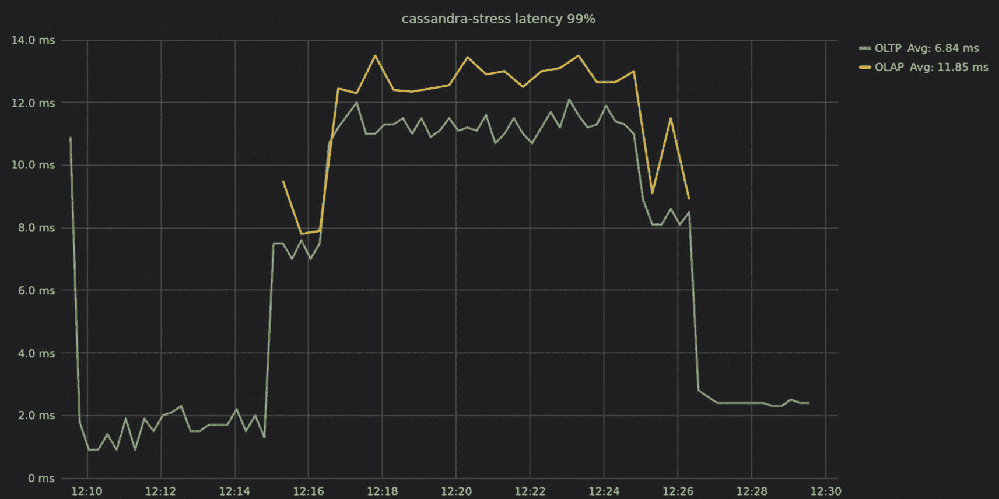
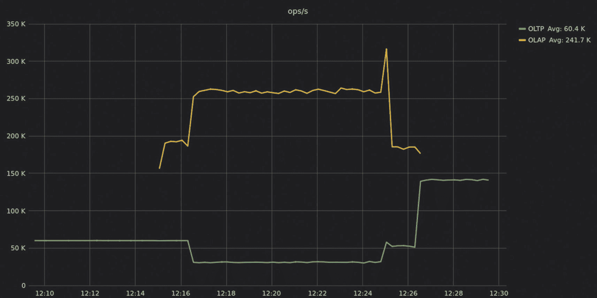
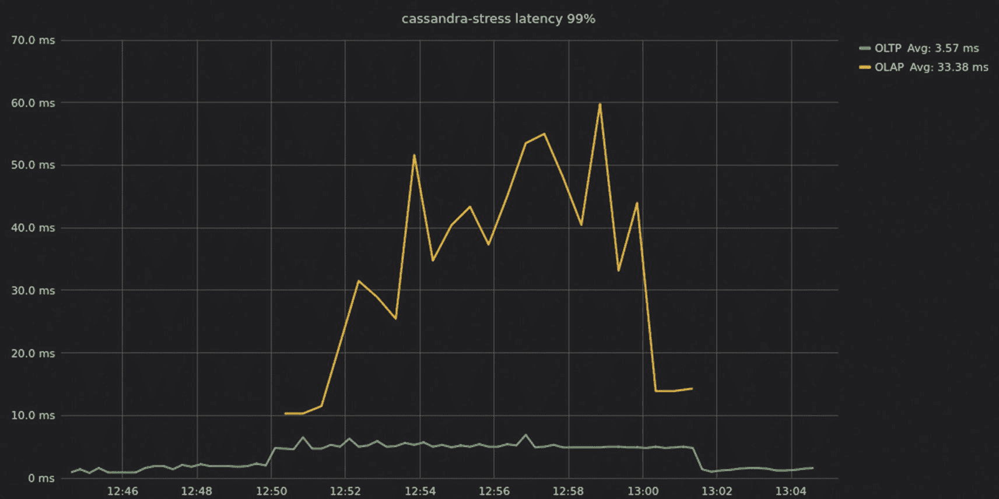
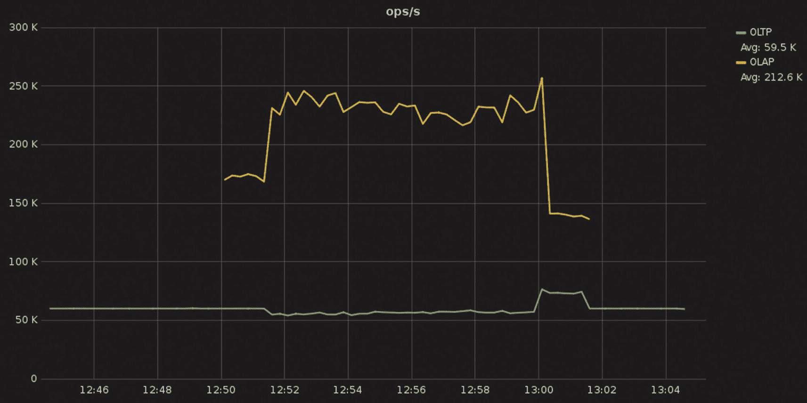

# 8. 拓扑考虑

复制策略向上扩展与向外扩展工作负载隔离抽象层负载均衡外部缓存总结

如第五章所述，数据库服务器通常被组合成复杂的拓扑结构，其中某些节点被分组在单个地理位置；其他节点仅用作快速缓存层，而其他节点则将很少访问的冷数据存储在便宜的地方，仅用于应急目的。该章节介绍了驱动程序如何工作以理解和交互该拓扑，从而更有效地交换信息。

本章重点在于拓扑本身。数据是如何跨地理和数据中心复制的？采用常见的 NoSQL 扩展到极限的实践的风险和替代方案是什么？以及数据库服务器的中介——例如，外部缓存、负载均衡器和抽象层？所有这些以及更多内容的影响都在这里涵盖。^(1)

## 复制策略

首先，让我们看看*复制*，这是你的数据如何在集群中的其他副本之间分布的方式。

注意

如果你想快速了解复制的概念，请参阅附录 A。

有更多的副本将减慢你的写入速度（因为每次写入都必须复制到副本），但它可以加速你的读取（因为更多的副本将可用于服务相同的数据集）。它还将允许你在节点故障的情况下维护操作并避免数据丢失。此外，将数据复制到更接近你的应用程序和用户的位置将减少延迟，特别是如果你的应用程序有一个高度地理分布的用户基础。

复制因子（RF）为 1 表示集群中只有一行的一个副本，如果节点被破坏或关闭（除了从备份中恢复之外），则无法恢复数据。复制因子为 2 表示集群中有一行的两个副本。大多数系统中使用的复制因子至少为 3。这允许你以强一致性写入和读取，因为即使有一个节点关闭，也会达到副本的法定人数。

许多数据库还允许你在区域级别微调复制设置。例如，你可以在使用率高的区域中有三个副本，但在不太受欢迎的区域中只有两个。

注意，跨多个区域复制数据（如 Bigtable 建议的，作为防止可用区故障和区域故障的安全措施）可能很昂贵。在设置此之前，了解跨区域复制数据的成本。

如果你正在使用 DynamoDB，你将创建表（而不是集群），一旦将表设置为全局，AWS 就会为你管理复制。DynamoDB 全局表的一个显著缺点是，事务不支持跨区域，这可能会成为某些用例的限制因素。

### 机架配置

如果您的所有节点都在同一个数据中心，您如何配置它们的放置？这里的经验法则是拥有尽可能多的机架，您就有尽可能多的副本。例如，如果您有 3 个副本的复制因子，就在 3 个机架上运行。这样，即使整个机架都出现故障，您仍然可以继续满足对大多数副本的读取和写入请求。由于您失去了大约 33%的基础设施（考虑到总的区域/机架故障），性能可能会略有下降，但总体上您仍然可以正常运行。相反，如果您有三个副本分布在两个机架上，那么失去一个机架可能会影响您数据的一部分的三个自然端点中的两个。如果您的用例需要强一致性读取/写入，这将是一个致命的问题。

### 多区域或全局复制

通过将您的数据库服务器放置在您的用户附近，您可以降低网络延迟。您还可以提高可用性，并使您的业务免受区域故障的影响。

如果你确实有多个数据中心，确保除非业务另有要求，否则读取和写入使用仅限于特定数据中心副本的一致性级别。这种方法通过指示数据库仅选择本地副本（在同一区域内）来实现所需的一致性级别，从而避免了引入延迟。同时，确保每个应用程序客户端都知道其本地数据中心是什么；它应该优先考虑该本地数据中心进行连接和请求，尽管它也可能有一个回退策略以防该数据中心出现故障。

注意，应用程序客户端可能知道也可能不知道多数据中心部署，是否决定在区域间回退由应用程序开发者决定。尽管通过各种数据库驱动程序存在不同的设置和负载均衡配置文件，但在本地故障发生时，应用程序回退到不同区域的一般概念可能会经常破坏应用程序语义。因此，对故障的反应必须由应用程序开发者直接处理。

### 多可用区与多区域

为了减轻服务器或机架故障的可能影响，云服务提供商提供（并推荐）多区域部署。把它想象成您手边有一个数据中心，您可以在自己的机架上部署每个服务器实例，使用自己的电源、机架顶部交换机和冷却系统。这种部署对于任何单一系统或区域故障都是坚不可摧的，因为每个机架都是自包含的。可用区仍然位于同一区域内。然而，特定区域的故障不会影响另一个区域中部署的实例。

例如，在谷歌计算引擎上，`us-east1-b`、`us-east1-c` 和 `us-east1-d` 可用区域位于 `us-east1` 区域（美国南卡罗来纳州蒙克斯角）。但每个可用区域都是独立的。在同一区域内，AZ 之间的网络延迟对于本次讨论的目的可以忽略不计。

简而言之，多区域和多区域部署分别有助于业务连续性和灾难恢复，但多区域部署还有额外的优势，即最小化本地区域的应用延迟。但这可能需要付出代价：对于多区域拓扑结构，需要考虑跨区域数据复制的成本。

注意，多区域部署也会对跨区域复制收费。尽管对于数据库来说，完全有可能有单区域部署，但这通常不是一个推荐的方法，因为它实际上会将您的基础设施暴露为单一故障点。这里的抉择相当简单：您是想尽可能降低成本并承担潜在的不可用风险，还是想以网络复制成本为代价，在单个区域内保证高可用性？

## 扩展向上与扩展向外

是拥有更多数量的小型（即“不太强大”）节点更好，还是拥有较少数量的大型节点更好？我们建议目标是尽可能强大的节点和最小的集群，以满足您的高可用性和弹性目标——但前提是您的数据库确实能够充分利用大型节点增加的功率。

让我们稍微分析一下。十多年来，NoSQL 的承诺一直是利用相对低成本的通用硬件实现大规模横向扩展。这使组织能够部署原本成本过高且无法使用传统关系型数据库系统进行扩展的架构。

在那十年间，“通用硬件”也经历了转型。但并非所有数据库都能充分利用现代计算资源。许多数据库没有设计成利用大型节点提供的资源，例如额外的 CPU、内存和固态硬盘（SSD），也不能在磁盘上有效地存储大量数据。像 Java 这样的托管运行时，其堆大小受到进一步限制。多线程代码，由于其锁定和上下文切换的开销以及对非均匀内存架构（NUMA）的忽视，对现代硬件架构造成了显著的性能损失。

如果您的数据库属于这一组，您可能会发现快速扩展会很快让您达到收益递减的点。但即便如此，在转向横向扩展之前，最好先充分利用您的垂直扩展潜力。

专注于水平扩展会导致系统蔓延，这等同于运营开销，需要更大的足迹来管理和保护。服务器蔓延还会因为集群中每个节点不断进行的复制和健康检查而给分布式系统引入更多的网络开销。尽管大多数供应商声称扩展将带来线性性能，但有些人更为保守，声称它将带来“接近线性性能”。例如，Cassandra 生产指南^(2) 不建议使用默认的每个实例 16 个 vNode 的数量来构建超过 50 个节点的集群，因为这可能会导致可用性降低。

此外，使用大型、强大的节点有很多优势。

+   **更少的嘈杂邻居**：在云平台上，多租户是常态。云平台按定义是基于共享的网络带宽、I/O、内存、存储等。因此，许多小型节点的部署容易受到“嘈杂邻居”效应的影响。这种效应发生在某个应用程序或虚拟机消耗了比其应得份额更多的可用资源时。随着节点尺寸的增加，租户之间共享的资源越来越少。事实上，超过一定尺寸后，你的应用程序可能成为你系统部署的物理机器上的唯一租户。

+   **更少的故障**：由于大型和小型节点故障率大致相同，大型节点比小型节点提供更高的平均故障间隔时间（MTBF）。数据层的故障需要操作员干预，恢复大型节点所需的人力与小型节点相同。在一个拥有千个节点的集群中，你可能会每天看到故障——这放大了管理成本。

+   **数据中心密度**：许多拥有本地数据中心的企业正在寻求通过将服务器整合到更少、更大、每台服务器拥有更多计算资源的箱子中来提高密度。小型大型节点的集群通过有效地消耗更密集的资源来帮助这一过程，从而降低能源和运营成本。

+   **操作简单性**：大型小型实例的集群需要更多的关注，并产生更多的警报，而小型大型实例的集群则不然。所有这些小型节点都会增加实时监控和定期维护（如滚动升级）的工作量。

一些架构师担心将更多数据放在更少的节点上会增加故障和数据丢失的风险。你可以将其视为“大篮子”问题。似乎直观地认为将所有数据存储在几个大型节点上会使它们更容易出现故障，就像把所有的鸡蛋放在一个篮子里一样。但这并不一定成立。现代数据库使用多种技术来确保可用性，同时加速从故障中恢复，使大型节点既更安全也更经济。例如，考虑那些减少添加和替换节点所需时间的功能以及内部负载均衡机制，以最小化数据库重启期间的吞吐量或延迟影响.^(3)

## 工作负载隔离

许多团队发现自己需要针对数据库运行多个不同的工作负载。将不同的工作负载聚合在单个集群下进行操作往往很有吸引力，尤其是当它们需要处理完全相同的数据集时。在单个集群下保持多个工作负载在一起也可以降低成本。但是，在实现具有延迟关键性的工作负载时，避免资源争用至关重要。未能做到这一点可能会导致难以诊断的性能问题，其中一个表现不佳的工作负载最终会拖垮整个集群的性能。

实现工作负载隔离以最小化在单个集群上运行多个工作负载时可能发生的资源争用有许多方法。以下是一些效果良好的方法。请记住，最佳方法取决于你现有数据库的可选方案以及你的用例需求：

+   **物理隔离**：这种设置通常用于完全隔离一个工作负载与另一个工作负载。这本质上是在你的部署中扩展到另一个区域（这可能在物理上与你的现有区域相同，但在数据库方面在逻辑上是不同的）。因此，工作负载被分割以将数据复制到另一个位置，但查询仅在该特定位置执行——这样，一个工作负载的性能瓶颈不会降低或阻塞另一个工作负载。请注意，这种解决方案的缺点是您的基础设施成本加倍。

+   **逻辑隔离**：一些数据库或部署选项允许你在不增加基础设施资源的情况下逻辑上隔离工作负载。例如，ScyllaDB 有一个工作负载优先级功能，你可以为特定的工作负载分配不同的权重，以帮助数据库理解在系统争用的情况下它应该优先处理哪个工作负载。如果你的数据库没有提供此类功能，你可能仍然能够在并行运行两个或更多工作负载，但要注意数据库中可能出现的潜在争用。

+   **计划隔离**：很多时候，您可能只需要简单地以指定的时间间隔运行批量计划作业，以支持其他与业务相关的活动，例如提取分析报告。在这种情况下，考虑在低峰时段（如果有的话）运行相关的工作负载，并尝试不同的并发设置，以避免影响与其一起运行的主要工作负载的延迟。

### 更多关于逻辑隔离的工作负载优先级

ScyllaDB 用户有时会使用工作负载优先级来平衡 OLAP 和 OLTP 工作负载。目标是确保每个定义的任务都能公平地获得系统资源，以便没有单个工作负载垄断系统资源，剥夺其他工作负载所需的最低资源以继续运行。

在图 8-1 中，请注意，两种工作负载的延迟几乎趋于收敛。OLTP 处理开始于或低于 2 毫秒的 P99 延迟，直到 OLAP 工作在 12:15 开始。当 OLAP 工作负载启动时，OLTP 的 P99 延迟飙升至 8 毫秒，然后进一步下降，在 12-12 毫秒之间达到平稳，直到 12:26 后 OLAP 工作负载终止。

一个标题为“Cassandra，压力延迟 99%”的图表，其中两个工作负载的延迟几乎趋于收敛。OLTP 处理开始于或低于 2 毫秒的 P99 延迟，直到 OLAP 工作在 12:15 开始。当 OLAP 工作负载启动时，OLTP 的 P99 延迟飙升至 8 毫秒，然后进一步下降，在 11 到 12 毫秒之间达到平稳，直到 12:26 后 OLAP 工作负载终止。

图 8-1

在启用工作负载优先级之前，同一集群中 OLTP 和 OLAP 工作负载之间的延迟

这些延迟大约是 OLTP 单独运行时的六倍。（OLAP 延迟在 12-14 毫秒之间徘徊，但再次强调，OLAP 对延迟不敏感）。

图 8-2 显示，OLTP 的吞吐量从大约 60,000 OPS 下降到一半——30,000 OPS。您可以看到原因。OLAP 对吞吐量有很高的需求，维持大约 260,000 OPS。

一个标题为“Cassandra，压力延迟 99%”的图表，说明 OLTP 的吞吐量从大约 60,000 OPS 下降到一半——30,000 OPS。

图 8-2

在未启用工作负载优先级的情况下，同一集群中 OLTP 和 OLAP 的吞吐量比较结果

最终，OLTP 在延迟和吞吐量方面都受到影响，用户会体验到更慢的响应时间。在许多实际情况下，此类 OLTP 响应可能会违反客户的 SLA。

图 8-3 显示了启用工作负载优先级后的延迟。您可以看到，OLTP 工作负载同样从亚毫秒到 2 毫秒的 P99 延迟开始。一旦添加了 OLAP 工作负载，OLTP 处理性能下降，但 P99 延迟在 4-7 毫秒之间徘徊（大约是未启用工作负载优先级时的 11-12 毫秒 P99 延迟的一半）。

一个名为“OPSS”的图表说明了启用工作负载优先级后的延迟。OLTP 工作负载最初从亚毫秒到 2 毫秒的 P99 延迟开始。当添加 OLAP 工作负载时，OLTP 处理性能下降，但 P99 延迟徘徊在 4 到 7 毫秒之间。

图 8-3

启用工作负载优先级后的 OLTP 和 OLAP 延迟

重要的是要注意，一旦系统竞争开始，OLTP 延迟仍然会受到一定的影响——只是没有在启用工作负载优先级之前那么严重。如果你的实时工作负载需要超常稳定的个位数毫秒或更低的 P99 延迟，那么我们强烈建议你避免引入任何形式的竞争。

OLAP 工作负载，由于不是那么对延迟敏感，其 P99 延迟在 25-65 毫秒之间波动。这些延迟比之前要高得多——这是为了保持 OLTP 延迟较低所付出的代价。

在吞吐量方面，图 8-4 显示，在启用 OLAP 负载之前，OLTP 流量是平稳的 60,000 OPS。

一个名为“Cassandra，压力延迟 99%”的图表，其中 OLTP 流量是平稳的 60,000 OPS，直到 OLAP 负载也被启用。

图 8-4

启用工作负载优先级后的 OLTP 和 OLAP 负载吞吐量

在那个点上，性能确实有所下降，但只是略微，徘徊在 54,000 到 58,000 OPS 之间。这仅仅是吞吐量下降了 3-10%。对于 OLAP 工作负载来说，它徘徊在 215,000-250,000 OPS 之间。这意味着下降了 4-18%，这意味着 OLAP 工作负载将需要更长的时间来完成。两个工作负载都受到了影响，正如预期的那样，在过载的集群中，但都没有达到致命的程度。

## 抽象层

在数据库之上编写抽象层已成为团队中相当普遍的做法。应用程序不是直接调用数据库的 API，而是连接到这个数据库无关的抽象层，然后由它管理连接到数据库的物流。

通常，这种做法背后有几个主要动机：

+   **可移植性**：如果团队想要迁移到另一个数据库，他们不需要修改他们的应用程序和查询。然而，负责抽象层的团队将需要修改该代码，这可能会变得更为复杂。

+   **开发者简单性**：开发者不需要担心与任何特定数据库合作的内部细节。这可以使人们更容易地在团队之间移动。

+   **可扩展性**：抽象层可以更容易地进行容器化。如果 API 过载，通常比启动更多数据库容器的容器更容易在 Kubernetes 中扩展更多容器。

+   **面向客户的 API**：直接将数据库暴露给最终用户通常不是一个好主意。因此，许多公司公开了常见的端点，这些端点最终被转换为实际的数据库查询。因此，抽象层可以减少请求，限制租户之间的并发性，并对其调用进行可审计性和问责。

但是，确实存在性能惩罚的潜在风险，这高度依赖于该层实现的有效性。由一群技艺高超的 Rust 工程师精心实现的抽象层可能比拼凑而成的 Java 或 Python 抽象层具有更微不足道的影响。如果您决定走这条路，请确保该层是在考虑性能的情况下开发的，并且您通过基准测试和持续监控仔细测量其影响。请记住，每个应用程序 <> 数据库通信都将使用这个层，所以一点不效率可能会迅速演变成一个重大的性能问题。

例如，我们曾经看到一位客户报告了来自他们的 Golang 抽象层的延迟增加情况。一旦我们意识到数据库端的延迟在其用例中是合理的，调查就从数据库转向了网络和客户端。简而言之，应用程序延迟峰值被确定为在垃圾回收过程中受到严重影响，显著拖累了客户端性能。问题在扩展客户端数量并确保他们有足够的计算资源以正确运行后得到解决。

另一个例子：当通过 PostgreSQL 到 NoSQL 迁移与客户合作时，我们意识到他们的客户端经常会对数据库打开过多的并发连接。尽管在高数量的套接字打开通常是分布式系统的好主意，但极端高数量的套接字很容易压倒客户端（需要跟踪所有打开的套接字）以及数据库。在我们向客户报告我们的发现后，他们发现他们为提交给集群的每个请求都打开了一个新的数据库会话。在纠正了故障代码后，整体应用程序吞吐量显著提高，因为抽象层当时正在使用路由请求时打开的活动套接字.^(4)

## 负载均衡

你应该在数据库前放置一个专用的负载均衡器吗？在大多数情况下，不需要。数据库通常有自己的方式在集群之间平衡流量，因此在上面添加负载均衡器不会有所帮助——实际上可能会造成伤害。考虑 1)负载均衡器在不成为瓶颈之前可以服务多少请求，以及 2)其均衡策略。此外，认识到它引入了一个单点故障，这会降低你的数据库容错能力。因此，你使整体基础设施拓扑结构过于复杂，因为你现在需要担心负载均衡的高可用性。

当然，总有例外。例如，假设你之前使用的是一个不了解集群布局及其各个节点的数据库 API（例如，DynamoDB，其中客户端配置了一个单一的“端点地址”，所有请求都发送到它）。现在你转向使用分布式无领导数据库，如 ScyllaDB，其中客户端是节点感知的，甚至是令牌感知的（了解拓扑中每个节点的自然端点令牌范围）。如果你只是将应用程序配置为使用单个 ScyllaDB 节点的 IP 地址作为其唯一的 DynamoDB API 端点地址，应用程序将正常工作。毕竟，任何节点都可以通过将请求转发到其他节点来响应任何请求。然而，这个节点将比其他节点更繁忙，因为它将是唯一一个积极服务请求的节点。从应用程序的角度来看，这个节点也将成为单点故障。

在这个特殊的边缘情况下，负载均衡*非常重要*——但是负载均衡器*本身并不重要*。从管理员的角度来看，服务器端负载均衡相当复杂。更重要的是，从性能的角度来看，服务器端解决方案会增加延迟。涉及 TCP 或 HTTP 负载均衡器的解决方案需要为每个请求增加一个跳转——这不仅增加了每个请求的成本，也增加了其延迟。我们建议使用客户端负载均衡：修改应用程序以将请求发送到可用的节点，而不是单个节点。

这里的重要启示是，负载均衡通常不是必需的——当它是必需的时候，服务器端负载均衡器会带来相当严重的性能惩罚。如果绝对必要，客户端负载均衡可能是更好的选择.^(5)

## 外部缓存

当现有的数据库集群无法满足所需的 SLA 时，团队通常会考虑外部缓存。这是一个明确以性能为导向的决定。在数据库前放置外部缓存通常用于补偿本书中讨论的各种因素导致的低延迟：不高效的数据库内部结构、驱动程序使用、基础设施选择、流量峰值等。

缓存可能看起来是一个快速且简单的解决方案，因为部署可以实施而无需巨大的麻烦，并且不会产生数据库扩展、数据库模式重设计或甚至更深入的技术转型的重大成本。然而，外部缓存并不像它们通常被描述的那样简单。实际上，它们可能是分布式应用程序架构中更具问题的组件之一。

在某些情况下，这是一种必要的恶行——尤其是如果你有一个超延迟敏感的使用案例，如实时广告竞价或流媒体，并且你已经尝试了所有其他减少延迟的方法。但在许多情况下，性能提升并不值得。以下部分概述了一些关键风险，你可以决定哪些适合你的使用案例和 SLA。

### 外部缓存增加了延迟

一个单独的缓存意味着在路径上又多了一个跳转。当一个缓存围绕数据库时，第一次访问发生在缓存层。如果数据不在缓存中，则请求被发送到数据库。结果是向已经缓慢的无缓存数据路径增加了额外的延迟。有人可能会说，当整个数据集适合缓存时，额外的延迟不会发挥作用。然而，通常有多个工作负载/模式会击中数据库，其中一些会承担额外的跳转成本。

### 外部缓存是额外的成本

缓存意味着昂贵的 DRAM，这导致每千兆字节的成本比 SSD 高。即使 RAM 可以存储频繁访问的对象，最好还是使用现有的数据库 RAM，甚至增加它以用于内部缓存，而不是在以 RAM 为中心的实例上提供完全独立的基础设施。将缓存配置为与整个持久数据集大小相同可能过于昂贵。在其他情况下，工作集大小可能太大，通常达到 PB 级别，这使得 SSD 友好的实现成为首选且更经济的选项。

### 外部缓存降低了可用性

没有缓存的高可用性解决方案可以与数据库本身相匹配。现代分布式数据库有多个副本；它们也具有拓扑感知和速度感知，可以在不丢失数据的情况下承受多次故障。

例如，一个常见的复制模式是三个本地副本，这通常允许在这样一些副本之间平衡读取，以有效地使用数据库的内部缓存机制。考虑一个具有三个复制因子的九节点集群：本质上每个节点将持有你总数据集大小的约 33%。随着请求在不同副本之间平衡，这为你提供了更多的空间来缓存数据，这可能会（潜在地）完全消除对外部缓存的需求。相反，如果外部缓存恰好在冷请求激增之前使条目无效，由于数据库在其内部缓存中没有这些数据，可用性可能会暂时受阻（关于这一点，请参阅本章后面的“外部缓存破坏数据库缓存”部分）。

缓存通常缺乏高可用性特性，并且容易根据其启发式算法失败或使记录无效。更常见的部分失败在一致性方面更糟糕。当缓存不可避免地失败时，数据库将受到未缓解的查询洪流的影响，很可能会破坏你的服务级别协议（SLAs）。此外，即使缓存本身具有一些高可用性功能，它也无法与其前面的持久数据库协调处理此类故障。总之：依赖数据库，而不是让你的延迟 SLAs 依赖于缓存。

### 应用复杂性：你的应用需要处理更多情况

应用和操作复杂性是外部缓存的问题。一旦你有了外部缓存，你需要保持缓存与客户端和数据库同步。例如，如果你的数据库运行修复，缓存需要同步或使无效。然而，使缓存无效可能会引入一个需要等待它最终变暖的长时间段。你的客户端重试和超时策略需要匹配缓存的特征，但还需要在缓存完成后发挥作用。通常，这样的场景很难测试和实施。

### 外部缓存破坏数据库缓存

现代数据库已经嵌入缓存和复杂的策略来管理它们。当你将缓存放置在数据库前面时，大多数读取请求只会到达外部缓存，数据库不会将这些对象保留在其内存中。因此，数据库缓存变得无效。当请求最终到达数据库时，其缓存将是冷的，响应将主要来自磁盘。因此，从缓存到数据库再到应用的往返可能会产生额外的延迟。

### 外部缓存可能增加安全风险

外部缓存增加了你的基础设施的全新攻击面。放置在缓存中的数据的加密、隔离和访问控制可能与数据库层的不同。

### 外部缓存忽略了数据库知识和数据库资源

数据库相当复杂，是为系统上的专用 I/O 工作负载构建的。许多查询访问相同的数据，并且工作集大小的一部分可以缓存在内存中，以节省磁盘访问。一个好的数据库应该有复杂的逻辑来决定应该缓存哪些对象、索引和访问。

数据库还应具有各种驱逐策略（例如，最简单的是最不经常使用[LRU]策略）来决定何时用新数据替换现有的（较旧的）缓存对象。

另一个例子是扫描抵抗缓存。当扫描大量数据集时，比如一个大的范围或全表扫描，会从磁盘读取很多对象。数据库可以识别出这是一个扫描操作（而不是常规查询）并选择将这些对象留在其内部缓存之外。然而，外部缓存会像对待任何其他结果集一样处理结果，并尝试缓存这些结果。数据库会根据接收到的请求速率自动同步缓存内容与磁盘，因此用户和开发者无需做任何事情来确保对最近写入数据的查找操作性能良好。因此，如果由于某种原因，你的数据库响应不够快，这意味着：

+   缓存配置错误

+   它没有足够的 RAM 用于缓存

+   工作集大小和请求模式不适合缓存

+   数据库缓存实现不佳

## 摘要

本章分享了关于如何导航拓扑决策的强烈观点。例如，我们建议：

+   使用至少 3 的 RF（如果有地理微调的话）

+   拥有尽可能多的机架作为副本

+   在特定数据中心内隔离读写操作

+   确保每个客户端都知道并优先考虑本地数据中心

+   考虑多区域部署的（跨区域复制）成本以及其好处

+   在扩展之前尽可能进行向上扩展

+   考虑在单个集群上运行多个工作负载时可能发生的资源争用，并选择几种不同的选项来最小化它

+   仔细考虑与外部缓存、负载均衡器和抽象层相关的注意事项

下一章将探讨测试你的拓扑结构的最佳实践：基准测试以查看其能力以及与替代配置和解决方案的比较。

**开放获取** 本章节根据 Creative Commons Attribution 4.0 国际许可协议（[`creativecommons.org/licenses/by/4.0/`](http://creativecommons.org/licenses/by/4.0/)）授权，允许在任何媒介或格式中使用、分享、改编、分发和复制，只要您适当引用原始作者和来源，提供 Creative Commons 许可的链接，并指出是否进行了修改。

本章中包含的图片或其他第三方材料均包含在章节的 Creative Commons 许可证中，除非在材料引用行中另有说明。如果材料未包含在章节的 Creative Commons 许可证中，且您的使用意图不受法定法规允许或超出允许的使用范围，您将需要直接从版权持有人处获得许可。
