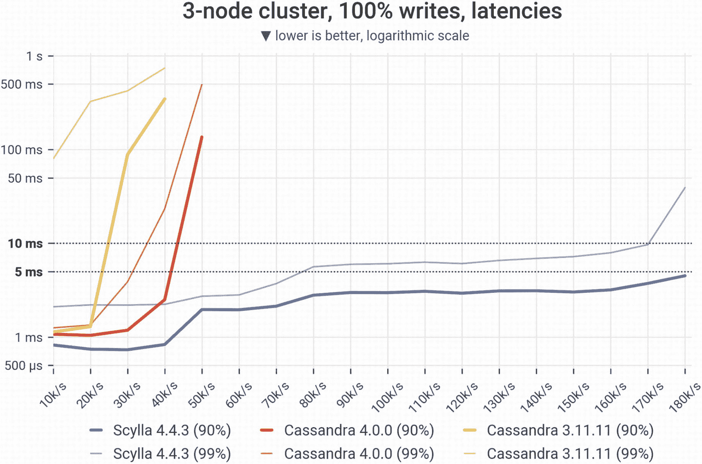
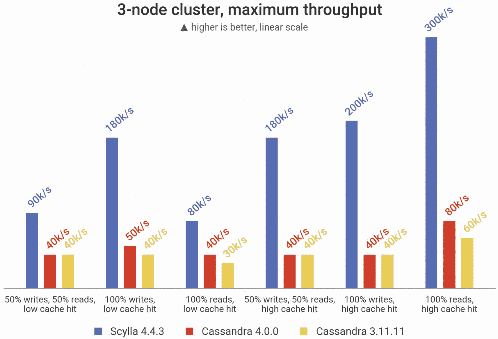
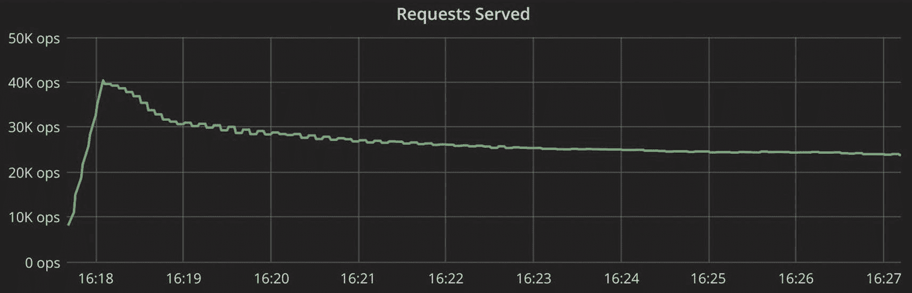

# 9. 基准测试

延迟或吞吐量：选择你的重点少即是多（起初）：采取分阶段的方法基准测试的“做”和“不做”报告的“做”和“不做”针对各种基准测试目标的不同考虑超越常规基准总结

我们不会美化事实：数据库基准测试是困难的。有许多动态部分和细微差别需要考虑和管理——并且需要做一些准备工作才能真正看到数据库的能力并正确测量它。正确生成系统负载以反映现实生活场景并不容易。1 通常并不明显如何正确测量和分析最终结果。在提取基准测试结果后，你需要能够阅读它们，理解潜在的性能瓶颈，分析潜在的性能改进，并可能深入研究其他问题。你需要让你的基准测试结果有意义，确保它们易于重复，并且能够清楚地解释这些结果，以反映你的业务需求。还涉及到一些复杂的数学：统计学和排队论，以帮助处理黑盒和测量，更不用说对服务器、平台、操作系统以及在其上运行的软件的内部系统领域的专业知识了。

但是，当性能是首要任务时，仔细——有时甚至是频繁的——基准测试是必不可少的。从长远来看，它*将会*带来回报。有效的基准测试可以让你避免更糟糕的痛苦，比如在你意识到——太迟了——现有的解决方案无法以可接受的延迟和/或吞吐量支持公司最新阶段增长之后，随之而来的高压力数据库迁移项目。

本章的目标是分享一些策略，这些策略可以稍微减轻痛苦，更重要的是，通过帮助你选择满足性能需求的选择，增加痛苦带来回报的机会。本章首先查看两种主要的基准类型，并强调每个目标的关键考虑因素。然后，它提出了一种分阶段的方法，这应该有助于你更快、成本更低地发现问题。接下来，它深入探讨了基准规划、执行和报告的“做”和“不做”，重点关注过去几年我们见证的最佳和最差基准测试中学到的经验教训。最后，本章以查看一些你可能需要考虑用于特殊需求的较少见的基准测试方法结束。

## 延迟或吞吐量：选择你的重点

在基准测试时，你需要提前决定你想要关注吞吐量还是延迟。在两种情况下都会测量延迟。但这里是有区别的：

+   **吞吐量关注点**：你通过在完成上一个请求后立即发送新的请求来测量最大吞吐量。这有助于你了解数据库可以持续的最高 IOPS 数。吞吐量关注的基准测试通常是分析用例（欺诈检测、网络安全等）的关注点。

+   **延迟关注点**：你评估数据库在不影响延迟的情况下可以处理多少 IOPS。这通常是大多数面向用户和实时应用程序的关注点。

吞吐量测试相当常见，但如果已经知道所需的吞吐量（例如，1M OPS），则延迟测试是一个更好的选择。如果你的生产系统必须满足特定的延迟目标（例如，99.99 百分位数的读延迟应小于 10ms），这一点尤其正确。

如果你只关注延迟，你需要测量和比较在相同吞吐量速率下的延迟。如果你只知道数据库 A 可以在某个 P99 延迟下处理 30K OPS，而数据库 B 可以在略高的 P99 延迟下处理 50K OPS，你实际上并不能说哪一个更“高效”。为了公平比较，你需要测量每个数据库在 30K OPS 或 50K OPS 下的延迟——或者两者都要测量。更好的是，你将跟踪更广泛的间隔内的延迟（例如，在 10K OPS 增量下测量，直到两个数据库都无法达到所需的 P99 延迟，如图 9-1 所示。）

一条名为“3 节点集群，100%写入，延迟”的折线图显示了六个类别。所有类别中有一个资源达到了最大值。只有一条名为“Scylla 4.4.3 90%”的线保持在 5 毫秒以下。

图 9-1

一个以延迟为导向的基准测试

并非所有延迟基准测试都需要采取那种形式。以一个拥有实时竞价用例的 AdTech 公司为例。对他们来说，超过 31 毫秒的请求是完全无用的，因为它将超出竞价窗口。这被视为超时。任何 30 毫秒或更短的请求都是可以接受的；2 毫秒的响应对他们来说并不比 20 毫秒的响应更有价值。他们只关心哪些请求超时，哪些没有。

他们的基准测试需求最好通过一个测量随时间产生超时请求次数的延迟基准来满足。例如，图 9-2 显示，在他们基准测试中的第一个数据库（最上面的线条）在 11:30 左右每秒产生了超过 10 万次超时；另一个（接近底部的水平线）在同一时间点只经历了大约 200 次超时，并且在测试期间也是如此。

一条线图说明了他们在基准测试中的第一个数据库，由顶部线条表示，在 11:30 左右每秒超过 100K 次超时，另一个，由底部附近的水平线表示，在同一时间点只经历了大约 200 次超时，在整个测试过程中也是如此。

图 9-2

一个以延迟为导向的基准，测量随时间生成的 OPS 超时数量

为了对比，图 9-3 展示了吞吐量基准的一个示例。

一个标题为“3 节点集群，最大值”的三条杠图表，有五个类别。其中一个资源在所有类别中达到最大值。

图 9-3

以吞吐量为导向的基准

在吞吐量基准测试中，你希望看到资源之一（例如，CPU 或磁盘）达到最大值，以便了解数据库在极端负载条件下能提供多少性能。如果你没有达到这个水平，这表明你并没有真正有效地基准测试数据库的吞吐量。例如，图 9-4 展示了基准运行期间两个集群的负载。注意一个集群被充分利用，而另一个集群非常接近其极限。

图表标题为负载，一个集群达到顶部并保持在顶部，然后在末端急剧下降。另一个集群保持在顶部下方，保持平稳，然后在末端急剧下降。

图 9-4

两个集群的负载比较：一个完全达到最大值，另一个非常接近其极限

## 少即是多（起初）：采取分阶段的方法

无论哪种关注点，基准测试的第一条规则是保持简单。始终专注于你想让基准测试回答的具体问题（稍后将有更多介绍）。但，要意识到这可能需要多个阶段——每个阶段都有相当多的尝试和错误——才能得到有意义的结果。

会出什么问题？很多。例如：

+   你的客户端可能是一个瓶颈

+   你可能需要调整数据库的规模

+   你的测试可能需要调整

+   沙盒环境可能拥有与生产环境非常不同的资源

+   你的测试方法可能过于人为，无法预测现实

如果你一开始就引入了过多的复杂性，那么发现哪里出错以及确定问题根源将是一场噩梦。例如，假设你想测试数据库是否能处理来自客户端的 1M OPS 流量，P99 延迟为 1ms 或更少。然而，你注意到延迟超出了预期的阈值。你可能花费数天调整数据库配置，但毫无成效，最终发现问题是客户端并发中的错误。如果你一开始只使用一小部分这种吞吐量，这个问题会更容易被发现。除了避免挫败感和浪费时间之外，你还会为你所在的团队节省大量的不必要的基础设施成本。

作为一般规则，考虑至少两个基准测试阶段：一个使用专门的压力工具，另一个使用您真实的负载（或者至少是它的一个样本——例如，将 30%的查询发送到集群进行基准测试）。对于每个阶段，从超级小规模开始（大约是您最终想要测试的吞吐量的 10%），根据需要排除故障，然后逐渐扩大范围，直到达到目标负载。在整个过程中始终考虑优化。您需要添加更多服务器或更多客户端来实现一定的吞吐量吗？或者您（由于预算或基础设施的限制）被固定硬件配置所限制？您能否用更少的资源实现您的性能目标？

关键是逐步进行。当然，具体方法会因情况而异。考虑一家领先的旅游公司的做法。最近从 PostgreSQL 迁移到 Cassandra 后，当他们决定评估 Cassandra 的替代方案时，他们已经相当有经验的基准测试者了。目标是测试新的数据库候选人的原始速度和性能，以及它对其特定工作负载的支持。

首先，他们建立了一个五节点集群，并使用来自 cassandra-stress 的合成流量进行数据库比较。这让他们有信心，新的数据库能够在某些工作负载下满足他们的性能需求。然而，他们的实际工作负载与定制的 cassandra-stress 工作负载完全不同。他们经历了高度可变和不可预测的流量（例如，由火山爆发引起的巨大激增和中断）。为了进行更现实的评估，他们开始跟踪生产流量。这个基准测试的第二阶段为他们提供了所需的额外信心，使他们能够继续迁移。

最后，他们使用相同的跟踪流量来确定最佳的部署选项。迁移到一个更大的 21 节点集群，他们在云服务提供商 A 和云服务提供商 B 的裸金属上进行测试。他们还在云服务提供商 B 上尝试了许多不同的选项：各种存储选项、CPU 等。

这里底线是：从简单开始，确认，然后逐步扩展。这更安全，最终也更快。此外，您还可以节省成本。在您通过这个过程时，检查您是否需要在测试过程中调整您的设置。一旦您最终对结果满意，相应地扩展您的基础设施以满足您定义的标准。

## 基准测试的“应该做和不应该做”

如何配置和运行基准测试的具体步骤因数据库和基准测试工具而异，所以我们不会深入探讨。相反，让我们看看一些更通用的“应该做和不应该做”的建议，这些是基于我们在现场看到的情况。

小贴士

如果您还没有这样做，请在开始基准测试之前，务必回顾有关驱动程序、基础设施和拓扑考虑因素的章节。

### 了解您数据库的“引擎盖下”是什么（或者找到知道的人）

理解并预测你的选择的工作负载将如何影响系统的哪些部分以及如何影响。它将如何压力你的 CPU？你的内存？你的磁盘？你的网络？你知道数据库是否会自动分析其运行在的系统并将应用请求优先于内部任务吗？背景操作在进行中，以及这些可能如何扭曲你的结果？如果你只是想运行基准测试，这一切为什么又很重要呢？

让我们以基于 LSM-tree 的数据库的压缩为例。正如我们将在第十一章中讨论的，压缩确实对性能有显著影响。但如果你只运行几分钟的基准测试，压缩不太可能启动。鉴于压缩对不同数据库的性能影响差异很大，了解它们将会发生并确保测试持续足够长的时间以衡量其影响是至关重要的。

这里重要的是要尽量理解你正在基准测试的系统。你理解得越好，你就能更好地规划测试和解读结果。如果你正在基准测试的数据库背后有供应商和/或用户团体，尝试向他们询问关于数据库如何工作以及你应该注意什么的快速概述。否则，你可能会忽略一些会回来困扰你的事情，比如发现你预期的规模过于乐观。或者，你可能会对一些实际上是无关紧要的 KPI 感到恐慌。

### 选择一个能够发挥数据库潜能的环境

这实际上是对前一条建议的补充。对你数据库的超级能力有了一个坚定的理解后，你可以设计基准测试场景，以充分揭示其潜能。例如，如果你想比较两种为通用硬件设计的数据库，不必担心在广泛的强大服务器上进行基准测试。但如果你正在比较一个旨在利用强大服务器的数据库，只在其上（或者更糟糕的是，在笔记本电脑上使用 Docker 镜像）进行基准测试将是失职的。这就像在纽约市拥挤的街道上试驾赛车，而不是在你当地的 Autobahn 高速公路上一样。

同样，如果你认为数据库或你的数据建模的某些方面可能会对你的用例造成问题，现在是时候将其推到极限并评估其真实影响。例如，如果你认为你的数据子集可能由于用户趋势而具有不平衡的访问模式，请使用基准测试阶段来重现这种情况并评估其影响。

### 使用一个代表生产环境的环境

在错误的环境中基准测试可能会轻易导致性能差异达到一个数量级。例如，一台笔记本电脑可能只能达到 20K OPS，而一台专用服务器则能轻松实现 200K OPS。除非你打算让你的生产系统在笔记本电脑上运行，否则不要在笔记本电脑上进行基准测试（或运行比较）。

如果你在一个容器化/虚拟化环境中使用共享硬件，请注意一个虚拟机可能会增加其他虚拟机的延迟。因此，你通常会想确保硬件资源是专门为你的数据库分配的，并且通过任何可能的方式避免资源过度承诺。

此外，也不要忽视负载生成器的环境。如果你为负载生成器分配的资源不足，负载生成器本身将成为瓶颈。另一个考虑因素：确保数据库和数据加载器不在同一节点上运行。推送和拉取数据是资源密集型的，因此加载器肯定会从数据库中窃取资源。这将影响任何数据库的结果。

### 不要忽视可观察性

在吞吐量和延迟之外，对关键性能指标的可观察性对于识别和解决问题至关重要。例如，你可能没有像预期的那样频繁地命中缓存。或者，网络接口可能因为数据过多而超负荷，以至于影响了延迟。可观察性也是你验证在审查结果时是否过于乐观或悲观的主要工具。你可能会发现，即使是来自磁盘的读取请求，在冷缓存的情况下，也符合你的延迟要求。

注意

关于这个主题的详细讨论，请参阅第十章。

### 在可能的情况下，始终使用标准化的基准测试工具

不要浪费资源去构建、调试和维护一个已经解决的问题的基准测试工具版本。社区已经开发了一套令人印象深刻的工具，可以满足广泛的需求。例如：

+   YCSB^(2)

+   TPC-C^(3)

+   NdBench^(4)

+   Nosqlbench^(5)

+   pgbench^(6)

+   TLP-stress^(7)

+   Cassandra-stress^(8)

+   以及更多…

它们都是相对相同的，并提供类似的配置参数。你的任务是理解哪一个更好地反映了你感兴趣的工作负载，以及如何正确运行它。如果有疑问，请咨询你的供应商，了解与所选数据库兼容的特定工具。

当然，这些选项不会涵盖一切。如果你：

+   你的工作负载与标准工具提供的工作负载完全不同（例如，你依赖于工具本身不支持的多项操作）

+   它可以帮助你在基准测试策略的后期阶段测试针对真实（或更真实）的工作负载

理想情况下，您的基准测试的最后阶段应该涉及将您的应用程序连接到数据库，并查看它对实际工作负载的反应。但是，如果您正在比较需要以两种完全不同的方式实现应用程序逻辑的两个数据库，那会怎样呢？在这种情况下，不同的应用程序逻辑实现可能会对结果产生的影响与数据库之间的差异一样大。再次强调，我们建议从小处着手：仅测试应用程序针对两个目标的基本功能（遵循每个目标的最佳实践），并查看初始结果如何。

### 使用代表性的数据模型、数据集和工作负载

随着您从基准测试的初始“这甚至能工作吗”阶段进展，很快就会变得关键的是转向代表性的数据模型、数据集和工作负载。您越接近生产环境，就越能信任您的结果准确地代表了您在生产环境中将经历的情况。

#### 数据模型

例如，cassandra-stress 这样的工具使用默认的数据模型，并不能完全反映大多数团队在生产环境中使用的数据模型。例如，cassandra-stress 的默认数据模型将复制因子设置为 1，并使用`LOCAL_ONE`作为一致性级别。虽然 cassandra-stress 是一种方便的方式来获得一些初始的性能印象，但关键是要基准测试您将在生产中使用的相同/类似的数据模型。这就是为什么我们建议使用自定义数据模型，并调整您的一致性级别和查询。cassandra-stress 和其他基准测试工具通常提供指定用户配置文件的方法，您可以在其中指定自己的模式、查询、复制因子、请求分布和大小、吞吐量速率、客户端数量以及其他方面。

#### 数据集大小

如果您使用小于生产数据集的数据集运行基准测试，由于 I/O 操作数量的减少，您可能会得到误导性或不正确的结果。最终，您应该配置一个测试，以现实地反映您当前规模对应的生产数据集大小的部分。

#### 工作负载

使用尽可能接近您预期生产工作负载的负载运行基准测试。这包括由负载生成器提交的查询。当您使用正确的查询类型时，它们将在集群中分布，并且读和写之间的比例保持相对恒定。

读写比例很重要。不同的组合将以不同的方式影响您的磁盘。如果您想要代表生产环境的结果，请使用现实的工作负载混合。

最终，你会达到存储 I/O 吞吐量的极限，并使磁盘饥饿，这会导致请求开始在数据库上排队。如果你继续超过这个点，延迟会增加。当你达到这个增加延迟的点，并且结果不满意时，停下来，反思发生了什么，分析如何改进，然后再次迭代测试。根据需要重复冲洗和重复。

这里有一些关于为常见用例创建真实工作负载的技巧：

+   **摄取**：尽可能快地摄取数据，至少持续几个小时，并且以不会产生超时或错误的方式进行。这里的目的是确保你有一个稳定的系统，能够在长时间内跟上你预期的流量速率。

+   **实时竞价**：使用下班后或持续的低背景负载的批量写入；工作负载的核心是大量的读取，具有极端严格的延迟要求（可能低于特定阈值）。

+   **时间序列**：使用重负载和恒定的写入到不断增长的分区，这些分区由时间窗口分割和分桶；读取通常集中在最新的行和/或特定的时间范围内。

+   **元数据存储**：偶尔进行写入，但重点关注代表用户访问你的网站的随机读取。这里通常有很好的缓存性。

+   **分析**：定期写入大量信息并执行大量全表扫描（可能与其他工作负载并行进行）。

核心是要尽量模拟你的工作负载的样子，运行对你有意义的事情。

### 现实地锻炼你的缓存

除非你能绝对保证你的工作负载有高缓存命中率频率，否则要持悲观态度，并好好练习。

你可能正在运行工作负载，得到很好的结果，并且看到缓存命中率高达 90%。那很好。但这是你将一直运行的方式吗？你有没有一天中缓存不会那么热的时候，可能是因为有其他事情在运行？在现实情况下，你可能会遇到缓存较冷或超级冷的时间（例如，升级后或硬件故障后）。考虑在基准测试中也测试这些场景。

如果你想确保所有请求都来自磁盘，你可以完全禁用缓存。然而，请注意，这通常是一种极端情况，因为大多数工作负载（无论如何）都会进行一些缓存。有时，只需重新启动节点或进程，就可以创建一个冷缓存情况。

### 查看稳态

大多数数据库在实际生活中的表现与在短暂的测试情况中的表现不同。它们通常运行几天或几年——所以当你测试数据库两分钟时，除非你只在工作内存中工作，否则你很可能不会深入了解它的行为。此外，当你与一个旨在服务数十或数百 TB——甚至可能 PB——的数据库一起工作时，要知道它在不同的数据级别上会有相当不同的表现。请求变得更为昂贵，尤其是读请求。如果你测试的是只服务一个 GB 的东西，这根本不同于测试服务一个 TB 的东西。

图 9-5 展示了观察稳定状态的重要性。你能说出所讨论数据库的吞吐量是多少吗？

一个标题为“请求服务”的图表。一条线急剧上升，略微下降，然后在剩余时间内保持平坦。

图 9-5

一个没有关注稳定状态吞吐量的图表

嗯，如果你只看第一分钟，它似乎以 40K OPS 的速度提供服务。但如果你等待几分钟，吞吐量就会下降。

每当你想陈述你的数据库可以处理的最大吞吐量时，请从稳定状态开始。确保你插入的数据量是有意义的，而不仅仅是几吉字节，并确保它运行足够长的时间，以便它是现实场景。在你对在长时间内可以持续多少请求感到满意后，考虑添加噪声，例如扩展客户端，并引入故障情况。

### 注意客户端瓶颈

基准测试中最常见的错误之一是忽略了瓶颈可能来自应用侧的事实。你可能需要调整你的应用程序客户端以允许更高的并发性。你也可能在一个租户上运行许多应用程序 Pod——所有实例都在争夺相同的硬件资源。确保你的应用程序在适当的环境中运行，就像你的数据库一样。

### 还要注意网络问题

网络问题也可能使你的基准测试结果变得混乱。如果数据库消耗了过多的软中断来处理，这将降低你的性能。你可以通过分析 CPU 中断份额来检测这一点，例如。通常，你可以通过使用 CPU 固定来解决这个问题，这告诉系统所有网络中断都应该由数据库未使用的特定 CPU 处理。

同样，通过慢速链路运行你的应用程序，例如通过互联网而不是通过私有链路路由流量，可以轻易引入网络瓶颈。

### 认真记录以确保可重复性

预测何时以及为什么你可能想要重复基准测试是很困难的。也许你希望在供应商的用户会议上得到一些很好的建议后评估你进行的优化对性能的影响。也许你刚刚得知你的公司被收购，你应该准备支持比目前多十倍的吞吐量——或者更严格的延迟 SLA。也许你了解到一个与当前数据库 API 兼容的新数据库，你很好奇性能如何。或者，也许你有一个对另一种数据库有强烈偏好的新老板，你需要突然通过面对面比较来重新证明你的决定。

无论你重复基准测试场景的原因是什么，有一点是确定的：你会非常感激之前花时间详细记录你所做的一切以及原因。

## 报告的注意事项

因此，你已经完成了基准测试，并收集了各种数据——最好的报告方式是什么？不要在这个最终且关键的一步上节省。清晰而有说服力的报告对于说服他人支持你的建议方案至关重要——无论是开始数据库迁移、更改配置或数据建模，还是简单地坚持对你来说效果良好的方案。

这里有一些关于报告的注意事项。

### 小心聚合

在进行聚合时，请极端小心。你可以通过说“我进行了为期三天的基准测试，这是我的吞吐量。”来报告基准测试的结果。然而，这忽略了大量关键信息。例如，考虑图 9-6 和 9-7 中展示的两个图表。

一个标题为“请求处理”的图表。一条线急剧上升，略微下降，在较长时间内保持更加颠簸，最后急剧下降。

图 9-7

到达相似吞吐量的道路更加颠簸

一个标题为“请求处理”的图表。一条线急剧上升，略微下降，在较长时间内保持平坦，最后急剧下降。

图 9-6

在十分钟期间几乎恒定且可预测的较低基线吞吐量

这两种负载在最后都大致具有相同的吞吐量。图 9-6 显示了较低的基线吞吐量——但在整个期间都是恒定且非常可预测的。图 9-7 中的 OPS 比第一个基线低得多，但它也急剧上升到更高的值。图 9-6 中显示的行为显然更可取。但如果你聚合你的结果，就很难注意到差异。

另一个聚合错误是聚合尾部延迟：从多个负载生成器中取 P99 延迟的平均值。确定多个负载生成器百分位数的方法是合并每个负载生成器的延迟分布，然后确定百分位数。如果这不是一个选项，那么下一个最好的选择是取每个负载生成器的最大值（例如 P99）。实际的 P99 将等于或小于最大 P99。

例如，假设您有以下客户端：

+   客户端 1：100 个总请求：其中 98 个花费了 1ms，2 个花费了 3ms

+   客户端 2：100 个总请求：其中 99 个花费了 30ms，1 个花费了 31ms

在第一个例子中，第 99 百分位数是 3 毫秒。第二个客户端的第 99 百分位数是 30 毫秒。平均一下，得到 16.5 毫秒。然而，真正的第 99 百分位数是通过将这两个数组合并，然后从中获取第 99 百分位数来获得的。实际的第 99 百分位数是 30 毫秒。那个 16.5 毫秒的“平均值”是没有意义的——它与现实中的任何事物都不相关。

此外，也不要盲目地只相信你的应用程序延迟。一般来说，在评估基准测试结果时，务必咨询数据库报告的延迟，以排除与数据库本身相关的瓶颈。数据库延迟在您特定的阈值内，但客户端结果偏离您预期的情况相当常见——这可能会表明网络或客户端存在问题。

### 不要假设人们会相信你

假设您提出的任何主张都会遇到一大堆怀疑。对抗这种怀疑的最好方法之一是分享您设置的精细粒度细节。仅仅报告“我们的集群 P99 低于 1ms”是不够的。

一个更好的说法是：“我们设置了三个集群节点，每个节点有 3x i3.4xlarge（16vCPU，122GiB RAM，最高 10Gbps 网络，2x1.9TB NVMe）。对于加载器，我们使用了 3x c5n.9xlarge（36vCPU，96GiB RAM，最高 50Gbps 网络）。这是我们的 P99 随时间变化的图表。这是用来压力测试给定工作负载的基准测试配置文件。”

此外，提供足够的细节，以便可以重复基准测试。例如，对于 Cassandra 基准测试，考虑包括以下细节：

+   JVM 设置

+   在`cassandra.yaml`中使用的任何非默认设置

+   Cassandra-stress 参数（驱动程序版本、复制因子、压缩策略等）

+   您确切地如何插入数据、预热缓存等等

最后，请记住，您的报告越丰富，就越容易让某人支持您的建议，即选项 A 比选项 B 更可取。例如，如果您正在研究两个不同的数据库在同一硬件上的比较，您除了标准的吞吐量和延迟图外，还可能分享表 9-1 中的细节。

表 9-1

在相同硬件上比较两个不同数据库的结果的沟通

| 测试 | 数据库 A | 数据库 B | 差异 | 较好的是： |
| --- | --- | --- | --- | --- |
| 填充时间 | 5h 21m 29s | 4h 27m 19s | 20% | 较低 |
| 压缩时间 | 7h 32m | 21m | 21x | 较低 |
| 总空闲时间（填充和压缩） | 12h 43m | 4h 48m | 2.68x | 较低 |
| 读取吞吐量（小数据集） | 51,267 次/秒 | 124,958 次/秒 | 2.43x | 较高 |
| 读取吞吐量（中等数据集） | 7,363 次/秒 | 6,958 次/秒 | -5% | 较高 |
| 读取吞吐量（大数据集） | 5,089 次/秒 | 5,592 次/秒 | 9.8% | 较高 |
| 写入时的读取量 | 547 次/秒 | 920 次/秒 | 68% | 较高 |
| 99.9% 延迟（在 5,000 次/秒写入时） | 130.3 毫秒 | 11.9 毫秒 | 10.9x | 较低 |
| 99.9% 延迟（在 10,000 次/秒写入时） | 153.3 毫秒 | 16.9 毫秒 | 9.0x | 较低 |

### 考虑协调遗漏

测量延迟时常见的常见问题是协调遗漏问题，这会导致最差的延迟被遗漏在测量中，因此使得较高的百分位数变得无用。

Gil Tene 提出了这个术语来描述当测量系统无意中以一种避免测量异常值并遗漏发送请求的方式与被测系统协调时发生的情况.^(9)

这里有一个由 Ivan Prisyazhynyy 提出的绝佳类比:^(10)

“让我们想象一个由咖啡驱动的办公室。每个小时，一个员工都要去当地的咖啡店买咖啡。但假设白天中间有道路封闭？你不得不等几个小时才能去那跑一趟。这不仅使那个小时的特定咖啡跑者迟到，而且所有其他的咖啡跑都要在后面排几个小时。当然，一旦道路最终开通，拿咖啡所需的时间是一样的，但如果你不测量由道路封闭造成的差距，你就是在遗漏测量获取团队咖啡的总延迟。而且，当然，在此期间，你将严重缺咖啡。”

Prisyazhynyy 指出，现在大多数标准基准测试工具现在都考虑了协调遗漏（例如，cassandra-stress 和 YCSB 都考虑了；TLP-stress 在写作时没有考虑）。然而，默认情况下，它们并不 *尊重* 协调遗漏，因此使用这些工具的人仍然需要警惕发现和对抗协调遗漏。我们强烈建议阅读他的完整文章。但为了简洁起见，这里是他结论的摘要：

“我们发现最佳实现涉及静态调度、排队和延迟校正，我们展示了如何将这些方法结合起来有效地解决协调遗漏问题：带有校正的排队或模拟，或者无排队加模拟。

为了减轻协调遗漏效应，你必须：

+   明确设置吞吐量目标、工作线程数量、要发送的总请求数量或总测试持续时间

+   明确设置延迟测量模式

    +   修正排队实现

    +   模拟非排队实现

例如，对于 YCSB，正确的标志是：

+   `-target 120000 -threads 840 -p recordcount=1000000000 -p measurement.interval=both`

对于 cassandra-stress，它们是：

+   `duration=3600s -rate fixed=100000/s threads=840`

除了这些提示之外，还有更多影响协调遗漏的参数。我们强烈建议你寻求供应商、Stack Overflow 或其他社区资源的建议。

## 针对各种基准测试目标的特殊考虑

许多数据库基准测试主要是为了让团队在选择过程中勾选一个“尽职调查”的框。既然你现在已经深入到一本专注于数据库性能的书中，我们假设那不是你的团队。你有一些宏伟的性能目标，你知道基准测试是实现这些目标的关键。那么，你希望通过最新的基准测试实现什么？以下是一些常见的原因和用例，以及每个用例的技巧和注意事项。

### 为增长做准备

你刚刚了解到你的应用程序预计将处理增加的流量——可能是由于合并/收购、一些意外的宣传或市场变动，或者只是随着时间的推移缓慢而稳定地积累更多用户。你的数据库能否胜任这项任务？你可能想测试你的数据库在压力下的扩展性。添加更多资源需要多长时间？升级扩展呢？

### 比较不同的数据库

可能你有幸从头开始设计一个使用“最佳”数据库的应用程序。也许你遇到了现有数据库的瓶颈，需要证明可能痛苦且昂贵的迁移是合理的。或者，你可能好奇迁移到现有数据库供应商的各种产品是否值得。了解每个数据库是如何构建的，以及如何测试其优势以及评估其限制的真正影响是至关重要的。

### 在不同基础设施上比较相同的数据库

你偏好的云供应商刚刚发布了一系列具有巨大潜力的新实例。但是，考虑到你的数据库和你的工作负载，你会看到任何影响吗？垂直扩展能否减少你的集群大小（以及你的维护头痛的范围）？

注意在基础设施设置之间可能需要的任何配置更改（有时可能是意外的！）以确保你从每个设置中获得最大效果。

还要记住，一些数据库在可扩展性方面有局限性。如果你使用较小的节点进行横向扩展，某些数据库将更加高效。而其他数据库在运行在更大容量节点上时将表现出色。

最后，考虑应用延迟。在某些情况下，你可以“携带”一个测试应用到同一个云环境中，并像在本地数据中心一样重新生成它，以减少网络 RTT。在其他情况下，你可能需要考虑在收到的结果之上加上网络延迟。如果应用在单独的环境中，这可能会对数据库造成额外的延迟。

### 评估数据建模或数据库配置更改的影响

假设你刚刚开始重构你的数据模型，并想要对其进行“单元测试”以检查你是否走在了正确的道路上。你的团队正在就不同的选项进行辩论，并希望有一个客观的评估，看看他们将会优化还是削弱你的性能。

在这种情况下，你必须考虑众多方面。例如，在评估传输中加密对你的工作负载的影响时，你可能会收集数据库在运行热缓存时的初始测试。然后，在应用必要的更改后，你重新启动数据库，结果延迟更高。你可能会想，“哦不！加密设置真的伤害了我的延迟！”但，你忘记了重启集群以应用更改也清除了缓存——在你重新启动测试时，你基本上是从磁盘读取的。最终，在缓存预热后，你注意到加密选项几乎对你的延迟没有影响。呼！

## 超出常规基准测试

考虑到你现在已经深入到这本书的许多章节，你显然非常着迷。也许你想对你的数据库进行一些不太常见或更极端的测试？这里有一些选项。

### 基准测试管理操作

即使你不经常或大幅度地预期扩展容量，检查添加新节点或增加集群容量所需的时间当然属于“尽职调查”的范畴。如果你确实预期会有突然和显著的增加，测试一些更极端的东西——比如你多快能加倍容量。

请记住，数据库必须将数据流式传输到新节点，这将消耗一些 CPU 时间，以及磁盘 I/O 和网络带宽——因此，在安全且受控的环境中评估这一点很重要。

你可能还想基准测试的其他管理操作包括替换节点所需的时间以及压缩和其他后台操作对延迟的影响。例如，在 Cassandra 或 ScyllaDB 中，你可能想了解后台运行的修复操作如何影响实时工作负载。如果你注意到操作导致延迟增加，你可能能够安排一个时间窗口来每周运行修复，或者以较低的强度运行它们。

### 测试灾难恢复

您需要测试您维持常规生活事件的能力。节点会崩溃。磁盘会损坏。网络电缆会断开。这肯定会发生——而且很可能是在最糟糕的时间（例如，黑色星期五或您正在向数百万观众直播的大型比赛期间）。您需要考虑潜在的灾难，并测试在减少节点、网络分区或其他不希望发生的事件下的容量规划。这还有额外的益处，即让您了解系统的真正恢复能力。

此外，测试从备份中恢复所需的时间和精力。是的，这需要花费相当多的时间和金钱进行本质上是一场消防演习。但了解危机时刻可以期待什么是非常有价值的——避免具有不可接受的恢复时间的数据库可能是无价的。

如果您在云上运行，您可能会认为您可以免受灾难的侵害。“我只是再启动另一个集群，继续前进。对吧？” 错误！除了数据迁移本身之外，还有许多其他事情可能会出错。您需要重新连接所有网络 VPC，重新执行应用程序和数据库之间的所有网络配置，等等。您也可能在某个区域或可用区中耗尽所需类型的实例。您是否曾经去过超市购买基本商品，比如卫生纸，却发现货架空了，因为每个人都突然开始填满他们的购物车（例如，由于灾难）？这种情况可能发生在任何事物上，甚至虚拟实例。最好测试灾难场景，以更好地了解您可能会遇到的问题——并练习您将如何反应。

### 极端规模基准测试

在拍字节级进行的基准测试可以帮助您了解特定数据库如何处理公司期望（或至少希望）遇到的极端大型工作负载。然而，这样的基准测试可能具有挑战性，设计和执行起来都相当困难。

ScyllaDB 工程团队最近决定在相对较短的时间内进行一次拍字节级基准测试。我们构建了一个 20 节点的 ScyllaDB 集群，并加载了 1PB（复制）的用户数据和 1TB 的应用程序数据。用户工作负载约为 500 万 TPS，我们测量了两种变体：一种是只读的，另一种是 80% 读取和 20% 写入。由于这种工作负载模拟了在线分析，高吞吐量至关重要。同时，我们还运行了一个较小的 200,000 TPS 应用程序工作负载，其中 50% 读取和 50% 写入。由于这种工作负载代表了在线事务处理，低延迟比高吞吐量更为重要。

为了让您了解从设置角度来看这涉及到什么，我们为 ScyllaDB 集群配备了 20 个 i3en.metal AWS 实例。每个实例具有：

+   96 个 vCPU

+   768 GiB RAM

+   60 TB NVMe 磁盘空间

+   100 Gbps 网络带宽

对于负载生成器，我们使用了 50 个 c5n.9xlarge AWS 实例。每个实例具有：

+   36 个 vCPU

+   96 GiB RAM

+   50 Gbps 网络带宽

如果你正在考虑进行自己的极端规模基准测试，以下是一些你可能想要考虑的经验教训：

+   **配置**：在 AWS 中找到一个具有足够实例类型进行 PB 级基准测试的可用区域花了一些天。如果你计划部署如此大的集群，请确保提前充分配置你的资源。

+   **硬件调优/中断处理**：当时，我们将核心分配给 I/O 队列处理默认设置并未针对这种极端场景进行优化。为了最大化吞吐量，必须手动分配中断处理 CPU。

+   **硬件调优/CPU 功率管理器**：我们需要将每个节点的 CPU 功率管理器设置为“性能”，以最大化系统的性能。

+   **cassandra-stress**：cassandra-stress 并未设计用于此规模（默认的人口分布太小）。如果你旨在创建和迭代 PB 级数据集，请准备好尝试非默认设置。

## 摘要

基准测试既繁琐又费力，所以请确保你有明确的目标和有效的报告，以确保工作有所回报。我们分享的一些顶级技巧包括：

+   从小开始，以免浪费时间和金钱。

+   理解你的数据库，以便制定展示其优势并评估你是否可以容忍其弱点的测试。

+   依靠标准工具开始，但确保逐步发展到代表性的数据模型、数据集和工作负载。

+   在基准测试之前，确保你的监控堆栈处于良好状态，并战略性地使用它进行基准测试（例如，以实际测试你的缓存）。

+   计划投入大量时间来制作令人信服的报告，并警惕如协调遗漏等挑战。

下一章深入探讨了持续监控的最佳实践，这对于解释许多基准测试结果至关重要，以及在生产中防止和排查性能问题。

**开放获取**本章根据 Creative Commons Attribution 4.0 国际许可协议（[`creativecommons.org/licenses/by/4.0/`](http://creativecommons.org/licenses/by/4.0/)）许可，允许在任何媒介或格式中使用、分享、改编、分发和复制，只要您适当引用原始作者和来源，提供 Creative Commons 许可证的链接，并指出是否进行了更改。

本章中的图像或其他第三方材料包含在本章的 Creative Commons 许可证中，除非在材料引用行中另有说明。如果材料未包含在本章的 Creative Commons 许可证中，且你的预期使用未获得法定监管的许可或超出许可的使用范围，你将需要直接从版权持有人处获得许可。
