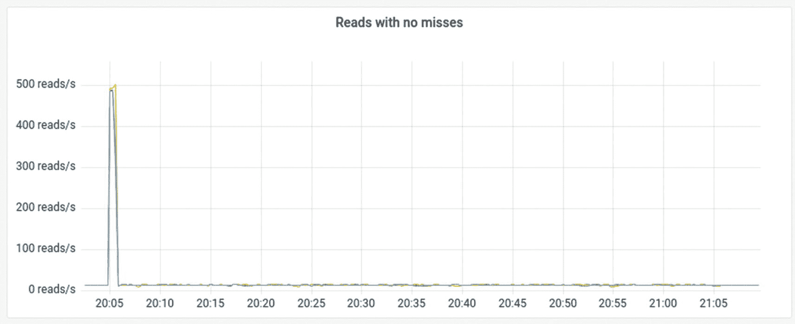
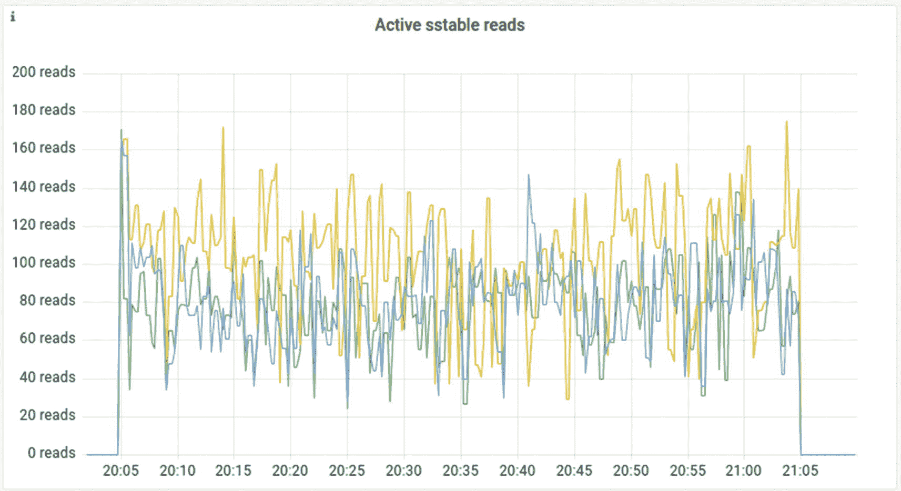

# 10. 监控

采取主动方法跟踪核心数据库 KPI 创建有效的自定义警报通过示例场景进行操作监控选项总结

数据库需要持续的关注和照顾，尤其是在性能是重点，存储的数据正在快速增长或频繁变化时。可能对业务构成风险的不利事件——例如，节点故障或客户端行为异常——不可避免地会发生。鉴于数据库和数据密集型应用程序的复杂性，问题不在于“是否”某些因素组合会导致性能下降，而在于“何时”。

进入可观察性和监控。主动方法是理解和优化你的基本性能、在最终用户感到痛苦之前捕捉到新兴问题以及在他们感到痛苦时快速反应的关键。本章帮助你确定在哪里集中监控努力——提供不同用例的示例——提供在问题出现时探索问题的技巧，并详细说明当你的关键性能指标（KPI）趋势走向错误方向时，你可能如何进行操作。

## 采取主动方法

监控通常只有在出现问题后才会成为优先事项。用户开始抱怨速度慢，系统空间不足，或者你的应用程序简单地停止响应。

在那个阶段，监控是深入挖掘问题、理解根本原因以及希望验证你的缓解尝试是否成功的关键工具。在这个时候，有洞察力的监控和知道该寻找什么是非常宝贵的。但更有帮助的是，通过长时间监控性能所获得的知识，即使一切都在顺利运行时也是如此。

如果你很好地掌握了数据库在正常运行时的一般行为，那么在它不健康时更容易发现问题。例如，如果你看到请求并发性激增，但你又知道你的系统始终正确地应用了并发限制器，那么你可能将调查重点放在可能减慢数据库的背景操作上。或者，也许你的应用程序已经扩展以处理更多流量，因此打破了之前的客户端假设。

随时间监控趋势还可以帮助你预测和规划高峰。例如，假设你是一家流媒体公司。如果你知道去年一个大型体育赛事的版本吸引了 2500 万活跃用户，而你当时有 2.5 亿订阅者，你可以使用这些数据来做出一些预测，关于今年你可能需要多少流量来支持——现在你有近两倍的订阅者。对于零售、欺诈检测或任何经历“黑色星期五”激增的行业来说，情况类似。为下一次高峰做准备的最佳方法之一是了解上一次高峰期间发生了什么。

将监控变成一项常规工作，而不是紧急响应，也可以帮助你及时发现潜在问题，并避免它们引发危机。例如，最常见的数据库错误之一就是未能仔细监控磁盘利用率。等你意识到系统即将耗尽存储空间时，可能已经太晚做出反应了。

作为一种美好的副作用，监控还可以提供一个窗口，让你了解你的数据和应用程序使用是如何演变的。例如，如果你注意到数据量或 IOPs 的稳步增加，你可能会考虑将你的数据库与下一年内可行的标准进行基准测试。也许你已经在那个规模上做好了准备，或者你可能需要考虑增加容量的选择。此外，评估在可能的新规模上实现预期延迟所需的内容，也有助于你预测和计划相关的成本增加。

备注：你需要监控 DBaaS 吗？

你选择数据库即服务（DBaaS）是因为你不想担心你的数据库，对吧？那么这意味着你不必担心监控吗？是的……也不完全是。

你应该放心，你选择的供应商正在仔细监控你的实例，既有大量的自动化，也有专业知识。如果你不确信这是事实，你可能需要考虑重新考虑你的 DBaaS 供应商。但即使你确实有信心，仍然建议你密切关注数据库性能。为了赢得并保持你的信任，你的 DBaaS 供应商应该提供对其监控内容的完全透明度。至少，你应该了解：

+   哪些 KPIs 与你团队最大的性能担忧相关

+   什么触发了他们审查关键绩效指标（KPIs），内部采取行动，并通知你问题

+   他们为了确保这些 KPIs 所付出的努力水平

    持续 24/7 在你的显示器上保持一个 DBaaS 监控仪表板可能有些过度。但至少你应该了解足够的信息，以保持基本水平的信心，即你的数据库和你的 DBaaS 供应商都在履行他们的职责。

## 跟踪核心数据库 KPIs

当你跟踪数据库 KPIs 时，少即是多。我们建议在每个领域（集群、基础设施、应用程序）中集中关注一小部分真正对你的业务有意义的 KPIs。然后，在仪表板上突出显示这些核心 KPIs，并设置当它们达到你认为需要立即响应的水平时触发的警报。在这里要非常诚实。有一个你真的会采取行动的定制警报，比 30 个你将忽略的警报要好得多。如果你不会立即处理它，它就是“噪音”，会使团队对甚至是最关键的问题变得麻木。

那么，其他所有 KPIs 呢？当需要以下操作时，它们将变得至关重要：a) 优化你的基准性能，b) 看看需要什么来在更大规模上维持这种性能，或 c) 诊断一个新兴的性能问题。

而不是试图涵盖每个流行高性能数据库的每个关键绩效指标（KPI），让我们仔细看看我们认为对于满足吞吐量和延迟期望最常见和最关键的指标。

### 数据库集群 KPI

这些是提供关于数据库集群健康状况洞察的指标。这个类别可能包括 I/O 队列、任务组、内部错误、读写、超时和错误、副本、缓存以及变更数据捕获。

监控集群的最终目标是确保系统处于稳定状态“健康状态”。在查看具体的 KPI 之前，考虑一下对于您的数据库来说理想的集群状态是什么样的。例如，对于像 ScyllaDB 或 Cassandra 这样的宽列数据库，您的目标可能是：

+   所有节点都正常运行

+   没有警报表明您关心的 KPI 已超过可接受的阈值

+   客户端以平衡的方式驱动所有节点和分片的流量

    +   连接平衡（您的驱动程序可能自动平衡它们）

    +   各个分片访问量大致相同

    +   查询在各个分片之间分散

+   对分区/行的请求数平衡（例如，您没有“热点分区”，其中 50%的读取请求都发送到单个分区）

+   分区平衡（例如，您没有平均分区大小为 0.5 MB，而只有几个分区大小为 10GB）

+   缓存命中率（从缓存中读取的行）遵循特定的分布模式

+   磁盘利用率有足够的空间来容纳增长和其他后台操作，例如压缩

这里有一些关于集群健康的具体 KPI 需要关注：

+   **节点可用性**：指示节点是否在线并通过存活检查进行响应。这可以用来评估节点是否在网络和集群的其他部分可用。如果集群有一个或多个不可用的节点，这意味着集群处理其工作负载的资源更少，这可能导致延迟增加。请注意，仅仅因为节点可用并不意味着它一定健康。

+   **平均读写延迟**：告诉你每种操作类型的平均延迟。这是了解集群如何处理部分请求的好方法，但当你仔细检查时，你会发现更多（例如，P99 延迟）。

+   **P99 读写延迟**：提供了关于集群中 99 百分位请求延迟的洞察。大多数对性能敏感的使用案例都旨在将 P99 延迟（有时还包括 P999 延迟）保持在业务案例可接受的范围内。

+   **每秒请求数**：指定数据库每秒处理多少操作。这个 KPI，连同延迟，对于评估集群如何处理预期的工作负载至关重要。吞吐量的突然下降可能表明网络故障、行为异常的客户，或者简单地当某个高吞吐量工作负载处理完成时。

+   **超时**: 显示集群中是否最近发生了任何超时。超时本身并不是一个坏信号。但团队可能需要考虑如何从应用层面处理超时，以及如何防止超时在繁忙的系统上变得普遍。集群的超时率通常会在出现故障时急剧上升。

+   **缓存**: 这可能包括你的缓存包含多少数据，以及从缓存中读取了多少数据（与磁盘相比）。后者将帮助你评估数据库如何使用其缓存系统，以及是否需要对其进行调整。它也可能解释一些延迟峰值，这些峰值将与主要读取磁盘的读取相关。

+   **连接**: 理解你的数据库通过网络如何被访问至关重要。了解当前数据库上有多少活动连接可以帮助你评估应用程序的连接问题，并了解连接是否在整个集群中平衡（以捕捉节点是否出现故障或过载）。

+   **垃圾回收器 (GC) 停顿**: 如果你使用的是需要 GC 停顿来清除未使用内存对象的数据库，请密切关注 GC 停顿可能对你延迟和吞吐量的影响。一般来说，GC 停顿是数据库不可用处理其工作的一小段时间。这意味着长时间的 GC 停顿可能会浪费资源并损害你的工作负载。

#### 在不同级别（数据中心、节点、CPU/Shard）需要关注的内容

监控解决方案通常会提供你分布式拓扑的不同视图。例如，在多区域主动-主动部署中，全局查看你的 P99 延迟将迅速帮助你确定整个基础设施是否稳定且运行正常。然而，当事情出错时，你可能需要不同级别的粒度来识别罪魁祸首。

你选择的细节级别越高，你将拥有的数据点和信息就越多。然而，在你确定可能的嫌疑人之前，用高细节级别在监控解决方案中导航并不总是好主意。

在调查未知问题时，如果你有一个多区域拓扑结构，我们建议你从数据中心级别的视图开始你的研究。这允许你确定问题是否仅限于单个区域，或者所讨论的问题是否影响所有区域。

一旦你确定了受影响的位置，下一步就是查看每个节点的数据点。这将揭示是否有任何特定的副本可能表现不佳，接收更多请求，经历不平衡，或者比其他副本有更高的延迟。

对于大多数数据库来说，按节点视图是可能的最底层。然而，具有每核心一个分片架构的数据库提供了一种额外的粒度：CPU 级别。一旦你确定了性能问题的主要嫌疑人，将你的可观察性切换到 CPU 级别是有意义的。否则，它只会显示太多可能一开始看起来难以理解的数据点。然而，当正确使用时，按 CPU 级别的视图可以极大地增强你的可观察性和故障排除技能。

#### 三个行业特定示例

下面是一些关于集群监控方法如何在不同行业和用例中变化的例子：

+   **AdTech**：AdTech 是依赖亚毫秒级延迟的最可识别的使用案例之一。例如，在实时竞价中，仅仅一个毫秒的峰值就可能导致错过一个定向广告机会。因此，这些用例通常会监控 P99、P999 甚至 P9999 延迟，并设置非常激进的定制警报阈值，以便可以立即识别和解决峰值。

+   **流媒体**：流媒体用例通常在多个租户中提供几种不同的媒体类型，通常通过不同的地区。在地区层面，数据平衡是至关重要的，因为单个瓶颈化的分片可能会产生广泛的影响。

+   **区块链**：区块链解决方案通常需要存储、计算和分析大量数据。随着所讨论的区块链的增长，以快速速度跟踪交易历史可能会变得非常具有挑战性。这个特定的用例专注于两个主要驱动因素：存储增长和磁盘 I/O 性能。

### 应用程序 KPI

你的分布式数据库是你基础设施中最重要的有状态组件。因此，许多数据库供应商在他们的产品中投入了大量时间和精力来改进和捆绑可观察性功能，这并不奇怪。然而，仅监控数据库本身只能做到这么多。总会有一个应用程序（或整个基础设施）在它后面，如果不进行适当的观察，可能会造成重要的业务影响。应用程序 KPI 是揭示查询问题、糟糕的数据模型和意外的驱动程序行为等问题的关键。

在你的应用程序（客户端）方面，以下是一些重要的关键绩效指标（KPI）需要关注：

+   **延迟**：客户端的 P99 高延迟并不一定意味着你的数据库延迟有问题。由于与数据库通信时涉及到的自然网络往返延迟，客户端延迟通常会略高于数据库延迟。然而，这个指标本身并不能帮助你确定真正的罪魁祸首。看看你的应用程序是否行为异常，或者它是否只是瓶颈（在这种情况下，你可以根据需要扩展它）。

+   **CPU 消耗**：高 CPU 消耗可能由几个原因引起。可能是您的客户端简单地超负荷，无法跟上传入请求的步伐。可能是您的请求平衡不适当。可能是“嘈杂的邻居”正在窃取您的 CPU 容量，等等。一般来说，如果您怀疑高 CPU 消耗的根本原因在于代码中的效率低下，您可以在代码上收集 tracepoints 或使用高级热图分析工具，例如 perf.^(1)。否则，简单地扩展您的应用程序部署或将应用程序迁移到其他主机可能就足够解决问题了。

+   **网络中断请求**：需要以低延迟实现高吞吐量的应用程序可能相当依赖网络。因此，高网络中断请求消耗可能会阻止您的应用程序完全最大化您最初预期的请求速率。使用低级 CPU 可观察性工具检查您的软中断消耗，例如大多数 Linux 平台上的 `top` 和 `htop` 命令。另一种防止中断损害性能的机制涉及 CPU 锁定或简单地扩展您的应用程序以在不同的主机机器上运行。

+   **就绪/活跃状态**：任何应用程序都容易受到错误和基础设施故障的影响。就绪和活跃状态检查可以帮助您确定特定的一组分布式应用程序何时可能开始出现异常行为，并在许多情况下会自动重新部署或重启有故障的客户端。就绪和活跃状态检查是 Kubernetes 无状态应用程序的标准做法。每当您的应用程序 Pod 开始出现异常行为时，您的 Kubernetes 控制器通常会采取行动将其移回健康状态。由于就绪或活跃问题而频繁重启的应用程序可能表明存在有问题的逻辑、内存泄漏或其他问题。检查您的应用程序或 Kubernetes 日志以获取有关此类事件实际原因的更多详细信息。

+   **GC 停顿**：许多应用程序在释放内存时都会经历垃圾回收暂停。根据其激进程度，它可能会导致 CPU 峰值（阻止您的应用程序跟上其输入速率）或引入严重的延迟峰值。这表明可能存在有问题的内存管理算法，或者您的垃圾回收器整体效率低下。考虑将您的应用程序分散到运行更多独立客户端，看看是否可以改善情况。

### 基础设施/硬件关键绩效指标

关注数据库和应用程序似乎是合理的，但底层硬件和基础设施呢？保持它们所有内容健康运行是基础设施团队的首要任务。毕竟，如果服务器因数周未被发现的功能故障而离线，那么调整和监控数据库又能起到什么作用呢？

这里是从数据库角度相关的最重要的基础设施/硬件 KPI：

+   **磁盘空间利用率**：作为一个有状态的应用程序，数据库当然将磁盘空间利用率作为一个最重要的 KPI。当磁盘达到满容量时非常危险，因为数据库除了放弃请求别无选择。数据库甚至可能自行关闭以避免意外数据丢失。保持磁盘利用率在良好控制之下对于健康、高效的数据库至关重要。

+   **磁盘带宽利用率**：除了磁盘空间利用率之外，还要监控磁盘的活跃使用情况和性能。在一个拥有多吉字节 RAM 的世界里，磁盘带宽不能落后；否则，你可能会面临增加的延迟，甚至由于磁盘无法在可接受的时间内处理请求而导致完全失败。

+   **CPU 利用率**：这是唯一一个重要的指标……或者不是吗？CPU 利用率可以从不同的角度来考虑。一方面，操作系统可能会说 CPU 已经 100%忙碌，因此它肯定已经达到了极限，不可能再接受更多的工作。对吗？不对！一个忙碌的 CPU 并不总是意味着系统已经达到了极限。例如，ScyllaDB 这样的数据库有内部机制来优先处理用户工作负载，而不是后台内部进程，如压缩和修复。在这样的系统中，实际上大多数时候都期望看到 CPU 利用率达到 100%，但这并不意味着系统已经达到了极限！

+   **内存利用率**：没有人愿意看到数据库交换到磁盘，因为这可能会对性能造成极大的损害。严重的内存压力可能会在底层操作系统内存不足时触发数据库崩溃（或其进程被杀死）。一般来说，数据库节点应该是服务器上唯一的内存密集型资源，并且系统必须配置为避免交换，除非绝对必要。

+   **网络可用性**：分布式数据库严重依赖于网络来与其他节点通信，以复制数据、存活信息，同时处理应用程序查询。网络故障可能会引起脑裂情况，或者暂时使节点完全不可访问，而达到网络带宽限制可能会导致工作负载的额外延迟。

## 创建有效的自定义警报

大多数用于监控数据库的工具都提供了内置的警报系统，带有预定义的规则，这些规则应该能满足大多数用户的需求。但如果你有更多专门的监控规则和警报，你会睡得更好吗？

首先，了解你想要监控的内容，然后看看如何使用现有指标（或它们的组合）来实现。在选择了将驱动自定义警报的指标（或指标组合）之后，考虑检查频率并设置可能值的阈值。例如，你可能认为工作负载超过其预期峰值一分钟是可以接受的，三分钟应该触发警告，五分钟则表明肯定有问题。相应地设置你的监控系统，并为每种类型的警报绑定适当的警报渠道。

此外，也要充分利用警报渠道！确保为每个警报级别标记并适当地将其引导到自己的目标渠道。你不想在生产系统出现故障时，警报系统自动化在半夜默默地在一个随机的 Slack 频道上发送消息。

## 演示示例场景

为了帮助你了解这些原则如何转化为实践，这里有两个示例场景。

### 一个副本在确认请求时落后

假设你正在查看图 10-1 中的仪表板，并注意到有一个副本在确认请求方面比其他所有副本都要慢得多。由于应用程序的传入请求率是恒定的（你没有限制请求），其他副本在一段时间后也会开始受到影响。

每秒写入次数与实例的关系图。每秒的写入次数在 14 到 23 之间。

图 10-1

一个副本在确认请求时比其他所有副本都要慢得多

要了解这里发生了什么，让我们看看前台和后台写入队列。但首先：什么是前台和后台队列？前台队列是应用程序指向指定节点的请求，但尚未向客户端确认。也就是说，请求已被接收，但由于数据库目前正在忙于服务其他请求，它们正在等待处理。后台队列是已经向应用程序确认，但在被视为完成之前仍需要在数据库中做额外工作的应用程序请求。跨节点复制数据延迟通常是后台队列高的原因。高前台和后台队列都与高延迟相关。

那么，这里真正的問題是什么？图 10-2 表明应用程序正在过载系统。它发送的请求数量超过了数据库的处理能力。由于分布式系统中单个任务的运行时间由最慢的节点控制，整个系统将降低到那个慢速节点的速度。

从 18:30 到 19:55 小时，每个实例的前台写入从 0 到 200 与时间的关系的折线图。大多数线条的每实例写入次数都低于 40。

图 10-2

每个分片的前台写入

图 10-3 显示，当某个节点因无法处理请求而超负荷时，其他节点的后台队列开始上升。这是有道理的，因为繁忙的节点显然在确认发送给它的请求时花费了更长的时间。

每个实例的后台写入的折线图，从 0 到 17.5，与从 18:30 小时到 19:55 小时的时间对比。大多数线条的实例写入量都低于 15。

图 10-3

每个分片的后台写入

有几种方法可以解决这个问题。首先，考虑修改应用程序以限制请求。如果你做不到这一点，那么扩展集群以提供更多容量。

### 令人失望的 P99 读取延迟

假设你正在查看图 10-4 所示的仪表板，并注意到读取延迟似乎令人失望。P99 读取延迟大部分时间在 40 毫秒，在某些情况下会超过 100 毫秒。这里发生了什么？

从 0 到 120 毫秒的实例读取延迟的折线图，与从 20:05 小时到 21:05 小时的时间对比。最高的延迟发生在大约 20:48 小时，为 112 毫秒。

图 10-4

令人失望的 P99 读取延迟

为了分析这个问题，让我们来看看内部缓存指标。图 10-5 中的“读取缺失”图显示，读取操作没有命中缓存——它们都直接访问了磁盘。从磁盘获取信息比从内存中获取慢一个数量级。这时，你知道有些奇怪的事情发生了。

从 0 到 70 的读取缺失的折线图，与从 20:05 小时到 21:05 小时的时间对比。它从 0 开始，然后上升到大约 65，直到 21:05 小时几乎保持平坦，然后下降到 0。

图 10-5

数据库读取与缓存缺失；读取操作直接访问磁盘而不是缓存

类似地，图 10-6 显示了缓存命中。你可以看到几乎没有请求是由缓存服务的。这很可能是所讨论的工作负载严重依赖于读取冷数据（未缓存的）的迹象。

从 0 到 500 的读取无缺失的折线图，与从 20:05 小时到 21:05 小时的时间对比。它从大约 10 开始，然后急剧上升到大约 500，然后急剧下降到大约 10。

图 10-6

数据库读取与缓存命中

为了进一步调查，查看图 10-7 中的“活跃 SSTable 读取”图。在这里，你可以看到大量活跃的读取请求正在发送到磁盘。

从 0 到 200 的活跃 SS 表读取的折线图，与从 20:05 小时到 21:05 小时的时间对比。大多数读取操作都在 30 到 150 之间。

图 10-7

Active SSTable Reads 图显示，发送到磁盘的活跃读取请求数量相当高

在图 10-8 的排队读取图中，您可以看到有一些排队现象。这种排队意味着底层存储系统无法跟上请求速率。请求需要等待更长的时间才能被服务——延迟增加。

从 0 到 3.5 的排队读取折线图与从 20:05 小时到 21:05 小时的时间的关系图。大多数读取都在 0 到 1 之间。

图 10-8

排队读取图显示，有几个请求正在排队

您如何解决这个问题？回顾您的查询和访问模式，以更有效地使用缓存。这正是查询分析有帮助的地方。例如，使用 CQL，您可以查看插入、读取、删除和更新的分布，每个节点或分片上的连接数，以及您目前正在读取的行数。如果可用，还可以检查您的查询是否遵循相关的最佳实践（对于 CQL，这可能包括使用预编译语句、令牌感知查询、分页查询等）。

此外，请注意需要跨数据中心节点参与才能被视为成功的查询。跨数据中心流量通常在延迟和实际成本方面更为昂贵。图 10-9 展示了如何识别穿越到远程区域的查询的示例。

从 20:05 小时到 21:05 小时的每秒跨数据中心查询数与时间的关系图。跨数据线从 0 开始，急剧上升到约 32，直到 21:00 小时稳定，然后急剧下降到 0。

图 10-9

跟踪跨数据中心流量，这通常在延迟和成本方面更为昂贵

## 监控选项

一旦您对您要寻找的内容有了很好的了解，您如何找到它？有许多工具和技术可用；以下是常见选项的优缺点快速概述。

### 数据库供应商的监控堆栈

在大多数情况下，您的数据库捆绑的监控解决方案应该足以让您深入了解数据库的性能表现。它通常是推荐的解决方案，原因有很多。由于它是您的供应商设计的，它可能包含您最关心的许多细节。此外，如果您遇到无法自行诊断的性能问题，供应商很可能会要求通过他们提供的解决方案来获取可见性。因此，我们建议您始终部署供应商的监控堆栈——即使您计划使用您更喜欢的其他解决方案。

### 构建您自己的仪表板和警报（Grafana，Grafana Loki）

如果供应商提供的监控堆栈不允许你进行定制选项和创建额外的监控器，这些监控器可以为你提供关于你的用例、应用程序或数据库的额外洞察，那会怎么样？在这种情况下，拥有灵活性去开源构建自己的监控堆栈是非常好的，你可以通过拼接你需要的所有监控器和图表来实现这一点。

只需记住，供应商的监控系统通常是调整好的，以提供在故障排除期间常用的重要指标。仍然重要的是，在您和您的团队决定使用的附加监控选项的同时，保持这个基础运行。

### 第三方数据库监控工具

有些团队可能已经在使用由其数据库供应商以外的人构建和维护的数据库监控工具。如果你已经熟悉这个工具，你可以从与一个熟悉且可能已经集成到现有监控框架的解决方案中获益。然而，你可能需要手动构建和跟踪你想要的全部相关仪表板，这可能会很繁琐且耗时。实施第三方监控工具的其他潜在缺点可能包括缺乏供应商支持和你的仪表板在供应商实施新的指标或更改指标含义时变得过时。

### 全栈应用性能监控（APM）工具

全栈 APM 系统收集远程指标，并在一个中央解决方案中聚合它们，为不同类型的服务和产品提供洞察。一个组织可能使用 APM 工具来获得整个投资组合中所有资产、服务和节点的全局视图。这是大型公司管理基础设施的首选方式，并且确实有其好处。它通常是无服务器的，只需要一个客户端来将信息推送到集中式服务。

然而，集中式解决方案需要订阅和持续的互联网访问。你也可能按设备收费，并且在如何定制指标收集、创建面板和警报等方面可能灵活性较低。APM 平台通常提供广泛的插件，可以定制以监控产品。但并非所有插件都是相同的，所以你的使用效果可能会有所不同。

团队经常询问他们的首选可观察性解决方案是否会影响性能。是的，它可以。我们从经验中了解到，一些可观察性或监控解决方案，尤其是那些需要在你的数据库节点上安装代理的解决方案，可能会引入性能问题。在一个极端例子中，我们看到了一个代理完全挂起了数据库进程，导致真正的业务中断。无论何时安装可能直接与你的数据库进程交互的第三方解决方案，确保你首先与你的供应商咨询其兼容性和支持。

## 摘要

本章节首先建议您将监控变成一种常规习惯，以便在出现问题时能够及时发现问题并有效诊断。它概述了一系列经过验证的有助于跟踪业务关键企业部署的 KPI。对于每个 KPI，它解释了应该关注什么，并提供了当趋势表明存在问题时的应对建议。章节还提供了一些创建自定义警报的高级指南。最后，我们探讨了两个示例监控场景，并分享了我们对不同监控平台选项优缺点的看法。下一章（也是最后一章）将探讨常见管理操作的性能影响，并提供了一些关于如何减轻这些影响的建议。

**开放获取** 本章节根据 Creative Commons Attribution 4.0 International License（[`creativecommons.org/licenses/by/4.0/`](http://creativecommons.org/licenses/by/4.0/)）的条款进行许可，允许在任何媒介或格式中使用、分享、改编、分发和复制，只要您适当引用原始作者和来源，提供 Creative Commons 许可的链接，并指出是否进行了修改。

本章节中的图像或其他第三方材料包含在本章节的 Creative Commons 许可中，除非在材料引用行中另有说明。如果材料未包含在本章节的 Creative Commons 许可中，且您的使用未得到法定规定的许可或超出了许可的使用范围，您将需要直接从版权持有人处获得许可。
