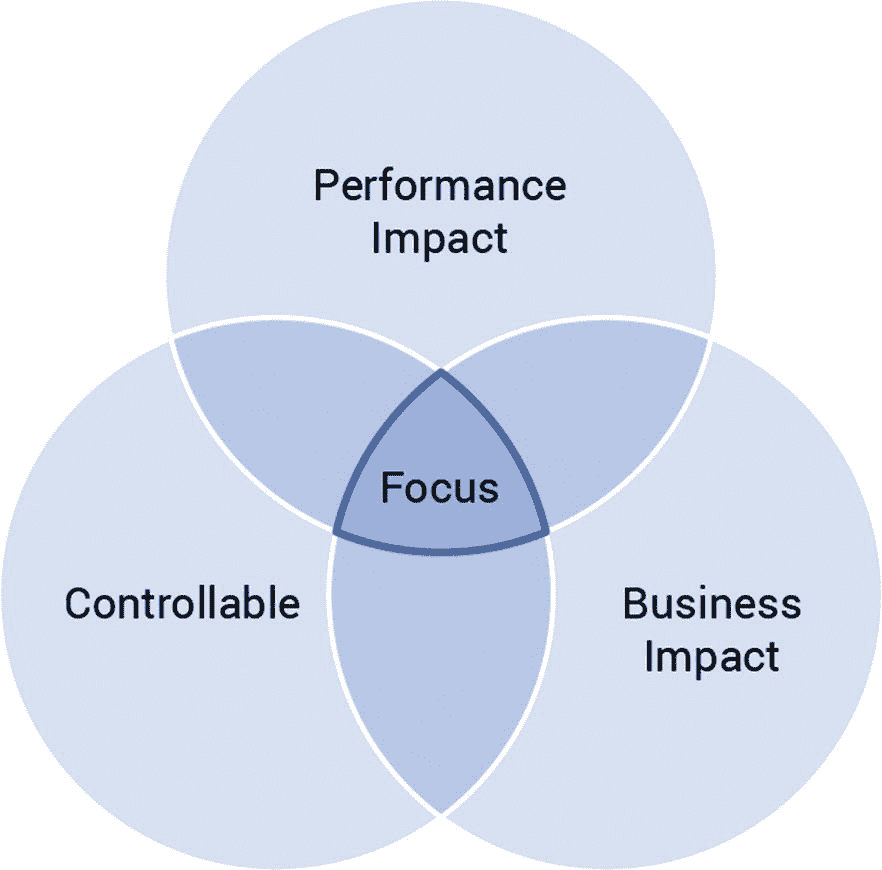

# 11. 管理操作

管理操作和性能从性能的角度看待管理操作备份压缩总结

数据库的自动化管理操作旨在在幕后保持事物的紧凑和整洁，但需要一定的监督。数据库不了解你的业务，可能会非常天真地决定在实际上是一个性能关键的时间执行资源密集型的管理操作。最后一章详细介绍了常见的管理操作通常如何影响性能。它涵盖了代表性影响的本性和严重性，并提供了一些关于如何减轻这些影响的建议。

## 管理操作和性能

你可能会看到“零影响”管理操作的承诺，但请记住，物理定律意味着这是不可能的。执行任何操作都会消耗资源。当你以极端的速度和规模运行时，这些操作可能会引入加剧的影响。对于需要以亚毫秒或个位数毫秒 P99 延迟运行的用例，背景任务对性能的影响是显而易见的。对于延迟敏感的用例，在其执行过程中绝对不能有任何系统争用。即使最终会提高数据库性能的管理操作，在执行过程中也可能会在一定程度上损害性能。你越了解它们对你特定工作负载的影响程度，你就能越有效地制定策略来最小化干扰。

关于需要哪些管理操作的低级细节会因数据库而异，并且会随时间变化；这超出了本书的范围。本章重点介绍管理操作如何最终削弱你为优化数据库性能所做的其他工作——以及如何避免这种情况。它首先提出一个快速规则，以确定你的重点。然后，备份和压缩的例子将展示管理操作对性能的潜在重大影响——这些影响也是高度可变的。

## 从性能的角度看待管理操作

每个管理操作，从备份到数据迁移，再到增加和减少容量，都会消耗本可以用于你工作负载的资源。管理操作的影响将在数据库和工作负载之间有所不同。更重要的是，对一个公司导致收入损失的影响，对另一个公司可能是完全可接受的。

从性能的角度来看，你应该关注哪些管理操作？如图 11-1 所示，针对正在执行的所有管理操作，考虑三个关键因素。

性能优化关注点的维恩图。它有三个圆圈，分别表示性能影响、业务影响和可控性。三个圆圈的交汇处是关注的焦点。

图 11-1

一个关于在哪里集中你的管理相关性能优化的快速规则

1.  这种影响对你当前或预测的规模的具体工作负载有多大？

1.  这种影响对你的业务有多重要？

1.  你能控制到什么程度？

如果你的场景中没有明显的性能影响，那么第二个和第三个问题实际上并不重要。如果存在重大且业务关键的影响，但你无法控制它，你将处于一个艰难的位置，决定是接受它还是考虑迁移到另一个数据库。如果一切顺利，你*可以*控制一些既具有影响力和业务关键性的东西，那将是一个值得关注的绝佳位置。

例如，考虑 PostgreSQL 的自动清理功能。截至本文撰写时，自动清理在指定的比例因子/阈值超过时被触发。这很可能会与表上的高活动量相吻合——这很可能不是你希望后台管理任务启动的时候。反复清理一些表而让其他表处于饥饿状态是常见的，试图强迫自动清理击中饥饿表的用户很容易将系统推向极限。这对业务的影响可能有多大？对于任何性能敏感的使用场景，可能相当高。你能控制到什么程度？相当好。例如，你可以在全局和表级别调整自动清理设置，以及应用补充自动清理的额外计划性清理作业等策略。这里的底线是，这是一个很好的性能优化机会。

另一方面，如果你使用的是如 DynamoDB 这样的托管数据库即服务（DBaaS），数据清理等管理操作可能很大程度上超出了你的可见性和控制范围。询问你的供应商他们愿意透露关于管理操作是什么、何时以及如何执行的信息当然不会有害。即使你发现管理操作以对你来说有意义的方式损害了性能，你可能无法控制它——但至少你可以更好地为它做准备，并在它发生时诊断性能打击。

在可能对性能产生负面影响的管理操作中，一些最常见的嫌疑人是：

+   **节点恢复**：这涉及到现有的副本通过流式传输数据来恢复丢失的副本。现有的副本需要读取恢复副本所需的所有数据，并通过网络传输其结果。

+   **增加/减少容量**：这通常需要整个集群或区域重新平衡数据。增加容量意味着数据将从其他副本流到新的副本，而减少容量则意味着被移除的节点将数据流出到现有的副本。

+   **数据迁移**：迁移通常会影响源集群的延迟。由于数据迁移通常不涉及停机时间，因此需要在速度和服务稳定性之间取得平衡，以避免影响现有的生产工作负载。

+   **数据库升级**：尽管升级的结果很可能会提高性能，但请记住，重启数据库实例会导致缓存变冷。这可能会影响读取延迟，如果相关用例对缓存依赖性很高的话。

+   **日志和跟踪**：当你试图理解特定的模式或影响时，日志和跟踪将非常重要。数据库为许多日志组件提供了多个详细程度级别，以及启用针对查询计划的跟踪点的功能。然而，启用日志和跟踪应谨慎进行，因为它们可能成为资源密集型操作。

+   **数据同步**：最终一致性的数据库不保证你寻找的所有数据将立即在所有自然副本中可用。因此，通常需要一个后台进程来同步数据。这通常涉及每个副本读取其现有数据，将其与对等数据比较，并应用任何相关更改。

影响各种数据库性能的两种最常见操作是备份和压缩。让我们更深入地看看这两个方面。

## 备份

备份——任何数据库的常见维护程序——可能会非常消耗资源。例如，考虑一种需要数据去重（deduplication）的备份策略。由于数据库中的数据经常被写入或覆盖，备份可能需要消耗多个 CPU 周期和磁盘 I/O 来读取，以便比较要备份的数据是否已经被保存。然后，当它找到必须保留的新数据时，它最终会将数据（这也涉及到发出底层的 I/O 读取）上传到安全位置。随着该过程在多个节点上重复，其并行性通常会导致延迟增加，特别是对于严重依赖磁盘 I/O 来获取信息的用例。

### 影响

影响备份性能的因素包括：

+   **数据集大小和复制因子**：你备份的数据越多，运行备份所需的时间就越长。根据磁盘上存储的文件数量，备份可能需要大量的读取 I/O 来扫描所有必需的数据库 blob。

+   **范围**：你是否一直在备份所有磁盘上的数据文件（完全备份）？一个特定的集群？系统范围内的快照？增量备份？一个定义良好的备份策略和范围将有助于你减轻影响。

+   **频率**：频繁的小型备份会导致更恒定的低级别痛苦；不那么频繁但更大的备份会导致更尖锐的痛苦，但这种痛苦发生的频率较低。

+   **带宽限制**：压缩或分散备份压力的选项有助于团队在低峰时段（如果有的话）尽可能快地完成备份，或者在稳定的工作负载期间尽可能不引人注目地运行备份。

+   **调度选项**：能够精确控制备份发生的时间，使得具有峰值工作负载的团队能够在可能的峰值期间避免备份。

+   **数据压缩**：更高的压缩率可以节省存储空间，但备份运行时 CPU 使用量的增加是一个代价。

+   **并行性**：你并行备份的节点越多，完成速度越快——但这也可能耗尽磁盘 I/O 容量以及你的持续工作负载。

+   **存储介质**：从本地 SSD 读取的速度明显快于常规磁盘。因此，如果你的数据库依赖于慢速访问的存储设备，备份耗尽可用读取容量的可能性就更大。

### 优化

在开始调整任何选项之前，考虑这两个关键问题：

+   你的业务对数据丢失的容忍度是多少？

+   根据你的工作负载，哪种类型的备份最有意义？

例如，如果你正在开发一个食品配送应用，在周五午餐高峰期中启动的大型备份可能会导致业务损失。通过在可预测的停机时间（例如，非常早的早晨）运行定期备份，当有资源可用时，可以减轻这种痛苦。

但其他业务没有可预测的停机时间。例如，考虑一个为救护车提供位置跟踪服务的应用程序——这是一个可能在没有预警的情况下随时发生灾难性事件并带来急剧增长的用例。在这种情况下，许多小型且频繁的备份可能是最好的策略。这样，无论不可预测的需求何时上升，备份都不太可能对数据库性能产生重大影响。

与你的团队合作，了解你需要多少备份覆盖范围以及你愿意接受哪种类型的备份痛苦，然后相应地调整你的选项。

注意

维修是一个完全不同的过程，但它们有相似的影响。最终一致性的数据库需要确保副本（最终）都拥有适当的更新。在 Cassandra 和类似 Cassandra 的数据库中，这个过程被称为*修复*。当修复运行时，可能会造成延迟的峰值。最小化其性能影响的关键取决于你的工作负载。如果你的数据库在某个时间点是可预测的空闲状态，那么就运行修复——以高并行度和强度。如果你的用例可以承受轻微的延迟峰值，你可以尝试限制修复的强度和并行度。但是，如果你无法承受*任何*延迟峰值（例如，必须提供全天候亚毫秒级 P9999 延迟的实时竞标用例），那么最好的办法是将操作限制在尽可能慢的速度下运行。

## 压缩

如第二章所述，并在附录 A 中有更详细的介绍，基于 LSM 的数据库使用 *压缩*——一个重写表以删除已删除条目并重新组织数据的过程，以实现更快、更高效的读写。从 CPU、内存和磁盘 I/O 的角度来看，压缩操作成本很高.^(1)

您可以控制的压缩程度在不同数据库之间差异很大。例如，在 Bigtable 中，所有操作都是自动完成的。然而，Couchbase、HBase、Cassandra 和 ScyllaDB 等数据库允许您从各种压缩策略中进行选择，其中许多策略都有额外的选项，您可以使用这些选项来微调压缩的执行方式，以及影响压缩性能的其他设置（例如，速率限制）。

### 影响

压缩对性能的影响在不同数据库之间差异很大。影响压缩速度的一个基本因素是数据库是否在每个分片/CPU 上并发执行主要压缩，或者压缩被绑定到单个线程。如图 11-2 所示，基准测试发现，在 i3.4xlarge 机器上，RF=1 时对 1TB 数据进行主要压缩所需的时间可以相差近 60 倍。

数据库上压缩与时间对比的条形图。所需时间最短的是 Scylla 4 dot 4 dot 3 的 36 分钟，最长的是 Cassandra 4 dot 0 dot 0 的 37 小时 56 分钟。

图 11-2

在类似数据库上执行压缩所需时间的范围很广——从 36 分钟到 37 小时 56 分钟

影响压缩影响的其他因素包括：

+   **压缩积压**：由于压缩数据是一个始终在后台运行的过程，因此需要压缩的数据量通过其不断增长的积压来表示。如果压缩落后，它最终会试图赶上，以防止数据库资源耗尽并最小化读取放大。不断增长的压缩积压表明集群规模不合适，所涉及的使用案例正在使用不适当的压缩策略，或者数据库设置中的进程被过度限制。

+   **不合理的压缩策略选择**：以写为主的负载与以读为主的负载不同，它们与以更新和删除为主的负载也不同。理解每种压缩策略背后的概念以及它如何影响您的负载，对于避免读取放大、写入放大或空间放大非常重要。

+   **压缩吞吐量**：在您的用例严重依赖于从冷数据读取的情况下，过于激进的压缩吞吐量最终会窃取一些您工作负载所需的重要 IOPS 和带宽。尝试不同的速率限制值，并密切关注您的压缩积压，直到找到您的最佳点。

效率低下的压缩策略可能会根据其不效率的程度以不同的方式影响工作负载。例如，写密集型的工作负载通常会希望防止压缩过于激进地运行；否则，它可能会耗尽现有的磁盘带宽容量，并最终降低数据库的写入路径。另一方面，读密集型的工作负载可能会希望压缩运行得更激进，因为压缩实际上可以通过要求数据库发出更少的底层存储磁盘 I/O 操作来改善读延迟。时间序列用例通常会倾向于将数据分离到不同的桶中，以便最终可以有效地执行驱逐。等等，等等。

### 优化

在选择压缩策略时，请记住，最终目标应该是低放大。您想避免：

+   读放大（需要查找多个文件以查找相关数据的读请求）

+   过多的临时磁盘空间，需要磁盘比数据完美压缩后的表示更大（空间放大）

+   反复压缩相同的数据（写放大）

+   磁盘上剩余的已覆盖/删除/过期的数据，会减慢你的读取路径

由于并非每个人都使用执行压缩的数据库，因此本章不会深入探讨特定策略的优缺点。表 11-1 提供了不同工作负载中哪种压缩策略 *通常* 工作得最好的概述（你的结果可能会有所不同）。

表 11-1

比较压缩策略

|   | Size-Tiered | Leveled | Incremental | Time Window | Comments |
| --- | --- | --- | --- | --- | --- |
| **只写** |  一个勾选标记的图标。 |  一个叉号标记的图标。 |  一个勾选标记的图标。 |  一个叉号标记的图标。 | 当使用只写工作负载的分层大小时，它将使用大约 2 倍的峰值空间。使用增量时，大小放大要小得多。当使用只写工作负载的分层压缩时，您将经历高写放大。 |
| **覆盖** |  一个勾选标记的图标。 |  一个叉号标记的图标。 |  一个勾选标记的图标。 |  一个叉号标记的图标。 | 当使用按大小分层的或增量与覆盖工作负载时，会发生大小放大。当使用分层压缩与覆盖工作负载时，会发生写放大。 |
| **读多写少，更新稀疏** |  一个叉号标记的图标。 |  一个勾选标记的图标。 |  一个叉号标记的图标。 |  一个叉号标记的图标。 | 当使用按大小分层的与读多写少且更新稀疏的工作负载时，会发生大小放大和读取放大。 |
| **读多写少，更新频繁** |  一个勾选标记的图标。 |  一个叉号标记的图标。 |  一个勾选标记的图标。 |  一个叉号标记的图标。 | 当使用分层与读多写少且更新频繁的工作负载时，会发生过度的写放大。 |
| **时间序列** |  一个叉号标记的图标。 |  一个叉号标记的图标。 |  一个叉号标记的图标。 |  一个勾选标记的图标。 | 当使用按大小分层的或增量与时间序列工作负载时，会发生大小放大、读取放大和写放大。当使用分层与时间序列工作负载时，会发生大小放大和写放大。 |

两个关键要点应该是：1) 没有一种大小适合所有人，所以在管理事项上有选择权是很好的；2) 权衡是不可避免的——了解你能最好容忍的痛苦，然后选择你的毒药。

为了使这个观点更加明确，这里有一个现实世界的例子。曾经，一位新的 ScyllaDB 用户报告了高读延迟。用例是一个带有 TTL 的时间序列，用于支持实时媒体流。时间序列用例严重依赖于在特定时间范围内获取数据，并期望这些查找足够快，可以由数据库提供。因此，时间序列用例通常依赖于时间分桶的压缩策略，该策略确保相关数据在相同的时间窗口内一起压缩，以避免数据库需要扫描多个文件来检索数据。然而，如果配置不当，该策略可能会适得其反，并引发严重的性能问题。

在这个特定的情况下，我们发现他们的时间桶对于他们经常作为单个查询一部分频繁检索的数据量来说太小了。例如，如果您决定每十分钟对数据进行一次时间分桶，但总是想检索十小时的数据，那么这将要求数据库扫描 60 个桶（每小时 6 个桶 * 10 小时）！在适当的并发量下，每个查询扫描这些大量数据都可能导致底层磁盘 I/O 容量不足。因此，解决方案是更新压缩配置，以反映符合用例要求的数据分组。

最后，关于调整压缩策略以提高性能的注意事项：记住，当您调整压缩策略时，您的数据库将需要重写所有表数据。这将产生重大的性能惩罚，并且应该仔细计划在最适合您业务的时间进行。

## 摘要

管理操作，如修复、压缩和备份，是运行健康、性能良好的数据库不可避免的一部分。不存在“零影响”的管理操作；执行任何操作都会消耗资源，如果您的操作规模极大，这些操作可能会产生加剧的影响。本章通过备份和压缩的例子展示了管理操作对性能可能产生的重要影响——这些影响也是高度可变的。

这是本书的最后一章——基于我们与广泛数据库用户和数据库合作的经验，对提高数据库性能提出的具有高度意见的建议的终结。尽管如此，优化数据库性能的选项远未结束。一些可能的下一步行动：

+   标记出似乎对您的特定工作负载和用例具有潜在价值的考虑事项/建议，然后与您的团队讨论。

+   重新审视您数据库的具体选项（例如，用于监控、驱动程序、管理等），看看是否需要重新考虑您之前的任何决定。

+   与您的数据库供应商和/或社区联系，了解与性能相关的工程决策和优化，这些可能提供未开发的机会（或导致您当前的一些限制）。

+   考虑一下您的数据建模可能需要调整或彻底改造（监控可以帮助您评估这一点）。如果是这样，我们推荐 Pramod J. Sadalge 和 Martin Fowler 的《NoSQL Distilled》——假设您正在使用 NoSQL。如果不是，请浏览关于 RDBMS 数据建模的丰富资源。

+   继续深入了解在构建任何分布式数据库时做出的基本数据库设计决策：复制和分片策略、共识算法、数据结构（B 树与 LSM 树）等。您可以在附录 A 中找到这些主题的性能介绍，以及从大师那里学习更多建议。

](https://creativecommons.org/licenses/by/4.0)

**开放获取** 本章节根据 Creative Commons Attribution 4.0 国际许可协议（[`creativecommons.org/licenses/by/4.0/`](http://creativecommons.org/licenses/by/4.0/)）许可，允许在任何媒介或格式中使用、分享、改编、分发和复制，只要您适当引用原始作者和来源，提供 Creative Commons 许可的链接，并指出是否进行了更改。

本章中的图像或其他第三方材料均包含在章节的 Creative Commons 许可协议中，除非在材料引用行中另有说明。如果材料未包含在章节的 Creative Commons 许可协议中，且您的使用未获得法定规定的许可或超出了允许的使用范围，您将需要直接从版权持有人处获得许可。
