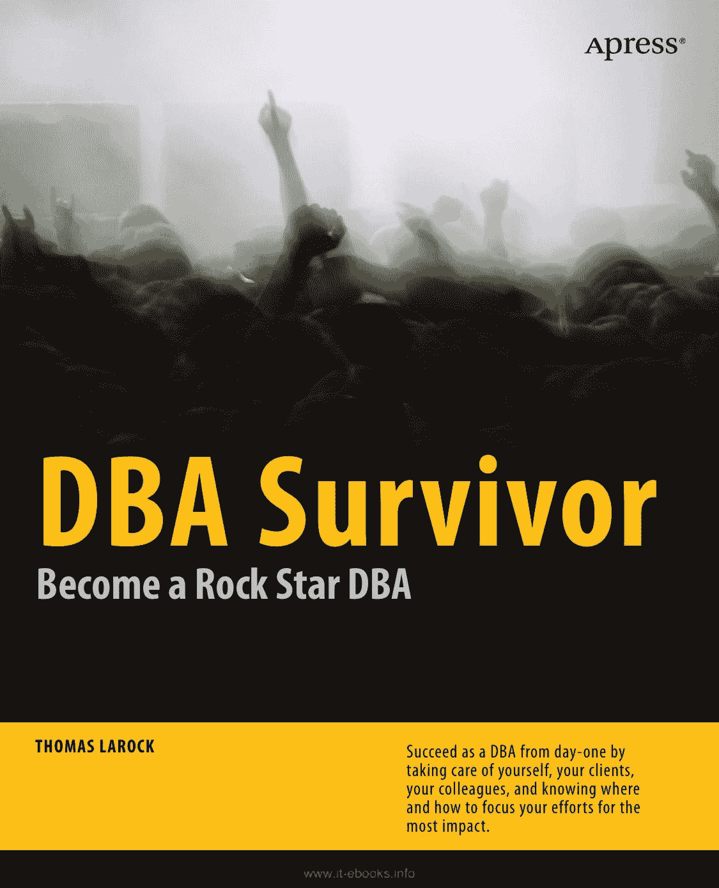

青色
黄色
品红
黑色
PANTONE 123 C

eB Companion
ook a
专业人士撰写的专业书籍
vailable
**DBA S**
DBA 存活手册：
成为摇滚明星般的 DBA
ur
**viv**

## 亲爱的读者，

我撰写本书旨在帮助你成为一名成功的数据库管理员。数据库管理是一份艰难且疯狂的工作。我通过亲身经历艰难地学到了这一点，并时常希望能有一本书来帮助我掌握成功所需的一切知识。我梦想着有一本书能告诉我第一天该做什么、如何组织自己、应将精力聚焦于何处、向谁寻求帮助，以及如何不仅妥善照顾我的**服务器，同时也要照顾好自己。**

Become a R
我梦想的那本书并不存在，于是我决定自己动手创作一本。你手中拿着的便是最终成果。阅读本书，你将学到：

-   在你入职的头 100 天里，应将精力投入何处
-   需要熟悉的技术基础，例如 `RAID`
-   如何有效地与同事建立并维护关系
-   如何建立一个流程以提供高质量的生产支持
-   如何最佳地与他人联系、学习和分享

ock S
我讲解了你第一天该做什么。我涵盖了你的角色基础以及你将如何与他人互动。我提供了一些基本故障排除的指导原则，对开发者为何需求多多提供了一些理解，并帮助你指明了获取进一步培训的正确方向。

tar DBA
最终，我希望你明白没有哪个 DBA 是一座孤岛；如果你想在数据库管理领域拥有成功的职业生涯，那么你将不时需要他人的帮助。本书是你可获取的第一份帮助。

DBA 存活手册

Thomas LaRock
数据库管理经理与 DBA 存活者

**源代码在线**

`www.apress.com`

配套电子书

US $39.99

ISBN 978-1-4302-2787-8

THOMAS LAROCK

5 39 9 9

从第一天起就作为一名 DBA 取得成功，方法是通过照顾好你自己、你的客户、你的同事，并知晓应于何处以及如何聚焦精力以取得最大影响。

Shelve in:
Databases

用户级别：
All

随附价值$10 的电子书版本
详情见最后一页

9 781430 227878

[www.it-ebooks.info](http://www.it-ebooks.info)

**此印刷版仅用于展示内容——尺寸与颜色不准确**
**7.5 x 9.25 书脊 = 0.53125" 188 页计数，360ppi**

[www.it-ebooks.info](http://www.it-ebooks.info)

**DBA 存活手册**
**成为摇滚明星 DBA**

■ ■ ■

Thomas LaRock

i

[www.it-ebooks.info](http://www.it-ebooks.info)

## 版权信息

**DBA 存活手册：成为摇滚明星 DBA**

版权所有 © 2010 Thomas LaRock

保留所有权利。未经版权所有者及出版商事先书面许可，不得以任何形式或任何方式（包括影印、录音或任何信息存储和检索系统）复制或传播本作品的任何部分。

ISBN-13 (平装): 978-1-4302-2787-8
ISBN-13 (电子): 978-1-4302-2788-5

印刷与装订于美国 9 8 7 6 5 4 3 2 1

本书中可能出现商标名称。我们仅在编辑性质上并以有利于商标所有者的方式使用这些名称，无意侵犯商标，而非每次出现商标名称时都使用商标符号。

总裁兼出版人：Paul Manning
主编：Jonathan Gennick
技术评审：Sylvester Carstarphen, Darl Kuhn, Michele LaRock, Brent Ozar, Michael Russo, Ken Simmons, Jared Still
编辑委员会：Clay Andres, Steve Anglin, Mark Beckner, Ewan Buckingham, Tony Campbell, Gary Cornell, Jonathan Gennick, Jonathan Hassell, Michelle Lowman, Matthew Moodie, Jeffrey Pepper, Frank Pohlmann, Ben Renow-Clarke, Dominic Shakeshaft, Matt Wade, Tom Welsh
协调编辑：Laurin Becker
文字编辑：Damon Larson, Katie Stence
排版：MacPS, LLC
索引：John Collin
美术：April Milne

本书在全球范围内由**Springer-Verlag New York, Inc.** 发行，地址：233 Spring Street, 6th Floor, New York, NY 10013。电话：1-800-SPRINGER，传真：201-348-4505，电子邮箱：`orders-ny@springer-sbm.com`，或访问：`www.springeronline.com`。

有关翻译信息，请发送电子邮件至 `rights@apress.com`，或访问 `www.apress.com`。

**Apress** 和 **friends of ED** 的图书可批量购买用于学术、企业或推广用途。大多数图书也提供电子书版本和许可。更多信息，请参考我们的“批量销售–电子书许可”网页：`www.apress.com/info/bulksales`。

本书信息按“原样”提供，不作任何担保。尽管在本书编写过程中已采取一切预防措施，但作者和 **Apress** 对因本书所含信息直接或间接引起或据称引起的任何损失或损害，不向任何人或实体承担任何责任。

`www.it-ebooks.info`

*献给苏珊娜、伊莎贝尔和艾略特。感谢你们与我分享生命旅程。*

`www.it-ebooks.info`

## 章节概览

-   **章节概览**....................................................................................... iv
-   **目录**.......................................................................................................... v
-   **前言**......................................................................................................... x
-   **关于作者**........................................................................................... xii
-   **关于技术审校者**.................................................................... xiii
-   **致谢**......................................................................................... xiv
-   **引言**.................................................................................................... xv
-   **第 1 章：我是如何走到这里的？**....................................................................... 1
-   **第 2 章：现在我该做什么？**....................................................................... 13
-   **第 3 章：一些基础知识**................................................................................ 35
-   **第 4 章：对开发者而言，开发服务器就是生产服务器**.............................................................................. 63
-   **第 5 章：生产支持**...................................................................... 81
-   **第 6 章：基础故障排除**................................................................. 95
-   **第 7 章：自助餐在哪里？**.................................................................... 117
-   **第 8 章：培训，来参加吧**.................................................. 131
-   **第 9 章：连接。学习。分享**................................................................ 145
-   **第 10 章：总结**.................................................................................. 159
-   **索引**............................................................................................................ 163

`www.it-ebooks.info`

## 目录

-   **章节概览**....................................................................................... iv
-   **目录**.......................................................................................................... v
-   **前言**......................................................................................................... x
-   **关于作者**........................................................................................... xii
-   **关于技术审校者**.................................................................... xiii
-   **致谢**......................................................................................... xiv
-   **引言**.................................................................................................... xv

## 第 1 章：我是如何走到这里的？....................................................................... 1

### 我的旅程..................................................................................................................... ........................................1

### 早期教训.................................................................................................................. ...................................2

### 早期职业生涯................................................................................................................... ....................................3

### 运气、准备与机会............................................................................................. ......................4

### 社区...................................................................................................................... ...................................5

### 其他旅程................................................................................................................. .......................................5

### 药剂师..................................................................................................................... ....................................6

### 酒店经理.................................................................................................................. .................................6

### 估算主管.......................................................................................................... ..............................6

### MUMPS 程序员............................................................................................................... ..........................6

### 你的旅程................................................................................................................... ........................................7

### 做好准备................................................................................................................... ...................................8

### 接受培训.................................................................................................................... ....................................9

### 获得认证.................................................................................................................. .....................................9

