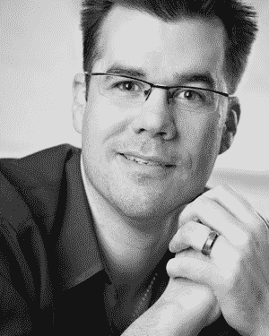

# 音乐家需要懂的远不止声学，雕塑家需要懂的也远不止地质学。从事创造性艺术的人们都是创造者，而选择 DBA 之路，你也将成为其中一员。我们可以从这些创造者身上学到极其重要的一课：他们主要通过两种方式学习。首先，创造者通过持续练习和动手实践来学习。要想真正擅长数据库管理，你也必须这样做。当你想到“发明家”的形象时，你可能会联想到一个头发凌乱、穿着白大褂、身处忙乱实验室的人。猜猜怎么着？我认识的所有优秀 DBA 确实都有一个实验室，通常被称为开发环境。那就是他们经常捣鼓、实验和测试的地方。

我将 DBA 与其他创造者相比的第二个，也是最重要的相似之处是：他们至少需要一位优秀的导师来开启职业生涯。每一位创造者的学习过程，都包括在比他们更资深的人面前学习多年，无论他们是艺术家、音乐家，还是 DBA。这正是本书发挥作用的地方。你身边可能没有资深 DBA 可以依靠以获取建议和灵感，但本书就是你的导师。正如快速回顾本书目录所揭示的，对于一位新的数据库管理员来说，许多基础课程都涉及你如何与企业 IT 环境中的其他人互动。是的，了解技术非常重要，通过阅读本书并应用其中的课程，你将学到大量技术知识。然而，你还将学习 DBA 与软件开发人员和企业经理之间的关系——哪些领域你需要谨慎，哪些领域你需要坚持己见。

当然，没有任何一本书能教你关于像 Microsoft SQL Server 数据库管理这样广阔而深远的学科所需的一切知识。因此，Tom 花费心血为你展示了第一步。他提供了进一步学习的资源、寻找导师的方法，以及——当时机成熟时——让你自己成为导师的途径。我恳请你要充分利用这本好书，并在准备好时，将你学到的经验教训回馈给 SQL Server 社区。

**Kevin Kline**

*技术策略经理，Quest Software*

*PASS（SQL Server 专业协会）创始董事会成员*

以非常“真实”的语言来说，你手中握着的这本书将帮助你理解数据库管理员的日常生活。从如何成为一名数据库管理员，到备份与恢复，当然，还有培根带来的乐趣——尽在其中。（好吧，关于最后一句话得说明一下。Thomas 很喜欢培根。非常喜欢。事实上，他认为几乎任何东西加了培根都会更好，所以你可以预料到在他写的任何书里，都会提到一两次培根。）除了培根信息，Thomas 还分享了他在数据库系统方面的现实世界经验。你将学习如何在开发团队中工作，以及不要惧怕外包。你将了解如何维护生产系统，以及如何监控所管理的系统。

Thomas 甚至解释了如何利用 SQL Server 社区来帮助你，以及你如何回馈他们。

所以，如果你有一两个晚上空闲，正在考虑成为一名 DBA，欢迎加入。你将有一段美好的体验。

**Buck Woody**

*高级技术专家，Microsoft*

xi

[www.it-ebooks.info](http://www.it-ebooks.info)

### 关于作者

**Thomas LaRock** 是一位经验丰富的 IT 专业人士，拥有超过十年的技术和管理经验。目前担任一家金融服务公司的数据库管理经理，Thomas 的职业生涯历经多个职位，包括程序员、分析师和 DBA。在成为 DBA 之前，他曾在美国和海外的客户现场就职于多家软件和咨询公司。Thomas 拥有华盛顿州立大学数学硕士学位，是 Quest Software 的 SQL Server 专家协会成员，目前服务于 SQL Server 专业协会 (PASS) 的董事会，并且是 SQL Server MVP。

xii

[www.it-ebooks.info](http://www.it-ebooks.info)

### 关于技术审阅者

**Sylvester Carstarphen** 是一家领先汽车 CRM 公司的在职 DBA 经理，他热衷于培养团队的软技能和 DBA 技能。Sylvester 担任 DBA 已有 6 年以上，拥有强大的性能调优技能。他也是 Apress 出版的《Pro SQL Server 2008 Administration》的合著者。

**Darl Kuhn** 自 1992 年起一直担任 Oracle DBA。在过去的 14 年里，他一直是 Rocky Mountain Oracle Users Group 的志愿 DBA。Darl 还在 Regis 大学计算机信息技术系教授 Oracle 课程。

**Michele LaRock** MS RD LDN 是一位注册营养师，拥有西雅图 Bastyr 大学的硕士学位。在不为她的兄弟提供关于 Turbaconduckens 的营养建议时，她会为其他人（包括她的丈夫和两个孩子）提供整体营养咨询。

**Brent Ozar** 是 Microsoft MVP 和 Quest Software 的 SQL Server 专家。他拥有超过十年的广泛 IT 经验，从事 SQL Server 数据库管理、系统管理、SAN 管理、虚拟化管理和项目管理。他曾在全球范围内为 PASS、SQLBits、SSWUG 和其他组织举办的活动发表演讲。Brent 为 SQL Server 专业协会 (PASS) 创立了虚拟化虚拟分会，并担任 SQLServerPedia.com 的主编。

**Michael Russo** 是新罕布什尔大学的前学生运动训练师，也是 Thomas LaRock 的经常慢跑伙伴。当不在午餐时间拖着 Tom 穿过街道或去跑道时，他经常提醒 Tom 注意良好的营养选择，并且不止一次从 Tom 手中打掉过甜甜圈。

**Ken Simmons** 是一位数据库管理员、开发人员和 Microsoft SQL Server MVP。他是《Pro SQL Server 2008 Administration》（Apress，2009）、《Pro SQL Server 2008 Mirroring》（Apress，2009）和《Pro SQL Server 2008 Policy-Based Management》（Apress，2010）的作者。他自 2000 年起在 IT 行业工作，目前拥有 MCP、MCAD、MCSD、MCDBA 以及 SQL 2005 的 MCTS 认证。

**Jared Still**，持证 Oracle DBA 和兼职 Perl 传播者，担任 DBA 已有好几年了，但他努力不让这种根深蒂固的身份阻碍他的进步，通过持续学习数据库和计算机系统的一般知识来提升自己。是的，他确实是一位兼职 Perl 传播者。

xiii

[www.it-ebooks.info](http://www.it-ebooks.info)

### 致谢

很多人帮助我完成了这本书。这些页面中所包含的文字代表了我过去十年的旅程。但在此之前，也有很多影响。

致我的妻子 Suzanne，感谢你的爱和耐心。

致我的孩子们，Isabelle 和 Elliot，感谢你们总能找到办法让我微笑。

致我的父母，感谢你们所做的一切。

致 Chris 和 Sally，感谢你们帮助我走上了我的道路。

致 Vinny 和 Craig，感谢你们相信我能成为一名 DBA。

致 Frank，感谢你帮助我理解成为一名 DBA 意味着什么。

致 Lori、Sean、Joe、Andre 和 Pankaj，感谢你们成为如此出色的团队。

致我的技术编辑们，感谢你们审阅我的文字并帮助我保持正轨。

致我的编辑 Jonathan，感谢你相信这本书。

xiv

[www.it-ebooks.info](http://www.it-ebooks.info)

### 引言

