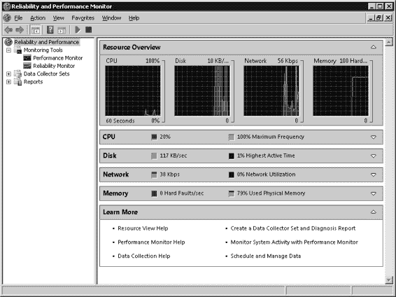
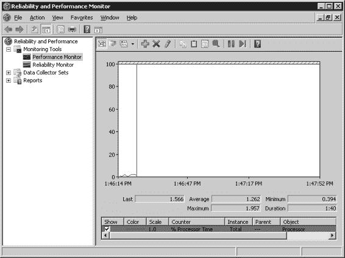
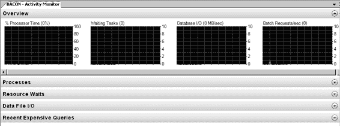

# 第 6 章：基础故障排除

CPU 峰值通常是由变得更糟的查询计划所导致。但也可能源于其他原因，也许是您的硬件不再足够，或者最近的配置更改导致了 CPU 峰值。您通常会在问题开始*之后*，而不是之前，被要求去调查 CPU 峰值。因此，您需要找到方法来确定导致 CPU 峰值的特定活动。我们将在下一节探讨其中一些方法。

另外需要记住的一点是，查询计划可能因多种原因而发生变化。

计划发生变化的主要原因之一是底层数据的改变。我经常看到 CPU 性能问题是由数据插入、更新和删除导致的不良计划引起的。困难之处在于如何判断一个计划是否已经变坏。除了 CPU 峰值之外，判断计划是否变坏的唯一方法是了解原始（或良好）计划的样子。

如果您没有良好计划的副本，那么简单地断言您的查询计划已经变坏是不正确的假设。即使您查看计划，看到的全是表扫描和哈希匹配，除非有可比较的对象，否则您仍然不能断言计划“变坏了”。因此，在匆忙做出任何判断之前，请记住这一点。专注于事实，尽力隔离那些消耗 CPU 最多的查询，然后再从那里入手。

## 可用工具

SQL Server 附带了多种工具，可用于快速诊断和解决性能问题。除了这些工具外，Windows 操作系统也提供了一些工具，在追踪性能问题的根本原因时会很有用。下面我列出了您可用的一些工具。我也尝试以帮助您理解每个工具如何用于排查与磁盘 I/O、内存和 CPU 相关问题的方式对它们进行了分类。

### 可靠性和性能监视器

Windows Server 2008 引入了可靠性和性能监视器。这是先前被称为性能监视器（或简称 `perfmon`）的最新版本。

事实上，如果您在 Win2008 服务器上运行命令 `perfmon`，它将启动新版本。

图 6–1 显示了运行 `perfmon` 命令后立即显示的资源概述。您可以点击显示的任意一个图表，它会展开下方相应的菜单。在窗口的左上方，您会看到监控工具下列出了两个选项。一个是性能监视器，任何过去使用过 `perfmon` 的人都会熟悉。另一个是较新的可靠性监视器，您可以用它来检查服务器稳定性的详细信息。

**图 6–1.** *新的可靠性和性能监视器*

资源概述允许您快速深入了解有关磁盘 I/O、内存和 CPU 使用率的详细信息。如果您想了解更详细的信息，或者您使用的是早期版本的 Windows Server，那么您需要使用性能监视器来收集当前服务器活动的信息。点击左上角的性能监视器名称后，您将看到类似图 6–2 所示的内容。

请注意，在 Win2008 中，唯一选中的计数器是 `% Processor Time`。在早期版本的性能监视器中，默认会选中多个计数器（`Avg. Disk Queue Length` 和 `Pages/Sec`）。导航到此屏幕后，您需要添加新的计数器以获取每个潜在瓶颈的详细信息。

如果您想了解下面提到的任何计数器的更多详细信息，可以查阅联机丛书条目，或者访问 [`msdn.microsoft.com/en-us/library/ms191246`](http://msdn.microsoft.com/en-us/library/ms191246) 以获取有关哪些值被认为是良好、不良或一般的更多信息。

**图 6–2.** *性能监视器中的 CPU 利用率*

## 磁盘 I/O

我之前提到过 SQL 如何在磁盘和内存之间交换数据，以及您的数据库服务器上数据文件、日志文件和 tempdb 活动同时发生时会产生大量 I/O 活动。虽然 SQL 管理活动的发生方式，但实际执行工作的是 Windows 操作系统，这就是为什么使用性能计数器是了解服务器上究竟发生了什么的好方法。

### SQLServer:PhysicalDisk

最有用的两个对象是 `SQLServer:PhysicalDisk` 和 `SQLServer:Buffer Manager`。以下是需要关注的物理磁盘计数器：

*   `% Disk Time`
*   `Avg. Disk Queue Length`
*   `Avg. Disk sec/Read`
*   `Avg. Disk sec/Write`
*   `Avg. Disk Reads/sec`
*   `Avg. Disk Writes/sec`

这里需要注意的一点是，平均而言，您的队列长度*每个磁盘*不应超过一或二。因此，如果您有一个由七个磁盘组成的 RAID 条带集，并且您看到平均磁盘队列长度为八，那么您仍然处于可接受的工作范围内。

### SQLServer:Buffer Manager

有两个缓冲区管理器计数器需要关注，如下所示：

*   `Page Reads/sec`
*   `Page Writes/sec`

### 内存

关于内存压力，有一些可用的计数器可供您检查。如果您回想一下，我曾谈到 SQL 如何使用缓冲区缓存在将数据换出到磁盘之前将数据页存储在内存中。因此，您会想检查的一些计数器位于 `SQLServer:Buffer Manager` 对象中就不足为奇了，它们如下：

*   `Buffer cache hit ratio`
*   `Page life expectancy`
*   `Checkpoint pages/sec`
*   `Lazy writes/sec`
*   `Total Pages`

值得一提的是：由于 SQL 在磁盘和内存之间交换数据的性质，内存压力和 I/O 瓶颈通常是相关的。

与内存相关的其他计数器可以在 `SQLServer:Memory manager` 对象中找到，它们如下：

*   `Available Bytes`
*   `Pages/sec`
*   `Total Server Memory (KB)`

### CPU

我提到过变坏的查询计划会导致 CPU 峰值。重新编译是导致您的 CPU 使用率突然激增的另一种方式。您需要添加的计数器可以在 `SQLServer:SQL Statistics` 对象中找到，如下所示：

*   `Batch Requests/sec`
*   `SQL Compilations/sec`
*   `SQL Recompilations/sec`

重新编译的次数应该很低，并且重新编译次数与实际批处理请求的比率应该非常低。如果这些值很高，那么您可能会看到 CPU 峰值，或者您可能存在大量的即席查询。

CPU 峰值的另一个可能原因是游标的使用。嗯，更准确地说，是游标的不当使用。游标本身不一定是一件坏事，但当设计不当或缺乏维护时，它们可能导致表现为 CPU 峰值的性能问题。对于这种情况，您要检查的计数器位于 `SQLServer:Cursor Manager by Type` 中：`Cursor Requests/sec`。

### 活动监视器

