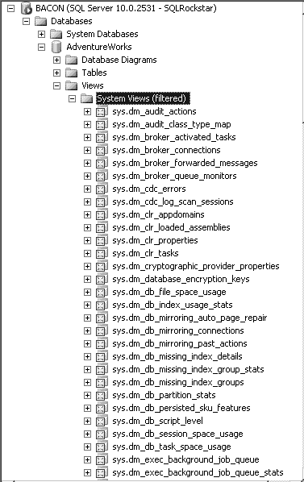

# 第六章：基本故障排查

`SQL Server 2008 Management Studio (SSMS)` 中的 `Activity Monitor`（活动监视器）相比 2005 版本已焕然一新。首先，您可以在 `SSMS` 中右键单击实例名称，然后选择“活动监视器”来访问它。该监视器显示四个图表和四行信息，帮助您了解数据库引擎当前正在运行的进程的更多详细信息。示例请参见 `图 6–3`。

显示的信息取自针对实例运行的 `Dynamic Management Views`（动态管理视图）。这意味着您看到的信息是实时的。但是，它只能追溯到实例上次启动的时间点。

## 磁盘 I/O

`Data File I/O`（数据文件 I/O）部分将返回系统和用户数据库的数据文件和日志文件的信息。您可以按 `MB/sec Read`（每秒读取 MB 数）、`MB/sec Written`（每秒写入 MB 数）和 `Response Time`（响应时间）等列进行排序和筛选。这是快速简便地查看是否存在任何特定数据文件或日志文件的磁盘 I/O 争用的方法。

[www.it-ebooks.info](http://www.it-ebooks.info)

### 内存

`Activity Monitor` 中唯一与内存相关的部分位于 `Processes section`（进程部分），其中有一个名为 `Memory Use (KB)`（内存使用量 (KB)）的列。该列仅显示特定查询正在使用的内存量。如果您遇到内存问题，那么很可能无法使用此部分来隔离某个特定查询，因为它可能是当前正在运行的所有查询的总和。

### CPU

在 `Activity Monitor` 内部有两个位置可以找到有关 CPU 使用率的相关信息。一个是在 `Resource Waits section`（资源等待部分）中，其中有一个等待类别恰当地命名为 `CPU`。然后，您可以利用该信息来筛选 `Processes tab`（进程选项卡）中的查询，以隔离当前正在等待 CPU 的进程。

另一个可以找到 CPU 使用率信息的部分是 `Recent Expensive Queries`（最近的高开销查询）。在那里，您将看到大约十到十五个最近的查询，并且可以按 `CPU (ms/sec)`（CPU（毫秒/秒））列进行排序。这尤其方便，因为您很可能在问题发生后才会被要求进行调查，因此能够查看针对实例运行的最近查询是很有价值的审查信息。

### 动态管理视图 (DMV)

`SQL 2005` 引入了 `Dynamic Management Views`（动态管理视图）和函数的使用。这些视图将返回有关您的服务器实例和数据库的信息，对于诊断性能问题非常有用。您只能通过 `TSQL` 来访问这些视图和函数，就像从表中查询一样。所有 `DMV’s` 都位于 `sys` 架构内。如果您想在 `SSMS` 中浏览它们，则需要导航到各个数据库内的系统视图，如 `图 6–4` 所示。

查询 `DMV` 所返回的信息在实例重启时会被重置。因此，任何返回的信息都只为您提供自上次重启以来的系统情况。这意味着您不能将 `DMV` 用于历史目的，除非您手动将数据收集并存储在存储库中。当然，如果您当前正遇到性能问题，那么 `DMV’s` 将为您提供有关正在发生的情况的实时视图，这可以是辅助您分析的有价值信息。

如果您想了解有关 `DMV’s` 的具体详细信息，可以在此处找到：[`msdn.microsoft.com/en-us/library/ms188754.aspx`](http://msdn.microsoft.com/en-us/library/ms188754.aspx)。以下列表展示了一些我认为对于基本故障排查最有用的 `DMV’s`，但不会深入太多细节。我鼓励您对 `DMV’s` 进行一些独立研究，因为了解它们以及它们能为您做什么的最佳方式就是开始亲身体验它们。

[www.it-ebooks.info](http://www.it-ebooks.info)

