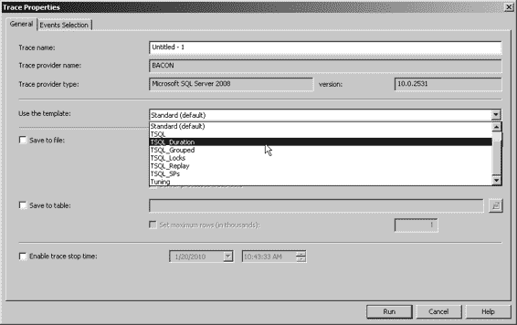
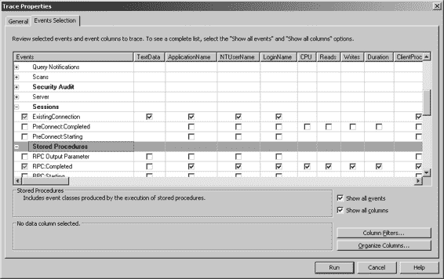

# 第 6 章：基础故障排查

## 109

可以通过使用 `perfmon` 和 `SQLServer:Wait Statistics` 对象来找到等待统计。它们也包含在 `Activity Monitor` 中，在显示的图表下方有自己专门的区域。等待统计的最佳用法在于理解*等待类型*。等待类型的列表可以在以下网址找到：[`msdn.microsoft.com/en-us/library/ms179984.aspx`](http://msdn.microsoft.com/en-us/library/ms179984.aspx)。你可以在 `sys.dm_os_wait_stats` DMV 中找到等待类型，也可以在 `Activity Monitor` 的 `Processes` 部分中找到。

**提示：** 我敢**赌上一斤培根**，你遇到的大多数等待类型都可以通过一些高级的索引调优来解决。在购买新硬件之前，先检查一些查询计划吧；这会**让你受益匪浅**。

## 磁盘 I/O

特定于磁盘 I/O 的等待类型包括：

- `ASYNC_IO_COMPLETION`
- `IO_COMPLETION`
- `IO_RETRY`
- `PAGEIOLATCH_*`
- `PAGELATCH_*`
- `WRITELOG`

如果你看到这些等待类型构成了你整体等待的绝大部分，那么你很可能需要检查你的磁盘子系统。同时请记住，有时磁盘 I/O 问题可能与内存压力有关，因此在发出任何警报之前，你需要先排除内存问题。

### 内存

特定于内存的等待类型包括：

- `CMEMTHREAD`
- `LATCH_*`
- `LCK_M_*`
- `LOWFAIL_MEMMGR_QUEUE`
- `RESOURCE_SEMAPHORE_*`
- `UTIL_PAGE_ALLOC`

如果你看到这些等待类型构成了你整体等待的绝大部分，那么你需要调查分配给你的 SQL Server 的内存量。锁和栓（latches）可能是由于内存不足导致 SQL 将数据页换出到磁盘（因为它没有足够的内存将数据存储在缓存中）的结果，同时你也可能会遇到一些磁盘 I/O 问题。

[www.it-ebooks.info](http://www.it-ebooks.info)

## 110

### 第 6 章：基础故障排查

### CPU

特定于 CPU 的等待类型包括：

- `CXPACKET`
- `EXCHANGE`
- `EXECSYNC`

专门用于帮助你隔离 CPU 峰值的等待类型非常少。我列出的这三个都与*并行性*有关，这可能发生在多个处理器上运行的查询进行同步时。本质上，如果你的查询是并行执行的，它会被拆分到多个处理器上，然后在最后需要合并回一起。这种同步可能会表现为这些等待类型。

针对这种情况的快速修复方法是重新配置查询或实例整体的 `MAXDOP` 设置。我总是建议将 `MAXDOP` 设置为物理处理器总数减一。这样可以留出一个处理器来处理请求，以防某个并行查询决定占用其余所有处理器。

### SQL Profiler

`SQL Profiler` 通过创建所谓的*跟踪*来捕获针对数据库服务器实例运行的活动。`SQL Profiler` 可以从开始菜单或在 `SQL Server Management Studio` 内部启动。启动后，你可以配置 `SQL Profiler` 运行跟踪，方法是选择各种事件类别、事件类、列并应用过滤器。你甚至可以选择使用一些默认的跟踪模板（见图 6-5）。有关 `SQL Profiler` 事件类别和类的完整列表，请访问 [`msdn.microsoft.com/en-us/library/ms175481.aspx`](http://msdn.microsoft.com/en-us/library/ms175481.aspx)。

`SQL Profiler` 的事件类别组织方式并不能让你直接 pinpoint 到磁盘 I/O、内存或 CPU 的某个特定类别。相反，你必须检查事件类别、事件类和数据列，才能获得针对每个潜在瓶颈所需的信息。可以将 `SQL Profiler` 视为一种收集针对你服务器所有活动详情的方式，但分析跟踪输出以确定瓶颈究竟在哪里，就取决于你自己了。

[www.it-ebooks.info](http://www.it-ebooks.info)

### 第 6 章：基础故障排查

## 111

**图 6–5.** *使用默认模板创建跟踪*

最有用的事件类别如下：

- `Cursors`
- `Database`
- `Errors and Warnings`
- `Locks`
- `Scans`
- `Stored Procedures`
- `TSQL`

在这些类别之内是事件类，而事件类又包含数据列。可用数据列的完整列表可以在以下网址找到：[`msdn.microsoft.com/en-us/library/ms190762.aspx`](http://msdn.microsoft.com/en-us/library/ms190762.aspx)。如果愿意，你也可以自己浏览它们。创建跟踪时，在“事件选择”选项卡上，只需勾选`显示所有事件`和`显示所有列`复选框（见图 6–6）。注意，有一个名为 `CPU` 的列，但没有名为 `Memory` 或 `disk I/O` 的列。这正是你分析的价值所在，因为你试图确定问题的性质。许多高级 DBA 会整理一个默认事件列表，用跟踪文件捕获，希望它能提供足够的信息来开始故障排查。

[www.it-ebooks.info](http://www.it-ebooks.info)

## 112

### 第 6 章：基础故障排查

**图 6–6.** *显示所有事件和所有数据列*

一个例子是捕获 `Stored Procedures` 和 `TSQL` 事件类别中分别找到的 `RPC:CompletedEvent` 和 `SP:BatchCompleted` 事件类。这些事件类将允许你包含以下数据列：

- `ApplicationName`
- `CPU`
- `Duration`
- `LoginName`
- `Reads`
- `TextData`
- `Writes`

由于此跟踪可能会产生大量结果，因此值得你花时间配置一些数据列过滤器。你可能希望考虑只返回满足 `CPU > 500`、`duration > 500`、`reads > 10,000` 和 `writes > 5000` 或其某种组合的语句结果。你可以根据需要进行调整，以获得一个可管理的结果集。

正如你可能已经猜到的，使用 `SQL Profiler` 排查性能问题比前面讨论的其他方法开销要大得多。`SQL Profiler` 本身的使用反过来也可能对正在运行的查询造成性能问题，因此在你负责的任何系统上都要谨慎使用。它在捕获信息方面确实提供了相当大的灵活性，并且当输出存储在数据库表中时，可以方便地进行过滤。用它来隔离磁盘 I/O、内存或 CPU 的问题可能开销过大；它可能无法让你得出结论，认定其中任何一个潜在瓶颈是罪魁祸首。

[www.it-ebooks.info](http://www.it-ebooks.info)

### 第 6 章：基础故障排查

## 113

**注意：** 如果你将结果存储在数据库表中，你就是在增加数据库服务器的活动量。如果你不存储结果，你就是在增加内存使用量（如果你已经有内存问题，这就不好了），并且如果你将结果保存到与数据和日志文件相同的驱动器上，还会增加磁盘 I/O。因此，请谨慎选择如何使用分析器。——Sylvester Carstarphen。

