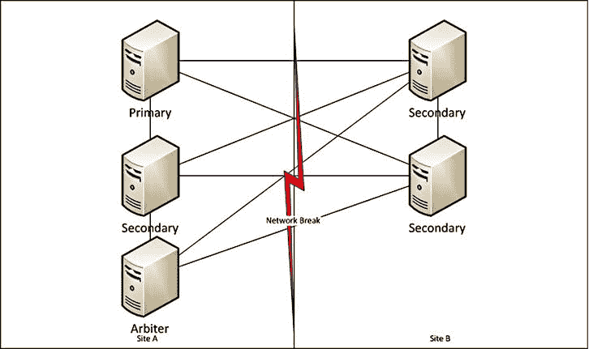
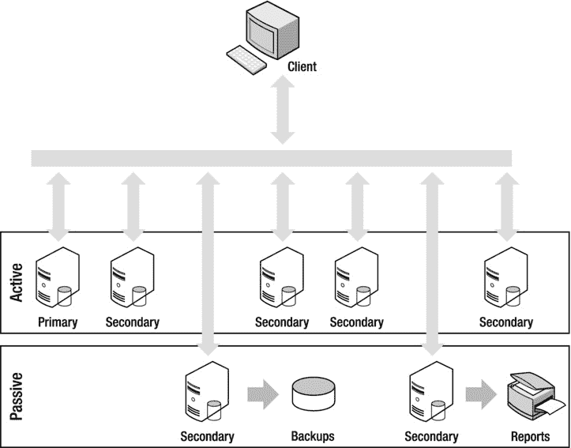

# 十一、复制

Abstract

像它的许多关系表兄弟一样，MongoDB 支持实时或接近实时地将数据库的内容复制到另一个服务器。MongoDB 的复制特性设置和使用都很简单。它们也是 MongoDB 中的关键特性之一，与分片一起，支持数据库既是 Web 2.0 又是基于云的数据存储的说法。

像它的许多关系表兄弟一样，MongoDB 支持实时或接近实时地将数据库的内容复制到另一个服务器。MongoDB 的复制特性设置和使用都很简单。它们也是 MongoDB 中的关键特性之一，与分片一起，支持数据库既是 Web 2.0 又是基于云的数据存储的说法。

在很多情况下，您可能需要使用复制，因此 MongoDB 中的复制支持必须足够灵活，以便能够应对所有这些情况。MongoDB，Inc .的 MongoDB 架构师竭尽全力确保其复制实现满足当今的所有需求。

在本章中，我们将介绍 MongoDB 中复制的基础知识，包括以下主题:

*   MongoDB 中的复制是什么？
*   什么是初选？
*   什么是次要的？
*   什么是操作日志？

Note

复制是 MongoDB 中继续发展的一个特性，随着产品的发展，您可以预期复制的工作方式会发生一些变化。对于数据库服务器的集群来说尤其如此。这本书的第一版和第二版之间已经有了一些变化。MongoDB，Inc .投入了相当大的努力来确保 MongoDB 满足并超越每个人对可伸缩性和可用性的期望；复制支持是 MongoDB 的关键特性之一。Inc 正指望帮助它满足这些期望。

在详细查看复制设置之前，让我们回顾一下各种设置要实现的目标。我们还将概述复制目前在 MongoDB 中如何工作的一些基础知识，并查看操作日志及其在副本集成员之间的数据复制中的作用。这些主题构成了理解复制的基础。

## 阐明 MongoDB 的复制目标

其中，复制可用于实现可伸缩性、持久性/可靠性和隔离。在接下来的部分中，我们将探索如何使用复制来实现这些目标，同时指出要避免的潜在陷阱和错误。

### 提高可扩展性

特别是对于 web 应用，可伸缩性是一个关键的设计要求，尤其是那些严重依赖后端数据库的应用。复制可以通过两种方式帮助您创建更具伸缩性的应用:

*   提高冗余度:复制可以让您在多个数据中心托管一个应用，从而帮助您提高冗余度。在这种方法中，您确保每个数据中心都有数据的本地副本，以便应用可以高速访问它。然后，用户可以连接到离他们最近的数据中心，从而最大限度地减少延迟。
*   提高性能:在某些情况下，复制可以帮助您提高应用的原始性能。当您有一个大型 web 应用，其中的数据集主要是基于读取的，并且您希望将查询分布到多个数据库服务器以提高并行性时，这种情况尤其如此。或者具有非常不同的工作集的查询负载，例如报告或聚合。

Note

MongoDB 还支持一个称为分片的特性，该特性旨在帮助您创建更具可伸缩性的应用，无论有无复制都可以实现真正的高可伸缩性。参见第 12 章了解更多关于在 MongoDB 中一起使用分片和复制的信息。

### 提高耐用性/可靠性

复制通常用于帮助防范硬件故障或数据库损坏，并在执行备份或其他潜在高影响维护活动时提供灵活性，影响很小或没有影响，因为这些任务可以在集合成员上单独执行，而不会影响整个集合。人们以这种方式使用复制的一些具体示例包括:

*   当您希望拥有延迟运行的数据库的副本时。您可能希望保护自己免受应用缺陷的影响，或者提供一种简单的机制，通过突出显示两个数据集的查询结果之间的差异来提供趋势信息。这还可以为人为错误提供安全缓冲，并避免从备份中完全恢复的需要。
*   当你需要一个备份系统以防失败时。如果在系统出现故障时，正常的备份方案需要很长时间才能恢复，您可能需要运行副本作为备份。
*   当您出于管理目的需要冗余系统时。您可能希望运行一个复制副本，以便可以在节点之间轮换执行管理任务，如备份或升级。

### 提供隔离

如果对生产数据库运行某些进程，将会显著影响该数据库的性能或可用性。您可以使用复制来创建将流程与生产数据库隔离的同步副本，例如:

*   当您希望在不影响生产系统性能的情况下运行报告或备份时:维护隐藏的辅助副本使您能够将查询与报告系统隔离开来，并确保月末报告不会延迟或影响您的正常操作。

## 复制基础

正如您所看到的，副本集(或 replSet)是一种设置多个 MongoDB 实例的方法，以包含相同的数据用于冗余和其他相关措施。除了了解这些，您还应该了解 MongoDB 是如何完成其复制的，这样您就知道如何最好地管理您自己的副本集。

您已经知道了 MongoDB 中复制的目标，如果您已经阅读了这本书的第一版或者从早期就开始使用 MongoDB，您将会知道有许多不同的方法可以完成复制，包括:

*   主/从复制
*   主/主复制
*   复制对

这些复制方法都已被副本集的概念所取代。在 MongoDB 中，一个副本集由一个主节点和一些辅助或仲裁节点组成。副本集应该由奇数个成员组成，即最少三个。出现这一需求是因为 MongoDB 副本集有一个规则，即主节点必须能够看到大多数其他节点，以便允许它继续作为主节点。实施这一规则是为了避免“裂脑”的情况，即由于网络中的潜在故障，你有两个主要的，如图 [11-1](#Fig1) 所示。

图 11-1。

The Split-brain problem

### 什么是初选？

就副本集而言，主要副本是副本集在给定时刻的真实来源。它是集合中唯一可以写入数据的节点，所有其他节点都可以从该节点复制数据。初选由所有投票成员的多数票选举产生，即法定人数。

一旦选择了主节点，所有辅助节点将使用它作为其复制的真实源，因此所有写入都必须定向到该成员。

### 什么是次要的？

次要成员是携带数据的非主要成员，理论上可以(除了少数例外)成为主要成员。它是一个节点，可以以尽可能接近实时的方式从其数据集中的主节点读取和复制数据。默认情况下，如果在没有任何读取首选项的情况下直接连接到辅助节点，则无法执行读取操作。这样做是为了强调，对于任何对非主数据库的读取，如果复制有延迟，您可能会从较旧的数据中读取。您可以使用命令`rs.slaveOk()`来设置当前连接，以便从辅助节点读取数据。或者，如果你正在使用一个驱动程序，你可以设置一个读优先选项，我们将在本章后面讨论。

Note

初选的概念是短暂的，也应该是短暂的。也就是说，理想情况下，您应该没有哪个节点是主节点的“固定”概念。在副本集中，所有辅助节点都在写入与主节点相同的数据，以便跟上复制。因此，如果辅助节点的能力大大降低，它们可能无法应对升级为主节点的情况。

### 什么是仲裁人？

仲裁器是一个非数据承载节点，用于提供额外的投票，以帮助维持副本集选举的多数。它不投决定性的一票，也不指示哪个节点是主要节点，但是参与并可以成为决定主要节点的法定成员。仲裁器最好用于帮助避免前面描述的“裂脑”问题。考虑图 [11-2](#Fig2) 所示的图表。通过给 A 站点添加一个仲裁者，我们总是可以有一方可以创建多数。这意味着在网络中断的情况下，我们不会有两个初选！我们可以通过在第三个站点 c 中设置仲裁器来进一步增加冗余。这样，如果站点 A 发生故障，我们仍然可以从站点 B 和 c 中的节点中形成多数。使用这样的第三个站点，我们可以在失去与任何一个站点的连接时继续运行。

图 11-2。

Split Brain Problem Solved

## 深入操作日志

简而言之，操作日志(operation log)是一个有上限的集合，其中包含主实例对其数据库所做更改的滚动记录，目的是向辅助实例重放这些更改，以确保数据库是相同的。副本集的每个成员维护其自己的操作日志，并且辅助节点向主节点(或其他更新的辅助节点)的操作日志查询新条目以应用于它们自己的所有数据库副本。

操作日志为每个条目创建一个时间戳。这使得辅助节点能够跟踪它在前一次读取期间从操作日志读取了多远，以及它需要传输哪些条目来赶上。如果您停止辅助节点并在相对较短的时间后重新启动它，它将使用主节点的操作日志来检索它在离线时错过的所有更改。

因为拥有无限大的操作日志是不实际的，所以操作日志被限制或限定在特定的大小。

您可以将操作日志视为主实例最近活动的窗口；如果该窗口太小，操作将在应用到辅助节点之前从操作日志中丢失。如果尚未在当前实例上创建操作日志，默认情况下- `oplogSize`启动选项允许您以 MB 为单位设置操作日志的大小。对于 Linux 或 Windows 64 位系统，`oplogSize`将被设置为可用于数据存储的可用磁盘空间的 5%。如果您的系统是写/更新密集型的，那么您可能需要增加这个大小，以确保从机可以脱机一段合理的时间而不丢失数据。

例如，如果您有一个需要一个小时才能完成的从机每日备份，则必须设置操作日志的大小，以允许从机在该小时内保持离线，再加上额外的时间量，以提供安全余量。

在为操作日志计算合适的大小时，考虑主服务器上所有数据库的更新率是非常重要的。

您可以通过使用 db 来了解适合您的操作日志的大小。在主实例上运行的`printReplicationInfo()`命令:

`$mongo`

`>db.printReplicationInfo()`

`configured oplog size: 15000MB`

`log length start to end: 6456672secs (1793.52hrs)`

`oplog first event time: Wed Mar 20 2013 17:00:43 GMT+1100 (EST)`

`oplog last event time: Mon Jun 03 2013 09:31:55 GMT+1000 (EST)`

`now: Mon Jun 03 2013 20:22:20 GMT+1000 (EST)`

此命令显示您的操作日志的当前大小，以及以当前更新速率填满所需的时间。根据这些信息，您可以估计是否需要增加或减少操作日志的大小。您还可以通过查看 MongoDB Monitoring Service (MMS)中的`repl lag`部分来查看副本集的给定成员离主成员有多远。如果您还没有安装 MMS，我真的建议您现在就安装，因为您的 MongoDB 集群变得越来越大，MMS 提供的统计信息就变得越来越重要。要了解更多背景知识，您应该查看第 9 章的[彩信部分。](09.html)

## 实现副本集

在本节中，您将学习如何设置一个简单的副本集配置。您还将学习如何在集群中添加和删除成员。如前所述，副本集基于单个主服务器和多个辅助或仲裁服务器的概念，这些辅助或仲裁服务器将从主服务器复制写入(见图 [11-3](#Fig3) )。

图 11-3。

A cluster implemented with a replica set

副本集还具有主动和被动成员的概念。当当前主服务器不可用时，被动辅助服务器不参与新主服务器的选举；相反，它们的作用与隐藏成员相同，可以用作报告或备份数据集。

启动时，副本集的成员服务器不需要被指定为集成员。相反，配置是通过普通服务器界面发送的服务器级命令来完成的。这使得创建允许动态配置和管理机器集群的配置管理工具变得更加容易。

在接下来的部分中，您将学习如何完成以下任务:

Create a replica set.   Add a server to a replica set.   Add an arbiter to a replica set.   Inspect and perform operations on a replica set.   Configure individual members of a replica set.   Connect to a replica set from your application.   Set Read Preference from within your application   Set Write Concern from within your application   Use Replica Set tags with Read Preference and Write Concern   Use the web interface to inspect the status of your replica set  

### 创建副本集

学习如何创建副本集的最好方法是看一个例子。在下面的例子中，您将创建一个名为`testset`的副本集。该集合将有三个成员(两个主动成员和一个被动成员)。表 [11-1](#Tab1) 列出了这个集合的成员。

表 11-1。

Configuring the Replica Set

<colgroup><col> <col> <col> <col></colgroup> 
| 服务 | 守护进程 | 地址 | 数据库路径 |
| --- | --- | --- | --- |
| 活动成员 1 | `mongod` | `[hostname]:27021` | `/db/active1/data` |
| 活动成员 2 | `mongod` | `[hostname]:27022` | `/db/active2/data` |
| 被动构件 1 | `mongod` | `[hostname]:27023` | `/db/passive1/data` |

副本集将允许您使用 localhost 作为标识符，但仅当所有机器都位于一台服务器上时。发生这种情况是因为副本集的每个成员必须能够通过主机名联系所有其他 MongoDB 实例，复制才能正常工作。

通常当使用副本集时，我们使用主机名；您可以使用`the hostname`命令找到当前主机名，如下例所示:

`$hostname`

`Pixl.local`

在接下来的例子中，通过在您自己的系统上运行`hostname`命令，将术语`[hostname]`替换为返回的任何值。

### 启动并运行副本集成员

第一步是让第一个活动成员启动并运行。为此，请打开终端窗口并键入以下内容:

`$ mkdir -p /db/active1/data`

`$ mongod --dbpath /db/active1/data --port 27021 --replSet testset`

`--replSet`选项告诉实例它正在加入的副本集的名称。这是副本集的第一个成员，因此您可以给它任何其他成员的地址，即使该成员尚未启动。只需要一个成员地址，但您也可以提供其他成员的名称，方法是用逗号分隔他们的地址，如下例所示:

`$ mongod --dbpath /db/active1/data --port 27021 --replSet testset`

Note

如果您不希望在自己的 shell 实例中运行这些 MongoDB 实例，您可以添加`–-fork`和`–-logpath <` `file` `>`选项，告诉这个实例在后台打开自己，并将其日志记录到指定的文件。

为了简单起见，这个例子只依赖一个地址。下一步是让其他成员开始工作。为此，请再打开两个终端窗口，然后在第一个窗口中键入以下内容，以启动并运行第二个成员:

`$ mkdir -p /db/active2/data`

`$ mongod --dbpath /db/active2/data --port 27022 --replSet testset`

接下来，在第二个窗口中键入以下内容，启动并运行最后一个(被动)成员:

`$ mkdir -p /db/passive1/data`

`$ mongod --dbpath /db/passive1/data --port 27023 --replSet testset`

此时，您有三个服务器实例正在运行并相互通信；但是，您还没有运行您的副本集，因为您还没有初始化副本集，也没有告诉每个成员它的角色和职责。

为此，您需要连接到其中一个服务器并初始化副本集。以下代码选择要连接的第一台服务器:

`$mongo [``hostname`

接下来，您需要初始化该集合的第一个成员，以创建它的操作日志和默认配置文档。您可以在日志文件中看到 MongoD 实例建议您需要这样做:

`Mon Jun 3 21:25:23.712 [rsStart] replSet can't get local.system.replset config from self or any seed (EMPTYCONFIG)`

`Mon Jun 3 21:25:23.712 [rsStart] replSet info you may need to run replSetInitiate -- rs.initiate() in the shell -- if that is not already done`

所以运行`rs.initiate`命令:

`> rs.initiate()`

`{`

`"info2" : "no configuration explicitly specified -- making one"`，

`"me" : "[hostname]:27021"`，

`"info" : "Config now saved locally. Should come online in about a minute."`，

`"ok" : 1`

`}`

最后，您应该检查副本集的状态，以确定其设置是否正确:

`>rs.status()`

`{`

`"set" : "testset"`，

`"date" : ISODate("2013-06-03T11:28:58Z")`，

`"myState" : 1`，

`"members" : [`

`{`

`"_id" : 0`，

`"name" : "[hostname]:27021"`，

`"health" : 1`，

`"state" : 1`，

`"stateStr" : "PRIMARY"`，

`"uptime" : 264`，

`"optime" : {`

`"t" : 1370258919`，

`"i" : 1`

`}`，

`"optimeDate" : ISODate("2013-06-03T11:28:39Z")`，

`"self" : true`

`}`

`]`，

`"ok" : 1`

`}`

这里的输出表明一切正常:您已经成功地配置、设置和初始化了一个新的副本集。请记住，您应该使用您自己的机器名称来代替`[hostname]`，因为“localhost”和“127.0.0.1”都不起作用。

### 将服务器添加到副本集

现在您已经启动了新的副本集，您需要开始向其中添加成员。让我们从添加第一个辅助节点开始。只需添加`rs.add()`命令并提供该实例的主机名和端口，就可以做到这一点。要添加，请连接到您的主服务器并运行以下命令:

`$ mongo [``hostname`

`> rs.add("[``hostname`

`{ "ok" : 1 }`

您需要等待一两分钟，因为该节点会使自己联机，创建自己的操作日志，并准备好自己。您可以使用`rs.status()`监控进度，同时等待该节点作为辅助节点联机:

`>use admin`

`>rs.status() {`

`"set" : "testset"`，

`"date" : ISODate("2013-06-03T11:36:37Z")`，

`"myState" : 1`，

`"members" : [`

`{`

`"_id" : 0`，

`"name" : "[hostname]:27021"`，

`"health" : 1`，

`"state" : 1`，

`"stateStr" : "PRIMARY"`，

`"uptime" : 723`，

`"optime" : {`

`"t" : 1370259331`，

`"i" : 1`

`}`，

`"optimeDate" : ISODate("2013-06-03T11:35:31Z")`，

`"self" : true`

`}`，

`{`

`"_id" : 1`，

`"name" : "[hostname]:27022"`，

`"health" : 1`，

`"state" : 2`，

`"stateStr" : "SECONDARY"`，

`"uptime" : 66`，

`"optime" : {`

`"t" : 1370259331`，

`"i" : 1`

`}`，

`"optimeDate" : ISODate("2013-06-03T11:35:31Z")`，

`"lastHeartbeat" : ISODate("2013-06-03T11:36:35Z")`，

`"lastHeartbeatRecv" : ISODate("2013-06-03T11:36:36Z")`，

`"pingMs" : 0`，

`"syncingTo" : "[hostname]:27021"`

`}`

`]`，

`"ok" : 1`

`}`

现在让我们利用第三个被动成员。首先像往常一样用`rs.add()`添加成员:

`$ mongo [hostname]:27022`

`> rs.add("[hostname]:27022")`

`{ "ok" : 1 }`

现在我们需要制作配置文件的副本并修改它。运行下面的命令创建一个名为`conf`的文档，其中包含您当前的副本集配置。

`> conf = rs.conf()`

`{`

`"_id" : "testset"`，

`"version" : 3`，

`"members" : [`

`{`

`"_id" : 0`，

`"host" : "[hostname]:27021"`

`}`，

`{`

`"_id" : 1`，

`"host" : "[hostname]:27022"`

`}`，

`{`

`"_id" : 2`，

`"host" : "[hostname]:27023"`

`}`

`]`

`}`

现在您的配置文档已经加载，您需要修改它。我们希望将节点设置为隐藏，优先级为 0，因此它不会被选为主要节点。注意，文档有一个`members`数组，其中包含副本集每个成员的文档。您需要使用数组操作符[]选择您希望访问的成员。因此，要为第三个成员创建一个值`hidden : true`，我们需要在 2 处更新数组元素(记住，数组从 0 开始)。运行以下命令:

`> conf.members[2].hidden = true`

`true`

现在，我们可以使用相同的命令将优先级值设置为 0:

`> conf.members[2].priority = 0`

`0`

您可以通过简单地执行放置配置文档的变量的名称来输出这个配置文档:

`> conf`

`{`

`"_id" : "testset"`，

`"version" : 3`，

`"members" : [`

`{`

`"_id" : 0`，

`"host" : "[hostname]:27021"`

`}`，

`{`

`"_id" : 1`，

`"host" : "[hostname]:27022"`

`}`，

`{`

`"_id" : 2`，

`"host" : "[hostname]:27023"`，

`"hidden" : true`，

`"priority" : 0`

`}`

`]`

`}`

如您所见，这个成员现在拥有隐藏值集和优先级 0。现在我们需要做的就是更新副本集配置来使用这个文档。我们通过使用新的配置文档作为参数发出`rs.reconfig`()命令来实现这一点。

`> rs.reconfig(conf)`

`Tue Jun 4 20:01:45.234 DBClientCursor::init call() failed`

`Tue Jun 4 20:01:45.235 trying reconnect to 127.0.0.1:27021`

`Tue Jun 4 20:01:45.235 reconnect 127.0.0.1:27021 ok`

`reconnected to server after rs command (which is normal)`

您的整个副本集失去连接，然后重新连接！发生这种情况是因为重新配置。对副本集的任何更改都可能导致副本集重新配置自己并进行新的选举，在大多数情况下，这将使先前的主要步骤回到其角色中。现在，如果我们重新运行`rs.conf()`命令，您可以看到新的副本集配置正在运行。

`> rs.conf()`

`{`

`"_id" : "testset"`，

`"version" : 4`，

`"members" : [`

`{`

`"_id" : 0`，

`"host" : "[hostname]:27021"`

`}`，

`{`

`"_id" : 1`，

`"host" : "[hostname]:27022"`

`}`，

`{`

`"_id" : 2`，

`"host" : "[hostname]:27023"`，

`"priority" : 0`，

`"hidden" : true`

`}`

`]`

`}`

请注意，此副本集配置的版本号现在已经增加。这作为重新配置的一部分自动发生，以确保任何副本集成员没有错误的配置文档。

现在，您应该有一个完全配置好的三成员副本集，其中有一个活动的主副本集和一个隐藏的“被动”副本集

### 添加仲裁人

添加仲裁器作为副本集的投票成员是一个简单的过程。让我们从培养一个新成员开始。

`$ mkdir -p /db/arbiter1/data`

`$ mongod --dbpath /db/ arbiter1/data --port 27024 --replSet testset –rest`

现在您已经创建了一个新成员，只需使用`rs.addArb()`命令添加新的仲裁器:

`>rs.addArb("[hostname]:27024")`

`{ "ok" : 1 }`

如果您现在运行`rs.status()`，您将在输出中看到您的仲裁器:

`{`

`"_id" : 3`，

`"name" : "Pixl.local:27024"`，

`"health" : 1`，

`"state" : 7`，

`"stateStr" : "ARBITER"`，

`"uptime" : 721`，

`"lastHeartbeat" : ISODate("2013-06-07T11:21:01Z")`，

`"lastHeartbeatRecv" : ISODate("2013-06-07T11:21:00Z")`，

`"pingMs" : 0`

`}`

你可能已经意识到了这里的一个问题；我们现在有四个节点。那是一个偶数，而且偶数是不好的！如果我们继续这样运行，您的 MongoDB 节点将开始记录以下内容:

`[rsMgr] replSet total number of votes is even - add arbiter or give one member an extra vote`

为了解决这个问题，我们知道我们需要奇数个成员；因此，一个潜在的解决方案是按照日志消息的建议添加另一个仲裁器，但这并不完美，因为我们添加了不必要的额外复杂性。最佳解决方案是阻止现有节点之一投票并被视为仲裁成员。我们可以通过将隐藏二级选举的投票数设置为零来做到这一点。我们这样做的方式与设置隐藏值和优先级值的方式相同。

`conf = rs.conf()`

`conf.members[2].votes = 0`

`rs.reconfig(conf)`

仅此而已。我们现在已经将被动节点设置为真正的被动节点:它永远不会成为主节点；它被客户端视为副本集的一部分；它不能参加选举或被算作多数。为了测试这一点，您可以尝试关闭被动节点，仲裁器和您的其他两个节点将继续在主节点上运行，而不会发生变化；而在以前，主节点可能会退出，理由是它看不到大多数节点。

### 副本集链接

您已经看到，通常情况下，副本集的成员会尝试从该副本集中的主副本同步数据。但这不是副本集辅助设备可以同步的唯一位置；它们也可以从其他辅助节点同步。通过这种方式，您的辅助服务器可以形成一个“同步链”，其中每个辅助服务器都会同步副本集中其他辅助服务器的最新数据。

### 管理副本集

MongoDB 提供了许多命令来管理副本集的配置和状态。表 [11-2](#Tab2) 显示了可用于创建、操作和检查副本集中集群状态的命令。

表 11-2。

Commands for Manipulating and Inspecting Replica Sets

<colgroup><col> <col></colgroup> 
| 命令 | 描述 |
| --- | --- |
| `rs.help()` | 返回此表中的命令列表。 |
| `rs.status()` | 返回有关副本集当前状态的信息。此命令列出每个成员服务器及其状态信息，包括上次联系的时间。此调用可用于对整个集群进行简单的运行状况检查。 |
| `rs.initiate()` | 使用默认参数初始化副本集。 |
| `rs.initiate(``replSetcfg` | 使用配置描述初始化副本集。 |
| `rs.add("``host``:``port` | 使用提供主机名和(可选)特定端口的简单字符串将成员服务器添加到副本集。 |
| `rs.add(``membercfg` | 使用配置描述将成员服务器添加到副本集。如果要指定特定属性(例如，新成员服务器的优先级)，必须使用此方法。 |
| `rs.addArb("host:port")` | 添加一个新的成员服务器作为仲裁服务器。成员不需要已经用`--replSet`选项启动；在任何可到达的机器上运行的任何`mongod`实例都可以执行这个任务。请注意，副本集的所有成员都可以访问该服务器。 |
| `rs.stepDown()` | 当您对副本集的主要成员运行此命令时，使主服务器放弃其角色，并强制在群集中选择新的主服务器。请注意，只有活动的辅助服务器可以作为候选服务器成为新的主服务器，并且如果在 60 秒的等待后没有其他候选成员可用，则可以重新选择原始主服务器。 |
| `rs.syncFrom("host:port")` | 从给定成员进行辅助同步。可用于形成同步链。 |
| `rs.freeze(secs)` | 冻结给定成员，并使其在指定的秒数内没有资格成为主要成员。 |
| `rs.remove("host:port")` | 从副本集中删除给定成员。 |
| `rs.slaveOk()` | 设置此连接，以便允许从辅助节点读取。 |
| `rs.conf()` | 重新显示当前副本集的配置结构。此命令对于获取副本集的配置结构非常有用。该配置结构可被修改，然后再次提供给`rs.initiate()`以改变该结构的配置。这项技术提供了从副本集中删除成员服务器的唯一受支持的方法；目前还没有直接的方法可以做到这一点。 |
| `db.isMaster()` | 这个函数不是特定于副本集的；相反，它是一种通用的复制支持功能，允许应用或驱动程序确定特定的连接实例是否是复制拓扑中的主/主要服务器。 |

以下章节详细介绍了表 [11-2](#Tab2) 中列出的一些更常用的命令，提供了关于它们的功能和使用方法的更多细节。

#### 用 rs.status()检查实例的状态

从我们之前向副本集添加成员的经历中，您应该知道，`rs.status()`可能是您在处理副本集时最常使用的命令。它允许您检查当前连接的实例的状态，包括它在副本集中的角色:

`>rs.status()`

`> rs.status();`

`{`

`"set" : "testset"`，

`"date" : ISODate("2013-06-04T10:57:24Z")`，

`"myState" : 1`，

`"members" : [`

`{`

`"_id" : 0`，

`"name" : "[hostname]:27021"`，

`"health" : 1`，

`"state" : 1`，

`"stateStr" : "PRIMARY"`，

`"uptime" : 4131`，

`"optime" : Timestamp(1370340105, 1)`，

`"optimeDate" : ISODate("2013-06-04T10:01:45Z")`，

`"self" : true`

`}`，

`{`

`"_id" : 1`，

`"name" : "[hostname]:27022"`，

`"health" : 1`，

`"state" : 2`，

`"stateStr" : "SECONDARY"`，

`"uptime" : 3339`，

`"optime" : Timestamp(1370340105, 1)`，

`"optimeDate" : ISODate("2013-06-04T10:01:45Z")`，

`"lastHeartbeat" : ISODate("2013-06-04T10:57:23Z")`，

`"lastHeartbeatRecv" : ISODate("2013-06-04T10:57:23Z")`，

`"pingMs" : 0`，

`"syncingTo" : "[hostname]:27021"`

`}`，

`{`

`"_id" : 2`，

`"name" : "[hostname]:27023"`，

`"health" : 1`，

`"state" : 2`，

`"stateStr" : "SECONDARY"`，

`"uptime" : 3339`，

`"optime" : Timestamp(1370340105, 1)`，

`"optimeDate" : ISODate("2013-06-04T10:01:45Z")`，

`"lastHeartbeat" : ISODate("2013-06-04T10:57:22Z")`，

`"lastHeartbeatRecv" : ISODate("2013-06-04T10:57:23Z")`，

`"pingMs" : 0`，

`"syncingTo" : "[hostname]:27021"`

`}`

`]`，

`"ok" : 1`

`}`

示例中显示的每个字段都有一个含义，如表 [11-3](#Tab3) 中所述。这些值可用于了解副本集当前成员的状态。

表 11-3。

Values for the rs.status Fields

<colgroup><col> <col></colgroup> 
| 价值 | 描述 |
| --- | --- |
| `_id` | 作为副本集一部分的该成员的 ID |
| `Name` | 成员的主机名 |
| `Health` | `replSet`的健康值 |
| `State` | 状态的数值 |
| `StateStr` | 这个复制集成员状态的字符串表示 |
| `Uptime` | 该成员已经存在多久了 |
| `optime` | 对此成员应用的最后一次操作的时间，采用时间戳和整数值的格式 |
| `optimeDate` | 上次应用操作的日期 |
| `lastHeartbeat` | 上次发送心跳的日期 |
| `lastHeartbeatRecv` | 收到的最后一个心跳的日期 |
| `pingMs` | 运行`rs.status()`的成员和每个远程成员之间的 ping 时间 |
| `syncingTo` | 此给定节点要同步匹配的副本集的成员 |

在前面的示例中，`rs.status()`命令是针对主服务器成员运行的。该命令返回的信息显示主服务器正在以`1`的`myState`值运行；换句话说，“成员作为主要(主)成员运行。”

#### 强行举行新的选举，让卢比下台( )

您可以使用`rs.stepDown()`命令强制主服务器停止运行 60 秒；该命令还强制选择新的主服务器。该命令在下列情况下很有用:

*   当您需要使托管主实例的服务器离线时，无论是调查服务器还是实施硬件升级或维护。
*   当您想要对数据结构运行诊断过程时。
*   当您想要模拟主要故障的影响并强制您的集群进行故障转移时，您可以测试您的应用如何响应这样的事件。

以下示例显示了对`testset`副本集运行`rs.stepDown()`命令时返回的输出:

`> rs.stepDown()`

`> rs.status()`

`{`

`"set" : "testset"`，

`"date" : ISODate("2013-06-04T11:19:01Z")`，

`"myState" : 2`，

`"members" : [`

`{`

`"_id" : 0`，

`"name" : "[hostname]:27021"`，

`"health" : 1`，

`"state" : 2`，

`"stateStr" : "SECONDARY"`，

`"uptime" : 5428`，

`"optime" : Timestamp(1370340105, 1)`，

`"optimeDate" : ISODate("2013-06-04T10:01:45Z")`，

`"self" : true`

`}`，

`{`

`"_id" : 1`，

`"name" : "[hostname]:27022"`，

`"health" : 1`，

`"state" : 2`，

`"stateStr" : "SECONDARY"`，

`"uptime" : 4636`，

`"optime" : Timestamp(1370340105, 1)`，

`"optimeDate" : ISODate("2013-06-04T10:01:45Z")`，

`"lastHeartbeat" : ISODate("2013-06-04T11:19:00Z")`，

`"lastHeartbeatRecv" : ISODate("2013-06-04T11:19:00Z")`，

`"pingMs" : 0`，

`"syncingTo" : "[hostname]:27021"`

`}`，

`{`

`"_id" : 2`，

`"name" : "[hostname]:27023"`，

`"health" : 1`，

`"state" : 2`，

`"stateStr" : "SECONDARY"`，

`"uptime" : 4636`，

`"optime" : Timestamp(1370340105, 1)`，

`"optimeDate" : ISODate("2013-06-04T10:01:45Z")`，

`"lastHeartbeat" : ISODate("2013-06-04T11:19:01Z")`，

`"lastHeartbeatRecv" : ISODate("2013-06-04T11:19:00Z")`，

`"pingMs" : 0`，

`"lastHeartbeatMessage" : "db exception in producer: 10278 dbclient error communicating with server: [hostname]:27021"`，

`"syncingTo" : "[hostname]:27021"`

`}`

`]`，

`"ok" : 1`

`}`

在本例中，您对主服务器运行了`rs.stepDown()`命令。`rs.status()`命令的输出显示副本集的所有成员现在都是次要的。如果您随后运行`rs.status()`，您应该看到另一个成员已经升级为主要成员(假设有一个成员符合条件)。

#### 确定成员是否为主服务器

`db.isMaster()`命令并不严格适用于副本集。然而，这个命令非常有用，因为它允许应用测试当前连接是否连接到主服务器:

`>db.isMaster()`

`{`

`"setName" : "testset"`，

`"ismaster" : true`，

`"secondary" : false`，

`"hosts" : [`

`"[hostname]:27022"`，

`"[hostname]:27021"`

`]`，

`"primary" : "[hostname]:27022"`，

`"me" : "[hostname]:27022"`，

`"maxBsonObjectSize" : 16777216`，

`"maxMessageSizeBytes" : 48000000`，

`"localTime" : ISODate("2013-06-04T11:22:28.771Z")`，

`"ok" : 1`

`}`

如果您在此时对您的`testset`副本集集群运行`isMaster()`，这表明您运行它的服务器不是主/主服务器(`"ismaster" == false`)。如果运行该命令的服务器实例是副本集的成员，该命令还将返回副本集中已知服务器实例的映射，包括该副本集中各个服务器的角色。

### 为副本集成员配置选项

副本集功能包括许多选项，可用于控制副本集成员的行为。当您运行`rs.initiate(` `replSetcfg` `)`或`rs.add(` `membercfg` `)`选项时，您必须提供一个描述副本集成员特征的配置结构:

`{`

`_id : <setname>`，

`members: [`

`{`

`_id : <ordinal>`，

`host : <hostname[:port]>`，

`[ priority: <priority>, ]`

`[arbiterOnly : true, ]`

`[ votes : <n>, ]`

`[ hidden: true, ]`

`[ tags: { document }, ]`

`[ slaveDelay: <seconds>, ]`

`[ buildIndexes: true, ]`

`}`

`, ...`

`]`，

`settings: {`

`[ chainingAllowed : <boolean>, ]`

`[ getLastErrorModes: <modes>, ]`

`[ getLastErrorDefaults: <lasterrdefaults>, ]`

`}`

`}`

对于`rs.initiate()`，您应该提供完整的配置结构，如下所示。配置结构本身的最顶层包括三个层次:`_id`、`members`和`settings`。`_id`是副本集的名称，当您创建副本集成员时，`--replSet`命令行选项会提供这个名称。`members`数组由一组描述集合中每个成员的结构组成；这是在将单个服务器添加到集合中时提供给`rs.add()`命令的成员结构。最后，`settings`数组包含适用于整个副本集的选项。

#### 成员结构的组织

`members`结构包含配置副本集的每个成员实例所需的所有条目；您可以在表 [11-4](#Tab4) 中看到所有这些条目。

表 11-4。

Configuring Member Server Properties

<colgroup><col> <col></colgroup> 
| [计]选项 | 描述 |
| --- | --- |
| `members.$._id` | (强制)Integer:该元素指定成员结构在`member`数组中的序号位置。此元素的可能值包括大于或等于`0`的整数。该值使您能够处理特定的成员结构，因此您可以执行添加、移除和覆盖操作。 |
| `members.$.host` | (必需)String:该元素以`host:port`的形式指定服务器的名称；注意，主机部分不能是`localhost`或`127.0.0.1`。 |
| `members.$.priority` | (可选)Float:该元素表示在选举新的主服务器时分配给服务器的权重。如果主服务器变得不可用，则将基于该值升级辅助服务器。任何非零值的辅助服务器都被认为是活动的，有资格成为主服务器。因此，将该值设置为零会强制辅助节点成为被动节点。如果多个辅助服务器共享相同的优先级，那么将进行投票，并且可以调用仲裁器(如果配置的话)来解决任何死锁。该元素的默认值是`1.0`。 |
| `members.$.arbiterOnly` | (可选)Boolean:该成员作为仲裁人选举新的主服务器。它不涉及副本集的任何其他功能，并且不需要使用`--replSet`命令行选项启动。系统中任何正在运行的`mongod`进程都可以执行这个任务。这个元素的默认值是`false`。 |
| `members.$.votes` | (可选)Integer:此元素指定实例可以投票选举其他实例作为主服务器的票数；这个元素的默认值是`1`。 |
| `members.$. hidden` | (可选)Boolean:这将从`db.isMaster()`的输出中隐藏节点，从而防止在节点上发生读操作，即使有第二个读首选项。 |
| `members.$.tags` | (可选)文档:这允许您为副本集标记的读取首选项设置标记。 |
| `members.$.slaveDelay` | (可选)Integer:这允许您将从服务器设置为比主服务器“延迟”指定的秒数。 |
| `members.$.buildIndexes` | (可选)Boolean:该选项用于禁止建立索引。它不应该更好地设置在理论上可以成为主节点节点上。当索引不重要并且您希望节省空间时，此功能对于备份节点等非常有用。 |

#### 探索设置结构中可用的选项

表 [11-5](#Tab5) 列出了`Settings`结构中可用的副本集属性。这些设置全局应用于整个副本集；您可以使用这些属性来配置副本集成员如何相互通信。

表 11-5。

Inter-server Communication Properties for the Settings Structure

<colgroup><col> <col></colgroup> 
| [计]选项 | 描述 |
| --- | --- |
| `settings.chainingAllowed` | (可选)Boolean:允许您指定是否允许成员从其他辅助节点复制。默认为真 |
| `settings.getLastErrorModes` | (可选)模式:用于设置自定义写入问题，如本章后面所述。 |
| `Settings.getLastErrorDefaults` | (可选)默认值:用于设置自定义写入问题 |

### 从应用连接到副本集

从 PHP 连接到副本集类似于连接到单个 MongoDB 实例。唯一的区别是它可以提供一个副本集实例地址或一个副本集成员列表；连接库将确定哪个服务器是主服务器，并将查询定向到该机器，即使主服务器不是您提供的成员之一。因此，无论如何，最好在连接字符串中指定多个成员；这样，您就消除了尝试只从一个可能离线的成员发现的风险。以下示例显示了如何从 PHP 应用连接到副本集:

`<?php`

`$m = new MongoClient("mongodb://localhost:27021`，

`localhost:27022", array("replicaSet" => "testSet"));`

`...`

`?>`

#### 在应用中设置阅读首选项

MongoDB 中的读取偏好是一种选择您希望从副本集中读取哪些成员的方式。通过为您的驱动程序指定读取首选项，您可以告诉它对副本集的特定成员(或多个成员)运行查询。目前有五种模式可以在您的驱动程序上设置为读取偏好，如表 [11-6](#Tab6) 中所列。

表 11-6。

Read Preference Options

<colgroup><col> <col></colgroup> 
| [计]选项 | 描述 |
| --- | --- |
| `Primary` | 读取将只针对主节点。如果明确与标记的读取首选项一起使用，此读取首选项将被阻止。这也是默认的读取首选项。 |
| `PrimaryPreferred` | 除非没有可用的主节点，否则读取将定向到主节点；那么读取将被定向到辅助节点。 |
| `Secondary` | 读取将仅定向到辅助节点。如果没有可用的辅助，此选项将生成一个异常。 |
| `SecondaryPreferred` | 除非没有可用的辅助节点，否则读取将定向到辅助节点；则读取将针对主节点。这对应于旧的“slaveOk”辅助读取方法的行为。 |
| `Nearest` | 从最近的节点读取，不管它是主节点还是辅助节点。`Nearest`使用网络延迟来确定使用哪个节点。 |

Note

如果您设置的读取首选项意味着您的读取可能来自辅助节点，那么您必须意识到这些数据可能不是完全最新的；某些操作可能没有从您的主服务器复制。

您可以在 PHP 中使用`setReadPreference()`命令对一个连接对象设置读取首选项，如下所示:

`<?php`

`$m = new MongoClient("mongodb://localhost:27021`，

`localhost:27022", array("replicaSet" => "testSet"));`

`$m->setReadPreference(MongoClient::RP_SECONDARY_PREFERRED, array());`

`...`

`?>`

从现在开始，您在该连接上进行的任何查询都将针对集群中的辅助节点运行。您还可以通过向 URI 添加阅读首选项标签来设置阅读首选项。指定了读取首选项`nearest`的 URI 如下所示:

`mongodb://localhost:27021,localhost:27022?readPreference=nearest`

#### 从应用内部设置写问题

写关注是一个类似于读偏好的概念。您可以使用写问题来指定该数据在被视为“完整”之前需要安全提交到多少个节点这个测试使用 MongoDB 的 Get Last Error (GLE)机制来检查连接上发生的最后一个错误。您可以设置多种写操作模式，这些模式允许您配置在执行写操作时对其持久性的确定程度。每一个都在表 [11-7](#Tab7) 中列出。

表 11-7。

MongoDB Write Concern Levels

<colgroup><col> <col></colgroup> 
| [计]选项 | 描述 |
| --- | --- |
| `W=0`或`Unacknowledged` | 一个一发而不可收拾的作品。将发送写操作，但不会尝试确认它是否已提交。 |
| `W=1`或`Acknowledged` | 写操作必须由主要人员确认。这是默认值。 |
| `W=` `N`或`Replica Set Acknowledged` | 主节点必须确认写入，N–1 成员必须从主节点复制此写入。此选项更可靠，但如果副本集中的成员存在复制延迟，或者如果由于停机等原因在提交写入时没有足够的成员可用，则可能会导致延迟。 |
| `W=Majority` | 写操作必须写入主节点，并由足够多的成员复制，以使集合中的大多数成员都确认该写操作。与`w=n`一样，这可能会在停机期间或存在复制延迟时导致问题。 |
| `J=true`或`Journaled` | 可与`w=`写入问题一起使用，以指定写入必须持续到日志才能被视为已确认。 |

为了在插入中使用写操作，只需在给定的`insert()`函数中添加`w`选项，如下所示:

`$col->insert($` `document`，`array` `("w" => 1));`

这将尝试向我们的集合中插入一个带有确认写入的`w=1`值的文档。

#### 将标签用于读取偏好和写入关注

除了刚才讨论的“读取首选项”和“写入问题”选项之外，还有另一种方法—标记。这种机制允许您在副本集的成员上设置自定义标记，然后使用这些标记以及您的读取首选项和写入关注设置，以更细粒度的方式指导操作。所以，事不宜迟，我们开始吧。通过将标签添加到副本集配置文件的标签部分，可以在副本集上设置标签。让我们首先将`a`的`sites`和`b`的标签添加到我们的副本集配置中:

`conf=rs.conf()`

`conf.members[0].tags = {site : "a"}`

`conf.members[1].tags = {site : "b"}`

`conf.members[2].tags = {site : "a"}`

`rs.reconfigure(conf)`

现在，我们可以检查我们的新配置，您可以看到我们已经将两个站点设置到位；它们在每个配置文件的`tags`部分中定义。

`rs.conf()`

`{`

`"_id" : "testset"`，

`"version" : 8`，

`"members" : [`

`{`

`"_id" : 0`，

`"host" : "Pixl.local:27021"`，

`"tags" : {`

`"site" : "a"`

`}`

`}`，

`{`

`"_id" : 1`，

`"host" : "Pixl.local:27022"`，

`"tags" : {`

`"site" : "b"`

`}`

`}`，

`{`

`"_id" : 2`，

`"host" : "Pixl.local:27023"`，

`"priority" : 0`，

`"hidden" : true`，

`"tags" : {`

`"site" : "a"`

`}`

`}`，

`{`

`"_id" : 3`，

`"host" : "Pixl.local:27024"`，

`"arbiterOnly" : true`

`}`

`]`

`}`

现在让我们开始使用我们的新标签吧！我们可以设置站点`a`中副本集的最近成员的读取首选项。

`$m->setReadPreference(MongoClient::RP_NEAREST, array( array('site' => 'a'),));`

既然我们已经解决了读取偏好，让我们开始关注写入。写问题稍微复杂一些，因为我们首先需要修改我们的副本集配置来添加额外的`getLastErrorModes`。在这种情况下，我们希望创建一个写问题，说明给定的写操作必须提交到足够多的节点，才能写入到两个不同的站点。这意味着写入必须至少提交到站点`a`和站点`b`。要做到这一点，我们需要将`getLastErrorModes`变量设置为一个文档，该文档包含我们新的写关注点的名称和一个规则，该规则表示我们希望将它写入两个不同的“site”标签。这是按如下方式完成的:

`conf = rs.conf()`

`conf.settings. getLastErrorModes = { bothSites : { "site": 2 } } }`

`rs.reconfig(conf)`

现在我们需要插入我们的文档，并指定我们新的写关注点。

`$col->insert($document, array("w" => "bothSites"));`

就这么简单。现在，我们可以保证我们的写入同时提交到两个站点！现在，假设我们希望将此设置为对我们的群集进行任何写入的默认写入问题。

`conf = rs.conf()`

`conf.settings.getLastErrorDefaults = { bothSites : 1 } }`

`rs.reconfig(conf)`

现在，我们所做的任何写操作都将使用默认的写关注点`bothSites`来完成。所以如果我们只是做一个普通的插入！

## 摘要

MongoDB 提供了一组丰富的工具来实现冗余和健壮的复制拓扑。在本章中，您了解了许多这些工具，包括使用它们的一些原因和动机。您还了解了如何设置许多不同的副本集拓扑。此外，您还学习了如何使用命令行工具和内置的 web 界面来检查复制系统的状态。最后，您学习了如何设置和配置读首选项和写关注点，以确保从正确的位置读取和写入。

请花点时间评估本章中描述的每个选项和功能，以确保在生产环境中尝试使用副本集之前，您构建了最适合您特定需求的副本集。使用 MongoDB 在单台机器上创建测试床非常容易；正如我们在本章中所做的那样。因此，强烈建议您尝试每种方法，以确保您完全了解每种方法的优势和局限性，包括它将如何处理您的特定数据和应用。