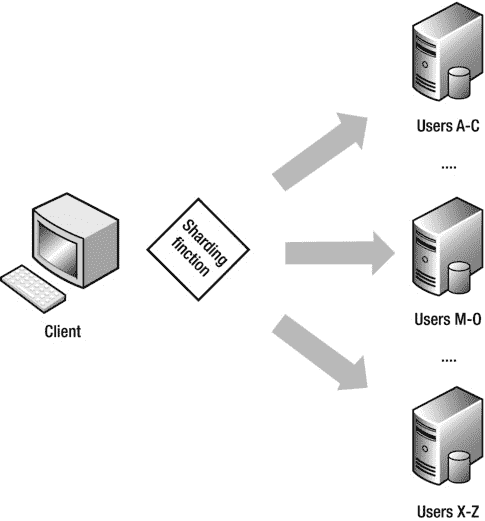
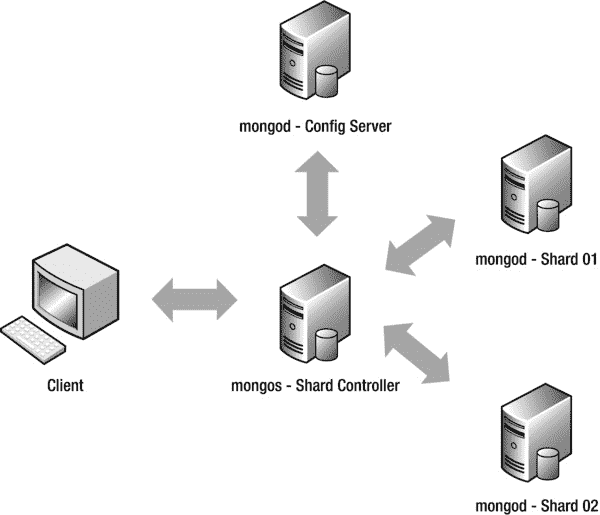
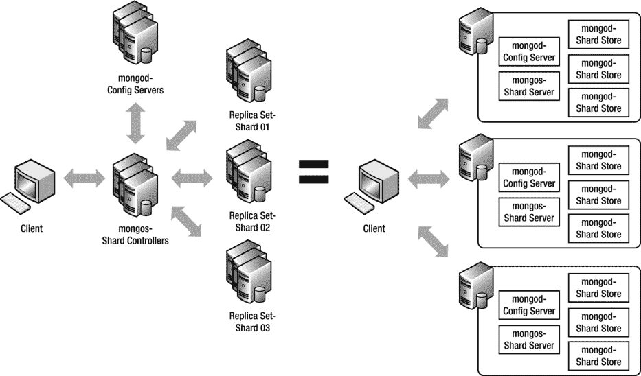

# 十二、分片

Abstract

无论你是在构建下一个脸书还是一个简单的数据库应用，如果它成功了，你可能需要在某个时候扩展你的应用。如果您不想不断更换硬件(或者您开始接近在一个硬件上所能做的极限)，那么您将希望使用一种技术，允许您在需要时逐渐增加系统的容量。分片是一种允许您将数据分布在多台机器上的技术，但这种方式类似于一个应用访问一个数据库。

无论你是在构建下一个脸书还是一个简单的数据库应用，如果它成功了，你可能需要在某个时候扩展你的应用。如果您不想不断更换硬件(或者您开始接近在一个硬件上所能做的极限)，那么您将希望使用一种技术，允许您在需要时逐渐增加系统的容量。分片是一种允许您将数据分布在多台机器上的技术，但这种方式类似于一个应用访问一个数据库。

MongoDB 实现的分片非常适合基于云的计算平台，非常适合动态的、负载敏感的自动扩展，在这种情况下，您可以根据需要增加容量，在不需要时减少容量。

本章将向您介绍如何在 MongoDB 中实现分片，并查看 MongoDB 分片实现中提供的一些高级功能，如标签分片和散列分片键。

## 探索分享的需求

当万维网刚刚起步时，网站、用户和网上可用信息的数量都很少。Web 由几千个站点和仅仅几万或几十万用户组成，主要集中在学术和研究社区。在早期，数据往往很简单:手工维护的 HTML 文档通过超链接连接在一起。组成 Web 的协议的最初设计目标是提供一种方法，为存储在互联网上不同服务器上的文档创建可导航的引用。

即使是目前的大品牌，如雅虎！与今天的产品相比，在网络上的存在微不足道。该公司最初的产品是雅虎目录，只不过是一个手工编辑的热门网站链接网络。这些链接是由一小群热情的冲浪者维护的。Yahoo 目录中的每个页面都是一个简单的 HTML 文档，存储在文件系统目录树中，并使用简单的文本编辑器进行维护。

但是随着网络的规模开始爆炸式增长——网站和访问者的数量开始近乎垂直地攀升——大量的可用资源迫使早期的网络先驱从简单的文档转向从独立的数据存储中生成更复杂的动态页面。

搜索引擎开始在网络上爬行，将链接的数据库聚集在一起，如今这些数据库拥有数千亿个链接和数百亿个存储页面。

这些发展促使人们转向通过不断发展的内容管理系统来管理和维护数据集，这些内容管理系统主要存储在数据库中以便于访问。

与此同时，新类型的服务不断发展，不仅仅存储文档和链接集。例如，音频、视频、事件和各种其他数据开始进入这些巨大的数据存储库。这一过程通常被描述为“数据工业化”——在许多方面，它与 19 世纪以制造业为中心的工业革命有相似之处。

最终，每个成功的网络公司都面临着如何访问存储在这些庞大数据库中的数据的问题。他们发现一台数据库服务器每秒只能处理这么多的查询，网络接口和磁盘驱动器每秒只能在 web 服务器之间传输这么多兆字节。提供基于 web 的服务的公司会很快发现自己已经超越了单个服务器、网络或驱动器阵列的性能。在这种情况下，他们被迫分割和分发他们收集的大量数据。通常的解决方案是将这些庞大的数据块分割成更小的块，以便更可靠、更快速地管理。同时，这些公司需要保持跨其大型机器集群中保存的全部数据执行操作的能力。

您在[第 11 章](11.html)中详细了解了复制，它是克服这些扩展问题的有效工具，使您能够在多台服务器上创建多个相同的数据副本。这使您能够(在正确的情况下)将服务器负载分散到更多的机器上。

然而，没过多久，您就遇到了另一个问题，组成数据集的各个表或集合变得如此之大，以至于它们的大小超出了单个数据库系统有效管理它们的能力。例如，脸书宣称每天接收超过 3 亿张照片！这个网站已经运营了将近 10 年。

一年之内有 1095 亿张照片，在一张表中包含这么多数据是不可行的。因此，脸书，像他们之前的许多公司一样，寻找将那组记录分布在大量数据库服务器上的方法。脸书采用的解决方案是现实世界中更好记录(和公开)的分片实现之一。

## 划分水平和垂直数据

数据分区是将数据分割到多个独立数据存储库的机制。这些数据存储可以是共存的(在同一系统上)或远程的(在不同的系统上)。共驻分区的动机是减小单个索引的大小，并减少更新记录所需的 I/O 数量。远程分区的动机是增加访问数据的带宽，方法是使用更多的 RAM 来存储数据，避免磁盘访问，或者提供更多的网络接口和磁盘 I/O 通道。

### 垂直划分数据

在传统的数据库视图中，数据存储在行和列中。垂直分区包括在列边界上分解记录，并将各部分存储在单独的表或集合中。可以说，使用具有一对一关系的连接表的关系数据库设计是共存垂直数据分区的一种形式。

然而，MongoDB 并不适合这种形式的分区，因为它的记录(文档)结构并不适合整洁的行列模型。因此，很少有机会根据列边界完全分隔一行。MongoDB 还促进了嵌入式文档的使用，并且它不直接支持在服务器上将相关集合连接在一起的能力(这些可以在您的应用中完成)。

### 水平划分数据

使用 MongoDB 时，水平分区是唯一的选择，而分片是一种流行的水平分区形式的通用术语。分片允许您将集合分割到多个服务器上，以提高包含大量文档的集合的性能。

一个简单的分片示例是将用户记录集合划分到一组服务器上，这样姓氏以字母 A-G 开头的人的所有记录都在一台服务器上，H-M 在另一台服务器上，依此类推。分割数据的规则被称为分片键。

简单地说，分片允许您将分片云视为单个集合，应用不需要知道数据分布在多台机器上。传统的分片实现要求应用主动确定特定文档存储在哪个服务器上，以便正确地路由其请求。传统上，有一个库绑定到应用，这个库负责存储和查询分片数据集中的数据。

MongoDB 有一个独特的分片方法，其中 MongoS 路由进程管理数据的分割和请求到所需分片服务器的路由。如果一个查询需要来自多个分片的数据，那么 MongoS 将管理将从每个分片获得的数据合并回单个游标的过程。

这个特性比其他任何特性都更能让 MongoDB 成为一个云或面向 web 的数据库。

## 分析简单的共享场景

让我们假设您想要为一个虚构的盖尔语社交网络实现一个简单的分片解决方案。图 [12-1](#Fig1) 显示了该应用如何分片的简化表示。

图 12-1。

Simple sharding of a User collection

这个简化的应用视图存在许多问题。让我们看看最明显的。

首先，如果您的盖尔语网络面向世界各地的爱尔兰和苏格兰社区，那么数据库将有大量以 Mac 和 Mc 开头的姓名(MacDonald、McDougal 等)用于苏格兰人口，以 O' (O'Reilly、O'Conner 等)用于爱尔兰人口。因此，使用基于姓氏首字母的简单分片键会在支持字母范围“M–o”的分片上放置过多的用户记录。类似地，支持字母范围“X–Z”的分片将执行很少的工作。

分片系统的一个重要特征是，它必须确保数据均匀地分布在可用的一组分片服务器上。这可以防止影响群集整体性能的热点发展。让我们称这个需求为 1:在所有分片中均匀分布数据的能力。

另一件要记住的事情是:当您将数据集分割到多个服务器上时，您实际上增加了数据集对硬件故障的脆弱性。也就是说，当您添加服务器时，单个服务器故障影响数据可用性的可能性会增加。同样，可靠的分片系统的一个重要特征是——像通常与磁盘驱动器一起使用的 RAID 系统一样——它将每个数据块存储在多个服务器上，并且它可以容忍单个分片服务器变得不可用。让我们称这个需求为 2:以容错方式存储分片数据的能力。

最后，您希望确保可以从一组分片中添加或删除服务器，而不必备份和恢复数据，并在一组更小或更大的分片中重新分配数据。此外，您需要能够在不导致集群停机的情况下做到这一点。让我们称这个需求为 3:在系统运行时添加或删除分片的能力。

接下来的章节将介绍如何解决这些需求。

## 用 MongoDB 实现分片

MongoDB 使用代理机制来支持分片(见图[12-2](#Fig2))；提供的`mongos`守护进程充当多个基于`mongod`的分片服务器的控制器。您的应用附加到`mongos`进程，就好像它是一个 MongoDB 数据库服务器；此后，您的应用将其所有命令(比如更新、查询和删除)发送给那个`mongos`进程。

图 12-2。

A simple sharding setup without redundancy

`mongos`进程负责管理哪个 MongoDB 服务器从您的应用接收命令，这个守护进程将跨多个分片向多个服务器重新发出查询，并将结果聚合在一起。

MongoDB 在集合级别实现分片，而不是在数据库级别。在许多系统中，只有一两个集合可能会增长到需要分片的程度。因此，应该明智地使用分片；如果不需要，您不希望为较小的集合增加管理数据分布的开销。

让我们回到虚构的盖尔语社交网络的例子。在这个应用中，`user`集合包含了关于用户及其个人资料的详细信息。这个集合可能会增长到需要分片的程度。然而，其他集合，如`events`、`countries`和`states`，不太可能变得如此之大，以至于分片不会带来任何好处。

分片系统使用分片键将数据映射成块，块是文档键的逻辑连续范围(参见第 5 章了解更多关于块的信息)。每个组块识别具有特定连续范围的分片键值的多个文档；这些值使`mongos`控制器能够快速找到包含它需要处理的文档的块。然后，MongoDB 的分片系统将这些数据块存储在一个可用的分片存储中；配置服务器跟踪哪个块存储在哪个分片服务器上。这是实现的一个重要特性，因为它允许您在集群中添加和删除分片，而无需备份和恢复数据。

当您向集群中添加一个新的分片时，系统将在新的服务器集合中迁移大量的分片，以便均匀地分布它们。类似地，当您删除一个分片时，分片控制器将从脱机的分片中排出数据块，并将它们重新分配给剩余的分片服务器。

MongoDB 的分片设置还需要一个地方来存储其分片的配置，以及一个地方来存储集群中每个分片服务器的信息。为此，需要一个名为 config server 的 MongoDB 服务器；这个服务器实例是一个以特殊角色运行的`mongod`服务器。如前所述，配置服务器还充当允许确定每个块的位置的目录。集群中可以有一个(开发)或三个(生产)配置服务器。我们总是建议在生产环境中运行三个配置服务器，因为配置服务器的丢失将意味着您不再能够确定您的分片数据的哪些部分在哪些分片上！

乍一看，似乎实现一个依赖于分片的解决方案需要大量的服务器！然而，您可以在数量相对较少的物理服务器上共同托管创建分片设置所需的每种不同服务的多个实例(类似于您在第十一章关于复制的介绍中看到的)，但是您需要实现严格的资源管理，以避免 MongoDB 进程相互竞争 RAM 等资源。图 [12-3](#Fig3) 显示了一个完全冗余的分片系统，它使用副本集作为分片存储和配置服务器，以及一组`mongos`来管理集群。它还展示了如何将这些服务压缩到仅在三台物理服务器上运行。

小心地放置 shard 存储实例，使它们正确地分布在物理服务器中，这样可以确保您的系统能够承受集群中一个或多个服务器的故障。这反映了 RAID 磁盘控制器在条带中的多个驱动器之间分发数据的方法，使 RAID 配置能够从故障驱动器中恢复。

图 12-3。

A redundant sharding configuration

### 设置共享配置

为了有效地使用分片，理解它的工作原理是很重要的。下一个例子将带您在一台机器上设置一个测试配置。你将像图 [12-2](#Fig2) 所示的简单分片系统一样配置这个例子，有两个不同之处:这个例子将通过只使用两个分片来保持简单，并且这些分片将是单个的`mongod`而不是完整的副本集。最后，您将学习如何创建一个分片集合和一个演示如何使用这个集合的简单 PHP 测试程序。

在这个测试配置中，您将使用表 [12-1](#Tab1) 中列出的服务。

表 12-1。

Server Instances in the Test Configuration

<colgroup><col> <col> <col> <col></colgroup> 
| 服务 | 守护进程 | 港口 | 数据库路径 |
| --- | --- | --- | --- |
| 分片控制器 | `mongos` | Twenty-seven thousand and twenty-one | 不适用的 |
| 配置服务器 | `mongod` | Twenty-seven thousand and twenty-two | `/db/config/data` |
| 沙尔多 | `mongod` | Twenty-seven thousand and twenty-three | `/db/shard1/data` |
| Shard1 | `mongod` | Twenty-seven thousand and twenty-four | `/db/shard2/data` |

让我们从设置配置服务器开始。为此，请打开一个新的终端窗口，并键入以下代码:

`$ mkdir -p /db/config/data`

`$ mongod --port 27022 --dbpath /db/config/data --configsvr`

一旦您启动并运行了配置服务器，请确保您的终端窗口是打开的，或者随意将`-–fork`和`–-logpath`选项添加到您的命令中。接下来，你需要设置分片控制器(`mongos`)。为此，请打开一个新的终端窗口，并键入以下内容:

`$ mongos --configdb localhost:27022 --port 27021 --chunkSize 1`

这将启动 shard 控制器，它应该会宣布正在监听端口 27021。如果您查看配置服务器的终端窗口，您应该看到 shard 服务器已经连接到它的配置服务器并向它注册了自己。

在本例中，您将块大小设置为可能的最小大小，1MB。对于现实世界的系统来说，这不是一个实用的值，因为这意味着块存储小于文档的最大大小(16MB)。然而，这只是一个演示，小块大小允许您创建许多块来练习分片设置，而不必加载大量数据。默认情况下，`chunkSize`设置为 64MB，除非另有说明。

最后，您已经准备好启动两台 shard 服务器。为此，您需要两个新的终端窗口，每个服务器一个。在一个窗口中键入以下内容，启动第一台服务器:

`$ mkdir -p /db/shard0/data`

`$ mongod --port 27023 --dbpath /db/shard0/data`

并在第二个窗口中键入以下内容，以打开第二台服务器:

`$ mkdir -p /db/shard1/data`

`$ mongod --port 27024 --dbpath /db/shard1/data`

您已经启动并运行了服务器。接下来，您需要告诉分片系统分片服务器的位置。为此，您需要使用服务器的主机名连接到您的分片控制器(`mongos`)。您可以使用 localhost，但是这将您的集群的可伸缩性限制在这台机器上。在运行下面的示例时，您应该用自己的主机名替换`<hostname>`标记。重要的是要记住，即使`mongos`不是一个完整的 MongoDB 实例，它对您的应用来说也是一个完整的实例。因此，您可以使用`mongo`命令 shell 连接到 shard 控制器并添加您的两个 shard，如下所示:

`$``mongo``<hostname>`T3】

`> sh.addShard("``<hostname>`T2】

`{ "shardAdded" : "shard0000", "ok" : 1 }`

`> sh.addShard( "``<hostname>`T2】

`{ "shardAdded" : "shard0001", "ok" : 1 }`

您的两台 shard 服务器现已激活；接下来，您需要使用`listshards`命令检查分片:

`> db.printShardingStatus();`

`--- Sharding Status ---`

`sharding version: {`

`"_id" : 1`，

`"version" : 3`，

`"minCompatibleVersion" : 3`，

`"currentVersion" : 4`，

`"clusterId" : ObjectId("5240282df4ee9323185c70b2")`

`}`

`shards:`

`{ "_id" : "shard0000", "host" : "<hostname>:27023" }`

`{ "_id" : "shard0001", "host" : "<hostname>:27024" }`

`databases:`

`{ "_id" : "admin", "partitioned" : false, "primary" : "config" }`

`{ "_id" : "test", "partitioned" : false, "primary" : "shard0000" }`

您现在有了一个可工作的分片环境，但是没有分片数据；接下来，您将创建一个名为`testdb`的新数据库，然后在这个数据库中激活一个名为`testcollection`的集合。您将切分这个集合，因此您将为这个集合提供一个名为`testkey`的条目，您将使用它作为切分函数:

`> sh.enableSharding("testdb")`

`{ "ok" : 1 }`

`> sh.shardCollection("testdb.testcollection", {testkey : 1})`

`{ "collectionsharded" : "testdb.testcollection", "ok" : 1 }`

到目前为止，您已经创建了一个带有两个分片存储服务器的分片集群。您还在其上创建了一个带有分片集合的数据库。一个没有任何数据的服务器对任何人来说都是没有用的，所以是时候将一些数据放入这个集合了，这样你就可以看到分片是如何分布的。

为此，您将使用一个小的 PHP 程序来加载带有一些数据的分片集合。您将加载的数据由一个名为`testkey`的字段组成。这个字段包含一个随机数和第二个字段，其中有一个固定的文本块(第二个字段的目的是确保您可以创建一个合理数量的文本块进行切分)。这个集合是一个名为 [`TextAndARandomNumber.com`](http://textandarandomnumber.com/) 的虚构网站的主数据表。以下代码创建了一个 PHP 程序，将数据插入到您的分片服务器中:

`<?php`

`// Open a database connection to the mongos daemon`

`$mongo = new MongoClient("localhost:27021");`

`// Select the test database`

`$db = $mongo->selectDB('testdb');`

`// Select the TestIndex collection`

`$collection = $db->testcollection;`

`for($i=0; $i < 100000 ; $i++){`

`$data=array();`

`$data['testkey'] = rand(1,100000);`

`$data['testtext'] = "Because of the nature of MongoDB, many of the more "`

`. "traditional functions that a DB Administrator "`

`. "would perform are not required. Creating new databases, "`

`. "collections and new fields on the server are no longer necessary, "`

`. "as MongoDB will create these elements on-the-fly as you access them."`

`. "Therefore, for the vast majority of cases managing databases and "`

`. "schemas is not required.";`

`$collection->insert($data);`

`}`

这个小程序会连接到 shard 控制器(`mongos`)上，用随机`testkeys`和一些`testtext`插入 100000 条记录来填充文档。如前所述，这个示例文本导致这些文档占据足够多的块，使得使用分片机制变得可行。

以下命令运行测试程序:

`$php testshard.php`

一旦程序完成运行，您可以用命令 shell 连接到`mongos`实例，并验证数据是否已经存储:

`$mongo localhost:27021`

`>use testdb`

`>db.testcollection.count()`

`100000`

此时，您可以看到您的服务器已经存储了 100，000 条记录。现在，您需要连接到每个分片，并查看每个分片在`testdb.testcollection`中存储了多少项。下面的代码使您能够连接到第一个分片，并查看有多少来自`testcollection`集合的记录存储在其中:

`$mongo localhost:27023`

`>use testdb`

`>db.testcollection.count()`

`48875`

这段代码使您能够连接到第二个分片，并查看有多少来自`testcollection`集合的记录存储在其中:

`$mongo localhost:27024`

`>use testdb`

`>db.testcollection.count()`

`51125`

Note

您可能会看到每个分片中文档数量的不同值，这取决于您查看单个分片的确切时间。`mongos`实例最初可能会将所有的块放在一个分片上，但是随着时间的推移，它会通过移动块来重新平衡分片集，从而在所有的分片之间均匀地分布数据。因此，存储在给定分片中的记录数量可能会随时变化。这满足了“需求 1:跨所有分片均匀分布数据的能力”

#### 向集群添加新分片

让我们假设商业真的在 [`TextAndARandomNumber.com`](http://textandarandomnumber.com/) 跳跃。为了满足需求，您决定向集群中添加一个新的 shard 服务器，以进一步分散负载。

添加新分片很容易；你只需要重复前面描述的步骤。首先创建新的 shard 存储服务器，并将其放在端口 27025 上，这样它就不会与您现有的服务器发生冲突:

`$ sudo mkdir -p /db/shard2/data`

`$ sudo mongod --port 27025 --dbpath /db/shard2/data`

接下来，您需要将新的 shard 服务器添加到集群中。您可以登录到分片控制器(`mongos`)，然后使用管理命令`addshard`:

`$mongo localhost:27021`

`>sh.addShard("localhost:27025")`

`{ "shardAdded" : "shard0002", "ok" : 1 }`

此时，您可以运行`listshards`命令来验证分片已经被添加到集群中。这样做揭示了一个新的分片服务器(`shard2`)现在出现在`shards`数组中:

`> db.printShardingStatus();`

`--- Sharding Status ---`

`sharding version: {`

`"_id" : 1`，

`"version" : 3`，

`"minCompatibleVersion" : 3`，

`"currentVersion" : 4`，

`"clusterId" : ObjectId("5240282df4ee9323185c70b2")`

`}`

`shards:`

`{ "_id" : "shard0000", "host" : "<hostname>:27023" }`

`{ "_id" : "shard0001", "host" : "<hostname>:27024" }`

`{ "_id" : "shard0002", "host" : "<hostname>:27025" }`

`databases:`

`{ "_id" : "admin", "partitioned" : false, "primary" : "config" }`

`{ "_id" : "test", "partitioned" : false, "primary" : "shard0000" }`

如果您登录到您在端口 27025 上创建的新 shard 存储服务器并查看`testcollection`，您将看到一些有趣的东西:

`$mongo localhost:27025`

`> use testdb`

`switched to db testdb`

`> show collections`

`system.indexes`

`testcollection`

`> db.testcollection.count()`

`4657`

`> db.testcollection.count()`

`4758`

`> db.testcollection.count()`

`6268`

这表明新的`shard2`存储服务器上的`testcollection`中的项目数量正在慢慢增加。您所看到的证明了分片系统正在扩展的群集中重新平衡数据。随着时间的推移，分片系统将从`shard0`和`shard1`存储服务器迁移数据块，以在组成集群的三台服务器之间创建均匀的数据分布。这个过程是自动的，即使没有新数据插入到`testcollection`集合中，它也会发生。在这种情况下，`mongos` shard 控制器将块移动到新的服务器，然后将它们注册到配置服务器。

这是选择块大小时要考虑的因素之一。如果你的`chunkSize`值非常大，你将得到一个不太均匀的数据分布；相反，您的`chunkSize`值越小，您的数据分布就越均匀。

#### 从集群中移除分片

当它持续的时候，它是伟大的，但是现在假设 [`TextAndARandomNumber.com`](http://textandarandomnumber.com/) 是昙花一现，它的光芒已经失败了。经过几周的疯狂活动后，网站的流量开始下降，所以你不得不开始寻找降低运营成本的方法——换句话说，新的分片服务器必须淘汰！

在下一个例子中，您将删除之前添加的 shard 服务器。要启动这个过程，登录到分片控制器(`mongos`)并发出`removeShard`命令:

`$ mongo localhost:27021`

`> use admin`

`switched to db admin`

`> db.runCommand({removeShard : "localhost:27025"})`

`{`

`"msg" : "draining started successfully"`，

`"state" : "started"`，

`"shard" : "shard0002"`，

`"ok" : 1`

`}`

`removeShard`命令响应一条消息，指示移除过程已经开始。它还表明`mongos`已经开始将目标分片服务器上的块重新定位到集群中的其他分片服务器。这个过程被称为耗尽分片。

您可以通过重新发出`removeShard`命令来检查排水过程的进度。响应将告诉您还有多少块和数据库需要从分片中排出:

`> db.runCommand({removeShard : "localhost:27025"})`

`{`

`"msg" : "draining ongoing"`，

`"state" : "ongoing"`，

`"remaining" : {`

`"chunks" : NumberLong( 12 )`，

`"dbs" : NumberLong( 0 )`

`}`，

`"ok" : 1`

`}`

最后，`removeShard`进程将终止，您将收到一条消息，指示删除进程已完成:

`> db.runCommand({removeShard : "localhost:27025"})`

`{`

`"msg" : "removeshard completed successfully"`，

`"state" : "completed"`，

`"shard" : "shard0002"`，

`"ok" : 1`

`}`

为了验证`removeShard`命令是否成功，您可以运行`listshards`来确认所需的 shard 服务器已经从集群中删除。例如，以下输出显示您之前创建的`shard2`服务器不再列在`shards`数组中:

`>db.runCommand({listshards:1})`

`{`

`"shards" : [`

`{`

`"_id" : "shard0000"`，

`"host" : "localhost:27023"`

`}`，

`{`

`"_id" : "shard0001"`，

`"host" : "localhost:27024"`

`}`

`]`，

`"ok" : 1`

`}`

此时，您可以终止 Shard2 `mongod`进程并删除它的存储文件，因为它的数据已经被迁移回其他服务器。

Note

在不使集群离线的情况下向集群添加和从集群中删除分片的能力是 MongoDB 支持高可伸缩性、高可用性、大容量数据存储的能力的关键组成部分。这满足了最终的需求:“需求 3:在系统运行时添加或移除分片的能力。”

### 确定您的联系方式

您的应用可以连接到标准的非共享数据库(`mongod`)或共享控制器(`mongos`)。MongoDB 实现了这两个过程；除了少数用例，数据库和分片控制器的外观和行为完全相同。但是，有时确定您连接的系统类型可能很重要。

MongoDB 提供了`isdbgrid`命令，您可以使用它来询问连接的数据系统，以确定它是否被分片。下面的代码片段显示了如何使用这个命令，以及它的输出是什么样子的:

`$mongo`

`>use testdb`

`>db.runCommand({ isdbgrid : 1});`

`{ "isdbgrid" : 1, "hostname" : "Pixl.local", "ok" : 1 }`

该响应包括`isdbgrid:1`字段，它告诉您所连接的数据库支持分片。对`isdbgrid:0`的响应表明您连接到了一个非共享的数据库。

### 列出分片集群的状态

MongoDB 还包括一个简单的命令，用于转储分片集群的状态:`printShardingStatus()`。

这个命令可以让您深入了解分片系统的内部。下面的代码片段显示了如何调用`printShardingStatus()`命令，但是去掉了一些返回的输出以便于阅读:

`$mongo localhost:27021`

`>sh.status();`

`--- Sharding Status ---`

`sharding version: {`

`"_id" : 1`，

`"version" : 3`，

`"minCompatibleVersion" : 3`，

`"currentVersion" : 4`，

`"clusterId" : ObjectId("51c699a7dd9fc53b6cdc4718")`

`}`

`shards:`

`{ "_id" : "shard0000", "host" : "localhost:27023" }`

`{ "_id" : "shard0001", "host" : "localhost:27024" }`

`databases:`

`{ "_id" : "admin", "partitioned" : false, "primary" : "config" }`

`{ "_id" : "test", "partitioned" : false, "primary" : "shard0000" }`

`{ "_id" : "testdb", "partitioned" : true, "primary" : "shard0000" }`

`testdb.testcollection`

`shard key: { "testkey" : 1 }`

`chunks:`

`shard0000 2`

`shard0001 3`

`{ "testkey" : { "$minKey" : 1 } } -->> { "testkey" : 0 } on : shard0000 Timestamp(4, 0)`

`{ "testkey" : 0 } -->> { "testkey" : 14860 } on : shard0000 Timestamp(3, 1)`

`{ "testkey" : 14860 } -->> { "testkey" : 45477 } on : shard0001 Timestamp(4, 1)`

`{ "testkey" : 45477 } -->> { "testkey" : 76041 } on : shard0001 Timestamp(3, 4)`

`{ "testkey" : 76041 } -->> { "testkey" : { "$maxKey" : 1 } } on : shard0001 Timestamp(3, 5)`

该输出列出了分片服务器、每个分片数据库/集合的配置以及分片数据集中的每个块。因为您使用了一个小的`chunkSize`值来模拟一个更大的分片设置，所以这个报告列出了很多块。从这个清单中可以获得的一条重要信息是与每个块相关联的分片键的范围。输出还显示了特定块存储在哪个 shard 服务器上。您可以使用该命令返回的输出作为工具的基础，来分析 shard 服务器的键和块的分布。例如，您可以使用此数据来确定数据集中是否有任何数据聚集。

### 使用副本集实现分片

到目前为止，您所看到的例子依赖于一个单独的`mongod`实例来实现每个分片。在《T2》第 11 章中，你学习了如何创建副本集，副本集是由`mongod`个实例组成的集群，它们一起工作以提供冗余和故障安全存储。

当向分片集群添加分片时，您可以提供一个副本集的名称和该副本集成员的地址，该分片将在每个副本集成员上被实例化。Mongos 将跟踪哪个实例是副本集的主服务器；它还将确保对该实例进行所有的分片写入。

将分片和副本集结合起来，使您能够创建高性能、高可靠性的集群，能够容忍多机故障。它还使您能够最大限度地提高廉价的商品级硬件的性能和可用性。

Note

使用副本集作为分片存储机制的能力满足了“需求 2:以容错方式存储分片数据的能力”

## 平衡

我们之前已经讨论过 MongoDB 如何自动将您的工作负载分布在集群中的所有分片上。虽然您可能认为这是通过某种形式的专利 MongoDB-Magic 实现的，但事实并非如此。您的 MongoS 进程中有一个称为平衡器的元素，它在您的集群中移动数据的逻辑块，以确保它们均匀地分布在您的所有分片中。平衡器与分片对话，告诉它们将数据从一个分片迁移到另一个分片。在下面的例子中，您可以看到`sh.status()`输出中块的分布。您可以看到，我的数据在`shard0000`上分为两个区块，在`shard0001`上分为三个区块。

`{ "_id" : "testdb", "partitioned" : true, "primary" : "shard0000" }`

`testdb.testcollection`

`shard key: { "testkey" : 1 }`

`chunks:`

`shard0000 2`

`shard0001 3`

虽然平衡器代表您自动完成所有这些工作，但您确实可以决定它何时运行。您可以根据需要停止和启动平衡器，并设置它可以运行的窗口。要停止平衡器，您需要连接到 MongoS 并发出`sh.stopBalancer()`命令:

`> sh.stopBalancer();`

`Waiting for active hosts...`

`Waiting for the balancer lock...`

`Waiting again for active hosts after balancer is off...`

如你所见，平衡器现在关闭了；该命令已将平衡器状态设置为`off`，并等待和确认平衡器已完成所有正在运行的迁移。启动平衡器也是同样的过程；我们运行`sh.startBalancer()`命令:

`> sh.startBalancer();`

现在，这两个命令可能需要一些时间来完成和返回，因为它们都在等待确认平衡器是否启动并实际运行。如果您遇到困难或希望自己手动确认状态，您可以执行以下检查。首先，您可以检查平衡器标志设置为什么。这是作为平衡器开/关开关的文档，它位于配置数据库中。

`> use config`

`switched to db config`

`db.settings.find({_id:"balancer"})`

`{ "_id" : "balancer", "stopped" : true }`

现在您可以看到这里的文档，其`_id`值为`balancer`被设置为`stopped : true`，这意味着平衡器没有运行(停止)。然而，这并不意味着还没有迁移在运行；为了证实这一点，我们需要检查“平衡器锁”

平衡器锁的存在是为了确保在给定时间只有一个平衡器可以执行平衡操作。您可以使用以下命令找到平衡器锁:

`> use config`

`switched to db config`

`> db.locks.find({_id:"balancer"});`

`{ "_id" : "balancer", "process" : "Pixl.local:40000:1372325678:16807", "state" : 0, "ts" : ObjectId("51cc11c57ce3f0ee9684caff"), "when" : ISODate("2013-06-27T10:19:49.820Z"), "who" : "Pixl.local:40000:1372325678:16807:Balancer:282475249", "why" : "doing balance round" }`

您可以看到这是一个比设置文档复杂得多的文档。然而，最重要的是`state`条目，它表示锁是否被占用，0 表示“空闲”或“未被占用”，其他的表示“正在使用”您还应该注意时间戳，它表示锁被取出的时间。将刚刚显示的“自由”锁与接下来的“被占用”锁进行比较，这表明平衡器是活动的。

`> db.locks.find({_id:"balancer"});`

`{ "_id" : "balancer", "process" : "Pixl.local:40000:1372325678:16807", "state" : 1, "ts" : ObjectId("51cc11cc7ce3f0ee9684cb00"), "when" : ISODate("2013-06-27T10:19:56.307Z"), "who" : "Pixl.local:40000:1372325678:16807:Balancer:282475249", "why" : "doing balance round" }`

现在，您知道了如何启动和停止平衡器，以及如何检查平衡器在某个给定点正在做什么。您还将希望能够设置一个窗口，当平衡器将被激活。例如，让我们将我们的平衡器设置为在晚上 8 点到早上 6 点之间运行，这样，当我们的集群(假设)不太活跃时，它可以整夜运行。为此，我们更新了之前的平衡器设置文档，因为它控制平衡器是否正在运行。交换看起来是这样的:

`> use config`

`switched to db config`

`>db.settings.update({_id:"balancer"}, { $set : { activeWindow : { start : "20:00", stop : "6:00" } } }`

这就够了。您的平衡器文档现在将有一个`activeWindow`，它将在晚上 8 点启动，在早上 6 点停止。现在，您应该能够启动和停止平衡器，确认其状态以及上次运行的时间，最后设置平衡器处于活动状态的时间窗口。

## 散列分片密钥

前面我们讨论了选择正确的分片密钥有多重要。如果选择了错误的分片键，可能会导致各种性能问题。以`_id`上的分片为例，它是一个不断增加的值。您所做的每个插入都将被发送到您的集合中当前拥有最高`_id`值的分片。因为每个新插入的值都是已经插入的“最大”值，所以您将总是在相同的位置插入数据。这意味着您的集群中有一个“热”分片，它接收所有插入，并将所有文档从它迁移到其他分片——效率不是很高。

为了解决这个问题，MongoDB 2.4 引入了一个新特性——散列分片键！散列分片键将为给定字段上的每个值创建一个散列，然后使用这些散列来执行分块和分片操作。这允许您获取一个递增的值，比如一个`_id`字段，并为每个 given _id 值生成一个散列，这将赋予值随机性。添加这种级别的随机性通常可以让您将写操作平均分配到所有分片上。然而，代价是您还会有随机读取，如果您希望对一系列文档执行操作，这可能会降低性能。因此，在某些工作负载下，与用户选择的分片密钥相比，哈希分片可能效率较低。

Note

由于哈希的实现方式，在对浮点(十进制)数进行分片时会有一些限制，这意味着像 2.3、2.4 和 2.9 这样的值将成为相同的哈希值。

因此，要创建散列分片，我们只需运行`shardCollection`并创建一个`"hashed"`索引！

`sh.shardCollection( " testdb.testhashed", { _id: "hashed" } )`

就这样！现在您已经创建了一个散列分片键，它将散列传入的`_id`值，以便以更“随机”的方式分发您的数据。现在，记住所有这些，你们中的一些人可能会说——为什么不总是使用散列分片密钥呢？

好问题；答案是分片只是“那些”黑魔法中的一种。最佳的分片键是一个允许你的写操作被很好地分布在多个分片上的键，所以写操作是有效并行的。它也是一个键，允许您进行分组，以便只对一个或有限数量的分片进行写入，并且它必须允许您更有效地利用单个分片上的索引。所有这些因素都将由您的使用情形、您存储的内容以及检索方式决定。

## 标签分片

有时，在某些情况下，说“我希望我能在这个分片上拥有所有的数据”是有意义的。这就是 MongoDB 的标签分片可以大放异彩的地方。您可以设置标签，使 shard 键的给定值指向集群中的特定分片！这一过程的第一步是确定您希望通过标签设置实现的目标。在下一个示例中，我们将完成一个简单的设置，我们希望根据地理位置分布数据，一个位置在美国，另一个在欧盟。

这个过程的第一步是向我们现有的分片中添加一些新的标签。我们用`sh.addShardTag`函数来做这件事，简单地添加我们的 shard 的名字和我们希望给它的标签。在这个例子中，我将`shard0000`设为美国分片，将`shard0001`设为欧盟分片:

`> sh.addShardTag("shard0000","US");`

`> sh.addShardTag("shard0001","EU");`

现在，为了查看这些更改，我们可以运行`sh.status()`命令并查看输出:

`> sh.status();`

`--- Sharding Status ---`

`sharding version: {`

`"_id" : 1`，

`"version" : 3`，

`"minCompatibleVersion" : 3`，

`"currentVersion" : 4`，

`"clusterId" : ObjectId("51c699a7dd9fc53b6cdc4718")`

`}`

`shards:`

`{ "_id" : "shard0000", "host" : "localhost:27023", "tags" : [ "US" ] }`

`{ "_id" : "shard0001", "host" : "localhost:27024", "tags" : [ "EU" ] }`

`...`

正如你所看到的，我们的分片现在有了美国和欧盟的标签，但是仅仅这些是没有用的；我们需要告诉 MongoS 根据一些规则将我们给定集合的数据路由到这些分片。这就是棘手的地方；我们需要配置我们的分片，以便我们分片的数据包含一些我们可以执行规则评估的内容，以便正确地路由它们。除此之外，我们还想保持和以前一样的分发逻辑。如果你回想一下前面的讨论，你会发现，在大多数情况下，我们只需要让这种按地区的划分在“之前”发生

这里的解决方案是向我们的分片键添加一个额外的键，表示数据所属的区域，并将它作为分片键的第一个元素。因此，现在我们需要切分一个新的集合，以便添加这些标签:

`> sh.shardCollection("testdb.testtagsharding", {region:1, testkey:1})`

`{ "collectionsharded" : "testdb.testtagsharding", "ok" : 1 }`

Note

虽然键的标记部分不需要成为第一个元素，但它通常是最好的；这样，组块首先被标签分解。

现在，我们已经设置好了标签，我们已经有了 shard 键，它将把我们的块分成很好的区域块，现在我们所需要的就是规则了！要添加这些，我们使用`sh.addTagRange`命令。这个命令接受集合的名称空间、最小和最大范围值，以及数据应该发送到的标签。MongoDB 的标记范围是最小包含和最大排除。因此，如果我们想要将值为 EU 的任何内容发送到标记 EU，我们需要一个从 EU 到 EV 的范围。对我们来说，我们想要从我们到 UT 的范围。这为我们提供了以下命令:

`> sh.addTagRange("testdb.testtagsharding", {region:"EU"}, {region:"EV"}, "EU")`

`> sh.addTagRange("testdb.testtagsharding", {region:"US"}, {region:"UT"}, "US")`

从现在开始，任何符合这些标准的文档都将被发送到这些分片中。所以为了测试东西，我们来介绍几个文档。我编写了一个短循环，将 10，000 个与我们的 shard 键匹配的文档引入集群。

`for(i=0;i<10000;i++){db.getSiblingDB("testdb").testtagsharding.insert({region:"EU",testkey:i})}`

现在我们运行`sh.status()`，可以看到分片分块分解:

`testdb.testtagsharding`

`shard key: { "region" : 1, "testkey" : 1 }`

`chunks:`

`shard0000 3`

`{ "region" : { "$minKey" : 1 }, "testkey" : { "$minKey" : 1 } } -->> { "region" : "EU", "testkey" : { "$minKey" : 1 } } on : shard0000 Timestamp(1, 3)`

`{ "region" : "EU", "testkey" : { "$minKey" : 1 } } -->> { "region" : "EU", "testkey" : 0 } on : shard0000 Timestamp(1, 4)`

`{ "region" : "EU", "testkey" : 0 } -->> { "region" : { "$maxKey" : 1 }, "testkey" : { "$maxKey" : 1 } } on : shard0000 Timestamp(1, 2)`

`tag: EU { "region" : "EU" } -->> { "region" : "EV" }`

`tag: US { "region" : "US" } -->> { "region" : "UT" }`

由此我们可以看出哪些组块在哪里；欧盟分片上有三大块，美国分片上没有。从这些范围中，我们可以看到其中两个块应该是空的。如果你进入每个单独的分片服务器，你会发现我们插入的所有 10，000 个文档都在一个分片上。您可能已经注意到日志文件中的以下消息:

`Sun Jun 30 12:11:16.549 [Balancer] chunk { _id: "testdb.testtagsharding-region_"EU"testkey_MinKey", lastmod: Timestamp 1000|2, lastmodEpoch: ObjectId('51cf7c240a2cd2040f766e38'), ns: "testdb.testtagsharding", min: { region: "EU", testkey: MinKey }, max: { region: MaxKey, testkey: MaxKey }, shard: "shard0000" } is not on a shard with the right tag: EU`

`Sun Jun 30 12:11:16.549 [Balancer] going to move to: shard0001`

出现此消息是因为我们已将标记范围设置为仅适用于欧盟和美国的值。鉴于我们现在所知道的，我们可以稍微修改它们，以覆盖所有的标签范围。让我们删除这些标签范围，并添加新的范围；我们可以使用以下命令删除旧文档:

`> use config`

`> db.tags.remove({ns:"testdb.testtagsharding"});`

现在我们可以添加回标签，但是这次我们可以从`minKey`运行到`US`，从`US`运行到`maxKey`，就像前面例子中的块范围一样！为此，使用特殊的`MinKey`和`MaxKey`操作符，它们代表分片键范围的最小和最大可能值。

`> sh.addTagRange("testdb.testtagsharding", {region:MinKey}, {region:"US"}, "EU")`

`> sh.addTagRange("testdb.testtagsharding", {region:"US"}, {region:MaxKey}, "US")`

现在，如果我们再次运行`sh.status()`，您可以看到范围；这一次，事情看起来运行得更好:

`testdb.testtagsharding`

`shard key: { "region" : 1, "testkey" : 1 }`

`chunks:`

`shard0001 3`

`shard0000 1`

`{ "region" : { "$minKey" : 1 }, "testkey" : { "$minKey" : 1 } } -->> { "region" : "EU", "testkey" : { "$minKey" : 1 } } on : shard0001 Timestamp(4, 0)`

`{ "region" : "EU", "testkey" : { "$minKey" : 1 } } -->> { "region" : "EU", "testkey" : 0 } on : shard0001 Timestamp(2, 0)`

`{ "region" : "EU", "testkey" : 0 } -->> { "region" : "US", "testkey" : { "$minKey" : 1 } } on : shard0001 Timestamp(3, 0)`

`{ "region" : "US", "testkey" : { "$minKey" : 1 } } -->> { "region" : { "$maxKey" : 1 }, "testkey" : { "$maxKey" : 1 } } on : shard0000 Timestamp(4, 1)`

`tag: EU { "region" : { "$minKey" : 1 } } -->> { "region" : "US" }`

`tag: US { "region" : "US" } -->> { "region" : { "$maxKey" : 1 } }`

我们的数据分布得更好，涉及的范围覆盖了从最小值到最大值的整个分片键范围。如果我们进一步向集合中插入条目，它们的数据将被正确地路由到我们想要的分片。没有混乱和大惊小怪。

## 摘要

分片使您能够扩展您的数据存储，以处理非常大的数据集。它还使您能够根据系统的增长来扩展集群。MongoDB 提供了一个简单的自动分片配置，可以很好地满足大多数需求。尽管这个过程是自动化的，但是您仍然可以对其特性进行微调，以支持您的特定需求。分片是 MongoDB 区别于其他数据存储技术的关键特性之一。阅读本章之后，您应该理解如何在多个 MongoDB 实例上分割您的数据，管理和维护一个分割的集群，以及如何利用标签分割和散列分割键。我们希望这本书能够帮助您了解 MongoDB 的许多设计方式，与使用更传统的数据库工具相比，MongoDB 能够更好地满足现代基于 web 的应用的严格要求。

您在本书中学到的主题包括以下内容:

*   如何在多种平台上安装和配置 MongoDB？
*   如何从各种开发语言访问 MongoDB？
*   如何与围绕产品的社区建立联系，包括如何获得帮助和建议。
*   如何设计和构建利用 MongoDB 独特优势的应用。
*   如何对基于 MongoDB 的数据存储进行优化、管理和故障排除。
*   如何创建跨多台服务器的可伸缩容错安装。

强烈建议您探究本书中提供的许多样本和示例。其他 PHP 示例可以在位于 [`www.php.net/manual/en/book.mongo.php`](http://www.php.net/manual/en/book.mongo.php) 的 PHP MongoDB 驱动文档中找到。MongoDB 是一个非常容易接近的工具，其安装和操作的简易性鼓励了实验。所以不要犹豫:转动曲柄，开始玩吧！很快你也会开始欣赏这款迷人产品为你的应用带来的所有可能性。