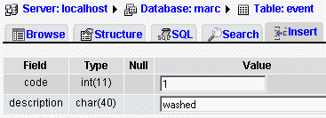

# 三、数据命名

在本章中，我们将重点介绍如何将收集过程中收集的数据元素转换为一组内聚的列名。虽然本章中有一些章节介绍了为实现高效数据命名而应完成的各个步骤，但没有具体的顺序来应用这些步骤。事实上，整个过程被分解为几个步骤，以便依次对每个步骤进行说明，但实际的命名过程同时应用所有这些步骤。此外，命名和分组过程之间的划分有些人为。您将看到，有关命名的一些决定会影响分组阶段，这是下一章的主题。

# 数据清理

从各种来源收集信息元素后，适当进行一些清理工作，以提高这些元素的重要性。每个受访者命名元素的方式可能不一致；此外，一个术语的意义因人而异。因此，同义词检测过程是有序的。

由于我们注意到了样本值，现在是时候用这些样本值交叉引用我们的元素列表了。下面是一个实际的例子，使用汽车的 id 号。

当决定订购一辆车——一辆 Mitsou 2007 时，办公室职员打开一个新文件，并为文件分配一个名为`car_id number`的序列号，例如 725。目前，还没有收到任何汽车供应商的确认书，因此店员不知道未来汽车的序列号——一个印在发动机和车辆其他关键部件上的唯一编号。

这辆车的身份证号码被办公室职员称为`car_number`。登记车辆移动的店员使用名称`stock_number`。但使用此车号或股票号对于融资和保险目的没有意义；汽车的序列号用于此目的。

在这一点上，必须通过说服用户标准条款的重要性来达成共识。大家必须清楚，术语`car_number`不够精确，无法使用，因此在数据元素列表中，也可能在任何用户界面（UI）或报告中，它将被`car_internal_number`取代。

可以说`car_internal_number`应该被更合适的东西取代；这里重要的一点是我们合并了两个同义词：`car_number`和`stock_number`，并确定了两个看起来相似但不相似的元素之间的差异，消除了混淆的根源。

因此，我们得出以下结论：

*   `Car_serial_number`
*   `Car_internal_number`（原车号、库存号）

最后，在处理数据分组时，必须做出另一个决定：我们将汽车的物理钥匙号码与哪个号码关联，序列号还是内部号码。

# 细分数据元素

在本节中，我们试图找出是否应该将某些元素分解为更简单的元素。这样做的原因是，如果一个元素由许多部分组成，那么应用程序将不得不为了排序和选择的目的而将其拆分。因此，最好现在就在源代码处分解元素。在应用程序级别重新编译它将更容易。

分解元素在 UI 级别提供了更清晰的信息。因此，在这个级别上，我们将（尽可能）避免众所周知的姓/名倒置问题。

作为这个问题的一个例子，让我们以买家的名字为例。在采访过程中，我们注意到姓名在表格上有多种表达方式：

<colgroup><col style="text-align: left"> <col style="text-align: left"></colgroup> 
| 

类型

 | 

名称的表达方式

 |
| --- | --- |
| 交货证书 | 乔·史密斯先生 |
| 销售合同 | 史密斯，乔 |

我们注意到

*   先生，这里有一个称呼的成分
*   元素`name`太不精确；我们真的有名字和姓氏
*   在销售合同中，姓氏后的逗号实际上应该从元素中排除，因为它只是一个格式字符

因此，我们决定将名称细分为以下元素：

*   打招呼
*   名字
*   姓

有时细分元素是有用的，但有时不是。让我们考虑日期元素。我们可以将每一项细分为年、月和日（三个整数），但这样做，我们将失去 MySQL 提供的日期计算可能性。其中包括从一个日期中找出一周的日期，或者确定某个日期后三十天的日期。因此，对于日期（和时间），单个列可以处理所有内容，尽管在 UI 级别，应该为年、月和日显示单独的输入字段。这是为了避免任何混淆的可能性，也因为我们不能期望用户知道 MySQL 接受的有效日期。在有效值的范围内有一定的自由度，但我们可以想当然地认为，用户在如何输入无效值方面具有无限的创造力。如果 UI 上存在单个字段，则应提供明确的说明，以帮助正确填写此字段。

## 包含格式化字符的数据元素

我们要检查的最后一个案例是电话号码。在世界上许多地方，电话号码遵循特定的模式，并使用格式字符进行易读。在北美，我们有地区代码、交换号码和电话号码，例如 418-111-2222；电话号码可能会追加分机号码。然而，在实践中，只有区域代码和扩展与其他代码分离，成为它们自己的数据元素。此外，人们通常输入格式化字符，如（418）111-2222，并期望这些字符被输出回来。因此，必须选择标准输出格式，然后必须在模型中设置正确数量的子元素，以便能够重新创建预期的输出。

# 属于结果的数据

尽管汽车的`total_price`有一个独特的元素似乎很自然，但实际上这是不合理的。原因是总价格是一个计算结果。将总价打印在销售合同上构成输出。因此，我们在列名列表中删除了这些信息。出于同样的原因，我们可以省略`tax`列，因为它可以计算。

通过删除总价栏，我们可能会遇到一个陷阱。我们必须确保，无论是现在还是将来，我们都可以从其他小计要素中重构这个总价格。这可能是不可能的，原因有很多：

*   总价包括位于另一个表中的金额，此表将随时间变化（例如，税率）。为避免此问题，请参见[第 4 章](5.html "Chapter 4. Data Grouping")中*随时间可伸缩性*部分的建议。
*   由于某些特殊情况，此总价包含任意值，例如，有特殊销售，系统中未计划回扣，或者幸运买家是总经理的姐夫！在这种情况下，可以做出决定：添加一个新列`other_rebate`。

# 数据作为列或表的名称

现在是时候揭示可能是最不为人所知的数据命名问题了：隐藏在列甚至表名中的数据。

我们在[第一章](2.html "Chapter 1. Introducing MySQL Design")中有一个例子。记住`qty_2006_1`列名。虽然这是一个常见的错误，但它仍然是一个错误。我们显然有两个想法，数量和日期。当然，为了能够只使用两列，必须对[第 4 章](5.html "Chapter 4. Data Grouping")中介绍的键做一些工作。现在，我们应该在元素列表中只使用像`quantity`和`date`这样的元素，避免用列名表示数据。

要在我们的模型中找到这些问题案例，一种可能的方法是查找数字。像`address1, address2`或`phone1, phone2`这样的列名应该看起来可疑。

现在，请看[第 2 章](3.html "Chapter 2. Data Collecting")中我们从我们的店员那里得到的数据元素。你能找到数据隐藏在列名中的情况吗？

如果你做了这个练习，你可能会发现许多过去分词隐藏在列名中，比如*ordered、*right、*wash*。这些描述了发生在汽车上的事件。我们可以尝试预测所有可能发生的事件，但这可能被证明是不可能的。谁知道什么时候需要新专栏`car_provided_with_big_ribbon`？如果将此类事件视为不同的列名，则必须由

*   数据结构的变化
*   代码中的更改（UI 和报告）

为了保持灵活性并避免宽表综合症，我们需要两张表：`car_event`和`event`。


以下是这些表的结构和示例值：

```sql
CREATE TABLE `event` (
`code` int(11) NOT NULL,
`description` char(40) NOT NULL,
PRIMARY KEY ('code')
) ENGINE=MyISAM DEFAULT CHARSET=latin1;
INSERT INTO `event` VALUES (1, 'washed');

```

### 注

此处使用 backticks（'event'），虽然不是标准的 SQL，但它是一个用于封装和保护标识符的 MySQL 扩展。在这个特定的例子中，它可以帮助我们使用 MySQL 5.1，在 MySQL 5.1 中，事件关键字计划成为语言的一部分，用于其他目的（`CREATE EVENT`。在撰写本文时，测试版 MySQL 5.1.11 接受`CREATE TABLE event`，但它可能并不总是正确的。

下图显示了从 phpMyAdmin 的**插入**子页面中输入`event`表的样本值



```sql
CREATE TABLE `car_event` (
`internal_number` int(11) NOT NULL,
`moment` datetime NOT NULL,
`event_code` int(11) NOT NULL,
PRIMARY KEY ('internal_number')
) ENGINE=MyISAM DEFAULT CHARSET=latin1;
INSERT INTO `car_event` VALUES (412, '2006-05-20 09:58:38', 1);

```

同样，通过 phpMyAdmin 输入样本值：


数据也可以隐藏在表名中。让我们考虑一下 T0 和 T1 表。它们可能应该合并到`vehicle`表中，因为车辆的类别卡车、汽车和其他值（如 minivan）实际上是特定车辆的属性。我们还可以找到这个表名问题的另一个例子：一个名为`vehicle_1996`的表。

# 变更计划

在设计数据结构时，我们必须考虑如何管理其增长以及所选技术可能带来的影响。

比如说，一辆计划外的汽车必须承受重量。解决这个问题的通常方法是找到合适的表并添加一列。事实上，这是最好的解决办法；但是，必须有人修改表的结构，可能还要修改 UI。

在这种情况下，有时会使用**自由字段技术**，也称为二级数据或**EAV**（实体属性值）技术。为了总结这种技术，我们使用一个列，其值本身就是一个列名。

### 注

即使这里显示了这种技术，我也不建议使用它，原因在下面的自由场技术部分的*陷阱中解释。*

此技术与我们的`car_event`表的区别在于，对于`car_event`，各种属性都可以与一个公共主题相关，即事件。相反，自由场可以存储任何类型的不同数据。这也可能是一种存储特定于表的单个实例或行的数据的方法。

在下面的示例中，我们使用`car_free_field`表存储关于`internal_number`为 412 的汽车的计划外信息。重量和特殊油漆还没有计划好，因此用户界面让用户有机会指定他们想要保留的信息以及相应的值。我们在这里看到了 phpMyAdmin 的屏幕截图，但很可能会向用户呈现另一个 UI，例如销售人员，他们可能没有接受过在数据库级别玩游戏的培训。

```sql
CREATE TABLE `car_free_field` (
`internal_number` int(11) NOT NULL,
`free_name` varchar(30) NOT NULL,
`free_value` varchar(30) NOT NULL,
PRIMARY KEY ('internal_number','free_name')
) ENGINE=MyISAM DEFAULT CHARSET=latin1;
INSERT INTO `car_free_field` VALUES (412, 'weight', '2000');
INSERT INTO `car_free_field` VALUES (412, 'special paint needed', 'gold');

```


## 自由场技术的陷阱

即使为了增加灵活性和避免用户界面维护而使用这种表是很有诱惑力的，但我们还是有很多理由应该避免使用它。

*   使用外键约束，无法将此“列”（例如需要的**特殊油漆）链接到包含可能颜色的查找表。**
*   `free_value`字段本身必须定义一个通用字段类型，如`VARCHAR`，其大小必须足够宽，以容纳所有可能对应的`free_name`值的所有值。
*   它阻止了简单的验证（对于权重，我们需要一个数值）。
*   对这些自由字段上的 SQL 查询进行编码变得更加复杂，即`SELECT internal_number from car_free_field where free_name = 'weight' and free_value > 2000`。

# 命名建议

在这里，我们触及一个可能变得敏感的主题。建立命名约定并不容易，因为它会干扰设计师的心理。

## 设计师的创造力

程序员和设计师通常认为自己是富有想象力和创造力的人；用户界面设计和数据模型是他们想要表达这些品质的领域。因为命名是写的，所以他们希望在列名和表名上打上个人印记。这就是为什么作为一个团队进行数据结构设计需要谦虚，只有当每个人都是一个好的团队成员时，才能取得好的结果。

此外，在查看其他人在这一领域的工作时，有很大的诱惑来*改进*数据元素名称。必须应用标准化中的一些规程，所有团队成员必须协作。

## 缩写

可能是因为较旧的数据库系统通常对变量和数据元素的表示有严格的限制，缩写的实践已经教授了很多年，许多数据结构设计师和程序员都遵循这种做法。我使用的编程语言只接受两个字符作为变量名，我们必须广泛地评论那些被裁剪的变量之间的对应关系及其含义。

现在，我看不出有任何合理的理由系统地缩写所有列和表名；毕竟，谁会理解您的`T1`表或`B7`字段的含义？

### 清晰与长度：一门艺术

应使用一致的缩写形式。一般来说，只有一个句子中最有意义的词才应该放进一个名字，去掉介词和其他小词。以邮政编码为例。我们可以用不同的列名表示此元素：

*   邮政编码
*   pstl_ 码
*   液晶显示器
*   邮政编码

我推荐最后一个，因为它简单。

### 后缀

精心选择的后缀可以增加列名的清晰度。例如，对于*首次付款日期*元素，我建议使用`first_payment_date`。事实上，列名的最后一个字通常用于描述内容的类型，如`customer_no, color_code, interest_amount`。

## 复数形式

表名的另一个争议点是：我们应该使用复数形式`cars`表吗？可以说，答案是肯定的，因为这张表包含许多汽车，换句话说，它是一个集合。尽管如此，我倾向于不使用复数形式，原因很简单，它在信息方面没有添加任何内容。我知道桌子是一个集合，所以使用复数形式是多余的。也可以说每行描述一辆车。

如果我们从查询的角度考虑主题，我们可以根据查询得出不同的结论。如果不使用复数形式，则引用 car 表-`select car.color_code from car where car.id = 34`的查询更优雅，因为这里的主要思想是检索一辆 id 等于 34 的汽车。其他一些查询可能更适合复数形式，如`select count(*) from cars`。

作为本节的结论，辩论还没有结束，但最重要的一点是选择一种形式并在整个系统中保持一致。

## 命名一致性

我们应该确保存在于多个表中的数据元素在任何地方都由相同的列名表示。在 MySQL 中，列名本身并不存在；它总是在桌子里面。不幸的是，这就是为什么我们不能从标准化列名池中提取一致的列名并将其与表关联。相反，在每个表的创建过程中，我们都会指明所需的确切列名及其属性。所以，当提到同一个现实时，让我们避免使用不同的名称-`internal_number`和`internal_num`。

例外情况：如果列的名称引用另一个表中的键，`state`列，我们有多个列引用它，如`state_of_birth, `state_of_residence``。

## MySQL 的可能性与可移植性

MySQL 允许使用比其竞争对手更多的字符作为数据库、表和列名的标识符。空白空间被接受为重音字符。简单的权衡是，我们需要用后面的引号将这些特殊名称括起来，如`'state of residence'`。这为数据元素的表达带来了极大的自由，特别是对于非英语设计师而言，但由于标准 SQL 中不接受这些标识符，因此引入了不可移植的状态。甚至有些 SQL 实现也只接受标识符的大写字符。

我建议在决定加入这些字符之前要非常谨慎。即使忠实于 MySQL，在升级到 4.1 时，4.1 之前的版本之间也存在可移植性问题。在 4.1.x 中，MySQL 开始在 UTF-8 代码中内部表示标识符，因此必须进行重命名操作，以确保在升级之前数据库、表、列和约束名称中不存在重音字符。这种繁琐的操作在全天候系统可用性环境中并不实用。

## 将表名转换为列名

我经常看到的另一种风格是：系统地将表名作为前缀添加到每个列名中。因此，`car`表将由以下列组成：`car_id_number, car_serial_number`。我认为这是多余的，在检查我们构建的查询时，它显示了它的不雅：

```sql
select car_id_number from car

```

不是很糟糕，但是当连接表时，我们会得到一个查询，例如

```sql
select car.car_id_number,
buyer.buyer_name
from car, buyer

```

由于在应用程序级别，我们编写的大多数查询都是与上面使用的查询类似的多个表，因此使用表名（甚至缩写为列名的一部分）的笨拙性显而易见。当然，我们在*命名一致性*部分看到的相同例外也适用：引用查找表的列外键通常包括该表的名称作为列名称的一部分。例如，在`car_event`表中，我们有`event_code`，它指的是表`event`中的`code`列。

# 总结

为了获得清晰易懂的数据结构，正确的数据元素命名非常重要。为了构建一致的表名和列名，我们研究了许多需要应用的技术。