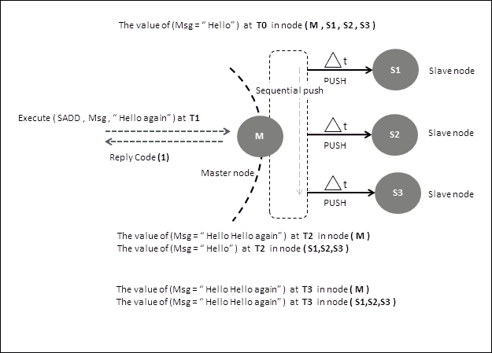
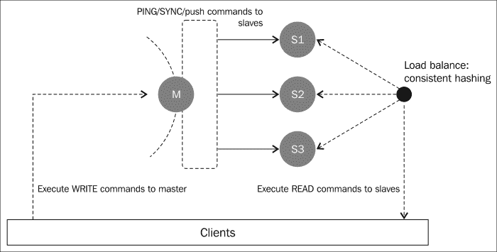
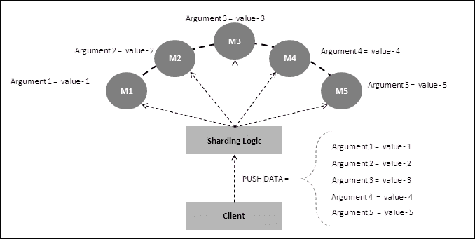
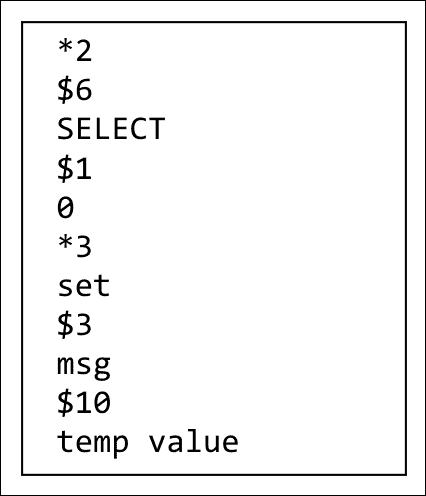
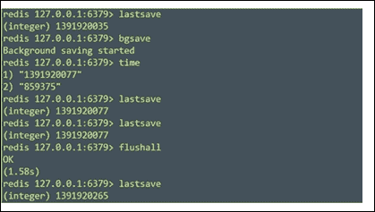

# 五、Redis 中的数据处理

业务中的数据定义了业务。这意味着我们定义、存储、解释和使用数据的方式构成了我们业务的数据平台。很少有一段数据本身就有意义；它仅在与其他数据组合时形成业务功能。因此，数据的连接、分组和过滤变得非常重要，以便相同的数据集可以用于业务的各个方面。

为了有一个能够支持未来需求的平台，我们应该以一种能够显示我们对数据的期望的方式来定义和分类数据。数据有许多方面，了解这些方面对于从中提取全部业务价值非常重要。例如，一家公司的股票价格对于实时系统决定是买入还是卖出很重要，几秒钟或几毫秒后它就失去了重要性。然而，分析系统预测其趋势变得非常重要。因此，在某种程度上，同一段数据在不同的时间有不同的用途。因此，在制定数据体系结构的策略时，考虑数据的各种期望是一种很好的做法。

# 分类数据

一种普遍的趋势是只考虑符合关系模型的数据模型。对于某些类别的数据，这可能是一个很好的模型，但对于另一类数据，这可能会被证明是无效的。由于本书是关于 Redis 的，我们将尝试根据某些行为对数据进行分类，并尝试查看 Redis 的适用范围：

*   **Message and event data**: The data classified as message data in business show the following properties:
    *   **数据复杂度**：消息数据结构通常比较扁平，数据复杂度较低
    *   **数据量**：报文数据量通常较大
    *   **持久性**：消息数据可以存储在磁盘和内存中
    *   **CAP 属性**：消息数据至少需要可用且分区容忍
    *   **可用性**：消息数据可以实时可用、软实时可用、离线可用，表现出重写低读的特性

    如果对消息数据的要求是实时和软实时活动，且数据量不是很高，则可以使用 Redis 及其消息功能。

*   **Cache data**: The data classified as cache data in business shows the following properties:
    *   **数据复杂度**：缓存数据的数据复杂度较低，大部分存储为名称-值对
    *   **数据量**：缓存数据量一般为低到中等
    *   **持久性**：数据可以存储在高速缓存中
    *   **CAP 属性**：缓存数据至少需要可用且一致
    *   **可用性**：缓存数据可以实时可用，并显示低写高读

    Redis 非常适合缓存数据，因为它提供了可由程序直接用于存储数据的数据结构。此外，Redis 中的键具有生存时间选项，可用于定期清理 Redis 中的数据。

*   **Meta data**: The data classified as meta data in business shows the following properties:
    *   **数据复杂度**：元数据数据复杂度较低，大部分存储为名称-值对
    *   **数据量**：元数据量通常较低
    *   **持久性**：元数据可以存储在内存中
    *   **CAP 属性**：元数据至少需要可用且一致
    *   **可用性**：元数据可以实时可用，通常显示低写入和低到高读取

    Redis 非常适合元数据，因为它提供了可由程序直接用于存储数据的数据结构。由于 Redis 速度快且具有消息传递功能，所以它可以用于元数据的运行时操作，也可以充当中央元数据存储库。下图展示了如何将 Redis 用作元数据存储：

    

    Redis 作为元数据存储

*   **Transactional data**: The data classified as transactional data in business shows the following properties:
    *   **数据复杂度**：事务性数据具有中到高的数据复杂度，且大部分为关系型
    *   **数据量**：事务性数据量通常为中到高
    *   **持久性**：事务性数据可以存储在内存和磁盘中
    *   **CAP 属性**：事务性数据至少需要一致性和分区容错性
    *   **可用性**：事务性数据需要显示`CRUD`行为，这是 Redis 不具备的功能

    Redis 不是这种数据的合适的数据存储。我们可以在这里指出的另一点是，无论我们在哪里需要分区容差作为 CAP 特性，都不应该使用 Redis。

*   **Analytical data**: The data classified as analytical data in business shows the following properties:
    *   **数据复杂性**：数据复杂性可以在在线分析和离线分析的基础上进一步分离。在线分析数据具有低到中等的数据复杂性，因为它们可以包含类似于图形的关系。离线分析具有非常高的数据复杂性。
    *   **数据量**：根据我们需要的分析类型，这里的数据通常具有从低到高的量。与离线分析相比，在线分析的数据量更低。
    *   **持久性**：数据可以存储在磁盘和内存中。如果需要在线分析，则数据将保留在内存中，但如果分析处于脱机状态，则数据需要保留在磁盘中。
    *   **CAP 属性**：离线分析时，数据需要至少可用且分区容忍，在线分析时，数据需要可用且一致。
    *   **可用性**：消息数据可以实时可用、软实时可用、离线可用。

    如果需要在线分析，则可以使用 Redis，前提是数据的复杂性较低。

在前面的数据分类中，我们看到了一些适合 Redis 的领域和可以避免 Redis 的领域。但要想让 Redis 在业务解决方案环境中得到重视，它必须展示容错、故障管理、复制等功能。在下一节中，我们将深入研究如何处理冗余和故障管理。

# 主从数据复制

在任何业务应用程序中，最重要的是以复制的方式保存数据，因为硬件可以随时中断而不发出任何警告。为了保持业务的连续性，当主数据库宕机时，有必要使用复制数据库，这在某种程度上保证了服务质量。当一个数据库上的通信量增加并且对解决方案的性能产生负面影响时，实现了复制数据的另一个好处。为了提供性能，重要的是平衡流量并降低每个节点上的负载。

Cassandra 等数据存储提供主-主配置，其中拓扑中的所有节点都类似于主节点，数据复制基于基于密钥生成的令牌散列进行，为此，拓扑中的节点基于令牌范围进行分区。

Redis 不同于主-主数据存储，它有一个更简单的主从安排。它的意思是，主节点将写入所有数据，然后将数据复制到所有从节点。复制是异步进行的，这意味着数据写入主数据时，从数据不是同步写入的，而是一个单独的进程异步写入的，因此更新不是即时的；换句话说**最终一致性**。但这种安排在绩效方面有优势。如果复制是同步的，那么当对主设备进行更新时，主设备必须更新所有从设备，然后只有更新将被标记为成功。因此，如果有更多的从机，那么更新将变得更加耗时。

下图显示了 Redis 中的主从复制过程。为了更好地理解该过程，假设在时间**??**时，**Msg**表示的集合的值在主节点和所有从节点中都是**“Hello”**（**S1**、**S2**、**S3**）。当执行 insert 命令**SADD**以在**??**时刻向集合插入值（**“再次你好”**时，值**Msg**在**??**时刻变为**再次你好**，但从节点的**Msg**的值仍然是**“你好”**。新值将成功插入主节点，并且成功插入的回复代码将发送回客户端。同时，主设备将开始插入所有具有新值的从属设备，这将在时间**??**中发生。因此，在时间**??**时，所有节点（主节点和从节点）都用新值更新。主设备更新和从设备更新之间的时间间隔非常小（以毫秒为单位）。

为了更好地理解 Redis 中主从式的工作原理，让我们回顾上一章讨论 Redis 中的实时消息传递。为了在这种情况下应用相同的功能，我们可以认为所有从属节点都已订阅主节点，并且当主节点更新时，它将新数据发布到所有从属节点。



主从系统中的数据复制

那么，当一个从机停机而主机发生更新时会发生什么呢？那么，在这种情况下，特定的从机将错过更新，并且仍然携带旧的值。然而，当从机再次连接回主机时，它所做的第一件事就是向主机发出`SYNC`命令。此命令将数据发送到从节点，从节点可以更新自身。

## 设置主、从节点

在 Redis 中设置主从节点非常简单。我们在这里要做的是在本地机器上为 Redis 设置一个主节点和一个从节点。我们在这里要做的第一件事是将 Redis 文件夹（在我们的例子中是`redis 2.6`）复制到一个合适的位置。现在我们在两个不同的地方有了 Redis 发行版。


主节点文件夹和从节点文件夹

为了更好的理解，我们将参考**Redis-2.6**作为主节点，参考**Redis-2.6.slave**作为从节点。现在打开主节点，进入`bin/release`文件夹，启动 Redis 服务器。这将启动本地主机中的 Redis 服务器，端口地址为 6379。现在打开从节点，打开`Redis.conf`文件保存在合适的文本编辑器中。至少需要更改两个属性才能启动从属节点。需要编辑的第一个属性是`port`。在我们的例子中，让我们将值从 6379 更改为 6380。由于主节点将在 6379 侦听请求，从属节点必须在不同的端口侦听（我们将从同一台机器上启动主设备和从设备）。需要进行的第二个属性更改是`slaveof`，其值将为`127.0.0.1 6379`。这基本上是告诉从设备主设备运行的位置和端口。这很有帮助，因为从设备将使用此地址发送`SYNC`和其他命令。通过这些最小的更改，我们可以继续。现在转到从属节点的`bin/release`文件夹并启动 Redis 服务器。

### 注

启动 Redis server 时，提供从节点的`Redis.conf`路径，即 Redis server`F:\path\to\config-file\Redis.conf`。

当我们启动从节点时，我们看到的第一件事是它将尝试连接到主节点。从其`Redis.conf`中，从节点将计算出主节点的主机和端口。与其他数据存储相比，Redis 中的另一个不同之处在于，它使用一个端口来满足业务请求，同时也使用`SYNC`和其他端口来满足来自从属节点的类似请求。这主要是因为 Redis 是一个单线程服务器，线程只侦听到达套接字的消息。

下图显示了从节点启动时命令提示符的外观（请确保主节点已启动并正在运行）：


从节点从端口 6380 开始

这里有几件事需要注意。首先，从节点启动的时刻，它向主节点发出`SYNC`命令。该命令是一个非阻塞命令，这意味着单个线程不会为了满足该请求而保存其他请求。基本上，主节点所做的是将其放入该连接的请求堆栈中，并将其与其他连接进行时间切片，当该连接的该命令的活动完成时（在我们的示例中，`SYNC`用于从属节点），它将其发送给从属节点。在这种情况下，它发送回来的是命令和数据，奴隶需要与主机保持一致。此命令与数据一起执行，然后加载到从属数据库中。主机发送的所有命令都是更改数据的命令，而不是数据`getter`命令。主设备用于连接从设备的协议是**Redis 协议**。

让我们看看一些场景，看看 Redis 在主从模式下的行为：

*   主机启动，telnet 会话连接到主机：
    1.  确保 Redis 主节点已启动。
    2.  确保主机的 Redis 客户端正在运行。
    3.  打开命令提示符，使用命令`telnet 127.0.0.1 6379`连接到主机。
    4.  Type the command `SYNC` in the telnet client. The following text should appear in the command prompt:

        

        主 ping telnet 客户端

    5.  Go to your master client prompt and type the command `SET MSG "Learning Redis master slave replication"` and execute it. Immediately shift to the telnet command prompt and you will see the following output:

        

        Master 将数据发送到 telnet 客户端

    6.  现在在主节点的客户机提示符下执行`GET MSG`命令
*   主设备启动，从设备第一次连接：
    1.  从属控制台与上图类似。
    2.  从主 Redis cli 以`SET MSG "Learning Redis"`的形式发出命令。
    3.  从从属 Redis cli 以`GET MSG`的形式发出命令。
    4.  确保您提供了主机和端口地址；在我们的例子中，因为我们已经在 localhost 中配置了它，并且端口配置为 6380，所以该命令看起来像`Redis-cli.exe -h localhost -p 6380`。
    5.  结果应该是`"Learning Redis"`。
*   断开一段时间后，主设备启动，从设备再次启动：
    1.  杀死从属节点和客户端。
    2.  进入主机客户端命令提示符，写入命令`SET MSG "Slave node is down"`。
    3.  现在启动从属节点及其客户端（提供主机和端口信息）。
    4.  从从机客户端命令提示符执行命令`GET MSG`，结果应为`"Slave node is down"`。
*   Master 启动并正在执行管道命令，我们正在从 slave 读取值：
    1.  确保主设备和从设备已启动并正在运行。
    2.  在从客户端的命令提示符下写入`SCARD MSG`命令，但不执行。我们将获取集合`MSG`中的成员数量。
    3.  打开您的Java 客户端，编写以下程序：

        ```java
        package org.learningRedis.chapter.five;
        import Redis.clients.jedis.Jedis;
        import Redis.clients.jedis.Pipeline;
        public class PushDataMaster {
                  public static void main(String[] args) {
                    PushDataMaster test = new PushDataMaster();
                    test.pushData();
                  }
                  private void pushData() {
                    Jedis jedis = new Jedis("localhost",6379);
                    Pipeline pipeline = jedis.pipelined();
        for(int nv=0;nv<900000;nv++){
                      pipeline.sadd("MSG", ",data-"+nv);
                    }
                    pipeline.sync();
                  }
        }
        ```

    4.  Execute this command and immediately switch to your slave client command prompt and execute the command you had written. The result will be similar to the figure shown next. What it tells us is that the moment a command is executed in the master node which changes the dataset, the master starts buffering these commands and sends them to the slave. In our case, when we did a `SCARD` on the set, we saw results in an incremental way.

        

        从属节点上 SCARD 命令的结果

    5.  主服务器已启动，正在执行一个事务命令，我们正在从从服务器读取值。
*   主设备下线时提升从设备为主设备，重新启动主设备作为从设备：
    1.  启动主 Redis 服务器和从 Redis 服务器。
    2.  从 IDE 执行以下 Java 程序：

        ```java
        package org.learningRedis.chapter.five.masterslave;
        import Redis.clients.jedis.Jedis;
        public class MasterSlaveTest {
          public static void main(String[] args) throws InterruptedException {
            MasterSlaveTest test = new MasterSlaveTest();
            test.masterslave();
          }
          private void masterslave() throws InterruptedException {
            Jedis master = new Jedis("localhost",6379);
            Jedis slave = new Jedis("localhost",6380);
            master.append("msg", "Learning Redis");
            System.out.println("Getting message from master: " + master.get("msg"));
            System.out.println("Getting message from slave : " + slave.get("msg"));
            master.shutdown();
            slave.slaveofNoOne();
            slave.append("msg", " slave becomes the master");
            System.out.println("Getting message from slave turned master : " + slave.get("msg"));
            Thread.currentThread().sleep(20000);
            master = new Jedis("localhost",6379);
            master.slaveof("localhost", 6380);
            Thread.currentThread().sleep(20000);
            System.out.println("Getting message from master turned slave : " + master.get("msg"));
            master.append("msg", "throw some exceptions !!");
          }
        }
        ```

    3.  When the program goes to sleep for the first time, quickly go to the command prompt of the master and restart it (don't touch the slave node). Allow the program to finish and the output is going to be similar to the following image:

        

        主人变成奴隶，奴隶变成主人

    4.  程序中的第二次睡眠意味着让主机与新主机同步。
    5.  当旧主机尝试对密钥进行写入时，由于从机无法写入，因此失败。
    6.  Server messages when the old slave became new master.

        

        奴隶变成主人

    7.  Server messages when the old master is started as a new slave. We can also see that the moment the old master restarts, the first thing it does as a slave is to sync with the new master and update its datasets.

        

        主人变成奴隶

    8.  如果我们不在程序中进行第二次休眠，旧主机将没有时间与新主机同步，如果客户端请求密钥，那么它将最终显示密钥的旧值

到目前为止，我们已经了解了 Redis 的主从功能，以及它在主控或从控失效的情况下的行为。我们还讨论了 master 向 slave 发送数据并复制数据集。但问题仍然是，当 Redis master 必须向从机发送数据时，它会发送什么？为了找出答案，让我们进行一个小实验，以澄清幕后活动。

### 性能模式-高读取

在生产环境中，当并发性较高时，制定某种策略就变得非常重要。拥有复制模式肯定有助于在整个环境中分配负载。此模式中遵循的复制模式是向主设备写入数据和从设备读取数据。



主设备和从设备中的复制策略

我们将运行的示例不是前面提到的解决方案的正确复制，因为主设备和从设备将在同一台机器（我的笔记本电脑）上运行。通过在同一台机器上运行主节点和从节点，我们可以利用公共内存和处理能力。除此之外，客户机程序还使用相同的资源。但是，由于服务器 I/O 发生在两个不同的端口上，因此仍然会观察到这种差异，这意味着至少有一个单独的套接字内存绑定到两个单独的服务器线程（Redis 是单线程服务器）来处理读取请求。

在生产环境中，最好每个节点都使用自己的核心，因为 Redis 不能使用多核。

在这个示例中，我们将使用一个主节点和两个从节点。在第一个用例中，我们将使用主设备写入数据，使用从设备读取数据。我们将只计算读取所花费的总时间，并将其与完全在主节点上执行读取的场景进行比较。

为了准备样品，我们需要准备环境，下图简要描述了该样品的设置。请注意，所有资源都来自一台机器：


样本的设置

下面编写的程序可以适应前面讨论的两种场景。要在**用例 1**模式下工作（写入主机和从主机节点读取），请调用以下函数：

1.  在第一次运行时呼叫`test.setup()`。
2.  第二轮呼叫`test.readFromMasterNode()`
3.  请注意以下函数调用，这将不允许**用例-2**运行`// test.readFromSlaveNodes();`。

要在**用例-2**模式下工作（写入主机和从两个从机读取），调用以下函数，但在此之前，执行`FLUSHDB`命令清理数据或不执行`test.setup();`函数：

1.  在第一次运行时调用`test.setup();`（可选）。
2.  第二轮呼叫`test.readFromSlaveNodes();`。
3.  请注意以下函数调用，这将不允许**用例-1**运行`// test.readFromMasterNode();`。

代码有三个简单类，对这些类的简要描述如下：

*   `MasterSlaveLoadTest`：该类具有以下特点：
    *   这是主课
    *   此类协调**用例-1**和**用例-2**的流程
    *   此类负责为**用例 1**和**用例 2**创建线程
    *   以下是`MasterSlaveLoadTest`的代码：

        ```java
        package org.learningRedis.chapter.five.highreads;
        import java.util.ArrayList;
        import java.util.List;
        import Redis.clients.jedis.Jedis;
        public class MasterSlaveLoadTest {
          private List<Thread> threadList = new ArrayList<Thread>();
          public static void main(String[] args) throws InterruptedException {
            MasterSlaveLoadTest test = new MasterSlaveLoadTest();
            test.setup();
        //make it sleep so that the master finishes writing the //values in the datastore otherwise reads will have either //null values
        //Or old values.
            Thread.currentThread().sleep(40000); 
            test.readFromMasterNode();
            test.readFromSlaveNodes();
          }
          private void setup() {
            Thread pumpData = new Thread(new PumpData());
            pumpData.start();
          }
          private void readFromMasterNode() {
            long starttime = System.currentTimeMillis();
            for(int number=1;number<11;number++){
              Thread thread = new Thread(new FetchData(number,starttime,"localhost",6379));
              threadList.add(thread);
            }
            for(int number=0;number<10;number++){
              Thread thread =threadList.get(number);
              thread.start();
            }
          }
          private void readFromSlaveNodes() {
            long starttime0 = System.currentTimeMillis();
            for(int number=1;number<6;number++){
              Thread thread = new Thread(new FetchData(number,starttime0,"localhost",6381));
              threadList.add(thread);
            }
            long starttime1 = System.currentTimeMillis();
            for(int number=6;number<11;number++){
              Thread thread = new Thread(new FetchData(number,starttime1,"localhost",6380));
              threadList.add(thread);
            }
            for(int number=0;number<10;number++){
              Thread thread =threadList.get(number);
              thread.start();
            }
          }
        }
        ```

*   `PumpData`：该类具有以下特点：
    *   这是负责将数据推送到主节点的类
    *   数据推送是单线程的
    *   `PumpData`的代码如下：

        ```java
        package org.learningRedis.chapter.five.highreads;
        import Redis.clients.jedis.Jedis;
        public class PumpData implements Runnable {
          @Override
          public void run() {
            Jedis jedis = new Jedis("localhost",6379);
            for(int index=1;index<1000000;index++){
              jedis.append("mesasge-"+index, "my dumb value "+ index);
            }
          }
        }
        ```

*   `FetchData`：该类具有以下特征：
    *   这是负责从 Redis 节点获取数据的类
    *   此类以多线程模式调用
    *   此类在开始时传递，因此返回的最后一个结果将指示执行的总时间
    *   `FetchData`的代码如下：

        ```java
        package org.learningRedis.chapter.five.highreads;
        import Redis.clients.jedis.Jedis;
        import Redis.clients.jedis.JedisPool;
        public class FetchData implements Runnable {
          int endnumber  = 0;
          int startnumber= 0;
          JedisPool jedisPool = null;
          long starttime=0;
          public FetchData(int number, long starttime, String localhost, int port) {
            endnumber   = number*100000;
            startnumber = endnumber-100000;
            this.starttime = starttime;
            jedisPool = new JedisPool(localhost,port);
          }
          @Override
          public void run() {
            Jedis jedis = jedisPool.getResource();
            for(int index=startnumber;index<endnumber;index++){
              System.out.println("printing values for index = message"+index+" = "+jedis.get("mesasge-"+index));
              long endtime = System.currentTimeMillis();
              System.out.println("TOTAL TIME" + (endtime-starttime));
            }
          }
        }
        ```

    *   运行前面的程序几次迭代，取出最佳和最差记录，然后取出平均结果。对于我运行的迭代，我得到了以下结果：
    *   对于 USECASE-1，平均时间为 95609 毫秒
    *   对于 USECASE-2，平均时间为 72622 毫秒
    *   虽然在你的机器上的结果在数量上是不同的，但结果是相似的。这清楚地表明，从从节点读取数据和向主节点写入数据的性能明显更好。

### 性能模式-高写入

在生产环境中，当写操作对并发性的要求很高时，制定某种策略就变得非常重要。拥有一个复制模式肯定有助于在整个环境中分配负载，但当写操作中对并发性的需求很高时，仅复制模式是没有帮助的。此外，在 Redis 中，从属节点不能具有写入功能。为了使数据在数据库中高度并发地写入，在环境中跨多个数据库节点共享数据集非常重要。许多数据库具有内置功能，可以在节点之间相应地分割数据。除了写操作中的高并发性外，数据集分片的优点是提供了部分容错机制。换句话说，即使其中一个节点宕机，也会使其中包含的数据集不可用，但其他节点仍然可以满足对其所持有数据的请求。

作为一个数据库，Redis 缺乏跨多个节点共享数据的能力。但也有可能在 Redis 之上构建某种智能，可以进行分片工作，从而实现 Redis 的高并发写入。这里的整个想法是将责任从 Redis 节点转移到另一个位置。



基于分片逻辑跨节点分发数据

在 Redis 之上可以构建各种逻辑，用于分配写负载。逻辑可以基于循环，其中数据可以分布在顺序排列的节点上；例如，数据将进入**M1**，然后进入**M2**，然后进入**M3**，依此类推。但这种机制的问题是，如果其中一个节点发生故障，循环逻辑无法考虑丢失的节点，它将继续向有缺陷的节点发送数据，最终导致数据丢失。即使我们构建逻辑来跳过缺陷节点并将数据放在后续节点中，该策略也会导致该节点拥有自己的数据共享，因此缺陷节点的数据会很快填满其内存资源。

一致性散列是一种算法，当在节点之间均匀地分布数据时，它可以派上用场。基本上，我们在这里所做的是基于我们生成的算法，一个散列，它在整个可用的 Redis 服务器集中平均分配密钥。

Redis client for Java 已经内置了一致性哈希算法来分发写操作。详情如下:

```java
package org.learningRedis.chapter.five.sharding;
import java.util.ArrayList;
import java.util.List;
import org.apache.commons.pool.impl.GenericObjectPool.Config;
import Redis.clients.jedis.Jedis;
import Redis.clients.jedis.JedisSentinelPool;
import Redis.clients.jedis.JedisShardInfo;
import Redis.clients.jedis.ShardedJedis;
import Redis.clients.jedis.ShardedJedisPool;
public class MyShards {
  List<JedisShardInfo> shards = new ArrayList<JedisShardInfo>();
  public static void main(String[] args) {
    MyShards test = new MyShards();
    test.setup();
    test.putdata();
  }
  private void setup() {
    JedisShardInfo master0 = new JedisShardInfo("localhost", 6379);
    JedisShardInfo master1 = new JedisShardInfo("localhost", 6369);
    shards.add(master0);
    shards.add(master1);
  }
  private void putdata() {
    ShardedJedisPool pool = new ShardedJedisPool(new Config(), shards);
    for(int index=0;index<10;index++){
      ShardedJedis jedis = pool.getResource();
      jedis.set("mykey"+index, "my value is " + index);
      pool.returnResource(jedis);
    }
    for(int index=0;index<10;index++){
      ShardedJedis jedis = pool.getResource();
      System.out.println("The value for the key is "+ jedis.get("mykey"+index));
      System.out.println("The following information is from master running on port : " + jedis.getShardInfo("mykey"+index).getPort());
      pool.returnResource(jedis);
    }
  }
}
```

# Redis 中的持久性处理

Redis 为持久化数据提供了广泛的选项。这些机制有助于决定我们需要什么样的数据持久化模型，这完全取决于我们希望存储在 Redis 中的数据类型。我们在 Redis 中的四个选项如下：

*   通过 RDB 选项进行持久化
*   通过 AOF 选项进行持久化
*   通过 AOF 和 RDB 选项的组合进行持久化
*   一点也不坚持

让我们运行一个简单的程序，看看持久性机制的重要性，因为只有这样我们才能理解持久性的重要性。按照步骤进行操作，亲自了解缺少持久性会如何导致数据丢失：

1.  启动您的 Redis 服务器。
2.  打开 Redis 客户端命令提示符。
3.  执行命令`SET msg 'temporary value'`。
4.  通过 Linux 中的**kill-9**选项或 windows 中命令提示符中的**close**选项，手动快速杀死 Redis 服务器。
5.  重新启动 Redis 服务器。
6.  Execute the command `get msg`.

    

    在没有持久性处理的情况下获取 msg

## 通过 RDB 选项持久化

**Redis 数据库文件****RDB**是 Redis 服务器定期保存数据集的选项，也就是定期快照内存中的数据。该格式是一个非常紧凑的文件，用于将数据作为备份保存。这个文件在发生灾难时可以作为保存文件，因此非常重要。可以将 Redis 服务器配置为以不同的时间间隔拍摄快照。从性能的角度来看，这种持久化数据的方式将导致更高的性能，因为 Redis 服务器将以非阻塞的方式派生一个子进程来实现这一点。另一个优点是，由于 RDB 文件中只存储数据集，因此对于 RDB 文件，服务器启动速度非常快。但在 RDB 中存储数据集有其自身的缺点，因为如果 Redis 在两个快照之间发生故障，数据丢失的可能性是存在的。如果数据集的容量非常大，则可能会出现另一个问题，因为在这种情况下，Redis 服务器的分叉子进程将需要一段时间来加载数据，而这段时间可能会在该时间内阻止客户端请求。这个问题不会出现在生产场景中，因为在服务器重新启动和服务器处理客户机请求之间总是存在时间差。从硬件的角度来看，一台拥有更快处理器的机器总是能做到这一点。

### 配置 Redis 进行 RDB 持久化

在这里，我们将学习如何将数据持久保存在 RDB 文件上。在 Redis 中，RDB 持久化机制可以通过编辑`Redis.conf`文件或通过客户端提示符进行配置。当我们打开`Redis.conf`文件并转到`snapshotting`部分时，我们会看到以下选项：

*   `Save 900 1`：如果一把钥匙发生变化，15 分钟后保存
*   `Save 300 10`：如果更改了 10 个键，请在 5 分钟内保存
*   `Save 60 10000`：如果 10000 个按键发生变化，则在 1 分钟内保存

除了这些预先配置的选项外，我们还可以通过调整`Redis.conf`文件中的值来添加自己的选项。客户端还可用于在运行时添加用于数据集快照的配置。例如，`CONFIG SET SAVE "900 2 300 10"`将快照设置为`Save in 15 minutes if 2 keys have changed`和`Save in 10 minutes if one key has changed`，这将覆盖以前的值。

让我们运行一个简单的程序，如前一个程序，其中我们看到由于缺少持久性而导致的数据丢失，我们将配置 Redis 以具有持久性机制：

1.  启动您的 Redis 服务器。
2.  打开 Redis 客户端命令提示符。
3.  执行命令`Set msg 'temp value'`。
4.  通过 Linux 中的**kill-9**选项或 windows 中命令提示符中的**close**选项，手动快速杀死 Redis 服务器。
5.  重新启动 Redis 服务器。
6.  Execute the command `get msg`.

    

    在没有持久性处理的情况下获取 msg

7.  现在执行命令`CONFIG SET SAVE "60 1"`，该命令告诉 Redis 服务器，如果一个键发生变化，则在一分钟内保存数据。
8.  执行命令`Set msg 'temp value'`。
9.  等一分钟，或者去喝一杯你最喜欢的饮料。
10.  杀死服务器。
11.  重新启动 Redis 服务器。
12.  Open a new client connection and execute the command `get msg`, which would result in the following display:

    

    获取 msg RDB 持久性处理

13.  您也可以使用`save`命令，而不是等待一分钟，该命令将立即将内存中的数据推送到 RDB 文件中。
14.  将数据持久化到 RDB 文件时需要注意的参数如下：
    *   `dbfilename`：给出您的 RDB 文件名
    *   `dir`：仅给出 RDB 文件的路径
    *   `rdbchecksum yes`：这是一个默认值，它将 CRC64 校验和添加到文件末尾，以使其能够防止损坏，但在服务器重新启动时会有轻微的性能损失

### 使用 RDB 持久性的用例

Redis 可以配置为在数据为无状态的情况下具有RDB 持久性机制。我想在这里传达的是，如果数据是一条与之前存储的数据或它将要存储的下一条数据无关的信息，那么它就成为 RDB 持久性的完美候选。此外，关系可以是顺序、时间、等级等，或者数据本身可以包含状态信息。例如，存储的数据为`START`、`PAUSE`、`RESUME`和`STOP`。在这种情况下，如果我们在快照过程中丢失`PAUSE`或`RESUME`等数据，则可能会使整个系统进入不稳定模式。

让我们使用一个用例，该网站记录用户在浏览会话中访问的 URL。分析这些数据以分析用户行为，从而为用户提供更好的服务。在这种情况下，数据（即所访问页面的 URL）与以前存储的数据或将来要存储的数据无关，因此它没有状态。因此，即使在两个快照之间发生故障的情况下，如果丢失了一些数据，也不会影响总体分析。

另一个可以使用 RDB 持久性的用例是当我们想使用Redis 作为缓存引擎时，数据写入将更少，数据读取将非常频繁。

## 通过 AOF 选项持久化

**仅追加文件**（**AOF**是一种持久机制，用于在 Redis 数据存储中存储数据。启用 AOF时，Redis 将附加所有命令（写入数据集）和相关数据，以便在 Redis 服务器重新启动时将数据集重建到正确的状态。当我们存储具有状态的数据时，这种持久化模式非常有用。这是因为当我们进行状态管理或在服务器可能关闭的情况下将状态与数据集关联时，信息（存储在内存中的状态信息）将丢失。这反过来会导致某种状态不匹配。假设我们在状态 a 有一条信息，关于该信息的后续活动将其状态从 a 更改为 B，从 B 更改为 C，依此类推。现在，从用户的角度来看，最后一次状态更改将信息置于 D 状态，原则上，这将在内存中，在服务器关闭（崩溃）的情况下，信息将丢失，因此状态更改信息 D 将丢失。因此，当服务器重新启动时，如果用户将该信息的状态更改为 E，则状态更改历史记录将类似于 A 到 B、B 到 C 和 C 到 E。在某些情况下，这将导致数据损坏。AOF 坚持的方式解决了由此可能产生的问题。

### 配置 Redis 进行 AOF 持久化

通过在`Redis.conf`文件中进行更改，可以启用 AOF。属性`appendonly`需要设置为`yes`。通过将其设置为 true，我们向 Redis 发送信号，将写命令和数据记录到一个文件中，该文件将在服务器重新启动时自动回复，使其恢复到关机前的状态。

Redis 提供了三种风格或策略来缓解由于状态不一致而产生的问题。第一种策略是在 AOF 文件中记录每个写事件。这种机制是最安全的，但性能不是很好。可通过`appendfsync always`实现此目的。

第二种机制是基于时间的，在这种机制中，我们指示 Redis 服务器缓冲每一个写命令，并安排每秒一次 AOF 追加。这种技术效率更高，因为这种情况发生在每一秒，而不是每一次写入。实现的方法是告诉 Redis`appendfsync everysec`。在这种机制中，国家损失的可能性微乎其微。

第三种机制更像是一种委托，其中要追加的控制权被赋予底层操作服务器，以将写命令从缓冲区刷新到 AOF 文件。追加的频率是每几秒钟一次（在基于 Linux 的机器中，频率接近每 30 秒一次）。这种技术的性能是最快的，因为这种情况每 30 秒发生一次。然而，在这种机制中，数据丢失的机会和数量也很高。这种附加方式可以通过告诉 Redis`appendfsync no`来实现。

让我们运行一个简单的程序，如前一个程序，其中我们看到由于缺少持久性而导致的数据丢失，我们将配置 Redis，使其具有 AOF 持久性机制：

1.  启动您的 Redis 服务器。
2.  打开 Redis 客户端命令提示符。
3.  执行命令`Set msg 'temp value'`。
4.  通过 Linux 中的**kill-9**选项或 windows 中命令提示符中的**close**选项，手动快速杀死 Redis 服务器。
5.  重新启动 Redis 服务器。
6.  Execute the command `get msg`.

    

    在没有持久性处理的情况下获取 msg

7.  打开您的`Redis.conf`文件，转到`APPEND ONLY MODE`部分，将`appendonly no`更改为`appendonly yes`。
8.  取消对`appendfilename appendonly.aof`属性的注释。在这里，您可以选择提供自己的名称，但默认名称为`appendonly.aof`。
9.  将追加机制更改为`appendfsync always`。
10.  使用以下参数`--appendonly yes --appendfilename C:\appendonly.aof`启动您的 Redis 服务器（如果您不想在`Redis.conf`文件中进行更改，请使用此技术）。
11.  执行命令`Set msg 'temp value'`。
12.  通过 Linux 中的**kill-9**选项或 windows 中命令提示符中的**close**选项，手动快速杀死 Redis 服务器。
13.  使用以下参数`--appendonly yes --appendfilename C:\appendonly.aof`重新启动 Redis 服务器（如果不想在`Redis.conf`文件中进行更改，请使用此技术）。
14.  Execute the command `get msg`.

    

    使用 AOF 持久性处理获取消息

15.  Open file from `C:\appendonly.aof` and see the following:

    

    打开 appendonly.aof

这里可以观察到的一点是没有记录的`get`命令，因为它们不会更改数据集。应该记住的一个问题是，如果写入非常频繁，那么 AOF 文件将变得越来越大，服务器重新启动将花费更长的时间。

### 使用 AOF 持久性的用例

Redis 可以配置为在数据状态为满的情况下具有AOF 持久化机制。我想在这里传达的是，如果数据是一段与之前存储的数据相关的信息，或者是它将要存储的下一段数据，那么它就成为 AOF 持久性的完美候选者。假设我们正在构建一个工作流引擎，其中每个状态负责下一个状态；在这种情况下，使用AOF 持久性是最好的选择。

# Redis 中的数据集处理命令

我们已经看到客户端程序使用命令在 Redis 中设置数据或获取数据，但是需要使用一些有用的命令将 Redis 作为数据存储处理。这些命令有助于在生产环境中维护 Redis，通常是 Redis 管理的领域。由于这些命令会影响存储在 Redis 中的数据，因此在执行这些命令时应该小心。以下是一些命令：

*   `FLUSHDB`：此命令删除所选数据库中的所有键（及其保留的数据）。正如我们所看到的，在 Redis 中，我们可以创建一个更像一个筒仓的数据库，在这个筒仓中，我们可以以隔离的方式存储数据（更像关注点的分离）。这个命令永远不会失败。
*   `FLUSHALL`：此命令删除 Redis 节点中所有数据库中的所有密钥。这个命令永远不会失败。
*   `MONITOR`: This command is a debugging command that relays all the commands that the Redis server is processing. You can either use the Redis-cli or the telnet to monitor what the server is doing.

    

    使用 telnet 监视命令

    在这里，我们使用 telnet 监视 Redis 服务器，在客户端发出的任何命令都在这里复制。监视命令可以从内部查看 Redis 的工作情况，但会影响性能。您甚至可以使用此命令监视从属节点。

*   `SAVE`：这是一个同步阻塞调用保存，将内存中的所有数据快照到一个 RDB 文件中。在生产环境中应小心使用此命令，因为这将阻止每个客户端命令并执行此任务。
*   `BGSAVE`: This command is more like a background save. The previous command `SAVE` is a blocking call but this command does not block the client calls. By issuing this command, Redis forks another process which starts to persist the data to a RDB file in the background. Issuing this command immediately returns the `OK` code but the client can check the result by issuing the `LASTSAVE` command. Let's try a small example and see if it's working:
    1.  启动 Redis 服务器和客户端。
    2.  执行客户端的`LASTSAVE`命令；在我的例子中，它显示的值是一个整数**1391918354**，但在你的例子中，它可能显示不同的时间。
    3.  打开 telnet 提示符并执行`MONITOR`命令（这样做是为了延迟 Redis 服务器的性能）。
    4.  打开 Java 编辑器并键入以下程序，该程序将向 Redis 服务器插入大量值：

        ```java
        package org.learningRedis.chapter.five;
        import Redis.clients.jedis.Jedis;
        public class PushLotsOfData {
          public static void main(String[] args) {
            PushLotsOfData test = new PushLotsOfData();
            test.pushData();
          }
          private void pushData() {
            Jedis jedis = new Jedis("localhost",6379);
            for(int nv=0;nv<900000;nv++){
              jedis.sadd("MSG-0", ",data-"+nv);
            }
          }
        }
        ```

    5.  在客户端提示中，我发出了以下命令，结果如下：

    

    检查 BGSAVE 的非阻塞性

    我在之后发出`TIME`命令，但当我发出`LASTSAVE`命令时，我得到的时间晚于`BGSAVE`命令。因此我们可以得出结论，`BGSAVE`是一种无阻塞的数据保存方式。由于命令`FLUSHALL`操作整个数据集，因此执行后会自动调用`SAVE`命令。查看显示时间为**1391920265**的`LASTSAVE`命令和`FLUSHALL`之前显示时间为**1391920077**的前一个`LASTSAVE`命令，证明`FLUSHALL`进行 as 保存。

*   `LASTSAVE`：此命令类似于`BGSAVE`命令，显示最后一次将数据持久化到 RDB 文件的时间。
*   `SHUTDOWN SAVE`/`NOSAVE`：此命令基本上退出服务器，但在此之前，它会关闭整个客户端集的连接并执行阻塞保存，如果启用，则刷新 AOF。
*   `DBSIZE`：此返回数据库中的密钥数。
*   `BGREWRITEAOF`：此指示Redis 服务器开始对 AOF 进行后台写入。如果此指令失败，则保留旧的 AOF 文件。
*   `CLIENT SETNAME`: This sets the name of a client and we can see the name set when we do a `CLIENT LIST`. Execute the following command in the client prompt `CLIENT SETNAME "myclient"`, and you should see something thing similar to the following image:

    

    命名客户机

*   `CLIENT LIST`: This gets the list of clients connected to the IP address and the `PORT` address. Let's do a simple experiment:
    1.  使用`telnet localhost 6379`打开 Redis 服务器的 telnet 客户端，执行`MONITOR`命令。
    2.  打开 Redis server 主节点客户端提示符，执行命令`CLIENT LIST`。命令提示符应类似于下图：

    

    获取客户端列表

*   `CLIENTKILL`：这杀死了客户。现在，对于前面的实验，在我们打开的客户端中发出以下命令：
    1.  执行命令`CLIENT KILL 127.0.0.1:1478`。
    2.  执行命令`CLIENT LIST`我们将看到显示的行数减少一行。
*   `DEBUG sEGFAULT`：此导致Redis 服务器崩溃。该实用程序可用于在开发过程中模拟 bug。此命令可用于模拟我们希望通过故意关闭 Redis 服务器来检查系统容错性的场景。了解从属节点的行为方式、客户端如何处理容错等将是一件有趣的事情。
*   `SLOWLOG`: This command shows which commands took time during execution. Execute the program that you wrote in the *Performance pattern – high reads* section, and after the execution open a client for the master and execute this command. The result seen in the following image is a snapshot and is not the full result of what you might get in your command prompt:

    

    Slowlog 命令

# 总结

在本章中，我们看到并学习了如何在 Redis 中处理整个数据集。除此之外，我们还学习了生产环境中的性能模式。我们还学习了管理 Redis 服务器生态系统的命令。

在下一章中，我们将应用到目前为止所学的知识来开发 web 编程中的通用组件，并了解 Redis 是如何作为一个伟大的工具来解决这个领域中的一些问题的。