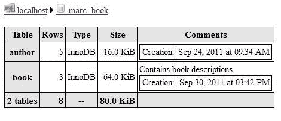
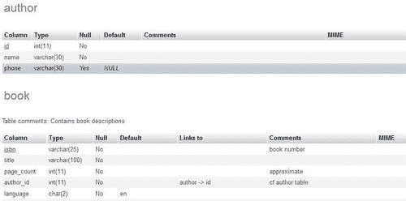
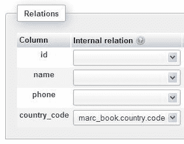
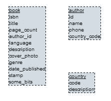
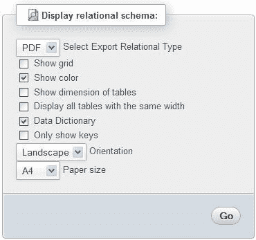
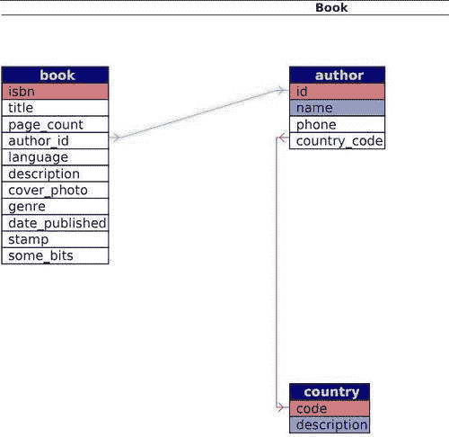
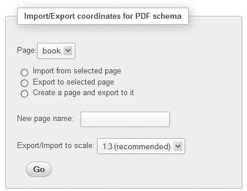

# 十五、文档系统

制作和维护关于数据结构的良好文档对于项目的成功至关重要，尤其是在团队项目中。事实上，能够向其他团队成员显示当前的数据字典和建议的列更改提供了一种有价值的沟通方式。此外，表间关系的图形显示可以快速演示数据库的内部工作。幸运的是，phpMyAdmin 具有处理这些事情的文档特性。

# 制作结构报告

从 `Database`或 `Table`视图的**结构**页面中，**打印视图**链接可用于生成关于我们数据库结构的报告。此外， `Database`视图中的**数据字典**链接会生成不同的报告。这些将在以下章节中详细介绍。

## 创建可打印报告

当 phpMyAdmin 生成结果时，始终存在一个**打印视图**链接，可用于生成数据的可打印报告。**打印视图**功能也可用于生成基本结构文档。这是分两步完成的。第一次点击**打印视图**在屏幕上显示一份报告，页面末尾有一个**打印**按钮。此**打印**按钮稍后会生成一份为打印机格式化的报告。

## 数据库打印视图

点击数据库的**结构**页面上的**打印视图**生成表列表。此列表包含每个表的行数、存储引擎、大小、注释和创建日期，如以下屏幕截图所示：



### 选择性数据库打印视图

有时，我们更喜欢获取表子集的报告。这可以从数据库的**结构**页面中完成，方法是选择我们想要的表，然后从下拉菜单中选择**打印视图**，如下图所示：


## 表打印视图

每个表的**结构**页面上还有一个**打印视图**链接。单击此链接可生成有关表的列和索引的信息，如以下示例所示：


## 使用数据字典编制完整的报告

关于数据库中的表和列的更完整的报告可从 `Database`视图的**结构**页面获得。我们只需点击**数据字典**链接即可获得此报告，部分如以下截图所示：



**MIME**列为空，直到我们将 MIME 相关信息添加到某些列（如[第 16 章](16.html "Chapter 16. Transforming Data using MIME")中所述）。

# 生成关系模式

在[第 10 章](10.html "Chapter 10. Benefiting from the Relational System")中，我们定义了 `book`和 `author`表之间的关系。这些关系用于各种外键函数（例如，在**插入**模式下获取可能值的列表）。现在我们将研究一个功能，它使我们能够以流行的 PDF 格式和其他格式为表生成定制的关系模式。此功能要求正确安装和配置 phpMyAdmin 配置存储。

## 在我们的模型中添加第三个表

为了获得更完整的模式，我们现在将向数据库中添加另一个表 `country`。以下代码块显示其导出文件的内容：

```php
CREATE TABLE IF NOT EXISTS `country` (
`code` char(2) NOT NULL,
`description` varchar(50) NOT NULL,
PRIMARY KEY (`code`)
) ENGINE=MyISAM DEFAULT CHARSET=latin1;
INSERT INTO `country` (`code`, `description`) VALUES
('ca', 'Canada'),
('uk', 'United Kingdom');

```

我们现在将此表链接到 `author`表。首先，在 `country`表的**关系视图**中，我们指定要显示的列，然后点击**保存**。


然后我们将**国家代码**列（与 `country`表中 `code`列的类型和大小相同）添加到 `author`表中，并在**关系视图**中将其链接到新创建的 `country`表中。

### 注

我们必须记住点击**保存**以记录关系。

对于本例，不必为作者输入任何国家数据，因为我们只对关系模式感兴趣。



### 生成模式页面

每个关系模式称为一个**页面**。我们可以通过点击 `Database`视图**操作**页面中的**编辑或导出关系模式**来创建或编辑页面。

### 页面规划

关系架构不能跨越多个数据库。但即使只使用一个数据库，表的数量也可能很大。以清晰的方式表示各种表关系可能是一个挑战。这就是为什么我们可以使用许多页面，每个页面显示一些表及其关系。

我们还必须考虑到最终产出的规模。在字母大小的纸张上打印可以减少显示所有表的空间，并且仍然具有清晰的模式。

### 创建新页面

由于没有现有的页面，我们需要创建一个。因为我们最重要的表是 `book`，所以我们也将这一页命名为**书**。

我们将选择希望在关系模式中看到的表。我们可以分别选择每张桌子。但是，为了获得良好的开端，建议选中相应的**自动布局**复选框。这样做会将数据库中的所有相关表放到要包含在模式中的表列表中。然后，它生成适当的坐标，以便表从模式的中心开始以螺旋布局显示。这些坐标以毫米表示， `(0, 0)`位于左上角。然后点击**Go:**


### 编辑页面

现在我们得到一个包含三个不同部分的页面。第一个是页面菜单，我们在其中选择要工作的页面（从下拉菜单）。我们还可以删除所选页面。我们还可以最终创建第二个模式（第页）。


下一部分是表放置部分。我们现在可以看到**自动布局**功能的好处，我们已经选择了三个表，并填入了**X**和**Y**坐标列。我们可以添加一个表（在最后一行），删除一个表（使用复选框），并更改坐标（表示模式中每个表左上角的位置）：


为了帮助设置精确的坐标，支持 JavaScript 的浏览器可以使用可视化编辑器。当点击一次**切换刮板**按钮时，编辑器出现。再次单击此按钮时，它将消失。我们可以在草稿板上拖放表，坐标也会随之改变。草稿板上表的外观提供了最终 PDF 输出的大致指南。有些人更喜欢在草稿板上只看到表名（没有每个列名）。取消选中**列名**复选框，然后点击**保存**即可。下图显示了此草稿板的示例：



### 注

当我们对布局感到满意时，我们必须点击**保存**。

### 导出页面以供显示

屏幕的最后一部分是报告生成对话框。现在我们已经创建了一个页面，**显示关系模式**显示了一个对话框，如以下屏幕截图所示：



可用选项有：

<colgroup><col style="text-align: left"> <col style="text-align: left"></colgroup> 
| 

选项

 | 

描述

 |
| --- | --- |
| **选择导出关系类型** | 允许选择要导出到的文件格式（PDF、SVG、DIA、Visio 或 EPS）。 |
| **显示网格** | 模式将有一个显示坐标的网格层。在设计和测试模式时非常有用。 |
| **显示颜色** | 链接、表名和特殊列（主键和显示列）将以彩色显示。 |
| **显示表的维度** | 将显示表标题中每个表的视觉尺寸（例如，**32x30】**。这在设计和测试模式时非常有用。 |
| **显示宽度相同的所有表** | 所有表将使用相同的宽度显示。（通常，宽度会根据表和列名的长度自行调整。） |
| **数据字典** | 本章前面介绍的数据字典将包含在报告开头。 |
| **仅显示按键** | 不显示未定义索引的列。 |
| **方向** | 在这里，我们选择报告的打印方向 |
| **纸张尺寸** | 更改此选项将影响架构和草稿行维度。 |

在 `config.inc.php`中，以下参数定义了可用纸张尺寸和默认选择：

```php
$cfg['PDFPageSizes'] = array('A3', 'A4', 'A5', 'letter', 'legal');
$cfg['PDFDefaultPageSize'] = 'A4';

```

以下屏幕截图以 PDF 格式显示生成报告的最后一页（架构页）。前四页包含数据字典和一个附加功能。

箭头指向相应外部表的方向。如果勾选了**显示颜色**复选框，则主键显示为红色，显示列显示为蓝色，如下图所示：



下面的屏幕截图提供了从同一 `book`表的 PDF 页面定义生成的另一个示例。这次显示的是网格，但不是颜色：


### 更改 PDF 模式中的字体

我们在 PDF 模式中看到的所有文本都是使用特定字体绘制的。phpMyAdmin 使用 `DejaVuSans`字体（[http://dejavu.sourceforge.net](http://dejavu.sourceforge.net) ），涵盖了广泛的字符。

对于实际的 PDF 生成，phpMyAdmin 依赖于 `tcpdf`库（[http://tcpdf.sourceforge.net](http://tcpdf.sourceforge.net) ）。此库有两种使用嵌入字体和非嵌入字体的方法。嵌入字体将生成更大的 PDF 文件，因为整个字体都包含在 PDF 文件中。这是 phpMyAdmin 选择的默认选项，因为库不依赖于客户端操作系统中是否存在特定的 `TrueType`字体。

字体位于 `phpMyAdmin`主目录下的 `libraries/tcpdf/fonts`中。

要使用不同的字体文件，我们必须首先将其添加到库中（原始的 `tcpdf`工具包中提供了工具，并且在[上提供了教程）http://www.fpdf.org](http://www.fpdf.org) 网站），然后修改 phpMyAdmin 的 `libraries/schema/ Pdf_Relation_Schema.class.php`源代码。

## 设计出具有设计师特色的方案

**设计器**功能（在 `Database`视图中提供）提供了一种更精确的方式来移动屏幕上的表，因为列链接跟随表的移动。因此，**设计器**保存的表坐标与模式坐标之间存在一个接口。让我们进入**设计器**并点击小的 PDF 徽标。

这将我们带到一个面板，在这里我们可以选择（现有）模式名称和我们想在本例中执行的操作，以将**设计器**坐标导出到模式定义中。我们也可以使用**新建页面名称**对话框，输入页面名称，然后点击**Go**创建一个空页面。从这里，我们可以随后导出从**设计器**工作区保存的坐标：



### 注

由**设计器**和**编辑或导出关系模式**功能管理的表的范围有所不同。默认情况下，**设计器**操作数据库的每个表，而**编辑或导出关系模式**面板为我们提供了表的选择，使我们能够在有多个表的情况下表示关系的子集。

# 总结

本章介绍了 phpMyAdmin 在数据库或表的打印视图和完整列列表的数据字典中提供的文档功能。本章还介绍了关系模式。特别是，它着重于如何创建、修改和导出模式页面，以及如何使用可视化编辑器（scratchboard）。

下一章将解释如何对数据应用转换，以便在查看时自定义数据格式。