# 六、监控与备份

在本章中，我们将了解以下配方：

*   注册彩信并设置彩信监控代理
*   在彩信控制台中管理用户和组
*   在彩信中监视实例并设置警报
*   在彩信中设置监控警报
*   使用现成的工具在 Mongo 中备份和恢复数据
*   配置彩信备份服务
*   在彩信备份服务中管理备份

# 导言

监视和备份是生产中任何任务关键型软件的一个重要方面。通过主动监控，我们可以在系统中发生可能危及数据一致性、可用性或系统性能的异常事件时采取行动。在没有主动监控系统的情况下产生重大影响后，问题可能会暴露出来。我们在[第 4 章](04.html "Chapter 4. Administration")、*给药*中介绍了给药相关配方，这两项活动都是其中的一部分；但是，由于所涵盖的内容广泛，它们要求单独一章。在本章中，我们将了解如何使用**Mongo 监控服务**（**MMS**）对您的 MongoDB 集群的各种参数进行监控并设置各种参数警报。我们将介绍一些使用现成工具和彩信备份服务备份数据的机制。

# 注册彩信并设置彩信监控代理

MMS 是一种基于云的或内部部署的服务，使您能够监视 MongoDB 群集。本地版本仅适用于企业订阅。它为您提供了一个中心位置，让管理员监控服务器实例的运行状况以及实例运行所在的框。在本食谱中，我们将了解软件需求以及如何为 Mongo 设置彩信。

## 准备好了吗

我们将启动一个`mongod`实例，用于监控目的。请参考[第一章](01.html "Chapter 1. Installing and Starting the Server")中的*安装单节点 MongoDB*配方*安装并启动服务器*启动 MongoDB 实例并从 Mongo 外壳连接。用于将 mongo 实例的统计信息发送到监视服务的监视代理使用 Python 和 pymongo。请参阅[第一章](01.html "Chapter 1. Installing and Starting the Server")*安装和启动服务器*中的*使用 Python 客户端*连接到单个节点的配方，了解如何安装 Python 和 MongoDB 的 Python 客户端 pymongo。

## 怎么做…

如果您还没有彩信账户，则登录[https://mms.mongodb.com/](https://mms.mongodb.com/) 并注册一个帐户。在注册和登录时，您将看到以下页面：


点击**监控**下的**启动**按钮。

1.  Once we reach the **Download Agent** option in the menu, click on the appropriate OS platform to download the agent. Follow the instructions given after selecting the appropriate OS platform. Note down the **apiKey** too. For example, if the Windows platform is selected, we would see the following:

    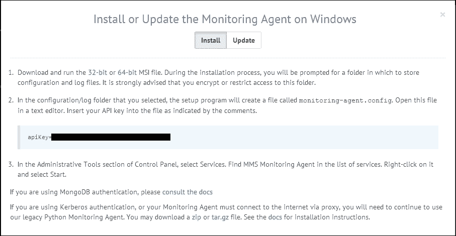

2.  安装完成后，打开文件`monitoring-agent.config`。它将出现在安装代理时选择的配置文件夹中。
3.  注意文件中的键`mmsApiKey`，并将其值设置为步骤 1 中记录的 API 键。
4.  一旦服务启动（我们必须在 Windows 上转到`services.msc`，这可以通过在运行对话框（Windows+*R*）中键入`services.msc`来完成，并手动启动服务）。该服务将命名为**MMS 监控代理**。在网页上，点击**验证代理**按钮。如果一切顺利，将验证已启动的代理，并显示成功消息。
5.  The next step is to configure the host. This host is the one that is seen from the agent's perspective running on the organization or individual's infrastructure. The following screen shows the screen used for the addition of a host. The hostname is the internal hostname (the hostname on the client's network), and the MMS on the cloud doesn't need to reach out to the MongoDB processes. It is the agent that collects the data from these mongodb processes and sends the data to the MMS service.

    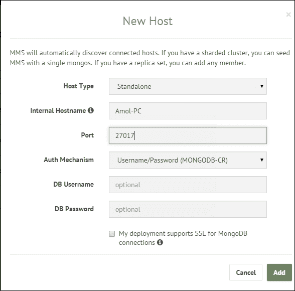

    添加主机详细信息后，单击**验证主机**按钮。验证完成后，点击**开始监控**按钮。

    我们已成功设置彩信，并向其中添加了一台将被监控的主机。

## 它是如何工作的…

在此配方中，我们为一个独立的 MongoDB 实例设置了 MMS 代理和监控。安装和设置过程非常简单。我们还添加了一个独立实例，一切正常。

假设我们建立并运行了一个复制副本（请参考[第 1 章](01.html "Chapter 1. Installing and Starting the Server")、*安装并启动服务器*中的*启动多个实例作为复制副本集*的一部分，了解如何启动复制副本集的详细信息），并且三个成员正在侦听端口`27000`、`27001`，和`27002`。请参阅*如何操作…*一节中的第 6 点，我们在这里设置了一台独立主机。在**主机类型**下拉菜单中选择**副本集**并在**内部主机名**中，给出副本集任何成员的有效主机名（在我的例子中，给出了**Amol PC**和端口**27001**，这是一个辅助实例）；所有其他实例将被自动发现，并在主机下可见，如下所示：


我们没有看到在集群上启用安全性时要做什么，这在生产环境中非常常见，我们有副本集或碎片设置。如果启用了身份验证，我们需要 MMS 代理的正确凭据来收集统计信息。我们在添加新主机时给出的**DB 用户名**和**DB 密码**（在*如何做…*部分中的第 6 点）应至少具有`clusterAdmin`和`readAnyDatabase`角色。

## 还有更多…

我们在这个食谱中看到的是如何设置 MMS 代理并从 MMS 控制台创建帐户。但是，我们可以作为管理员为彩信控制台添加组和用户，授予不同用户在不同组上执行各种操作的权限。在下一步中，我们将介绍 MMS 控制台中的用户和组管理。

# 在 MMS 控制台中管理用户和组

在前面的配方中，我们了解了如何设置 MMS 帐户和 MMS 代理。在本食谱中，我们将介绍如何设置组和用户访问彩信控制台。

## 准备好了吗

请参阅上一个设置代理和彩信帐户的方法。这是这个食谱的唯一先决条件。

## 怎么做…

1.  Start by going to **Administration** | **Users** on the left-hand side of the screen, as shown here:

    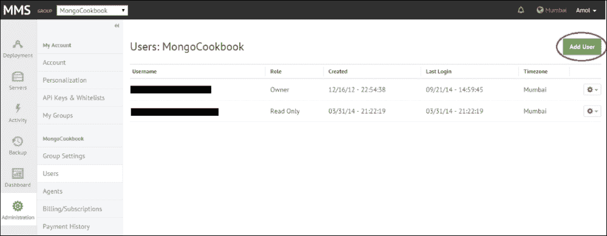

    在这里，您可以查看现有用户，也可以添加新用户。点击**添加用户**（包围在上图右上角）按钮，您应该看到以下弹出窗口，允许您添加新用户：

    

    前面的屏幕将用于添加用户。记下各种可用的角色。

2.  同样，点击**添加群组**按钮，进入**管理****我的群组**查看并添加新群组。在文本框中，键入组的名称。请记住，您输入的组的名称应该是全局可用的。该组的名称应在所有彩信用户中是唯一的，而不仅仅是您的帐户。
3.  When a new group is created, it will be visible in the top left corner in a drop-down menu for all the groups, as shown here:

    

4.  You can switch between the groups using this drop-down menu, which should show all the details and stats relevant to the selected group.

    ### 注

    请记住，组一旦创建就不能删除。所以在创建一个时要小心。

## 它是如何工作的…

我们在菜谱中做的任务非常简单，除了一个问题之外，不需要太多解释。何时以及为什么要添加组？这就是我们希望通过不同的环境或应用程序隔离 MongoDB 实例的时候。将为每个组运行不同的 MMS 代理。当我们希望为应用程序的不同环境（开发、QA、生产等）创建单独的监控组，并且每个组对用户具有不同的权限时，创建一个新组是必要的。也就是说，同一代理不能用于两个不同的组。在配置 MMS 代理时，我们为其提供了组特有的 API 密钥。要查看组的 API 键，请从屏幕顶部的下拉菜单中选择适当的组（如果您的用户只能访问组，则不会看到下拉菜单），然后转到**管理****组设置**，如下一个屏幕截图所示。页面顶部将显示**组 ID**和**API 密钥**。

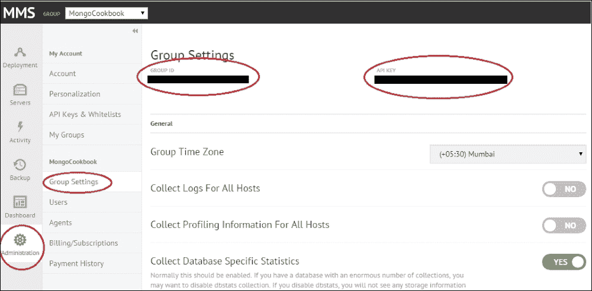

请注意，并非所有用户角色都会看到此选项。例如，只读-用户只能对其个人资料进行个性化设置，其他大多数选项将不可见。

# 监控实例并在彩信上设置提醒

前几篇的食谱向我们展示了如何设置彩信帐户、设置代理、添加主机以及管理用户对彩信控制台的访问。MMS 的核心目标是监控主机实例，这一点尚未讨论。在此配方中，我们将在第一个配方中添加到 MMS 的主机上执行一些操作，并从 MMS 控制台对其进行监控。

## 准备好了吗

按照配方*注册彩信并设置彩信监控代理*，这就是该配方所需的全部内容。您可以选择拥有独立实例或副本集，无论哪种方式都可以。另外，打开 mongo shell 并从中连接到主实例（它是一个副本集）。

## 怎么做…

1.  Start by logging into MMS console and clicking on **Deployment** on the left. Then, click on the **Deployment** link in the submenu again, as shown in the following screenshot:

    

    单击其中一个主机名以查看显示各种统计信息的各种图表。在本食谱中，我们将分析其中的大部分。

2.  打开为该书下载的包。在[第 4 章](04.html "Chapter 4. Administration")、*管理*中，我们使用 JavaScript 让服务器忙于一些名为`KeepServerBusy.js`的操作。这次我们将使用相同的脚本。
3.  在操作系统外壳中，使用当前目录中的`.js`文件执行以下操作。在我的情况下，外壳连接到主端口`27000`：

    ```js
    $ mongo KeepServerBusy.js --port 27000 --quiet

    ```

4.  一旦启动，让它继续运行，并给它 5 到 10 分钟，然后再开始监控彩信控制台上的图形。

## 它是如何工作的…

在[第 4 章](04.html "Chapter 4. Administration")*管理*中，我们看到了一个配方*mongostat 和 mongotop 实用程序*，它演示了如何使用这些实用程序来获得当前的操作和资源利用率。这是监视特定实例的一种非常基本和有用的方法。然而，MMS 为我们提供了一个用非常容易理解的图形监视 MongoDB 实例的地方。MMS 还提供了`mongostat`和`mongotop`无法提供的历史数据。

在我们继续分析指标之前，我想提及的是，在彩信监控的情况下，数据不会被查询，也不会通过公共网络发送。它只是由代理通过安全通道发送的统计信息。代理的源代码是开源的，如果需要，可以进行检查。mongod 服务器不需要从公共网络访问，因为基于云的 MMS 服务从不直接与服务器实例进行通信。是彩信代理与彩信服务进行通信。通常，一个代理足以监视多个服务器，除非您计划将它们划分为不同的组。此外，建议在专用计算机/虚拟机上运行代理，并且不要与任何 mongod 或 mongos 实例共享代理，除非它是您正在监视的不太重要的测试实例组。

让我们在控制台上看看这些统计数据；我们从记忆相关的开始。下图显示了驻留内存、映射内存和虚拟内存。


正如我们所看到的，数据集的驻留内存是 82MB，非常低，它是 mongod 进程使用的实际物理内存。此当前值明显低于可用的可用内存，并且通常会在一段时间内增加，直到它达到耗尽总物理可用内存的很大一部分为止。这是由 mongod 服务器进程自动处理的，我们不能强迫它使用更多内存，即使它在运行的机器上可用。

另一方面，映射内存大约是数据库的总大小，由 MongoDB 映射。这个大小可能（通常）比可用的物理内存高得多，这使得 mongod 进程能够处理内存中存在的整个数据集，即使它不存在。MongoDB 减轻了将数据映射到磁盘和从磁盘加载到底层操作系统的责任。每当访问某个内存位置时，如果 RAM（即驻留内存）中没有该位置，操作系统就会将该页提取到内存中，必要时会逐出一些页以为新页留出空间。内存映射文件到底是什么？让我们试着用一个超级缩小的版本来看看。假设我们有一个 1KB（1024 字节）的文件，而 RAM 只有 512 字节，那么显然我们不能将整个文件都放在内存中。但是，您可以要求操作系统将此文件映射到页面中的可用 RAM。假设每个页面是 128 字节，那么整个文件是 8 个页面（128*8=1024）。但是操作系统只能加载四个页面，我们假设它加载了内存中的前 4 个页面（最多 512 字节）。当我们访问字节号 200 时，它是正常的，并在内存中找到，因为它在第 2 页上存在。但如果我们访问第 7 页逻辑上未加载到内存中的字节 800 怎么办？操作系统所做的是从内存中取出一页并加载包含字节号 800 的第 7 页。MongoDB 作为一个应用程序给人的印象是，所有东西都加载到内存中，并通过字节索引进行访问，但事实并非如此，操作系统透明地为我们完成了这项工作。由于被访问的页面在内存中不存在，我们必须转到磁盘将其加载到内存中，因此称为**页面错误**。

回到图中显示的统计信息，虚拟内存包含所有内存使用情况，包括映射内存加上任何额外使用的内存，例如与每个连接关联的线程堆栈关联的内存。如果启用了日志记录，则此大小肯定会比映射内存的大小大一倍以上，因为日志记录也将为数据提供单独的内存映射。因此，我们有两个地址映射相同的内存位置。这并不意味着页面将被加载两次。这仅仅意味着可以使用两个不同的内存位置来寻址相同的物理内存。非常高的虚拟内存可能需要一些调查。不存在过高或过低值的预定定义；通常，在正常情况下，当您对系统的性能感到满意时，系统会监控这些值。然后将这些基准值与系统性能下降时看到的数字进行比较，然后采取适当的措施。

如前所述，当访问的内存位置不在驻留内存中时，会导致页面错误，从而导致操作系统从内存加载页面。此 IO 活动肯定会导致性能下降，过多的页面错误会显著降低数据库性能。下面的屏幕截图显示了每分钟发生的相当多的页面错误。但是，如果使用的磁盘是 SSD 而不是旋转磁盘，则从驱动器的寻道时间来看，命中率可能不会太高。


当没有足够的物理内存来容纳数据集并且操作系统需要将数据从磁盘获取到内存中时，通常会发生大量页面错误。请注意，前面的屏幕截图中显示的这个统计数据是在 Windows 平台上拍摄的，对于一个非常简单的操作来说可能看起来很高。这个值是硬页面错误和软页面错误的总和，并不能真正给出系统好坏的真实数字。在基于 Unix 的操作系统上，这些数字会有所不同。有一个吉拉（[https://jira.mongodb.org/browse/SERVER-5799](https://jira.mongodb.org/browse/SERVER-5799) ）在撰写这本报告此问题的书时打开。

您可能需要记住的一件事是，在生产系统中，MongoDB 不能很好地与 NUMA 体系结构配合使用，即使可用的内存似乎足够高，您也可能会看到大量页面错误发生。请参考 URL[http://docs.mongodb.org/manual/administration/production-notes/](http://docs.mongodb.org/manual/administration/production-notes/) 了解更多详情。

另外还有一个图表，它提供了有关非映射内存的一些详细信息。正如我们在本节前面看到的，内存有三种类型：映射内存、驻留内存和虚拟内存。映射内存始终小于虚拟内存。如果启用日志记录，虚拟内存将是映射内存的两倍以上。如果我们查看本节前面给出的图像，我们会看到映射内存是 192MB，而虚拟内存是 532MB。由于启用了日志记录，内存是映射内存的两倍以上。启用日志记录后，同一页数据在内存中映射两次。请注意，页面仅物理加载一次，只是可以使用两个不同的地址访问相同的位置。让我们找出虚拟内存（532MB）和映射内存（384MB）的两倍（2*192=384）之间的差异。这些数字之间的差异是 148MB（532-384）。

我们在这里看到的是虚拟内存中不属于映射内存的部分。这个值和我们刚才计算的一样。

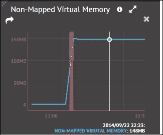

如前所述，未定义非映射内存的高值或低值，但是当该值达到 GBs 时，我们可能必须进行调查；可能打开的连接数量很高，我们需要检查客户端应用程序在使用后是否没有关闭它们，是否存在泄漏。有一个图表显示打开的连接数，如下所示：

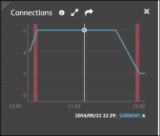

一旦我们知道连接的数量，并且发现与预期计数相比太高，我们将需要找到已打开该实例连接的客户端。我们可以从 shell 中执行以下 JavaScript 代码来获取这些详细信息。不幸的是，在撰写本书时，MMS 没有列出客户端连接详细信息的功能。

```js
testMon:PRIMARY> var currentOps = db.currentOp(true).inprog;
 currentOps.forEach(function(c) {
 if(c.hasOwnProperty('client')) {
 print('Client: ' + c.client + ", connection id is: " + c.desc);
 }
 //Get other details as needed 
 });

```

`db.currentOp`方法返回结果中的所有空闲和系统操作。然后，我们迭代所有结果并打印出客户机主机和连接详细信息。`currentOp`结果中的典型文档如下所示。您可以根据需要选择调整前面的代码以包含更多详细信息：

```js
 {
 "opid" : 62052485,
 "active" : false,
 "op" : "query",
 "ns" : "",
 "query" : {
 "replSetGetStatus" : 1,
 "forShell" : 1
 },
 "client" : "127.0.0.1:64460",
 "desc" : "conn3651",
 "connectionId" : 3651,
 "waitingForLock" : false,
 "numYields" : 0,
 "lockStats" : {
 "timeLockedMicros" : {

 },
 "timeAcquiringMicros" : {

 }
 }
 }

```

在[第 4 章](04.html "Chapter 4. Administration")、*管理*中，我们看到了一个配方*mongostat 和 mongotop 实用程序*，用于获取数据库被锁定的时间百分比以及每秒执行的更新、插入、删除和getmore 操作数的详细信息。你可以参考这些食谱并尝试一下。我们使用了与当前相同的 JavaScript 来保持服务器繁忙。

在 MMS 控制台中，我们提供了以下详细信息的图表：

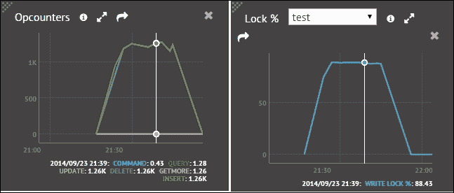

第一个`opcounters`显示在特定时间点执行的操作数。这应该与我们使用`mongostat`实用程序看到的类似。右边的显示了数据库被锁定的时间百分比。下拉菜单列出数据库名称。我们可以选择一个合适的数据库来查看其统计数据。同样，这个统计数据可以通过`mongostat`实用程序看到。唯一的区别是，使用命令行实用程序，我们可以看到当前时间的统计数据，而这里我们也可以看到历史统计数据。

在 MongoDB 中，索引存储在 BTree 中，下一个图表显示了 BTree 索引被访问、命中和未命中的次数。RAM 至少应足以容纳最佳性能的指标。因此，在此度量中，未命中率应为 0 或非常低。大量未命中会导致索引出现页面错误，如果查询未被覆盖，则可能会导致相应数据出现额外的页面错误，也就是说，其所有数据都无法从索引中获取，这对性能是一个双重打击。查询时的一个良好实践是使用投影并仅从文档中获取必要的字段。当我们在索引中显示所选字段时，这将非常有用，在这种情况下，查询将被覆盖，并且所有必要的数据仅来自索引。欲了解更多关于覆盖索引的信息，请参考[第 2 章](02.html "Chapter 2. Command-line Operations and Indexes")中的*创建索引和查看查询计划*、*命令行操作和索引*。

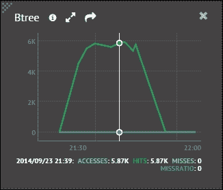

对于繁忙的应用程序，如果卷非常大，并且有多个写入和读取操作争夺锁，则操作会排队。在 MongoDB 的 2.4 版之前，锁都在数据库级别。因此，即使写操作发生在另一个集合上，该数据库中任何集合上的读取操作都将阻塞。此排队操作会影响系统的性能，并且是一个很好的指标，表明数据可能需要分片以扩展系统。

### 提示

记住，没有任何值被定义为高或低；它是基于应用程序对应用程序的可接受值。


MongoDB 立即从日志中刷新数据，并定期将数据文件刷新到磁盘。以下指标给出了给定时间点每分钟的刷新时间。如果刷新每分钟占用大量时间，我们可以放心地说写操作正在形成性能瓶颈。


## 还有更多…

在这个配方中，我们已经看到了 MongoDB 实例/集群的监控。然而，设置警报以在超过某些阈值时获得通知，这是我们至今还没有看到的。在下一个配方中，我们将看到如何通过在页面错误超过预定值时通过电子邮件发送的示例警报来实现这一点。

## 另见

*   监控硬件，如 CPU 使用，非常有用，MMS 控制台也支持这一点。但是，需要安装 munin 节点以启用 CPU 监控。参见[页 http://mms.mongodb.com/help/monitoring/configuring/](http://mms.mongodb.com/help/monitoring/configuring/) 用于设置 munin 节点和硬件监控。
*   监控代理更新请参见[页面 http://mms.mongodb.com/help/monitoring/tutorial/update-mms/](http://mms.mongodb.com/help/monitoring/tutorial/update-mms/) 。

# 在 MMS 中设置监控警报

在前面的配方中，我们看到了如何从 MMS 控制台监控各种指标。这是一种在一个地方查看所有统计数据并获得 MongoDB 实例和集群运行状况概览的好方法。但是，支持人员不可能全天候连续监控系统，必须有某种机制在超过某个阈值时自动发出警报。在此配方中，我们将在页面错误超过 1000 时设置警报。

## 准备好了吗

使用 MMS 设置监控 Mongo实例，请参考之前的配方。这是这个食谱的唯一先决条件。

## 怎么做…

1.  点击左侧菜单上的**活动**选项，然后点击**预警设置**。在**预警设置**页面，点击**添加预警**。
2.  Add a new alert for the **Host** that is a primary instance and if the page faults exceed a given number, which is 1000 page faults per minute. The notification is chosen to be an e-mail in this case and the interval after which the alert will be sent is 10 minutes.

    

3.  点击**保存**保存预警。

## 它是如何工作的…

步骤非常简单，当页面错误超过每分钟 1000 次时，我们成功地设置了彩信警报。正如我们在前面的配方中所看到的，没有固定的值被归类为高或低。这是您的系统可以接受的东西，在您的环境中的测试阶段对系统进行基准测试。与页面错误类似，可以设置大量警报。一旦发出警报，将按照我们设置的每 10 分钟发送一次，直到不满足发送警报的条件。在这种情况下，如果页面错误数降至 1000 以下或有人手动确认警报，则不会针对该事件进一步发送警报。

正如我们在以下屏幕截图中看到的，警报已打开，我们可以确认警报：


点击**确认**后，以下弹出窗口将允许我们选择确认的持续时间：


此表示，对于该特定事件，在选定的时间段过去之前，不会再发出警报。

点击左侧的**活动**菜单选项，可以查看打开的警报。

## 另见

*   访问网址[http://www.mongodb.com/blog/post/five-mms-monitoring-alerts-keep-your-mongodb-deployment-track](http://www.mongodb.com/blog/post/five-mms-monitoring-alerts-keep-your-mongodb-deployment-track) 了解您应该为部署设置的一些重要警报

# 使用现成工具在 Mongo 中备份和恢复数据

在本食谱中，我们将使用`mongodump`和`mongorestore`等实用程序来备份和还原文件，以了解一些基本的备份和还原操作。

## 准备好了吗

我们将启动 mongod 的单个实例。参考[第一章](01.html "Chapter 1. Installing and Starting the Server")*安装启动服务器*中*安装单节点 MongoDB*的配方，启动 mongo 实例，并通过 mongo 外壳连接。我们需要一些数据来备份。如果您的测试数据库中已经有一些数据，那就可以了。如果没有，使用以下命令从代码包中可用的`countries.geo.json`文件创建一些：

```js
$ mongoimport  -c countries -d test --drop countries.geo.json

```

## 怎么做…

1.  With the data in the `test` database, execute the following (assuming we want to export the data to a local directory called `dump` in the current directory):

    ```js
    $ mongodump -o dump -oplog -h localhost -port 27017

    ```

    确认`dump`目录中有数据。所有文件都将是`.bson`文件，每个集合在各自创建的数据库文件夹中一个。

2.  现在，让我们使用以下命令将数据导入 mongo 服务器。这也是假设我们在当前目录中有目录`dump`，其中包含所需的`.bson`文件：

    ```js
    mongorestore --drop -h localhost -port 27017 dump -oplogReplay

    ```

## 它是如何工作的…

只需执行几个步骤即可导出和恢复数据。现在让我们看看它到底做了什么，以及这个实用程序的命令行选项是什么。`mongodump`实用程序用于将数据库导出到`.bson`文件中，随后可用于恢复数据库中的数据。导出实用程序将每个数据库（本地数据库除外）导出一个文件夹，然后每个文件夹的每个集合都有一个`.bson`文件。在我们的例子中，我们也使用了`-oplog`选项导出 oplog 的一部分，数据将导出到`oplog.bson`文件中。类似地，我们使用`mongorestore`实用程序将数据导入数据库。我们在导入和重放 oplog 中的内容之前（如果有），通过提供`--drop`选项明确要求删除现有数据。

`mongodump`实用程序只是查询集合并将内容导出到文件中。集合越大，恢复内容所需的时间就越长。因此，建议在转储时防止写操作。在分片环境中，应关闭平衡器。如果在系统运行时进行转储，请使用`-oplog`选项导出，以导出 oplog 的内容。然后可以使用此 oplog 将数据恢复到时间点。下表显示了`mongodump`和`mongorestore`实用程序可用的一些重要选项，首先是`mongodump`：

<colgroup><col style="text-align: left"> <col style="text-align: left"></colgroup> 
| 

选项

 | 

描述

 |
| --- | --- |
| `--help` | 显示所有可能的、受支持的选项以及这些选项的简要说明。 |
| `-h`或`--host` | 要连接到的主机。默认情况下，它是端口`27017`上的本地主机。如果要连接独立实例，我们可以将主机名设置为`<hostname>:<port number>`。对于副本集，格式为`<replica set name>/<hostname>:<port>,….<hostname>:<port>`，其中主机名和端口的逗号分隔列表称为**种子列表**。它可以包含副本集中的所有主机名或主机名的子集。 |
| `--port` | 目标 MongoDB 实例的端口号。如果在前面的`-h`或`--host`选项中提供了端口号，则这实际上并不相关。 |
| `-u`或`--username` | 提供用于导出数据的用户的用户名。由于数据是从所有数据库读取的，因此用户至少应该在所有数据库中具有读取权限。 |
| `-p`或`--password` | 与用户名一起使用的密码。 |
| `--authenticationDatabase` | 保存用户凭证的数据库。如果未指定，则使用在`--db`选项中指定的数据库。 |
| `-d`或`--db` | 要备份的数据库。如果未指定，则导出所有数据库。 |
| `-c`或`--collection` | 要导出的数据库中的集合。 |
| `-o`或`--out` | 将文件导出到的目录。默认情况下，该实用程序将在当前目录中创建一个转储文件夹，并将内容导出到该目录。 |
| `--dbpath` | 如果我们不打算连接到数据库服务器，而是直接从数据库文件中读取。该值是将在其中找到数据库文件的目录的路径。当直接从数据库文件读取数据时，服务器不应启动并运行，因为导出会锁定数据文件，如果服务器启动并运行，则不会发生这种情况。获取锁时，将在目录中创建一个锁文件。 |
| `--oplog` | 启用选项后，也将导出导出过程开始时 oplog 中的数据。如果未启用此选项，则如果并行执行写入操作，则导出中的数据将不会表示单个时间点，因为导出过程可能需要几个小时，并且它只是对所有集合的查询操作。导出 oplog 提供了一个恢复到时间点数据的选项。如果在导出过程中阻止写入操作，则无需指定此选项。 |

类似地，对于实用程序`mongorestore`来说，这里有选项。选项`--help`、`-h`或`--host`、`--port`、`-u`或`--username`、`-p`或`--password`、`--authenticationDatabase`、`-d`或`--db`、`-c`或`--collection`的含义。

<colgroup><col style="text-align: left"> <col style="text-align: left"></colgroup> 
| 

选项

 | 

描述

 |
| --- | --- |
| `--dbpath` | 如果我们不打算连接到数据库服务器，而是直接写入数据库文件，请使用此选项。该值是将在其中找到数据库文件的目录的路径。直接写入数据库文件时，服务器不应启动并运行，因为还原操作会锁定数据文件，如果服务器启动并运行，则不会发生这种情况。获取锁时，将在目录中创建一个锁文件。 |
| `--drop` | 在从导出的转储恢复数据之前，删除集合中的现有数据。 |
| `--oplogReplay` | 如果在允许写入数据库时导出了数据，并且在导出过程中启用了`--oplog`选项，则导出的 oplog 将在数据上重放，以将数据库中的所有数据带到同一时间点。 |
| `--oplogLimit` | 此参数的值是以秒为单位表示时间的数字。此选项与`oplogReplay`命令行选项结合使用，该选项用于通知恢复实用程序重播 oplog，并在该选项指定的限制处停止。 |

你可能会想，*为什么不复制文件并进行备份？*效果很好，但也存在一些相关问题。首先，除非禁用写入操作，否则无法获取时间点备份。其次，用于备份的空间非常大，因为副本也会复制数据库的 0 填充文件，而`mongodump`只导出数据。

正如所说，文件系统快照是一种常用的备份实践。需要记住的一点是，在拍摄快照时，日志文件和数据文件需要在同一快照中，以保持一致性。

如果您使用的是**亚马逊网络服务**（**AWS**，强烈建议您将数据库备份上传到 AWS S3。您可能知道，AWS 以极低的存储成本提供极高的数据冗余。

从 Packt Publishing 网站下载脚本`generic_mongodb_backup.sh`，并使用它自动创建备份并上传到 AWS S3。

# 配置彩信备份服务

MMS 备份是 MongoDB 为 MongoDB 实例、副本集和碎片的实时增量备份提供的相对较新的产品，并为您的实例提供时间点恢复。该服务可作为内部部署（在您的数据中心）或云提供。但是，我们将演示云上服务，它是社区和基本订阅的唯一选项。有关可用选项的更多详细信息，您可以访问 MongoDB在[提供的不同产品 https://www.mongodb.com/products/subscriptions](https://www.mongodb.com/products/subscriptions) 。

## 准备好了吗

Mongo MMS 备份服务仅适用于 Mongo 2.0 及以上版本。我们将启动一台要备份的服务器。MMS 备份依赖于 oplog 进行连续备份，由于 oplog 仅在副本集中可用，因此服务器需要作为副本集启动。请参阅[第 1 章](01.html "Chapter 1. Installing and Starting the Server")*安装和启动服务器*中的*使用 Python 客户端*连接到单个节点的配方，了解如何安装 Python 和 Mongo 的 Python 客户端 PyMongo。

## 怎么做…

如果您还没有彩信帐户，请登录到[https://mms.mongodb.com/](https://mms.mongodb.com/) 并注册一个帐户。有关屏幕截图，请参阅本章中的注册彩信并设置彩信监控代理的配方*。*

1.  Start a single instance of Mongo and replace the value of the appropriate filesystem path on your machine:

    ```js
    $ mongod --replSet testBackup --smallfiles --oplogSize 50 --dbpath /data/mongo/db

    ```

    请注意，`smallfiles`和`oplogSize`仅为测试目的而设置，不用于生产。

2.  Start a shell, connect to the instance in step 1 and initiate the replica set as follows:

    ```js
    > rs.initiate()

    ```

    副本集将在一段时间内建立并运行。

3.  返回浏览器至`mms.mongodb.com`。点击**+添加主机**按钮，添加新主机。在本例中，将类型设置为副本集，主机名设置为主机名，端口设置为默认端口`27017`。关于**添加主机**流程的截图，请参考*注册彩信并设置彩信监控代理*的配方。
4.  成功添加主机后，点击左侧的**备份**选项注册彩信备份，然后**开始设置**。
5.  可以使用 SMS 或 Google 验证器进行注册。如果智能手机支持安卓、iOS 或黑莓操作系统，谷歌验证器是一个不错的选择。对于像印度这样的国家，Google Authenticator 是唯一可用的选项。
6.  假设Google Authenticator 尚未配置且我们计划使用它，我们需要将该应用程序安装在您的智能手机上。转到移动操作系统平台的相应应用商店并安装 Google Authenticator 软件。
7.  With the software installed on the phone, come back to the browser. You should see the following screen on selecting the Google Authenticator:

    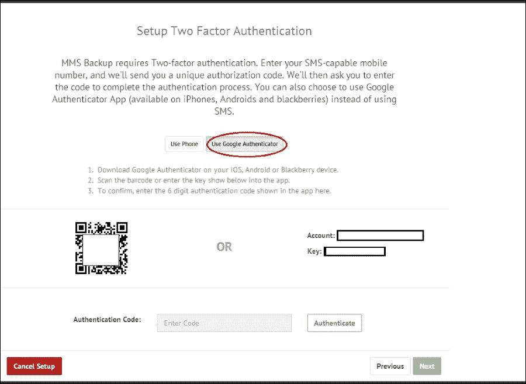

8.  通过扫描 Google Authenticator 应用程序中的二维码，开始新帐户的设置。如果条形码扫描出现问题，您可以选择手动输入屏幕右侧给出的键。
9.  Once the scanning or the key is entered successfully, your smartphone should show a 6-digit number that changes every 30 seconds. Enter that number in the **Authentication Code** box given on the screen.

    ### 注

    不要在手机上的 Google Authenticator 中删除此帐户，这一点很重要，因为将来我们希望更改任何与备份相关的设置时，都会使用此帐户，例如停止备份、更改排除列表，以及彩信备份中的几乎所有操作。设置完成后，二维码和钥匙将不再可见。您必须联系 MongoDB 支持部门才能重置配置。

10.  完成验证后，您应该看到的下一个屏幕是账单地址和账单详细信息，例如您注册的卡。所有低于 5 美元的费用都可以免除，所以在收费之前，您应该可以尝试一个小的测试实例。
11.  保存信用卡详细信息后，我们将继续进行设置。我们将安装一个备份代理。这是一个独立于监视代理的代理。选择合适的平台并按照安装说明进行安装。记下将放置代理的配置文件的位置。
12.  一个新的弹出窗口将包含指向平台存档/安装程序的说明/链接以及安装步骤。它还应该包含`apiKey`。记下 API 密钥；下一步我们需要它。
13.  安装完成后，打开放置在代理安装的`config`目录中的`local.config`文件（代理安装过程中显示/修改的位置），并粘贴/键入上一步记录的`apiKey`。
14.  配置并启动代理后，单击**验证代理**按钮。
15.  Once the agent is successfully verified, we will start by adding a host to back up. The drop-down menu should show us all the replica sets and shards we have added. Select the appropriate one and set the **Sync source** as the primary instance, as that is the only one we have in our standalone instance. **Sync source** is only used for the initial sync process. Whenever we have a proper replica set with multiple instances, I prefer using a secondary as a sync process instance.

    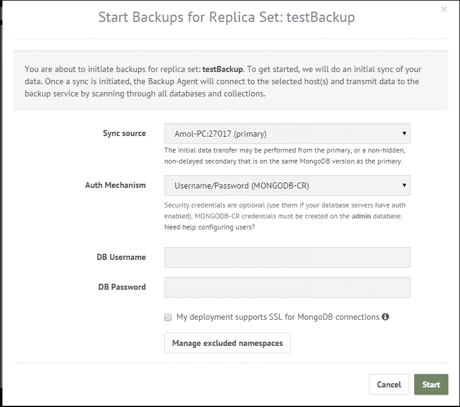

    由于实例不是安全启动的，**DB Username**和**DB Password**字段留空。

16.  如果要跳过正在备份的特定数据库或集合，请单击按钮**上的管理排除的命名空间**。如果未提供任何内容，则默认情况下将备份所有内容。集合名称的格式为`<databasename>.<collection name>`。或者，它可能只是数据库名称，在这种情况下，该数据库中的所有集合都不能进行备份。
17.  Once the details are all ok, click on the **Start** button. This should complete the setup of the backup process for a replica set on MMS.

    ### 提示

    我执行的安装步骤是在 Windows 操作系统上进行的，在这种情况下，需要手动启动服务。按 Windows+*R*并键入`services.msc`。该服务的名称为 MMS 备份代理。

## 它是如何工作的…

步骤非常简单，这就是我们为 Mongo MMS 备份设置服务器所需要做的全部工作。前面提到的一件重要事情是，MMS 备份在备份设置后对任何操作使用多因素身份验证，并且不应删除在 Google Authenticator for MongoDB 中设置的帐户。无法恢复用于设置身份验证程序的原始密钥。您必须清除 Google Authenticator 设置并设置新密钥。为此，单击屏幕左下角的**帮助&支持**链接，然后单击**如何重置我的双因素身份验证？**。

单击链接后，将打开一个新窗口并询问用户名。将向注册的电子邮件 ID 发送一封电子邮件，该 ID 允许您重置双因素身份验证。


如上所述，oplog 用于将当前 MongoDB 实例与 MMS 服务同步。但是，对于初始同步，将使用实例的数据文件。要使用的实例由我们在设置副本集备份时提供。由于这是一个资源繁重的操作，我更喜欢在繁忙的系统上使用辅助实例，以避免 MMS 备份代理在主实例上添加更多查询。实例完成初始同步后，将使用主实例的 oplog 连续获取数据。代理会定期向管理数据库中名为`mms.backup`的集合写入数据。

MMS 备份的备份代理与 MMS 监控代理不同。尽管在同一台机器上运行它们没有限制，但在生产中进行这样的设置之前，您可能需要对此进行评估。安全的办法是让它们在不同的机器上运行。在生产环境中，切勿在同一机箱上使用 mongod 或 mongos 实例运行这些代理。有两个重要的原因不建议在与 mongod 实例相同的机器上运行代理：

*   代理的资源利用率取决于它监视的群集大小。我们不希望代理使用大量资源来影响生产实例的性能。
*   代理可以同时监视许多服务器实例。由于此代理只有一个实例，我们不希望它在数据库服务器维护和重新启动期间停止运行。

使用 SSL 构建的 MongoDB 社区版或使用 SSL 选项在客户端和 mongo 服务器之间通信的企业版必须执行一些附加步骤。第一步是在设置备份副本集时检查**My deployment supports SSL for MongoDB connections**标志（请参见步骤 15）。注意屏幕截图底部应选中的复选框。其次，打开 MMS 配置的`local.config`文件，查看这两个属性：

```js
sslTrustedServerCertificates=
sslRequireValidServerCertificates=true
```

第一个是 PEM 格式的认证机构证书的完全限定路径。此证书将用于验证通过 SSL 运行的 mongod 实例提供的证书。如果要禁用证书验证，则可以将第二个属性设置为`false`，但这不是推荐的选项。就备份代理和 MMS 备份之间的通信量而言，通过 SSL 从代理发送到 MMS 服务的数据是安全的，无论您的 MongoDB 实例上是否启用了 SSL。数据中心中用于备份数据的静止数据未加密。

如果在 mongod 实例上启用了安全性，则需要提供用户名和密码，MMS 备份代理将使用该用户名和密码。在为复制集设置备份时提供用户名和密码，如步骤 15 所示。由于代理需要读取 oplog，可能需要所有数据库进行初始同步并将数据写入`admin`数据库，因此用户需要以下角色：`readAnyDatabase`、`clusterAdmin`、`admin`和`local`数据库上的`readWrite`以及`userAdminAnyDatabase`。在 2.4 及以上版本中就是这种情况。在 v2.4 之前的版本中，我们希望用户对所有数据库具有读访问权限，并对管理员和本地数据库具有读/写访问权限。

在为备份设置副本集时，可能会出现类似于`Insufficient oplog size: The oplog window must be at least 1 hours over the last 24 hours for all active replica set members. Please increase the oplog.`的错误。虽然您可能认为这总是与 oplog 大小有关，但当副本集有一个处于恢复状态的实例时，也会出现这种情况。这可能会让人产生误解，因此在为副本集设置备份时，一定要注意恢复副本集中的节点（如果有的话）。根据 MMS 支持，不为某些恢复节点的备份设置副本集似乎限制太多，将来可能会修复。

# 在 MMS 备份服务中管理备份

在前面的配方中，我们了解了如何设置 MMS 备份服务，并为备份设置了一个简单的单成员副本集。虽然单成员副本集毫无意义，但它是必需的，因为无法在 MMS 中设置独立实例进行备份。在本食谱中，我们将深入研究可以在设置为备份的服务器上执行的操作，例如启动、停止或终止备份；管理排除名单；管理备份快照和保留；以及恢复到时间点数据。

## 准备好了吗

上一个配方就是这个配方所需的全部。由于我们将使用本配方中为备份设置的服务器，因此需要进行必要的设置。

## 怎么做…

服务器启动并运行后，让我们将一些数据导入其中。它可以是任何东西，但我们选择使用上一章中使用的`countries.geo.json`文件。它应该可以从 Packt 站点下载到 bundle 中。

首先将数据导入到`test`数据库中名为`countries`的集合中。使用以下命令执行此操作。在当前目录下执行了以下导入命令，其中包含`countries.geo.json`文件：

```js
$ mongoimport  -c countries -d test --drop countries.geo.json

```

我们已经了解了在设置副本集备份时如何排除名称空间。现在，我们将了解在完成副本集的备份后如何排除名称空间。点击左侧**备份**菜单选项，点击**备份**时默认打开**副本集状态**。单击显示副本集所在行右侧的**档位**按钮。应该是这样的：


1.  正如我们在上图中看到的，单击**编辑排除的名称空间**并键入我们要排除的集合的名称。假设我们要排除`test`数据库中的`applicationLogs`集合，请输入`test.applicationLogs`。
2.  保存时，将要求您输入当前显示在 Google Authenticator 上的令牌代码。
3.  成功验证代码后，命名空间`test.applicationLogs`将添加到被排除在备份之外的命名空间列表中。
4.  现在我们将了解如何管理快照调度。快照是数据库在特定时间点的状态。要管理快照频率和保留策略，请单击上一屏幕截图中显示的**档位**按钮，然后单击**编辑快照计划**。
5.  As we can see in the following image, we can set the times when the snapshots are taken and their retention period. We will discuss more on this in the next section. Any changes to it would need multifactor authentication to save the changes.

    

6.  We will now see how we go about restoring the data using MMS backup. At any point in time whenever we want to restore the data, click on **Backup** and **Replica Set Status**/**Shard Cluster Status** click on **set/cluster name**.

    单击它，我们将看到针对该集保存的快照。它应该是这样的：

    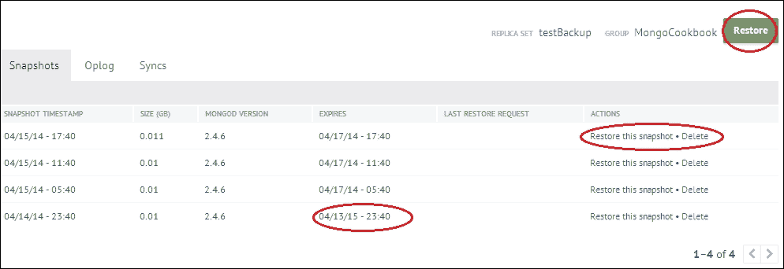

    我们已经包围了屏幕上的一些部分，我们将逐一看到。

7.  To restore to the time when the snapshot was taken, click on the **Restore this snapshot** link in the **Actions** column of the grid.

    

8.  上图显示了如何通过 HTTPS或 SCP 导出数据。我们现在选择 HTTPS，点击**认证**。我们将在下一节中了解有关 SCP 的内容。
9.  输入通过 SMS 接收或在 Google Authenticator 上看到的令牌，并在输入验证码时单击**Finalize Request**。
10.  On successful authentication, click on **Restore Jobs**. This is a one-time download that will let you download the `tar.gz` archive. Click on the **download** link to download the `tar.gz` archive.

    

11.  下载归档文件后，将其解压缩以获取其中的数据库文件。
12.  停止 mongod 实例，用提取的数据库文件替换数据库文件，重启服务器获取快照拍摄时的数据。请注意，数据库文件将不包含从备份中排除的集合的数据（如果所有）。
13.  我们现在将了解如何使用 MMS 备份获取时间点数据。
14.  点击**副本集状态**/**分片集群状态**，然后点击要恢复的集群/集。
    1.  在屏幕右侧，点击**恢复**按钮。
    2.  This should give a list of available snapshots or you may enter a custom time. Check **Use Custom Point In Time**. Click on the **Date** field and select a date and a time to which you want to restore the data in Hours and Minutes and click **Next**. Note that the **Point in Time** feature only restores to a point in last 24 Hours.

        在这里，您将被要求将格式指定为 HTTPS 或 SCP。从第 14 步开始，后续步骤与上一次类似。

## 它是如何工作的…

为副本集设置备份后，我们将随机数据导入数据库。此数据库的备份将由 MMS 完成，稍后我们将使用此备份还原数据库。在步骤 2-5 中，我们了解了如何将名称空间排除在备份之外。

查看快照和保留策略设置，我们可以选择快照的拍摄时间间隔和保留天数（步骤 9）。我们可以看到，默认情况下，快照每 6 小时拍摄一次，并保存 2 天。一天结束时拍摄的快照将保存一周。在周末和月末拍摄的快照分别保存 4 周和 13 个月。快照可以每 6、8、12 和 24 小时拍摄一次。但是，您需要了解长时间拍摄快照的另一面。假设最后一次快照是在 18 小时拍摄的；由于数据存储在 MMS 备份服务器上，因此很容易获取当时的数据进行恢复。但是，我们需要 21:30 的数据进行恢复。由于 MMS 备份支持时间点备份，它将在 18:00 时使用基本快照，然后在 21:30 时拍摄快照后，只需在其上重播更改。这类似于 oplog 在数据上的重放方式。此重播需要成本，因此获取时间点备份的成本略高于从快照获取数据的成本。在这里，我们必须重播数据 3.5 小时，从 18:00 到 21:30。想象一下，如果快照设置为在 12 小时后拍摄，并且我们的第一个快照是在 00:00 时拍摄的，那么我们将在每天的 00:00 和 12:00 时拍摄快照。要将数据恢复到 21:30，最后一个快照是 12:00，我们必须重播 9.5 小时的数据。这个要贵得多。

更频繁的快照意味着使用更多的存储空间，但将数据库恢复到给定时间点所需的时间更少。同时，频率较低的快照需要较少的存储，但需要花费更多时间将数据恢复到某个时间点。你需要在修复的空间和时间这两者之间做出权衡。对于每日快照，我们可以选择 3 到 180 天的保留期。类似地，对于每周和每月快照，可以分别在 1 到 52 周和 1 到 36 个月之间选择保留期。

步骤 9 中的屏幕截图有一列表示快照过期。对于第一次拍摄的快照，此期限为 1 年，而其他快照则在 2 天后过期。有效期与我们在最后一段中讨论的一样。更改过期值时，旧快照不会受到影响，也不会根据更改的时间进行调整。但是，拍摄的新快照将按照修改后的保留和频率设置。

我们了解了如何下载转储文件（从步骤 10 开始），然后使用它恢复数据库中的数据。这很简单，除了几件事之外，不需要太多解释。首先，如果数据是针对一个分片的，那么会有多个文件夹，每个分片一个文件夹，每个文件夹都有数据库文件，这与我们在这里看到的复制集不同，我们在复制集中有一个文件夹，其中有数据库文件。最后，让我们看看选择 SCP 作为选项时的屏幕：


SCP 是安全拷贝的缩写。文件将通过安全通道复制到计算机的文件系统。给定的主机需要有一个用于 SCP 的公共 IP。当我们希望将来自 MMS 的数据传送到运行在云上的 Unix 操作系统上的机器（例如，AWS 虚拟实例之一）时，这非常有意义。您可以在目标目录块中指定需要复制数据的位置、主机名和凭据，而不是在本地计算机上使用 HTTPS 获取文件，然后将其重新加载到云中的服务器。还有两种身份验证方法。密码是一种简单的方式，在 SSH 密钥对中添加了一个附加选项。如果您必须在云上配置主机的防火墙，以允许通过 SSH 端口传入流量，那么在屏幕底部会给出公共 IP 地址（在我们的屏幕截图中为`64.70.114.115/32`或`4.71.186.0/24`）。您应该将其列入白名单，以允许通过端口`22`传入安全复制请求。

## 另见

我们已经看到使用 MMS 运行备份，MMS 为此使用 oplog。在 Mongo 中有一个名为*的配方，使用[第 5 章](05.html "Chapter 5. Advanced Operations")、*高级操作*中的 oplog*实现触发器，它使用 oplog 实现类似触发器的功能。此概念是 MMS 备份服务使用的实时备份的主干。