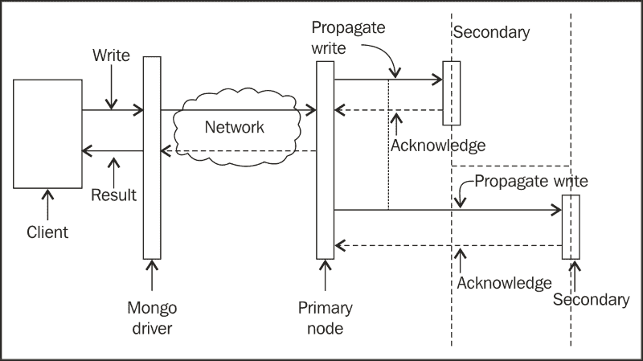
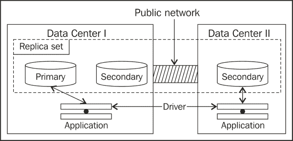

# 十、附录 A：参考概念

本附录包含一些附加信息，有助于您更好地理解食谱。我们将尽可能详细地讨论写关注点和阅读偏好。

# 写作关注及其意义

写关注点是MongoDB 服务器对客户端完成的写操作提供的最低保证。客户机应用程序设置了不同级别的写关注点，以从服务器获得保证，即服务器端的写过程将达到某个阶段。

对保证的要求越高，从服务器获得响应所花费的时间（可能）就越长。对于写操作，我们并不总是需要从服务器获得写操作完全成功的确认。对于一些不太重要的数据（如日志），我们可能更感兴趣的是通过连接每秒发送更多的写操作。另一方面，当我们希望更新敏感信息（如客户详细信息）时，我们希望确保写入成功（一致且持久）；数据完整性至关重要，并且优先于写入速度。

写关注点的一个非常有用的特性是能够在以下因素之一之间进行折衷：写操作的速度和所写数据的一致性（以个案为基础）。然而，它需要深入理解建立一个特定的 write 关注点的含义。下图从左到右，显示了不断提高的写保证级别：


当我们从**I**移动到**IV**时，执行写操作的保证越来越强，但从客户的角度来看执行写操作所需的时间更长。所有写关注点在这里都表示为 JSON 对象，使用三个不同的键，即`w`、`j`和`fsync`。此外，另一个名为`wtimeout`的键用于为写入操作提供超时值。让我们详细了解三个关键点：

*   `w`：表示是否等待服务器的确认，是否报告由于数据问题导致的写入错误，以及关于复制到辅助服务器的数据。它的值通常是一个数字，并且是一个特殊情况，其中的值可以是`majority`，我们将在后面看到。
*   `j`：这与日志记录相关，其值可以是布尔值（真/假或 1/0）。
*   `fsync`：这是一个布尔值，与写操作是否应该等到数据刷新到磁盘后再响应有关。
*   `wtimeout`：指定写入操作的超时，如果服务器在提供的时间内几秒钟内没有响应，驱动将向客户端抛出异常。我们将很快详细了解该选项。

在**I**部分中，我们在驱动之前对其进行了划分，我们有两个写关注点，即`{w:-1}`和`{w:0}`。这两种写操作都是常见的，从某种意义上说，它们既不等待服务器在接收到写操作时的确认，也不报告服务器端因唯一索引冲突而导致的任何异常。客户端将得到一个`ok`响应，只有在稍后某个时间点查询数据库并发现数据丢失时，才会发现写入失败。不同之处在于它们对网络错误的响应方式。当我们设置`{w:-1}`时，操作没有失败，并且用户收到写入响应。但是，它将包含一个响应，说明网络错误阻止了写入操作的成功，并且不必重试写入操作。另一方面，使用`{w:0}`，如果发生网络错误，驱动可能会选择重试该操作，并在由于网络错误导致写入失败时向客户端抛出异常。这两个写关注点都会以牺牲数据一致性为代价，快速响应调用客户端。这些写关注点适用于日志记录之类的用例，在这些用例中，偶尔的日志写未命中是可以的。在较早版本的 MongoDB 中，如果调用客户端没有提到任何问题，`{w:0}`是默认的写关注点。在编写本书时，默认情况下已更改为`{w:1}`，并且不推荐使用`{w:0}`选项。

在图的**II**部分中，位于驱动和服务器之间，我们讨论的写关注点是`{w:1}`。驱动等待服务器确认写入操作完成。请注意，服务器响应并不意味着写入操作是持久的。这意味着更改刚刚更新到内存中，所有约束都已检查，任何异常都将报告给客户机，这与我们看到的前两个写问题不同。这是一种相对安全的写关注模式，速度很快，但如果数据在从内存写入日志的那几毫秒内崩溃，数据丢失的可能性仍然很小。对于大多数用例，这是一个很好的设置选项。因此，这是默认的写关注点模式。

接下来，我们将看到图的第**III**部分，它从服务器的入口点一直到日志。我们在这里寻找的写作关注点位于`{j:1}`或`{j:true}`。此写关注点确保只有在将写操作写入日志时才对调用客户端作出响应。什么是日记？这是我们在[第 4 章](04.html "Chapter 4. Administration")、*管理*中深入了解的内容，但现在，我们只看一种机制，它可以确保写入持久，并且在服务器崩溃时磁盘上的数据不会损坏。

最后，让我们来看图的第**IV**部分；我们谈论的写作关注点是`{fsync:true}`。这要求在将响应发送回客户端之前将数据刷新到磁盘以获取。在我看来，当启用日志记录时，此操作实际上并没有增加任何价值，因为日志记录即使在服务器崩溃时也能确保数据的持久性。只有禁用日志记录时，此选项才能确保在客户端收到成功响应时写入操作成功。如果数据真的很重要，那么在第一时间就不应该禁用日志记录，因为它还可以确保磁盘上的数据不会损坏。

我们已经看到了单节点服务器的一些基本写问题，或者只与副本集中的主节点相关的写问题。

### 注

一件有趣的事情是，如果我们有一个写作关注点，比如`{w:0, j:true}`，该怎么办？我们不会等待服务器的确认，也会确保日志已经写入。在这种情况下，日志标记优先，客户端等待写入操作的确认。我们应该避免设置这种模糊的写关注点，以避免令人不快的意外。

现在我们将讨论写入关注点，它也涉及副本集的辅助节点。让我们看看下面的图表：



`w`值大于 1 的任何写入问题都表明辅助节点在发送回响应之前也需要确认。如上图所示，当主节点获得写入操作时，它会将该操作传播到所有辅助节点。一旦从预定数量的辅助节点获得响应，它就会向客户端确认写入已成功。例如，当我们有写入问题`{w:3}`时，这意味着只有当集群中的三个节点确认写入时，才应该向客户端发送响应。这三个节点包括主节点。因此，现在只有两个辅助节点才能响应成功的写入操作。

但是，为写关注点提供数字存在问题。我们需要知道集群中节点的数量，并相应地设置`w`的值。低值将向几个复制数据的节点发送确认。值太高可能会不必要地减慢对客户端的响应，或者在某些情况下，可能根本不发送响应。假设您有一个三节点副本集，我们有`{w:4}`作为写关注点，服务器将不会发送确认，直到数据复制到三个辅助节点，这三个辅助节点不存在，因为我们只有两个辅助节点。因此，客户机等待了很长时间才从服务器听到有关写入操作的消息。有几种方法可以解决此问题：

*   使用`wtimeout`键并指定写入关注点的超时。这将确保写入操作的阻塞时间不会超过为写入关注点的`wtimeout`字段指定的时间（以毫秒为单位）。例如，`{w:3, wtimeout:10000}`确保写入操作不会阻塞超过 10 秒（10000 毫秒），之后会向客户端抛出异常。在 Java 的情况下，将抛出一个`WriteConcernException`，并将根本原因消息声明为超时。请注意，此异常不会回滚写入操作。它只是通知客户端操作没有在指定的时间内完成。稍后可能会在客户端收到超时异常后的一段时间在服务器端完成。由应用程序处理异常并以编程方式采取纠正步骤。超时异常的消息确实传达了一些有趣的细节，我们将在执行写关注点的测试程序时看到这些细节。
*   在副本集的情况下，指定`w`值的更好方法是将该值指定为`majority`。当数据复制到大多数节点时，此写入问题会自动识别副本集中的节点数，并将确认信息发送回客户端。例如，如果写关注点是`{w:"majority"}`并且副本集中的节点数是三个，那么`majority`将是`2`。然而，在稍后的时间点，当我们将节点数更改为 5 时，`majority`将是`3`节点。当写入关注点的值为`majority`时，将自动计算形成多数的节点数。

现在，让我们使用我们讨论的概念，并执行一个测试程序，该程序将演示我们刚才看到的一些概念。

## 设置副本集

要设置副本集，您应该知道如何启动具有三个节点的基本副本集。参见[第一章](01.html "Chapter 1. Installing and Starting the Server")*安装和启动服务器*中的*启动多个实例作为副本集*配方的一部分。此配方基于该配方构建，因为启动复制集时需要额外配置，我们将在下一节中讨论。请注意，此处使用的复制副本在配置上与之前使用的复制副本略有不同。

在这里，我们将使用一个 Java 程序来演示各种写关注点及其行为。使用[第 1 章](01.html "Chapter 1. Installing and Starting the Server")*安装和启动服务器*中的 Java 客户端配方连接到单个节点的*应该一直访问，直到设置 Maven 为止。如果您来自非 Java 背景，这可能会有点不方便。*

### 注

名为`Mongo Java`的 Java 项目可在该书的网站上下载。如果安装完成，只需执行以下命令即可测试项目：

```js
mvn compile exec:java -Dexec.mainClass=com.packtpub.mongo.cookbook.FirstMongoClient

```

该项目的代码可在该书的网站上下载。下载名为`WriteConcernTest`的项目，并将其保存在本地驱动器上，以备执行。

那么，让我们开始：

1.  为副本集准备以下配置文件。这与我们在[第一章](01.html "Chapter 1. Installing and Starting the Server")*安装并启动服务器*中*启动多个实例作为副本集*配方中看到的配置文件相同，我们在其中设置了副本集，如下所示，只有一个区别，`slaveDelay:5`、`priority:0`：

    ```js
    cfg = {
     _id:'repSetTest',
     members:[
     {_id:0, host:'localhost:27000'},
     {_id:1, host:'localhost:27001'},
     {_id:2, host:'localhost:27002', slaveDelay:5, priority:0}
     ]
    }

    ```

2.  使用此配置启动一个三节点副本集，其中一个节点侦听端口`27000`。其他端口可以是您选择的任何端口，但如果可能，请坚持使用`27001`和`27002`（如果我们决定使用不同的端口号，则需要相应地更新配置）。另外，在启动复制副本集时，请记住为`replSet`命令行选项将复制副本集的名称设置为`replSetTest`。在继续下一步之前，请给复制集留出一些时间。
3.  此时，具有前面提到的规范的副本集应该已启动并正在运行。我们现在将执行 Java 中提供的测试代码，以观察不同写关注点的一些有趣的事实和行为。请注意，此程序还尝试连接到没有 Mongo 进程侦听连接的端口。选择的端口为`20000`；确保在运行代码之前，没有服务器正在运行并侦听端口`20000`。
4.  Go to the root directory of the `WriteConcernTest` project and execute the following command:

    ```js
    mvn compile exec:java -Dexec.mainClass=com.packtpub.mongo.cookbook.WriteConcernTests

    ```

    完全执行应该需要一些时间，具体取决于您的硬件配置。在我的机器上大约花了 35 到 40 秒，它有一个转速为 7200 RPM 的旋转磁盘驱动器。

在继续分析日志之前，让我们先看看添加到配置文件以设置复制副本的这两个附加字段是什么。`slaveDelay`字段表示特定从机（本例中监听端口`27002`的从机）将落后于主机 5 秒。也就是说，当前在此副本节点上复制的数据将是 5 秒前添加到主节点上的数据。其次，该节点永远不能是主节点，因此，`priority`字段必须添加值`0`。我们已经在[第 4 章](04.html "Chapter 4. Administration")、*管理*中详细介绍了这一点。

现在让我们分析前面命令执行的输出。这里不需要查看提供的 Java 类；控制台上的输出足够了。输出控制台的一些相关部分如下所示：

```js
[INFO] --- exec-maven-plugin:1.2.1:java (default-cli) @ mongo-cookbook-wctest ---
Trying to connect to server running on port 20000
Trying to write data in the collection with write concern {w:-1}
Error returned in the WriteResult is NETWORK ERROR
Trying to write data in the collection with write concern {w:0}
Caught MongoException.Network trying to write to collection, message is Write operation to server localhost/127.0.0.1:20000 failed on database test
Connected to replica set with one node listening on port 27000 locally

Inserting duplicate keys with {w:0}
No exception caught while inserting data with duplicate _id
Now inserting the same data with {w:1}
Caught Duplicate Exception, exception message is { "serverUsed" : "localhost/127.0.0.1:27000" , "err" : "E11000 duplicate key error index: test.writeConcernTest.$_id_  dup key: { : \"a\" }" , "code" : 11000 , "n" : 0 , "lastOp" : { "$ts" :1386009990 , "$inc" : 2} , "connectionId" : 157 , "ok" : 1.0}
Average running time with WriteConcern {w:1, fsync:false, j:false} is 0 ms
Average running time with WriteConcern {w:2, fsync:false, j:false} is 12 ms
Average running time with WriteConcern {w:1, fsync:false, j:true} is 40 ms
Average running time with WriteConcern {w:1, fsync:true, j:false} is 44 ms
Average running time with WriteConcern {w:3, fsync:false, j:false} is 5128 ms
Caught WriteConcern exception for {w:5}, with following message { "serverUsed" : "localhost/127.0.0.1:27000" , "n" : 0 , "lastOp" : { "$ts" : 1386009991 , "$inc" : 18} , "connectionId" : 157 , "wtimeout" : true , "waited" : 1004 , "writtenTo" : [ { "_id" : 0 , "host" : "localhost:27000"} , { "_id" : 1 , "host" : "localhost:27001"}] , "err" : "timeout" , "ok" : 1.0}
 [INFO] ------------------------------------------------------------------------
[INFO] BUILD SUCCESS
[INFO] ------------------------------------------------------------------------
[INFO] Total time: 36.671s
[INFO] Finished at: Tue Dec 03 00:16:57 IST 2013
[INFO] Final Memory: 13M/33M
[INFO] ------------------------------------------------------------------------

```

日志中的第一条语句表示，我们试图连接到侦听端口`20000`的 Mongo 进程。由于 Mongo 服务器不应该运行并监听此端口进行客户端连接，因此我们对该服务器的所有写入操作都不应该成功，这将使我们有机会了解当我们使用写入关注点`{w:-1}`和`{w:0}`并写入此不存在的服务器时会发生什么。

输出中接下来的两行显示，当我们有写关注点`{w:-1}`时，我们确实会返回一个写结果，但它包含一个错误标志集，用于指示网络错误。但是，不会引发任何异常。在写关注点`{w:0}`的情况下，我们确实会在客户端应用程序中获得任何网络错误的异常。当然，在这种情况下，所有其他确保严格保证的 write 关注点也会抛出一个例外。

现在我们来看连接到副本集的代码部分，其中一个节点正在侦听端口`27000`（如果不是，代码将在控制台上显示错误并终止）。现在，我们尝试在集合中插入一个具有重复的`_id`字段（`{'_id':'a'}`）的文档，一个是关于写入的`{w:0}`，另一个是关于`{w:1}`。正如我们在控制台中看到的，前者（`{w:0}`）没有抛出异常，并且从客户端的角度来看插入成功，而后者（`{w:1}`）向客户端抛出异常，表示密钥重复。异常包含了大量关于服务器主机名和端口的信息，在异常发生时：唯一约束失败的字段；客户端连接 ID；错误代码；以及不唯一并导致异常的值。事实是，即使使用`{w:0}`作为写关注点执行插入，它也失败了。但是，由于驱动没有等待服务器的确认，因此从未就故障进行通信。

接着，我们现在尝试计算完成写入操作所需的时间。此处显示的时间是在给定写关注点下执行相同操作五次所用时间的平均值。请注意，这些时间在程序执行的不同实例上会有所不同，这种方法只是为了给我们的研究提供一些粗略的估计。我们可以从输出中得出结论，写入关注点`{w:1}`所花费的时间小于`{w:2}`（请求一个辅助节点的确认），而`{w:2}`所花费的时间小于`{j:true}`，后者又小于`{fsync:true}`。输出的下一行显示，当写问题为`{w:3}`时，完成写操作所需的平均时间约为 5 秒。猜猜为什么会这样？为什么要花这么长时间？原因是，当`w`为`3`时，只有当两个次要节点确认写入操作时，我们才会向客户端发送确认。在我们的例子中，其中一个节点从主节点延迟约 5 秒，因此，它只能在 5 秒后确认写操作，因此，客户机大约在 5 秒钟内收到来自服务器的响应。

让我们在这里做一个快速的练习。当我们的书面关注事项为`{w:'majority'}`时，您认为大概的响应时间是多少？这里的提示是，对于三个节点的副本集，两个是大多数。

最后我们看到一个超时异常。使用文档的`wtimeout`字段设置超时，并以毫秒为单位指定。在我们的示例中，我们给出了 1000 毫秒的超时，即 1 秒，并且在将响应发送回客户端之前，副本集中要从中获取确认的节点数为 5 个（四个辅助实例）。因此，我们将写关注点命名为`{w:5, wtimeout:1000}`。由于我们的最大节点数是三个，`w`值设置为`5`的操作将等待很长时间，直到向集群中添加两个辅助实例。设置超时后，客户机返回并向客户机抛出一个错误，传递一些有趣的细节。以下是作为异常消息发送的 JSON：

```js
{ "serverUsed" : "localhost/127.0.0.1:27000" , "n" : 0 , "lastOp" : { "$ts" : 1386015030 , "$inc" : 1} , "connectionId" : 507 , "wtimeout" : true , "waited" : 1000 , "writtenTo" : [ { "_id" : 0 , "host" : "localhost:27000"} , { "_id" : 1 , "host" : "localhost:27001"}] , "err" : "timeout" , "ok" : 1.0}

```

让我们看看有趣的领域。我们从`n`字段开始。这表示更新的文档数。在本例中，它是一个插入，而不是一个更新，它保持为`0`。`wtimeout`和`waited`字段告诉我们交易是否超时以及客户等待响应的时间量；在本例中，1000 毫秒。最有趣的字段是`writtenTo`。在本例中，当操作超时时，在副本集的这两个节点上插入成功，因此可以在阵列中看到。第三个节点的`slaveDelay`值为 5 秒，因此，数据仍未写入。这证明超时没有回滚插入，并且它确实成功通过了。事实上，即使操作超时，`slaveDelay`节点在 5 秒后也会有数据，这非常有意义，因为它保持了主实例和次实例的同步。应用程序负责检测并处理此类超时。

# 读取查询首选项

在上一节中，我们了解了写关注点是什么以及它如何影响写操作（插入、更新和删除）。在本节中，我们将了解什么是读取首选项，以及它如何影响查询操作。我们将讨论如何在单独的食谱中使用阅读偏好，以使用特定的编程语言驱动。

当连接到单个节点时，连接到主节点时默认允许查询操作，如果连接到辅助节点，则需要显式声明可以通过 shell 执行`rs.slaveOk()`从辅助实例进行查询。

但是，考虑从应用程序连接到 Mongo 副本集。它将连接到副本集，而不是应用程序中的单个实例。根据应用程序的性质，它可能总是希望连接到主应用程序；总是去中学；更喜欢连接到主节点，但在某些情况下可以连接到辅助节点，反之亦然。最后，它可能连接到地理位置靠近它的实例（大多数情况下）。

因此，当连接到副本集而不是单个实例时，读取首选项起着重要作用。在下表中，我们将看到可用的各种读取首选项，以及它们在查询副本集方面的行为。其中有五个，名称不言自明：

<colgroup><col style="text-align: left"> <col style="text-align: left"></colgroup> 
| 

阅读偏好

 | 

描述

 |
| --- | --- |
| `primary` | 这是默认模式，只允许在主实例上执行查询。这是保证最新数据的唯一模式，因为所有写操作都必须经过主实例。但是，如果没有可用的主设备，读取操作将失败，这会在主设备停机并继续执行直到选择新的主设备时发生。 |
| `primaryPreferred` | 这与前面的主读取首选项相同，只是在故障切换期间，当没有主可用时，它将从辅助读取数据，而这些时间可能不会读取最新的数据。 |
| `secondary` | 这与默认的主读取首选项正好相反。此模式确保读取操作不会转到主操作，并且始终选择辅助操作。在此模式下，读取未更新到最新写入操作的不一致数据的机会最大。但是，对于不面向最终用户的应用程序来说，这是可以的（事实上，首选），并且用于某些实例，以获取用于内部监控的每小时统计和分析作业，其中数据的准确性最不重要，但不向主实例添加负载是关键。如果没有辅助实例可用或可访问，而只有主实例可用，则读取操作将失败。 |
| `secondaryPreferred` | 这与前面的二级读取首选项类似，除了如果没有二级可用，则读取操作将转到主实例。 |
| `nearest` | 这与前面的所有读取首选项不同，可以连接到主或辅助。此读取首选项的主要目标是客户机与副本集实例之间的最小延迟。在大多数情况下，由于网络延迟，并且客户端和所有实例之间的网络相似，因此选择的实例将是地理位置相近的实例。 |

与写关注点如何与碎片标记耦合类似，读取首选项也可以与碎片标记一起使用。由于标签的概念已经在[第 4 章](04.html "Chapter 4. Administration")、*管理*中介绍，您可以参考它了解更多细节。

我们刚刚看到了不同类型的读取首选项（使用标记的除外），但问题是，我们如何使用它们？我们在本书中介绍了 Python 和 Java 客户机，并将了解如何在各自的食谱中使用它们。我们可以在不同的级别设置读取首选项：在客户端级别、收集级别和查询级别，其中在查询级别指定的一个优先于之前设置的任何其他读取首选项。

让我们看看最近的阅读偏好是什么意思。从概念上讲，它可以可视化为类似下图的内容：



Mongo 副本集是在一个单独的数据中心中设置一个辅助副本（不能是主副本），在另一个数据中心中设置两个副本（一个主副本和一个辅助副本）。部署在两个数据中心中的相同应用程序（具有主读取首选项）将始终连接到**数据中心 I**中的主实例。这意味着，对于**数据中心 II**中的应用，流量通过公网传输，具有较高的延迟。但是，如果应用程序对稍微过时的数据没有问题，则可以将读取首选项设置为最近的，这将自动让**数据中心 I**中的应用程序连接到**数据中心 I**中的实例，并允许**数据中心 II**中的应用程序连接**数据中心二**中的二级实例。

但接下来的问题是，司机如何知道哪一个是最近的？“地理位置接近”一词具有误导性；它实际上是网络延迟最小的一个。我们查询的实例可能在地理位置上比副本集中的另一个实例更远，但可以选择它，因为它具有可接受的响应时间。一般来说，更好的响应时间意味着地理位置更近。

以下部分是针对那些对驱动的内部细节感兴趣的人，这些细节是关于如何选择最近的节点。如果您对概念而不是内部细节感到满意，您可以放心地跳过其余内容。

## 了解内部情况

让我们看看 Java 客户机的一些代码（驱动 2.11.3 用于此目的）并从中获得一些意义。如果我们看一下`com.mongodb.TaggableReadPreference.NearestReadPreference.getNode`方法，我们会看到的以下实现：

```js
@Override
ReplicaSetStatus.ReplicaSetNode getNode(ReplicaSetStatus.ReplicaSet set) {
  if (_tags.isEmpty())
    return set.getAMember();

  for (DBObject curTagSet : _tags) {
    List<ReplicaSetStatus.Tag> tagList = getTagListFromDBObject(curTagSet);
    ReplicaSetStatus.ReplicaSetNode node = set.getAMember(tagList);
    if (node != null) {
      return node;
    }
  }
  return null;
}
```

现在，如果我们忽略指定标记的内容，它所做的就是执行`set.getAMember()`。

这个方法的名称告诉我们有一组副本集成员，我们随机返回了其中一个。那么，是什么决定了集合是否包含成员？如果我们进一步研究这个方法，我们会在`com.mongodb.ReplicaSetStatus.ReplicaSet`类中看到以下代码行：

```js
public ReplicaSetNode getAMember() {
  checkStatus();
  if (acceptableMembers.isEmpty()) {
    return null;
  }
  return acceptableMembers.get(random.nextInt(acceptableMembers.size()));
}
```

好的，它所做的就是从内部维护的副本集节点列表中选择一个。现在，随机选取可以是次要的，即使可以选择主要的（因为它存在于列表中）。因此，我们现在可以说，当选择最近的作为读取首选项时，即使主选项在竞争者列表中，也不一定是随机选择的。

现在的问题是，`acceptableMembers`列表是如何初始化的？我们看到它是在`com.mongodb.ReplicaSetStatus.ReplicaSet`类的构造函数中完成的，如下所示：

```js
this.acceptableMembers =Collections.unmodifiableList(calculateGoodMembers(all, calculateBestPingTime(all, true),acceptableLatencyMS, true));
```

`calculateBestPingTime`行只找到了所有 ping 时间中最好的一个（稍后我们将看到这个 ping 时间是什么）。

另一个值得一提的参数是`acceptableLatencyMS`。在`com.mongodb.ReplicaSetStatus.Updater`中进行初始化（实际上是一个后台线程，不断更新副本集的状态），`acceptableLatencyMS`的值初始化如下：

```js
slaveAcceptableLatencyMS = Integer.parseInt(System.getProperty("com.mongodb.slaveAcceptableLatencyMS", "15"));
```

正如我们所看到的，这段代码搜索名为`com.mongodb.slaveAcceptableLatencyMS`的系统变量，如果没有找到，它将初始化为值`15`，即 15 毫秒。

这个`com.mongodb.ReplicaSetStatus.Updater`类还有一个`run`方法，可以定期更新副本集统计信息。不需要太多的讨论，我们可以看到它调用了`updateAll`，最终到达了`com.mongodb.ConnectionStatus.UpdatableNode`中的`update`方法：

```js
long start = System.nanoTime();
CommandResult res = _port.runCommand(_mongo.getDB("admin"), isMasterCmd);
long end = System.nanoTime()
```

它所做的只是执行`{isMaster:1}`命令并以纳秒为单位记录响应时间。此响应时间转换为毫秒，并存储为 ping 时间。因此，回到它存储的`com.mongodb.ReplicaSetStatus.ReplicaSet`类，`calculateGoodMembers`所做的就是查找并添加副本集的成员，这些成员的时间不超过副本集中找到的最佳 ping 时间`acceptableLatencyMS`毫秒。

例如，在具有三个节点的副本集中，从客户端到三个节点（节点 1、节点 2 和节点 3）的 ping 时间分别为 2ms、5ms 和 150ms。如我们所见，最佳时间为 2 ms，因此，节点 1 进入良好成员集。现在，从剩余的节点来看，所有延迟不超过`acceptableLatencyMS`的节点都比的最佳延迟不多，即*2+15ms=17ms*，因为 15ms 是将被考虑的默认延迟。因此，节点 2 也是竞争者，而不包括节点 3。我们现在在优秀成员列表中有两个节点（延迟方面很好）。

现在，将我们在上图中看到的场景中看到的所有情况放在一起，最短的响应时间将来自同一数据中心中的一个实例（从这两个数据中心中编程语言驱动的角度来看），因为其他数据中心中的实例可能不会在 15 毫秒内响应（默认可接受值）由于公网延迟而超过最佳响应时间，因此**数据中心一**中的可接受节点将是该数据中心中的两个副本集节点，其中一个将随机选择，对于**数据中心二**中的可接受节点仅为一个实例存在并且是唯一的选项。因此，它将由在该数据中心运行的应用程序选择。