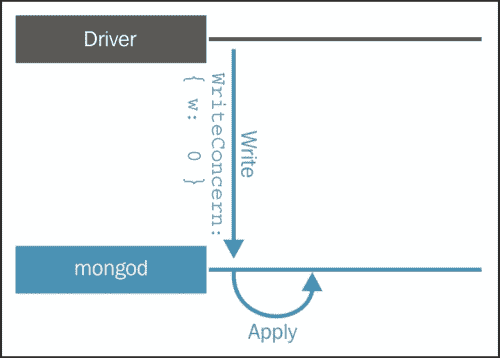
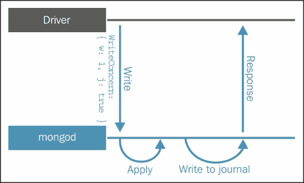
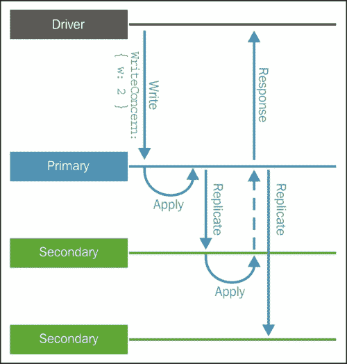

# 三、文档查询

在 NoSQL 数据库（如 MongoDB）中，规划查询是一项非常重要的任务，根据要执行的查询，文档可能会有很大的差异。

正如您在[第 2 章](2.html "Chapter 2. Data Modeling with MongoDB")、*与 MongoDB*的数据建模中所看到的，在很大程度上，在集合中引用或包含文档的决定是我们计划的结果。有必要确定我们是否会优先阅读或在收藏中写作。

在这里，我们将看到如何规划查询可以帮助我们以更高效和有效的方式创建文档，并且我们也会考虑更敏感的问题，如原子性和事务。

本章将重点讨论以下主题：

*   读取操作
*   写操作
*   写关注点
*   批量书写文件

# 理解读取操作

读取是数据库中最常见和最基本的操作。很难想象一个只用于写信息的数据库，而这些信息永远不会被读取。顺便说一句，我从未听说过这种方法。

在 MongoDB 中，我们可以通过`find`接口执行查询。`find`接口可以接受查询作为条件，接受投影作为参数。这将产生一个光标。游标具有可以用作已执行查询的修饰符的方法，例如`limit`、`map`、`skip`和`sort`。例如，查看以下查询：

```js
db.customers.find({"username": "johnclay"})

```

这将返回以下文档：

```js
{
 "_id" : ObjectId("54835d0ff059b08503e200d4"),
 "username" : "johnclay",
 "email" : "johnclay@crgv.com",
 "password" : "bf383e8469e98b44895d61b821748ae1",
 "details" : {
 "firstName" : "John",
 "lastName" : "Clay",
 "gender" : "male",
 "age" : 25
 },
 "billingAddress" : [
 {
 "street" : "Address 1, 111",
 "city" : "City One",
 "state" : "State One"
 }
 ],
 "shippingAddress" : [
 {
 "street" : "Address 2, 222",
 "city" : "City Two",
 "state" : "State Two"
 },
 {
 "street" : "Address 3,333",
 "city" : "City Three",
 "state" : "State Three"
 }
 ]
}

```

我们可以使用`find`接口在 MongoDB 中执行查询。`find`界面将选择集合中的单据，并返回所选单据的光标。

与 SQL 语言相比，`find`接口应该被看作是一个`select`语句。而且，与我们可以使用表达式和谓词确定子句的`select`语句类似，`find`接口允许我们使用条件和投影作为参数。

如前所述，我们将在这些`find`接口参数中使用 JSON 文档。我们可以通过以下方式使用`find`接口：

```js
db.collection.find(
 {criteria}, 
 {projection}
)

```

在本例中：

*   `criteria`是一个 JSON 文档，它将通过使用一些操作符来指定选择集合内文档的标准
*   `projection`是一个 JSON 文档，它将指定集合中哪些文档的字段将作为查询结果返回

这两个参数都是可选参数，稍后我们将详细介绍这些参数。

让我们执行以下示例：

```js
db.customers.find(
{"username": "johnclay"}, 
{_id: 1, username: 1, details: 1}
)

```

在本例中：

*   `{"username": "johnclay"}`是标准
*   `{_id: 1, username: 1, details: 1}`是投影吗

此查询将生成以下文档：

```js
{
 "_id" : ObjectId("54835d0ff059b08503e200d4"),
 "username" : "johnclay",
 "details" : {
 "firstName" : "John",
 "lastName" : "Clay",
 "gender" : "male",
 "age" : 25
 }
}

```

## 选择所有文件

正如前面提到的，在`find`界面中，的条件和投影参数都是可选的。使用不带任何参数的`find`界面意味着选择集合中的所有文档。

### 注

请注意，查询结果是包含所有选定文档的游标。

因此，`products`集合中的查询是这样执行的：

```js
db.products.find()

```

它将返回：

```js
{ 
 "_id" : ObjectId("54837b61f059b08503e200db"), 
 "name" : "Product 1", 
 "description" : "Product 1 description", 
 "price" : 10, 
 "supplier" : { 
 "name" : "Supplier 1", 
 "telephone" : "+552199998888" 
 } 
}
{ 
 "_id" : ObjectId("54837b65f059b08503e200dc"), 
 "name" : "Product 2", 
 "description" : "Product 2 description", 
 "price" : 20, 
 "supplier" : { 
 "name" : "Supplier 2", 
 "telephone" : "+552188887777" 
 } 
}
…

```

## 使用标准选择文件

尽管很方便，但由于给定集合的长度，选择集合中的所有文档可能不是一个好主意。如果我们以具有数百条、数千条或数百万条记录的集合为例，那么必须创建一个标准，以便仅选择所需的文档。

但是，没有什么可以阻止查询结果变得巨大。在这种情况下，根据执行查询的所选驱动器，我们必须迭代返回的游标。

### 注

请注意，在 mongo shell 中，返回记录的默认值为 20。

让我们检查以下示例查询。我们要选择属性名称为`Product 1`的文档：

```js
db.products.find({name: "Product 1"});

```

因此，这将给我们带来：

```js
{
 "_id" : ObjectId("54837b61f059b08503e200db"),
 "name" : "Product 1",
 "description" : "Product 1 description",
 "price" : 10,
 "supplier" : {
 "name" : "Supplier 1",
 "telephone" : "+552199998888"
 }
}

```

前面的查询通过等式`{name: "Product 1"}`选择单据。也可以在标准界面上使用运算符。

下面的示例演示了如何选择价格大于 10 的所有文档：

```js
db.products.find({price: {$gt: 10}});

```

其结果是：

```js
{ 
 "_id" : ObjectId("54837b65f059b08503e200dc"), 
 "name" : "Product 2", 
 "description" : "Product 2 description", 
 "price" : 20, 
 "supplier" : { 
 "name" : "Supplier 2", 
 "telephone" : "+552188887777" 
 } 
}
{ 
 "_id" : ObjectId("54837b69f059b08503e200dd"), 
 "name" : "Product 3", 
 "description" : "Product 3 description", 
 "price" : 30, 
 "supplier" : { 
 "name" : "Supplier 3", 
 "telephone" : "+552177776666" 
 }
}

```

当我们使用操作员`$gt`执行查询时，光标中只返回信息价格大于 10 的单据。

此外，还有其他操作符，如比较、逻辑、元素、求值、地理和数组。

我们以为例，以`products`集合中的文档为例，如下所示：

```js
{
 "_id" : ObjectId("54837b61f059b08503e200db"),
 "name" : "Product 1",
 "description" : "Product 1 description",
 "price" : 10,
 "supplier" : {
 "name" : "Supplier 1",
 "telephone" : "+552199998888"
 },
 "review" : [
 {
 "customer" : {
 "email" : "customer@customer.com"
 },
 "stars" : 5
 },
 {
 "customer" : {
 "email" : "customer2@customer.com"
 },
 "stars" : 6
 }
 ]
}
{
 "_id" : ObjectId("54837b65f059b08503e200dc"),
 "name" : "Product 2",
 "description" : "Product 2 description",
 "price" : 20,
 "supplier" : {
 "name" : "Supplier 2",
 "telephone" : "+552188887777"
 },
 "review" : [
 {
 "customer" : {
 "email" : "customer@customer.com"
 },
 "stars" : 10
 },
 {
 "customer" : {
 "email" : "customer2@customer.com"
 },
 "stars" : 2
 }
 ]
}
{
 "_id" : ObjectId("54837b69f059b08503e200dd"),
 "name" : "Product 3",
 "description" : "Product 3 description",
 "price" : 30,
 "supplier" : {
 "name" : "Supplier 3",
 "telephone" : "+552177776666"
 },
 "review" : [
 {
 "customer" : {
 "email" : "customer@customer.com"
 },
 "stars" : 5
 },
 {
 "customer" : {
 "email" : "customer2@customer.com"
 },
 "stars" : 9
 }
 ]
}

```

## 比较运算符

MongoDB为我们提供了一种定义值之间相等的方法。使用比较运算符，我们可以比较 BSON 类型值。让我们看看这些操作符：

*   `$gte`运算符负责搜索大于等于查询中指定值的值。如果执行查询`db.products.find({price: {$gte: 20}})`，则返回：

    ```js
    {
     "_id" : ObjectId("54837b65f059b08503e200dc"),
     "name" : "Product 2",
     "description" : "Product 2 description",
     "price" : 20,
     "supplier" : {
     "name" : "Supplier 2",
     "telephone" : "+552188887777"
     },
     "review" : [
     {
     "customer" : {
     "email" : "customer@customer.com"
     },
     "stars" : 10
     },
     {
     "customer" : {
     "email" : "customer2@customer.com"
     },
     "stars" : 2
     }
     ]
    }
    {
     "_id" : ObjectId("54837b69f059b08503e200dd"),
     "name" : "Product 3",
     "description" : "Product 3 description",
     "price" : 30,
     "supplier" : {
     "name" : "Supplier 3",
     "telephone" : "+552177776666"
     },
     "review" : [
     {
     "customer" : {
     "email" : "customer@customer.com"
     },
     "stars" : 5
     },
     {
     "customer" : {
     "email" : "customer2@customer.com"
     },
     "stars" : 9
     }
     ]
    }

    ```

*   使用运算符`$lt`可以在查询中搜索低于请求值的值。查询`db.products.find({price: {$lt: 20}})`将返回：

    ```js
    {
     "_id" : ObjectId("54837b61f059b08503e200db"),
     "name" : "Product 1",
     "description" : "Product 1 description",
     "price" : 10,
     "supplier" : {
     "name" : "Supplier 1",
     "telephone" : "+552199998888"
     },
     "review" : [
     {
     "customer" : {
     "email" : "customer@customer.com"
     },
     "stars" : 5
     },
     {
     "customer" : {
     "email" : "customer2@customer.com"
     },
     "stars" : 6
     }
     ]
    }

    ```

*   `$lte`运算符在查询中搜索小于或等于请求的值的值。如果我们执行查询`db.products.find({price: {$lte: 20}})`，它将返回：

    ```js
    {
     "_id" : ObjectId("54837b61f059b08503e200db"),
     "name" : "Product 1",
     "description" : "Product 1 description",
     "price" : 10,
     "supplier" : {
     "name" : "Supplier 1",
     "telephone" : "+552199998888"
     },
     "review" : [
     {
     "customer" : {
     "email" : "customer@customer.com"
     },
     "stars" : 5
     },
     {
     "customer" : {
     "email" : "customer2@customer.com"
     },
     "stars" : 6
     }
     ]
    }
    {
     "_id" : ObjectId("54837b65f059b08503e200dc"),
     "name" : "Product 2",
     "description" : "Product 2 description",
     "price" : 20,
     "supplier" : {
     "name" : "Supplier 2",
     "telephone" : "+552188887777"
     },
     "review" : [
     {
     "customer" : {
     "email" : "customer@customer.com"
     },
     "stars" : 10
     },
     {
     "customer" : {
     "email" : "customer2@customer.com"
     },
     "stars" : 2
     }
     ]
    }

    ```

*   `$in`运算符可以搜索字段值等于查询中请求的数组中指定的值的任何文档。查询`db.products.find({price:{$in: [5, 10, 15]}})`的执行将返回：

    ```js
    {
     "_id" : ObjectId("54837b61f059b08503e200db"),
     "name" : "Product 1",
     "description" : "Product 1 description",
     "price" : 10,
     "supplier" : {
     "name" : "Supplier 1",
     "telephone" : "+552199998888"
     },
     "review" : [
     {
     "customer" : {
     "email" : "customer@customer.com"
     },
     "stars" : 5
     },
     {
     "customer" : {
     "email" : "customer2@customer.com"
     },
     "stars" : 6
     }
     ]
    }

    ```

*   `$nin`运算符将匹配未包含在指定数组中的值。执行`db.products.find({price:{$nin: [10, 20]}})`查询的将产生：

    ```js
    {
     "_id" : ObjectId("54837b69f059b08503e200dd"),
     "name" : "Product 3",
     "description" : "Product 3 description",
     "price" : 30,
     "supplier" : {
     "name" : "Supplier 3",
     "telephone" : "+552177776666"
     },
     "review" : [
     {
     "customer" : {
     "email" : "customer@customer.com"
     },
     "stars" : 5
     },
     {
     "customer" : {
     "email" : "customer2@customer.com"
     },
     "stars" : 9
     }
     ]
    }

    ```

*   `$ne`运算符将匹配任何不等于查询中指定值的值。`db.products.find({name: {$ne: "Product 1"}})`查询的执行将产生：

    ```js
    {
     "_id" : ObjectId("54837b65f059b08503e200dc"),
     "name" : "Product 2",
     "description" : "Product 2 description",
     "price" : 20,
     "supplier" : {
     "name" : "Supplier 2",
     "telephone" : "+552188887777"
     },
     "review" : [
     {
     "customer" : {
     "email" : "customer@customer.com"
     },
     "stars" : 10
     },
     {
     "customer" : {
     "email" : "customer2@customer.com"
     },
     "stars" : 2
     }
     ]
    }
    {
     "_id" : ObjectId("54837b69f059b08503e200dd"),
     "name" : "Product 3",
     "description" : "Product 3 description",
     "price" : 30,
     "supplier" : {
     "name" : "Supplier 3",
     "telephone" : "+552177776666"
     },
     "review" : [
     {
     "customer" : {
     "email" : "customer@customer.com"
     },
     "stars" : 5
     },
     {
     "customer" : {
     "email" : "customer2@customer.com"
     },
     "stars" : 9
     }
     ]
    }

    ```

## 逻辑运算符

逻辑运算符是我们在 MongoDB 中定义值之间逻辑的方式。这些都源自布尔代数，布尔值的真值可以是`true`或`false`。让我们看看 MongoDB 中的逻辑运算符：

*   `$and`运算符将在表达式数组中进行逻辑*和*运算，将返回与所有指定条件匹配的值。执行`db.products.find({$and: [{price: {$lt: 30}}, {name: "Product 2"}]})`查询将产生：

    ```js
    {
     "_id" : ObjectId("54837b65f059b08503e200dc"),
     "name" : "Product 2",
     "description" : "Product 2 description",
     "price" : 20,
     "supplier" : {
     "name" : "Supplier 2",
     "telephone" : "+552188887777"
     },
     "review" : [
     {
     "customer" : {
     "email" : "customer@customer.com"
     },
     "stars" : 10
     },
     {
     "customer" : {
     "email" : "customer2@customer.com"
     },
     "stars" : 2
     }
     ]
    }

    ```

*   `$or`运算符将在表达式数组中进行逻辑*或*操作，并将返回所有符合任一指定条件的值。执行`db.products.find({$or: [{price: {$gt: 50}}, {name: "Product 3"}]})`查询将产生：

    ```js
    {
     "_id" : ObjectId("54837b69f059b08503e200dd"),
     "name" : "Product 3",
     "description" : "Product 3 description",
     "price" : 30,
     "supplier" : {
     "name" : "Supplier 3",
     "telephone" : "+552177776666"
     },
     "review" : [
     {
     "customer" : {
     "email" : "customer@customer.com"
     },
     "stars" : 5
     },
     {
     "customer" : {
     "email" : "customer2@customer.com"
     },
     "stars" : 9
     }
     ]
    }

    ```

*   `$not`运算符反转查询效果并返回与指定运算符表达式不匹配的值。用于否定任何操作。执行`db.products.find({price: {$not: {$gt: 10}}})`查询将产生：

    ```js
    {
     "_id" : ObjectId("54837b61f059b08503e200db"),
     "name" : "Product 1",
     "description" : "Product 1 description",
     "price" : 10,
     "supplier" : {
     "name" : "Supplier 1",
     "telephone" : "+552199998888"
     },
     "review" : [
     {
     "customer" : {
     "email" : "customer@customer.com"
     },
     "stars" : 5
     },
     {
     "customer" : {
     "email" : "customer2@customer.com"
     },
     "stars" : 6
     }
     ]
    }

    ```

*   `$nor`运算符将在表达式数组中进行逻辑*或*操作，将返回所有与数组中所有指定表达式不匹配的值。执行`db.products.find({$nor:[{price:{$gt: 35}}, {price:{$lte: 20}}]})`查询将产生：

    ```js
    {
     "_id" : ObjectId("54837b69f059b08503e200dd"),
     "name" : "Product 3",
     "description" : "Product 3 description",
     "price" : 30,
     "supplier" : {
     "name" : "Supplier 3",
     "telephone" : "+552177776666"
     },
     "review" : [
     {
     "customer" : {
     "email" : "customer@customer.com"
     },
     "stars" : 5
     },
     {
     "customer" : {
     "email" : "customer2@customer.com"
     },
     "stars" : 9
     }
     ]
    }

    ```

## 元素运算符

要查询有关我们文档字段的集合，我们可以使用元素运算符。

`$exists`操作员将返回查询中具有指定字段的所有文档。`db.products.find({sku: {$exists: true}})`的执行不会返回任何文档，因为它们都没有`sku`字段。

## 评价算子

评估运算符是我们对 MongoDB 中的一个表达式进行评估的方式。我们必须注意这类运算符，特别是如果我们在条件上使用的字段没有索引。让我们考虑评估操作员：

*   `$regex`运算符将返回与正则表达式匹配的所有值。`db.products.find({name: {$regex: /2/}})`的执行将返回：

    ```js
    {
     "_id" : ObjectId("54837b65f059b08503e200dc"),
     "name" : "Product 2",
     "description" : "Product 2 description",
     "price" : 20,
     "supplier" : {
     "name" : "Supplier 2",
     "telephone" : "+552188887777"
     },
     "review" : [
     {
     "customer" : {
     "email" : "customer@customer.com"
     },
     "stars" : 10
     },
     {
     "customer" : {
     "email" : "customer2@customer.com"
     },
     "stars" : 2
     }
     ]
    }

    ```

## 数组运算符

当我们在查询中使用数组时，我们应该使用数组运算符。让我们考虑数组运算符：

*   The `$elemMatch` operator will return all documents where the specified array field values have at least one element that match the query criteria conditions.

    `db.products.find({review: {$elemMatch: {stars: {$gt: 5}, customer: {email: "customer@customer.com"}}}})`查询将查看`review`字段有单据，`stars`字段值大于`5`，且`customer email`为`customer@customer.com`的所有收款单：

    ```js
    {
     "_id" : ObjectId("54837b65f059b08503e200dc"),
     "name" : "Product 2",
     "description" : "Product 2 description",
     "price" : 20,
     "supplier" : {
     "name" : "Supplier 2",
     "telephone" : "+552188887777"
     },
     "review" : [
     {
     "customer" : {
     "email" : "customer@customer.com"
     },
     "stars" : 10
     },
     {
     "customer" : {
     "email" : "customer2@customer.com"
     },
     "stars" : 2
     }
     ]
    }

    ```

### 注

除了呈现的操作符之外，我们还有：`$mod`、`$text`、`$where`、`$all`、`$geoIntersects`、`$geoWithin`、`$nearSphere`、`$near`、`$size`和`$comment`。您可以在 MongoDB手册参考[中找到更多关于此的信息 http://docs.mongodb.org/manual/reference/operator/query/](http://docs.mongodb.org/manual/reference/operator/query/) 。

## 预测

到目前为止，我们已经执行了查询，其中呈现的结果是文档，因为它在 MongoDB 中被持久化。但是，为了优化 MongoDB 及其客户端之间的网络开销，我们应该使用投影。

正如您在本章开头所看到的，接口允许我们使用两个参数。第二个参数是投影。

通过使用我们在上一个会话中使用的相同样本集合，带有投影的查询示例如下：

```js
db.products.find({price: {$not: {$gt: 10}}}, {name: 1, description: 1})

```

此查询生成：

```js
{
 "_id" : ObjectId("54837b61f059b08503e200db"),
 "name" : "Product 1",
 "description" : "Product 1 description"
}

```

投影是一个 JSON 文档，包含我们想要显示或隐藏的所有字段，后面跟着`0`或`1`，这取决于我们想要什么。

当一个字段后跟一个`0`时，则该字段将不会显示在生成的文档中。另一方面，如果该字段后跟一个`1`，则这意味着它将显示在结果文档中。

### 注

默认情况下，`_id`字段的值为`1`。

`db.products.find({price: {$not: {$gt: 10}}}, {_id: 0, name: 1, "supplier.name": 1})`查询将显示以下单据：

```js
{ "name" : "Product 1", "supplier" : { "name" : "Supplier 1" } }

```

在具有数组作为值的字段中，我们可以使用诸如`$elemMatch`、`$split`、`$slice`和`$`等运算符。

`db.products.find({price: {$gt: 20}}, {review: {$elemMatch: {stars: 5}}})`查询将产生：

```js
{
 "_id" : ObjectId("54837b69f059b08503e200dd"),
 "review" : [
 {
 "customer" : {
 "email" : "customer@customer.com"
 },
 "stars" : 5
 }
 ]
}

```

# 介绍写操作

在MongoDB 中，我们有三种写入操作：插入、更新和删除。为了运行这些操作，MongoDB 提供了三个接口：`db.document.insert`、`db.document.update`和`db.document.remove`。MongoDB 中的写入操作针对特定的集合，并且在单个文档级别上是原子的。

在 MongoDB 中建模文档时，写操作与读操作同样重要。单个文档级别中的原子性可以决定是否嵌入文档。我们将在[第 7 章](7.html "Chapter 7. Scaling")、*扩容*中对此进行更详细的讨论，但选择分片键的活动将决定我们是否写入操作的性能，因为根据键的选择，我们将写入一个或多个分片。

此外，写入操作性能的另一个决定因素与 MongoDB 物理模型有关。10gen 提供了许多建议，但让我们关注那些对我们的发展影响最大的建议。由于 MongoDB 的更新模型基于随机 I/O 操作，因此建议您使用固态光盘或 SSD。在随机 I/O 操作方面，与旋转磁盘相比，固态磁盘具有优越的性能。尽管旋转磁盘更便宜，而且基于这种硬件扩展基础设施的成本也没有那么高，但使用 SSD 或增加 RAM 仍然更有效。关于这一主题的研究表明，SSD 在随机 I/O 操作中的性能是旋转磁盘的 100 倍。

关于写操作，需要了解的另一件重要事情是 MongoDB 如何在磁盘上实际写入文档。MongoDB 使用日志机制来编写操作，该机制在将更改操作写入数据文件之前使用日志来编写更改操作。这是非常有用的，特别是当我们有一个脏关机。当`mongod`进程重新启动时，MongoDB 将使用日志文件将数据库状态恢复到一致状态。

如[第 2 章](2.html "Chapter 2. Data Modeling with MongoDB")、*MongoDB*数据建模中所述，BSON 规范允许我们拥有最大 16 MB 的文档。从 2.6 版开始，MongoDB 对记录或文档使用一种空间分配策略，名为“二次分配的幂”。顾名思义，MongoDB 将为每个文档分配一个字节大小，即其大小的二次幂（例如，32、64、128、256、512 等），考虑到文档的最小大小为 32 字节。此策略分配的空间超过了文档实际需要的空间，使其有更多的增长空间。

## 插入件

`insert`接口是在 MongoDB 中创建新文档的可能方式之一。`insert`接口具有以下语法：

```js
db.collection.insert(
 <document or array of documents>, 
 { 
 writeConcern: <document>, 
 ordered: <boolean> 
 }
)

```

在这里：

*   `document or array of documents`是一个文档或数组，其中包含一个或多个应在目标集合中创建的文档。
*   `writeConcern`是表示书面关注的文件。
*   `ordered`应该是一个布尔值，如果为 true，将对数组中的文档执行有序处理，如果文档中有错误，MongoDB 将停止处理。否则，如果该值为 false，它将执行无序过程，并且在发生错误时不会停止。默认值为`true`。

在下面的示例中，我们可以看到如何使用`insert`操作：

```js
db.customers.insert({
 username: "customer1", 
 email: "customer1@customer.com", 
 password: hex_md5("customer1paswd")
})

```

由于我们没有为`_id`字段指定值，它将自动生成一个唯一的`ObjectId`值。此`insert`操作创建的文档是：

```js
{ 
 "_id" : ObjectId("5487ada1db4ff374fd6ae6f5"), 
 "username" : "customer1", 
 "email" : "customer1@customer.com", 
 "password" : "b1c5098d0c6074db325b0b9dddb068e1" 
}

```

正如您在本节第一段中所观察到的，`insert`接口不是在 MongoDB 中创建新文档的唯一方法。通过在更新中使用`upsert`选项，我们还可以创建新文档。现在让我们更详细地了解一下。

## 更新

`update`接口用于修改 MongoDB 中以前已有的文档，甚至创建新文档。要选择要更改的文档，我们将使用标准。更新可以修改文档或整个文档的字段值。

更新操作一次只修改一个文档。如果条件匹配多个文档，则需要将一个带有`multi`参数且具有`true`值的文档传递给更新接口。如果条件不匹配单据，`upsert`参数为`true`，则创建新单据，否则更新匹配单据。

`update`接口表示为：

```js
db.collection.update(
 <query>,
 <update>,
 { 
 upsert: <boolean>, 
 multi: <boolean>, 
 writeConcern: <document> 
 }
)

```

在这里：

*   `query`是标准
*   `update`是包含要应用的修改的文件
*   `upsert`是一个布尔值，如果为 true，则在条件与集合中的任何文档不匹配时创建一个新文档
*   `multi`是一个布尔值，如果为 true，则更新符合条件的每个文档
*   `writeConcern`是表示书面关注的文件

使用上一个会话中创建的文档，更新示例如下：

```js
db.customers.update(
 {username: "customer1"}, 
 {$set: {email: "customer1@customer1.com"}}
)

```

修改后的文件是：

```js
{ 
 "_id" : ObjectId("5487ada1db4ff374fd6ae6f5"), 
 "username" : "customer1", 
 "email" : "customer1@customer1.com", 
 "password" : "b1c5098d0c6074db325b0b9dddb068e1"
}

```

`$set`操作符只允许我们更新匹配文档的`email`字段。

否则，您可能会有以下更新：

```js
db.customers.update(
 {username: "customer1"}, 
 {email: "customer1@customer1.com"}
)

```

在这种情况下，修改后的文档将是：

```js
{ 
 "_id" : ObjectId("5487ada1db4ff374fd6ae6f5"), 
 "email" : "customer1@customer1.com" 
}

```

也就是说，在没有`$set`操作符的情况下，我们使用在更新时作为参数传递的文档修改旧文档。除了`$set`操作符，我们还有其他重要的更新操作符：

*   `$inc` increments the value of a field with the specified value:

    ```js
    db.customers.update(
     {username: "johnclay"}, 
     {$inc: {"details.age": 1}}
    )

    ```

    此更新将使匹配文档中的字段`details.age`增加 1。

*   `$rename` will rename the specified field:

    ```js
    db.customers.update(
     {email: "customer1@customer1.com"}, 
     {$rename: {username: "login"}}
    )

    ```

    此更新会将匹配文档中的字段`username`重命名为`login`。

*   `$unset` will remove the field from the matched document:

    ```js
    db.customers.update(
     {email: "customer1@customer1.com"}, 
     {$unset: {login: ""}}
    )

    ```

    此更新将从匹配的文档中删除`login`字段。

由于写入操作是单个文档级别的原子操作，因此我们可以不小心使用前面的操作符。它们都可以安全使用。

## 写关注点

围绕非关系数据库的许多讨论都与 ACID 概念有关。作为数据库专业人员、软件工程师、架构师和开发人员，我们已经相当习惯于关系世界，并且我们花了大量时间开发而不关心酸性物质。

然而，到现在为止，我们应该理解为什么我们真的要考虑这个问题，以及在非关系世界中，这些简单的四个字母是多么重要。在本节中，我们将讨论 MongoDB 中的字母**D**，它表示耐久性。

数据库系统中的耐久性是一种属性，它告诉我们写入操作是否成功，事务是否提交，数据是否写入持久介质（如硬盘）中的非易失性内存。

与关系数据库系统不同，NoSQL 数据库中写入操作的响应由客户机决定。再一次，我们可以选择数据建模，满足客户的特定需求。

在 MongoDB 中，成功写入操作的响应可以有多个级别的保证。这就是我们所说的书面关注。级别从弱到强不等，客户决定担保的强度。在同一个集合中，我们可能同时拥有一个需要强写关注点的客户机和另一个需要弱写关注点的客户机。

MongoDB 提供给我们的写关注级别为：

*   未确认
*   承认
*   日记
*   副本已确认

### 未确认

正如其名称所示，对于未确认的写操作，客户端不会尝试响应写操作。如果这是可能的，将只捕获网络错误。下图显示，驱动程序不会等待 MongoDB 确认收到写入操作：



在下面的示例中，我们在`customers`集合中有一个`insert`操作，其中有一个未确认的写入问题：

```js
db.customers.insert(
{username: "customer1", email: "customer1@customer.com", password: hex_md5("customer1paswd")}, 
{writeConcern: {w: 0}}
)

```

### 确认

有了这个写关注点，客户端将得到写操作的确认，并看到它被写在 MongoDB 的内存视图中。在这种模式下，客户机可以捕获网络错误和重复密钥。由于 MongoDB 的 2.6 版本，这是默认的写问题。

正如您前面所看到的，我们不能保证 MongoDB 内存中视图上的写操作将被持久保存在磁盘上。如果 MongoDB 出现故障，内存视图中的数据将丢失。下图显示驱动程序等待 MongoDB 确认收到写入操作，并将更改应用于内存中的数据视图：


在下面的示例中，我们在`customers`集合中有一个`insert`操作，其中有一个已确认的写入问题：

```js
db.customers.insert(
{username: "customer1", email: "customer1@customer.com", password: hex_md5("customer1paswd")}, 
{writeConcert: {w: 1}}
)

```

### 记录

对于日志记录的写入问题，客户端将收到写入操作已在日志中提交的确认。因此，即使 MongoDB 出现问题，客户机也可以保证数据将被持久保存在磁盘上。

为了减少使用日志写入关注点时的延迟，MongoDB 将把向日志提交操作的频率从默认值 100 毫秒降低到 30 毫秒。下图显示，只有在将数据提交到日志后，驱动程序才会等待 MongoDB 确认收到写入操作：



在下面的示例中，我们在`customers`集合中有一个`insert`与一个日志写入关注点：

```js
db.customers.insert(
{username: "customer1", email: "customer1@customer.com", password: hex_md5("customer1paswd")}, 
{writeConcern: {w: 1, j: true}} 
)

```

### 副本已确认

当我们使用副本集时，重要的是确保写入操作不仅在主节点中成功，而且已传播到副本集的成员。为此，我们使用副本确认写入关注点。

通过将默认写入关注点更改为“已确认副本”，我们可以确定要从中确认写入操作的副本集的成员数。下图显示驱动程序将等待 MongoDB 确认收到指定数量副本集成员的写入操作：



在下面的示例中，我们将等待写入操作传播到主节点和至少两个辅助节点：

```js
db.customers.insert(
{username: "customer1", email: "customer1@customer.com", password: hex_md5("customer1paswd")}, 
{writeConcern: {w: 3}}
)

```

我们应该包含一个以毫秒为单位的 timeout 属性，以避免在节点发生故障时写入操作仍然被阻塞。

在下面的示例中，我们将等待写入操作传播到主节点和至少两个辅助节点，超时时间为三秒。如果我们期望从中获得响应的两个辅助节点中的一个失败，则该方法将在三秒后超时：

```js
db.customers.insert(
{username: "customer1", email: "customer1@customer.com", password: hex_md5("customer1paswd")}, 
{writeConcern: {w: 3, wtimeout: 3000}}
)

```

## 批量书写文件

有时，插入、更新或删除集合中的多个记录非常有用。MongoDB 为我们提供了执行批量写入操作的能力。批量操作在单个集合中工作，可以是有序的，也可以是无序的。

与`insert`方法一样，有序批量操作的行为是串行处理记录，如果发生错误，MongoDB 将返回，而不处理任何剩余操作。

无序操作的行为是并行处理，因此如果发生错误，MongoDB 仍将处理剩余的操作。

我们还可以确定批量写入操作所需的确认级别。自 2.6 版本以来，MongoDB 引入了新的批量方法，我们可以使用这些方法插入、更新或删除文档。但是，我们只能通过在`insert`方法上传递一个文档数组来进行批量插入。

在下面的示例中，我们使用`insert`方法进行批量插入：

```js
db.customers.insert(
[
{username: "customer3", email: "customer3@customer.com", password: hex_md5("customer3paswd")}, 
{username: "customer2", email: "customer2@customer.com", password: hex_md5("customer2paswd")}, 
{username: "customer1", email: "customer1@customer.com", password: hex_md5("customer1paswd")}
]
)

```

在以下示例中，我们使用新的批量方法进行无序批量插入：

```js
var bulk = db.customers.initializeUnorderedBulkOp();
bulk.insert({username: "customer1", email: "customer1@customer.com", password: hex_md5("customer1paswd")});
bulk.insert({username: "customer2", email: "customer2@customer.com", password: hex_md5("customer2paswd")});
bulk.insert({username: "customer3", email: "customer3@customer.com", password: hex_md5("customer3paswd")});
bulk.execute({w: "majority", wtimeout: 3000});

```

我们应该使用 MongoDB 提供给我们的所有电动工具，但不能不注意。MongoDB 限制一次最多执行 1000 个批量操作。因此，如果超过此限制，MongoDB 将把操作分成最多 1000 个批量操作的组。

# 总结

在本章中，您希望能够更好地理解 MongoDB 中的读写操作。此外，现在您还应该理解为什么在文档建模过程之前就已经知道需要执行的查询很重要。最后，您学习了如何在文档级别使用 MongoDB 属性，例如原子性，并了解了它如何帮助我们生成更好的查询。

在下一章中，您将看到称为索引的特殊数据结构如何改进查询的执行。