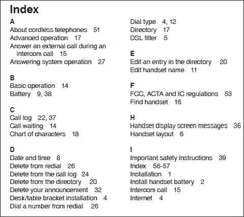

# 四、索引

正如您在关系数据库主题中所看到的，当我们考虑性能提升时，索引是重要的结构。事实上，索引非常重要，对于大多数数据库管理员来说，索引是不断提高数据库性能的关键工具。

在 NoSQL 数据库（如 MongoDB）中，索引是一个更大战略的一部分，它将允许我们在性能上获得许多收益，并为数据库分配重要的行为，这对于数据模型的维护至关重要。

这是因为我们可以在 MongoDB 中使用具有非常特殊属性的索引。例如，我们可以定义日期类型字段的索引，该索引将控制何时从集合中删除文档。

因此，在本章中，我们将看到：

*   索引文档
*   索引类型
*   特殊索引属性

# 索引文件

到目前为止，我们在本书中讨论的所有主题中，这是我们最放心的地方。索引概念几乎存在于每一个关系数据库中，因此，如果您以前对这个问题有过任何基础知识，那么在本章中您很可能不会遇到任何困难。

但如果你觉得自己对索引的概念还不够熟悉，那么理解它们的一个简单方法就是与书籍进行比较。假设我们有一本索引如下的书：



有了这个，如果我们决定阅读互联网，我们知道在**4**页，我们会找到关于这个主题的信息。另一方面，如果没有页码，我们如何才能找到我们正在寻找的信息？答案很简单：一页一页地浏览整本书，直到我们找到“互联网”这个词

正如您可能已经知道的，索引是保存来自主数据源的部分数据的数据结构。在关系数据库中，索引保存表的一部分，而在 MongoDB 中，由于索引位于集合级别，因此它们将保存文档的一部分。与关系数据库类似，索引在实现级别使用 B 树数据结构。

根据应用程序的要求，我们可以创建字段索引或嵌入文档字段索引。当我们创建索引时，它将保存所选字段的一组排序值。

因此，当执行查询时，如果有一个包含查询条件的索引，MongoDB 将使用该索引限制要扫描的文档数量。

我们有[第三章](3.html "Chapter 3. Querying Documents")、*查询单据*中使用的`customers`集合，其中包含以下单据：

```js
{
 "_id" : ObjectId("54aecd26867124b88608b4c9"),
 "username" : "customer1",
 "email" : "customer1@customer.com",
 "password" : "b1c5098d0c6074db325b0b9dddb068e1"
}

```

我们可以使用`createIndex`方法在`username`字段的 mongo shell 中创建索引：

```js
db.customers.createIndex({username: 1})

```

以下查询将使用以前创建的索引：

```js
db.customers.find({username: "customer1"})

```

### 注

自 3.0.0 版以来，`ensureIndex`方法已被弃用，是`createIndex`方法的别名。

我们可以说，这是在 MongoDB 中创建和使用索引的最简单方法。除此之外，我们还可以在多键字段或嵌入式文档字段中创建索引。

在下一节中，我们将介绍所有这些索引类型。

## 索引单个字段

正如我们在上一节中所述，在 MongoDB 上创建索引的最简单方法是在单个字段中创建索引。可以在文档集合中任何类型的字段上创建索引。

考虑一下以前使用过的 Type T0 集合，在本节中进行了一些修改：

```js
{
 "_id" : ObjectId("54aecd26867124b88608b4c9"),
 "username" : "customer1",
 "email" : "customer1@customer.com",
 "password" : "b1c5098d0c6074db325b0b9dddb068e1",
 "age" : 25,
 "address" : {

 "street" : "Street 1",
 "zipcode" : "87654321",
 "state" : "RJ"

 }
}

```

以下命令在`username`字段中创建升序索引：

```js
db.customers.createIndex({username: 1})

```

为了在 MongoDB 中创建索引，我们使用了`createIndex`方法。在前面的代码中，我们只是将单个文档作为参数传递给`createIndex`方法。文档`{username: 1}`包含对索引应创建的字段的引用以及顺序：1 表示升序或-1 表示降序。

创建相同索引的另一种方法（按降序）是：

```js
db.customers.createIndex({username: -1})

```

在下面的查询中，MongoDB 将使用在`username`字段中创建的索引来减少`customers`集合中需要检查的文档数量：

```js
db.customers.find({username: "customer1"})

```

除了在集合文档中的字符串或数字字段上创建索引外，我们还可以在嵌入式文档中创建字段的索引。因此，此类查询将使用创建的索引：

```js
db.customers.createIndex({"address.state": 1})

```

以下代码创建嵌入地址文档的`state`字段的索引：

```js
db.customers.find({"address.state": "RJ"})

```

虽然有点复杂，但我们也可以创建整个嵌入文档的索引：

```js
db.customers.createIndex({address: 1})

```

以下查询将使用该索引：

```js
db.customers.find(
{
 "address" : 
 { 
 "street" : "Street 1", 
 "zipcode" : "87654321", 
 "state" : "RJ"
 }
}
)

```

但是这些查询都不会这样做：

```js
db.customers.find({state: "RJ"})

db.customers.find({address: {zipcode: "87654321"}})

```

这是因为为了匹配嵌入文档，我们必须精确匹配整个文档，包括字段顺序。以下查询也不会使用索引：

```js
db.customers.find(
{
 "address" : 
 { 
 "state" : "RJ", 
 "street" : "Street 1", 
 "zipcode" : "87654321" 
 }
}
)

```

尽管文档包含所有字段，但它们的顺序不同。

在继续下一类索引之前，让我们回顾一下您在[第 3 章](3.html "Chapter 3. Querying Documents")、*查询文档*、`_id`字段中学习到的一个概念。对于集合中创建的每个新文档，我们都应该指定`_id`字段。如果我们没有指定，MongoDB 会自动为我们创建一个`ObjectId`类型。此外，每个集合自动创建一个唯一的`_id`字段升序索引。也就是说，`_id`字段是文档的主键。

## 索引多个字段

在MongoDB 中，我们可以创建一个包含多个字段值的索引。我们应该称这种索引为复合索引。单字段索引和复合索引之间没有太大区别。最大的区别在于排序顺序。在我们继续讨论复合索引的特殊性之前，让我们使用`customers`集合创建我们的第一个复合索引：

```js
{
 "_id" : ObjectId("54aecd26867124b88608b4c9"),
 "username" : "customer1",
 "email" : "customer1@customer.com",
 "password" : "b1c5098d0c6074db325b0b9dddb068e1",
 "age" : 25,
 "address" : {
 "street" : "Street 1",
 "zipcode" : "87654321",
 "state" : "RJ"
 }
}

```

我们可以想象，一个想要验证客户身份的应用程序在如下查询中同时使用`username`和`password`字段：

```js
db.customers.find(
{
username: "customer1", 
password: "b1c5098d0c6074db325b0b9dddb068e1"
}
)

```

为了在执行此查询时实现更好的性能，我们可以创建`username`和`password`字段的索引：

```js
db.customers.createIndex({username: 1, password: 1})

```

然而，对于以下查询，MongoDB 是否使用复合索引？

```js
#Query 1
db.customers.find({username: "customer1"})
#Query 2
db.customers.find({password: "b1c5098d0c6074db325b0b9dddb068e1"})
#Query 3
db.customers.find(
{
 password: "b1c5098d0c6074db325b0b9dddb068e1", 
 username: "customer1"
}
)

```

`Query 1`和`Query 3`的答案是肯定的。如前所述，顺序在创建复合索引时非常重要。创建的索引将引用按`username`字段排序的文档，并在每个用户名条目中按密码条目排序。因此，仅以`password`字段作为条件的查询将不使用索引。

让我们假设`customers`集合中有以下索引：

```js
db.customers.createIndex(
{
 "address.state":1, 
 "address.zipcode": 1, 
 "address.street": 1
})

```

您可能会问，哪些查询将使用我们新的复合索引？在回答这个问题之前，我们需要了解 MongoDB 中的一个复合索引概念：**前缀**。复合索引中的前缀是索引字段的子集。顾名思义，索引中的字段优先于其他字段。在我们的示例中，`{"address.state":1}`和`{"address.state":1, "address.zipcode": 1}`都是索引前缀。

具有任何索引前缀的查询将使用复合索引。因此，我们可以推断：

*   包含`address.state`字段的查询将使用复合索引
*   包含`address.state`和`address.zipcode`字段的查询也将使用复合索引
*   使用`address.state`、`address.zipcode`和`address.street`的查询也将使用复合索引
*   同时使用`address.state`和`address.street`的查询也将使用复合索引

复合索引不会用于以下查询：

*   只有`address.zipcode`字段
*   只有`address.street`字段
*   同时具有`address.zipcode`和`address.street`字段

### 注

我们应该注意到，尽管一个查询同时使用了索引的`address.state`和`address.street`字段，但是如果每个字段都有一个索引，我们可以在这个查询中获得更好的性能。这是由以下事实解释的：复合索引将首先按`address.state`排序，然后在`address.zipcode`字段上排序，最后在`address.street`字段上排序。因此，MongoDB 检查此索引比单独检查其他两个索引要昂贵得多。

因此，对于此查询：

```js
db.customers.find(
{
 "address.state": "RJ", 
 "address.street": "Street 1"
}
)

```

如果我们有这个指数，它会更有效：

```js
db.customers.createIndex({"address.state": 1, "address.street": 1})

```

## 索引多键字段

在 MongoDB 中创建索引的另一种方法是创建数组字段的索引。这些索引可以保存原始值数组，例如字符串和数字，甚至文档数组。

在创建多键索引时，我们必须特别注意。特别是当我们想要创建复合多键索引时。无法创建两个数组字段的复合索引。

### 注

我们无法创建并行数组索引的主要原因是，它们将要求索引在复合键的笛卡尔乘积中包含一个条目，这将导致一个大索引。

考虑使用这样的文档收集

```js
{
 "_id" : ObjectId("54aecd26867124b88608b4c9"),
 "username" : "customer1",
 "email" : "customer1@customer.com",
 "password" : "b1c5098d0c6074db325b0b9dddb068e1",
 "age" : 25,
 "address" : {
 "street" : "Street 1",
 "zipcode" : "87654321",
 "state" : "RJ"
 },
 "followedSellers" : [
 "seller1",
 "seller2",
 "seller3"
 ],
 "wishList" : [
 {
 "sku" : 123,
 "seller" : "seller1"
 },
 {
 "sku" : 456,
 "seller" : "seller2"
 },
 {
 "sku" : 678,
 "seller" : "seller3"
 }
 ]
}

```

我们可以为该集合创建以下索引：

```js
db.customers.createIndex({followedSellers: 1})

db.customers.createIndex({wishList: 1})

db.customers.createIndex({"wishList.sku": 1})

db.customers.createIndex({"wishList.seller": 1})

```

但无法创建以下索引：

```js
db.customers.createIndex({followedSellers: 1, wishList: 1}

```

## 用于文本搜索的索引

自从 2.4 版本以来，MongoDB 让我们有机会创建索引，帮助我们进行文本搜索。尽管有各种各样的专用工具，如 ApacheSolr、Sphinx 和 ElasticSearch，但大多数关系数据库和 NoSQL 数据库都有本机全文搜索。

可以在集合中创建字符串的文本索引或字符串字段数组。对于以下示例，我们将使用我们在[第 3 章](3.html "Chapter 3. Querying Documents")中使用的`products`集合*查询文档*，但进行了一些修改：

```js
{ 
 "_id" : ObjectId("54837b61f059b08503e200db"), 
 "name" : "Product 1", 
 "description" : 
 "Product 1 description", 
 "price" : 10, 
 "supplier" : { 
 "name" : "Supplier 1", 
 "telephone" : "+552199998888" 
 }, 
 "review" : [ 
 { 
 "customer" : { 
 "email" : "customer@customer.com" 
 }, 
 "stars" : 5 
 }
 ],
 "keywords" : [ "keyword1", "keyword2", "keyword3" ] 
}

```

我们只需在`createIndex`方法中指定`text`参数即可创建文本索引：

```js
db.products.createIndex({name: "text"})

db.products.createIndex({description: "text"})

db.products.createIndex({keywords: "text"})

```

前面的所有命令都可以创建`products`集合的文本索引。但是，MongoDB 有一个限制，即每个集合只能有一个文本索引。因此，`products`集合只能执行前面的一个命令。

尽管每个集合仅创建一个文本索引受到限制，但可以创建复合文本索引：

```js
db.products.createIndex({name: "text", description: "text"})

```

前面的命令为`name`和`description`字段创建一个`text`索引字段。

### 注

创建集合的文本索引的常用方法是为集合的所有文本字段创建索引。创建此索引有一种特殊的语法，您可以看到如下所示：

```js
db.products.createIndex({"$**","text"})

```

对于使用文本索引的查询，我们应该在其中使用`$text`运算符。而且，为了更好地理解如何创建有效的查询，最好了解索引是如何创建的。事实上，使用`$text`操作符执行查询时也使用了相同的过程。

总结过程，我们可以将其分为三个阶段：

*   符号化
*   删除后缀和/或前缀，或词干
*   删除停止字

为了优化我们的查询，我们可以指定我们在文本字段中使用的语言，从而在文本索引中使用，这样 MongoDB 将在索引过程的所有三个阶段使用一个单词列表。

MongoDB 自2.6 版本以来，支持以下语言：

*   `da`或`danish`
*   `nl`或`dutch`
*   `en`或`english`
*   `fi`或`finnish`
*   `fr`或`french`
*   `de`或`german`
*   `hu`或`hungarian`
*   `it`或`italian`
*   `nb`或`norwegian`
*   `pt`或`portuguese`
*   `ro`或`romanian`
*   `ru`或`russian`
*   `es`或`spanish`
*   `sv`或`swedish`
*   `tr`或`turkish`

使用语言创建索引的示例可以是：

```js
db.products.createIndex({name: "text"},{ default_language: "pt"})

```

我们也可以选择不使用任何语言，只创建带有`none`值的索引：

```js
db.products.createIndex({name: "text"},{ default_language: "none"})

```

通过使用`none`值选项，MongoDB 将简单地执行标记化和词干化；它不会加载任何停止词列表。

当我们决定使用文本索引时，我们应该加倍注意。每一个细节都会对我们设计文档的方式产生副作用。在以前版本的 MongoDB 中，在创建文本索引之前，我们应该将所有集合的分配方法更改为**usePowerOf2Sizes**。这是因为文本索引被认为是较大的索引。

另一个主要问题发生在我们创建指数的那一刻。根据现有集合的大小，索引可能非常大，要创建非常大的索引，我们需要很多时间。因此，最好将此过程安排在一个更及时的机会进行。

最后，我们必须预测文本索引对写入操作的影响。发生这种情况的原因是，对于在集合中创建的每个新记录，在索引中还将创建一个引用所有索引值字段的条目。

# 创建特殊索引

除了到目前为止我们创建的所有索引类型，无论是升序还是降序，还是文本类型，我们还有三个特殊的索引：生存时间、唯一性和稀疏性。

## 生存时间指标

**生存时间**（**TTL**指标是基于生命周期的指标。此索引仅在日期类型的字段中创建。它们不能是复合的，在给定的时间段后会自动从文档中删除。

这种类型的索引可以从日期向量创建。当达到较低的数组值时，文档将过期。MongoDB 负责通过后台任务每隔 60 秒控制文档的过期时间。例如，让我们使用本章中使用的`customers`集合：

```js
{ 
"_id" : ObjectId("5498da405d0ffdd8a07a87ba"), 
"username" : "customer1", 
"email" : "customer1@customer.com", 
"password" : "b1c5098d0c6074db325b0b9dddb068e1", "accountConfirmationExpireAt" : ISODate("2015-01-11T20:27:02.138Z") 
}

```

基于`accountConfirmationExpireAt`字段的生存时间索引的创建命令如下：

```js
db.customers.createIndex(
{accountConfirmationExpireAt: 1}, {expireAfterSeconds: 3600}
)

```

此命令表示所有早于`expireAfterSeconds`字段中请求的秒数的文档都将被删除。

还有另一种基于生存期创建索引的方式，即调度方式。下面的示例向我们展示了这种实现方法：

```js
db.customers.createIndex({
accountConfirmationExpireAt: 1}, {expireAfterSeconds: 0}
)

```

此将确保您在上一示例中看到的文档在 2015 年 1 月 11 日 20:27:02 到期。

这种类型的索引对于使用机器生成的事件、日志和会话信息的应用程序非常有用，这些事件、日志和会话信息只需要在给定的时间段内保持不变，您将在[第 8 章](8.html "Chapter 8. Logging and Real-time Analytics with MongoDB")、*中再次看到，MongoDB*的日志记录和实时分析。

## 唯一索引

与绝大多数关系数据库一样，MongoDB有一个唯一的索引。唯一索引负责拒绝索引字段中的重复值。唯一索引可以从单个或多键字段创建，也可以作为复合索引创建。创建唯一的复合索引时，值的组合必须具有唯一性。

如果我们在`insert`操作期间未设置任何值，则唯一字段的默认值将始终为空。如前所述，为集合的`_id`字段创建的索引是唯一的。考虑到`customers`集合的最后一个示例，可以通过执行以下操作创建唯一索引：

```js
db.customers.createIndex({username: 1}, {unique: true})

```

此命令将创建不允许重复值的`username`字段索引。

## 稀疏索引

稀疏索引是仅当文档具有将被索引的字段的值时才会创建的索引。我们可以使用文档中的一个字段或多个字段创建稀疏索引。最后一次使用被称为**复合索引**。当我们创建复合索引时，必须至少有一个字段具有 NOTNULL 值。

以`customers`集合中的以下文件为例：

```js
{ "_id" : ObjectId("54b2e184bc471cf3f4c0a314"), "username" : "customer1", "email" : "customer1@customer.com", "password" : "b1c5098d0c6074db325b0b9dddb068e1" }
{ "_id" : ObjectId("54b2e618bc471cf3f4c0a316"), "username" : "customer2", "email" : "customer2@customer.com", "password" : "9f6a4a5540b8ebdd3bec8a8d23efe6bb" }
{ "_id" : ObjectId("54b2e629bc471cf3f4c0a317"), "username" : "customer3", "email" : "customer3@customer.com" }

```

使用下面的示例命令，我们可以在`customers`集合中创建`sparse`索引：

```js
db.customers.createIndex({password: 1}, {sparse: true})

```

下面的示例查询使用创建的索引：

```js
db.customers.find({password: "9f6a4a5540b8ebdd3bec8a8d23efe6bb"})

```

另一方面，以下示例查询请求按索引字段降序，但不会使用索引：

```js
db.customers.find().sort({password: -1})

```

# 总结

在本章中，我们了解了索引是如何在数据模型维护中发挥重要作用的。通过在查询计划阶段包括索引创建，这将带来很多好处，最重要的是查询文档期间的性能。

因此，您学习了如何创建单键、复合键和多键索引。接下来，我们介绍了如何以及何时在 MongoDB 上使用索引进行文本搜索。然后我们遇到了特殊的索引类型，如 TTL、unique 和 sparse 索引。

在下一章中，您将看到如何分析查询，从而以更高效的方式创建查询。