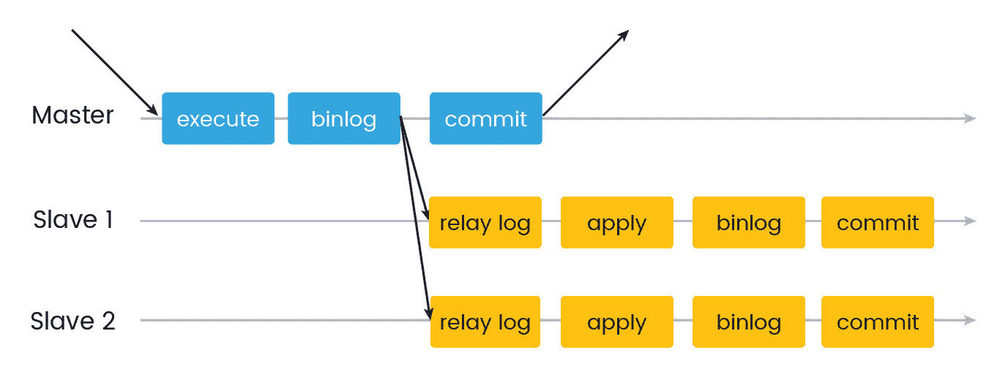
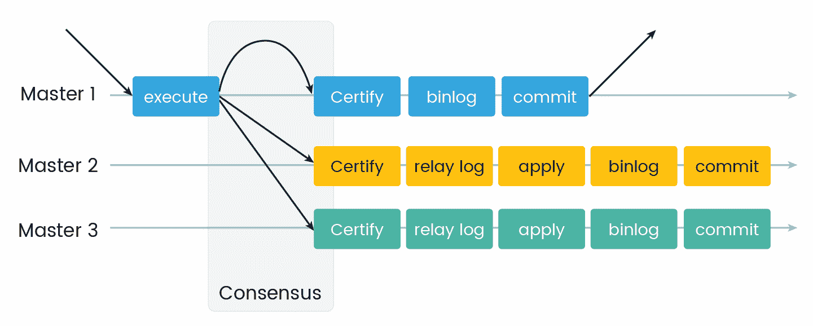

# 八、MySQL 8 中的副本

在上一章中，我们深入讨论了 MySQL 8 索引。索引是任何数据库管理系统的重要实体。它们通过限制要访问的记录数来帮助提高 SQL 查询性能。从事性能改进工作的数据库管理员必须了解这一重要技术。本章详细说明了索引的类型及其优点。本章还解释了在 MySQL 8 中索引是如何工作的。这将是一个信息丰富的章节！

在本章中，我们将进一步讨论数据库复制。我们对数据库复制的了解程度如何？其实这并不重要。本章介绍有关数据库复制的深入细节。如果您事先了解数据库复制，本章将对其进行补充。如果您只是第一次听说它，您将在本章中找到使其工作所需的每个细节。那么，我们准备好开始了吗？以下是我们将在本章中介绍的主题列表：

*   复制概述
*   配置复制
*   实现复制
*   组复制与集群
*   复制解决方案

# 复制概述

在本节中，我们将介绍数据库复制的基础知识。我们将了解复制是什么，它提供的优势，以及在哪些情况下复制是有益的。

# 什么是 MySQL 复制？

假设您阅读本文有两个原因。您熟悉 MySQL 复制并愿意获得更多知识，也许您不熟悉 MySQL 复制并希望学习。

MySQL 复制对于满足许多不同的目的非常有用。通常，当人们开始有超过单个数据库服务器所能处理的查询时，就会开始考虑 MySQL 复制。基于此，您对什么是 MySQL 复制有任何猜测吗？复制是一种将多个数据库设置为服务于单个或多个客户端应用程序的技术。客户机可以是终端用户，也可以是从不同设备（如计算机、手机、平板电脑等）发送任何查询请求的人。这些数据库是同一数据库的副本。这意味着参与数据库复制的所有数据库彼此完全相同。复制的工作原理是经常将数据从一个数据库复制到所有其他副本数据库。这些数据库可能位于同一个数据库服务器、不同的数据库服务器或不同的机器上。

如前所述，数据库复制有多种用途。这取决于设置 MySQL 数据库复制的原因。MySQL 复制被设置为扩展数据库或由数据库备份的应用程序。它还可用于维护数据库备份和报告目的。我们将在本章稍后部分详细讨论这些问题。

MySQL 复制主要是为扩展读取而设置的。在任何 web 应用程序中，读取操作的数量都比写入数据库操作的数量要高。大多数常见的 web 应用程序总是读得很重。考虑一个社交网站的例子。如果我们导航到一个用户配置文件页面，我们会看到很多信息，比如用户的个人信息、人口统计信息、社会关系、一些评级等等。如果仔细观察，我们会发现在数据库上执行的`SELECT`查询数远远高于`INSERT`、`UPDATE`或`DELETE`查询数。通过 MySQL 数据库复制，我们可以直接在特定数据库上执行读取操作，从而实现更高的性能。

MySQL 复制看起来非常简单，可以在几个小时内完成，但它很容易变得复杂。在一个新的数据库上进行设置非常容易。相反，在生产数据库上设置它是相当复杂的。我们不应该将 MySQL 复制与分布式数据库系统混淆。在分布式数据库系统中，数据库包含不同的数据集。数据库操作根据一些关键信息路由到特定数据库。

在传统的 MySQL 复制中，一个数据库充当主数据库，其余数据库充当从数据库。我们并不总是需要只有一个主数据库。我们可以在一个复制中有多个主数据库。这种技术称为多主机复制。从机从主数据库复制数据。在传统的 MySQL 复制中，复制数据的过程是异步的。这意味着从属数据库服务器不会与主数据库服务器永久连接。MySQL 支持不同级别的复制。我们可以将主数据库中的所有主数据库、选定数据库或选定表复制到从数据库中。

MySQL 8 提供了不同的数据库复制方法。MySQL 8 有一个二进制日志文件。文件的内容是描述数据库更改的事件。事件类型可以是`statement based`或`row based`。这些变更包括数据定义变更和数据操作变更或可能修改数据库的语句，如`DELETE`语句。二进制日志还包含每个 SQL 语句更新数据库所用时间的信息。传统的 MySQL 数据库复制方法基于主数据库服务器上的二进制日志文件将数据库从主数据库同步到从数据库。从属服务器根据日志记录在文件中的位置，从主数据库服务器复制或复制二进制日志文件的内容。

MySQL 8 还支持更新的数据库复制方法以及基于二进制日志文件的复制方法。MySQL 8 数据库服务器上提交的每个事务都被视为唯一的。唯一的**全局事务标识符**（**GTID**）与主数据库服务器上的每个已提交事务关联。顾名思义，全局标识符不仅对创建它的主数据库服务器是唯一的，而且在参与 MySQL 8 复制的所有数据库中也是唯一的。因此，本质上，每个提交的事务和全局事务标识符之间有一个 1 对 1 的映射。较新的 MySQL 复制方法基于 GTID。它大大简化了复制过程，因为它不依赖于二进制日志文件中的事件及其位置。GTID 表示为一对冒号（`:`分隔的坐标，如以下方框所示：

```sql
GTID = source_id:transaction_id
```

`source_id`是源于 GTID 的数据库服务器的标识符。通常，数据库服务器的`server_uuid`用作`source_id`。`transaction_id`是在数据库服务器上提交事务的序列号。例如，以下示例显示了第一个提交事务的 GTID：

```sql
1A22AF74-17AC-E111-393E-80C49AB653A2:1
```

提交的事务的序号以`1`开头。它不可能是`0`。

基于 GTID 的 MySQL 复制方法是事务性的，因此它比基于二进制日志文件的复制方法更可靠。只要主数据库服务器上提交的所有事务也已应用于所有从数据库服务器，GTID 就可以保证主数据库和从数据库之间的复制准确性和一致性。

如前所述，MySQL 数据库复制通常是异步的。但是，MySQL 8 支持不同类型的复制同步。通常的同步方法是异步的。这意味着一台服务器充当主数据库服务器。它将所有事件写入二进制日志文件。其他数据库服务器充当从属服务器。从数据库服务器从主数据库服务器读取和复制二进制日志文件中基于位置的事件记录。因此，它总是从主数据库服务器到从数据库服务器。MySQL 8 还支持半同步同步方法。在半同步复制方法中，主数据库服务器上提交的任何事务都将被阻止，直到主数据库服务器从至少一个从数据库服务器接收到它已接收并记录事务事件的确认。延迟复制是 MySQL 8 支持的另一种复制方法。在延迟复制中，从属数据库服务器故意将事务事件记录在主数据库服务器后面一段时间

# MySQL 复制的优势

我们现在已经熟悉了 MySQL 数据库复制是什么，现在是时候评估维护多个数据库服务器所增加的复杂性是否值得了。

MySQL 8 数据库复制的优点如下：

1.  **横向扩展解决方案**：如前所述，通常 web 应用程序都是阅读量大的应用程序。读操作的数量远远高于写操作。这些应用程序提供的功能要求在数据库服务器上执行繁重、复杂的 SQL 查询。这些查询不是需要毫秒才能执行的查询。这种复杂的查询可能需要几秒钟到几分钟才能执行。执行此类查询会给数据库服务器带来沉重的负载。在这种情况下，与主数据库服务器相比，在单独的数据库服务器上执行这样的读取操作总是更好的。写入数据库操作将始终在主数据库服务器上执行。你知道为什么吗？这是因为它会触发数据库修改。这些修改的事件必须写入二进制日志文件，以便从服务器进行复制同步。此外，同步是从主设备到从设备。因此，如果我们在从属服务器上执行写数据库操作，那么这些操作在主数据库服务器上将永远不可用。这种方法提高了写入操作的性能，提高了读取操作的速度，因为读取操作是跨多个从属服务器执行的。
2.  **数据安全**：一般来说，安全性是每个 web 应用程序都需要的重要特性。安全性可以在应用程序层或数据库层上启用。数据安全性可防止数据丢失。数据安全是通过定期备份数据库来实现的。如果未设置复制，备份生产数据库需要将应用程序置于维护模式。这是必需的，因为应用程序和备份过程同时访问数据库可能会损坏数据。有了复制，我们可以使用其中一个从机进行备份。由于从数据库服务器始终与主数据库服务器同步，因此我们可以备份从数据库服务器。为此，我们可以在备份进程运行时停止从主数据库服务器复制从属数据库服务器。这并不要求 web 应用程序停止使用主数据库服务器。事实上，它不会以任何方式影响主数据库服务器。另一个数据安全方面是提供对生产或主数据库服务器的基于角色的访问。我们只能有几个角色可以从后端访问主数据库服务器。其余用户或角色可以访问从属数据库服务器。这降低了由于人为错误导致意外数据丢失的风险。
3.  **分析**：分析和报告始终是数据库支持应用程序的重要功能。这些特性要求频繁地从数据库获取信息，以便对数据进行分析。如果设置了数据库复制，我们可以从从属数据库服务器获取分析所需的数据，而不会影响主数据库服务器的性能。

4.  **远程数据分发**：应用程序开发人员在本地开发环境中复制生产数据是一种常见的需求。在支持数据库复制的基础结构中，可以使用从属数据库服务器在开发数据库服务器上准备数据库副本，而无需不断访问主数据库服务器。

# 配置复制

在本节中，我们将学习不同类型的 MySQL 8 复制方法的配置。它包括设置和配置复制的分步说明

# 基于二进制日志文件的复制

MySQL 数据库复制最常见的传统方法之一是二进制日志文件定位方法。本节重点介绍复制的二进制日志文件位置方法的配置。在进入配置部分之前，最好先修改并理解基于二进制日志位置的复制的基础知识。

如前所述，其中一个 MySQL 数据库服务器充当主服务器，其余 MySQL 数据库服务器成为从服务器。主数据库服务器是数据库更改的来源。主数据库服务器根据二进制日志文件中的数据库更新或更改写入事件。二进制日志文件中写入的信息记录的格式根据记录的数据库更改而有所不同。MySQL`REPLICATION SLAVE`数据库服务器配置为从主数据库服务器读取二进制日志事件。从属服务器在本地数据库二进制日志文件上执行事件。通过这种方式，从属数据库与主数据库同步。当从数据库服务器从主数据库服务器读取二进制日志文件时，从数据库服务器将获得二进制日志文件的完整副本。一旦接收到二进制日志文件，就由从机决定在从机二进制日志文件上执行哪些语句。可以指定主数据库服务器二进制日志文件中的所有语句都应在从数据库服务器二进制日志文件上执行。还可以处理由特定数据库或表过滤的事件。

Only slave database servers can be configured to filter events from master database server log files. It is not possible to configure the master database server to log only specific events.

MySQL 8 提供了一个系统变量，可以帮助唯一地标识数据库服务器。参与 MySQL 复制的所有数据库服务器必须配置为具有唯一 ID。每个从属数据库服务器必须配置主数据库服务器主机名、日志文件名和日志文件中的位置。设置完成后，可以使用在从属数据库服务器上执行的`CHANGE MASTER TO`语句在 MySQL 会话中修改这些详细信息。

当从数据库服务器从主数据库二进制日志文件读取信息时，它会跟踪二进制日志坐标的记录。二进制日志坐标由文件名和文件中的位置组成，从主数据库服务器读取和处理。从数据库服务器从主数据库服务器读取二进制日志文件的效率非常高，因为多个从数据库服务器可以连接到主数据库服务器并处理不同的日志文件来自主数据库服务器的部分二进制日志文件。主数据库服务器的操作不受影响，因为从数据库服务器与主数据库服务器的连接和断开由从数据库服务器自己控制。如前所述，每个从属数据库服务器跟踪二进制日志文件中的当前位置。因此，从属数据库服务器可以断开并重新连接主数据库服务器，并恢复二进制日志文件处理。

MySQL 中提供了许多设置数据库复制的方法。复制的确切方法取决于数据库中是否已存在数据以及如何设置复制。以下每个部分都是配置 MySQL 复制的步骤。

# 复制主机配置

在设置复制主数据库服务器之前，必须确保数据库服务器已建立唯一的 ID，并且已启用二进制日志记录。完成这些配置后，可能需要重新启动数据库服务器。主数据库服务器二进制日志是 MySQL 8 数据库复制的基础。

要启用二进制日志记录，`log_bin`系统变量应设置为`ON`。MySQL 数据库服务器默认启用二进制日志记录，如果使用`mysqld`通过`--initialize`或`--initialize-insecure`选项手动初始化数据目录，则默认禁用二进制日志记录。必须通过指定`--log-bin`选项来启用。`--log-bin`选项指定用于二进制日志文件的基本名称。

如果启动选项未指定文件名，则将根据数据库服务器主机名设置二进制日志文件名。建议使用`--log-bin`选项指定二进制日志文件名。如果使用`--log_bin=old_host_name-bin`指定日志文件名，则即使数据库服务器主机发生更改，日志文件名仍将保留。

要设置主数据库服务器，请在主数据库服务器上打开 MySQL 配置文件：

```sql
sudo vim /etc/mysql/my.cnf
```

在配置文件中，进行以下更改。

首先，查找将服务器绑定到本地主机的部分：

```sql
bind-address = 127.0.0.1
```

将本地 IP 地址替换为实际的数据库服务器 IP 地址。此步骤很重要，因为从属服务器可以使用主数据库服务器的公共 IP 地址访问主数据库服务器：

```sql
bind-address = 175.100.170.1
```

要为主数据库服务器配置唯一 ID，需要进行以下更改。它还包括设置主二进制日志文件所需的配置：

```sql
[mysqld]
log-bin=/var/log/mysql/mysql-bin.log
server-id=1
```

现在，让我们配置要在从属数据库服务器上复制的数据库。如果需要在从属数据库服务器上复制多个数据库，请重复以下行多次：

```sql
binlog_do_db = database_master_one
binlog_do_db = database_master_two
```

完成这些更改后，使用以下命令重新启动数据库服务器：

```sql
sudo service mysql restart
```

现在，我们已经设置了主数据库服务器。下一步是向从属用户授予特权，如下所示：

```sql
mysql> mysql -u root -p
mysql> CREATE USER 'slaveone'@'%' IDENTIFIED BY 'password';
mysql> GRANT REPLICATION SLAVE ON *.* TO 'slaveone'@'%' IDENTIFIED BY 'password';
```

前面的命令创建从属用户，授予主数据库服务器上的权限，并刷新数据库缓存的权限。

现在，我们必须备份要复制的数据库。我们将使用`mysqldump`命令备份数据库。此数据库将用于创建`slave`数据库。主状态输出显示二进制日志文件名的名称、当前位置和要复制的数据库的名称：

```sql
mysql> USE database_master_one;
mysql> FLUSH TABLES WITH READ LOCK;
mysql> SHOW MASTER STATUS;
+------------------+----------+---------------------+------------------+ 
|       File       | Position |     Binlog_Do_DB    | Binlog_Ignore_DB | 
+------------------+----------+---------------------+------------------+ 
| mysql-bin.000001 |    102   | database_master_one |                  | 
+------------------+----------+---------------------+------------------+ 
1 row in set (0.00 sec)

mysqldump -u root -p database_master_one > database_master_one_dump.sql
```

在使用`mysqldump`命令进行数据库备份之前，我们必须锁定数据库以检查当前位置。此信息稍后将用于设置从属数据库服务器。

获取数据库转储后，应使用以下命令解锁数据库：

```sql
mysql> UNLOCK TABLES;
mysql> QUIT;
```

我们已经完成了设置复制主数据库服务器所需的所有配置，并使其可由`REPLICATION SLAVE`数据库服务器访问。

以下选项对主数据库服务器设置有影响：

1.  应设置`innodb_flush_log_at_trx_commit=1`和`sync_binlog=1`选项，以实现更高的耐久性和一致性。可在`my.cnf`配置文件中设置选项。
2.  不得启用`skip-networking`选项。如果启用，则从属服务器无法与主服务器通信，并且数据库复制失败。

# 复制从机配置

与主数据库服务器类似，每个从属数据库服务器必须具有唯一的 ID。设置后，这将需要重新启动数据库服务器：

```sql
[mysqld]
server-id=2
```

为了设置多个从数据库服务器，必须配置一个唯一的非零`server-id`，该非零`server-id`不同于主数据库服务器或任何其他从数据库服务器。设置复制不需要从数据库服务器上的二进制日志记录。如果启用，从数据库服务器上的二进制日志文件可用于数据库备份和崩溃恢复。

现在，创建一个新数据库，该数据库将成为主数据库的副本，并从主数据库准备的数据库转储导入数据库，如下所示：

```sql
mysql> CREATE DATABASE database_slave_one;
mysql> QUIT;

# mysql -u root -p database_slave_one &lt; /path/to/database_master_one_dump.sql
```

现在，我们必须在`my.cnf`文件中配置一些其他选项。与二进制日志一样，中继日志由编号文件组成，其中数据库更改事件作为文件内容。它还包含一个索引文件，其中包含所有使用的中继日志文件的名称。以下配置设置中继日志文件、二进制日志文件和从属数据库的名称，从属数据库是主数据库的副本，如下所示：

```sql
relay-log = /var/log/mysql/mysql-relay-bin.log
log_bin = /var/log/mysql/mysql-bin.log
binlog_do_db = database_slave_one
```

此配置更改后需要重新启动数据库服务器。下一步是从 MySQL shell 提示符中启用从属复制。执行以下命令设置`slave`数据库服务器所需的`master`数据库信息：

```sql
mysql> CHANGE MASTER TO MASTER_HOST='12.34.56.789', MASTER_USER='slaveone', MASTER_PASSWORD='password', MASTER_LOG_FILE='mysql-bin.000001', MASTER_LOG_POS= 103;
```

最后一步，激活从属服务器：

```sql
mysql> START SLAVE;
```

如果在`slave`数据库服务器上启用了二进制日志记录，则从属服务器可以参与复杂的复制策略。在这种复制设置中，数据库服务器`A`充当数据库服务器`B`的主机。`B`作为`A``master`数据库服务器的从属服务器。现在，`B`可以作为`C``slave`数据库服务器的主数据库服务器。类似的情况可以如下所示：

```sql
A -> B -> C
```

# 向复制添加从属服务器

可以向现有复制配置中添加新的从属数据库服务器。这不需要停止主数据库服务器。方法应该是复制现有的`slave`数据库服务器。复制后，我们必须修改`server-id`配置选项的值。

以下说明将新的从属数据库设置为现有复制配置。首先，应按如下方式关闭现有从属数据库服务器：

```sql
mysql> mysqladmin shutdown
```

现在，应该将现有从属数据库中的数据目录复制到新的从属数据库服务器。除了数据目录外，还必须复制二进制日志和中继日志文件。建议新的从数据库服务器使用与现有从数据库服务器相同的`--relay-log`值。

如果主信息和中继日志信息存储库使用文件，则必须将这些文件从现有从属数据库服务器复制到新的从属数据库服务器。这些文件保存主设备的当前二进制日志坐标和从设备的中继日志。

现在，启动先前停止的现有从属服务器。

现在，我们应该能够启动新的从属数据库服务器了。我们必须在启动新的从属服务器之前配置唯一的`server-id`，如果它尚未设置。

# 基于全局事务标识符的复制

本节重点介绍基于全局事务标识符的复制。它解释了如何在 MySQL 服务器中定义、创建和表示 GTID。它描述了设置和启动基于 GTID 的复制的过程。

使用基于 GTID 的复制，每个事务在提交到原始数据库服务器时都会被分配一个唯一的事务 ID，称为**GTID**。唯一标识符是全局的，这意味着它在参与复制的所有数据库服务器中都是唯一的。有了 GTID，当事务提交到`master`数据库服务器时，跟踪和处理每个事务就更容易了。使用这种复制方法，`master`和`slave`数据库之间的同步不需要依赖日志文件。由于这种复制方法是基于事务的，因此更容易确定`master`和`slave`数据库是否一致。只要`master`数据库上提交的所有事务也应用于从属数据库，就可以保证主数据库和从属数据库之间的一致性。基于语句或基于行的复制都可以与 GTID 一起使用。如前所述，GTID 由一对用冒号（`:`分隔的坐标表示，如下例所示：

```sql
GTID = source_id:transaction_id
```

使用基于 GTID 的复制方法的优点是：

1.  使用这种复制方法，可以在服务器故障切换时切换主数据库服务器。全局事务标识符在所有参与的数据库服务器中都是唯一的。从属服务器使用 GTID 维护最后执行的事务的跟踪。这意味着，如果将主数据库服务器切换到新的数据库服务器，从属服务器将更容易继续使用新的主数据库服务器并恢复复制处理。

2.  从数据库服务器的状态是以崩溃安全的方式维护的。使用更新的复制技术，`slave`数据库服务器跟踪名为`mysql.gtid_slave_pos`的系统表中的当前位置。使用事务存储引擎（如`InnoDB`），状态更新记录在与数据库操作相同的事务中。因此，如果从属服务器停机，在再次启动时，从属服务器将启动崩溃恢复，并确保记录的复制位置与复制的更改相匹配。这对于传统的基于二进制日志文件的复制是不可能的，因为如果从属服务器崩溃，独立于实际数据库更改进行更新的中继日志文件很容易失去同步。

在深入研究基于 GTID 的复制配置之前，让我们了解更多的术语。

`gtid_set`是一组全局事务标识符。它在以下示例中表示：

```sql
gtid_set:
 uuid_set [, uuid_set] ...
 | ''

uuid_set:
 uuid:interval[:interval]...

uuid:
 hhhhhhhh-hhhh-hhhh-hhhh-hhhhhhhhhhhh

h:
 [0-9|A-F]

interval:
 n[-n]
 (n >= 1)
```

有几种使用 GTID 集的方法。系统变量`gtid_executed`和`gtid_purged`用 GTID 集合表示。MySQL 函数`GTID_SUBSET()`和`GTID_SUBTRACT()`需要 GTID 集作为输入参数。

主数据库服务器和从数据库服务器都保留 GTID。在一台服务器上使用一个 GTID 提交事务后，该服务器将忽略任何具有类似 GTID 的后续事务。这意味着在`master`数据库服务器上提交的事务只能在`slave`数据库服务器上提交或应用一次。这有助于维护`master`和`slave`数据库之间的一致性。

以下是 GTID 生命周期的摘要：

1.  事务在主数据库服务器上执行和提交。使用主机的 UUID 为该事务分配一个 GTID。GTID 被写入主数据库服务器的二进制日志文件。
2.  从机接收到二进制日志文件并记录在从机的中继日志中后，从机将`gtid_next`系统变量的值设置为 GTID 读取。这指示`slave`下一个要执行的事务是具有此 GTID 的事务。
3.  `slave`数据库服务器在二进制日志文件中维护其已处理事务的 GTID 集。在使用由`gtid_next`指示的 GTID 应用事务之前，它会检查 GTID 是否记录或记录在其二进制日志文件中。如果在二进制日志文件中找不到 GTID，则从机将处理与 GTID 关联的事务，并将 GTID 写入二进制日志文件。这样，从机保证同一事务不会执行多次。

现在让我们转到基于 GTID 的 MySQL 复制的主配置。首先，打开`my.cnf`文件并进行以下更改：

```sql
[mysqld]
server-id = 1
log-bin = mysql-bin 
binlog_format = ROW 
gtid_mode = on 
enforce_gtid_consistency 
log_slave_updates
```

这些配置更改需要重新启动服务器。前面的配置是不言自明的。`gtid_mode`选项启用基于 GTID 的数据库复制。

1.  现在，创建一个从数据库服务器访问主数据库的用户。另外，使用`mysqldump`命令进行数据库备份。数据库备份将用于设置从属数据库服务器。

```sql
 > CREATE USER 'slaveuser'@'%' IDENTIFIED BY 'password'; 
 > GRANT REPLICATION SLAVE ON *.* TO 'slaveuser'@'%' IDENTIFIED 
          BY 'password';
 > mysqldump -u root -p databaseName > databaseName.sql
```

这就是主数据库配置的全部内容。让我们转到配置的从属端。

2.  使用`slave`数据库服务器上的 shell 提示符，从`master`数据库服务器备份导入数据库，如下所示：

```sql
 > mysql -u root -p databaseName &lt; /path/to/databaseName.sql
```

3.  现在，在从机的`my.cnf`文件中添加以下配置：

```sql
 [mysqld]
 server_id = 2
 log_bin = mysql-bin
 binlog_format = ROW
 skip_slave_start
 gtid_mode = on
 enforce_gtid_consistency
 log_slave_updates
```

4.  完成这些配置后，使用以下命令重新启动数据库服务器：

```sql
 sudo service mysql restart
```

5.  下一步是使用`CHANGE MASTER TO`命令在`slave`数据库服务器上设置主数据库服务器信息：

```sql
 > CHANGE MASTER TO MASTER_HOST='170.110.117.12', MASTER_PORT=3306, 
 MASTER_USER='slaveuser', MASTER_PASSWORD='password', MASTER_AUTO_POSITION=1;
```

6.  现在，启动`slave`服务器：

```sql
 START SLAVE;
```

在此复制方法中，主数据库备份已经具有 GTID 信息。因此，我们只需要提供从服务器开始同步的位置。

7.  这是通过设置`GTID_PURGED`系统变量来完成的：

```sql
 -- -- GTID state at the beginning of the backup -- 
 mysql> SET @@GLOBAL.GTID_PURGED='b9b4712a-df64-11e3-b391-60672090eb04:1-7';
```

# MySQL 多源复制

本节重点介绍并行地从多个直接主机进行复制。该方法称为**多源复制**，通过多源复制，`REPLICATION SLAVE`可以同时接收来自多个来源的事务。通道由`REPLICATION SLAVE`为每个`master`创建，它应该从中接收事务。

多源复制配置要求至少配置两个主机和一个从机。可以使用基于二进制日志位置的复制或基于 GTID 的复制来配置主机。复制存储库存储在基于`FILE`或`TABLE`的存储库中。基于`TABLE`的存储库是安全的。MySQL 多源复制需要基于`TABLE`的存储库。有两种方法可以设置`TABLE`存储库。

一个是启动`mysqld`，选项如下：

```sql
mysqld —master-info-repostiory=TABLE && –relay-log-info-repository=TABLE
```

执行此操作的另一个首选方法是修改`my.cnf`文件，如下所示：

```sql
[mysqld] 
master-info-repository = TABLE 
relay-log-info-repository = TABLE
```

可以将使用`FILE`存储库的现有`REPLICATION SLAVE`修改为使用`TABLE`存储库。以下命令动态转换现有存储库：

```sql
STOP SLAVE; 
SET GLOBAL master_info_repository = 'TABLE'; 
SET GLOBAL relay_log_info_repository = 'TABLE';
```

以下命令可用于将新的基于 GTID 的复制主机添加到现有的多源`REPLICATION SLAVE`。它将主通道添加到现有从通道：

```sql
CHANGE MASTER TO MASTER_HOST='newmaster', MASTER_USER='masteruser', MASTER_PORT=3451, MASTER_PASSWORD='password', MASTER_AUTO_POSITION = 1 FOR CHANNEL 'master-1';
```

以下命令可用于向现有多源`REPLICATION SLAVE`添加新的基于位置的二进制日志文件复制主机。它将主通道添加到现有从通道：

```sql
CHANGE MASTER TO MASTER_HOST='newmaster', MASTER_USER='masteruser', MASTER_PORT=3451, MASTER_PASSWORD='password' MASTER_LOG_FILE='master1-bin.000006', MASTER_LOG_POS=628 FOR CHANNEL 'master-1';
```

以下命令`START`/`STOP`/`RESET`用于所有配置的复制通道：

```sql
START SLAVE thread_types; -- To start all channels
STOP SLAVE thread_types; -- To stop all channels
RESET SLAVE thread_types; -- To reset all channels
```

以下命令`START`/`STOP`/`RESET`使用`FOR CHANNEL`子句创建命名通道：

```sql
START SLAVE thread_types FOR CHANNEL channel;
STOP SLAVE thread_types FOR CHANNEL channel;
RESET SLAVE thread_types FOR CHANNEL channel;

```

# 复制管理任务

本节介绍几个常见的 MySQL 复制管理任务。通常，一旦设置，MySQL 复制就不需要定期监视。

最常见的任务之一是确保在主数据库服务器和从数据库服务器之间进行复制时不会出现错误。一个`SHOW SLAVE STATUS`MySQL 语句用于此操作，如下所示：

```sql
mysql> SHOW SLAVE STATUS\G
*************************** 1\. row ***************************
 Slave_IO_State: Waiting for master to send event
 Master_Host: master1
 Master_User: root
 Master_Port: 3306
 Connect_Retry: 60
 Master_Log_File: mysql-bin.000004
 Read_Master_Log_Pos: 931
 Relay_Log_File: slave1-relay-bin.000056
 Relay_Log_Pos: 950
 Relay_Master_Log_File: mysql-bin.000004
 Slave_IO_Running: Yes
 Slave_SQL_Running: Yes
 Replicate_Do_DB:
 Replicate_Ignore_DB:
 Replicate_Do_Table:
 Replicate_Ignore_Table:
 Replicate_Wild_Do_Table:
 Replicate_Wild_Ignore_Table:
 Last_Errno: 0
 Last_Error:
 Skip_Counter: 0
 Exec_Master_Log_Pos: 931
 Relay_Log_Space: 1365
 Until_Condition: None
 Until_Log_File:
 Until_Log_Pos: 0
 Master_SSL_Allowed: No
 Master_SSL_CA_File:
 Master_SSL_CA_Path:
 Master_SSL_Cert:
 Master_SSL_Cipher:
 Master_SSL_Key:
 Seconds_Behind_Master: 0
Master_SSL_Verify_Server_Cert: No
 Last_IO_Errno: 0
 Last_IO_Error:
 Last_SQL_Errno: 0
 Last_SQL_Error:
 Replicate_Ignore_Server_Ids: 0
```

在前面的输出中，几个关键字段解释如下：

*   `Slave_IO_State`：从机当前状态
*   `Slave_IO_Running`：表示读取主机日志文件的 I/O 线程是否正在运行
*   `Slave_SQL_Running`：表示执行事件的 SQL 线程是否正在运行
*   `Last_IO_Error, Last_SQL_Error`：处理中继线程的 I/O 或 SQL 线程报告的最后一个错误
*   `Seconds_Behind_Master`**表示从 SQL 线程在主 SQL 线程后面运行的秒数，该线程处理主二进制日志**

 **我们可以使用`SHOW_PROCESSLIST`语句检查连接的从属设备的状态：

```sql
mysql> SHOW PROCESSLIST \G;
*************************** 4\. row ***************************
 Id: 10
 User: root
 Host: slave1:58371
 db: NULL
Command: Binlog Dump
 Time: 777
 State: Has sent all binlog to slave; waiting for binlog to be updated
 Info: NULL
```

`SHOW_SLAVE_HOSTS`语句在主服务器上执行时，提供有关从属服务器的信息，如下所示：

```sql
mysql> SHOW SLAVE HOSTS;
+-----------+--------+------+-------------------+-----------+
| Server_id |  Host  | Port | Rpl_recovery_rank | Master_id |
+-----------+--------+------+-------------------+-----------+
|     10    | slave1 | 3306 |         0         |      1    |
+-----------+--------+------+-------------------+-----------+
1 row in set (0.00 sec)
```

另一个重要的复制管理任务是能够在`slave`数据库服务器上启动或停止复制。以下命令用于执行此操作：

```sql
mysql> STOP SLAVE;
mysql> START SLAVE;
```

通过如下指定线程类型，也可以停止和启动单个线程：

```sql
mysql> STOP SLAVE IO_THREAD; 
mysql> STOP SLAVE SQL_THREAD;

mysql> START SLAVE IO_THREAD; 
mysql> START SLAVE SQL_THREAD;

```

# 实现复制

复制的基础是主数据库服务器跟踪主数据库上发生的所有更改。自服务器启动以来，这些更改以事件的形式在二进制日志文件中进行跟踪。`SELECT`操作不被记录，因为它们既不修改数据库也不修改内容。每个`REPLICATION SLAVE`从`master`中提取二进制日志文件的副本，而不是主数据库将日志文件推送到`slave`。从机在从主机的二进制日志文件读取时依次执行事件。这保持了`master`和`slave`服务器之间的一致性。在 MySQL 复制中，每个`slave`独立于`master`和其他`slave`服务器运行。因此，在不影响`master`或`slave`功能的情况下，从机可以在方便的时间请求主机的二进制日志文件。

本章本节的重点是 MySQL 复制的详细信息。我们已经了解了基础知识，这将帮助我们理解深入的细节。

# 复制格式

我们现在已经知道，MySQL 复制基于从主服务器生成的二进制日志复制事件。稍后，这些事件由从机读取和处理。我们还不知道事件记录在二进制日志文件中的格式。复制格式是本节的重点。

当事件记录在主机的二进制日志文件中时，所使用的复制格式取决于所使用的二进制日志格式。基本上，存在两种二进制日志格式：基于语句和基于行。

使用基于语句的二进制日志记录，SQL 语句被写入主程序的二进制日志文件中。从机上的复制通过在`slave`数据库上执行 SQL 语句来工作。这种方法称为基于**语句的**复制。它对应于基于 MySQL 语句的二进制日志记录格式。这是 MySQL 版本 5.1.4 及更早版本之前唯一存在的传统格式。

对于基于行的二进制日志记录，写入主二进制日志的事件指示单个表行的更改方式。在这种情况下，复制通过从机复制表示表行更改的事件来工作。这称为基于行的复制。基于行的日志记录是默认的 MySQL 复制方法。

MySQL 支持混合使用基于语句和基于行的日志记录的配置。使用日志记录格式的决定取决于所记录的更改。这称为混合格式日志记录。使用混合格式日志记录时，基于语句的日志记录是默认格式。根据所使用的语句类型和存储引擎，日志会自动切换为基于行的格式。基于混合日志格式的复制称为**混合格式**复制。

`binlog_format`系统变量控制正在运行的 MySQL 服务器中使用的日志记录格式。在会话或全局范围内设置`binlog_format`系统变量需要`SYSTEM_VARIABLES_ADMIN`或`SUPER`权限。

# 基于语句的复制与基于行的复制

在前面的部分中，我们学习了三种不同的日志记录格式。每一种方法都有其优缺点。在通常情况下，混合格式应提供完整性和性能的最佳组合。但是，为了从基于语句或基于行的复制中获得最佳性能，本节中介绍的优点和缺点非常有用。

与基于行的复制相比，基于语句的复制是一种传统且经验证的技术。日志文件中记录的记录或事件数较少。如果一条语句影响多行，则只有一条语句会写入二进制日志文件。在基于行的复制的情况下，将为每个修改的表行输入一条记录，尽管它是单个语句的一部分。本质上，这意味着基于语句的复制需要更少的日志文件存储空间。这还意味着备份、恢复或复制事件的速度要快得多。

除了前面描述的优点外，基于语句的复制也有缺点。由于复制是基于 SQL 语句进行的，因此可能不是所有修改数据的语句都可以通过基于语句的复制进行复制。下面介绍几个示例：

*   当用户定义函数返回的值依赖于提供给它的参数以外的其他因素时，SQL 语句依赖于非确定性的用户定义函数。
*   有`LIMIT`子句但没有`ORDER BY`子句的`UPDATE`和`DELETE`语句是不确定的，因为复制时顺序可能已经改变。
*   `FOR UPDATE`或`FOR SHARE`锁定读取使用`NOWAIT`或`SKIP LOCKED`选项的语句。
*   必须在从属数据库上应用用户定义的函数。
*   使用基于语句的复制无法正确复制使用诸如`LOAD_FILE()`、`UUID()`、`USER()`、`UUID_SHORT()`、`FOUND_ROWS()`、`SYSDATE()`、`GET_LOCK()`等函数的 SQL 语句。
*   `INSERT`或`SELECT`语句需要更多的行级锁。
*   `UPDATE`使用表扫描需要锁定更多行。
*   在插入或更新行之前，必须在从属数据库服务器上计算和执行复杂的 SQL 语句。

让我们看看基于行的复制提供的优势。基于行的复制是最安全的复制形式，因为它不依赖于 SQL 语句，而是依赖于存储在表行中的值。因此，每一个变化都可以复制。在 case`INSERT...SELECT`语句中需要更少的行锁。带有不使用键的`WHERE`子句的`UPDATE`和`DELETE`语句需要更少的行级锁。

基于行的复制的主要缺点是，它会生成更多必须记录的数据。对于基于语句的复制，一条 DMLSQL 语句就足以进行日志记录，尽管它修改了许多行。如果是基于行的复制，则需要记录更改的每一行。使用基于行的复制，二进制日志文件增长非常快。复制生成大`BLOB`值的确定性用户定义函数需要更长的时间。

# 复制实施详细信息

有三个线程参与在 MySQL 中实现复制。在这三个线程中，一个在主服务器上，另外两个在`slave`数据库服务器上。让我们深入了解这些线程的详细信息：

*   **Binlog 转储线程**：当从数据库服务器请求二进制日志文件时，主服务器负责将内容发送到从数据库服务器。为此，主数据库服务器在从数据库服务器连接到主数据库服务器时创建一个线程。`binlog`转储线程将二进制日志内容发送到从数据库服务器。在主数据库服务器上的`SHOW PROCESSLIST`命令的输出中，可以将该线程标识为`Binlog Dump`线程。`binlog`转储线程锁定主机上的二进制日志文件，以便读取要发送到从属数据库服务器的每个事件。一旦读取事件，甚至在将其发送到从属数据库服务器之前，锁就会被释放。
*   **从 I/O 线程：**从 I/O 线程的主要职责是向主数据库服务器请求二进制日志更新。从数据库服务器在执行`START SLAVE`命令时创建 I/O 线程。线程连接到主数据库服务器并请求从二进制日志发送更新。一旦主线程的`binlog`转储线程发送了内容，从线程将读取内容并将其复制到本地文件，包括从线程的中继日志。该线程的状态可以在`SHOW SLAVE STATUS`或`SHOW STATUS`命令的输出中获得。
*   **从 SQL 线程：**从 I/O 线程将事件写入从的中继日志。从属 SQL 线程负责在从属数据库服务器上执行这些事件。从 SQL 线程读取从 I/O 线程写入的中继日志中的事件并执行它们。

基于前面的描述，每个主从连接对创建三个线程。如果一个主服务器有多个`slave`数据库服务器，它会为当前连接的每个从服务器创建一个专用的二进制日志转储线程。在另一端，每个从机创建自己的 I/O 和 SQL 线程。为什么从数据库服务器创建两个独立的线程，一个用于写入事件，另一个用于执行事件？原因是，使用这种方法，读取语句的任务不会因为语句的执行而减慢。考虑到从属服务器没有运行，当`slave`服务器启动时，无论 SQL 线程是否落后，其 I/O 线程都会从主数据库快速获取所有二进制日志。此外，如果`slave`数据库服务器在 SQL 线程可以执行所有这些语句之前停止，则这些语句将记录在从属中继日志中。因此，当从属线程再次启动时，SQL 线程可以执行这些语句。因此，中继日志作为从主数据库服务器读取的语句的安全副本工作。

`SHOW PROCESSLIST`语句提供有关`master`或`slave`数据库服务器上发生的情况的信息。在`master`数据库服务器上执行时，语句的输出如下：

```sql
mysql> SHOW PROCESSLIST\G
*************************** 1\. row ***************************
 Id: 2
 User: root
 Host: localhost:32931
 db: NULL
Command: Binlog Dump
 Time: 94
 State: Has sent all binlog to slave; waiting for binlog to be updated
 Info: NULL
```

前面的输出显示线程 2 是主线程的`binlog`转储线程。该状态表示最近的所有更新都已发送到从属服务器。

在从数据库服务器上执行`SHOW PROCESSLIST`语句时，输出如下：

```sql
mysql> SHOW PROCESSLIST\G
*************************** 1\. row ***************************
 Id: 10
 User: system user
 Host:
 db: NULL
Command: Connect
 Time: 11
 State: Waiting for master to send event
 Info: NULL
*************************** 2\. row ***************************
 Id: 11
 User: system user
 Host:
 db: NULL
Command: Connect
 Time: 11
 State: Has read all relay log; waiting for the slave I/O thread to update it
 Info: NULL
```

在输出中，线程 10 是从机的 I/O 线程，线程 11 是从机的 SQL 线程。I/O 线程正在等待主机的`binlog`转储线程发送二进制日志内容。SQL 线程已经读取了`slave`中继日志中记录的所有语句。从`Time`栏可以确定`slave`在`master`后面运行的速度有多慢。

# 复制通道

复制通道是从主机到从机的事务流路径。本节介绍如何在复制中使用通道。MySQL 服务器在启动时自动创建一个名为`""`（空字符串）的默认通道。默认频道始终存在，用户无法创建或销毁。如果没有创建其他通道，复制语句将在默认通道上工作。本节介绍至少存在一个命名通道时应用于复制通道的语句。

在多源复制中，`slave`数据库服务器打开多个通道，每个主通道一个。每个通道都有自己的中继日志和 SQL 线程。复制通道具有主机名和端口关联。可以将多个通道分配给同一主机名和端口组合。在 MySQL 8 的多源复制拓扑中，最多可以向一个从机添加 256 个通道。通道必须具有非空的唯一名称。

`FOR CHANNEL`子句与各种 MySQL 语句一起使用，用于在各个通道上执行复制操作。本条款可适用于以下陈述：

*   `CHANGE MASTER TO`
*   `START SLAVE`
*   `STOP SLAVE`
*   `RESET SLAVE`
*   `SHOW RELAYLOG EVENTS`
*   `FLUSH RELAY LOGS`
*   `SHOW SLAVE STATUS`

除此之外，以下功能还有一个附加通道参数：

*   `MASTER_POS_WAIT()`
*   `WAIT_UNTIL_SQL_THREAD_AFTER_GTIDS()`

要使多源复制正常工作，必须配置以下启动选项：

*   `--relay-log-info-repository`：如前所述，多源复制必须设置为`TABLE`。在 MySQL 8 中，`FILE`选项已被弃用，`TABLE`是默认选项。
*   `--master-info-repository`：必须设置为`TABLE`。
*   `--log-slave-updates`：从主机接收的事务被写入二进制日志。
*   `--relay-log-purge`：每个通道自动清除自己的中继日志。
*   `--slave-transaction-retries`：所有通道的 SQL 线程都会重试事务。
*   `--skip-slave-start`：任何通道上都不会启动复制线程。
*   `--slave-skip-errors`：继续执行，跳过所有通道的错误。
*   `--max-relay-log-size=size`：中继日志文件达到最大大小后旋转。
*   `--relay-log-space-limit=size`：每个单独通道的所有中继日志的总大小上限。
*   `--slave-parallel-workers=value`：每个通道的从属并行工作线程数。
*   `--slave-checkpoint-group`：I/O 线程的等待时间。
*   `--relay-log-index=filename`：每个通道的中继日志索引文件名。
*   `--relay-log=filename`：每个通道的中继日志文件名。
*   `--slave-net-timeout=N`：每个通道等待 N 秒检查连接是否中断。
*   `--slave-skip-counter=N`：每个通道从主通道跳过 N 个事件。

# 复制中继和状态日志

`REPLICATION SLAVE`服务器创建包含从主数据库服务器发送到从数据库服务器的二进制日志事件的日志。有关当前状态和位置的信息记录在继电器日志中。此过程中使用了三种类型的日志：

1.  **中继日志**：中继日志中有主机二进制日志发送的事件。事件由从机的 I/O 线程写入。从机的中继日志中的事件由从机的 SQL 线程在从机上执行。
2.  **主信息日志**：主信息日志包含从机连接到主数据库服务器的状态和当前配置信息。主信息日志保存的信息包括主机名、登录凭据和坐标，这些信息指示从机在读取主二进制日志时的位置。这些日志被写入`mysql.slave_master_info`表。
3.  **中继日志信息日志**：中继日志信息日志在从机的中继日志中存储关于执行点的信息。中继日志信息日志写入`mysql.slave_relay_log_info`表中。

No attempt should be made to insert or update rows in the `slave_master_info` or `slave_relay_log_info` tables manually. This may cause unexpected behavior. It is not supported in MySQL replication.

从属中继日志由一个索引文件和一组编号的日志文件组成。索引文件包含所有中继日志文件的名称。MySQL 数据目录是中继日志文件的默认位置。中继日志文件表示包含事件的单独编号文件。而中继日志共同表示编号的中继日志文件集和索引文件。中继日志文件的格式与二进制日志文件的格式相同。默认通道的中继日志索引文件名为`host_name-relay-bin.index`，非默认复制通道的中继日志索引文件名为`host_name-relay-bin-channel.index`。中继日志文件和中继日志索引文件的默认位置可以使用`--relay-log`和`--relay-log-index`服务器启动选项覆盖。如果在设置复制后更改了从机的主机名，并且从机使用默认的基于主机的中继日志文件名，则它可能会抛出错误，例如中继日志初始化期间**无法打开中继日志**和**无法找到目标日志**。这可能导致复制失败。通过使用`--relay-log`和`--relay-log-index`选项显式指定中继日志文件名，可以避免此类错误。在从属设置上使用这些选项将使名称独立于服务器的主机名。

# 评估复制筛选规则

本节重点介绍筛选规则以及服务器如何评估这些规则。基本上，如果主服务器不记录该语句，那么从服务器就不会复制该语句。如果主服务器将该语句记录在其二进制日志文件中，则从服务器将接收该语句。但是，如果从属数据库服务器处理或忽略该语句，则由从属数据库服务器决定。主服务器可以使用选项来控制应在从属服务器上复制哪些数据库和表。推荐的方法是在从属数据库服务器上使用过滤器来控制要在从属数据库服务器上执行的事件。根据从机启动时使用的`--replicate-*`选项，决定是否执行或忽略从主机接收的语句。一旦从服务器启动，`CHANGE REPLICATION FILTER`语句可用于动态设置选项。

All replication filtering options follow the same rules for case sensitivity as names of databases and tables, including the `lower_case_table_names` system variable.

# 组复制

本章的这一部分解释了什么是组复制、设置组复制、配置和监视组复制。基本上，MySQL 组复制是一个插件，它使我们能够创建弹性的、高可用性的、容错的复制拓扑。

组复制的目的是创建容错系统。要创建容错系统，组件应冗余。应在不影响系统运行方式的情况下拆除部件。建立这样一个系统存在挑战。这样一个系统的复杂性是不同的。复制的数据库需要维护和管理多台服务器，而不仅仅是一台服务器。这些服务器协作创建一个组，这就产生了与网络分区和大脑分裂场景相关的问题。因此，最终的挑战是在系统上应用每次更改后，多个服务器就系统状态和数据达成一致。这意味着服务器需要作为分布式状态机运行。

MySQL 组复制可以提供这样一种分布式状态机复制，并且服务器之间具有很强的协调性。属于同一组的服务器会自动进行协调。在一个组中，一次只有一台服务器接受更新。初选是自动进行的。这种模式称为单主模式。

MySQL 提供了一个组成员服务，负责保持组视图的一致性并可用于所有服务器。当服务器加入或离开组时，视图将保持更新。如果任何服务器意外离开组，故障检测机制将通知组视图更改。这种行为是自动的。

大多数组成员必须就事务在全局事务序列中的提交顺序达成一致。事务是提交还是中止由单个服务器决定，但所有服务器都做出相同的决定。在由于网络分区导致成员无法达成协议之前，系统不会继续运行。这意味着该系统具有内置的自动分割大脑保护机制。所有这些都是通过**集团通信系统**（**GCS**协议完成的。它提供了故障检测机制、组成员服务、安全且完全有序的消息传递。Paxos 算法的实现是该技术的核心，它充当组通信引擎。

# 主辅助复制与组复制

本节重点介绍复制工作原理的一些背景细节。这将有助于理解组复制的需求，以及它与经典异步 MySQL 复制的区别。

下图显示了传统异步主从复制的工作原理。主设备是主设备，次设备是连接到主设备的一个或多个从设备，如下图所示：



Figure 1\. MySQL Asynchronous Replication

MySQL 还支持半同步复制，**主机**等待至少一个从机确认事务接收：


Figure 2\. MySQL Semisynchronous Replication

图中的蓝色箭头表示服务器和客户端应用程序之间传递的消息。

对于组复制，提供了一个通信层，以保证原子消息和总订单消息传递。所有读写事务只有在集团批准后才能提交。只读事务会立即提交，因为它不需要协调。因此，在组复制中，是否提交事务的决定并不是由原始服务器单方面作出的。当事务准备好提交时，发起服务器广播写值和相应的写集。所有服务器都以相同的顺序接收相同的事务集。因此，所有服务器都以相同的顺序应用相同的事务。这样，组内的所有服务器保持一致：



Figure 3\. MySQL Group Replication Protocol

# 组复制配置

本节重点介绍配置组复制。

首先打开`my.cnf`配置文件，在`mysqld`部分添加如下条目：

```sql
[mysqld] 
gtid_mode = ON 
enforce_gtid_consistency = ON 
master_info_repository = TABLE 
relay_log_info_repository = TABLE 
binlog_checksum = NONE 
log_slave_updates = ON 
log_bin = binlog 
binlog_format = ROW 
transaction_write_set_extraction = XXHASH64 
loose-group_replication_bootstrap_group = OFF 
loose-group_replication_start_on_boot = OFF 
loose-group_replication_ssl_mode = REQUIRED 
loose-group_replication_recovery_use_ssl = 1
```

这些是与组复制所需的全局事务 ID 和二进制日志记录相关的常规配置。

下一步是设置组复制配置。这些配置包括组 UUID、组成员白名单和指示种子成员：

```sql
# Shared replication group configuration 
loose-group_replication_group_name = "929ce641-538d-415d-8164-ca00181be227" 
loose-group_replication_ip_whitelist = "177.110.117.1,177.110.117.2,177.110.117.3"
loose-group_replication_group_seeds = "177.110.117.1:33061,177.110.117.2:33061,177.110.117.3:33061"
 . . . Choosing
```

需要以下配置来决定是设置单个主控组还是多个主控组。要启用多主机组，请取消注释

`loose-group_replication_single_primary_mode`及

`loose-group_replication_enforce_update_everywhere_checks`指令。它将设置一个多主或多主组：

```sql
. . . 
# Single or Multi-primary mode? Uncomment these two lines 
# for multi-primary mode, where any host can accept writes
loose-group_replication_single_primary_mode = OFF 
loose-group_replication_enforce_update_everywhere_checks = ON
```

必须确保所有服务器上的这些配置都相同。对这些配置的任何更改都需要重新启动 MySQL 组。

组中的每个服务器上的以下配置都不同：

```sql
. . . 
# Host specific replication configuration 
server_id = 1 
bind-address = "177.110.117.1" 
report_host = "177.110.117.1" 
loose-group_replication_local_address = "177.110.117.1:33061"
```

`server-id`在组中的所有服务器上必须是唯一的。端口 33061 是成员用于协调组复制的端口。进行这些更改后，需要重新启动 MySQL 服务器。

如果尚未完成，我们必须使用以下命令允许访问这些端口：

```sql
sudo ufw allow 33061 
sudo ufw allow 3306
```

下一步是创建复制用户并启用复制插件。每个服务器都需要复制用户来建立组复制。我们需要在复制用户创建过程中关闭二进制日志记录，因为每个服务器的用户都不同，如以下方框所示：

```sql
SET SQL_LOG_BIN=0; 
CREATE USER 'mysql_user'@'%' IDENTIFIED BY 'password' REQUIRE SSL;
GRANT REPLICATION SLAVE ON *.* TO 'mysql_user'@'%'; 
FLUSH PRIVILEGES; 
SET SQL_LOG_BIN=1;
```

现在，使用`CHANGE MASTER TO`将服务器配置为使用`group_replication_recovery`通道的凭据：

```sql
CHANGE MASTER TO MASTER_USER='mysql_user', MASTER_PASSWORD='password' FOR CHANNEL 'group_replication_recovery';
```

现在，我们都准备好安装插件了。连接到服务器并执行以下命令：

```sql
INSTALL PLUGIN group_replication SONAME 'group_replication.so';
```

使用以下语句验证插件是否已激活：

```sql
SHOW PLUGINS;
```

下一步是启动该组。对组中的一个成员执行以下语句：

```sql
SET GLOBAL group_replication_bootstrap_group=ON; 
START GROUP_REPLICATION; 
SET GLOBAL group_replication_bootstrap_group=OFF;
```

现在，我们可以在另一台服务器上启动组复制：

```sql
START GROUP_REPLICATION;
```

我们可以使用以下 SQL 查询检查组成员列表：

```sql
mysql> SELECT * FROM performance_schema.replication_group_members; 
+---------------------------+--------------------------------------+
|        CHANNEL_NAME       |                MEMBER_ID             |
+---------------------------+--------------------------------------+
| group_replication_applier | 13324ab7-1b01-11e7-9dd1-22b78adaa992 |
| group_replication_applier | 1ae4b211-1b01-11e7-9d89-ceb93e1d5494 |
| group_replication_applier | 157b597a-1b01-11e7-9d83-566a6de6dfef |
+---------------------------+--------------------------------------+
+---------------+-------------+--------------+ 
|   MEMBER_HOST | MEMBER_PORT | MEMBER_STATE | 
+---------------+-------------+--------------+
| 177.110.117.1 |     3306    |     ONLINE   | 
| 177.110.117.2 |     3306    |     ONLINE   | 
| 177.110.117.3 |     3306    |     ONLINE   | 
+---------------+-------------+--------------+ 
3 rows in set (0.01 sec)
```

# 组复制用例

MySQL 组复制功能提供了一种通过在一组服务器中复制系统状态来构建容错系统的方法。只要大多数服务器正常工作，即使某些服务器出现故障，组复制系统仍保持可用。服务器故障由组成员资格服务跟踪。组成员资格服务依赖于分布式故障检测器，该检测器发出信号，指示是否有服务器自愿或由于意外停止而离开组。分布式恢复过程可确保当服务器加入组时，它们会自动更新。因此，MySQL 组复制保证了连续的数据库服务。但有一个问题。尽管数据库服务可用，但当服务器崩溃时，连接到它的客户端必须重定向到其他服务器。复制组未尝试解决此问题。它应该由连接器、负载平衡器、路由器或其他一些中间件来处理。

以下是 MySQL 组复制的典型用例：

1.  **弹性复制**：组复制适用于服务器数量动态增长或收缩且副作用最小的流体环境。例如，基于云的数据库服务
2.  **高可用碎片**：MySQL 组复制可用于实现高可用写扩展碎片，其中每个复制组映射到一个碎片。
3.  **主从复制的替代方案**：组复制可以解决单主服务器复制在某些情况下出现的争用问题。
4.  **自主系统**：可以部署 MySQL 组复制，以实现复制协议内置的自动化。

# 复制解决方案

MySQL 复制在许多不同的场景中都很有用，可以实现一系列目的。本节重点介绍特定的用例，并提供有关如何使用复制的一般信息。

主要使用情形之一是将复制用于备份目的。来自`master`的数据可以复制到`slave`数据库服务器上，然后备份从机上的数据。可以关闭`slave`数据库服务器而不影响`master`数据库服务器上运行的操作。

另一个用例是处理`REPLICATION SLAVE`的意外停止。为此，一旦`slave`重新启动，I/O 线程必须能够恢复有关接收到的事务和 SQL 线程执行的事务的信息。此信息存储在`InnoDB`表中。由于`InnoDB`存储引擎是事务性的，因此它始终是可恢复的。如前所述，MySQL 8 复制要使用表，`relay_log_info_repository`和`master_info_repository`必须设置为`TABLE`。

在基于行的复制中，可以监视从属 SQL 线程的当前进度。这是通过性能模式工具阶段完成的。要跟踪所有三种基于行的复制事件类型的进度，请使用以下语句启用三个性能模式阶段：

```sql
mysql> UPDATE performance_schema.setup_instruments SET ENABLED = 'YES' WHERE NAME LIKE 'stage/sql/Applying batch of row changes%';
```

即使主服务器上的源表和从服务器上的目标表使用不同的引擎类型，MySQL 8 复制过程也可以工作。`default_storage_engine`系统变量未被复制。这是复制中的一个巨大优势，其中不同的引擎类型可用于不同的复制场景。例如，我们希望所有读取操作都在从属数据库服务器上执行，而所有写入操作都应该在主数据库服务器上执行。在这种情况下，我们可以在主数据库服务器上使用事务性`InnoDB`引擎，在从数据库服务器上使用非事务性`MyISAM`引擎类型。

考虑一个组织想要把销售数据分发给不同部门来分散数据分析的例子。MySQL 复制可用于让单个主服务器将不同的数据库复制到不同的从属服务器。这可以通过在每个从机上使用`--replicate-wild-do-table`配置选项来限制二进制日志语句来实现。

一旦设置了 MySQL 复制，随着连接到主服务器的从属服务器数量的增加，负载也会增加。当每个从机都应该接收二进制日志的完整副本时，主机上的网络负载也会增加。主数据库服务器也在忙于处理请求。在这种情况下，有必要提高性能。提高性能的解决方案之一是创建一个更深层次的复制结构，以便只将一个主节点复制到一个从节点。其余从机连接到主从机进行操作。

# 总结

在本章中，我们了解了有关 MySQL 8 复制的深刻细节，复制是什么，以及它如何帮助解决特定问题。我们还学习了如何设置基于语句和基于行的复制类型。在此过程中，我们还了解了复制的系统变量和服务器启动选项。在本章的后面部分，我们深入讨论了组复制以及它与传统的 MySQL 复制方法的区别。我们还学习了日志记录和复制格式。最后，我们简要了解了不同的复制解决方案。我们涵盖了很多东西，嗯？

现在是进入下一章的时候了，在这里我们将设置几种类型的分区，并探索分区的选择和分区的修剪。它还解释了如何在分区时处理限制和限制。读者将能够根据需求了解哪种类型的分区适合某个情况。**