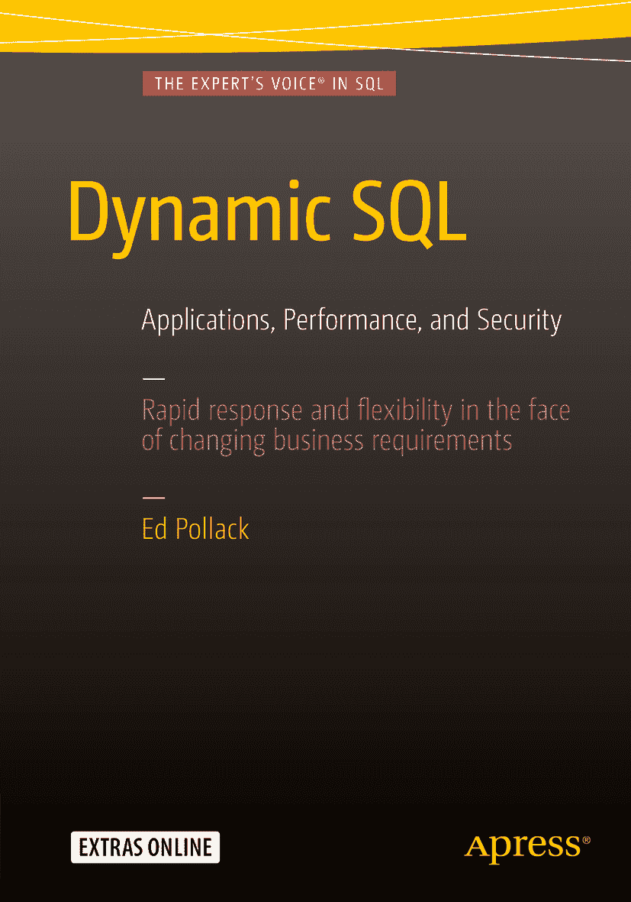

# Edward Pollack 动态 SQL 应用、性能与安全

作者在文中引用的任何源代码或其他补充材料，读者均可访问 [`www.apress.com`](http://www.apress.com) 获取。有关如何查找本书源代码的详细信息，请访问 [`www.apress.com/source-code/`](http://www.apress.com/source-code/)。
ISBN 978-1-4842-1810-5
e-ISBN 978-1-4842-1811-2
DOI 10.1007/978-1-4842-1811-2
美国国会图书馆控制编号：2016939139
© Ed Pollack 2016
动态 SQL
董事总经理：Welmoed Spahr
主编：Jonathan Gennick
开发编辑：Douglas Pundick
技术审阅：Kathi Kellenberger
编辑委员会：Steve Anglin, Pramila Balen, Louise Corrigan, Jim DeWolf, Jonathan Gennick, Robert Hutchinson, Celestin Suresh John, Michelle Lowman, James Markham, Susan McDermott, Matthew Moodie, Jeffrey Pepper, Douglas Pundick, Ben Renow-Clarke, Gwenan Spearing
协调编辑：Jill Balzano
文字编辑：Kezia Endsley
排版：SPi Global
索引：SPi Global
美术设计：SPi Global
封面设计：Anna Ishchenko

有关翻译信息，请发送电子邮件至 `rights@apress.com`，或访问 [`www.apress.com`](http://www.apress.com)。Apress 和 friends of ED 图书可批量购买，用于学术、企业或促销用途。大多数图书也提供电子书版本和许可。更多信息，请参考我们的“批量销售-电子书许可”网页：[`www.apress.com/bulk-sales`](http://www.apress.com/bulk-sales)。

本书可能出现标准 Apress 商标名称、标识和图片。我们并非在每次出现商标名称、标识或图片时都使用商标符号，而是仅以编辑方式使用这些名称、标识和图片，旨在使商标所有者受益，无侵犯商标之意。本出版物中对商品名称、商标、服务标识及类似术语的使用，即使未特别标识，也不应被理解为表达关于其是否受专有权利约束的意见。尽管本书中的建议和信息在出版时被认为是真实和准确的，但作者、编辑或出版商均不对可能存在的任何错误或遗漏承担任何法律责任。出版商对本出版物所含材料不作任何明示或暗示的保证。

使用无酸纸印刷

由 Springer Science+Business Media New York 向全球图书贸易发行，地址：233 Spring Street, 6th Floor, New York, NY 10013。电话：1-800-SPRINGER，传真：(201) 348-4505，电子邮件：orders-ny@springer-sbm.com，或访问 www.springer.com。

Apress Media, LLC 是一家位于加利福尼亚州的有限责任公司，其唯一成员（所有者）是 Springer Science + Business Media Finance Inc (SSBM Finance Inc)。SSBM Finance Inc 是一家特拉华州公司。

献给 Theresa 和 Nolan，我所能期望的最好的 Player 2 和 Player 3（又名家人）！

## 引言

动态 SQL 常常被零散地描述，通常是在出现代码需求且时间有限的时候。本书旨在将这些碎片整合成一次有意义的旅程，从定义该技术到深入探究其最深奥、最复杂的方面。这是对涉及任何数据库时都极其重要的话题的一次深入探讨。本书将有意地比表面看起来必要的程度，更深入地探讨性能优化、应用开发和安全性。

### 本书内容

本书旨在讨论智能的数据库设计与架构，并以动态 SQL 为核心。如果某些穿插讨论的话题感觉不完整，那是因为本书篇幅有限，无法在不偏离主题的情况下对所有话题进行彻底分析。动态 SQL 常常未被充分利用、被误用或被过度使用。书中涉及设计和开发其他领域的诸多旁支内容，旨在作为指南，帮助你保持正轨，并强调编写良好的数据库查询的价值，同时确保你在正确的应用场景中使用动态 SQL。

每一章都深入探讨一个特定主题，并尽可能详细展开，同时提供多个示例，以最简单的方式演示其应用。如果你从未写过一行动态 SQL，这将是一个学习、实践并立即应用的机会。如果你已有编写和使用动态 SQL 的经验，这将是一个学习新应用场景，同时复习过去所用知识的机会。

### 目标读者

任何对数据库管理或开发有浓厚兴趣的人都可以从本书涵盖的主题中受益。每一章都从基本定义和示例开始，为任何经验水平的专业人士提供一个简单的入门点。本书随后过渡到更高级的技术，让你不仅能学习一个重要主题的基础知识，还能获取可测试并用于解决你日常工作中可能遇到的问题的脚本和思路。

如果你对数据库安全性或优化有特别的兴趣，你会欣赏本书每章对这些主题的关注。SQL 注入得到了详尽的阐述，书中呈现了许多不同的方面和示例，以确保对这个重要主题进行透彻的解释！无论主题是什么，每一章都会在可能的情况下提及性能。一个常犯的错误是，数据库设计时只考虑少量数据和少量用户，而忽略了它有一天可能成长为庞然大物的可能性。本书各处都提醒读者，即使性能看起来“足够好”，也要时刻考虑查询性能。

### 联系作者

只有当我们愿意考虑他人的观点并修正自己的观点以求进步时，我们才能获得个人和专业上的成长。

我喜欢收到任何人的来信，无论他们有想法、问题、应用案例、电子游戏推荐还是批评意见。请联系我：`ed7@alum.rpi.edu`，告诉我如何改进本书内容或解决你可能遇到的任何问题或疑问。

### 致谢

SQL Server 社区非常庞大，由用户组、公司、专业人士、学院和组织构成，它们创建了一个由志同道合的个体组成的网络，所有人都在寻求深化知识的同时帮助他人。

我对数据库管理的兴趣源于某种自虐式的好奇心，但学习、成长和分享这些知识的资源是由多到我无法计数的每个人提供的，他们每个人都为改善他人而自愿付出了无数时间。

感谢 Professional Association of SQL Server；Capital Area SQL Server Group 及其创始人 Dan Bowlin 和 Joe Barth；感谢 CommerceHub 和 Autotask 这两家公司，它们给予了我极大的专业自由，让我能在业余时间探索数据库技术；感谢 Matt Slocum 组织并让我参与 Rochester SQL Saturday（这是我第一次发表演讲的活动）；感谢 Apress 给予我写作的机会并在整个过程中给予支持；感谢我的朋友们，无论生活向我们抛出什么，他们总是在我身边；感谢许多志愿者，他们在业余时间组织、演讲、写作、博客并以其他方式改善世界；最后感谢我的家人，在我提出像本书这样疯狂的想法时，给予了极大的耐心。

## 目录

## 第 1 章：什么是动态 SQL？

-   理解动态 SQL (1)
-   一个简单的例子 (1)
-   The `EXEC` 语句 (2)
-   要使用的数据类型 (2)
-   动态执行过程 (2)
-   动态 SQL 实战 (3)
-   动态 SQL 的优势 (5)
-   可选或自定义的搜索条件 (5)
-   一切皆可定制 (5)
-   优化 SQL 性能 (5)
-   快速生成大量 TSQL 或文本！ (5)
-   在其他服务器或数据库上执行 SQL 语句 (6)
-   完成不可能之事！ (6)
-   动态 SQL 注意事项 (6)
-   撇号可能破坏字符串 (6)
-   NULL 可能破坏字符串 (7)
-   难以阅读和调试 (7)
-   权限和作用域不同 (7)
-   动态 SQL 不能在函数中使用 (7)
-   动态 SQL 风格 (8)
-   详尽的文档 (8)
-   调试动态 SQL (10)
-   像编写标准 TSQL 一样编写动态 SQL (12)
-   字符串大小和截断 (13)
-   Management Studio 文本显示 (14)
-   `Sp_executesql` (14)
-   通过拼接构建字符串 (15)
-   关于撇号的注意事项 (19)
-   结论 (19)

## 第 2 章：防范 SQL 注入

-   什么是 SQL 注入？ (21)
-   清理输入 (26)
-   动态 SQL 的参数化 (28)
-   架构名和方括号 (32)
-   有效的空格 (33)
-   正确地为输入指定类型 (33)
-   盲注 SQL 注入 (34)
-   检测和预防 (35)
-   安全测试 (35)
-   应用程序流量扫描 (36)
-   日志审查 (36)
-   代码审查 (36)
-   软件修补 (37)
-   限制 URL 长度 (37)
-   对敏感数据使用视图和/或屏蔽 (37)
-   结论 (38)

## 第 3 章：大规模搜索

-   为何使用动态搜索？ (39)
-   自定义搜索网格 (43)
-   搜索网格注意事项 (51)
-   禁止空搜索 (51)
-   数据分页 (52)
-   条件分页 (53)
-   搜索限制 (56)
-   基于输入的搜索 (56)
-   结果行数 (60)
-   额外的过滤考虑 (64)
-   结论 (65)

## 第 4 章：权限与安全

-   最小权限原则 (67)
-   细粒度权限 vs. 角色权限 (69)
-   动态 SQL 与所有权链 (69)
-   动态切换安全上下文 (73)
-   安全灾难从何而来？ (78)
-   用户、密码和不便 (80)
-   动态 SQL 维护 (82)
-   清理 (90)
-   登录名和用户的使用 (91)
-   审核用户和登录名 (92)
-   内存消耗 (96)
-   结论 (100)

## 第 5 章：管理作用域

-   什么是作用域？ (101)
-   在动态 SQL 中管理作用域 (104)
-   在动态 SQL 中使用 `OUTPUT` (104)
-   表变量和临时表 (108)
-   表变量 (108)
-   临时表 (110)
-   全局临时表 (113)
-   使用永久表进行临时存储 (115)
-   从动态 SQL 直接输出数据到表 (116)
-   结论 (118)
-   清理 (118)

## 第 6 章：性能优化

-   查询执行 (119)
-   解析 (119)
-   绑定 (119)
-   优化 (119)
-   执行 (120)
-   优化工具 (120)
-   对象 (124)
-   扫描计数 (124)
-   逻辑读取 (124)
-   物理读取 (124)
-   动态 SQL vs. 标准 SQL (125)
-   分页性能 (135)
-   筛选索引 (144)
-   基数 (147)
-   查询提示 (156)
-   结论 (161)
-   清理 (162)

## 第 7 章：可扩展的动态列表

-   什么是动态列表 (163)
-   使用 XML 创建动态列表 (165)
-   基于集合的字符串构建 (168)
-   重新审视安全性 (171)
-   结论 (175)

## 第 8 章：参数嗅探

-   什么是参数嗅探？ (177)
-   参数嗅探示例 (179)
-   设计考虑 (190)
-   查询执行详情 (191)
-   误导性因素 (193)
-   参数值 (197)
-   局部变量 (197)
-   强制向优化器提供基数 (203)
-   结论 (206)
-   清理 (207)

## 第 9 章：动态 `PIVOT` 和 `UNPIVOT`

-   `PIVOT` (209)
-   `UNPIVOT` (217)
-   其他示例 (221)
-   多个 `PIVOT` 运算符 (224)
-   多个 `UNPIVOT` 运算符 (227)
-   结论 (232)

## 第 10 章：解决常见问题

-   排序规则冲突 (233)
-   问题 (233)
-   解决方案 (239)
-   组织和归档数据 (241)
-   问题 (241)
-   解决方案 (243)
-   自定义数据库对象 (247)
-   问题 (248)
-   解决方案 (248)
-   结论 (254)

## 第 11 章：其他应用

-   数据库维护 (255)
-   索引碎片整理 (255)
-   数据库备份 (261)
-   保存生成的脚本 (267)
-   将脚本保存到表中 (267)
-   在其他服务器上执行 TSQL (274)
-   结论 (276)

索引 (277)

内容概览

关于作者 (xiii)

关于技术审阅者 (xv)

致谢 (xvi)

前言 (xix)

第 1 章：什么是动态 SQL？ (1)

第 2 章：防范 SQL 注入 (21)

第 3 章：大规模搜索 (39)

第 4 章：权限与安全 (67)

第 5 章：管理作用域 (101)

第 6 章：性能优化 (119)

第 7 章：可扩展的动态列表 (163)

第 8 章：参数嗅探 (177)

第 9 章：动态 PIVOT 和 UNPIVOT (209)

第 10 章：解决常见问题 (233)

第 11 章：其他应用 (255)

索引 (277)

关于作者和关于技术审阅者

关于作者

关于技术审阅者

