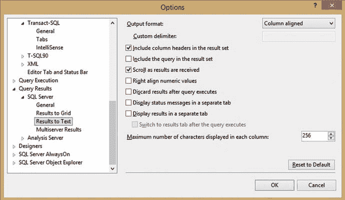

# 1. 什么是动态 SQL？

电子补充材料 本章的在线版本（doi:[10.​1007/​978-1-4842-1811-2_​1](http://dx.doi.org/10.1007/978-1-4842-1811-2_1)）包含补充材料，可供授权用户使用。

T-SQL 是一种脚本语言，随着 SQL Server 的每个新版本发布而不断扩展。在数据库开发和管理领域取得成功，需要灵活性以及不断适应新情况、新技术和新需求的能力。你将面临的许多挑战都是未知的，或者说是那些直到运行时你才确切知道将处理何种数据的场景。动态 SQL 是在面对未知情况时解决问题的最佳工具之一。

### 理解动态 SQL

动态 SQL 理解起来相当简单，一旦你熟悉了它，其能应用的场景数量会变得惊人。动态 SQL 旨在解决这样一类场景：你希望对一个或多个对象进行操作，但在编写代码时并不知道所有相关的细节。可以通过参数将重要的值集合传递到代码中，但如果 T-SQL 的结构本身就是由这些值定义的，该怎么办呢？

#### 一个简单示例

从一个非常简单的 `select` 语句开始，我们将构建理解动态 SQL 的起点：

```
SELECT TOP 10 * FROM Person.Person;
```

此语句返回 `Person.Person` 表中 10 行数据的所有列。如果你想从某个表中选择数据，但直到运行时才知道表名，该怎么办？你如何将可变的表名代入 T-SQL 中？在回答这个问题之前，让我们通过简单地重写上面的查询来介绍动态 SQL，以便你将其作为字符串执行，而不是作为标准的 T-SQL：

```
DECLARE @sql_command NVARCHAR(MAX);
SELECT @sql_command = 'SELECT TOP 10 * FROM Person.Person';
EXEC (@sql_command);
```

这个例子定义了一个名为 `@sql_command` 的字符串，用于保存动态 SQL。什么是动态 SQL？它就是你构建并随后执行的字符串。在这个例子中，它就是上面相同的 `SELECT` 语句，没有改动。设置 `@sql_command` 后，它被执行，提供与之前相同的结果。

#### EXEC 语句

`EXEC` 用于执行 `@sql_command`。也可以使用 `EXECUTE`。本书后面还会介绍执行动态 SQL 的其他方式，以满足对进一步灵活性或安全性的需求。记得始终在 `@sql_command` 字符串两边加上括号。下面是一个省略括号的示例：

```
DECLARE @sql_command NVARCHAR(MAX);
SELECT @sql_command = 'SELECT TOP 10 * FROM Person.Person';
EXEC @sql_command;
```

不这样做会导致一个有点奇怪的错误：

```
Msg 2812, Level 16, State 62, Line 11
Could not find stored procedure 'SELECT TOP 10 * FROM Person.Person'.
```

当没有括号时，SQL Server 会将动态 SQL 命令字符串视为存储过程。省略括号将导致无法运行你的 SQL 字符串，并收到类似上面的错误。

#### 应使用的数据类型

请注意，命令字符串使用了 `NVARCHAR(MAX)` 作为数据类型。虽然你可以使用 `VARCHAR`，但如果处理的任何对象中包含扩展 Unicode 字符，你可能会丢失数据。大小也可以缩短，但如果你的命令字符串变得比该大小更大，它将被截断，你的动态 SQL 将成为令人困惑的错误消息或逻辑错误的源头。

为了保持一致性和可靠性，请使用 `NVARCHAR(MAX)` 作为动态 SQL 命令字符串的数据类型。

### 动态执行过程

为了理解动态 SQL 的工作原理及其可应用于你将遇到的多种问题的各种方式，重要的是思考动态 SQL 是如何构建的。此外，熟悉 SQL Server 为解析和运行 T-SQL 字符串所使用的执行过程，将使使用动态 SQL 变得容易得多。

所有动态 SQL 都遵循三个基本步骤：

创建一个用于存储动态 SQL 的字符串变量。可以使用任何变量名。构建命令字符串并将其存储在此变量中。执行命令字符串。

将 T-SQL 命令存储为字符串的好处是，你可以自由地对它使用任何字符串操作命令，通过一个或多个步骤来构建它。现在来解决你最初的问题：如何从一个直到运行时才定义的表中选择数据。为此，你将 `Person.Person` 从字符串中移除，并用一个你上面定义的变量来替换：

```
DECLARE @sql_command NVARCHAR(MAX);
DECLARE @table_name NVARCHAR(100);
SELECT @table_name = 'Person.Person';
SELECT @sql_command = 'SELECT TOP 10 * FROM ' + @table_name;
EXEC (@sql_command);
```

变量 `@table_name` 存储了你希望查询的表名。通常，这会作为一个参数传入，无论是来自其他存储过程还是直接调用它的应用程序。通过将其构建到 `@sql_command` 中，你获得了查询任何所需表的灵活性，而无需事先硬编码。虽然这是一个简单的例子（你多久会想以这种方式选择数据？），但它为成千上万的应用提供了基础，每一个都可以节省大量的时间、资源和复杂性。在深入探讨动态 SQL 及其众多用途的细节之前，让我们先看一个动态 SQL 实际应用中更实用（也更复杂）的例子。

### 动态 SQL 实战

一个常见的维护需求是在服务器上的多个数据库上运行 T-SQL。这类维护可能包括备份数据库、重建索引、报告关键数据元素或许多其他可能性。如果数据库列表永不改变，也没有数据库被重命名，你可以将名称硬编码到每个存储过程中，而不必担心将来更改它们。这种方法在遇到那些不可避免的变化（移动或重命名数据库）之前一直有效——而这最终会导致所有那些宝贵的维护过程失效。至关重要的是，你的维护、监控和报告作业要以尽可能高的可靠性运行。

清单 1-1 展示了一个常见的示例，该语句可用于针对单个数据库运行备份，并将其存储在本地驱动器上。

```
BACKUP DATABASE AdventureWorks2014
TO DISK='E:\SQLBackups\AdventureWorks2014.bak'
WITH COMPRESSION;
清单 1-1.
简单的 BACKUP 语句
```

这段 T-SQL 将使用压缩功能将 `AdventureWorks2014` 数据库备份到 E 盘的 `SQLBackups` 文件夹中。例如，如果你想对一组名称以 `AdventureWorks` 文本开头的数据库执行自定义备份，那么你需要构建能够适应性收集所有符合该名称的数据库列表，然后分别对它们进行备份的 T-SQL。以下的 T-SQL 展示了使用动态 SQL 实现这一目标的一种方法。

```
DECLARE @database_list TABLE
(database_name SYSNAME);
INSERT INTO @database_list
(database_name)
SELECT
name
FROM sys.databases
WHERE name LIKE 'AdventureWorks%';
DECLARE @sql_command NVARCHAR(MAX);
DECLARE @database_name SYSNAME;
DECLARE database_cursor CURSOR LOCAL FAST_FORWARD FOR
SELECT database_name FROM @database_list
OPEN database_cursor
FETCH NEXT FROM database_cursor INTO @database_name;
WHILE @@FETCH_STATUS = 0
BEGIN
SELECT @sql_command = '
BACKUP DATABASE ' + @database_name + '
TO DISK=''E:\SQLBackups\' + @database_name + '.bak''
WITH COMPRESSION;'
EXEC (@sql_command);
FETCH NEXT FROM database_cursor INTO @database_name;
END
CLOSE database_cursor;
DEALLOCATE database_cursor;
清单 1-2.
为备份所有以“AdventureWorks”开头的数据库而构建的动态 SQL
```

这段 T-SQL 当然比你看到的第一个 `BACKUP` 语句要复杂得多。让我们将其分解，以理解这里发生了什么以及它为何有效。然后，你将重点关注构成这组语句支柱的动态 SQL 部分。

1.  用一个数据库名称列表填充一个表变量。
2.  按每个数据库循环一次。
3.  构建一个动态 SQL 命令字符串，该字符串会考虑当前的数据库名称。
4.  执行动态的 `BACKUP` 语句。
5.  继续迭代循环，直到所有相关数据库都已备份。

你在这里声明了几个变量：

*   `@database_list`：包含所有符合搜索条件的数据库。在本例中，任何以 `AdventureWorks` 一词开头的数据库都将被包括在内。
*   `@sql_command`：这是将包含动态 SQL 语句的命令字符串。
*   `@database_name`：保存当前正在备份的数据库的名称。
*   `database_cursor`：一个游标，将用于遍历 `@database_list` 中列出的所有数据库。

此示例的大部分内容是为循环设置的。关键部分是你用 `@database_name` 替换数据库名称和备份文件名的地方。这使你能够生成一个备份语句，该语句不仅会备份每个数据库（无论有多少个），而且还会使用该名称来命名备份文件。如果需要，你同样可以轻松地在文件名上附加其他信息，例如日期、时间或服务器名称。

### 动态 SQL 的优势

你希望将动态 SQL 纳入日常 SQL Server 工具库的原因有很多。此外，还有许多特定的挑战，动态 SQL 是其最佳解决方案。讨论这些场景将突显为何可以围绕这个主题撰写一整本书。

#### 可选或自定义的搜索条件

搜索框是网页或应用程序开发中最常用的工具之一。对于简单的搜索，你可能只需要传入一个变量进行评估。在更强大的网页搜索中，你可能需要从多个条件中进行选择，每个条件都可以用 `AND` 或 `OR` 条件进行评估。虽然你可以编写一个非常长的 `SELECT` 语句，并与所有可能涉及的表进行左连接，但最终很可能会得到一个庞大、低效且难以处理的 T-SQL 集合。相反，动态 SQL 允许你构建一个 `SELECT` 字符串，该字符串只查询满足给定搜索所需的表。

#### 一切皆可定制

添加连接或 `WHERE` 子句仅仅是个开始。借助动态 SQL，任何语句都可以被定制，从而为你的代码提供更大的灵活性。想根据动态搜索对列进行分组？解决方案是将 `GROUP BY` 子句编写为动态 SQL，对其进行修改以适应每个特定情况的需求。想为数据集生成行号，但直到运行时才知道按哪些列进行分区或排序？没问题！

前面的示例说明了如何使用动态 SQL 来自定义备份操作并自定义备份文件名。任何可想到的 T-SQL 语句都可以被修改以利用动态 SQL，这样做可以在应对日常众多挑战时提供更大的灵活性。

#### 优化 SQL 性能

到目前为止，动态 SQL 似乎使事情变得更加复杂，增加了对临时变量、循环和命令字符串的需求。尽管表面上增加了复杂性，但这种框架可以让你减少通常执行的 SQL 语句的大小并提高性能。

动态 SQL 提供了一个定制语句以满足性能需求的机会。移除多余的对象、调整连接和子查询以及减少 SQL 语句的大小，都可以带来更快的执行时间并减少资源消耗。

#### 快速生成大量 T-SQL 或文本！

有时你需要执行大型 SQL 语句，这些语句作用于一组众多对象。其他时候，你可能希望基于存储在特定表集中的数据生成输出文本。也许你想生成将用于从任意数量的源收集报告数据的 `SELECT` 语句。

手动编写所有这些 T-SQL 可能会花费很长时间，并且在你完成一项耗时、枯燥的任务时，会大大增加人为错误发生的机会。如果涉及的 SQL 语句需要定期运行，那么提前准备它们可能是不可能的，特别是当目标表或其他涉及的对象可能经常变化时。

使用动态 SQL，你可以生成任意数量的命令或文本，且没有限制。SQL Server 不会厌倦这个过程，无论它看起来多么乏味。这是一个自动化繁琐任务并减少在最终成为机械性工作上的操作员干预的机会。结果是你的工作变得更轻松、更有趣，你可以专注于需要你关注的更重要的任务！


### 在其他服务器或数据库上执行 SQL 语句

当您需要针对其他实体运行查询，但事先并不知道所有这些实体是什么时，通常会遇到一个常见的挑战。如果这些对象在运行时可能变化或改变，那么**动态 SQL** 是管理这些操作的绝佳解决方案，无需硬编码那些可能随时间变化的对象名称。这降低了应用程序在软件发布、配置更改或硬件升级后出现故障的可能性。

同样，在这些场景中，您可能有一个应用程序，其代码在多个位置运行，但对服务器、数据库或其他对象的引用会根据环境而异。在每个环境中编写略有不同的代码是低效的，并且随着时间的推移会导致显著增加的维护需求。维护配置数据并编写处理这些配置的代码要简单得多，根据需要读写数据库。动态 SQL 允许轻松处理和操作这些配置数据，无论所涉及的操作有多复杂。

### 完成不可能之事！

简而言之，SQL Server 中有许多任务如果没有动态 SQL，将会极其困难，甚至看似不可能。许多需要遍历数据库对象的常见维护场景，使用动态 SQL 后就变得轻而易举。

您是否曾尝试在动态列列表上使用 `PIVOT` 或 `UNPIVOT`？这个命令功能强大，但它需要一个明确的列列表。如果该列表在运行时才能确定，那么获取数据的唯一方法就是使用动态 SQL，将您定制的列列表插入语句中，然后执行它。

后续将会展示许多示例，演示动态 SQL 如何让非常困难的任务变得简单有趣，这些示例既实用又好玩。敬请期待并享受学习过程吧！

### 动态 SQL 注意事项

与任何工具一样，不应盲目地到处使用动态 SQL，它也不是您遇到的每个数据库问题的解决方案。在讨论任何工具时，在实施之前必须考虑其挑战、陷阱和复杂性。

#### 撇号会破坏字符串

在构建动态 SQL 命令时，您会将其他变量和字符串合并到其中。如果其中任何内容包含撇号，您的命令字符串就会被破坏。结果命令在运气好的情况下会抛出错误并不执行。SQL 注入是指利用动态 SQL 中的变量，故意用撇号关闭字符串，然后尝试执行恶意代码的过程。如果您在构建命令语句之前没有清除所有参数和输入，您可能会将巨大的安全漏洞引入您的代码。

因此，每当使用动态 SQL 时，务必确保输入是干净的，并且参数中的意外符号不会对代码操作产生负面影响。未能做到这一点可能会导致应用程序代码中断、意外行为或灾难性的安全漏洞。

#### NULL 会破坏字符串

`NULL` 是一个复杂的状态。作为值的缺失，任何尝试将字符串与 `NULL` 连接的操作都将导致 `NULL`。如果您构建的动态 SQL 命令字符串被传递了一个为 `NULL` 的参数，整个语句将变成 `NULL`。结果很可能是 T-SQL 语句完全不做任何事情。这可能导致排查故障的噩梦，因为不清楚为什么一个 SQL 语句似乎什么都没做。此外，如果所讨论的语句有许多输入，寻找那个 `NULL` 参数可能是一项艰巨的任务。

#### 难以阅读和调试

当您在文本编辑器中编写标准 SQL 时，T-SQL 会失去 SQL Server Management Studio 中存在的颜色编码优势。在撇号内，大部分文本会显示为红色，包括关键字、字符串和变量名。此外，在动态 SQL 字符串内部，您在键入时执行的错误检查效果会降低。一个通常会被红色下划线标记的简单拼写错误，在字符串内部可能就不那么明显了。

为了应对这些挑战，您必须设计编写良好的 T-SQL。除了编写非常有组织的代码外，在记录您的工作时需要更加勤勉。通常容易理解的 T-SQL，当作为字符串的一部分编写时，可能更难以掌握。必须投入额外的时间和细心，以确保当您将来重新审视这段代码时，它仍然易于阅读且有意义。

动态 SQL 总是能正确编译。对 SQL Server 而言，它只是一个字符串。其内容在运行时之前不会被检查语法或对象有效性。有效的测试和调试是确保您编写的 T-SQL 按预期执行的关键。

#### 权限和作用域不同

动态 SQL 语句在它们自己的作用域中执行。在字符串内定义的变量通常在外部不可用。此外，动态 SQL 是以执行整体 T-SQL 代码（存储过程、作业等）的用户权限来执行的。它不是以存储过程所有者的权限或最近碰巧测试它的用户权限来执行。

为了避免意外错误、权限冲突或其他安全问题，考虑哪些用户将运行包含动态 SQL 的任何代码非常重要。如果您需要从动态 SQL 语句中保存数据，或从外部传入参数，则需要显式管理以达到预期效果。

#### 动态 SQL 不能在函数中使用

简而言之，您可以在存储过程、即席 T-SQL 和作业中使用动态 SQL，但在函数中不允许。任何在函数中包含动态 SQL 的尝试都将导致错误：

```
Msg 443, Level 16, State 14, Procedure fn_test, Line 72
Invalid use of a side-effecting operator 'EXECUTE STRING' within a function.
```

SQL Server 函数必须是确定性的。输入和输出必须符合函数定义的形式。动态 SQL 本质上是非确定性的，因此不能在函数中使用。

### 动态 SQL 风格

编写能工作的代码非常重要。编写易于理解和维护的代码同样重要。作为负责创建和维护大量数据库对象的人，您必须始终考虑在未来的任何时间点，阅读、理解、排查故障和升级这些对象的难易程度。由于动态 SQL 往往更难阅读，因此应格外小心，确保您的 T-SQL 编写良好、文档有效，并且对象/变量按照合理的约定命名。这些设计考虑将为您节省大量时间，并向您的同事表明您关心他们的福祉以及组织的未来。

良好动态 SQL 设计的原则始于此，并将在本书的其余部分继续构建。无论是否使用动态 SQL，请考虑您为编写可维护代码所做的任何努力。


#### 彻底编写文档

这是对任何曾编写过一行代码、脚本或非技术流程的人反复强调的信条。你的文档解释了你的代码如何工作以及为何如此编写，并且在不可避免地进行修改时充当指南。通常可能不需要文档的 TSQL，在应用了动态 SQL 后，会变得难以阅读。考虑创建额外的文档来补充这种增加的复杂性。

文档化你工作的第一个也是最简单的方法是在文件顶部包含一个头部注释。这个头部提供了关于谁创建了此代码的基本信息、一些修订笔记、其目的以及其工作原理的快速概述。理解存储过程被创建的原因可能和了解其工作原理一样有用。更重要的是，通过通读代码并稍加思索，可能能够辨别出代码的功能。但是，若没有一些他人可能不具备的现有应用知识，或者没有向其他开发人员求助，就无法弄清激发该代码创建的原始需求。

考虑一个简单备份脚本的头部注释，如清单 1-3 所示。

```
/*     2015 年 9 月 8 日 Edward Pollack
AdventureWorks 数据库的备份例程
由于 2015 年 8 月 20 日记录的工单 T1234，需要通过 SQL Server 代理作业选择性地备份一组有限的 AdventureWorks 数据库。
该作业的日程可以根据当前业务需求进行调整。
使用了动态 SQL 来遍历每个数据库，执行备份，并使用数据库名称、日期、时间和源服务器命名结果文件。    */
清单 1-3.
头部注释，记录一个假设的备份脚本
```

这个头部告诉读者以下信息：

-   编写此代码的日期，以提供其产生时间的背景。
-   作者，这使未来的开发人员知道有问题时该找谁。
-   编写此代码的背景以及正在解决的问题。
-   其工作方式以及所使用的任何特殊功能的简要描述。

这个简短的文档块回答了开发人员可能对你的代码提出的大多数常见问题。你在编写 TSQL 时可能认为显而易见的事情，对于多年后阅读此代码的其他人来说，可能并非如此。

当编写涉及动态 SQL 的代码时，你必须考虑彻底文档化，但也不要过度解释每一行 TSQL。让我们以之前的备份例程为例，并为其添加一些有意义的文档。

```
-- 这将临时存储我们将在下面备份的数据库列表。
DECLARE @database_list TABLE
(database_name SYSNAME);
INSERT INTO @database_list
(database_name)
SELECT
name
FROM sys.databases
WHERE name LIKE 'AdventureWorks%';
-- 可以调整此 WHERE 子句以备份除以 "AdventureWorks" 开头的数据库之外的其他数据库
DECLARE @sql_command NVARCHAR(MAX);
DECLARE @database_name SYSNAME;
DECLARE @date_string VARCHAR(17) = CONVERT(VARCHAR, CURRENT_TIMESTAMP, 112) + '_' + REPLACE(RIGHT(CONVERT(NVARCHAR, CURRENT_TIMESTAMP, 120), 8), ':', '');
-- 使用游标逐一遍历数据库。
DECLARE database_cursor CURSOR FOR
SELECT database_name FROM @database_list
OPEN database_cursor
FETCH NEXT FROM database_cursor INTO @database_name;
WHILE @@FETCH_STATUS = 0 -- 继续循环，直到游标到达数据库列表的末尾。
BEGIN
-- 自定义备份文件名，使用数据库名称以及日期和时间
SELECT @sql_command = '
BACKUP DATABASE ' + @database_name + '
TO DISK=''E:\SQLBackups\' + @database_name + '_' + @date_string + '.bak'' WITH COMPRESSION;'
EXEC (@sql_command);
FETCH NEXT FROM database_cursor INTO @database_name;
END
-- 清理我们的游标对象。
CLOSE database_cursor;
DEALLOCATE database_cursor;
清单 1-4.
添加了文档的备份脚本示例
```

此示例展示了之前的备份脚本，并在文件名上添加了时间戳。添加了文档来解释每个部分。请注意，注释简短、明了，并且只解释我认为可能受益的部分。你不必浪费时间在那些显而易见的注释上，那只会占用额外空间并分散当前任务的注意力。例如，我绝不会包含像这样的注释，除非是寻找一些不合时宜的喜剧效果：

```
-- 这个变量保存数据库名称。
DECLARE @database_name SYSNAME;
```

虽然有趣，但我的补充没有提供任何新信息。无论它惹人烦还是逗人乐，它都没有提供变量名本身未显而易见的任何有用信息。

文档化常常像选择披萨配料。每个人都有自己的风格，试图确定一种适用于所有对象在所有环境中都合适的单一风格是愚蠢的。如果你正在编写更复杂的代码，尤其是涉及动态 SQL 时，考虑尽可能彻底。你现在多花的一点时间，将在未来为别人节省大量时间！

#### 调试动态 SQL

动态 SQL 比你编写的普通查询更需要调试。由于 SQL Server 总会成功编译动态 SQL 语句，因此在执行前对代码进行进一步测试就显得尤为重要。那些通常显而易见的简单错误，可能会因为 SQL Server Management Studio 中缺乏反馈而被轻易忽略。此外，你的代码会部分隐藏在被引号包围的字符串中。代码越难阅读，调试和定位错误（无论是语法错误还是逻辑错误）的难度就越大。

测试和调试动态 SQL 最简单有效的方法是将 `EXEC` 替换为 `PRINT`。当 T-SQL 被执行时，命令字符串将会被打印出来，而不是立即执行。然后，可以将打印出的内容复制到另一个编辑器窗口中，检查其语法、逻辑、拼写以及任何其他你关注的事项。许多常见的动态 SQL 拼写错误是由于引号错放造成的，当代码被移到新窗口中时，这些问题会迅速显现。例如，考虑以下简短的命令字符串：

```sql
DECLARE @CMD NVARCHAR(MAX);
SELECT @CMD = 'SELLECT TOP 17 * FROM Person.Person';
EXEC (@CMD);
```

这条语句会编译成功，但会抛出以下错误：

```sql
Msg 156, Level 15, State 1, Line 79
Incorrect syntax near the keyword 'TOP'.
```

产生的错误信息很隐晦，几乎没有告诉你错在哪里。将命令字符串打印出来并粘贴到编辑器窗口中，问题就变得一目了然：

```sql
SELLECT TOP 17 * FROM Person.Person
```

`SELECT` 明显拼写错误，除了在 SQL Server Management Studio 中会被标上红色下划线外，它也不会像通常那样被高亮显示为蓝色保留关键字。

对于较大的 T-SQL 代码块，在代码中添加一个调试位（debug bit）非常有价值。当 `@debug` 为 `1` 时，所有语句将打印而非执行。当 `@debug` 为 `0` 时，语句才会执行。这让你可以通过一个简单的位来轻松控制所有代码块，该位可以在代码顶部轻松配置。相比在需要调试时不断编写 `PRINT` 语句并注释掉执行语句，切换这一个位要容易得多。清单 1-5 展示了之前备份脚本示例添加了 `debug` 参数后的样子。

```sql
DECLARE @debug BIT = 1;
DECLARE @database_list TABLE
(database_name SYSNAME);
INSERT INTO @database_list
(database_name)
SELECT
name
FROM sys.databases
WHERE name LIKE 'AdventureWorks%';
-- 此 WHERE 子句可以调整，以备份除 "AdventureWorks" 开头之外的其他数据库。
DECLARE @sql_command NVARCHAR(MAX);
DECLARE @database_name SYSNAME;
DECLARE @date_string VARCHAR(17) = CONVERT(VARCHAR, CURRENT_TIMESTAMP, 112) + '_' + REPLACE(RIGHT(CONVERT(NVARCHAR, CURRENT_TIMESTAMP, 120), 8), ':', '');
-- 使用游标逐个遍历数据库。
DECLARE database_cursor CURSOR FOR
SELECT database_name FROM @database_list
OPEN database_cursor
FETCH NEXT FROM database_cursor INTO @database_name;
WHILE @@FETCH_STATUS = 0 -- 继续循环，直到游标到达数据库列表的末尾。
BEGIN
-- 自定义备份文件名，使用数据库名称以及日期和时间
SELECT @sql_command = '
BACKUP DATABASE ' + @database_name + '
TO DISK=''E:\SQLBackups\' + @database_name + '_' + @date_string + '.bak''
WITH COMPRESSION;'
IF @debug = 1
PRINT @sql_command
ELSE
EXEC (@sql_command);
FETCH NEXT FROM database_cursor INTO @database_name;
END
-- 清理游标对象。
CLOSE database_cursor;
DEALLOCATE database_cursor;
```

**清单 1-5.** 添加了调试参数的备份脚本示例

通过添加四行 T-SQL 代码，你便能通过一个位来控制执行。将打印输出复制到新窗口并检查，你可以快速确认它是否编译成功并看起来正确。

此外，如果问题的根源不明确，你可以在代码中添加 `PRINT` 语句来输出一些变量值。例如，如果不确定 `@date_string` 是否被正确填充，你可以单独打印它并验证其值是否符合预期：

```sql
PRINT '@date_string (line 20): ' + @date_string
```

这是一个非常简单的调试操作，但通过包含变量名和行号，你使代码更易于理解。如果结果仍然令人困惑，你可以进一步拆分结果，分别打印变量的日期和时间部分。通过将问题分解成更小、更简单的部分，调试任务变得容易得多，整个过程中的挫败感也会大大减少。

在编写新的动态 SQL 时，请务必经常打印命令字符串，验证生成的 T-SQL 在语法和逻辑上都是有效的。

最后，对于任何需要从其他应用程序（或最终用户）接收输入的代码，请记住测试所有可能性。确保应用程序或 T-SQL 根据需要检查和验证输入。如果输入包含特殊字符会怎样？如果包含撇号、下划线或转义字符呢？如果允许手动输入文本，请假设他们会犯错、输入垃圾数据、空格、特殊字符，或者以某种方式做出意外行为。考虑到这些情况，你将能预防无数潜在的错误，并极大提升应用程序的安全性。

#### 像编写标准 T-SQL 一样编写动态 SQL

动态 SQL 被包裹在字符串中，并不意味着它的写法应该与你通常的语句有所不同。无论你通常的大小写、缩进和空格标准是什么，这里都应同样适用。动态 SQL 语句常常被写成一长串代码，没有空格、换行、大小写或断行。结果往往是难以理解，并且更容易出错。如果你将 `PRINT` 语句中的调试文本复制到一个新窗口，其结果应该看起来完全就像你通常编写的 T-SQL。

```sql
DECLARE @CMD NVARCHAR(MAX) = ''; -- 这将保存最终要执行的 SQL
DECLARE @first_name NVARCHAR(50) = 'Edward'; -- 在搜索框中输入的名字
SET @CMD = 'SELECT PERSON.FirstName,PERSON.LastName,PHONE.PhoneNumber,PTYPE.Name FROM Person.Person PERSON INNER JOIN Person.PersonPhone PHONE ON PERSON.BusinessEntityID = PHONE.BusinessEntityID INNER JOIN Person.PhoneNumberType PTYPE ON PHONE.PhoneNumberTypeID = PTYPE.PhoneNumberTypeID WHERE PERSON.FirstName = ''' + @first_name + '''';
PRINT @CMD;
EXEC (@CMD);
```

**清单 1-6.** 如何用格式糟糕的动态 SQL 惹恼未来开发者的示例

### 字符串大小与截断

当你尝试将字符串存储到一个不足以容纳它的变量中时，字符串会被自动截断。结果将是不完整的数据，这很可能在你后续的代码中引发麻烦。考虑以下 T-SQL 代码，它生成一个时间戳并将其存储在一个字符串中。

```sql
DECLARE @date_string VARCHAR(10) = CONVERT(VARCHAR, CURRENT_TIMESTAMP, 112) + '_' + REPLACE(RIGHT(CONVERT(NVARCHAR, CURRENT_TIMESTAMP, 120), 8), ':', '');
PRINT @date_string;
```

代码清单 1-7. 生成时间戳字符串时发生截断的示例

你期望得到一个包含日期 (MMDDYYYY) 和时间 (HHMMSS) 的时间戳。然而，你实际得到的是一个被截断到 10 个字符的字符串：`20150908_1`。请始终声明足够大的变量，以容纳可能存储在其中的任何有效数据。如果你不确定潜在的数据大小，宁可谨慎一些，提供额外的字符空间，这并非坏主意。要得到本例中预期的完整文本输出，需要 17 个字符。如果你正在考虑未来软件版本中才向时间戳添加毫秒呢？现在就将 `@date_string` 声明得更大一些，这样未来就无需为了适应这一改动而进行更多修改。其成本微乎其微，却能减少未来出错的可能性。

字符串截断的一个更复杂的例子可能发生在动态 SQL 变得非常、非常大的时候。如果你编写了一个超过 8192 个字符的命令字符串，并且正在将其与其他字符串（名称、日期、输入参数、其他动态 SQL 字符串等）拼接，那么就存在一种隐含的、未记录的截断风险。SQL Server 会隐式转换不同数据类型和大小的字符串，以尝试快速高效地处理它们。结果将是一个 `NVARCHAR(MAX)` 类型的命令字符串，在执行时似乎被截断到了 8192 个字符。可以通过以下两种方式之一来解决此截断问题：

1.  将动态 SQL 语句拆分为多个语句，每个语句少于 8192 个字符。
2.  将命令字符串中涉及的所有参数和变量更改为 `NVARCHAR(MAX)`。

第一种选项很难保证。你如何将一个极长的命令拆分成保证始终为 8192 个字符或更少的片段？当面临这个难题时，第二种选项总是有效，并且是一个简单、成本低的修复方法。

在处理非常大的动态 SQL 时，考虑对构建命令字符串涉及的所有标量参数使用 `NVARCHAR(MAX)`，以避免无意中的字符串截断。

### Management Studio 文本显示

一个不相关但有些类似的问题可能在你直接将输出打印到文本窗口时发生。你会经常这样做，无论是调试新的 T-SQL 还是手动执行你生成的动态 SQL。默认情况下，SQL Server Management Studio 输出窗口中的文本限制设置为 256 个字符。任何从任何 SQL 语句打印出的文本都会被截断到 256 个字符，这常常会带来不便。

此限制仅影响你打印到结果窗口的输出，与你执行命令字符串时的字符串大小无关。文本限制对实际的查询执行没有影响。为了调试，修改 SQL 编辑器选项以将此限制增加到 8192 个字符是有利的。

此设置可以通过导航到 `工具` ➤ `选项` ➤ `查询结果` ➤ `SQL Server` ➤ `结果到文本` 并修改每列显示的最大字符数来找到。参见图 1-1 的示例。


图 1-1. SQL Server Management Studio 中的“结果到文本”设置

将 256 改为 8192，将来打印和调试更大的动态 SQL 语句就会更容易。

### sp_executesql

到目前为止，所有的动态 SQL 语句都是使用 `EXEC` 关键字执行的。这种执行方式简单、直接，便于快速测试和调试。不幸的是，`EXEC` 存在一些限制和安全问题，这促使我们寻求更好的解决方案：

-   `EXEC` 容易受到 SQL 注入和意外输入的影响。转义字符和撇号很容易破坏动态 SQL 语句。
-   使用 `EXEC` 没有内置的方法来管理输入或输出变量。
-   使用 `EXEC` 时，执行计划不太可能被重用。这种执行计划的重用，称为“参数探测”，是一个有用的功能，通常也是你希望发生的。

本书后面将详细讨论这些主题中的每一个，并且可以使用系统存储过程 `sp_executesql` 而不是 `EXEC` 来解决。

`sp_executesql` 的语法很简单：

```sql
sp_executesql N'SELECT COUNT(*) FROM Person.Person';
```

字符串中提供的任何 T-SQL 都将像前面的例子一样执行。更常见（也更有用）的语法是将命令字符串存储在变量中，并在 `sp_executesql` 前使用 `EXEC`：

```sql
DECLARE @sql_command NVARCHAR(MAX) = 'SELECT COUNT(*) FROM Person.Person';
EXEC sp_executesql @sql_command;
```

从现在开始，所有示例都将使用 `sp_executesql` 而不是 `EXEC`。这被认为是 SQL Server 中的最佳实践，并将提高动态 SQL 的可靠性、安全性和性能。

在数据库领域，我们很少使用“总是”或“永不”这样的词。通常，问题的答案是“视情况而定”，接着会是相当多的讨论。但这是罕见的“总是”是最佳答案的场景之一。编写动态 SQL 时，**总是**使用 `sp_executesql`，**永不**使用 `EXEC`。其好处远远超过你使用这个新存储过程可能面临的任何不便。

#### 通过拼接构建字符串

在 T-SQL 中，有两种直接的方法来组合字符串。第一种是使用 `+` 运算符，这也是本书至今所用的方法。它简单、易于快速实现且直观。

还记得关于 `NULL` 如何破坏字符串的简要介绍吗？当将多个字符串拼接在一起时，如果其中任何一个碰巧是 `NULL`，那么整个字符串输出也将变为 `NULL`。`NULL + 1` 被 SQL Server 处理的方式，类似于数学中处理无穷大 + 1 的方式。你可以通过使用 `ISNULL` 或 `COALESCE`，或者通过显式检查变量是否为 `NULL` 并在需要时替换它来应对这种情况。考虑以下动态 SQL 查询。

```sql
DECLARE @schema VARCHAR(25) = NULL;
DECLARE @table VARCHAR(25) = 'Person';
DECLARE @sql_command VARCHAR(MAX);

SELECT @sql_command = 'SELECT COUNT(*) ' + 'FROM ' + @schema + '.' + @table;
PRINT @sql_command;

SELECT @sql_command = 'SELECT COUNT(*) ' + 'FROM ' + ISNULL(@schema, 'Person') + '.' + @table;
PRINT @sql_command;

SELECT @sql_command = 'SELECT COUNT(*) ' + 'FROM ' + CASE WHEN @schema IS NULL THEN 'Person' ELSE @schema END + '.' + @table;
PRINT @sql_command;
```

**代码清单 1-8. 当参数为 `NULL` 时的字符串拼接结果示例**

第一个查询返回 `NULL`。因为 `@schema` 是 `NULL`，任何与它拼接的内容也将变为 `NULL`。这通常是不期望的行为，你会立即被一个不起作用或执行时产生错误的命令字符串所困惑。

第二个查询使用 `ISNULL` 来确保，如果 `@schema` 是 `NULL`，则会返回某个值来替代它。这里，`Person` 架构是硬编码的，产生了与之前相同的结果。但这需要假设。如果你没有默认值，抛出错误可能比编造一个可能不准确的值更合适。或者，你可以简单地不允许 `@schema` 为 `NULL`，如果是 `NULL` 则立即退出。

第三个查询使用 `CASE` 语句将 `NULL` 替换为 `Person` 架构。这与上一个查询的结果相同，尽管 `CASE` 提供了一些你可以利用的额外灵活性。如有必要，你可以更改查询结构以处理缺失的变量，或拥有多条代码路径。

在数据类型和值不可预测的情况下，有第二种拼接字符串的方法可能很有益。内置函数 `CONCAT` 允许你使用以下语法组合字符串：

```sql
SELECT CONCAT ('SELECT COUNT(*) ', 'FROM ', 'Person.', 'Person');
```

变量也可以作为参数传递给此函数：

```sql
DECLARE @schema NVARCHAR(25) = 'Person';
DECLARE @table NVARCHAR(25) = 'Person';
DECLARE @sql_command NVARCHAR(MAX);

SELECT @sql_command = CONCAT ('SELECT COUNT(*) ', 'FROM ', @schema, '.', @table);
PRINT @sql_command;
```

这两条 SQL 语句的结果将是相同的：

```
SELECT COUNT(*) FROM Person.Person
```

`CONCAT` 提供了几个特点：

`NULL` 参数总是被转换为空字符串。
结果的数据类型会根据输入智能确定。`NVARCHAR` 参数将产生 `NVARCHAR` 结果，`VARCHAR` 将产生 `VARCHAR`，`MAX` 输入将产生 `MAX` 大小的输出。
如果所有输入都是 `NULL`，则输出将是一个类型为 `VARCHAR(1)` 的空字符串。
它将在拼接过程中尝试转换不同的数据类型。这对于字符串可能是可取的，但在拼接文本和数字时可能有问题。添加 `CAST` 或 `CONVERT` 来管理这一点将消除对结果准确性的任何疑虑。

但是，删除 `NULL` 可能并非你想要的行为！通常，如果一个参数无意中为 `NULL`，你可能更希望代码抛出错误，而不是使用虚拟值继续处理。只有当删除 `NULL` 对你的应用程序有利时，才利用此功能。

### 有用的字符串函数

`CONCAT` 是使用 `+` 运算符的一个可行替代方案。在生成动态 SQL 时，还有许多其他 SQL Server 字符串处理函数非常有用。在本书的剩余部分，我们将继续使用 `+`，但值得花点时间快速回顾一些可能很方便的实用字符串函数：

*   `LTRIM`, `RTRIM`: 删除表达式左侧 (`LTRIM`) 或右侧 (`RTRIM`) 的任何空白。这在处理不可预测的输入或经常附带多余空格的输入时非常有用：

    ```sql
    DECLARE @string NVARCHAR(MAX) = '  This is a string with extra whitespaces   ';
    SELECT @string;
    SELECT LTRIM(@string);
    SELECT RTRIM(@string);
    ```

    以上 T-SQL 返回：

    ```
    "   This is a string with extra whitespaces   "
    "This is a string with extra whitespaces   "
    "   This is a string with extra whitespaces"
    ```

*   `CHARINDEX`: 这将返回搜索表达式在字符串中首次出现的位置。例如，如果你想返回字符串中 `dinosaur` 首次出现的位置，这就可以做到：

    ```sql
    DECLARE @string NVARCHAR(MAX) = 'The stegosaurus is my favorite dinosaur';
    SELECT CHARINDEX('dinosaur', @string);
    ```

    此查询的结果将是 32，即单词 `dinosaur` 的起始字符位置。一个可选的第三参数可以指定从字符串中的哪个位置开始查找搜索字符串。如果未找到搜索字符串，`CHARINDEX` 返回 `0`。

*   `STUFF`: 允许你将一个字符串插入到另一个字符串的中间，并可选择删除插入点处的字符。这有许多用途，并且可以成为以所需组合拼接 SQL 语句、文本输出或输入参数的便捷方法。以下是使用 `STUFF` 的一些示例：

    ```sql
    DECLARE @string NVARCHAR(MAX) = 'The stegosaurus is my favorite dinosaur';
    SELECT STUFF(@string, 5, 0, 'purple ');
    SELECT STUFF(@string, 5, 11, 't-rex');
    SELECT STUFF(@string, 32, 8, 'animal!');
    ```

    第一个参数是要修改的文本，最后一个是要插入的字符串。第二个参数是插入点（在字符串中的哪个字符位置号插入）。第三个参数指示在插入前将删除多少个字符（如果不想删除任何字符，则输入 `0`）。这些查询的结果如下：

    ```
    "The purple stegosaurus is my favorite dinosaur"
    "The t-rex is my favorite dinosaur"
    "The stegosaurus is my favorite animal!"
    ```

*   `REPLACE`: 在字符串中，这会将文本模式的所有出现替换为另一个。这对于从字符串中删除特定字符，或用标准或一致的文本段替换输入字符串中不需要的部分通常很有用。`REPLACE` 和 `STUFF` 的行为可能非常相似，因此你可以根据任务方便性选择使用哪一个：

    ```sql
    DECLARE @string NVARCHAR(MAX) = CAST(CURRENT_TIMESTAMP AS NVARCHAR);
    SELECT REPLACE(@string, ' ', '');
    SELECT REPLACE(REPLACE(@string, ' ', ''), ':', '');
    SELECT REPLACE(REPLACE(REPLACE(REPLACE(@string, ' ', ''), ':', ''), 'AM', ''), 'PM', '');
    ```


在这些示例中，你正在从当前日期/时间字符串中剥离各种字符。单个 `REPLACE` 函数可用于移除特定字符，或者可以使用多个该函数来移除额外的字符。第一个示例将所有空格替换为空字符串，从而将其从字符串中移除。第二个查询还移除了冒号，最后一个则从时间戳中额外移除了 `AM` 或 `PM`。这是在清洗用于文件名、标签或目录数据标准名称的字符串时常用的策略。查询结果如下：

```
Sep1320152:40PM
Sep132015240PM
Sep132015240
```

`SUBSTRING` 根据起始点和要返回的字符数，返回字符串的一个片段。它也可用于从字符串中移除字符、提取特定部分，或返回字符串的开头或结尾部分。

```
DECLARE @string NVARCHAR(MAX) = CAST(CURRENT_TIMESTAMP AS NVARCHAR);
SELECT SUBSTRING(@string, 1, 3);
```

此示例从字符串中返回三位字母的月份：

```
Sep
```

`REPLICATE` 将一个字符串重复指定的次数。这可以是生成大量测试文本的快捷方式，或者在数据部分预期会经常重复时创建数据。

```
SELECT 'Look, a robot' + REPLICATE('!', 50)
Look, a robot!!!!!!!!!!!!!!!!!!!!!!!!!!!!!!!!!!!!!!!!!!!!!!!!!!
```

这个例子很简单（输出大量感叹号），但请看下面的示例，其中序列号被输入系统，但都应具有 20 位数字（带前导零）：

```
DECLARE @serial_number NVARCHAR(MAX) = '91542278';
SELECT REPLICATE(0, 20 - LEN(@serial_number)) + @serial_number;
```

在此示例中，`LEN` 返回序列号中的字符数。通过从 20 中减去该值，你可以确定需要多少个额外字符才能达到 20 位。通过重复零字符这么多次，你可以快速用适当数量的零来填充序列号。此策略也适用于邮政编码、身份证号码或任何表示为字符串的数值，其中前导零可能会被省略。

`REVERSE` 也是一个简单的函数，它接收一个字符串并反转其中的字符。如果你希望从字符串末尾开始操作（以相反顺序）或管理一个列表（从末尾开始），这会很有用。

```
DECLARE @string NVARCHAR(MAX) = '123456789';
SELECT REVERSE(@string);
```

这个简单的示例接收一个数字字符串并将其反转，返回预期的结果：

```
987654321
```

#### 关于撇号的注意事项

由于动态 SQL 是在字符串中构建的，在构建更复杂的字符串逻辑时，仔细考虑如何正确使用撇号非常重要。例如，假设你想查找所有名字以 Ed 开头的人。使用动态 SQL 时，你需要包含一些额外的撇号以确保语法正确：

```
DECLARE @sql_command NVARCHAR(MAX);
DECLARE @first_name NVARCHAR(20) = 'Ed';
SELECT @sql_command = '
SELECT
*
FROM Person.Person
WHERE FirstName LIKE ''' + @first_name + '%''';
PRINT @sql_command;
EXEC sp_executesql @sql_command;
```

生成的命令字符串将如下所示：

```
SELECT
*
FROM Person.Person
WHERE FirstName LIKE 'Ed%'
```

注意，这里使用了三个撇号而不是一个。在字符串内，一对撇号会被解析为单个撇号。每当在动态 SQL 命令字符串中处理字符串时，请务必经常调试和打印，以确保你构建的是有效的 T-SQL 并且没有忘记任何字符串定界符。

如果需要在动态 SQL 中修改参数内的字符串，则结果将是需要六个撇号而不是两个。如果这听起来很复杂，那么请以此复杂性作为警示，避免开发出比必要更难以理解和维护的应用程序。

### 结论

动态 SQL 是一个强大的工具，能够快速有效地执行复杂请求。有许多数据库查询和任务如果没有动态定制查询的能力将难以完成。我们很快将深入探讨动态 SQL 的更多细节，并提供许多关于如何有效使用它的实用示例。

不过，在深入之前，讨论安全性和编写及维护动态 SQL 的最佳实践非常重要。与任何工具一样，它可能被正确使用也可能被误用，了解如何有效利用安全措施不仅能提高开发质量，还能帮助保护你现有的应用程序和系统。

