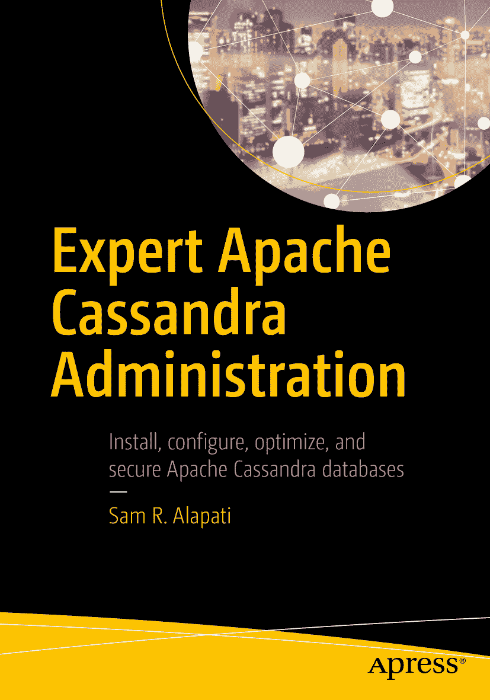

# Sam R. Alapati 精通 Apache Cassandra 管理

## 补充材料

本书作者引用的任何源代码或其他补充材料，读者均可通过本书产品页面在 GitHub 上获取，地址为 [`www.apress.com/9781484231258`](http://www.apress.com/9781484231258)。更详细信息，请访问 [`www.apress.com/source-code`](http://www.apress.com/source-code)。

## 出版信息

ISBN `978-1-4842-3125-8`
e-ISBN `978-1-4842-3126-5`
[`doi.org/10.1007/978-1-4842-3126-5`](https://doi.org/10.1007/978-1-4842-3126-5)
国会图书馆控制号：`2017962948`
© Sam R. Alapati 2018

## 版权声明

本作品受版权法保护。出版者保留所有权利，无论涉及材料的整体或部分，特别是翻译、转载、插图重用、朗诵、广播、缩微胶片或其他任何物理方式的复制，以及信息存储与检索、电子改编、计算机软件，或当前已知及未来开发的类似或不同方法。本书中可能出现商标名称、标识和图像。我们并非在每次出现商标名称、标识和图像时都使用商标符号，而仅以编辑目的并为商标所有者利益的方式使用这些名称、标识和图像，无任何商标侵权意图。本书中对商品名称、商标、服务标志及类似术语的使用，即使未特别标识，也不应被视为表达其是否受专有权利约束的意见。尽管本书中的建议和信息在出版时被认为是真实和准确的，但作者、编辑或出版商均不对可能出现的任何错误或遗漏承担法律责任。出版商对本出版物所含材料不作任何明示或暗示的保证。

采用无酸纸印刷。

本书通过 Springer Science+Business Media New York（地址：纽约州纽约市斯普林街 233 号 6 楼，邮编：10013。电话：`1-800-SPRINGER`，传真：`(201) 348-4505`，电邮：`orders-ny@springer-sbm.com`，或访问 `www.springeronline.com`）向全球图书贸易发行。Apress Media, LLC 是一家位于加利福尼亚州的有限责任公司，其唯一成员（所有者）是 Springer Science + Business Media Finance Inc (SSBM Finance Inc)。SSBM Finance Inc 是一家特拉华州的公司。

## 献词

我谨以此书纪念易卜拉欣·汗（Ibrahim Khan），一位伟大的板球运动员，更是一位伟大的人。很久以前从“汗先生”身上学到的教诲，至今仍指引着我。

## 致谢

我要感谢我的好友、也是我多本书的长期编辑，乔纳森·詹尼克（Jonathan Gennick）。在本书写作过程进展艰难时，乔纳森鼓励我坚持下去，并对我的工作给予支持。谢谢你，乔纳森，感谢你对我的信任！

卡洛斯·罗洛（Carlos Rolo）作为本书的技术编辑，在许多方面都表现出色。卡洛斯以其对 Cassandra 数据库的精通而闻名。我从他细致的技术审阅，以及他对几个棘手技术概念提出的澄清或改进建议中受益匪浅。

协调编辑吉尔·巴尔扎诺（Jill Balzano）一如既往地以优雅与高效的结合，在确保我按目标前进方面发挥了关键作用。吉尔巨大的耐心和善意，使得写作和编辑过程令人愉快。

SPi Content Solutions – SPi Global 的高级执行项目经理阿姆里塔·斯坦利（Amrita Stanley）在确保一切顺利进行方面提供了极大的帮助。谢谢你，阿姆里塔，感谢你对每件事都如此关注，并帮助我处理各种请求。

我学业上的一切成就都归功于我父亲的鼓励和培养。我感谢我亲爱的父亲，已故的阿帕·拉奥博士（Dr. Appa Rao）给予我的爱和关怀。我要感谢我的母亲斯瓦尔纳·库马里（Swarna Kumari），以及我的兄弟哈里·哈拉·普拉萨德（Hari Hara Prasad）和希瓦·桑卡拉·普拉萨德（Siva Sankara Prasad）。我要向所有的姻亲以及我兄弟的孩子们：阿鲁娜（Aruna）、瓦娜佳（Vanaja）、特加（Teja）、阿什温（Ashwin）、阿帕娜（Aparna）和索米亚（Soumya）表示感谢。我感谢并感谢我的妻子对本书的间接贡献。我也感激我的双胞胎孩子尼娜（Nina）和尼古拉斯（Nicholas）的支持和鼓励，他们每一天都照亮我的生活！

—Sam R. Alapati

目录

