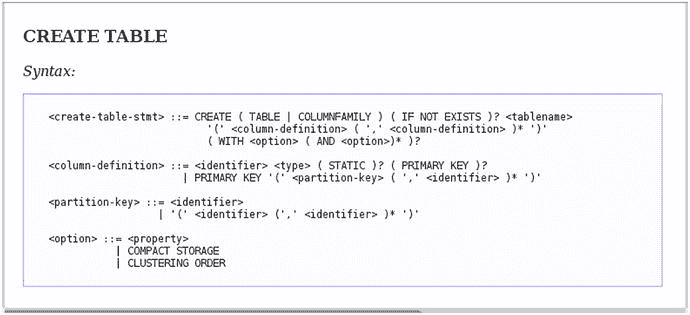

# 2. 安装 Cassandra 并开始使用 CQL Shell

在本章中，您将学习如何安装 Cassandra 并创建一个单节点的 Cassandra “集群”。一旦您初步尝试，就能轻松过渡到创建和配置多节点 Cassandra 集群，这是我将在第 3 章讨论的主题。

创建 Cassandra 集群后，您将学习如何使用 `cqlsh`，即 CQL Shell 的命令行界面。完成本章后，您将知道如何启动和停止集群、创建键空间和表，以及如何插入和查询数据。

### 安装 Apache Cassandra

Cassandra 易于设置和上手。在本节中，我将展示如何在 Linux（具体是 Ubuntu 16.04 LTS 服务器）上安装 Cassandra。

学会安装 Cassandra 后，我将展示如何在单台机器上创建一个简单的单节点 Cassandra 集群。在第 3 章中，我将展示如何创建一个包含多个节点的 Cassandra 集群。

### 安装规划

我使用在 VMware 上运行的 Ubuntu 16.04 LTS 服务器来展示安装过程。该服务器有 4GB RAM 和 20GB 存储空间。

在开始安装 Cassandra 之前，您需要在服务器上创建一个用户和组来管理 Cassandra。将用户和组都命名为 `cassandra`。以下是创建用户和组的步骤：

```
$ sudo groupadd –r cassandra
$ sudo useradd –r –m cassandra –g cassandra –G users
```

### 安装 Cassandra 的前提条件

在安装 Cassandra 之前，有两个基本前提条件：您必须安装正确版本的 Java，并且需要最新版本的 Python。

以下两个部分展示了如何安装 Java 和 Python（如果需要安装）。

#### Java

您需要最新 64 位版本的 Java 8，Oracle Java 标准版或 OpenJDK 8 均可（我使用 Oracle JRE）。您可以通过以下方式检查已安装的 Java 软件版本：

```
$ java -version
java version "1.8.0_101"
Java(TM) SE Runtime Environment (build 1.8.0_101-b13)
Java HotSpot(TM) 64-Bit Server VM (build 25.101-b13, mixed mode)
$
```

如果输出中第一行没有显示类似 `java version "1.8.0_101"` 的内容（输出共三行），则需要安装 Java。请按照以下步骤安装 Oracle JDK。

1.  从 Oracle Java SE Downloads 下载 Oracle JDK 安装程序，需先接受许可协议。您可以在此处下载 JDK：[`www.oracle.com/technetwork/java/javase/downloads/jdk8-downloads-2133151.html`](http://www.oracle.com/technetwork/java/javase/downloads/jdk8-downloads-2133151.html)
2.  为 JDK 创建一个目录。

    ```
    $ sudo mkdir –p /usr/lib/jvm
    ```

3.  解压 tar 包后安装 JDK。

    ```
    $ sudo tar zxf jdk-8u65-linux-x64.tr.gz –C /usr/lib/jvm
    ```

    您可以在名为 `/usr/lbi/jvm/jdk-8u-version` 的目录中找到 JDK 文件。
4.  您需要使用 `alternatives` 命令让操作系统知道新的 Java 版本。

    ```
    $ sudo update-alternatives –install "/usr/bin/java" "java" "/usr/lib/jvm/jdk1.8.0_101/bin/java"
    ```

5.  再次运行 `alternatives` 命令，这次是为了将新安装的 JDK 设为默认的 Java 版本。

    ```
    $ sudo update-alternatives –config java
    ```

    此命令确保如果您安装了多个 Java 版本，默认版本将切换为您刚刚安装的版本。
6.  确认安装是否正确。

    ```
    $ java -version
    java version "1.8.0_101"
    Java(TM) SE Runtime Environment (build 1.8.0_101-b13)
    Java HotSpot(TM) 64-Bit Server VM (build 25.101-b13, mixed mode)
    $
    ```


## Python

虽然运行 Cassandra 本身需要 Java，但运行 `cqlsh`（Cassandra 数据库的命令行界面）则需要 Python。具体来说，你需要最新版的 Python 2.7。

你可以用以下命令检查当前的 Python 版本：

```
$ python
Python 2.7.12 (default, Nov 19 2016, 06:48:10)
[GCC 5.4.0 20160609] on linux2
Type "help", "copyright", "credits" or "license" for more information.
>>>
```

就我的情况而言，Ubuntu 服务器已预装了 Python。如果你需要安装 Python，可以按以下步骤操作。

1.  安装所需的软件包。

    ```
    $ sudo apt-get install build-essential checkinstall
    $ sudo apt-get install libreadline-gplv2-dev libncursesw5-dev libssl-dev libsqlite3-dev tk-dev libgdbm-dev libc6-dev libbz2-dev
    ```

2.  下载 Python 二进制文件。

    ```
    $ cd /usr/src
    $ wget https://www.python.org/ftp/python/2.7.12/Python-2.7.12.tgz
    ```

3.  解压软件包。

    ```
    $ tar xzf Python-2.7.12.tgz
    ```

4.  编译 Python 源代码。

    ```
    $ cd Python-2.7.12
    $ sudo ./configure
    $ sudo make altinstall
    ```

5.  检查 Python 版本。

    ```
    $ python2.7 -V
    Python 2.7.13
    $
    ```

### 安装 Cassandra

你可以从下载的源二进制归档文件安装、运行 Cassandra，或者使用 `yum` 或 `apt-get` 将 Cassandra 软件包作为服务来安装（仅限 Linux）。本节将展示这两种安装 Cassandra 的方法。你也可以使用一种不太常见的第三种方法来安装，即下载源代码并进行编译。

### 从源代码构建

你可以使用 Apache Ant 从源代码构建 Cassandra。从源代码构建时，你需要使用 Java 8 JDK，而不仅仅是 JRE。以下是构建源代码的步骤。

1.  如果你还没有 Ant，请从 [`http://ant.apache.org`](http://ant.apache.org) 下载。
2.  获取 Cassandra 源代码的只读主干版本。

    ```
    $ git clone git://git.apache.org/cassandra.git
    ```

3.  转到源代码下载的根目录并运行 `ant`。

    ```
    $ ant
    ```

Ant 会在当前目录中查找 `build.xml` 文件并执行默认的构建目标。Ant 会构建源文件并执行测试，如果一切顺利，你将看到一条 `BUILD SUCCESSFUL` 的消息。

### 从 Debian 软件包安装

从 Debian 软件包安装与从源二进制归档文件安装一样简单，具体步骤如下。

1.  将 Cassandra 的 Apache 软件仓库添加到 `/etc/apt/sources.list.d/cassandra.sources.list`，如下所示：

    ```
    $ echo "deb http://www.apache.org/dist/cassandra/debian 311x main" | sudo tee -a /etc/apt/sources.list.d/cassandra.sources.list
    ```

2.  添加 Apache Cassandra 软件仓库密钥。

    ```
    $ curl https://www.apache.org/dist/cassandra/KEYS | sudo apt-key add -
    $ sudo apt-key adv --keyserver pool.sks-keyservers.net --recv-key A278B781FE4B2BDA
    ```

3.  更新软件包索引。

    ```
    $ sudo apt-get update
    ```

4.  现在，你已准备好安装 Cassandra。

    ```
    $ sudo apt-get install cassandra
    ```

5.  你可以通过运行以下命令来启动、停止和检查此服务器上 Apache Cassandra 服务的状态：

    ```
    $ sudo systemctl start cassandra.service
    $ sudo systemctl stop cassandra.service
    $ sudo systemctl status cassandra.service
    [sudo] password for samalapati:
    ● cassandra.service - LSB: distributed storage system for structured data
       Loaded: loaded (/etc/init.d/cassandra; bad; vendor preset: enabled)
       Active: active (running) since Fri 2017-09-29 08:07:57 PDT; 42min ago
        Docs: man:systemd-sysv-generator(8)
       Memory: 2.2G
          CPU: 40.810s
       CGroup: /system.slice/cassandra.service
               └─5432 java -Xloggc:/var/log/cassandra/gc.log -ea -XX:+UseThreadPrior
    Sep 29 08:07:57 ubuntu systemd[1]: Starting LSB: distributed storage system for
    Sep 29 08:07:57 ubuntu systemd[1]: Started LSB: distributed storage system for s
    Sep 29 08:08:11 ubuntu systemd[1]: Started LSB: distributed storage system for s
    ```

6.  你可以通过以下操作让 Cassandra 服务在系统启动时自动启用：

    ```
    $ sudo systemctl enable cassandra.service
    ```

7.  由于 Debian 软件包在安装后会自动启动 Cassandra 服务，如果你计划部署一个真实的集群而非测试服务，则必须停止该服务并清除数据。这样做可以从 Cassandra 的系统表中删除默认的集群名称（`Test Cluster`）。清除数据的方法如下：

    ```
    $ sudo systemctl stop cassandra.service
    $ sudo rm -rf /var/lib/cassandra/data/system/*
    ```

### 从源二进制归档文件构建

开始安装 Cassandra 最简单的方法是从 Cassandra 网站 [`http://cassandra.apache.org/download/`](http://cassandra.apache.org/download/) 下载并安装二进制归档文件。

你也可以使用类似 `curl` 的命令下载最新的归档文件：

```
$ curl –OL http://www.apache.org/dist/cassandra/3.9.0/apache-cassandra-3.9.0-bin.tar.gz
```

请按照以下步骤从二进制归档文件下载并安装 Cassandra。

1.  下载最新的 Cassandra 版本，即 3.9（发布于 2016-09-29）。
2.  从归档文件中解压安装文件。

    ```
    $ sudo tar –xzvf apache-cassandra-3.9-bin.tar.gz
    ```

    `tar` 命令会将文件解压到 `apache-cassandra-3.9` 目录中。
3.  将解压后的目录移动到 `/usr/share` 库。

    ```
    $ sudo mv apache-cassandra-3.9 /usr/share
    ```

4.  如下所示，为该目录创建一个符号链接：

    ```
    $ sudo ln –s /usr/share/apache-cassandra-3.9 /usr/share/cassandra
    ```

创建符号链接对于后续操作是个好主意。符号链接允许你在同一安装中保留多个版本的 Cassandra。你只需要简单地更改链接指向的位置，即可在不同版本之间切换。

就这样，安装完成了！与安装关系型数据库并进行配置不同，安装 Cassandra 并开始使用它非常容易。完全无需任何配置，就可以开箱即用并开始使用 Cassandra。当然，你需要进行配置和调优以发挥其最大性能，但对于新手来说，开始使用这个数据库是相当容易的。

在下一节中，我将展示如何通过在 `cassandra.yaml`（Cassandra 的主配置文件）中输入和修改配置属性来配置 Cassandra。稍后，我会告诉你如何启动和停止 Cassandra。

### 创建必要的目录

你需要创建一组基本的三个目录，以便 Cassandra 知道将表和其他数据存储在何处。以用户 `cassandra` 的身份创建以下三个数据目录：

```
$ mkdir /usr/share/cassandra/commitlog
$ mkdir /usr/share/cassandra/data
$ mkdir /usr/share/cassandra/saved_caches
```

无论你是否创建，Cassandra 都会创建这三个目录；你自己创建的原因是为了让这些目录位于你选择的位置，而不是默认目录中。


### 配置 Cassandra

`cassandra.yaml`文件是为 Cassandra 集群设置配置属性的关键配置文件，例如以下各项：

*   调优和资源利用参数
*   缓存参数
*   客户端连接
*   备份
*   安全

Cassandra 提供了一个`cassandra.yaml`模板，位于`$CASSANDRA_HOME/conf`目录中。刚开始使用 Cassandra 时，你只需编辑少量配置属性即可开始使用。之后，一旦你充分理解了 Cassandra 的架构和关键概念，就该着手调整那些影响性能以及 Cassandra 其他许多方面的配置属性了，本书相关章节会对这些进行讲解。

## cassandra.yaml 文件的位置

默认情况下，`cassandra.yaml`文件位于以下位置：

*   `/etc/cassandra` （用于 Cassandra 包安装）
*   `<install_location>/conf` （用于 Cassandra 压缩包安装）

### 必须设置的最小配置属性

虽然你可以在`cassandra.yaml`文件中配置数百个初始化参数，但开始时你只需要配置少数几个属性：

*   `cluster_name`
*   `listen_adresss`
*   `listen_interface`

我将在以下小节中解释这些基本属性。你可以用不同的名称保存默认的`cassandra.yaml`，然后创建一个只包含这些属性的新`cassandra.yaml`文件来启动你的第一个单节点 Cassandra 集群。你通过在属性后加冒号来指定每个配置属性。

### cluster_name 参数

`cluster_name`参数允许你为 Cassandra 集群命名。默认值是 Test Cluster。显然，在多节点集群中，你必须为所有节点指定相同的`cluster_name`值。

`cluster_name`参数的主要目的是防止属于一个逻辑集群的节点加入其他集群。

### listen_adresss 属性

`listen_address`属性决定了 Cassandra 在连接到其他节点时绑定的 IP 地址（或主机名）。默认值是`localhost`。如果你运行的是单节点集群，可以使用此参数的默认设置。

注意：请勿将`listen_address`参数的值设置为 0.0.0.0。

### listen_interface 参数

`listen_interface`参数指定了 Cassandra 在连接到其他节点时绑定的网络接口，并且必须对应于单个地址。

如果你设置了`listen_address`属性，就可以省略`listen_interface`参数，反之亦然。

### 设置数据文件目录位置

你可以在`cassandra.yaml`文件中指定用于存储 Cassandra 数据文件及其缓存目录的目录。

你必须配置两个主要目录来指定 Cassandra 存储其数据的位置；第一个位置用于存储 SSTable，第二个位置用于存储提交日志。此外，还有第三个目录用于存储缓存数据，称为`saved_caches`目录。

虽然 Cassandra 会在其默认位置为你创建这些目录，但你也可以为以下三个 Cassandra 目录设置自定义位置，如下所示：

*   `data_file_directories: /usr/share/cassandra/data`
*   `commitlog_directory: /usr/share/cassandra/commitlog`
*   `saved_caches_directory: /usr/share/cassandra/saved_caches`

默认情况下，Cassandra 将其数据存储在以下位置：

*   `/var/lib/cassandra` （用于包安装）
*   `<install_location>/data/data` （用于压缩包安装）

如果你不设置此参数，默认目录将是`$CASSANDRA_HOME/data/data`。

### 存储缓存目录的位置

Cassandra 需要一个目录来存储其键缓存和行缓存。其默认位置是

*   `/var/lib/cassandra/saved_caches` （用于包安装）
*   `<install_location>/data/saved_caches` （用于压缩包安装）

### 设置存储提交日志的位置

你应该为存储提交日志分配一个不同的目录，理想情况下应位于不同的物理磁盘上。

默认情况下，Cassandra 将提交日志存储在`/var/lib/cassandra/commitlog`目录中。如果你不设置它，默认目录将是：

`$CASSANDRA_HOME/data/commitlog`

### 配置防火墙

在启动 Cassandra 实例之前，请确保可以通过打开以下端口从 Cassandra 运行的服务器外部访问 Cassandra 服务：

*   `7000`
*   `7199`
*   `9042`
*   `9160`

### 探索 CQL Shell

Cassandra 查询语言（CQL）是与 Cassandra 数据库通信的主要方式。与 Cassandra 交互最简单的方法是使用 CQL shell，即`cqlsh`。

你通过`cqlsh`创建键空间、表以及读写数据。在以下部分中，我将向你展示如何开始使用`cqlsh`。

### 启动 CQL Shell

你使用`cqlsh`命令启动 CQL shell，如下所示：

```
$ cqlsh
Connected to Test Cluster at 127.0.0.1:9042.
[cqlsh 5.0.1 | Cassandra 3.7 | CQL spec 3.4.2 | Native protocol v4]
Use HELP for help.
cqlsh>
```

你在`cqlsh`提示符下输入`exit`来终止 CQL shell：

```
cqlsh:mykeyspace1> exit;
$
```

## cqlsh 中的时区

Cassandra 默认使用 UTC 时区显示时间戳。你必须安装`pytz`库才能使用不同时区显示时间戳。

### 在 CQL Shell 中获取帮助

CQL shell 中的 HELP 功能很强大。当你在`cqlsh`命令行输入`HELP`时，你会看到所有 HELP 选项，就像其他任何命令行工具一样。

```
cqlsh> help
Documented shell commands:
===========================
CAPTURE  CLS          COPY  DESCRIBE  EXPAND  LOGIN   SERIAL  SOURCE   UNICODE
CLEAR    CONSISTENCY  DESC  EXIT      HELP    PAGING  SHOW    TRACING
CQL help topics:
================
AGGREGATES               CREATE_KEYSPACE           DROP_TRIGGER        TEXT
ALTER_KEYSPACE           CREATE_MATERIALIZED_VIEW  DROP_TYPE           TIME
ALTER_MATERIALIZED_VIEW  CREATE_ROLE                 DROP_USER       TIMESTAMP
ALTER_TABLE              CREATE_TABLE                     FUNCTIONS       TRUNCATE
ALTER_TYPE               CREATE_TRIGGER            GRANT              TYPES
ALTER_USER               CREATE_TYPE               INSERT            UPDATE
APPLY                    CREATE_USER               INSERT_JSON          USE
ASCII                    DATE                      INT                 UUID
BATCH                    DELETE                    JSON
BEGIN                    DROP_AGGREGATE            KEYWORDS
BLOB                     DROP_COLUMNFAMILY         LIST_PERMISSIONS
BOOLEAN                  DROP_FUNCTION             LIST_ROLES
COUNTER                  DROP_INDEX                LIST_USERS
CREATE_AGGREGATE         DROP_KEYSPACE             PERMISSIONS
CREATE_COLUMNFAMILY      DROP_MATERIALIZED_VIEW    REVOKE
CREATE_FUNCTION          DROP_ROLE                 SELECT
CREATE_INDEX             DROP_TABLE                SELECT_JSON
cqlsh>
```

此外，当你向`HELP`命令传递一个选项时，例如`HELP CREATE_TABLE`，Cassandra 会显示一个漂亮的屏幕，展示该命令的语法，如图 2-1 所示。



图 2-1：CREATE TABLE 语句的 HELP 命令

注意：`cqlsh`保证能良好运行（即完全兼容）的只是与其所属的 Cassandra 版本。它可能与更旧或更新的 Cassandra 版本也能良好运行，但不要指望这一点！


### 命令行 CQL Shell 选项

你将使用 `cqlsh` 来执行许多任务，因此你应该熟练掌握基本的 CQL 命令行选项。`cqlsh` 实用程序附带了几个有用的命令行选项，也称为有文档记录的 shell 命令。我将在此展示如何使用最有用的 CQL shell 选项。

## `capture` 命令

`CAPTURE` 命令将捕获一个命令的输出并将其添加到文本文件中，如下例所示：

```
cqlsh> capture '/home/test/Cassandra/output/testfile'
```

一旦你发出 `CAPTURE` 命令，shell 将捕获你在该会话中发出的所有后续 CQL 命令的输出，直到你使用 `capture off` 命令关闭输出捕获：

```
cqlsh> capture off;
```

## `copy` 命令

`COPY` 命令非常适合将数据从 Cassandra 表捕获到文本文件中。下面是一个示例，展示了如何将名为 `employees` 的表的内容捕获到文件 `myfile` 中：

```
cqlsh> copy employee (emp_id, emp_cicty, emp_name, emp_sal) to 'myfile';
```

## `describe` 命令

`DESCRIBE` 命令将描述 Cassandra 集群中的各种实体。在下面的示例中，`describe cluster` 命令描述了 Cassandra 集群及其顶级对象：

```
cqlsh> describe cluster;
Cluster: Test Cluster
Partitioner: Murmur3Partitioner
cqlsh>
```

你可以使用 `DESCRIBE` 命令获取其他几个实体的描述：

*   `Describe types`: 列出所有用户定义的数据类型
*   `Describe type`: 描述一个用户定义的数据类型
*   `Describe tables`: 列出一个键空间中的所有表
*   `Describe table`: 描述一个表
*   `Describe keyspaces`: 列出集群中的所有键空间

注意：`DESC` 命令与 `DESCRIBE` 命令功能相同。

以下是一个展示如何运行 `DESCRIBE KEYSPACES` 命令的示例：

```
cqlsh> describe keyspaces;
test1          system_auth  system_distributed  testdata
system_schema  system       system_traces
cqlsh>
```

假设我有一个名为 `quarters` 的表。当我运行 `describe table quarters` 命令时，我得到了一大堆输出，尽管我只用几行代码创建了表。

```
cqlsh> use testdata;
cqlsh:testdata> describe table quarters;
CREATE TABLE testdata.quarters (
id int PRIMARY KEY,
name text
) WITH bloom_filter_fp_chance = 0.01
AND caching = {'keys': 'ALL', 'rows_per_partition': 'NONE'}
AND comment = ''
AND compaction = {'class': 'org.apache.cassandra.db.compaction.SizeTieredCompactionStrategy', 'max_threshold': '32', 'min_threshold': '4'}
AND compression = {'chunk_length_in_kb': '64', 'class': 'org.apache.cassandra.io.compress.LZ4Compressor'}
AND crc_check_chance = 1.0
AND dclocal_read_repair_chance = 0.1
AND default_time_to_live = 0
AND gc_grace_seconds = 864000
AND max_index_interval = 2048
AND memtable_flush_period_in_ms = 0
AND min_index_interval = 128
AND read_repair_chance = 0.0
AND speculative_retry = '99PERCENTILE';
cqlsh:testdata>
```

如果你来自 Oracle 等关系型数据库，你可能只认识这些表选项中的一个，即 `PRIMARY KEY`，这是在创建表时必须指定的。其余的都是默认值。这正是 Cassandra 如此有趣的原因，因为有很多新的、有趣的东西需要学习和使用。你将在相应的章节中学习所有这些表选项。

## `expand` 命令

`expand` 命令以垂直方式显示表行的内容，便于阅读长行数据。无需像默认水平格式那样向右滚动，而是向下滚动以查看更多行内容。

假设你的查询产生以下输出：

```
cqlsh:mykeyspace1> select * from employee;
emp_id | emp_city    | emp_name | emp_phone   | emp_sal
--------+-------------+----------+-------------+---------
1 | San Antonio |     juan | 39874622562 |   90000
2 |     Houston |      jim | 87209887521 |  100000
3 |      Austin |      sam | 87361598012 |   50000
(3 rows)
cqlsh:mykeyspace1>
```

现在你希望获得更详细的输出。你可以先在 `cqlsh` 会话中发出 `expand on` 命令，然后再执行你原来的命令。

```
cqlsh:mykeyspace1>
expand on;
Now Expanded output is enabled
cqlsh:mykeyspace1> select * from employee;
@ Row 1
-----------+-------------
emp_id    | 1
emp_city  | San Antonio
emp_name  | juan
emp_phone | 39874622562
emp_sal   | 90000
@ Row 2
-----------+-------------
emp_id    | 2
emp_city  | Houston
emp_name  | jim
emp_phone | 87209887521
emp_sal   | 100000
@ Row 3
-----------+-------------
emp_id    | 3
emp_city  | Austin
emp_name  | sam
emp_phone | 87361598012
emp_sal   | 50000
(3 rows)
cqlsh:mykeyspace1>
```

完成后请务必关闭扩展输出：

```
cqlsh:mykeyspace1> expand off;
Disabled Expanded output.
cqlsh:mykeyspace1>
```

## `tracing` 命令

`tracing` 命令让你能够启用和禁用对数据库中运行事务的跟踪。你可以使用跟踪来诊断性能问题。`system_traces` 键空间捕获有关 Cassandra 内部操作的信息。该键空间中名为 `session` 的表捕获查询结果和高层细节。Cassandra 将其执行的所有操作的详细信息捕获在 `system_traces.events` 表中。我将在第 11 章详细解释跟踪。

### Cassandra 安装目录

当你安装 Cassandra 时，安装程序会创建一堆目录，了解这些目录是什么以及里面有什么是个好主意。

目录的位置取决于你是通过 tarball 还是软件包安装的 Cassandra。通常，tarball 安装会在安装目录下创建所有目录，而软件包安装会将其目录存储在 `/etc` 和 `/var` 目录下。

在我的情况下，我使用 tarball 安装了 Cassandra，所以我将展示我安装中的目录结构，如下所示：

```
$ cd $CASSANDRA_HOME
$ ls
bin          conf  interface  lib          NEWS.txt    pylib
CHANGES.txt  doc   javadoc    LICENSE.txt  NOTICE.txt  tools
$
```

以下部分描述了关键的 Cassandra 目录以及这些目录下的重要文件。

### `bin` 目录

`bin` 目录包含各种实用程序和启动脚本，如下所示：

```
$ ls
cassandra         cqlsh.py         sstableloader       sstableutil.bat
cassandra.bat     debug-cql        sstableloader.bat   sstableverify
cassandra.in.bat  debug-cql.bat    sstablescrub        sstableverify.bat
cassandra.in.sh   nano.save        sstablescrub.bat    stop-server
cassandra.ps1     nodetool         sstableupgrade      stop-server.bat
cqlsh             nodetool.bat     sstableupgrade.bat  stop-server.ps1
cqlsh.bat         source-conf.ps1  sstableutil
$
```

`bin` 目录是你找到以下关键实用程序的地方：

*   `cassandra`: 此实用程序可帮助你启动一个 Cassandra 实例，我将在下一节中解释。
*   `cqlsh`: `cqlsh` 实用程序启动 CQL shell，使你能够编写 CQL 查询以与 Cassandra 通信。
*   `nodetool`: `nodetool` 实用程序是 Cassandra 管理员的得力助手。它让你能够执行众多管理任务，例如检查集群状态、停用节点、添加节点等。在本书中，我将使用 `nodetool` 来执行许多管理任务。
*   `sstableloader`: 此工具使你能够将数据加载到 SSTable 中，我将在第 9 章中解释。

## The tools 目录

`tools` 目录包含用于压力测试和管理 SSTable 等任务的实用 Cassandra 工具，如下所示：
*   `cassandra-stress`：Cassandra 的负载测试工具
*   `sstabledump`：以 JSON 格式转储 SSTable 内容的实用程序
*   `sstablesplit`：将 SSTable 拆分为多个表的工具
*   `sstablemetadata`：打印关于 SSTable 的元数据。

## The lib 目录

`lib` 目录包含了 Cassandra 在运行时可能需要的所有外部库，例如 JSON 序列化库和 Apache commons 库。

## The conf 目录

`conf` 目录包含了配置 Cassandra 集群所需的一切。它包含了让你能够设置 Cassandra 节点以及集群机架运行时属性的配置文件。此目录还包含了你为数据库设置环境的文件。以下是此目录中关键文件的简要说明：
*   `cassandra.yaml`：这是 Cassandra 的主配置文件。
*   `cassandra-env.sh`：这是你配置 Java、JVM 和 JMX 的 Linux 设置的文件。
*   `cassandra-rackdc.properties`：此文件定义了由 `GossipingPropertyFileSnitch`、`Ec2Snitch`、`Ec2MultiRegionSnitch` 和 `GoogleCloudSnitch` 等各种 snitch 使用的默认数据中心和机架。
*   `Cassandra-topology.properties`：此文件定义了 `PropertyFileSnitch` 的默认数据中心和机架。
*   `jvm.options`：允许你设置 Cassandra 启动 JVM 时将使用的选项。
*   `commitlog_archiving.properties`：用于配置提交日志。
*   `metrics-reporter-config-sample.yaml`：一个示例文件，展示如何配置 Cassandra 指标。
*   `logback.xml`：Logback 配置文件，帮助你配置 Cassandra 的日志设置。

## The Javadoc 目录

`javadoc` 目录包含一个使用 JavaDoc 工具生成的文档网站。这不是一个完整的文档，而只是存储在 Java 代码中的注释。要阅读 JavaDoc，请在浏览器中打开 `javadoc/index.html` 文件。

### 启动和停止 Cassandra

你通过发出 `cassandra` 命令来启动和停止 Cassandra。`cassandra` 实用程序以及其他关键的 Cassandra 管理工具位于 `$CASSANDRA_HOME/bin` 目录中。

### 启动 Cassandra

你可以使用 `cassandra` 命令启动 Cassandra。你可以选择添加以下标志：
*   `-f` 在前台启动 Cassandra（默认情况下，`cassandra` 命令在后台启动数据库）。在前台运行意味着服务器会将所有日志打印到标准输出，你可以在终端窗口中看到它们。
*   无论你是以后台还是前台模式运行 Cassandra，服务器日志总是写入 `system.log` 文件。
*   `-R` 以 root 用户身份启动 Cassandra。

```
以下是如何启动 Cassandra 实例的示例（以 root 用户身份，在前台启动）：
$ cassandra -f -R
...
INFO  20:33:47 Configuration location: file:/cassandra/apache-cassandra-3.9/conf/cassandra.yaml
data_file_directories=[Ljava.lang.String;@175c2241; disk_access_mode=auto; disk_failure_policy=stop; dynamic_snitch=true; dynamic_snitch_badness_threshold=0.1; dynamic_snitch_reset_interval_in_ms=600000;
...
INFO  20:33:57 Initializing system_schema.keyspaces
INFO  20:33:59 Cassandra version: 3.9
INFO  20:34:00 Loading persisted ring state
INFO  20:34:00 Starting up server gossip
INFO  20:34:00 Updating topology for localhost/127.0.0.1
INFO  20:34:01 Node localhost/127.0.0.1 state jump to NORMAL
INFO  20:34:01 Starting listening for CQL clients on localhost/127.0.0.1:9042 (unencrypted)...
```

我运行了带 `–f` 选项的 `cassandra` 命令，因此选择在前台运行实例。所以，Cassandra 会持续在终端打印所有日志信息。如果你以后台默认模式启动 Cassandra，在 Cassandra 实例启动后按 Enter 键即可返回 Linux 命令提示符。

让我们回顾一下我在这里展示的简要输出，因为它教给了我们一些有价值的事情：
*   Loading persisted ring state：加载环状态。
*   Starting up server gossip：与 gossip 相关的语句表明服务器正在与集群中其他节点启动通信。
*   Updating topology：通过添加你已添加到集群的任何新节点来更新集群拓扑。
*   Node … state jump to NORMAL：这意味着 Cassandra 已正常启动，并等待你通过 `cqlsh` 或其他方式与其进行交互。

服务器启动后，Cassandra 会持续写入 `system.log` 文件，更新其中与内部数据库活动相关的信息，例如 memtable 的刷新和 SSTable 的压缩。

### 检查 Cassandra 的状态

你可以使用 `nodetool status` 命令检查实例的状态。`nodetool` 实用程序仅在 Cassandra 实例在节点上运行时才有效。`nodetool` 是一个非常有用的 Cassandra 工具，熟悉它是个好主意。

输入 `nodetool –help` 查看所有你可以执行的 `nodetool` 命令：

```
$ nodetool -help
usage: nodetool [(-h  | --host )] [(-p  | --port )]
[(-pwf  | --password-file )]
[(-u  | --username )]
[(-pw  | --password )]  []
The most commonly used nodetool commands are:
assassinate                  Forcefully remove a dead node without re-replicating any data.  Use as a last resort if you cannot removenode
bootstrap                    Monitor/manage node's bootstrap process
cleanup                      Triggers the immediate cleanup of keys no longer belonging to a node. By default, clean all keyspaces
clearsnapshot                Remove the snapshot with the given name from the given keyspaces. If no snapshotName is specified we will remove all snapshots
compact                      Force a (major) compaction on one or more tables or user-defined compaction on given SSTables
compactionhistory            Print history of compaction
compactionstats              Print statistics on compactions
decommission                 Decommission the *node I am connecting to*
describecluster              Print the name, snitch, partitioner and schema version of a cluster
...
```

如果没有 Cassandra 实例在运行时执行 `nodetool`，你会得到一个错误：

```
$ nodetool status
nodetool: Failed to connect to '127.0.0.1:7199' - ConnectException: 'Connection refused'.
$
```


### `nodetool status` 命令

`nodetool status` 命令用于了解 Cassandra 集群的状态。既然我现在有 Cassandra 实例在运行，我可以使用 `nodetool` 来检查它：

```
$ nodetool status
Datacenter: datacenter1
=======================
Status=Up/Down
|/ State=Normal/Leaving/Joining/Moving
--  Address          Load       Tokens       Owns (effective)  Host ID                     Rack
UN  192.168.177.132  203.5 KiB  256          100.0%            b0ade950-937a-457c-95eb-d3032897eeb1  rack1
$
```

输出中的每个节点都由其 IP 地址表示。`nodetool` 状态报告的第一列显示了 Cassandra 实例的状态和状态。

状态可以有两个值：`Up` 或 `Down`。

状态可以是以下四个值之一：

*   `Normal`
*   `Leaving`
*   `Joining`
*   `Moving`

在我这里，我看到的是 `UN`，意味着 `向上/正常`。`Owns` 列显示了该节点在每个数据中心拥有的数据百分比乘以数据的复制因子。例如，如果一个节点拥有 33% 的数据，而复制因子是 2，那么 `Owns` 列会显示 67%。由于目前我的集群中只有一个节点，它拥有集群中全部（100%）的数据。糟糕的数据模型会影响数据在集群节点间的分布，检查每个节点拥有的数据百分比是验证数据模型是否良好的一个好方法。

## 使用 `nodetool info` 命令测试服务器

`nodetool info` 命令显示诸如运行时间和负载等信息，有助于验证 Cassandra 实例是否正常运行，如下所示：

```
$ sudo nodetool info
ID                     : 99c43633-c691-4dee-b7af-35bc6e74dd67
Gossip active          : true
Thrift active          : false
Native Transport active: true
Load                   : 296.85 KiB
Generation No          : 1489357081
Uptime (seconds)       : 1714
Heap Memory (MB)       : 120.53 / 1014.00
Off Heap Memory (MB)   : 0.00
Data Center            : datacenter1
Rack                   : rack1
Exceptions             : 21
Key Cache              : entries 32, size 2.56 KiB, capacity 50 MiB, 1344 hits, 1395 requests, 0.963 recent hit rate, 14400 save period in seconds
Row Cache              : entries 0, size 0 bytes, capacity 0 bytes, 0 hits, 0 requests, NaN recent hit rate, 0 save period in seconds
Counter Cache          : entries 0, size 0 bytes, capacity 25 MiB, 0 hits, 0 requests, NaN recent hit rate, 7200 save period in seconds
Chunk Cache            : entries 30, size 1.88 MiB, capacity 221 MiB, 128 misses, 2738 requests, 0.953 recent hit rate, 866.987 microseconds miss latency
Token                  : (invoke with -T/--tokens to see all 256 tokens)
```

如果这个 `nodetool` 命令挂起超过一分钟左右，那就意味着你的服务器网络配置有问题。

## 停止 Cassandra

没有专门的 Cassandra 命令来停止正在运行的实例。如果你在前台启动了 Cassandra，按下 `Control-C` 来停止它。如果你在后台启动了 Cassandra，你可以使用 Linux 的 `kill` 命令来停止实例。首先，用 `pgrep –f CassandraDaemon` 命令找到 PID（Linux 进程 ID），然后用 Linux 的 `kill` 命令将其终止：

```
$ sudo pgrep -f CassandraDaemon
```

或者，你可以简单地运行 `ps` 命令来获取 Cassandra 的 PID：

```
$ sudo ps auwx | grep cassandra
```

一旦你通过我展示的两种方法之一获得了 Cassandra 的 PID，你就可以像这样终止实例：

```
$ sudo kill 2284
```

或者，你可以通过运行以下命令一步到位地终止实例：

```
$ sudo pkill –f CassandraDaemon
```

你会注意到在 `$CASSANDRA_HOME/bin` 目录下有一个名为 `stop-server` 的脚本。然而，这个脚本实际上并不会停止任何东西！如果你运行它，它会建议你在使用前阅读该脚本。

```
echo "please read the stop-server script before use"
# if you are using the cassandra start script with -p, this
# is the best way to stop:
# kill 'cat '
# otherwise, you can run something like this, but
# this is a shotgun approach and will kill other processes
# with cassandra in their name or arguments too:
# user="whoami"
# pgrep -u $user -f cassandra | xargs kill -9
```

你可以创建一个简单的 shell 脚本，比如下面这个，来关闭 Cassandra：

```
#!/bin/bash
CASSPID='ps –ef |grep CassandraDaemon |grep –v grep |awk '{ print $2 }'
if [[ "$CASSPID" == '' ]]
then
echo Cassandra is NOT running
else
kill $CASSPID
fi
```

### 使用 `service` 命令启动和停止

对于打包安装，你也可以将 Cassandra 作为服务（Java 服务器进程）启动。你会在 `/etc/init.d` 目录中找到启动脚本。该服务以 Cassandra 用户身份运行。

在 Debian 系统上，安装软件后 Cassandra 服务会自动启动。你可以使用以下命令检查服务状态、停止和重启它：

```
$ sudo service cassandra status
$ sudo service cassandra stop
$ sudo service cassandra start
```

在具有多个节点的集群中运行 `service cassandra start` 命令时，在初始启动时，你必须从种子节点开始，一次启动一个节点。

如果你尝试在 tarball 安装中运行 `service cassandra` 命令，你会收到一个错误：

```
# service cassandra status
● cassandra.service
Loaded: not-found (Reason: No such file or directory)
Active: inactive (dead)
#
```

### 清除 Cassandra 数据

有时你可能需要清除 Cassandra 数据。你可能只需要删除 `data` 目录中的数据，或者删除所有默认目录中的数据。我在本节中解释了删除目录的步骤。

清除 Cassandra 数据的步骤在包安装和独立安装中是相似的，仅默认目录的位置不同。

要清除包安装中所有默认目录的数据，请执行以下操作：

```
$ cd install_location
$ rm –rf data/*
```

这将删除默认目录中的数据，包括提交日志和 `saved-caches` 目录。

要仅删除数据目录，请执行以下操作：

```
$ sudo rm -rf data/data/*
```

你可以通过以下方式删除包安装中的所有数据（来自默认目录）：

```
$ sudo service cassandra stop
$ sudo rm –rf /var/lib/cassandra/*
```

### 验证 Cassandra 版本

`cassandra` 命令的输出会告诉你 Cassandra 的版本。你也可以通过运行带有 `–v` 选项的 `cassandra` 命令来查找版本：

```
$ ./cassandra -v
3.9
$
```

`–v` 选项只是打印 Cassandra 版本然后退出。你也可以执行 `show version` 命令来获取版本信息：

```
cqlsh> show version;
[cqlsh 5.0.1 | Cassandra 3.7 | CQL spec 3.4.2 | Native protocol v4]
cqlsh>
```

`nodetool version` 命令也显示 Cassandra 版本：

```
$ nodetool version
ReleaseVersion: 3.11.0
$
```

### 配置 `cqlsh`

`cqlsh` 工具是高度可配置的，你可以通过专用配置文件或在命令行选择多个选项来配置它。让我们回顾一下配置 `cqlsh` 的两种方式。

### 通过 `cqlshrc` 配置文件配置

你可以在 `cqlshrc` 文件中配置各种属性。Cassandra 为你提供了一个 `cqlshrc.sample` 文件，你可以将其重命名为 `cqlshrc`。`cqlshrc.sample` 文件位于 `$CASSANDRA_HOME/conf` 目录中。以下是 `cqlshrc.sample` 文件的部分内容：

```
[cql]
;; A version of CQL to use (this should almost never be set)
; version = 3.2.1
[connection]
;; The host to connect to
hostname = 127.0.0.1
;; The port to connect to (9042 is the native protocol default)
port = 9042
;; Always connect using SSL - false by default
; ssl = true
;; A timeout in seconds for opening new connections
; timeout = 10
;; A timeout in seconds for executing queries
; request_timeout = 10
...
```


### 通过在命令行指定选项进行配置

你可以在命令行为 `cqlsh` 指定多个选项。举个简单的例子，你可以使用 `–cqlshrc` 选项来指定 `cqlsh` 配置文件 `cqlshrc` 的非默认位置：

```
$ cqlsh –cqlshrc $CASSANDRA_HOME/newconf
```

### 查找版本

你可以使用同一个 `VERSION` 命令来查找不仅 Cassandra 的版本，还有 `cqlsh`、CQL 以及原生协议的版本：

```
cqlsh> show version
[cqlsh 5.0.1 | Cassandra 3.9 | CQL spec 3.4.2 | Native protocol v4]
cqlsh>
```

### Cqlsh 选项

`cqlsh` 带有众多选项以方便你的工作，我将在以下章节中描述最有用的选项。

#### 清屏

你可以在 `cqlsh` 命令行键入 `clear` 或 `CLS` 来清屏。

#### 从文件运行命令

通常，你可能希望按顺序运行一系列命令。这种情况下，你可以简单地使用 `vi` 或 `nano` 等文本编辑器将所有命令存储在一个文本文件中。例如，以下两行内容在一个名为 `myfile` 的文件中：

```
use mykeyspace1
select * from employees
```

一旦你用 `cqlsh` 命令创建了文本文件，就可以使用 `source` 命令来调用这些命令，如下所示：

```
cqlsh> source  '/cassandra/test/myfile';
```

## 全面体验 Cassandra

现在你已经安装、配置、启动和停止了 Cassandra 实例，你已经克服了一个主要障碍。为了了解 Cassandra 的功能，此时创建一些测试数据是个好主意。

在本节中，我将连接到 CQL shell，创建一个键空间和一个表，然后从该表中进行查询。现在先跟着操作，语法和其他有趣的内容我将在第 4 章和第 5 章中解释。

### 连接到 CQL Shell

你可以通过在命令提示符下键入 `cqlsh` 来连接到 CQL shell，如下所示：

```
$ ./cqlsh
Connected to Test Cluster at 127.0.0.1:9042.
[cqlsh 5.0.1 | Cassandra 3.9 | CQL spec 3.4.2 | Native protocol v4]
Use HELP for help.
cqlsh>
```

请注意，`cqlsh` 连接到的集群是名为 `Test Cluster` 的 Cassandra 集群，这恰好是 Cassandra 集群的默认名称。

在这个例子中，我没有指定 `cqlsh` 应该连接到哪个 Cassandra 节点，因此它连接到运行在 `localhost` 上的 Cassandra 实例。如果你在多节点集群中运行 `cqlsh` 命令，你可以连接到集群中的特定节点。为此，你需要在命令行上指定主机名和端口：

```
$ cqlsh 192.168.177.140 9160
```

### 创建键空间

正如你将很快了解到的，要在 Cassandra 表中存储数据，必须首先创建一个键空间。创建此键空间后，你就可以在其中创建表来存储数据。

以下是如何创建一个名为 `testdata` 的键空间：

```
cqlsh> create keyspace testdata with replication = {'class' : 'SimpleStrategy', 'replication_factor' : 2};
cqlsh>
```

此示例创建了一个名为 `testdata` 的键空间，复制因子为 2。不必担心命令的语法；你将在第 4 章学习所有这些内容。

### 创建表

现在你的键空间已经准备好了，是时候创建你的第一个 Cassandra 表了！在发出 `create table` 命令之前，先运行 `use testdata` 命令，以便 Cassandra 在 `testdata` 键空间中创建表。

```
cqlsh> use testdata;
cqlsh:testdata>
cqlsh:testdata> create table quarters ( id int PRIMARY KEY, name text );
```

你可以通过运行 `describe tables` 命令来验证 Cassandra 是否创建了你的新表：

```
cqlsh:testdata> describe tables;
quarters
cqlsh:testdata>
```

### 插入测试数据

让我们向 `quarters` 表中插入一些测试数据。

```
cqlsh:testdata> insert into quarters (id,name) VALUES(1, 'Spring');
cqlsh:testdata> insert into quarters (id,name) VALUES(2, 'Summer');
cqlsh:testdata> insert into quarters (id,name) VALUES(3, 'Fall');
cqlsh:testdata> insert into quarters (id,name) VALUES(4, 'Winter');
cqlsh:testdata>
```

### 查询表

让我们查询 `quarters` 表。

```
cqlsh:testdata> select * from quarters;
id | name
----+--------
1 | Spring
2 | Summer
4 | Winter
3 |   Fall
(4 rows)
cqlsh:testdata>
```

### 获取命令历史记录

你可以通过进入运行这些命令的用户主目录下的名为 `.cassandra` 的目录，来获取所有 `cqlsh` 以及 `nodetool` 命令的历史记录。

```
ubuntu2:/home/samalapati/.cassandra$  ls -altr
total 16
-rw-------  1 samalapati samalapati    5 Mar  5 17:22 cqlsh_history
-rw-rw-r--  1 samalapati samalapati 3156 Mar 11 11:44 nodetool.history
...
```

在隐藏目录 `.cassandra` 中，你会找到两个文件：`cqlsh_history` 和 `nodetool.history`，它们分别存储了你运行过的所有 `cqlsh` 和 `nodetool` 命令的历史记录。

现在你拥有了一个崭新的 Cassandra 单节点集群。是时候在下一章中转向多节点集群了。

## 总结

你可以通过多种方式安装 Cassandra：通过源代码、二进制包或二进制 tar 包。

初次接触 Cassandra 时，你可以从仅配置少数几个参数开始，并随着对 Cassandra 的了解加深，逐步学习配置其余属性。

学习如何运行 CQL shell 命令将有助于提高你的工作效率。浏览各种 Cassandra 目录，如 `bin`、`conf`、`tools` 和 `logs`，以便熟悉 Cassandra 提供的整个工具集。这种目录浏览也有助于你了解 Cassandra 存储各种内容（如数据、日志、快照和其他各种工件）的位置。

为你的集群创建启动和停止脚本是个好主意。

### 3. 部署 Cassandra 集群

在第 2 章中，你学习了如何安装和配置单节点 Cassandra 集群。从简单的单节点集群开始，是为了让新手熟悉 Cassandra 术语并学习启动和停止 Cassandra 节点的基础知识。

然而，Cassandra 的真正优势在于其分布式架构，因此在本章中，我将展示如何创建和配置多节点集群。

你将学习如何创建、启动和停止多节点集群，包括单数据中心和多数据中心的情况。本章还向你展示如何在 Amazon Web Services 环境中的云端创建多节点 Cassandra 集群。

### 规划集群部署

在规划 Cassandra 集群部署时，你必须确定要启动的节点数量以及这些节点的配置。对于小型开发集群，节点的配置并不关键。然而，对于生产部署，为内存、CPU、磁盘和网络选择合适的配置至关重要。

##### 使用 cassandra-stress 规划生产部署

Cassandra 提供了一个强大的工具，用于在开始生产操作之前对集群进行压力测试。该工具名为 `cassandra-stress`，我将在讨论 Cassandra 性能调优的第 11 章中详细解释它。


### 选择内存

无论您使用虚拟机还是专用硬件，都需要确保为您的生产 Cassandra 环境配备足够的内存。尽管 Cassandra 只需要最低 8GB 的 RAM，但服务器应至少配备 64GB 至 512GB 的 RAM。

对于 Cassandra 节点，没有“理想”的 RAM 容量。内存大小取决于节点将要处理的数据量。请记住，数据写入首先会进入内存中的表（`memtables`），然后再从那里写入到磁盘上的 `SSTables`。

如果 Cassandra 节点内存太少，其 `memtables` 会相应变小，这意味着数据库必须将更多的 `SSTables` 刷写到磁盘。这将导致查询需要执行更昂贵的磁盘 I/O 操作来读取磁盘上的大量文件。底线是，您能购买的 RAM 越多越好。

### 选择 CPU

Cassandra 针对写入进行了优化，因此 CPU 是性能的限制因素。插入数据的工作负载在达到内存限制之前，会先达到 CPU 限制。

DataStax 建议您使用专用硬件，理想的 CPU 数量为 16 个处理器。

### 网络考量

Cassandra 是一个分布式数据库，因此网络需要为读写活动以及数据复制传输大量数据块。建议的网络带宽为 1GB 或更高。

### 选择存储

最佳的存储选择包括存储类型（如 `SAN` 和其他存储类型）以及存储容量的大小。了解 Cassandra 如何使用存储也有助于做出最佳的存储选择。

Cassandra 可以充分利用 `SSD` 提供的高 IOPS。假设您有一组很少读取其数据的表。您可以将 `SSD` 用于常用的列族以提高 I/O 速度，并使用普通存储驱动器来存储不常访问的数据。

#### 不建议使用 NFS、SAN 和 NAS

DataStax 建议您不要在 Cassandra 环境中使用 `SAN`、`NDFS` 或 `NAS` 存储。DataStax 还建议您不要在本地部署的 Cassandra 集群中使用 `SAN` 或 `NAS` 存储。

不建议使用 `SAN` 的原因如下：
*   在持续扩展集群的 Cassandra 环境中，`SAN` 的投资回报率不高。
*   由于 Cassandra 的 I/O 通常高于阵列控制器的处理能力，`SAN` 会成为瓶颈，甚至更糟，成为单点故障。
*   尽管使用了 `SSD` 和高速网络，`SAN` 仍会增加 Cassandra 操作的延迟。
*   `SAN` 的传输与 Cassandra 流量同时发生，会使网络带宽饱和，给所有网络用户带来问题。

如果您必须使用 `SAN`，则需要具备调查诸如 `SAN` 光纤饱和等问题的专业知识。

不推荐使用网络附加存储（`NAS`）设备，因为其读写操作的 I/O 等待时间过长，会导致网络瓶颈。这些瓶颈可能源于路由器延迟以及网络接口卡（`NIC`s）的问题。

最后，DataStax 不推荐使用网络文件系统（`NFS`）存储，因为它在删除和移动文件时行为不一致。

#### Cassandra 如何使用磁盘存储

理解 Cassandra 存储要求的关键在于了解 Cassandra 何时以及如何将数据写入磁盘。Cassandra 在以下场景中将数据写入磁盘：
*   写入提交日志时
*   将 `memtables` 刷写为 `SSTable` 数据文件时
*   定期压缩 `SSTables` 时（压缩操作会暂时增加磁盘使用量）

#### 压缩与存储要求

压缩需要磁盘上有足够的空闲空间来完成工作。压缩的存储要求取决于所有 `SSTables` 的大小以及您采用的压缩策略。

在最坏的情况下，当您使用名为 `SizeTieredCompactionStrategy` 的压缩策略时，您需要相当于数据库正在压缩的所有 `SSTables` 总和 50% 的空闲存储空间。

我将在第 11 章中解释压缩的存储要求。

#### 估算可用磁盘容量

Cassandra 主要使用磁盘存储来存放提交日志和数据目录，后者存储 `SSTable` 数据。除此之外，它还需要一些空闲存储来执行压缩工作。理想情况下，您应将提交日志存储在与数据目录不同的存储驱动器上。

您可以使用以下方法计算集群的总可用存储容量。

1.  计算物理磁盘的总原始容量。
    ```
    原始容量 = 磁盘大小 * 每台服务器的磁盘数量
    示例：12 块磁盘 * 7.2 TB = 86.4 TB
    ```

2.  扣除 10% 的格式化开销，计算可用磁盘空间。
    ```
    格式化后的磁盘空间 = 原始容量 * 0.9
    示例：86.4 * 0.9 = 76.76 TB
    ```

3.  由于 Cassandra 需要磁盘存储空间用于压缩和修复操作，您不能将磁盘的所有格式化空间都用于提交日志和数据目录。DataStax 建议您仅将存储驱动器容量的 50-80% 用于存储数据，其余部分留给压缩活动。在这种情况下，我大约有 77TB 的格式化磁盘空间，因此我可以在其中使用 38.5TB 到 62TB 之间的任何空间来存储数据（`SSTables` + 提交日志）。

### 为 Linux 服务器选择生产设置

如前所述，本书使用 Linux 服务器来运行 Cassandra 集群。您可以在大多数 Linux 版本上运行 Cassandra。本书中的所有工作均使用 Ubuntu 16.04 LTS 服务器。

#### Java 版本

您必须使用最新版本的 Java，并且可以使用 Oracle Java 平台或 `OpenJDK`。我使用的是 Oracle Java 平台，标准版 8 `JDK`。

#### Linux 服务器和内核设置

要优化 Apache Cassandra 安装，请遵循 DataStax 的建议，我将在以下部分进行解释。

#### 同步时钟并启用 NTP

仅当存在带有更近时间戳的新版本时，Cassandra 才会覆盖列。因此，同步集群中所有节点的时钟至关重要。您可以使用 `NTP`（网络时间协议）或其他方法来同步时钟。

如果您的集群无法访问互联网，则必须将集群中的一台服务器设置为 `NTP` 服务器。通过编辑 `/etc/sysconfig/ntpd` 文件来启用 `NTP` 守护进程，从而同步所有集群节点的网络时间。

#### 在 NUMA 系统上禁用 zone_reclaim_mode

为避免潜在的性能问题，您必须禁用 `zone_reclaim_mode`。您可以通过以下方式检查该模式是否已启用：
```
$ cat /proc/sys/vm/zone_reclaim_mode
$
```
如果输出不为零，请使用以下命令禁用该模式：
```
$ echo 0 > /proc/sys/vm/zone_reclaim_mode
```

#### TCP 设置

您需要提高默认的 TCP 设置，这些默认设置仅适用于小型配置。对于繁忙的生产环境（具有数百或数千个并发连接），您需要通过编辑 `/etc/sysctl.conf` 文件来为 TCP 参数设置以下值：
```
net.core.rmem_max = 16777216
net.core.wmem_max = 16777216
net.core.rmem_default = 16777216
net.core.wmem_default = 16777216
net.core.optmem_max = 40960
net.ipv4.tcp_rmem = 4096 87380 16777216
net.ipv4.tcp_wmem = 4096 65536 16777216
```
您必须重新启动 Linux 服务器，新的 TCP 设置才能生效。如果您想在不重启服务器的情况下更改设置，可以发出以下命令：
```
$ sudo sysctl –p /etc/sysctl.conf
```


