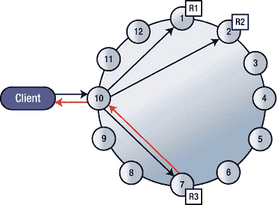
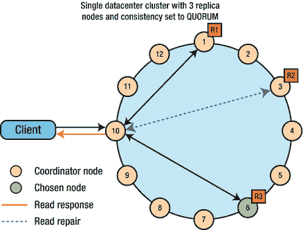

# 4. Cassandra 数据建模以及数据的读写

Cassandra 中的数据建模在许多方面都不同于传统关系数据库的数据建模。本章将介绍 Cassandra 数据建模的关键方面，其中你预期在数据库中运行的查询与你如何在表内部构建数据结构密切相关。

数据建模涉及识别你希望在 Cassandra 数据库中存储的数据类型（实体）以及这些数据实体之间的关系。

在 Cassandra 数据库中建模数据的关键在于关注以下两点：

*   识别数据访问模式
*   你将使用的查询

这两个概念将决定你如何组织数据，以及如何设计和创建数据库表。

查询和模式这两者决定了数据的组织方式。查询是你从数据库中检索数据的方式，而模式是你在数据库表中安排数据的方式。Cassandra 的查询驱动方法意味着你计划使用的特定查询是数据组织的基础。通过按分区将数据分组存储在节点上，你可以提高读写效率。一个查询需要读取的分区越少，数据库对该查询的响应速度就越快。

本章详细解释了 Cassandra 如何读取和写入数据。可配置的一致性是 Cassandra 的一个关键特性，你将深入了解读写一致性，以及如何配置不同的一致性级别。Cassandra 是一个具有**可调一致性**的分区行存储数据库。可调一致性意味着客户端应用程序决定其从数据库请求数据的一致性。

最后，本章解释了**线性一致性**和**轻量级事务**的概念，以及如何通过**批处理操作**确保关键操作的原子性。

## Cassandra 与关系数据库：主要差异

第 1 章概述了关系数据库与 Cassandra 的主要区别。在这里，让我们详细回顾一下 Cassandra 和关系数据库在数据建模方法上的差异。

### 数据驱动 vs. 查询驱动的数据建模

关系数据库中的数据建模完全由数据驱动。你也可以说关系数据建模是表驱动的。规范化理论占据主导地位，该理论要求你不得复制数据。

一旦你根据表及其关系对数据进行了规范化，你就基于这些表和关系编写查询。通常，一个表可以为多个查询提供服务。

Cassandra 组织数据的方式与关系数据库截然不同。Cassandra 的数据建模方法是由**查询**驱动，而非数据。这意味着你根据你期望数据要服务的查询来组织数据。你首先设计查询，然后创建表来满足这些查询。你认为数据重复是嵌套数据的正常副作用，完全可以接受。

Cassandra 在写入时预计算查询，从而优化写入性能，这意味着优化读取是免费的副产品。关系数据库在读取数据时计算查询。它们使用诸如 `JOIN` 和 `ORDER BY` 等昂贵的操作。在 Cassandra 数据库中不存在此类操作。

### 表关联与引用完整性

在关系数据库中，你通过组合来自多个关系的数据来回答一个查询。引用完整性很重要。在 Cassandra 中，你必须将回答查询所需的所有数据嵌套在同一张表内。引用完整性根本不是问题。

### 排序差异

默认情况下，关系数据库按数据写入磁盘的顺序返回行。你可以使用 `ORDER BY` 子句来更改默认的排序顺序。

在 Cassandra 中，你在创建表时通过选择聚类列来显式指定排序顺序。

### 数据重复

正如你将很快了解到的，关系数据库中为避免重复而进行反规范化的传统策略不适用于 Cassandra。在 Cassandra 数据库中，你通过在需要的地方重复数据来实现更高效的读取。Cassandra 利用了存储成本相对于计算堆栈其他组件（如 CPU、内存和网络）更便宜这一事实。

你可以在 Cassandra 中多次存储相同的数据。与关系数据库不同，数据重复被视为一件好事，而不是祸害。关系数据库试图将大量信息放入表中，因为这些表被用于多种类型的搜索。然而，在 Cassandra 中，拥有许多包含相似数据的表是件好事。

请记住，Cassandra 针对写入进行了优化；它的写入速度非常快。因此，如果你需要将相同的数据写入磁盘六次，那就写吧；多次写入不会对你造成伤害。采用数据重复策略（涉及更多写入）以增强读取查询性能，在 Cassandra 中本质上是合理的策略。


### 什么是数据建模？

数据建模既是一门科学，也是一门艺术。数据建模是一个结构化的过程，包括以下内容：

*   收集和分析信息系统的数据需求
*   识别系统中的实体及其间的关系
*   识别数据访问模式
*   以特定方式组织和构建数据
*   设计和指定数据库模式
*   使用诸如索引数据等技术来优化模式

当你进行数据建模工作时，通常遵循一个包含以下五个关键步骤或阶段的过程：

*   分析你的需求。
*   识别实体和关系——概念数据模型。
*   识别常见查询——应用工作流。
*   指定模式——逻辑数据模型（设计表）。
*   优化模式——物理数据模型（使用 `CQL` 实现设计）。优化包括键、分区大小和排序。

在以下部分中，我将解释 `Cassandra` 数据建模的五个主要组成部分。

### 分析你的需求

`Cassandra` 数据建模的需求部分很简单。在大多数情况下，你希望使用 `Cassandra` 来解决以下问题：

*   可扩展性：你的数据流入量大且不断增长。
*   可靠性：你需要一个始终可用、高度可靠的数据存储。
*   易用性：你需要一个易于设置和管理的数据库。

### 概念建模：识别实体及其间的关系

理想情况下，你必须设计查询，使它们访问单个表。你将与某个实体相关的所有属性都包含在单个表中。这与关系表设计不同，在关系表设计中，你将有关实体的数据存储在多个表中，并使用外键链接这些表。`Cassandra` 的每个查询对应一个表的方法能带来更快的性能。

如前所述，在关系数据库中，你从逻辑关系模型开始，然后基于这些关系构建物理表。`Cassandra` 遵循类似的策略，但非常强调考虑你计划对数据库表运行的查询。与关系模型不同，`Cassandra` 数据库中没有连接和引用完整性约束。

最后，它非常强调反规范化，这与你在关系数据库中所做的恰恰相反，关系数据库的重点完全在于规范化数据。概念建模使用著名的实体关系模型 (`ERM`) 来建立实体及其间的关系。

你在 `Cassandra` 中通过设计和创建多个表来实现数据反规范化。在最近的版本中，`Cassandra` 提供了物化视图，这也使你能够基于相同的底层 `SSTables` 创建多个视图。

### 审查你想要使用的查询

在本节中，我将使用几个例子向你展示如何根据你预期的查询来设计表。

让我们使用 `DataStax` 著名的 `Pro Cycling` 统计数据来进行表设计。

注意：`Cassandra` 通过在多个表中重复数据来反规范化数据。这与关系数据库完全相反，关系数据库力求通过规范化来最小化数据重复。

#### 示例 1

假设你想运行一个查询，按名字和姓氏列出每位自行车手。你的逻辑模型将如下所示：

```
cyclist_name
id
lastname
firstname
```

在此模型中，

*   分区键：`id`
*   聚类列：无

此表具有强制性的主键，即列 `id`。在此情况下，`id` 仅由分区键组成。

#### 示例 2

前面的示例相当初级。你可以仅按 `id` 查询，但无法知道自行车手参加的比赛类型。假设你想在特定比赛类型中查找自行车手。你会想创建一个不同的表，其中包含来自示例 1 的一些相同列，但也添加一些新列。

```
cyclist_race_type
race_type
id
points
lastname
```

在此模型中，

*   分区键：`race_type`
*   聚类列：`id`

此表可帮助你按比赛类型对所有自行车手进行分组。在第一个示例中作为分区键的 `id` 列，现在充当聚类列，因为你希望在分区内按 `id` 对自行车手进行分组。

### 逻辑建模

前面关于概念建模的部分展示了如何基于预期查询设计表。数据建模的下一步是创建逻辑模型，其中包含满足你每个关键查询的表，确保这些表包含你在概念模型中识别的实体和关系。

正是在逻辑建模阶段，你确定表的主键，以及支持你的查询可能需要的排序的聚类列。`Cassandra` 将其行组织到表中。每个表都有一个强制性的主键。主键有多个组成部分，第一个组成部分是分区键。除了主键之外，你还可以索引其他列，这些其他索引称为二级索引。

### 物理数据建模

在物理建模阶段，你着手实际创建数据库对象，如表和索引。你确定数据类型，包括你可能需要的任何用户定义类型。你还需要确定所需的键空间以及分区和复制策略。

除了二级索引，在物理数据建模阶段，你还必须考虑你可能需要的任何物化视图。

正是在这个阶段，你执行大小计算，以确定存储数据所需的空间。

你在物理数据建模阶段执行若干优化，包括指定分区大小和排序。

一旦你审查并完善了物理模型，就可以通过执行 `DDL` 命令（如 `CREATE KEYSPACE, CREATE TYPE,` 和 `CREATE TABLE`）在 `CQL` 中实现数据库模式。

### Cassandra 数据建模规则

对于从关系数据库背景转向 `Cassandra` 的开发人员和架构师来说，很自然会带上他们传统的数据建模思维。大错特错！许多著名的关系数据库建模原则或规则不适用于 `Cassandra`，而且有几个新的规则你需要学习，才能真正从使用 `Cassandra` 数据库中受益。虽然 `CQL` 确实与 `SQL` 相似，但要避免诱惑去创建你可能习惯的传统数据模型。

要从 `Cassandra` 数据库中获得最佳性能，最好遵循某些成熟的数据建模规则。遵循这些简单的规则，可以让你从一开始就拥有卓越的性能，并能在通过向集群添加越来越多节点进行扩展时保持高性能。

### 两个基本规则

`Cassandra` 数据建模的规则并不多。你只需要记住两条规则：将数据分散到整个集群中，以及最小化 `Cassandra` 需要读取的分区数量。

我将在以下部分详细阐述这两条关键规则。

#### 将数据均匀分散到集群中

在直观层面上，你应该寻求将数据均匀分布在 `Cassandra` 集群的节点上，这是有道理的。然而，这并非自动实现，因为 `Cassandra` 不会自动移动数据来平衡它。

`Cassandra` 基于分区键的哈希值将数据分布到集群的各个节点上。分区键是表主键的第一个组成部分。因此，你需要选择一个好的主键来确保数据在所有节点上均衡分布。


#### 最小化需要读取的分区数量

在 Cassandra 表中，共享一个分区键的一组行被称为一个 `分区`。理想情况下，你必须通过将数据按分区分组存储在节点上来存储数据。查询需要读取的分区越少，你获得结果的速度就越快。

表的每个分区可以位于不同的节点上。当你发起一个查询时，查询协调器可能会向多个节点（各个分区可能所在的位置）发出单独的命令。这当然意味着更多的开销，并为查询的执行引入额外的延迟。你应该力求从尽可能少的分区读取查询的数据。

即使多个分区存储在同一个节点上，由于 Cassandra 在表中存储行的方式，从单个分区读取数据也比从多个分区读取的成本更低。

### 围绕查询建模，而非围绕关系建模

满足两条基本规则（尤其是最小化分区数量）的方法是根据你的查询来建模你的数据库。与关系型数据库中围绕实体间关系建模不同，你需要根据你期望数据库支持的查询来进行建模。

设计数据模型时，始终从查询开始。你需要从用户将如何查看数据以及他们将如何搜索数据的角度来思考。

用户要搜索的内容应该成为表的主键，他们想要查看的信息则应该成为你的列。道理就这么简单。你无需担心所有的范式以及数据之间的关系等等。

要围绕查询进行建模，你需要做两件事：

*   找出数据库必须支持的查询。
*   创建合适的表。

#### 确定查询

不存在一个能服务于所有查询场景的单一数据模型。如果你的查询需求稍有变化，就需要修改数据模型。在确定你希望 Cassandra 数据库支持的查询时，考虑查询中的以下类型需求：

*   要求结果集中只有唯一值的查询
*   希望基于特定条件过滤结果的查询
*   希望对结果进行排序的查询
*   试图对结果进行分组的查询

#### 创建合适的表

在关系型数据库中，表在大多数情况下只是特定数据（如客户数据或销售数据）的存储库。你根据实体之间的关系创建表。以这种方式创建的表服务于多种查询，这些查询都寻求存储在该表中的数据。Cassandra 则不然，你在创建表时的目标是通过读取单个分区来满足一个查询。

通过读取单个分区来满足查询的策略意味着你的每个查询都为自己使用一张表。如果你有多个需要支持的查询，就必须创建多个表，因为单张表不太可能像关系型数据库那样高效地服务于多种不同的查询类型。

理解这里策略的关键在于认识到，创建表的目标不仅仅是让它作为存储实体特定属性数据的存储库。相反，这张表是一个预先构建好的、用于回答你必须支持的常见查询的答案源。为了优化读取，你必须创建能够快速回答该查询的定制化表。

## Cassandra 的性能局限

尽管 Cassandra 既好又强大，但它在写入和读取过程中确实存在一些众所周知的局限。我在本节总结了主要的性能缺陷。

### 写入局限

Cassandra 提供了非常快的写入吞吐量，但正如以下部分所解释的，它为此做出了一些关键权衡。

#### 不支持传统事务

与关系型数据库不同，Cassandra 中没有任何回滚机制。也没有作为关系型事务支柱的传统锁定机制。正如第 5 章所述，Cassandra 确实支持轻量级事务，但这些事务的开销很大。

#### 更新和删除的开销

如你所知，Cassandra 将其数据以 `SSTable` 的形式存储在磁盘上。`SSTable` 是不可变的数据结构。当你更新数据时，Cassandra 会将数据分散到多个 `SSTable` 中。当你删除数据时，Cassandra 会创建 `墓碑标记`（表示要删除的数据的标记），以确保在整个集群中正确删除数据。`墓碑标记` 会抑制旧数据，直到数据库可以运行压缩操作，该操作才会永久删除数据。

更新期间数据分散在多个 `SSTable` 中，以及删除期间创建 `墓碑标记`，都意味着在读取操作期间有更高的开销。这导致了通过清理来压缩 `SSTable` 的压力。

### 读取局限

Cassandra 在读取操作中存在一些众所周知的性能限制，我将在以下部分进行解释。

#### 不支持连接

如第 1 章所述，你不能在 Cassandra 中将来自多个表的数据连接到单个查询中。这里没有像关系型数据库那样用于促进表连接的外键。

你不是连接表，而是对数据进行反规范化，从而根据预期的查询来复制数据。或者，你可以使用另一种报告技术（如 Apache Spark）来执行连接操作。

#### 索引工作方式不同

Cassandra 通过表的主键（唯一且有助于快速识别行）执行搜索。然而，关系型数据库用于加速查询的 `二级索引` 则完全是另一回事，如果你没有将它们用于其适用的有限场景，可能会对性能产生负面影响。

#### 仅最终一致性

Cassandra 数据模型背后的关键原则是 `可调一致性`，由客户端应用程序决定它们所需的数据一致性级别。

尽管 Cassandra 会自动在整个集群中复制数据，但复制数据存在固有的延迟，并且你受限于 `最终一致性` 原则。`最终一致性`，也称为 `乐观复制`，在分布式计算架构中实现了高可用性，并非正式地保证：在没有对数据项进行新更新的情况下，最终访问该数据项将返回其最后更新的值。

如第 1 章所述，最终一致性服务支持 `BASE`（基本可用、软状态、最终一致性）语义，这与关系型数据库提供的 `ACID`（原子性、一致性、隔离性和持久性）保证相反。

但是，如果需要，你可以使用仲裁读取和写入来最小化最终一致性的任何不利影响。我将在本章后面的“处理一致性”部分详细解释一致性和仲裁读写。


## 最终一致性的概念

一致性是指读取操作必须始终返回最新写入的数据。即使数据库正在同时更新数据，所有客户端对于数据的某个元素也将读取到相同的值。

像 `Cassandra` 这样的数据库必须在数据一致性、可用性和分区容错性之间做出权衡，这三者是布鲁尔阐述的 `CAP` 定理的三个支柱。可用性是指所有客户端都能够访问数据，从而可以读取和写入数据。分区容错性是指数据库可以被拆分到多台机器上，并且即使在网络分区中断期间也能持续运作。由于网络问题使得临时分区不可避免，在现实生活中，你确实需要在可用性和一致性之间做出选择。

在现实世界中，并非只有单一的一致性概念，而是存在多个一致性等级。最严格的一致性模型是 `严格一致性`，它要求每次读取都必须返回最后一次写入的值。在分布式系统中，强制实施 `严格一致性` 很困难。例如，数据库需要以同步方式执行所有更新（`insert`/`delete`/`update`）操作，使用锁来防止访问尚未修改的副本。这当然会阻塞用户，而且如果在更新操作完成之前出现任何类型的故障，如网络或服务器故障，数据将变得不可用。

`严格一致性` 在数据库确定你正在查看的是最近更新的值之前，根本不会允许你窥探数据。数据库宁愿变得不可用，也不会向你展示不一致的值。

`最终一致性` 要求分布式数据库中数据所有副本（`replicas`）上的所有更新最终必须存在，但允许这个过程花费一点时间。也就是说，尽管在变更之后副本的值可能暂时不同，但在一段时间之后（最终），所有副本都将变得一致。

`Cassandra` 实现了 `可调一致性`，你可以在一致性级别和复制因子之间进行权衡。复制因子越高，性能越差，但你会获得更高的一致性。你选择的一致性级别告诉数据库，对于一次写入或读取查询，必须有多少个副本确认成功写入或做出响应，该操作才会被视为成功。

你可以为读取和写入指定一致性级别。更高的一致性级别要求更多节点响应读取或写入操作，这意味着数据更可靠，因为多个副本显示的值是相同的。

快速写入是这里的目标：虽然你可以将一致性级别设置为与复制因子相同，但所获得的更强一致性是以性能为代价的。一致性级别通常设置为低于复制因子的值，这样即使某些节点不可用，更新也被认为是成功的。即使在部分故障期间，`Cassandra` 也会持续更新数据。

### 一致性冲突解决

由于 `最终一致性` 只保证读取最终会返回相同的值，但不提供任何安全性保证，因此它可以在数据收敛之前返回一个值。

为确保副本最终一致，一个最终一致性系统必须通过以下两个步骤来协调同一数据项的多个版本之间的差异：

*   `反熵`：涉及在节点之间交换数据的版本。
*   `调和`：当并发更新更改数据时，涉及为数据选择合适的最终状态。

有几种方法来调和并发写入，例如“最后写入者胜”策略、用户指定的冲突处理器等。数据库通常使用时间戳来检测更新之间的并发性。

### 修复数据

不同的并发写入的调和必须在下次读取发生之前的某个时间进行，数据库可以在不同的时间点调度它，例如：

*   `读修复`：当读取发现不一致时进行调和或纠正。显然，这会影响读取操作的速度。
*   `写修复`：在写入操作期间进行调和或纠正。写入期间发现的任何不一致都会减慢写入操作的速度。
*   `异步修复`：纠正操作不属于读取或写入操作的一部分。

当读取数据时，`读修复` 可以解决任何数据不一致问题。当数据未被读取时，你需要使用 `暗示移交` 或 `反熵` 机制来解决任何数据不一致问题。第 5 章解释了各种类型的修复。

### Cassandra 如何写入数据

`Cassandra` 使用多阶段写入路径，包含以下阶段：

*   首先，它将写入记录在 `提交日志` 中。
*   接下来，它将数据写入内存中的 `memtable`。
*   最后，它将数据从 `memtable` 刷新到磁盘上的永久存储中，以 `SSTables` 格式保存。

在接下来的章节中，我将详细阐述写入路径的三个主要阶段。


### 写入提交日志以保护更改

Cassandra 在写入数据时做的第一件事是将写操作追加到磁盘上的提交日志。这样做的目的是为了保护写操作免受节点电源故障等情况的影响。因此，提交日志是 C**assandra 持久性保证**的关键组件。

数据库只有在数据写入提交日志后才认为一次写入成功。如果数据库在写入提交日志后立即崩溃，也没问题。一旦数据库重新启动，它首先要做的是重放提交日志，以恢复所有存在于其中但尚未写入 SSTables 的事务。提交日志只有一个用途：保存已提交的数据，直到它被永久写入 SSTables 中的磁盘。

默认情况下，数据库将提交日志存储在 `/var/lib/cassandra/commitlog` 目录中，但你可以通过设置 `commitlog_directory` 属性来指定自定义位置。理想情况下，你必须将提交日志存储在与存储数据文件目录的物理设备分开的物理设备上。

当为提交日志配置的空间达到其限制时，数据库会将内存表刷新到磁盘。数据库首先刷新最旧的提交日志段，并从提交日志中移除这些日志段。

启动数据库时，它会重放提交日志。你可以通过确保提交日志不会太大来减少重放时间。当然，如果你配置的提交日志太小，对于活动表来说，数据库将会相当频繁地将数据刷新到磁盘。

通过在 `cassandra.yaml` 文件中设置以下属性来管理提交日志：

*   `commitlog_total_space_in_mb`：配置提交日志的总空间。对于 64 位 JVM，默认值为 8192MB。
*   `commitlog_compression`：默认情况下，数据库不压缩提交日志，但你可以通过将此参数的值设置为 LZ4、Snappy 或 Deflate 来使其压缩提交日志。

数据库在以下时间归档提交日志：

*   节点启动时
*   将提交日志写入磁盘时
*   在你指定的时间点

你在 `commitlog_archiving.properties` 文件中配置提交日志归档，该文件位于

*   `/etc/cassandra/commitlog_archiving.properties`（包安装）
*   `install_location/conf/commitlog_archiving.properties`（tarball 安装）

你可以使用 `archive_command` 命令归档一个提交日志段：

```
$ archive_command=/bin/ln %path /backup/%name
```

在此示例中，`path` 指的是你要归档的提交日志的路径，`name` 指的是提交日志的名称。

要恢复已归档的提交日志，请执行 `restore_command` 命令：

```
$ restore_command -cp -f %from %to
```

`from` 参数指定了恢复目录中已归档提交日志段的路径。参数 `to` 指的是当前提交日志目录的名称。

你可以通过在 `cassandra.yaml` 文件中如下指定路径来设置恢复目录的位置：

```
restore_directories=
```

### 写入内存表以实现持久性

Cassandra 的设计目标是尽可能快地处理大量数据。为了实现这一目标，如前所述，Cassandra 首先将所有新数据写入磁盘上的提交日志以确保其安全。对提交日志的写入是持久的，能够经受住电源故障等事件。

一旦数据库将更改写入提交日志，它也会将该数据写入仅存在于内存中的内存表。为了提供持久性，Cassandra 在将新数据同时写入提交日志和一个内存表后即认为写入成功。

重要的是要理解，提交日志仅用于在可能发生意外事件时支持数据的持久性，否则这些事件可能导致数据丢失。另一方面，内存表是数据库用来将数据永久写入磁盘上 SSTables 的机制。

#### 配置从内存表刷新数据

每个内存表专用于存储特定表的数据，并且一个表可能有多个内存表。其中一个是数据库当前写入数据的内存表，其余的是已满并等待数据库将其刷新到磁盘的内存表。一旦一个内存表达到其内存限制（即，内存表已满），Cassandra 就将该内存表的所有数据以 SSTable（一种文件）的形式写入磁盘。之后，它会创建一个新的内存表。

当达到提交日志空间阈值或内存表清理阈值时，Cassandra 会将内存表刷新到磁盘。

#### 配置提交日志空间阈值

你可以使用 `commitlog_total_space_in_mb` 属性配置用于提交日志的总空间。你按节点配置提交日志。当数据库中所有提交日志占用的总空间超过你为此属性设置的值时，数据库会为最旧的提交日志段将内存表刷新到磁盘。

`commitlog_total_space_in_mb` 属性的默认值是 8192MB。为提交日志可占用的总空间设置限制，将防止那些你很少更新的表永远占用提交日志段。

如果你为 `commitlog_total_space_in_mb` 属性设置的值过低，所有表都将经历更频繁的刷新活动。

注意

你按节点配置提交日志，数据库中的所有表共享此日志。数据库按表维护内存表和 SSTables。

#### 配置内存表清理阈值

你也可以配置 `memtable_cleanup_threshold` 属性，以设置在数据库刷新最大的内存表之前，所有内存表总共可以使用的内存量。

`memtable_cleanup_threshold` 属性现已**弃用**，因此我将不再进一步讨论此属性。

你数据库中的数据大小以及写入负载的性质将决定你如何设置内存表阈值。如果写入很多，或者写入包括大量对小数据块的更新，那么增加内存表阈值是合适的。


## 手动刷新 Memtables

你可以手动刷新 memtables。最近一次刷新 memtables 意味着，如果节点因任何原因重启，数据库需要重放的 commit log 会更少。

> **提示**：DataStax 建议在停止节点并再次启动之前刷新 memtable。

当节点重启时，memtable 中的所有数据都会消失。你可以重放 commit log 来恢复节点停止时 memtable 中的写入操作。这是因为当你重放日志时，commit log 会重建 memtables。

你可以使用 `nodetool flush` 或 `nodetool drain` 命令来手动刷新 memtable。

`nodetool flush` 命令使你能够将一个或多个表的 memtable 从内存刷新到磁盘上的 SSTable。该命令的语法如下：

```
$ nodetool flush -- (...)
```

你必须指定 keyspace 的名称和一个或多个表，表名之间用空格分隔。

`nodetool drain` 命令会排空整个节点；也就是说，它会将此节点上的所有 memtable 刷新到 SSTable。

```
$ nodetool drain
```

运行此命令后，数据库将停止监听任何连接，包括来自其他节点的连接。运行此命令后，你必须重启节点。

> **注意**：使用 `nodetool flush` 命令将 memtable 刷新到磁盘。仅在特殊情况下运行 `nodetool drain` 命令，例如将节点升级到更新版本的 Cassandra 时。

commit log 由多个段组成。当数据库将一个段中的所有数据刷新到磁盘时，它会清除该段。或者，当 commit log 达到你通过 `commitlog_totalspace_in_mb` 属性配置的最大大小时，数据库会先将最旧的段刷新到磁盘，然后从 commit log 中清除它们。

### 写入 SSTable 以实现持久存储

数据库将 memtable 刷新到磁盘，写入 SSTable。SSTable（排序字符串表）是不可变的，这意味着一旦写入，数据库就不能再对其进行写入。如果你修改了 SSTable 中的数据，该数据将作为 UPSERT（更新 + 插入）写入，Cassandra 会自动删除之前的数据。

因为 SSTable 是不可变的，并且 Cassandra 在相应的 memtable 满时才批量写入它们，所以数据库无需执行随机寻道。相反，它只执行大规模的顺序 I/O，这确保了高写入吞吐量。

在传统的基于 B 树的数据库中，数据库必须在写操作期间执行读取以检查索引来定位当前数据。Cassandra 无需执行这些读取，从而保持了非常高的插入性能。

当 Cassandra 读取数据时，它会读取与该表相关的 SSTable 和 memtable，因为 memtable 可能尚未刷新到磁盘，因此可能包含 SSTable 中不存在的数据。

#### SSTable 数据文件的格式

SSTable 由磁盘上的文件组成，一个分区通常占用多个 SSTable 文件。以下是属于 SSTable 的操作系统级数据文件的结构：

```
/data/ks1/cf1-5be396077b811e3a3ab9dc4b9ac088d/la-1-big-Data.db
```

在此示例中：

*   `ks1` 代表此 SSTable 所属的 keyspace。
*   十六进制字符串 `5be396077b811e3a3ab9dc4b9ac088d` 代表一个唯一的表 ID。
*   `la-1-big-Data.db` 是数据文件的名称。

#### SSTable 的内部结构

当 Cassandra 通过刷新 memtable 中的数据将 SSTable 写入磁盘时，它会为 SSTable 中的数据创建一个文件。此外，它还会随数据文件一起创建几种数据结构。这些数据结构中的每一种都由一个单独的文件表示，这些文件与数据库存储数据文件的目录相同。

与 SSTable 相关的文件位于 `$CASSANDRA_HOME/data/data` 目录中。在这个主目录下，会为每个 keyspace 创建一个目录，在 keyspace 目录下，你会找到每个表的子目录。例如，对于 `cycling` keyspace 中的 `cyclist_name` 表，`cycling.cyclist_name` 表的文件位置如下（表的目录由表名和一个 UUID 组成，这有助于区分多个 schema 版本，因为表的 schema 可能会随着时间进行修改）：

```
$ ubuntu:/cassandra/apache-cassandra-3.10/data/data/cycling/cyclist_name-43138460591411e7b1387bff0507f153# ls -altr
total 48
drwxr-xr-x 2 cassandra cassandra 4096 Jun 24 12:35 backups
drwxr-xr-x 5 cassandra cassandra 4096 Jun 24 12:36 ..
-rw-r--r-- 1 cassandra cassandra   16 Jun 25 08:39 mc-1-big-Filter.db
-rw-r--r-- 1 cassandra cassandra   20 Jun 25 08:39 mc-1-big-Index.db
-rw-r--r-- 1 cassandra cassandra   92 Jun 25 08:39 mc-1-big-Summary.db
-rw-r--r-- 1 cassandra cassandra   57 Jun 25 08:39 mc-1-big-Data.db
-rw-r--r-- 1 cassandra cassandra   10 Jun 25 08:39 mc-1-big-Digest.crc32
-rw-r--r-- 1 cassandra cassandra   43 Jun 25 08:39 mc-1-big-CompressionInfo.db
-rw-r--r-- 1 cassandra cassandra 4660 Jun 25 08:39 mc-1-big-Statistics.db
-rw-r--r-- 1 cassandra cassandra   92 Jun 25 08:39 mc-1-big-TOC.txt
drwxr-xr-x 3 cassandra cassandra 4096 Jun 25 08:39 .
ubuntu:/cassandra/apache-cassandra-3.10/data/data/cycling/cyclist_name-43138460591411e7b1387bff0507f153#
```

我在此总结主要的数据结构：

*   数据文件 (`Data.db`)：这是主要的 SSTable 数据文件，也是 Cassandra 备份中唯一存储的文件。
*   主索引 (`Index.db`)：一个包含行键及其在数据文件中位置指针的索引。
*   统计信息 (`Statistics.db`)：包含有关 SSTable 数据的统计元数据。
*   压缩信息 (`Compressioninfo.db`)：包含有关 SSTable 压缩信息的文件。
*   二级索引 (`SI_.*.db`)：内置的二级索引。每个 SSTable 可能有一个或多个这样的文件。
*   SSTable 索引摘要 (`Summary.db`)：数据库在内存中存储的分区索引的样本。
*   布隆过滤器 (`Filter.db`)：此文件包含此表的布隆过滤器。布隆过滤器是一种内存结构，可在访问 SSTable 之前帮助数据库快速检查行数据是否在 memtable 中。SSTable 的布隆过滤器可提升读取性能。

你可以压缩 SSTable 以节省存储空间。我将在第 11 章中解释 SSTable 压缩。

#### 缓存 SSTable 数据

Cassandra 为 SSTable 数据提供三种类型的缓存：

*   键缓存存储分区键到行索引条目的映射，允许快速访问 SSTable。简而言之，键缓存存储表的分区索引。
*   行缓存缓存频繁访问的行以加快对这些行的访问。
*   计数器缓存为你需要频繁访问的计数器提升性能。

键缓存和计数器缓存默认启用。Cassandra 将缓存的数据存储到磁盘，以便在重启数据库时可以快速将其拉入内存。我将在第 11 章中详细解释缓存。


### 写请求流程

Cassandra 在写入路径上通过多个阶段处理数据，该过程始于客户端初始化写请求，终于数据库将数据存储到磁盘。它会立即记录一次写入，并在此过程结束时将数据写入磁盘。以下是写入的各个阶段：

*   将数据记录到提交日志中。
*   将数据写入内存表。
*   将数据从内存表刷新。
*   将数据存储到磁盘上的 SSTable 中。

图 4-1 展示了 Cassandra 的写请求流程。该图展示了一个拥有十二个节点的 Cassandra 集群。此处是三副本复制（即复制级别为 3），且客户端使用 `QUORUM` 一致性级别。



图 4-1

Cassandra 写请求流程

注意

Cassandra 进行顺序写入，并且由于所有写入都只是追加操作，因此它不需要任何读取或寻道来写入值。因此，Cassandra 可以非常快速地写入数据。

在 `QUORUM` 一致性级别下，如果三个节点中有两个确认写操作成功，Cassandra 就认为该写操作成功。副本节点将确认信息发送给协调节点，即客户端连接的那个节点。

以下是对图 4-1 所示的 Cassandra 写请求流程的逐步解释。

1.  Cassandra 客户端发送一个写请求以存储特定的键。首先需要理解的是，一个节点可以扮演副本节点、协调节点或两者兼有的角色。如果该节点是存储该键的正确分区节点，并且该节点映射到数据，那么该节点充当副本。如果该节点恰好是客户端连接的节点，那么它充当协调节点。如果这两个条件都成立，该节点则同时扮演两个角色：协调节点和副本节点。
2.  协调节点确定应该存储该键的正确副本节点，并将客户端的请求转发给所有这些节点。副本的数量取决于复制因子。如果并非所有节点都在线，那么宕机节点在写入后将出现数据不一致。这些宕机节点一旦恢复，将使用 Cassandra 的一种数据修复机制，例如 `hinted handoff`、`read repair` 或 `anti-entropy repair`，来达到一致状态。
3.  接收到键的节点将数据连同用于创建数据的元数据一起顺序写入提交日志（本地）。
    提示 只有在 `ANY` 一致性级别下，提示才被计为一次成功的写入。
4.  然后，节点将键及其数据本地写入驻留在内存中的内存表。至此，节点认为写入成功。
5.  一旦写入成功（或失败），副本节点会将操作的成功/失败状态发送给协调节点。
6.  在此例中，我们假设一致性级别为 `QUORUM` 且复制因子为 3。因此，一旦三个节点中有两个回复成功消息，协调节点就会向客户端响应一条成功消息。

注意

你经常会遇到术语“协调节点”。协调节点是你发起 `cqlsh` 会话的节点。如果你连接到远程主机，那么该主机就是协调节点。

在此期间，会发生几个重要的 Cassandra 内部操作，例如：

*   Cassandra 如何在写操作期间使用提示
*   Cassandra 如何决定何时应将内存表刷新到磁盘
*   Cassandra 如何使用提交日志
*   布隆过滤器扮演的角色
*   索引文件的角色

以下各节将解释这些幕后的内部操作或过程。

#### 写入过程中提示的作用

如果一个或多个节点未能发送成功或失败的确认信息，协调节点会在本地存储一个提示，以便当这些节点恢复时可以重新发送写操作。

你可以通过以下两个配置属性（在 `cassandra.yaml` 文件中）来控制 Cassandra 管理提示的方式：

*   `gc_grace_seconds`：配置提示的生存时间（TTL）周期，以便数据库在此持续时间后不再重放提示。将此参数设置为 0 会禁用提示。
*   `max_hint_window_in_ms`：此属性决定将记录提示的周期。默认值是三小时。

#### 内存表及其刷新到磁盘的过程

在客户端写操作期间，一个后台线程监控数据库中的所有内存表。一旦满足以下任一条件，后台线程就会用新的内存表替换当前的内存表，并将较旧的内存表标记为需要刷新到磁盘（到一个 SSTable）：

*   节点达到其全局内存阈值。
*   提交日志已满。
*   达到表级别的间隔。

另一个后台线程（或一组线程）负责刷新第一个后台线程标记为需要刷新的内存表。

#### 提交日志

一旦 Cassandra 将内存表刷新到磁盘，存储在提交日志中属于该内存表键的所有条目就变得无用了。Cassandra 会标记所有属于已刷新内存表的提交日志段，以便它可以将这些段重新用于存储来自其他内存表的数据。

数据库将提交日志作为二进制文件存储在文件系统的 `$CASSANDRA_HOME/data/commitlog` 目录中。示例如下：

```
$ ls -altr
total 9332
drwxr-xr-x 6 cassandra cassandra      4096 Apr  3 10:56 ..
-rw-r--r-- 1 cassandra cassandra  33554432 Jun 24 12:35 CommitLog-6-1498331957174.log
drwxr-xr-x 2 cassandra cassandra      4096 Jun 24 12:35 .
-rw-r--r-- 1 cassandra cassandra  33554432 Jun 25 09:55 CommitLog-6-1498331957173.log
$
```

提交日志名称中的数字 6 表示提交日志格式的版本号。对于 Cassandra 3.0 版本，版本号是 6。


#### Bloom 过滤器与索引文件

一旦 Cassandra 将内存表刷新到磁盘，它会创建两个额外的数据结构：一个 Bloom 过滤器和一个索引文件。

##### Bloom 过滤器

Bloom 过滤器是一种用于测试集合成员资格的概率数据结构，你可以调整其假阳性率。它永远不会产生假阴性。Bloom 过滤器是一种堆外结构。它使用一种快速算法来检测一个元素是否是集合的成员。

数据库将 Bloom 过滤器存储在内存中，并在查找键时使用它们来减少磁盘访问。当你执行查询时，数据库在访问磁盘数据之前会先检查 Bloom 过滤器。如果 Bloom 过滤器显示该元素在集合中，数据库才会访问磁盘以进行确认。由于内存访问比磁盘访问快得多，你可以将 Bloom 过滤器视为一种用于加速访问的缓存。

当 Bloom 过滤器报告某个键不存在于 SSTable 中时，那么该键确实不存在。然而，如果过滤器推断该键存在，有时可能是错误的；该键可能实际并不存在。

Bloom 过滤器通过指示键是否不在 SSTable 中，来避免数据库执行额外的磁盘读取以读取 SSTable，从而增强了读取请求的可扩展性。

你可以通过增大 Bloom 过滤器的大小来减少假阳性的数量。这将使用更多内存，但会使过滤器更精确。你可以在表级别配置假阳性的概率，在创建表时或之后均可。你在表级别配置 `bloom_filter_fp_chance` 属性，以指定 Bloom 过滤器报告的假阳性百分比。

##### 索引文件

索引文件存储了键在主数据文件（即 SSTable）中的偏移量。默认情况下，数据库将索引文件的一部分存储在内存中。索引文件存储 SSTable 中每第 `128` 个键的偏移量，此值可以配置。

与 Bloom 过滤器类似，索引文件通过提供 SSTable 中的随机位置来增强读取可扩展性，你可以从此位置开始顺序扫描以获取数据。否则，你将被迫扫描整个 SSTable 来检索数据。

#### 压缩 SSTable 数据

随着时间的推移，数据库最终可能在不同的 SSTable 中拥有同一行的多个版本，因为 SSTable 是不可变的，且数据库不会覆盖现有数据。相反，插入和更新操作会生成新的 SSTable。

为了防止 SSTable 的多个版本使系统不堪重负，数据库会定期合并 SSTable，以清除旧版本的数据。此过程称为压缩。默认情况下，数据库会自动执行次要压缩。

在压缩操作期间，Cassandra 会合并 SSTable 中的数据，包括键和列。它还会清除所有过期的墓碑标记并创建一个新的索引。压缩的结果是一个新的 SSTable。压缩可能会导致 I/O 使用率和磁盘上数据大小暂时增加，但由于它合并了多个存储 SSTable 数据的大型数据文件，最终会节省你的空间。

你可以配置一种压缩策略，以告诉数据库在压缩期间合并多个 SSTable 时必须使用的算法。例如，默认的压缩策略是大小分层压缩，它会合并大小相似的 SSTable 以创建一个大的 SSTable。

一旦数据库通过合并多个 SSTable 创建了新的 SSTable，它就会将旧的表标记为待删除。这意味着在压缩操作期间，你会看到更高的空间使用率。数据库会在重启期间，或通过使用引用计数机制，清除其标记为待删除的表。

压缩之后，数据库将删除原始的 SSTable，从而清除过时的行。但是，压缩是基于每个节点的，因此尽管一个节点执行了压缩，过时的行版本可能仍然存在于其他节点上。为了防止返回过时的行，数据库在响应客户端的读取请求时，会获取一个行的多个版本。然后，它将具有最新时间戳的版本返回给客户端，此过程称为“最后写入胜出”。

Cassandra 提供了多种压缩算法，不同的策略最适合写入密集和读取密集的表。我将在第 11 章详细讨论压缩策略。

### 读取数据

我想解释 Cassandra 数据库中的读取请求流程，但在此之前，让我先解释一下 Cassandra 数据库的基本架构。

由于 Casandra 集群中没有主节点或主节点，任何包含可满足关于该行查询的行的节点都可以执行查询。请记住，Cassandra 会将表中的每一行复制到多个节点上，副本数量取决于复制因子。

Cassandra 使用的 Gossip 协议使节点能够交换有关网络拓扑的信息。通过使用 `Gossip`，每个节点都能了解集群拓扑，并确定对于特定行的请求应导向何处。

如果有足够多的节点确认成功，Cassandra 就认为读取操作成功。多少节点才算足够取决于复制因子和你选择的一致性级别。

图 4-2 展示了一种情况：集群中有十二个节点，复制因子为 3。客户端读取时采用了 `QUORUM` 一致性级别。使用 `QUORUM` 一致性级别时，当三个节点中有两个确认成功，读取操作即视为成功。



**图 4-2** Gossip 协议如何帮助节点相互交换信息

**注意：** 由于 Cassandra 使用 Gossip 协议，并且它是一个分布式数据库，在每次读写操作期间都需要与多个节点通信，因此网络会执行大量的数据传输。建议你至少设置 1Gbps 的网络带宽，以容纳 Gossip 流量以及复制流量。


### Cassandra 读取路径

Cassandra 在成功完成读取请求之前遵循一系列特定的事件流程。以下事件序列展示了数据库如何处理读取请求。

第一个事件是客户端向集群发送读取请求以获取特定键（名为 K）的数据。一个节点可以充当协调节点、副本节点或两者兼是。如果该节点持有副本，它可以作为副本节点。如果该键未映射到此节点，则它充当协调节点。

如果节点充当协调节点，它会将请求转发给可能包含键 K 的节点。协调节点使用一个`snitch`来查找哪个副本节点离它最近，并向该节点发送完整数据的请求。同时，它也会向其他节点发送请求，以获取由数据哈希生成的摘要。

Cassandra 将请求从协调节点转发到目标节点的内部服务。

协调节点从内存表和 SSTable 中请求数据。虽然数据库从内存表中返回数据更快（因为它们存在于内存中），但它也会检查一个或多个 SSTable 以获取数据。当其中一个布隆过滤器确认它拥有该键时，Cassandra 随后会检查内存中的样本索引。

数据库首先对样本索引执行二分查找，以找到索引文件中的起始偏移量。利用这个偏移量，数据库在索引文件中定位并执行顺序读取，以获取实际键在 SSTable 中的偏移量。

使用实际键的偏移量，数据库在 SSTable 文件中定位，并通过对 SSTable 的查找操作返回其中的实际数据。

`filter` 命令整合了它从 SSTable 查找和从内存表收到的多个版本的键数据。它整合键数据，并将整合后的版本返回给内部服务。

内部服务在其他节点上重复此过程，并将结果返回给协调节点。

协调节点比较它从所有节点收到的所有摘要，如果存在冲突，则会调和数据，并将调和后的版本返回给客户端。如有必要，数据库还会启动读取修复以确保数据一致性。

### 写入模式如何影响读取

Cassandra 写入数据的方式会影响读取操作。你可以通过配置 Cassandra 的合并过程来影响读取性能。Cassandra 写入磁盘的 SSTable 中的数据是不可变的。Cassandra 不更新数据。它会将新数据以及更新后的数据写入新的 SSTable，每个 SSTable 都带有不同的时间戳。SSTable 的数量可能会随着时间的推移而变得相当庞大。在响应查询时，数据库可能必须访问许多 SSTable 才能检索到一行数据，因为具有唯一列集的一行数据的每个版本可能存储在不同的 SSTable 中。

Cassandra 通过合并多个 SSTable 并移除旧数据，定期合并一组 SSTable。它合并多个 SSTable，以便从每一行的各个版本中生成一个完整的行，其中包含该行每一列的最新版本。

## Cassandra 存储引擎

Cassandra 使用一种日志结构化存储引擎，它避免覆盖并采用顺序 I/O 来更新数据。

大多数关系型数据库使用 B 树，这是一种保持数据排序并允许你在对数时间内搜索、插入、删除和顺序访问数据的数据结构。B 树数据结构针对读写大数据块进行了优化。Cassandra 使用一种不同的数据结构，称为日志结构合并树，简称 LSM 树，它能很好地为高插入量的文件提供索引访问。像 HBase、MongoDB 和 InfluxDB 这样的数据存储也使用相同的 LSM 树数据结构。

在大型分布式数据库中，写前读取可能导致读取延迟。Cassandra 在大多数写入操作中避免使用写前读取。相反，Cassandra 的存储引擎在内存中对插入和更新进行分组，并定期将数据顺序写入磁盘。一旦 Cassandra 将数据写入磁盘，该数据就保持不可变；你无法覆盖它。

写入放大是一种与闪存和固态硬盘相关的现象，其中物理写入存储介质的数据量是逻辑数据量的倍数。通过将数据顺序写入磁盘上的不可变文件，Cassandra 避免了写入放大现象。因此，在使用许多其他类型数据库时会在固态硬盘上成为问题的写入放大，在使用 Cassandra 时就不再是问题。

### Cassandra 事务与 ACID 属性

与支持所有知名 ACID 事务的传统 RDBMS 事务不同，Cassandra 支持原子性、隔离性和持久性属性，但不支持一致性属性。Cassandra 不使用典型的数据库回滚和锁定机制。它提供最终一致性或可调一致性，由你决定事务一致性级别，这涉及到数据可用性和准确性之间的固有权衡。

在以下章节中，让我们简要回顾一下 Cassandra 数据库对标准 ACID 属性的支持。

### 原子性

Cassandra 在分区级别原子地执行写入和删除操作。在分区级别处理操作意味着 Cassandra 将来自同一分区的多行插入、更新和删除视为单一操作。

如果有多个客户端同时更新同一列，则由最新时间戳决定哪个是该列的最新更新。

Cassandra 不会自动回滚仅在部分节点成功的写入。假设你使用写入一致性级别为 `QUORUM`，复制因子为 3。这意味着协调节点将需要等待来自两个节点的确认。如果写入在一个节点上成功但在另一个节点上失败，Cassandra 不会回滚成功的写入。

### 隔离性

Cassandra 的写入和更新在行级别完全隔离，这意味着在完成写入操作之前，向分区中某一行写入的客户端是唯一能看到该写入的客户端。

属于同一分区的批量操作中的任何更新也以完全的行级隔离执行，除非该操作涉及对多个分区的更改。

### 持久性

Cassandra 为写入提供强大的持久性。它在确认写入成功之前，通过将所有写入记录到内存和磁盘上的提交日志来提供本地持久性。如果在数据库将内存表刷新到磁盘之前发生服务器故障，它会重放提交日志以找回丢失的写入。

Cassandra 将数据复制到多个节点这一事实，进一步强化了通过写入提交日志所提供的持久性。

指定 `commitlog_sync` 属性以根据你的一致性需求设置持久性。`commitlog_sync` 属性决定了 Cassandra 用于确认写入的方法。以下是你配置此属性的方式：

*   周期性（默认值为 10000 毫秒，即 10 秒）：如果你选择周期性方式，设置 `commit_sync_period_in_ms` 属性以控制 Cassandra 将提交日志同步到磁盘的频率。Cassandra 会立即确认周期性同步。
*   批次（默认：禁用）：当你启用手动方式时，Cassandra 会等待，直到写入被同步到磁盘后才确认写入。属性 `commitlog_sync_batch_window_in_ms` 允许你指定 Cassandra 在执行同步前等待其他写入的时间。默认值为 2 毫秒。


### 处理一致性

Cassandra 允许您配置一致性级别，以平衡数据的可用性与准确性。您可以在会话级别或单次读写操作中配置一致性。选择的一致性级别决定了数据库必须向应用程序确认的副本数量，以表明读写操作成功完成。
一致性级别决定了必须有多少节点向协调节点响应才能成功处理事务。Cassandra 使用一致性级别来处理常规（非轻量级）事务。
一致性显示了一行数据的所有副本之间的同步程度。虽然常规修复操作可以保持副本间数据的差异性较低，但数据库中持续的数据流可能会导致某些副本与其他副本不同步。也就是说，某些副本可能不一致或过时。
虽然 Cassandra 确实满足 ACID 中的原子性、隔离性和持久性特性，但其满足一致性属性的方式使其区别于典型的关系型数据库管理系统。
在 CAP 定理的三个要素（一致性、可用性和分区容错性）中，Cassandra 提供了可用性和分区容错性功能，并且您还可以配置数据库以提供一致性和分区容错性能力。
对于读写操作，Cassandra 都提供了可调一致性，这是最终一致性原则的扩展。您可以为特定的读写操作配置一致性，以确保数据一致并满足应用程序要求。这种可调性使 Cassandra 可以成为一个具有一致性和分区容错性的系统，或者一个高可用且分区容错的系统。也就是说，它允许您配置 Cassandra 来满足 CAP 三个要求中的任意两个。
通过调整一致性，您间接地调整了性能，因为一致性与延迟之间存在间接关系；配置的一致性越高，延迟越低，反之亦然。

> 注意
>
> 一致性级别决定了数据可用性（无延迟）与数据准确性之间的权衡。

Cassandra 提供了可配置的读写一致性级别，以满足您的需求，我将在以下部分进行解释。

### 写一致性

您可以配置写一致性级别，以指定在数据库认为写操作成功之前，必须有多少副本确认写请求。一旦您指定的副本数量报告写入成功，发送写请求的协调节点就会通知应用程序写入完成。
写操作如何处理宕机或不可用的节点？这正是 Cassandra 利用其 **提示移交** 特性的地方，以确保在不可用节点恢复后，将缺失的数据写入该节点。数据库将未写入的数据作为提示存储在协调节点上（在 `system.hints` 表中），并在节点再次响应时稍后写入这些数据。
您可以通过发出 `CONSISTENCY` 命令检查默认的一致性级别：
```
cqlsh> consistency;
Current consistency level is ONE.
cqlsh>
```
客户端代码可以通过在单个语句中指定所需的一致性级别来覆盖默认的一致性级别：
```
statement = ...
statement.setConsistencyLevel(ConsistencyLevel.LOCAL_ONE);
```
您可以配置各种写一致性级别。在以下部分中，我将从最强（`ALL`）到最弱（`ANY`）描述这些写一致性级别。

#### ALL （强一致性）

`ALL` 一致性级别提供最高级别的一致性，但权衡是，与其他一致性级别相比，它提供的可用性也最低。在 `ALL` 一致性级别下，为了使对一个分区的写入成功，数据库必须在集群中所有副本节点上执行对提交日志和内存表的写入。这意味着必须回复的节点数量应与您配置的副本因子相同。即使只有一个副本没有响应，数据库也会将该写操作标记为失败。

#### 基于仲裁的级别 （强一致性）

Cassandra 提供了几个基于仲裁的级别，它们都提供强一致性。以下是不同的基于仲裁的一致性级别：
-   `EACH_QUORUM`：通过要求写入必须写到集群中每个数据中心的仲裁副本节点上的提交日志和内存表来提供强一致性。当您希望在多个数据中心集群中确保所有数据中心具有相同的严格一致性时，请指定 `EACH_QUORUM` 一致性级别。设置此一致性级别意味着，如果一个数据中心宕机，无法在该数据中心达到仲裁，则读取将失败。
-   `QUORUM`：提供强一致性。在此一致性级别下，如果写入已写入仲裁节点上的提交日志和内存表，Cassandra 就认为写入成功。与 `EACH_QUORUM` 一致性级别不同，这些节点可以跨越集群中的多个数据中心。您可以在单个或多个数据中心集群中指定此级别。此级别通过将整个集群视为一个单元而非单个数据中心来帮助您维持强一致性。
-   `LOCAL_QUORUM`：提供强一致性。此一致性级别要求数据库将写入完成到本地节点（即与协调节点属于同一数据中心的节点）的仲裁节点上的提交日志/内存表。您只能在具有副本放置策略（如 `NetworkTopologyStrategy`）和适当配置的 Snitch 的多数据中心集群中使用 `LOCAL_QUORUM` 一致性。

> 注意
>
> 当您使用 `QUORUM` 一致性级别执行写操作时，即使其中一个副本死亡，您也总能获得正确的数据。

#### ONE、TWO、THREE 和 LOCAL_ONE 一致性级别 （弱一致性）

`ONE` 一致性级别并不严格。它要求数据库至少对一个副本节点执行对提交日志和内存表的写入。`TWO` 和 `THREE` 一致性级别类似但更严格，因为它们分别要求写入两个和三个副本节点。
当您的集群中有多个数据中心时，`ONE` 一致性级别是可行且可取的。但是，当一个数据中心离线时，连接会自动切换到其他数据中心的在线节点。
实现高性能和持久性的最低一致性级别是 `ONE`。即使该单个节点宕机，由于它已经将数据写入提交日志，当它再次启动时可以重放提交日志。
`LOCAL_ONE` 一致性级别通过要求至少一个本地数据中心节点确认写入来防止跨数据中心流量。
请注意以下几点：
-   如果您的一致性级别是 `ONE`，并且一个副本在写入后不久崩溃，则数据将丢失。
-   如果您的一致性级别是 `ONE`，并且写操作超时，后续的读操作可能返回旧值或新值。您将无法知道数据是否正确。
-   如果您的一致性级别是 `ONE`，一个宕机的节点在恢复时将向您显示过时的数据，直到该节点获得正确的数据或数据库完成读修复操作。


### ANY

`ANY` 一致性级别提供了最高的可用性，但以一致性为代价，因为此级别提供最低的一致性。此级别保证写入永远不会失败，但你需要为此保证付出写入速度变慢的代价。此一致性级别工作方式如下：

*   数据库必须在集群中的至少一个节点上执行写入。
*   如果某个分区键的所有节点都不可用，写入仅在其中一个节点重新启动后才会成功，并且，通过提示移交功能，该节点会追赶丢失的写入。因此，这种一致性级别允许一个提示计为一次成功的写入。

一致性级别 `ANY` 适用于希望即使在所有副本节点都关闭的情况下（即即使数据库无法满足 `ONE` 一致性级别）也接受写入的应用程序。一致性级别 `ANY` 保证写入是持久的，一旦目标副本变得可用并接收到重放的提示，该写入将可由数据库读取。

### 仲裁的计算

仲裁的概念在配置多种写入和读取一致性级别时起着重要作用。仲裁指的是需要响应的节点数量，以便 Cassandra 认为写入或读取操作成功。

在单数据中心集群中计算仲裁时，你只需要考虑一个数据中心的复制因子。在多数据中心集群中，你需要考虑所有数据中心的复制因子，这些因子不必相同。集群中的数据中心越多，仲裁就越高，因为需要更多副本节点响应，Cassandra 才会认为读/写操作成功。

基于仲裁的一致性级别要求将数据写入至少构成仲裁的节点数量。

你可以借助以下公式计算仲裁：

```
quorum = (sum_of_replication_factors/2) + 1,
```

其中 `sum_of_replication_factors` 的值是集群中所有数据中心的所有 `replication_factor` 设置的总和。

例如，如果复制因子为 3，在单数据中心集群中，仲裁是 3/2 加 1，得到 2.5，但你向下舍入为整数，即 2。

仲裁为 2 意味着单数据中心集群可以容忍一个副本宕机。如果仲裁为 4，集群在六个节点中可以容忍两个节点宕机。

重要的是要理解 `LOCAL_QUORUM` 与 `QUORUM` 类似，它考虑的是包含协调节点的节点所在数据中心的复制因子。Cassandra 在计算仲裁时只考虑本地副本节点并忽略其他数据中心。

#### 一致性在实践中的工作原理

你配置的复制因子以及读写一致性级别将共同决定读写操作的可靠性。

例如，如果满足以下条件，数据库可以保证最终一致性：

R + W <=N

其中

*   R 是读操作的一致性级别。
*   W 是写操作的一致性级别。
*   N 是复制因子。

假设你将复制级别设置为 3。一个使用 `QUORUM` 一致性级别的读操作和一个使用 `ONE` 一致性级别的写操作将确保最终一致性。这是因为 `QUORUM` 一致性级别需要读取两个副本，而 `ONE` 写入一致性级别需要写入一个副本，总共三个副本，与复制因子数量相同。

如果你需要更强的一致性，可以通过确保在复制级别为 3 时，读写操作的一致性级别总和至少为 4 来保证。这意味着读操作可以使用两个副本来验证数据，写操作也将使用两个副本来验证写入，从而产生强一致性。换句话说，你可以通过确保以下条件成立来保证强一致性：

```
R + W > N
```

如果速度至关重要，你可以在提供强一致性的同时通过将写入一致性级别降低到 1 但将读取一致性级别提高到 3 来实现。你将更快地写入数据，但读取操作因此会有额外的延迟。

### 读取一致性

与写入一致性一样，你可以配置多个读取一致性级别。并且，在选择各种一致性级别时，与写入一致性情况一样，你面临着一致性和可用性之间的权衡。对于读取操作，你配置的一致性级别决定了在数据库返回结果之前，必须有多少个副本节点成功响应读取请求。最终一致性意味着当数据库等待来自节点的信息时，其他工作会在后台继续进行。

由于 Cassandra 是一个分布式数据库，你查询的数据的最新值不一定在任何给定时间存在于集群的每个节点上。客户端应用程序为其请求配置一致性级别，以管理响应时间和数据准确性之间的权衡。

更高的一致性级别要求更多节点响应查询，从而提供更多保证，确保每个副本中的数据是相同的。如果两个副本返回具有不同时间戳的数据，Cassandra 将具有更近时间戳的数据返回给客户端。然后它会启动一个读修复来更新具有过时值的副本上的值，以便该副本也具有最新值，从而确保其一致性。

简而言之，你可以配置以下读取一致性级别，每个级别都有不同数量的副本参与满足读取请求：

*   `ONE`：从最近的副本返回数据
*   `QUORUM`：从大多数副本返回最新的数据
*   `ALL`：从集群中的所有副本返回最新的数据

以下各节总结了每个读取一致性级别的可用性和一致性权衡。

注意

务必理解复制因子和一致性级别之间的差异和关系。你在键空间级别设置复制因子，客户端则按查询指定一致性级别。一致性级别基于复制因子，因为复制因子决定了写入期间存储数据的副本数量。而一致性级别决定了应响应多少个节点以表明读取或写入操作成功。

#### ALL（强一致性）

`ALL` 一致性级别以牺牲可用性为代价提供最高的一致性。当你设置此级别时，数据库仅在收到所有副本的响应后才返回你的查询结果。如果任何副本没有响应，查询将失败。与许多一致性级别一样，数据库会在必要时执行读取修复。

当你指定 `ALL` 一致性级别时，如果集群中持有该数据的任何节点当时无响应或未在超时时间内响应，读取操作将失败。你使用 `rpc_timeout_in_ms` 属性配置此超时。默认超时为 10 秒。


