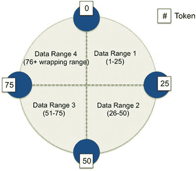
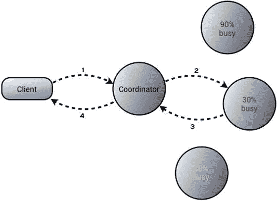
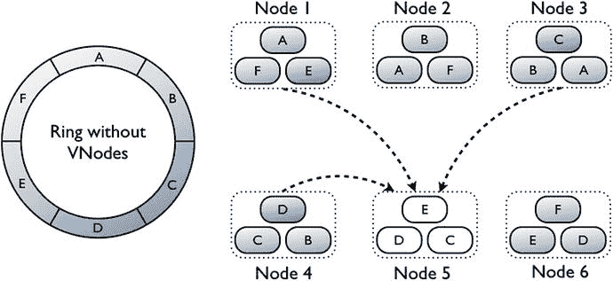
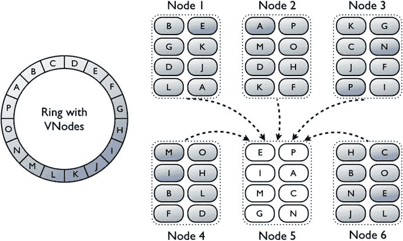

# Cassandra 一致性级别与配置

## 基于仲裁的读一致性级别（强一致性）

存在两种基于仲裁的一致性级别：

*   `QUORUM` ：仅当来自所有数据中心的仲裁副本响应后，才返回查询结果，从而提供强一致性。在大多数副本响应后，数据库会将具有最新时间戳的值返回给客户端。如果数据库发现某些节点的数据过时，它会对持有过时数据的副本执行读修复。
*   `LOCAL_QUORUM` ：仅当本地（当前）数据中心的仲裁节点响应后，才返回查询结果，从而提供强一致性。你只能在配置了 `NetworkTopologyStrategy` 副本放置策略和适当配置了 snitch 的多数据中心集群中使用此级别。

> 注意
>
> `QUORUM` 读一致性级别意味着你总是能检索到正确的数据，即使其中一个副本宕机。

## ONE、TWO、THREE 和 LOCAL_ONE 一致性级别（弱一致性）

`ONE` 一致性级别以牺牲一致性为代价提供了最高的可用性。Cassandra 会立即从最近的副本返回查询结果。代价是读取过时数据的可能性很高。数据库也会根据其他副本中的数据检查此数据，如果任何副本过时，数据库会启动读修复以使其他副本保持一致。

> 注意
>
> 在 `ONE` 一致性级别下，提供读取服务的副本可能没有数据的最新版本。

`TWO`、`THREE` 和 `LOCAL_ONE` 一致性级别与 `ONE` 设置类似：

*   `TWO` 级别从两个最近的副本返回最新数据。
*   `THREE` 级别从三个最近的副本返回最新数据。
*   `LOCAL_ONE` 一致性级别与 `ONE` 级别类似，但返回本地数据中心中最近副本的数据。

## 串行一致性设置

你可以配置两种 `SERIAL` 一致性级别。第一种 `SERIAL` 允许你读取用户正在进行的轻量级事务所涉及列的最新值。`SERIAL` 一致性级别允许读取最新的数据，包括可能未提交的数据。

`LOCAL_SERIAL` 一致性级别与 `SERIAL` 级别类似，但仅限于数据中心内。你使用此级别来为轻量级事务获得线性一致性。

> 注意
>
> 你配置一致性级别是为了在可用性和数据准确性之间进行权衡。

### 配置一致性级别

你可以在会话级别或针对每个读写操作配置一致性级别。

如果你使用 cqlsh，可以使用关键字 `CONSISTENCY` 为当前会话中运行的所有查询设置一致性级别。客户端应用程序通过其驱动程序设置一致性级别。

读写操作的默认一致性级别是 `ONE`。下面的示例说明了这一点：

```
cqlsh> CONSISTENCY;
Current consistency level is ONE.
cqlsh>
```

之前，你已经了解了可以设置的各种一致性级别。以下是一些展示如何设置各种一致性级别的例子：

*   设置 `QUORUM` 一致性级别，强制集群中大多数节点在数据库认为操作成功之前进行响应。

    ```
    cqlsh> CONSISTENCY QUORUM;
    ```

*   对于轻量级事务，设置 `SERIAL` 一致性级别。

    ```
    cqlsh> CONSISTENCY SERIAL;
    ```

## 三种读请求类型

协调器节点可以向副本节点发送三种类型的读请求：

*   直接读请求：协调器节点包含单个副本节点。
*   摘要请求：协调器首先联系一个副本节点，然后向你通过 `consistency level` 属性指定的节点数量发送请求。协调器发送的请求检查副本节点上的数据以确保其是最新的。如果协调器发现某些节点有陈旧数据，它会发送一个读修复请求。
*   后台读修复请求：Cassandra 在后台执行读修复，以确保协调器在摘要请求期间请求的所有行在所有参与该读请求的副本之间保持一致。

### 通过推测重试实现快速读保护

通常，在读请求期间，Cassandra 会向足够的副本发送数据请求以满足一致性级别。你可以配置表的 `speculative_retry` 属性，以利用 Cassandra 的能力：当原始副本节点不可用或响应读取请求非常慢时，使用不同的副本节点重试读请求。当你配置此功能后，即使一致性级别已经满足，Cassandra 也会向副本发送额外的读请求。

> 注意
>
> 快速读保护确保如果一个副本节点失败或异常缓慢，协调器节点会在超时间隔后自动将读请求发送到其他节点。

当你配置推测重试时，协调器节点在设定的时间过去后自动用不同的节点重试请求。通过这种推测重试读取查询的方式从副本节点故障中恢复被称为快速读保护。

你可以通过设置 `speculative_retry` 属性来配置快速读保护。此属性精确决定协调器节点何时发送额外的读请求。以下是配置此属性的所有方式：

*   `NONE`：这是默认值，指定无论延迟如何，协调器除了原始读请求外不发送任何额外的读请求。
*   `ALWAYS`：每次读取表后，协调器都会向集群中的所有其他副本节点发送额外的读请求。
*   `Xpercentile`：这告诉协调器，如果它在为 `Xpercentile` 属性设置值的特定百分比时间内没有收到副本节点的任何响应，就发送冗余读请求。例如，表的典型延迟是 60 毫秒，假设你将 `Xpercentile` 属性设置为第 80 百分位。如果副本节点在 48 毫秒（60 毫秒的 80%）内没有响应，Cassandra 会向其他副本发送冗余读请求。
*   `Nms`：在此策略下，如果协调器在 N 毫秒内没有收到副本的响应，它会发送额外的读请求。

以下是如何为表设置 `speculative_retry` 属性的一些示例：

```
cqlsh> ALTER TABLE users WITH speculative_retry =  '5ms';
cqlsh> ALTER TABLE users WITH speculative_retry = '95percentile';
```


### 不同读取一致性级别的读取请求：示例解析

本节将展示若干读取请求的示例，涵盖单数据中心和拥有两个数据中心的集群中不同的读取一致性级别。在所有情况下，副本因子均为 3。我将首先介绍单数据中心的场景，然后是拥有两个数据中心的集群场景。

#### 单数据中心

当读取一致性级别设置为 `QUORUM` 时，三个副本中的两个必须响应，读取请求才算成功。如果一行数据存在多个版本，拥有最新版本的副本将满足该读取请求。此外，必要时（如果第三个副本数据过时），数据库还会在第三个副本上启动一个读修复。

将读取一致性级别设置为 `ONE` 意味着数据库将从满足读取请求所需行的最近副本获取数据。根据三个副本之间数据是否存在差异，数据库也可能为另外两个副本启动读修复。这取决于你为表配置的 `read_repair_chance` 属性。

#### 拥有两个数据中心的集群

如果你将读取一致性设置为 `QUORUM` 且副本因子为 3，那么一个读取请求成功需要四个数据副本（这些副本可以属于任一数据中心）进行响应。数据库会检查其他副本以确保一致性，如果有任何副本数据过时，它将启动读修复以使其更新。

如果你配置的是 `LOCAL_QUORUM` 读取一致性级别，那么与协调节点位于同一数据中心的两个副本必须响应读取请求。

对于读取一致性级别 `ONE`，数据库依赖于最近的副本，而不考虑其所属的数据中心。它也可能根据你为表配置的 `read_repair_chance` 设置来启动读修复。而对于读取一致性级别 `LOCAL_ONE`，数据库会联系与协调节点在同一数据中心的最近副本。

### 测试一致性级别的性能

正如你刚才所了解的，读取和写入操作都有许多一致性级别可供选择。选择哪个一致性级别对查询和写入延迟以及系统可用性都有显著影响。

DataStax 建议你使用 CQL 的 `TRACING` 命令来测试不同一致性级别的性能。由于 `TRACING` 命令的输出会显示每个读取和写入操作的耗时，你可以在最终选定某个一致性级别之前，比较不同级别的性能表现。

要跟踪使用大数据集的查询，配置概率性跟踪是一个好方法。使用 `nodetool settraceprobability` 命令来配置概率性跟踪。完成此操作后，你可以查询 `system_traces` 键空间，如下所示：

```
cqlsh> SELECT * FROM system_traces.events;
``

在此，关于概率性跟踪对性能的影响，需要做个说明。经验表明，跟踪功能可能会显著影响数据库性能。因此，请谨慎使用此功能。

当你开启跟踪时，如果副本因子为 3，以下是你对三种一致性级别含义的理解：

*   `ONE`：处理三个副本中某一个的响应。
*   `TWO`：处理三个副本中大多数（即两个）的请求。
*   `ALL`：处理所有三个副本的响应。

要跟踪查询，你只需在开启跟踪后，运行你想用来测试不同一致性级别差异的查询语句：

```
cqlsh> TRACING on;
cqlsh> CONSISTENCY QUORUM;
cqlsh> SELECT * FROM cycling_alt.tester where id = 0;
```

同样地，你也可以跟踪 `ONE` 和 `ALL` 一致性级别带来的影响。

当你处理大数据集，或者当集群中某个节点的速度慢于其他节点时，使用 `ALL` 一致性设置的性能会比 `QUORUM` 设置更差。

### 通过批处理操作确保原子性

有时，你可能希望将一组操作（插入/更新/删除）作为一个“全有或全无”的单一操作来处理。执行一组操作，使得要么全部成功，要么全部不成功，这被称为原子操作。

Cassandra 允许你以原子方式执行批处理操作。对于单个分区，Cassandra 会自动执行批处理操作，无需你进行任何额外操作。对于跨多个分区的批处理操作，Cassandra 会使用批处理日志，这意味着你必须配置一些额外事项。

你可以将多个 `INSERT`、`DELETE` 和 `UPDATE` 语句组合成一个单一操作。批处理操作节省了客户端与服务器之间的通信，以及协调节点与副本节点之间的消息传递。

批处理操作是原子的，因为如果批处理中的任何一条语句成功，所有语句都将成功；如果其中一条失败，所有语句都将失败。数据库中的其他事务可以读取和写入被部分执行的批处理操作所影响的数据。

### 配置批处理操作

你可以让 Cassandra 将批处理操作作为“全有或全无”的事务来处理。使用批处理操作时，你可以通过 `max_mutation_size_in_kb` 属性来配置批处理中的操作数量。该属性决定了单个批处理变更（即批处理操作）的最大大小。

默认情况下，`max_mutation_size_in_kb` 属性被设置为你为 `commitlog_segment_size_in_mb` 属性所设置值的一半，该属性用于设置单个提交日志文件段的大小。`commitlog_segment_size_in_mb` 属性的默认值是 32MB。如果你决定为 `max_mutation_size_in_kb` 属性设置自定义值，你必须确保 `commitlog_segment_size_in_mb` 属性的值至少是 `max_mutation_size_in_kb/1024` 的两倍。

注意

如果批处理操作的大小大于你为 `max_mutation_size_in_kb` 属性配置的值，解决方法并非一味增大提交日志段的大小。问题可能出在低效的数据查询访问方式或错误的数据模型上。

### 单分区和多分区的批处理操作

DataStax 指出，多分区批处理操作存在性能问题。你仅应在确实需要确保原子性时才诉诸多分区批处理操作。在多分区批处理操作中，协调节点可能成为操作期间的瓶颈。批处理操作涉及的分区数量越多，因批处理导致的延迟就越高。

涉及向多个分区写入的批处理操作还要求 Cassandra 访问所有这些节点，从而增加了写入操作的延迟。随着分区数量的增长，写入延迟也会增加。

以下是一个示例，展示了在单个原子操作中执行三次 `INSERT` 操作的批处理。你希望这三条 `INSERT` 语句要么全部生效，要么全不生效。你以 `BEGIN BATCH` 子句开始批处理操作，并以 `APPLY BATCH` 子句结束。

```
cqlsh:cycling> begin batch
... INSERT INTO cycling.cyclist_expenses (cyclist_name, balance) VALUES ('Vera ADRIAN', 0) IF NOT EXISTS;
... INSERT INTO cycling.cyclist_expenses (cyclist_name, expense_id, amount, description, paid) VALUES ('Vera ADRIAN', 1, 7.95, 'Breakfast', false);
... INSERT INTO cycling.cyclist_expenses (cyclist_name, balance) VALUES ('Vera ADRIAN',7.95);
... apply batch;
[applied]

True
cqlsh:cycling>
```

如果批处理操作成功，你将看到一个显示 `True` 的确认信息。如果它失败了，你将看到如下所示的确认信息：

```
[applied]

False
```

由于所有 `INSERT` 语句都写入同一个分区，因此这个批处理写入操作是高效的。


### 何时适用批处理操作

仅在必须确保一组执行`插入`/`更新`/`删除`操作的原子性时，才考虑使用批处理。仅涉及单个分区的写操作在性能方面没有问题。

即使在涉及多个分区的情况下，如果操作只包含少量的插入或更新，你也可以通过批处理这些操作来确保一致性。

### 轻量级事务

有时，你可能希望按顺序读写数据，例如在处理银行交易时，需要谨慎处理借记和贷记。Cassandra 提供了轻量级事务来管理事务中的并发操作。它使用 Paxos 共识协议来实现轻量级事务。Paxos 协议是一种算法，允许集群中的节点就提议达成一致，而无需主节点来协调事务。Paxos 是传统两阶段提交（用于协调分布式事务）的一种替代方案。

关系型数据库使用多种隔离级别，包括可串行化隔离级别。Cassandra 使用线性一致性来实现 Paxos 协议。线性一致性产生的结果与关系型数据库提供的传统可串行化级别相似。

Cassandra 使用一种称为比较并设置 (`CAS`) 的事务操作来实现线性一致性。Cassandra 比较副本数据，并将任何过时的数据设置为数据库中最一致的值。

### 执行轻量级事务

使用轻量级事务的一个合适场景是，当你必须插入唯一数据（例如用户标识号）时。

Cassandra 允许你使用 `IF` 子句来发出 `INSERT` 和 `UPDATE` 语句，以支持轻量级事务。例如，你可以插入一个新的自行车手及其 ID 号，如下所示：

```
cqlsh> INSERT INTO cycling.cyclist_name (id, lastname, firstname)
VALUES (4647f6d3-7bd2-4085-8d6c-1229351b5498, 'KNETEMANN', 'Roxxane')
IF NOT EXISTS;
```

以下语句展示了如何通过在对数据库中已存在数据的操作末尾添加 `IF` 子句，来执行一次轻量级 `CAS` 操作：

```
cqlsh> UPDATE cycling.cyclist_name
SET firstname = 'Roxane'
WHERE id = 4647f6d3-7bd2-4085-8d6c-1229351b5498
IF firstname = 'Roxxane';
```

### 轻量级事务的工作原理

Cassandra 将 Paxos 协议与正常的读写操作交织在一起。轻量级事务不会阻塞正常的读操作和写操作，但它会阻塞其他轻量级事务。

由于混合使用轻量级事务和正常的读写操作可能导致错误，因此你必须对读操作和写操作都使用轻量级事务。例如，以下操作集将失败：

```
DELETE ...
INSERT ... IF NOT EXISTS
SELECT ...
```

另一方面，以下操作集将正常工作：

```
DELETE ... IF EXISTS
INSERT ... IF NOT EXISTS
SELECT ...
```

### 使用轻量级事务时的注意事项

由于实现 Paxos 协议涉及提议者和接受者之间发生的一系列动作，因此提议轻量级事务的节点与参与事务的其他副本之间会进行多次往返通信。这显然会对性能产生不利影响，因此应谨慎使用轻量级事务，仅在事务操作间的一致性至关重要时才使用。

## 总结

关于 Cassandra 数据建模的关键点在于：查询是一切的核心。你根据预期数据库需要处理的查询来设计表、索引等数据库结构。

理解最终一致性原理、各种读写级别及其含义，有助于你做出最佳选择，以满足应用程序的需求。

# 5. Cassandra 架构

Cassandra 具有几个有趣的架构特性，使其有别于关系型数据库。本章介绍 Cassandra 架构。你还将了解 Cassandra 存储引擎以及数据库如何存储其数据。

本章解释了节点间用于通信的 gossip 协议。读修复和写修复是 Cassandra 提供一致性的方式的一部分。你将学习故障检测和恢复。你将了解提示移交，这是一个确保故障节点接收到其宕机期间发生的所有修改的功能。你还将了解读修复和手动反熵修复。

本章解释了虚拟节点，这是对在集群节点间分配数据的传统方式的重大改进。你将了解各种分区和复制策略，如 `SimpleStrategy` 和 `NetworkTopologyStrategy`，以及如何更改复制策略。你将学习如何选择可用的数据分区策略，以帮助 Cassandra 在集群节点间分配数据。

Cassandra 使用集群的拓扑结构来决定存储数据的位置以及如何最佳地响应查询。为此，它尝试在多个数据中心存储副本以确保可用性。它还将查询发送到本地数据中心以最大限度地降低延迟。

探测器确定 Cassandra 写入和读取的数据中心和机架，对读活动至关重要。你将了解 Cassandra 提供的几种类型的探测器，例如 `GossipingPropertySnitch` 和 `Ec2Snitch`。

### 基本集群术语

Cassandra 使用一个点对点系统，数据分布在集群中的多个节点上。集群中的节点使用 gossip 协议定期交换信息。对于每个客户端操作，集群中的一个节点充当协调者或代理，并确定哪些节点应处理客户端请求。

Cassandra 对数据进行分区和复制。它使用提交日志确保数据持久性，并将数据从提交日志写入名为 `memtable` 的内存结构，然后再写入磁盘上的 `SSTable` 数据文件。

数据库会定期通过丢弃过时数据来压缩数据。为确保数据一致性，Cassandra 采用了多种类型的修复机制。

当你在本章及后续章节中处理 Cassandra 架构时，最好刷新一下对一些关键术语的理解。

*   `数据中心` 是集群中为复制目的而配置在一起的一组相关节点。你可以拥有虚拟或物理数据中心。一个数据中心不能跨越物理位置。拥有多个数据中心的目的是防止其他数据节点对数据节点中的事务产生不利影响，并降低延迟。你可以创建包含特定节点类型的数据中心，例如事务型、分析型、搜索型和图类型。
*   `机架` 是一组逻辑上彼此靠近的节点，通常位于物理机器的同一物理机架内。数据中心是通过网络连接的机架的逻辑分组。

注意

Cassandra 自带一个名为 `RAC1` 的默认机架和一个名为 `DC1` 的默认单数据中心。


集群是 Cassandra 数据库的最大部署单元，由位于一个或多个位置的一组节点构成。在 AWS 中，这些位置即多个可用区。一个集群可以仅包含单个节点、单个数据中心或多个数据中心。集群有时也被称为**环**，因为 Cassandra 通过将数据排列在环中来存储数据。

Cassandra 节点是 Cassandra 集群中位于某个具体位置（一台服务器）的一部分，用于存储数据。具体来说，它根据你指定的分区算法来存储经过分区的数据。

提交日志是一种预写式事务日志，Cassandra 将其存储在集群的每个节点上。Cassandra 首先将数据写入仅可追加的提交日志，然后分批或定期将数据刷写到磁盘。提交日志在数据恢复过程中扮演着关键角色。一旦数据库将数据刷写到磁盘，就可以对提交日志进行归档、删除或重用。

内存表是一种内存结构，它是可通过键查找的数据行的缓存。每个内存表存储特定表的数据，当提交日志变满或达到特定间隔（在表级别设置）时，数据库会将内存表的内容刷写到磁盘。

SSTable（排序字符串表）是一个逻辑实体，由磁盘上的多个文件组成。SSTable 是不可变的，且是仅可追加的结构。当 Cassandra 将内存表刷写到磁盘时，就会创建一个 SSTable。Cassandra 按键对内存表进行排序，并按顺序写入它们以创建 SSTable。这就是 Cassandra 写入速度非常快的原因；它只涉及提交日志的追加和用于刷写数据的顺序写操作。

键空间是一个逻辑容器，包含一个或多个表，类似于关系数据库中的模式。你将数据存储在属于特定键空间的表中。所有数据对象（如表）都必须属于一个键空间。
*   键空间定义了 Cassandra 如何在集群节点上复制数据。一个键空间具有若干存储属性。键空间还决定了你存储在其中的数据的 RF（副本因子）。你可以在创建键空间时或之后，在键空间级别定义数据复制策略。
*   为每个应用程序使用单独的键空间是一个好主意。

CQL 表（又称列族）是驻留在键空间中的逻辑实体。表由有序的列组成，数据库按行获取这些列。创建表时必须定义主键。

### 副本放置策略

Cassandra 允许你通过在集群节点上存储多个数据副本来复制数据。你可以采用两种策略来让 Cassandra 知道应该如何复制数据：
*   `SimpleStrategy`用于原型设计。
*   `NetworkTopologyStrategy`用于生产环境。

### Cassandra 如何存储数据

由于 Cassandra 是一种键值存储，它将其数据组织成由若干列（代表值）组成的行。一行属于单个节点，Cassandra 将该行复制到集群中的其他节点。

Cassandra 对每行的键进行哈希运算，以确定应将该数据存储在环中的哪个节点。它将集群本身组织成一个节点环，每个节点存储相等数量的哈希值。

假设你正在运行一个四节点 Cassandra 集群。你有一个键空间，并选择副本因子为 3。假设你在键空间中创建了一个表并向其中插入数据。每次 Cassandra 插入数据时，都会对该行的键值进行哈希运算，以找出负责存储该行的节点。

为简单起见，我们假设哈希值范围是 1-100，尽管实际上哈希值使用 128 位或更大的值。由于集群中有四个节点，节点间划分哈希值的方式如下：
*   节点 1：哈希值 1-25
*   节点 2：哈希值 26-50
*   节点 3：哈希值 51-75
*   节点 4：哈希值 76-100

图 5-1 展示了 Cassandra 如何将哈希值分配给四个节点。



*图 5-1：节点如何负责各种哈希值*

假设你插入的第一行被 Cassandra 哈希后，哈希值为 65。如图所示，该行属于节点 3，Cassandra 还会将数据复制到节点 1 和节点 2。为什么是节点 1 和 2？原因是复制总是以环上的顺时针方向进行。

假设你插入的下一行哈希值为 48。它属于节点 2，Cassandra 会将该行复制到节点 3 和节点 4。

这就是 Cassandra 在集群节点间存储数据的核心原理。

理想情况下，集群中的所有节点都拥有相等的哈希值份额，从而也拥有相等的数据集份额。这就是为什么确保为表选择的`主键`具有高基数（许多值）非常重要。这样，行会分散在集群的所有节点中，而不是以倾斜的方式存储，避免某些节点承担比其他节点更多的数据集责任。这会导致存储驱动器上出现热点，因为在读取操作期间，较少的节点在承担大部分工作。


## Gossip 协议及其对节点通信的帮助

Cassandra 使用 **gossip** 协议，节点通过该协议交换自身及其所知其他节点的状态信息，以发现集群中所有节点的位置和状态信息。Gossip 协议假设网络功能并非完美，这在分布式网络系统中很常见，并用于分布式数据库中的数据复制。

与人类八卦类似，集群中的对等方（节点）会选择它们希望与之交换信息的节点。`Gossiper` 类维护着一个存活节点列表，从而使 gossip 有助于故障检测。

Gossip 进程频繁运行（每秒一次），将一个节点的状态消息与最多三个其他节点的状态消息进行交换。当节点启动时，它会向 gossiper 注册，以接收来自集群中其他节点的端点状态信息，如下所示：

```
INFO  [main] 2017-06-24 12:19:21,997 MessagingService.java:733 - Starting Messaging Service on ubuntu/192.168.159.130:7000 (ens33)
INFO  [HANDSHAKE-/192.168.159.129] 2017-06-24 12:19:22,199 OutboundTcpConnection.java:510 - Handshaking version with /192.168.159.129
INFO  [GossipStage:1] 2017-06-24 12:19:22,326 Gossiper.java:1056 - Node /192.168.159.129 is now part of the cluster
INFO  [RequestResponseStage-1] 2017-06-24 12:19:22,380 Gossiper.java:1020 - InetAddress /192.168.159.129 is now UP
INFO  [main] 2017-06-24 12:19:23,202 StorageService.java:705 - Loading persisted ring state
INFO  [main] 2017-06-24 12:19:23,218 StorageService.java:818 - Starting up server gossip
INFO  [GossipStage:1] 2017-06-24 12:19:24,596 Gossiper.java:1056 - Node /192.168.159.129 is now part of the cluster
INFO  [RequestResponseStage-1] 2017-06-24 12:19:24,601 Gossiper.java:1020 - InetAddress /192.168.159.129 is now UP
INFO  [main] 2017-06-24 12:19:31,610 CassandraDaemon.java:725 - No gossip backlog; proceeding
```

而当节点无法获取 gossip 信息时，它也会通过抛出异常让你知道：

```
INFO  [main] 2017-06-24 12:06:00,302 MessagingService.java:733 - Starting Messaging Service on
ERROR [main] 2017-06-24 12:06:31,476 CassandraDaemon.java:752 - Exception encountered during startup
java.lang.RuntimeException: Unable to gossip with any seeds
WARN  [StorageServiceShutdownHook] 2017-06-24 12:06:31,564 Gossiper.java:1514 - No local state, state is in silent shutdown, or node hasn't joined, not announcing shutdown
```

Gossip 进程可以是直接的（其他节点向一个节点 gossip），也可以是间接的（节点从其他节点获取信息，而这些信息可能源自更多其他节点）。由于每个节点不仅交换自身状态信息，也交换与之通信的其他节点的状态信息，因此所有节点都将非常迅速地知晓集群中所有其他节点的状态。

当节点相互交换 gossip 信息时，节点的最新状态会覆盖旧的状态信息。

当 gossiper 发现某个端点没有响应时，它会将该端点在其列表中标记为死亡并记录该信息。

Cassandra 使用一种称为 **Phi Accrual Failure Detection** 的复杂算法来检测节点故障。该算法不使用简单的节点心跳来表明其存活，而是使用一个**怀疑级别**来确定节点可用性。

心跳提供一个简单的“是/否”标准来判断节点是否存活，而故障检测则使用一个连续的数据范围来做出判断。例如，如果一个节点偶尔因为网络波动而无法接受连接，该节点不会立即被列入死亡节点列表。因此，该算法与现实网络条件相符，并能真实反映节点的健康状况。使用此算法，数据库在节点故障发生后 10 秒内即可检测到。

### 配置 Gossip 设置

实际上，你不需要做任何特别设置来配置 gossip，因为在集群中启动 Cassandra 节点时，所有必要的属性都已设置好。启动节点时，你需要配置以下属性，它们都有助于节点了解应该联系哪些节点以获取其他节点的 gossip 信息。这些属性还设置了端口和其他相关的 IP 地址或主机名，以使 Cassandra 能够将节点相互连接。

*   `cluster_name`: 节点所属集群的名称。
*   `listen_address`: Cassandra 必须绑定的 IP 地址/主机名，以便将此节点连接到集群中的其他节点。或者，你可以指定 `listen_interface` 属性来替代 `listen_address`。

**提示**

每个数据中心指定多个种子节点，这样在引导节点时，gossip 就不必与不同数据中心的节点通信。

*   `seed_provider`: 此属性允许你指定一个主机（IP 地址）列表，gossip 依靠它们来了解环的拓扑结构。你不需要将所有节点都指定为种子节点，因为这会降低 gossip 性能。DataStax 建议使用少量种子，例如每个数据中心三个节点。你应该为集群中的所有节点指定相同的节点列表。如果你的集群有多个数据中心，请包含来自每个数据中心的至少一个节点作为种子提供者。
*   `storage_port`: 这是节点间通信端口，它在集群中的所有节点上必须相同。

### 种子节点与 Gossip

在第 3 章中，你了解了在 `cassandra.yaml` 文件中指定的种子节点。种子节点其实并不那么关键，因为它们的故障不会构成集群的单点故障。它们扮演的唯一角色是为新加入集群的节点引导 gossip 进程。

你必须确保为集群的所有节点指定一组相同的种子节点。这一点在首次启动节点时尤为重要。

不建议将每个节点都设为种子节点；这只会对 gossip 性能产生不利影响。理想情况下，你的种子列表应该很小，每个数据中心大约三个节点。如果你有多个数据中心，请在种子列表中包含来自每个数据中心的至少一个节点。

如果你每个数据中心包含两到三个 gossip 种子节点，而不是只指定一个种子节点，这可以保护你免受单个节点故障的影响。否则，当单个种子节点发生故障时，在引导节点过程中，gossip 将需要与不同的数据中心进行通信。


### 故障检测与恢复

Cassandra 从八卦状态确定节点的状态（在线/离线），并尽力避免将客户端请求发送到不可达的节点。

Cassandra 使用一种**累积检测机制**来确定标记节点为故障的阈值。此阈值考虑网络性能、工作负载和历史数据，以帮助计算节点不可用性的关键阈值。

所有节点都使用故障检测机制来检测集群中其余节点的故障。节点利用八卦消息的延迟，通过对来自其他节点的八卦消息到达时间使用滑动窗口来实现。

您可以通过调整 `cassandra.yaml` 文件中的 `phi_convict_threshold` 属性来配置故障检测机制。此属性的默认值为 **8**。如果将此属性的值设置得较高，集群可能会错过短暂的故障。另一方面，较低的值会增加将无响应节点标记为下线节点的可能性。

Amazon EC2 频繁遇到网络拥堵问题。在此类以及其他可能遇到不可用网络的环境中，您可以将 `phi_convict_threshold` 属性的值提高到 **10** 或 **12**，以避免误导性的故障检测。一般来说，据 DataStax 称，**5** 到 **12** 之间的值在大多数情况下是足够好的。

间歇性节点故障（如由网络中断引起的故障）是短暂的，不会导致节点从环中移除。其余节点将定期尝试联系不可达的节点。

当一个不可达的节点重新上线时，Cassandra 使用诸如提示交接和手动修复之类的修复机制，确保该节点能追上其维护的副本数据所错过的写入。

### 修复节点

Cassandra 是一个分布式数据库，随着时间的推移，其中一个副本中的数据可能与其他副本的数据产生分歧。节点修复是一个纠正副本之间不一致性的过程，最终所有节点将拥有相同的数据。作为管理员，节点修复是您的关键职责之一，也是您需要定期执行的操作。

Cassandra 提供三种类型的修复，其中一些涉及您的手动干预：

*   提示交接
*   读取修复
*   反熵修复

以下部分简要解释了各种修复类型。

### 提示交接

提示交接是一个过程：当一个节点作为协调器，无法在另一个节点上执行写入时，它会将数据保存为一组**提示**。当之前不可达的节点稍后变为可用时，协调器节点会移交存储的提示，以帮助另一个节点追上错过的写入。

提示包含关于当时发送给不可用节点的写入请求的数据。提示就像是围绕更改操作的一个包装器，它告诉数据库需要将该数据重放到写入时不可用的节点上。

数据库为每个需要写入数据的分区创建一个单独的提示。一旦协调器节点通过八卦发现故障节点已重新上线，它就会将提示移交给恢复的节点，以写入错过的数据。因此，提示有助于缩短故障节点重新上线后达到一致性所需的时间。

提示交接背后的理念是通过使集群在即使一个或多个节点不可用时也能执行其正常的写入量，来确保集群正常运行。因此，此功能直接贡献了 Cassandra 备受赞誉的高可用性。在一致性不是必需的情况下，提示允许 Cassandra 提供完整的写入可用性。它们还在诸如网络故障等临时中断后增强了响应一致性。

您可以禁用提示交接，以避免节点可能长时间宕机的情况。这将防止数据库在故障节点重新上线时不得不向其发送大量提示。

在满足一致性级别时，提示不计入一次写入。然而，一致性级别 **ANY** 接受提示作为满足读取操作要求的条件。即使数据库仅写入提示，该写入也会被视为成功。

#### 提示是什么

Cassandra 将所有提示存储在本地每个节点的提示目录中。除了数据本身，每个提示还包含一些用于标识提示的属性。一个提示包含以下内容：

*   下线或不可用节点的 ID
*   提示 ID，这是数据的**时间 UUID**
*   带有 Cassandra 版本的消息 ID
*   以 **blob** 形式存储的数据

数据库每 **10** 秒将所有提示刷新到磁盘，以保持提示的时效性。一旦下线节点重新上线，Cassandra 将所有数据写入该节点，然后删除提示文件。

当 Cassandra 尝试写入一个它知道已下线或没有响应写入请求的副本节点时，协调器节点会在其运行的节点上，将提示存储在 `system.hints` 表中。当八卦机制通知协调器节点故障节点已恢复时，协调器节点会将与每个提示对应的数据行发送给恢复的节点。

对于短暂中断，协调器节点每十分钟检查一次是否有因间歇性故障而可能被错过、且未被故障检测器通过八卦捕获的写入。

#### 提示交接如何工作

要使提示交接工作，首先必须启用它。由于 `cassandra.yaml` 文件中 `hinted_handoff_enabled` 属性的默认值为 **true**，因此您无需执行任何操作，除非您之前因某些原因禁用了此功能。

您还可以通过传递数据中心列表来按数据中心启用提示交接，如下所示：

```
hinted_handoff_enabled: DC1, DC3
```

您可以指定一个不执行提示交接的数据中心列表；也就是说，通过将列入黑名单的数据中心列表作为值传递给 `hinted_handoff_disabled_datacenters` 属性，来禁用集群中某些数据中心的功能，如下所示：

```
hinted_handoff_disabled_datacenters: - DC1 - DC2
```

#### 管理提示交接

默认情况下，数据库将提示存储在以下位置的名为 `hints` 的目录中：

```
$CASSANDRA_HOME/data/hints
```

您可以通过设置 `hints_directory` 属性为 `hints` 目录指定不同的位置。

您可以通过设置 `max_hints_file_size_in_mb` 属性（默认为 **128MB**）来配置单个提示文件的最大大小（以兆字节为单位）。您可以通过设置 `hints_compression` 参数让数据库压缩提示文件，该参数默认为 **LZ4Compressor**。除了 LZ，数据库还支持 **Snappy** 和 **Deflate** 压缩算法作为提示文件的压缩器。

#### 检查提示交接状态

您可以通过执行 `nodetool` `statushandoff` 命令来查看提示交接的状态：

```
$ nodetool  statushandoff
```

该命令的选项包括主机名、端口号和密码。以下是一个示例：

```
$ nodetool statushandoff
Hinted handoff is running
$
```

#### 删除所有提示

您可以使用 `nodetool` `truncatehints` 命令删除本地节点上或一个或多个端点的所有提示：

```
$ nodetool  truncatehints --  ...
```

`endpoints` 选项使您能够指定要删除提示的一个或多个 IP 地址或主机名。


## 禁用和启用数据中心的提示

您可以使用 `nodetool enablehintsfordc` 命令为数据中心启用提示，该命令的语法如下：

```
$ nodetool [options] enablehintsfordc [--] <datacenter>
```

`datacenter` 选项用于指定您要为其启用提示的数据中心。以下是调用此命令的示例：

```
$ nodetool -u username -pw password enablehintsfordc DC1
```

之前，我解释了如何在启动集群时配置 `hinted_handoff_disabled_datacenters` 属性来将一个或多个数据中心列入黑名单。您可以运行 `nodetool enablehintsfordc` 命令，为在启动时列入黑名单的数据中心启用提示。

如您所料，您可以通过运行 `nodetool disablehintsfordc` 命令来禁用某个数据中心的提示，如下例所示：

```
$ nodetool -u username -pw password disablehintsfordc DC1
```

通常，当某个特定数据中心宕机但集群其余部分运行正常时，您需要为其禁用提示。在将数据中心故障转移时，也可以这样做。

## 调优暗示交接

您可以控制存活节点向已恢复节点发送提示的速率。这通过设置 `sethintedhandoffthrottlekb` 属性（单位为 KB/秒）来实现。该属性并非设置从正常节点向恢复节点传输提示的速率，而是设置每个传递线程在传递一个提示后的最大睡眠间隔。

您可以通过以下方式设置 `sethintedhandoffthrottlekb` 属性：

```
$ nodetool sethintedhandoffthrottlekb 4096
```

此示例展示了如何将暗示交接节流设置为每个传递线程 4096 KB/秒。

集群中的节点越多，提示之间的睡眠间隔就越小，因为来自不同节点的所有传递线程共享最大间隔。节点越多，同时传递的提示就越多，因此提示传输之间的实际睡眠间隔就越低。

在多数据中心部署中，您可以通过配置 `max_hints_delivery_threads` 属性（默认值为 2）来加速提示交接。通过提高此值，您可以让数据库在跨数据中心的提示交接过程中使用更多线程来传递提示。

## 停止写入新提示

当节点长时间宕机时，协调器节点将不再写入新的提示。您可以通过 `cassandra.yaml` 文件中的 `max_hint_window_in_ms` 属性来配置此时间段。默认情况下，此时间段设置为 3 小时。

Cassandra 对数据库生成提示的时间段施加限制的原因是，为了确保当数据库在节点长时间离线后尝试将所有数据写入该节点时，大量存储的提示不会导致资源紧张。

`write_request_timeout_in_ms` 属性指定了协调器在超时之前等待写操作完成的时间（以毫秒为单位）。默认值为 2000 毫秒。

## 读修复

当 Cassandra 在读取操作期间修复被查询的节点时，它会执行读修复。读修复的范围取决于您为数据库配置的副本因子。如果您将 `CONSISTENCY` 级别配置为 `ONE` 或 `ANY`，则协调器节点仅查询单个副本节点。但是，如果您将 `CONSISTENCY` 级别设置为大于 `ONE`，则对于每个读取请求，协调器会联系多个副本节点。

在读取过程中，协调器向拥有副本的节点之一（副本节点）发送请求。同时，对于您配置了 `CONSISTENCY` 级别大于 `ONE` 的所有其他副本节点，它还会发送摘要请求。

如果所有节点都返回相同（一致）的数据，协调器节点会将请求的数据返回给客户端。但是，如果某些副本节点的数据不同，协调器会将数据的最新版本写入到那些持有过时副本的副本节点。

### 随机读修复

Cassandra 可以选择自行随机对表的所有副本执行读修复。副本因子与此类随机读修复无关。

您为表设置的 `read_repair_chance` 属性决定了数据库执行随机读修复的频率。此属性设置了成功的读取操作触发读修复的概率。此属性的默认值为零，您必须将其设置为零到一之间的值。

`read_repair_chance` 属性决定了整个集群中发生读修复的概率，而一个相关的表级属性 `dclocal_read_repair_chance`，则决定了对与协调器在同一数据中心的副本进行读修复的概率。

对于所有压缩策略（已弃用的 `DataTieredCompcationStrategy` 除外），建议将 `read_repair_chance` 属性的值设置为 0.2，而对于后者则应设置为零。然而，实际效果可能因情况而异，因此在设置此属性的值时请谨慎行事。

## 快速读保护

Cassandra 的快速读保护功能使其能够容忍节点故障而不丢失任何一个请求。如果一个节点丢失，在发生故障检测之前，该失效节点无法处理任何客户端请求。但是，如果您启用了快速读保护，读流量只会出现短暂的下降。

### 为何快速读保护有帮助

Cassandra 采用嗅探器将请求发送到负载最低的副本（即最有可能最快响应读取请求的副本）。Cassandra 将正常的读取请求发送到刚好满足一致性级别所需的节点数量。

Cassandra 在每种情况下执行的读取请求数量不同，具体数量取决于您配置的一致性级别。例如，以下是 Cassandra 在各种一致性级别下执行的读取请求数量：

*   一致性级别 `ONE`：一个读取请求
*   一致性级别 `QUORUM`：两个读取请求

图 5-2 展示了协调器如何向节点发送读取请求。



**图 5-2**
协调器如何向集群中的“最佳”节点发送读取请求

`speculative_retry` 属性使您能够配置一个触发器，当请求未在预期时间内得到满足时，触发额外的读取请求。

通过监控未完成的读取请求，快速读保护功能使得协调器能够在目标副本比预期慢时，向其他副本发送冗余请求。也就是说，即使在满足一致性级别要求之后，数据库仍会向其他副本节点发送额外的读取请求。快速读保护在节点故障、或其他导致节点吞吐量减慢的事件、或因集群范围内的、完全的、未节流的压缩而对吞吐量产生不利影响时很有帮助。


#### 配置快速读取保护

您可以通过在表级别设置 `speculative_retry` 属性来配置快速读取保护，可以在创建表时设置，也可以在之后设置。`speculative_retry` 属性会覆盖正常的读取超时（当您将 `read_repair_chance` 属性设置为非 1.0 的值时），并发出另一个读取请求。

`speculative_retry` 属性可接受以下值：

*   `ALWAYS`：协调节点在每次读取此表后，总是向所有副本发送额外的读取请求。
*   `NONE`：协调节点在读取此表后，从不发送额外的读取请求。
*   `Xpercentile`：如果表的延迟高于正常水平，则协调节点发送额外的读取请求。也就是说，当表正常读取延迟的百分比耗尽后，会触发额外的读取。例如，如果表的平均延迟为 60 毫秒，协调节点会在等待 48 毫秒（60 毫秒的 80%）后发出额外的读取请求。
*   `Nms`：如果协调节点在 `N` 毫秒内未从目标节点收到任何结果，则发送额外的读取请求。

`speculative_retry` 属性的默认值是 `99percentile`。您可以在创建表时设置 `speculative_retry` 属性，如下所示，其中使用 `3ms` 作为触发额外读取请求的标准：

```
speculative_retry = '3ms'
```

您也可以在创建表后配置快速读取保护：

```
cqlsh> ALTER TABLE users WITH speculative_retry = '10ms';
cqlsh> ALTER TABLE users WITH speculative_retry = '90percentile';
```

由于 `ALL` 一致性级别要求来自所有副本的响应，因此您无法使用快速读取保护。

通常，集群中的节点越多，快速读取保护对节点的影响越小。这是通过使用虚拟节点在整个集群中分散复制的一个好处。

### 反熵修复

由于频繁的数据删除和节点崩溃，数据可能会随时间变得不一致。在这些情况下，您需要通过执行反熵修复来维护节点。您需要使用 `nodetool repair` 命令手动执行此修复。反熵修复是管理员的一项常规维护任务。

#### 反熵修复的工作原理

在反熵修复期间，Cassandra 会比较所有副本，并将这些副本更新到数据的最新版本。Cassandra 使用 Merkle 树（二进制哈希树），以便可以独立检查数据，而无需协调节点下载整个数据集。

当发起节点检测到参与的对等节点上的 Merkle 树存在差异时，它会交换配置范围的数据，Cassandra 会将新数据写入 SSTable。

您可以在单个节点或集群的所有节点上运行 `nodetool repair` 命令。发起反熵修复的节点将作为修复操作的协调节点。

虽然您可以让 Cassandra 通过比较节点的所有 SSTable 来执行节点的完全修复并进行修复，但默认情况下数据库执行增量修复。增量修复依赖于显示 SSTable 行已修复或未修复的元数据。它会持久化已修复的数据，并仅为那些尚未修复的 SSTable 构建 Merkle 树。

### 执行手动（反熵）修复

您必须定期执行反熵节点修复，尤其是在数据库中频繁删除时。反熵修复命令的目的有两个：

*   确保集群所有节点上的数据一致性。
*   修复已关闭节点上的数据不一致。

使用 `nodetool repair` 命令修复一个或多个表。当您执行完全修复时，Cassandra 会将 SSTable 标记为已修复。运行 `nodetool repair` 命令是进行例行维护，而不是修复已关闭的节点。

注意

在集群中进行任何拓扑更改后，您不应运行 `nodetool repair` 命令。

`nodetool repair` 命令有几个参数，如下所示：

```
$ nodetool [(-h  | --host )] [(-p  | --port )]
[(-pw password | --password password)]
[(-pwf passwordFilePath | --password-file passwordFilePath)]
[(-u username | --username username)] repair
[(-dc specific_dc | --in-dc specific_dc)...] [(-pl | --pull)]
[(-dcpar | --dc-parallel)] [(-et end_token | --end-token end_token)]
[(-full | --full)]
[(-hosts specific_host | --in-hosts specific_host)...]
[(-j job_threads | --job-threads job_threads)]
[(-local | --in-local-dc)] [(-pr | --partitioner-range)]
[(-seq | --sequential)]
[(-st start_token | --start-token start_token)] [(-tr | --trace)]
[--] [keyspace tables...]
```

在以下部分中，我将展示在运行 `nodetool repair` 命令时如何配置最重要的参数。

#### 完全修复与增量修复

您可以配置 `nodetool repair` 的选项，让您以完全或增量方式执行修复。

修复的默认模式是增量修复，它的性能优于完全修复，因为数据库只需要为那些之前未修复的 SSTable 计算 Merkle 树。也就是说，数据库会跳过标记为已修复的 SSTable。通过执行频繁的增量修复，您可以使修复过程保持简短和高效。

您可以通过指定 `-full` 选项来执行完全修复。`-hosts` 选项让您指定用于修复任何不良节点的良好节点，这些节点通过 `-h` 选项指定。

完全修复可防止反压缩，即将 SSTable 拆分为两个表的过程，其中一个表包含已修复的数据，另一个包含原始数据。

#### 顺序修复与并行修复

如果您想快速完成修复并且有足够的资源可用，您可以选择执行并行修复，这意味着数据库并行修复所有数据中心。

如果您想执行并行修复，请指定 `-dcpar` 选项；您可能实际上不需要这样做，因为并行修复是默认设置。以下命令执行并行修复：

```
$ nodetool repair
```

并行修复的替代方法是顺序修复。以下 `nodetool repair` 命令在此节点上顺序修复所有键空间：

```
$ nodetool repair -seq
```

#### 分区范围修复

由于 Cassandra 会复制数据，如果您一次修复一个节点，最终可能会导致数据库多次修复相同的数据范围。您可以通过让 `nodetool repair` 命令仅修复一次特定数据范围来节省资源。

您可以通过指定 `-pr` 选项来执行分区范围修复。虽然此选项很好，但它不能与默认模式的增量修复结合使用。以下示例展示了如何通过使用节点 `10.2.2.30` 或节点 `10.2.2.31` 上的良好分区，来修复此节点上不良分区的分区范围修复：

```
$ nodetool repair -pr hosts 10.2.2.30 10.2.2.31
```

提示

DataStax 建议您在可能的情况下，在修复期间使用并行和分区范围选项。


## 限制修复操作至本地数据中心（对比集群范围修复）

默认情况下，`nodetool repair` 命令会在集群范围内运行修复过程，即在包含副本的每个节点上运行，而不论其数据中心位置。如果你有三个数据中心，副本因子为 3，那么你就是在要求修复过程构建九个 Merkel 表，这会导致你的网络和其他资源使用量激增。

你可以将修复限制在特定数据中心，或者仅限于运行修复命令的本地节点。指定 `-dc` 或 `--in-dc` 选项可以将修复限制在特定数据中心。以下示例展示了如何通过指定 `-dc` 选项将节点修复仅限制在本地数据中心 DC1：

```
$ nodetool repair -dc DC1
```

## 节点范围对比子范围修复

默认情况下，Cassandra 会修复一个节点或节点范围上的所有分区范围。或者，你也可以通过指定 `-st`（或 `-start-token`）和 `-et`（或 `-end-token`）选项来运行子范围修复。

子范围修复使你能够精确定位分区范围以修复错误，但它需要生成的令牌范围。

## 何时以及多长时间执行一次反熵修复

有几种情况需要进行节点修复，我在此总结如下。

*   将其作为常规维护操作运行，尤其是在数据库中频繁发生删除操作时。
*   修复那些包含很少被读取的数据的节点，因为它们不会经历读取修复。
*   在你从故障中恢复的节点上运行修复。
*   你还必须运行修复以恢复丢失的数据，或者当 SSTable 损坏时。

理想情况下，你应该每天运行增量修复，而较少频率地运行完整修复，例如每月一次，除非你认为需要更频繁地进行。即使你没有任何数据删除，完整修复也很有用，因为它有助于维护数据完整性。

表属性 `gc_grace_seconds` 与你修复节点的频率有很大关系。`gc_grace_seconds` 表选项指定了数据库将数据标记为删除标记（称为墓碑）后，经过多长时间该数据才有资格被删除。默认情况下，这个间隔是 24 小时（864,000 秒），这为数据库提供了在永久删除数据之前最大化一致性的时间。

Cassandra 延迟垃圾回收（通过配置 `gc_grace_seconds` 属性设置垃圾回收宽限期的值）的原因，是让不可用的节点有足够的时间恢复。如果节点在此期限内没有启动，数据库将视其为故障节点。

由于 `gc_grace_seconds` 属性的默认值是 24 小时，因此最好每天运行一次修复，以便正确处理所有已删除的数据。对于很少被删除或修改的数据，你可以为 `gc_grace_seconds` 属性设置更长的间隔。在这种情况下，你可以减少对这些表执行修复的频率。

## 迁移到增量修复

尽管增量修复比完整修复高效得多，但第一次执行该过程可能需要很长时间，因为 Cassandra 需要重新压缩所有 SSTable。DataStax 建议你一次将集群中的一个节点迁移到增量修复。以下步骤展示了如何进行迁移。

1.  禁用自动压缩。
    ```
    $ nodetool disableautocompaction
    ```
2.  将节点的 SSTable 列表保存在一个文本文件中，例如 `SSTable-names.txt`。你会在 `/var/lib/cassandra/data` 目录下找到 SSTable。在 `data` 目录中，每个键空间都有一个目录，其中包含该键空间中每个 SSTable 的文件列表。你需要列出所有包含 SSTable 数据的文件。这些文件具有以下格式：
    ```
    ---Data.db
    ```
    以下命令可帮助你列出键空间中的所有 `Data.db` 文件：
    ```
    $ find '/homeuser/Datastax-ddc-3.2.0/data/keyspace1' -iname "*Data.db*"
    ```
    你生成的 SSTable 文件列表（`.db` 文件）将如下所示：
    ```
    /data/cycling/cyclist_by_country-82246fc065ff11e5a4c58b496c707234/ma-1-big-Data.db
    /data/cycling/cyclist_by_birthday-8248246065ff11e5a4c58b496c707234/ma-1-big-Data.db
    /data/cycling/cyclist_by_birthday-8248246065ff11e5a4c58b496c707234/ma-2-big-Data.db
    ```
    将 SSTable 列表收集到文本文件中有助于你在第 5 步执行批处理以将所有 SSTable 标记为已修复。
3.  仅在此节点上运行完整修复。
    ```
    $ nodetool repair
    ```
    默认情况下，修复是完整且顺序执行的（而非并行）。
4.  关闭节点。
5.  使用 `sstablerepairedset` 命令将所有 SSTable 上的 `repairedAt` 标志设置为 `--is-repaired`。在运行增量修复之前，必须设置 SSTable 的修复状态。
    ```
    $ sudo sstablerepairedset --really-set --is-repaired -f SSTble-names.txt
    ```
    `sstablerepairedset` 工具通过将表标记为已修复或未修复来设置一个或多个 SSTable 的 `repairedAt` 状态。在这个例子中，你使用了一个包含 SSTable 文件列表的文件，但你也可以指定单个 SSTable 来标记单个表的修复状态。
6.  修复完成后，重新启动节点。

一旦你迁移了集群中的所有节点，你就可以在每个节点上执行增量修复（使用 `nodetool repair --inc` 命令）。

### 数据分布与复制

副本是表中一行的拷贝。当 Cassandra 首次将数据写入表时，也将其称为副本。

数据分布和复制是影响 Cassandra 性能的关键主题。要理解 Cassandra 如何在集群中分布数据并复制该数据的副本，你需要理解以下主题：

*   虚拟节点
*   复制策略
*   分区器与分区策略
*   探测器

在以下部分，我将解释 Cassandra 数据分布和复制的这些关键要素。


### 虚拟节点与数据所有权

你可以使用单令牌架构或虚拟节点来确定 Cassandra 如何在集群中的节点间分配数据。

数据库将集群中的数据表示为一个环，每个节点负责环数据的一个片段。Cassandra 为每个节点分配一个或多个由令牌描述的数据范围。令牌是一个 64 位整数 ID，用于标识环中的分区。令牌的取值范围从-2 的 63 次方到 2 的 63 次方减 1。令牌决定了节点在环中的位置。

环中的每个节点拥有的值范围大于前一个节点的令牌，且小于或等于其自身的令牌。这样，令牌范围就分布在位于不同机架的节点上。

虚拟节点（简称 vnodes）可以帮助你以比计算令牌更细的粒度来分配数据。Vnodes 会自动计算并为集群中的每个节点分配令牌。这消除了你通过计算和分配令牌来确定分区范围的需要。

在非 vnode 环境中，每个节点只有一个令牌，大多数情况下节点在环空间中只拥有一个连续的范围，并且通常每个节点一个范围。Vnodes 允许多个随机选择的、非连续的令牌或范围，从而为每个节点提供许多属于它的小令牌范围。

每个虚拟节点拥有令牌空间的一部分。Cassandra 将虚拟节点随机分配到物理节点上；一个物理节点不拥有连续的虚拟节点范围。Cassandra 建议在集群中使用 256 个虚拟节点，因此如果你有 16 个节点，每个物理节点将随机分配到 16 个虚拟节点，每个虚拟节点负责一个不同的令牌范围。

由于你总是在 Cassandra 数据库中复制数据，这意味着数据库将每个虚拟节点存储在多个节点上。

当添加或删除节点时，Vnodes 可以轻松地在集群中重新平衡数据。新节点会自动从其他节点接管等量的数据。同样，当一个节点离开集群时，其他节点会自行分配它的数据。一个失效节点可以快速重建，因为集群中的所有节点都会帮助将其数据分布到自身之上。

Vnodes 有助于你采用异构硬件，因为它们允许你根据节点的物理容量来改变分配给每个节点的 vnodes 比例。

你可以在整个集群中使用不同的令牌架构，不同的数据中心采用不同的架构。也就是说，一些数据中心可能使用 vnodes，而其他数据中心则不使用 vnodes。但是，单个数据中心中的所有节点必须要么启用 vnodes，要么使用单令牌架构。

### 数据如何在集群中分布

当你创建一个数据中心时，数据库会在节点间均匀分配工作负载。随着时间的推移，当你添加和/或删除节点时，数据中心的拓扑结构会发生变化，工作负载可能会变得不均衡。

令牌将数据范围分配给 Cassandra 集群中的特定节点。节点的令牌（或多个令牌）决定了该节点的数据范围。每个节点负责从其自身到其前驱节点之间的环区域。

假设令牌范围是 0 到 100，并且你集群中有四个节点。那么节点的令牌将是 0、25、50 和 75，确保每个节点负责相等的数据范围。

在早期版本（Cassandra 1.2 之前），你必须为每个节点计算并分配一个单一的令牌。图 5-3 展示了这种架构。



图 5-3

单令牌架构

如图 5-3 所示，六个节点中的每一个（`Node1`–`Node6`）都被分配了一个单一的令牌，分别是`A`、`B`、`C`、`D`、`E`和`F`。单个令牌代表环中的一个位置。每个节点将拥有通过将分区键映射到分配给该节点的数据范围内的令牌值来确定的数据。

> 提示
>
> 没有什么能阻止你将复制因子设置得大于集群中的节点数。通常这样做并不是一个明智的主意，因为它实际上并不能提供更高的可靠性。然而，在某些情况下，你可以这样做，以预期将来会添加更多节点。

假设复制因子大于 1，除了分配给它的范围之外，每个节点还将存储来自其他节点的行副本。例如，假设复制因子为 4，图 5-4 显示了每个节点如何存储来自分配给它的单一范围之外的数据。此外，每个节点在环空间中占据一个连续的分区范围。

虚拟节点允许每个节点拥有多个分布在集群中的较小分区范围，而不是单一的令牌。与单一令牌类似，Vnodes 使用一致性哈希来在集群中分布数据，而无需生成和分配令牌。图 5-4 显示了一个带有虚拟节点的环。



图 5-4

带有虚拟节点的环

如图 5-4 所示，虚拟节点是非连续的，并随机分配给节点。Cassandra 通过分区键的哈希值来确定必须将表行分配到哪个分区范围。

#### 一致性哈希

Cassandra 使用一致性哈希根据分区键对数据进行分区。这使得集群在添加或删除节点时能够以最小的数据重组在节点间分配数据。

假设你有一个四节点集群，表中有以下数据：

| 姓名 | 年龄 | 汽车 | 性别 |
| --- | --- | --- | --- |
| Jim | 36 | Camaro | M |
| Carol | 37 | BMW | F |
| Johnny | 12 | Ferrari | M |
| Suzy | 10 | Ford | F |

四个节点中的每一个都负责一个基于哈希值的数据范围。假设你使用默认的 `Murmur3 分区策略`，Cassandra 为每个分区键分配以下哈希值：

| 分区键 | Murmur3 哈希值 |
| --- | --- |
| Jim | -2245462676723223822 |
| Carol | 7723358927203680754 |
| Johnny | -6723372854036780875 |
| Suzy | 1168604627387940318 |

Cassandra 根据分区键的值确定应该在哪些节点上存储这四个值。如你所见，分区键被哈希到一个特定的范围，每个节点被分配了一个范围。在此示例中，Cassandra 将四行数据存储在四个节点中，如下所示：

| 节点 | 起始范围 | 结束范围 | 分区键 | 哈希值 |
| --- | --- | --- | --- | --- |
| A | -9223372036854775808 | -4611686018427387904 | Johnny | -6723372854036780875 |
| B | -4611686018427387903 | -1 | Jim | -245462676723223822 |
| C | 0 | 4611686018427387903 | Suzy | 1168604627387940318 |
| D | 4611686018427387904 | 9223372036854775807 | Carol | 7723358927203680754 |

> 注意
>
> 你必须为数据中心中的所有节点使用相同的令牌架构，无论是基于单令牌的还是基于 vnode 的架构。

### 如何分配令牌范围

当你启用 vnodes 时，在数据中心中有两种分配令牌范围的方法：分配算法和随机选择算法。我将在本节解释这些算法。


#### 分配算法

分配算法仅支持两种分区器 `Murmur3Partitioner` 和 `RandomPartitioner`，它致力于使用较少的令牌来平衡工作负载。你可以使用大量令牌来分散工作负载，但这也意味着你必须管理所有这些令牌。

分配算法使用 `num_tokens` 属性设置，按比例分配令牌范围。对于给定的复制因子，该算法会尝试选择令牌，以优化集群节点间的复制负载。它会为每个节点分配与节点数量成比例的负载。

提示

推荐做法是使用 8 个虚拟节点（令牌），以便在高效分布工作负载和性能之间取得理想平衡。分配算法通过利用数据中心密钥空间的复制因子，将令牌范围最优地分配到节点和机架上。如果你使用的是 Cassandra 3.4 或更低版本，你需要使用 256 个节点，或者创建并销毁虚拟节点，直到获得令人满意的数据分布。

要设置分配算法，请将 `allocate_tokens_for_local_replication_factor` 属性配置为数据中心内密钥空间的复制因子。

#### 随机选择算法

随机选择算法会将令牌范围随机分配到数据中心内的节点上。要使用此算法，你必须配置 `num_tokens` 属性。

数据库根据分配给数据中心内节点的令牌数量，将令牌范围分配给节点。例如，你可以为事务密集型数据中心将虚拟节点（令牌）的数量设置为 128。

#### 启用虚拟节点

除非集群节点的硬件配置不同，否则应在每个节点上配置相同数量的虚拟节点。如果节点的硬件容量不同，你可以为节点分配不同数量的虚拟节点，例如为较小的机器分配 128 个虚拟节点，为性能强得多的机器分配 256 个虚拟节点。虽然这在技术上是可行的，但这不是推荐的做法，因为这可能会导致数据集不平衡。

Cassandra 默认启用虚拟节点。你可以使用 `num_tokens` 参数设置节点上的令牌数量。此参数的默认值为 256。如果你决定不使用虚拟节点，而是配置传统的令牌范围，必须通过将 `num_tokens` 属性设置为 1 或注释掉该属性来禁用虚拟节点。然后，你必须在每个节点上设置 `initial_token` 属性，以指定该节点将拥有的令牌范围。

当你使用 `num_tokens` 参数配置虚拟节点时，不要设置 `initial_token` 参数；`initial_token` 参数用于指定单个令牌，如前所述。

提示

`initial_token` 参数仅适用于旧版集群。所有新集群都应使用 `num_tokens` 参数来配置虚拟节点。`initial_token` 参数允许你手动指定令牌。

#### 禁用虚拟节点

如果你决定不使用虚拟节点，必须确保每个节点分配的数据量大致相同。你可以通过为每个节点分配一个初始令牌值，然后为每个数据中心计算令牌来实现这一点。

要禁用虚拟节点，请按如下方式配置 `cassandra.yaml` 文件：

```
1. 注释掉 `num_tokens` 和 `allocate_tokens_for_local_replication_factor` 属性。
2. 将 `initial_token` 属性设置为 1。
```

### 选择复制策略

复制是 Cassandra 如何在多个节点上存储数据副本，以实现高可用性和容错能力的方式。复制因子决定了 Cassandra 将为表中的每一行存储多少个副本。复制因子为 1 意味着 Cassandra 将保留每行的单个副本，复制因子为 2 意味着数据库将存储每行的两个副本，且这两个副本存储在两个不同的节点上。

Cassandra 将副本存储在多个节点上，以实现可靠和容错的操作。术语“复制策略”指的是 Cassandra 如何精确确定应在多少个节点上存储副本。如果你的集群有多个节点，可以将复制因子设置为大于 1，以确保即使集群中有一个或多个节点不可用，表数据仍然可用。

数据库会将数据的第一个副本存储在拥有令牌所在范围的节点上。它使用你配置的复制策略来确定应在哪些节点上放置其余副本。

显然，指定复制因子为 1 意味着，如果持有副本的节点崩溃，你将无法访问该行。此外，复制因子越高，存储这些行所需的存储空间就越多。

复制组决定了你在单个数据中心中存储多少个副本。你不需要在集群的所有数据中心中存储相同数量的副本。例如，你可以在一个数据中心存储三个副本以服务于实时应用程序，在另一个数据中心存储一个副本以服务于分析查询。

有两种基本的复制策略：

*   `SimpleStrategy`
*   `NetworkTopologyStrategy`

以下部分将解释这两种基本复制策略。

#### SimpleStrategy

在 `SimpleStrategy` 下，Cassandra 将第一个副本存储在分区器确定的节点上，并将其余副本按顺时针方向放置在环中剩余的节点上。此策略忽略了集群拓扑，即机架和数据中心的位置。

提示

对于大多数部署，强烈建议使用 `NetworkTopologyStrategy`，因为它更便于将来扩展到多个数据中心。

`SimpleStrategy` 复制策略仅在你拥有单个数据中心和机架时适用。如果你计划使用多个数据中心，则必须使用 `NetworkTopologyStrategy`。

#### NetworkTopologyStrategy

在 `NetworkTopologyStrategy` 下，你可以指定希望在每个数据中心拥有多少个副本。显然，此策略是为多数据中心集群设计的。

`NetworkTopologyStrategy` 会尝试将副本放置在多个机架上，因为同一机架中的所有节点往往同时发生故障。使用此策略时，你主要需要权衡的是减少延迟的本地读取与潜在故障可能性之间的关系。

处理多数据中心时，最常见的配置如下：

*   每个数据中心两个副本：此策略使你能够在每个复制组中承受单个节点故障，同时支持本地读取（一致性级别为 `ONE`）。
*   每个数据中心三个副本：此策略使你能够在一致性级别为 `ONE` 时，承受每个数据中心多个节点的故障。它还能帮助你在使用 `LOCAL_QUORUM` 一致性级别时，容忍每个复制组中单个节点的故障。


## 动态环参与

您可以在不影响集群中其他节点的情况下启动和停止 Cassandra 集群中的节点。在下面的示例中，您关闭了测试集群中两个节点之一。然后您检查第二个节点的日志。

```
INFO  [GossipTasks:1] 2017-06-25 08:35:01,697 Gossiper.java:1035 - InetAddress /192.168.159.129 is now DOWN
```

接着，您启动之前关闭的节点。您再次检查正常运行节点的日志。

```
INFO  [HANDSHAKE-/192.168.159.129] 2017-06-25 08:39:05,030 OutboundTcpConnection.java:510 - Handshaking version with /192.168.159.129
INFO  [GossipStage:1] 2017-06-25 08:39:06,134 Gossiper.java:1054 - Node /192.168.159.129 has restarted, now UP
INFO  [GossipStage:1] 2017-06-25 08:39:06,139 StorageService.java:2248 - Node /192.168.159.129 state jump to NORMAL
INFO  [GossipStage:1] 2017-06-25 08:39:06,170 TokenMetadata.java:479 - Updating topology for /192.168.159.129
INFO  [RequestResponseStage-1] 2017-06-25 08:39:06,352 Gossiper.java:1020 - InetAddress /192.168.159.129 is now UP
```

如您所见，Cassandra 会自动检测节点的故障和重启。您无需进行任何操作。

## 更改复制策略

您在键空间级别设置复制因子和复制策略。以下示例展示了如何将一个键空间从默认的`SimpleStrategy`切换为`NetworkTopologyStrategy`：

```
cqlsh> ALTER KEYSPACE cycling WITH REPLICATION = {'class' : 'NetworkTopologyStrategy', 'DC1' : 3};
```

在此示例中，您为名为 DC1 的单个数据中心切换了键空间复制策略。

在下面的示例中，您将一个键空间的复制限制在选定的数据中心，并将排除的数据中心的复制因子设置为 0：

```
cqlsh> ALTER KEYSPACE cycling WITH REPLICATION = {'class' : 'NetworkTopologyStrategy', 'DC1'  : 0, 'DC2' : 3, 'DC3' : 0 };
```

### 分区器与分区策略

Cassandra 使用分区器来帮助它在集群中的节点之间分配数据。分区器通过将数据均匀分布在集群中的所有节点上来实现负载均衡。分区器是一个函数，Cassandra 通过对主键进行哈希运算来派生代表一行的令牌。然后，Cassandra 基于通过分区器派生的令牌值将数据分布在各个节点上。

#### 分区器类型

Cassandra 提供三种类型的分区器，但由于各种缺点，它建议您不要使用`ByteOrderedPartitioner`，包含它仅是为了向后兼容。

您可以选择的另外两种分区器是`Murmur3Partitioner`（默认分区器）和`RandomPartitioner`。两者都使用令牌在所有节点上分配等量的数据，并将表数据均匀分布在环或键空间上。

由于哈希范围的每个部分包含（平均）相等数量的行，读写请求得以均匀分布。

这两种分区器都基于每个行键的哈希值在集群中分配数据。两者之间的区别在于它们如何生成令牌哈希值。`Murmur3Partitioner`使用`Murmurhash`函数提供更快的哈希运算，该函数为分区键创建一个 64 位的哈希值。

`RandomPartitioner`通过使用加密哈希生成令牌哈希值来在集群中分配数据。由于使用加密哈希，`RandomPartitioner`生成令牌哈希值需要更长时间。由于 Cassandra 不需要加密哈希，使用替代方案`Murmur3Partitioner`将带来 3-5 倍的性能提升。

提示

`Murmur3Partitioner`在性能上比`RandomPartitioner`快 3-5 倍。

`Murmur3Partitioner`是默认的分区策略，在大多数情况下都表现良好。但请注意，一旦您使用一种分区器对数据进行了分区，就很难再转换为另一种分区器。

#### 生成令牌

如果您使用的是虚拟节点（vnodes），则无需计算令牌。否则，您必须为集群计算令牌。您可以在配置集群（`cassandra.yaml`文件）时使用`initial_token`参数分配这些令牌。

如果您只有一个数据中心，则通过将哈希范围除以节点数来计算令牌。如果您有多个数据中心，则必须通过将哈希范围除以每个数据中心中的节点数来为每个数据中心计算令牌。

如何计算令牌取决于您的分区策略。假设您使用的是默认的`Murmur3Partitioner`，您可以通过以下方式生成令牌：

```
python -c "print [str(((2**64 / number_of_tokens) * i) - 2**63) for i in range(number_of_tokens)]"
```

如果您的集群中有六个节点，您需要运行的 Python 命令是：

```
python -c "print [str(((2**64 / 6) * i) - 2**63) for i in range(6)]"
```

该命令将显示集群中六个节点各自的令牌，然后您可以将它们指定为`cassandra.yaml`文件中`initial_token`参数的值。

```
[ '-9223372036854775808', '-6148914691236517206', '-3074457345618258604', '-2', '3074457345618258600', '6148914691236517202' ]
```

#### 设置 initial_tokens 和 num_tokens 属性

默认情况下，对于单节点每令牌架构，`initial_token`属性是禁用的。如果节点在环空间中拥有一个连续的范围，则必须设置`initial_token`属性。设置此属性后，它将覆盖`num_token`属性。

当首次启动生产集群或添加节点时，如果满足以下任一条件，请始终设置`initial_token`值：

*   您未使用 vnodes。
*   您已将节点的`num_tokens`属性设置为 1。

您为虚拟节点架构设置`num_tokens`属性，以确定分配给 vnode 的令牌范围数量。此属性的默认值为 1（已禁用），这意味着 vnodes 处于禁用状态。您可以为该属性指定一个介于 1 和 256 之间的数字。

如果集群中的所有物理节点完全相同，您必须在所有节点上为`num_tokens`属性指定相同的值。


### 探嗅器

探嗅器的工作是确定每个节点相对于集群中其他节点的位置。探嗅器帮助数据库确定响应查询的最快方式。探嗅器帮助 Cassandra 判断应该使用哪些数据中心和机架来读取和写入数据。探嗅器决定了 Cassandra 如何分配副本。探嗅器让 Cassandra 感知网络拓扑，从而能够通过将节点分组到数据中心和机架中来高效地路由请求。

探嗅器计算节点之间的距离，并找出哪些节点彼此接近。它利用这些信息帮助数据库将请求路由到最佳节点。这里的最佳节点指的是能最快返回数据的副本。

探嗅器是 Cassandra 架构中的一个关键组件，有助于确定节点所属的数据中心和机架。探嗅器将集群中节点的 IP 地址映射到机架和数据中心。机架是一个物理实体，而数据中心是一个虚拟实体。

探嗅器对读取活动至关重要。读取数据时，Cassandra 只向一个节点请求数据，并且根据你配置的一致性级别和读取修复概率，只从其他副本请求校验和。

当有多个副本可供协调节点请求实际数据时，Cassandra 需要选择应该让哪个副本发送完整数据（而不仅仅是校验和）。探嗅器监控各个副本的读取性能，并根据副本的历史性能数据选择最佳副本。

注意

探嗅器的选择影响着 Cassandra 放置副本的位置。探嗅器的目的是高效路由请求并均匀分布副本。

Cassandra 的一个关键目标是避免将同一数据的多个副本存储在同一个机架上。你采用的复制策略会利用新探嗅器提供的信息来放置副本。

默认情况下，所有探嗅器都是动态的，这使得 Cassandra 能够将请求从当前有性能问题的节点移开。你可以在 `cassandra.yaml` 文件中为节点配置动态探嗅阈值。当一个“坏”节点的性能改善后，它可以恢复到优先状态。

### 探嗅器的类型

Cassandra 提供了多种类型的探嗅器，如下节所述。

*   `SimpleSnitch`：这是默认的探嗅器，但它仅适用于开发环境。此探嗅器不了解数据中心或机架，因此无法用于多数据中心环境。
*   `GossipingPropertyFileSnitch`：此探嗅器使用 gossip 协议将你配置在 `cassandra-rackdc.properties` 文件中的机架和数据中心信息传播给其他节点。

你可以通过编辑节点的 `cassandra-rackdc.properties` 文件来配置 `GossipingPropertyFileSnitch`，如下所示：

```
dc=DC1
rack=RACK1
prefer_local=true
```

提示

DataStax 推荐在生产环境中使用 `GossipingPropertyFileSnitch`。

这里，`dc` 指数据中心，`rack` 指定机架信息。`prefer_local` 选项指定了当 Cassandra 不在多个数据中心之间进行通信时，必须使用本地 IP 地址，以限制网络带宽使用。

*   `Ec2Snitch`：这是一个适用于 Amazon EC2 部署的简单探嗅器，其中所有节点都在单个区域中。区域名称类似于数据中心名称，可用区类似于数据中心内的机架。
*   `Ec2MultiRegionSnitch`：你可以在基于 Amazon EC2、集群跨越多个区域的集群中使用此探嗅器。
*   `GoogleCloudSnitch`：这是一个用于在 Google Cloud Platform 上部署 Cassandra 的探嗅器，适用于单个或多个区域。
*   `RackInferringSnitch`：此探嗅器通过机架和数据中心来确定节点位置。在一个节点 IP 地址中（例如，110.100.200.105），它有四个八位组，第三和第四个八位组对应于机架和数据中心。此探嗅器对于编写自定义探嗅器类很有用。
*   `PropertyFileSnitch`：通过使用 `cassandra-topology.properties` 文件中的网络定义，根据节点所属的机架和数据中心来确定节点的接近程度。你必须在 `cassandra-topology.properties` 文件中定义所有节点，并且该文件在集群的所有节点上必须完全相同。
*   `CloudstackSnitch`：这是一个用于基于 Apache Cloudstack 集群的探嗅器。

注意

探嗅器告知 Cassandra 网络拓扑信息，以便数据库能够高效路由请求并均匀分配副本。

### 理解 cassandra-topology.properties 和 cassandra-rackdc.properties 文件

`cassandra-topology.properties` 和 `cassandra-rackdc.properties` 文件在配置探嗅器方面起着重要作用，因此我在此简要解释一下这两个文件。

`cassandra-topology.properties` 文件包含整个集群的集群拓扑。以下是一个示例 `cassandra-topology.properties` 文件的内容：

```
