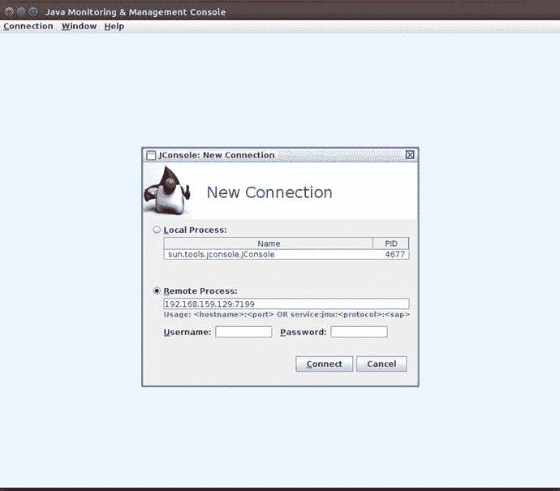
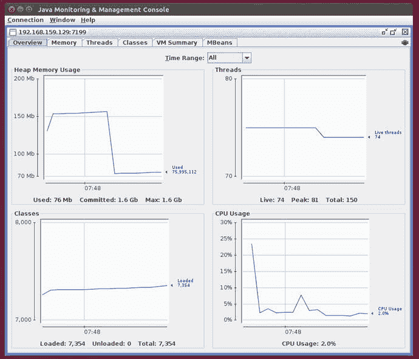
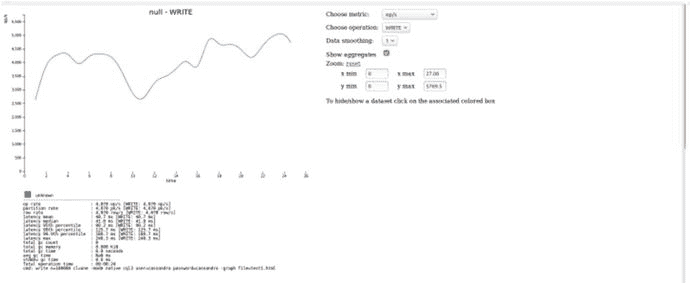

# /usr/lib/jvm/java-8-oracle/bin/jconsole
```

你将看到 `jconsole:New Connection` 页面出现，如图 10-1 所示。选择“远程进程”按钮并输入 Cassandra 节点的地址和端口（在我的情况下是 102.168.19.129:7199）。



图 10-1：JConsole 新建连接登录页面

登录后，你将看到以下选项卡：概览、内存、线程、类、VM 摘要和 MBeans。图 10-2 显示了“概览”选项卡。每个表格都提供一组图表，展示了 Cassandra 节点中各种资源的快照。



图 10-2：JConsole 概览选项卡

以下是各 JConsole 选项卡的描述：

*   **概览**：提供一组四个图表，用于跟踪 CPU、内存、线程和类。
*   **内存**：显示 Java 堆使用的当前状态。你还可以从该选项卡查看垃圾回收度量指标，并在此手动启动垃圾回收。
*   **线程**：显示各个线程阶段（例如压缩和垃圾回收）的当前和峰值使用模式。
*   **类**：提供一个图表，显示 JVM 当前或在特定时间范围内加载了多少类。
*   **VM 摘要**：提供垃圾回收、类和内存相关统计信息的非常有用的摘要。
*   **MBeans**：使你能够访问监控 Cassandra 节点的 MBean。

Jmxsh 是一个用于支持 JMX 的 Java 进程的命令行界面。该工具允许你从外部调用正在运行的 Java 进程中的方法。你可以运行命令；还有一个菜单驱动的界面来浏览 MBean、操作和属性。你可以从 [`http://code.google.com/p/jmxsh/downloads/list`](http://code.google.com/p/jmxsh/downloads/list) 下载 jmxsh。你可以在 [`http://code.google.com/p/jmxsh/wiki/Summary`](http://code.google.com/p/jmxsh/wiki/Summary) 阅读文档。

下载 jmxsh 后（在我的情况下是 `jmxsh-R5.jar`），通过运行以下命令将 jmxsh 连接到 Cassandra，使用默认的 JMX 端口：

```
$ java -jar jmxsh-R5.jar -h ubuntu -p 7199
jmxsh v1.0, Tue Jan 22 08:23:12 PST 2008
Type 'help' for help.  Give the option '-?' to any command
for usage help.
Starting up in shell mode.
%
```

你现在已连接到 Cassandra。你可以通过运行以下 jmxsh 命令来获取堆转储：

```
% jmx_invoke -m com.sun.management:type=HotSpotDiagnostic dumpHeap /tmp/heapdump.hprof false
```

你可以通过运行以下命令批量加载 Cassandra 表：

```
% jmx_invoke -m org.apache.cassandra.db:type=StorageService bulkLoad /path/to/SSTables
```

jmxsh 还提供浏览器模式。在 jmxsh 提示符处按 Enter 键进入浏览器模式：

```
Entering browse mode.
====================================================
Available Domains:
1. java.util.logging
2. org.apache.cassandra.service
3. org.apache.cassandra.db
4. org.apache.cassandra.metrics
5. java.nio
6. org.apache.cassandra.hints
7. JMImplementation
8. java.lang
9. com.sun.management
10. ch.qos.logback.classic
11. org.apache.cassandra.internal
12. org.apache.cassandra.request
13. org.apache.cassandra.net
SERVER: service:jmx:rmi:///jndi/rmi://ubuntu:7199/jmxrmi
====================================================
Select a domain:
```

了解了 JMX 客户端的基础知识后，现在让我们转向如何管理 Cassandra 的日志记录功能。

### 日志记录

Cassandra 有两个主要日志：`system.log` 和 `debug.log`。`system.log` 文件记录数据库中的所有活动，包括启动和关闭活动，以及所有与节点相关的任务活动。它还记录你对数据库模式所做的所有更改，例如对键空间和表的修改。

Cassandra 中的日志记录使用 Java 简单日志门面（SLF4J）结合 logback 后端。你可以通过编程方式或手动配置日志记录。在本章中，我将重点介绍日志记录的手动配置，你可以通过以下方式之一进行。

*   通过配置 `logback.xml` 文件。默认情况下，logback 会依次查找 `logback-test.xml` 和 `logback.xml` 文件以获取日志记录配置详细信息。
*   你可以通过运行 `nodetool setlogginglevel` 命令来配置日志级别。
*   你还可以通过 JMX 客户端（例如 JConsole 工具）配置日志记录。

以下各节说明了如何使用所有三种方法配置日志记录。但首先，让我解释如何设置 Cassandra 存储各种日志文件的日志记录位置。


## 设置日志位置

Cassandra 的安装方式决定了默认的日志记录位置。根据你是使用软件包还是 tarball 安装方法，默认日志位置可能是 `/var/log/cassandra` 或 `$CASSANDRA_HOME/logs` 目录。在名为 `logs` 的子目录中，你可以找到两个重要的 Cassandra 日志文件：`system.log` 和 `debug.log`。

你可以通过向 `cassandra-env.sh` 文件添加以下行来更改默认日志位置：
```
export CASSANDRA_LOG_DIR=/new/log/location
```

在 `cassandra-env.sh` 文件中设置 `CASSANDRA_LOG_DIR` 参数将使 Cassandra 将其所有日志文件存储在此位置。例如，如果你想为 `system.log` 和 `debug.log` 文件指定不同的目录，可以通过在 `logback.xml` 文件中配置这两个日志文件的 `${cassandra.logdir}` 属性来指定位置。

> **注意**
>
> 你也可以通过 `JConsole` 工具使用 JMX 配置日志记录。

你也可以通过编辑 `logback.xml` 文件中的以下条目并指定不同的文件名来修改日志目录的位置：
```
${cassandra.logdir}/system.log
```

### 通过 Logback 配置日志记录

Cassandra 的日志记录功能由带有 `logback` 后端的 `SLF4J` 支持。你可以通过配置随 Cassandra 自动安装的 `logback.xml`（或 `logback-test.xml`）文件来手动配置日志记录。

由于 `logback` 是 Cassandra 日志记录的关键部分，我将在下一节回顾 `logback` 框架的要点。

### Logback 日志框架

`Logback` 是著名的 `log4j` 日志框架的继承者。`Logback` 由创建 `log4j` 的同一人创建，它在 `log4j` 先前工作的基础上构建，而 `log4j` 作为一个日志框架已取得了巨大成功。正如 `Logback` 的创建者所说：“如果你喜欢 `log4j`，你会爱上 `Logback`。”

`Logback` 框架相比 `log4j` 提供了许多优势，例如：

*   一套广泛的测试，造就了一个高度可靠的日志框架
*   修改后自动重新加载配置文件
*   在日志轮转期间自动压缩归档日志文件
*   自动删除旧的日志归档文件
*   使用 if-then 结构对配置文件进行条件处理，因此单个配置文件可以服务于多个环境
*   `SiftingAppender` 非常通用，你可以使用它根据各种运行时属性（如用户会话）来分离日志记录。

在下一节中，我将简要描述 `Logback` 日志框架的工作原理。

### Logback 框架的主要组件：Logger、Appenders 和 Layouts

`Logback` 使用三个主要组件协同工作，根据消息类型和级别记录消息，并控制消息的格式以及报告日志消息的位置。这三个主要类如下：

*   `Logger`
*   `Appender`
*   `Layout`

#### Logger

`Logger` 类决定 `Logback` 将记录什么。它允许 `Logback` 根据其记录器选择性地启用或禁用日志记录请求。根记录器位于层次结构的顶部，并且是每个层次结构的一部分。记录器可以被分配级别，如 `TRACE`、`DEBUG`、`ERROR` 等。如果你没有为记录器分配级别，它将从其祖先继承日志级别。根记录器始终有一个分配的级别，默认为 `DEBUG`。这确保了根记录器的所有子记录器都将继承一个级别。

`Logback` 对其日志级别的排序如下：
```
TRACE < DEBUG < INFO < WARN < ERROR
```

如果你将根记录器的日志级别设置为 `Level.OFF`（最高日志级别），你将完全关闭日志记录。

#### Appender

一个 `Appender` 负责将日志记录事件写入组件，它指向一个或多个输出目的地，`Logback` 允许日志记录请求在这些目的地打印。例如，日志记录请求可以打印到控制台（`appender name='CONSOLE'`）、文件（`<appender name="FILE" class="ch.qos.logback.core.FileAppender">`）以及 `MYSQL` 和 `Oracle` 等数据库，还有远程的 `Linux Syslog` 守护进程。

你可以为一个记录器配置多个追加器。追加器从记录器层次结构中累加继承，这意味着如果你将控制台追加器添加到根记录器，那么所有日志记录请求都将显示在控制台上。

特殊的追加器 `RollingFileAppender` 具有轮转日志文件的能力。例如，此追加器可以记录到名为 `mylog.txt` 的文件，并且在满足你设置的某些条件后，将其日志记录目标切换到不同的文件。

你可以向追加器添加过滤器，以根据日志消息内容或一天中的时间等标准来过滤事件。

#### Layout

追加器帮助你自定义输出目的地，而 `Layout` 类则自定义输出格式。你通过将布局与追加器关联来实现这一点。

布局配置日志记录请求的格式，而追加器负责将格式化的输出发送到你配置的目的地。


# Cassandra 日志与性能调优

## `logback.xml` 文件

以下是一个展示各类 Appender 的 `logback.xml` 示例文件：

```
<configuration>
  <appender name="SYSTEMLOG" class="ch.qos.logback.core.rolling.RollingFileAppender">
    <file>${cassandra.logdir}/system.log</file>
    <rollingPolicy class="ch.qos.logback.core.rolling.SizeAndTimeBasedRollingPolicy">
      <fileNamePattern>${cassandra.logdir}/system.log.%i.zip</fileNamePattern>
      <maxFileSize>20MB</maxFileSize>
    </rollingPolicy>
    <encoder>
      <pattern>%-5level [%thread] %date{ISO8601} %F:%L - %msg%n</pattern>
    </encoder>
  </appender>

  <appender name="DEBUGLOG" class="ch.qos.logback.core.rolling.RollingFileAppender">
    <file>${cassandra.logdir}/debug.log</file>
    <rollingPolicy class="ch.qos.logback.core.rolling.SizeAndTimeBasedRollingPolicy">
      <fileNamePattern>${cassandra.logdir}/debug.log.%i.zip</fileNamePattern>
      <maxFileSize>20MB</maxFileSize>
    </rollingPolicy>
    <encoder>
      <pattern>%-5level [%thread] %date{ISO8601} %F:%L - %msg%n</pattern>
    </encoder>
  </appender>

  <appender name="STDOUT" class="ch.qos.logback.core.ConsoleAppender">
    <encoder>
      <pattern>%-5level [%thread] %date{ISO8601} %F:%L - %msg%n</pattern>
    </encoder>
  </appender>

  <root level="INFO">
    <appender-ref ref="SYSTEMLOG"/>
    <appender-ref ref="DEBUGLOG"/>
    <appender-ref ref="STDOUT"/>
  </root>
</configuration>
```

**注意**
可以使用 `.xml` 或 `.groovy` 作为 Logback 配置文件的扩展名。在我们的示例中，使用的是 `.xml`。

当需要深入研究 Cassandra 内部机制时，最佳做法之一是将日志记录级别修改为更“宽松”的级别，这意味着显示更多关于 Cassandra 正在执行（或未能执行）的操作的详细信息。

默认的 `INFO` 级别不会生成太多操作细节，仅提供操作状态，如下所示：

```
WARN  [main] 2017-04-03 13:06:55,973 DatabaseDescriptor.java:493 - Small cdc volume detected at ./../data/cdc_raw; setting cdc_total_space_in_mb to 2377\.  You can override this in cassandra.yaml
INFO  [main] 2017-04-03 13:06:56,882 CassandraDaemon.java:472 - Hostname: ubuntu
INFO  [main] 2017-04-03 13:06:56,887 CassandraDaemon.java:479 - JVM vendor/version: Java HotSpot(TM) 64-Bit Server VM/1.8.0_121
INFO  [main] 2017-04-03 13:06:56,897 CassandraDaemon.java:480 - Heap size: 476.000MiB/476.000MiB
INFO  [main] 2017-04-03 13:06:56,911 CassandraDaemon.java:485 - Par Eden Space Heap memory: init = 83886080(81920K) used = 77260784(75449K) committed = 83886080(81920K) max = 83886080(81920K)
```

通过修改 `logback.xml` 文件，可以将默认日志记录级别更改为 `DEBUG`，如下所示：
```
<root level="DEBUG">
```

修改 `logback.xml` 文件后，无需重启 Cassandra，因为数据库每分钟会扫描一次 `logback.xml` 文件以查找更改，前提是您已在文件中添加了以下行：
```
<configuration scan="true">
```

**提示**
在生产环境中，请确保将日志级别设置为 `WARN` 或 `ERROR` 等较稀疏的级别，因为大量的日志输出会影响性能。

## 自动加载配置文件

配置 Logback 以扫描配置文件中的更改，并在您进行任何与日志记录相关的配置更改时自动重新配置自身。这是通过将 `<configuration>` 元素的 `scan` 属性设置为 `true` 来实现的：
```
<configuration scan="true">
...
</configuration>
```

## 配置 Appender

使用 `<appender>` 元素配置 Appender。此元素有两个强制属性：`name` 和 `class`。`name` 属性为 Appender 命名，`class` 属性指向 Appender 类的名称。

`<appender>` 元素还可以包含 `<layout>`、`<encoder>` 和 `<filter>` 元素。

## 设置日志轮转

默认情况下，当 `system.log` 文件达到 20MB 时，Cassandra 会轮转该文件。它还会将较早的归档日志文件压缩为 zip 格式，并将其命名为 `system.log.1.zip`、`system.log.2.zip` 等。

可以在 Logback 中配置以下轮转策略：

*   日志文件的位置和名称
*   归档文件的位置和名称
*   触发轮转到新日志文件的最大日志文件大小
*   日志级别

默认日志级别是 `INFO`。您可以设置 `ALL`、`TRACE`、`DEBUG`、`WARN` 和 `ERROR` 作为日志级别。通过设置日志级别为 `OFF` 可以关闭所有日志记录。

### 使用 Nodetool 设置服务的日志级别

除了编辑 `logback.xml` 文件，您还可以运行 `nodetool setlogginglevel` 命令从命令行设置日志级别。

### 设置日志级别

使用 `nodetool setlogginglevel` 命令从命令行设置服务日志级别的语法如下：

```
$ nodetool setlogginglevel <class_qualifier> <level>
```

在此命令中，

*   `class_qualifier` 是记录器类限定符，例如 `org.apache.cassandra.service.StorageProxy`。
*   `level` 是日志级别。

可以为 `class_qualifier` 选项设置以下值：

*   `org.apache.cassandra`
*   `org.apache.cassandra.db`
*   `org.apache.cassandra.service.StorageProxy`

可以从 `ALL`、`TRACE`、`DEBUG`、`INFO`、`WARN` 和 `ERROR` 中选择日志级别。您可以将 `level` 属性设置为 `OFF` 以关闭所有日志记录。

通过将日志级别设置为 `DEBUG`，您可以看到数据库正在执行的操作的更多详细信息。以下示例展示了如何将 `StorageProxy` 服务设置为 `DEBUG` 级别：

```
$ nodetool setlogginglevel org.apache.cassandra.service.StorageProxy DEBUG
```

### 检查当前日志级别

可以使用 `nodetool getlogginglevels` 命令检查当前日志级别，如下所示：

```
$ nodetool getlogginglevels
Logger Name                                        Log Level
ROOT                                                   INFO
com.thinkaurelius.thrift                               ERROR
org.apache.cassandra                                   DEBUG
org.apache.cassandra.service.StorageProxy              INFO
$
```

### 使用 Nagios 监控 Cassandra

在生产环境中，使用强大的企业级监控工具来检查 Cassandra 集群是很好的做法。Nagios 是一个流行的开源监控系统，它提供了许多监控 Cassandra 集群的功能。

Nagios 使用 Nagios 远程插件执行器 (NRPE) 来监控运行 Cassandra 实例的远程主机。

您需要在远程主机上安装和配置 NRPE 代理。NRPE 需要 Nagios 插件，因此您需要将插件安装为代理来监控远程主机上的本地资源。

在以下部分中，我将展示如何在 Ubuntu 服务器上安装 Nagios 4。然后展示如何安装和配置 NRPE。我从使用 Nagios 所需的先决条件开始。

### 安装 LAMP 堆栈并解决其他先决条件

LAMP 堆栈是一组开源软件，使服务器能够托管动态网站和 Web 应用程序。LAMP 首字母缩略词代表以下四个组件：

*   Linux 操作系统
*   Apache Web 服务器
*   MySQL 数据库
*   PHP

在以下部分中，我解释了如何安装 LAMP。您可能已经拥有 Linux 操作系统，因此需要安装 Apache Web 服务器、MySQL 数据库和 PHP。

1.  安装并启动 Apache Web 服务器。

    ```
    $ sudo apt-get install apache2
    $ sudo systemctl restart apache2
    ```

2.  安装 MySQL 数据库。

    ```
    $ sudo apt-get install mysql-server
    ```

    此时您可以运行 MySQL 安全脚本，以删除不安全的默认配置并锁定数据库访问。

    ```
    $ mysql-secure_installation
    ```

3.  安装 PHP。以下命令将安装 PHP 5：

    ```
    $ sudo apt-get install php libapache2-mod-php php-mcrypt php-mysql
    ```

4.  默认情况下，当服务器请求一个目录时，Apache 会首先查找名为 `index.html` 的文件。您需要让 Apache 首先查找 `index.php` 文件。为此，请编辑 `/etc/apache2/mods-enabled/dir.conf` 文件，其内容如下：

    ```
    DirectoryIndex index.html index.cgi index.pl index.php index.xhtml index.htm
    ```

    只需将 `index.php` 文件移动到该行开头，紧靠在 `DirectoryIndex` 文件之前。关闭并保存文件。

5.  重启 Apache 服务器，使您在步骤 4 中所做的更改生效。

    ```
    $ sudo systemctl restart apache2
    ```

6.  检查 MySQL 和 PHP 是否正常运行。您可以通过运行以下命令来确认 Apache 服务器的状态：

    ```
    $ sudo systemctl status apache2
    ```

7.  您可以通过运行一个名为 `info.php` 的基本 PHP 脚本（`/var/www/html/info.php`）来确认您已正确配置 PHP。

完成此操作后，在浏览器中访问以下地址：

```
http://<your-server-IP>/info.php
```

您应该会看到一个漂亮的网页，显示有关 PHP 安装的详细信息。就 LAMP 堆栈而言，您已经准备就绪。然而，在安装 Nagios 之前，您必须完成几个先决条件，我将在接下来解释。

### 创建 Nagios 用户和组

您需要一个用户来运行 Nagios 服务器。创建一个名为 `nagios` 的用户，该用户属于一个名为 `nagcmd` 的组。

```
$ sudo useradd nagios
$ sudo groupadd nagcmd
$ sudo usermod -a -G nagcmd nagios
```

### 安装构建依赖项

您正在从源代码安装 Nagios Core（免费版本），因此需要安装额外的二进制文件来完成构建。您还需要 `apache2-utils` 来设置 Nagios Web 界面。您可以安装所有必需的包：

```
$ sudo apt-get install build-essential libgd2-xpm-dev openssl libssl-dev xinetd apache2-utils
```

最后，完成所有先决条件后，您就可以安装 Nagios 本身了。

### 安装 Nagios

要安装 Nagios，您必须下载源代码、配置它并编译（构建）它。

#### 下载 Nagios

下载最新稳定版本的 Nagios 源代码并提取存档，如下所示：

```
$ cd ~
$ curl -L -O https://assets.nagios.com/downloads/nagioscore/releases/nagios-4.1.1.tar.gz
$ tar xvzf nagios-*.tar.gz
$ cd nagios-*
```

#### 配置 Nagios

在构建 Nagios Core 之前，必须安装软件包。

```
$ ./configure --with-nagios-group=nagios --with-command-group=nagcmd
```

#### 编译和安装 Nagios

编译 Nagios 并运行其他命令来安装 Nagios。

```
$ sudo make
$ sudo make install
$ sudo make install-commandmode
$ sudo make install-init
$ sudo make install-config
$ sudo /usr/bin/install -c -m 644 sample-config/httpd.conf /etc/apache2/sites-available/nagios.conf
```

最后，将 Web 服务器用户 `www-data` 添加到 `nagcmd` 组，以便您可以通过 Web 界面向 Nagios 发出外部命令。

```
$ sudo usermod -G nagcmd www-data
```

### 安装 Nagios 插件

下一个重要步骤是安装 Nagios 插件。您遵循的步骤与上一节中 Nagios 服务器安装的步骤类似。我在此总结这些步骤。

```
$ cd ~
$ curl -L -O http://nagios-plugins.org/download/nagios-plugins-2.1.1.tar.gz
$ tar xvf nagios-plugins-*.tar.gz
$ cd nagios-plugins-*
$ ./configure --with-nagios-user=nagios --with-nagios-group=nagios --with-openssl
$ make
$ sudo make install
```

您可以这样验证配置：

```
$ sudo /usr/local/nagios/bin/nagios -v /usr/local/nagios/etc/nagios.cfg
...
Running pre-flight check on configuration data...
...
$
```

**注意**
您可以轻松地为 Nagios 创建自定义插件。唯一的要求是插件可以通过命令行提示符执行，并且它返回以下退出值之一：`OK`、`Warning`、`Critical` 或 `Unknown` 状态。

### 安装 NRPE

NRPE 的下载、配置和构建遵循与 Nagios 和 Nagios 插件相同的步骤。步骤如下：

```
$ cd ~
$ curl -L -O http://downloads.sourceforge.net/project/nagios/nrpe-2.x/nrpe-2.15/nrpe-2.15.tar.gz
$ tar xvf nrpe-*.tar.gz
$ cd nrpe-*
$ ./configure --enable-command-args --with-nagios-user=nagios --with-nagios-group=nagios --with-ssl=/usr/bin/openssl --with-ssl-lib=/usr/lib/x86_64-linux-gnu
$ make all
$ sudo make install
$ sudo make install-xinetd
$ sudo make install-daemon-config
```

在 xinetd 启动脚本 `/etc/xinetd.d/nrpe` 的末尾添加 Nagios 服务器的私有 IP 地址。

```
only_from = 127.0.0.1 192.168.159.129
```

重启 `xinetd` 服务以启动 NRPE。

```
$ sudo service xinetd restart
```

### 配置 Nagios 和 Apache

尽管您之前已经安装并构建了 Nagios，但您仍然需要为 Nagios 服务器和 Apache Web 服务器进行一些配置。

#### 配置 Nagios

编辑 Nagios 主配置文件（`/usr/local/nagios/etc/nagios.cfg`），如下所示：

```
cfg_dir=/usr/local/nagios/etc/servers
```

您的 Cassandra 集群中的每个主机都将有一个存储在此目录中的配置文件。您必须创建该目录。

```
$ sudo mkdir /usr/local/nagios/etc/servers
```

编辑联系人配置文件（`/usr/local/nagios/etc/objects/contacts.cfg`），并将 `email` 的值替换为您自己的电子邮件地址，这也是一个好主意。

您还需要在 Nagios 配置文件 `/usr/local/nagios/etc/objects/commands.cfg` 的末尾添加一个新命令。

```
define command{
command_name check_nrpe
command_line $USER1$/check_nrpe -H $HOSTADDRESS$ -c $ARG1$
}
```

### 配置 Apache

接下来，您必须配置 Apache Web 服务器，步骤如下。

1.  启用 Apache 的 `rewrite` 和 `cgi` 模块，如下所示：

    ```
    $ sudo a2enmod rewrite
    $ sudo a2enmod cgi
    ```

2.  使用 `htpasswd` 实用程序创建一个名为 `nagiosadmin` 的管理员用户，这将帮助您访问 Nagios Web 界面。

    ```
    $ sudo htpasswd -c /usr/local/nagios/etc/htpasswd.users nagiosadmin
    New password:
    Re-type new password:
    Adding password for user nagiosadmin
    ```

3.  启动 Nagios 和 Apache 服务器。

    ```
    $ sudo service nagios start
    $ sudo service apache2 restart
    ```

### 添加要监控的 Cassandra 集群主机

要通过 Nagios 启用对 Cassandra 主机的监控，您需要做三件事：

*   在集群的主机（节点）上安装和配置 NRPE。
*   将主机添加到 Nagios 服务器配置中。
*   添加您想要在主机上监控的服务。

#### 在主机上安装和配置 NRPE

在您希望监控的每台主机上，执行以下操作。

1.  更新 `apt-get`。

    ```
    $ sudo apt-get update
    ```

2.  安装 Nagios 插件和 Nagios 远程插件执行器 (NRPE)。

    ```
    $ sudo apt-get install nagios-plugins nagios-nrpe-server
    ```

3.  更新 NRPE 配置文件 (`/etc/nagios/nrpe.cfg`)，并将 Nagios 服务器的 IP 地址作为 `allowed_hosts` 属性的值添加。

    ```
    allowed_hosts=127.0.0.1,172.31.22.133
    ```

4.  重启 NRPE。

    ```
    $ sudo service nagios-nrpe-server restart
    ```

#### 将主机添加到 Nagios 服务器配置

在 Nagios 服务器上为您想要监控的每个 Cassandra 主机创建一个单独的配置文件。例如，对于名为 `host1` 的服务器，您必须创建文件 `host1.cfg` (`/usr/local/nagios/etc/servers/host1.cfg`)。

在 `host1.cfg` 文件中，添加主机定义，如下所示：

```
define host {
use                             linux-server
host_name                       host1
alias                           Nagios Agent 1
address                         192.168.159.130
max_check_attempts              5
check_period                    24x7
notification_interval           30
notification_period             24x7
}
```

#### 添加特定于 Cassandra 的插件

下一步是向您展示如何下载和测试特定于 Cassandra 的插件。此插件名为 `Check Cassandra Status and Heap Memory`，它可以报告节点的状态（`UP`/`DOWN`）以及堆内存利用率（`WARNING`/`CRITICAL`）通知。

按照以下步骤使用该插件。

1.  将工作目录更改为 `/usr/local/nagios/libexec` 目录。

    ```
    $ cd /usr/local/nagios/libexec
    ```

2.  下载插件 (`cassandra.pl`) 并更改其权限。

    ```
    $ wget "https://exchange.nagios.org/components/com_mtree/attachment.php?link_id=3819&cf_id=24" -O cassandra.pl
    $ chmod +x cassandra.pl
    $ chown nagios:nagios cassandra.pl
    ```

3.  测试以确保插件正常工作。

    ```
    $ ./cassandra.pl
    CASSANDRA OK -  | heap_mem=5.59
    $
    ```

    测试输出表明插件工作正常。如果您看到错误消息，请编辑 `cassandra.pl` 文件并确保 `$nodetool_path` 变量指向 `nodetool` 二进制文件的正确位置。

4.  配置 NREP，以便 Nagios 可以执行该插件。编辑 Cassandra 服务器上的 `/usr/local/nagios/etc/nrpe.cfg` 文件，并在文件末尾添加以下行：

    ```
    command[cassandra]=/usr/local/nagios/libexec/cassandra.pl $ARG1$
    ```

5.  在 Cassandra 服务器上重启 `xinetd` 服务。

    ```
    $ sudo service xinetd restart
    ```

6.  打开与运行 Nagios 的服务器的会话，并执行以下命令：

    ```
    $ sudo /usr/local/nagios/libexec/check_nrpe -H 192.168.159.130 -c cassandra
    CASSANDRA OK -  | heap_mem=10.32
    $
    ```

输出表明您已在 Cassandra 服务器上正确配置了 NRPE。然后，您可以将此配置添加到 Nagios 服务器。

## 总结

诸如 `nodetool tablestats` 和 `nodetool tablehistograms` 之类的命令可帮助您了解有关 SSTable 的关键事实。其他 `nodetool` 命令（如 `nodetool status` 和 `nodetool info`）有助于监控集群状态。

我详细讨论了日志记录。日志记录不仅仅是数据库中活动的附带产物。日志记录是集群中正确和错误操作的宝贵信息来源。Cassandra 允许您以多种方式配置日志记录，定制日志记录以满足您的需求是一个很好的策略，可帮助您有效地对数据库进行故障排除和监控。

JConsole 设置简单，有助于调整数据库性能。我详细讨论了 Nagios，但它的功能远不止于此，因此我在这里只是浅尝辄止。我在示例中使用了 Nagios 的免费版本；付费版本提供更多的功能以及支持！无论是 Nagios 还是其他工具，强大的图形化工具对于集群管理都是必不可少的。

# 11. Cassandra 性能调优

Cassandra 有许多配置参数，在性能调优领域尤其如此，数据库管理员可以控制性能的多个方面。开箱即用，Cassandra 许多与性能相关的配置属性都使用默认设置。作为管理员，您应该了解这些默认值并根据您的环境进行修改。

本章重点介绍 Cassandra 性能的以下领域：

*   追踪查询以分析数据库性能
*   缓存数据
*   压实策略
*   压缩
*   调优布隆过滤器
*   调优 JVM 和垃圾收集策略
*   使用 `cassandra-stress` 工具进行压力测试

### 使用追踪分析性能

在调整数据库性能时，您可以在数据库中开启追踪，以获取有关 Cassandra 内部操作的详细事务信息。追踪在跟踪 Cassandra 在查询处理各个阶段（例如查询的解析和执行）所花费的时间方面非常有价值。追踪提供与以下操作相关的详细计时信息：

*   准备 SQL 语句
*   读修复相关活动
*   Memtable 和 SSTable 数据查找
*   键缓存搜索
*   集群节点之间的交互

追踪数据对于评估查询有效性非常有用。例如，当您追踪涉及这些索引的查询时，不适当或多余的二级索引会在节点之间显示较高的活动。

**注意**
开启追踪将帮助追踪集群中两种广泛的活动：查询和修复操作。

默认情况下，Cassandra 禁用追踪。一旦启用追踪，Cassandra 会将事务详细信息捕获到 `system_traces` 键空间中。此键空间中的两个表保存追踪数据：

*   `system_traces.sessions`：存储事务的高级详细信息，例如事务长度和会话 ID。
*   `system_traces.events`：存储有关数据库执行的所有操作的详细信息。

**注意**
Cassandra 只能存储有限时间段的追踪数据。因此，如果您希望将追踪数据保留更长时间，则必须配置以下属性：
*   `tracetype_query_ttl`：为日志记录查询过程期间使用的不同追踪类型设置 TTL。默认值为 86,400 秒（1 天）。
*   `tracetype_repair_ttl`：为日志记录修复过程期间使用的不同追踪类型设置 TTL。默认值为 604,800 秒（大约一周）。

`system_traces.events` 表捕获的数据库活动类型揭示了您发出查询时 Cassandra 执行的操作。

```
cqlsh> select activity from system_traces.events;
activity
-----------
Parsing select id from cycling.cyclist_name;
Preparing statement
Computing ranges to query
Submitting range requests on 513 ranges with a concurrency of 112 (0.9 rows per range expected)
Executing seq scan across 0 sstables for (min(-9223372036854775808), max(-9196210656004250337)]
Read 0 live and 0 tombstone cells
Enqueuing request to /192.168.159.129
Sending RANGE_SLICE message to /192.168.159.129
RANGE_SLICE message received from /192.168.159.130
Enueuing request to /192.168.159.129
Enqueuing response to /192.168.159.130
Sending RANGE_SLICE message to /192.168.159.129
Processing response from /192.168.159.129
RANGE_SLICE message received from /192.168.159.130
Executing seq scan across 0 sstables for (max(-8175039996930460291), max(-8066091505323311933)]
Read 0 live and 0 tombstone cells
...
cqlsh>
```

### 管理追踪

您可以这样检查追踪的状态：

```
cqlsh> tracing
Tracing is currently disabled. Use TRACING ON to enable.
cqlsh>
```

在数据库中开启追踪很简单；只需运行 `tracing on` 命令。

```
cqlsh> tracing on;
Now Tracing is enabled
cqlsh> tracing;
Tracing is currently enabled. Use TRACING OFF to disable
cqlsh>
```

要关闭所有追踪，请运行 `tracing off` 命令。

```
cqlsh> tracing off;
Disabled Tracing.
cqlsh>
```

### 管理概率追踪

Cassandra 使用概率追踪策略，您可以配置数据库将追踪的语句百分比的概率。该概率是基于每个节点的。概率为 1.0 意味着数据库将追踪所有 SQL 语句，设置为 0.5 意味着它可能追踪大约 50% 的请求。

默认概率为 0.0，这意味着追踪被禁用。更高的概率设置涉及更多的写入，有时这会不利地影响集群性能，因此在设置追踪概率时必须谨慎。

Cassandra 建议您从较小的概率设置（例如 0.001）开始，并根据数据库中的情况逐渐提高。即使像这样低的设置也可能对数据库性能产生显著影响，因此请注意性能下降。

`nodetool gettraceprobability` 命令显示当前的追踪概率。

```
$ nodetool gettraceprobability
Current trace probability: 0.0
$
```

您可以通过运行 `nodetool settraceprobability` 命令来设置追踪概率，以追踪读或写请求，如下所示：

```
$ nodetool settraceprobability 0.1
$ nodetool gettraceprobability
Current trace probability: 0.1
$
```

`system_traces.sessions` 表显示了有关追踪的有价值信息。

```
cqlsh> select * from system_traces.sessions;
session_id      | client   | command | coordinator   | duration | parameters      | request       | started_at
----------------+ ---------+---------+--------------+-----------+ ----------------d7103660-81e4-11e7-a4ad-89801d899afb | 127.0.0.1 |   QUERY | 192.168.159.130 |   506051 |                                                             {'consistency_level': 'ONE', 'page_size': '100', 'query': 'select * from cycling.cyclist_name;', 'serial_consistency_level': 'SERIAL'} | Execute CQL3 query | 2017-08-15 18:09:11.878000+0000
189ff700-81e5-11e7-a4ad-89801d899afb | 127.0.0.1 |   QUERY | 192.168.159.130 |     6848 | {'consistency_level': 'ONE', 'page_size': '5000', 'query': 'SELECT * FROM system_traces.sessions WHERE session_id = 185a6280-81e5-11e7-a4ad-89801d899afb', 'serial_consistency_level': 'SERIAL'} | Execute CQL3 query | 2017-08-15 18:11:01.872000+0000
185a6280-81e5-11e7-a4ad-89801d899afb | 127.0.0.1 |   QUERY | 192.168.159.130 |   177343 |              {'consistency_level': 'ONE', 'page_size': '100', 'query': 'select * from cycling.cycle;', 'serial_consistency_level': 'SERIAL'} | Execute CQL3 query | 2017-08-15 18:11:01.416000+0000
...
(11 rows)
cqlsh>
```

### 如何追踪写和读请求

追踪是资源密集型的，并且会消耗大量存储空间。选择性地追踪是正确的策略，而不是为整个数据库启用追踪。在本节中，我将展示如何追踪特定的读和写请求。

#### 追踪写请求

以下是一个简单示例，展示了如何获取写请求（插入语句）的追踪信息。您首先开启追踪，然后在 `cyclist_name` 表中插入一行（输出显示部分数据）。

```
cqlsh> tracing on;
Now Tracing is enabled
cqlsh> insert into cycling.cyclist_name ( id, lastname, firstname ) values (uuid(), 'FRAME', 'Nina' );
Tracing session: bdfdf410-8116-11e7-81bd-63c57c069fd1
activity                                                            | timestamp                  | source          | source_elapsed | client        Execute CQL3 query | 2017-08-14 10:33:53.489000 | 192.168.159.130 |              0 | 127.0.0.1
Determining replicas for mutation [Native-Transport-Requests-1] | 2017-08-14 10:33:53.522000 | 192.168.159.130 |          32844 | 127.0.0.1
MUTATION message received from /192.168.159.130 [MessagingService-Incoming-/192.168.159.130] | 2017-08-14 10:33:53.530000 | 192.168.159.129 |            843 | 127.0.0.1
Sending MUTATION message to /192.168.159.129 [MessagingService-Outgoing-/192.168.159.129-Small] | 2017-08-14 10:33:53.532000 | 192.168.159.130 |          42754 | 127.0.0.1
Appending to commitlog [MutationStage-1] | 2017-08-14 10:33:53.532000 | 192.168.159.129 |           2668 | 127.0.0.1
Adding to cyclist_name memtable [MutationStage-1] | 2017-08-14 10:33:53.532000 | 192.168.159.129 |           3181 | 127.0.0.1
Processing response from /192.168.159.129 [RequestResponseStage-3] | 2017-08-14 10:33:53.545000 | 192.168.159.130 |          56321 | 127.0.0.1
Request complete | 2017-08-14 10:33:53.546583 | 192.168.159.130 |          57583 | 127.0.0.1
```

追踪数据显示了以下信息：

*   Cassandra 复制您插入的行的目标节点
*   Cassandra 如何将新数据附加到提交日志
*   数据库如何将新数据添加到 memtable
*   数据库如何确认（“Request complete”）插入数据的请求已成功完成

#### 追踪读请求

追踪读请求产生的数据比追踪写请求多得多，因此在追踪这些请求时要小心。产生密集追踪数据的部分原因是 Cassandra 将行分布在多个 SSTable 中，因此它必须读取多个 SSTable 来检索数据。追踪显示了数据库为满足读请求而发出的所有请求。

以下是一个简单 `select` 语句的部分输出：

```
cqlsh> select * from cycling.cyclist_name;
id                                   | firstname | lastname
--------------------------------------+-----------+-----------------
69f1cb04-687d-4be7-a91f-72ef037c5514 |     Sammy |           FRAME
e7ae5cf3-d358-4d99-b900-85902fda9bb0 |      Alex |           FRAME
d378af39-1a28-474c-836b-aa960fed6f2b |      Nina |           FRAME
fb372533-eb95-4bb4-8685-6ef61e994caa |   Michael |        MATTHEWS
5b6962dd-3f90-4c93-8f61-eabfa4a803e2 |  Marianne |             VOS
220844bf-4860-49d6-9a4b-6b5d3a79cbfb |     Paolo |       TIRALONGO
6ab09bec-e68e-48d9-a5f8-97e6fb4c9b47 |    Steven |      KRUIKSWIJK
e7cd5752-bc0d-4157-a80f-7523add8dbcd |      Anna | VAN DER BREGGEN
(8 rows)
Tracing session: b2b0eda0-8117-11e7-81bd-63c57c069fd1
activity                                             | timestamp                  | source          | source_elapsed | client
Execute CQL3 query | 2017-08-14 10:40:44.026000 | 192.168.159.130 |              0 | 127.0.0.1
Parsing select * from cycling.cyclist_name; [Native-Transport-Requests-1] | 2017-08-14 10:40:44.027000 | 192.168.159.130 |            364 | 127.0.0.1
Preparing statement [Native-Transport-Requests-1] | 2017-08-14 10:40:44.027000 | 192.168.159.130 |            503 | 127.0.0.1
RANGE_SLICE message received from /192.168.159.130 [MessagingService-Incoming-/192.168.159.130] | 2017-08-14 10:40:44.073000 | 192.168.159.129 |             22 | 127.0.0.1
Sending REQUEST_RESPONSE message to /192.168.159.130 [MessagingService-Outgoing-/192.168.159.130-Small] | 2017-08-14 10:40:44.086000 | 192.168.159.129 |          13202 | 127.0.0.1
RANGE_SLICE message received from /192.168.159.130 [MessagingService-Incoming-/192.168.159.130] | 2017-08-14 10:40:44.095000 | 192.168.159.129 |             18 | 127.0.0.1
REQUEST_RESPONSE message received from /192.168.159.129 [MessagingService-Incoming
...                               Processing response from /192.168.159.129 [RequestResponseStage-5] | 2017-08-14 10:40:44.557001 | 192.168.159.130 |         531160 | 127.0.0.1
Request complete | 2017-08-14 10:40:44.562582 | 192.168.159.130 |         536582 | 127.0.0.1
cqlsh>
```

输出显示了 Cassandra 如何解析 CQL 语句并在发送请求消息之前准备它，接收节点然后响应该请求消息。最后，“Request Complete”注释显示请求已被节点成功处理。

### 调优布隆过滤器

正如我在第 5 章中解释的，布隆过滤器是 Cassandra 的一种性能辅助工具。它们在索引扫描期间帮助数据库，让其知道某个 SSTable 是否包含特定分区的数据。当客户端请求数据时，布隆过滤器会在数据库执行磁盘 I/O 之前检查该行是否存在。

配置布隆过滤器涉及在内存使用和快速找到数据的概率之间进行权衡，使用比不配置更少的 I/O。

### 配置布隆过滤器

您可以将表的 `bloom_filter_fp_chance` 属性设置为 0 到 1 之间的值。当您从 0 到 1 时，您使用的内存更少。值为 0 表示您为布隆过滤器设置了最大值，并使用了最高内存量。将其设置为 1 表示您已禁用布隆过滤器。

`bloom_filter_fp_chance` 属性的默认值取决于当前使用的压实策略。以下是 Cassandra 的三种主要压实策略下此属性的值：

*   对于 `LeveledCompactionStrategy`：0.1
*   对于 `SizeTieredCompactionStrategy`、`DataTieredCompactionStrategy` 和 `TimeWindowCompactionStrategy`：0.01。

`bloom_filter_fp_chance` 属性的推荐值是 0.1。更高的值不一定有帮助，因为提高值会产生收益递减。这是因为更高的值消耗更多内存，但产生不成比例的较小性能收益。您可以在创建表时设置该属性，也可以稍后设置。

### 重新生成布隆过滤器

每当您更改表的 `bloom_filter_fp_chance` 属性的值时，必须重新生成布隆过滤器。您可以通过两种方式重新生成布隆过滤器：运行表的手动压实或升级 SSTable。

要手动压实表，请运行 `nodetool compact` 命令。`nodetool compact` 命令的语法如下：

```
nodetool [options] compact [(-et | --end-token <value>)] [(-s | --split-output)] [(-st | --start-token <value>)] [--] [<keyspace> <table>...]
[--user-defined] <SSTable>...
```

您必须通过从 `STCS`、`TWCS` 和 `LCS` 压实策略中选择来指定压实策略。默认情况下，该命令对数据库中的所有键空间和表运行主要压实，但您可以将压实限制为一个或多个表。

手动压实 SSTable 以重新生成布隆过滤器几乎从来都不是一个好的策略。当您更改表的 `bloom_filter_fp_chance` 属性的值时，您可以改为升级 SSTable。这是通过运行 `nodetool upgradetsstables` 命令来完成的。该命令的语法如下：

```
$ nodetool upgradesstables [(-a | --include-all-sstables)] [--] [<keyspace> [<table>...]]
```

### 缓存数据

为了优化 Cassandra 对缓存内存的使用，您可以配置表的 `caching` 属性。缓存有助于 Cassandra 对节点进行热重启，数据库会定期将缓存存储到磁盘，并在您重启节点时将其读回缓存。没有缓存意味着节点需要更长的时间来重启。

缓存对于非常繁忙的集群很有用。不建议对需求不高的数据进行缓存。因此，将频繁读取的数据分离到单独的表中以便可以缓存这些表中的数据是一个好主意。在处理包含极长分区的表时，缓存数据也不是一个好主意。

### 数据缓存的类型

有两种主要类型的数据缓存：键缓存和行缓存。（此外，您还可以要求 Cassandra 缓存计数器，我将在后面解释。）

*   键缓存：键缓存也称为分区键缓存，缓存 SSTable 的分区索引。数据库需要更少的磁盘读取来从键缓存中获取数据，而不是从磁盘或操作系统页面缓存中获取数据。由于键缓存以更少的内存量提供了更高的缓存读取可能性，Cassandra 默认启用它。
*   行缓存：您可以要求 Cassandra 缓存分区中特定数量的行。您使用 `rows_per_partition` 表选项设置要缓存的行数。由于行缓存存储整行而不仅仅是键，当处理大型数据集时，它可能导致性能下降，因为数据库可能必须从磁盘读取数据，而内存可能不足以存储所有数据。请仔细配置行缓存，因为它有时可能损害性能而不是帮助性能。

关于在 Cassandra 数据库中使用缓存，您需要记住以下关键原则：

*   您不希望为表同时设置两种类型的缓存。为表选择分区键缓存或行缓存之一。
*   行缓存比键缓存占用更多空间，因为它存储整行。因此，有选择地使用行缓存是一个好主意，仅将其用于缓存用户和客户端频繁访问的行。
*   至于必须缓存哪些表，读取密集型表是缓存的良好目标。当表的读取量远远超过写入量时，缓存是您需要考虑的事情。

**注意**
您的用户不常读取归档表，因此您可以禁用这些表的缓存。

### Cassandra 在哪里存储缓存数据

Cassandra 将行和键缓存存储在您可以通过配置属性 `saved_caches_directory` 指定的目录中。`saved_caches_directory` 属性的默认位置确定如下：

*   `/var/lib/cassandra/saved_caches`（用于包安装）
*   `install_location/data/saved_caches`（用于压缩包安装）

### 配置缓存

您可以设置两个决定缓存行为的属性：

*   `keys`：此属性可以取值 `ALL` 或 `NONE`。值 `ALL` 表示所有主键或行。值 `NONE` 表示没有主键或行。默认值是 `ALL`。
*   `rows_per_partition`：此属性帮助您设置数据库必须在分区中缓存的行数。此属性有三个值：`ALL`、`NONE` 和 `N`。值 `ALL` 和 `NONE` 的含义与 `keys` 属性相同。值 `N` 指定每个分区的行数。默认值是 `NONE`。

您在创建表时或之后设置表缓存属性以配置分区键缓存和行缓存。以下是 `caching` 表属性的语法：

```
caching = {
'keys' = 'ALL | NONE',
'rows_per_partition' = 'ALL' | 'NONE' | N
}
```

默认情况下，Cassandra 用于缓存数据的设置如下：

```
{ 'keys' : 'ALL', 'rows_per_partition' : 'NONE' }
```

以下是一些展示如何配置缓存属性的示例。第一个示例展示了如何为表配置缓存。您为 `keys` 属性指定了值 `NONE`，因此不缓存任何主键或行。数据库将为每个分区缓存 120 行。

```
CREATE TABLE test (
userid text PRIMARY KEY,
first_name text,
last_name text,
)
WITH caching = { 'keys' : 'NONE', 'rows_per_partition' : '120' };
```

除了 SSTable，您还可以缓存物化视图。以下示例展示了如何在创建物化视图时指定缓存：

```
CREATE MATERIALIZED VIEW cycling.cyclist_by_age
AS SELECT age, name, country
FROM cycling.cyclist_mv
WHERE age IS NOT NULL AND cid IS NOT NULL
PRIMARY KEY (age, cid)
WITH caching = { 'keys' : 'ALL', 'rows_per_partition' : '100' }
;
```

以下示例展示了如何运行 `ALTER TABLE` 语句来缓存每个年龄分区中的所有自行车手：

```
ALTER MATERIALIZED VIEW cycling.cyclist_by_age
WITH caching = {
'keys' : 'ALL',
'rows_per_partition' : 'ALL' } ;
```

### 全局缓存参数

在上一节中，我解释了如何通过为表设置缓存属性来配置缓存。Cassandra 还提供了几个全局缓存属性，您可以在 `cassandra.yaml` 文件中进行配置。我将在以下部分解释这些全局缓存参数。

#### 配置行缓存的大小

配置行缓存时，必须设置每个分区的行数。没有固定规则规定 X% 的行是正确的缓存行数。相反，您应根据数据库中的工作负载模式来调整行缓存的大小。

**注意**
默认情况下，行缓存被禁用，键缓存被启用。

您可以通过在 `cassandra.yaml` 文件中为 `row_cache_size_in_mb` 属性设置值来在数据库级别配置行缓存的大小。此参数确定 Cassandra 可以分配用于存储表中最频繁读取的表分区行的最大内存量。默认情况下，数据库不缓存行，因此该参数的默认值为 0。

行缓存可能比键缓存节省更多时间，但它需要更多空间，因为它缓存整行。因此，您必须仅对需求量大的行或不更改的行使用行缓存。`row_cache_size_in_mb` 属性的值过低可能导致数据库在启动时无法加载一些热键。

#### 配置键缓存的大小

`key_cache_size_in_mb` 参数允许您设置数据库中所有表的键缓存的最大大小。此参数的值默认未设置，Cassandra 将键缓存设置为堆大小的 5% 或 100MB，以较小者为准。您可以通过将 `key_cache_size_in_mb` 参数设置为 0 来禁用键缓存。

#### 配置缓存频率

您可以配置数据库将行缓存和分区键缓存保存到磁盘的频率。

*   `row_cache_save_period` 属性确定数据库在将行保存到由 `saved_caches_directory` 属性指定的目录之前，将行保留在缓存中的时间（以秒为单位）。默认情况下行缓存被禁用，这意味着 `row_cache_save_period` 参数的默认值为 0。
*   `key_cache_save_period` 参数确定数据库在将键保存到由 `saved_caches_directory` 属性指定的目录之前，将键保留在缓存中的时间。默认值为 4 小时（14,400 秒）。

#### 指定要保存的键数

默认情况下，数据库保存行缓存中的所有键。您可以配置 `row_cache_keys_to_save` 参数来指定要保存的键数。此参数的默认值是禁用的，这意味着保存所有键。

由于默认情况下数据库不启用行缓存，因此 `row_cache_class_name` 参数的默认值是禁用的。您可以指定以下两个值之一作为要使用的行缓存提供程序的类名：

*   `OHCProvider`：完全堆外
*   `SerializingCacheProvider`：部分堆外

`OHCProvider` 是较新的，基准测试显示它比旧的部分堆外行缓存提供程序提供大约 15% 的更好性能。

### 使用计数器缓存

除了行和键缓存之外，Cassandra 还允许您配置计数器缓存。计数器缓存存储需求量大的计数器，从而减少对计数器单元的争用。当数据库在缓存中找到计数器（缓存命中）时，它需要持有计数器锁的时间更短，从而加快热计数器单元的更新。

Cassandra 默认启用计数器缓存。计数器缓存的大小取决于您为 `counter_cache_size_in_mb` 参数配置的值。默认情况下此参数未设置，Cassandra 使用两个值中较小的一个：堆的 2.5% 或 50MB。

与行和键缓存一样，Cassandra 将计数器缓存（仅键）保存到由 `saved_caches_directory` 参数指定的目录中的磁盘。默认情况下，此参数的值为 2 小时（7,200 秒）。

管理计数器缓存的另一个配置属性是 `counter_cache_keys_to_save` 参数。您配置此属性以告诉数据库必须保存计数器缓存中的多少个键。默认情况下此属性是禁用的，这意味着 Cassandra 保存所有键。

如果您执行计数器删除并使用较低的 `gc_grace_seconds` 设置，则应禁用计数器缓存，您可以通过将 `counter_cache_size_in_mb` 参数的值设置为零来实现。

### 监控缓存

`nodetool info` 命令可帮助您监控缓存性能，从而帮助您根据当前缓存行为调整行缓存和键缓存配置。这是一个例子：

```
$ nodetool info
ID                     : 0dbb9e0e-867e-4179-b6b6-631d38dd68f9
Gossip active          : true
Thrift active          : false
Native Transport active: true
Load                   : 12.46 MiB
Generation No          : 1503673044
Uptime (seconds)       : 91
Heap Memory (MB)       : 117.82 / 1492.00
Off Heap Memory (MB)   : 0.07
Data Center            : datacenter1
Rack                   : rack1
Exceptions             : 0
Key Cache              : entries 47, size 3.94 KiB, capacity 74 MiB, 69 hits, 120 requests, 0.575 recent hit rate, 14400 save period in seconds
Row Cache              : entries 0, size 0 bytes, capacity 0 bytes, 0 hits, 0 requests, NaN recent hit rate, 0 save period in seconds
Counter Cache          : entries 0, size 0 bytes, capacity 37 MiB, 0 hits, 0 requests, NaN recent hit rate, 7200 save period in seconds
Chunk Cache            : entries 30, size 1.88 MiB, capacity 341 MiB, 44 misses, 182 requests, 0.758 recent hit rate, 1072.447 microseconds miss latency
Percent Repaired       : 100.0%
Token                  : (invoke with -T/--tokens to see
$
```

`nodetool info` 命令显示所有三种 Cassandra 缓存（行、键和计数器）的以下缓存相关信息：

*   缓存中的条目数
*   缓存的大小（字节）
*   缓存的容量
*   对缓存数据的请求数
*   缓存命中数
*   缓存命中率（比率）
*   保存周期（秒）

### 追踪数据库操作以优化缓存

您可以追踪数据库读取，以检查读取操作是从缓存获取数据还是直接从存储在磁盘上的 SSTable 获取数据。当您追踪引用缓存表的查询时，最初追踪显示发生了行缓存未命中。当您重新运行查询时，追踪会显示“`row cache hit`”行，如下所示：

```
row cache miss [ReadStage:23]
row cache hit [ReadStage:35]
```

行缓存未命中意味着数据库已从磁盘读取数据。另一方面，行缓存命中意味着数据库已在缓存中找到数据，省去了从磁盘读取数据的麻烦。请记住，缓存读取总是比从磁盘读取快很多倍。

您看到“`cache miss`”的原因是数据库缓存数据需要一些时间，尤其是当表很大时。一旦数据库将数据放入缓存，后续查询将使用缓存数据，而不是访问磁盘，这意味着查询将非常快地返回结果。因此，您将在追踪中看到“`cache hit`”消息。

一旦数据进入缓存，它就会保留在那里，数据库会将其用于所有引用该数据的查询。但是，如果您更新数据，它会使缓存失效。在以下条件下，Cassandra 会忽略缓存数据：

*   如果查询需要来自缓存和磁盘的数据（即，缓存+未缓存的数据）。
*   当查询请求大量数据时，这会导致超过全局缓存大小限制。
*   查询请求的数据不在分区的开头。

如果发生这些情况中的任何一种，您将在尝试使用缓存数据的查询的追踪中看到以下行：

```
Ignoring row cache as cached value could not satisfy query [ReadStage:89]
```

在所有这些情况下，缓存不足以处理查询，迫使 Cassandra 执行昂贵的（高资源成本）磁盘读取，而不是使用更高效的缓存读取。当您注意到数据库正在忽略行缓存时，根据原因，您可以执行以下操作之一以使数据库使用缓存数据：

*   增加缓存大小。
*   创建一个新表并将频繁访问的行放在分区的开头。
*   限制查询的输出大小（使用 `SELECT` 语句中的 `LIMIT N` 选项），以防止检索到的行超过配置的缓存大小。

## 使用 `cassandra-stress` 进行压力测试

Cassandra 提供 `cassandra-stress` 实用程序来对集群进行基准测试和负载测试。该工具在测试数据库关键配置方面的更改（例如选择不同的压实策略）时也很有用。您可以测试读取、写入和混合工作负载。

`cassandra-stress` 可用于优化数据模型、测试数据库的扩展能力以及确定生产容量。

### 运行 `cassandra-stress`

您可以在 `$CASSANDRA_HOME/tools/bin` 目录中找到 `cassandra-stress` 工具。

发出命令 `cassandra-stress` 以快速了解该工具的功能，如下所示：

```
$CASSANDRA_HOME/tools/bin$ cassandra-stress
No command specified
Usage:      cassandra-stress  [options]
Help usage: cassandra-stress help <command>
---Commands---
read                 : Multiple concurrent reads - the cluster must first be populated by a write test
write                : Multiple concurrent writes against the cluster
mixed                : Interleaving of any basic commands, with configurable ratio and distribution - the cluster must first be populated by a write test
counter_write        : Multiple concurrent updates of counters.
counter_read         : Multiple concurrent reads of counters. The cluster must first be populated by a counterwrite test.
user                 : Interleaving of user provided queries, with configurable ratio and distribution
help                 : Print help for a command or option
print                : Inspect the output of a distribution definition
legacy               : Legacy support mode
version              : Print the version of cassandra stress
---Options---
-pop                  : Population distribution and intra-partition visit order
-insert              : Insert specific options relating to various methods for batching and splitting partition updates
-col                  : Column details such as size and count distribution, data generator, names, comparator and if super columns should be used
-rate                 : Thread count, rate limit or automatic mode (default is auto)
-mode                 : Thrift or CQL with options
-errors               : How to handle errors when encountered during stress
-schema               : Replication settings, compression, compaction, etc.
-node                 : Nodes to connect to
-log                  : Where to log progress to, and the interval at which to do it
-transport            : Custom transport factories
-port                 : The port to connect to cassandra nodes on
-sendto               : Specify a stress server to send this command to
-graph                : Graph recorded metrics
-tokenrange           : Token range settings
$CASSANDRA_HOME/tools//bin$
```

从高层次来看，以下是您必须了解的关键选项：

*   `read`：多次并发读取（您必须首先运行写入测试以用数据填充测试表）
*   `write`：多次并发写入
*   `counter_write`：多次并发计数器更新
*   `counter_read`：多次并发计数器读取（您必须首先使用 `counter_write` 测试填充测试表）

### `cassandra-stress` 示例

当您第一次运行 `cassandra-stress` 工具时，它会创建一个名为 `keyspace1` 的键空间，并在该键空间中创建一个名为 `standard1` 或 `counter1` 的表，具体取决于您运行的测试类型。Cassandra 会在所有后续运行中重用它创建的键空间和表。

#### 运行写入测试

以下示例展示了如何运行写入测试（请记住，在运行读取测试之前，必须先运行写入测试）：

```
$ cassandra-stress write n=100000 cl=one
******************** Stress Settings ********************
Command:
Type: write
Count: 100,000
Consistency Level: ONE
...
Insert:
Revisits: Uniform:  min=1,max=1000000
Visits: Fixed:  key=1
Columns:
Max Columns Per Key: 5
Column Names: [C0, C1, C2, C3, C4]
Comparator: AsciiType
Timestamp: null
Variable Column Count: false
Slice: false
Size Distribution: Fixed:  key=34
Count Distribution: Fixed:  key=5
Errors:
Ignore: false
Tries: 10
...
Schema:
Keyspace: keyspace1
Replication Strategy: org.apache.cassandra.locator.SimpleStrategy
Replication Strategy Options: {replication_factor=1}
Table Compression: null
Table Compaction Strategy: null
Table Compaction Strategy Options: {}
...
Connected to cluster: Test Cluster, max pending requests per connection 128, max connections per host 8
Datatacenter: datacenter1; Host: localhost/127.0.0.1; Rack: rack1
Created keyspaces. Sleeping 1s for propagation.
Running WRITE with 200 threads for 100000 iteration
type       total ops,    op/s,    pk/s,   row/s,    mean,     med,     .95,     .99,    .999,     max,   time,   stderr, errors,  gc: #,  max ms,  sum ms,  sdv ms,      mb
...
Results:
Op rate                   :    3,011 op/s  [WRITE: 3,011 op/s]
Partition rate            :    3,011 pk/s  [WRITE: 3,011 pk/s]
Row rate                  :    3,011 row/s [WRITE: 3,011 row/s]
Latency mean              :   64.9 ms [WRITE: 64.9 ms]
Latency median            :   39.1 ms [WRITE: 39.1 ms]
Latency 95th percentile   :  190.2 ms [WRITE: 190.2 ms]
Latency 99th percentile   :  537.4 ms [WRITE: 537.4 ms]
Latency 99.9th percentile : 1155.5 ms [WRITE: 1,155.5 ms]
Latency max               : 1632.6 ms [WRITE: 1,632.6 ms]
Total partitions          :    100,000 [WRITE: 100,000]
Total errors              :          0 [WRITE: 0]
...
Total operation time      : 00:00:33
END
$
```

在此命令中，您指定 `write` 选项表示您希望将行插入 `cassandra-stress` 为压力测试创建的表中。`cassandra-stress` 插入一百万行 (`n=10000000`)。选项 `cl` 将一致性级别设置为 `ONE`。默认一致性级别是 `LOCAL_ONE`，您可以设置任何其他标准 Cassandra 一致性级别。

前面的示例未使用身份验证。要在运行 `cassandra-stress` 工具时使用身份验证，请指定 `-mode` 命令（使用 `native` 选项）以指定用户名和密码，如本例所示：

```
$ cassandra-stress -mode native cql3 -user cassandra -password cassandra cl=QUORUM
```

您使用 `cassandra-stress` 工具的 `write` 选项插入的数据默认永远不会被截断。您可以通过运行带有 `-truncate` 选项的 `cassandra-stress` 命令来截断 `cassandra-stress` 工具创建的表：

```
$ cassandra-stress write n=100000000 cl=QUORUM -truncate always -schema keyspace=keyspace1 -rate threads=200 -log file=write_$NOW.log
```

如果您指定了 `mode` 命令，请确保在 `mode` 选项之前指定 `truncate` 选项，否则 `cassandra-stress` 工具将忽略 `truncate` 选项。

#### 运行读取测试

一旦您填充了 `cassandra-stress` 工具创建的数据库表（如写入测试示例所示），您就拥有了该工具可以读取的数据。现在您可以运行读取测试，如下所示：

```
$ cassandra-stress read n=10000000 -rate threads=50 duration=5
```

在此示例中，选项代表以下含义：

*   `read`：对您之前填充的数据执行多次并发读取。子选项 `n=10000000` 指定要读取的行数。
*   `rate`：帮助您指定线程数、速率限制或自动模式（默认）。在本例中，您通过指定 `threads=50` 为压力测试指定子选项线程数。
*   `duration`：指定测试必须读取行的特定分钟数（本例中为 5）。

#### 运行混合工作负载

`cassandra-stress` 命令选项 `mixed` 可帮助您运行具有配置比率和分布的命令。在运行此命令之前，您必须使用写入测试填充集群。

以下示例展示了如何运行混合工作负载：

```
$ cassandra-stress mixed ratio\(write=1,read=3\) n=100000 cl=ONE -pop dist=UNIFORM\(1..1000000\) -schema keyspace="keyspace1" -mode native cql3 -rate threads\>=16 threads\<=256 -log file=~/mixed_autorate_50r50w_1M.log
```

注意以下几点：

*   `ratio` 选项设置写入与读取的比率。
*   `-pop` 命令选项设置种群分布和分区内访问顺序。在本例中，您指定 `pop dist=UNIFORM\(1..1000000\)`，这意味着在 100,000 次操作 (`n=100000`) 中，测试必须在 1 到 1,000,000 之间均匀选择键。当您指定的每个节点的数据量超过该节点 RAM 可容纳的量时，请指定 `-pop` 选项。

### 设置复制、压实和压缩选项

运行 `-schema` 命令选项以查看您可以为复制、压实和压缩设置的选项。它还允许您指定用于压力测试的键空间。

```
$ cassandra-stress help -schema
Usage: -schema [replication(?)] [keyspace=?] [compaction(?)] [compression=?]
replication([strategy=?][factor=?][=?]): Define the replication strategy and any parameters
strategy=? (default=org.apache.cassandra.locator.SimpleStrategy) The replication strategy to use
factor=? (default=1)                 The number of replicas
keyspace=? (default=keyspace1)           The keyspace name to use
compaction([strategy=?][=?]): Define the compaction strategy and any parameters
strategy=?                            The compaction strategy to use
compression=?                            Specify the compression to use for sstable, default:no compression
$
```

以下示例展示了如何为名为 `cass1` 的节点将复制策略更改为 `NetworkTopologyStrategy`：

```
$ cassandra-stress write n=500000 no-warmup -node cass1 -schema "replication(strategy=NetworkTopologyStrategy, cass1=2)"
```

### 在多个节点上运行压力测试

所有前面的示例都在单个节点上运行。有时单个节点无法处理压力测试的工作负载。您可以使用 `-node` 命令选项指定 `NODES` 变量。您使用逗号分隔的 IP 地址列表指定节点。

以下示例展示了如何在两个名为 `cass1` 和 `cass2` 的节点上运行压力测试：

```
$ cassandra-stress write n=1000000 cl=one -mode native cql3 -schema keyspace="keyspace1" -pop seq=1..1000000 -log file=~/node1_load.log -node $NODES
```

### 使用基于 YAML 的配置文件运行 `cassandra-stress`

您可以在运行 `cassandra-stress` 工具时使用基于 YAML 的配置文件。该配置文件帮助您定义数据库将在压力测试期间使用的各种压实策略和缓存设置。您可以在以下位置找到 Cassandra 提供的示例 YAML 文件：

*   `/usr/share/docs/cassandra/examples`（包安装）
*   `$CASSANDRA_HOME/tools/`（压缩包安装）

Cassandra 提供的 YAML 文件（例如 `cqlstress-example.yaml` 文件）包含在单独部分下进行的各种压力测试配置。这些配置属性包括键空间和表定义，以及查询定义。您可以在 `extra-definitions` 部分下添加二级索引和物化视图。您可以修改示例配置文件或创建自己的配置文件。

您可以在运行 `cassandra-stress` 命令时将 YAML 文件指定为 `profile` 选项的值。`profile` 选项指向您使用的 YAML 文件的位置。

以下示例展示了如何借助 `cqlstress-example.yaml` 文件运行压力测试：

```
$ cassandra-stress user profile=$CASSANDRA_HOME/tools/cqlstress-example.yaml n=1000000 ops\(insert=3,read1=1\) no-warmup cl=QUORUM
```

您可以指定 `-graph` 选项为运行的压力测试创建图表。测试完成后，您可以通过 Web 浏览器查看图表。这是一个例子：

```
$ cassandra-stress user profile=tools/cqlstress-example.yaml ops\(insert=1\) -graph file=test.html title=test revision=test1
```

您可以通过在 Web 浏览器中查看文件 `test1.html` 来查看压力测试的图表。您必须为捕获压力测试输出的 HTML 文件提供名称，以便通过浏览器查看。`title` 和 `revision` 选项不是必需的，但如果您使用相同数据运行多个压力测试，则必须使用 `revision` 参数。

图 11-2 显示了使用前面的 `cassandra-stress` 命令进行压力测试的图表。



图 11-2

使用 `-graph` 选项生成的 `cassandra-stress` 工具压力测试图表

### 配置压实策略

压实数据有助于合并 SSTable、合并键、组合列和清除墓碑。

正如您在第 6 章中学到的，Cassandra 的 SSTable 是不可变的，这意味着数据库永远不会覆盖数据。相反，它将插入或更新的新数据版本写入新的 SSTable 中。从来没有数据的原地修订（这需要随机 I/O）。相反，数据库只是将数据的最新版本（更新或插入）写入新的 SSTable。这是 Cassandra 高性能的一个关键因素。

**注意**
数据库将对数据的所有更新转换为顺序写入磁盘的新 SSTable。

随着数据库随时间更新数据，它最终可能会有同一行的多个版本，每个版本位于不同的 SSTable 中。唯一的时间戳区分这些版本。

随着时间的推移，Cassandra 需要访问众多 SSTable 才能检索完整的行，因为没有单个 SSTable 可能存储该行中所有列的最最新版本。为了提高性能，Cassandra 通过合并表并清除旧的、过时的数据版本来对 SSTable 执行定期压实。压实可以防止读取速度随着用户随时间更新数据而下降。

在压实过程中，Cassandra 执行以下操作：

*   合并 SSTable
*   清除所有墓碑
*   合并键
*   组合列
*   在新 SSTable 中创建新索引（不是二级索引）

压实过程创建一个包含该行所有列最新版本的完整行。数据库将每行的最新版本写入新的 SSTable，并在满足所有待处理请求后从旧的 SSTable 中删除旧版本。以下是压实过程的实际后果：

*   由于新压实的 SSTable，读取性能得到改善
*   由于数据库需要暂时维护新旧 SSTable，磁盘 I/O 和空间使用暂时上升

您可以使用 `nodetool compact` 命令手动压实表。更好的做法是通过 `CREATE TABLE` 或 `ALTER TABLE` 命令为表设置压实策略。

### 压实策略

压实策略决定了 Cassandra 如何选择 SSTable 进行压实，以及它如何在压实期间创建的用于保存最新数据的新 SSTable 中存储压实的行。您可以从以下三种压实策略中选择：

*   `SizeTieredCompactionStrategy` (STCS)
*   `LeveledCompactionStrategy` (LCS)
*   `TimeWindowCompactionStrategy` (TWCS)

**注意**
还有一种 `DataTieredCompactionStrategy` (DTCS)，它是时间序列数据的替代策略，但在 Cassandra 3.0 及更高版本中已弃用。

TWCS 是压实时间序列数据的最佳策略。对于非时间序列数据，您需要选择 STCS 或 LCS。以下各节解释了您可以选择的三种压实策略。

#### SizeTieredCompactionStrategy

在 STCS 下，SSTable 的大小是表压实的触发因素。SSTable 的大小充当表压实的触发因素。STCS 将 SSTable 分组到唯一的桶中。当存在预定数量的相同大小的表时，数据库会压实 SSTable。Cassandra 将每个 SSTable 的大小与节点上 SSTable 大小的平均值进行比较。

默认情况下，STCS 的压实配置属性 `enabled` 为 `true`，这意味着数据库执行后台压实。SSTable 配置属性 `min_threshold` 设置将触发压实的 SSTable 的最小数量。一旦表达到 `min_threshold` 值，它就有资格进行压实。默认情况下，当存在四个相似大小的表时（默认为 160MB），数据库执行压实操作。Cassandra 将相同大小的表合并为一个更大的 SSTable。随着数据库获得几个更大的 SSTable，它会将一组 SSTable 合并为更大的 SSTable。

**注意**
STCS 是默认的压实策略。

以下是一个示例，展示了如何将表的压实属性更改为 `SizeTieredCompactionStrategy`：

```
cqlsh> ALTER TABLE users
WITH compaction = { 'class' : 'SizeTieredCompactionStrategy', 'min_threshold' : 6 }
```

`min_threshold` 表属性使您能够设置数据库执行次要压实之前所需的 SSTable 最小数量。在此示例中，`min_threshold` 属性指定数据库在触发压实之前应查找至少六个相同大小的 SSTable。

**注意**
次要压实涉及键空间中的特定表。

##### 配置 STCS

除了 `enabled` 和 `min_threshold` 属性外，您还可以为 STCS 配置以下属性：

*   `bucket_high` 和 `bucket_low`：这对属性提供了尺寸公式，帮助数据库确定要考虑压实的表的大小。数据库合并大小落在以下范围内的 SSTable：
    ```
    [average table size X bucket_low] and [average table size X bucket_high]
    ```
    `bucket_high` 属性的默认值为 1.5，`bucket_low` 属性的默认值为 0.5。
*   `log_all`：使您能够为集群设置高级日志记录，其默认值为 `false`。
*   `min_threshold` 和 `max_threshold`：这组属性确定次要压实中 SSTable 的最小（默认值为 4）和最大（默认值为 32）数量。
*   `min_sstable_size`：默认情况下，数据库通过将大小相差不到 50% 的 SSTable 分组到每个桶中。在 SSTable 较小的情况下，您可以设置 `min_sstable_size` 属性以定义分配给桶的 SSTable 的大小阈值（以字节为单位）。此参数的默认值为 50MB。
*   与墓碑相关的压实属性：有几个与墓碑相关的压实属性。
    *   `only_purge_repaired_tombstones`：此参数的默认值为 `false`，这意味着数据库将允许从所有 SSTable（已修复和未修复）清除墓碑。通过将此属性设置为值 `true`，您要求数据库仅从已修复的 SSTable 清除墓碑。
    *   `tombstone_threshold`：设置数据库可以垃圾回收的墓碑与所有包含列相比的比率。此参数的默认值为 0.2。一旦 SSTable 超过此比率（20%），它就有资格进行墓碑压实。一旦数据库可以垃圾回收的墓碑数量超过 20%，Cassandra 将仅压实该表以清除墓碑。
    *   `tombstone_compaction_interval`：在创建 SSTable 之后，数据库认为该表有资格进行墓碑压实的时间长度。默认值为 86,400 秒（1 天）。
    *   `unchecked_tombstone_compaction`：默认情况下，此属性设置为 `false`，这意味着 Cassandra 在运行压实操作之前会检查表是否有资格进行墓碑压实。通过将属性设置为 `true`，您允许 Cassandra 在不进行预先检查的情况下压实墓碑。

##### 何时使用（或不使用）STCS

STCS 是写入密集型工作负载的理想选择。由于合并过程不按行分组数据，因此行的版本可能分布在多个表中，这会减慢读取速度。

但是，STCS 不能快速清除过时和删除的数据，因为压实触发器是 SSTable 的大小，其增长可能太慢，从而将旧数据保留在原地。随着时间的推移，随着 SSTable 变大，由于数据库在压实期间需要存储新旧 SSTable，因此数据库将需要更多存储空间。

尽管 LCS 将相关数据保留在少量表中，如果您的数据没有太多修改或插入，STCS 也可以为您提供相同类型的数据集，而不会产生使用 LCS 时产生的写入开销。

STCS 在处理批处理读写操作时比 LCS 更高效。然而，在负面方面，它比 LCS 需要更多的磁盘空间。

#### LeveledCompactionStrategy

LCS 将 SSTable 分组到各个级别，其中每个级别（L1、L2、L3…）比前一个级别大 10 倍。数据库将每个级别的 SSTable 压实到更大的级别中。首先，数据库将 memtable 中的数据刷新到最低级别 (L0) 的 SSTable 中。数据库不会压实 L0 级别的表；它将这些最小尺寸的 SSTable 与下一级别 (L1) 的更大 SSTable 合并。

数据库将 L2、L3 等级别的 SSTable 压实到至少与您为 LCS 属性 `sstable_size_in_mb` 设置的值（默认为 160MB）一样大的 SSTable。

LCS 提高了读取性能，因为 Cassandra 可以确定它应该检查每个级别的哪些 SSTable 以查找行键数据。

##### 配置 LCS

您可以为 LCS 设置以下所有属性，所有这些属性的含义与我在上一节中为 STCS 描述的相同。

*   `enabled`
*   `log_all`
*   `tombstone_compaction_interval`
*   `tombstone_threshold`
*   `unchecked_tombstone_compaction`

除了这些属性之外，您还可以配置 `sstable_size_in_mb` 属性，该属性是 LCS 独有的。`sstable_size_in_mb` 属性指定使用 LCS 压实时表的目标大小。数据库将尝试使 SSTable 大小（压实后）与您为 `sstable_size_in_mb` 参数指定的值相同或更小。但是，如果分区非常大，压实将导致 SSTable 大于您使用 `sstable_size_in_mb` 参数指定的值。如前所述，`sstable_size_in_mb` 属性的默认值为 160MB。

以下是一个示例，展示了如何更新表以将数据库压实策略设置为 `LeveledCompactionStrategy`：

```
cqlsh> ALTER TABLE users WITH compaction = { 'class' : 'LeveledCompactionStrategy' };
```

##### 何时使用（或不使用）LCS

LCS 涉及在读取和写入性能之间进行权衡。LCS 适用于读取密集型工作负载（尤其是涉及随机读取的工作负载），因为它使数据库能够在 90% 的情况下仅从一个 SSTable 检索查询所需的数据。其他情况下，它只需要读取两个 SSTable。

LCS 在数据碎片化严重时是理想的选择。LCS 比 STCS 更频繁地清除过时数据，这意味着删除的数据占用 SSTable 的部分更小。然而，更频繁的压实操作意味着有更多的 I/O 压力。因此，由于较高 I/O 操作量导致的性能下降，LCS 通常不是写入密集型工作负载的有前途的想法。LCS 的写入惩罚意味着大量的写入可能会压倒压实操作。

LCS 比 STCS 需要更少的空间。

如果对您来说保持高读取率至关重要，您可以使用 LCS。为了克服由此产生的写入端性能下降，您可以向集群中添加更多节点。

#### TimeWindowCompactionStrategy

TWCS 是时间序列数据和过期 TTL 工作负载的推荐压实策略。TWCS 根据一系列时间窗口压实 SSTable。数据库创建连续的时间窗口，并在每个活动（最新）时间窗口期间，使用 STCS 压实将所有未压实的 SSTable 压实为更大的 SSTable。

在时间窗口结束时，数据库将落在该时间窗口中的所有 SSTable 压实（主要压实，因为涉及多个键空间的 SSTable）为单个 SSTable，使用 SSTable 最大时间戳作为标准。数据库对在后续时间窗口期间写入的所有 SSTable 重复相同的压实过程。

##### 配置 TWCS

您可以设置以下压实属性来配置 TWCS：

*   `compaction_window_unit`：此属性使您能够定义用于定义桶大小的时间单位。默认时间单位是毫秒，如果您愿意，可以设置值为秒或小时。这是一个例子：
    ```
    compaction_window_unit = 'minutes', compaction_window_size = 120
    ```
*   `compaction_window_size`：每个时间窗口的单元数（1、2、3…）。
*   `log_all`：通过设置值 `true`，使您能够为整个集群激活高级日志记录。默认值为 `false`。

##### 何时使用 TWCS

TWCS 是存储在具有默认 TTL（生存时间）的表中的时间序列数据的理想选择。如果您需要以非顺序方式查询时间序列数据，则此压实策略不合适。

### 启用和禁用压实

默认情况下，Cassandra 启用后台压实。您可以通过 `ALTER TABLE` 语句将 `enabled` 属性设置为 `false` 来禁用后台压实，如下所示：

```
cqlsh> ALTER TABLE mytable WITH COMPACTION = { 'class': 'SizeTieredCompactionStrategy', 'enabled': 'false' }
```

关于压实的最佳实践是使用默认设置 `enabled`（`true`）并让数据库压实数据。

### 配置全局压实属性

您可以配置以下三个全局压实参数：

*   `snapshot_before_compaction`
*   `concurrent_compactors`
*   `compaction_throughput_mb_per_sec`

我将在以下部分解释这些属性。

#### `snapshot_before_compaction` 属性

`snapshot_before_compaction` 属性决定数据库在执行压实操作之前是否对数据进行快照。与所有 Cassandra 快照一样，您负责删除较旧的快照，这样它们就不会占用太多空间。

默认情况下，`snapshot_before_compaction` 属性设置为 `false`。

#### `concurrent_compactors` 属性

在长时间运行的压实期间，可能会积累大量小 SSTable，这将不利地影响读取性能。为避免读取性能下降，您可以配置 `concurrent_compactors` 参数以设置任何时候可以运行的并发压实进程数。此数字不包括用于反熵修复的任何验证压实。

默认情况下，`concurrent_compactors` 属性设置为磁盘数或核心数中较小的一个，最小为 2，每个 CPU 核心最大为 8。

由于同时执行压实会增加磁盘空间的使用，请确保在提高 `concurrent_compactors` 参数值之前有足够的可用磁盘空间。

**注意**
在调整 `concurrent_compactors` 属性之前，请通过配置 `compaction_throughput_mb_per_sec` 属性来限制压实速度。

#### `sstable_preemptive_open_interval_in_mb` 属性

数据库可以在完成对 SSTable 的写入之前抢先打开正在压实的 SSTable。目标是通过最小化数据进出缓存的移动，并将热行保留在原地，从而在压实前后的 SSTable 版本之间平稳传输读取。默认值为 50MB。

### 限制压实速度

有时您可能意识到压实运行得太快（或太慢）。您可以配置 `compaction_throughput_mb_per_sec` 属性以将压实限制为特定速率（以 MB 为单位）每秒。此压实属性控制数据库插入数据的速度。数据插入速率越快，数据库必须执行压实以保持 SSTable 计数较低的速度就越快。

`compaction_throughput_mb_per_sec` 参数的默认值为 16，意味着压实速率是写入吞吐量的 16 倍，以 MB/秒为单位。

您可以通过将 `compaction_throughput_mb_per_sec` 属性设置为 0 来禁用压实限制。推荐值为 16-32。压实速度在所有压实器之间分配。如果您有八个并发压实器，压实吞吐量为 16，则每个压实器只能获得 2MB/s。在旋转磁盘上，建议将并发压实器数量设置得非常低（例如 2）；在 SSD 上，您可以将压实器数量提高到磁盘可以跟上的水平。

**注意**
您可以通过配置 `compaction_large_partition_warning_threshold_mb` 属性，让数据库在压实大于您设置的值的分区时发出警告。此参数的默认值为 100。

### 设置压实策略

您在表级别设置压实策略。您可以在创建表时或通过更改表来设置压实属性。您在 `CREATE TABLE` 或 `ALTER TABLE` 语句中使用 `compaction` 选项指定压实 `class`，如下所示：

```
compaction = {
'class' : 'compaction_strategy_name'
[, 'subproperty_name' : 'value',...]
}
```

尽管您可以禁用压实，但这从来不是一个好主意，因为它可能导致僵尸的传播。僵尸，如果您从第 5 章回忆起，是已删除但仍然存在的记录。有时，墓碑记录可能已从集群的其他节点中删除，但一个无响应的节点除外，该节点由于宕机而不会立即接收墓碑。如果数据库在无响应节点恢复之前从集群的其余部分删除了墓碑记录，Cassandra 会将该节点上的（本应被删除的）记录视为新数据并将其发送到其他节点。

如前所述，为无响应节点提供恢复的宽限期有助于防止僵尸记录重新出现。表属性 `gc_grace_seconds` 设置墓碑的宽限期，其默认值为十天（864,000 秒）。一旦墓碑的宽限期结束，数据库会在压实过程中删除墓碑。

### 获取和设置压实阈值

运行 `nodetool getcompactionthreshold` 命令以查找表的最小和最大压实阈值。运行此命令时必须指定键空间和表名。

```
$ sudo nodetool getcompactionthreshold cycling cyclist_name
Current compaction thresholds for cycling/cyclist_name:
min = 4,  max = 32
$
```

**注意**
主要压实涉及键空间中的所有表。次要压实仅涉及键空间中的部分表。

您可以使用 nodetool 的 `setcompactionthreshold` 命令设置压实阈值，该命令使您能够为表设置最小/最大压实阈值。术语“阈值”指的是数据库在调度次要压实之前应存在的相似大小的 SSTable 的数量。

`setcompactionthreshold` 命令具有以下选项：

*   `keyspace`：键空间名称
*   `table`：表名称
*   `minthreshold`：触发次要压实的 SSTable 最小数量（使用 STCS 或 DTCS 时）
*   `maxthreshold`：次要压实中的 SSTable 最大数量（使用 STCS 或 DTCS 时）

以下示例展示了如何设置表的压实阈值：

```
$ nodetool setcompactionthreshold cycling cyclists 4 16
```

在此示例中，`cycling` 指的是键空间，`cyclists` 是表。

如前所述，STCS 和 DTCS 都允许您配置次要压实期间应压实的 SSTable 的最小和最大数量，通过配置 `min_threshold` 和 `max_threshold` 属性。

### 记录压实活动

您可以通过在创建或更改表时将 `log_all` 子属性设置为 `true` 来设置数据库的扩展压实活动日志记录。`log_all` 子属性位于 `compaction` 属性下。表的 `log_all` 属性为整个集群激活高级日志记录。虽然您在表级别执行此操作，但一旦为单个表配置了扩展日志记录，数据库会自动收集有关集群中所有节点上所有表压实的详细信息。

设置扩展压实活动日志记录后，数据库会创建一个名为 `compaction-%d` 的额外压实相关文件，位于 `$CASSANDRA_HOME/logs` 目录下，其中 `%d` 充当序列号。

设置扩展压实日志记录后，数据库会收集有关以下压实事件的信息：

*   `enable`：列出数据库已刷新的所有 SSTable。
    ```
    {"type":"enable","keyspace":"es": ... }
    ```
*   `flush`：记录从 memtable 到 SSTable 的刷新事件。
    ```
    {"type":"flush","keyspace":"test","table":"t","time":1470083335639,"tables": ... }
    ```
*   `compaction`：记录压实事件。
    ```
    {"type":"compaction","keyspace":"test","table":"t","time":1470083660267,"start":"1 ... }
    ```
*   `pending`：列出待处理的压实任务数。
    ```
    {"type":"pending","keyspace":"test","table":"t","time":1470083447967,"strategyId":"1","pending":100}
    ```

### 测试压实策略的有效性

当您计划更改压实策略时，可以首先在不正式属于集群的节点上测试新策略的影响。您以写入调查模式启动一个新节点，该模式将节点添加到集群但不正式使其成为环的一部分。

如果您愿意，可以从集群中取出一个节点，并以写入调查模式将其重新启动，以测试更改对读取性能的影响。一旦以写入调查模式启动节点，您就可以在该节点上对读取操作进行基准测试。

要以写入调查模式启动节点，请使用以下两种方法之一将 `write_survey` 选项设置为 `true`：

```
JVM_OPTS="$JVM_OPTS -Dcassandra.write_survey=true"       /* 用于包安装，将此行添加到 cassandra-env.sh 文件。
$ cassandra -Dcassandra.write_survey=true               /* 用于压缩包安装，以此模式启动新节点。
```

您还可以通过在 `$CASSANDRA_HOME/conf/jvm.options` 文件中设置属性来以写入调查模式启动节点，如下所示（默认情况下，`-Dcassandra.write_survey` 属性被注释掉。您需要取消注释）。以下是 `jvm.options` 文件的相关部分：

```
-Dcassandra.write_survey=true
```


# 用于测试新的紧缩和压缩策略。它允许您尝试不同的


# Cassandra 数据库性能调优

## 测试压缩策略
在不影响生产工作负载的情况下，测试压缩策略并基准化写入性能差异。
```bash
-Dcassandra.write_survey=true
```

## 启用与禁用自动压缩
您可以使用以下命令为一个或多个表启用和禁用自动压缩：
```bash
$ nodetool enableautocompaction cycling cyclist_name;
$ nodetool disableautocompaction cycling cyclist_name;
```

## 查看所有压缩历史
您可以使用 `nodetool compactionhistory` 命令查看数据库中所有压缩活动的历史记录：
```bash
$ nodetool compactionhistory
Compaction History:
id                                   keyspace_name columnfamily_name   compacted_at            bytes_in bytes_out rows_merged
f6227aa0-81e8-11e7-a4ad-89801d899afb cycling       cycle               2017-08-15T11:38:41.994 111      55        {1:1, 2:1}
ef3d57a0-81e8-11e7-a4ad-89801d899afb cycling       cyclist_name        2017-08-15T11:38:30.426 243      243       {1:5}
...
```

该命令的输出包含七个列。`bytes_in` 和 `bytes_out` 列通过比较压缩前后 SSTable 的大小，帮助您判断压缩效果。

输出中的 `tables:rows` 表示法（例如 `{1:5}`）说明了 Cassandra 如何选择行进行压缩。例如，`{1:5}` 表示数据库从五个 SSTable 中各取一行来创建一个新的压缩 SSTable。类似地，`{1:3,3:1}` 表示数据库从一个 SSTable 中取三行，并与另外三个表中的单行合并，创建一个压缩 SSTable。

`nodetool compactionstats` 命令显示所有待处理和正在进行的压缩操作的状态。您可以通过查看 PROGRESS 列来检查压缩操作的完成百分比。

### 压缩数据以节省存储空间
通过让 Cassandra 压缩磁盘上的 SSTable，可以节省存储空间。除了在存储方面带来收益外，压缩还能略微提升性能。DataStax 估计，根据数据类型的不同，压缩可能会使存储空间减少 25-33%，读取性能提升 25-35%，写入性能略有提升（5-10%）。

当 Cassandra 需要读取压缩数据时，它会定位 SSTable 索引中的行并解压缩必要的行块。

最适合压缩的表是那些具有相似列集、且行中列数相同的表。数据在不同行中越相似，压缩数据能节省的空间就越多，因为压缩因子会更高。

### 配置压缩
Cassandra 默认启用压缩，您可以配置各种压缩选项，包括压缩期间数据库必须使用的压缩算法。您可以在创建表时进行配置，或者稍后通过修改表来配置。以下语法语句显示了您可以配置的四个压缩属性：
```
compression = {
['class' : 'compression_algorithm_name',
'chunk_length_kb' : 'value',
'crc_check_chance' : 'value',]
| 'sstable_compression' : '']
}
```

最重要的压缩属性是压缩类（`class`），它指定了压缩期间数据库必须使用的压缩算法。您可以从以下压缩类中选择：
*   `LZ4Compressor`
*   `SnappyCompressor`
*   `DeflateCompressor`

> **注意**
> 除了 `LZ4`、`Snappy` 和 `Deflate` 压缩类之外，您还可以使用 `org.apache.cassandra.io.compress.ICompressor` 接口实现自己的压缩类。

选择压缩算法时，您需要在节省存储空间和数据库读取性能这两个相互冲突的目标之间进行权衡。通常，通过压缩数据获得的存储空间节省与数据库在读取时解压缩数据的速度成反比。

`Snappy` 和 `Deflate` 都提供更高的压缩比，意味着与使用 LZ4 算法相比，使用这些算法可以节省更多的存储空间。然而，LZ4 提供最快的解压缩速度，这意味着查询压缩数据时具有更高的读取性能。

默认的压缩算法是 `LZ4Compressor`。要为表指定压缩算法，您需要为该压缩算法指定其类，如下所示：
```sql
CREATE TABLE customers (
...
PRIMARY KEY (id)
)
WITH compression = { 'class' : 'SnappyCompressor' };
```

除了指定压缩算法，您在创建或修改表时还可以配置以下与压缩相关的属性：
*   `chunk_length_kb`：默认情况下，此属性的值设置为 64KB。这是 Cassandra 压缩 SSTable 时压缩块的大小。通过为此参数指定更高的值，您可以增加压缩比，但数据库每次读取操作必须从磁盘读取更多数据。默认值对于大多数用例来说是合适的，但如果数据库一次需要从磁盘读取大量数据，您可以提高此参数的值。
*   `crc_check_chance`：此属性确定数据库在读取操作期间检查压缩数据块校验和的概率。校验和有助于检测损坏，并防止数据库将损坏的数据副本传播到其他节点。`crc_check_chance` 属性的默认值为 1，表示数据库在读取期间始终检查数据的校验和（概率为 1 意味着事件总是发生）。您可以通过将此参数设置为 0 来完全禁用校验和检查。参数值越低，Cassandra 在读取期间执行数据校验和的可能性就越小。

### Cassandra 何时压缩数据
当您使用 `ALTER TABLE` 语句为现有表配置压缩时，Cassandra 将开始压缩该表的所有新 SSTable。但是，Cassandra 不会立即压缩所有现有的 SSTable。Cassandra 将在下次对数据库中的数据执行压缩时压缩现有 SSTable。

您可以通过强制重写现有 SSTable（在此过程中压缩表）来修改 Cassandra 的默认压缩行为。您可以通过执行 `nodetool upgradesstables` 或 `nodetool scrub` 命令来实现。

`nodetool upgradesstables` 命令的语法如下：
```bash
$ nodetool upgradesstables
( -a | --include-all-sstables )
--    ...
```

`nodetool upgradetsstables` 命令会重写 SSTable，并在此过程中压缩它们。如果您希望数据库在为 SSTable 配置压缩后立即开始压缩数据，可以运行此命令。当您希望修改表的压缩算法时，也可以运行此命令。

您可以通过运行 `nodetool scrub` 命令使 Cassandra 压缩已配置压缩的表。该命令还会像 `nodetool upgradesstables` 命令一样重建节点中的 SSTable，但它需要在表重建之前创建快照。`nodetool upgradesstables` 命令是比 `nodetool scrub` 更好的选择，因为您不需要在数据库压缩 SSTable 之前创建快照。

### 修改压缩算法
默认的压缩算法是 `LZ4Compressor`。您可以在创建表时通过将压缩参数 `class` 配置为不同的压缩类（本例中为 `DeflateCompressor`）来更改压缩算法：
```sql
CREATE TABLE MyTable (
...
PRIMARY KEY (user_id)
)
WITH compression = { 'class' : DeflateCompressor };
```

您可以在创建表后修改任何压缩属性，包括 `compression class` 属性。以下示例展示了如何修改压缩算法的 `class` 属性（改为 `DeflateCompressor`）：
```sql
ALTER TABLE customers
WITH compression = { 'class' : 'DeflateCompressor', 'chunk_length_in_kb' : 6
```

### 测试压缩效果
在初次尝试压缩时，您可能希望了解不同压缩策略的影响，同时又不影响生产数据库性能。Cassandra 允许您通过以写入调查模式启动数据库来测试压缩策略。

本章的“测试压缩策略效果”部分描述了如何使用 Cassandra 的写入调查模式来测试您的压缩计划。

在写入调查模式下启动新节点有助于测试新的压缩策略并基准写入性能。要检查压缩策略对读取性能的影响，您可以将一个节点从集群中取出，并使用 `cassandra-stress` 工具（我在本章中会解释）基准测试其读取操作的性能，将该节点作为独立服务器使用。

### 关闭压缩
默认情况下，Cassandra 会压缩数据。您可以在创建表时通过将压缩参数 `enabled` 指定为 `false` 来禁用压缩：
```sql
CREATE TABLE MyTable (
...
PRIMARY KEY (user_id)
)
WITH compression = { 'enabled' : false };
```

您可以通过为现有表指定 `sstable_compression` 选项并为其赋予空值（' '）来禁用压缩，如下所示：
```bash
cqlsh> ALTER TABLE cycling.cyclist_name
WITH COMPRESSION = {'sstable_compression': ' ');
```

## 通过 Memtable 阈值提升写入性能
如您所知，当 Cassandra 超过提交日志阈值或 Memtable 清理阈值时，它会将 Memtable 刷新到磁盘（成为 SSTable）。关于设置提交日志和 Memtable 阈值没有固定的规则。

如果您的写入负载包括对小部分数据的高更新或持续的写入流，您可以提高 Memtable 阈值。当存在大量写入时，如果保持 Memtable 阈值较低，将导致压缩效率低下。

Cassandra 使用 `memtable_cleanup_threshold` 参数（在 `cassandra.yaml` 中）的设置来确定何时应刷新 Memtable。此参数的默认值为 1/(`memtable_flush_writers` + 1)。然而，此参数仅表示 Cassandra 用于计算自动 Memtable 刷新空间量的比率。Cassandra 通过以下方式确定何时将 Memtable 刷新到磁盘：
*   `memtable_heap_space_in_mb` 参数决定了为 Memtable 分配的堆内内存量。此参数的默认值为堆大小的 0.25 倍。`memtable_offheap_space_in_mb` 参数决定了为 Memtable 分配的堆外内存量，其默认值也是堆大小的 0.25 倍。将 `memtable_heap_space_in_mb` 参数的值与 `memtable_offheap_space_in_mb` 参数的值相加。
*   将上一行的总和乘以 `memtable_cleanup_threshold` 参数的值。这将给出以 MB 为单位的阈值。
*   当节点上所有 Memtable 使用的组合内存超过阈值时，数据库会将该节点上最大的 Memtable 刷新到磁盘。

`memtable_flush_writers` 参数表示 Memtable 刷新写入线程的数量。数据库使用此参数来计算 `memtable_cleanup_threshold` 参数的值，其默认值由以下方式确定：
节点上磁盘的数量或核心的数量，最小值为 2，最大值为 8。

以下是一个示例，展示了数据库如何确定何时将 Memtable 刷新到磁盘：
1.  假设您已将节点的 `memtable_flush_writers` 参数设置为 8。
2.  `memtable_cleanup_threshold` 参数的默认值为 `1/(memtable_flush_writers +1)`，因此本例中为 1/(8+1) = 0.11。
3.  假设您已将 `memtable_heap_space_in_mb` 和 `memtable_offheap_space_in_mb` 参数都设置为 2000。
4.  步骤 2 得出 `memtable_cleanup_threshold` 参数的值为 0.11。`memtable_heap_space_in_mb` 和 `memtable_offheap_space_in_mb` 参数的总和为 2000+2000=4000。因此，Memtable 清理的空间阈值为 4000 - 4000*0.11=3636MB。
5.  当此节点上 Memtable 使用的组合空间量超过 3636MB 时，Cassandra 会将最大的 Memtable 刷新到磁盘。

`memtable_cleanup_threshold` 参数的值越大，数据库将 Memtable 刷新到磁盘的频率就越低。这也意味着更少的 SSTable，从而意味着更小的压缩活动级别。

## 调整 JVM
在 Cassandra 中，所有操作都在 JVM 内部运行。Cassandra 使用 JVM 堆来优化读取性能。为此，它将布隆过滤器、分区键缓存、SSTable 索引摘要和分区摘要等组件保留在堆中。

除了 Java 堆内存，Cassandra 还使用内存来支持页面缓存、布隆过滤器和缓存行。

了解如何调整 JVM 非常重要。在这方面需要知道的关键是：
*   Java 垃圾回收的工作原理
*   理想的垃圾收集器
*   分配 Java 堆大小

配置垃圾回收和为 JVM（堆）分配正确数量的内存对高性能至关重要。让我们在以下部分中了解这两点。

### Java 垃圾回收
垃圾回收是 JVM 从内存中移除旧对象的方式。您可以选择不同的垃圾收集器。Java 内存堆内部有几种类型的区域，例如年轻代和老年代，在每个内存区域内还有更小的子区域。当 JVM 需要清理已满的内存区域时，它会暂停正在运行的操作。调整 Java 垃圾回收的目标是尽量减少暂停时间。您不仅应该寻求将垃圾回收引起的暂停时间最小化，还应该减少暂停次数。

### 选择正确的垃圾收集器
可用的两种 Java 垃圾收集器是并发标记清除（CMS）和 G1（垃圾优先）垃圾收集器。您可以这样在两者之间做出决定：
*   如果您处理的堆大小小于 14GB，并且始终处理相同类型的工作负载，CMS 更佳。
    > **注意** 在 Java 的下一个版本（Java 9）中，CMS 将正式被废弃。
*   如果您处理的堆大小大于 14GB，并且数据库正在处理不同类型的工作负载，请使用 G1 垃圾收集器。

您可以通过编辑 `$CASSANDRA_HOME/conf/jvm.options` 文件中的设置来配置 Java 垃圾收集器。`jvm.options` 文件（我在第 2 章中首先解释过）有助于设置多个属性，例如启动参数、通用 JVM 设置、堆设置以及垃圾回收相关设置。

默认的垃圾收集器是 CMS，您可以在 `java.options` 文件的 GC SETTINGS 部分查看此收集器的设置，如下所示：


# Cassandra 性能调优与安全配置

## CMS 垃圾收集器设置

```
-XX:+UseParNewGC
-XX:+UseConcMarkSweepGC
-XX:+CMSParallelRemarkEnabled
-XX:SurvivorRatio=8
-XX:MaxTenuringThreshold=1
-XX:CMSInitiatingOccupancyFraction=75
-XX:+UseCMSInitiatingOccupancyOnly
-XX:CMSWaitDuration=10000
-XX:+CMSParallelInitialMarkEnabled
-XX:+CMSEdenChunksRecordAlways

