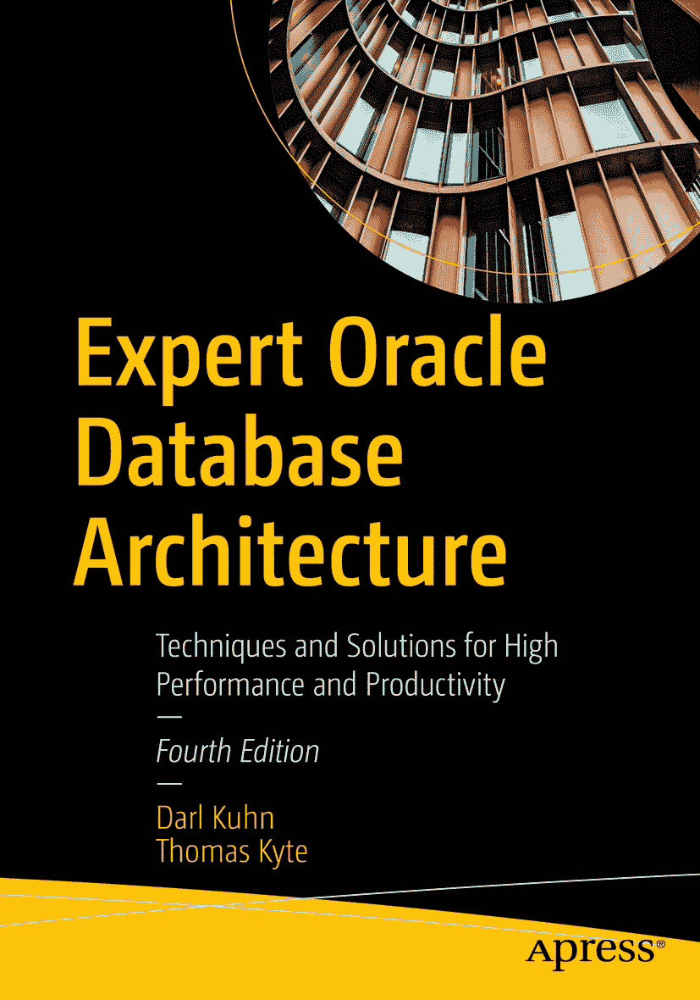

ISBN 978-1-4842-7498-9 e-ISBN 978-1-4842-7499-6 [`doi.org/10.1007/978-1-4842-7499-6`](https://doi.org/10.1007/978-1-4842-7499-6) © Darl Kuhn and Thomas Kyte 2022
本作品受版权保护。无论涉及材料的全部还是部分，所有权利均由出版商独家许可，具体包括翻译权、转载权、图表重复使用权、朗诵权、广播权、缩微胶片或其他任何物理方式的复制权，以及信息存储与检索、电子改编、计算机软件方面的传播权，或目前已知或未来开发的类似或不同方法的使用权。本出版物中使用的通用描述性名称、注册商标、商标、服务标识等，即使未作具体说明，也不意味着这些名称可免于相关保护性法律法规的约束而可自由通用。出版商、作者和编辑可安全地假设本书中的建议和信息在出版时是真实准确的。出版商、作者或编辑均不对本文所含材料或可能存在的任何错误或遗漏提供明示或暗示的保证。出版商对出版地图中的管辖权主张和机构从属关系保持中立。

本 `Apress` 印记由注册公司 `Apress Media, LLC`（`Springer Nature` 的一部分）出版。

注册公司地址为：1 New York Plaza, New York, NY 10004, U.S.A.

## 引言

本书所包含材料的灵感来源于我开发 `Oracle` 软件的经验，以及与 `Oracle` 开发人员和 `DBA`（数据库管理员）合作，帮助他们基于 `Oracle` 数据库构建可靠且健壮的应用程序的经历。本书基本上反映了我日常所做的工作，以及我每天看到人们遇到的问题。

我涵盖了我认为最相关的内容，即 `Oracle` 数据库及其架构。我本可以写一本标题类似的书，解释如何使用特定的语言和架构开发应用程序——例如，一本使用 `JavaServer Pages` 与 `Enterprise JavaBeans` 对话，然后使用 `JDBC` 与 `Oracle` 通信的书。然而，归根结底，为了成功构建这样的应用程序，你确实需要理解本书涵盖的主题。本书探讨了我认为成功使用 `Oracle` 开发所需普遍了解的知识，无论你是使用 `ODBC` 的 `Visual Basic` 程序员、使用 `EJB` 和 `JDBC` 的 `Java` 程序员，还是使用 `DBI Perl` 的 `Perl` 程序员。本书不推崇任何特定的应用程序架构；它不比较三层架构与客户端/服务器架构。相反，它涵盖了数据库能做什么以及你必须了解其工作方式的内容。由于数据库是任何应用程序架构的核心，因此本书应该拥有广泛的读者群。

正如书名所示，*Expert Oracle Database Architecture* 专注于数据库架构以及数据库本身的工作原理。我深入探讨了 `Oracle` 数据库架构：构成 `Oracle` 数据库和实例的文件、内存结构和进程。接着，我讨论了重要的数据库主题，如锁、并发控制、事务工作原理、重做与撤销，以及为什么了解这些内容对你很重要。最后，我研究了数据库中的物理结构，如表、索引和数据类型，并涵盖了优化利用这些结构的技术。

## 本书内容

拥有众多开发选项的一个问题是，有时很难确定哪个选项最适合你的特定需求。每个人都希望有尽可能多的灵活性（尽可能多的选择），但他们也希望事情非常**简单明了**——换句话说，就是容易。`Oracle` 为开发人员提供了几乎**无限的选择**。从来没有人说，“你在 `Oracle` 中不能那样做。” 相反，他们会说，“你希望在 `Oracle` 中用多少种不同的方式来做这件事？” 我希望本书能帮助你做出正确的选择。

本书面向那些欣赏选择权，但也希望获得有关 `Oracle` 功能和特性的指导原则和实用实现细节的人。例如，`Oracle` 有一个非常棒的功能，叫做 `parallel execution`（并行执行）。`Oracle` 文档告诉你如何使用这个功能以及它的作用。然而，`Oracle` 文档并没有告诉你何时应该使用这个功能，或许更重要的是，何时不应该使用这个功能。它并不总是告诉你这个功能的实现细节，如果你没有意识到这些，可能会带来麻烦（我指的不是 bug，而是该功能应有的工作方式及其真正的设计目的）。

在本书中，我努力不仅描述事物的工作原理，还要解释何时以及为何考虑使用某个特定功能或实现。我觉得理解事物背后的“如何”很重要，同时理解“何时”、“为何”、“何时不”以及“为何不”也同样重要！


## 本书适合谁阅读

本书的目标读者是所有使用 Oracle 作为数据库后端来开发应用程序的人员。这是一本为职业 Oracle 开发人员准备的书，他们需要了解如何在数据库中完成工作。本书的实用性意味着许多章节对数据库管理员（DBA）来说也会非常有趣。书中的大多数示例使用 `SQL*Plus` 来演示关键特性，因此你不会在这里学到如何开发一个非常酷的图形用户界面（GUI）——但你会了解到 Oracle 数据库的工作原理、其关键特性能做什么，以及何时应该（和不应该）使用它们。

本书适合任何希望用更少的工作从 Oracle 中获得更多收益的人。适合任何想要看到使用现有特性新方法的人。适合任何想要了解这些特性如何在现实世界中应用的人（不仅仅是展示如何使用某个特性，还包括该特性为何首先具有相关性）。另一类会对本书感兴趣的读者是负责 Oracle 项目开发人员的技术经理。在某些方面，他们理解为什么了解数据库对成功至关重要也同样重要。本书可以为那些希望让员工接受正确技术培训或确保员工已掌握所需知识的经理们提供论据。

为了从本书中获得最大收益，读者应具备：

*   `SQL 知识`：你不必是史上最优秀的 SQL 编码人员，但良好的实用知识会有所帮助。
*   `对 PL/SQL 的理解`：这不是先决条件，但它将帮助你吸收书中的示例。例如，本书不会教你如何编写 `FOR` 循环或声明 `record` 类型；Oracle 文档和众多书籍对此已有详尽介绍。然而，这并不意味着通过阅读本书你学不到很多关于 `PL/SQL` 的知识。你将学到很多。你会非常熟悉 `PL/SQL` 的许多特性，你会看到做事的新方法，并且你会了解到一些可能你不知道存在的包/特性。
*   `接触过某种第三代语言（3GL），例如 C 或 Java`：我相信任何能够读写 3GL 语言代码的人都能成功阅读并理解本书中的示例。
*   `熟悉 Oracle 数据库概念手册。`

关于最后一点说几句：由于 Oracle 文档集体量庞大，许多人觉得它有些令人生畏。如果你刚刚起步或者尚未阅读过任何 Oracle 文档，我可以告诉你，《Oracle 数据库概念》手册正是最佳的起点。它大约有 600 多页（我知道这点是因为我撰写并编辑了其中的每一页），涉及许多你需要了解的主要 Oracle 概念。它可能不会提供每一个技术细节（那是其他 10,000 到 20,000 页文档的用途），但它会让你了解所有重要的概念。这本手册涵盖了以下主题（仅举几例）：

*   数据库中的结构以及数据如何被组织和存储
*   分布式处理
*   Oracle 的内存架构
*   Oracle 的进程架构
*   你将使用的模式对象（表、索引、集群等）
*   内置数据类型和用户定义数据类型
*   `SQL` 存储过程
*   事务如何工作
*   优化器
*   数据完整性
*   并发控制

我自己将反复回到这些主题。这些是基础。不了解它们，你将创建出容易失败的 Oracle 应用程序。我鼓励你通读这本手册，并理解其中的一些主题。

## 本书结构

本书共有 15 章，每一章都像一本“小书”——一个几乎独立的组件。偶尔，我会引用其他章节的示例或特性，但你基本上可以挑出书中的某一章单独阅读。例如，你不必先阅读关于数据库表的第 10 章，才能理解或利用关于并行处理的第 14 章。

许多章节的格式和风格几乎完全相同：

*   对特性或功能的介绍。
*   你可能希望使用（或不使用）该特性或功能的原因。我概述了何时应考虑使用此特性，以及何时不应使用。
*   如何使用此特性。这里的信息不仅仅是 SQL 参考手册中材料的复制；而是以循序渐进的方式呈现：这是你需要的，这是你必须做的，这些是你开始时需要了解的开关。本节涵盖的主题将包括：
    *   如何实现该特性
    *   示例，示例，还是示例
    *   如何调试此特性
    *   使用此特式的注意事项
    *   如何（主动）处理错误
*   总结，将所有内容汇集在一起。

书中将有大量的示例和代码，所有这些都可以从 GitHub 网站下载。接下来的部分将详细列出每章的内容。

## 在哪里可以找到本书的源代码？

消化本书材料的最佳方式是彻底实践并理解动手示例。在实践本书中的示例时，你可能决定更愿意亲手输入所有代码。许多读者选择这样做，因为这是熟悉所用编码技术的好方法。话虽如此，本书中有许多复杂的示例。因此，你也可以选择下载源代码并运行示例，而无需手动输入。

本书的所有源代码都可以从 GitHub 网站下载。你不需要 GitHub 账户即可访问源代码，但我们建议注册以充分利用此服务。要查找本书（或任何 Apress 图书）的源代码：

1.  前往 Apress.com 上的本书产品页面，网址为 `www.apress.com/9781484274989`。
2.  将会有一个标记为 `Download Source Code` 的按钮。点击此按钮可转到本书在 GitHub 上的页面。
3.  到达 GitHub 后，可以使用绿色按钮将代码下载为 zip 压缩包；或者，如果你有 GitHub 账户，可以使用 `Git` 直接将源代码克隆到你的机器上。
4.  就是这样！

一本书出版后，源代码可以持续更新。这意味着如果有任何更正，你总能获得最新版本。如果你因任何原因想要获取原始源代码，即与你书中副本完全一致的版本，你可以访问 `https://github.com/Apress/[repository-name-here]/releases` 并下载 v1.0 版本。

如果你喜欢输入代码，可以使用源代码文件来检查你应该得到的结果——如果你认为自己可能输入有误，这应该是你的第一站。如果你不喜欢打字，那么从 GitHub 网站下载源代码是必须的！无论哪种方式，代码文件都将帮助你处理更新和调试。

提示

如果你在获取任何 Apress 图书的源代码时遇到问题，请发送电子邮件至 `customerservice@springernature.com`。


## 设置您的环境

在本节中，我将介绍如何搭建一个能够执行本书示例的环境。具体包括：

*   访问 Oracle 数据库
*   如何设置本书许多示例中使用的 `EODA` 账户
*   如何正确设置 `SCOTT`/`TIGER` 演示模式
*   安装 Statspack
*   安装并运行 `runstats`、创建 `BIG_TABLE`，以及本书中使用的其他自定义实用程序

如之前“在哪里可以找到本书的源代码？”一节所述，本书中使用的所有脚本均可从 GitHub 站点下载。有一个 `chNN` 文件夹包含了每一章的脚本（其中 `NN` 是章节编号）。`ch00` 文件夹则包含了本节“设置您的环境”中列出的脚本。

本书中的大多数示例都设计为 100% 在 SQL*Plus 环境中运行。如果您已有访问 Oracle 数据库的权限，则可以直接跳到在您的数据库中创建 `EODA` 和 `SCOTT` 模式的步骤。您还需要设置 Statspack 和自定义脚本。这些组件在本书中被广泛使用。

### 访问 Oracle 数据库

本书包含大量实践数据库示例。因此，在您学习每一章的示例时，能够访问一个 Oracle 数据库至关重要。如果您想使用安装在个人电脑上的 Oracle 数据库，有几种免费且简单的方法。下面列出的两种技术都涉及使用 Oracle VM VirtualBox：

*   安装 Oracle VM VirtualBox 和一个预构建的数据库虚拟机
*   安装 Oracle VM VirtualBox，克隆 Git 仓库，并使用 Vagrant 构建您的环境

我将在以下各节简要描述这两种方法。

#### Oracle VM VirtualBox 和预构建的数据库虚拟机

获取功能齐全的 Oracle 数据库最快、免费且简单的方法之一是下载并安装 Oracle VM VirtualBox，然后配合使用一个预构建的数据库虚拟机。在下载并安装所需软件后的几分钟内，您就可以拥有一个正常工作的数据库。

首先，您必须下载并安装 VirtualBox。请访问此链接下载并安装软件：

[`www.virtualbox.org/wiki/Downloads`](https://www.virtualbox.org/wiki/Downloads)

下载并安装 VirtualBox 后，再下载一个预构建的数据库虚拟机，并按照说明将该 appliance 虚拟机导入 VirtualBox。使用此链接下载预构建的虚拟机：

[`www.oracle.com/downloads/developer-vm/community-downloads.html`](https://www.oracle.com/downloads/developer-vm/community-downloads.html)

`Database App Development VM` 包含一个名为 `CDB$ROOT` 的容器数据库。在此容器数据库内，有一个名为 `ORCL` 的可插拔数据库。登录到 Database App Development VM 时，请使用 `oracle` 操作系统账户（启动虚拟机后，应该会默认为您打开一个终端窗口）。在默认的终端窗口中，您可以如下访问 SQL*Plus：

```bash
$ sqlplus / as sysdba
```

如果系统提示您输入用户名和密码，请退出 SQL*Plus 会话，并在操作系统提示符下设置以下环境变量：

```bash
$ export TWO_TASK=
```

设置完上述环境变量后，您应该能够通过以下方式访问 SQL*Plus：

```bash
$ sqlplus / as sysdba
```

使用 Oracle VM VirtualBox 和预构建的虚拟机是迄今为止获取功能齐全的 Oracle 数据库的最简单方法。如果您技术稍好一些，那么我建议您使用下一节描述的 Vagrant box 来构建一个可以在个人电脑上访问 Oracle 数据库的环境。

#### Oracle VM VirtualBox、Git 和 Vagrant

这种方法需要您下载并安装 Oracle VM VirtualBox、Git 和 Vagrant。您还需要下载 Oracle 安装介质。安装完这些软件后，使用 Git 克隆一个 Vagrant 仓库，然后使用 Vagrant box 在您的笔记本电脑上构建一个虚拟机。这种方法一开始可能看起来有点令人望而生畏，所以我建议您查找 Tim Hall 的 YouTube 视频，标题为 “Vagrant: Oracle Database Build”。该视频会引导您完成整个过程。

以下是构建 Oracle 环境的高级步骤。首先，导航到 Oracle 的数据库下载站点并下载 Oracle 安装软件：

[`www.oracle.com/database/technologies/oracle-database-software-downloads.html`](http://www.oracle.com/database/technologies/oracle-database-software-downloads.html)

现在导航到此链接，在您的笔记本电脑上下载并安装 Oracle VM VirtualBox：

[`www.virtualbox.org/wiki/Downloads`](http://www.virtualbox.org/wiki/Downloads)

接下来，导航到 Git 下载页面，在您的笔记本电脑上下载并安装 Git：

[`https://git-scm.com/downloads`](https://git-scm.com/downloads)

接下来，导航到 Vagrant 下载页面，在您的笔记本电脑上下载并安装 Vagrant：

[`www.vagrantup.com/docs/installation`](https://www.vagrantup.com/docs/installation)

现在启动 `git bash` shell。在 Windows 上，您可以通过在“开始”框中输入 “git bash” 来完成此操作。使用 `git bash` shell 窗口，创建一个目录：

```bash
mkdir c:\vagrantboxes
```

切换到该目录：

```bash
cd c:\vagrantboxes
```

现在使用 `git` 克隆 Vagrant box 仓库：

```bash
git clone https://github.com/oracle/vagrant-boxes
```

接下来，切换到您要安装的 Oracle 数据库版本的目录：

```bash
cd c:\vagrant-boxes\OracleDatabase\
```

将 Oracle 安装介质也复制到此目录：

```bash
cp  c:\vagrant-boxes\OracleDatabase\
```

现在输入 `vagrant up`：

```bash
vagrant up
```

虚拟机启动后，您应该能够通过安全 Shell 会话访问它：

```bash
vagrant ssh
```

一旦登录到虚拟机，您应该能够访问 `root` 和 `oracle` 操作系统账户。例如：

```bash
$ sudo su - oracle
```

使用 Vagrant box 是创建包含 Oracle 数据库的虚拟机的极其强大的方式。您甚至可以使用这些技术从头开始轻松构建一个 RAC 数据库环境。


## 数据库设置

本书中的所有示例都是针对一个名为`CDB`的容器数据库运行的。我将连接到根`CDB`容器来执行任务，例如修改初始化参数、停止/启动数据库等。`CDB`容器数据库包含两个可插拔数据库`PDB1`和`PDB2`。在演示应用程序类型的示例时，我将以`EODA`或`SCOTT`的身份连接到`PDB1`可插拔数据库。作为参考，以下是我用于创建`CDB`多租户数据库的数据库创建助手代码：

```
dbca -silent -createDatabase \
-templateName General_Purpose.dbc \
-createAsContainerDatabase true \
-pdbName PDB -numberOfPDBs 2 \
-sid CDB -gdbName CDB \
-characterset AL32UTF8 \
-sysPassword foo \
-systemPassword foo \
-pdbAdminUserName pdbadmin \
-pdbAdminPassword foo \
-initParams sga_target=1024M,pga_aggregate_target=512M
```

数据库创建后，我可以以`SYS`身份连接到 CDB 根容器：

```
$ sqlplus / as sysdba
SQL> show con_name
CON_NAME

CDB$ROOT
```

作为`SYS`，如果我想切换容器到可插拔数据库，可以按如下方式操作：

```
SQL> alter session set container=PDB1;
```

要以`SYSTEM`、`EODA`和/或`SCOTT`的身份连接到可插拔数据库，我将使用可插拔数据库的默认服务进行连接，例如：

```
$ sqlplus eoda/foo@PDB1
SQL> show con_name
CON_NAME

PDB1
```

作为参考，我笔记本电脑上的`tnsnames.ora`文件内容如下：

```
CDB =
(DESCRIPTION =
(ADDRESS = (PROTOCOL = TCP)(HOST = localhost)(PORT = 1521))
(CONNECT_DATA =
(SERVER = DEDICATED)
(SERVICE_NAME = CDB)
)
)
PDB1 =
(DESCRIPTION =
(ADDRESS = (PROTOCOL = TCP)(HOST = localhost)(PORT = 1521))
(CONNECT_DATA =
(SERVER = DEDICATED)
(SERVICE_NAME = PDB1)
)
)
PDB2 =
(DESCRIPTION =
(ADDRESS = (PROTOCOL = TCP)(HOST = localhost)(PORT = 1521))
(CONNECT_DATA =
(SERVER = DEDICATED)
(SERVICE_NAME = PDB2)
)
)
```

如果你无法访问容器/可插拔数据库来运行示例，请不要担心。如果你使用的不是多租户数据库，那么代码示例中的所有连接都将直接连接到数据库本身（因为在较早的单租户 Oracle 数据库架构中没有可插拔数据库的概念）。

> **提示**：Oracle 数据库架构类型，如单租户和多租户，在第[2]章中解释。

### 本书中的数据库用户

本书中的所有概念都通过实践示例来解释。为了执行这些示例，我使用笔记本电脑上的 Oracle 数据库。根据示例的不同，我将在数据库中使用以下四个用户之一：
- `SYS`：这是一个 Oracle 创建的用户，拥有所有数据库权限。我将使用它来启动/停止数据库、添加表空间、修改初始化参数等。
- `SYSTEM`：这是一个 Oracle 创建的用户，拥有提升的数据库权限。我将使用它来创建用户、授予权限等。
- `EODA`：这是我创建的一个用户，被授予了各种特殊的数据库权限。这些权限是演示各种概念所必需的。
- `SCOTT`：这是我使用 Oracle 提供的脚本创建的一个用户。历史上，这个用户一直用于解释简单的数据库概念，并且是`EMP`和`DEPT`表的所有者。

#### 设置 EODA 模式

`EODA`用户用于本书中的大多数示例。这只是一个被授予了 DBA 角色，并被授予了对`SYS`拥有的某些对象的执行和选择权限的模式。此示例假设你使用的是包含一个可插拔数据库的容器数据库。我在本书中使用的可插拔数据库名为`PDB1`。在以下代码中，你需要指定你正在使用的可插拔数据库的名称：

```
-- Script name: creeoda.sql
-- Define the PDB you want to connect to in your database.
-- If you’re using a non-container database, then leave the PDB variable blank.
-- But you really should be using a container database going forward.
define PDB=PDB1
connect / as sysdba
-- Switch containers to the PDB
alter session set container=&&PDB;
define username=eoda
define usernamepwd=foo
create user &&username identified by &&usernamepwd;
grant dba to &&username;
grant execute on dbms_stats      to &&username;
grant select  on sys.V_$STATNAME to &&username;
grant select  on sys.V_$MYSTAT   to &&username;
grant select  on sys.V_$LATCH    to &&username;
grant select  on sys.V_$TIMER    to &&username;
conn &&username/&&usernamepwd@&&PDB
show user
```

在前面的代码中，如果你没有使用容器/可插拔数据库，则无需将会话更改为容器。此外，如果不使用容器/可插拔数据库，则可以直接通过以下方式连接到你创建的用户：

```
SQL> conn &&username/&&usernamepwd
```

> **注意**：你可以设置任何用户（模式）来运行本书中的示例。我选择用户名`EODA`仅仅因为它是书名首字母的缩写。

#### 设置 SCOTT/TIGER 模式

`SCOTT/TIGER`模式有时可能已经存在于你的数据库中。这个模式经常用于展示基本示例，特别是当你需要几个具有主键和外键关系的表（`EMP`和`DEPT`表）时。使用`SCOTT`账户并没有什么特别之处。如果你愿意，可以将`EMP/DEPT`表直接安装到你自己的数据库账户中。

话虽如此，本书中的许多示例都使用了`SCOTT`模式中的表。如果你想能够跟着示例操作，你将需要这些表。如果你在一个共享数据库上工作，建议在`SCOTT`之外的某个账户中安装你自己的这些表副本，以避免其他用户修改相同数据所带来的副作用。

你可以使用以下脚本在可插拔数据库中创建`SCOTT`用户。你需要更改可插拔数据库名称和连接字符串以匹配你的环境（在此示例中，我的可插拔数据库名称是`PDB1`）：


```
-- 脚本名称：crescott.sql
-- 如果使用的是容器数据库，则需要在 PDB 中创建 SCOTT。
-- 如果您使用的是非容器数据库，请将 PDB 留空。
-- 用于创建 SCOTT 的相同代码也位于 $ORACLE_HOME/rdbms/admin/utlsampl.sql 中
-- 将此项设置为您数据库中的 PDB。
define PDB=PDB1
define scott_pwd=tiger
conn / as sysdba
alter session set container=&&PDB;
-- 删除用户时请小心。请确保这是一个开发/测试环境。
drop user scott cascade;
create user scott identified by &&scott_pwd;
grant create session       to scott;
grant create table         to scott;
grant unlimited tablespace to scott;
grant create procedure     to scott;
grant execute on dbms_lock to scott;
grant execute on dbms_flashback to scott;
conn scott/&&scott_pwd@&&PDB
CREATE TABLE EMP
(EMPNO NUMBER(4) NOT NULL,
ENAME VARCHAR2(10),
JOB VARCHAR2(9),
MGR NUMBER(4),
HIREDATE DATE,
SAL NUMBER(7, 2),
COMM NUMBER(7, 2),
DEPTNO NUMBER(2)
);
INSERT INTO EMP VALUES (7369, 'SMITH',  'CLERK',     7902,
TO_DATE('1980-12-17', 'YYYY-MM-DD'),  800, NULL, 20);
INSERT INTO EMP VALUES (7499, 'ALLEN',  'SALESMAN',  7698,
TO_DATE('1981-02-20', 'YYYY-MM-DD'), 1600,  300, 30);
INSERT INTO EMP VALUES (7521, 'WARD',   'SALESMAN',  7698,
TO_DATE('1981-02-22', 'YYYY-MM-DD'), 1250,  500, 30);
INSERT INTO EMP VALUES (7566, 'JONES',  'MANAGER',   7839,
TO_DATE('1981-04-02', 'YYYY-MM-DD'),  2975, NULL, 20);
INSERT INTO EMP VALUES (7654, 'MARTIN', 'SALESMAN',  7698,
TO_DATE('1981-09-28', 'YYYY-MM-DD'), 1250, 1400, 30);
INSERT INTO EMP VALUES (7698, 'BLAKE',  'MANAGER',   7839,
TO_DATE('1981-05-01', 'YYYY-MM-DD'),  2850, NULL, 30);
INSERT INTO EMP VALUES (7782, 'CLARK',  'MANAGER',   7839,
TO_DATE('1981-06-09', 'YYYY-MM-DD'),  2450, NULL, 10);
INSERT INTO EMP VALUES (7788, 'SCOTT',  'ANALYST',   7566,
TO_DATE('1982-12-09', 'YYYY-MM-DD'), 3000, NULL, 20);
INSERT INTO EMP VALUES (7839, 'KING',   'PRESIDENT', NULL,
TO_DATE('1981-11-17', 'YYYY-MM-DD'), 5000, NULL, 10);
INSERT INTO EMP VALUES (7844, 'TURNER', 'SALESMAN',  7698,
TO_DATE('1981-09-08', 'YYYY-MM-DD'),  1500,    0, 30);
INSERT INTO EMP VALUES (7876, 'ADAMS',  'CLERK',     7788,
TO_DATE('1983-01-12', 'YYYY-MM-DD'), 1100, NULL, 20);
INSERT INTO EMP VALUES (7900, 'JAMES',  'CLERK',     7698,
TO_DATE('1981-12-03', 'YYYY-MM-DD'),   950, NULL, 30);
INSERT INTO EMP VALUES (7902, 'FORD',   'ANALYST',   7566,
TO_DATE('1981-12-03', 'YYYY-MM-DD'),  3000, NULL, 20);
INSERT INTO EMP VALUES (7934, 'MILLER', 'CLERK',     7782,
TO_DATE('1982-01-23', 'YYYY-MM-DD'), 1300, NULL, 10);
CREATE TABLE DEPT
(DEPTNO NUMBER(2),
DNAME VARCHAR2(14),
LOC VARCHAR2(13)
);
INSERT INTO DEPT VALUES (10, 'ACCOUNTING', 'NEW YORK');
INSERT INTO DEPT VALUES (20, 'RESEARCH',   'DALLAS');
INSERT INTO DEPT VALUES (30, 'SALES',      'CHICAGO');
INSERT INTO DEPT VALUES (40, 'OPERATIONS', 'BOSTON');
CREATE TABLE BONUS
(
ENAME VARCHAR2(10)      ,
JOB VARCHAR2(9)  ,
SAL NUMBER,
COMM NUMBER
) ;
CREATE TABLE SALGRADE
( GRADE NUMBER,
LOSAL NUMBER,
HISAL NUMBER );
INSERT INTO SALGRADE VALUES (1,700,1200);
INSERT INTO SALGRADE VALUES (2,1201,1400);
INSERT INTO SALGRADE VALUES (3,1401,2000);
INSERT INTO SALGRADE VALUES (4,2001,3000);
INSERT INTO SALGRADE VALUES (5,3001,9999);
alter table emp add constraint emp_pk primary key(empno);
alter table dept add constraint dept_pk primary key(deptno);
alter table emp add constraint emp_fk_dept foreign key(deptno) references dept;
alter table emp add constraint emp_fk_emp foreign key(mgr) references emp;
```

运行上述代码后，您应该能够以 `SCOTT` 身份连接到您的可插拔数据库并描述表，例如：

```
$ sqlplus scott/tiger@localhost:1521/PDB1
SQL> desc dept
Name                                Null?    Type
----------------------------------- -------- ----------------------------
DEPTNO                                       NOT NULL NUMBER(2)
DNAME                                        VARCHAR2(14)
LOC                                          VARCHAR2(13)
```

本书中的许多示例都基于 `SCOTT` 模式中的表。如果您希望能够同步操作，您将需要这些表。如果您正在共享数据库上工作，建议在您自己的某个账户（而不是 `SCOTT`）中安装这些表的副本，以避免其他用户操作相同数据而产生的副作用。

## 设置 Statspack

Statspack 设计为在以 `SYS` (`CONNECT / AS SYSDBA`) 身份连接到根容器数据库时，或由被授予 `SYSDBA` 权限的用户安装。在许多安装中，安装 Statspack 将是您必须要求 DBA 或管理员执行的任务。

安装 Statspack 很简单。您只需运行 `@spcreate.sql`。该脚本位于 `$ORACLE_HOME/rdbms/admin` 中，应通过 SQL*Plus 以 `SYS` 身份连接到根容器数据库时执行。在运行 `spcreate.sql` 脚本之前，您需要知道以下三条信息：

*   您希望为将要创建的 `PERFSTAT` 模式使用的密码

*   您希望为 `PERFSTAT` 使用的默认表空间

*   您希望为 `PERFSTAT` 使用的临时表空间

运行脚本的过程大致如下：

```
$ cd $ORACLE_HOME/rdbms/admin
$ sqlplus / as sysdba
SQL> @spcreate
输入 perfstat_password 的值:
...  ...
```

脚本将在执行时提示您输入所需信息。如果您输入错误或不小心取消了安装，则应在尝试重新安装 Statspack 之前，使用位于 `$ORACLE_HOME/rdbms/admin` 中的 `spdrop.sql` 来删除用户和已安装的视图。Statspack 安装将创建一个名为 `spcpkg.lis` 的文件。您应该查看此文件，了解可能发生的任何错误。只要您提供了有效的表空间名称（并且尚未存在用户 `PERFSTAT`），用户、视图和 PL/SQL 代码应该能干净利落地安装完成。

提示

Statspack 的文档记录在以下文本文件中：`$ORACLE_HOME/rdbms/admin/spdoc.txt`。

## 自定义脚本

在本节中，我将描述本书中使用的各种脚本所需的要求（如果有的话）。同时，我们也将探究这些脚本背后的代码。


#### Runstats

Runstats 是我开发的一个工具，用于比较执行同一任务的两种不同方法，并展示哪种方法更优。你只需提供两种不同的方法，剩下的工作由 Runstats 完成。Runstats 主要衡量三个关键指标：

*   *墙上时钟时间或总耗时*：了解这一点很有用，但并非最重要的信息。
*   *系统统计信息*：并列显示每种方法执行某项操作（例如解析调用）的次数以及两者之间的差异。
*   *闩锁活动*：这是本报告的核心输出。

正如我们将在本书中看到的，闩锁是一种轻量级锁。锁是串行化设备。串行化设备会抑制并发性。抑制并发性的应用程序可扩展性较差，能支持的用户更少，并且需要更多资源。我们的目标始终是构建具有扩展潜力的应用程序——能够像服务 1 个用户一样，轻松地服务 1000 或 10000 个用户。我们方法中产生的闩锁越少，情况就越好。我可能会选择一个在墙上时钟时间上运行更长，但只使用十分之一闩锁的方法。我知道，使用较少闩锁的方法比使用较多闩锁的方法具有显著更好的可扩展性。

Runstats 最好在隔离环境中使用，即在单用户数据库上。我们将测量由我们的方法产生的统计信息和闩锁（锁）活动。在此期间，我们不希望其他会话增加系统负载或产生闩锁活动。小型测试数据库非常适合这类测试。例如，我经常使用我的台式机或笔记本电脑。

注意

我认为所有开发人员都应该拥有一个自己控制的测试数据库，用于尝试各种想法，而不必总是需要请求数据库管理员（DBA）做某些事情。开发人员绝对应该在自己的台式机上拥有一个数据库，因为个人开发人员版本的许可协议很简单——“用于开发和测试，不用于部署，你可以直接拥有它”。这样，没有任何损失！此外，我在会议和研讨会上做过一些非正式调查。几乎所有的 DBA 最初都是从开发人员开始的！开发人员通过拥有自己的数据库所获得的经验和培训——能够看到数据库的真实运作方式——从长远来看会带来丰厚的回报。

要使用 Runstats，你需要设置对几个 V$视图的访问权限，创建一个用于保存统计信息的表，并创建 Runstats 包。创建 Runstats 包的代码包含在 `runstats.sql script` 中。你需要访问四个 V$表（那些神奇的动态性能表）：`V$STATNAME`、`V$MYSTAT`、`V$TIMER` 和 `V$LATCH`。以下是我使用的一个视图：

```
$ sqlplus eoda/foo@PDB1
SQL> create or replace view stats
as select 'STAT...' || a.name name, b.value
from v$statname a, v$mystat b
where a.statistic# = b.statistic#
union all
select 'LATCH.' || name,  gets
from v$latch
union all
select 'STAT...Elapsed Time', hsecs from v$timer;
```

注意

你实际需要获得访问权限的对象名称将是 `V_$STATNAME`、`V_$MYSTAT` 等——也就是说，在授予权限时使用的对象名以 `V_$` 开头，而不是 `V$`。`V$` 名称是指向底层视图（名称以 `V_$` 开头）的同义词。因此，`V$STATNAME` 是一个指向 `V_$STATNAME`（一个视图）的同义词。你需要被授予对该视图的访问权限。

你可以选择直接获得对 `V$STATNAME`、`V$MYSTAT`、`V$TIMER` 和 `V$LATCH` 的 `SELECT` 权限（这样你就可以自己创建视图），或者让拥有这些对象 `SELECT` 权限的人为你创建该视图，并授予你对该视图的 `SELECT` 权限。

一旦完成上述设置，你只需要一个收集统计信息的小表：

```
SQL> create global temporary table run_stats
( runid varchar2(15),
name varchar2(80),
value int )
on commit preserve rows;
```

最后，你需要创建 Runstats 包。它包含三个简单的 API 调用：

*   `RS_START`（Runstats 启动）在 Runstats 测试开始时调用
*   `RS_MIDDLE` 如你所料，在中间调用
*   `RS_STOP` 用于结束并打印报告

包规范如下：

```
SQL> create or replace package runstats_pkg
as
procedure rs_start;
procedure rs_middle;
procedure rs_stop( p_difference_threshold in number default 0 );
end;
/
Package created.
```

参数 `p_difference_threshold` 用于控制最终打印的数据量。Runstats 收集每次运行（每种方法）的统计信息和闩锁信息，然后打印一份报告，显示每种测试使用了多少资源以及它们之间的差异。你可以使用这个输入参数，只查看差异大于该数值的统计信息和闩锁。默认情况下，该值为 0，你会看到所有输出。

接下来，我们将逐个过程查看包体。包体以一些全局变量开始，这些变量将用于记录我们每次运行的已用时间：

```
SQL> create or replace package body runstats_pkg
as
g_start number;
g_run1 number;
g_run2 number;
```

接下来是 `RS_START` 例程。它将简单地清空我们的统计信息保存表，然后用“之前”的统计信息和闩锁数据填充它。接着，它会捕获当前的计时器值（一种时钟），我们可以用它来计算以百分之一秒为单位的已用时间：

```
procedure rs_start
is
begin
delete from run_stats;
insert into run_stats
select 'before', stats.* from stats;
g_start := dbms_utility.get_cpu_time;
end;
```

接下来是 `RS_MIDDLE` 例程。这个过程简单地将测试第一次运行的已用时间记录在 `G_RUN1` 中。然后，它插入当前的统计信息和闩锁集合。如果我们将这些值与之前在 `RS_START` 中保存的值相减，我们就能发现第一种方法使用了多少闩锁、多少游标（一个统计项）等等。

最后，它记录下一次运行的开始时间：

```
procedure rs_middle
is
begin
g_run1 := (dbms_utility.get_cpu_time-g_start);
insert into run_stats
select 'after 1', stats.* from stats;
g_start := dbms_utility.get_cpu_time;
end;
```

这个包中的下一个也是最后一个例程是 `RS_STOP` 例程。它的任务是打印每次运行的聚合 CPU 时间，然后打印两次运行之间统计信息/闩锁值的差异（只打印超过阈值的部分）：


```plsql
procedure rs_stop(p_difference_threshold in number default 0)
is
begin
g_run2 := (dbms_utility.get_cpu_time-g_start);
dbms_output.put_line( '运行 1 耗时 ' || g_run1 || ' CPU 百分秒' );
dbms_output.put_line( '运行 2 耗时 ' || g_run2 || ' CPU 百分秒' );
if ( g_run2 != 0 )
then
dbms_output.put_line
( '运行 1 耗时占运行 2 的 ' || round(g_run1/g_run2*100,2) ||
'%' );
end if;
dbms_output.put_line( chr(9) );
insert into run_stats
select '运行后 2', stats.* from stats;
dbms_output.put_line
( rpad( '名称', 30 ) || lpad( '运行 1', 16 ) ||
lpad( '运行 2', 16 ) || lpad( '差异', 16 ) );
for x in
( select rpad( a.name, 30 ) ||
to_char( b.value-a.value, '999,999,999,999' ) ||
to_char( c.value-b.value, '999,999,999,999' ) ||
to_char( ( (c.value-b.value)-(b.value-a.value)),
'999,999,999,999' ) data
from run_stats a, run_stats b, run_stats c
where a.name = b.name
and b.name = c.name
and a.runid = '运行前'
and b.runid = '运行后 1'
and c.runid = '运行后 2'
and abs( (c.value-b.value) - (b.value-a.value) )
> p_difference_threshold
order by abs( (c.value-b.value)-(b.value-a.value))
) loop
dbms_output.put_line( x.data );
end loop;
dbms_output.put_line( chr(9) );
dbms_output.put_line
( '运行 1 门锁总数与运行对比 -- 差异及百分比' );
dbms_output.put_line
( lpad( '运行 1', 14 ) || lpad( '运行 2', 19 ) ||
lpad( '差异', 18 ) || lpad( '百分比', 11 ) );
for x in
( select to_char( run1, '9,999,999,999,999' ) ||
to_char( run2, '9,999,999,999,999' ) ||
to_char( diff, '9,999,999,999,999' ) ||
to_char( round( run1/decode( run2, 0, to_number(0), run2) *100,2 ), '99,999.99' ) || '%' data
from ( select sum(b.value-a.value) run1, sum(c.value-b.value) run2,
sum( (c.value-b.value)-(b.value-a.value)) diff
from run_stats a, run_stats b, run_stats c
where a.name = b.name
and b.name = c.name
and a.runid = '运行前'
and b.runid = '运行后 1'
and c.runid = '运行后 2'
and a.name like 'LATCH%'
)
) loop
dbms_output.put_line( x.data );
end loop;
end;
end;
/
```
包体已创建。

现在你可以使用 `Runstats` 了。这里举个例子，演示如何使用 `Runstats` 来查看哪种方式更高效：是单个批量 `INSERT` 还是逐行处理。我们先创建两个表，将向每个表插入 1,000,000 行数据（`BIG_TABLE` 表的创建脚本在本节后面提供）：

```sql
SQL> create table t1 as select * from big_table  where 1=0;
表已创建。
SQL> create table t2 as select * from big_table  where 1=0;
表已创建。
```

现在我们准备执行第一种插入记录的方法，使用单个 SQL 语句。我们首先调用 `RUNSTATS_PKG.RS_START`：

```sql
SQL> exec runstats_pkg.rs_start;
PL/SQL 过程已成功完成。
SQL> insert into t1
select *
from big_table
where rownum <= 1000000;
已创建 1000000 行。
SQL> commit;
提交完成。
```

现在我们准备执行第二种方法，逐行插入数据：

```sql
SQL> exec runstats_pkg.rs_middle;
PL/SQL 过程已成功完成。
SQL> begin
for x in ( select *
from big_table
where rownum <= 1000000 )
loop
insert into t2 values X;
end loop;
commit;
end;
/
PL/SQL 过程已成功完成。
```

最后，我们生成报告：

```sql
SQL> set serverout on;
SQL> exec runstats_pkg.rs_stop(1000000)
运行 1 耗时 186 CPU 百分秒
运行 2 耗时 2209 CPU 百分秒
运行 1 耗时占运行 2 的 8.42%
名称                                      运行 1            运行 2            差异
STAT...获取快照的调用次数                 122       1,000,126       1,000,004
STAT...执行次数                           23       1,000,029       1,000,006
STAT...会话游标缓存命中                   12       1,000,023       1,000,011
STAT...打开游标累计次数                   23       1,000,035       1,000,012
STAT...从缓存获取的数据库块         113,703       1,115,364       1,001,661
STAT...从缓存获取的数据库块         130,907       1,140,704       1,009,797
STAT...数据库块获取                   130,907       1,140,704       1,009,797
STAT...递归调用次数                     180       1,010,311       1,010,131
STAT...会话逻辑读               155,498       1,178,758       1,023,260
STAT...数据库块更改数              122,869       2,094,734       1,971,865
STAT...文件 IO 等待时间             181,916       4,047,635       3,865,719
STAT...会话 PGA 内存最大值                0       3,866,624       3,866,624
LATCH.cache 缓冲区链             507,687       5,645,160       5,137,473
STAT...物理写总量字节               0      21,684,224      21,684,224
STAT...UNDO 变更向量大小       4,079,104      67,922,592      63,843,488
STAT...物理读取字节数         276,627,456     343,220,224      66,592,768
STAT...物理读取总字节数     276,627,456     344,940,544      68,313,088
STAT...KFB 分配空间（块数）     147,456,000     217,055,232      69,599,232
STAT...单元物理 IO 交互       276,627,456     366,624,768      89,997,312
STAT...重做日志大小                   135,092,608     412,189,272     277,096,664
STAT...从缓存逻辑读取字节数   1,139,335,168   9,441,386,496   8,302,051,328
运行 1 门锁总数与运行对比 -- 差异及百分比
运行 1            运行 2              差异          百分比
628,686         6,099,913         5,471,227     10.31%
PL/SQL 过程已成功完成。
```

这证实了你已经安装了 `RUNSTATS_PKG` 包，并向你展示了为什么在开发应用程序时，只要可能就应该使用单个 SQL 语句，而不是一大堆过程式代码！

#### Mystat

`mystat.sql` 及其配套脚本 `mystat2.sql` 用于显示某个 Oracle “统计信息”在某个操作前后的增长情况。`mystat.sql` 脚本捕获某个统计信息的起始值：

```sql
$ sqlplus eoda/foo@PDB1
set echo off
set verify off
column value new_val V
define S="&1"
set autotrace off
select a.name, b.value
from v$statname a, v$mystat b
where a.statistic# = b.statistic#
and lower(a.name) = lower('&S');
set echo on
```

而 `mystat2.sql` 报告差值（`&V` 由运行第一个脚本 `mystat.sql` 填充——它使用了 SQL*Plus 的 `NEW_VAL` 特性。它包含前一个查询中最后选择的 `VALUE`）：

```sql
set echo off
set verify off
select a.name, b.value V, to_char(b.value-&V,'999,999,999,999') diff
from v$statname a, v$mystat b
where a.statistic# = b.statistic#
and lower(a.name) = lower('&S');
set echo on
```

例如，要查看一个 `UPDATE` 语句生成了多少重做日志，我们可以这样做：

```sql
SQL> @mystat "redo size"
SQL> set echo off
名称                           值
------------------------------ ---------
redo size                      491167892
SQL> update big_table set owner = lower(owner) where rownum <= 1000;
已更新 1000 行。
SQL> commit;
提交完成。
SQL> @mystat2
SQL> set echo off
名称                           V           差异
------------------------------ ----------- ----------------
redo size                      491265640   97,748
```

这显示我们对 1000 行数据的 `UPDATE` 操作生成了 97,748 字节的重做日志。


#### 显示空间

`SHOW_SPACE`过程用于打印数据库段的空间利用详细信息。创建`SHOW_SPACE`过程的代码包含在`show_space.sql`脚本中。其接口如下：

```
$ sqlplus eoda/foo@PDB1
SQL> @show_space.sql
Procedure created.
SQL> desc show_space
PROCEDURE show_space
 Argument Name                  Type                    In/Out Default?
 ------------------------------ ----------------------- ------ --------
 P_SEGNAME                      VARCHAR2                IN
 P_OWNER                        VARCHAR2                IN     DEFAULT
 P_TYPE                         VARCHAR2                IN     DEFAULT
 P_PARTITION                    VARCHAR2                IN     DEFAULT
```

参数说明如下：

*   `P_SEGNAME`：段的名称，例如表名或索引名。
*   `P_OWNER`：默认为当前用户，但你可以使用此过程查看其他模式。
*   `P_TYPE`：默认为`TABLE`，表示你正在查看的对象类型。例如，`select distinct segment_type from dba_segments`列出了有效的段类型。
*   `P_PARTITION`：当显示分区对象的空间时，指定分区的名称。`SHOW_SPACE`一次只显示一个分区的空间。

当段位于自动段空间管理（ASSM）表空间中时，此过程的输出如下所示：

```
SQL> set serverout on;
SQL> exec show_space('BIG_TABLE');
Unformatted Blocks .....................               0
FS1 Blocks (0-25)  .....................               0
FS2 Blocks (25-50) .....................               0
FS3 Blocks (50-75) .....................               0
FS4 Blocks (75-100).....................               0
Full Blocks        .....................          14,469
Total Blocks............................          15,360
Total Bytes.............................     125,829,120
Total MBytes............................             120
Unused Blocks...........................             728
Unused Bytes............................       5,963,776
Last Used Ext FileId....................               4
Last Used Ext BlockId...................          43,145
Last Used Block.........................             296
PL/SQL procedure successfully completed.
```

报告的项目说明如下：

*   `Unformatted Blocks`：已分配给表（在高水位线以下）但未使用的块数。在 ASSM 对象中，将未格式化和未使用的块相加，即可得到分配给表但从未用于保存数据的块总数。
*   `FS1 Blocks`–`FS4 Blocks`：已格式化并包含数据的块。其名称后的数字范围表示每个块的空置程度。例如，(0-25)表示空置率在 0 到 25%之间的块的数量。
*   `Full Blocks`：已满到不再作为未来插入候选的块的数量。
*   `Total Blocks`, `Total Bytes`, `Total Mbytes`：分配给该段的总空间，以数据库块、字节和兆字节为单位进行度量。
*   `Unused Blocks`, `Unused Bytes`：表示从未使用过的空间部分。这些是已分配给该段，但当前位于该段高水位线之上的块。
*   `Last Used Ext FileId`：包含最后一个有数据的区的文件 ID。
*   `Last Used Ext BlockId`：最后一个区的起始块 ID；即在最后使用的文件中的块 ID。
*   `Last Used Block`：最后一个区中最后使用的块的块 ID 偏移量。

供参考，`SHOW_SPACE`的带注释代码如下。这个实用程序是数据库中`DBMS_SPACE` API 之上的一个简单封装层：

```
create or replace procedure show_space
( p_segname in varchar2,
  p_owner   in varchar2 default user,
  p_type    in varchar2 default 'TABLE',
  p_partition in varchar2 default NULL )
-- this procedure uses authid current user so it can query DBA_*
-- views using privileges from a ROLE and so it can be installed
-- once per database, instead of once per user that wants to use it
authid current_user
as
    l_free_blks                 number;
    l_total_blocks              number;
    l_total_bytes               number;
    l_unused_blocks             number;
    l_unused_bytes              number;
    l_LastUsedExtFileId         number;
    l_LastUsedExtBlockId        number;
    l_LAST_USED_BLOCK           number;
    l_segment_space_mgmt        varchar2(255);
    l_unformatted_blocks number;
    l_unformatted_bytes number;
    l_fs1_blocks number; l_fs1_bytes number;
    l_fs2_blocks number; l_fs2_bytes number;
    l_fs3_blocks number; l_fs3_bytes number;
    l_fs4_blocks number; l_fs4_bytes number;
    l_full_blocks number; l_full_bytes number;
    -- inline procedure to print out numbers nicely formatted
    -- with a simple label
    procedure p( p_label in varchar2, p_num in number )
    is
    begin
        dbms_output.put_line( rpad(p_label,40,'.') ||
                              to_char(p_num,'999,999,999,999') );
    end;
begin
    -- this query is executed dynamically in order to allow this procedure
    -- to be created by a user who has access to DBA_SEGMENTS/TABLESPACES
    -- via a role as is customary.
    -- NOTE: at runtime, the invoker MUST have access to these two
    -- views!
    -- this query determines if the object is an ASSM object or not
    begin
        execute immediate
          'select ts.segment_space_management
           from dba_segments seg, dba_tablespaces ts
           where seg.segment_name      = :p_segname
           and (:p_partition is null or
                seg.partition_name = :p_partition)
           and seg.owner = :p_owner
           and seg.tablespace_name = ts.tablespace_name'
          into l_segment_space_mgmt
          using p_segname, p_partition, p_partition, p_owner;
    exception
        when too_many_rows then
            dbms_output.put_line
                ( 'This must be a partitioned table, use p_partition => ');
            return;
    end;
    -- if the object is in an ASSM tablespace, we must use this API
    -- call to get space information, else we use the FREE_BLOCKS
    -- API for the user managed segments
    if l_segment_space_mgmt = 'AUTO'
    then
        dbms_space.space_usage
          ( p_owner, p_segname, p_type, l_unformatted_blocks,
            l_unformatted_bytes, l_fs1_blocks, l_fs1_bytes,
            l_fs2_blocks, l_fs2_bytes, l_fs3_blocks, l_fs3_bytes,
            l_fs4_blocks, l_fs4_bytes, l_full_blocks, l_full_bytes, p_partition);
        p( 'Unformatted Blocks ', l_unformatted_blocks );
        p( 'FS1 Blocks (0-25)  ', l_fs1_blocks );
        p( 'FS2 Blocks (25-50) ', l_fs2_blocks );
        p( 'FS3 Blocks (50-75) ', l_fs3_blocks );
        p( 'FS4 Blocks (75-100)', l_fs4_blocks );
        p( 'Full Blocks        ', l_full_blocks );
    else
        dbms_space.free_blocks(
            segment_owner     => p_owner,
            segment_name      => p_segname,
            segment_type      => p_type,
            freelist_group_id => 0,
            free_blks         => l_free_blks);
        p( 'Free Blocks', l_free_blks );
    end if;
    -- and then the unused space API call to get the rest of the
    -- information
    dbms_space.unused_space(
        segment_owner     => p_owner,
        segment_name      => p_segname,
        segment_type      => p_type,
        partition_name    => p_partition,
        total_blocks      => l_total_blocks,
        total_bytes       => l_total_bytes,
        unused_blocks     => l_unused_blocks,
        unused_bytes      => l_unused_bytes,
        LAST_USED_EXTENT_FILE_ID => l_LastUsedExtFileId,
        LAST_USED_EXTENT_BLOCK_ID => l_LastUsedExtBlockId,
        LAST_USED_BLOCK => l_LAST_USED_BLOCK );
    p( 'Total Blocks', l_total_blocks );
    p( 'Total Bytes', l_total_bytes );
    p( 'Total MBytes', trunc(l_total_bytes/1024/1024) );
    p( 'Unused Blocks', l_unused_blocks );
    p( 'Unused Bytes', l_unused_bytes );
    p( 'Last Used Ext FileId', l_LastUsedExtFileId );
    p( 'Last Used Ext BlockId', l_LastUsedExtBlockId );
    p( 'Last Used Block', l_LAST_USED_BLOCK );
end;
/
```


#### 大表

在本书的所有示例中，我使用了一个名为 `BIG_TABLE` 的表。创建该表的代码包含在 `big_table.sql` 脚本中。根据我所使用的系统，该表包含一条到四百万条记录不等，大小从 200MB 到 800MB 不等。在所有情况下，表的结构都是相同的。

要创建 `BIG_TABLE`，我编写了一个脚本，该脚本执行以下操作：
*   基于 `ALL_OBJECTS` 创建一个空表。这个数据字典视图用于填充 `BIG_TABLE`。
*   将该表设置为 `NOLOGGING`。这是可选的。我这样做是为了提高性能。对测试表使用 `NOLOGGING` 模式是安全的；你不会在生产系统中使用它，因此像 Oracle Data Guard 这样的特性不会被启用。
*   通过用 `ALL_OBJECTS` 的内容填充表，然后反复向自身插入数据来填充表，每次迭代大约使表的大小翻倍。
*   在表上创建一个主键约束。
*   收集统计信息。

要构建 `BIG_TABLE` 表，你可以在 SQL*Plus 提示符下运行以下脚本，并传入你希望表中包含的行数。当达到该行数时，脚本将停止运行。

```
$ sqlplus eoda/foo@PDB1
create table big_table
as
select rownum id, OWNER, OBJECT_NAME, SUBOBJECT_NAME, OBJECT_ID,
DATA_OBJECT_ID, OBJECT_TYPE, CREATED, LAST_DDL_TIME, TIMESTAMP,
STATUS, TEMPORARY, GENERATED, SECONDARY, NAMESPACE, EDITION_NAME
from all_objects
where 1=0
/
alter table big_table nologging;
declare
l_cnt number;
l_rows number := &numrows;
begin
insert /*+ append */
into big_table
select rownum id, OWNER, OBJECT_NAME, SUBOBJECT_NAME, OBJECT_ID,
DATA_OBJECT_ID, OBJECT_TYPE, CREATED, LAST_DDL_TIME, TIMESTAMP,
STATUS, TEMPORARY, GENERATED, SECONDARY, NAMESPACE, EDITION_NAME
from all_objects
where rownum <= l_rows;
l_cnt := sql%rowcount;

while (l_cnt < l_rows)
loop
    insert /*+ append */
    into big_table
    select rownum + l_cnt id, OWNER, OBJECT_NAME, SUBOBJECT_NAME, OBJECT_ID,
    DATA_OBJECT_ID, OBJECT_TYPE, CREATED, LAST_DDL_TIME, TIMESTAMP,
    STATUS, TEMPORARY, GENERATED, SECONDARY, NAMESPACE, EDITION_NAME
    from big_table
    where rownum <= (l_rows-l_cnt);
    l_cnt := l_cnt + sql%rowcount;
end loop;
end;
/

alter table big_table add constraint big_table_pk primary key(id);

exec dbms_stats.gather_table_stats( user, 'BIG_TABLE', cascade=>true );
```

我预估了表的基线统计信息。与主键关联的索引在创建时会自动计算统计信息。

## 编码约定

我在本书中使用的一个值得注意的编码约定是我在 PL/SQL 代码中如何命名变量。例如，考虑这样一个包体：

```
create or replace package body my_pkg
as
g_variable varchar2(25);
procedure p( p_variable in varchar2 )
is
l_variable varchar2(25);
begin
null;
end;
end;
/
```

这里，我有三个变量：一个全局包变量 `G_VARIABLE`；过程的一个形式参数 `P_VARIABLE`；以及一个局部变量 `L_VARIABLE`。我根据变量所在的作用域来命名它们。所有全局变量以 `G_` 开头，参数以 `P_` 开头，局部变量以 `L_` 开头。这样做的主要原因是区分 PL/SQL 变量和数据库表中的列。例如，下面这样的过程总是会打印出 `EMP` 表中 `ENAME` 不为空的每一行：

```
create procedure p( ENAME in varchar2 )
as
begin
for x in ( select * from emp where ename = ENAME ) loop
Dbms_output.put_line( x.empno );
end loop;
end;
```

SQL 会看到 `ename = ENAME`，并比较 `ENAME` 列与其自身（当然）。我们可以使用 `ename = P.ENAME`，即用过程名限定对 PL/SQL 变量的引用，但这太容易忘记，会导致错误。

我只是始终根据作用域来命名我的变量。这样，除了消除列名和变量名之间的任何歧义外，我还可以轻松地区分参数、局部变量和全局变量。

## 勘误

Apress 尽一切努力确保文本或代码中没有错误。然而，人非圣贤，孰能无过，因此我们认为有必要在发现和纠正错误时随时通知你。所有书籍的勘误表可在 [`www.apress.com`](http://www.apress.com) 获取。如果你发现了尚未被报告的错误，请告知我们。Apress 网站是其他信息和支持的中心，包括所有 Apress 书籍的代码、样章、即将出版书籍的预览以及相关主题的文章。

## 致谢

我要感谢许多帮助我完成本书的人。

首先，我要感谢你，本书的读者。如果你正在阅读本书，那么你很可能以某种方式参与了我的网站 [`http://asktom.oracle.com`](http://asktom.oracle.com)，或许提过一两个问题。正是提问和质疑答案的行为，为我提供了本书的素材和素材背后的知识。没有这些问题，我对 Oracle 数据库的了解就不会像现在这样深入。因此，是你最终使这本书成为可能。

我要感谢 Tony Davis 过去所做的工作，使我的作品读起来流畅。如果你喜欢章节的流程、章节分隔的数量和清晰度，那么这部分归功于他。我从 2000 年起就与 Tony 合作撰写技术材料，并见证了他在那段时间里 Oracle 知识的增长。现在他不仅有能力编辑材料，在许多情况下还能进行技术编辑。本书中的许多示例之所以存在，是因为他（指出随意的读者没有它们就“无法理解”）。没有他，这本书就不会是现在的样子。

如果没有我在本书及前几版写作期间拥有的高水平技术审阅团队，我对内容会感到不安。第一版的技术审阅者是 Jonathan Lewis、Roderick Manalac、Michael Möller 和 Gabe Romanescu。他们花费了数小时仔细研读材料，并验证其在技术上的准确性以及在现实世界中的实用性。后续版本也有一个同样水平的团队：Melanie Caffrey、Christopher Beck 和 Jason Straub。我坚信一本技术书籍不仅应该由谁写了它来评判，还应该由谁审阅了它来评判。鉴于有这七位人士，我对材料充满信心。

在 Oracle，我与我所认识的最优秀、最聪明的人共事，他们都以这样或那样的方式做出了贡献。我要特别感谢 Ken Jacobs 多年来的支持和热情。Ken 不幸（对我们而言）已不再供职于 Oracle 公司，但他的影响将长久留存。

最后但同样重要的是，我要感谢我的家人给予我的持续支持。当你试图做一些需要大量“工作之外时间”的事情，而有人让你知道这一点时，你就知道你对他们一定很重要。没有我的妻子 Melanie（她也是本书的技术审阅者）、儿子 Alan 和女儿 Megan 的持续支持，我不明白我如何能完成这本书。

> ——Thomas Kyte

我要感谢 Tom 邀请我与他合作撰写本书；这是一项巨大的技术荣誉。我还要感谢 Jonathan Gennick；他的指导（跨越多年和多本书籍）为我能够参与这样一本高水平的书奠定了基础。我还要感谢 Heidi、Lisa、Evan 和 Brandi；没有她们的支持，我无法成功参与。

> ——Darl Kuhn

## 关于作者


