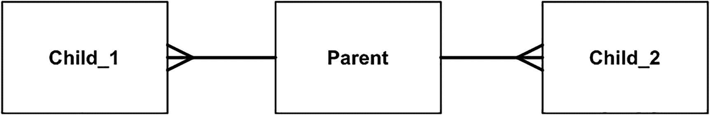

# 为这种方法——为您将要部署的数据库开发专用代码——提供的另一个论点

为这种方法——为您将要部署的数据库开发专用代码——提供的另一个论点是，要找到一位（更不用说一个团队）足够精明、能够理解 Oracle、SQL Server 和 DB2 之间差异细微之处的开发者（在此我们将讨论限制在三个数据库）几乎是不可能的。过去 20 年，我主要（并非 exclusively）使用 Oracle。我**每天**使用 Oracle 时都能学到新东西。认为我能够同时精通三种数据库，并理解所有三者之间的差异以及这些差异将如何影响我必须构建的“通用代码”层，这是非常值得怀疑的。我怀疑自己无法准确或高效地完成这一点。此外，请考虑我们这里谈论的是个体；有多少开发者能够完全理解或使用他们当前拥有的数据库，更不用说同时精通三个？寻找能够开发出健壮、可扩展、与数据库无关的例程的独特个体，犹如寻找**圣杯**。要组建一个能够做到这一点的开发团队是不可能的。寻找一位 Oracle 专家、一位 DB2 专家和一位 SQL Server 专家，然后告诉他们：“我们需要一个事务来完成 X、Y 和 Z”——这相对容易。他们被告知：“这是你的输入，这些是我们需要的输出，以及这个业务流程包含什么”，然后他们就能据此生成符合要求的事务性 API（存储过程）。每个 API 都将按照该特定数据库的独特功能集，以最适合该数据库的方式实现。这些开发者可以自由地利用底层数据库平台的全部能力（或者，在情况需要时，利用其不足之处）。

## 多平台代码技术

这些与实现多平台代码的开发者所使用的技术是相同的。例如，Oracle 在开发其自身数据库时就使用了这种技术。有大量代码（尽管占数据库整体代码的比例很小）被称为 *OSD*（操作系统相关）代码，这些代码是为每个平台专门实现的。通过使用这一抽象层，Oracle 能够利用许多原生操作系统特性来提升性能和集成度，而无需重写数据库本身的大部分代码。Oracle 能够在 Windows 上作为多线程应用程序运行，在 UNIX/Linux 上作为多进程应用程序运行，这一事实证明了这一特性。进程间通信的机制被抽象到了这样一个高度：它们可以根据不同的操作系统重新实现，从而允许采用截然不同但性能不亚于直接为该平台专门编写的应用程序的实现方式。

## 超越语法差异

除了前面概述的 SQL 语法差异、实现差异以及相同查询在不同数据库中的性能差异之外，还有并发控制、隔离级别、查询一致性等问题。我们将在本书第 7 章详细讨论这些项目，您将看到它们的差异可能如何影响您。SQL92/SQL99 试图为事务应如何工作以及隔离级别应如何实现提供一个明确的定义，但最终，您将从不同数据库获得不同的结果。这一切都归因于实现方式。在一个数据库中，应用程序可能会处处死锁和阻塞。在另一个数据库中，完全相同的应用程序却能平稳运行。在某个数据库中，您确实发生了阻塞（物理串行化）这一事实曾被您利用，但当您部署到另一个不发生阻塞的数据库时，您就得到了错误的结果。即使您 100% 遵循了标准，将应用程序迁移到另一个数据库也需要大量的艰苦工作和努力。

### 特性与功能

“不应一味追求数据库独立性”这一论点的自然延伸是，您应该确切了解您的特定数据库提供了什么，并充分利用它。本节并非关于 Oracle 提供的所有特性的介绍——那本身将是一本极其庞大的书。Oracle 提供了超过 10,000 页的文档，要涵盖每一个特性和功能将是一项相当艰巨的任务。相反，本节旨在探讨至少获得对所提供内容的大致了解所带来的好处。

正如我之前所说，我在网上回答关于 Oracle 的问题。我想说，我 80% 的回答只是指向文档的 URL（对于您看到的我发布的每一个问题——其中许多是指向文档中的特定部分——还有另外两个我选择不发布的问题，几乎所有这些都属于“读这个”类型的答案）。人们询问他们如何在数据库中（或在数据库之外）编写某些复杂的功能，而我只是指向文档中告诉他们 Oracle 如何已经实现了他们需要的特性以及如何使用的部分。复制（Replication）是一个经常出现的问题。以下是一个我被问到的典型例子：

> 是否有一个视图可以显示字面执行的 SQL？我的意思是，当我从 `V$SQL` 中选择时，`SQL_TEXT` 看起来像这样：`INSERT INTO TABLE1 (COL1,COL2) VALUES (:1,:2)`。我需要看到实际提交的数据。例如：`INSERT INTO TABLE1 (COL1,COL2) VALUES ('FirstVal',12)`。我试图获取的是针对一个模式运行的所有 insert、update 或 delete 语句的列表，然后按相同的执行顺序对第二个模式运行这些相同的 SQL 语句。我希望可以编写类似这样的内容：
>
> ```
> Select SQL_FULLTEXT from V$SQL where FIRST_LOAD_TIME > SYSDATE-(1/24) AND ➥
> (SQL_TEXT like ‘INSERT%’...) order by FIRST_LOAD_TIME
> ```
>
> 然后通过 Web 服务将此记录集发送给 schema2，由它来处理这些语句。这可能吗？

这里有人试图重新发明复制功能！他们无法获取字面 SQL（谢天谢地！），但即使他们能够获取，这种方法也永远不会奏效。您不能只是获取一组并发执行的 SQL 语句（在两个 SQL 语句同时执行的多 CPU 机器上会发生什么？），然后串行地执行它们（您最终可能会得到不同的结果！）。您需要使用与源系统相同的并发度来重放它们。

例如，如果我和你几乎在同一时间执行 `INSERT INTO A_TABLE SELECT * FROM A_TABLE;`，我们最终会让 `A_TABLE` 的行数变成开始时的三倍。例如，如果 `A_TABLE` 开始时有 100 行，我执行了那个插入，现在它将有 200 行。如果你在我之后（在我提交之前）立即执行插入，你将看不到我的 200 行，你会再向 `A_TABLE` 中插入 100 行，最终它会有 300 行。现在，如果我们改变做法，让一个 Web 服务先执行我的插入（`A_TABLE` 从 100 行增长到 200 行），然后再执行你的插入（`A_TABLE` 从 200 行增长到 400 行）——您就能看到这里的问题了。复制并非易事，实际上相当困难。Oracle（和其他数据库）进行复制已经超过三十年了；实施和维护它需要付出巨大的努力。


诚然，你可以自己编写复制功能，这甚至可能很有趣，但归根结底，这并非最明智之举。数据库已经做了大量工作。通常，它能比我们自己做得更好。以复制功能为例，它是内置于内核中的，用 C 语言编写。它速度快，相当容易实现，并且非常健壮。它能在不同版本和平台上工作。它是受支持的，因此如果你遇到问题，Oracle 的支持团队会提供帮助。如果你升级，复制功能也会得到支持，可能还会带有一些新功能。现在，想想看，如果你要自己开发复制功能，你会怎么做。你必须为你想要支持的所有版本提供支持。新旧版本之间的互操作性？那将是你的工作。如果它“坏了”，你不会打电话给支持团队——至少，直到你能提供一个足够小的测试用例来演示基本问题之前，你不会。当新版 Oracle 发布时，将由你负责将你的复制代码迁移到新版本上。

## 了解已有功能

从长远来看，未能充分了解可用的功能可能会反过来困扰你。我曾与一些拥有多年数据库应用开发经验（但在其他数据库上）的开发人员合作。他们构建分析软件（趋势分析、报告、可视化软件）。该软件用于处理与医疗保健相关的临床数据。他们不知道诸如内联视图、分析函数和标量子查询之类的 SQL 语法特性。他们的主要问题是需要从一个父表分析数据到两个子表；实体关系图（ERD）可能如图 1-1 所示。



图 1-1
简单的实体关系图

开发人员需要能够根据父记录报告来自每个子表的聚合数据。他们过去使用的数据库不支持子查询因子化（`WITH`子句），也不支持内联视图——即“查询一个查询”而非查询表的能力。由于不知道这些特性存在，他们在中间层编写了自己的类数据库。他们会查询父表，然后针对返回的每一行，对每个子表运行一个聚合查询。这导致他们为了运行用户想要的每一个查询，而执行成千上万个微小的查询。或者，他们会将整个聚合后的子表提取到中间层的内存哈希表中——然后执行哈希连接。

简而言之，他们在重新发明数据库，执行着相当于嵌套循环连接或哈希连接的功能，却无法利用临时表空间、复杂的查询优化器等优势。他们把时间花在开发、设计、微调和增强软件上，试图做他们已购买的数据库本身就能做的事情！与此同时，用户要求新功能却得不到满足，因为大部分开发时间都花在了这个报表“引擎”上，而它实际上是一个伪装起来的数据库引擎。

我向他们展示了，他们可以做一些事情，例如将两个聚合结果连接在一起，以比较存储在不同详细级别的数据。有几种方法可行，如清单 1-1 到 1-3 所示。

```
with c1_vw as
(select id, sum(q1) c1_sum1
from c1
group by id),
c2_vw as
(select id, sum(q2) c2_sum2
from c2
group by id),
c1_c2 as
(select c1.id, c1.c1_sum1, c2.c2_sum2
from c1_vw c1, c2_vw c2
where c1.id = c2.id )
select p.id, c1_sum1, c2_sum2
from p, c1_c2
where p.id = c1_c2.id
/
```

清单 1-3
通过 `WITH` 子句进行子查询因子化

```
select p.id,
(select sum(q1) from c1 where c1.id = p.id) c1_sum1,
(select sum(q2) from c2 where c2.id = p.id) c2_sum2
from p
where p.name = '1234'
/
```

清单 1-2
为每一行运行另一个查询的标量子查询

```
select p.id, c1_sum1, c2_sum2
from p,
(select id, sum(q1) c1_sum1
from c1
group by id) c1,
(select id, sum(q2) c2_sum2
from c2
group by id) c2
where p.id = c1.id
and p.id = c2.id
/
```

清单 1-1
用于从查询中进行查询的内联视图

除了你在这些清单中看到的，我们还可以使用`LAG`、`LEAD`、`ROW_NUMBER`、排名函数等分析函数来做很棒的事情。我们没有花一整天的时间去设法调整他们的中间层数据库引擎，而是将`SQL 参考指南`投射在屏幕上（并结合`SQL*Plus`来创建即席演示，展示其工作原理）。最终目标不再是调整中间层；现在是要尽快关闭中间层。

这是另一个例子：我见过人们在 Oracle 数据库中设置守护进程，用于从管道（一种通过`DBMS_PIPE`实现的数据库 IPC 机制）读取消息。这些守护进程执行管道消息中包含的 SQL 并提交工作。他们这样做是为了在可能因主事务回滚而回滚的事务中，能够执行审计和错误日志记录。通常，如果使用触发器之类的东西来审计对某些数据的访问，但随后某条语句失败了，所有工作都将被回滚。因此，通过向另一个进程发送消息，他们可以让一个独立的事务完成工作并提交。即使主事务回滚，审计记录也会保留下来。在 Oracle 8*i*之前的版本中，这是实现此功能的适当（并且几乎是唯一的）方式。当我告诉他们数据库有一个叫做`自治事务`的特性时，他们对自己感到相当恼火。`自治事务`仅需一行代码实现，其功能与他们所做的一模一样。从好的方面看，这意味着他们可以丢弃大量代码，并且无需再维护它。此外，整个系统运行得更快，也更容易理解。尽管如此，他们还是为自己浪费了那么多时间去重新发明轮子而感到沮丧。特别是，编写了那些守护进程的开发人员，在得知自己刚刚写了一堆“架子软件”后，相当懊恼。

我一次又一次地看到类似的例子——针对数据库本身已经解决的问题，采用庞大复杂的解决方案。*我自己也曾犯过这种错误。* 我仍然记得那一天，我的 Oracle 销售顾问（当时我是客户）走进来，看到我被一大堆 Oracle 文档包围着。我抬头看着他，只是问道：“这些全都是真的吗？”接下来的几天，我都在钻研和阅读。我掉进了一个陷阱，以为自己精通数据库，因为我曾使用过 SQL Server、SQL/DS、DB2、Ingress、Sybase、Informix、SQLBase、Oracle 等。我没有花时间去了解每个数据库各自提供了什么，而只是把我从其他数据库学到的知识应用到我正在做的事情上。（切换到 Sybase/SQL Server 对我来说是最大的冲击——它的运作方式与其他数据库完全不同。）在真正发现 Oracle 能做什么（公平地说，也包括其他数据库）之后，我开始利用它，从而能够以更少的代码更快地推进工作。

花点时间去了解可用的功能。不这样做，你会错过太多东西。我几乎每天都能学到关于 Oracle 的新东西。这需要持续跟进；我仍然会阅读文档。


