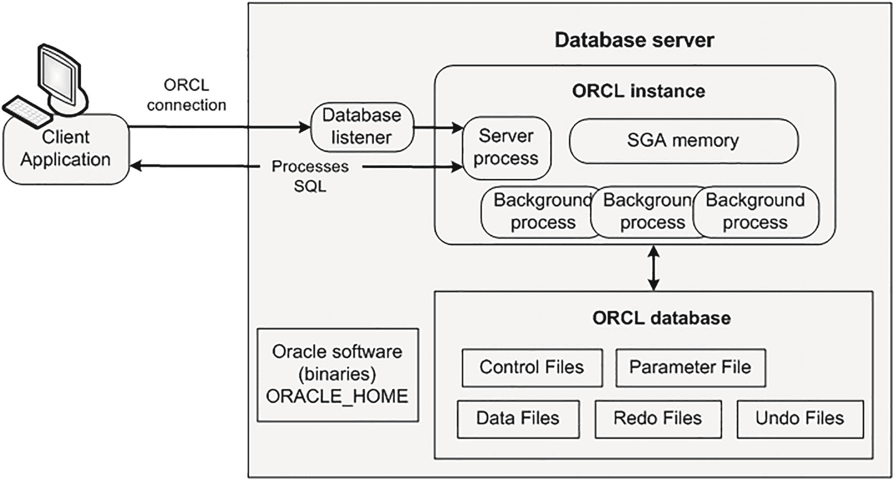
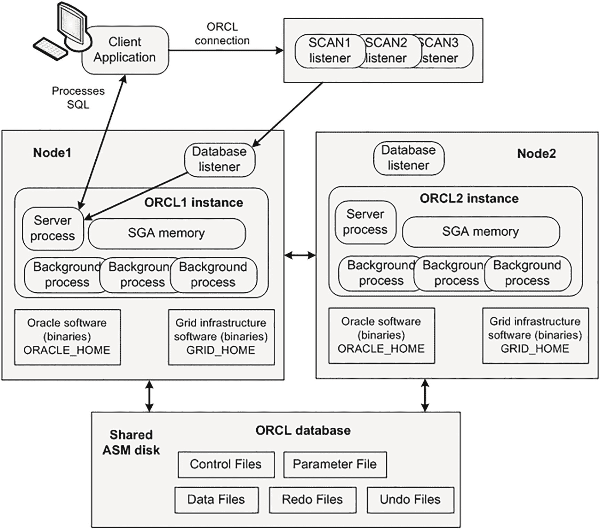
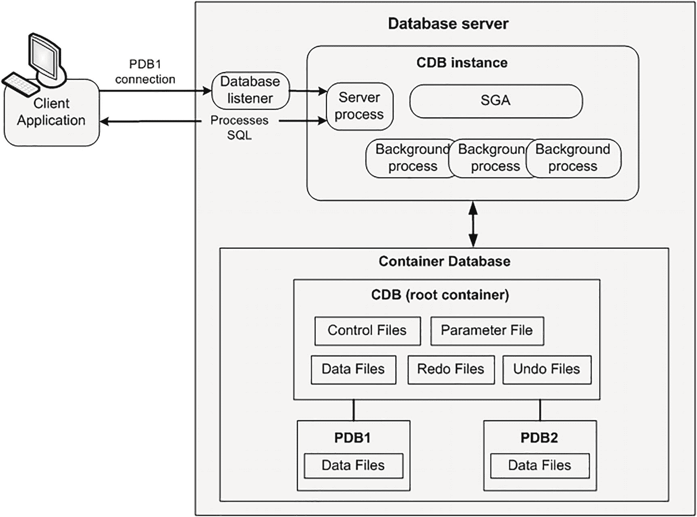
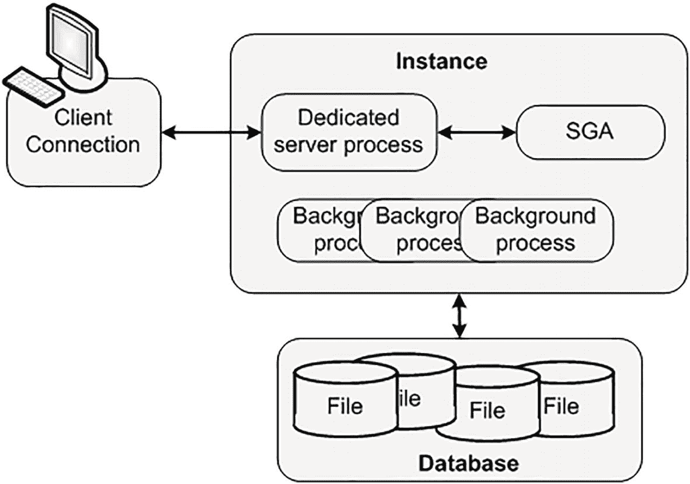
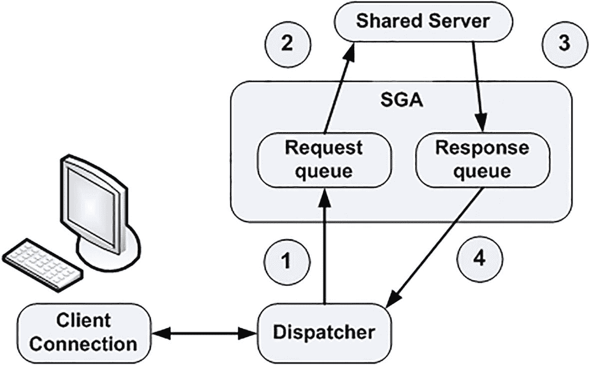
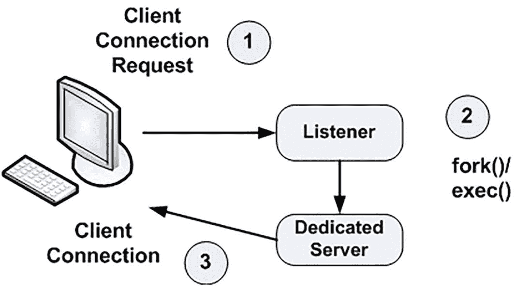
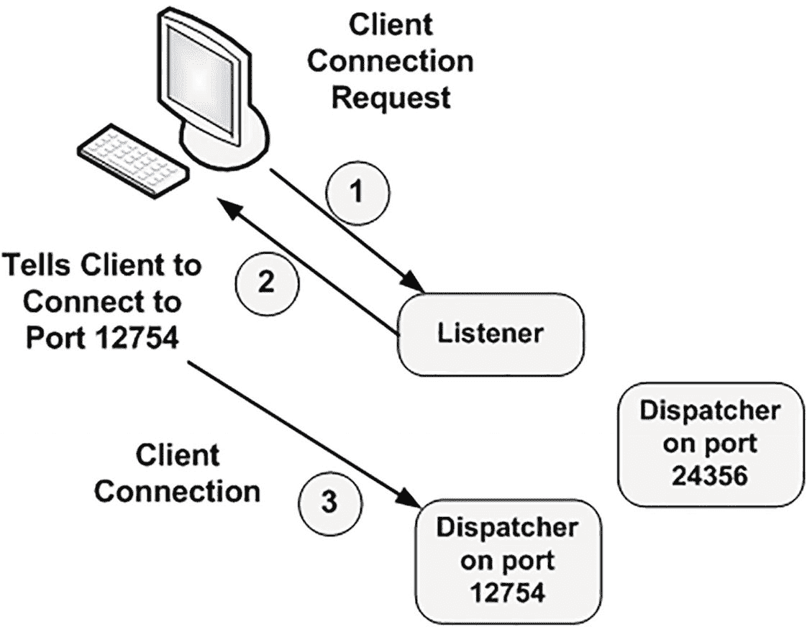

# 2. 架构概览

Oracle 被设计为一款高度可移植的数据库——它覆盖了所有相关平台，从 Windows 到 UNIX/Linux，再到基于云的系统。然而，Oracle 的物理架构在不同的操作系统上表现各异。例如，在 UNIX/Linux 操作系统上，Oracle 被实现为许多独立的操作系统进程，几乎每个主要功能对应一个进程。在 UNIX/Linux 上，这是正确的实现方式，因为它基于多处理器架构。但在 Windows 上，这种架构就不合适了，运行效果会很差（速度慢且无法扩展）。在 Windows 平台上，Oracle 被实现为一个包含多个线程的单一进程。尽管在不同平台上实现 Oracle 所采用的物理机制各不相同，但其架构具有足够的通用性，足以让你透彻理解 Oracle 在所有平台上的工作方式。

本章，我将概述这一架构。我们将审视 Oracle 服务器，并定义一些术语，如 `数据库`、`实例`、`容器数据库`、`可插拔数据库`、`真正应用集群 (RAC) 数据库` 以及 `分片数据库`。我们还会了解当您“连接”到 Oracle 时会发生什么，并从高层视角看服务器如何管理内存。在接下来的三章中，我们将详细探讨 Oracle 架构的三大核心组件：

*   第 3 章涵盖文件。我们将了解构成数据库的五大类文件：`参数文件`、`数据文件`、`临时文件`、`控制文件` 和 `重做日志文件`。我们还将介绍其他类型的文件，包括 `跟踪文件`、`警报文件`、`转储 (DMP) 文件`、`数据泵文件` 以及 `简单平面文件`。我们将考察名为 `快速恢复区 (FRA)` 的文件存储区域，并讨论 `自动存储管理 (ASM)` 对文件存储的影响。

*   第 4 章涵盖被称为 `系统全局区 (SGA)`、`程序全局区 (PGA)` 和 `用户全局区 (UGA)` 的 Oracle 内存结构。我们将审视这些结构之间的关系，并讨论 `共享池`、`大池`、`Java 池` 以及 `SGA` 的其他各种组件。

*   第 5 章涵盖 Oracle 的物理进程或线程。我们将了解将在数据库上运行的三种不同类型的进程：`服务器进程`、`后台进程` 和 `从属进程`。

在决定首先介绍哪个组件时颇费思量。进程会使用 `SGA`，因此在讨论进程之前讨论 `SGA` 可能不合逻辑。另一方面，在讨论进程及其功能时，又需要引用 `SGA`。这两个组件紧密相连：文件由进程操作，如果不首先理解进程的功能，文件的概念也无从谈起。

因此，我打算先定义一些术语，并给出 Oracle 架构的概览（就像在白板上画出来那样）。需要了解两种基本架构。一种是 Oracle 数据库从版本 6 到 11g 一直独家采用的架构（本书中现在称之为 `单租户` 架构），以及从 Oracle 12c 开始可用的新型多租户架构（`容器数据库`/`可插拔数据库`）。此外，我还将描述两种 Oracle 数据库的变体，即 `Oracle 真正应用集群 (RAC)` 和 `Oracle 分片数据库`。之后，您就可以准备深入一些细节了。

## 数据库类型

有两个术语在 Oracle 语境中使用时，似乎会引起很大的混淆：`数据库` 和 `实例`。公平地说，部分原因在于不同的数据库供应商使用相同的术语来表示不同的含义。在 Oracle 的术语中，`数据库` 是物理操作系统文件或磁盘的集合。当使用 `Oracle 自动存储管理 (ASM)` 时，数据库在操作系统中可能不会表现为独立、分散的文件，但其定义保持不变。

相比之下，`实例` 是一组 Oracle 后台进程（或线程）和一个共享内存区，即运行在单台计算机上的那些线程或进程之间共享的内存。这是存放易失性、非持久化数据的地方，其中部分数据会被刷新到磁盘。一个数据库实例可以完全不依赖任何磁盘存储而存在。这可能不是世界上最有用的东西，但这样思考无疑有助于划清实例与数据库之间的界限。

`实例` 和 `数据库` 这两个术语有时被互换使用，但它们包含的概念大相径庭，尤其是在多租户架构和 `Oracle 真正应用集群 (RAC)` 架构中。在 Oracle 的早期版本中，实例与数据库之间通常是一对一的关系。这可能是围绕这些术语产生混淆的原因。然而，从技术角度精确地说，`实例` 指的是 Oracle 的进程和内存。而 `数据库` 指的是保存数据的物理文件。一个数据库可以被多个实例访问，但一个实例一次将且仅提供对一个数据库的访问（无论数据库类型为何）。这一点稍后会变得更加清晰。接下来，让我们看看单租户数据库的定义。


### 单租户（非容器）数据库

一个`单租户数据库或非容器数据库`是一个自包含的数据文件、控制文件、重做日志文件、参数文件等的集合。除了所有的应用程序元数据、数据和代码外，它还包含所有 Oracle 元数据（例如`ALL_OBJECTS`的定义）、Oracle 数据和 Oracle 代码（如`DBMS_OUTPUT`的代码）。这是 Oracle 12c 版本之前唯一存在的数据库类型。

图 2-1 描述了单租户数据库架构。数据库名称为`ORCL`，实例名称也为`ORCL`。客户端通过连接到数据库监听器来发起对`ORCL`实例的连接。监听器将连接移交给一个数据库服务器进程。从那时起，数据库服务器进程负责处理客户端发送的用于查看或操作数据的任何 SQL 请求。



图 2-1：Oracle 的单租户（非容器数据库）架构

图 2-1 显示你拥有一个数据库服务器（有时称为主机、机器、虚拟机、节点等）。在该数据库服务器上，你有一个实例（内存结构、后台进程和其他进程）和一个数据库（磁盘上的物理文件）。内存结构与访问和操作数据（磁盘上的数据文件）的客户端（用户）进程进行交互。客户端连接到在数据库服务器上运行的监听器进程。然后，监听器将连接移交给一个服务器进程，该进程处理来自客户端的 SQL 处理请求。

与数据库文件分开的是 Oracle 安装软件文件（有时称为二进制文件）。它们通常安装在磁盘上名为`ORACLE_HOME`的位置（各种组件存储在子目录中）。二进制文件的例子包括`oracle`、`sqlplus`、`rman`、`dbca`、`expdp`、`impdp`、`lsnrctl`等。

实例启动后，你可以通过`ipcs`命令（在 UNIX/Linux 上）查看其内存组件：

```
$ ipcs
```

以下是输出的一个片段：

```
------ Shared Memory Segments --------
key        shmid      owner      perms      bytes      nattch     status
0x00000000 42         oracle     600        8908800    104
0x00000000 43         oracle     600        1056964608 52
0x00000000 44         oracle     600        7868416    52
0x43f8ffbc 45         oracle     600        24576      52
```

要查看与`ORCL`实例关联的系统监控器后台进程，你可以发出进程状态命令（在 UNIX/Linux 上）：

```
$ ps -ef | grep smon
oracle    7969     1  0 22:43 ?        00:00:00 ora_smon_ORCL
```

我们可以通过以下查询查看与`ORCL`数据库关联的数据文件：

```
$ sqlplus / as sysdba
SQL> select name from v$datafile;
NAME

/opt/oracle/oradata/ORCL/ORCL/datafile/o1_mf_system_j480tkhg_.dbf
/opt/oracle/oradata/ORCL/ORCL/datafile/o1_mf_sysaux_j480vnpn_.dbf
/opt/oracle/oradata/ORCL/ORCL/datafile/o1_mf_undotbs1_j480wfwd_.dbf
/opt/oracle/oradata/ORCL/ORCL/datafile/o1_mf_users_j480wgz7_.dbf
```

总而言之，前面的例子创建了一个单租户（非容器）类型的数据库。这种单租户类型的数据库架构已被 Oracle 弃用。此外，Oracle 已声明，从 Oracle 21c 开始，单租户架构将不再提供支持。尽管如此，这种类型的数据库仍然被广泛使用。许多在旧版 Oracle 上运行的遗留系统仍然使用这种架构。因此，熟悉这种类型的数据库架构非常重要。

### 单租户（非容器）RAC 数据库

在 Oracle 实时应用集群（RAC）这一特殊情况下，RAC 是 Oracle 的一个选项，允许其在集群环境中的多台计算机上运行，我们可能有多个实例同时挂载和打开这一个位于一组共享物理磁盘上的数据库。换句话说，一个 RAC 数据库由一个或多个连接到一个数据库的实例组成。多个 RAC 实例运行在不同的服务器（节点或主机）上。所有实例共享相同的数据库（磁盘上的文件）。RAC 数据库是为高可用性、性能和可扩展性而设计的。其理念是，当你需要更多的 CPU 和内存处理能力时，可以添加更多的实例（节点）。此功能需要额外的 Oracle 许可才能使用。图 2-2 描述了 RAC 架构。这个 RAC 数据库有两个实例，分别名为`ORCL1`和`ORCL2`。两个实例都连接到一个单一的`ORCL`数据库。



图 2-2：双节点 RAC 配置中的 Oracle 单租户（非容器数据库）架构

客户端连接到一个特殊的单一客户端访问名称（SCAN）RAC 监听器，该监听器将连接请求移交给其中一个数据库监听器（在此示例中为节点 1 上的监听器）。然后，监听器将客户端请求连接到`HR1`实例中的一个服务器进程，该进程随后处理客户端发起的任何 SQL 处理。在此配置中，你可以有一个或多个节点。每个实例使用相同的物理`ORCL`数据库。RAC 软件负责处理多个实例可能同时访问单一数据库数据文件集中相同数据块所带来的复杂性。

除了 Oracle 主目录二进制文件外，RAC 配置还需要 Grid Infrastructure 软件，其中包括用于管理共享磁盘的自动存储管理（ASM）软件。Grid 软件通常安装在磁盘上名为`GRID_HOME`的位置（各种组件存储在子目录中）。Grid 主目录软件与 Oracle 主目录软件是分开的。

总而言之，图 2-2 中描述的数据库是一个单租户的两节点 RAC 数据库。同样，这种单租户类型的数据库已被 Oracle 弃用，并将从 Oracle 21c 开始不再提供支持。


### 多租户容器数据库

从 Oracle 12c 开始，Oracle 引入了一种新型数据库：多租户容器数据库及相关的可插拔数据库。一个 `多租户容器数据库 (CDB)` 或 `根容器数据库` 是一组自包含的数据文件、控制文件、重做日志文件、参数文件等，其中仅包含 Oracle 元数据、Oracle 数据和 Oracle 代码。这些数据文件中不包含任何应用程序对象或代码——只有 Oracle 提供的元数据和 Oracle 提供的代码对象。该数据库是自包含的，因为它可以在没有任何其他支持性物理结构的情况下被挂载和打开。

### 可插拔数据库

一个 `可插拔数据库 (PDB)` 仅是一组数据文件。它不是自包含的。可插拔数据库需要一个容器数据库来“插入”，以便被打开和访问。这些数据文件只包含应用程序对象的元数据、应用程序数据以及这些应用程序的代码。这些数据文件中没有 Oracle 元数据或任何 Oracle 代码。没有重做日志文件、控制文件、参数文件等——只有与可插拔数据库关联的数据文件。可插拔数据库从它当前插入的容器数据库继承这些其他类型的文件。

一个可插拔数据库一次只与一个容器数据库关联，并且仅与一个实例间接关联；它将共享为挂载和打开容器数据库而创建的实例。因此，与容器数据库类似，一个可插拔数据库在任何时间点可以与一个或多个实例关联。根容器实例可能同时为多个（数千个）可插拔数据库提供访问。也就是说，单个实例可能为多个可插拔数据库提供服务，但只为一个容器数据库服务。

### 架构与连接性

图 2-3 展示了容器数据库及其关联的可插拔数据库的架构。容器实例名为 `CDB`，根容器也名为 `CDB`。有两个可插拔数据库（`PDB1` 和 `PDB2`）附加到此容器数据库。



*图 2-3：一个包含两个可插拔数据库的容器数据库*

如图所示，客户端发起到 `PDB1` 可插拔数据库的连接。监听器将客户端连接到处理 SQL 请求的服务器进程。在此配置中，客户端连接到 `CDB` 实例并访问 `PDB1` 可插拔数据库。客户端无法看到容器内的任何其他可插拔数据库。换句话说，客户端只能访问其当前连接到的可插拔数据库（本例中为 `PDB1`）内的数据。

此容器数据库只关联一个实例 (`CDB`)。我们可以通过以下方式查看此实例的系统监控进程：

```
$ ps -ef | grep smon
oracle   19362     1  0 00:29 ?        00:00:00 ora_smon_CDB
```

我们可以查看与根容器数据库以及可插拔数据库关联的数据文件。首先，连接到根容器：

```
$ sqlplus / as sysdba
```

在连接到根容器后，我们可以查看与根容器和两个可插拔数据库关联的所有数据文件：

```
SQL> select name from v$datafile;
NAME

/opt/oracle/oradata/CDB/system01.dbf
/opt/oracle/oradata/CDB/sysaux01.dbf
/opt/oracle/oradata/CDB/undotbs01.dbf
/opt/oracle/oradata/CDB/pdbseed/system01.dbf
/opt/oracle/oradata/CDB/pdbseed/sysaux01.dbf
/opt/oracle/oradata/CDB/users01.dbf
/opt/oracle/oradata/CDB/pdbseed/undotbs01.dbf
/opt/oracle/oradata/CDB/PDB1/system01.dbf
/opt/oracle/oradata/CDB/PDB1/sysaux01.dbf
/opt/oracle/oradata/CDB/PDB1/undotbs01.dbf
/opt/oracle/oradata/CDB/PDB1/users01.dbf
/opt/oracle/oradata/CDB/PDB2/system01.dbf
/opt/oracle/oradata/CDB/PDB2/sysaux01.dbf
/opt/oracle/oradata/CDB/PDB2/undotbs01.dbf
/opt/oracle/oradata/CDB/PDB2/users01.dbf
```

要连接到 `PDB1` 数据库，我在连接字符串中使用 `PDB1` 服务（稍后会详细介绍）：

```
$ sqlplus system/foo@localhost:1521/PDB1
```

连接到 `PDB1` 时，无法看到数据库中的任何其他容器。就 `PDB1` 可插拔数据库而言，它看不到其他任何数据库。例如，查询数据文件名称只显示与 `PDB1` 可插拔数据库关联的数据文件：

```
SQL> select name from v$datafile;
NAME

/opt/oracle/oradata/CDB/PDB1/system01.dbf
/opt/oracle/oradata/CDB/PDB1/sysaux01.dbf
/opt/oracle/oradata/CDB/PDB1/undotbs01.dbf
/opt/oracle/oradata/CDB/PDB1/users01.dbf
```

这意味着你可以在 `PDB1` 中放置一个应用程序及其所有用户和对象，同时可以在 `PDB2` 中放置一个完全不同的应用程序。这两个数据库之间的用户和对象不会发生冲突。它们在物理上是作为两个独立的可插拔数据库（在一个容器数据库内）实现的。

### 职责总结

多个可插拔数据库，从属于容器数据库，可以同时打开并可访问——但都将共享为打开容器数据库而创建的单个实例。一个可插拔数据库为了被使用、被查询，必须与一个容器数据库关联。该容器数据库将只包含 Oracle 数据和元数据——即 Oracle “运行”所需的信息。可插拔数据库则拥有数据库元数据和数据的“其余部分”。

例如，容器数据库将包含 "`SYS`" 用户的定义（`SYS` 用户的元数据），以及诸如 `DBMS_OUTPUT` 和 `UTL_FILE` 等对象的编译代码和源代码。而可插拔数据库则包含应用程序模式（如 `SCOTT`）的定义，描述 `SCOTT` 模式中所有表的元数据，`SCOTT` 模式的所有 PL/SQL 源代码，授予 `SCOTT` 模式的所有 `GRANTS`，等等。简而言之，可插拔数据库拥有描述一组应用程序模式的所有内容——账户的元数据、这些账户中表的元数据以及这些表的实际数据。可插拔数据库就其所包含的应用程序账户而言是自包含的，但它需要一个容器数据库来被“打开”和查询。因此，可以说可插拔数据库不是“自包含的”，它需要其他东西才能被打开和使用。

可插拔数据库不是直接由实例打开的，而是必须先启动一个 Oracle 实例，并由该实例挂载并打开容器数据库。一旦容器实例启动并运行，且容器数据库被打开，该容器数据库就可以打开多个可插拔数据库。每个可插拔数据库的行为都如同一个“独立”数据库。也就是说，它们看起来是自包含的、独立的“单一租户”数据库。但它们都共享同一个容器数据库和容器实例。

**注意**

在 Oracle 19c 及更高版本中，企业版数据库中最多可以包含三个由客户创建的可插拔数据库，无需额外许可。使用多租户许可，你可以在单个容器数据库中拥有多达 4096 个独立的可插拔数据库。


当你启动一个 Oracle 实例时，会有许多进程与之关联（更多内容见第 5 章）。每个实例由大约一百个左右的进程提供支持（具体数量因配置而异）。如果你尝试启动 50 个单租户数据库——每个数据库都有一个与之关联的实例或其自己的实例——那么仅仅为了启动这些数据库，你就需要创建超过 5000 个进程！这对操作系统来说是极大的负担，无论是创建如此多的进程还是后续管理它们。

此外，每个实例都会有自己的 SGA。第 4 章将介绍 SGA 中包含的内容，但可以说，其中存在大量重复。每个 SGA 都会在其共享池中缓存一份 `DBMS_OUTPUT` 的副本，并且每个 SGA 都会有一个重做日志缓冲区和许多其他重复的数据结构。

使用可插拔数据库，你可以实现应用程序元数据、用户、数据、代码等的分离，同时避免冗余的实例。也就是说，你可以通过单个实例与单个容器数据库（包含 Oracle 元数据、代码和数据）来提供对多个可插拔数据库的访问，每个可插拔数据库托管一个独立的应用程序。这能大幅降低服务器资源的消耗。通常，为这些应用程序可插拔数据库分配的那个单独的 SGA 大小，将小于你原本需要为各个单独 SGA 分配的大小之和。

从开发人员的角度来看，可插拔数据库与单租户数据库并无不同。应用程序连接数据库的方式，与它在早期版本中连接单租户数据库的方式完全相同。差异在于底层架构——即一个实例服务于多个可插拔数据库，以及由此带来的服务器资源消耗的减少和数据库管理员管理的便捷性。

从数据库管理员的角度来看，数据库管理的方式发生了许多变化——都是积极的变化。例如，如果数据库管理员为 RAC 配置了一个容器数据库，那么该容器下的每个可插拔数据库都将启用 RAC。Data Guard、RMAN 备份等方面也是如此。数据库管理员只需配置和使用一个实例，而不是像过去那样每个应用程序都需要一个实例。

### 多租户 RAC 数据库

在多租户 RAC 数据库中，你有一个或多个实例连接到一个容器数据库。在该容器数据库内，有一个或多个可插拔数据库。图 2-4 展示了一个双节点 RAC 数据库，连接到一个名为 `CDB` 的容器数据库，该容器包含两个可插拔数据库（`PDB1` 和 `PDB2`）。此配置中有两个实例（`CDB1` 和 `CDB2`）。RAC 容器数据库访问从每个节点都可见的共享 `ASM` 磁盘。


图 2-4 包含两个可插拔数据库的双节点 RAC 容器数据库

在此示例中，客户端发起到 `PDB1` 可插拔数据库的连接。这会连接到 RAC `SCAN` 监听器，该监听器将连接请求转交给其中一个数据库监听器（本例中为节点 1）。监听器将客户端连接到 `CDB1` 实例中的一个服务器进程。在此配置中，客户端连接到 `CDB1` 实例并访问 `PDB1` 可插拔数据库。客户端无法看到容器内的其他可插拔数据库（`PDB2`）。换句话说，客户端只能访问其当前连接的可插拔数据库（本例中为 `PDB1`）内的数据。

### 分区数据库

从 Oracle 12.2 开始，`分区数据库` 特性是一个逻辑数据库，它水平分区分布在不共享任何硬件基础设施的物理数据库池上。换句话说，分片中的每个数据库都托管在拥有独立 CPU、内存和磁盘的专用服务器上。从最终用户应用程序的角度看，`分区数据库` 在逻辑上就像一个数据库，但在底层，它由一个或多个物理数据库组成。

`分区数据库` 中的每个数据库被称为一个 `分片`。数据库 `分片` 可以是单实例或多实例的 RAC 数据库。创建表时，需要指定一个列作为分布键。分布键可以定义为一致性、哈希或列表。每个 `分区数据库` 环境都使用一个 `分区目录数据库`。`分区目录` 支持诸如自动化分片部署、`分区数据库` 的集中管理以及多分片查询等任务。还有 `分片导向器`，它们是监听器，负责基于分片键处理连接路由。

图 2-5 （在较高层面上）展示了 `分区数据库` 的基本架构。客户端发起到与 `分区数据库` 关联的全局服务的连接。这将客户端连接到一个连接池。数据请求根据分片键被路由到适当的实例。


图 2-5 包含三个数据库 `分片` 的 `分区数据库`

数据库分片的主要优点如下：

*   `线性可扩展性`：你可以根据业务需求添加或移除 `分片`。
*   `容错性`：数据库 `分片` 存在于独立的硬件上；因此，一个数据库 `分片` 的故障不会影响其他 `分片`。
*   `数据的地理分布`：你可能出于法律原因或隐私法规要求而希望这样做。
*   `滚动升级`：每个 `分片` 都可以独立升级。
*   `区域性性能`：每个 `分片` 可以存在于特定的地理区域，拥有自己的硬件和存储配置。

每个数据库 `分片` 都是自包含的，意味着每个 `分片` 都有自己的 SGA 和后台进程。因此，与 RAC（多个实例共享同一组物理数据库文件）不同，分片是多个数据库（每个都有自己的实例）呈现给最终用户时，被视为一个逻辑数据库。


## SGA 与后台进程

正如本书前面章节所见，每个 Oracle 实例都拥有一大块称为 SGA 的内存，例如，它被用于完成以下工作：

*   维护所有进程都需要访问的众多内部数据结构。
*   缓存磁盘数据；在将重做数据写入磁盘前对其进行缓冲。
*   保存已解析的 SQL 执行计划。
*   等等。

Oracle 有一组“附着”在该 SGA 上的进程，它们附着的机制因操作系统而异。在 UNIX/Linux 环境中，进程会物理附着到一个大的共享内存段上，这是一块在操作系统中分配的、可以被多个进程并发访问的内存（通常使用 `shmget()` 和 `shmat()`）。在 Windows 下，这些进程只是简单地使用 C 语言调用 `malloc()` 来分配内存，因为它们实际上是一个大进程中的多个线程，因此共享同一个虚拟内存空间。

Oracle 还有一组供数据库进程或线程读写的文件（并且只有 Oracle 进程被允许读写这些文件）。在单租户架构中，这些文件保存了我们所有的表数据、索引、临时空间、重做日志、PL/SQL 代码等等。在多租户架构中，容器数据库将保存所有与 Oracle 相关的元数据、数据和代码；我们的应用程序数据将单独保存在一个可插拔数据库中。

如果你在基于 UNIX/Linux 的系统上启动 Oracle 并执行 `ps` 命令，你会看到许多具有不同名称的物理进程正在运行。例如，如果你想查看系统监控进程，可以执行以下命令：

```
$ ps -ef | grep smon
oracle   19362     1  0 00:29 ?        00:00:00 ora_smon_CDB
```

我将在第 5 章详细介绍这些进程，所以现在只需要知道它们通常被称为 `Oracle 后台进程`。它们是构成实例的持久性进程，从实例启动到关闭期间，你都能看到它们。

有趣的是，这些是进程，而不是独立的程序。在 UNIX/Linux 上只有一个 Oracle 二进制可执行文件；它具有许多“角色”，这取决于它在启动时被告知要执行什么任务。用于启动 `smon` 的那个二进制可执行文件，同样也用于启动 `检查点后台进程`。只有一个名为 `oracle` 的二进制可执行程序，它只是以不同的名称被执行了多次。

## 连接到 Oracle

在本节中，我们将探讨两种最常见的让 Oracle 服务器处理请求的方式背后的机制：`专用服务器` 连接和 `共享服务器` 连接。我们将了解在客户端和服务器端为了建立连接以便登录并实际在数据库中工作所发生的事情。最后，我们将简要了解如何建立 TCP/IP 连接；TCP/IP 是用于通过网络连接到 Oracle 的主要网络协议。并且我们将查看服务器上负责与服务器建立物理连接的监听器进程，在专用服务器连接和共享服务器连接的情况下是如何以不同方式工作的。

### 专用服务器

如果我们使用专用服务器登录数据库，我们将看到一个新进程（在某些其他操作系统上是一个线程）被创建，专门为我们提供服务。例如：

```
$ sqlplus system/foo@localhost:1521/PDB1
```

现在使用进程状态命令，让我们查看专用服务器进程：

```
$ ps -ef | grep $ORACLE_SID
```

以下是输出的其中一部分，仅显示专用服务器进程：

```
oracle   24443     1  0 02:03 ?        00:00:00 oracleCDB (LOCAL=NO)
```

当我们注销时，这个额外的进程/线程将会消失。图 2-6 描绘了专用服务器的配置。



图 2-6 典型的专用服务器配置

如前所述，通常 Oracle 会在我登录时为我创建一个新进程。这通常被称为专用服务器配置，因为一个服务器进程将在我的会话生命周期内专门服务于我。对于每个会话，都会出现一个新的专用服务器，形成一对一的映射。我的客户端进程（任何尝试连接到数据库的程序）将通过某种网络通道（例如 TCP/IP 套接字）与此专用服务器直接通信。正是这个服务器进程接收我的 SQL 并为我执行。它会在必要时读取数据文件，并在数据库缓存中查找我的数据。它将执行我的更新语句。它将运行我的 PL/SQL 代码。它唯一的目标就是响应我提交给它的 SQL 调用。


## 共享服务器

Oracle 也可以以一种称为 `shared server` 的模式接受连接，在此模式下，您不会看到为每个用户连接创建额外的线程或出现新的 UNIX/Linux 进程。

> 注意
> 在旧版 Oracle 中，`shared server` 被称为 `multithreaded server` 或 `MTS`。这个遗留名称现已不再使用。

在 `shared server` 模式中，Oracle 为大量的用户使用一个共享的进程池。`shared servers` 本质上是一种连接池机制。系统不是为 10,000 个数据库会话分配 10,000 个专用服务器（那将会是巨量的进程或线程），而是使用占总数一小部分的进程或线程，这些进程（顾名思义）由所有会话共享。这使得 Oracle 能够将比通常情况下多得多的用户连接到实例。我们的机器可能无法承受管理 10,000 个进程的负载，但管理 100 或 1000 个进程是可行的。在 `shared server` 模式下，共享进程通常随数据库启动，并出现在 `ps` 命令的列表中。

`shared server` 连接与 `dedicated server` 连接的一个很大区别在于，连接到数据库的客户端进程从不直接与 `shared server` 通信，就像它与 `dedicated server` 那样。它无法直接与 `shared server` 对话，因为该进程实际上是共享的。为了共享这些进程，我们需要另一种“对话”机制。Oracle 为此目的采用了一个称为 `dispatcher` 的进程（或一组进程）。客户端进程将通过网络与 `dispatcher` 进程对话。`dispatcher` 进程会将客户端的请求放入 SGA 中的请求队列（这是 SGA 的众多用途之一）。第一个不忙的 `shared server` 将获取此请求并进行处理（例如，请求可能是 `UPDATE T SET X = X+5 WHERE Y = 2`）。此命令完成后，`shared server` 会将响应放入调用 `dispatcher` 的响应队列。`dispatcher` 进程监控此队列，并在看到结果后将其传输回客户端。从概念上讲，`shared server` 请求的流程如图 2-7 所示。



**图 2-7**
`shared server` 请求的步骤

如图 2-7 所示，客户端连接将请求发送给 `dispatcher`。`dispatcher` 会首先将此请求放入 SGA 的请求队列 (1)。第一个可用的 `shared server` 将出队此请求 (2) 并进行处理。当 `shared server` 完成后，响应（返回码、数据等）被放入响应队列 (3)，随后由 `dispatcher` 拾取 (4) 并传回给客户端。

就开发人员而言，从概念上讲，`shared server` 连接和 `dedicated server` 连接没有区别。在架构上，它们差异很大，但应用程序对此并不明显。

既然您理解了什么是 `dedicated server` 和 `shared server` 连接，您可能有以下问题：

*   我最初是如何连接的？
*   是什么启动了这个 `dedicated server`？
*   我如何与 `dispatcher` 取得联系？

答案取决于您的具体平台，但以下各节将概述这个过程。

## 通过 TCP/IP 连接的机制

我们将研究最常见的网络情况：通过 TCP/IP 发起的基于网络的连接请求。在这种情况下，客户端位于一台机器上，服务器位于另一台机器上，两者通过 TCP/IP 网络连接。一切都始于客户端。客户端使用 Oracle 客户端软件（一组提供的应用程序编程接口，或 API）发出连接到数据库的请求。客户端可以是您笔记本电脑上的 `SQL*Plus`、使用 `JDBC` 连接的应用程序、`TOAD`、`SQL Developer` 等。

在客户端，当您连接到 Oracle 实例时，需要提供一个 `connection string`。`connection string` 包含允许您的客户端软件通过网络定位并连接到远程数据库实例的信息。连接字符串由以下信息组成：

*   `Username`：有时也称为模式名或数据库用户账户。
*   `Password`：分配给用户名的密码。
*   `Hostname (or IP address)`：数据库运行所在的主机（服务器）。
*   `Port`：数据库监听器正在监听的端口。默认端口是 `1521`。
*   `Service name`：从概念上讲，您可以将服务名称视为您要连接的数据库实例的同义词。服务名称通常就是您正在连接的实例名称或可插拔数据库名称。更技术性地说，服务名称代表具有共同属性、服务级别阈值和优先级的应用程序组。提供该服务的实例数量对应用程序是透明的，每个数据库实例可能向监听器注册为愿意提供许多服务。因此，服务被映射到物理数据库实例，并允许 DBA 将某些阈值和优先级与之关联。

如果您使用 `SQL*Plus` 客户端连接到 Oracle 实例，可以在命令行上指定所有上述信息（这称为 `easy connect` 方法）。`easy connect` 方法的连接基本语法如下：

```
database_host[:port][/[service_name]
```

例如，这里我以用户 `scott` 连接，密码为 `tiger`，主机名为 `localhost`，监听器端口为 `1521`，可插拔数据库是 `ORCL`：

```
$ sqlplus scott/tiger@localhost:1521/ORCL
```

从 Oracle 19c 开始，`easy connect` 语法得到显著增强，并更名为 `easy connect plus`。这种增强的连接语法使得钱包使用、TLS 连接、负载均衡、连接超时等更加容易。这在访问 Oracle 云基础设施 (OCI) 中可能需要 TLS 进行安全通信和钱包信息的服务时非常有用。下面列出了 `easy connect plus` 语法（这应该写在一行，但在此页面上无法整齐地显示）：

```
[[protocol:]//]host1{,host2}[:port1]{,host2:port2}[/[service_name]
[:server_type][/instance_name]][?parameter_name=value{&parameter_name=value}]
```

例如，使用 `easy connect plus` 语法连接到 Oracle 云基础设施中的数据库，并指定所需的 SSL 传输信息（这个相当长的连接字符串应该写在一行，但在此页面上无法整齐地显示）：

```
$ sqlplus scott/tiger@tcps://adb.us-phoenix-1.oraclecloud.com:1522/gjsogz09yzhnqz4_db202102062120_high.adb.oraclecloud.com?ssl_server_cert_dn
="CN=adwc.uscom-east-1.oraclecloud.com,OU=Oracle BMCS US,O=Oracle Corporation,L=Redwood City,ST=California,C=US"
```


## 使用 `tnsnames.ora` 管理连接信息

虽然之前的简单连接方法有效，但通常更方便的做法是将服务连接信息放在一个文件中，然后在连接到实例时引用该文件中的条目。如果你的环境中有一个以上的数据库，尤其如此。在 Oracle 中，`tnsnames.ora` 文件就是被设计用来保存此数据库连接信息的。这个纯文本配置文件通常位于 `$ORACLE_HOME/network/admin` 目录下（`$ORACLE_HOME` 代表 Oracle 安装目录的完整路径）。例如，我的 `tnsnames.ora` 文件中有两个条目，一个是用于我笔记本电脑上的本地数据库：

```
ORCL=
(DESCRIPTION =
(ADDRESS = (PROTOCOL = TCP)(HOST = localhost)(PORT = 1521))
(CONNECT_DATA =
(SERVER = DEDICATED)
(SERVICE_NAME = ORCL)
)
)
```

另一个是连接到 Oracle 云中数据库的条目：

```
OCLD = (description= (retry_count=20)(retry_delay=3)(address=(protocol=tcps)(port=1522)(host=adb.us-phoenix-1.oraclecloud.com))(connect_data=(service_name=sogz09yzhnqz4_db202102062120_high.adb.oraclecloud.com))(security=(ssl_server_cert_dn="CN=adwc.uscom-east-1.oraclecloud.com,OU=Oracle BMCS US,O=Oracle Corporation,L=Redwood City,ST=California,C=US")))
```

> **提示**：TNS 代表 Transparent Network Substrate，它是内置于 Oracle 客户端中的“基础”软件，用于处理远程连接，实现点对点通信。

要使用 `tnsnames.ora` 文件，你只需使用在文件中放置的条目名称。客户端软件（本例中为 SQL\*Plus）默认会在 `$ORACLE_HOME/network/admin` 目录下查找 `tnsnames.ora` 文件，以获取与 `ORCL` 条目关联的连接详细信息，并使用该信息连接到我的可插拔数据库：

```
$ sqlplus scott/tiger@ORCL
```

接下来是连接到 Oracle 云中数据库的样子：

```
$ sqlplus scott/tiger@OCLD
```

这些字符串（`ORCL` 或 `OCLD`）也可以通过其他方式解析。例如，可以使用轻量级目录访问协议（LDAP）服务器提供的命名服务来解析，其目的类似于用于主机名解析的 DNS。然而，在大多数中小型安装中（以需要连接到数据库的主机数量衡量），使用 `tnsnames.ora` 文件是很常见的，因为这种配置文件的副本数量是可管理的。

## 连接建立过程

既然客户端软件知道要连接到哪里，它将打开一个到具有指定主机名和端口的服务器的 TCP/IP 套接字连接。连接到我笔记本电脑上的实例使用的主机名是 `localhost`，端口是 `1521`（默认端口，也可以配置为其他端口）。如果我们的服务器的 DBA（我）已经安装并配置了 Oracle Net，并且监听器正在端口 `1521` 上监听连接请求，那么这个连接可能会被接受。在网络环境中，我们的服务器上将运行一个称为 TNS 监听器的进程。正是这个监听器进程将我们物理连接到我们的数据库。当它接收到入站连接请求时，会检查请求，并根据其自己的配置文件，要么拒绝该请求（因为没有这样的服务，例如，或者我们的 IP 地址已被禁止连接到此主机），要么接受它并着手让我们建立连接。

### 专用服务器连接

如果我们正在建立专用服务器连接，监听器进程将为我们创建一个专用服务器。在 UNIX/Linux 上，这是通过 `fork()` 和 `exec()` 系统调用实现的（在 UNIX/Linux 中，初始化后创建新进程的唯一方式是通过 `fork()`）。新的专用服务器进程继承由监听器建立的连接，我们现在就物理连接到了数据库。在 Windows 上，监听器进程请求数据库进程为该连接创建一个新线程。一旦这个线程被创建，客户端就被“重定向”到它，我们就物理连接上了。在 UNIX/Linux 中的图示如图 2-8 所示。



**图 2-8** 监听器进程与专用服务器连接

### 共享服务器连接

然而，如果我们发出的是共享服务器连接请求，监听器的行为会有所不同。这个监听器进程知道我们在实例中运行的调度程序。当连接请求被接收时，监听器将从可用的调度程序池中选择一个调度程序进程。监听器要么将描述客户端如何连接到调度程序进程的连接信息发送回客户端，要么（如果可能）将连接移交给调度程序进程（这取决于操作系统和数据库版本，但最终效果是一样的）。当监听器发回连接信息时，它的工作就完成了，因为监听器运行在主机上一个众所周知的主机名和端口上，但调度程序也在该服务器上随机分配的端口接受连接。调度程序会让监听器知晓这些随机的端口分配，并会为我们选择一个调度程序。然后，客户端断开与监听器的连接，并直接连接到调度程序。我们现在就物理连接到了数据库。图 2-9 说明了这个过程。



**图 2-9** 监听器进程与共享服务器连接

从客户端的角度来看，它并不关心也不知道自己是在进行专用服务器连接还是共享服务器连接。最终结果应该是成功连接到数据库实例，以便客户端可以与数据库交互。

## 总结

这完成了我们对 Oracle 架构的概述。在本章中，我们定义了 `database`、`instance`、`container database`、`pluggable database`、`real application cluster (RAC) database` 和 `sharded database` 这些术语。理解 Oracle 的多租户架构尤为重要，因为这是 Oracle 推荐的未来架构。非 CDB 数据库的使用将在未来某个时间被 Oracle 停止支持。

我们还了解了如何通过专用服务器连接或共享服务器连接来连接到数据库。值得注意的是，一个 Oracle 实例可以同时使用两种连接类型。实际上，一个 Oracle 数据库总是支持专用服务器连接——即使配置为共享服务器。

现在，你已准备好更深入地查看构成数据库的文件以及服务器背后的进程——它们的作用以及它们如何相互作用。你也准备好查看 SGA 内部，看看它包含什么以及其目的是什么。在下一章，你将开始了解 Oracle 用来管理数据的文件类型以及每种文件类型的作用。


