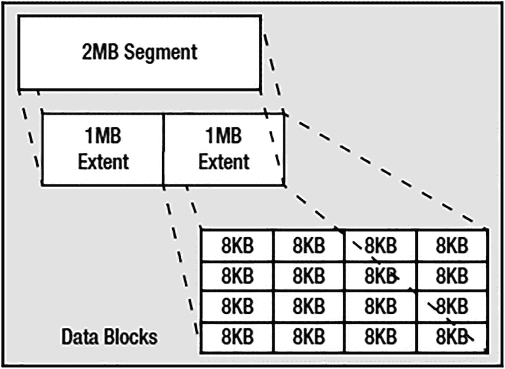
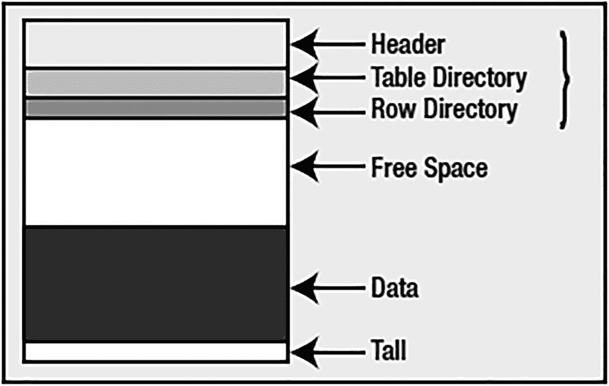
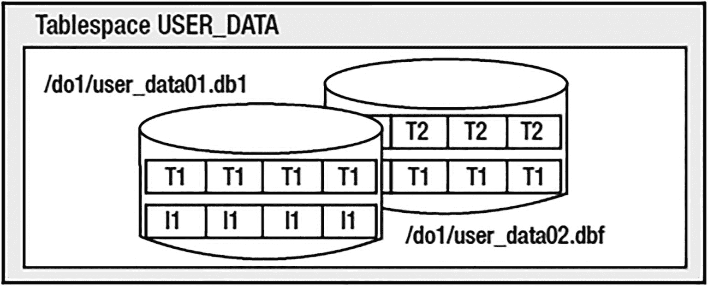
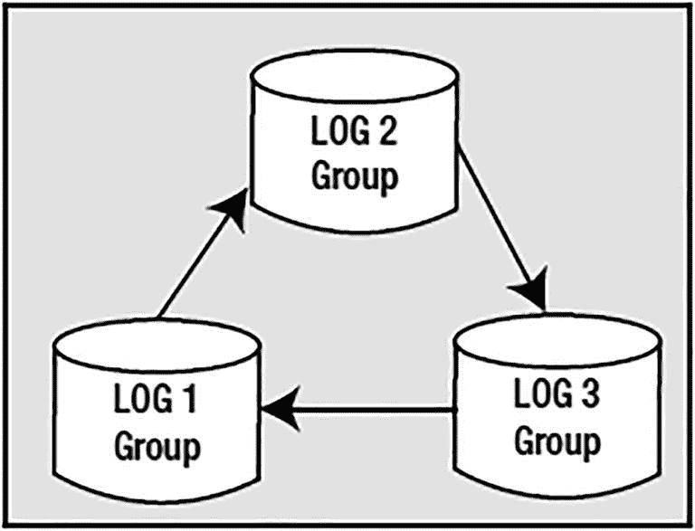

# Oracle SPFILE 与 PFILE 管理

## 参数设置

-   `sid='sid|*'` 主要用于集群环境；默认值为 `sid='*'`。此设置允许您为集群中的任何给定实例唯一指定参数设置。除非您正在使用 Oracle RAC，否则无需指定 `sid=` 设置。

-   `container=current|all` 用于多租户数据库中，以确定变更的范围。如果 `ALTER SYSTEM` 是在根容器数据库中执行的，通过使用 `all` 选项，该设置可以向下传播到每个可插拔数据库。否则，默认情况下，只有当前的容器或可插拔数据库会受到变更的影响。请注意，特定于可插拔数据库的设置不会记录在 `SPFILE` 中，而是存储在可插拔数据库的数据字典中，以便当它移动到另一个容器时，其特定设置会随之移动。

## ALTER SYSTEM 命令示例

以下命令演示了直接设置可能失败的情况以及使用 `deferred` 选项的成功设置。

```
SQL> alter system set sort_area_size = 65536;
alter system set sort_area_size = 65536
*
ERROR at line 1:
ORA-02096: specified initialization parameter is not modifiable with this option
SQL> alter system set sort_area_size = 65536 deferred;
System altered.
```

一个典型的用法可能是：

```
SQL> alter system set pga_aggregate_target=512m;
System altered.
```

> **注意**
>
> 前面的命令——实际上本书中的许多 `ALTER SYSTEM` 命令——在您的系统上可能会失败。如果您使用了与我的示例不兼容的其他设置（例如，其他内存参数），您很可能会收到错误。这并不意味着命令不起作用，而是您尝试使用的设置与您的整体配置不兼容。

更好的做法，或许是使用 `COMMENT=` 赋值来记录何时以及/或为何进行了特定更改：

```
SQL> alter system set pga_aggregate_target=512m  comment = 'AWR recommendation';
System altered.
SQL> select value, update_comment  from v$parameter  where name = 'pga_aggregate_target';
VALUE                UPDATE_COMMENT
-------------------- ----------------------------------------
536870912            AWR recommendation
```

## 取消 SPFILE 中的值设置

接下来的问题是，如何取消我们之前设置的值？换句话说，我们不再希望该参数设置出现在我们的 `SPFILE` 中。既然我们不能使用文本编辑器编辑该文件，该如何完成？这同样通过 `ALTER SYSTEM` 命令完成，但使用 `RESET` 子句：

```
Alter system reset parameter  sid='sid|*'
```

例如，如果我们想要移除 `sort_area_size` 参数，以使其采用我们之前指定的默认值，可以按如下方式操作：

```
SQL> alter system reset sort_area_size scope=spfile ;
System altered.
```

`sort_area_size` 从 `SPFILE` 中被移除，您可以通过执行以下命令来验证：

```
SQL> create pfile='/tmp/pfile.tst' from spfile;
File created.
```

然后，您可以查看 `/tmp/pfile.tst` 的内容，该文件将在数据库服务器上生成。您会发现 `sort_area_size` 参数不再存在于参数文件中。

## 从 SPFILE 创建 PFILE

我们刚刚看到的 `CREATE PFILE...FROM SPFILE` 命令与 `CREATE SPFILE` 相反。它获取二进制的 `SPFILE` 并从中创建一个纯文本文件——该文件可以在任何文本编辑器中编辑，并随后用于启动数据库。您可能会经常使用此命令做至少两件事：

-   创建一个带有特殊设置的临时参数文件，以启动数据库进行维护。因此，您会执行 `CREATE PFILE...FROM SPFILE` 并编辑生成的文本 `PFILE`，修改所需的设置。然后，您将使用 `PFILE=<FILENAME>` 选项启动数据库，以指定您的 `PFILE` 而不是 `SPFILE`。完成后，只需在不指定 `PFILE=<FILENAME>` 的情况下正常启动，数据库就会使用 `SPFILE`。

-   维护带注释的变更历史记录。过去，许多数据库管理员会在其参数文件中大量注释变更历史。例如，如果他们更改了 SGA 大小 20 次，那么在 `sga_target init.ora` 参数设置前会有 20 条注释，说明进行更改的日期和原因。`SPFILE` 不支持此功能，但如果您养成以下习惯，可以实现相同的效果：

    ```
    SQL> connect / as sysdba
    Connected.
    SQL> create pfile='init_10_feb_2021_CDB.ora' from spfile;
    File created.
    SQL> alter system set pga_aggregate_target=512m comment = 'Changed 10-feb-2021, AWR recommendation';
    System altered.
    ```

通过这种方式，您的历史记录将保存在随时间推移的一系列参数文件中。

## 修复损坏的 SPFILE

关于 `SPFILEs` 的最后一个问题是：“`SPFILEs` 是二进制文件，那么如果一个损坏了导致数据库无法启动怎么办？至少 `init.ora` 文件只是文本，我们可以编辑并修复它。” 嗯，`SPFILEs` 不应该比数据文件、重做日志文件、控制文件等更容易损坏。然而，如果发生这种情况——或者如果您在 `SPFILE` 中设置了一个不允许数据库启动的值——您有几个选择。

首先，`SPFILE` 中的二进制数据量非常小。如果您在 UNIX/Linux 平台上，一个简单的 `strings` 命令将提取出您的所有设置：

```
$ strings $ORACLE_HOME/dbs/spfile$ORACLE_SID.ora
*.audit_sys_operations=false
*.audit_trail='none'
*.commit_logging='batch'
*.commit_wait='nowait'...
```

在 Windows 上，只需使用 `write.exe`（写字板）打开该文件。写字板将显示文件中的所有清晰文本，通过简单地复制并粘贴到 `init<ORACLE_SID>.ora` 中，您可以创建一个 `PFILE` 用来启动您的实例。

如果 `SPFILE` 刚好“丢失”（无论什么原因——虽然我还没见过 `SPFILE` 消失），您还可以从数据库的警报日志中恢复参数文件的信息（稍后会详细介绍警报日志）。每次启动数据库时，警报日志都会包含一个类似以下的部分：

```
System parameters with non-default values:
processes                = 300
nls_language             = "AMERICAN"
nls_territory            = "AMERICA"
filesystemio_options     = "setall"
sga_target               = 2152M
control_files            = "/opt/oracle/oradata/CDB/control01.ctl”
db_block_size            = 8192
...

```

从这部分，您可以轻松创建一个 `PFILE`，然后使用 `CREATE SPFILE` 命令将其转换为新的 `SPFILE`。

### 可插拔数据库

可插拔数据库被设计为一组可以移动的文件，能够从一个根容器数据库转移到另一个。也就是说，我们可以拔出一个可插拔数据库，然后将其插回到同一个根容器数据库或其他根容器数据库中，从而恢复我们原始的可插拔数据库——包括所有应用模式、用户、元数据、权限、数据，甚至我们的可插拔数据库参数设置（那些非从根容器继承的设置）。这是通过将可插拔数据库特定的参数设置存储在数据字典表 `SYS.PDB_SPFILE$` 中来实现的。你可以通过以下查询查看在 PDB 级别可修改的参数：

```sql
SQL> SELECT name, value
FROM   v$system_parameter
WHERE  ispdb_modifiable = 'TRUE'
ORDER BY name;
NAME                           VALUE
------------------------------ ------------------------------
adg_account_info_tracking
allow_deprecated_rpcs
allow_rowid_column_type
approx_for_aggregation
approx_for_count_distinct
approx_for_percentile
aq_tm_processes
asm_diskstring
auto_start_pdb_services
awr_pdb_autoflush_enabled
bitmap_merge_area_size
blank_trimming
blockchain_table_max_no_drop
...
```

你可以通过使用 `ALTER SYSTEM ... CONTAINER` 子句或者连接到可插拔数据库并发出 `ALTER SYSTEM` 命令来设置 PDB 级别的参数：

```bash
$ sqlplus / as sysdba
SQL> alter session set container=pdb1;
SQL> alter system set statistics_level=all;
```

正是通过这种方式，可插拔数据库可以覆盖 `SPFILE` 中某些参数的设置，并使这些参数设置在它们从根容器数据库移动到另一个根容器数据库时随之迁移。

### 参数文件总结

在本节中，我们涵盖了管理 Oracle 初始化参数和参数文件的基础知识。我们研究了如何设置参数、查看参数值，以及如何让这些设置在数据库重启后持久化。我们探讨了两种类型的数据库参数文件：传统的 `PFILEs`（简单文本文件）和较新的 `SPFILEs`。对于所有现有数据库，推荐使用 `SPFILEs`，因为它们带来了管理的简便性和清晰度。拥有数据库参数的单一真实来源，以及 `ALTER SYSTEM` 命令能够持久化参数值的能力，使得 `SPFILEs` 成为一个极具吸引力的特性。我从它们一可用就开始使用，并且再也没有回头。

## 跟踪文件

跟踪文件是调试信息的来源。当服务器遇到问题时，它会生成一个充满诊断信息的跟踪文件。当开发者执行 `DBMS_MONITOR.SESSION_TRACE_ENABLE` 时，服务器会生成一个充满性能相关信息的跟踪文件。跟踪文件之所以对我们可用，是因为 Oracle 是一款经过大量检测的软件。所谓“检测”，我指的是编写数据库内核的程序员在其中放入了调试代码——而且是非常多的代码。他们是故意把它保留下来的。

我遇到过许多开发者，他们认为调试代码是开销——在应用程序投入生产之前必须被删除，以期徒劳地榨取代码的每一分性能。当然，后来他们发现自己的代码有错误，或者运行得没有预期的快（最终用户也往往把这称为错误；对最终用户来说，性能差*就是*一个错误）。那时，他们真心希望调试代码仍然在代码中（或者如果从未有过，那真希望曾经有过），特别是因为你不能在生产系统上随意添加调试代码。你必须在将新代码放入生产环境之前进行测试，而这并非能一蹴而就的事情。

Oracle 数据库（以及应用服务器、Oracle 应用程序和各种工具，如 Application Express (APEX)）是经过大量检测的。数据库中这种检测的迹象包括：

*   `V$` 视图：大多数 `V$` 视图包含“调试”信息。`V$WAITSTAT`、`V$SESSION_EVENT` 以及其他许多视图的存在，仅仅是为了让我们了解内核深处发生的情况。
*   `AUDIT` 命令：此命令允许你指定数据库应记录哪些事件以供后续分析。
*   资源管理器 (`DBMS_RESOURCE_MANAGER`)：此功能让你能在数据库内微观管理资源（CPU、I/O 等）。使得数据库中的资源管理器成为可能的原因是，它有权访问描述资源使用情况的所有运行时统计信息。
*   Oracle 事件：这些事件使你能够要求 Oracle 在需要时产生跟踪或诊断信息。
*   `DBMS_TRACE`：此工具在 PL/SQL 引擎内详尽地记录存储过程的调用树、引发的异常以及遇到的错误。
*   数据库事件触发器：这些触发器，例如 `ON SERVERERROR`，允许你监控和记录任何你认为是“异常”或超出常规的条件。例如，你可以记录当“临时空间不足”错误发生时正在运行的 SQL。
*   `DBMS_MONITOR`：此工具用于查看运行应用程序生成的精确 SQL、等待事件以及其他与性能/行为相关的诊断信息。SQL 跟踪功能也可以通过 10046 Oracle 事件以扩展方式使用。

检测在应用程序设计和开发中至关重要，并且 Oracle 数据库在每个版本中都变得检测得更好。Oracle 10g 通过引入自动工作负载存储库 (AWR) 和活动会话历史 (ASH) 功能，将内核中的代码检测提升到了一个全新的水平。Oracle 11g 通过诸如自动诊断存储库 (ADR) 和 SQL 性能分析器 (SPA) 等选项更进一步。Oracle 12c 则通过添加 DDL 日志来跟踪数据库中的所有 DDL 操作（这在许多典型的生产数据库日常中不应该发生），以及调试日志来跟踪数据库中的异常状况，从而更进一步。

在本节中，我们将重点讨论你可以在各种类型的跟踪文件中找到的信息。我们将涵盖它们是什么、存储在哪里以及我们能用它们做什么。

跟踪文件有两种一般类型，我们对每种类型的做法截然不同：

*   **你预期并想要的跟踪文件**：例如，这是启用 `DBMS_MONITOR.SESSION_TRACE_ENABLE` 的结果。它们包含关于你会话的诊断信息，将帮助你调整应用程序以优化其性能并诊断它所遇到的任何瓶颈。
*   **你未预料到但服务器因 ORA-00600“内部错误”、ORA-03113“通信通道文件结尾”或 ORA-07445“遇到异常”类型的错误而生成的跟踪文件**：这些跟踪文件包含的诊断信息对 Oracle 支持分析师最有用，除了能显示内部错误在我们应用程序中发生的位置外，对我们来说用途有限。

### 请求的跟踪文件

你通常预期通过启用 `DBMS_MONITOR` 或使用 10046 事件的扩展跟踪功能而生成的跟踪文件可能如下所示：

```sql
SQL> alter session set events '10046 trace name context forever, level 12';
Session altered.
```

这些跟踪文件包含诊断和性能相关信息。它们提供了对数据库应用程序内部工作原理的宝贵见解。在正常运行的数据库中，你会比看到任何其他类型的跟踪文件更频繁地看到这些跟踪文件。


#### 文件位置

无论你使用 `DBMS_MONITOR` 扩展的跟踪功能，Oracle 都会基于 `DIAGNOSTIC_DEST` 初始化参数的设置，在数据库服务器上开始生成一个跟踪文件。`DIAGNOSTIC_DEST` 所指定的目录结构如下：

```
/diag/rdbms/<db_name>/<instance_name>/
```

此位置被称为自动诊断存储库（ADR）主目录。例如，如果数据库名是 CDB，实例名也是 CDB，那么 ADR 主目录将是 `<diagnostic_dest>/diag/rdbms/cdb/CDB`。你可以通过此查询查看目录设置：

```
SQL> select name, value from v$diag_info;
AME                 VALUE
-------------------- ------------------------------------------------------
Diag Enabled         TRUE
ADR Base             /opt/oracle
ADR Home             /opt/oracle/diag/rdbms/cdb/CDB
Diag Trace           /opt/oracle/diag/rdbms/cdb/CDB/trace
Diag Alert           /opt/oracle/diag/rdbms/cdb/CDB/alert
Diag Incident        /opt/oracle/diag/rdbms/cdb/CDB/incident
Diag Cdump           /opt/oracle/diag/rdbms/cdb/CDB/cdump
Health Monitor       /opt/oracle/diag/rdbms/cdb/CDB/hm
Default Trace File   /opt/oracle/diag/rdbms/cdb/CDB/trace/CDB_ora_15884.trc
...
```

最重要的几行是：

*   `Diag Trace`：这是基于文本的警报日志和跟踪文件的存放位置。
*   `Diag Alert`：这是基于 XML 的警报日志文件的写入位置。

作为 DBA，你会花很多时间处理 `Diag Trace` 目录中的文件。这些文件在调试和维护中被频繁使用，以至于 DBA 们通常会创建别名，以便直接跳转到该目录并跟踪警报日志。例如：

```
$ alias cda='cd /opt/oracle/diag/rdbms/cdb/CDB/trace'
$ alias ta='tail -f /opt/oracle/diag/rdbms/cdb/CDB/trace/alert_CDB.log'
```

这些别名创建了用于处理这些关键文件的快捷方式。

#### 命名约定

Oracle 中跟踪文件的命名约定会不时变化，但如果你有系统中的示例跟踪文件名，很容易看出使用的模板。例如，在我的各种 UNIX/Linux 服务器上，跟踪文件名通常具有以下通用格式：

*   文件名的第一部分是 `ORACLE_SID`。
*   文件名的下一部分就是 `ora`。
*   跟踪文件名中的数字是你的专用服务器的进程 ID，可以从 `V$PROCESS` 视图中获取。

```
<ORACLE_SID>_ora_<process_id>.trc
```

跟踪文件名可以分解如下：

那么，一个用于生成你的跟踪文件名的查询可能是：

```
SQL> column trace new_val TRACE format a100
SQL> select i.value || '/' || d.instance_name || '_ora_' || a.spid || '.trc' trace
from v$process a, v$session b, v$diag_info i , v$instance d
where a.addr = b.paddr
and b.audsid = userenv('sessionid')
and i.name='Diag Trace';
TRACE

/opt/oracle/diag/rdbms/cdb/CDB/trace/CDB_ora_16908.trc
```

这仅仅表明，如果文件存在，你将能够通过该名称访问它（假设你有读取跟踪目录的权限）。以下示例生成了一个跟踪文件，展示了跟踪启用后文件是如何创建的：

```
SQL> !ls &TRACE
ls: cannot access /opt/oracle/diag/rdbms/cdb/CDB/trace/CDB_ora_16908.trc: No such file or directory
SQL> exec dbms_monitor.session_trace_enable
PL/SQL procedure successfully completed.
SQL> !ls &TRACE
/opt/oracle/diag/rdbms/cdb/CDB/trace/CDB_ora_16908.trc
```

如你所见，在我们启用该会话的跟踪之前，文件不存在；然而，一旦启用跟踪，我们就能看到它了。

如果你使用的是 Windows，显然需要将 `/` 替换为 `\`。

#### 标记跟踪文件

有一种方法可以为你的跟踪文件“打标签”，即使你没有访问 `V$PROCESS` 和 `V$SESSION` 的权限，也能找到它。假设你有读取跟踪目录的权限，你可以使用会话参数 `tracefile_identifier`。通过它，你可以在跟踪文件名中添加一个唯一标识的字符串，例如：

```
SQL> alter session set tracefile_identifier = 'Look_For_Me';
Session altered.
SQL> !ls /opt/oracle/diag/rdbms/cdb/CDB/trace/*Look_For_Me*
ls: cannot access /opt/oracle/diag/rdbms/cdb/CDB/trace/*Look_For_Me*: No such file or directory
SQL> exec dbms_monitor.session_trace_enable
PL/SQL procedure successfully completed.
SQL> !ls /opt/oracle/diag/rdbms/cdb/CDB/trace/*Look_For_Me*
/opt/oracle/diag/rdbms/cdb/CDB/trace/CDB_ora_15972_Look_For_Me.trc
/opt/oracle/diag/rdbms/cdb/CDB/trace/CDB_ora_15972_Look_For_Me.trm
```

`*` 字符是一个通配符，指示 `ls` 查找文件名中包含 `Look_For_Me` 字符串的任何文件。如你所见，跟踪文件现在以标准的 `<ORACLE_SID>_ora_<PROCESS_ID>` 格式命名，但它也关联了我们指定的唯一字符串，从而易于找到“我们”的跟踪文件名。跟踪文件以 `.trc` 为扩展名结尾。还有一个对应的跟踪映射文件（扩展名为 `.trm`），其中包含有关跟踪文件的结构信息。通常，你只对 `.trc` 文件的内容感兴趣。


### 响应内部错误生成的跟踪文件

我想用讨论另一种跟踪文件——那些我们没有预料到、由 `ORA-00600` 或其他内部错误生成的跟踪文件——来结束本节。我们能对它们做些什么呢？简而言之，通常来说，它们并不是为你我准备的。它们对 Oracle 支持团队有用。然而，当我们向 Oracle 支持提交服务请求时，它们可能会提供帮助。这一点至关重要：如果你遇到了内部错误，唯一的修正途径就是提交服务请求（SR）。如果你只是忽略它们，它们不会自行修复，除非是偶然情况。

例如，在 Oracle 10g Release 1 中，如果你创建如下表并运行查询，你很可能会遇到一个内部错误（也可能不会；它被记录为一个 Bug，并在后续的补丁版本中修复）：

```
SQL> create table t ( x int primary key );
Table created.
SQL> insert into t values ( 1 );
1 row created.
SQL> exec dbms_stats.gather_table_stats( user, 'T' );
PL/SQL procedure successfully completed.
SQL> select count(x) over ()   from t;
*
ERROR at line 2:
ORA-00600: internal error code, arguments: [12410], [], [], [], [], [], [], []
```

现在，假设你是 DBA，突然在跟踪区域出现了这个跟踪文件。或者你是开发人员，你的应用程序抛出了一个 `ORA-00600` 错误，你想查明发生了什么。那个跟踪文件里有很多信息（实际上大约有 35,000 行），但通常对你我来说没什么用。我们通常只会压缩跟踪文件，并将其作为服务请求处理的一部分上传。

一个命令行工具，结合通过 Enterprise Manager 提供的用户界面，可以让你查看 ADR 中的跟踪信息，并将其打包传输给 Oracle 支持。自动诊断仓库命令解释器（`ADRCI`）实用程序允许你查看“问题”（数据库中的关键错误）和“事件”（这些关键错误的发生实例），并将它们打包传输给支持团队。打包步骤不仅包括检索跟踪信息，还包括来自数据库警报日志的详细信息以及其他配置/测试用例信息。例如，我在我的数据库中设置了一个引发关键错误的场景。（不，我不会说是什么。你得自己制造你的关键错误。）我知道我的数据库中有一个“问题”，因为 `ADRCI` 工具是这么告诉我的：

```
$ adrci
adrci> show problem
ADR Home = /opt/oracle/diag/rdbms/cdb/CDB:
*************************************************************************
PROBLEM_ID           PROBLEM_KEY                                                 LAST_INCIDENT        LASTINC_TIME
-------------------- ----------------------------------------------------------- -------------------- ----------------------------------------
1                    ORA 700 [pga physmem limit]                                 19209                2021-02-15 00:37:58.332000 +00:00
```

最近我的数据库中发生了一个 `ORA-700` 错误。我现在可以通过执行 `show incident` 命令来查看该错误影响了什么：

```
adrci> show incident
INCIDENT_ID  PROBLEM_KEY                  CREATE_TIME
------------ ---------------------------  -------------------------
1            ORA 700 [pga physmem limit]   021-01-24 19:33:31.863000 +00:00
2402         ORA 700 [pga physmem limit]   021-01-24 19:34:50.006000 +00:00
4803         ORA 700 [pga physmem limit]   021-01-24 19:35:20.619000 +00:00
7204         ORA 700 [pga physmem limit]   021-01-24 19:42:03.463000 +00:00
9605         ORA 700 [pga physmem limit]   021-01-24 19:49:46.391000 +00:00
```

我看到有多个事件，可以通过 `show tracefile` 命令来识别与每个事件相关的信息：

```
adrci> show tracefile -I 2402
diag/rdbms/cdb/CDB/incident/incdir_2402/CDB_ora_5317_i2402.trc
```

这显示了所列事件编号对应的跟踪文件位置。此外，如果我选择的话，我可以看到关于该事件的大量详细信息：

```
adrci> show incident -mode detail -p "incident_id=2402"
ADR Home = /opt/oracle/diag/rdbms/cdb/CDB:
*************************************************************************
**********************************************************
INCIDENT INFO RECORD 1
**********************************************************
INCIDENT_ID                   2402
STATUS                        ready
CREATE_TIME                   2021-01-24 19:34:50.006000 +00:00
PROBLEM_ID                    1
CLOSE_TIME                    
FLOOD_CONTROLLED              none
ERROR_FACILITY                ORA
ERROR_NUMBER                  700
ERROR_ARG1                    pga physmem limit
...
```

最后，我可以为该事件创建一个对支持团队有用的“包”。这个包将包含支持分析师开始处理问题所需的所有信息。

本节无意成为 `ADRCI` 实用程序的全面概述或入门介绍，该工具在《*Oracle Database Utilities*》手册中有完整记录。相反，我只想介绍这个工具的存在——一个让使用跟踪文件变得轻松的工具。

当你前往 [`http://support.oracle.com`](http://support.oracle.com) 提交服务请求或搜索你遇到的问题是否已知时，这些数据库信息是很重要的。此外，你可以看到错误发生的 Oracle 实例。同时运行多个实例是很常见的情况，因此将问题隔离到单个实例是很有用的。

以下是跟踪文件中另一部分需要注意的内容：

```
*** SESSION ID:(266.55448) 2021-02-15T15:39:09.939349+00:00
*** CLIENT ID:() 2021-02-15T15:39:09.939354+00:00
*** SERVICE NAME:(SYS$USERS) 2021-02-15T15:39:09.939358+00:00
*** MODULE NAME:(sqlplus@localhost (TNS V1-V3)) 2021-02-15T15:39:09.939364+00:00
*** ACTION NAME:() 2021-02-15T15:39:09.939368+00:00
*** CLIENT DRIVER:(SQL*PLUS) 2021-02-15T15:39:09.939372+00:00
*** CONTAINER ID:(1) 2021-02-15T15:39:09.939376+00:00
```

跟踪文件的这一部分显示了 `V$SESSION` 中 `ACTION` 和 `MODULE` 列可用的会话信息。这里，我们可以看到是一个 `SQL*Plus` 会话导致了错误抛出（你和你的开发人员可以并且应该设置 `ACTION` 和 `MODULE` 信息；像 Oracle Forms 和 APEX 这样的环境已经为你做了这件事）。

此外，我们还有 `SERVICE NAME`。这是用于连接到数据库的实际服务名称——本例中是 `SYS$USERS`——表明我们不是通过 TNS 服务连接的。如果我们使用 `user/pass@CDB` 登录，我们可能会看到：

```
*** SERVICE NAME:(CDB) 2021-02-15T15:55:42.704845+00:00
```

这里，`CDB` 是服务名称（不是 TNS 连接字符串；而是它连接到的、在 TNS 监听器中注册的最终服务）。这对于追踪哪个进程或模块受此错误影响也很有用。

最后，在我们看到实际错误之前，我们可以看到会话 ID（本例中为 266）、会话序列号（本例中为 55448）以及相关的日期/时间信息（所有版本都有）作为进一步的识别信息：

```
*** SESSION ID:(266.55448) 2021-02-15T15:39:09.939349+00:00
```

从这里开始，你可以进一步深入挖掘跟踪文件，并尝试确定是什么导致了问题。其他重要的信息片段包括错误代码（通常是 600、3113 或 7445）以及与错误代码相关的其他参数。利用这些信息，加上一些显示按顺序调用的 Oracle 内部子程序集合的堆栈跟踪信息，我们或许能够找到一个已知的 Bug（以及解决方法、补丁等）。


Typically, you’ll do a Google search of any relevant error messages. If you don’t readily find an answer, you can create a service request with Oracle Support and attach the trace files to the request. Oracle Support can help you identify if you’ve hit a bug or provide options on workarounds.
通常，您会针对任何相关的错误消息进行一次 Google 搜索。如果未能迅速找到答案，您可以向 Oracle 支持创建一个服务请求，并将跟踪文件附加到该请求中。Oracle 支持可以帮助您确定是否遇到了错误，或提供变通方法的选项。

### Trace File Wrap-Up
### 跟踪文件总结

You now know the two types of general trace files, where they are located, and how to find them. Hopefully, you’ll use trace files mostly for tuning and increasing the performance of your application, rather than for filing service requests. As a last note, Oracle Support does have access to many undocumented “events” that are very useful for dumping out tons of diagnostic information whenever the database hits any error. For example, if you are getting an `ORA-01555 Snapshot Too Old` that you absolutely feel you should not be getting, Oracle Support can guide you through the process of setting such diagnostic events to help you track down precisely why that error is getting raised, by creating a trace file every time that error is encountered.
现在您已经了解了两种通用跟踪文件、它们的存放位置以及如何找到它们。希望您主要将跟踪文件用于调整和提升应用程序性能，而非用于提交服务请求。最后要说明的是，Oracle 支持确实可以访问许多未公开的“事件”，这些事件在数据库遇到任何错误时，对于转储大量诊断信息非常有用。例如，如果您遇到了一个 `ORA-01555 Snapshot Too Old` 错误，并且您确信自己本不应遇到此错误，Oracle 支持可以指导您完成设置此类诊断事件的过程，以帮助您精确追踪错误发生的原因——方法是在每次遇到该错误时创建一个跟踪文件。

## Alert Log File
## 告警日志文件

The alert file (also known as the alert log) is the diary of the database. It is a simple text file written to from the day the database is “born” (created) to the end of time (when you erase it). In this file, you’ll find a chronological history of your database—the log switches; the internal errors that might be raised; when tablespaces were created, taken offline, put back online; and so on. It is an incredibly useful file for viewing the history of a database. I like to let mine grow fairly large before “rolling” (archiving) it. The more information, the better, I believe, for this file. I will not describe everything that goes into an alert log—that’s a fairly broad topic. I encourage you to take a look at yours, however, and see the wealth of information it holds.
告警文件（也称为告警日志）是数据库的日志。这是一个简单的文本文件，从数据库“诞生”（创建）之日开始写入，直到时间尽头（当您删除它时）。在这个文件中，您会找到按时间顺序记录的数据库历史——日志切换；可能出现的内部错误；表空间何时创建、离线、重新上线；等等。对于查看数据库历史而言，这是一个极其有用的文件。我喜欢让我的文件增长到相当大之后再“滚动”（归档）。我相信，这个文件包含的信息越多越好。我不会描述告警日志中记录的所有内容——这是一个相当广泛的话题。不过，我建议您查看一下自己的告警日志，看看其中包含的丰富信息。

To determine the location of the text-based alert log for your database, run the following query:
要确定数据库基于文本的告警日志的位置，请运行以下查询：

```
SQL> select value from v$diag_info, v$instance where name = 'Diag Trace';
VALUE

/opt/oracle/diag/rdbms/cdb/CDB/trace
```

The name of the alert log will be of this format:
告警日志的名称格式如下：

```
alert_.log
```

You can generate the location and name of the alert log with the following query:
您可以使用以下查询生成告警日志的位置和名称：

```
SQL> select value || '/alert_' || instance_name || '.log' from v$diag_info, v$instance
where name = 'Diag Trace';
VALUE||'/ALERT_'||INSTANCE_NAME||'.LOG'

/opt/oracle/diag/rdbms/cdb/CDB/trace/alert_CDB.log
```

If you want to view the location of the XML-based alert log, run this query:
如果您想查看基于 XML 的告警日志的位置，请运行此查询：

```
SQL> select value from v$diag_info where name = 'Diag Alert';
```

It’s worth noting that there is an internal table, `X$DBGALERTEXT`, that you can query from `SQL*Plus` which derives its information from the alert log. This table requires `SYS` privileges to view. For example, as `SYS`, you can query the alert log for `ORA-` errors as follows:
值得注意的是，存在一个内部表 `X$DBGALERTEXT`，您可以从 `SQL*Plus` 中查询该表，其信息来源于告警日志。查看此表需要 `SYS` 权限。例如，作为 `SYS` 用户，您可以按如下方式查询告警日志中的 `ORA-` 错误：

```
$ sqlplus / as sysdba
SQL> select record_id,
to_char(originating_timestamp,'DD.MM.YYYY HH24:MI:SS'),
message_text
from x$dbgalertext
where message_text like '%ORA-%';
```

Tip
提示

Oracle Support has a note on how to edit, read, and query the alert log (Doc ID 1072547.1).
Oracle 支持有一份关于如何编辑、读取和查询告警日志的说明（文档 ID 1072547.1）。

In addition to using an external table to query the alert log, you can easily view the alert log using the `ADRCI` tool. That tool lets you find, edit (review), and monitor (interactively display new records as they appear in the alert log). Also, `Enterprise Manager` provides access to the alert log.
除了使用外部表查询告警日志外，您还可以使用 `ADRCI` 工具轻松查看告警日志。该工具允许您查找、编辑（查看）和监控（交互式显示告警日志中出现的新记录）。此外，`Enterprise Manager` 也提供了访问告警日志的途径。

Generally speaking, when the need arises to view the alert log, most DBAs will navigate directly to the alert log location. Once there, they’ll use operating system utilities such as `vi`, `tail`, and `grep` to extract information.
一般来说，当需要查看告警日志时，大多数 DBA 会直接导航到告警日志的位置。到达那里后，他们会使用操作系统实用程序（如 `vi`、`tail` 和 `grep`）来提取信息。

Tip
提示

With Oracle 19c and above, there’s also an `attention.log` file that contains information regarding critical events in your database (startup, shutdown, invalid memory parameters, and so on). It is located in the `$ORACLE_BASE/diag/rdbms/<database_name>/<instance_name>/log` directory.
对于 Oracle 19c 及更高版本，还有一个 `attention.log` 文件，其中包含有关数据库关键事件（启动、关闭、无效内存参数等）的信息。它位于 `$ORACLE_BASE/diag/rdbms/<database_name>/<instance_name>/log` 目录中。

## Datafiles
## 数据文件

Datafiles , along with redo log files, are the most important type of files in the database. This is where all of your data will ultimately be stored. Every database has at least one datafile associated with it and typically has many more than one. You can view the datafiles for your database by querying the data dictionary. The names of the datafiles will vary depending on whether you’re using RAC (with datafiles on ASM disk) and/or Oracle Managed Files (OMF). For example, here are the datafiles in a RAC container database, using ASM disks, and the OMF naming convention:
数据文件与重做日志文件一起，是数据库中最重要的文件类型。所有数据最终都将存储在这里。每个数据库至少有一个与之关联的数据文件，通常不止一个。您可以通过查询数据字典来查看数据库的数据文件。数据文件的名称会根据您是否使用 RAC（数据文件位于 ASM 磁盘上）和/或 Oracle 托管文件 (OMF) 而有所不同。例如，以下是一个 RAC 容器数据库中使用 ASM 磁盘和 OMF 命名约定的数据文件：

```
SQL> select name from v$datafile;
NAME

+DATA/CDB/DATAFILE/system.257.1064287113
+DATA/CDB/DATAFILE/sysaux.258.1064287137
+DATA/CDB/DATAFILE/undotbs1.259.1064287153
+DATA/CDB/86B637B62FE07A65E053F706E80A27CA/DATAFILE/system.265.1064287787
+DATA/CDB/86B637B62FE07A65E053F706E80A27CA/DATAFILE/sysaux.266.1064287787
+DATA/CDB/DATAFILE/users.260.1064287153
+DATA/CDB/86B637B62FE07A65E053F706E80A27CA/DATAFILE/undotbs1.267.1064287787
+DATA/CDB/DATAFILE/undotbs2.269.1064288035
+DATA/CDB/BB1C6AAC137C6A4DE0536638A8C06678/DATAFILE/system.274.1064288517
+DATA/CDB/BB1C6AAC137C6A4DE0536638A8C06678/DATAFILE/sysaux.275.1064288517
```

The prior output shows three `SYSTEM` datafiles (where the Oracle data dictionary is stored). One is for the root container database, and the other two are associated with pluggable databases. The long random string in the directory path is the GUID (unique identifier) associated with the pluggable databases when using OMF files.
前面的输出显示了三个 `SYSTEM` 数据文件（Oracle 数据字典存储于此）。一个是根容器数据库的，另外两个与可插拔数据库关联。目录路径中的长随机字符串是使用 OMF 文件时与可插拔数据库关联的 GUID（唯一标识符）。

Listed next are the datafiles in a single instance container database (not using OMF):
接下来列出的是单实例容器数据库（未使用 OMF）中的数据文件：

```
SQL> select name from v$datafile;
NAME

/opt/oracle/oradata/CDB/system01.dbf
/opt/oracle/oradata/CDB/sysaux01.dbf
/opt/oracle/oradata/CDB/undotbs01.dbf
/opt/oracle/oradata/CDB/pdbseed/system01.dbf
/opt/oracle/oradata/CDB/pdbseed/sysaux01.dbf
/opt/oracle/oradata/CDB/users01.dbf
/opt/oracle/oradata/CDB/pdbseed/undotbs01.dbf
/opt/oracle/oradata/CDB/PDB1/system01.dbf
/opt/oracle/oradata/CDB/PDB1/sysaux01.dbf
/opt/oracle/oradata/CDB/PDB1/undotbs01.dbf
/opt/oracle/oradata/CDB/PDB1/users01.dbf
/opt/oracle/oradata/CDB/PDB2/system01.dbf
/opt/oracle/oradata/CDB/PDB2/sysaux01.dbf
/opt/oracle/oradata/CDB/PDB2/undotbs01.dbf
/opt/oracle/oradata/CDB/PDB2/users01.db
```

The datafiles in this directory `/opt/oracle/oradata/CDB` belong to the root container. The datafiles in subdirectories belong to pluggable databases. Each database will usually (minimally) have the following datafiles:
此目录 `/opt/oracle/oradata/CDB` 中的数据文件属于根容器。子目录中的数据文件属于可插拔数据库。每个数据库通常（至少）具有以下数据文件：

*   `SYSTEM`: Stores the Oracle data dictionary
    *   `SYSTEM`: 存储 Oracle 数据字典

*   `SYSAUX`: Contains other non-dictionary objects
    *   `SYSAUX`: 包含其他非数据字典对象

*   `UNDO`: Stores the undo segments used for rollback operations
    *   `UNDO`: 存储用于回滚操作的撤消段

*   `USERS`: A default tablespace to be used for application data (if no other tablespace is designated)
    *   `USERS`: 一个默认表空间，用于存放应用程序数据（如果未指定其他表空间）

After a brief review of file system types, we’ll discuss how Oracle organizes these files and how data is organized within them. To understand this, you need to know what tablespaces, segments, extents, and blocks are. These are the units of allocation that Oracle uses to hold objects in the database, and I describe them in detail shortly.
在简要回顾了文件系统类型之后，我们将讨论 Oracle 如何组织这些文件以及数据如何在其中组织。要理解这一点，您需要了解什么是表空间、段、区和块。这些是 Oracle 用来在数据库中保存对象的分配单元，我将在稍后详细描述它们。

### Oracle 数据库文件系统机制简述

Oracle 中有三种用于存储数据的文件系统机制。这里所说的数据，指的是您的数据字典、重做日志、撤销日志、表、索引、大对象（LOBs）等——这些最终您所关心的数据。简而言之，它们是：

*   **“常规”操作系统文件系统**：这些文件出现在文件系统中，就像您的文字处理文档一样。您可以在 Windows 资源管理器中看到它们；在 UNIX/Linux 中，可以通过 `ls` 命令看到它们。您可以使用简单的操作系统实用工具来移动它们，例如 Windows 上的 `xcopy` 或 UNIX/Linux 上的 `cp`。从历史上看，常规操作系统文件是 Oracle 存储数据最流行的方法。在 RAC 环境中，则会使用 ASM 磁盘类型（稍后详述）。常规文件系统通常也是带缓冲的，这意味着当您读取时，操作系统会为您缓存信息，在某些写入情况下也是如此。

*   **自动存储管理**：ASM 是一种专为数据库使用而设计的文件系统。可以将其简单理解为一个数据库文件系统。您不会在这个特定的文件系统上用文本文件存储购物清单——这里只存储与数据库相关的信息：表、索引、备份、控制文件、参数文件、重做日志、归档日志等等。但即便在 ASM 中，也存在等同于数据文件的概念；从逻辑上讲，数据仍然存储在文件中，但文件系统是 ASM。ASM 设计用于单机或集群环境。从 Oracle 11g Release 2 开始，ASM 不仅提供这种数据库文件系统，还可选择提供一个集群文件系统，下文将对此进行描述。

*   **集群文件系统**：这专用于 RAC（集群）环境，提供一个在集群环境中被多个节点（计算机）共享的、类似常规文件系统的结构。传统的常规文件系统在集群环境中只能由一台计算机使用。因此，虽然您确实可以通过 NFS `挂载` 或 Samba `共享`（一种在 Windows/UNIX/Linux 环境中类似于 NFS 的磁盘共享方法）在集群的多个节点间共享一个常规文件系统，但这代表了一个单点故障。如果拥有该文件系统并执行共享的节点发生故障，该文件系统将不可用。在 Oracle 11g Release 2 之前的版本中，Oracle 集群文件系统是 Oracle 在此领域的解决方案，目前仅适用于 Windows 和 UNIX/Linux。其他第三方供应商也提供经认证的、可与 Oracle 配合使用的集群文件系统。Oracle 11g Release 2 提供了另一个选择，即 Oracle 自动存储管理集群文件系统。集群文件系统将常规文件系统的便利性带到了集群环境中。

有趣的是，一个数据库可能由来自前述任何或所有文件系统的文件组成——您无需只选择一种。您可以拥有一个数据库，其部分数据存储在传统的常规文件系统中，部分在原始分区中，部分在 ASM 中，而其他组件则在集群文件系统中。这使得从一种技术迁移到另一种技术，或者仅仅尝试新的文件系统类型（而无需将整个数据库移入其中）变得相当容易。现在，由于全面讨论文件系统及其所有详细属性超出了本书的范围，我们将重新深入探讨 Oracle 文件类型。无论文件存储在常规文件系统、原始分区、ASM 内部还是集群文件系统上，以下概念始终适用。

注意

原始分区在 Oracle 11g 中已弃用，在 Oracle 12c 中已完全不再支持。

### Oracle 数据库中的存储层次结构

数据库由一个或多个*表空间*组成。表空间是 Oracle 中的一个逻辑存储容器，位于存储层次结构的顶端，由一个或多个数据文件组成。这些文件可能是文件系统中的常规文件、原始分区、ASM 管理的数据库文件或集群文件系统上的文件。表空间包含段，如下所述。

#### 段

*段* 是表空间内的主要组织结构。段就是消耗存储空间的数据库对象——通常是表、索引、撤销段等对象。大多数时候，当您创建一个表时，您就创建了一个表段。当您创建一个分区表时，您并不是在创建一个表段，而是为每个分区创建一个段。当您创建一个索引时，通常创建一个索引段，依此类推。每个消耗存储空间的对象最终都存储在一个单独的段中。有撤销段、临时段、簇段、索引段等等。

注意

读到“每个消耗存储空间的对象最终都存储在一个单独的段中”可能会令人困惑。您会发现许多 `CREATE` 语句创建的是多段对象。困惑在于，单个 `CREATE` 语句最终可能创建包含零个、一个或多个段的对象！例如，
```
CREATE TABLE T ( x int primary key, y clob )
```
将创建四个段：一个用于 `TABLE T`，一个用于为主键创建的索引，两个用于 `CLOB`（一个段是 `LOB` 索引，另一个段是 `LOB` 数据本身）。另一方面，
```
CREATE TABLE T ( x int, y date ) cluster MY_CLUSTER
```
将创建*零*个段（在这种情况下，簇本身就是该段）。我们将在第 10 章进一步探讨这个概念。

#### 区

段由一个或多个*区*组成。区是在文件中逻辑上连续分配的一块空间。（文件本身通常在磁盘上并不是连续的；否则，我们永远不需要磁盘碎片整理工具！此外，借助独立磁盘冗余阵列等磁盘技术，您可能会发现单个文件也跨越多个物理磁盘。）传统上，每个段至少以一个区开始。Oracle 11g Release 2 引入了“延迟”段的概念——一个不会立即分配区的段，因此在该版本及后续版本中，一个段可能会推迟分配其初始区，直到数据被插入其中。当一个对象需要增长到超出其初始区时，它将请求再分配一个区给它。这第二个区不一定位于磁盘上紧邻第一个区的位置——它甚至很可能与第一个区不在同一个文件中。第二个区可能距离第一个区非常远，但区内的空间在文件中总是逻辑上连续的。区的大小从一个 Oracle 数据块（稍后解释）到数 GB 不等。


#### 区块

区段又由区块组成。区块是 Oracle 中空间分配的最小单位。你的数据行、索引条目或临时排序结果都存储在区块中。区块是 Oracle 通常从磁盘读取和写入的对象。Oracle 中的区块通常有四种常见大小：`2KB`、`4KB`、`8KB`或`16KB`（尽管在某些情况下`32KB`也是允许的；但操作系统对最大尺寸有限制）。

注意

根据 Oracle 的数据库参考文档，最小区块大小为`2048`，更大的区块大小必须是操作系统物理区块大小的倍数。

段、区段和区块之间的关系如图 3-1 所示。



图 3-1：段、区段和区块

一个段由一个或多个区段组成，而一个区段是逻辑上连续分配的一组区块。一个数据库中最多可以有六种不同的区块大小。

注意

引入这种多区块大小的特性是为了使可传输表空间能在更多情况下使用。传输表空间的能力允许数据库管理员（DBA）将一个数据库中已经格式化好的数据文件移动或复制到另一个数据库——例如，立即复制在线事务处理（OLTP）数据库中的所有表和索引到数据仓库（DW）。然而，在许多情况下，OLTP 数据库可能使用较小的区块大小，如`2KB`或`4KB`，而 DW 则使用大得多的区块（`8KB`或`16KB`）。如果单个数据库不支持多种区块大小，你将无法传输这些信息。具有多种区块大小的表空间应用于促进表空间的传输；它们通常不用于其他目的。

会有一个数据库默认区块大小，这是在执行`CREATE DATABASE`命令时在初始化文件中指定的大小。`SYSTEM`表空间始终使用此默认区块大小，但随后你可以创建具有`2KB`、`4KB``8KB`、`16KB`等非默认区块大小的其他表空间，并根据操作系统的不同，还可以使用`32KB`。区块大小的总数是六种，当且仅当你在数据库创建期间指定了非标准区块大小（不是 2 的幂）。因此，出于所有实际目的，一个数据库最多将有五种区块大小：默认大小，然后是另外四种非默认大小。

任何给定的表空间将具有一致的区块大小，这意味着该表空间中的每个区块大小相同。一个多段对象，例如带有 LOB 列的表，其每个段可能位于具有不同区块大小的表空间中，但任何给定的段（包含在表空间中）将由大小完全相同的区块组成。

大多数区块，无论其大小如何，都具有相同的一般格式，看起来类似于图 3-2。



图 3-2：区块的结构

这种格式的例外情况包括 LOB 段区块和 Exadata 存储中的混合列压缩区块等，但数据库中的绝大多数区块都将类似于图 3-2 中的格式。区块头包含有关区块类型（表区块、索引区块等）的信息、相关时的事务信息（只有受事务管理的区块才有此信息——例如，临时排序区块就不会有）以及区块在磁盘上的地址（位置）。

接下来的两个区块组件存在于最常见的数据库区块类型中，即堆组织表的区块。我们将在第 10 章更详细地介绍数据库表类型，但可以说大多数表都属于此类型。

表目录（如果存在）包含有关在该区块中存储行的表的信息（来自多个表的数据可能存储在同一个区块上）。行目录包含描述区块上行的信息。这是一个指向区块数据部分中行位置的指针数组。这三个区块部分统称为区块开销（block overhead），这是区块上用于 Oracle 管理区块本身的空间，不能用于你的数据。

剩下的两个区块部分很简单：区块上可能有空闲空间，然后通常会有当前存储数据的已用空间。

现在你已经对段（由区段组成，区段又由区块组成）有了初步了解，让我们更仔细地看看表空间，然后具体了解文件是如何融入大局的。

#### 表空间

如前所述，表空间是一个容器——它容纳段。每个段都只属于一个表空间。一个表空间内可以有许多段。一个给定段的所有区段都将在与该段关联的表空间中找到。段永远不会跨越表空间边界。一个表空间本身有一个或多个与之关联的数据文件。表空间中任何给定段的一个区段将完全包含在一个数据文件中。然而，一个段可能拥有来自许多不同数据文件的区段。图形上，一个表空间可能如图 3-3 所示。



图 3-3：一个包含两个数据文件、三个段和四个区段的表空间

图 3-3 显示了一个名为`USER_DATA`的表空间。它由两个数据文件组成：`user_data01.dbf`和`user_data02.dbf`。它分配了三个段：`T1`、`T2`和`I1`（可能是两个表和一个索引）。表空间内分配了四个区段，每个区段被描绘为逻辑上连续的一组数据库区块。段`T1`由两个区段组成，每个文件中一个区段。段`T2`和`I1`各有一个区段。如果我们需要更多此表空间的空间，我们可以调整已分配给表空间的数据文件的大小，或者我们可以向其添加第三个数据文件。

表空间是 Oracle 中的逻辑存储容器。作为开发人员，我们将在表空间中创建段。我们永远不会涉及到原始文件级别——我们不会指定希望我们的区段在特定文件中分配（我们可以，但一般不会）。相反，我们在表空间中创建对象，其余的由 Oracle 处理。如果将来某个时候，数据库管理员决定在磁盘上移动我们的数据文件以更均匀地分配 I/O，这对我们来说没问题。它不会影响我们的任何处理。

#### 存储层次结构总结

总之，Oracle 中的存储层次结构如下：

1.  一个*数据库*由一个或多个表空间组成。
2.  一个*表空间*由一个或多个数据文件组成。这些文件可以是文件系统中的普通文件、原始分区、ASM 管理的数据库文件或集群文件系统上的文件。表空间包含段。
3.  一个*段*（`TABLE`、`INDEX`等）由一个或多个区段组成。一个段存在于一个表空间中，但可能在该表空间的多个数据文件中拥有数据。
4.  一个*区段*是磁盘上逻辑上连续的一组区块。一个区段在一个表空间中，并且进一步地说，总是在该表空间内的一个文件中。
5.  一个*块*是数据库中分配的最小单位。区块是数据库在数据文件上使用的最小 I/O 单元。


## 临时文件

Oracle 中的临时数据文件（临时文件）是一种特殊类型的数据文件。当内存不足以容纳所有数据时，Oracle 会使用临时文件来存储大型排序操作和哈希操作的中间结果，以及存储全局临时表数据或结果集数据。临时表空间还可以保存在全局临时表上执行操作所产生的 `UNDO`。永久数据对象（如表或索引）永远不会存储在临时文件中，但临时表及其索引的内容会存储在其中。因此，你永远不会在临时文件中创建应用程序表，但在使用临时表时，可能会将数据存储在那里。

Oracle 以特殊方式处理临时文件。通常，你对对象所做的每次更改都会记录在重做日志中；这些事务日志可以在以后"重做事务"，例如在从故障中恢复时。临时文件被排除在此过程之外。具体来说，全局临时表（位于临时文件中）的事务永远不会为其生成 `REDO`，尽管它们可以生成 `UNDO`。因此，在使用临时表时可能会生成 `REDO`，因为 `UNDO` 总是由 `REDO` 保护，正如你将在第 9 章中详细看到的那样。为全局临时表生成的 `UNDO` 是为了支持回滚你在会话中已完成的工作，无论是由于处理数据时出错还是由于某些一般事务失败。DBA 永远不需要备份临时数据文件，事实上，尝试这样做是在浪费时间，因为你永远无法恢复临时数据文件。

注意

在 Oracle 12*c* 及以上版本中，为全局临时表生成的 `UNDO` 可以存储在临时表空间中。默认情况下，`UNDO` 会像以前的版本一样生成到永久的 `UNDO` 表空间中。可以设置一个 `init.ora` 系统级参数或 `TEMP_UNDO_ENABLED` 会话级可设置参数为 `TRUE`，以启用为全局临时表生成的 `UNDO` 存储在临时文件中。通过这种方式，这些操作将不会生成 `REDO`。我们将在第 9 章中进一步研究这一点。

真正临时文件的一个细微差别是，如果操作系统允许，临时文件将以稀疏方式创建——也就是说，它们实际上直到需要时才会消耗磁盘存储空间。你可以通过以下示例轻松看到这一点（在 Oracle Linux 上）：

```
SQL> !df -h /tmp
Filesystem            Size  Used Avail Use% Mounted on
/dev/mapper/VolGroup-lv_root
50G  6.5G   41G  14% /
SQL> create temporary tablespace temp_huge tempfile '/tmp/temp_huge.dbf' size 2g;
Tablespace created.
SQL> !df -h /tmp
Filesystem            Size  Used Avail Use% Mounted on
/dev/mapper/VolGroup-lv_root
50G  6.5G   41G  14% /
SQL> !ls -l /tmp/temp_huge.dbf
-rw-r-----. 1 oracle oinstall 2147491840 Feb 15 18:06 /tmp/temp_huge.dbf
```

注意

UNIX/Linux 命令 `df` 显示"磁盘可用"空间。该命令显示，在我向数据库添加一个 2GB 临时文件之前，包含 `/tmp` 的文件系统中有 41GB 可用空间。添加该文件后，该文件系统中*仍然*有 41GB 可用空间。

显然，保存该文件并没有占用多少存储空间。如果我们查看 `ls` 的输出，它看起来是一个正常的 2GB 文件，但实际上它目前只消耗了几千字节的存储空间。因此，即使我们只有大约 41GB 的磁盘空间可用，我们实际上可以创建数百个这样的 2GB 临时文件。听起来很棒——人人有免费存储！问题是，当我们开始使用这些临时文件并开始扩展它们时，我们会迅速遇到"没有更多空间"的错误。由于空间是按操作系统需要分配或物理分配给文件的，我们确实有可能耗尽空间（尤其是在我们创建临时文件后，其他人用其他东西填满了文件系统）。

如何解决这个问题因操作系统而异。在 UNIX/Linux 上，你可以使用 `dd` 用数据填充文件，导致操作系统为文件物理分配磁盘存储，或者使用 `cp` 创建非稀疏文件，例如：

```
SQL> !cp --sparse=never /tmp/temp_huge.dbf /tmp/temp_huge_not_sparse.dbf
SQL> !df -h /tmp
Filesystem            Size  Used Avail Use% Mounted on
/dev/mapper/VolGroup-lv_root
50G  8.5G   39G  19% /
SQL> drop tablespace temp_huge including contents and datafiles;
Tablespace dropped.
SQL> create temporary tablespace temp_huge tempfile '/tmp/temp_huge_not_sparse.dbf' reuse;
Tablespace created.
```

将稀疏的 2GB 文件复制到 `/tmp/temp_huge_not_sparse.dbf` 并使用 `REUSE` 选项使用该临时文件创建临时表空间后，我们可以确保该临时文件已分配其所有文件系统空间，并且我们的数据库实际上有 2GB 的临时空间可供使用。

注意

根据我的经验，Windows NTFS 不支持稀疏文件，而 UNIX/Linux 变体则支持。另一方面，如果你必须在 UNIX/Linux 上创建一个 15GB 的临时表空间并且支持临时文件，你会发现它发生得非常快（瞬间完成）；只需确保你有 15GB 可用空间并在心中预留出来。

## 控制文件

控制文件是相当小的文件（通常大小为几兆字节），包含 Oracle 所需的其他文件的目录。参数文件告诉实例控制文件的位置，而控制文件则告诉实例数据库和联机重做日志文件的位置。你可以通过以下方式查看控制文件的位置：

```
SQL> show parameter control_files
NAME                                 TYPE        VALUE
------------------------------------ ----------- ------------------------------
control_files                        string      /opt/oracle/oradata/CDB/control01.ctl, /opt/oracle/oradata/CDB/control02.ctl
```

控制文件还告诉 Oracle 其他信息，例如有关已发生的检查点的信息、数据库的名称（应与参数文件中的 `db_name` 参数匹配）、数据库创建时的时间戳、归档重做日志历史记录（这在某些情况下会使控制文件变大）、RMAN 信息等等。

控制文件应通过硬件（RAID）或在 RAID 或镜像不可用时由 Oracle 进行多路复用。应存在多个副本，并且副本应存储在不同的磁盘上，以避免在磁盘故障时丢失它们。丢失控制文件并不是致命的——只会使恢复变得更加困难。

控制文件是开发人员可能永远不需要实际处理的东西。对于 DBA 来说，它们是数据库的重要组成部分，但对于软件开发人员来说，它们并不真正相关。


## 重做日志文件

重做日志文件对 Oracle 数据库至关重要。它们是数据库的事务日志。这些文件通常仅用于恢复目的，但也可用于以下用途：

*   系统崩溃后的实例恢复
*   从备份中恢复数据文件后的介质恢复
*   备用数据库处理
*   输入到 GoldenGate——用于信息共享的重做日志挖掘过程（这是复制的一种高级说法）
*   允许管理员通过 Oracle LogMiner 实用程序检查历史数据库事务

它们的主要用途是在发生实例或介质故障时使用，或作为维护用于故障切换的备用数据库的方法。如果数据库机器断电导致实例故障，Oracle 将使用联机重做日志将系统恢复到断电前的确切状态。如果包含数据文件的磁盘驱动器永久故障，Oracle 将使用归档重做日志以及联机重做日志，将该驱动器的备份恢复到正确的时间点。此外，如果您“意外”删除了一个表或删除了一些关键信息并提交了该操作，您可以恢复备份，并使用这些联机和归档重做日志文件让 Oracle 将其恢复到事故发生前的那一刻。

实际上，您在 Oracle 中执行的每个操作都会生成一定量的重做信息，写入联机重做日志文件。当您向表中插入一行时，该插入的最终结果会被写入重做日志。当您删除一行时，您删除该行的事实会被记录。当您删除一个表时，该删除操作的影响会被写入重做日志。您删除的表中的数据不会被写入；但是，Oracle 为删除该表而执行的递归 SQL 确实会生成重做。例如，Oracle 将从 `SYS.OBJ$` 表（和其他内部字典对象）中删除一行，这将生成重做，并且如果启用了各种补充日志记录模式，实际的 `DROP TABLE` 语句将被写入重做日志流。

某些操作可以在生成尽可能少的重做模式下执行。例如，我可以使用 `NOLOGGING` 属性创建索引。这意味着索引数据的初始创建不会被记录，但 Oracle 代表我执行的任何递归 SQL 将被记录。例如，代表索引存在的、插入到 `SYS.OBJ$` 中的一行将被记录，所有后续使用 SQL 插入、更新和删除对索引的修改也会被记录。但是，索引结构向磁盘的初始写入将不会被记录。

我提到了两种类型的重做日志文件：联机的和归档的。我们将在接下来的章节中分别查看它们。在第 9 章，我们将结合撤销段再次研究重做，看看它们对您作为开发者有什么影响。现在，我们只关注它们是什么以及它们的目的是什么。

### 联机重做日志

每个 Oracle 数据库至少有两个联机重做日志文件组。每个重做日志组由一个或多个重做日志成员组成（重做按成员组管理）。这些组中的各个重做日志文件成员是彼此完全相同的镜像。这些联机重做日志文件大小固定，并以循环方式使用。Oracle 将写入日志文件组 1，当写完这组文件的末尾时，它将切换到日志文件组 2，并从开始到结束覆盖这些文件的内容。当填满日志文件组 2 后，它将切换回日志文件组 1（假设我们只有两个重做日志文件组；如果有三个，当然会继续到第三组）。如图 3-4 所示。


*图 3-4. 写入日志文件组*

从一个日志文件组切换到另一个的操作称为 *日志切换*。需要注意的是，在配置不当的数据库中，日志切换可能导致临时“停顿”。由于重做日志用于在故障发生时恢复事务，我们必须确保在能够再次使用某个重做日志文件之前，不再需要其内容。如果 Oracle 不确定是否不需要某个日志文件的内容，它会暂时挂起数据库中的操作，并确保该重做“保护”的缓存中的数据已安全写入（检查点）磁盘。一旦 Oracle 确认了这一点，处理将恢复，该重做文件将被重用。

我们刚刚开始讨论一个关键的数据库概念：*检查点*。要理解联机重做日志的使用方式，您需要了解一些关于检查点、数据库缓冲区缓存如何工作以及一个称为 *数据库块写入器* (`DBWn`) 的进程所做事情的知识。数据库缓冲区缓存和 `DBWn` 将在后面更详细地介绍，但现在我们稍微提前一点，先简单提一下。

数据库缓冲区缓存是临时存储数据库块的地方。这是 Oracle SGA 中的一个结构。当块被读取时，它们被存储在这个缓存中，希望这样我们以后就不必再次物理读取它们。缓冲区缓存首先是一个性能调优设备。它的存在仅仅是为了使非常缓慢的物理 I/O 过程看起来快得多。当我们通过更新其上的一行来修改一个块时，这些修改是在内存中对缓冲区缓存中的块进行的。足够用于重做或重放此修改的信息存储在重做日志缓冲区中，这是另一个 SGA 数据结构。当我们 `COMMIT` 我们的修改，使其永久化时，Oracle 不会去 SGA 中找到我们修改的所有块并将它们写入磁盘。相反，它只是将重做日志缓冲区的内容写入联机重做日志。只要那个被修改的块在缓冲区缓存中而不在磁盘上，我们就需要那个联机重做日志的内容，以防数据库发生故障。如果在提交后的瞬间断电，数据库缓冲区缓存将被清除。

如果发生这种情况，我们更改的唯一记录就在那个重做日志文件中。在数据库重新启动时，Oracle 将实际重放我们的事务，以我们相同的方式再次修改块，并为我们提交它。因此，只要那个被修改的块被缓存而没有写入磁盘，我们就不能重用（覆盖）那个重做日志文件。

这就是 `DBWn` 发挥作用的地方。这个 Oracle 后台进程负责在缓冲区缓存满时腾出空间，更重要的是，执行检查点。检查点是将脏（已修改）块从缓冲区缓存写入磁盘的操作。Oracle 在后台为我们执行此操作。许多事情都可能导致检查点发生，最常见的是重做日志切换。


